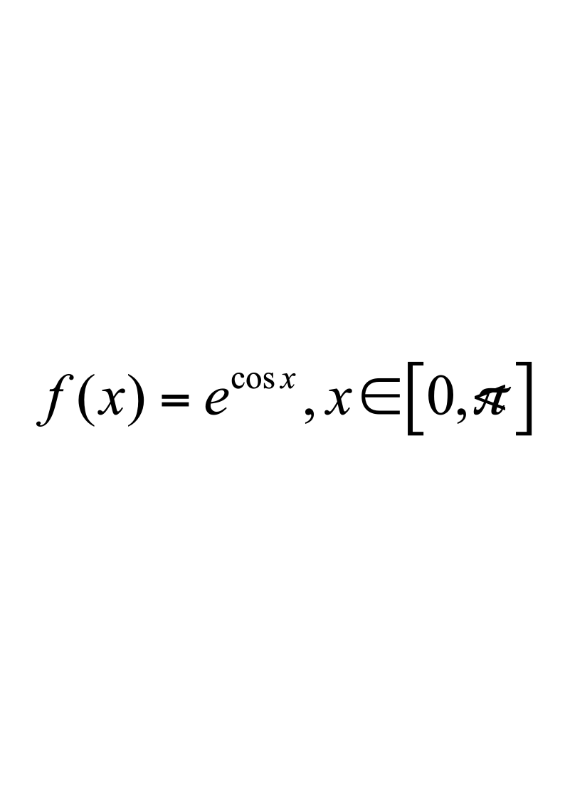
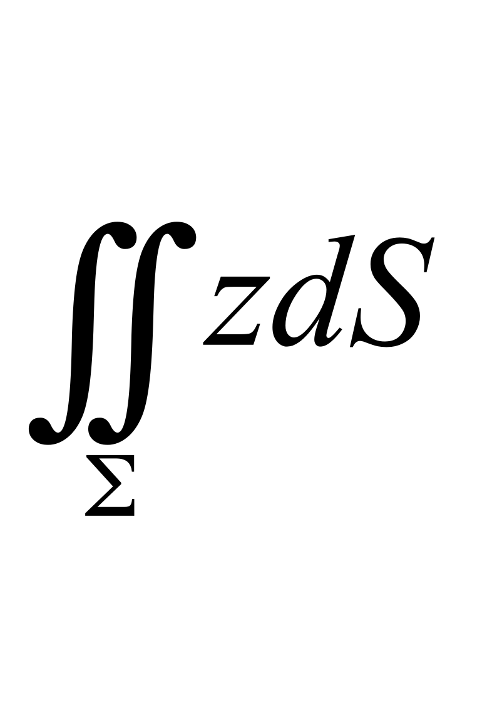
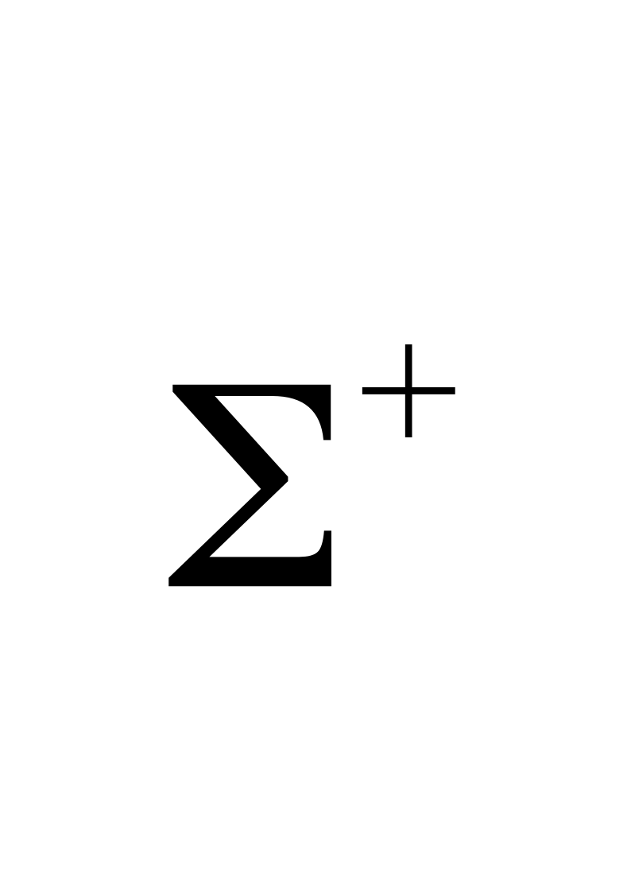
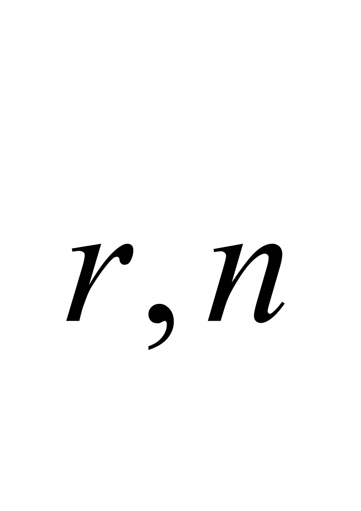
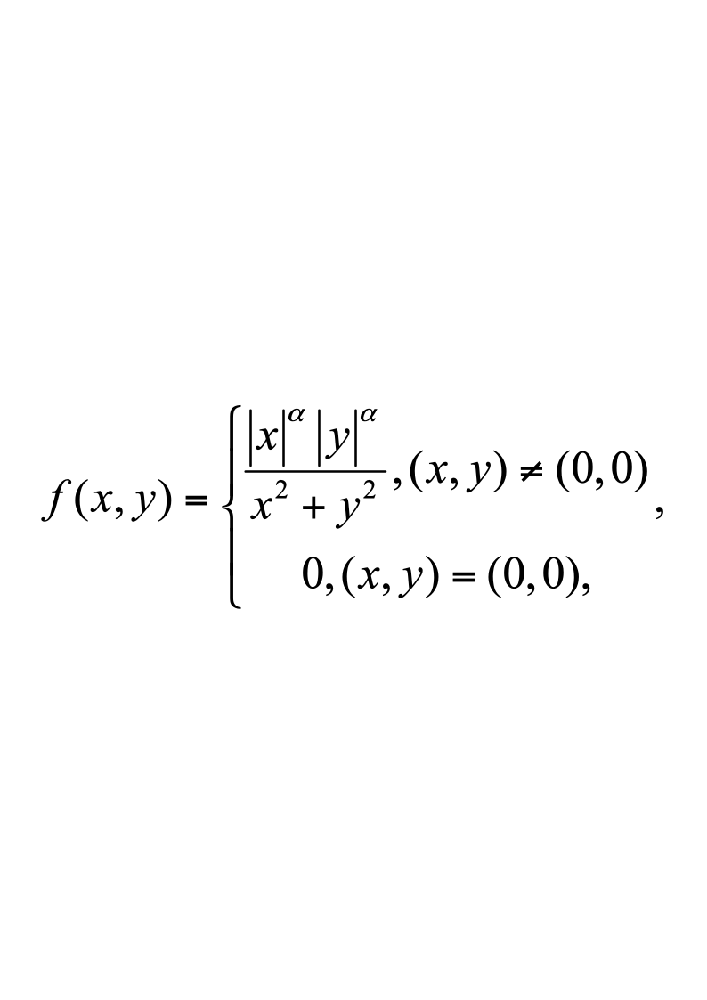

# 2019级 工科数学分析（二）B 补考用

**诚信应考，考试作弊将带来严重后果！**

**华南理工大学本科生期末考试**

**2019-2020-2学期《工科数学分析（二）》B卷**

**注意事项：1.** **开考前请将密封线内各项信息填写清楚；**

**2.** **所有答案请直接答在试卷上；**

**3．考试形式：闭卷；**

**4.** **本试卷共 （五）大题，满分100分，**	**考试时间120分钟**。

| **题 号** | **一** | **二** | **三** | **四** | **五** | **总分** |
|---|---|---|---|---|---|---|
| **得 分** |  |  |  |  |  |  |

**评阅教师请在试卷袋上评阅栏签名**

**一，填空题：共5小题，每题3分，共15分。**

**1，函数**$z=x^2+2y^2$在点$\left(\begin{array}{cc}1&1\\1&1\end{array}\right)$沿该点梯度方向的方向导数为                    ；

**2，曲线**$x=t,y=t^{2},z=t^{3}$在点$\left(\begin{array}{ccc}1&1&1\end{array}\right)$的法平面方程为                         ；

**3，函数**$z=xy$在条件$x+y=1$下的极大值为                                   ；

**4，级数**$\sum_{n=1}^{\infty}\frac{x^n}{n\cdot4^n}$的和函数为                                                ；

**5，**设为展成的以$2\pi$为周期的余弦级数的和函数，则$S(0)=$       。

**二，计算题：共5小题，每题9分，共45分。**

**1，求微分方程**$\frac{dy}{dx}=\frac{2x-y+2}{x+2y-4}$**的通解。**

**2，假设隐函数存在定理的条件都满足，且**$y(t)$**由方程组**$\begin{cases}y=f(x,t)\\x=g(y,t)\end{cases}$**确定，求**$\frac{dy}{dt}$**。**

**3，**计算$\iiint_{\Omega}\left(x^2+y^2+z^2\right)dxdydz$，其中是曲面$z=\sqrt{x^{2}+y^{2}}$与$z=\sqrt{1-x^2-y^2}$所围成的区域。

**4，计算第二类曲面积分****，其中**是球面$x^2+y^2+z^2=4$被平面$z=\sqrt{2}$截出的顶部**。**

**5，计算**$I=\iint_{\Sigma^{+}}\frac{\cos(r,n)}{r^2}dS$**，其中**为不经过$P(a,b,c)$的光滑闭曲面，方向向外，不包含点$P(a,b,c)$，$n$为曲面上任一点$M(x,y,z)$处的外法向量的单位向量，$cos(r,n)$表示两向量夹角的余弦，且$r=MP=(a-x,b-y,c-z),r=|r|=\sqrt{(a-x)^2+(b-y)^2+(c-z)^2}.$

**三，解答下列各题：共2小题，每题8分，共16分。**

**1，试确定**$alpha$的值**，使得函数**在点处可微。

2，将$\ln(1-3x+2x^2)$展成麦克劳林级数。
- **证明题：共2小题，每题8分，共16分。**

**1，设**$f$**为连续函数，****为分段光滑的简单闭曲线，证明**$\int_Cf(x^2-y^2)(xdx-ydy)=0$。

**2，证明函数项级数**$\sum_{n=1}^{\infty}\frac{(-1)^n(1-e^{-nx})}{n^2+x^2}$**在****上一致收敛。**
- **应用题：共1题，每题8分，共8分。**

**1，求点**$\left(\sqrt{2},\sqrt{2},\frac{1}{2}\right)$**到抛物面**$z=x^2+y^2$**的最小距离。**
