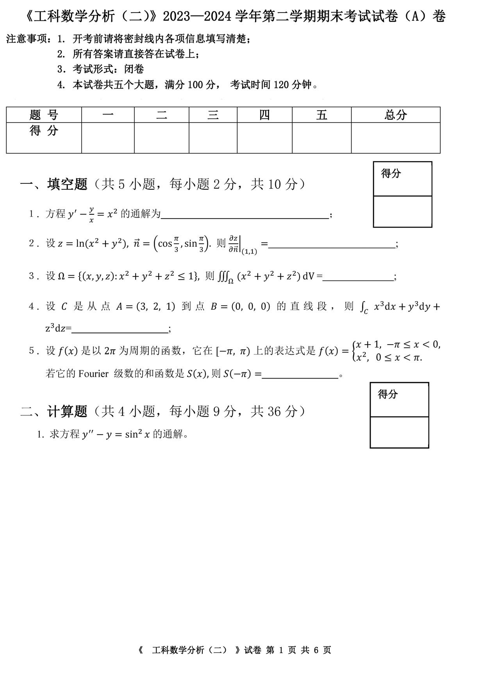
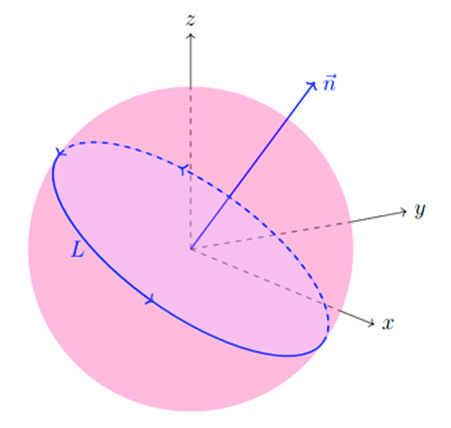

# 2023级工科数学分析下 期末考试题（A）卷

<!-- page: 1 -->

<!-- page: 2 -->

డ௭

డ௭

<!-- question: engineering-mathematical-analysis-2-042-Q1 -->

   2．设 𝑧ൌarctanሺ𝑥൅𝑦ሻ, 𝑥ൌ2𝑢െ𝑣ଶ, 𝑦ൌ𝑢ଶ𝑣, 求

డ௨,

డ௩.

<!-- question: engineering-mathematical-analysis-2-042-Q2 -->

3. 设 𝐷  是以 ሺ0, 0ሻ, ሺ𝜋, െ𝜋ሻ, ሺ𝜋, 𝜋ሻ 为顶点的三角形区域，求 ∬
cosሺ𝑥െ𝑦ሻsinሺ𝑥൅
஽

𝑦ሻd𝑥d𝑦.

《  工科数学分析（二） 》试卷 第 2 页 共 6 页

<!-- page: 3 -->

<!-- question: engineering-mathematical-analysis-2-042-Q3 -->

4. 设 Ω ⊂ℝଷ 是由曲面 𝑧ൌ5 െ𝑥ଶെ𝑦ଶ 和 𝑧൅1 ൌඥ𝑥ଶ൅𝑦ଶ 所围成的空间立体，且 Ω 内

௥⃗
‖௥⃗‖య, 其中 𝑟⃗ൌሺ𝑥, 𝑦, 𝑧ሻ. 求单位时间内流体通过 Ω 的表面 𝜕Ω 的流

布满某种流体，其流速为 𝐹⃗ൌ

量。

得分

<!-- question: engineering-mathematical-analysis-2-042-Q4 -->

三、解答题（共3 小题，每小题9 分，共27 分）

<!-- question: engineering-mathematical-analysis-2-042-Q5 -->

１. 求级数 ∑
ଶ௡ିଵ

ଶ೙
ஶ
௡ୀଵ
 的和。

《  工科数学分析（二） 》试卷 第 3 页 共 6 页

<!-- page: 4 -->

<!-- question: engineering-mathematical-analysis-2-042-Q6 -->

２. 求曲线积分 ∮
𝑦d𝑥൅𝑧d𝑦൅𝑥d𝑧,
௅
 其中 𝐿 为圆周 ൜𝑥ଶ൅𝑦ଶ൅𝑧ଶൌ𝑎ଶ,   𝑎൐0;

𝑥൅𝑦൅𝑧ൌ0,                        且从 𝑥 轴正

向看去，这个圆周取逆时针方向。

<!-- question: engineering-mathematical-analysis-2-042-Q7 -->

3．给定 d𝑢ൌ
ሺ௫ାଶ௬ሻୢ௫ା௬ୢ௬

ሺ௫ା௬ሻమ
, 试验证势函数 𝑢 的存在性，并求出 𝑢.

《  工科数学分析（二） 》试卷 第 4 页 共 6 页

<!-- page: 5 -->

得分

<!-- question: engineering-mathematical-analysis-2-042-Q8 -->

四、应用题（9 分）

𝑧ൌ𝑥ଶ൅𝑦ଶ;

求曲线 ቊ

௫              上到 𝑂𝑥𝑦 平面距离最近的点。

ଵ

𝑦ൌ

《  工科数学分析（二） 》试卷 第 5 页 共 6 页

<!-- page: 6 -->

得分

<!-- question: engineering-mathematical-analysis-2-042-Q9 -->

五、证明题（共 2 小题，每小题 9 分，共18 分）

<!-- question: engineering-mathematical-analysis-2-042-Q10 -->

1. 证明曲线 ൜𝑥ଶ൅𝑦ଶ൅𝑧ଶൌ6,
𝑥൅𝑦൅𝑧ൌ0        在点 ሺ1, െ2,1ሻ 处的法平面

方程为 𝑥െ𝑧ൌ0.

௫

௡୪୬మ௡ቁ
ஶ
௡ୀଷ
 在 ሾെ2,2ሿ 内一致收敛。

<!-- question: engineering-mathematical-analysis-2-042-Q11 -->

２. 证明级数 ∑
ln ቀ1 ൅

《  工科数学分析（二） 》试卷 第 6 页 共 6 页
