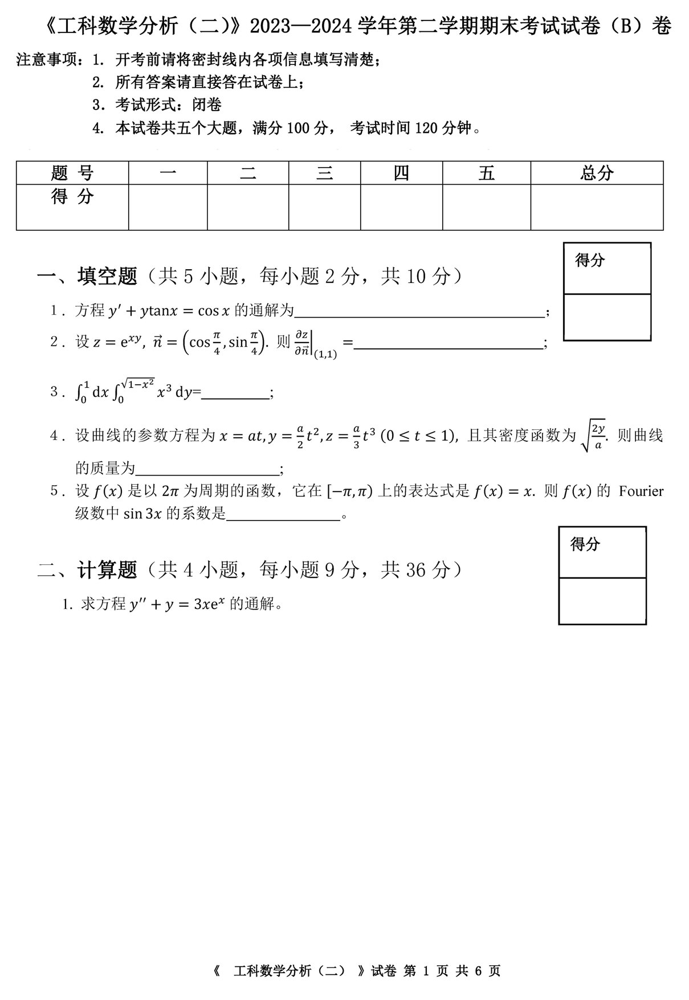
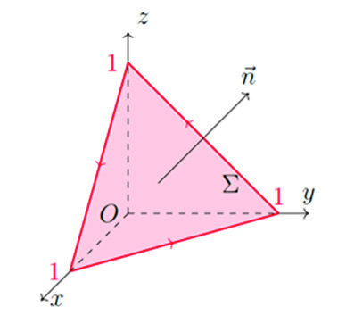

# 2023级工科数学分析下 期末考试题（B）卷

<!-- page: 1 -->

<!-- page: 2 -->

డమ௭

௫

<!-- question: engineering-mathematical-analysis-2-043-Q1 -->

   2．设 𝑧ൌsin ቀ𝑥𝑦൅

௬ቁ, 求

డ௫డ௬.

<!-- question: engineering-mathematical-analysis-2-043-Q2 -->

3. 设 𝐷 是由 𝑥ଶ൅𝑦ଶൌ9, 𝑥ଶ൅𝑦ଶൌ16 以及 𝑦ଶെ𝑥ଶൌ1, 𝑦ଶെ𝑥ଶൌ9 围成的位于第一象

限的区域，求 ∬
𝑥𝑦d𝑥d𝑦
஽
.

《  工科数学分析（二） 》试卷 第 2 页 共 6 页

<!-- page: 3 -->

<!-- question: engineering-mathematical-analysis-2-043-Q3 -->

4. 设 Ω ⊂ℝଷ 以原点为内点，且边界曲面 𝜕Ω 光滑，又设边界曲面单位外法向为 𝑛ሬ⃗, 向量场

௥⃗
‖௥⃗‖య, 其中 𝑟⃗ൌሺ𝑥, 𝑦, 𝑧ሻ. 求 ∬
𝐹⃗
డஐ
⋅𝑛ሬ⃗ d𝑠.

 𝐹⃗ൌ

得分

<!-- question: engineering-mathematical-analysis-2-043-Q4 -->

三、解答题（共3 小题，每小题9 分，共27 分）

<!-- question: engineering-mathematical-analysis-2-043-Q5 -->

１. 求级数 ∑
ଵ

ସ௡ሺସ௡ାଶሻ
ஶ
௡ୀଵ
 的和。

《  工科数学分析（二） 》试卷 第 3 页 共 6 页

<!-- page: 4 -->

<!-- question: engineering-mathematical-analysis-2-043-Q6 -->

２. 如图，设有向曲面

 Σ ൌሼሺ𝑥, 𝑦, 𝑧ሻ: 𝑥൅𝑦൅𝑧ൌ1, 𝑥൒0, 𝑦൒0, 𝑧൒0ሽ,

且其方向与 ሺ1,1,1ሻ 同向。求力场 𝐹⃗ൌሺ𝑦ଶ, 𝑧ଶ, 𝑥ଶሻ 绕 Σ 正向边界 𝜕Σ 一周所做的功。

௫d𝑥
஻
஺
൅𝜙ሺ𝑥ሻd𝑦 与路径无

<!-- question: engineering-mathematical-analysis-2-043-Q7 -->

3．已知 𝜙ሺ𝜋ሻൌ1, 试确定 𝜙ሺ𝑥ሻ, 使得曲线积分 𝐼ൌ׬ ሾsin 𝑥െ𝜙ሺ𝑥ሻሿ
௬

关，并求当 𝐴, 𝐵 两点分别为 ሺ1,0ሻ, ሺ𝜋, 𝜋ሻ 时积分 𝐼 的值。

《  工科数学分析（二） 》试卷 第 4 页 共 6 页

<!-- page: 5 -->

得分

<!-- question: engineering-mathematical-analysis-2-043-Q8 -->

四、应用题（9 分）

在力场 𝐹⃗ൌሺ𝑦𝑧, 𝑧𝑥, 𝑥𝑦ሻ 的作用下，质点由原点沿直线运动到椭球

௫మ

௬మ

௭మ

௖మൌ1 上第一卦限的点 𝑀ൌሺ𝜉, 𝜂, 𝜁ሻ. 问当 𝜉, 𝜂, 𝜁 取何值时力场 𝐹⃗ 做的功最大？最

   面

௔మ൅

௕మ൅

大值是多少？

《  工科数学分析（二） 》试卷 第 5 页 共 6 页

<!-- page: 6 -->

得分

<!-- question: engineering-mathematical-analysis-2-043-Q9 -->

五、证明题（共 2 小题，每小题 9 分，共18 分）

<!-- question: engineering-mathematical-analysis-2-043-Q10 -->

1. 证明曲线 ൜𝑥ଶ൅𝑦ଶ൅𝑧ଶെ3𝑥ൌ0,
2𝑥െ3𝑦൅5𝑧െ4 ൌ0    在点 ሺ1,1,1ሻ 处的法平面

方程为 16𝑥൅9𝑦െ𝑧െ24 ൌ0.

୪୬௡ೣ

௡యା௫మ
ஶ
௡ୀଵ
 在 ሺെ∞, ൅∞ሻ 内一致收敛。

<!-- question: engineering-mathematical-analysis-2-043-Q11 -->

２. 证明级数 ∑
sin

《  工科数学分析（二） 》试卷 第 6 页 共 6 页
