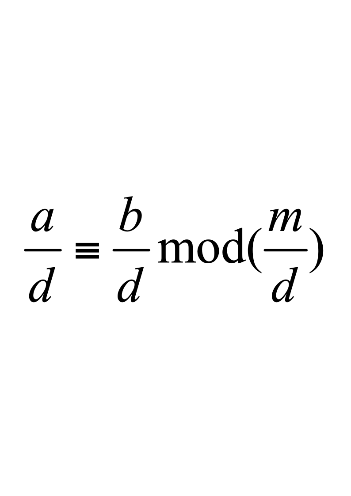
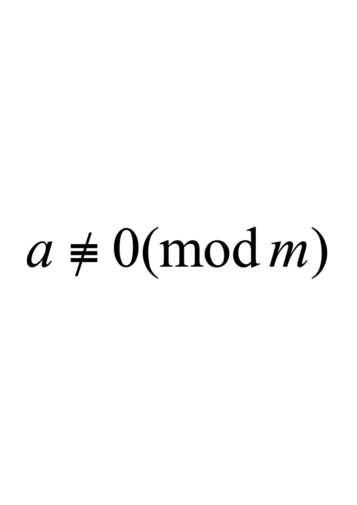

# 信息安全数学基础期末试卷

**诚信应考,考试作弊将带来严重后果！**

**华南理工大学期末考试**

**XXXX级《信息安全数学基础》试卷A**

**注意事项：1.** **考前请将密封线内填写清楚；**

**2.** **所有答案请直接答在试卷上；**

**3．考试形式：闭卷；不许使用计算器；**

**4.** **本试卷共** **四大题，满分100分，**	**考试时间120分钟**。

| **题** **号** | **一** | **二** | **三** | **四** | **总分** |
|---|---|---|---|---|---|
| **得** **分** |  |  |  |  |  |
| **评卷人** |  |  |  |  |  |

**一．**选择题(在每小题的备选答案中只有一个正确答案，将正确答案序号填入下列叙述中的括号内，选错或多选不给分)：           （每题2分，共10分）

**1．**设  *m* 是大于  1  的整数,  *a* 是满足(*a*,  *m*)＝1  的整数,则  (         )。

(1)  *a* *m* ≡*a*  (mod  ** (*m*))，               (2)    *a*** (*m*)≡*a*  (mod  *m*)，

(3)  *a* *m* ≡1 (mod  ** (*m*))，             (4) *a*** (*m*)≡1 (mod  *m*)。

**2．**设*m* 是一个正整数，*a*,  *b* 是整数，下面正确的是(　　   )。

<!-- question: information-security-mathematics-007-Q1 -->

(1)    若*ad*≡*bd*  (mod  *m*)，则 *a*≡*b*  (mod  *m*)；

<!-- question: information-security-mathematics-007-Q2 -->

(2)    若*a*≡*b* (mod  *m*) ,  则  *ak*≡*bk* (mod  *mk*)；

(3)    若*a* ≡ *b* (mod  *m*)，正整数 *d*  | (*a*,  *b*  ,  *m*)，则；

(4)    *a*≡*b*  (mod  *m*)， 如果*m* | *d*，则 *a*≡*b*  (mod  *d*)。

**3．**整数*kn*和*k*(*n*+2)的最大公因数(*kn*  ,  *k*(*n*+2))=(　　  　)。

(1)  1或2，                                       (2)     *kn* ，

(3)   *n*  或  *kn* ，                          (4)     *k*  或2 *k*  。

**4．**设 *a*＝23×32×54×116  ，*b*＝22×36×74×113，使得*a'* |  *a*，*b'* |  *b*，*a'* ×*b'*＝[*a*，*b*]，(*a'*，*b'* )＝1  的*a'*，*b'* 分别为(          )。

(1)    54  ×116  ，22×36×74，      (2)    23×54    ，36×74×113，

(3)    23×54  ×116  ，36×74，    (4)    23×54  ×116  ，36×74×113

**5．**集合*F*上定义了“＋”和“  · ”两种运算。如果(       )，则<*F*,  “＋”,“ · ”>构成一个域。

<!-- question: information-security-mathematics-007-Q3 -->

(1)    *F*对于运算“＋”和运算“  · ”都构成群，运算“  · ”对于“＋”满足分配律。

(2)    *F*对于运算  “＋”构成交换群，单位元是*e*；*F*\{*e*}对于运算“  · ”构成交换群，运算“  · ”对于“＋”满足分配律。

(3)    *F*对于运算  “＋”和  “  · ”构成交换环，运算“＋”的单位元是*e*，运算“＋”对于“  · ”满足分配律。

(4)    *F*对于运算“＋”构成交换群，单位元是*e*；*F*\{*e*}对于运算“  · ”构成交换环，运算“＋”对于“  · ”满足分配律。

**二．** 填空题(将正确答案填在        上)：（每题2分，共20分）

**1．**设*a*＝1520，*b*＝162，根据欧几里得除法，对整数*c*＝－100，存在唯一一对整数*q*＝            ，*r*＝            ，使得*a*＝*bq* ＋  *r*，*c*  *r*  <  *b*＋*c*。

**2．**如果整数*a*，*b*满足(*a*,  *b*)=1，那么(*a*＋*b*,  *a*－*b*)＝            。

**3．** *n*＝1764的欧拉函数值 **(*n*)＝______________。

**4．**模11的平方剩余是            ，模11的平方非剩余是              。

**5．**[12, 15, 21, 35]的最小公倍数是                 。

**6.** 模10的最小非负完全剩余系是                                   ，最小非负简化剩余系是                                   。

**7.** 一次同余式234*x* ≡ 72（mod 198）的解数是             。

**8.** *Q*为有理数集合，定义*Q*上的运算⊙为：对任意*a*，*b*Î*Q*，*a*⊙*b*＝(*a*＋*b*)－*a*×*b*。*Q*关于运算⊙的单位元为         ，4关于运算⊙的逆元是         。

**9.** *F*13  *＝*Z*/13*Z* \{0}＝{1, 2, 3, 4, 5, 6, 7, 8, 9, 10, 11, 12}关于运算：(*a*,  *b*)  (*a*×*b*)mod13构成群。则元素5生成的循环子群为                           ，元素5的阶为____________。

**10.** 设 *m* 是一个正整数，*a*是满足              的整数，则存在整数*a*¢，1≤*a*¢＜*m* ，使得*aa*¢≡1 (mod  *m*)。

**三．**证明题 （写出详细证明过程，4题，共30分）

**1．**设*a*,  *b*是任意两个不全为零的整数，若  *m* 是任一正整数，则(*am*,  *bm*)＝(*a*,  *b*)*m*.（7分）

**2．**如果*a*,  *b*是整数，*n*是正整数，且*a**n**b**n*，那么*a**b*。         （5分）

**3．**设  *m* 是一个正整数，*a*是满足的整数。则一次同余式*ax≡b* (mod *m*)有解的充分必要条件是(*a*  ,  *m*)*|b*。                             （10分）

**4．**设*a*,  *b*和*u*,  *v*都是不全为零的整数,  如果*a* ＝  *qu*＋*rv*， *b* ＝  *su*＋*tv*，

其中*q* ,  *r*，*s* ,  *t*是整数,且*qt*－*rs* ＝  1，则    (*a*, *b* )  ＝  (*u*, *v* )  。（8分）

**四．**计算题（写出详细计算过程，3题，共40分）

1．设*a*＝822916，*b*＝1107，运用广义欧几里得除法计算(*a*,  *b*)并求整数*s*和*t*，使得*sa*＋*tb*＝(*a*,  *b*)。                                        （10分）

**2．**1)  构造RSA公钥密码系统：取 *p*＝11,  *q*＝13,

计算*n*＝*pq*＝             ， ** (*n*)＝              。取*e*＝7。

设RSA公钥密码系统使用*N*＝26字符集：＝{*a*,  *b*,  *c*,  *d*,  *e*,  *f*, ...,  *x*,  *y*,  *z*}

**＝** {0, 1, 2, 3, ..., 24, 25}

明文信息空间由2字符组组成的集合＝ 2＝{*aa*,  *ab*,  *ac*, ... ,  *xz*,  *yz*,  *zz*}。

密文信息空间由2字符组组成的集合＝ 2＝{*aa*,  *ab*,  *ac*, ... ,  *xz*,  *yz*,  *zz*}。

2)  用广义欧几里德除法计算*d*，满足*de*≡1 (mod  ** (*n*) )(写出详细计算过程)。

3)  公钥*K**e*＝             ，私钥*K**d*＝             。

4) 求用公钥*K**e*对“*b**g*”加密后的密文(写出详细计算过程)。

（20分）

<!-- question: information-security-mathematics-007-Q4 -->

3．求17的倍数，使得该数被2, 3, 5除的余数为1。          （10分）
