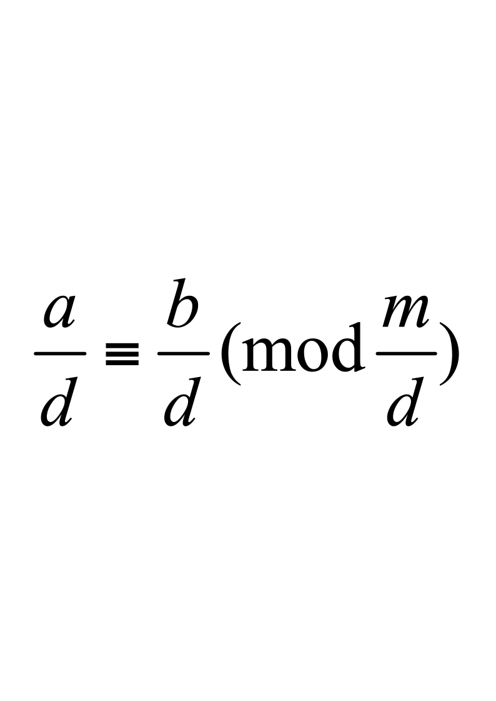

# 信息安全数学基础试卷-A

**诚信应考,考试作弊将带来严重后果！**

**华南理工大学期末考试**

**《信息安全数学基础》试卷A**

**注意事项：1.** **考前请将密封线内填写清楚；**

**2.** **所有答案请直接答在试卷上；**

**3．考试形式：闭卷；**

**4.** **本试卷共 四大题，满分100分，**	**考试时间120分钟**。

| **题 号** | **一** | **二** | **三** | **四** | **总分** |
|---|---|---|---|---|---|
| **得 分** |  |  |  |  |  |
| **评卷人** |  |  |  |  |  |

- 选择题：（每题2分，共20分）

1．设*a*,  *b*,  *c*0是三个整数，*c**a*，*c**b*，如果存在整数*s*,  *t*，使得*sa*＋*tb*＝1，则  (         )  。

(1)  (*a*,  *b*)= *c*，(2)    *c*＝ 1，(3)    *c*＝*s*，(4)    *c*＝*t* 。

<!-- question: information-security-mathematics-008-Q1 -->

2．大于20且小于70的素数有 (        )  个 。

<!-- question: information-security-mathematics-008-Q2 -->

(1)  9，(2)  10，(3)  11，(4)  15  。

<!-- question: information-security-mathematics-008-Q3 -->

3．模7的最小正完全剩余系是 (          )  。

(1) 1, 2, 3, 4, 5, 6, 7，      (2)  －6,  －5,  －4,  －3,  －2,  －1, 0，

(3)  －3,  －2,  －1, 0, 1, 2, 3，                (4)  0, 1, 2, 3, 4, 5, 6。

<!-- question: information-security-mathematics-008-Q4 -->

4．模30的简化剩余系是  (          )  。

(1)    －1, 2, 5, 7, 9, 19, 20, 29，      (2)    －1,  －7, 10, 13, 17, 25, 23, 29，

(3)  1, 7, 11, 13, 17, 19, 23, 29，    (4)  3, 7, 11, 13, 17, 19, 23, 29    。

<!-- question: information-security-mathematics-008-Q5 -->

5．设*n*是整数，则  $\sum_{d|n}\varphi(d)=$(         )  。

<!-- question: information-security-mathematics-008-Q6 -->

(1)    *d*，(2)    *n*，(3)    *nd*，(4)  2*n* 。

<!-- question: information-security-mathematics-008-Q7 -->

6．下面的集合和运算是群的是  (          )  。

<!-- question: information-security-mathematics-008-Q8 -->

(1)  <*N*，＋>  （运算“＋”是自然数集*N*上的普通加法）

<!-- question: information-security-mathematics-008-Q9 -->

(2)  <*R*，×>  （*R*是实数集，“×”是普通乘法）

<!-- question: information-security-mathematics-008-Q10 -->

(3)  <*Q*，＋>  （运算“＋”是有理数集*Q*上的普通加法）

<!-- question: information-security-mathematics-008-Q11 -->

(4)  <*P*（*S*），∪>  （*P*（*S*）是集合S的幂集，“∪”为集合的并）

<!-- question: information-security-mathematics-008-Q12 -->

7．模17的平方剩余是 (         )。

<!-- question: information-security-mathematics-008-Q13 -->

(1)  3，(2)  10，(3)  12，(4)  15

<!-- question: information-security-mathematics-008-Q14 -->

8．整数5模17的指数ord17(5)＝(         )。

<!-- question: information-security-mathematics-008-Q15 -->

(1)  3，(2)  8，(3)  16，(4)  32

<!-- question: information-security-mathematics-008-Q16 -->

9．  Fermat定理：设*p*是一个素数，则对任意整数*a*有  (         )。

(1)    *a* *p*＝1 (mod  *p*)，              (2)    *a* ** (*p*)＝1 (mod  *a*)，

(3)    *a* ** (*p*)＝*a*  (mod  *p*)，          (4)    *a* *p* ＝*a* (mod  *p*)

<!-- question: information-security-mathematics-008-Q17 -->

10．设*a*是整数，

A．*a*≡0（mod 9），B．*a*≡20××（mod 9）

C．*a*的十进位表示的各位数字之和可被9整除

D．去掉*a*的十进位表示中所有的数字9，所得的新数被9整除

以上各条件中，成为9|*a*的充要条件的共有（　　      ）。

<!-- question: information-security-mathematics-008-Q18 -->

(1)  1个， (2) 2个， (3) 3个， (4) 4个。

二． 填空题：（每题2分，共20分）

1．设*m*是正整数，*a*是满足*a*  *m*的整数，则一次同余式：*ax*  *b*  (mod  *m*)有解的充分必要条件是                  。当同余式*ax*  *b*  (mod  *m*)  有解时，其解数为                 。

<!-- question: information-security-mathematics-008-Q19 -->

2．设*m*是正整数，则*m*个数0, 1, 2,  …  ,  *m*－1中

叫做*m*的欧拉(Euler)函数，记做** (*m*)。

<!-- question: information-security-mathematics-008-Q20 -->

3．设*m*是正整数，若同余式                      有解，则*a*叫模*m*的平方剩余。

4．设*a*,  *b*是正整数，且有素因数分解  $a={p}_{1}^{{\alpha }_{1}}{p}_{2}^{{\alpha }_{2}}\cdots {p}_{s}^{{\alpha }_{s}},{\alpha }_{i}0,i=1,2,\cdots ,s$，$b={p}_{1}^{{\beta }_{1}}{p}_{2}^{{\beta }_{2}}\cdots {p}_{s}^{{\beta }_{s}},{\beta }_{i}0,i=1,2,\cdots ,s$，则(*a*,  *b*)＝                           ，

[*a*,  *b*]＝                                  。

<!-- question: information-security-mathematics-008-Q21 -->

5．如果*a*对模*m*的指数是              ，则*a*叫做模*m*的原根。

<!-- question: information-security-mathematics-008-Q22 -->

6．设*m*是一个正整数，若  *r*1,  *r*2,  …,  *r*** (*m*)是** (*m*)个

，则*r*1,  *r*2,  …,  *r*** (*m*)是模*m*的一个简化剩余系。

<!-- question: information-security-mathematics-008-Q23 -->

7．Wilson定理：设*p*是一个素数，则                              。

8．20××年1月18日是星期四，第220××0118天是星期                 。

9．(中国剩余定理)  设*m*1,  …,  *m**k*是*k*个两两互素的正整数，则对任意的整数*b*1,  …,  *b**k* 同余式组                    *x*  *b*1    (mod  *m*1)

… …  …   …

*x*  *b**k*    (mod  *m**k*)

有唯一解。令*m*＝*m*1…*m**k*，*m*＝*m**i**M**i*，*i*＝1,…,*k*，则同余式组的解为：

，

其中                                   。

10．正整数*n*有标准因数分解式为  $n={p}_{1}^{{\alpha }_{1}}\cdots {p}_{k}^{{\alpha }_{k}}$，则*n*的欧拉函数

** (*n*)＝                                                            。

三．证明题 （写出详细证明过程）：（共30分）

1．设*m*是一个正整数，*a*≡*b*（mod *m*），如果整数*d*∣(*a*,  *b*,  *m*)证明：。                                             （6分）

3．设*m*是一个正整数，*a*满足(*a*,  *m*)＝1，则存在整数*a*，1   *a*  <  *m*使得    *aa*1 (mod  *m*)。                                               （6分）

3．证明Euler定理：设*m*是大于1的正整数，如果*a*是满足(*a*,  *m*)＝1的整数。则*a*** (*m*)   1 (mod  *m*)。                                    （12分）

<!-- question: information-security-mathematics-008-Q24 -->

4．证明：设*p*和*q*是两个不相等的素数，证明：$p^{q-1}+q^{p-1}=1(modpq)$。

（6分）

四．计算题（写出详细计算过程）：（共30分）

1．设*m*＝737，*a*＝635，利用广义欧几里得除法求整数*a*，1   *a*  <  *m*使得    *aa*1 (mod  *m*)。                                          （6分）

<!-- question: information-security-mathematics-008-Q25 -->

2．设*a*＝－1859，*b*＝1573，运用广义欧几里得除法

(1)  计算(*a*,  *b*)；    (2)  求整数*s*，*t*使得*sa*＋*tb*＝(*a*,  *b*)。  （8分）

<!-- question: information-security-mathematics-008-Q26 -->

3．运用中国剩余定理和模重复平方法计算31213  (mod 667)。   （16分）
