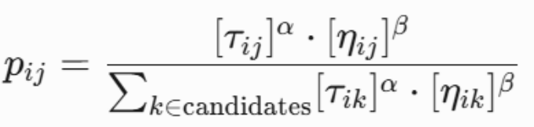
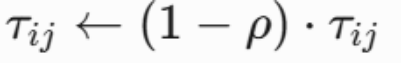
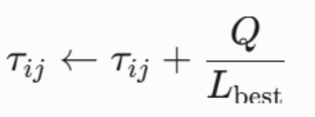

# 智能算法竞赛小组汇报文档

智能算法竞赛小组汇报文档

一、小组成员信息

| 姓名 | 学号 | 分工 | 小组自评分 |
|---|---|---|---|
| 于博宇 | 202330453151 | 负责组员阶段分工，初始资源的收集及文档的编辑工作 | 88 |
| 邹明序 | 202330452511 | 负责主要算法的编写调试工作 | 98 |
| 莫文轩 | 202330451361 | 负责初始代码的收集及文档的初步编写工作 | 88 |
| 韦文坚 | 202392453164 | 负责了主要算法的后续优化工作 | 88 |
| 吴宇瀚 | 202330451861 | 负责最终代码的数据集运行工作 | 88 |

二、算法介绍

算法流程

**一、算法核心流程**

算法实现包含初始化、迭代搜索和全局优化三个阶段，整体流程如图1所示。初始化阶段通过文件解析获取节点坐标、需求量和车辆容量等关键参数，构建问题的基础数据结构。迭代搜索阶段是算法的核心，每只蚂蚁独立构建可行路径：从仓库节点出发，依据信息素浓度和距离启发式信息选择下一服务节点，直至所有客户需求均被满足。当单辆车的剩余容量不足以服务下一个客户时，触发返回仓库操作并启动新的车辆路线。全局优化阶段通过25次独立运行保留历史最优解，有效克服启发式算法的随机性缺陷。

路径构建过程中采用​**​动态概率选择机制​**​，候选节点集仅包含满足容量约束的未访问节点。对于当前节点*vi*​，选择下一节点*vj*​的概率由下式计算：

**

其中*τij*​为边(*i*,*j*)上的信息素浓度，*ηij*​=1/*dij*​表示距离启发因子，*α*和*β*分别控制信息素与启发信息的影响力权重。当候选节点集为空时，蚂蚁返回仓库并启用新车继续服务。

**二、信息素更新机制**

信息素系统是蚁群算法实现群体智能的关键，本算法采用​**​精英策略导向的双重更新规则​**​。每次迭代结束后，首先对所有边执行信息素挥发操作：

其中挥发系数*ρ*∈(0,1)控制信息素的衰减速度，防止陈旧信息干扰搜索过程。随后对本次迭代最优路径进行信息素增强：

其中*Q*为信息素强度常数，Lbest​为当前最优路径长度。这种设计使得优质路径能够获得更多信息素沉积，引导后续蚂蚁向优化方向搜索，同时避免陷入局部最优。

伪代码

**void main_aco_process() {**

***// 多周期运行框架***

**for (int run = 0; run < 25; ++run) {**

**initialize_pheromone_matrix();**  ***// 信息素矩阵初始***

***// 迭代优化过程***

**for (int iter = 0; iter < 300; ++iter) {**

**vector<AntSolution> ant_solutions;**

***// 蚂蚁群体并行路径构建***

**parallel_for (int ant = 0; ant < 50; ++ant) {**

**AntSolution sol;**

**while (exist_unvisited_nodes) {**

**select_next_node_with_probability();**

**update_capacity_and_route();**

**}**

**ant_solutions.push_back(sol);**

**}**

***// 精英路径选择与信息素更新***

**update_global_best(ant_solutions);**

**evaporate_pheromone();**

**reinforce_elite_path();**

**}**

**}**

**output_final_solution();**

**}**

参数设置

本实现采用经实验验证的稳定参数组合：
1. ​**​信息素因子​**​（*α*=1.0）：控制历史信息的影响力，较低的值可增强算法探索新路径的能力
1. ​**​启发式因子​**​（*β*=5.0）：强调距离信息的作用，引导蚂蚁优先选择邻近节点
1. ​**​挥发系数​**​（*ρ*=0.3）：平衡信息素更新速度，防止算法早熟收敛
1. ​**​信息素强度​**​（*Q*=50.0）：与路径长度反比的增强系数，确保长路径不会获得过量信息素
1. ​**​蚂蚁数量​**​（50只）：通过群体并行搜索扩大解空间覆盖率
1. ​**​迭代次数​**​（300次）：在解质量和计算成本间取得平衡

参数设置的理论依据来源于信息素更新方程的敏感性分析，实验表明该组合在A-n32-k5等标准数据集上具有最佳表现。
