# 11. 策略学习方法pr

<!-- page: 1 -->

智能算法及应用

11. 策略学习方法
智能算法及应用@华南理工大学2025

<!-- page: 2 -->

策略学习

智能算法及应用@华南理工大学2025

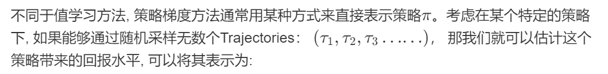

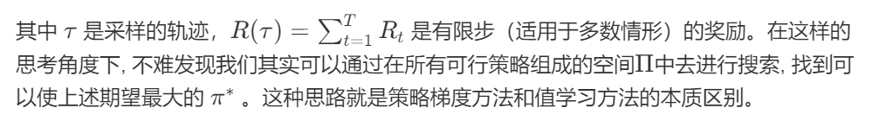

<!-- page: 3 -->

策略学习

智能算法及应用@华南理工大学2025

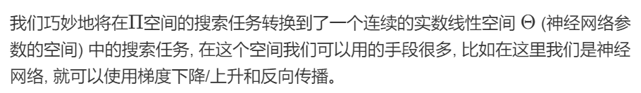

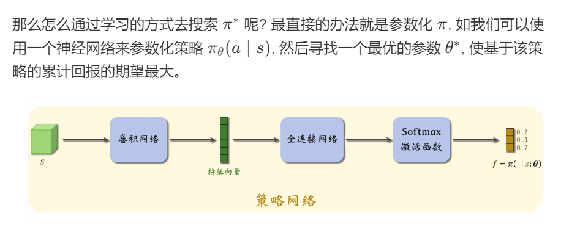

<!-- page: 4 -->

策略梯度的推导

智能算法及应用@华南理工大学2025

直接代入存在两个问题：

1. 乘积的导数计算十分复杂！

2. 在Model-Free方法中状态转移函数不可知！

<!-- page: 5 -->

策略梯度的推导

1.
智能算法及应用@华南理工大学2025

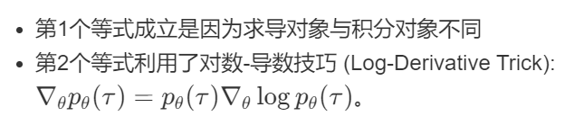

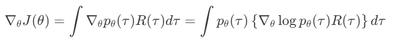

<!-- page: 6 -->

策略梯度的推导

1.

智能算法及应用@华南理工大学2025

2.

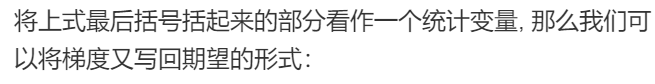

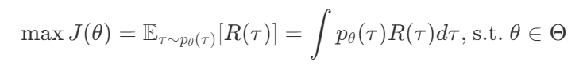

<!-- page: 7 -->

策略梯度的推导

智能算法及应用@华南理工大学2025

代入2.

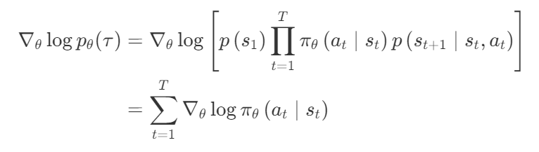

<!-- page: 8 -->

策略梯度的推导

3.

智能算法及应用@华南理工大学2025

4.

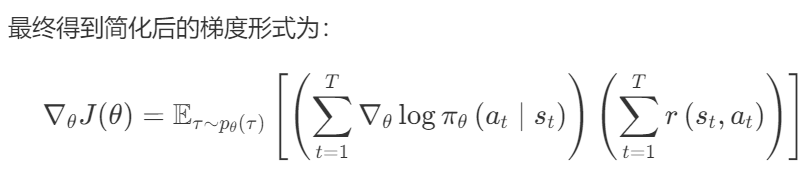

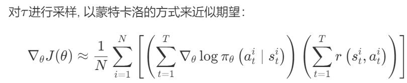

<!-- page: 9 -->

策略梯度的推导

智能算法及应用@华南理工大学2025

<!-- page: 10 -->

REINFORCE算法

智能算法及应用@华南理工大学2025

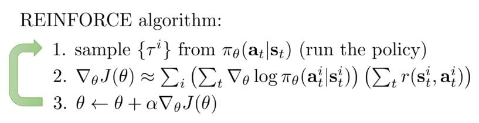

<!-- page: 11 -->

改进一：修正回报

智能算法及应用@华南理工大学2025

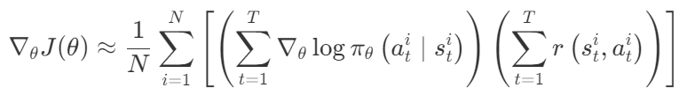

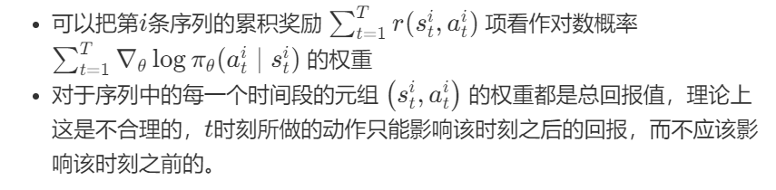

<!-- page: 12 -->

改进一：修正回报

智能算法及应用@华南理工大学2025

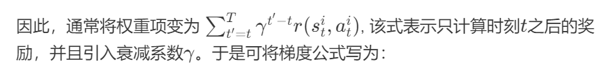

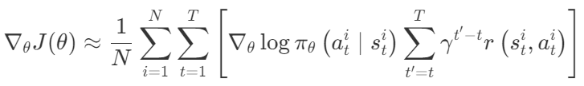

<!-- page: 13 -->

改进二：引入基线

智能算法及应用@华南理工大学2025

最简单的解决方式叫做“Baseline”。其基本
想法是采样到的累积奖励减去一个基线值，
作为“Advantage”

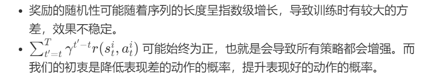

<!-- page: 14 -->

改进二：引入基线

智能算法及应用@华南理工大学2025

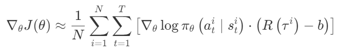

<!-- page: 15 -->

改进二：引入基线

智能算法及应用@华南理工大学2025

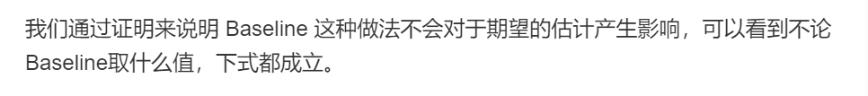

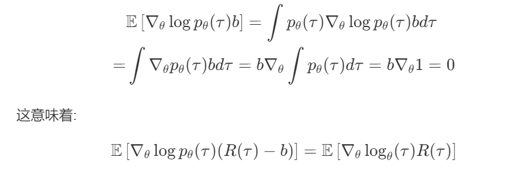

<!-- page: 16 -->

Actor-Critic

引入值函数Q

智能算法及应用@华南理工大学2025

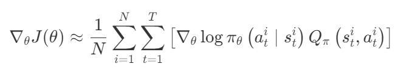

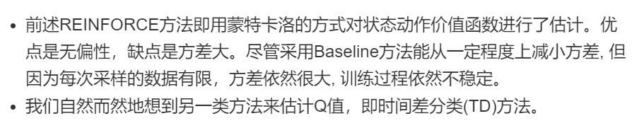

<!-- page: 17 -->

Actor-Critic

智能算法及应用@华南理工大学2025

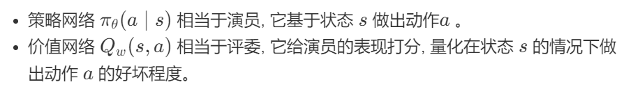

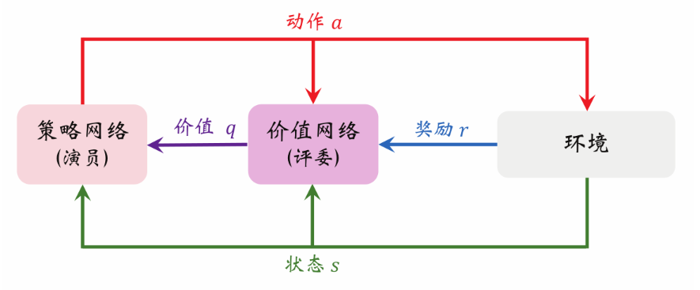

<!-- page: 18 -->

Actor-Critic

智能算法及应用@华南理工大学2025

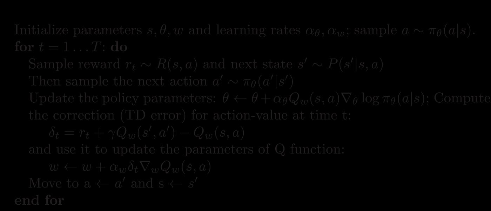

<!-- page: 19 -->

Actor-Critic

智能算法及应用@华南理工大学2025

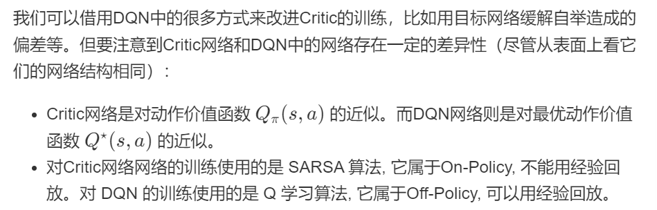

<!-- page: 20 -->

同步优势 Actor-Critic（Synchronous Advantage Actor-Critic, A2C）

智能算法及应用@华南理工大学2025

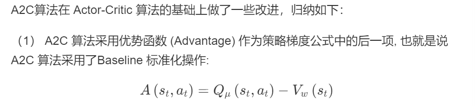

<!-- page: 21 -->

同步优势 Actor-Critic（Synchronous Advantage Actor-Critic, A2C）

智能算法及应用@华南理工大学2025

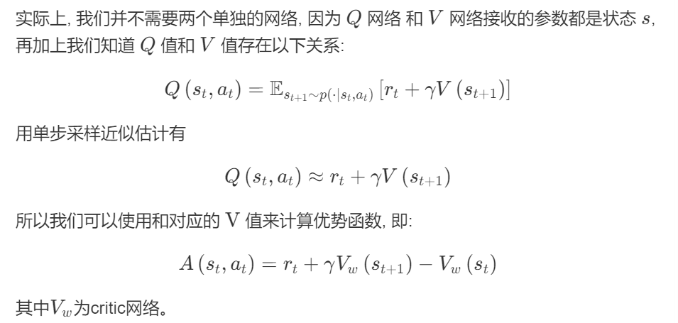

<!-- page: 22 -->

同步优势 Actor-Critic（Synchronous Advantage Actor-Critic, A2C）

智能算法及应用@华南理工大学2025

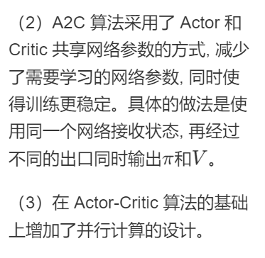

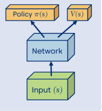

<!-- page: 23 -->

异步优势 Actor-Critic（Asynchronous Advantage Actor-Critic, A3C）

智能算法及应用@华南理工大学2025

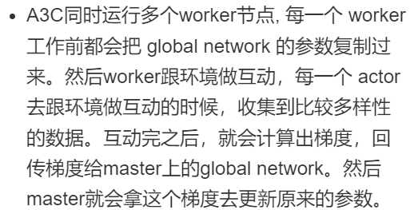

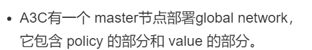

<!-- page: 24 -->

异步优势 Actor-Critic（Asynchronous Advantage Actor-Critic, A3C）

智能算法及应用@华南理工大学2025

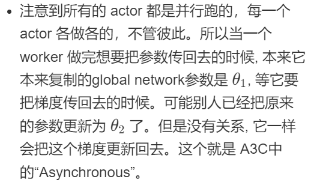

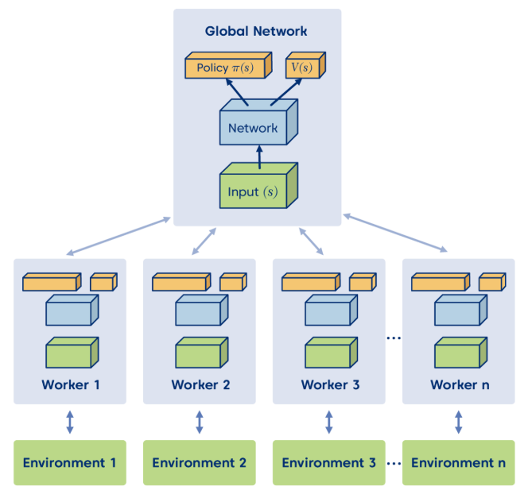
