# 13. 基于学习的优化pr

<!-- page: 1 -->

智能算法及应用

13. 基于学习的优化

<!-- page: 2 -->

算法设计
算法运行
优化结果
实际问题
问题建模

1.

2.

<!-- page: 3 -->

没有免费的午餐定理（No Free Lunch Theorem）

我们前面已经学习了非常多的优化
算法和变种……

但No Free Lunch 定理告诉我们，对
于任何优化算法，在所有可能的问
题上进行平均，其性能是一样的。
这意味着没有一个万能的优化算法
（参数）可以在所有问题上都表现
得最好。因此，为了在特定问题上
取得最优的优化效果，我们需要根
据问题的特性设计合适的算法（参
数）。

3

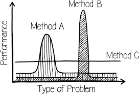

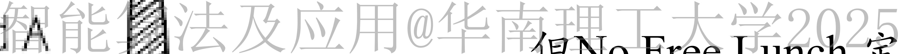

<!-- page: 4 -->

设计算法的方法

1.
Rule-based Approaches

经验法则方法基于领域专家的经验和知识，设计优化算法的规则。例如，对于某
些类型的问题，经验告诉我们某些算法设计策略通常表现较好。

简单直接；易于理解和实现
依赖于专家的经验，可能存在主观性；难以适应复杂和多变的问题

2.
Meta-learning

元学习利用机器学习方法，根据以往问题和算法的表现，设计新的优化算法。这
个过程包括特征提取、数据获取、模型训练和预测等步骤。

能够自动化设计算法，适应性强；不依赖于专家的经验
需要大量的历史数据和计算资源；模型的准确性和可靠性取决于数据质量
和模型的选择

4

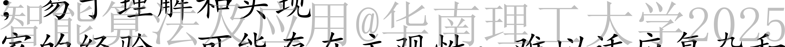

<!-- page: 5 -->

基于学习的优化（Learning to optimize, L2O）

Neural Combinatorial Optimization
利用神经网络/
深度学习直接产生组合优化问题的候选解，在近年来得到了广泛关注，
并取得了长足进步。

5

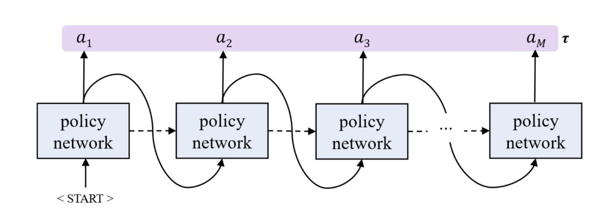

<!-- page: 6 -->

基于学习的优化（Learning to optimize, L2O）

但当我们面对的是连续空间的优化问题、尤其是复杂的黑箱优化问题时：

•
泛化性能（任务、
维度）有局限性
•
优化步长受限

Y. Chen et al. Learning to Learn without Gradient Descent by Gradient Descent, ICML 2017.

6

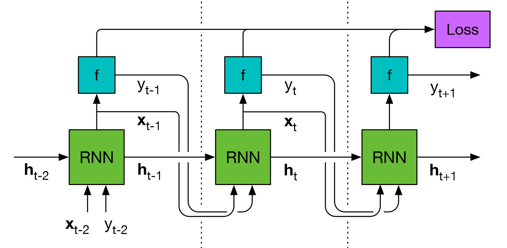

<!-- page: 7 -->

基于学习的优化（Learning to optimize, L2O）

OPRO: Optimization by Prompting

C. Yang, X. Wang, Y. Lu, H. Liu, Q. V. Le, D. Zhou, and X. Chen,
Large language models as optimizers, arXiv preprint arXiv:2309.03409, 2023.

7

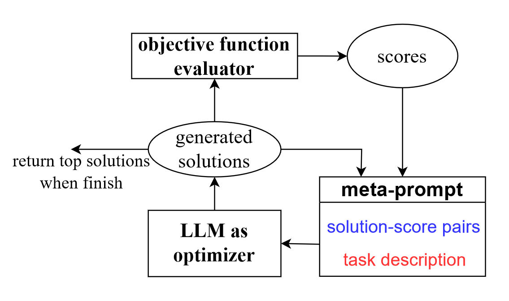

<!-- page: 8 -->

基于学习的优化（Learning to optimize, L2O）

LMEA: LLM-Driven Evolutionary Algorithm

S. Liu, C. Chen, X. Qu, K. Tang, and Y.-S. Ong, Large language models as evolutionary
optimizers, arXiv preprint arXiv:2310.19046, 2023.

8

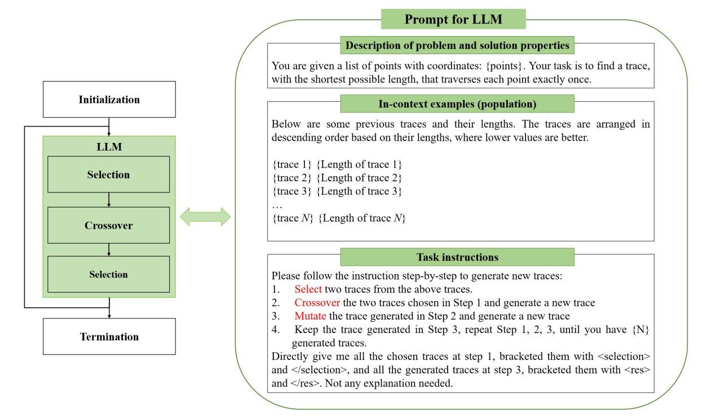

<!-- page: 9 -->

元黑箱优化（Meta-Black-Box Optimization, MetaBBO）

Mathematically:

/generation

ܦ: optimization task distribution
ߨఏ: meta level control policyܴ

௧: performance gain at lower level

9

<!-- page: 10 -->

元黑箱优化（Meta-Black-Box Optimization, MetaBBO）

从学习方式上来划分：

•
强化学习（Reinforcement Learning）

•
神经进化（Neuroevolution）

/generation

•
监督学习（Supervised Learning）

•
上下文学习（In-Context Learning）

10

<!-- page: 11 -->

元黑箱优化（Meta-Black-Box Optimization, MetaBBO）

从功能角度来划分：

•
算法选择（Algorithm Selection）

•
算法配置（Algorithm Configuration）

/generation

•
算法组装(Algorithm Composition)

•
算法生成(Algorithm Generation)

11

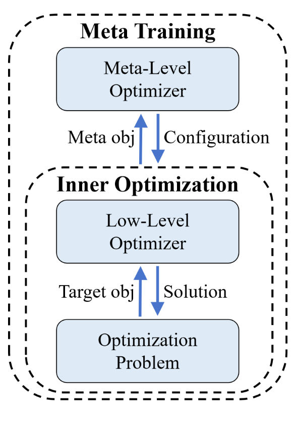

<!-- page: 12 -->

算法选择（Algorithm Selection）

RL-DAS: Reinforcement Learning based Dynamic Algorithm Selection

H. Guo (学生), Y. Ma, Z. Ma, J. Chen, X. Zhang, Z. Cao, J. Zhang, and Y.-J. Gong . Deep Reinforcement Learning for
Dynamic Algorithm Selection: A Proof-of-Principle Study on Differential Evolution, IEEE TSMC-Systems, 2024.

12

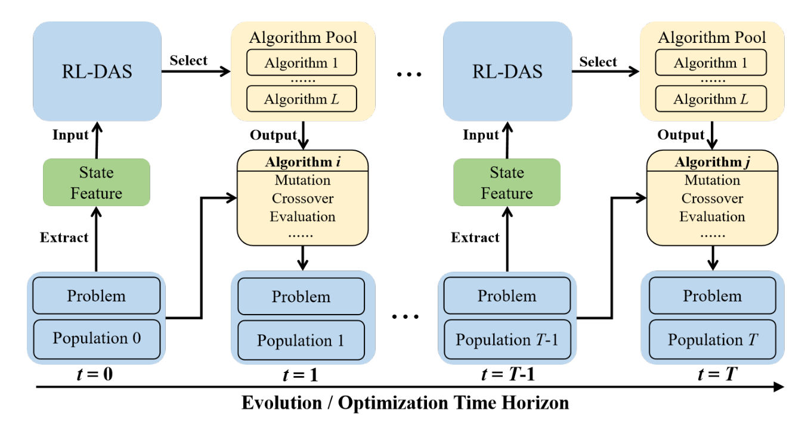

<!-- page: 13 -->

算法选择（Algorithm Selection）

13

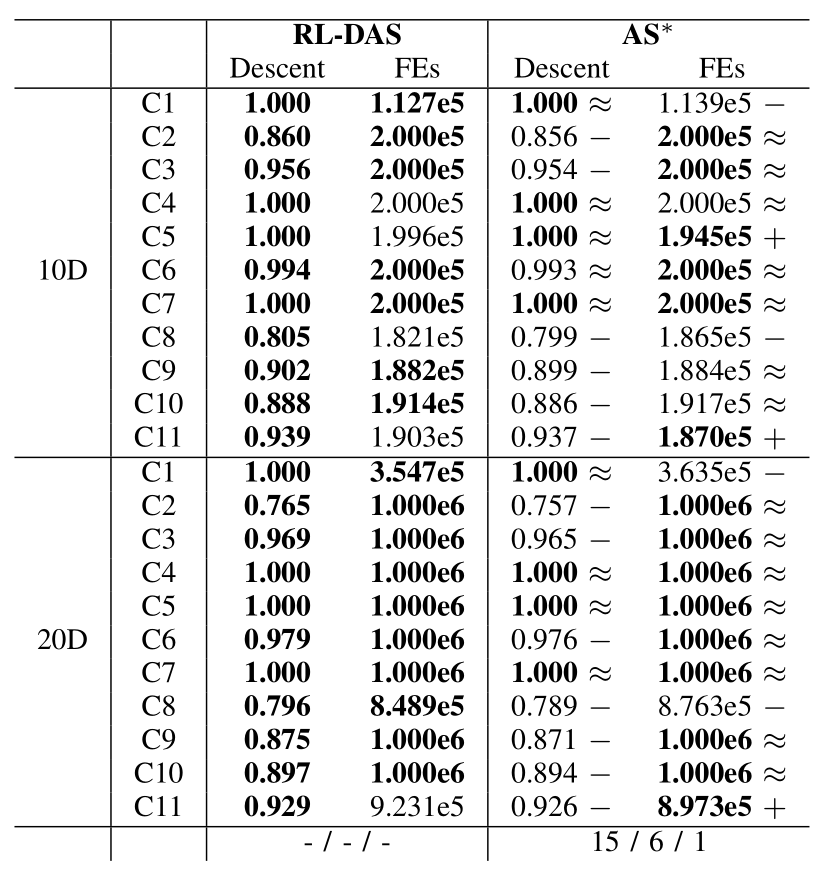

<!-- page: 14 -->

算法配置（Algorithm Configuration）

GLEET: Generalizable Learning-based Exploration-Exploitation Tradeoff

State：Optimization status

Test data

Train
data

Environment

BBO problem

Reward
Problem

DRL agent

Optimize

PBO pardigm

Action：EET configuration

基于问题集合进行训练

联合控制种群中个体
（网络每步输出NxM个参数）

Z. Ma (学生), J. Chen, H. Guo, Y. Ma, Y.-J. Gong, “Auto-configuring Exploration-Exploitation Tradeoff in
Evolutionary Computation via Deep Reinforcement Learning,” GECCO 2024.

14

<!-- page: 15 -->

算法配置（Algorithm Configuration）

15

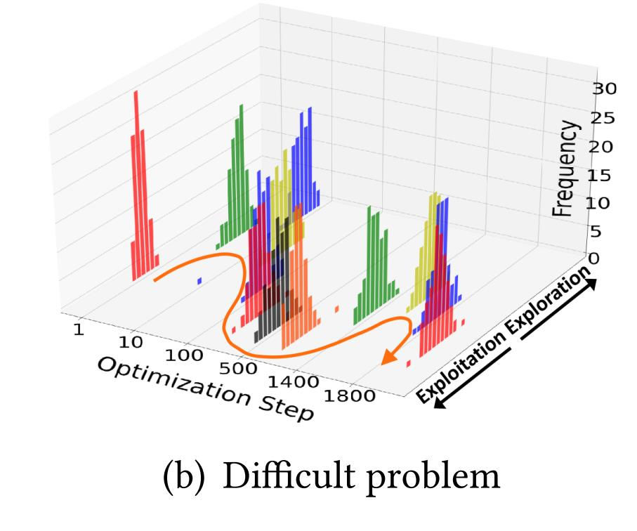

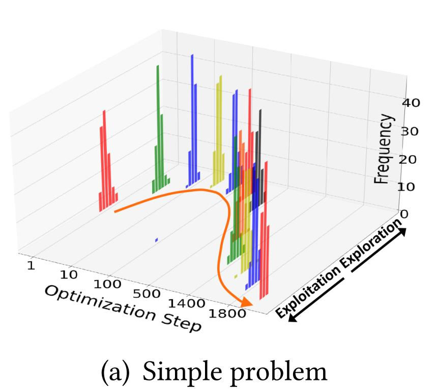

<!-- page: 16 -->

算法组装(Algorithm Composition)

ALDe: Autoregressive Learning-based Designer

Q. Zhao, T. Liu, B. Yan, Q. Duan, J. Yang, Y. Shi. Automated Metaheuristic Algorithm Design with Autoregressive
Learning. arXiv preprint arXiv:2405.03419, 2024.

16

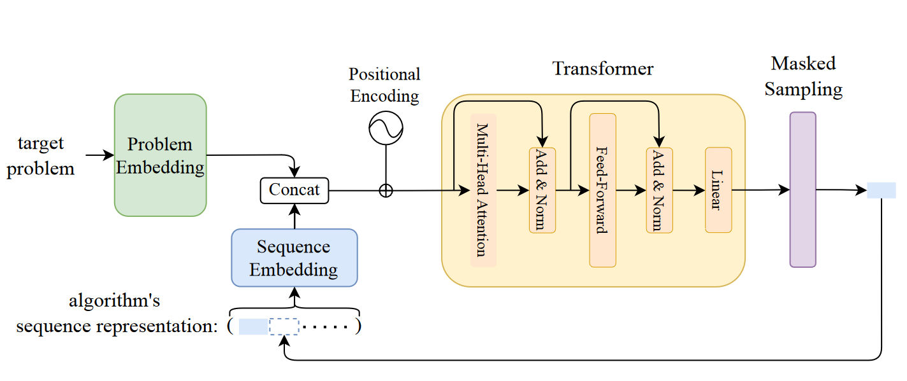

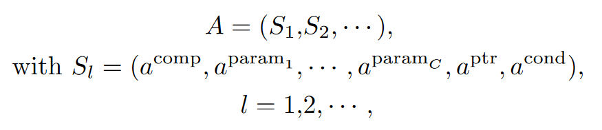

<!-- page: 17 -->

算法组装(Algorithm Composition)

17

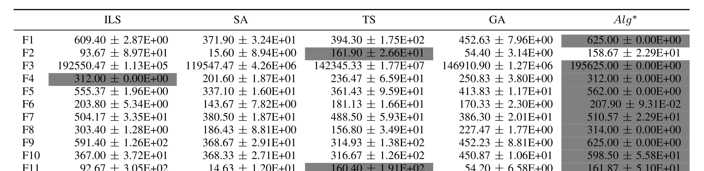

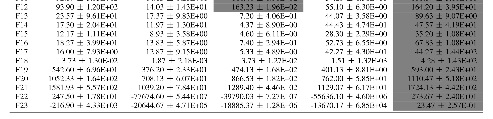

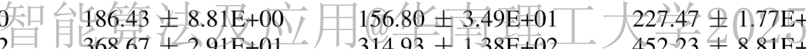

<!-- page: 18 -->

算法生成(Algorithm Generation)

SYMBOL: Generating Symbolic Equations for Black-Box Optimizer Learning

Traditional BBO optimizer

General workflow

of BBO optimizer

Human-

ݔ௧ݔ௧ାଵ

crafted

rules

ݔ௧

动态
算法迭代公式：
•
不依赖专家先验
•
更好的灵活性和自适应性
•
更好的可解释性
•
更好的可扩展性

MetaBBO for Auto-Configuration

Human-

Config

Neural
Network

Update

ݔ௧ݔ௧ାଵ

crafted

rule

rules

MetaBBO for Candidate Solution Proposal

ݔ௧ାଵ

Neural
Network

ݔ௧ݔ௧ାଵ

No

Terminate?

SYMBOL

Yes

symbolic update rule

Neural
Network
x* - 0.18 xr

ݔ௧ݔ௧ାଵ

J. Chen (学生), Z. Ma, H. Guo, Y. Ma, J. Zhang,
and Y.-J. Gong, SYMBOL: Generating Flexible
Black-Box Optimizers through Symbolic
Equation Learning, ICLR 2024.

ݔ∗

⨁

18

<!-- page: 19 -->

算法生成(Algorithm Generation)

19

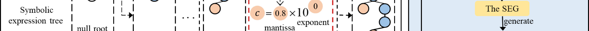

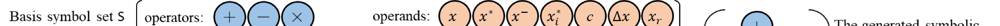

<!-- page: 20 -->

算法生成(Algorithm Generation)

Fitness Landscape Analysis

20

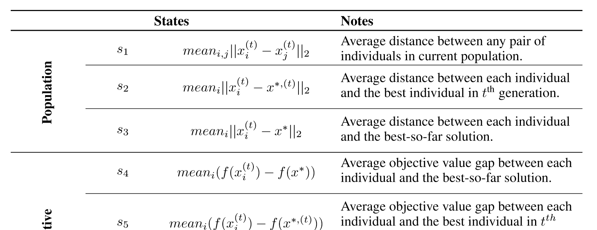

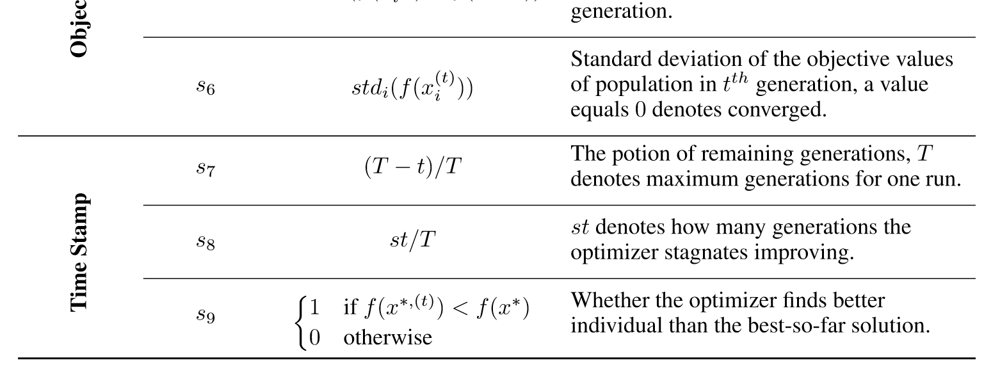

<!-- page: 21 -->

算法生成(Algorithm Generation)

Vectorized Tree Embedding
Symbol Set

operators:

＋
－
×

∗
c
∆ݔ
ݔ௥

ݔ
ݔ∗ݔ௜

operands:ݔି

The symbols are sufficient for deriving
many well-known optimizers such as

DE:

PSO:

21

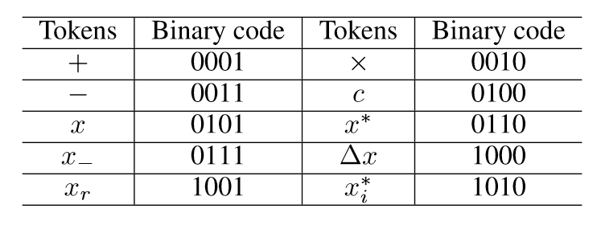

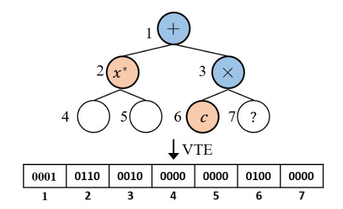

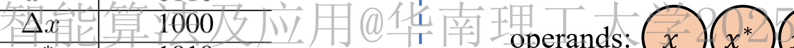

<!-- page: 22 -->

算法生成(Algorithm Generation)

Masks for streamlined generation

Constance Inference

c

＋

Infer the concrete

5
2

constant value

on-the-fly

＋

LSTM

x
-

FF
layer

FF
layer

VTE

x

...

0.8
0ܿ
=
10
´

Set the violated tokens
with a sample probability of 0.

mantissaexponent

22

<!-- page: 23 -->

算法生成(Algorithm Generation)

23

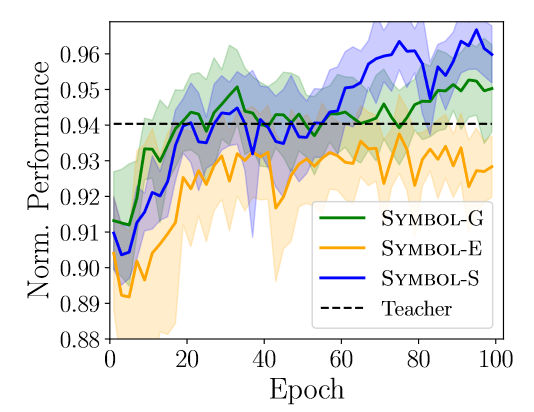

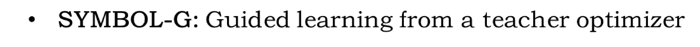

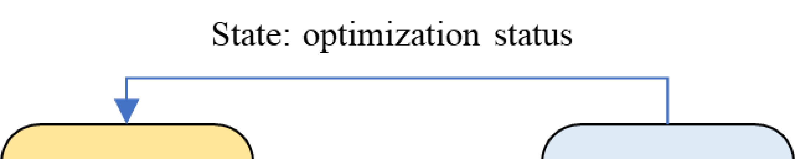

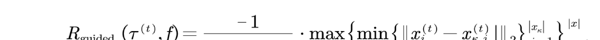

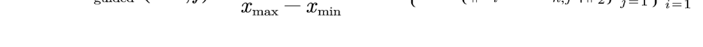

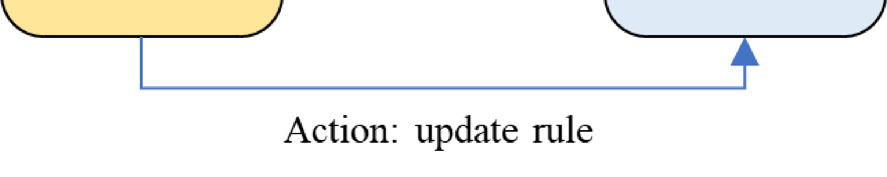

<!-- page: 24 -->

算法生成(Algorithm Generation)

24

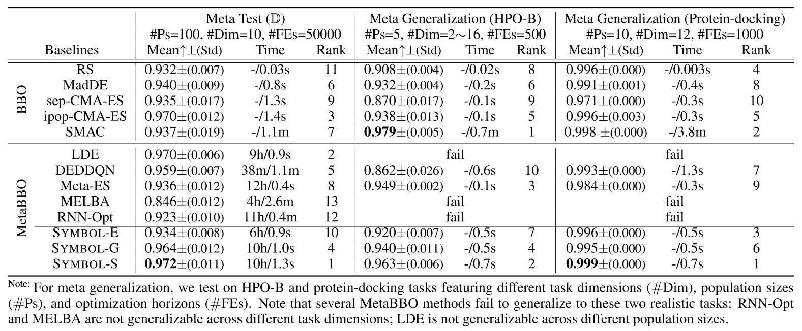

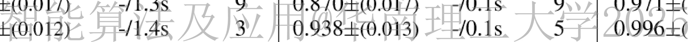

<!-- page: 25 -->

算法生成(Algorithm Generation)

25

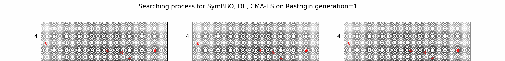

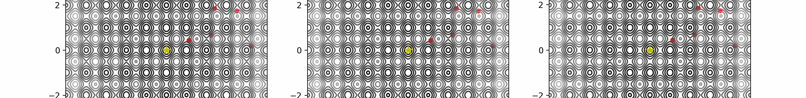

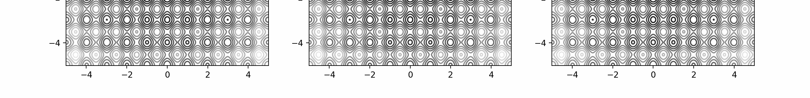

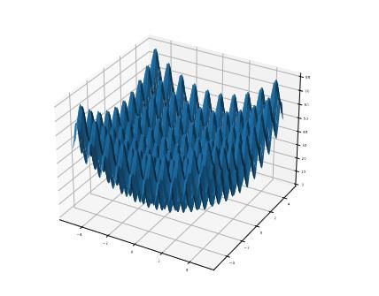

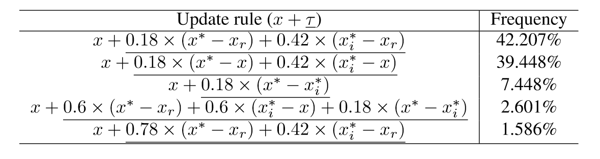

<!-- page: 26 -->

算法生成(Algorithm Generation)

26

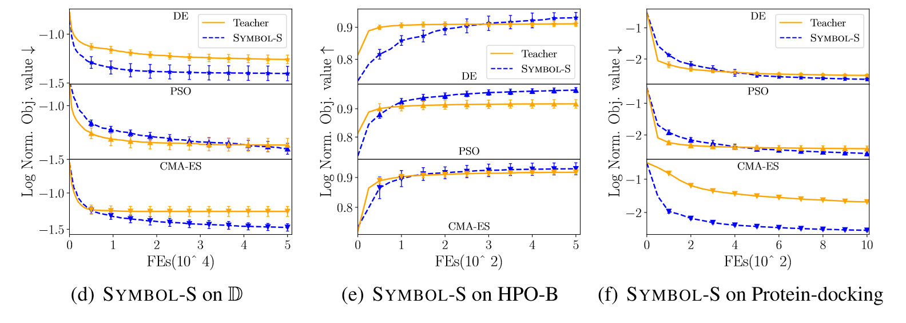

<!-- page: 27 -->

如何给问题和优化状态自动提取特征？

NeurELA: Neural Exploratory Landscape Analysis

RL Agent (meta level)

state
(optimization state)

action
(algorithm settings)
reward
(feedback signal)

optimization

loop

BBO
Algorithm
BBO
Problem

Environment (lower level)

Z. Ma (学生), J. Chen, H. Guo, Y.-J. Gong, "Neural Exploratory Landscape Analysis for Meta-Black-
Box-Optimization," ICLR 2025.

<!-- page: 28 -->

如何给问题和优化状态自动提取特征？

NeurELA: Neural Exploratory Landscape Analysis

We adopt Fast-CMA-ES to evolve a population of NeurELA networks.

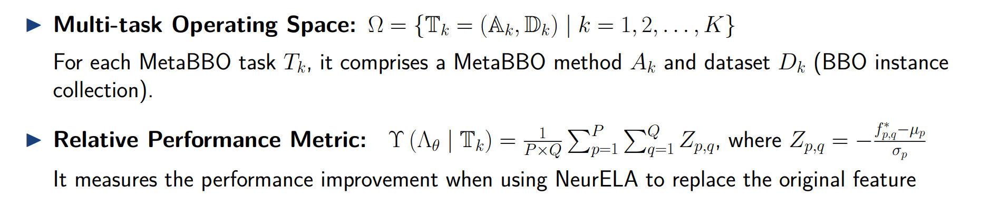

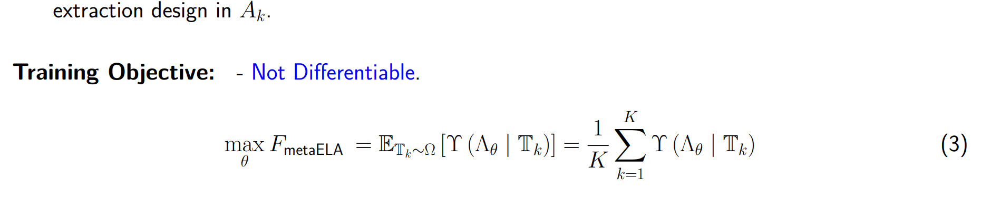

<!-- page: 29 -->

如何给问题和优化状态自动提取特征？

NeurELA: Neural Exploratory Landscape Analysis

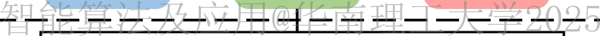

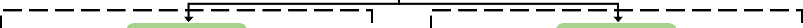

<!-- page: 30 -->

如何给问题和优化状态自动提取特征？

NeurELA: Neural Exploratory Landscape Analysis

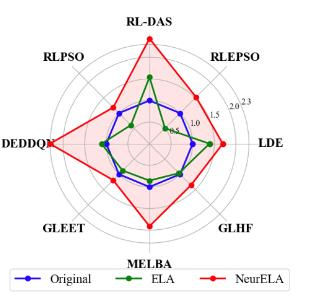

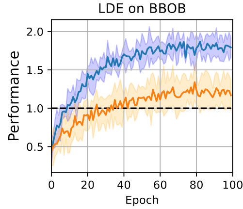

<!-- page: 31 -->

如何用好大模型？

LLaMoCo: Large Language Models for optimization Code generation

•
LLaMoCo-S: CodeGen-Mono(350M)
•
LLaMoCo-M: Phi-2(2.7B)
•
LLaMoCo-L: CodeLlama(7B)

Z. Ma (学生), H. Guo, Ji. Chen, G. Peng, Z. Cao, Y.
Ma, Y.-J. Gong, LLaMoCo: Instruction Tuning of
Large Language Models for Optimization Code
Generation, arXiv preprint arXiv:2403.01131, 2024.

31

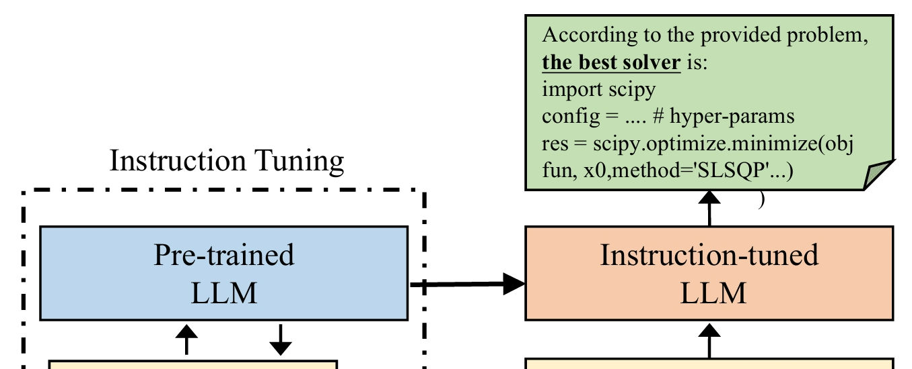

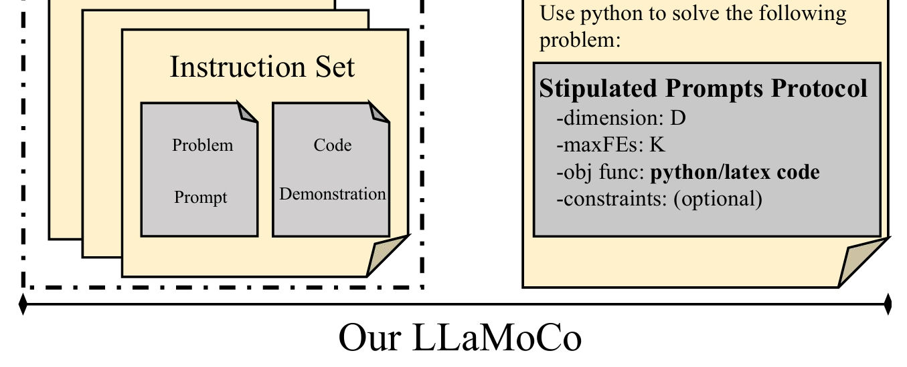

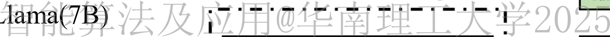

<!-- page: 32 -->

如何用好大模型？

32

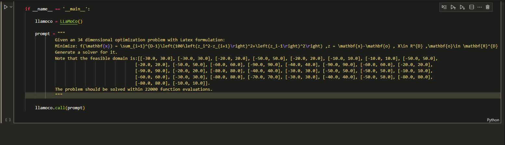

<!-- page: 33 -->

如何用好大模型？

33

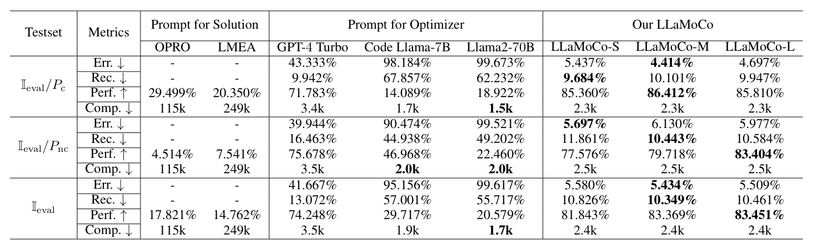

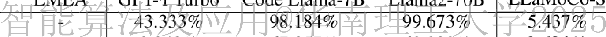

<!-- page: 34 -->

MetaBox平台

Z. Ma (学生), H. Guo, J. Chen, Z. Li, G. Peng, Y.-J. Gong, Y. Ma, and Z. Cao, MetaBox: A Benchmark Platform for Meta-Black-Box
Optimization with Reinforcement Learning,  NeurIPS 2023.

34

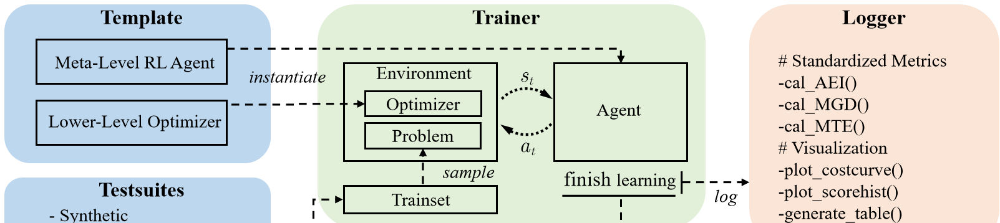

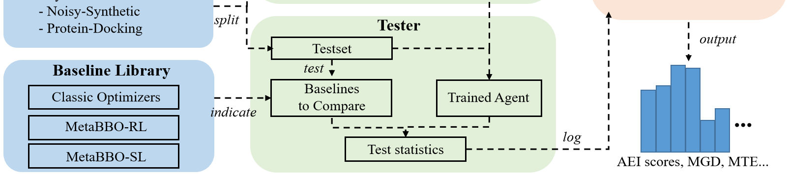

<!-- page: 35 -->

MetaBox平台

•
1.0版本Github地址：https://github.com/GMC-DRL/MetaBox
（请帮助点亮小星星）

•
QQ交流群：952185139

35

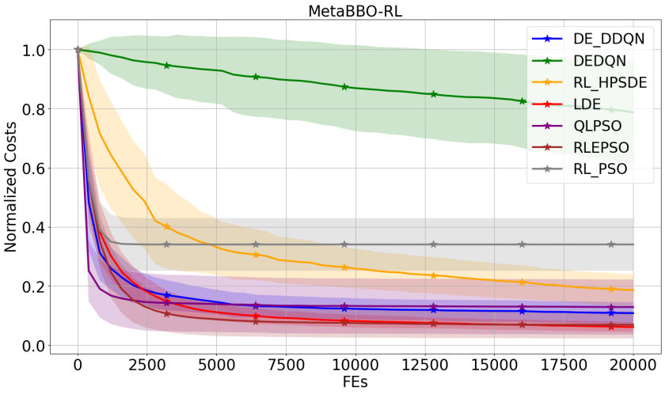

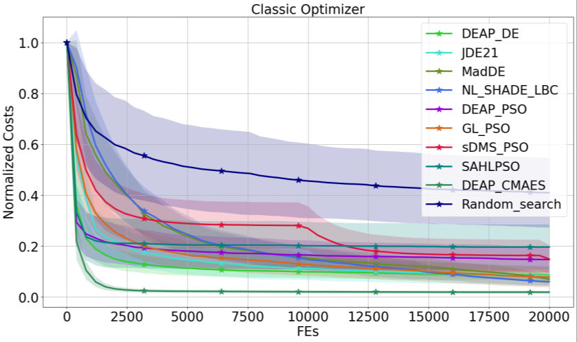

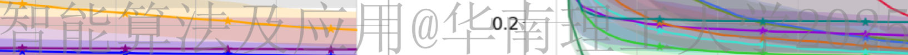

<!-- page: 36 -->

相关综述

Z. Ma (学生), H. Guo, Y.-J. Gong, J. Zhang, K. C. Tan, "Toward Automated Algorithm Design: A Survey and Practical Guide to
Meta-Black-Box-Optimization," https://arxiv.org/abs/2411.00625

36

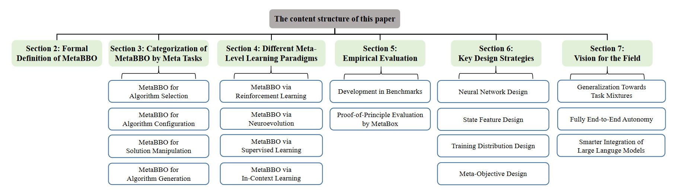

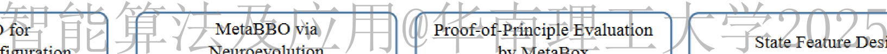

<!-- page: 37 -->

论文阅读作业

单人作业，提交.zip压缩包，包含
1. 论文阅读笔记（Markdown格式，图文并茂，2500字以内），包含摘要、
研究背景与研究动机、方法、实验结果
2. 论文阅读笔记（PDF格式）
3. 相关源文件如图片的文件夹

选题来源：
https://github.com/GMC-DRL/Awesome-MetaBBO
https://github.com/LabGong/psc4ddea
（请顺手点亮小星星）

截止时间：2025-05-09 20:00
提交地址：https://send2me.cn/ZU1OPzvl/QoqtIeo5uUAITQ

37

