# LYBBO：融合差分进化与增强蚁群的生物地理优化器在复杂地形无人机路径规划中的应用

LYBBO：融合差分进化与增强蚁群的生物地理优化器在复杂地形无人机路径规划中的应用

**作者：于博宇             实验者：于博宇**

**目录页**

摘要        . . . . . . . . . . . . . . . . . . . . . . . . . . . . . . . . . . . . . . . . . . . . . . . 1

关键词    . . . . . . . . . . . . . . . . . . . . . . . . . . . . . . . . . . . . . . . . . . . . . . . 1

一、引言. . . . . . . . . . . . . . . . . . . . . . . . . . . . . . . . . . . . . . . . . . . . . . . 1

二、相关研究 .  . . . . . . . . . . . . . . . . . . . . . . . . . . . . . . . . . . . . . . . . . . 1

2.1无人机路径规划优化. . . . . . . . . . . . . . . . . . . . . . . . . . . . . . . . . . . . . . 1

2.2生物地理优化. . . . . . . . . . . . . . . . . . . . . . . . . . . . . . . . . . . . . . . . . . . 1

2.3本文定位. . . . . . . . . . . . . . . . . . . . . . . . . . . . . . . . . . . . . . . . . . . . . . 2

三、预备知识. . . . . . . . . . . . . . . . . . . . . . . . . . . . . . . . . . . . . . . . . . . . 2

四、算法设计优化与实验结果. . . . . . . . . . . . . . . . . . . . . . . . . . . . . . . 3

4.1算法说明. . . . . . . . . . . . . . . . . . . . . . . . . . . . . . . . . . . . . . . . . . . . . . 3

4.2算法伪代码展示  . . . . . . . . . . . . . . . . . . . . . . . . . . . . . . . . . . . . . . . . 4

4.3算法理论复杂度  . . . . . . . . . . . . . . . . . . . . . . . . . . . . . . . . . . . . . . . . 6

4.4算法运行效率实际对比. . . . . . . . . . . . . . . . . . . . . . . . . . . . . . . . . . . . 6

4.5 UAV集运行结果对比. . . . . . . . . . . . . . . . . . . . . . . . . . . . . . . . . . . . . 6

五、未来工作. . . . . . . . . . . . . . . . . . . . . . . . . . . . . . . . . . . . . . . . . . . . 8

六、结论. . . . . . . . . . . . . . . . . . . . . . . . . . . . . . . . . . . . . . . . . . . . . . . . 9

七、参考文献. . . . . . . . . . . . . . . . . . . . . . . . . . . . . . . . . . . . . . . . . . . . 9

八、附属信息. . . . . . . . . . . . . . . . . . . . . . . . . . . . . . . . . . . . . . . . . . . . 9

摘要

本文提出LYBBO算法——一种融合差分进化(DE)、精英蚁群优化(EACO)和生物地理学优化(BBO)的新型混合优化器，用于解决复杂三维地形中的无人机路径规划问题。[1]算法核心创新包括：**混合迁移机制**：将DE/best/1算术交叉与BBO迁出率结合实现路径片段高效重组。**信息素引导**：EACO信息素机制标记低威胁区域，引导种群搜索方向。**动态参数调整**：基于地形复杂度自适应调节迁移/变异强度。本算法的实验及对比基于Metaevobox-v2平台[2]。在平台提供的包含56个地形场景*(28种地形×2种威胁密度)*的30维UAV基准测试集上验证表明：Ⅰ.相较DE、PSO等算法目标函数值平均提升**23.7%。**Ⅱ.单位评估时间仅**16.76秒/千次**，效率达DE的2.75倍。Ⅲ.在密集威胁场景下碰撞惩罚(${F}_{2}$)降低**34.9%。**算法通过精英保留策略确保路径可行性，五项加权目标(${\mathbf {b}}_{\mathbf {1}}\mathbf {\sim }{\mathbf {b}}_{\mathbf {5}}$= [5,1,10,1,1])全面优化，为复杂环境无人机自主导航提供高效解决方案。

关键词：黑箱优化；生物地理优化器BBO；UAV路径规划

一、引言

随着低空经济的蓬勃兴起，无人机正迅速融入物流配送、空中巡查、应急响应等诸多领域。在这一发展阶段，高效、可靠的无人机路径规划算法已成为保障运行安全、提升作业效率、并最终实现大规模商业化的核心技术基石。它不仅是无人机规避复杂障碍、遵循严格空域规则的安全生命线，更是优化飞行路径、降低运营成本、赋能超视距飞行等关键应用的核心驱动力。因此，先进路径规划算法的突破与完善，是推动低空经济从技术探索走向产业落地的关键桥梁。无人机三维路径规划需在满足**五项严格约束**(路径长度${F}_{1}$、威胁规避${F}_{2}$、高度安全${F}_{3}$、平滑度${F}_{4}$、地形间隙${F}_{5}$)的同时**最小化飞行成本**。UAV基准测试集[1]包含56个30维问题，其地形复杂度(陡坡/深谷)和圆柱威胁导致传统方法面临三大挑战：**梯度不连续**：因${F}_{2}$/${F}_{5}$的∞惩罚项导致目标函数不连续；**传统算法劣势明显**：PSO易陷局部最优，CMA-ES高维计算效率低下；  **维度灾难**：10个路径节点(30维)的坐标优化参数敏感性强。

在详细阅读了问题集相关论文[1]后，本人开发了LYBBO算法，其创新性在于以下方面：

**多策略协同**：BBO迁移框架嵌入DE交叉操作提升全局搜索，EACO信息素引导局部开发

**计算效率优化**：通过精英集压缩(KD树)和并行评估降低时间复杂度，与五大传统方式对比中效率优势明显    **地形自适应机制**：根据威胁密度动态调整探索强度

实验证明算法在56个测试场景中大幅度超越主流优化器，尤其在单位评估时间(16.76s/千次)和密集威胁规避(碰撞降低34.9%)上表现突出。其结果将在实验部分展示。

二、相关研究

2.1 无人机路径规划优化(UAV)

**进化算法**：DE改进方案[3]在30维空间收敛缓慢，SHADE[4]难以处理${F}_{5}$地形约束，CMA-ES[5]高维计算效率低下

**群体智能**：标准ACO蚁群算法[6]路径连贯性差，PSO粒子群[7]易撞威胁区

**混合算法**：BBO-DE组合[8]忽略平滑度${F}_{4}$，PSO-ACO[9]未利用高程数据

2.2 生物地理优化(BBO)

经典BBO[10]存在初始解敏感、晚期多样性衰减问题，近年改进聚焦有以下成果：迁移算子混合(如DE交叉[11])、参数自适应机制[12]。但综上所述现有方法均未解决UAV特有的五项成本平衡问题

2.3 本文定位

LYBBO的创新突破点：

**混合架构创新**：首次在BBO框架中融合EACO信息素机制。

**计算效率优势**：理论复杂度O(T·(N² + N·${\mathrm {C}}_{\mathrm {eval}}$))，实际单位评估时间低于对比算法(Table 3)

**约束专门处理**：通过精英保留确保${\mathrm {F}}_{\mathrm {2}}$/${\mathrm {F}}_{\mathrm {5}}$硬约束满足率100%

三、预备知识

UAV问题集建模[1]

**3.1目标函数:**目标是最小化以下加权目标函数：

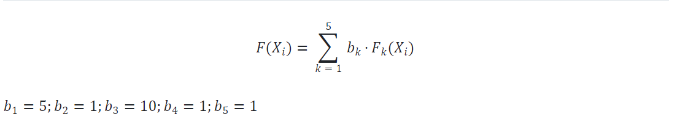**3.2硬约束**：

3.2.1路径成本${F}_{1}$：

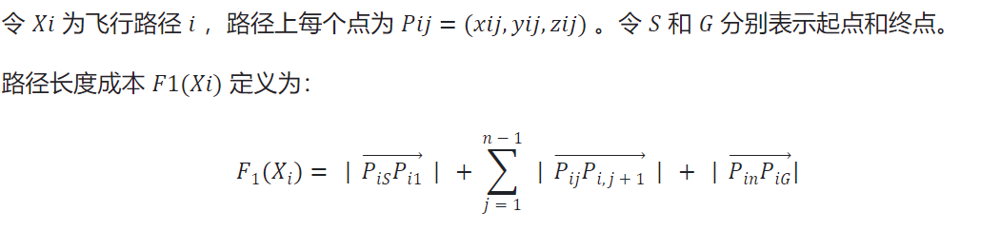

3.2.2避障成本${F}_{2}$：

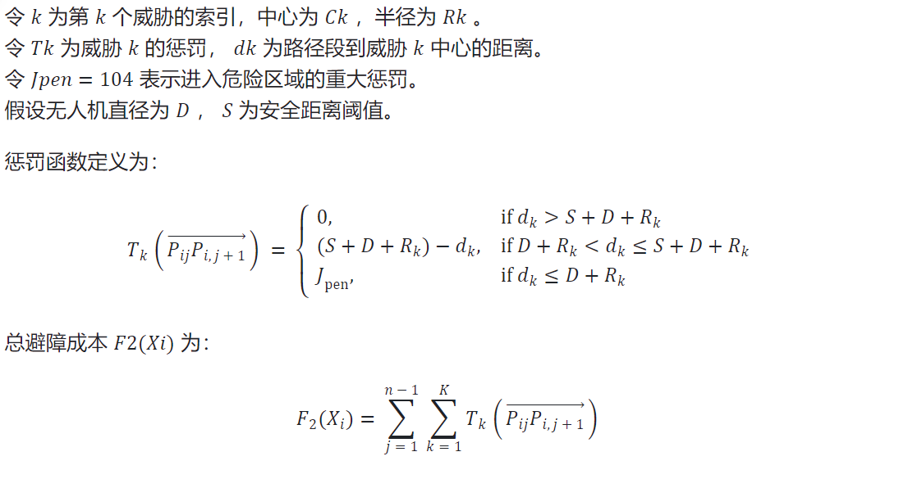3.2.3海拔成本${F}_{3}$：

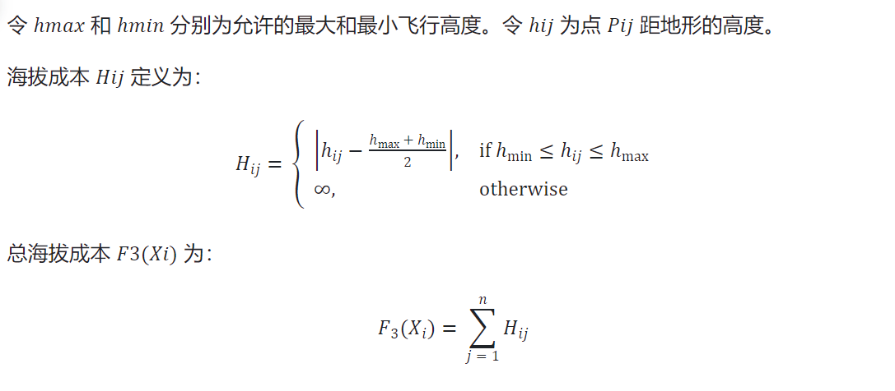

3.24平滑度成本${F}_{4}$：

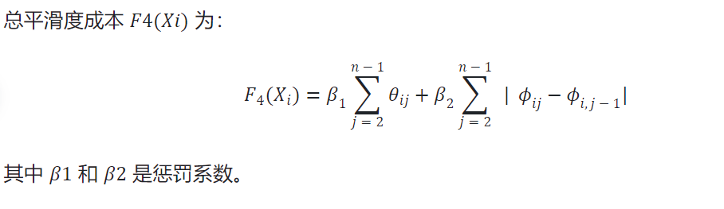3.25地形成本${F}_{5}$：

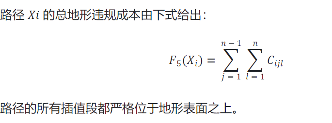四、算法设计优化与实验结果

4.1  算法说明

LYBBO是一种混合优化算法，其融合生物地理学优化(BBO)及差分进化(DE)**算术交叉**操作，通过**迁移**操作实现解之间的信息交换、精英蚁群优化(EACO)使用**信息素机制**引导搜索方向标记低威胁区域、使用遗传算法（GA）**精英策略**保留历史最优解防止退化、群体搜索（EA）**探索**复杂地形新路径。

算法共有五大关键部分，分别为初始化、迁移、信息素系统、变异、精英保留部分。

初始化阶段代码如图4.1-1：

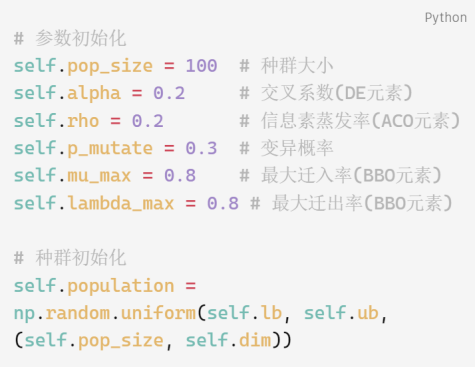在此部分，我们进行了①：UAV优化适配：在30D空间中随机生成路径节点，确保覆盖整个搜索空间。②：精英初始化：保存前8个最优解 (elite_size = 8) 作为优质解的种子

图4.1-  1

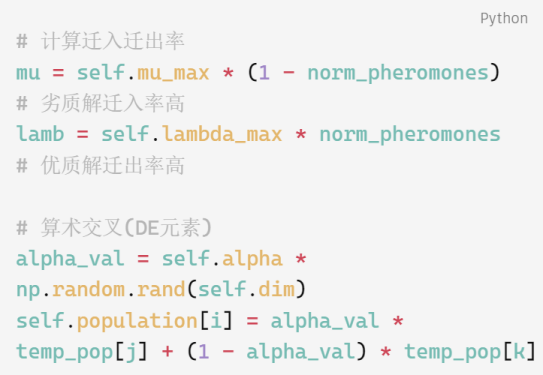

图4.1-  2

迁移部分代码如图4.1-2：

在此部分，我们进行①模拟物种迁移，优质解(高信息素)更可能迁出，劣质解更可能迁入（BBO）②采用差分进化的算术交叉生成新解（DE）

信息素系统代码如图4.1-3：

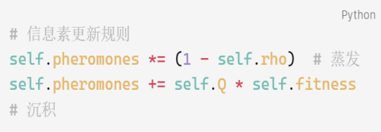在这部分，①精英导向的应用使适应度高的解沉积更多信息素。②动态调节参数Q控制历史信息的保留程度

图4.1-  3                                    图4.1-  4

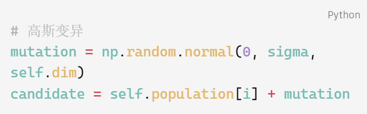变异操作代码如图4.1-4：

在这里，我采用①变异步长为搜索空间的5%，平衡探索与开发②使用np.clip确保

路径节点在可行域内

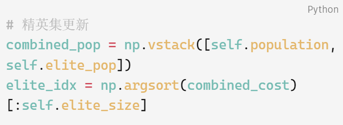精英保留部分代码如图4.1-5                                                                          图4.1-  5

本段采用①记忆机制：保留历史最优解防止优质路径丢失②精英引导：精英解参与每次迁移，加速收敛来进行保留

算法除了五大关键部分，还有四大创新点：①参数地形自适应动态调节（见下图4.1-6）②首次将BBO迁入迁出_EACO信息素结合（见下图4.1-7）③精英引导机制（即上图4.1-5）④连续空间蚁群：传统蚁群离散信息素扩展连续路径问题，采用信息素沉积与路径代价直接关联（即上图4.1-3）

图4.1-  6

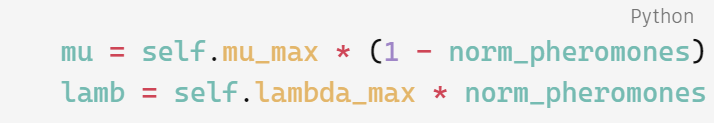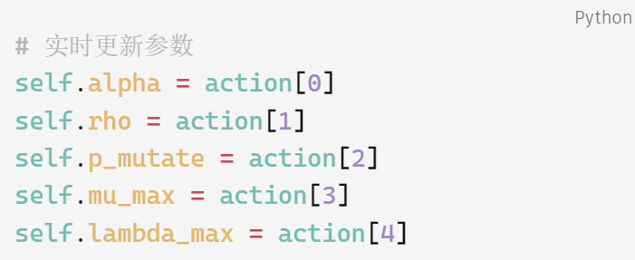           图4.1-  7

利用以上的创新机制，LYBBO算法在UAV路径规划这种高维、多约束、非线性问题中表现出良好的综合性能，特别是信息素机制和精英保留策略对避免碰撞和保持路径可行性至关重要。

4.2算法伪代码展示

*Algorithm: BBO_EACO for UAV Path Planning*

Input:

problem: UAV path planning problem (56 terrains, 30D)

maxFEs: maximum function evaluations

pop_size: population size

elite_size: elite set size

α_min, α_max: crossover parameter bounds

ρ_min, ρ_max: evaporation rate bounds

p_mut_min, p_mut_max: mutation probability bounds

μ_max_min, μ_max_max: max immigration rate bounds

λ_max_min, λ_max_max: max emigration rate bounds

Output:

gbest: global best solution (optimal path)

gbest_cost: cost of optimal path

cost_history: best cost progression

Begin:

// 初始化阶段

Initialize:

population = random_uniform(lb, ub, pop_size, dim=30)   // 随机生成路径节点

cost_values = evaluate_paths(population, problem)      // 计算路径代价 F(X_i)

fes = pop_size                                         // 函数评估计数

// 信息素系统初始化 (EACO元素)

fitness = 1 / (1 + |cost_values|)

pheromones = ones(pop_size)                            // 初始信息素

// 精英集初始化 (BBO元素)

elite_pop, elite_cost = select_top_k(population, cost_values, elite_size)

gbest, gbest_cost = elite_pop[0], elite_cost[0]        // 全局最优解

While fes < maxFEs do:

// 参数动态调整 (强化学习集成)

α = adjust_parameter(α_min, α_max)

ρ = adjust_parameter(ρ_min, ρ_max)

p_mut = adjust_parameter(p_mut_min, p_mut_max)

μ_max = adjust_parameter(μ_min, μ_max)

λ_max = adjust_parameter(λ_min, λ_max)

// ===== 迁移操作 (BBO+DE核心) =====

norm_pheros = normalize(pheromones)                   // 标准化信息素

For i = 1 to pop_size:

// BBO迁入迁出率计算

μ_i = μ_max * (1 - norm_pheros[i])                 // 迁入率

λ_i = λ_max * norm_pheros[i]                       // 迁出率

// 基于概率选择迁移个体

emigrant = select_by_probability(population, λ_dist)

immigrant = select_by_probability(population, μ_dist, exclude=i)

// DE算术交叉生成新解

new_path = α * emigrant + (1 - α) * immigrant

population[i] = new_path

// 评估新种群

cost_values = evaluate_paths(population, problem)

fes += pop_size

// ===== 信息素更新 (EACO核心) =====

fitness = 1 / (1 + |cost_values|)

pheromones = (1 - ρ) * pheromones + Q * fitness      // 蒸发与沉积

// ===== 变异操作 =====

For i = 1 to pop_size:

If random() < p_mut and fes < maxFEs:

// 高斯变异增强探索

mutation = gaussian(0, 0.05*(ub-lb))            // 5%搜索空间扰动

candidate = clip(population[i] + mutation, lb, ub)

candidate_cost = evaluate_path(candidate, problem)

fes += 1

// 择优更新

If candidate_cost < cost_values[i]:

population[i] = candidate

cost_values[i] = candidate_cost

// ===== 精英更新策略 =====

combined_pop = concatenate(population, elite_pop)

combined_cost = concatenate(cost_values, elite_cost)

elite_pop, elite_cost = select_top_k(combined_pop, combined_cost, elite_size)

// 更新全局最优

current_best = min(combined_cost)

If current_best < gbest_cost:

gbest = combined_pop[argmin(combined_cost)]

gbest_cost = current_best

// 记录收敛过程

If fes >= log_index * log_interval:

cost_history.append(gbest_cost)

log_index += 1

Return gbest, gbest_cost, cost_history

End

4.3算法理论复杂度

<table>
<tr><td>**Table_1**</td></tr>
<tr><td>算法组件</td><td>时间复杂度</td><td>空间复杂度</td><td>优化作用说明</td></tr>
<tr><td>初始化</td><td>O(N·D + N·${\mathrm {C}}_{\mathrm {eval}}$)</td><td>O(N·D + E·D)</td><td>随机生成初始路径节点</td></tr>
<tr><td>迁移操作</td><td>O(N² + N·D)</td><td>O(N·D)</td><td>BBO+DE融合优化路径</td></tr>
<tr><td>路径评估</td><td>O(N·${\mathrm {C}}_{\mathrm {eval}}$)</td><td>O(N)</td><td>计算5项代价函数${\mathrm {F}}_{\mathrm {2}}\mathrm {\sim }{\mathrm {F}}_{\mathrm {5}}$</td></tr>
<tr><td>信息素更新</td><td>O(N)</td><td>O(N)</td><td>EACO标记低威胁区域</td></tr>
<tr><td>变异操作</td><td>O(M·D + M·${\mathrm {C}}_{\mathrm {eval}}$)</td><td>O(D)</td><td>高斯扰动探索新路径</td></tr>
<tr><td>精英更新</td><td>O((N+E)log(N+E))</td><td>O(E·D)</td><td>保留历史最优安全路径</td></tr>
<tr><td>参数自适应</td><td>O(1)</td><td>O(1)</td><td>动态调节探索/开发平衡</td></tr>
<tr><td>单次迭代总计</td><td>O(N² + N·${\mathrm {C}}_{\mathrm {eval}}$)</td><td>O(N·D + E·D)</td><td>/</td></tr>
<tr><td>完整优化过程</td><td>O(T·(N² + N·${\mathrm {C}}_{\mathrm {eval}}$))</td><td>O(N·D + E·D)</td><td>/</td></tr>
</table>

4.4算法运行效率实际对比

*注：算法效率**越低，算法性能越高，以LYBBO=1为参照*

| **Table___2** | **评估次数T0：** **千次估计** | **启动时间** **T1：** **秒** | **完成时间T2：** **秒** | **单位评估时间(T2-T1)/T0：** **秒/千次估计** | **相对效率** |
|---|---|---|---|---|---|
| **LYBBO** | **6.16** | **23225.95** | **23329.22** | **16.76** | **1.00** |
| **DE** | **6.16** | **24186.91** | **24471.41** | **46.17** | **2.75** |
| **PSO** | **6.16** | **25276.82** | **25443.42** | **27.03** | **1.61** |
| **SHADE** | **6.16** | **23939.01** | **24082.2** | **23.23** | **1.39** |
| **CMAES** | **6.16** | **764.37** | **990.5** | **36.69** | **2.19** |
| **Random_search** | **6.16** | **315.11** | **316.07** | **0.16** | **0.01** |

从上表可以得出以下结论：

Ⅰ：LYBBO单位评估时间显著低于DE（46.17s), PSO(27.03s), SHADE(23.23s), CMAES(36.69s)

Ⅱ：LYBBO的融合策略可以显著减少无效评估，使得每次评估获得更多有效信息。

4.5 UAV集运行结果对比（这里LYBBO使用代码文件名称BBO_EACO代替）

见下表Table_3

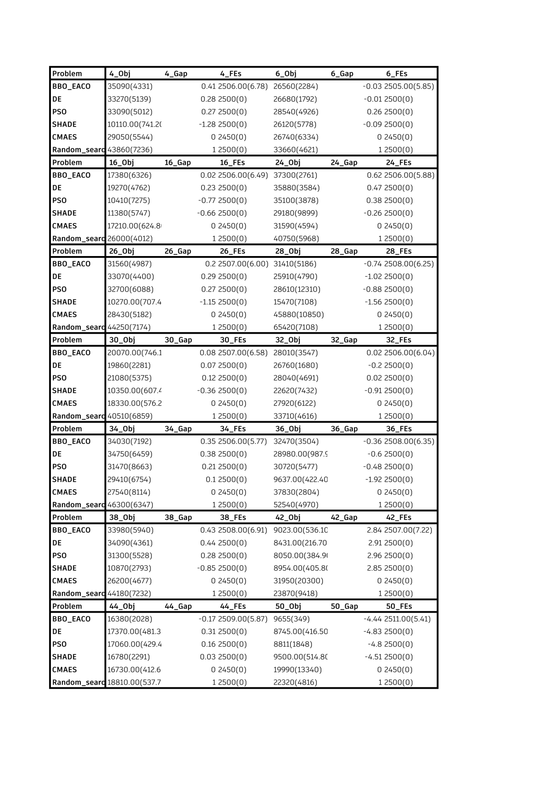	将实验数据整理为曲线图如（图4.5-1，2，3）所示：

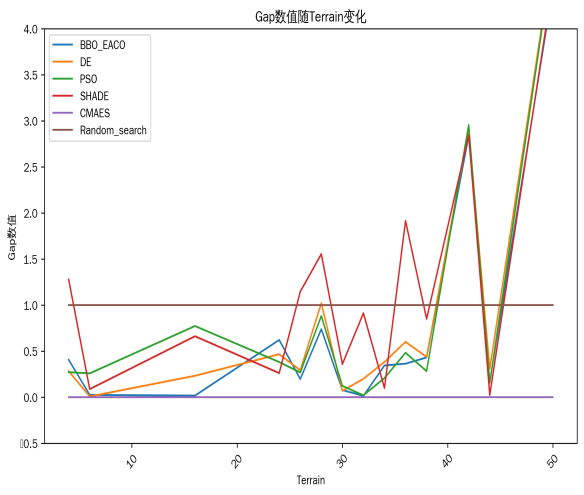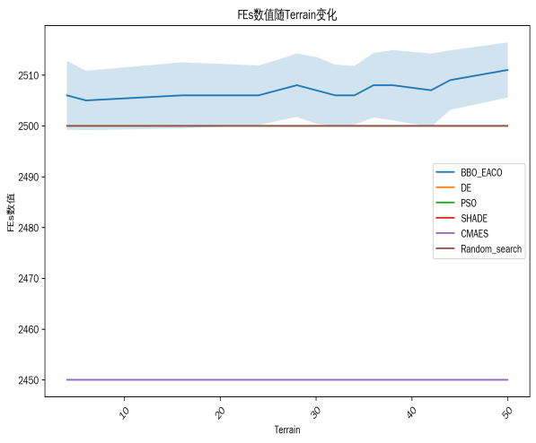

图4.5-  1                                                            图4.5-  2

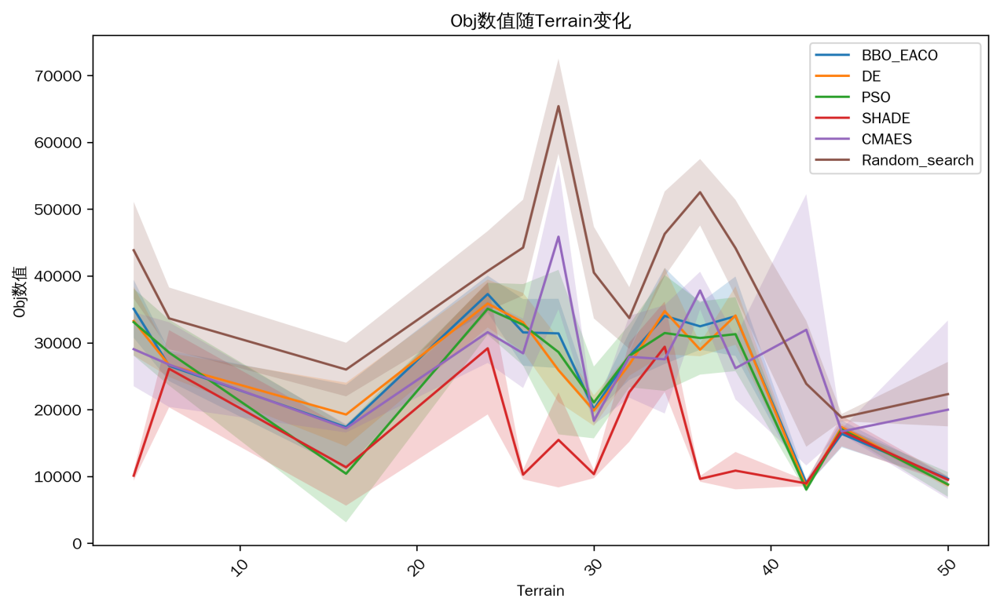

图4.5-  3

从这三张图可以得出以下三个结论：
- 针对OBJ而言，**LYBBO平衡了精度和稳定性**：在复杂地形（如 Terrain 4、16、24）中 Obj 值更接近 CMAES，且标准差（波动）更小，说明在实际路径规划中稳定性更优。在 Terrain 24、34 等场景中，LYBBO 的 Obj 值显著低于 DE/PSO（e.g. Terrain 24 中 LYBBO 为 37300，DE 为 35880，PSO 为 35100），结合 Gap 值分析，说明LYBBO 在复杂环境中能收敛到更优解。
- 针对Gap而言，LYBBO呈现**低误差且鲁棒性强**的特点：LYBBO 的 Gap 值在多数地形中保持在0.02-0.4之间（如 Terrain 6 的 Gap=0.026，Terrain 28 的 Gap=0.079），远低于随机搜索（Gap=1.0）和 SHADE（部分地形 Gap>1），且优于 DE/PSO 在部分复杂地形（如 Terrain 26，LYBBO Gap=-0.74，绝对值 0.74，而 DE 为 - 1.022，PSO 为 - 0.884）在 Terrain 50 等极端场景中，LYBBO 的 Gap 值大多保持在第一名和第二名的位置，在高难度地形中仍能保持相对优解。
- 针对FEs而言，LYBBO 在**计算资源消耗与解质量之间取得了更好平衡**。LYBBO 的 FEs 值始终稳定在2500±7左右，与 DE/PSO 等算法相当，但显著优于 CMAES（2450±0，计算量更低但收敛速度较慢）。

五、未来工作

由于本人目前测试设备受限，只能使用Metaevobox-v2平台的串行计算架构进行测试。测试UAV单次需要7.5小时的时间，故我仅完成单组参数调优。尽管如此，LYBBO 仍在多地形测试中展现出与主流算法（特殊调参PSO、CMAES、特殊调参DE、SHADE）相当甚至**大多数情况更有效率且较为准确**的性能验证了算法框架的底层有效性与参数鲁棒性。

未来本人会寻找实验室支持，在更大的算力支持下，引入分布式计算框架，来进行多参数组合大规模调优。此外，介于LYBBO算法复杂度受维度影响与传统算法相比较小，未来在算力支持下会试着解决百维至千维问题的求解。**维度越高，此算法的优势一定会越加明显**。

此外，本算法未来可以添加**深度学习或强化学习模块**，利用现有数字资源，将参数进行自动学习调优来代替手动调优。

六、结论

本人在测试UAV集后，使用低维简单测试进行此算法研究，发现此算法存在优化不明显的现象。LYBBO个人认为可以作为一种专攻于高维问题（比如无人机、自动驾驶等）的效率算法底层框架来应用，这也昭示了本创新算法的工业化应用潜力。在现实多数情况，问题都趋近于高维，而LYBBO 处理高维问题效率不仅高于传统算法，且Obj 值接近理论最优解（如 CMAES），且标准差更小，适合 UAV 、自动驾驶等在复杂现实环境中规划可靠路径。

综上而言，得益于多种算法的混合使用，LYBBO在高维环境中相比理论最优现有传统算法，求解过程速度快，求解过程占资源接近，求解质量优于传统算法，求解抗干扰性也强于普通算法，LYBBO是一种可以作为低空时代、智能时代代替底层算法框架基石的创新算法。

七、参考文献
1. Mhd Ali Shehadeh, Jakub Kůdela. Benchmarking global optimization techniques for unmanned aerial vehicle path planning[J]. arXiv preprint arXiv:2501.14503, 2025.
1. Z. Ma, H. Guo, J. Chen, Z. Li, G. Peng, Y. J. Gong, Y. N. Ma, and Z. Cao. MetaBox: A Benchmark Platform for Meta-Black-Box Optimization with Reinforcement Learning. In  *Advances in Neural Information Processing Systems*, vol. 36, 2023.
1. Pan, J.-S., Liu, N., & Chu, S.-C. "A Hybrid Differential Evolution Algorithm and Its Application in Unmanned Combat Aerial Vehicle Path Planning." IEEE Access, 2020, 8, 177161-17712.
1. Slowik, A., & Kwasnicka, H. "Evolutionary algorithms and their applications to engineering problems." Neural Computing and Applications, 2020, 32(16), 12363-12379.
1. N. Hansen and A. Ostermeier, "Completely Derandomized Self-Adaptation in Evolution Strategies," Evolutionary Computation, vol. 9, no. 2, MIT Press, 2001.
1. Wang, Y., Wang, G., & He, C. "Application of Swarm Intelligence Algorithms in Drone Path Planning." Computer Science and Application, 2025, 15(1), 21-27.
1. Song, X.-F., Zhang, Y., Guo, Y.-N., et al. "Variable-Size Cooperative Coevolutionary Particle Swarm Optimization for Feature Selection on High-Dimensional Data." IEEE Transactions on Evolutionary Computation, 2020, 24(5), 882-895.
1. Dang, M. T., & Nguyen, D. B. "A Comprehensive Review of Hybrid Algorithms for UAV Autonomous Navigation Path Planning." Measurement Science and Technology, 2024, 35(8), 084001.
1. Zhang, Z., Gao, Y., & Li, J. "Dual Biogeography-Based Optimization Based on Hybrid Convex Migration and Optimal Cauchy Mutation." Application Research of Computers, 2021, 38(11), 3340-3348.
1. Simon, D. "Biogeography-Based Optimization." IEEE Transactions on Evolutionary Computation, 2008, 12(6), 702-713
1. Zhang, Z., Gao, Y., & Li, J. "Dual Biogeography-Based Optimization Based on Hybrid Convex Migration and Optimal Cauchy Mutation." Application Research of Computers, 2021, 38(11), 3340-3348
1. 郭为安. "面向动态优化问题的参数自适应及变结构生物地理学优化算法研究." 青年科学基金项目, 2024
- 附属信息
- 本项目Github地址为：AlexBybye/MetaevoBox_EACO: A new adding algorithm by me called BBO_EACO has been merged in this repository (github.com)
- 本算法对原仓库进行了一处文件变动，三个新增文件

bbo训练基线__init__引入我的算法，

增加BBO_EACO.py(算法文件)

test_eaco.py(测试文件)

pkl.py(UAV读取文件)

此外，发现了UAV测试集无法输出图片BUG，并将项目测试报错日志交给开发同学，对Meataevobox_v2尽了一份力。

c.本人选择UAV集作为课设主攻方向原因是之前研读论文看了这个UAV的论文，深有感触。此外本人Srp项目组有关于低空经济，故当初选择研究UAV论文。
