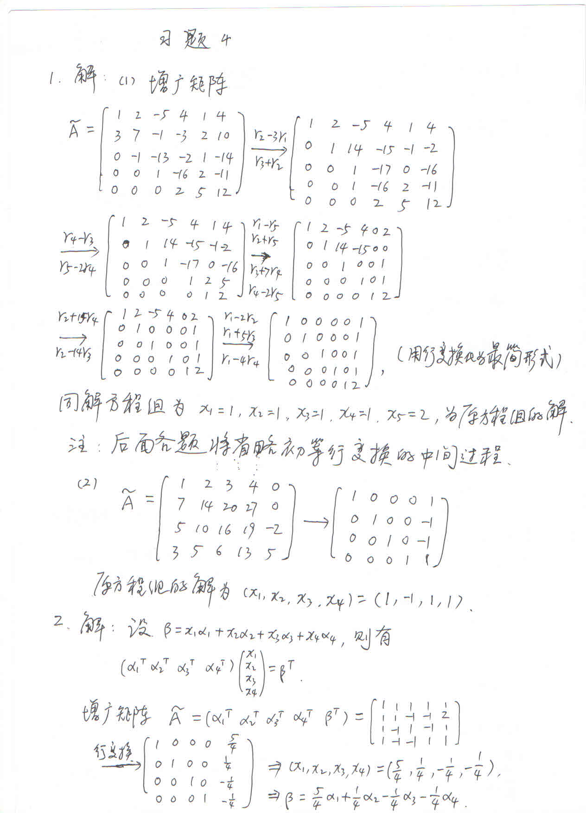
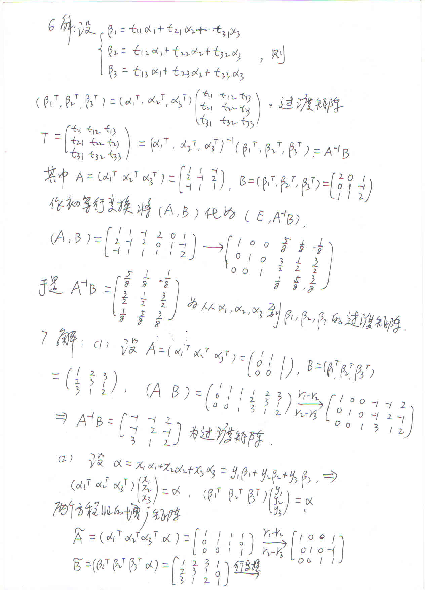
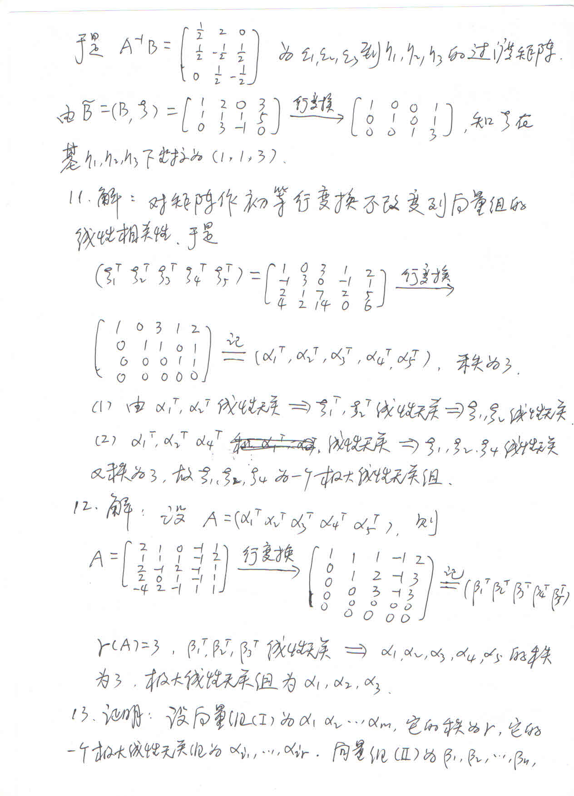
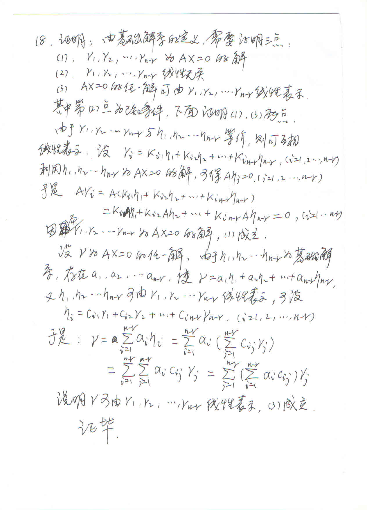
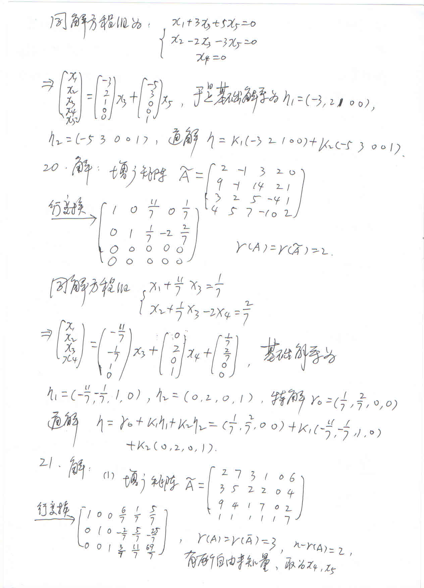
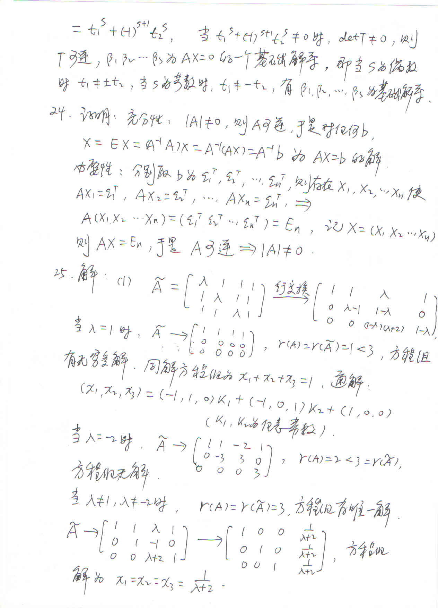
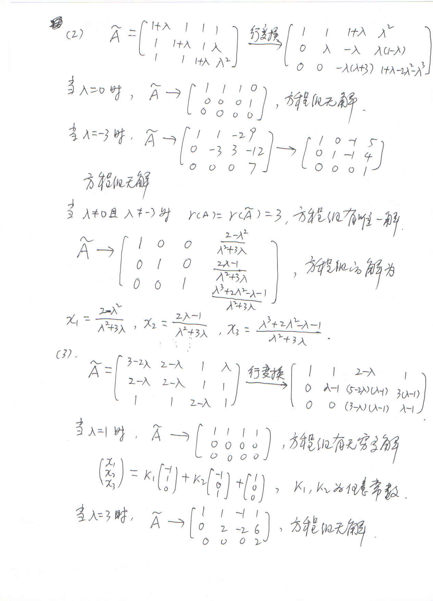

# 线性代数习题四（手写解答）

<!-- page: 1 -->

## 第 1 页

<!-- page: 2 -->

## 第 2 页

<!-- page: 3 -->

## 第 3 页

<!-- page: 4 -->

## 第 4 页

<!-- page: 5 -->

## 第 5 页

<!-- page: 6 -->

## 第 6 页

<!-- page: 7 -->

## 第 7 页

<!-- page: 8 -->

## 第 8 页

<!-- page: 9 -->

## 第 9 页

<!-- page: 10 -->

## 第 10 页

<!-- page: 11 -->

## 第 11 页

<!-- page: 12 -->

## 第 12 页

<!-- page: 13 -->

## 第 13 页

<!-- page: 14 -->

## 第 14 页

<!-- page: 15 -->

## 第 15 页

<!-- page: 16 -->

## 第 16 页

