# 2022-2023年度线代解几期末卷A答案

<!-- slide: 1 -->

- 2022-2023-1 学期《线性代数与解析几何》试卷(A 卷)
- 一、选择题(共 11 题，每题 3 分，共 33 分)

- 2.

- 3.

- D

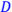

- 二、(8 分)
- =

- 1 2
- 2 2
- 3 3 ⋮ ⋮

- 3 ⋯
- 3 ⋯

- 3 ⋮

- ⋯ ⋮ ⋯

- =
- 1 1 2 ⋮

- 1 0 ⋮ ⋮
- 2 3
- 0 0

- ⋯
- ⋯ 0
- ⋯ 0  ⋯ 0 ⋯ 1
- ⋯ ⋮

- 0 0 ⋮ 0 0
- 解：(α1́ α2́ α3́ β1́ β2́ β3́ ) =
- 1 2 3 3 5
- 2 3 7 1 2
- 1 3 1 4 1
- 1
- 1 −6
- 1 0 0 −27 → 0 1 0 9
- 0 0 1 4

- = ( − 1)
- −71 −41 20 9
- 12 8
- 三、(8 分)

|  | −27 | −71 | −41 |
|---|---|---|---|
| 故所求过渡矩阵为 | 9 | 20 | 9 |
|  | 4 | 12 | 8 |

| 四、(15 分) |  |  |  |  |
|---|---|---|---|---|
|  | 1 | 2 |  |  |
| 解： | 1 | 3 |  |  |
|  | 1 |  |  |  |

- 1 2 1 1
- 1 3 1 1
- 1 4 1 1
- 1 0 1 1
- → 0 1 0 0 ，有无穷多解。
- 0 0 0 0

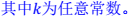

- 3

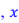
- 解为 21 = 0 3为自由未知量， 故方程组有一特解
- 其导出组的一个基础解系为

|  | 1 | 2 | −1 | 1 |  | 1 | 2 | −1 | 1 |  |
|---|---|---|---|---|---|---|---|---|---|---|
|  | 1 | 3 | −3 | 1 | → | 0 | 1 | −2 | 0 | ，无解。 |
|  | 1 | 2 | −1 | −3 |  | 0 | 0 | 0 | 1 |  |

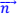

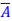

- 五、(15 分)
- 1法向量为 1 = (1,1,1) 2法向量为 2 = (0,1, − 1)
- = 1 × 2 −2	= 1 = 1
- = ( − 2,1, − 1), × = 6 = 3

- ×

- 2 5 30

- |

- ∙

- |

- |

- ����||����| =

- 2
- =
- 6 3
- 2,
- 3
- 2

- 3
- … … …

<!-- slide: 2 -->

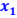

- 六、（15 分）
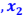

- '

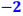

- =

- −

- =

- 二重 ＝10

|  |  |  |
|---|---|---|
|  |  |  |

- →

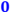

- 为自由未知量，

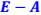

- 从而 = '

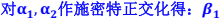

- −

- = ( � ,�

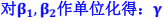
- =

- −

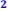
- '

- = (

- −

- →
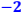

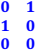

- 故 为自由未知量，
- 从而 = '

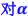

- =

- '

- , , −

- ) =

- −

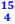

- (2) r(f)=3, 正惯性指数为 3，负惯性指数为 0.
- 七、(6 分)

- 0
- 0 0

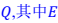
- =1

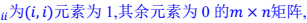

- =1 。

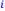
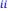

