# 党的自我革命历史沿革及当代价值

<!-- slide: 1 -->

- 党的自我革命历史沿革及当代价值
- 2025年3月24日

<!-- slide: 2 -->

- 小组分工
- 1921-1949      刘诗琪    徐健睿
- 1949-1978      龙韬        黄烁韩
- 1978-2002      沈人文    李勇涛    曾浩锋
- 2002至今        张俊杰    王锦铨    袁纪宸
- PPT串联（总编）   柯谱
- 演讲&PPT统一        于博宇

<!-- slide: 3 -->

- 目录
- 第一阶段：建党初期（1921-1949）
- 第二阶段：党的政权巩固与曲折探索  （1949-1976）
- 第三阶段：改革开放初期与市场经济建设时期（1978-2002）
- 第四阶段：全面建设小康社会与跨入新时代（ 2002-至今）

<!-- slide: 4 -->

- 建党初期（1921-1949）
- 1、向农村革命的转变（ 1921-1927 ）
- 2、古田会议与遵义会议（ 1927-1937 ）
- 3、从整风到建国（ 1937-1949 ）

<!-- slide: 5 -->

- 1921-1927年：向农村革命的转变

- 历史背景
- 国共合作初期与城市工人运动的结合、 1927年国民党对中共的清洗与城市战略失败、中共策略转向农村根据地与革命道路调整
- 事件
- 结论
- 党自我革命的重要里程碑，中国革命史上的关键节点。党脱离国民党的压制，开启新的革命浪潮。从根本上改变中共及其革命道路的方向。
- 八七会议，秋收起义，中国共产党第六次全国代表大会

<!-- slide: 6 -->

- 主要事件：“八七会议”召开
- 1.对大革命失败的总结与策略转向的决策
- （1）清算右倾错误与确定新方针
- 毛泽东在会上批判陈独秀“放弃军事主导权”，强调“政权是由枪杆子中取得的”，直接推动了武装斗争方针的确立。——光明日报《八七会议：历史在江城转折》
- （2）放弃城市中心论，转向农村斗争
- 八七会议后，党发动了南昌起义、秋收起义等近百次武装起义，但多数城市起义失败，最终“客观环境迫使革命者转向农村区域”，逐步形成“农村包围城市”的理论基础。——《中国共产党简史》第二章
- 2.“农村包围城市”道路的实践与理论形成
- （1）井冈山根据地的创建
- 八七会议后，毛泽东作为中央特派员到湖南改组省委并领导湘赣边界秋收起义。
- 起义于9月9日发动。在进攻长沙受挫后，以毛泽东为书记的前敌委员会当机立断，改
- 变原定部署，决定到敌人控制比较薄弱的山区寻求立足地。——《中国共产党简史》第二章
- （2）理论总结与升华
- “地方的农业经济（不是统一的资本主义经济）和帝国主义划分势力范围的分裂剥削政
- 策”是军阀混战的根本原因，这种分裂削弱了白色政权的统治力，使红色政权得以“乘时
- 产生”。——毛泽东《中国的红色政权为什么能够存在？》
- 中国革命不能依赖单纯的“全国范围的武装起义”，而应通过“建立巩固的农村根据地”，
- 以农村革命力量逐步积累，最终夺取全国政权。——毛泽东《星星之火，可以燎原》
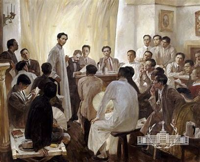
- 油画《八七会议》

<!-- slide: 7 -->

- 1927-1937年：古田会议与遵义会议

- 01
- 02
- 03
- 古田会议历史背景
- 农村革命，建立苏维埃根据地，军事领导分歧，政治意识不足，面对内外挑战。
- 古田会议事件
- 古田会议，“党指挥枪，而不能枪指挥党”党对军队的绝对领导，军队全心全意为人民服务，确立人民军队的政治属性和组织纪律
- 结论
- 1、确立人民军队建设的基本原则
- 2、.推动革命根据地建设
- 古田会议是“党和军队建设史上的重要里程碑”，标志着人民军队从旧式军队向新型人民军队的转变。（新华网，2019年12月28日）
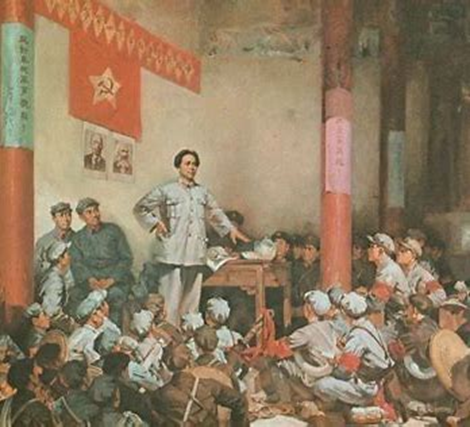

<!-- slide: 8 -->

- 1927-1937年：古田会议与遵义会议

- 遵义会议历史背景
- （1）博古、李德的错误指挥
- （2）战略转移的被动性
- 遵义会议事件
- 批评博古、李德，错误军事指导，毛泽东领导地位，政治局常委，领导层调整，确立毛泽东的领导地位
- 结论
- 自我修正能力，领导层成熟，灵活性增强，挽救红军，胜利基础、组织基础、战略基础，重要里程碑
- （1）红军进入贵州遵义
- （2）党内对错误指挥的反思
- 遵义会议结束了“左”倾教条主义在党内的统治，确立了以毛泽东为代表的正确路线，成为党的历史上一个生死攸关的转折点。（中国共产党新闻网，2016年10月18日）
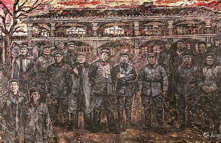
- 《遵义会议》

<!-- slide: 9 -->

- 1937-1949年：从整风到建国

- 历史背景
- 抗日战争，延安时期，官僚主义，派系斗争，意识形态偏差，党组织扩大；
- 抗战胜利，内战胜利，执政挑战
- 事件
- 深远影响
- 整风运动：思想统一，纪律性，党的发展基础，毛泽东思想指导地位；
- 七届二中全会：未来治理规划，执政准备，理论支持，政策保障
- 整风运动（1942年），官僚主义、宗派主义、主观主义，批评与自我批评，马克思主义思想学习，意识形态统一；
- 七届二中全会（1949年），人民民主专政

<!-- slide: 10 -->

- 建党初期阶段总结
- 1921年至1949年，中共在革命过程中展现了强大的自我革命能力。从早期战略调整，如农村包围城市的革命道路，到党内整顿与领导层调整，如古田会议、遵义会议和整风运动，再到1949年七届二中全会的执政准备，党始终通过不断反思和调整，确保自身的生存与发展。
- 这一传统不仅帮助党在革命时期战胜困难，也奠定了长期执政的思想与组织基础。自我革命的精神使党始终保持活力，与人民紧密联系，并能适应时代变化。这一经验对于今天党的建设仍具有重要意义，确保党在现代化治理中保持完整性和前进动力。

<!-- slide: 11 -->

- 党的政权巩固与曲折探索 （1949-1976）
- 1、政权巩固与制度奠基（1949-1956）
- 2、建设探索与政策调整（1957-1965）
- 3、曲折探索与历史转折（1965-1976）

<!-- slide: 12 -->

- 一、政权巩固与制度奠基
- （1949-1956）
- 国内国际形势
- 国内：1949年中华人民共和国的建立标志着中国历史上旧有封建社会和半殖民地化状态的彻底终结，开始进入社会主义建设的新时期。长期战争后百废待兴，人民渴望和平稳定，政权急需巩固。
- 国际：冷战格局初现，两大阵营对峙，中国面临外部压力与机遇。
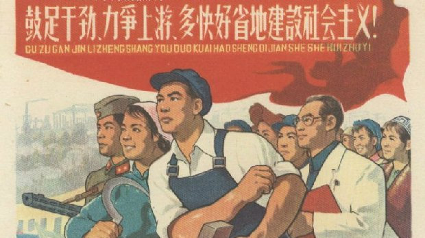

<!-- slide: 13 -->

- 1949年10月1日开国大典，毛泽东宣告新中国成立，确立国家主权。
1949年12月毛泽东访苏，1950年中苏签订友好同盟互助条约。
中国长期争取联合国合法席位，体现国际影响力与主权诉求。
- 1、新中国成立与外交突破（1949-1950）
- 1950年土地改革法实施，3亿农民获得土地，消灭封建土地制度。1953- 1956年进行三大改造，对农业、手工业、资本主义工商业进行社会主义改造。
1953年开始执行第一个五年计划，建立计划经济体制。
- 2、土地改革与社会主义改造（1950-1956）
- 主要事件
- 3、抗美援朝战争（1950-1953）
- 新中国在朝鲜战争爆发后积极援助朝鲜，抗美援朝战争不仅提升了国家的国际地位，还增强了国内的政治团结和民族凝聚力。
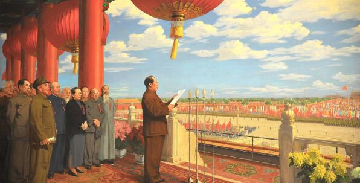

<!-- slide: 14 -->

- 历史意义  1949-1956
- 奠定国家基础
- 新中国的成立和抗美援朝的胜利，巩固了中共领导的政权，使国家摆脱了长期的战乱与不安定局面，为后续的国家建设提供了稳定的政治环境。
土地改革解放农村生产力，为农业发展与工业化奠定基础，奠定经济基础。
社会主义改造确立公有制经济主导地位，社会主义经济制度基本建立，奠定制度基础。
- 新政权建立推动社会各领域变革，从经济到文化，从城市到农村，社会面貌焕然一新。中国确立了以工农联盟为基础的政治体系，并开始建设以公有制为主体的社会主义经济体系。
计划经济体制集中力量办大事，推动工业与基础设施建设，改变国家经济落后面貌。
- 推动社会变革
  - 外交政策的确立
  - 通过中苏建交等外交举措，中国树立了独立自主的外交政策，成功摆脱了外部列强的干涉，推动了中国在国际社会中的地位提升。同时，抗美援朝战争展现了中国强大的国家决心和维护自身利益的能力。

<!-- slide: 15 -->

- 二、建设探索与政策调整（1957-1965）
- 国内国际形势
- 国内：在经过初期的政治稳定和改革后，1950年代末期的中国面临着一些新的问题。经济发展速度未能达到预期，许多社会矛盾和生产力问题浮现，政治局势也受到一定影响。特别是“大跃进”运动的失败，导致了社会经济的严重倒退，农民生活困苦，资源浪费严重，国家政治环境逐渐发生变化。。
- 国际：在国际上，冷战格局逐渐加剧，世界两大阵营（西方以美国为首，东方以苏联为首）之间的对抗依旧激烈。中国的外交关系也面临挑战，尤其是在1950年代末期与苏联的关系开始出现裂痕，这直接影响了中国的国际地位与外交政策。

<!-- slide: 16 -->

- 工业化加速与“大跃进”（1958-1960）
- 国民经济调整（1961-1965）
- 大跃进是中国政府提出的一个宏大的经济和社会改革计划，旨在通过集体化生产、发展重工业、提高农业生产来实现迅速的经济增长。然而，由于过度理想化的目标和急功近利的政策，导致了农业大规模的生产失败，人民公社体系崩溃，造成严重的粮食短缺和大规模饥荒，经济发展停滞，甚至出现倒退。
- 由于大跃进的失败和其带来的巨大经济损失，政府对经济进行了大规模调整和修复。通过实行一些实际的经济政策，转向以恢复农业生产为主，减少集体化的压力。
- 大量的外资援助和合作使得中国逐步走出了大跃进的困境，尤其是与东欧国家和其他社会主义国家的合作帮助缓解了部分困难。
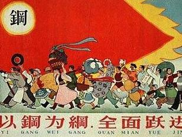
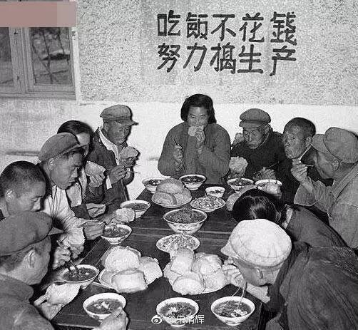

<!-- slide: 17 -->

- 反右运动（1957）
- 在1957年，毛泽东发起了反右运动，旨在清除党内外的“右派”分子。许多知识分子和社会人士因提出批评和意见被视为“右派”而遭到迫害。反右运动加剧了社会的不信任和恐惧氛围，限制了言论自由，产生了对知识分子的压制，进一步影响了国家的思想文化环境。
- 与苏联的关系恶化（1959-1960）
- 由于在社会主义建设、经济发展模式和国际政治立场上存在分歧，中国与苏联的关系逐渐恶化。1959年，苏联停止向中国提供技术援助和经济支持，这加剧了中国的独立性，尤其是在中苏边界问题上，出现了公开的冲突。
- 苏联单方面撕毁中苏经济合作协议，停止对中国的技术援助和设备供应。
- 中国不得不加强国防建设，应对苏联的军事威胁，导致国防开支增加。
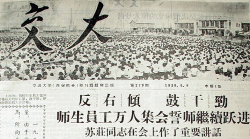
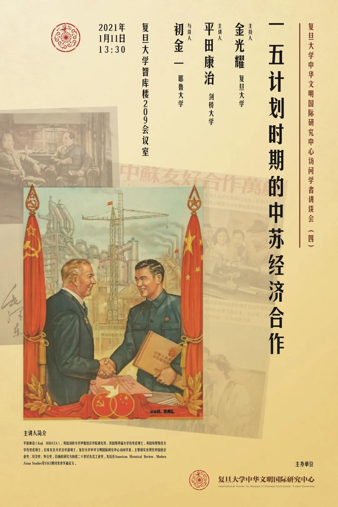

<!-- slide: 18 -->

- 历史意义
- 01
- 02
- “大跃进”虽有失误，但在探索独立工业体系方面积累经验，推动工业化进程。经济调整使国民经济恢复增长，工业与农业协调发展，为后续经济发展奠定基础。
- 这一时期的中国尝试了一些不同的政治经济政策，从大跃进到调整后的经济恢复，显示了中国在探索适合自己国情的社会主义道路中不断摸索。虽然很多政策遭遇失败，但这种探索使得中国逐步找到了更符合国情的发展模式，尤其是在1960年代的经济复苏过程中。
- 中苏关系的破裂标志着中国走上了一条更加独立的外交路线，不再依赖苏联的支持。虽然这导致了中苏之间的长时间对立，但也为中国的独立自主发展提供了空间。中苏关系恶化迫使中国发展自身的力量，摆脱外部干扰，并在接下来的几年中更加强调与其他发展中国家的合作。
- 反右运动的实施以及对知识分子的迫害，使得中国的思想文化环境变得更加封闭，言论自由受到了更大的压制。知识分子和社会人士的声讨和反思被压制，国家的思想文化发展受到了严重阻碍。

<!-- slide: 19 -->

- 三、曲折探索与历史转折（1965-1976）
- 国内：
- 经济困境：1965年国民经济调整初见成效，但“三五计划”（1966-1970）转向以备战为中心的三线建设，大量资源投入中西部军工项目，民生领域投资被压缩。
- 政治分歧：毛泽东对刘少奇、邓小平等主张的“物质刺激”“利润挂帅”提出批评，认为存在“资本主义复辟”风险，提出“阶级斗争必须年年讲、月月讲、天天讲”（1962年八届十中全会）
- 国际：
- 中苏对抗：1969年珍宝岛冲突后，苏联在中苏边境陈兵百万，威胁使用核武器，中国启动“深挖洞、广积粮”的全民备战运动。
- 中美缓和：1971年基辛格秘密访华，1972年《中美联合公报》发表，打破外交孤立；1971年中国恢复联合国合法席位，外交转向“一条线、一大片”战略（联合美欧对抗苏联）。
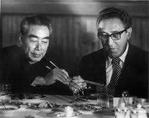

<!-- slide: 20 -->

- 主要事件
- 1966年5月中央政治局扩大会议通过《五一六通知》，成立“中央文革小组”，取代中央书记处职能。
- 红卫兵“破四旧”（旧思想、文化、风俗、习惯）导致全国文物古迹大规模损毁（如曲阜孔庙、少林寺藏经阁）。
- 1967年上海“一月风暴”引发全国夺权，各级政权瘫痪，1967-1968年工业总产值下降13.8%。
- ​1969年中共九大：林彪被确立为毛泽东接班人，"无产阶级专政下继续革命"理论写入党章。
- ​**"清理阶级队伍"运动**：以清查"叛徒""特务"为名，扩大打击面。
- ​1970年庐山会议：陈伯达倒台，林彪集团势力受挫。
- ​1971年九一三事件：林彪出逃坠机身亡，引发政治信仰危机。
- 混乱与军管（1969-1971）
- ​
- 发动阶段（1966-1969）
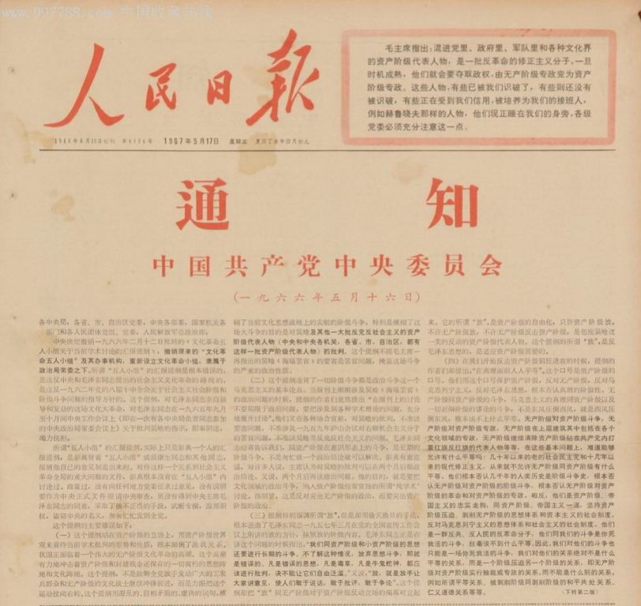
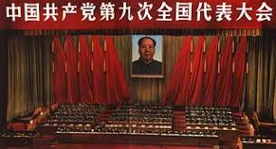

<!-- slide: 21 -->

- 主要事件
- 纠"左"与反复（1971-1976）​
- 1972年周恩来纠"左"：推动批判极左思潮，部分恢复经济秩序。
- ​1973年邓小平复出：主持国务院工作，试行整顿，但1976年再遭批判。
- ​1974年"批林批孔"运动：江青集团借批判孔子影射周恩来。
- ​1976年四五运动：民众借悼念周恩来反对"四人帮"，为文革终结铺垫。
- ​1976年10月：粉碎"四人帮"，文革正式结束。
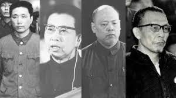
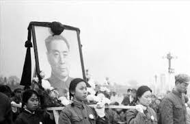

<!-- slide: 22 -->

- 历史影响&启示
- ​​影响
- 党的民主集中制遭到严重破坏，法治缺失导致大规模冤假错案（如刘少奇案）。
- 暴露了个人崇拜和权力高度集中的体制弊端，为改革开放后党内民主建设提供反面教材。
- 国民经济损失约5000亿元，工业化进程受阻，科技教育断层（如十年停招大学生）。
- 社会道德体系崩溃，人际关系极端化，留下深重精神创伤。
- 启示
- “文革”被定义为党史中的重大挫折，其彻底否定彰显了中国共产党正视错误、自我革新的政治勇气，成为坚持和发展中国特色社会主义的重要历史镜鉴，其告诉我们必须坚持实事求是，防止阶级斗争扩大化；必须健全民主法治，拒绝“群众运动治国”；必须完善党内监督，避免权力失控。

<!-- slide: 23 -->

- 1949-1976年党的自我革命实践，是中国共产党在探索社会主义建设道路中不可或缺的组成部分。其正反两方面的经验为新时代提供了重要启示：自我革命必须坚持党的领导与人民立场相统一、思想建党与制度治党相融合、问题导向与系统思维相结合。这些历史积淀，构成了习近平新时代中国特色社会主义思想中关于党的建设理论的重要历史渊源，也彰显了中国共产党始终以刀刃向内的勇气推动事业发展的政治品格。。
- 这一时期的历史证明：党具有“刀刃向内”的政治勇气。文革教训直接推动1982年宪法确立法治原则，邓小平的整顿思想发展为改革开放路线。习近平指出：“党依靠自我革命穿越历史风浪。”这种能力将历史教训转化为制度革新，成为中国特色社会主义的重要基因。
- 党的政权巩固与曲折探索总结

<!-- slide: 24 -->

- 1、真理标准问题大讨论（ 1978 ）
- 2、恢复党的纪律检查机关（ 1978-1982 ）
- 3、恢复党的纪律检查机关（ 1982-1992 ）
- 4、建立社会主义市场经济体制（ 1992-2002 ）
- 改革开放初期与市场经济建设时期（1978-2002）

<!-- slide: 25 -->

- 真理标准问题大讨论
- ——冲破思想桎梏，开启改革开放新篇章
- 01
- 《光明日报》发表特约评论员文章《实践是检验真理的唯一标准》，文章明确提出，社会实践是检验真理的唯一标准，马克思主义理论也应在实践中不断发展引发了一场关于真理标准问题的全国性大讨论这场讨论冲破了“两个凡是”的束缚，重新确定了马克思主义的思想线路，为党的十一届三中全会的召开奠定了思想基础。
- 真理标准大讨论
- 1976年“文化大革命”结束后，中国社会面临思想、政治、经济等多方面的混乱与困境。尽管“四人帮”被粉碎，但“左”倾思想仍然盛行，尤其是“两个凡是”（的方针严重束缚了人们的思想，阻碍了拨乱反正和改革开放的进程。思想界迫切需要一场解放运动，以打破教条主义和个人崇拜的桎梏。
- 历史背景
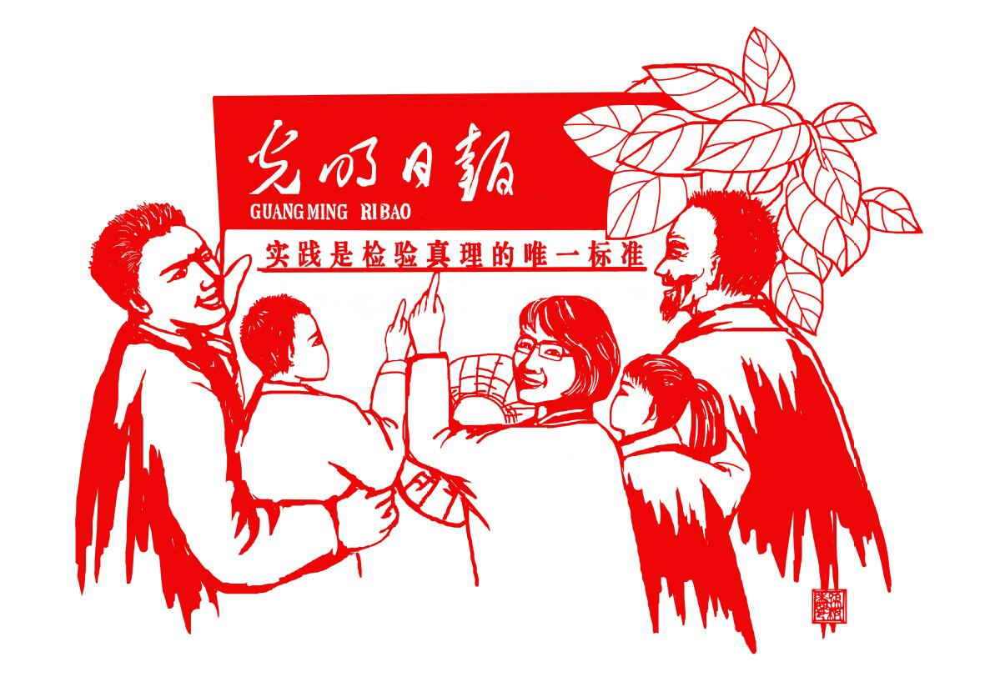
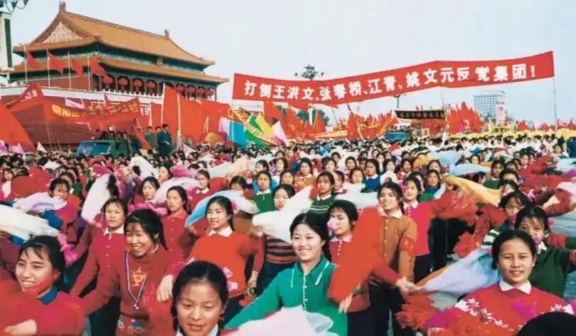

<!-- slide: 26 -->

- 恢复党的纪律检查机关：加强党内监督，维护党的团结统一
- “文化大革命”对党内监督的破坏
- 01
- “文化大革命”期间，党的纪律检查机关被撤销，党内监督严重缺失，导致党内生活不正常，党的团结统一受到破坏。这一时期，党的组织体系遭到严重冲击，许多党员干部遭受不公正对待，党的正常工作无法开展。
- 党内监督缺失的后果
- 02
- 由于缺乏有效的监督机制，党内出现了许多不正之风和腐败现象，严重影响了党的形象和威信。党的纪律松弛，一些党员干部的言行背离党的宗旨，导致党群关系紧张，党的凝聚力和战斗力受到削弱。
- 恢复纪律检查机关的紧迫性
- 03
- 党的十一届三中全会召开前夕，党内认识到恢复纪律检查机关的紧迫性。只有通过建立健全的监督机制，才能有效维护党的纪律，保障党的路线方针政策的贯彻执行，恢复党的正常秩序。
- 02

<!-- slide: 27 -->

- 恢复过程与举措
- 01
- 中央纪律检查委员会的恢复
- 1978年12月，党的十一届三中全会决定恢复中央纪律检查委员会，并选举陈云为第一书记。这一决定标志着党内监督体系开始逐步恢复，为后续的纪律检查工作奠定了基础。
- 02
- 各级纪律检查机关的建立
- 在中央纪律检查委员会的推动下，各级纪律检查机关相继恢复建立。这些机构的设立，使党内监督工作逐步走上正轨，形成了从中央到地方的完整监督网络。
- 03
- 制度建设与完善
- 恢复后的纪律检查机关在实践中不断总结经验，逐步完善监督制度和工作流程。通过制定一系列规章制度，明确了纪律检查机关的职责和权限，提高了监督工作的规范化和科学化水平。

<!-- slide: 28 -->

- 成效与影响
- 维护党的纪律
- 恢复党的纪律检查机关后，党纪党规得到了有效维护。通过严肃查处违纪行为，教育和警示了广大党员干部，使党的纪律成为不可触碰的红线，保障了党的纯洁性和先进性。
- 保障政策执行
- 维护党的团结统一
- 纪律检查机关的监督作用，确保了党的路线方针政策在各级党组织和党员干部中得到不折不扣的贯彻执行。有力地推动了改革开放和社会主义现代化建设的顺利进行，为国家的发展提供了坚实的纪律保障。
- 恢复纪律检查机关，有效解决了党内存在的矛盾和问题，维护了党的团结统一。增强了党组织的凝聚力和战斗力，使党能够更好地应对各种挑战，带领全国各族人民实现中华民族的伟大复兴。

<!-- slide: 29 -->

- 恢复党的纪律检查机关：加强党内监督，维护党的团结统一
- 整党运动分批进行，从中央到地方逐步展开。各级党组织按照统一部署，认真组织党员干部参与整党运动，确保整党工作取得实效。
- 整党运动的实施步骤
- 1983年10月，党的十二届二中全会通过《中共中央关于整党的决定》，决定用三年时间对党的作风和组织进行一次全面整顿。这一决定为整党运动明确了方向和目标。
- 整党决定的通过
- 整党运动以统一思想、整顿作风、加强纪律、纯洁组织为基本任务。通过学习教育、自查自纠、民主评议等环节，对党员干部的思想、作风、组织等方面进行全面整顿。
- 整党运动的基本任务
- 02
- 03
- 01
- 03

<!-- slide: 30 -->

- 成效与意义
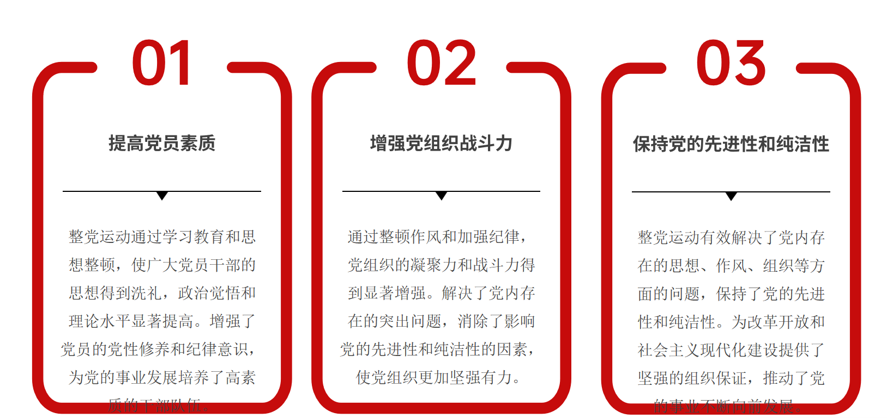

<!-- slide: 31 -->

- 国际背景：
  - 1991年苏联解体后，全球社会主义国家从23个减少到5个
  - 西方舆论：“中国崩溃论”与“历史终结论”双重压力
- 国内矛盾：
  - 1988年价格闯关引发抢购潮（居民储蓄下降300亿元）
  - 1991年国企“三角债”规模达3000亿元,传统计划经济体制的弊端日益显现，经济发展受到诸多限制。
- 04
- 建立社会主义市场经济体制
- ——突破传统观念，开创中国特色社会主义道路
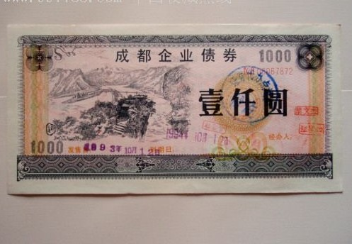
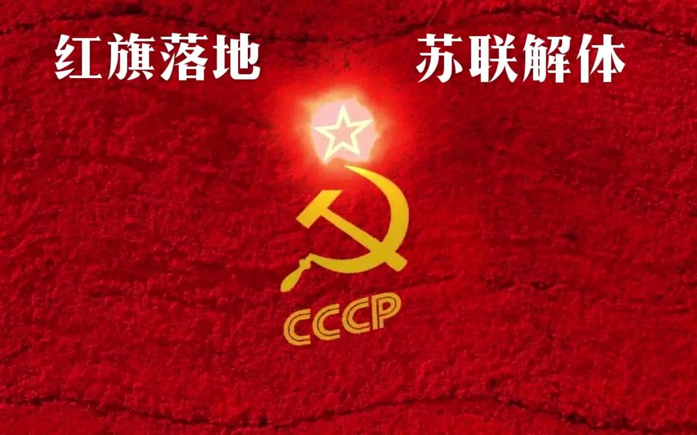

<!-- slide: 32 -->

- 社会主义市场经济体制的建立
- 关键事件与突破
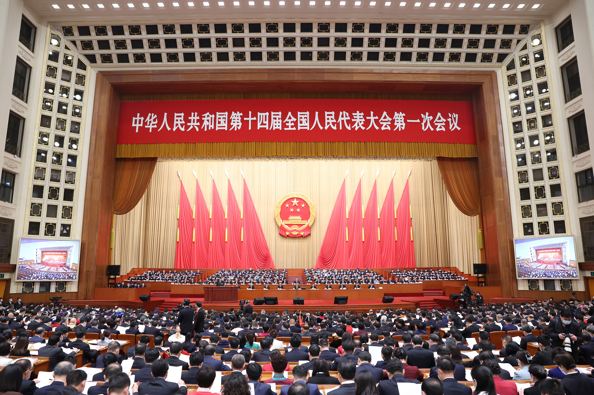
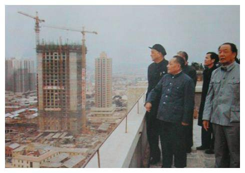
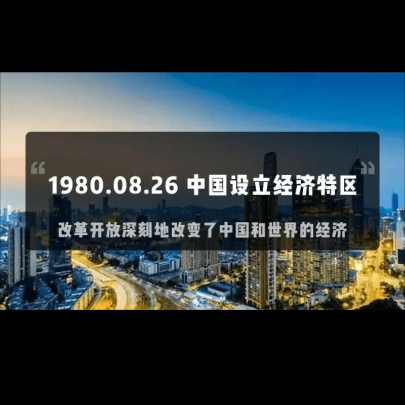
- 1978年十一届三中全会作出改革开放决策，启动农村改革和设立经济特区
- 1992年，邓小平同志发表南方谈话，强调“发展才是硬道理”，回答了长期束缚人们思想的许多重大认识问题，为改革注入强大动力。
- 1992年，党的十四大明确提出建立社会主义市场经济体制的改革目标，标志着中国改革开放进入新阶段。

<!-- slide: 33 -->

- 社会主义市场经济体制的建立
- 理论与制度的双重创新
- 理论创新：
- 邓小平南方谈话和党的十四大提出建立社会主义市场经济体制，突破了传统观念中将计划经济与市场经济对立起来的束缚，将社会主义基本制度与市场经济体制相结合，形成中国特色社会主义理论体系的重要组成部分。
- 制度创新：
- 建立社会主义市场经济体制，引入市场机制，激发了经济活力，使市场在资源配置中起决定性作用，同时保持国家宏观调控的有效性，开创了中国特色社会主义道路。

<!-- slide: 34 -->

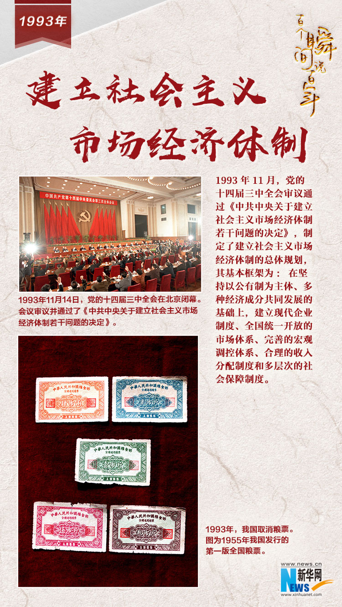
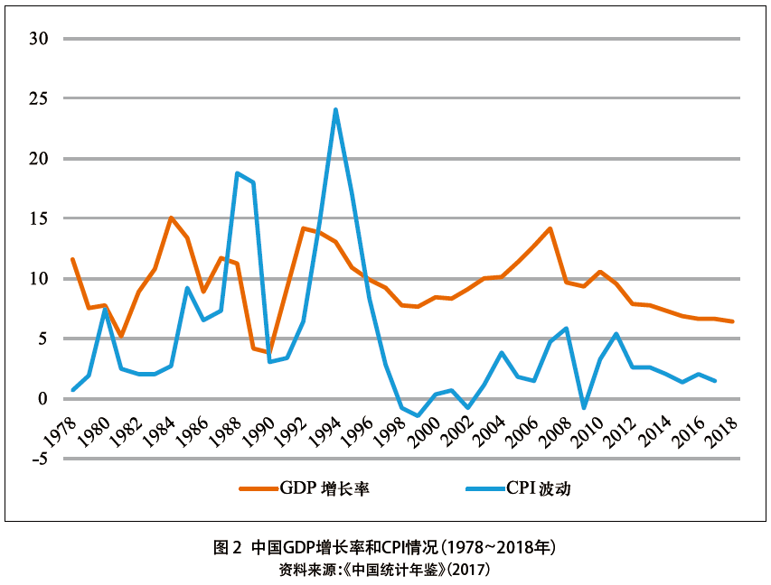
- 社会主义市场经济体制的建立使中国经济持续快速增长，GDP年均增长约9.5%，经济总量增长200多倍，市场调节价比重从3%上升到近98%，市场主体从不足50万户增加到1亿户以上，推动了中国从计划经济向市场经济的转型，有效提高了经济效率和国际竞争力。

<!-- slide: 35 -->

- 全面建设小康社会与跨入新时代（2002-至今）
- 习近平总书记指出：“勇于自我革命，是我们党最鲜明的品格，也是我们党最大的优势。”

<!-- slide: 36 -->

- 历史沿革中的关键事件

- 2007年：十七大提出“反腐倡廉建设”新定位
- 2012年：十八大提出“全面从严治党”战略
- 2021年：建党百年提出“自我革命是跳出历史周期率的第二个答案”
- 2022年：中共二十大强调“自我革命永远在路上”，要求“完善党的
- 自我革命制度规范体系”
- 2016年：国家监察体制改革试点启动
- 2018年：中央纪委国家监委的设立

<!-- slide: 37 -->

- 中共中央、国务院发出《关于开展扫黑除恶专项斗争的通知》
- 2018年1月：
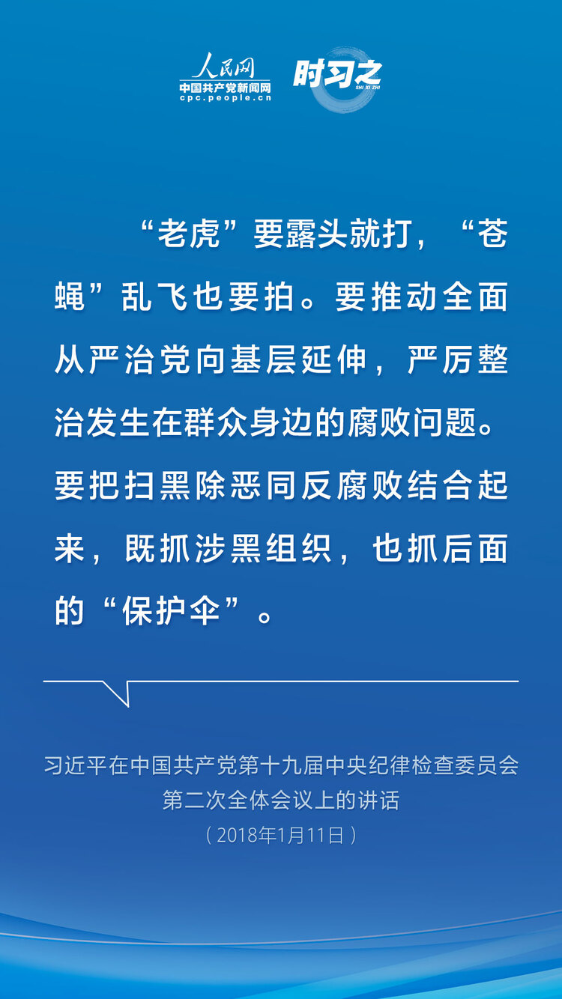

<!-- slide: 38 -->

- 中华人民共和国国家监察委员会成立
- 2018年3月：
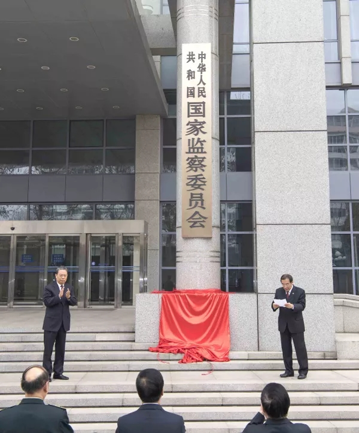

<!-- slide: 39 -->

- 2018年中央纪委国家监委的设立

- 01
- 03
- 02
- 创新性：
- 是党的自我革命在体制机制上的重大创新
- 背景：
- 为了整合反腐败资源力量，实现党内监督和国家监督有机统一，构建集中统一、权威高效的国家监察体系。
- 意义：
- 加强党对反腐败工作的集中统一领导，完善党和国家监督体系，使监督更加全面、深入和有效，有力整治腐败问题，维护党的纪律和规矩，确保党的肌体健康，体现全面从严治党的决心和勇气，提供组织保障。

<!-- slide: 40 -->

- 扫黑除恶专项斗争正式开展

- ——“老虎要露头就打，“苍蝇”乱飞也要拍
- “保护伞”
- 刘汉案，充分暴露了“保护伞”对黑恶势力蔓延、猖獗的助长作用
- 基层管理
- 扫黑除恶
- 共查处涉黑涉恶腐败和“保护伞”案件约10.5万起，给予党纪政务处分约10.8万人，移送司法机关约1.1万人
- 清理了约4.2万名不符合条件的村（社区）“两委”成员，对12万个软弱涣散基层党组织进行了整顿，强化了基层政权建设

<!-- slide: 41 -->

- 如果说改革开放时代的自我革命是为了“跟上时代”，那么新时代的自我革命就是为了“引领时代”。
- 这个阶段，党的目标不再是简单地适应外部环境，而是要在长期执政条件下，解决自身存在的深层次问题，确保党始终成为中国特色社会主义事业的坚强领导核心
- 小结：进入新时代，党的自我革命发生了质的变化

<!-- slide: 42 -->

- 总结
- 中国共产党百年历程——波澜壮阔的自我革命史

<!-- slide: 43 -->

- 谢谢大家
