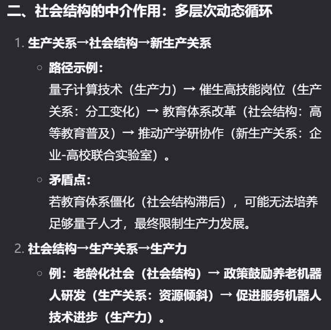
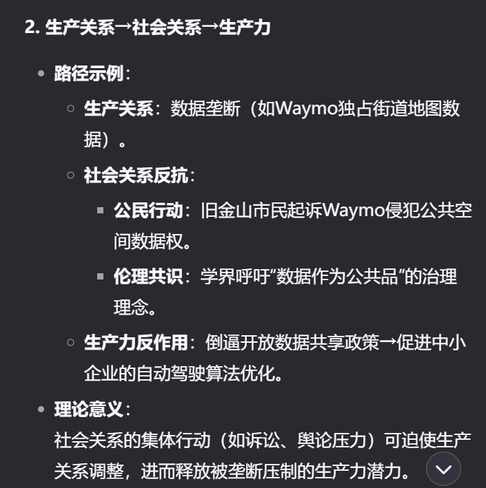
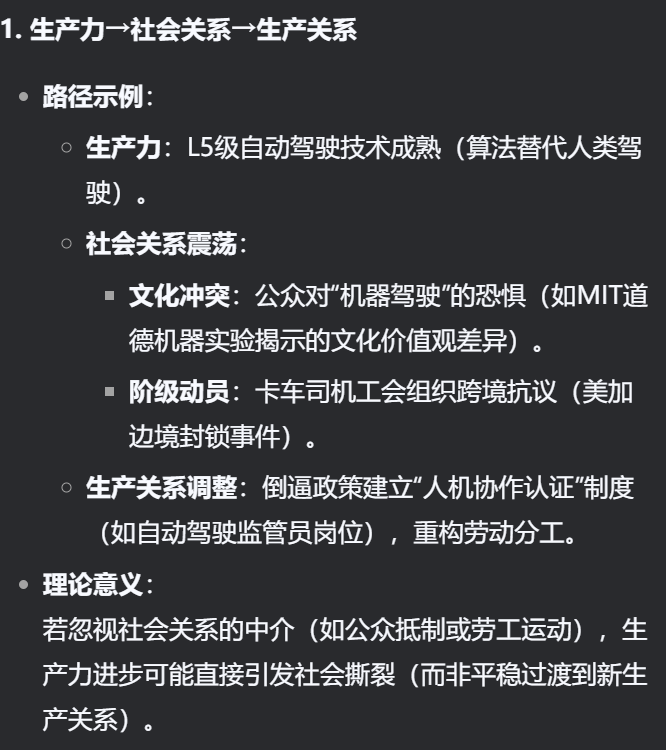

# 演讲观点

三个引述关系：

理论必须适应于实际

过去

现在

不远的将来

1，3，5，6：生产力的进步

2，4，7，8：生产关系的重塑

我们思考一下，金融 量子 生物科技 社会政策 如果只从生产力生产关系角度去思考，会不会难以解释其跳脱性呢？

这个环，只是从各个大方向选取了部分，究竟是如何联系的呢？

我认为

生产力与生产关系的互动并非简单线性，而是通过社会结构（文化、教育、阶层等）形成多层次、多向度的动态网络。其中，社会结构既是生产关系变革的结果，也是新生产关系形成的条件，同时构成生产力发展的外部环境。

我说的话什么意思？

考虑到大家的知识储备不一，让我们从马克思主义原理的教材获取底层逻辑知识，再进行自我思想革新

至13页后：

学习完了教材逻辑，我们现在回顾一下我刚刚的个人观点：**每个生产力显然会互置于生产关系，但生产关系的改变后续还会带动社会结构的改变，而社会结构的改变显然也是会带动其他的生产关系的变革，同时也会影响到生产力的发展**

实际上，生产力与生产关系显然是直接互动的关系；**但是我们后续研究到生产关系的相互作用，其实还有社会结构作为中介。**

**社会关系的作用是什么？我觉得社会关系是传导矛盾的“缓冲层”与“催化剂”，是技术冲击的缓冲垫，也是制度变革的起爆剂。**

缓冲层：社会生产力此时的片面发展导致的社会矛盾被缓冲

催化剂

生产力与生产关系通过社会结构中介，形成“技术进步→制度调整→社会变迁→再创新”的螺旋上升循环。在这一过程中，需警惕“技术决定论”陷阱（忽视制度与文化弹性），同时避免“制度万能论”（低估技术革命的颠覆性）。唯有承认三者的交织性与不确定性，才能更精准地引导技术造福人类社会。

回到马克思的预言——‘蒸汽磨产生工业资本家的社会’。今天，‘数据磨’正在锻造算法时代的社会形态。自动驾驶的每一次事故争议、每一条新法规，都是生产力与生产关系碰撞的火花。当我们凝视方向盘消失的汽车时，看到的不仅是技术奇迹，更是人类文明在矛盾中螺旋上升的永恒铁律。
