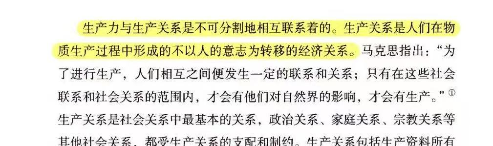
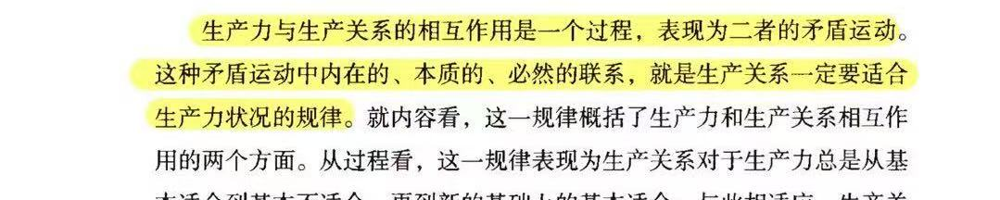
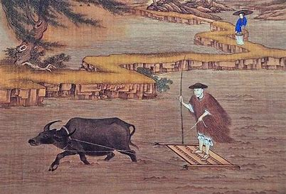
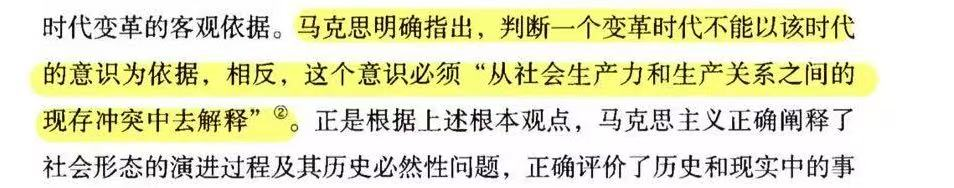
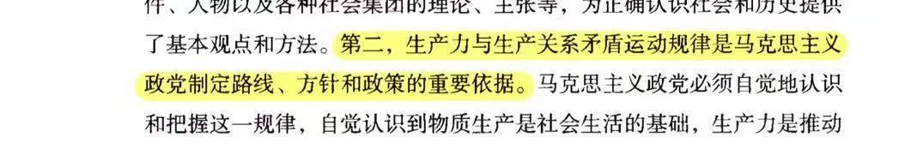
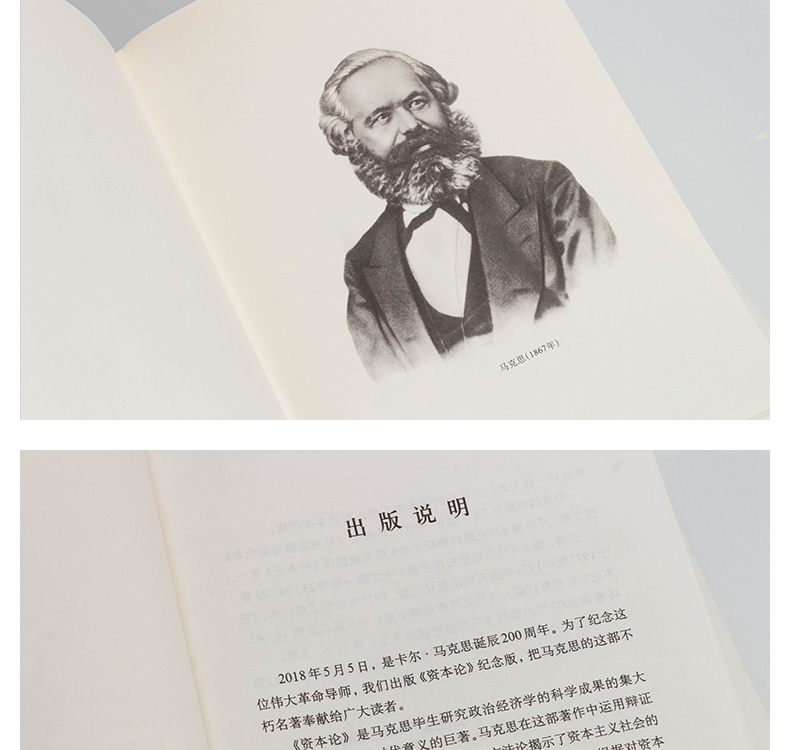
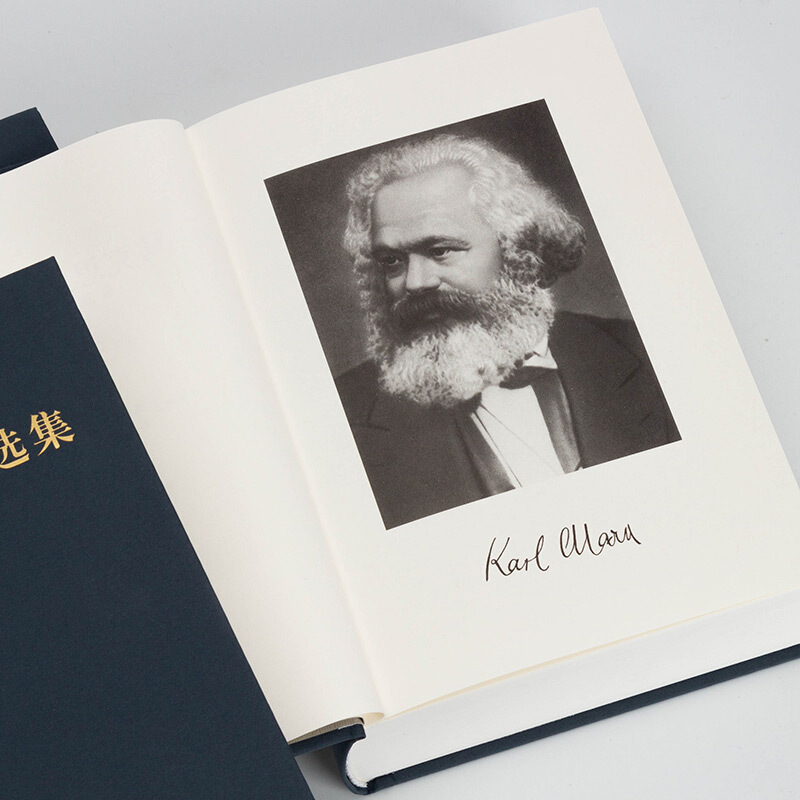

# 科技发展与社会变革：生产力与生产关系视角

<!-- slide: 1 -->

- 科技发展与社会变革：生产力与生产关系视角
- 汇报：于博宇
- 资料收集：于淑怡 杨浩然
- PPT制作：姚泽文

<!-- slide: 2 -->

- content
- 目录
- 01
- 引言：科技发展与人类社会的变革
- 02
- 教材理论解析
- 03
- 典型案例分析：自动驾驶引发的社会变革
- 04
- 总结与展望

<!-- slide: 3 -->

- 引言：科技发展与人类社会的变革
- 01

<!-- slide: 4 -->

- 经典引述

- 马克思的洞见
- 马克思在《哲学的贫困》（1847年）中提出：“手推磨产生的是封建主的社会，蒸汽磨产生的是工业资本家的社会。”（原文：“The windmill gives you society with the feudal lord; the steam-mill, society with the industrial capitalist.”）这一观点强调生产力（生产工具和技术）的进步推动生产关系的变革，进而决定社会形态的演进。

- 邓小平的论断

- 赫拉利的预言
- 赫拉利在书中（及多次公开演讲）强调： “在21世纪，数据（而非土地、机器）成为关键生产资料，控制数据意味着控制未来。” “谁掌握了数据流，谁就掌握了全球经济和政治的权力结构。”
- 首次提出（1988年9月）：邓小平在会见捷克斯洛伐克总统古斯塔夫·胡萨克时明确表示：“马克思说过，科学技术是生产力，事实证明这话讲得很对。依我看，科学技术是第一生产力。”
- 深化论述（1992年南方谈话）：他在南巡讲话中再次强调：“经济发展得快一点，必须依靠科技和教育。我说科学技术是第一生产力。近一二十年来，世界科学技术发展得多快啊！高科技领域的一个突破，带动一批产业的发展。”
- 邓小平的这一论断突破了传统对生产力要素（劳动力、工具等）的认知，将科技置于推动经济发展的首要地位，为中国改革开放后的科教兴国战略、高新技术产业发展奠定了理论基础。

<!-- slide: 5 -->

- 当代科技图景

- 产业规模突破
- 人工智能产业规模已突破5000亿美元，对全球经济产生深远影响。
- 全球经济重塑
- 随着AI技术的发展，全球经济格局正在被重新塑造，新兴市场不断涌现。
- 量子计算进展
- IBM推出的1121量子位处理器标志着量子计算领域取得了重大突破。
- 计算新时代开启
- 该处理器的问世将引领计算技术进入一个全新的时代，加速科研与工业应用。
- 基因编辑成本降低
- 基因编辑技术的成本显著下降了90%，这极大地促进了生物技术领域的创新与发展。
- 生物科技加速发展
- 低成本的基因编辑工具使得更多研究机构和个人能够参与其中，推动了整个行业的进步。
- 社会议题浮现
- 在技术快速发展的背景下，数据所有权、零工经济中的劳动者权益以及AI作品的版权等问题日益受到关注。
- 政策法规待完善
- 面对这些新出现的社会议题，需要政府、企业和公众共同努力，完善相关政策法规体系。

<!-- slide: 6 -->

- 教材理论解析：生产力与生产关系矛盾运动规律原理
- 02

<!-- slide: 7 -->

- 生产力与生产关系
- 生产力：人类改造自然、获取物质资料的能力，包括劳动者、劳动工具、劳动对象三要素，现代还包括科学技术、管理等要素。
- 生产关系：人们在生产过程中结成的经济关系，包括生产资料所有制、生产中的地位和相互关系、产品分配方式。

- 一、生产力对生产关系的决定作用
- (1) 生产力的性质与水平决定生产关系的性质与形式
- (2) 生产力的发展决定生产关系的发展和变革
- 二、生产关系能反作用于生产力
- (1) 生产关系须适应生产力，进而推动生产力发展
- (2) 生产关系不适应生产力，会阻碍生产力发展

<!-- slide: 8 -->

- 几个重要阶段的生产力和生产关系

- 农业革命
- 生产工具：从石器、木器 → 青铜器、铁器。
- 农业技术：
- 轮作制（如欧洲“三圃制”）减少土地休耕，提升产量。
- 水利工程（如灌溉系统）支持稳定农业生产。
- 劳动对象：从采集野生植物 → 人工种植作物（小麦、水稻等），形成定居农业。
- 农业革命后（社会形态）：
- 私有制确立：土地被家族/贵族占有，剩余产品催生阶级。
- 剥削关系：
- 奴隶制（早期）：战俘成为奴隶，强制劳动（如古埃及、罗马）。
- 封建制（成熟期）：地主占有土地，农民（农奴/佃农）缴纳地租（劳役、实物或货币）。
- 社会组织：以庄园经济（欧洲）、小农经济（中国）为基本单位。形成君主-贵族-农民的等级制度。

<!-- slide: 9 -->

- 几个重要阶段的生产力和生产关系

- 工业革命
- 1.生产力飞跃
- 核心发明：蒸汽机（瓦特改良，18世纪末）→ 取代人力、畜力，成为主要动力源。
- 机械化生产：纺织机（如珍妮机）、蒸汽机车、炼钢技术（贝塞麦转炉）大幅提升效率。
- 能源变革：从木材、水力 → 煤炭（驱动蒸汽机），后发展石油、电力。
- 交通与通信：铁路（19世纪）、轮船（蒸汽动力）打破地域限制；电报（1830s）加速信息传递，促进全球贸易。
- 2. 生产关系转型（社会结构重塑）
- 前工业社会：
- 封建制：贵族垄断土地，农民依附庄园，手工业受行会限制。
- 工业革命后：
- 资本主义雇佣制：资本家（工厂主）掌握机器、原料，工人（无产者）出卖劳动力。
- 剥削形式：剩余价值（工人创造的价值＞工资）。
- 阶级结构：资产阶级（工厂主、商人） vs. 无产阶级（工人）。
- 经济组织：
- 家庭作坊 → 工厂制度（集中生产，标准化分工）。
- 自由竞争 → 垄断资本（19世纪末出现托拉斯、卡特尔）。

<!-- slide: 10 -->

- 几个重要阶段的生产力和生产关系

- 信息革命
- 1.生产力变革（技术飞跃）
- 核心技术突破：
- 计算机（1940s） → 实现数据自动化处理
- 互联网（1990s） → 全球实时信息连接
- 人工智能/大数据（21世纪） → 机器自主决策与预测
- 移动通信（4G/5G） → 打破时空限制
- 生产要素升级：
- 数据成为核心资源（替代石油），算法成为新“生产工具”，算力成为新“动力源”
- 生产组织方式：
- 平台经济（如Uber、淘宝），远程协同（Zoom、钉钉），智能制造（工业4.0）
- 2. 生产关系转型（社会重构）
- 传统经济：资本-雇佣劳动制，明确的企业边界
- 信息经济新特征：
- 数据垄断：科技巨头控制关键生产资料
- 零工经济：模糊的劳动关系（外卖骑手等）
- 价值创造方式：用户生成内容（UGC）成为价值来源

<!-- slide: 11 -->

- 生产力与生产关系矛盾辩证关系
- 人类社会发展进程中，要变革旧的生产关系既能通过阶级斗争，也能吸取先进因素革新落后生产关系来适应先进生产力发展。从原始社会到社会主义社会的发展来看，革新生产关系的阶级力量源于生产力的发展趋势，决定生产关系的产生、变革的方向与形式。不同时期，生产力每前进一步，就会形成前一阶级与后一阶级的连接点，构成人类发展的连续性。但特定质的生产力与之相适应特定质的生产关系，有相对稳定性，构成特定质的生产方式，各种质的生产方式使社会发展具有间断性、阶级性。先进生产与相对稳定生产关系间必然存在矛盾。矛盾是生产关系与生产力从适应到不适应，通过斗争产生新适应，不断的循环、革新生产方式，推动社会从低级向高级发展。

<!-- slide: 12 -->

- 生产力与生产关系矛盾辩证关系
- 这一规律揭示了社会发展的根本动力机制。历史唯物主义认为，生产力（如生产工具、技术水平）的进步会与现存的生产关系（如所有制形式、分配方式）产生矛盾，当矛盾积累到一定程度时，就会引发社会变革。这一过程不是线性的，而是通过矛盾-调整-新矛盾的形式不断推动社会向前发展。对马克思主义政党而言，把握这一规律具有重要的现实意义。在政策制定时，需要敏锐洞察生产力发展的新趋势（如当前数字化转型），及时调整生产关系中的不适应部分。这要求既不能阻碍生产力发展，又要防止生产关系滞后引发社会矛盾激化。这一规律提供了分析社会问题的科学方法。在考察任何社会现象时，都要考察其背后的生产力和生产关系状况。特别是在技术快速变革时期，更要关注新技术带来的生产力变化，以及由此产生的制度调整需求。

<!-- slide: 13 -->

- 典型案例分析：自动驾驶引发的社会变革
- 03

<!-- slide: 14 -->

- 技术突破
- Waymo里程新高
- 截至2023年，Waymo自动驾驶测试里程已突破2000万英里，彰显技术成熟度提升。
- L4级商用扩展
- L4级自动驾驶技术在20个城市实现商用落地，标志着自动驾驶进入实用阶段。
- 技术创新趋势
- 自动驾驶技术持续迭代，推动智能交通系统革新，预示着未来出行方式的根本性转变。

<!-- slide: 15 -->

- 生产关系重构

- 自动驾驶技术影响
- 职业结构调整
- 预计2030年全球司机岗位减少500万
- 就业市场面临重大转型
- 法律与责任
- 特斯拉事故凸显算法责任问题
- 法律需明确自动驾驶系统与人类驾驶员的责任边界
- 政策法规
- 中国出台《自动驾驶汽车运输安全服务指南》
- 引领全球自动驾驶法规建设
- 技术伦理
- 技术伦理与文化适应性成为焦点
- MIT道德机器实验揭示全球价值观差异

<!-- slide: 16 -->

- 生产关系重构
- 1.技术飞跃：新生产力对旧秩序的冲击
- 生产力维度：
- 传感器/算法替代人类驾驶（L5级自动驾驶效率提升300%）
- 车联网实现万亿级数据交换（每秒处理8TB道路信息）
- 矛盾显现：
- 现有交通法规基于人类驾驶逻辑（如“方向盘后必须有人”），保险体系仍要求“驾驶员责任认定”。
- 案例：2023年加州自动驾驶测试车因法律滞后被迫安装无用方向盘
- 2. 生产关系的滞后与挣扎
- 制度性矛盾：
- 劳动市场：300万卡车司机工会抗议自动驾驶货车（美加边境封锁事件）
- 产权困境：个人车辆所有权vs未来"出行即服务"（特斯拉已试行订阅制）
- 数据归属：谁拥有自动驾驶采集的街道数据？（旧金山起诉Waymo案）
- 3. 社会矛盾推动制度创新
- 适应性变革：
- 德国《自动驾驶法》首创“数字驾驶员”法律身份，中国设立"智能交通先行区"进行法规沙盒测试
- 新型保险产品："算法责任险"保费与OTA更新挂钩
- 深层变革信号：
- 城市规划从"以车为本"转向"以流为本"（取消红灯/停车位）
- 劳动力市场出现"人机协作认证"（如自动驾驶系统监管员）

<!-- slide: 17 -->

- 启示
- 自动驾驶的普及像一面镜子，照出了技术进步与社会规则之间的深刻裂痕。当汽车不再需要人类驾驶时，我们突然发现：工厂能三个月造出自动驾驶卡车，但社会需要三十年才能消化被淘汰的三百万司机；算法每秒处理百万条道路数据，但法律还在争论事故责任该由车主还是程序员承担；科技公司掌握着每辆车的行驶轨迹，但普通人对自己产生的数据毫无话语权。这不仅是机器替代人的问题，更暴露了工业时代建立的产权制度、职业体系、法律框架在数字浪潮前的全面过时。就像两百年前蒸汽机冲垮了马车时代，今天的数据洪流正在重塑"谁拥有资源、如何分配价值"的根本规则——只不过这次变革的赌注更大：如果我们不能及时建立数据时代的"交通规则"，那么掌握算法的巨头可能成为新时代的"道路领主"，而普通人将在自己创造的数据高速公路上失去方向。正是这些不断堆积的矛盾，逼迫着人类拆解旧制度的齿轮，锻造新社会的轴承，在阵痛中完成文明升级。历史从来不是直线前进，而是在生产力与生产关系的碰撞中，迸发出改变世界的火花。

<!-- slide: 18 -->

- 总结与展望
- 04

<!-- slide: 19 -->

- 总结
- 从马克思主义哲学的“生产力与生产关系矛盾运动规律”来看，科学技术作为生产力的核心要素，是推动生产力发展的关键力量。它通过变革生产力要素，推动生产力的发展，进而引发生产关系的变革。同时，生产关系的性质和形式也会影响科学技术的发展方向和速度。科学技术的进步不仅推动了生产力的发展，还引发了社会形态的变革。从农业社会到工业社会，再到信息社会，每一次变革都深刻地改变了人类社会的面貌。

<!-- slide: 20 -->

- 展望
- 社会制度的变革始终滞后于生产力的发展。这一点在所有历史阶段中都得到了验证。然而，这并不意味着生产关系永远被动适应生产力。社会制度的调整也在一定程度上反作用于科技的发展，使其以更加可持续的方式推动人类进步。例如，当资本主义在早期工业化阶段过度剥削工人时，社会保障体系的建立不仅稳定了社会秩序，也为后续的科技创新提供了更稳固的社会基础。如今，在人工智能迅猛发展的时代，如何建立合理的数据治理体系，如何防止财富过度集中，如何保证就业市场的平稳过渡，正成为全球范围内关注的焦点。

<!-- slide: 21 -->

- 展望
- 科技的发展并不天然带来社会进步，关键在于如何调整生产关系以匹配生产力的变革。这一点在AI时代尤为重要。人工智能的快速发展已经改变了人类与劳动的关系，越来越多的传统岗位被AI取代，如何重新分配财富、如何确保人类不被边缘化，将决定科技是否能真正为全人类服务。如果生产关系的调整无法跟上生产力的发展，科技的红利将主要被少数资本掌控，社会贫富分化加剧，甚至可能引发更严重的政治和经济危机。
- 历史的经验告诉我们，每一次科技突破带来的社会变革都不会是线性、平稳的，而是伴随着阵痛与冲突。社会在适应科技变革的过程中，需要不断探索新的制度安排，使得生产力的提升能够真正转化为全社会的福祉，而非被少数资本所垄断。从工业革命到信息革命，再到即将全面到来的人工智能革命，这一生产力与生产关系的矛盾运动规律始终主导着人类社会的前进方向。未来，只有在制度创新的推动下，科技的力量才能真正成为推动社会进步的动力。

<!-- slide: 22 -->

- THANKS
