# 数模大全

<!-- page: 1 -->

目录
第一章     线性规划
第二章     整数规划
第三章     非线性规划
第四章     动态规划
第五章     图与网络模型及方法
第六章     排队论模型
第七章     对策论
第八章     层次分析法
第九章     插值与拟合
第十章     数据的统计描述和分析
第十一章   方差分析
第十二章   回归分析
第十三章   微分方程建模
第十四章   稳定状态模型
第十五章   常微分方程的解法
第十六章   差分方程模型
第十七章   马氏链模型
第十八章   动态优化模型
第十九章   神经网络模型
第二十章   偏微分方程的数值解
第二十一章 目标规划
第二十二章 模糊数学模型
第二十三章 现代优化算法
第二十四章 时间序列模型
第二十五章 存贮论
第二十六章 经济与金融中的优化问题
第二十七章 生产与服务运作管理中的优化问题
第二十八章 灰色系统理论及其应用
第二十九章 多元分析
第三十章   偏最小二乘回归

<!-- page: 2 -->

第一章  线性规划
§1  线性规划

在人们的生产实践中，经常会遇到如何利用现有资源来安排生产，以取得最大经济
效益的问题。此类问题构成了运筹学的一个重要分支—数学规划，而线性规划(Linear
Programming 简记LP)则是数学规划的一个重要分支。自从1947 年G. B. Dantzig 提出
求解线性规划的单纯形方法以来，线性规划在理论上趋向成熟，在实用中日益广泛与深
入。特别是在计算机能处理成千上万个约束条件和决策变量的线性规划问题之后，线性
规划的适用领域更为广泛了，已成为现代管理中经常采用的基本方法之一。

1.1 线性规划的实例与定义
例1  某机床厂生产甲、乙两种机床，每台销售后的利润分别为4000 元与3000 元。
生产甲机床需用
B
A、
机器加工，加工时间分别为每台2 小时和1 小时；生产乙机床
需用
C
B
A
、
、
三种机器加工，加工时间为每台各一小时。若每天可用于加工的机器时
数分别为A 机器10 小时、B 机器8 小时和C 机器7 小时，问该厂应生产甲、乙机床各
几台，才能使总利润最大？

上述问题的数学模型：设该厂生产
1x 台甲机床和
2x 乙机床时总利润最大，则
2
1, x
x
应满足

（目标函数）
2
1
3
4
max
x
x
z
+
=
                                     (1)

≤
+

⎧

10
2

x
x

2
1

⎪⎪
⎨

≤
+

8

x
x

2
1

s.t.（约束条件）

                                    （2）

≤

x

7

⎪
⎪
⎩

2

≥

0
,

x
x

2
1

这里变量
2
1, x
x
称之为决策变量，（1）式被称为问题的目标函数，（2）中的几个不等式
是问题的约束条件，记为s.t.(即subject to)。由于上面的目标函数及约束条件均为线性
函数，故被称为线性规划问题。

总之，线性规划问题是在一组线性约束条件的限制下，求一线性目标函数最大或最
小的问题。

在解决实际问题时，把问题归结成一个线性规划数学模型是很重要的一步，但往往
也是困难的一步，模型建立得是否恰当，直接影响到求解。而选适当的决策变量，是我
们建立有效模型的关键之一。

1.2 线性规划的Matlab 标准形式
线性规划的目标函数可以是求最大值，也可以是求最小值，约束条件的不等号可以
是小于号也可以是大于号。为了避免这种形式多样性带来的不便，Matlab 中规定线性
规划的标准形式为

T
min

x
c
x

≤

⎧

b
Ax

⎪⎨

=
⋅

beq
x
Aeq

                 s.t.

⎪⎩

≤
≤

ub
x
lb

其中c 和x 为n 维列向量，A 、Aeq 为适当维数的矩阵，b 、beq 为适当维数的列向
量。

-1-

<!-- page: 3 -->

例如线性规划

T
≥
s.t.
max

b
Ax
x
c
x

的Matlab 标准型为

T
−
≤
−
−
s.t.
min

b
Ax
x
c
x

1.3 线性规划问题的解的概念
一般线性规划问题的（数学）标准型为

n

∑

=
=

1
max
                                          (3)

j
j x
c
z

j

⎧

n

=
=
∑

m
i
b
x
a

,
,2,1

L

⎪⎨

i
j
ij

s.t.

                                 (4)

=

j

1
L

⎪⎩

=
≥

n
j
x

,
,2,1
0

j

可行解  满足约束条件（4）的解
)
,
,
,
(
2
1
nx
x
x
x
L
=
，称为线性规划问题的可行解，

而使目标函数（3）达到最大值的可行解叫最优解。

可行域  所有可行解构成的集合称为问题的可行域，记为R 。
1.4 线性规划的图解法

1 0

9

2 x 1 + x 2 = 1 0

8

7

x 2 = 7

6

( 2 ,6 )

5

4

3

2

x 1 + x 2 = 8

1

z = 1 2

0
2
4
6
8
1 0
0

图1  线性规划的图解示意图
图解法简单直观，有助于了解线性规划问题求解的基本原理。我们先应用图解法来
求解例1。对于每一固定的值z ，使目标函数值等于z 的点构成的直线称为目标函数等
位线，当z 变动时，我们得到一族平行直线。对于例1，显然等位线越趋于右上方，其

上的点具有越大的目标函数值。不难看出，本例的最优解为
T
x
)
6,2
(
* =
，最优目标值
26
* =
z
。
从上面的图解过程可以看出并不难证明以下断言：
（1）可行域R 可能会出现多种情况。R 可能是空集也可能是非空集合，当R 非空
时，它必定是若干个半平面的交集（除非遇到空间维数的退化）。R 既可能是有界区域，
也可能是无界区域。

（2）在R 非空时，线性规划既可以存在有限最优解，也可以不存在有限最优解（其
目标函数值无界）。

-2-

<!-- page: 4 -->

（3）若线性规划存在有限最优解，则必可找到具有最优目标函数值的可行域R 的
“顶点”。

上述论断可以推广到一般的线性规划问题，区别只在于空间的维数。在一般的n 维

n

空间中，满足一线性等式∑

=

i
i
b
x
a

1
的点集被称为一个超平面，而满足一线性不等式

=

i

n

n

∑

1
（或∑

≤

≥

i
i
b
x
a

1
）的点集被称为一个半空间（其中
)
,
,
(
1
n
a
a L
为一n 维行

i
i
b
x
a

=

=

i

i

向量，b 为一实数）。若干个半空间的交集被称为多胞形，有界的多胞形又被称为多面
体。易见，线性规划的可行域必为多胞形（为统一起见，空集Φ 也被视为多胞形）。
在一般n 维空间中，要直接得出多胞形“顶点”概念还有一些困难。二维空间中的顶点
可以看成为边界直线的交点，但这一几何概念的推广在一般n 维空间中的几何意义并不
十分直观。为此，我们将采用另一途径来定义它。

定义1  称n 维空间中的区域R 为一凸集，若
R
x
x
∈
∀
2
1,
及
)1,0
(
∈
∀λ
，有
R
x
x
∈
−
+
2
1
)
1(
λ
λ
。
定义2  设R 为n 维空间中的一个凸集，R 中的点x 被称为R 的一个极点，若不

存在
R
x
x
∈
2
1、
及
)1,0
(
∈
λ
，使得
2
1
)
1(
x
x
x
λ
λ
−
+
=
。
定义1 说明凸集中任意两点的连线必在此凸集中；而定义2 说明，若x 是凸集R
的一个极点，则x 不能位于R 中任意两点的连线上。不难证明，多胞形必为凸集。同
样也不难证明，二维空间中可行域R 的顶点均为R 的极点（R 也没有其它的极点）。

1.5 求解线性规划的Matlab 解法
单纯形法是求解线性规划问题的最常用、最有效的算法之一。这里我们就不介绍
单纯形法，有兴趣的读者可以参看其它线性规划书籍。下面我们介绍线性规划的Matlab
解法。

Matlab 中线性规划的标准型为

T
min

x
c
x

≤

⎧

b
Ax

⎪⎨

=
⋅

beq
x
Aeq

                 s.t.

⎪⎩

≤
≤

ub
x
lb

基本函数形式为linprog(c,A,b)，它的返回值是向量x 的值。还有其它的一些函数调用形
式（在 Matlab 指令窗运行 help linprog 可以看到所有的函数调用形式），如：

[x,fval]=linprog(c,A,b,Aeq,beq,LB,UB,X0,OPTIONS)
这里fval 返回目标函数的值，LB 和UB 分别是变量x 的下界和上界，0x 是x 的初始值，

OPTIONS 是控制参数。

例2  求解下列线性规划问题
3
2
1
5
3
2
max
x
x
x
z
−
+
=

s.t.
7
3
2
1
=
+
+
x
x
x

10
5
2
3
2
1
≥
+
−
x
x
x

12
3
3
2
1
≤
+
+
x
x
x

0
,
,
3
2
1
≥
x
x
x

-3-

<!-- page: 5 -->

解 （i）编写M 文件
c=[2;3;-5];
a=[-2,5,-1;1,3,1]; b=[-10;12];
aeq=[1,1,1];
beq=7;
x=linprog(-c,a,b,aeq,beq,zeros(3,1))
value=c'*x

（ii）将M文件存盘，并命名为example1.m。
（iii）在Matlab指令窗运行example1即可得所求结果。
例3 求解线性规划问题

3
2
1
3
2
min
x
x
x
z
+
+
=

≥
+
+

⎧

x
x
x

8
2
4

3
2
1

⎪⎨

≥
+

6
2
3

x
x

2
1

⎪⎩

≥

x
x
x

0
,
,

3
2
1

解  编写Matlab程序如下：
c=[2;3;1];
a=[1,4,2;3,2,0];
b=[8;6];
[x,y]=linprog(c,-a,-b,[],[],zeros(3,1))

1.6  可以转化为线性规划的问题
很多看起来不是线性规划的问题也可以通过变换变成线性规划的问题来解决。如：
例4  规划问题为

+
+
+

|
|
|
|
|
|
min
2
1
L

x
x
x
n
≤

 t.
s.

b
Ax

其中
T
nx
x
x
]
[
1
L
=
，A 和b 为相应维数的矩阵和向量。

要把上面的问题变换成线性规划问题，只要注意到事实：对任意的
ix ，存在
0
,
>
i
i v
u
满足

i
i
i
v
u
x
−
=
，
i
i
i
v
u
x
+
=|
|

x
x
u
+
=
，
2
|
|
i
i
i

x
x
v
−
=
就可以满足上面的条件。

事实上，我们只要取
2
|
|
i
i
i

这样，记
T
n
u
u
u
]
[
1
L
=
，
T
nv
v
v
]
[ 1
L
=
，从而我们可以把上面的问题

变成

n

∑

+

1
)
(
min

i
i
v
u

=

i

≤
−

⎩
⎨
⎧

)
(
 t.
s.
v
u

b
v
u
A

≥

0
,

例5
|}
|
max
{
min
i
y
x
i
i
ε

其中
i
i
i
y
x −
=
ε
。

对于这个问题，如果我们取
|
|
max
0
i
yi
x
ε
=
，这样，上面的问题就变换成

-4-

<!-- page: 6 -->

0
min
x

0
0
1
1
,
,
 t.
s.
x
y
x
x
y
x
n
n
≤
−
≤
−
L

此即我们通常的线性规划问题。
§2  运输问题(产销平衡)

例6  某商品有m 个产地、n 个销地，各产地的产量分别为
m
a
a
,
,
1 L
，各销地的

需求量分别为
nb
b
,
,
1 L
。若该商品由i 产地运到j 销地的单位运价为
ijc ，问应该如何调

运才能使总运费最省？

解：引入变量
ijx ，其取值为由i 产地运往j 销地的该商品数量，数学模型为

m

n

∑∑

1
1
min

ij
ijx
c

=
=

i

j

⎧

n

∑

=
=

m
i
a
x

,
,1
,

L

⎪
⎪
⎪

i
ij

=

j

1

m

∑

=
=

n
j
b
x

,
,2,1
,

⎨

L

s.t.

j
ij

⎪
⎪
⎪

=

i

1

≥

x

0

ij

⎩

显然是一个线性规划问题，当然可以用单纯形法求解。

对产销平衡的运输问题，由于有以下关系式存在：

⎛
=

⎞
⎜⎜
⎝

⎛
=
⎟⎟
⎠

⎞
⎜
⎝

n

m

n

n

m

m

∑
∑
∑∑
∑∑

=
⎟
⎠

ij
j
a
x
x
b

1
1
1
1
1
1

ij

i

=
=
=
=
=
=

j

i

j

j

i

i

其约束条件的系数矩阵相当特殊，可用比较简单的计算方法，习惯上称为表上作业法（由
康托洛维奇和希奇柯克两人独立地提出，简称康—希表上作业法）。
§3  指派问题

3.1  指派问题的数学模型
例7  拟分配n 人去干n 项工作，每人干且仅干一项工作，若分配第i 人去干第j

项工作，需花费
ijc 单位时间，问应如何分配工作才能使工人花费的总时间最少？

容易看出，要给出一个指派问题的实例，只需给出矩阵
)
( ijc
C =
，C 被称为指派

问题的系数矩阵。

引入变量
ijx ，若分配i 干j 工作，则取
1
=
ijx
，否则取
0
=
ijx
。上述指派问题的

数学模型为

n

n

∑∑

1
1
min

ij
ijx
c

=
=

i

j

n

s.t.  ∑

=

1
1

ijx

=

j

-5-

<!-- page: 7 -->

n

∑

=

1
1

ijx

=

i

1
 0或
=
ijx

上述指派问题的可行解可以用一个矩阵表示，其每行每列均有且只有一个元素为
1，其余元素均为0；可以用
n
,
,1 L
中的一个置换表示。
问题中的变量只能取0 或1，从而是一个0-1 规划问题。一般的0-1 规划问题求解
极为困难。但指派问题并不难解，其约束方程组的系数矩阵十分特殊（被称为全单位模
矩阵，其各阶非零子式均为
1
±
），其非负可行解的分量只能取0 或1，故约束
1
0或
=
ijx

可改写为
0
≥
ijx
而不改变其解。此时，指派问题被转化为一个特殊的运输问题，其中

n
m =
，
1
=
=
j
i
b
a
。

3.2  求解指派问题的匈牙利算法
由于指派问题的特殊性，又存在着由匈牙利数学家Konig 提出的更为简便的解法
—匈牙利算法。算法主要依据以下事实：如果系数矩阵
)
( ijc
C =
一行（或一列）中每

一元素都加上或减去同一个数，得到一个新矩阵
)
( ijb
B =
 ，则以C 或B 为系数矩阵的

指派问题具有相同的最优指派。

例8  求解指派问题，其系数矩阵为

⎡

⎤

16
22
19
17
17
18
22
24
18
19
21
17
22
19
15
16

⎢
⎢
⎢
⎢

⎥
⎥
⎥
⎥

=

C

⎣

⎦

解  将第一行元素减去此行中的最小元素15，同样，第二行元素减去17，第三行
元素减去17，最后一行的元素减去16，得

⎡

⎤

0
6
3
1
0
1
5
7
1
2
4
0
7
4
0
1

⎢
⎢
⎢
⎢

⎥
⎥
⎥
⎥

=

1
B

⎣

⎦

再将第3 列元素各减去1，得

⎡

⎤

*

7
3
0
1

⎢
⎢
⎢
⎢

⎥
⎥
⎥
⎥

*

1
1
4
0

=

B

2

*

0
0
5
7

*

0
5
3
1

⎣

⎦

以
2
B 为系数矩阵的指派问题有最优指派

⎞
⎜⎜
⎝

⎛

4
3
1
2
4
3
2
1

⎟⎟
⎠

由等价性，它也是例7 的最优指派。
    有时问题会稍复杂一些。

例9 求解系数矩阵C 的指派问题

-6-

<!-- page: 8 -->

⎡

⎤

6
10
7
10
4
10
6
6
14
15
12
14
12
17
7
6
6
6
9
8
9
7
9
7
12

⎢
⎢
⎢
⎢
⎢
⎢

⎥
⎥
⎥
⎥
⎥
⎥

=

C

⎣

⎦

解：先作等价变换如下

−
−

⎡

⎤

⎡

⎤

6
7

6
6
6
9
8
9
7
9
7
12

0
*
0
0
3
2
2
0
2
*
0
5

⎢
⎢
⎢
⎢
⎢
⎢

⎥
⎥
⎥
⎥
⎥
⎥

⎢
⎢
⎢
⎢
⎢
⎢

⎥
⎥
⎥
⎥
⎥
⎥

→

−
−
−

∨

4
6
7

6
10
7
10
4
10
6
6
14
15
12
14
12
17
7

2
6
3
6
0
4
0
*
0
8
9
5
7
5
10
*
0

∨

⎣

⎦

⎣

⎦

∨

    容易看出，从变换后的矩阵中只能选出四个位于不同行不同列的零元素，但
5
=
n
，
最优指派还无法看出。此时等价变换还可进行下去。步骤如下：

(1) 对未选出0 元素的行打∨；
(2) 对∨行中0 元素所在列打∨；
(3) 对∨列中选中的0 元素所在行打∨；
重复（2）、（3）直到无法再打∨为止。
可以证明，若用直线划没有打∨的行与打∨的列，就得到了能够覆盖住矩阵中所
有零元素的最少条数的直线集合，找出未覆盖的元素中的最小者，令∨行元素减去此
数，∨列元素加上此数，则原先选中的0 元素不变，而未覆盖元素中至少有一个已转
变为0，且新矩阵的指派问题与原问题也等价。上述过程可反复采用，直到能选取出足
够的0 元素为止。例如，对例5 变换后的矩阵再变换，第三行、第五行元素减去2，第
一列元素加上2，得

⎡

⎤

0
4
1
4
0
4
0
0
8
11
3
5
3
8
0
0
0
0
3
4
2
0
2
0
7

⎢
⎢
⎢
⎢
⎢
⎢

⎥
⎥
⎥
⎥
⎥
⎥

⎣

⎦

⎞
⎜⎜
⎝

⎛

5
3
1
4
2
5
4
3
2
1
。

现在已可看出，最优指派为
⎟⎟
⎠

§4  对偶理论与灵敏度分析

4.1  原始问题和对偶问题
考虑下列一对线性规划模型：

x
cT
max
    s.t.
0
,
≥
≤
x
b
Ax
                               (P)
和

y
bT
min
   s.t.
0
,
≥
≥
y
c
y
AT
                             (D)

-7-

<!-- page: 9 -->

称（P）为原始问题，（D）为它的对偶问题。

不太严谨地说，对偶问题可被看作是原始问题的“行列转置”：
（1） 原始问题中的第j 列系数与其对偶问题中的第j 行的系数相同；
（2） 原始目标函数的各个系数行与其对偶问题右侧的各常数列相同；
（3） 原始问题右侧的各常数列与其对偶目标函数的各个系数行相同；
（4） 在这一对问题中，不等式方向和优化方向相反。
考虑线性规划：

0
,
s.t.
min
≥
=
x
b
Ax
x
cT
把其中的等式约束变成不等式约束，可得

⎤
⎢⎣

⎡

⎤
⎢⎣

⎡

−
x
b
b
x
A
A
x
cT

0
,
s.t.
min
≥
⎥⎦

−
≥
⎥⎦

它的对偶问题是

⎡
−

⎤
⎢⎣

⎡
−
⎥⎦

⎤
⎢⎣

[
]
[
]
c
y

y
b
b
T
T
T
T
≤
⎥⎦

y
A
A
y

1
s.t.
max

1

2

2

其中
1y 和
2y 分别表示对应于约束
b
Ax ≥
和
b
Ax
−
≥
−
的对偶变量组。令
2
1
y
y
y
−
=
，
则上式又可写成

c
y
A
y
b
T
T
≤
s.t.
max
原问题和对偶的对偶约束之间的关系：

  min                          max

≥

≤

⎧

⎧

0

0

⎪⎨

⎪⎨

≤

≥

变量
0

0

行约束

⎪⎩

⎪⎩

=

0

无限制

≥

≥

⎧

⎧

0

0

⎪⎨

⎪⎨

≤

≤

0

变量
0

行约束

⎪⎩

⎪⎩

=

0

无限制

4.2  对偶问题的基本性质
1o  对称性：对偶问题的对偶是原问题。
2o  弱对偶性：若x 是原问题的可行解，y 是对偶问题的可行解。则存在

y
b
x
c
T
T
≤
。
3o  无界性：若原问题（对偶问题）为无界解，则其对偶问题（原问题）无可行解。
4o  可行解是最优解时的性质：设xˆ 是原问题的可行解，yˆ 是对偶问题的可行解，

当
y
b
x
c
T
T
ˆ
ˆ =
时，
y
x ˆ
,ˆ
是最优解。
5o  对偶定理：若原问题有最优解，那么对偶问题也有最优解；且目标函数值相同。
6o  互补松弛性：若
y
x ˆ
,ˆ
分别是原问题和对偶问题的最优解，则

0
)
ˆ
(
ˆ
,0
)
ˆ
(
ˆ
=
−
=
−
c
y
A
x
b
x
A
y
T
T
T
例10  已知线性规划问题
5
4
3
2
1
3
2
5
3
2
min
x
x
x
x
x
+
+
+
+
=
ω

         s.t.
4
3
2
5
4
3
2
1
≥
+
+
+
+
x
x
x
x
x

-8-

<!-- page: 10 -->

3
3
2
5
4
3
2
1
≥
+
+
+
−
x
x
x
x
x

5,
,2,1
,0
L
=
≥
j
x j

已知其对偶问题的最优解为
5
;
5
3
,
5
4
*
2
*
1
=
=
=
z
y
y
。试用对偶理论找出原问题的最优

解。

解  先写出它的对偶问题
2
1
3
4
max
y
y
z
+
=

2
2
2
1
≤
+
y
y
                                       ①

3
2
1
≤
−y
y
                                       ②

5
3
2
3
1
≤
+ y
y
                                      ③

2
2
1
≤
+ y
y
                                        ④

3
3
2
1
≤
+ y
y
                                       ⑤

0
,
2
1
≥
y
y

将
*
2
*
1 , y
y
的值代入约束条件，得②，③，④为严格不等式；由互补松弛性得

0
*
4
*
3
*
2
=
=
=
x
x
x
。因
0
,
*
2
*
1
>
y
y
；原问题的两个约束条件应取等式，故有

4
3
*
5
*
1
=
+ x
x

3
2
*
5
*
1
=
+ x
x

求解后得到
1
,1
*
5
*
1
=
=
x
x
；故原问题的最优解为

5
;
]'
1
0
0
0
1[
*
*
=
=
ω
X
 。
4.3  灵敏度分析
在以前讨论线性规划问题时，假定
j
i
ij
c
b
a
,
,
都是常数。但实际上这些系数往往是估

计值和预测值。如市场条件一变，
jc 值就会变化；
ij
a 往往是因工艺条件的改变而改变；

ib 是根据资源投入后的经济效果决定的一种决策选择。因此提出这样两个问题：当这

些系数有一个或几个发生变化时，已求得的线性规划问题的最优解会有什么变化；或者
这些系数在什么范围内变化时，线性规划问题的最优解或最优基不变。这里我们就不讨
论了。

4.4  参数线性规划
参数线性规划是研究
j
i
ij
c
b
a
,
,
这些参数中某一参数连续变化时，使最优解发生变化

的各临界点的值。即把某一参数作为参变量，而目标函数在某区间内是这参变量的线性
函数，含这参变量的约束条件是线性等式或不等式。因此仍可用单纯形法和对偶单纯形
法进行分析参数线性规划问题。
§5  投资的收益和风险

5.1  问题提出
市场上有n 种资产
is （
n
i
,
,2,1
L
=
）可以选择，现用数额为M 的相当大的资金

作一个时期的投资。这n 种资产在这一时期内购买
is 的平均收益率为ir ，风险损失率为

iq ，投资越分散，总的风险越少，总体风险可用投资的
is 中最大的一个风险来度量。

-9-

<!-- page: 11 -->

购买
is 时要付交易费，（费率
ip ），当购买额不超过给定值
iu 时，交易费按购买
iu

计算。另外，假定同期银行存款利率是0r ，既无交易费又无风险。（
%
5
0 =
r
）

已知
4
=
n
时相关数据如表1。

表1

is
ir (%)
iq
ip (%)
iu (元)

1s
28
2.5
1
103

2s
21
1.5
2
198

3s
23
5.5
4.5
52

4s
25
2.6
6.5
40
试给该公司设计一种投资组合方案，即用给定资金M ，有选择地购买若干种资产
或存银行生息，使净收益尽可能大，使总体风险尽可能小。

5.2  符号规定和基本假设
符号规定：

is ：第i 种投资项目，如股票，债券

i
i
i
q
p
r
,
,
：分别为
is 的平均收益率，交易费率，风险损失率

iu ：
is 的交易定额

0r ：同期银行利率

ix ：投资项目
is 的资金
a ：投资风险度
Q ：总体收益
基本假设：
1． 投资数额M 相当大，为了便于计算，假设
1
=
M
；
2． 投资越分散，总的风险越小；
3． 总体风险用投资项目
is 中最大的一个风险来度量；

4． n 种资产
is 之间是相互独立的；

5． 在投资的这一时期内，
i
i
i
q
p
r
,
,
，0r 为定值，不受意外因素影响；

6． 净收益和总体风险只受
i
i
i
q
p
r
,
,
影响，不受其它因素干扰。

5.3
模型的分析与建立
1． 总体风险用所投资的
is 中最大的一个风险来衡量，即

}
,
,2,1
|
max{
n
i
x
q
i
i
L
=

    2．购买
is 所付交易费是一个分段函数，即

>
=

⎩
⎨
⎧

u
x
x
p

,

i
i
i
i

              交易费

≤

u
x
u
p

,

i
i
i
i

而题目所给定的定值
iu （单位：元）相对总投资M 很少，
i
iu
p
更小，可以忽略不

计，这样购买
is 的净收益为
i
i
i
x
p
r
)
( −
。

3． 要使净收益尽可能大，总体风险尽可能小，这是一个多目标规划模型：

-10-

<!-- page: 12 -->

目标函数为

⎧
−
∑

n

)
(
max

x
p
r

⎪⎨

i
i
i

=

i

0

⎪⎩

}
max{
min

x
q

i
i

约束条件为

⎧

n

=
+
∑

)
1(

M
x
p

⎪⎨

i
i

=

0
L

i

⎪⎩

=
≥

n
i
x

,
,1,0
,0

i

4． 模型简化
a) 在实际投资中，投资者承受风险的程度不一样，若给定风险一个界限a ，使最

x
q
i
i
≤
，可找到相应的投资方案。这样把多目标规划变成一个目标的线

大的一个风险
a
M

性规划。

模型一  固定风险水平，优化收益

n

∑

−

0
)
(
max

i
i
i
x
p
r

=

i

⎧

x
q

≤

i
i

a
M

⎪⎪
⎨

     s.t.

n

∑

⎪
⎪
⎩

=
≥
=
+

0
,
,1,0
,0
,
)
1(
L

n
i
x
M
x
p

i
i
i

=

i

b) 若投资者希望总盈利至少达到水平k 以上，在风险最小的情况下寻求相应的投
资组合。

模型二 固定盈利水平，极小化风险
}}
{
{max
min
i
ix
q

⎧

n

∑

≥
−

)
(

k
x
p
r

⎪⎪
⎨

i
i
i

=

i

0

     s.t.

n

⎪
⎪
⎩

∑

=
≥
=
+

,
,1,0
,0
,
)
1(

n
i
x
M
x
p

L

i
i
i

=

i

0

c) 投资者在权衡资产风险和预期收益两方面时，希望选择一个令自己满意的投资
组合。因此对风险、收益分别赋予权重s（
1
0
≤
< s
）和
)
1(
s
−
，s 称为投资偏好系数。

n

模型三
∑

−
−
−

0
)
(
)
1(
}}
{max{
min

i
i
i
i
i
x
p
r
s
x
q
s

=

i

n

       s.t. ∑

=
≥
=
+

0
,
,2,1,0
,0
,
)
1(
L

i
i
i
n
i
x
M
x
p

=

i

5.4  模型一的求解
模型一为：

T
x
x
x
x
x
f
)
,
,
,
,
)(
185
.0
,
185
.0
,
19
.0
,
27
.0
,
05
.0
(
min
4
3
2
1
0
−
−
−
−
−
=

-11-

<!-- page: 13 -->

=
+
+
+
+

⎧

x
x
x
x
x

1
065
.1
045
.1
02
.1
01
.1

4
3
2
1
0

⎪⎪
⎪
⎪

≤

025
.0

a
x

1

≤

015
.0

a
x

2

⎨

  s.t.

≤

055
.0

a
x

⎪⎪
⎪
⎪

3

≤

026
.0

a
x

4

=
≥

L
i
x

)
4,
,1,0
(
0

⎩

i

由于a 是任意给定的风险度，到底怎样没有一个准则，不同的投资者有不同的风险
度。我们从
0
=
a
开始，以步长
001
.0
=
Δa
进行循环搜索，编制程序如下：
clc,clear
a=0;
hold on
while a<0.05
    c=[-0.05,-0.27,-0.19,-0.185,-0.185];
    A=[zeros(4,1),diag([0.025,0.015,0.055,0.026])];
    b=a*ones(4,1);
    Aeq=[1,1.01,1.02,1.045,1.065];
    beq=1;
    LB=zeros(5,1);
    [x,Q]=linprog(c,A,b,Aeq,beq,LB);
    Q=-Q;
    plot(a,Q,'*r');
    a=a+0.001;
end
xlabel('a'),ylabel('Q')

5.5  结果分析
1. 风险大，收益也大。
2．当投资越分散时，投资者承担的风险越小，这与题意一致。即：
冒险的投资者会出现集中投资的情况，保守的投资者则尽量分散投资。
3．在
006
.0
=
a
附近有一个转折点，在这一点左边，风险增加很少时，利润增长
很快。在这一点右边，风险增加很大时，利润增长很缓慢，所以对于风险和收益没有特
殊偏好的投资者来说，应该选择曲线的拐点作为最优投资组合，大约是
%
6.0
=
a
，
%
20
=
Q
，所对应投资方案为：

风险度
006
.0
=
a
，收益
2019
.0
=
Q
，
0
0 =
x
，
24
.0
1 =
x
，
4.0
2 =
x
，
1091
.0
3 =
x
，

2212
.0
4 =
x
。

习  题  一
1．试将下述问题改写成线性规划问题：

⎩
⎨
⎧
⎟
⎠

⎭
⎬
⎫

⎞
⎜
⎝

⎛
∑
∑
∑

m

m

m

i
1
1
2
1
1
,
,
,
min
max
L

i
i
x
x
a
x
a
x
a

i
i

i
in

=
=
=

i

i

i

=
+
+
+

⎩
⎨
⎧

1
st.

x
x
x

L

2
1
L

m

=
≥

m
i
x

,
,1
,0

i

2．试将下列问题改写成线性规划问题：

-12-

<!-- page: 14 -->

n

∑

=
=

1
|
|
max

j
j
x
c
z

j

⎧
=
=
∑

n

1
)
,
,2,1
(
st.

m
i
b
x
a

L

⎪⎨

i
j
ij

=

j

⎪⎩

x

取值无约束
j

3．线性回归是一种常用的数理统计方法，这个方法要求对图上的一系列点
)
,
(,
),
,
(
),
,
(
2
2
1
1
n
n y
x
y
x
y
x
L
选配一条合适的直线拟合。方法通常是先定直线方程为
bx
a
y
+
=
，然后按某种准则求定
b
a,
。通常这个准则为最小二乘法，但也可用其他准
则。试根据以下准则建立这个问题的线性规划模型：

n

∑

+
−

1
|)
(
|
min

i
i
bx
a
y

=

i

4．某厂生产三种产品I，II，III。每种产品要经过
B
A,
两道工序加工。设该厂有

两种规格的设备能完成A 工序，它们以
2
1, A
A
表示；有三种规格的设备能完成B 工序，

它们以
3
2
1
,
,
B
B
B
表示。产品I 可在
B
A,
任何一种规格设备上加工。产品II 可在任何规

格的A 设备上加工，但完成B 工序时，只能在
1
B 设备上加工；产品III 只能在
2
A 与
2
B
设备上加工。已知在各种机床设备的单件工时，原材料费，产品销售价格，各种设备有
效台时以及满负荷操作时机床设备的费用如表2，求安排最优的生产计划，使该厂利润
最大。

表2
产    品
设备
I
II
III
设备有效台时
满负荷时的
设备费用(元)

1A

5

10

6000

300

2
A

7

9

12

10000

321

1
B

6

8

4000

250

2
B

4

11

7000

783

3
B

200
原料费(元/件)
单  价(元/件)

7

4000

0.25
1.25
0.35
2.00
0.50
2.80

5．有四个工人，要指派他们分别完成4 项工作，每人做各项工作所消耗的时间如
表3。

表3
        工作
   工人
A
B
C
D

甲
15
18
21
24

乙
19
23
22
18

丙
26
17
16
19

丁
19
21
23
17

问指派哪个人去完成哪项工作，可使总的消耗时间为最小？

-13-

<!-- page: 15 -->

6．某战略轰炸机群奉命摧毁敌人军事目标。已知该目标有四个要害部位，只要摧
毁其中之一即可达到目的。为完成此项任务的汽油消耗量限制为48000 升、重型炸弹
48 枚、轻型炸弹32 枚。飞机携带重型炸弹时每升汽油可飞行2 千米，带轻型炸弹时每
升汽油可飞行3 千米。又知每架飞机每次只能装载一枚炸弹，每出发轰炸一次除来回路
程汽油消耗（空载时每升汽油可飞行4 千米）外，起飞和降落每次各消耗100 升。有关
数据如表4 所示。

表4

摧毁可能性
要害部位
离机场距离

（千米）
每枚重型弹
每枚轻型弹
1
2
3
4

0.08
0.16
0.12
0.20
为了使摧毁敌方军事目标的可能性最大，应如何确定飞机轰炸的方案，要求建立这个问
题的线性规划模型。

450
480
540
600

0.10
0.20
0.15
0.25

7．用Matlab 求解下列线性规划问题：
3
2
1
3
max
x
x
x
z
−
−
=

≤
+
−

⎧

x
x
x

11
2

3
2
1

⎪⎪
⎨

≥
+
+
−

3
2
4

x
x
x

3
2
1

        s.t.

=
+
−

1
2

x
x

⎪
⎪
⎩

3
1

≥

x
x
x

0
,
,

3
2
1

8．用Matlab 求解下列规划问题：
|
|
4
|
|
3
|
|
2
|
|
min
4
3
2
1
x
x
x
x
z
+
+
+
=

s.t.
0
4
3
2
1
=
+
−
−
x
x
x
x

1
3
4
3
2
1
=
−
+
−
x
x
x
x

2
1
3
2
4
3
2
1
−
=
+
−
−
x
x
x
x

9．一架货机有三个货舱：前舱、中仓和后舱。三个货舱所能装载的货物的最大重
量和体积有限制如表5 所示。并且为了飞机的平衡，三个货舱装载的货物重量必须与其
最大的容许量成比例。

表5  货舱数据
                         前舱                中仓             后舱
重量限制（吨）            10                  16               8
体积限制（立方米）       6800                8700             5300

现有四类货物用该货机进行装运，货物的规格以及装运后获得的利润如表6。

表6  货物规格及利润表
                      重量（吨）       空间（立方米/吨）    利润（元/吨）

货物1                 18                  480               3100
货物2                 15                  650               3800
货物3                 23                  580               3500
货物4                 12                  390               2850

-14-

<!-- page: 16 -->

假设：

（1）每种货物可以无限细分；
（2）每种货物可以分布在一个或者多个货舱内；
（3）不同的货物可以放在同一个货舱内，并且可以保证不留空隙。
问应如何装运，使货机飞行利润最大？

-15-

<!-- page: 17 -->

第二章  整数规划
§1  概论

1.1  定义
规划中的变量（部分或全部）限制为整数时，称为整数规划。若在线性规划模型中，
变量限制为整数，则称为整数线性规划。目前所流行的求解整数规划的方法，往往只适
用于整数线性规划。目前还没有一种方法能有效地求解一切整数规划。

1.2   整数规划的分类
如不加特殊说明，一般指整数线性规划。对于整数线性规划模型大致可分为两类：
1o 变量全限制为整数时，称纯（完全）整数规划。
2o 变量部分限制为整数的，称混合整数规划。
1.2  整数规划特点
（i） 原线性规划有最优解，当自变量限制为整数后，其整数规划解出现下述情况：
①原线性规划最优解全是整数，则整数规划最优解与线性规划最优解一致。
②整数规划无可行解。
例1  原线性规划为
2
1
min
x
x
z
+
=

0
,0
,5
4
2
2
1
2
1
≥
≥
=
+
x
x
x
x

其最优实数解为：
4
5
min
,
4
5
,0
2
1
=
=
=
z
x
x
。

③有可行解（当然就存在最优解），但最优解值变差。
例2  原线性规划为
2
1
min
x
x
z
+
=

0
,0
,6
4
2
2
1
2
1
≥
≥
=
+
x
x
x
x

其最优实数解为：
2
3
min
,
2
3
,0
2
1
=
=
=
z
x
x
。

若限制整数得：
2
min
,1
,1
2
1
=
=
=
z
x
x
。
（ii） 整数规划最优解不能按照实数最优解简单取整而获得。
1.3  求解方法分类：
（i）分枝定界法—可求纯或混合整数线性规划。
（ii）割平面法—可求纯或混合整数线性规划。
（iii）隐枚举法—求解“0-1”整数规划：
   ①过滤隐枚举法；
   ②分枝隐枚举法。
（iv）匈牙利法—解决指派问题（“0-1”规划特殊情形）。
（v）蒙特卡洛法—求解各种类型规划。
下面将简要介绍常用的几种求解整数规划的方法。
§2  分枝定界法

对有约束条件的最优化问题（其可行解为有限数）的所有可行解空间恰当地进行系
统搜索，这就是分枝与定界内容。通常，把全部可行解空间反复地分割为越来越小的子
集，称为分枝；并且对每个子集内的解集计算一个目标下界（对于最小值问题），这称
为定界。在每次分枝后，凡是界限超出已知可行解集目标值的那些子集不再进一步分枝，

-16-

<!-- page: 18 -->

这样，许多子集可不予考虑，这称剪枝。这就是分枝定界法的主要思路。

分枝定界法可用于解纯整数或混合的整数规划问题。在本世纪六十年代初由Land
Doig 和Dakin 等人提出的。由于这方法灵活且便于用计算机求解，所以现在它已是解
整数规划的重要方法。目前已成功地应用于求解生产进度问题、旅行推销员问题、工厂
选址问题、背包问题及分配问题等。

设有最大化的整数规划问题A ，与它相应的线性规划为问题B ，从解问题B 开始，

若其最优解不符合A 的整数条件，那么B 的最优目标函数必是A 的最优目标函数
*z 的

上界，记作z ；而A 的任意可行解的目标函数值将是
*z 的一个下界z 。分枝定界法就

是将B 的可行域分成子区域的方法。逐步减小z 和增大z ，最终求到
*z 。现用下例来
说明：

例3  求解下述整数规划

2
1
90
40
Max
x
x
z
+
=

≤
+

⎧

56
7
9

x
x

2
1

⎪⎨

≤
+

70
20
7

x
x

2
1

⎪⎩

≥

x
x

且为整数
0
,

2
1

解 （i）先不考虑整数限制，即解相应的线性规划B ，得最优解为：

355.8779
,
8168
.1
,
8092
.4
2
1
=
=
=
z
x
x

可见它不符合整数条件。这时z 是问题A 的最优目标函数值
*z 的上界，记作z 。而
0
,0
2
1
=
=
x
x
显然是问题A 的一个整数可行解，这时
0
=
z
，是
*z 的一个下界，记作z ，

即
356
0
* ≤
≤z
。
（ii）因为
2
1, x
x
当前均为非整数，故不满足整数要求，任选一个进行分枝。设选
1x
进行分枝，把可行集分成2 个子集：

4
4.8092]
[
1
=
≤
x
，
5
1
4.8092]
[
1
=
+
≥
x
因为4 与5 之间无整数，故这两个子集的整数解必与原可行集合整数解一致。这
一步称为分枝。这两个子集的规划及求解如下：

问题
1
B ：
2
1
90
40
Max
x
x
z
+
=

≤
+

⎧

56
7
9

x
x

2
1

⎪⎨

≤
+

70
20
7

x
x

2
1

⎪⎩

≥
≤
≤

0
,4
0

x
x

2
1

最优解为：
349
,1.2
,0.4
1
2
1
=
=
=
z
x
x
。

问题
2
B ：
2
1
90
40
Max
x
x
z
+
=

≤
+

⎧

56
7
9

x
x

2
1

⎪⎨

≤
+

70
20
7

x
x

2
1

⎪⎩

≥
≥

x
x

0
,5

2
1

最优解为：
4.
341
,
57
.1
,0.5
1
2
1
=
=
=
z
x
x
。

再定界：
349
0
* ≤
≤z
。
（iii）对问题
1
B 再进行分枝得问题
11
B 和
12
B
，它们的最优解为

-17-

<!-- page: 19 -->

340
,2
,4
:
11
2
1
11
=
=
=
z
x
x
B

327.14
,
00
.3
x
1.43,
:
12
2
1
12
=
=
=
z
x
B

再定界：
341
340
* ≤
≤z
，并将
12
B
剪枝。

（iv）对问题
2
B 再进行分枝得问题
21
B
和
22
B
，它们的最优解为
08
3
,
00
.1
x
5.44,
:
22
2
1
21
=
=
=
z
x
B

22
B
无可行解。

将
22
21,B
B
剪枝。
于是可以断定原问题的最优解为：

340
,2
,4
*
2
1
=
=
=
z
x
x
从以上解题过程可得用分枝定界法求解整数规划（最大化）问题的步骤为：
开始，将要求解的整数规划问题称为问题A ，将与它相应的线性规划问题称为问
题B 。

（i）解问题B 可能得到以下情况之一：
    （a）B 没有可行解，这时A 也没有可行解，则停止．
    （b）B 有最优解，并符合问题A 的整数条件，B 的最优解即为A 的最优解，则
停止。
    （c）B 有最优解，但不符合问题A 的整数条件，记它的目标函数值为z 。

（ii）用观察法找问题A 的一个整数可行解，一般可取
n
j
x j
,
,1
,0
L
=
=
，试探，

求得其目标函数值，并记作z 。以
*z 表示问题A 的最优目标函数值；这时有

z
z
z
≤
≤
*
进行迭代。

第一步：分枝，在B 的最优解中任选一个不符合整数条件的变量
jx ，其值为
jb ，

以
]
[
jb
表示小于
jb 的最大整数。构造两个约束条件

]
[
j
j
b
x ≤
 和
1
]
[
+
≥
j
j
b
x

将这两个约束条件，分别加入问题B ，求两个后继规划问题
1
B 和
2
B 。不考虑整数条件
求解这两个后继问题。
    定界，以每个后继问题为一分枝标明求解的结果，与其它问题的解的结果中，找出
最优目标函数值最大者作为新的上界z 。从已符合整数条件的各分支中，找出目标函数
值为最大者作为新的下界z ，若无作用z 不变。

第二步：比较与剪枝，各分枝的最优目标函数中若有小于z 者，则剪掉这枝，即

以后不再考虑了。若大于z ，且不符合整数条件，则重复第一步骤。一直到最后得到

z
z =
*
为止。得最优整数解
n
j
x j
,
,1
,
*
L
=
。

§3
1
0 −
型整数规划
1
0 −
型整数规划是整数规划中的特殊情形，它的变量
jx 仅取值0 或1。这时
jx 称

为
1
0 −
变量，或称二进制变量。
jx 仅取值0 或1 这个条件可由下述约束条件：

1
0
≤
≤
jx
，整数

-18-

<!-- page: 20 -->

所代替，是和一般整数规划的约束条件形式一致的。在实际问题中，如果引入
1
0 −
变
量，就可以把有各种情况需要分别讨论的线性规划问题统一在一个问题中讨论了。我们
先介绍引入
1
0 −
变量的实际问题，再研究解法。
3.1  引入
1
0 −
变量的实际问题
    3.1.1 投资场所的选定——相互排斥的计划
    例4  某公司拟在市东、西、南三区建立门市部。拟议中有7 个位置（点）

)
7,
,2,1
(
L
=
i
Ai
可供选择。规定

    在东区。由
3
2
1
,
,
A
A
A
三个点中至多选两个；

    在西区。由
5
4, A
A
两个点中至少选一个；

在南区，由
7
6, A
A
两个点中至少选一个。

    如选用
iA 点，设备投资估计为
ib 元，每年可获利润估计为
ic 元，但投资总额不能

超过B 元。问应选择哪几个点可使年利润为最大？

解题时先引入
1
0 −
变量
)
7,
,2,1
(
L
=
i
xi

令

⎩
⎨
⎧
=

,1

，

i
A

点被选中
当

ix
7,
,2,1
L
=
i
.

.
0

，

i
A

点没被选中
当

于是问题可列写成：

7

ix
c
z ∑

=
=

1
Max

i
i

⎧

7

≤
∑

B
x
b

⎪⎪
⎪

i
i

=

i

1

≤
+
+

x
x
x

2

⎨

3
2
1

⎪
⎪
⎪

≥
+

x
x

1

5
4

=
≥
+

x
x
x

1
0
,1

⎩

或
i

7
6

3.1.2 相互排斥的约束条件
有两个相互排斥的约束条件

24
4
5
2
1
≤
+ x
x
 或
45
3
7
2
1
≤
+ x
x
。

为了统一在一个问题中，引入
1
0 −
变量y ，则上述约束条件可改写为：

+
≤
+

⎧

24
4
5

yM
x
x

2
1

⎪⎨

−
+
≤
+

)
1(
45
3
7

M
y
x
x

2
1

⎪⎩

=

或
y

1
0

其中M 是充分大的数。

约束条件
0
1 =
x
 或
800
500
1 ≤
≤x
可改写为

≤
≤

⎩
⎨
⎧

800
500
1

y
x
y

=

或
y

1
0

-19-

<!-- page: 21 -->

如果有m 个互相排斥的约束条件：

m
i
b
x
a
x
a
i
n
in
i
,
,2,1
1
1
L
L
=
≤
+
+

为了保证这m 个约束条件只有一个起作用，我们引入m 个
1
0 −
变量
)
,
,2,1
(
m
i
yi
L
=

和一个充分大的常数M ，而下面这一组
1
+
m
个约束条件
m
i
M
y
b
x
a
x
a
i
i
n
in
i
,
,2,1
1
1
L
L
=
+
≤
+
+
                        （1）
1
1
−
=
+
+
m
y
y
m
L
                                            （2）

就合于上述的要求。这是因为，由于（2），m 个
iy 中只有一个能取0 值，设
0
* =
iy
，

代入（1），就只有
*i
i =
的约束条件起作用，而别的式子都是多余的。
3.1.3 关于固定费用的问题（Fixed Cost Problem）
在讨论线性规划时，有些问题是要求使成本为最小。那时总设固定成本为常数，并
在线性规划的模型中不必明显列出。但有些固定费用（固定成本）的问题不能用一般线
性规划来描述，但可改变为混合整数规划来解决，见下例。

例5  某工厂为了生产某种产品，有几种不同的生产方式可供选择，如选定的生产
方式投资高（选购自动化程度高的设备），由于产量大，因而分配到每件产品的变动成
本就降低；反之，如选定的生产方式投资低，将来分配到每件产品的变动成本可能增加。
所以必须全面考虑。今设有三种方式可供选择，令

jx 表示采用第j 种方式时的产量；

jc 表示采用第j 种方式时每件产品的变动成本；

jk 表示采用第j 种方式时的固定成本。

为了说明成本的特点，暂不考虑其它约束条件。采用各种生产方式的总成本分别为

>
+
=
 0
,0

⎪⎨
⎧

x
x
c
k
P

0
,

当

j
j
j
j

3,2,1
=
j
.

j
x

=

⎪⎩

当

j

在构成目标函数时，为了统一在一个问题中讨论，现引入
1
0 −变量
jy ，令

⎪⎨
⎧
=

,1

>

j
x
j

0

时，
种生产方式，即
当采用第

jy
                      （3）

.
0

,0

=

⎪⎩

j
x
j

时
种生产方式，即
当不采用第

于是目标函数
)
(
)
(
)
(
min
3
3
3
3
2
2
2
2
1
1
1
1
x
c
y
k
x
c
y
k
x
c
y
k
z
+
+
+
+
+
=

（3）式这个规定可表为下述3 个线性约束条件：

3,2,1
,
=
≤
≤
j
M
y
x
y
j
j
jε
                           （4）

其中ε 是一个充分小的正常数，M 是个充分大的正常数。（4）式说明，当
0
>
jx
时
jy

必须为1；当
0
=
jx
时只有
jy 为0 时才有意义，所以（4）式完全可以代替（3）式。

3.2
1
0 −型整数规划解法之一（过滤隐枚举法）
解
1
0 −型整数规划最容易想到的方法，和一般整数规划的情形一样，就是穷举法，
即检查变量取值为0 或1 的每一种组合，比较目标函数值以求得最优解，这就需要检查

变量取值的
n
2 个组合。对于变量个数n 较大（例如
100
>
n
），这几乎是不可能的。因
此常设计一些方法，只检查变量取值的组合的一部分，就能求到问题的最优解。这样的
方法称为隐枚举法（Implicit Enumeration），分枝定界法也是一种隐枚举法。当然，对

-20-

<!-- page: 22 -->

有些问题隐枚举法并不适用，所以有时穷举法还是必要的。

下面举例说明一种解
1
0 −型整数规划的隐枚举法。
 例6
3
2
1
5
2
3
Max
x
x
x
z
+
−
=

≤
−
+

⎧

x
x
x

2
2

3
2
1

⎪⎪
⎪

≤
+
+

x
x
x

4
4

3
2
1

≤
+

x
x

3

⎨

2
1

⎪
⎪
⎪

≤
+

6
4

x
x

3
2

=

或
x
x
x

1
0
,
,

⎩

3
2
1

求解思路及改进措施：
（i） 先试探性求一个可行解，易看出
)
0,0,1(
)
,
,
(
3
2
1
=
x
x
x
满足约束条件，故为一

个可行解，且
3
=
z
。
（ii） 因为是求极大值问题，故求最优解时，凡是目标值
3
<
z
的解不必检验是否
满足约束条件即可删除，因它肯定不是最优解，于是应增加一个约束条件（目标值下界）：

（iii） 改进过滤条件。
（iv） 由于对每个组合首先计算目标值以验证过滤条件，故应优先计算目标值z 大
的组合，这样可提前抬高过滤门槛，以减少计算量。
§4 蒙特卡洛法（随机取样法）

前面介绍的常用的整数规划求解方法，主要是针对线性整数规划而言，而对于非线
性整数规划目前尚未有一种成熟而准确的求解方法，因为非线性规划本身的通用有效解
法尚未找到，更何况是非线性整数规划。

然而，尽管整数规划由于限制变量为整数而增加了难度；然而又由于整数解是有限
个，于是为枚举法提供了方便。当然，当自变量维数很大和取值范围很宽情况下，企图
用显枚举法（即穷举法）计算出最优值是不现实的，但是应用概率理论可以证明，在一
定的计算量的情况下，完全可以得出一个满意解。

例7  已知非线性整数规划为：

+
+
+
+
=

2
5
2
4
2
3
2
2
2
1
2
3
2
8

2
4
3
Max

x
x
x
x
x
z

−
−
−
−
−

x
x
x
x
x

5
4
3
2
1

=
≤
≤

⎧

)
5,
,1
(
99
0

i
xi
L

⎪⎪
⎪

≤
+
+
+
+

x
x
x
x
x

400

5
4
3
2
1

≤
+
+
+
+

x
x
x
x
x

800
6
2
2

⎨

5
4
3
2
1

⎪
⎪
⎪

≤
+
+

200
6
2

x
x
x

3
2
1

≤
+
+

x
x
x

200
5

⎩

5
4
3

如果用显枚举法试探，共需计算
10
5
10
)
100
(
=
个点，其计算量非常之大。然而应

用蒙特卡洛去随机计算
6
10 个点，便可找到满意解，那么这种方法的可信度究竟怎样
呢？

下面就分析随机取样采集
6
10 个点计算时，应用概率理论来估计一下可信度。
不失一般性，假定一个整数规划的最优点不是孤立的奇点。

假设目标函数落在高值区的概率分别为0.01，0.00001，则当计算
6
10 个点后，有

-21-

<!-- page: 23 -->

任一个点能落在高值区的概率分别为

多位）
100
(
99
99
.0
99
.0
1
1000000
L
≈
−
，
999954602
.0
99999
.0
1
1000000 ≈
−
。
解  （i）首先编写M 文件mente.m 定义目标函数f 和约束向量函数g，程序如下：
function [f,g]=mengte(x);
f=x(1)^2+x(2)^2+3*x(3)^2+4*x(4)^2+2*x(5)-8*x(1)-2*x(2)-3*x(3)-...
x(4)-2*x(5);
g=[sum(x)-400
x(1)+2*x(2)+2*x(3)+x(4)+6*x(5)-800
2*x(1)+x(2)+6*x(3)-200
x(3)+x(4)+5*x(5)-200];

（ii）编写M文件mainint.m如下求问题的解：
rand('state',sum(clock));
p0=0;
tic
for i=1:10^6
   x=99*rand(5,1);
x1=floor(x);x2=ceil(x);
[f,g]=mengte(x1);
if sum(g<=0)==4
   if p0<=f
      x0=x1;p0=f;
   end
end
[f,g]=mengte(x2);
if sum(g<=0)==4
   if p0<=f
      x0=x2;p0=f;
   end
end
end
x0,p0
toc

本题可以使用LINGO软件求得精确的全局最有解，程序如下：
model:
sets:
row/1..4/:b;
col/1..5/:c1,c2,x;
link(row,col):a;
endsets
data:
c1=1,1,3,4,2;
c2=-8,-2,-3,-1,-2;
a=1 1 1 1 1
  1 2 2 1 6
  2 1 6 0 0

-22-

<!-- page: 24 -->

  0 0 1 1 5;
b=400,800,200,200;
enddata
max=@sum(col:c1*x^2+c2*x);
@for(row(i):@sum(col(j):a(i,j)*x(j))<b(i));
@for(col:@gin(x));
@for(col:@bnd(0,x,99));
end
§5 指派问题的计算机求解

整数规划问题的求解可以使用Lingo 等专用软件。对于一般的整数规划问题，无法
直接利用Matlab 的函数，必须利用Matlab 编程实现分枝定界解法和割平面解法。但对
于指派问题等
1
0 −
整数规划问题，可以直接利用Matlab 的函数bintprog 进行求解。
例8  求解下列指派问题，已知指派矩阵为

⎡

⎤

10
9
6
10
9
5
3
2
4
8
5
7
2
4
6
7
9
2
7
8
3
10
2
8
3

⎢
⎢
⎢
⎢
⎢
⎢

⎥
⎥
⎥
⎥
⎥
⎥

⎣

⎦

解：编写Matlab 程序如下：
c=[3 8 2 10 3;8 7 2 9 7;6 4 2 7 5
   8 4 2 3 5;9 10 6 9 10];
c=c(:);
a=zeros(10,25);
for i=1:5
   a(i,(i-1)*5+1:5*i)=1;
   a(5+i,i:5:25)=1;
end
b=ones(10,1);
[x,y]=bintprog(c,[],[],a,b);
x=reshape(x,[5,5]),y
求得最优指派方案为
1
51
44
32
23
15
=
=
=
=
=
x
x
x
x
x
，最优值为21。

求解的LINGO 程序如下：
model:
sets:
var/1..5/;
link(var,var):c,x;
endsets
data:
c=3 8 2 10 3
  8 7 2 9 7
  6 4 2 7 5
  8 4 2 3 5
  9 10 6 9 10;
enddata
min=@sum(link:c*x);
@for(var(i):@sum(var(j):x(i,j))=1);
@for(var(j):@sum(var(i):x(i,j))=1);

-23-

<!-- page: 25 -->

@for(link:@bin(x));
end
§6  生产与销售计划问题

6.1  问题实例
例9  某公司用两种原油（A 和B ）混合加工成两种汽油（甲和乙）。甲、乙两种
汽油含原油的最低比例分别为50％和60％，每吨售价分别为4800 元和5600 元。该公
司现有原油A 和B 的库存量分别为500 吨和1000 吨，还可以从市场上买到不超过1500
吨的原油A 。原油A 的市场价为：购买量不超过500 吨时的单价为10000 元/吨；购买
量超过500 吨单不超过1000 吨时，超过500 吨的部分8000 元/吨；购买量超过1000 吨
时，超过1000 吨的部分6000 元/吨。该公司应如何安排原油的采购和加工。

6.2  建立模型
（1）问题分析
安排原油采购、加工的目标是利润最大，题目中给出的是两种汽油的售价和原油A
的采购价，利润为销售汽油的收入与购买原油A 的支出之差。这里的难点在于原油A 的
采购价与购买量的关系比较复杂，是分段函数关系，能否及如何用线性规划、整数规划
模型加以处理是关键所在。

（2）模型建立
设原油A 的购买量为x（单位：吨）。根据题目所给数据，采购的支出
)
(x
c
可表示
为如下的分段线性函数（以下价格以千元/吨为单位）：

≤
≤

⎧

500
0
,
10

x
x

⎪⎨

=

≤
≤
+

x
c
                                （5）

)
(

1500
1000
,
6
3000
1000
500
,
8
1000

x
x

⎪⎩

≤
≤
+

x
x

设原油A 用于生产甲、乙两种汽油的数量分别为
11
x 和
12
x
，原油B 用于生产甲、

乙两种汽油的数量分别为
21
x
和
22
x
，则总的收入为
)
(
6.5
)
(
8.4
22
12
21
11
x
x
x
x
+
+
+
（千
元）。于是本例的目标函数（利润）为

)
(
)
(
6.5
)
(
8.4
max
22
12
21
11
x
c
x
x
x
x
z
−
+
+
+
=
                       （6）

约束条件包括加工两种汽油用的原油A 、原油B 库存量的限制，原油A 购买量的
限制，以及两种汽油含原油A 的比例限制，它们表示为

x
x
x
+
≤
+
500
12
11
                                                 （7）
1000
22
21
≤
+ x
x
                                                   （8）
1500
≤
x
                                                          （9）

x
                                                     （10）

11
≥
+ x
x

5.0

21
11

x
                                                    （11）

12
≥
+ x
x

6.0

22
12

0
,
,
,
,
22
21
12
11
≥
x
x
x
x
x
                                               （12）

由于（5）式中的
)
(x
c
不是线性函数，（5）~（12）给出的是一个非线性规划，而

且，对于这样用分段函数定义的
)
(x
c
，一般的非线性规划软件也难以输入和求解。能
不能想办法将该模型化简，从而用现成的软件求解呢？

-24-

<!-- page: 26 -->

6.3  求解模型
下面介绍3 种解法
（1）解法一
一个自然的想法是将原油A 的采购量x 分解为三个量，即用
3
2
1
,
,
x
x
x
分别表示以

价格10 千元/ 吨、8 千元/ 吨、6 千元/ 吨采购的原油A 的吨数，总支出为

3
2
1
6
8
10
)
(
x
x
x
x
c
+
+
=
，且

3
2
1
x
x
x
x
+
+
=
                                                  （13）

这时目标函数（6）变为线性函数：

)
6
8
10
(
)
(
6.5
)
(
8.4
max
3
2
1
22
12
21
11
x
x
x
x
x
x
x
z
+
+
−
+
+
+
=
           （14）

应该注意到，只有当以10 千元/吨的价格购买
500
1 =
x
（吨）时，才能以8 千元/

吨的价格购买
)
0
(
2 >
x
，这个条件可以表示为
0
)
500
(
2
1
=
−
x
x
                                                 （15）

同理，只有当以8 千元/吨的价格购买
500
2 =
x
（吨）时，才能以6 千元/吨的价格购买
)
0
(
3 >
x
，于是

0
)
500
(
3
2
=
−
x
x
                                                 （16）

此外，
3
2
1
,
,
x
x
x
的取值范围是

500
,
,
0
3
2
1
≤
≤
x
x
x
                                               （17）

由于有非线性约束（15）、（16），因而（7）～（17）构成非线性规划模型。将该模
型输入LINGO 软件如下：
model:
sets:
  var1/1..4/:y; !这里y(1)=x11,y(2)=x21,y(3)=x12,y(4)=x22;
  var2/1..3/:x,c;
endsets
max=4.8*(y(1)+y(2))+5.6*(y(3)+y(4))-@sum(var2:c*x);
y(1)+y(3)<@sum(var2:x)+500;
y(2)+y(4)<1000;
0.5*(y(1)-y(2))>0;
0.4*y(3)-0.6*y(4)>0;
(x(1)-500)*x(2)=0;
(x(2)-500)*x(3)=0;
@for(var2:@bnd(0,x,500));
data:
c=10 8 6;
enddata
end

可以用菜单命令“LINGO|Options”在“Global Solver”选项卡上启动全局优化选
型，并运行上述程序求得全局最有解：购买1000 吨原油A ，与库存的500 吨原油A 和
1000 吨原油B 一起，共生产2500 吨汽油乙，利润为5000（千元）。
（2）解法二

引入0－1 变量将（15）和（16）转化为线性约束。
令
1
1 =
z
，
1
2 =
z
，
1
3 =
z
分别表示以10 千元/吨、8 千元/吨、6 千元/吨的价格采

购原油A ，则约束（15）和（16）可以替换为

-25-

<!-- page: 27 -->

1
1
2
500
500
z
x
z
≤
≤
，                                             （18）

2
2
3
500
500
z
x
z
≤
≤
，                                             （19）

3
3
500z
x ≤
，                                                     （20）
0
,
,
3
2
1
=
z
z
z
或1                                                  （21）

式（7）～（14），式（17）～（21）构成混合整数线性规划模型，将它输入LINGO 软
件如下：
model:
sets:
  var1/1..4/:y; !这里y(1)=x11,y(2)=x21,y(3)=x12,y(4)=x22;
  var2/1..3/:x,z,c;
endsets
max=4.8*(y(1)+y(2))+5.6*(y(3)+y(4))-@sum(var2:c*x);
y(1)+y(3)<@sum(var2:x)+500;
y(2)+y(4)<1000;
0.5*(y(1)-y(2))>0;
0.4*y(3)-0.6*y(4)>0;
@for(var1(i)|i #lt# 3:500*z(i+1)<x(i);x(i)<500*z(i));
x(3)<500*z(3);
@for(var2:@bin(z));
@for(var2:@bnd(0,x,500));
data:
c=10 8 6;
enddata
end

（3）解法三
直接处理分段线性函数
)
(x
c
。式（5）表示的函数
)
(x
c
如图1 所示。

记x 轴上的分点为
0
1 =
b
，
500
2 =
b
，
1000
3 =
b
。当x 属于第1 个小区间
]
,
[
2
1 b
b

时，记
2
2
1
1
b
w
b
w
x
+
=
，
1
2
1
=
+ w
w
，
0
,
2
1
≥
w
w
，因为
)
(x
c
在
]
,
[
2
1 b
b
上是线性的，

                 图1  分段线性函数
)
(x
c
图形

所以
)
(
)
(
)
(
2
2
1
1
b
c
w
b
c
w
x
c
+
=
。同样，当x 属于第2 个小区间
]
,
[
3
2 b
b
时，

3
3
2
2
b
w
b
w
x
+
=
，
1
3
2
=
+ w
w
，
0
,
3
2
≥
w
w
，
)
(
)
(
)
(
3
3
2
2
b
c
w
b
c
w
x
c
+
=
。当x 属于第

3
个小区间
]
,
[
4
3 b
b
时，
4
4
3
3
b
w
b
w
x
+
=
，
1
4
3
=
+ w
w
，
0
,
4
3
≥
w
w
，
)
(
)
(
)
(
4
4
3
3
b
c
w
b
c
w
x
c
+
=
。为了表示x 在哪个小区间，引入0-1 变量
)
3,2,1
( =
k
zk
，

当x 在第k 个小区间时，
1
=
kz
，否则，
0
=
kz
。这样，
3
2
1
4
3
2
1
,
,
,
,
,
,
z
z
z
w
w
w
w
应满

-26-

<!-- page: 28 -->

足

1
1
z
w ≤
，
2
1
2
z
z
w
+
≤
，
3
2
3
z
z
w
+
≤
，
3
4
z
w ≤
                        （22）
1
4
3
2
1
=
+
+
+
w
w
w
w
，
0
≥
k
w
（
4,3,2,1
=
k
）                        （23）
1
3
2
1
=
+
+
z
z
z
，
1
0
,
,
3
2
1
或
=
z
z
z
                                    （24）

此时x 和
)
(x
c
可以统一地表示为

4
3
2
4
4
3
3
2
2
1
1
1500
1000
500
w
w
w
b
w
b
w
b
w
b
w
x
+
+
=
+
+
+
=
              （25）
)
(
)
(
)
(
)
(
)
(
4
4
3
3
2
2
1
1
b
c
w
b
c
w
b
c
w
b
c
w
x
c
+
+
+
=

4
3
2
12000
9000
5000
w
w
w
+
+
=
                                  （26）

式（6）～（13），式（22）～（26）也构成一个混合整数线性规划模型，可以用
LINGO 求解。输入的LINGO 模型如下：
model:
sets:
  var/1..4/:b,c,y,z,w;
!这里y(1)=x11,y(2)=x21,y(3)=x12,y(4)=x22
端点数为4，即分段数为3;
endsets
data:
b=0,500,1000,1500;
c=0,5000,9000,12000;
z=,,,0;   !增加的虚拟变量z(4)=0;
enddata
max=4.8*(y(1)+y(2))+5.6*(y(3)+y(4))-@sum(var:c*w);
y(1)+y(3)<@sum(var:b*w)+500;
y(2)+y(4)<1000;
0.5*(y(1)-y(2))>0;
0.4*y(3)-0.6*y(4)>0;
w(1)<z(1);
@for(var(i)|i #ne# 1:w(i)<z(i-1)+z(i));
@sum(var:z)=1;
@sum(var:w)=1;
@for(var:@bin(z));
End

注：这个问题的关键是处理分段线性函数，我们推荐化为整数线性规划模型的第2
和第3种解法，第3种解法更具一般性，其做法如下。

设一个n 段线性函数
)
(x
f
的分点为
1
1
+
≤
≤
≤
n
n
b
b
b
L
，引入
k
w 将x 和
)
(x
f
表示

为

+

n

1

∑

=
=

k
kb
w
x

k

1

+

n

1

∑

=
=

k
k
k
b
f
w
x
f

1
)
(
)
(

k

k
w 和0-1变量
kz 满足

1
1
z
w ≤
，
2
1
2
z
z
w
+
≤
，…，
n
n
n
z
z
w
+
≤
−1
，
n
n
z
w
≤
+1
                         （27）

-27-

<!-- page: 29 -->

1
2
1
=
+
+
+
nz
z
z
L
，
1
0或
=
kz
                                                 （28）

1
1
2
1
=
+
+
+
+
n
w
w
w
L
，
0
≥
k
w
（
1
,
,2,1
+
=
n
k
L
）                          （29）

习 题 二
1. 用分枝定界法解：

2
1
Max
x
x
z
+
=

⎧

14
51
14
9

≤
+

x
x

⎪⎪
⎪

2
1

3
1
2

≤
+
−

x
x

⎨

2
1

⎪
⎪
⎪

≥

x
x
x
x

,
,0
,

整数
2
1
2
1

⎩

2. 试将下述非线性的
1
0 −
规划问题转换成线性的
1
0 −
规划问题
3
2
1
1
max
x
x
x
x
z
−
+
=

≤
+
+
−

⎩
⎨
⎧

3
3
2
3
2
1
j
x

x
x
x

=
=

)3,2,1
(
1
0

j
，
或

3. 某钻井队要从以下10 个可供选择的井位中确定5 个钻井探油，使总的钻探费
用为最小。若10 个井位的代号为
10
2
1
,
,
,
s
s
s
L
，相应的钻探费用为
10
2
1
,
,
,
c
c
c
L
，并且

井位选择上要满足下列限制条件：

（1） 或选择
1s 和
7s ，或选择钻探
9s ；

（2） 选择了
3s 或
4s 就不能选
5s ，或反过来也一样；

（3） 在
8
7
6
5
,
,
,
s
s
s
s
中最多只能选两个；试建立这个问题的整数规划模型。

4．有一条河流由于河床泥沙淤结，每当上游发生洪水时，就会破堤淹没两岸，造
成人员和财产的损失，为减少总的损失，人们采取破堤泄洪的方法，图2 是该河流一岸
区域的信息示意图，在该区域边界上有很高的山，使该区域成为封闭区域。区域内又分
成十五个小区，每个小区内标有三个数字，分别表示该区域的海拔高度
)
m
(
h
、面积
)
km
(
2
S
和被完全淹没时土地、房屋和财产等损失总数k （百万元），我们假设
（a）各小区间有相对高度为1.2m 的小堤相互隔离，例如第一区和第二区之间事
实上有海拔5.2m 小堤。

（b）当洪水淹没一个小区且洪水高于该小区高度m
p
时，该小区的损失
)
,
(
p
k
f
为

该小区的k 和p 的函数：

≤
≤
=
1
,

⎩
⎨
⎧

p
kp
p
k
f

1
0
,
)
,
(
p
k

≥

（c）假设决堤口，可选在大堤或小堤的任何地方，决堤口的数量不受限制，但已
经决口，就不能再补合，从河流经大堤决口流入小区的洪水量按决口数成比例分配，如
在小区之间小堤开一决口，则假设该两小区之间的这段小堤不复存在，若水位高过小堤，
则将自动向邻近最低的小区泄洪，若这样的小区有多块时，则平均泄洪。

求

-28-

<!-- page: 30 -->

（1）整个区域全部受损失的最小洪水量Q 。

（2）当洪水量为
6
/
Q
，
3
/
Q
时，分别制定泄洪方案，使总损失最小（在一种方
案中，决堤同时进行），并计算出该方案的损失数。

河
流

大
堤

H3.6
S6.1
K1.4        1

H4.0
S8.4
K7.0    2

H4.7
S7.0
K5.8
3
3

H4.4
S9.3
K3.3  4
1

H3.8
S4.8
K2.0  5
55
1

高
山

1
11

2

H3.3
S3.6
K9.4 6

H3.2
S0.9
K0.9 7

H2.5
S8.5
K6.0    8

H5.0
S1.8
K7.2  9

H4.4
S0.1
K1.6   10

H3.0
S4.6
K3.0       11

H2.5
S1.5
K4.1    12

H2.4
S2.3
K4.1  13

H3.8
S8.8
K5.3  14

H3.8
S1.3
K4.4
15

高                                                   山

图2  河流一岸区域示意图

表1  校址选择数据

备选校址
1
B
2
B
3
B
4
B
5
B
6
B

A
A

5
1,

A
A

3
1
,
,

A
A

6
4,

A
A

,

A
A
6
3, A
A

4
2,

2
1
,

覆盖的居民小区

A

A
A

A

A

A

7

8
5

5

8

8

5．某市为方便小学生上学，拟在新建的8 个居民小区
8
2
1
,
,
,
A
A
A
L
增设若干所

-29-

<!-- page: 31 -->

小学，经过论证知备选校址有:
6
2
1
,
,
,
B
B
B
L
,它们能够覆盖的居民小区如表1。

试建立一个数学模型，确定出最小个数的建校地址，使其能覆盖所有的居民小区。

6．某公司新购置了某种设备6 台，欲分配给下属的4 个企业，已知各企业获得这
种设备后年创利润如表2 所示，单位为千万元。问应如何分配这些设备能使年创总利润
最大，最大利润是多少？

表2  各企业获得设备的年创利润数
       企业
设备
甲
乙
丙
丁

1
4
2
3
4
2
6
4
5
5
3
7
6
7
6
4
7
8
8
6
5
7
9
8
6
6
7
10
8
6

7．有一场由四个项目(高低杠、平衡木、跳马、自由体操) 组成的女子体操团
体赛，赛程规定：每个队至多允许10 名运动员参赛，每一个项目可以有6 名选手参加。
每个选手参赛的成绩评分从高到低依次为：10；9.9；9.8；…；0.1；0。每个代表队的
总分是参赛选手所得总分之和，总分最多的代表队为优胜者。此外，还规定每个运动员
只能参加全能比赛(四项全参加) 与单项比赛这两类中的一类，参加单项比赛的每个运
动员至多只能参加三个单项。每个队应有4 人参加全能比赛，其余运动员参加单项比赛。

表3  运动员各项目得分及概率分布表
     运动员
项目
1
2
3
4
5

8.4~0.15
9.5~0.5
9.2~0.25
9.4~0.1

9.3~0.1
9.5~0.1
9.6~0.6
9.8~0.2

8.4~0.1
8.8~0.2
9.0~0.6
10~0.1

8.1~0.1
9.1~0.5
9.3~0.3
9.5~0.1

8.4~0.15
9.5~0.5
9.2~0.25
9.4~0.1

高低杠

8.4~0.1
8.8~0.2
9.0~0.6
10~0.1

8.4~0.15
9.0~0.5
9.2~0.25
9.4~0.1

8.1~0.1
9.1~0.5
9.3~0.3
9.5~0.1

8.7~0.1
8.9~0.2
9.1~0.6
9.9~0.1

9.0~0.1
9.2~0.1
9.4~0.6
9.7~0.2

平衡木

9.1~0.1
9.3~0.1
9.5~0.6
9.8~0.2

8.4~0.1
8.8~0.2
9.0~0.6
10~0.1

8.4~0.15
9.5~0.5
9.2~0.25
9.4~0.1

9.0~0.1
9.4~0.1
9.5~0.5
9.7~0.3

8.3~0.1
8.7~0.1
8.9~0.6
9.3~0.2

跳马

9.4~0.1
9.6~0.1
9.7~0.6
9.9~0.2

8.7~0.1
8.9~0.2
9.1~0.6
9.9~0.1

8.9~0.1
9.1~0.1
9.3~0.6
9.6~0.2

9.5~0.1
9.7~0.1
9.8~0.6
10~0.2

8.4~0.1
8.8~0.2
9.0~0.6
10~0.1

自由体操

续表3  运动员各项目得分及概率分布表
 运动员
项目
6
7
8
9
10

-30-

<!-- page: 32 -->

9.4~0.1
9.6~0.1
9.7~0.6
9.9~0.2

9.5~0.1
9.7~0.1
9.8~0.6
10~0.2

8.4~0.1
8.8~0.2
9.0~0.6
10~0.1

8.4~0.15
9.5~0.5
9.2~0.25
9.4~0.1

9.0~0.1
9.2~0.1
9.4~0.6
9.7~0.2

高低杠

8.7~0.1
8.9~0.2
9.1~0.6
9.9~0.1

8.4~0.1
8.8~0.2
9.0~0.6
10~0.1

8.8~0.05
9.2~`0.05
9.8~0.5
10~0.4

8.4~0.1
8.8~0.1
9.2~0.6
9.8~0.2

8.1~0.1
9.1~0.5
9.3~0.3
9.5~0.1

平衡木

8.5~0.1
8.7~0.1
8.9~0.5
9.1~0.3

8.3~0.1
8.7~0.1
8.9~0.6
9.3~0.2

8.7~0.1
8.9~0.2
9.1~0.6
9.9~0.1

8.4~0.1
8.8~0.2
9.0~0.6
10~0.1

8.2~0.1
9.2~0.5
9.4~0.3
9.6~0.1

跳马

9.1~0.1
9.3~0.1
9.5~0.6
9.8~0.2

8.4~0.15
9.5~0.5
9.2~0.25
9.4~0.1

8.4~0.1
8.8~0.1
9.2~0.6
9.8~0.2

8.2~0.1
9.3~0.5
9.5~0.3
9.8~0.1

9.3~0.1
9.5~0.1
9.7~0.5
9.9~0.3

自由体操

现某代表队的教练已经对其所带领的10 名运动员参加各个项目的成绩进行了大量
测试，教练发现每个运动员在每个单项上的成绩稳定在4 个得分上(见表3) ，她们得
到这些成绩的相应概率也由统计得出(见表中第二个数据。例如：8.4～0.15 表示取得
8.4 分的概率为0.15)。试解答以下问题：
   （1）每个选手的各单项得分按最悲观估算，在此前提下，请为该队排出一个出场
阵容，使该队团体总分尽可能高；每个选手的各单项得分按均值估算，在此前提下，
请为该队排出一个出场阵容，使该队团体总分尽可能高。
   （2）若对以往的资料及近期各种信息进行分析得到：本次夺冠的团体总分估计为
不少于236.2 分，该队为了夺冠应排出怎样的阵容？以该阵容出战，其夺冠的前景如
何？得分前景（即期望值）又如何？它有90％的把握战胜怎样水平的对手？

-31-

<!-- page: 33 -->

第三章  非线性规划
§1  非线性规划

1.1  非线性规划的实例与定义
如果目标函数或约束条件中包含非线性函数，就称这种规划问题为非线性规划问
题。一般说来，解非线性规划要比解线性规划问题困难得多。而且，也不象线性规划有
单纯形法这一通用方法，非线性规划目前还没有适于各种问题的一般算法，各个方法都
有自己特定的适用范围。

下面通过实例归纳出非线性规划数学模型的一般形式，介绍有关非线性规划的基本
概念。

例1  （投资决策问题）某企业有n 个项目可供选择投资，并且至少要对其中一个
项目投资。已知该企业拥有总资金A 元，投资于第
)
,
,1
(
n
i
i
L
=
个项目需花资金
ia 元，

并预计可收益
ib 元。试选择最佳投资方案。

解  设投资决策变量为

⎩
⎨
⎧
=

i
xi
0

,1

个项目
决定投资第

，
n
i
,
,1 L
=
，

i

个项目
决定不投资第
，

n

n

则投资总额为∑

1
，投资总收益为∑

i
ix
a

i
ix
b

1
。因为该公司至少要对一个项目投资，并

=

=

i

i

且总的投资金额不能超过总资金A ，故有限制条件

n

∑

≤
<

1
0

i
i
A
x
a

=

i

另外，由于
)
,
,1
(
n
i
xi
L
=
只取值0 或1，所以还有

.
,
,1
,0
)
1(
n
i
x
x
i
i
L
=
=
−

最佳投资方案应是投资额最小而总收益最大的方案，所以这个最佳投资决策问题归
结为总资金以及决策变量（取0 或1）的限制条件下，极大化总收益和总投资之比。因
此，其数学模型为：

n

∑

x
b
Q

i
i

=
=
n

i

1
max

∑

x
a

i
i

=

i

1

n

s.t.
∑

≤
<

1
0

i
i
A
x
a

=

i

.
,
,1
,0
)
1(
n
i
x
x
i
i
L
=
=
−

上面例题是在一组等式或不等式的约束下，求一个函数的最大值（或最小值）问
题，其中至少有一个非线性函数，这类问题称之为非线性规划问题。可概括为一般形式

)
(
min
x
f

q
j
x
h j
,
,1
,0
)
(
s.t.
L
=
≤
                                     (NP)

p
i
x
gi
,
,1
,0
)
(
L
=
=

-32-

<!-- page: 34 -->

其中
T
nx
x
x
]
[
1
L
=
称为模型（NP）的决策变量，f 称为目标函数，ig
)
,
,1
(
p
i
L
=

和
)
,
,1
(
q
j
h j
L
=
称为约束函数。另外，
0
)
(
=
x
gi
)
,
,1
(
p
i
L
=
称为等式约束，

0
)
(
≤
x
h j
)
,
,1
(
q
j
L
=
称为不等式的约束。

对于一个实际问题，在把它归结成非线性规划问题时，一般要注意如下几点：
（i）确定供选方案：首先要收集同问题有关的资料和数据，在全面熟悉问题的基
础上，确认什么是问题的可供选择的方案，并用一组变量来表示它们。

（ii）提出追求目标：经过资料分析，根据实际需要和可能，提出要追求极小化
或极大化的目标。并且，运用各种科学和技术原理，把它表示成数学关系式。

（iii）给出价值标准：在提出要追求的目标之后，要确立所考虑目标的“好”或
“坏”的价值标准，并用某种数量形式来描述它。

（iv）寻求限制条件：由于所追求的目标一般都要在一定的条件下取得极小化或
极大化效果，因此还需要寻找出问题的所有限制条件，这些条件通常用变量之间的一些
不等式或等式来表示。

1.2  线性规划与非线性规划的区别
如果线性规划的最优解存在，其最优解只能在其可行域的边界上达到（特别是可行
域的顶点上达到）；而非线性规划的最优解（如果最优解存在）则可能在其可行域的任
意一点达到。

1.3  非线性规划的Matlab 解法
Matlab 中非线性规划的数学模型写成以下形式
)
(
min
x
f

=
⋅
≤

⎧

B
Ax

⎪⎪
⎨

Beq
x
Aeq

,

=
≤

x
C

0
)
(

⎪
⎪
⎩

x
Ceq

0
)
(

其中
)
(x
f
是标量函数，
Beq
Aeq
B
A
,
,
,
是相应维数的矩阵和向量，
)
(
),
(
x
Ceq
x
C
是非
线性向量函数。

Matlab 中的命令是
X=FMINCON(FUN,X0,A,B,Aeq,Beq,LB,UB,NONLCON,OPTIONS)
它的返回值是向量x ，其中FUN 是用M 文件定义的函数
)
(x
f
；X0 是x 的初始值；

A,B,Aeq,Beq 定义了线性约束
Beq
X
Aeq
B
X
A
=
≤
*
,
*
，如果没有线性约束，则
A=[],B=[],Aeq=[],Beq=[]；LB 和UB 是变量x 的下界和上界，如果上界和下界没有约
束，则LB=[]，UB=[]，如果x 无下界，则LB 的各分量都为-inf，如果x 无上界，则UB
的各分量都为inf；NONLCON 是用M 文件定义的非线性向量函数
)
(
),
(
x
Ceq
x
C
；OPTIONS
定义了优化参数，可以使用Matlab 缺省的参数设置。

例2 求下列非线性规划

8
)
(
min
2
3
2
2
2
1
+
+
+
=
x
x
x
x
f

s.t.
0
2
3
2
2
1
≥
+
−
x
x
x

20
3
3
2
2
1
≤
+
+
x
x
x

0
2
2
2
1
=
+
−
−
x
x

-33-

<!-- page: 35 -->

3
2
2
3
2
=
+ x
x

0
,
,
3
2
1
≥
x
x
x

解  （i）编写M 文件fun1.m 定义目标函数
function f=fun1(x);
f=sum(x.^2)+8;
（ii）编写M文件fun2.m定义非线性约束条件
function [g,h]=fun2(x);
g=[-x(1)^2+x(2)-x(3)^2

x(1)+x(2)^2+x(3)^3-20];  %非线性不等式约束
h=[-x(1)-x(2)^2+2

x(2)+2*x(3)^2-3]; %非线性等式约束
（iii）编写主程序文件example2.m 如下：
options=optimset('largescale','off');
[x,y]=fmincon('fun1',rand(3,1),[],[],[],[],zeros(3,1),[], ...
'fun2', options)

就可以求得当
9478
.0
,
2033
.1
,
5522
.0
3
2
1
=
=
=
x
x
x
时，最小值
6511
.
10
=
y
。

1.4  求解非线性规划的基本迭代格式
记（NP）的可行域为K 。

若
K
x ∈
*
，并且

K
x
x
f
x
f
∈
∀
≤
),
(
)
(
*

则称
*x 是（NP）的整体最优解，
)
(
*x
f
是(NP)的整体最优值。如果有

*
*
,
),
(
)
(
x
x
K
x
x
f
x
f
≠
∈
∀
<

则称
*x 是（NP）的严格整体最优解，
)
(
*x
f
是(NP)的严格整体最优值。

若
K
x ∈
*
，并且存在
*x 的邻域
)
(
*x
Nδ
，使

K
x
N
x
x
f
x
f
I
)
(
),
(
)
(
*
*
δ
∈
∀
≤
，

则称
*x 是（NP）的局部最优解，
)
(
*x
f
是(NP)的局部最优值。如果有

K
x
N
x
x
f
x
f
I
)
(
),
(
)
(
*
*
δ
∈
∀
<

则称
*x 是（NP）的严格局部最优解，
)
(
*x
f
是(NP)的严格局部最优值。
由于线性规划的目标函数为线性函数，可行域为凸集，因而求出的最优解就是整
个可行域上的全局最优解。非线性规划却不然，有时求出的某个解虽是一部分可行域上
的极值点，但却并不一定是整个可行域上的全局最优解。

对于非线性规划模型(NP)，可以采用迭代方法求它的最优解。迭代方法的基本思

想是：从一个选定的初始点
n
R
x ∈
0
出发，按照某一特定的迭代规则产生一个点列
}
{
kx
，使得当
}
{
kx
是有穷点列时，其最后一个点是(NP)的最优解；当
}
{
kx
是无穷点
列时，它有极限点，并且其极限点是(NP)的最优解。

设
n
k
R
x ∈
是某迭代方法的第k 轮迭代点，
n
k
R
x
∈
+1
是第
1
+
k
轮迭代点，记

k
k
k
k
p
t
x
x
+
=
+1
                                              （1）

这里
1
,
,
1
=
∈
∈
k
n
k
k
p
R
p
R
t
，并且
k
p 的方向是从点
kx 向着点
1
+
kx
的方向。式（1）

就是求解非线性规划模型(NP)的基本迭代格式。

-34-

<!-- page: 36 -->

通常，我们把基本迭代格式（1）中的
k
p 称为第k 轮搜索方向，kt 为沿
k
p 方向的

步长，使用迭代方法求解(NP)的关键在于，如何构造每一轮的搜索方向和确定适当的步
长。

设
0
,
≠
∈
p
R
x
n
，若存在
0
>
δ
，使

)
,0
(
),
(
)
(
δ
∈
∀
<
+
t
x
f
tp
x
f
，

称向量p 是f 在点x 处的下降方向。

设
0
,
≠
∈
p
R
x
n
，若存在
0
>
t
，使
K
tp
x
∈
+
，
称向量p 是点x 处关于K 的可行方向。

一个向量p ，若既是函数f 在点x 处的下降方向，又是该点关于区域K 的可行方

向，称之为函数f 在点x 处关于K 的可行下降方向。

现在，我们给出用基本迭代格式（1）求解(NP)的一般步骤如下：

0° 选取初始点
0
x ，令
0
:=
k
。

1° 构造搜索方向，依照一定规划，构造f 在点
kx 处关于K 的可行下降方向作为

搜索方向
k
p 。

2° 寻求搜索步长。以
kx 为起点沿搜索方向
k
p 寻求适当的步长kt ，使目标函数值

有某种意义的下降。

3° 求出下一个迭代点。按迭代格式（1）求出

k
k
k
k
p
t
x
x
+
=
+1
。

若
1
+
kx
已满足某种终止条件，停止迭代。

    4° 以
1
+
kx
代替
kx ，回到1°步。
1.5  凸函数、凸规划

设
)
(x
f
为定义在n 维欧氏空间
)
(n
E
中某个凸集R 上的函数，若对任何实数
)1
0
(
<
<α
α
以及R 中的任意两点
)
1
(x
和
)
2
(x
，恒有

)
(
)
1(
)
(
)
)
1(
(
)
2
(
)
1
(
)
2
(
)
1
(
x
f
x
f
x
x
f
α
α
α
α
−
+
≤
−
+

则称
)
(x
f
为定义在R 上的凸函数。

若对每一个
)1
0
(
<
< α
α
和
R
x
x
∈
≠
)
2
(
)
1
(
恒有

)
(
)
1(
)
(
)
)
1(
(
)
2
(
)
1
(
)
2
(
)
1
(
x
f
x
f
x
x
f
α
α
α
α
−
+
<
−
+

则称
)
(x
f
为定义在R 上的严格凸函数。
考虑非线性规划

⎪⎨
⎧

)
(
min

x
f

∈

R
x

=
≤
=

⎪⎩

l
j
x
g
x
R

}
,
,2,1
,0
)
(
|
{

L

j

假定其中
)
(x
f
为凸函数，
)
,
,2,1
)(
(
l
j
x
g j
L
=
为凸函数，这样的非线性规划称为

凸规划。

可以证明，凸规划的可行域为凸集，其局部最优解即为全局最优解，而且其最优
解的集合形成一个凸集。当凸规划的目标函数
)
(x
f
为严格凸函数时，其最优解必定唯
一（假定最优解存在）。由此可见，凸规划是一类比较简单而又具有重要理论意义的非

-35-

<!-- page: 37 -->

线性规划。
§2  无约束问题

2.1  一维搜索方法
当用迭代法求函数的极小点时，常常用到一维搜索，即沿某一已知方向求目标函数
的极小点。一维搜索的方法很多，常用的有：（1）试探法（“成功—失败”，斐波那契法，
0.618 法等）；（2）插值法（抛物线插值法，三次插值法等）；（3）微积分中的求根法（切
线法，二分法等）。

考虑一维极小化问题
)
(
min
t
f
b
t
a
≤
≤
                                                   （2）

若
)
(t
f
是
]
,
[
b
a
区间上的下单峰函数，我们介绍通过不断地缩短
]
,
[
b
a
的长度，来
搜索得（2）的近似最优解的两个方法。

为了缩短区间
]
,
[
b
a
，逐步搜索得（2）的最优解*t 的近似值，我们可以采用以下

途径：在
]
,
[
b
a
中任取两个关于
]
,
[
b
a
是对称的点1t 和2t （不妨设
1
2
t
t <
，并把它们叫

做搜索点），计算
)
( 1t
f
和
)
( 2t
f
并比较它们的大小。对于单峰函数，若
)
(
)
(
1
2
t
f
t
f
<
，

则必有
]
,
[
1
*
t
a
t ∈
，因而
]
,
[
1t
a
是缩短了的单峰区间；若
)
(
)
(
2
1
t
f
t
f
<
，则有
]
,
[ 2
*
b
t
t ∈
，故
]
,
[ 2 b
t
是缩短了的单峰区间；若
)
(
)
(
1
2
t
f
t
f
=
，则
]
,
[
1t
a
和
]
,
[ 2 b
t
都是
缩短了的单峰。因此通过两个搜索点处目标函数值大小的比较，总可以获得缩短了的单
峰区间。对于新的单峰区间重复上述做法，显然又可获得更短的单峰区间。如此进行，
在单峰区间缩短到充分小时，我们可以取最后的搜索点作为（2）最优解的近似值。

应该按照怎样的规则来选取探索点，使给定的单峰区间的长度能尽快地缩短？

2.1.1
Fibonacci 法
如用
n
F 表示计算n 个函数值能缩短为单位长区间的最大原区间长度，可推出
n
F 满

足关系

1
1
0
=
= F
F

,
,3,2
,
1
2
L
=
+
=
−
−
n
F
F
F
n
n
n

数列
}
{
n
F
称为Fibonacci 数列，
n
F 称为第n 个Fibonacci 数，相邻两个Fibonacci 数之

n
F
F
1
−称为Fibonacci 分数。

比

n

    当用斐波那契法以n 个探索点来缩短某一区间时，区间长度的第一次缩短率为

F
F
F
F
F

n
F
F
1
−，其后各次分别为

−
。由此，若1t 和
)
(
1
2
2
t
t
t
<
是单峰区间
]
,
[
b
a

−

n
L

2
,
,
,
F

n

3

1

−

−

n

n

1

n

2

2

中第1 个和第2 个探索点的话，那么应有比例关系

−
，

−

a
t
1
1
−
=
−

n
F
F
a
b

a
t
2
2
−
=
−

n
F
F
a
b

n

n

从而

)
(
1
1
a
b
F
F
a
t

n
−
+
=
−
，
)
(
2
2
a
b
F
F
a
t

n
−
+
=
−
                            （3）

n

n

它们关于
]
,
[
b
a
确是对称的点。

-36-

<!-- page: 38 -->

如果要求经过一系列探索点搜索之后，使最后的探索点和最优解之间的距离不超
过精度
0
>
δ
，这就要求最后区间的长度不超过δ ，即

δ
≤
−

a
b
                                            （4）

n
F

据此，我们应按照预先给定的精度δ ，确定使（4）成立的最小整数n 作为搜索次数，
直到进行到第n 个探索点时停止。

用上述不断缩短函数
)
(t
f
的单峰区间
]
,
[
b
a
的办法，来求得问题（2）的近似解，
是Kiefer(1953 年)提出的，叫做Finbonacci 法，具体步骤如下：

o1 选取初始数据，确定单峰区间
]
,
[
0
0 b
a
，给出搜索精度
0
>
δ
，由（4）确定搜

索次数n 。

o2
0
0,
,1
b
b
a
a
k
=
=
=
，计算最初两个搜索点，按（3）计算1t 和2t 。

o3 while
1
−
< n
k
)
(
),
(
2
2
1
1
t
f
f
t
f
f
=
=

         if
2
1
f
f <

−
−
+
=
=
=

)
1
(
;
;
1
1
2
2
a
b
k
n
F

k
n
F
a
t
t
t
t
a
−
−

)
(
)
(

        else

−
−
+
=
=
=

k
n
F
b
t
t
t
t
b
−
−

)
1
(
;
;
2
2
1
1
b
a
k
n
F

)
(
)
(

end

1
+
= k
k
end
o4 当进行至
1
−
= n
k
时，

)
(
2
1

2
1
b
a
t
t
+
=
=

这就无法借比较函数值
)
( 1t
f
和
)
( 2t
f
的大小确定最终区间，为此，取

⎧

)
(
2
1

+
=

b
a
t

⎪⎪
⎨

2

)
)(
2
1
(

⎪⎪
⎩

−
+
+
=

ε

a
b
a
t

1

其中ε 为任意小的数。在1t 和2t 这两点中，以函数值较小者为近似极小点，相应的函数

值为近似极小值。并得最终区间
]
,
[
1t
a
或
]
,
[ 2 b
t
。
    由上述分析可知，斐波那契法使用对称搜索的方法，逐步缩短所考察的区间，它能
以尽量少的函数求值次数，达到预定的某一缩短率。

例3  试用斐波那契法求函数
2
)
(
2
+
−
=
t
t
t
f
的近似极小点，要求缩短后的区间

不大于区间
]
3,1
[−
的0.08 倍。
程序留作习题。
2.1.2  0.618 法
若
0
>
ω
，满足比例关系

-37-

<!-- page: 39 -->

ω
ω
−
= 1
1

ω

称之为黄金分割数，其值为
L
6180339887
.0
2
1
5
=
−
=
ω
。

黄金分割数ω 和Fibonacci 分数之间有着重要的关系

n
F
F
1
lim
−

∞
→
=
ω
。

n

n

现用不变的区间缩短率0.618，代替斐波那契法每次不同的缩短率，就得到了黄金
分割法（0.618 法）。这个方法可以看成是斐波那契法的近似，实现起来比较容易，效果
也相当好，因而易于为人们所接受。

用0.618 法求解，从第2 个探索点开始每增加一个探索点作一轮迭代以后，原单
峰区间要缩短0.618 倍。计算n 个探索点的函数值可以把原区间
]
,
[
0
0 b
a
连续缩短
1
−
n

次，因为每次的缩短率均为μ ，故最后的区间长度为

1
0
0
)
(
−
−
n
a
b
μ

这就是说，当已知缩短的相对精度为δ 时，可用下式计算探索点个数n ：

δ
μ
≤
−1
n
当然，也可以不预先计算探索点的数目n ，而在计算过程中逐次加以判断，看是否已满
足了提出的精度要求。
    0.618 法是一种等速对称进行试探的方法，每次的探索点均取在区间长度的0.618
倍和0.382 倍处。

2.2  二次插值法
对极小化问题（2），当
)
(t
f
在
]
,
[
b
a
上连续时，可以考虑用多项式插值来进行一
维搜索。它的基本思想是：在搜索区间中，不断用低次（通常不超过三次）多项式来近
似目标函数，并逐步用插值多项式的极小点来逼近（2）的最优解。

2.3  无约束极值问题的解法
无约束极值问题可表述为

)
(
),
(
min
n
E
x
x
f
∈
                                           （5）
求解问题（5）的迭代法大体上分为两点：一是用到函数的一阶导数或二阶导数，
称为解析法。另一是仅用到函数值，称为直接法。

2.3.1  解析法
2.3.1.1  梯度法（最速下降法）
对基本迭代格式

k
k
k
k
p
t
x
x
+
=
+1
                                              （6）

我们总是考虑从点
kx 出发沿哪一个方向
k
p ，使目标函数f 下降得最快。微积分的知识

告诉我们，点
kx 的负梯度方向

)
(
k
k
x
f
p
−∇
=
，

是从点
kx 出发使f 下降最快的方向。为此，称负梯度方向
)
(
kx
f
∇
−
为f 在点
kx 处的
最速下降方向。

-38-

<!-- page: 40 -->

按基本迭代格式（6），每一轮从点
kx 出发沿最速下降方向
)
(
kx
f
∇
−
作一维搜索，
来建立求解无约束极值问题的方法，称之为最速下降法。

这个方法的特点是，每轮的搜索方向都是目标函数在当前点下降最快的方向。同

时，用
0
)
(
=
∇
kx
f
或
ε
≤
∇
)
(
kx
f
作为停止条件。其具体步骤如下：

1°选取初始数据。选取初始点
0
x ，给定终止误差，令
0
:=
k
。

2°求梯度向量。计算
)
(
kx
f
∇
， 若
ε
≤
∇
)
(
kx
f
，停止迭代，输出
kx 。否则，

进行3°。

3° 构造负梯度方向。取
)
(
k
k
x
f
p
−∇
=
.

4° 进行一维搜索。求kt ，使得

k
k
k
tp
x
f
p
t
x
f
+
=
+

k
k

)
(
min
)
(

≥

t

0

令
,1
:
,
1
+
=
+
=
+
k
k
p
t
x
x
k
k
k
k
转2°。

例4  用最速下降法求解无约束非线性规划问题

2
2
2
1
25
)
(
min
x
x
x
f
+
=

其中
T
x
x
x
)
,
(
2
1
=
，要求选取初始点
T
x
)
2,2
(
0 =
。

解 （i）
T
x
x
x
f
)
50
,
2
(
)
(
2
1
=
∇

编写M 文件detaf.m，定义函数
)
(x
f
及其梯度列向量如下
function [f,df]=detaf(x);
f=x(1)^2+25*x(2)^2;
df=[2*x(1)

50*x(2)];
（ii）编写主程序文件zuisu.m如下：
clc
x=[2;2];
[f0,g]=detaf(x);
while norm(g)>0.000001
   p=-g/norm(g);
   t=1.0;f=detaf(x+t*p);
   while f>f0
      t=t/2;
        f=detaf(x+t*p);
   end
x=x+t*p;
[f0,g]=detaf(x);
end
x,f0

2.3.1.2  Newton 法

考虑目标函数f 在点
kx 处的二次逼近式

)
)(
(
)
(
2
1
 )
(
)
(
)
(
)
(
)
(
2
k
k
T
k
k
T
k
k
x
x
x
f
x
x
x
x
x
f
x
f
x
Q
x
f
−
∇
−
+
−
∇
+
=
≈

假定Hesse 阵

-39-

<!-- page: 41 -->

⎡

⎤

∂
∂
∂
∂
∂

2

k
k

2

x
f

x
f
x

)
(
)
(

L

⎢
⎢
⎢
⎢
⎢

⎥
⎥
⎥
⎥
⎥

2
1

x
x

1

n

=
∇

2

k

x
f

)
(

M
L
M

∂
∂
∂
∂
∂

2

k

2

k

x
f
x
x

x
f

)
(
)
(

L

2

x

⎣

⎦

n

1

n

正定。

由于
)
(
2
kx
f
∇
正定，函数Q 的驻点
1
+
kx
是
)
(x
Q
的极小点。为求此极小点，令
0
)
)(
(
)
(
)
(
1
2
1
=
−
∇
+
∇
=
∇
+
+
k
k
k
k
k
x
x
x
f
x
f
x
Q
，
即可解得

)
(
)]
(
[
1
2
1
k
k
k
k
x
f
x
f
x
x
∇
∇
−
=
−
+
.

对照基本迭代格式（1），可知从点
kx 出发沿搜索方向。

)
(
)]
(
[
1
2
k
k
k
x
f
x
f
p
∇
∇
−
=
−

并取步长
1
=
kt
即可得
)
(x
Q
的最小点
1
+
kx
。通常，把方向
k
p 叫做从点
kx 出发的

Newton 方向。从一初始点开始，每一轮从当前迭代点出发，沿Newton 方向并取步长
为1 的求解方法，称之为Newton 法。其具体步骤如下：

1°选取初始数据。选取初始点
0x ，给定终止误差
0
>
ε
，令
0
:=
k
。

2°求梯度向量。计算
)
(
kx
f
∇
，若
ε
≤
∇
)
(
kx
f
，停止迭代，输出
kx 。否则，

进行3°。

3°构造Newton 方向。计算
1
2
)]
(
[
−
∇
kx
f
，取

)
(
)]
(
[
1
2
k
k
k
x
f
x
f
p
∇
∇
−
=
−
.

4° 求下一迭代点。令
1
:
,
1
+
=
+
=
+
k
k
p
x
x
k
k
k
，转2°。
例5  用Newton 法求解，

2
2
2
1
4
2
4
1
25
)
(
min
x
x
x
x
x
f
+
+
=

选取
T
x
)
2,2
(
0 =
。

解：（i）
T
x
x
x
x
x
x
x
f
]
2
100
2
4
[
)
(
2
2
1
3
2
2
2
1
3
1
+
+
=
∇

⎤
⎢
⎣

⎡

+
=
∇
2
1
2
2
2
1

2
1
2
2
2
1
2
2
300
4

x
x
x
x
f

4
2
12

⎥
⎦

+

x
x
x
x

（ii）编写M 文件nwfun.m 如下：
function [f,df,d2f]=nwfun(x);
f=x(1)^4+25*x(2)^4+x(1)^2*x(2)^2;
df=[4*x(1)^3+2*x(1)*x(2)^2;100*x(2)^3+2*x(1)^2*x(2)];
d2f=[2*x(1)^2+2*x(2)^2,4*x(1)*x(2)
      4*x(1)*x(2),300*x(2)^2+2*x(1)^2];
（III）编写主程序文件example5.m 如下：
clc
x=[2;2];
[f0,g1,g2]=nwfun(x);
while norm(g1)>0.00001
   p=-inv(g2)*g1;
   x=x+p;

-40-

<!-- page: 42 -->

  [f0,g1,g2]=nwfun(x);
end
x, f0

如果目标函数是非二次函数，一般地说，用Newton 法通过有限轮迭代并不能保证
可求得其最优解。

为了提高计算精度，我们在迭代时可以采用变步长计算上述问题，编写主程序文件
example5_2 如下：
clc,clear
x=[2;2];
[f0,g1,g2]=nwfun(x);
while norm(g1)>0.00001
   p=-inv(g2)*g1;p=p/norm(p);
   t=1.0;f=nwfun(x+t*p);
   while f>f0
      t=t/2;f=nwfun(x+t*p);
   end
x=x+t*p;
[f0,g1,g2]=nwfun(x);
end
x,f0

Newton 法的优点是收敛速度快；缺点是有时不好用而需采取改进措施，此外，当

维数较高时，计算
1
2
)]
(
[
−
∇
−
kx
f
的工作量很大。
2.3.1.3  变尺度法
变尺度法（Variable Metric Algorithm）是近20 多年来发展起来的，它不仅是求解
无约束极值问题非常有效的算法，而且也已被推广用来求解约束极值问题。由于它既避
免了计算二阶导数矩阵及其求逆过程，又比梯度法的收敛速度快，特别是对高维问题具
有显著的优越性，因而使变尺度法获得了很高的声誉。下面我们就来简要地介绍一种变
尺度法—DFP 法的基本原理及其计算过程。这一方法首先由Davidon 在1959 年提出，
后经Fletcher 和Powell 加以改进。

    我们已经知道，牛顿法的搜索方向是
)
(
)]
(
[
1
2
k
k
x
f
x
f
∇
∇
−
−
，为了不计算二阶

导数矩阵
)]
(
[
2
kx
f
∇
及其逆阵，我们设法构造另一个矩阵，用它来逼近二阶导数矩阵

的逆阵
1
2
)]
(
[
−
∇
kx
f
，这一类方法也称拟牛顿法（Quasi-Newton Method）。

    下面研究如何构造这样的近似矩阵，并将它记为
)
(k
H
。我们要求：每一步都能以
现有的信息来确定下一个搜索方向；每做一次选代，目标函数值均有所下降；这些近似
矩阵最后应收敛于解点处的Hesse 阵的逆阵。

当
)
(x
f
是二次函数时，其Hesse 阵为常数阵A ，任两点
kx 和
1
+
kx
处的梯度之差为

)
(
)
(
)
(
1
1
k
k
k
k
x
x
A
x
f
x
f
−
=
∇
−
∇
+
+
或

)]
(
)
(
[
1
1
1
k
k
k
k
x
f
x
f
A
x
x
∇
−
∇
=
−
+
−
+

对于非二次函数，仿照二次函数的情形，要求其Hesse 阵的逆阵的第
1
+
k
次近似

矩阵
)
1
( +
k
H
满足关系式

)]
(
)
(
[
1
)
1
(
1
k
k
k
k
k
x
f
x
f
H
x
x
∇
−
∇
=
−
+
+
+
                               （7）

-41-

<!-- page: 43 -->

这就是常说的拟Newton 条件。

若令

⎩
⎨
⎧

+

∇
−
∇
=
Δ

1
)
(
)
(
)
(

k
k
k

x
f
x
f
G

                                       （8）

+

−
=
Δ

k
k
k

1

x
x
x

则式（7）变为

)
(
)
1
(
k
k
k
G
H
x
Δ
=
Δ
+
，                                          （9）

现假定
)
(k
H
已知，用下式求
)
1
( +
k
H
（设
)
(k
H
和
)
1
( +
k
H
均为对称正定阵）；

)
(
)
(
)
1
(
k
k
k
H
H
H
Δ
+
=
+
                                            （10）

其中
)
(k
H
Δ
称为第k 次校正矩阵。显然，
)
1
( +
k
H
应满足拟Newton 条件（9），即要求

)
(
)
(
)
(
)
(
k
k
k
k
G
H
H
x
Δ
Δ
+
=
Δ
或

)
(
)
(
)
(
)
(
k
k
k
k
k
G
H
x
G
H
Δ
−
Δ
=
Δ
Δ
                       （11）

由此可以设想，
)
(k
H
Δ
的一种比较简单的形式是

T
k
k
k
T
k
k
k
W
G
H
Q
x
H
)
(
)
(
)
(
)
(
)
(
)
(
)
(
Δ
−
Δ
=
Δ
                          (12)

其中
)
(k
Q
和
)
(k
W
为两个待定列向量。

将式（12）中的
)
(k
H
Δ
代入（11），得

)
(
)
(
)
(
)
(
)
(
)
(
)
(
)
(
)
(
)
(
k
k
k
k
T
k
k
k
k
T
k
k
G
H
x
G
W
G
H
G
Q
x
Δ
−
Δ
=
Δ
Δ
−
Δ
Δ
这说明，应使

1
)
(
)
(
)
(
)
(
)
(
)
(
=
Δ
=
Δ
k
T
k
k
T
k
G
W
G
Q
                            （13）

考虑到
)
(k
H
Δ
应为对称阵，最简单的办法就是取

⎪⎨
⎧

Δ
=

η

)
(

k
k
k

x
Q

                                     （14）

⎪⎩

Δ
=

ξ

)
(
)
(
)
(

k
k
k
k

G
H
W

由式（13）得

1
)
(
)
(
)
(
)
(
)
(
)
(
=
Δ
Δ
=
Δ
Δ
k
k
T
k
k
k
T
k
k
G
H
G
G
x
ξ
η
                       （15）

若
)
(
)
(
k
T
k
G
x
Δ
Δ
和
)
(
)
(
)
( )
(
k
k
T
k
G
H
G
Δ
Δ
不等于零，则有

⎧

1
)
(

1

η

Δ
Δ
=
Δ
Δ
=

⎪⎪
⎨

k
T
k
k
T
k
k

)
(
)
(

x
G
G
x

1
)
(

                        （16）

⎪
⎪
⎩

ξ

Δ
Δ
=

k
k
T
k
k

)
(
)
(
)
(

)
(

G
H
G

于是，得校正矩阵

Δ
Δ
=
Δ
                  (17)

Δ
Δ
−
Δ
Δ

T
k
k
k

)
(
)
(
)
(
)
(

k
T
k
k
k

x
x
H
Δ
Δ

)
(
)
(

H
G
G
H
x
G

)
(

)
(
)
(

k
T
k

)
(
)
(
)
(

k
k
T
k

)
(

G
H
G

从而得到

Δ
Δ
+
=
+
            （18）

Δ
Δ
−
Δ
Δ

T
k
k
k
k

)
(
)
(
)
(
)
(

k
T
k
k
k

x
x
H
H
Δ
Δ

)
(
)
(

H
G
G
H
x
G

)
(

)
(
)
(
)
1
(

k
T
k

)
(
)
(
)
(

k
k
T
k

)
(

G
H
G

上述矩阵称为尺度矩阵。通常，我们取第一个尺度矩阵
)
0
(
H
为单位阵，以后的尺度矩

-42-

<!-- page: 44 -->

阵按式（18）逐步形成。可以证明：

（i）当
kx 不是极小点且
)
(k
H
正定时，式（17）右端两项的分母不为零，从而可

按式（18）产生下一个尺度矩阵
)
1
( +
k
H
；

（ii）若
)
(k
H
为对称正定阵，则由式（18）产生的
)
1
( +
k
H
也是对称正定阵；
（iii）由此推出DFP 法的搜索方向为下降方向。
现将DFP 变尺度法的计算步骤总结如下。

1°给定初始点
0x 及梯度允许误差
0
>
ε
。

2°若
ε
≤
∇
)
(
0
x
f
，则
0
x 即为近似极小点，停止迭代，否则，转向下一步。

3°令
I
H
=
)
0
(
（单位矩阵），

)
(
0
)
0
(
0
x
f
H
p
∇
−
=

在
0
p 方向进行一维搜索，确定最佳步长
0
λ ：

)
(
)
(
min
0
0
0
0
0
p
x
f
p
x
f
λ
λ
λ
+
=
+

如此可得下一个近似点

0
0
0
1
p
x
x
λ
+
=

    4°一般地，设已得到近似点
kx ，算出
)
(
kx
f
∇
，若

ε
≤
∇
)
(
0
x
f

则
kx 即为所求的近似解，停止迭代；否则，计算
)
(k
H
：

−
−
−

−
−
−
−

Δ
Δ
+
=
k
k
T
k

Δ
Δ
−
Δ
Δ

1
1
)
1
(
)
(

T
k
k
k
k

)
1
(
)
1
(
)
1
(
)
1
(

k
T
k
k
k

x
x
H
H

)
(
)
(

H
G
G
H
x
G

)
(

−
−

−
−
−

Δ
Δ

1
)
1
(

k
T
k

)
1
(
)
1
(
)
1
(

)
(

G
H
G

并令
)
(
)
(
k
k
k
x
f
H
p
∇
−
=
，在
k
p 方向上进行一维搜索，得
kλ ，从而可得下一个近似点

k
k
k
k
p
x
x
λ
+
=
+1

5°若
1
+
kx
满足精度要求，则
1
+
kx
即为所求的近似解，否则，转回4°，直到求
出某点满足精度要求为止。

2.3.2 直接法
在无约束非线性规划方法中，遇到问题的目标函数不可导或导函数的解析式难以
表示时，人们一般需要使用直接搜索方法。同时，由于这些方法一般都比较直观和易于
理解，因而在实际应用中常为人们所采用。下面我们介绍Powell 方法。

这个方法主要由所谓基本搜索、加速搜索和调整搜索方向三部分组成，具体步骤
如下：

1° 选取初始数据。选取初始点
0x ，n 个线性无关初始方向，组成初搜索方向组
}
,
,
,
{
1
1
0
−
n
p
p
p
L
。给定终止误差
0
>
ε
，令
0
:=
k
。

2°进行基本搜索。令
kx
y
=
:
0
，依次沿
}
,
,
,
{
1
1
0
−
n
p
p
p
L
中的方向进行一维搜

索。对应地得到辅助迭代点
n
y
y
y
,
,
,
2
1
L
，即

1
1
1
−
−
−+
=
j
j
j
j
p
t
y
y

−
−
−

1
1
1
L
=
+
=
+
−
−

n
j
tp
y
f
p
t
y
f
j
j

j
j
j
,
,1
),
(
min
)
(
1
1

≥

t

0

-43-

<!-- page: 45 -->

3°构造加速方向。令
0
y
y
p
n
n
−
=
，若
ε
≤
n
p
，停止迭代，输出
n
k
y
x
=
+1
。

否则进行4°。

4°确定调整方向。按下式
}
1|)
(
)
(
max{
)
(
)
(
1
1
n
j
y
f
y
f
y
f
y
f
j
j
m
m
≤
≤
−
=
−
−
−
找出m 。若

)]
(
)
(
[2
)
2
(
)
(
2
)
(
1
0
0
m
m
n
n
y
f
y
f
y
y
f
y
f
y
f
−
<
−
+
−
−
成立，进行5°。否则，进行6°。

5°调整搜索方向组。令
)
(
min
)
(
:

+
.

n
n
n
n
n
n
k
tp
y
f
p
t
y
f
p
t
y
x
+
=
+
+
=

1
n
n

≥

t

0

同时，令

}
,
,
,
,
,
,
{
:
}
,
,
,
{
1
1
1
0
1
1
1
0
n
n
m
m
k
n
p
p
p
p
p
p
p
p
−
+
−
+
+
=
L
L
L
，
1
:
+
= k
k
，转2°。

    6°不调整搜索方向组。令
1
:
,
:
1
+
=
=
+
k
k
y
x
n
k
，转2°。
2.4  Matlab 求无约束极值问题
在Matlab 工具箱中，用于求解无约束极值问题的函数有fminunc 和fminsearch，用
法介绍如下。

求函数的极小值
, )
(
min
x
f
x

其中x 可以为标量或向量。

Matlab 中fminunc 的基本命令是
[X,FVAL]=FMINUNC(FUN,X0,OPTIONS,P1,P2, ...)
其中的返回值X 是所求得的极小点，FVAL 是函数的极小值，其它返回值的含义参见相
关的帮助。FUN 是一个M 文件，当FUN 只有一个返回值时，它的返回值是函数
)
(x
f
；

当FUN 有两个返回值时，它的第二个返回值是
)
(x
f
的梯度向量；当FUN 有三个返回

值时，它的第三个返回值是
)
(x
f
的二阶导数阵（Hessian 阵）。X0 是向量x 的初始值，
OPTIONS 是优化参数，可以使用缺省参数。P1，P2 是可以传递给FUN 的一些参数。

例6  求函数
2
1
2
2
1
2
)
1(
)
(
100
)
(
x
x
x
x
f
−
+
−
=
的最小值。
解：编写M 文件fun2.m 如下：
function [f,g]=fun2(x);
f=100*(x(2)-x(1)^2)^2+(1-x(1))^2;
g=[-400*x(1)*(x(2)-x(1)^2)-2*(1-x(1));200*(x(2)-x(1)^2)];

编写主函数文件example6.m如下：
options = optimset('GradObj','on');
[x,y]=fminunc('fun2',rand(1,2),options)
即可求得函数的极小值。

在求极值时，也可以利用二阶导数，编写M 文件fun3.m 如下：
function [f,df,d2f]=fun3(x);
f=100*(x(2)-x(1)^2)^2+(1-x(1))^2;
df=[-400*x(1)*(x(2)-x(1)^2)-2*(1-x(1));200*(x(2)-x(1)^2)];
d2f=[-400*x(2)+1200*x(1)^2+2,-400*x(1)
    -400*x(1),200];

-44-

<!-- page: 46 -->

编写主函数文件example62.m如下：
options = optimset('GradObj','on','Hessian','on');
[x,y]=fminunc('fun3',rand(1,2),options)
即可求得函数的极小值。

求多元函数的极值也可以使用Matlab 的fminsearch 命令，其使用格式为：

[X,FVAL,EXITFLAG,OUTPUT]＝FMINSEARCH(FUN,X0,OPTIONS,P1,P2,...)
例7  求函数
3
)
sin(
)
(
+
=
x
x
f
取最小值时的x 值。

解  编写
)
(x
f
的M 文件fun4.m 如下：
function f=fun4(x);
f=sin(x)+3;
编写主函数文件example7.m如下：

x0=2;
[x,y]=fminsearch(@fun4,x0)
即求得在初值2 附近的极小点及极小值。

§3  约束极值问题

带有约束条件的极值问题称为约束极值问题，也叫规划问题。
求解约束极值问题要比求解无约束极值问题困难得多。为了简化其优化工作，可采
用以下方法：将约束问题化为无约束问题；将非线性规划问题化为线性规划问题，以及
能将复杂问题变换为较简单问题的其它方法。

库恩—塔克条件是非线性规划领域中最重要的理论成果之一，是确定某点为最优点
的必要条件，但一般说它并不是充分条件（对于凸规划，它既是最优点存在的必要条件，
同时也是充分条件）。

3.1  二次规划
若某非线性规划的目标函数为自变量x 的二次函数，约束条件又全是线性的，就称
这种规划为二次规划。

Matlab 中二次规划的数学模型可表述如下：

 ,
2
1
min
x
f
Hx
x
T
T
+

=
⋅
≤

⎩
⎨
⎧

b
Ax

s.t.

beq
x
Aeq

这里H 是实对称矩阵，
b
f ,
是列向量，A 是相应维数的矩阵。
Matlab 中求解二次规划的命令是

[X,FVAL]= QUADPROG(H,f,A,b,Aeq,beq,LB,UB,X0,OPTIONS)
返回值X 是决策向量x 的值，返回值FVAL 是目标函数在x 处的值。（具体细节可以参
看在Matlab 指令中运行help quadprog 后的帮助）。

例8  求解二次规划

⎧

2
1
2
2
2
1
2
1

−
−
+
−
=

3
6
4
4
2
)
(
min

x
x
x
x
x
x
x
f

⎪⎪

≤
+

3

x
x

2
1

⎨

≤
+

9
4

x
x

⎪
⎪

2
1

≥

0
,

x
x

⎩

2
1

解  编写如下程序：

-45-

<!-- page: 47 -->

h=[4,-4;-4,8];
f=[-6;-3];
a=[1,1;4,1];
b=[3;9];
[x,value]=quadprog(h,f,a,b,[],[],zeros(2,1))

求得

⎡
=
x
f
x
。

⎤
⎢⎣

9500
.1
−
=
⎥⎦

1.0250
1
)
(
  Min
,
0500
.1

3.2  罚函数法
利用罚函数法，可将非线性规划问题的求解，转化为求解一系列无约束极值问题，
因而也称这种方法为序列无约束最小化技术，简记为 SUMT (Sequential Unconstrained
Minization Technique)。

罚函数法求解非线性规划问题的思想是，利用问题中的约束函数作出适当的罚函
数，由此构造出带参数的增广目标函数，把问题转化为无约束非线性规划问题。主要有
两种形式，一种叫外罚函数法，另一种叫内罚函数法，下面介绍外罚函数法。

考虑问题：

)
(
min
x
f

⎧

=
≤

r
i
x
g

,
,
,1
  ,0
)
(

L

i

⎪⎨

=
≥

j
x
h

s,
,
1,
,0
)
(

L

s.t.

j

⎪⎩

=
=

t
m
x
k

,
,1
,0
)
(

L

m

取一个充分大的数
0
>
M
 ，构造函数

r

s

t

∑
∑
∑

+
−
+
=

i
x
k
M
x
h
M
x
g
M
x
f
M
x
P

1
1
1
|)
(
|
)
0
),
(
min(
)
0
),
(
max(
)
(
)
,
(

i

i

=
=
=

i

i

i

⎞
⎜⎜
⎝

⎛

⎞
⎜⎜
⎝

⎛

⎛
+
=

⎞
⎜⎜
⎝

⎛
−
⎟⎟
⎠

⎞
⎜⎜
⎝

)
(
max
sum
)
(
)
,
(
x
K
M
x
H
M
x
G
M
x
f
M
x
P
+
⎟⎟
⎠

)
(
min
sum
0

⎟⎟
⎠

⎟⎟
⎠

（或
||
)
(
||
0

这里
[
])
(
)
(
)
(
1
x
g
x
g
x
G
r
L
=
，
[
])
(
)
(
)
(
1
x
h
x
h
x
H
s
L
=
，
[
])
(
)
(
)
(
1
t
k
x
k
x
K
t
L
=
，Matlab 中可以直接利用 max 、min 和sum 函数。）则以

增广目标函数
)
,
(
M
x
P
为目标函数的无约束极值问题

)
,
(
min
M
x
P
的最优解x 也是原问题的最优解。

例9  求下列非线性规划

⎧

2
2
2
1

+
+
=

8
)
(
min

x
x
x
f

⎪
⎪

2
2
1

≥
−

0

x
x

⎨

2
2
1

=
+
−
−

⎪
⎪

0
2

x
x

≥

.0
,

x
x

⎩

2
1

解  (i)编写 M 文件 test.m
function g=test(x);
M=50000;
f=x(1)^2+x(2)^2+8;
g=f-M*min(x(1),0)-M*min(x(2),0)-M*min(x(1)^2-x(2),0)+...

-46-

<!-- page: 48 -->

  M*abs(-x(1)-x(2)^2+2);

或者是利用Matlab的求矩阵的极小值和极大值函数编写test.m如下：
function g=test(x);
M=50000;
f=x(1)^2+x(2)^2+8;
g=f-M*sum(min([x';zeros(1,2)]))-M*min(x(1)^2-x(2),0)+...
  M*abs(-x(1)-x(2)^2+2);
我们也可以修改罚函数的定义，编写test.m如下：
function g=test(x);
M=50000;
f=x(1)^2+x(2)^2+8;
g=f-M*min(min(x),0)-M*min(x(1)^2-x(2),0)+M*(-x(1)-x(2)^2+2)^2;

 (ii)在Matlab 命令窗口输入
[x,y]=fminunc('test',rand(2,1))
即可求得问题的解。

3.3  Matlab 求约束极值问题
在Matlab 优化工具箱中，用于求解约束最优化问题的函数有：fminbnd、fmincon、
quadprog、fseminf、fminimax，上面我们已经介绍了函数fmincon 和quadprog。

3.3.1  fminbnd 函数
求单变量非线性函数在区间上的极小值
]
,
[
  , )
(
min
2
1 x
x
x
x
f
x
∈

Matlab 的命令为

[X,FVAL] = FMINBND(FUN,x1,x2,OPTIONS)，
它的返回值是极小点x 和函数的极小值。这里fun 是用M 文件定义的函数或Matlab 中
的单变量数学函数。

例10 求函数
]
5,0
[
 ,1
)
3
(
)
(
2
∈
−
−
=
x
x
x
f
 的最小值。
解  编写M 文件fun5.m
  function f=fun5(x);
  f=(x-3)^2-1;

在Matlab 的命令窗口输入

   [x,y]=fminbnd('fun5',0,5)
即可求得极小点和极小值。
3.3.2  fseminf 函数
求

}
0
)
,
(
,0
)
(
,0
)
(
|)
(
{
min
≤
=
≤
w
x
PHI
x
Ceq
x
C
x
F
x

=
≤

⎩
⎨
⎧

*
*
s.t.

B
x
A

Beq
x
Aeq

其中
)
,
(
),
(
),
(
w
x
PHI
x
Ceq
x
C
都是向量函数；w 是附加的向量变量，w 的每个分量都
限定在某个区间内。

上述问题的Matlab 命令格式为
X=FSEMINF(FUN,X0,NTHETA,SEMINFCON,A,B,Aeq,Beq)
其中FUN 用于定义目标函数
)
(x
F
；X0 为x 的初始值；NTHETA 是半无穷约束
)
,
(
w
x
PHI
的个数；函数SEMINFCON 用于定义非线性不等式约束
)
(x
C
，非线性等

-47-

<!-- page: 49 -->

式约束
)
(x
Ceq
和半无穷约束
)
,
(
w
x
PHI
的每一个分量函数，函数SEMINFCON 有两个
输入参量X 和 S，S 是推荐的取样步长，也许不被使用。

例11  求函数
2
3
2
2
2
1
)
5.0
(
)
5.0
(
)
5.0
(
)
(
−
+
−
+
−
=
x
x
x
x
f
取最小值时的x 值,

约束为：

1
)
sin(
)
50
(
1000
1
)
cos(
)
sin(
)
,
(
3
3
1
2
1
2
1
1
1
1
1
≤
−
−
−
−
=
x
x
w
w
x
w
x
w
w
x
K

1
)
sin(
)
50
(
1000
1
)
cos(
)
sin(
)
,
(
3
3
2
2
2
1
2
2
2
2
2
≤
−
−
−
−
=
x
x
w
w
x
w
x
w
w
x
K

100
1
1 ≤
≤w
，
100
1
2 ≤
≤w
解  （1）编写M 文件fun6.m 定义目标函数如下：
function f=fun6(x,s);
f=sum((x-0.5).^2);
（2）编写M 文件fun7.m 定义约束条件如下：
function [c,ceq,k1,k2,s]=fun7(x,s);
c=[];ceq=[];
if isnan(s(1,1))
    s=[0.2,0;0.2 0];
end
%取样值
w1=1:s(1,1):100;
w2=1:s(2,1):100;
%半无穷约束
k1=sin(w1*x(1)).*cos(w1*x(2))-1/1000*(w1-50).^2-sin(w1*x(3))-x(3)-1;
k2=sin(w2*x(2)).*cos(w2*x(1))-1/1000*(w2-50).^2-sin(w2*x(3))-x(3)-1;
%画出半无穷约束的图形
plot(w1,k1,'-',w2,k2,'+');
（3）调用函数fseminf
在Matlab 的命令窗口输入
[x,y]=fseminf(@fun6,rand(3,1),2,@fun7)
即可。

3.3.3  fminimax 函数

求解
⎭⎬⎫
⎩⎨⎧
)
(
max
min
x
F

iF
x

=
≤

⎧

b
x
A

*
*

⎪⎪
⎪

Beq
x
Aeq

≤

.
s.t

x
C

0
)
(

⎨

⎪
⎪
⎪

=

x
Ceq

0
)
(

≤
≤

UB
x
LB

⎩

其中
)}
(
,
),
(
{
)
(
1
x
F
x
F
x
F
m
L
=
。

上述问题的Matlab 命令为
     X=FMINIMAX(FUN,X0,A,B,Aeq,Beq,LB,UB,NONLCON)

-48-

<!-- page: 50 -->

例12  求函数族
)}
(
),
(
),
(
),
(
),
(
{
5
4
3
2
1
x
f
x
f
x
f
x
f
x
f
取极大极小值时的x 值。其中：

⎧

+
−
−
+
=

2
1
2
2
2
1
1

x
x
x
x
x
f

304
40
48
2
)
(

⎪⎪
⎪

−
−
=

2
2
2
1
2

x
x
x
f

3
)
(

−
+
=

x
x
x
f

18
3
)
(

⎨

2
1
3

⎪
⎪
⎪

−
−
=

x
x
x
f

)
(

2
1
4

−
+
=

x
x
x
f

8
)
(

⎩

2
1
5

解  （1）编写M 文件fun8.m 定义向量函数如下：
function f=fun8(x);
f=[2*x(1)^2+x(2)^2-48*x(1)-40*x(2)+304
    -x(1)^2-3*x(2)^2
    x(1)+3*x(2)-18
    -x(1)-x(2)
    x(1)+x(2)-8];
（2）调用函数fminimax
[x,y]=fminimax(@fun8,rand(2,1))

3.3.4  利用梯度求解约束优化问题

例13  已知函数
)1
2
4
2
4
(
)
(
2
2
1
2
2
2
1
1
+
+
+
+
=
x
x
x
x
x
e
x
f
x
，且满足非线性约束：

−
≤
−
−

⎩
⎨
⎧

x
x
x
x

5.1

2
1
2
1
x
x

−
≥

10

2
1

求
)
(
min
x
f
x

分析：当使用梯度求解上述问题时，效率更高并且结果更准确。
题目中目标函数的梯度为：

⎡

⎤

+
+
+
+
+

x

2
1
2
1
2
2
2
1

x
x
x
x
x
x
e

)1
6
8
4
2
4
(

1

⎢
⎢
⎣

⎥
⎥
⎦

+
+

x

x
x
e

)
2
4
4
(

1

2
1

解  （1）编写M 文件fun9.m 定义目标函数及梯度函数：
function [f,df]=fun9(x);
f=exp(x(1))*(4*x(1)^2+2*x(2)^2+4*x(1)*x(2)+2*x(2)+1);
df=[exp(x(1))*(4*x(1)^2+2*x(2)^2+4*x(1)*x(2)+8*x(1)+6*x(2)+1);exp(x(1))*(4*x(2)
+4*x(1)+2)];

（2）编写M 文件fun10.m 定义约束条件及约束条件的梯度函数：
function [c,ceq,dc,dceq]=fun10(x);
c=[x(1)*x(2)-x(1)-x(2)+1.5;-x(1)*x(2)-10];
dc=[x(2)-1,-x(2);x(1)-1,-x(1)];
ceq=[];dceq=[];
（3）调用函数fmincon，编写主函数文件example13.m 如下：
%采用标准算法
options=optimset('largescale','off');
%采用梯度
options=optimset(options,'GradObj','on','GradConstr','on');
[x,y]=fmincon(@fun9,rand(2,1),[],[],[],[],[],[],@fun10,options)

-49-

<!-- page: 51 -->

3.4 Matlab 优化工具箱的用户图形界面解法
Matlab 优化工具箱中的optimtool 命令提供了优化问题的用户图形界面解法。
optimtool 可应用到所有优化问题的求解，计算结果可以输出到Matlab 工作空间中。

图1  优化问题用户图形界面解法示意图
例14  用optimtool 重新求解例1。
利用例1 已经定义好的函数fun1 和fun2。在Matlab 命令窗口运行optimtool，就打
开图形界面，如图1 所示，填入有关的参数，未填入的参数取值为空或者为默认值，然
后用鼠标点一下“start”按钮，就得到求解结果，再使用“file”菜单下的“Export to
Workspace…”选项，把计算结果输出到Matlab 工作空间中去。
§4  飞行管理问题

在约10，000m 高空的某边长160km 的正方形区域内，经常有若干架飞机作水平
飞行。区域内每架飞机的位置和速度向量均由计算机记录其数据，以便进行飞行管理。
当一架欲进入该区域的飞机到达区域边缘时，记录其数据后，要立即计算并判断是否会
与区域内的飞机发生碰撞。如果会碰撞，则应计算如何调整各架（包括新进入的）飞机
飞行的方向角，以避免碰撞。现假定条件如下：

1）不碰撞的标准为任意两架飞机的距离大于8km;
2）飞机飞行方向角调整的幅度不应超过30 度；
3）所有飞机飞行速度均为每小时800km;
4）进入该区域的飞机在到达区域边缘时，与区域内飞机的距离应在60km 以上；
5）最多需考虑6 架飞机；
6）不必考虑飞机离开此区域后的状况。
请你对这个避免碰撞的飞行管理问题建立数学模型，列出计算步骤，对以下数据进
行计算（方向角误差不超过0.01 度），要求飞机飞行方向角调整的幅度尽量小。

设该区域4 个顶点的座标为(0,0)，(160,0)，(160,160)，(0,160)。记录数据见表1。

-50-

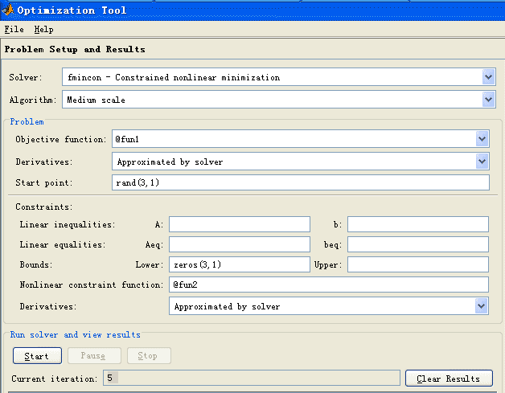

<!-- page: 52 -->

表1  飞行记录数据
飞机编号
横座标x
纵座标y
方向角（度）

1
150
140
243
2
85
85
236
3
150
155
220.5
4
145
50
159
5
130
150
230
新进入
0
0
52
注：方向角指飞行方向与x 轴正向的夹角。
为方便以后的讨论，我们引进如下记号：

D 为飞行管理区域的边长；
Ω 为飞行管理区域，取直角坐标系使其为
]
,0
[
]
,0
[
D
D ×
；
a 为飞机飞行速度，
800
=
a
km/h；
)
,
(
0
0
i
i y
x
为第i 架飞机的初始位置；

))
(
),
(
(
t
y
t
x
i
i
为第i 架飞机在t 时刻的位置；

0
iθ 为第i 架飞机的原飞行方向角，即飞行方向与x 轴夹角，
π
θ
2
0
0 <
≤
i
；

iθ
Δ
为第i 架飞机的方向角调整，
6
6
π
θ
π
≤
Δ
≤
−
i
；

i
i
i
θ
θ
θ
Δ
+
=
0
为第i 架飞机调整后的飞行方向角。

4.1  模型一
根据相对运动的观点在考察两架飞机i 和j 的飞行时，可以将飞机i 视为不动而飞
机j 以相对速度

)
sin
sin
,
cos
cos
(
i
j
i
j
i
j
ij
a
a
a
a
v
v
v
θ
θ
θ
θ
−
−
=
−
=
                     （19）

相对于飞机i 运动，对（19）式进行适当的化约可得

)
2
cos
,
2
sin
(
2
sin
2
i
j
i
j
i
j
a
v
θ
θ
θ
θ
θ
θ
+
+
−
−
=

))
2
2
cos(
),
2
2
(cos(
2
sin
2
i
j
i
j
i
j
a
θ
θ
π
θ
θ
π
θ
θ
+
+
+
+
−
=
                 （20）

θ
θ
π
β
+
+
=
，见图2。

不妨设
i
j
θ
θ ≥
，此时相对飞行方向角为
2
2

j
i
ij

        图2  相对飞行方向角
由于两架飞机的初始距离为

2
0
0
2
0
0
)
(
)
(
)
0
(
j
i
j
i
ij
y
y
x
x
r
−
+
−
=
                                 （21）

-51-

<!-- page: 53 -->

)
0
(
8
arcsin
0

ij
ij
r
=
α
                                      （22）

则只要当相对飞行方向角
ij
β 满足

0
0
2
ij
ij
ij
α
π
β
α
−
<
<
                                          （23）

时，两架飞机不可能碰撞（见图2）。

记
0
ij
β 为调整前第j 架飞机相对于第i 架飞机的相对速度（矢量）与这两架飞机连

线（从j 指向i 的矢量）的夹角（以连线矢量为基准，逆时针方向为正，顺时针方向为
负）。则由式（23）知，两架飞机不碰撞的条件为

0
0
)
(
2
1

ij
j
i
ij
α
θ
θ
β
>
Δ
+
Δ
+
                                       （24）

其中

0
mn
β
＝相对速度
mn
v
的幅角－从n 指向m 的连线矢量的幅角

θ
θ

−
=

i
i

e
e
m
n

)
(
)
(
arg

+
−
+

iy
x
iy
x

n
n
m
m

（注意
0
mn
β
表达式中的i 表示虚数单位）这里我们利用复数的幅角，可以很方便地计算

角度
0
mn
β
（
6,
,2,1
,
L
=
n
m
）。

本问题中的优化目标函数可以有不同的形式：如使所有飞机的最大调整量最小；
所有飞机的调整量绝对值之和最小等。这里以所有飞机的调整量绝对值之和最小为目标
函数，可以得到如下的数学规划模型：

6

∑

Δ

iθ

1
min

=

i

s.t.
0
0
)
(
2
1

ij
j
i
ij
α
θ
θ
β
>
Δ
+
Δ
+
，
6,
,2,1
,
L
=
j
i
，
j
i ≠

o
30
≤
Δ
iθ
，
6,
,2,1
L
=
i

利用如下的程序：
clc,clear
x0=[150 85 150 145 130 0];
y0=[140 85 155 50 150 0];
q=[243 236 220.5 159 230 52];
xy0=[x0; y0];
d0=dist(xy0);   %求矩阵各个列向量之间的距离
d0(find(d0==0))=inf;
a0=asind(8./d0)  %以度为单位的反函数
xy1=x0+i*y0
xy2=exp(i*q*pi/180)
for m=1:6
     for n=1:6
         if n~=m
         b0(m,n)=angle((xy2(n)-xy2(m))/(xy1(m)-xy1(n)));
         end

-52-

<!-- page: 54 -->

     end
end
b0=b0*180/pi;
dlmwrite('txt1.txt',a0,'delimiter', '\t','newline','PC');
fid=fopen('txt1.txt','a');
fwrite(fid,'~','char');       %往纯文本文件中写LINGO 数据的分割符
dlmwrite('txt1.txt',b0,'delimiter', '\t','newline','PC','-append','roffset', 1)
求得
0
ij
α 的值如表2 所示。

表2
0
ij
α
的值

1
2
3
4
5
6
1
0
5.39119
32.23095
5.091816
20.96336
2.234507
2
5.39119
0
4.804024
6.61346
5.807866
3.815925
3
32.23095
4.804024
0
4.364672
22.83365
2.125539
4
5.091816
6.61346
4.364672
0
4.537692
2.989819
5
20.96336
5.807866
22.83365
4.537692
0
2.309841
6
2.234507
3.815925
2.125539
2.989819
2.309841
0
求得
0
ij
β 的值如表3 所示。

表3
0
ij
β
的值

1
2
3
4
5
6
1
0
109.26
-128.25
24.18
173.07
14.475
2
109.26
0
-88.871
-42.244
-92.305
9
3
-128.25
-88.871
0
12.476
-58.786
0.31081
4
24.18
-42.244
12.476
0
5.9692
-3.5256
5
173.07
-92.305
-58.786
5.9692
0
1.9144
6
14.475
9
0.31081
-3.5256
1.9144
0

上述飞行管理的数学规划模型可如下输入LINGO 求解：
model:
sets:
plane/1..6/:delta;
link(plane,plane):alpha,beta;
endsets
data:
alpha=@file('txt1.txt');  !需要在alpha的数据后面加上分隔符"~";
beta=@file('txt1.txt');
enddata
min=@sum(plane:@abs(delta));
@for(plane:@bnd(-30,delta,30));
@for(link(i,j)|i#ne#j:@abs(beta(i,j)+0.5*delta(i)+0.5*delta(j))>a
lpha(i,j));
end

求得的最优解为
o
83858
.2
3 =
Δθ
，
o
0138
.
21
5
−
=
Δθ
，
o
7908
.0
6 =
Δθ
，其它调整

角度为0。

4.2  模型二

-53-

<!-- page: 55 -->

两架飞机
j
i,
不发生碰撞的条件为

64
))
(
)
(
(
))
(
)
(
(
2
2
>
−
+
−
t
y
t
y
t
x
t
x
j
i
j
i
                               （25）

5
1
≤
≤i
，
6
1
≤
≤
+
j
i
，
}
,
min{
0
j
i T
T
t ≤
≤

其中
j
i T
T ,
分别表示第
j
i,
架飞机飞出正方形区域边界的时刻。这里

i
i
i
at
x
t
x
θ
cos
)
(
0 +
=
，
i
i
i
at
y
t
y
θ
sin
)
(
0 +
=
，
n
i
,
,2,1
L
=
；

i
i
i
θ
θ
θ
Δ
+
=
0
，
6
|
|
π
θ ≤
Δ
i
，
n
i
,
,2,1
L
=
；

下面我们把约束条件（25）加强为对所有的时间t 都成立，记

)
,
(
~
)
,
(
~
)
,
(
~
64
))
(
)
(
(
))
(
)
(
(
2
2
2
,
j
i
c
t
j
i
b
t
j
i
a
t
y
t
y
t
x
t
x
l
j
i
j
i
j
i
+
+
=
−
−
+
−
=

其中
2
sin
4
)
,
(
~
2
2
j
i
a
j
i
a
θ
θ −
=
，

)]
sin
))(sin
0
(
)
0
(
(
)
cos
))(cos
0
(
)
0
(
[(
2
)
,
(
~

j
i
j
i
j
i
j
i
y
y
x
x
a
j
i
b
θ
θ
θ
θ
−
−
+
−
−
=

64
))
0
(
)
0
(
(
))
0
(
)
0
(
(
)
,
(
~
2
2
−
−
+
−
=
j
i
j
i
y
y
x
x
j
i
c

则两架
j
i,
飞机不碰撞的条件是

0
)
,
(
~
)
,
(
~
4
)
,
(
~
)
,
(
2
<
−
=
Δ
j
i
c
j
i
a
j
i
b
j
i
                             （26）
这样我们建立如下的非线性规划模型

6

∑

Δ

iθ

2)
(

=

i

1

s.t.
0
)
,
(
<
Δ
j
i
，
5
1
≤
≤i
，
6
1
≤
≤
+
j
i

6
π
θ ≤
Δ
i
，
6,
,2,1
L
=
i

习 题 三
1. 用最速下降法（梯度法）求函数：

2
2
2
1
2
1
2
1
2
2
2
6
4
)
(
x
x
x
x
x
x
x
f
−
−
−
+
=

的极大点。给定初始点
T
x
)1,1(
0 =
。
2. 试用牛顿法求解：

2
1
)
(
min
2
2
2
1
+
+
−
=
x
x
x
f

取初始点
T
x
)
0,4
(
)
0
(
=
，并将采用变步长和采用固定步长
0.1
=
λ
时的情形做比较。
3. 某工厂向用户提供发动机，按合同规定，其交货数量和日期是：第一季度末交
40 台，第二季末交60 台，第三季末交80 台。工厂的最大生产能力为每季100 台，每

季的生产费用是
2
2.0
50
)
(
x
x
x
f
+
=
（元），此处x 为该季生产发动机的台数。若工厂
生产的多，多余的发动机可移到下季向用户交货，这样，工厂就需支付存贮费，每台发
动机每季的存贮费为4 元。问该厂每季应生产多少台发动机，才能既满足交货合同，又
使工厂所花费的费用最少（假定第一季度开始时发动机无存货）。

4. 用Matlab 的非线性规划命令fmincon 求解飞行管理问题的模型二。
5. 用罚函数法求解飞行管理问题的模型二。

-54-

<!-- page: 56 -->

6. 求下列问题的解

3
2
2
2
2
1
1
3
3
2
)
(
max
x
x
x
x
x
x
f
+
+
+
+
=

s.t.
10
2
2
3
2
2
2
2
1
1
≤
+
+
+
+
x
x
x
x
x

50
3
2
2
2
2
1
1
≤
−
+
+
+
x
x
x
x
x

40
2
2
3
2
2
1
1
≤
+
+
+
x
x
x
x

2
3
2
1
=
+ x
x

1
2
2
1
≥
+ x
x

不约束
3
2
1
,
,0
x
x
x ≥

7．

图3  影院剖面示意图
图3 为影院的剖面示意图，座位的满意程度主要取决于视角α 和仰角β 。视角α 是

观众眼睛到屏幕上、下边缘视线的夹角，α 越大越好；仰角β 是观众眼睛到屏幕上边缘

视线与水平线的夹角，β 太大使人的头部过分上仰，引起不舒服感，一般要求β 不超过

o
30 。
记影院屏幕高h ，上边缘距地面高H ，地板线倾角θ ，第一排和最后一排座位与屏
幕水平距离分别为d 和D ，观众平均座高为c（指眼睛到地面的距离）。已知参数
8.1
=
h
，
5
=
H
，
5.4
=
d
，
19
=
D
，
1.1
=
c
（单位：m）。

（1）地板线倾角
o
10
=
θ
，问最佳座位在什么地方？

（2）求地板线倾角（一般不超过
o
20 ），使所有观众的平均满意程度最大。
（3）地板线设计成什么形状可以进一步提高观众的满意程度。

-55-

<!-- page: 57 -->

第四章  动态规划
§1  引言

1.1  动态规划的发展及研究内容
动态规划（dynamic programming）是运筹学的一个分支，是求解决策过程（decision
process）最优化的数学方法。20 世纪50 年代初R. E. Bellman 等人在研究多阶段决策过
程(multistep decision process)的优化问题时，提出了著名的最优性原理（principle of
optimality），把多阶段过程转化为一系列单阶段问题，逐个求解，创立了解决这类过程
优化问题的新方法—动态规划。1957 年出版了他的名著《Dynamic Programming》，这
是该领域的第一本著作。

动态规划问世以来，在经济管理、生产调度、工程技术和最优控制等方面得到了广
泛的应用。例如最短路线、库存管理、资源分配、设备更新、排序、装载等问题，用动
态规划方法比用其它方法求解更为方便。

虽然动态规划主要用于求解以时间划分阶段的动态过程的优化问题，但是一些与时
间无关的静态规划（如线性规划、非线性规划），只要人为地引进时间因素，把它视为
多阶段决策过程，也可以用动态规划方法方便地求解。

应指出，动态规划是求解某类问题的一种方法，是考察问题的一种途径，而不是
一种特殊算法（如线性规划是一种算法）。因而，它不象线性规划那样有一个标准的数
学表达式和明确定义的一组规则，而必须对具体问题进行具体分析处理。因此，在学习
时，除了要对基本概念和方法正确理解外，应以丰富的想象力去建立模型，用创造性的
技巧去求解。

例1  最短路线问题
图1 是一个线路网，连线上的数字表示两点之间的距离（或费用）。试寻求一条由A
到G 距离最短（或费用最省）的路线。

图1  最短路线问题

例2  生产计划问题
工厂生产某种产品，每单位（千件）的成本为1（千元），每次开工的固定成本为3
（千元），工厂每季度的最大生产能力为6（千件）。经调查，市场对该产品的需求量第
一、二、三、四季度分别为2，3，2，4（千件）。如果工厂在第一、二季度将全年的需
求都生产出来，自然可以降低成本（少付固定成本费），但是对于第三、四季度才能上
市的产品需付存储费，每季每千件的存储费为0.5（千元）。还规定年初和年末这种产品
均无库存。试制定一个生产计划，即安排每个季度的产量，使一年的总费用（生产成本
和存储费）最少。

1.2  决策过程的分类
    根据过程的时间变量是离散的还是连续的，分为离散时间决策过程（discrete-time

-56-

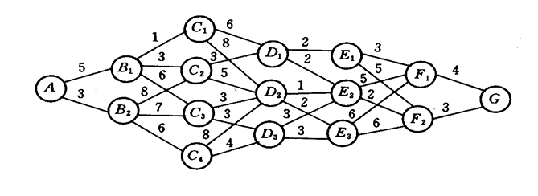

<!-- page: 58 -->

decision process）和连续时间决策过程（continuous-time decision process）；根据过程的
演变是确定的还是随机的，分为确定性决策过程（deterministic decision process）和随
机性决策过程（stochastic decision process），其中应用最广的是确定性多阶段决策过程。
§2  基本概念、基本方程和计算方法

2.1  动态规划的基本概念和基本方程
一个多阶段决策过程最优化问题的动态规划模型通常包含以下要素。
2.1.1  阶段
阶段(step)是对整个过程的自然划分。通常根据时间顺序或空间顺序特征来划分阶
段，以便按阶段的次序解优化问题。阶段变量一般用
n
k
,
,2,1
L
=
表示。在例1 中由A

出发为
1
=
k
，由
)
2,1
( =
i
Bi
出发为
2
=
k
，依此下去从
)
2,1
( =
i
Fi
出发为
6
=
k
，共
6
=
n
个阶段。在例2 中按照第一、二、三、四季度分为
4,3,2,1
=
k
，共四个阶段。
2.1.2  状态
状态（state）表示每个阶段开始时过程所处的自然状况。它应能描述过程的特征并
且无后效性，即当某阶段的状态变量给定时，这个阶段以后过程的演变与该阶段以前各
阶段的状态无关。通常还要求状态是直接或间接可以观测的。

描述状态的变量称状态变量（state variable）。变量允许取值的范围称允许状态集合
(set of admissible states)。用
kx 表示第k 阶段的状态变量，它可以是一个数或一个向量。

用
k
X
表示第k 阶段的允许状态集合。在例1 中
2x 可取
2
1,B
B
，或将
iB 定义为
)
2,1
( =
i
i
，则
1
2 =
x
或2 ，而
}
2,1
{
2 =
X
。
n 个阶段的决策过程有
1
+
n
个状态变量，
1
+
nx
表示
nx 演变的结果。在例1 中
7x 取

G ，或定义为1，即
1
7 =
x
。

根据过程演变的具体情况，状态变量可以是离散的或连续的。为了计算的方便有时
将连续变量离散化；为了分析的方便有时又将离散变量视为连续的。

状态变量简称为状态。
2.1.3  决策
当一个阶段的状态确定后，可以作出各种选择从而演变到下一阶段的某个状态，这
种选择手段称为决策（decision），在最优控制问题中也称为控制（control）。

描述决策的变量称决策变量（decision variable），变量允许取值的范围称允许决策
集合（set of admissible decisions）。用
)
(
k
k x
u
表示第k 阶段处于状态
kx 时的决策变量，

它是
kx 的函数，用
)
(
k
k x
U
表示
kx 的允许决策集合。在例1 中
)
(
1
2 B
u
可取
2
1,C
C
或
3
C ，

可记作
3,2,1
)1(
2
=
u
，而
}
3,2,1
{
)1(
2
=
U
。
决策变量简称决策。
2.1.4  策略
决策组成的序列称为策略（policy）。由初始状态
1x 开始的全过程的策略记作
)
(
1
1
x
p n
，即

)}
(
,
),
(
),
(
{
)
(
2
2
1
1
1
1
n
n
n
x
u
x
u
x
u
x
p
L
=
.

由第k 阶段的状态
kx 开始到终止状态的后部子过程的策略记作
)
(
k
kn x
p
，即
)}
(
,
),
(
{
)
(
n
n
k
k
k
kn
x
u
x
u
x
p
L
=
，
1
,
,2,1
−
=
n
k
L
.

类似地，由第k 到第j 阶段的子过程的策略记作

-57-

<!-- page: 59 -->

)}
(
,
),
(
{
)
(
j
j
k
k
k
kj
x
u
x
u
x
p
L
=
.

可供选择的策略有一定的范围，称为允许策略集合(set of admissible policies)，用

)
(
),
(
),
(
1
1
k
kj
k
kn
n
x
P
x
P
x
P
表示。

2.1.5.  状态转移方程
在确定性过程中，一旦某阶段的状态和决策为已知，下阶段的状态便完全确定。用
状态转移方程（equation of state transition）表示这种演变规律，写作

.
,
,2,1
),
,
(
1
n
k
u
x
T
x
k
k
k
k
L
=
=
+
                              （1）

在例1 中状态转移方程为
)
(
1
k
k
k
x
u
x
=
+
。

2.1.6.  指标函数和最优值函数
指标函数(objective function)是衡量过程优劣的数量指标，它是定义在全过程和所有
后部子过程上的数量函数，用
)
,
,
,
,
(
1
1
,
+
+
n
k
k
k
n
k
x
x
u
x
V
L
表示，
n
k
,
,2,1
L
=
。指标函

数应具有可分离性，即
n
k
V , 可表为
n
k
k
k
V
u
x
,1
,
,
+
的函数，记为

))
,
,
,
(
,
,
(
)
,
,
,
,
(
1
1
1
,1
1
1
,
+
+
+
+
+
+
=
n
k
k
n
k
k
k
k
n
k
k
k
n
k
x
u
x
V
u
x
x
x
u
x
V
L
L
ϕ

并且函数
k
ϕ 对于变量
n
k
V
,1
+
是严格单调的。

过程在第j 阶段的阶段指标取决于状态
jx 和决策
ju ，用
)
,
(
j
j
j
u
x
v
表示。指标函

数由
)
,
,2,1
(
n
j
v j
L
=
组成，常见的形式有：

阶段指标之和，即

n

∑

=
+
+
=

j
j
j
n
k
k
k
n
k
u
x
v
x
x
u
x
V
)
,
(
)
,
,
,
,
(
1
1
,
L
，

k
j

阶段指标之积，即

n

∏

=
+
+
=

j
j
j
n
k
k
k
n
k
u
x
v
x
x
u
x
V
)
,
(
)
,
,
,
,
(
1
1
,
L
，

k
j

阶段指标之极大（或极小），即

≤
≤
+
+
=
L
.

)
,
(
(min)
max
)
,
,
,
,
(
1
1
,
j
j
j
n
j
k
n
k
k
k
n
k
u
x
v
x
x
u
x
V

这些形式下第k 到第j 阶段子过程的指标函数为
)
,
,
,
(
1
,
+
j
k
k
j
k
x
u
x
V
L
。

根据状态转移方程指标函数
n
k
V , 还可以表示为状态
kx 和策略
kn
p
的函数，即

)
,
(
,
kn
k
n
k
p
x
V
。在
kx 给定时指标函数
n
k
V , 对
kn
p
的最优值称为最优值函数（optimal value

function），记为
)
(
k
k x
f
，即

k
kn
kn∈
=
，

kn
k
n
k
x
P
p
k
k
p
x
V
x
f

)
,
(
opt
)
(
,
)
(

其中opt 可根据具体情况取max 或min 。

2.1.7  最优策略和最优轨线
使指标函数
n
k
V , 达到最优值的策略是从k 开始的后部子过程的最优策略，记作

}
,
,
{
*
*
*
n
k
kn
u
u
p
L
=
。
*
1n
p
是全过程的最优策略，简称最优策略（optimal policy）。从初始

状态
)
(
*
1
1
x
x =
出发，过程按照
*
1n
p
和状态转移方程演变所经历的状态序列

}
,
,
,
{
*
1
*
2
*
1
+
nx
x
x
L
称最优轨线（optimal trajectory）。

-58-

<!-- page: 60 -->

2.1.8  递归方程
如下方程称为递归方程

=

⎪⎨
⎧

x
f

1
0
)
(

或

+
+

1
1
L
n
k
x
f
u
x
v
x
f

n
n

            （2）

=
⊗
=

1,
,
)},
(
)
,
(
{
opt
)
(

⎪⎩

+
+
∈

k
k
k
k
k
x
U
u
k
k

1
1
)
(

k
k
k

在上述方程中，当⊗为加法时取
0
)
(
1
1
=
+
+
n
n
x
f
；当⊗为乘法时，取
1
)
(
1
1
=
+
+
n
n
x
f
。动

态规划递归方程是动态规划的最优性原理的基础，即：最优策略的子策略，构成最优子
策略。用状态转移方程（1）和递归方程（2）求解动态规划的过程，是由
1
+
= n
k
逆
推至
1
=
k
，故这种解法称为逆序解法。当然，对某些动态规划问题，也可采用顺序解
法。这时，状态转移方程和递归方程分别为：

n
k
u
x
T
x
k
k
r
k
k
,
,1
),
,
(
1
L
=
=
+
，

=

⎪⎨
⎧

x
f

1
0
(

或
）

1
0

=
⊗
=

n
k
x
f
u
x
v
x
f

,
,1
)},
(
)
,
(
{
opt
)
(

1
1
L

−
+
∈
+

⎪⎩

k
k
k
k
k
x
U
u
k
k

1
1
)
(
1

k
r
k
k

+
+

例3  用lingo 求解例1 最短路线问题。
model:
Title Dynamic Programming;
sets:
vertex/A,B1,B2,C1,C2,C3,C4,D1,D2,D3,E1,E2,E3,F1,F2,G/:L;
road(vertex,vertex)/A B1,A B2,B1 C1,B1 C2,B1 c3,B2 C2,B2 C3,B2 C4,
C1 D1,C1 D2,C2 D1,C2 D2,C3 D2,C3 D3,C4 D2,C4 D3,
D1 E1,D1 E2,D2 E2,D2 E3,D3 E2,D3 E3,
E1 F1,E1 F2,E2 F1,E2 F2,E3 F1,E3 F2,F1 G,F2 G/:D;
endsets
data:
D=5 3 1 3 6 8 7 6
6 8 3 5 3 3 8 4
2 2 1 2 3 3
3 5 5 2 6 6 4 3;
L=0,,,,,,,,,,,,,,,;
enddata
@for(vertex(i)|i#GT#1:L(i)=@min(road(j,i):L(j)+D(j,i)));
end

纵上所述，如果一个问题能用动态规划方法求解，那么，我们可以按下列步骤，首
先建立起动态规划的数学模型：

（i）将过程划分成恰当的阶段。
（ii）正确选择状态变量
kx ，使它既能描述过程的状态，又满足无后效性，同时确

定允许状态集合
k
X 。

（iii）选择决策变量
ku ，确定允许决策集合
)
(
k
k x
U
。

（iv）写出状态转移方程。
（v）确定阶段指标
)
,
(
k
k
k
u
x
v
及指标函数
kn
V
的形式（阶段指标之和，阶段指标之

积，阶段指标之极大或极小等）。

（vi）写出基本方程即最优值函数满足的递归方程，以及端点条件。
§3  逆序解法的计算框图

-59-

<!-- page: 61 -->

以自由终端、固定始端、指标函数取和的形式的逆序解法为例给出计算框图，其它
情况容易在这个基础上修改得到。

一般化的自由终端条件为

1
,1
,1
1
,
,2,1
),
(
)
(
+
+
+
+
=
=
n
i
n
i
n
n
n
i
x
x
f
L
ϕ
                    (3)

其中ϕ 为已知。固定始端条件可表示为
}
{
}
{
*
1
1
1
x
x
X
=
=
。

如果状态
kx 和决策
ku 是连续变量，用数值方法求解时需按照精度要求进行离散

化。设状态
kx 的允许集合为

n
k
n
i
n
i
x
X
k
k
ki
k
,
,2,1
,
,
,2,1
},
,
,2,1
|
{
L
L
L
=
=
=
=
.

决策
)
(
ki
ki x
u
的允许集合为

n
k
n
i
n
j
u
U
k
ki
j
ki
ki
,
,2,1
,
,
,2,1
},
,
,2,1
|
{
)
(
L
L
L
=
=
=
=
.

状态转移方程和阶段指标应对
kx 的每个取值
ki
x 和
ki
u 的每个取值
)
( j
ki
u
计算，即

)
,
(
)
( j
ki
ki
k
k
u
x
T
T =
，
)
,
(
)
( j
ki
ki
k
u
x
v
v =
。最优值函数应对
kx 的每个取值
ki
x 计算。基本方

程可以表为

+
=
+

j
ki
ki
k
k
j
ki
ki
k
ki
j
k

)
(
1
)
(
)
(

u
x
T
f
u
x
v
x
f

)),
,
(
(
)
,
(
)
(

=

ki
j
k
j
ki
k

)
(

x
f
x
f

),
(
opt
)
(

                   （4）

=
=
=

L
L
L
n
k
n
i
n
j

.1,2,
,
,
,
,2,1
,
,
,2,1

k
ki

图2   解法框图

-60-

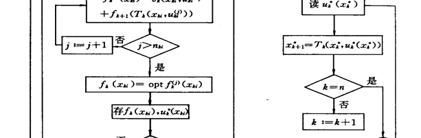

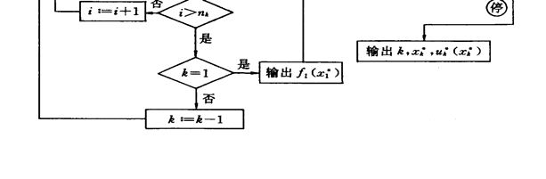

<!-- page: 62 -->

按照（3），（4）逆向计算出
)
(
*
1
1 x
f
，为全过程的最优值。记状态
ki
x 的最优决策为

)
(
*
ki
ki x
u
，由
*
1x 和
)
(
*
ki
ki x
u
按照状态转移方程计算出最优状态，记作
*
kx 。并得到相应的

最优决策，记作
)
(
*
*
k
k x
u
。于是最优策略为
)}
(
,
),
(
),
(
{
*
*
*
2
*
2
*
1
*
1
n
n x
u
x
u
x
u
L
。

算法程序的框图如图2 所示。

图的左边部分是函数序列的递推计算，可输出全过程最优值
)
(
*
1
1 x
f
，如果需要还

可以输出后部子过程最优值函数序列
)
(
ki
k x
f
和最优决策序列
)
(
*
ki
k x
u
。计算过程中存

)
(
ki
k x
f
是备计算
1
−
kf
之用，在
1
−
kf
算完后可用
1
−
kf
将
kf 替换掉；存
)
(
*
ki
k x
u
是备右边

部分读
)
(
*
*
k
k x
u
之用。

图的右边部分是最优状态和最优决策序列的正向计算，可输出最优策略

)}
(
,
),
(
),
(
{
*
*
*
2
*
2
*
1
*
1
n
n x
u
x
u
x
u
L
和最优轨线
}
,
,
,
{
*
*
2
*
1
nx
x
x
L
。
§4  动态规划与静态规划的关系

动态规划与静态规划（线性和非线性规划等）研究的对象本质上都是在若干约束条
件下的函数极值问题。两种规划在很多情况下原则上可以相互转换。

动态规划可以看作求决策
n
u
u
u
,
,
,
2
1
L
使指标函数
)
,
,
,
(
2
1
1
1
n
n
u
u
u
x
V
L
，
达到最优

（最大或最小）的极值问题，状态转移方程、端点条件以及允许状态集、允许决策集等
是约束条件，原则上可以用非线性规划方法求解。

一些静态规划只要适当引入阶段变量、状态、决策等就可以用动态规划方法求解。
下面用例子说明。

例4  用动态规划解下列非线性规划

n

∑

1
)
(
max
；

k
k u
g

=

k

n

    s.t.  ∑

≥
=

1
0
,
.

k
k
u
a
u

=

k

其中
)
(
k
k u
g
为任意的已知函数。

解  按变量
ku 的序号划分阶段，看作n 段决策过程。设状态为
1
2
1
,
,
,
+
nx
x
x
L
，取

问题中的变量
n
u
u
u
,
,
,
2
1
L
为决策。状态转移方程为

.
,
,2,1
,
,
1
1
n
k
u
x
x
a
x
k
k
k
L
=
−
=
=
+

取
)
(
k
k u
g
为阶段指标，最优值函数的基本方程为（注意到
0
1 =
+
nx
）

)]
(
)
(
[
max
)
(
1
1
0
+
+
≤
≤
+
=
k
k
k
k
x
u
k
k
x
f
x
g
x
f

；

k
k

1,2,
,1
,
,
0
L
−
=
≤
≤
n
n
k
a
xk
；
0
)
0
(
1
=
+
nf
.

按照逆序解法求出对应于
kx 每个取值的最优决策
)
(
*
k
k x
u
，计算至
)
(
1 a
f
后即可利

用状态转移方程得到最优状态序列
}
{
*
kx
和最优决策序列
)}
(
{
*
*
k
k x
u
。

与静态规划相比，动态规划的优越性在于：
（i）能够得到全局最优解。由于约束条件确定的约束集合往往很复杂，即使指标
函数较简单，用非线性规划方法也很难求出全局最优解。而动态规划方法把全过程化为

-61-

<!-- page: 63 -->

一系列结构相似的子问题，每个子问题的变量个数大大减少，约束集合也简单得多，易
于得到全局最优解。特别是对于约束集合、状态转移和指标函数不能用分析形式给出的
优化问题，可以对每个子过程用枚举法求解，而约束条件越多，决策的搜索范围越小，
求解也越容易。对于这类问题，动态规划通常是求全局最优解的唯一方法。
    （ii）可以得到一族最优解。与非线性规划只能得到全过程的一个最优解不同，动
态规划得到的是全过程及所有后部子过程的各个状态的一族最优解。有些实际问题需要
这样的解族，即使不需要，它们在分析最优策略和最优值对于状态的稳定性时也是很有
用的。当最优策略由于某些原因不能实现时，这样的解族可以用来寻找次优策略。

（iii）能够利用经验提高求解效率。如果实际问题本身就是动态的，由于动态规划
方法反映了过程逐段演变的前后联系和动态特征，在计算中可以利用实际知识和经验提
高求解效率。如在策略迭代法中，实际经验能够帮助选择较好的初始策略，提高收敛速
度。

动态规划的主要缺点是：
    （i）没有统一的标准模型，也没有构造模型的通用方法，甚至还没有判断一个问
题能否构造动态规划模型的准则。这样就只能对每类问题进行具体分析，构造具体的模
型。对于较复杂的问题在选择状态、决策、确定状态转移规律等方面需要丰富的想象力
和灵活的技巧性，这就带来了应用上的局限性。
    （ii）用数值方法求解时存在维数灾（curse of dimensionality）。若一维状态变量有m

个取值，那么对于n 维问题，状态
kx 就有
n
m 个值，对于每个状态值都要计算、存储函

数
)
(
k
k x
f
，对于n 稍大的实际问题的计算往往是不现实的。目前还没有克服维数灾的

有效的一般方法。
§5  若干典型问题的动态规划模型

5.1  最短路线问题
    对于例1 一类最短路线问题（shortest Path Problem），阶段按过程的演变划分，状
态由各段的初始位置确定，决策为从各个状态出发的走向，即有
)
(
1
k
k
k
x
u
x
=
+
，阶段

指标为相邻两段状态间的距离
))
(
,
(
k
k
k
k
x
u
x
d
，指标函数为阶段指标之和，最优值函数
)
(
k
k x
f
是由
kx 出发到终点的最短距离（或最小费用），基本方程为

k
k
=
+
=
+
+

;1,
,
)],
(
))
(
,
(
[
min
)
(
1
1
)
(
L
n
k
x
f
x
u
x
d
x
f
k
k
k
k
k
k
x
u
k
k

.0
)
(
1
1
=
+
+
n
n
x
f

利用这个模型可以算出例l 的最短路线为
G
F
E
D
C
AB
2
2
1
2
1
，相应的最短距离为18。
5.2  生产计划问题
对于例 2 一类生产计划问题（Production planning problem），阶段按计划时间自然
划分，状态定义为每阶段开始时的储存量
kx ，决策为每个阶段的产量
ku ，记每个阶段

的需求量（已知量）为
k
d ，则状态转移方程为

.
,
,2,1
,0
,
1
n
k
x
d
u
x
x
k
k
k
k
k
L
=
≥
−
+
=
+
                       (5)

设每阶段开工的固定成本费为a ，生产单位数量产品的成本费为b ，每阶段单位数量产
品的储存费为c ，阶段指标为阶段的生产成本和储存费之和，即

⎩
⎨
⎧
>
+
+
=
0

u
bu
a
cx
u
x
v
                          (6)

0
,
)
,
(

k
k
k
k
k
k

-62-

<!-- page: 64 -->

指标函数
kn
V
为
kv 之和。最优值函数
)
(
k
k x
f
为从第k 段的状态
kx 出发到过程终结的最

小费用，满足

k
k
=
+
=
+
+
∈

.1,
,
)],
(
)
,
(
[
min
)
(
1
1
L
n
k
x
f
u
x
v
x
f
k
k
k
k
k
U
u
k
k

其中允许决策集合
k
U 由每阶段的最大生产能力决定。若设过程终结时允许存储量为

0
1
+
nx
，则终端条件是

.0
)
(
0
1
1
=
+
+
n
n
x
f
                                         （7）

（5）~（7）构成该问题的动态规划模型。
5.3  资源分配问题
一种或几种资源（包括资金）分配给若干用户，或投资于几家企业，以获得最大的
效益。资源分配问题（resource allocating Problem）可以是多阶段决策过程，也可以是
静态规划问题，都能构造动态规划模型求解。下面举例说明。

例5  机器可以在高、低两种负荷下生产。u 台机器在高负荷下的年产量是
)
(u
g
，

在低负荷下的年产量是
)
(u
h
，高、低负荷下机器的年损耗率分别是
1a 和
1b

（
1
0
1
1
<
<
<
a
b
）。现有m 台机器，要安排一个n 年的负荷分配计划，即每年初决定

多少台机器投入高、低负荷运行，使n 年的总产量最大。如果进一步假设
u
u
g
α
=
)
(
，
u
u
h
β
=
)
(
（
0
>
> β
α
），即高、低负荷下每台机器的年产量分别为α 和β ，结果将
有什么特点。

解  年度为阶段变量
n
k
,
,2,1
L
=
。状态
kx 为第k 年初完好的机器数，决策
ku 为

第k 年投入高负荷运行的台数。当
kx 或
ku 不是整数时，将小数部分理解为一年中正常

工作时间或投入高负荷运行时间的比例。

机器在高、低负荷下的年完好率分别记为a 和b ，则
1
1
a
a
−
=
，
1
1
b
b
−
=
，有
b
a <
。因为第k 年投入低负荷运行的机器台数为
k
k
u
x −
，所以状态转移方程是

)
(
1
k
k
k
k
u
x
b
au
x
−
+
=
+
                                    （8）

阶段指标
kv 是第k 年的产量，有

)
(
)
(
)
,
(
k
k
k
k
k
k
u
x
h
u
g
u
x
v
−
+
=
                              （9）

指标函数是阶段指标之和，最优值函数
)
(
k
k x
f
满足

+
=
+
+
≤
≤
                        (10)

x
f
u
x
v
x
f

)],
(
)
,
(
[
max
)
(
1
1
0
L
n
k
m
x

k
k
k
k
k
x
u
k
k

k
k

=
≤
≤

.1,2,
,
,
0

k

及自由终端条件

.
0
,0
)
(
1
1
1
m
x
x
f
n
n
n
≤
≤
=
+
+
+
                         （11）

    当
kv 中的
h
g,
用较简单的函数表达式给出时，对于每个k 可以用解析方法求解极

值问题。特别，若
u
u
g
α
=
)
(
，
u
u
h
β
=
)
(
，（10）中的
)]
(
)
,
(
[
1
k
k
k
k
k
x
f
u
x
v
+
+
 将是
ku

的线性函数，最大值点必在区间
k
k
x
u ≤
≤
0
的左端点
0
=
ku
或右端点
k
k
x
u =
取得，

即每年初将完好的机器全部投入低负荷或高负荷运行。
§6  具体的应用实例

例6  设某工厂有1000 台机器，生产两种产品
B
A、
，若投入x 台机器生产A 产

-63-

<!-- page: 65 -->

品，则纯收入为x
5
，若投入y 台机器生产B 种产品，则纯收入为y
4
，又知：生产A 种
产品机器的年折损率为20%，生产B 产品机器的年折损率为10%，问在5 年内如何安
排各年度的生产计划，才能使总收入最高？

解  年度为阶段变量
5,4,3,2,1
=
k
。

令
kx 表示第k 年初完好机器数，
k
u 表示第k 年安排生产A 种产品的机器数，则

k
k
u
x −
为第k 年安排生产B 种产品的机器数，且
k
k
x
u ≤
≤
0
。

则第
1
+
k
年初完好的机器数
k
k
k
k
k
k
u
x
u
x
u
x
1.0
9.0
)
)(
1.0
1(
)
2.0
1(
1
−
=
−
−
+
−
=
+
             （12）

令
)
,
(
k
k
k
u
x
v
表示第k 年的纯收入，
)
(
k
k x
f
表示第k 年初往后各年的最大利润之

和。

显然
0
)
(
6
6
=
x
f
                                                    （13）

则
)}
(
)
,
(
{
max
)
(
1
1
0
+
+
≤
≤
+
=
k
k
k
k
k
x
u
k
k
x
f
u
x
v
x
f

k
k

)}
(
4
{
max
)}
(
)
(
4
5
{
max
1
1
0
1
1
0
+
+
≤
≤
+
+
≤
≤
+
+
=
+
−
+
=
k
k
k
k
x
u
k
k
k
k
k
x
u
x
f
x
u
x
f
u
x
u

 （14）

k
k
k
k

（1）
5
=
k
时，由（13）、（14）式得
}
4
{
max
)
(
5
5
0
5
5
5
5
x
u
x
f

x
u
+
=

≤
≤

5
5
4x
u +
关于
5
u 求导，知其导数大于零，所以
5
5
4x
u +
在
5
u 等于
5x 处取得最大值，

即
5
5
x
u =
时，
5
5
5
5
)
(
x
x
f
=
。

（2）
4
=
k
时，由（12）、（14）式得

x
u
+
+
=

}
5
4
{
max
)
(
5
4
4
0
4
4
4
4
x
x
u
x
f

≤
≤

x
u
x
u
+
=
−
+
+
=

}
5.8
5.0
{
max
)}
1.0
9.0
(
5
4
{
max
4
4
0
4
4
4
4
0
4
4
4
4
x
u
u
x
x
u

≤
≤
≤
≤

当
4
4
x
u =
时，
4
4
4
9
)
(
x
x
f
=

（3）
3
=
k
时，

x
u
+
+
=

}
9
4
{
max
)
(
4
3
3
0
3
3
3
3
x
x
u
x
f

≤
≤

x
u
x
u
+
=
−
+
+
=

}
1.
12
1.0
{
max
)}
1.0
9.0
(
9
4
{
max
3
3
0
3
3
3
3
0
3
3
3
3
x
u
u
x
x
u

≤
≤
≤
≤

当
3
3
x
u =
时，
3
3
3
2.
12
)
(
x
x
f
=

（4）
2
=
k
时，

x
u
x
u
+
−
=
+
+
=

}
98
.
14
22
.0
{
max
}
2.
12
4
{
max
)
(
2
2
0
3
2
2
0
2
2
2
2
2
2
x
u
x
x
u
x
f

≤
≤
≤
≤

当
0
2 =
u
时，
2
2
2
98
.
14
)
(
x
x
f
=
。

（5）
1
=
k
时，

x
u
x
u
+
−
=
+
+
=

}
482
.
17
498
.0
{
max
}
98
.
14
4
{
max
)
(
1
1
0
2
1
1
0
1
1
1
1
1
1
x
u
x
x
u
x
f

≤
≤
≤
≤

当
0
1 =
u
时，
1
1
1
482
.
17
)
(
x
x
f
=
。因为

1000
1 =
x
（台）

-64-

<!-- page: 66 -->

所以由（12）式，进行回代得
900
1.0
9.0
1
1
2
=
−
=
u
x
x
（台）

810
1.0
9.0
2
2
3
=
−
=
u
x
x
（台）

648
1.0
9.0
3
3
4
=
−
=
u
x
x
（台）

4.
518
1.0
9.0
4
4
5
=
−
=
u
x
x
（台）

注：
4.
518
5 =
x
台中的0.4 台应理解为有一台机器只能使用0.4 年将报废。

例7  求解下面问题

3
2
2
1
max
u
u
u
z =

>
=
+
+

⎩
⎨
⎧

)
0
(
3
2
1
i
u

c
c
u
u
u

=
≥

3,2,1
0

i

    解： 按问题的变量个数划分阶段，把它看作为一个三阶段决策问题。设状态变量
为
4
3
2
1
,
,
,
x
x
x
x
，并记
c
x =
1
；取问题中的变量
3
2
1
,
,
u
u
u
为决策变量；各阶段指标函数

按乘积方式结合。令最优值函数
)
(
k
k x
f
表示第k 阶段的初始状态为
kx ，从k 阶段到3

阶段所得到的最大值。

设
3
3
u
x =
，
2
2
3
x
u
x
=
+
，
c
x
u
x
=
=
+
1
1
2

则有

3
3
x
u =
，
2
2
0
x
u ≤
≤
，
1
1
0
x
u ≤
≤

用逆推解法，从后向前依次有

x
u
=
=

=
 及最优解
3
*
3
x
u =

3
3
x
u
x
f

3
3
3
3
}
{
max
)
(

x
u
x
u
x
u
≤
≤
≤
≤
≤
≤
=
−
=
=

)
,
(
max
)}
(
{
max
)}
(
{
max
)
(
2
2
2
0
2
2
2
2
0
3
3
2
2
0
2
2
2
2
2
2
2
2
x
u
h
u
x
u
x
f
u
x
f

2
=
−
=
u
x
u
du
dh
，得
2
2
3
2 x
u =
和
0
2 =
u
（舍去）

由
0
3
2
2
2
2
2
2

2
2
6
2
u
x
du

2
2

h
d
−
=
，而
0
2
2

h
d

，故
2
2
3
2 x
u =
为极大值点。

2
2
<
−
=

x
du

又
2
2
2
2

3
2
2
2

=

x
u

所以
3
2
2
2
27
4
)
(
x
x
f
=
 及最优解
2
*
2
3
2 x
u =
。

}
)
(
27
4
{
max
)}
(
{
max
)
(
3
1
1
1
0
2
2
1
0
1
1
1
1
1
1
u
x
u
x
f
u
x
f

x
u
x
u
−
=
=

≤
≤
≤
≤

同样利用微分法易知
4
1
1
1
64
1
)
(
x
x
f
=
，最优解
1
*
1
4
1 x
u =
。

由于
1x 已知，因而按计算的顺序反推算，可得各阶段的最优决策和最优值。即

c
u
4
1
*
1 =
，
4
1
1
64
1
)
(
c
x
f
=

由

c
c
c
u
x
x
4
3
4
1
*
1
1
2
=
−
=
−
=

-65-

<!-- page: 67 -->

所以

c
x
u
2
1
3
2

2
*
2
=
=
，
3
2
2
16
1
)
(
c
x
f
=

由

c
c
c
u
x
x
4
1
2
1
4
3
*
2
2
3
=
−
=
−
=

所以

c
u
4
1
*
3 =
，
c
x
f
4
1
)
(
3
3
=

因此得到最优解为：
c
u
4
1
*
1 =
，
c
u
2
1
*
2 =
，
c
u
4
1
*
3 =
；

    最大值为：
4
1
64
1
)
(
max
c
c
f
z
=
=
。

习 题 四
1.  用Matlab 编程求例6 的解。
2. 有四个工人，要指派他们分别完成4 项工作，每人做各项工作所消耗的时间如
表1 所示。

表1
        工作
   工人
A
B
C
D

甲
15
18
21
24

乙
19
23
22
18

丙
26
17
16
19

丁
19
21
23
17

问指派哪个人去完成哪项工作，可使总的消耗时间为最小？试对此问题用动态规划
方法求解。

3. 为保证某一设备的正常运转，需备有三种不同的零件
3
2
1
,
,
E
E
E
。若增加备用零

件的数量，可提高设备正常运转的可靠性，但增加了费用，而投资额仅为8000 元。已
知备用零件数与它的可靠性和费用的关系如表2 所示。

表2
增加的可靠性
设备的费用（千元）
备件数

1
E
2
E
3
E
1
E
2
E
3
E

2
3
4
现要求在既不超出投资额的限制，又能尽量提高设备运转的可靠性的条件下，问
各种零件的备件数量应是多少为好？

1
2
3

0.3
0.4
0.5

0.2
0.5
0.9

0.1
0.2
0.7

1
2
3

3
5
6

4.  某工厂购进100 台机器，准备生产I、II 两种产品，若生产产品I，每台机器每
年可收入45 万元，损坏率为65％；若生产产品II，每台机器每年收入为35 万元，损
坏率为35％，估计三年后将有新型机器出现，旧的机器将全部淘汰。试问每年应如何

-66-

<!-- page: 68 -->

安排生产，使在三年内收入最多？

5．3 名商人各带1 名随从乘船渡河，一只小船只能容纳2 人，由他们自己划行。
随从们密约，在河的任一岸，一旦随从人数比商人多，就杀商人。此密约被商人知道，
如何乘船渡河的大权掌握在商人们手中，商人们怎样安排每次乘船方案，才能安全渡河
呢？

6．某一印刷厂有六项加工任务，对印刷车间和装订车间所需时间（单位：天）如
表3 所示，试求最优的加工顺序和总加工天数。

表3
     任务
车间
1
2
3
4
5
6

3
8
10
12
5
9
2
6
9
5
11
2

印刷车间
装订车间

-67-

<!-- page: 69 -->

第五章  图与网络模型及方法
§1 概论
    图论起源于18 世纪。第一篇图论论文是瑞士数学家欧拉于1736 年发表的“哥尼
斯堡的七座桥”。1847 年，克希霍夫为了给出电网络方程而引进了“树”的概念。1857
年，凯莱在计数烷
2
2 +
n
nH
C
的同分异构物时，也发现了“树”。哈密尔顿于1859 年提

出“周游世界”游戏，用图论的术语，就是如何找出一个连通图中的生成圈、近几十年
来，由于计算机技术和科学的飞速发展，大大地促进了图论研究和应用，图论的理论和
方法已经渗透到物理、化学、通讯科学、建筑学、运筹学，生物遗传学、心理学、经济
学、社会学等学科中。

图论中所谓的“图”是指某类具体事物和这些事物之间的联系。如果我们用点表示
这些具体事物，用连接两点的线段（直的或曲的）表示两个事物的特定的联系，就得到
了描述这个“图”的几何形象。图论为任何一个包含了一种二元关系的离散系统提供了
一个数学模型，借助于图论的概念、理论和方法，可以对该模型求解。哥尼斯堡七桥问
题就是一个典型的例子。在哥尼斯堡有七座桥将普莱格尔河中的两个岛及岛与河岸联结
起来，问题是要从这四块陆地中的任何一块开始通过每一座桥正好一次，再回到起点。

          图1  哥尼斯堡七桥问题
当然可以通过试验去尝试解决这个问题，但该城居民的任何尝试均未成功。欧拉为了解
决这个问题，采用了建立数学模型的方法。他将每一块陆地用一个点来代替，将每一座
桥用连接相应两点的一条线来代替，从而得到一个有四个“点”，七条“线”的“图”。
问题成为从任一点出发一笔画出七条线再回到起点。欧拉考察了一般一笔画的结构特
点，给出了一笔画的一个判定法则：这个图是连通的，且每个点都与偶数线相关联，将
这个判定法则应用于七桥问题，得到了“不可能走通”的结果，不但彻底解决了这个问
题，而且开创了图论研究的先河。

图与网络是运筹学（Operations Research）中的一个经典和重要的分支，所研究的
问题涉及经济管理、工业工程、交通运输、计算机科学与信息技术、通讯与网络技术等
诸多领域。下面将要讨论的最短路问题、最大流问题、最小费用流问题和匹配问题等都
是图与网络的基本问题。

我们首先通过一些例子来了解网络优化问题。
例1  最短路问题（SPP－shortest path problem）
一名货柜车司机奉命在最短的时间内将一车货物从甲地运往乙地。从甲地到乙地的
公路网纵横交错，因此有多种行车路线，这名司机应选择哪条线路呢？假设货柜车的运
行速度是恒定的，那么这一问题相当于需要找到一条从甲地到乙地的最短路。

例2  公路连接问题
某一地区有若干个主要城市，现准备修建高速公路把这些城市连接起来，使得从其

-68-

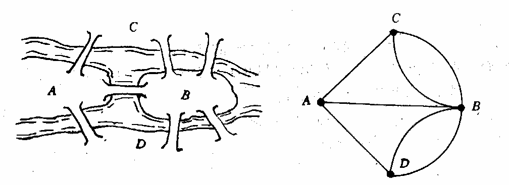

<!-- page: 70 -->

中任何一个城市都可以经高速公路直接或间接到达另一个城市。假定已经知道了任意两
个城市之间修建高速公路的成本，那么应如何决定在哪些城市间修建高速公路，使得总
成本最小？

例3  指派问题（assignment problem）
一家公司经理准备安排N 名员工去完成N 项任务，每人一项。由于各员工的特点
不同，不同的员工去完成同一项任务时所获得的回报是不同的。如何分配工作方案可以
使总回报最大？

例4  中国邮递员问题（CPP－chinese postman problem）
一名邮递员负责投递某个街区的邮件。如何为他（她）设计一条最短的投递路线（从
邮局出发，经过投递区内每条街道至少一次，最后返回邮局）？由于这一问题是我国管
梅谷教授1960 年首先提出的，所以国际上称之为中国邮递员问题。

例5  旅行商问题（TSP－traveling salesman problem）
一名推销员准备前往若干城市推销产品。如何为他（她）设计一条最短的旅行路线
（从驻地出发，经过每个城市恰好一次，最后返回驻地）？这一问题的研究历史十分悠
久，通常称之为旅行商问题。

例6  运输问题（transportation problem）
某种原材料有M 个产地，现在需要将原材料从产地运往N 个使用这些原材料的工
厂。假定M 个产地的产量和N 家工厂的需要量已知，单位产品从任一产地到任一工厂
的运费已知，那么如何安排运输方案可以使总运输成本最低？

上述问题有两个共同的特点：一是它们的目的都是从若干可能的安排或方案中寻求
某种意义下的最优安排或方案，数学上把这种问题称为最优化或优化（optimization）
问题；二是它们都易于用图形的形式直观地描述和表达，数学上把这种与图相关的结构
称为网络（network）。与图和网络相关的最优化问题就是网络最优化或称网络优化
（netwok optimization）问题。所以上面例子中介绍的问题都是网络优化问题。由于多
数网络优化问题是以网络上的流（flow）为研究的对象，因此网络优化又常常被称为网
络流（network flows）或网络流规划等。

下面首先简要介绍图与网络的一些基本概念。
§2 图与网络的基本概念

2.1 无向图
一个无向图(undirected graph)G 是由一个非空有限集合
)
(G
V
和
)
(G
V
中某些元素

的无序对集合
)
(G
E
构成的二元组，记为
))
(
),
(
(
G
E
G
V
G =
。其中
}
,
,
,
{
)
(
2
1
nv
v
v
G
V
L
=
称为图G 的顶点集（vertex set）或节点集（node set），
)
(G
V
中

的每一个元素
)
,
,2,1
(
n
i
vi
L
=
称为该图的一个顶点（vertex）或节点（node）；
}
,
,
,
{
)
(
2
1
m
e
e
e
G
E
L
=
称为图G 的边集（edge set），
)
(G
E
中的每一个元素
ke (即
)
(G
V

中某两个元素
j
i v
v ,
的无序对) 记为
)
,
(
j
i
k
v
v
e =
或
i
j
j
i
k
v
v
v
v
e
=
=
)
,
,2,1
(
m
k
L
=
，

被称为该图的一条从
iv 到
jv 的边（edge）。

当边
j
i
k
v
v
e =
时，称
j
i v
v ,
为边
ke 的端点，并称
jv 与
iv 相邻（adjacent）；边
ke 称

为与顶点
j
i v
v ,
关联（incident）。如果某两条边至少有一个公共端点，则称这两条边在

图G 中相邻。

边上赋权的无向图称为赋权无向图或无向网络（undirected network）。我们对图和
网络不作严格区分，因为任何图总是可以赋权的。

-69-

<!-- page: 71 -->

一个图称为有限图，如果它的顶点集和边集都有限。图G 的顶点数用符号
|
|V 或
)
(G
ν
表示，边数用
|
| E 或
)
(G
ε
表示。

当讨论的图只有一个时，总是用G 来表示这个图。从而在图论符号中我们常略去
字母G ，例如，分别用
ν,
,E
V
和ε 代替
)
(
),
(
),
(
G
G
E
G
V
ν
和
)
(G
ε
。
端点重合为一点的边称为环(loop)。
一个图称为简单图(simple graph)，如果它既没有环也没有两条边连接同一对顶点。
2.2  有向图
定义  一个有向图（directed graph 或 digraph）G 是由一个非空有限集合V 和V 中
某些元素的有序对集合A 构成的二元组，记为
)
,
(
A
V
G =
。其中
}
,
,
,
{
2
1
nv
v
v
V
L
=
称

为图G 的顶点集或节点集， V 中的每一个元素
)
,
,2,1
(
n
i
vi
L
=
称为该图的一个顶点

或节点；
}
,
,
,
{
2
1
m
a
a
a
A
L
=
称为图G 的弧集（arc set），A 中的每一个元素
ka (即V 中

某两个元素
j
i v
v ,
的有序对) 记为
)
,
(
j
i
k
v
v
a =
或
)
,
,2,1
(
n
k
v
v
a
j
i
k
L
=
=
，被称为该图

的一条从
iv 到
jv 的弧（arc）。

当弧
j
i
k
v
v
a =
时，称
iv 为
ka 的尾（tail），
jv 为
ka 的头（head），并称弧
ka 为
iv 的

出弧（outgoing arc），为
jv 的入弧（incoming arc）。

对应于每个有向图D ，可以在相同顶点集上作一个图G ，使得对于D 的每条弧，
G 有一条有相同端点的边与之相对应。这个图称为D 的基础图。反之，给定任意图G ，
对于它的每个边，给其端点指定一个顺序，从而确定一条弧，由此得到一个有向图，这
样的有向图称为G 的一个定向图。

以下若未指明“有向图”三字，“图”字皆指无向图。
2.3 完全图、二分图
每一对不同的顶点都有一条边相连的简单图称为完全图(complete graph)。n 个顶点
的完全图记为
n
K 。

若
Y
X
G
V
U
=
)
(
，
Φ
=
Y
X I
，
0
|
||
|
≠
Y
X
（这里
|
| X 表示集合X 中的元素个

数），X 中无相邻顶点对，Y 中亦然，则称G 为二分图(bipartite graph)；特别地，若

Y
y
X
x
∈
∀
∈
∀
,
，则
)
(G
E
xy ∈
，则称G 为完全二分图，记成
|
||,
|
Y
X
K
。

2.4 子图
图H 叫做图G 的子图（subgraph ），记作
G
H ⊂
，如果
)
(
)
(
G
V
H
V
⊂
，
)
(
)
(
G
E
H
E
⊂
。若H 是G 的子图，则G 称为H 的母图。
G 的支撑子图（spanning subgraph，又成生成子图）是指满足
)
(
)
(
G
V
H
V
=
的子

图H 。

2.5 顶点的度
设
)
(G
V
v ∈
，G 中与v 关联的边数（每个环算作两条边）称为v 的度(degree)，记

作
)
(v
d
。若
)
(v
d
是奇数，称v 是奇顶点(odd point)；
)
(v
d
是偶数，称v 是偶顶点(even
point)。关于顶点的度，我们有如下结果：

(i) ∑

=

v
d
ε
2
)
(

∈

V
v

(ii) 任意一个图的奇顶点的个数是偶数。
2.6 图与网络的数据结构

-70-

<!-- page: 72 -->

网络优化研究的是网络上的各种优化模型与算法。为了在计算机上实现网络优化的
算法，首先我们必须有一种方法（即数据结构）在计算机上来描述图与网络。一般来说，
算法的好坏与网络的具体表示方法，以及中间结果的操作方案是有关系的。这里我们介
绍计算机上用来描述图与网络的5 种常用表示方法：邻接矩阵表示法、关联矩阵表示法、
弧表表示法、邻接表表示法和星形表示法。在下面数据结构的讨论中，我们首先假设

)
,
(
A
V
G =
是一个简单有向图，
m
A
n
V
=
=
|
|,
|
|
，并假设V 中的顶点用自然数
n
,
,2,1
L

表示或编号，A 中的弧用自然数
m
,
,2,1
L
表示或编号。对于有多重边或无向网络的情
况，我们只是在讨论完简单有向图的表示方法之后，给出一些说明。

（i）邻接矩阵表示法
邻接矩阵表示法是将图以邻接矩阵（adjacency matrix）的形式存储在计算机中。图

)
,
(
A
V
G =
的邻接矩阵是如下定义的：C 是一个
n
n ×
的
1
0 −矩阵，即

n
n
n
n
ijc
C
×
× ∈
=
}
1,0
{
)
(
，

∉
∈
=
.
)
,
(
,0

⎩
⎨
⎧

A
j
i
cij

,
)
,
(
,1

A
j
i

也就是说，如果两节点之间有一条弧，则邻接矩阵中对应的元素为1；否则为0。

可以看出，这种表示法非常简单、直接。但是，在邻接矩阵的所有
2
n 个元素中，只有m
个为非零元。如果网络比较稀疏，这种表示法浪费大量的存储空间，从而增加了在网络
中查找弧的时间。

     图2  有向图

例7  对于图2 所示的有向图，可以用邻接矩阵表示为

⎡

⎤

0
1
1
0
0
1
0
1
0
0
0
0
0
1
0
0
1
0
0
0
0
0
1
1
0

⎢
⎢
⎢
⎢
⎢
⎢

⎥
⎥
⎥
⎥
⎥
⎥

⎣

⎦

同样，对于网络中的权，也可以用类似邻接矩阵的
n
n ×
矩阵表示。只是此时一条
弧所对应的元素不再是1，而是相应的权而已。如果网络中每条弧赋有多种权，则可以
用多个矩阵表示这些权。

（ii）关联矩阵表示法
关联矩阵表示法是将图以关联矩阵（incidence matrix）的形式存储在计算机中．图

)
,
(
A
V
G =
的关联矩阵B 是如下定义的：B 是一个
m
n ×
的矩阵，即

m
n
m
n
ik
b
B
×
×
−
∈
=
}
1,0,1
{
)
(
，

-71-

<!-- page: 73 -->

∈
=
∈
∃

⎧

,
)
,
(
,
,1

A
j
i
k
V
j

⎪⎨

=

∈
=
∈
∃
−

bik

,
)
,
(
,
 ,1

A
i
j
k
V
j

⎪⎩

.
,0

其它

也就是说，在关联矩阵中，每行对应于图的一个节点，每列对应于图的一条弧。如
果一个节点是一条弧的起点，则关联矩阵中对应的元素为1；如果一个节点是一条弧的
终点，则关联矩阵中对应的元素为
1
−
；如果一个节点与一条弧不关联，则关联矩阵中
对应的元素为0。对于简单图，关联矩阵每列只含有两个非零元（一个1
+
，一个1
−
）。
可以看出，这种表示法也非常简单、直接。但是，在关联矩阵的所有nm 个元素中，只
有m
2
个为非零元。如果网络比较稀疏，这种表示法也会浪费大量的存储空间。但由于
关联矩阵有许多特别重要的理论性质，因此它在网络优化中是非常重要的概念。

例8  对于例7 所示的图，如果关联矩阵中每列对应弧的顺序为(1,2)，(1,3)，(2,4)，
(3,2)，(4,3)，(4,5)，(5,3)和(5,4)，则关联矩阵表示为

⎡

⎤

1
1
1
0
0
0
0
0
1
0
1
1
0
1
0
0
0
1
0
1
1
0
1
0
0
0
0
0
1
1
0
1
0
0
0
0
0
0
1
1

⎢
⎢
⎢
⎢
⎢
⎢

⎥
⎥
⎥
⎥
⎥
⎥

−
−

−
−
−

−
−

−

⎣

⎦

同样，对于网络中的权，也可以通过对关联矩阵的扩展来表示。例如，如果网络中
每条弧有一个权，我们可以把关联矩阵增加一行，把每一条弧所对应的权存储在增加的
行中。如果网络中每条弧赋有多个权，我们可以把关联矩阵增加相应的行数，把每一条
弧所对应的权存储在增加的行中。

（iii）弧表表示法
弧表表示法将图以弧表（arc list）的形式存储在计算机中。所谓图的弧表，也就是
图的弧集合中的所有有序对。弧表表示法直接列出所有弧的起点和终点，共需m
2
个存
储单元，因此当网络比较稀疏时比较方便。此外，对于网络图中每条弧上的权，也要对
应地用额外的存储单元表示。例如，例7 所示的图，假设弧(1,2)，(1,3)，(2,4)，(3,2)，
(4,3)，(4,5)，(5,3)和(5,4)上的权分别为8，9，6，4，0，3，6 和7，则弧表表示如表1
所示。

表1
起点
1
1
2
3
4
4
5
5
终点
2
3
4
2
3
5
3
4
权
8
9
6
4
0
3
6
7

为了便于检索，一般按照起点、终点的字典序顺序存储弧表，如上面的弧表就是按
照这样的顺序存储的。

（iv）邻接表表示法
邻接表表示法将图以邻接表（adjacency  lists）的形式存储在计算机中。所谓图的
邻接表，也就是图的所有节点的邻接表的集合；而对每个节点，它的邻接表就是它的所
有出弧。邻接表表示法就是对图的每个节点，用一个单向链表列出从该节点出发的所有
弧，链表中每个单元对应于一条出弧。为了记录弧上的权，链表中每个单元除列出弧的
另一个端点外，还可以包含弧上的权等作为数据域。图的整个邻接表可以用一个指针数
组表示。例如，例7 所示的图，邻接表表示为

-72-

<!-- page: 74 -->

这是一个5 维指针数组，每一维（上面表示法中的每一行）对应于一个节点的邻接
表，如第1 行对应于第1 个节点的邻接表（即第1 个节点的所有出弧）。每个指针单元
的第1 个数据域表示弧的另一个端点（弧的头），后面的数据域表示对应弧上的权。如
第1 行中的“2”表示弧的另一个端点为2（即弧为（1,2）），“8”表示对应弧(1,2)上的
权为8；“3”表示弧的另一个端点为3（即弧为(1,3)），“9”表示对应弧（1，3）上的权
为9。又如，第5 行说明节点5 出发的弧有(5,3)、(5,4)，他们对应的权分别为6 和7。

对于有向图
)
,
(
A
V
G =
，一般用
)
(i
A
表示节点i 的邻接表，即节点i 的所有出弧构
成的集合或链表（实际上只需要列出弧的另一个端点，即弧的头）。例如上面例子，

}
3,2
{
)1(
=
A
，
}
4,3
{
)
5
(
=
A
等。
（v）星形表示法
星形（star）表示法的思想与邻接表表示法的思想有一定的相似之处。对每个节点，
它也是记录从该节点出发的所有弧，但它不是采用单向链表而是采用一个单一的数组表
示。也就是说，在该数组中首先存放从节点1 出发的所有弧，然后接着存放从节点2
出发的所有孤，依此类推，最后存放从节点n 出发的所有孤。对每条弧，要依次存放其
起点、终点、权的数值等有关信息。这实际上相当于对所有弧给出了一个顺序和编号，
只是从同一节点出发的弧的顺序可以任意排列。此外，为了能够快速检索从每个节点出
发的所有弧，我们一般还用一个数组记录每个节点出发的弧的起始地址（即弧的编号）。
在这种表示法中，可以快速检索从每个节点出发的所有弧，这种星形表示法称为前向星
形（forward star）表示法。

例如，在例7 所示的图中，仍然假设弧（1,2），（l,3），（2,4），（3,2），（4,3），（4,5），
（5,3）和（5,4）上的权分别为8，9，6，4，0，3，6 和7。此时该网络图可以用前向
星形表示法表示为表2 和表3 。

表2  节点对应的出弧的起始地址编号数组

节点号i
1
2
3
4
5
6

起始地址
)
(i
point
1
3
4
5
7
9

表3  记录弧信息的数组
弧编号
1
2
3
4
5
6
7
8
起点
1
1
2
3
4
4
5
5
终点
2
3
4
2
3
5
3
4
权
8
9
6
4
0
3
6
7

在数组point 中，其元素个数比图的节点数多1（即
1
+
n
），且一定有
1
)1(
=
point
，
1
)1
(
+
=
+
m
n
point
。对于节点i ，其对应的出弧存放在弧信息数组的位置区间为

]1
)1
(
),
(
[
−
+
i
point
i
point
，

如果
)1
(
)
(
+
=
i
point
i
point
，则节点i 没有出弧。这种表示法与弧表表示法也非常相

-73-

<!-- page: 75 -->

似，“记录弧信息的数组”实际上相当于有序存放的“弧表”。只是在前向星形表示法中，
弧被编号后有序存放，并增加一个数组（point ）记录每个节点出发的弧的起始编号。

前向星形表示法有利于快速检索每个节点的所有出弧，但不能快速检索每个节点的
所有入弧。为了能够快速检索每个节点的所有入孤，可以采用反向星形（reverse star）
表示法：首先存放进入节点1 的所有孤，然后接着存放进入节点2 的所有弧，依此类推，
最后存放进入节点n 的所有孤。对每条弧，仍然依次存放其起点、终点、权的数值等有
关信息。同样，为了能够快速检索从每个节点的所有入弧，我们一般还用一个数组记录
每个节点的入孤的起始地址（即弧的编号）。例如，例7 所示的图，可以用反向星形表
示法表示为表4 和表5。

表4  节点对应的入弧的起始地址编号数组
节点号i
1
2
3
4
5
6

起始地址
)
(i
rpoint
1
1
3
6
8
9

表5  记录弧信息的数组
弧编号
1
2
3
4
5
6
7
8
终点
2
2
3
3
3
4
4
5
起点
3
1
1
4
5
5
2
4
权
4
8
9
0
6
7
6
3

如果既希望快速检索每个节点的所有出弧，也希望快速检索每个节点的所有入弧，
则可以综合采用前向和反向星形表示法。当然，将孤信息存放两次是没有必要的，可以
只用一个数组（trace）记录一条弧在两种表示法中的对应关系即可。例如，可以在采用
前向星形表示法的基础上，加上上面介绍的rpoint 数组和如下的trace 数组即可。这相
当于一种紧凑的双向星形表示法，如表6 所示。

表6  两种表示法中的弧的对应关系
反向法中弧编号j
1
2
3
4
5
6
7
8

正向法中弧编号
)
( j
trace
4
1
2
5
7
8
3
6

对于网络图的表示法，我们作如下说明：
① 星形表示法和邻接表表示法在实际算法实现中都是经常采用的。星形表示法的
优点是占用的存储空间较少，并且对那些不提供指针类型的语言（如 FORTRAN 语言
等）也容易实现。邻接表表示法对那些提供指针类型的语言（如C 语言等）是方便的，
且增加或删除一条弧所需的计算工作量很少，而这一操作在星形表示法中所需的计算工
作量较大（需要花费
)
(m
O
的计算时间）。有关“计算时间”的观念是网络优化中需要
考虑的一个关键因素。

② 当网络不是简单图，而是具有平行弧（即多重弧）时，显然此时邻接矩阵表示
法是不能采用的。其他方法则可以很方便地推广到可以处理平行弧的情形。

③ 上述方法可以很方便地推广到可以处理无向图的情形，但由于无向图中边没有
方向，因此可能需要做一些自然的修改。例如，可以在计算机中只存储邻接矩阵的一半
信息（如上三角部分），因为此时邻接矩阵是对称矩阵。无向图的关联矩阵只含有元素
0 和1
+
，而不含有1
−
，因为此时不区分边的起点和终点。又如，在邻接表和星形表示
法中，每条边会被存储两次，而且反向星形表示显然是没有必要的，等等。

2.7  轨与连通

k
kv
e
e
v
e
v
W
L
2
1
1
0
=
，其中
)
(G
E
ei ∈
，
k
i ≤
≤
1
，
)
(G
V
v j ∈
，
k
j ≤
≤
0
，ie 与

-74-

<!-- page: 76 -->

i
i
v
v
,
1
−
关联，称W 是图G 的一条道路(walk)，k 为路长，顶点
0v 和
kv 分别称为W 的起

点和终点，而
1
2
1
,
,
,
−
kv
v
v
L
称为它的内部顶点。

若道路W 的边互不相同，则W 称为迹(trail)。若道路W 的顶点互不相同，则W 称
为轨(path)。

称一条道路是闭的，如果它有正的长且起点和终点相同。起点和终点重合的轨叫做
圈(cycle)。

若图G 的两个顶点
v
u,
间存在道路，则称u 和v 连通(connected)。
v
u,
间的最短轨
的长叫做
v
u,
间的距离。记作
)
,
(
v
u
d
。若图G 的任二顶点均连通，则称G 是连通图。
显然有：
(i) 图P 是一条轨的充要条件是P 是连通的，且有两个一度的顶点，其余顶点的度
为2；

(ii) 图C 是一个圈的充要条件是C 是各顶点的度均为2 的连通图。
§3 应用—最短路问题

3.1 两个指定顶点之间的最短路径
问题如下：给出了一个连接若干个城镇的铁路网络，在这个网络的两个指定城镇间，
找一条最短铁路线。

以各城镇为图G 的顶点，两城镇间的直通铁路为图G 相应两顶点间的边，得图G 。
对G 的每一边e ，赋以一个实数
)
(e
w
—直通铁路的长度，称为e 的权，得到赋权图G 。
G 的子图的权是指子图的各边的权和。问题就是求赋权图G 中指定的两个顶点
0
0,v
u

间的具最小权的轨。这条轨叫做
0
0,v
u
间的最短路，它的权叫做
0
0,v
u
间的距离，亦记

作
)
,
(
0
0 v
u
d
。

求最短路已有成熟的算法：迪克斯特拉（Dijkstra）算法，其基本思想是按距
0u 从

近到远为顺序，依次求得
0u 到G 的各顶点的最短路和距离，直至
0v （或直至G 的所有

顶点），算法结束。为避免重复并保留每一步的计算信息，采用了标号算法。下面是该
算法。

(i) 令
0
)
(
0 =
u
l
，对
0
u
v ≠
，令
∞
=
)
(v
l
，
}
{
0
0
u
S =
，
0
=
i
。

(ii) 对每个
iS
v ∈
（
i
i
S
V
S
\
=
），用

iS
u
+
∈

)}
(
)
(
),
(
{
min
uv
w
u
l
v
l

代替
)
(v
l
。计算
)}
(
{
min
v
l

iS
v∈
，把达到这个最小值的一个顶点记为
1
+
iu
，令

}
{
1
1
+
+ =
i
i
i
u
S
S
U
。

(iii). 若
1
|
|
−
= V
i
，停止；若
1
|
|
−
< V
i
，用
1
+
i
代替i ，转(ii)。

算法结束时，从
0u 到各顶点v 的距离由v 的最后一次的标号
)
(v
l
给出。在v 进入
iS

之前的标号
)
(v
l
叫T 标号，v 进入
iS 时的标号
)
(v
l
叫P 标号。算法就是不断修改各顶

点的T 标号，直至获得P 标号。若在算法运行过程中，将每一顶点获得P 标号所由来
的边在图上标明，则算法结束时，
0u 至各项点的最短路也在图上标示出来了。

例9  某公司在六个城市
6
2
1
,
,
,
c
c
c
L
中有分公司，从
ic 到
jc 的直接航程票价记在

下述矩阵的
)
,
(
j
i
位置上。（∞表示无直接航路），请帮助该公司设计一张城市
1c 到其它

-75-

<!-- page: 77 -->

城市间的票价最便宜的路线图。

∞
∞

⎡

⎤

0
55
25
25
10
55
0
10
20
25
25
10
0
10
20
40
20
10
0
15
25
20
15
0
50
10
25
40
50
0

⎢
⎢
⎢
⎢
⎢
⎢
⎢

⎥
⎥
⎥
⎥
⎥
⎥
⎥

∞
∞

∞
∞

⎣

⎦

用矩阵
n
n
a × （n 为顶点个数）存放各边权的邻接矩阵，行向量pb 、
1
index 、
2
index 、
d 分别用来存放P 标号信息、标号顶点顺序、标号顶点索引、最短通路的值。其中分
量

⎩
⎨
⎧
=

i
i
i
pb
0
1
)
(
；

顶点已标号
当第

顶点未标号
当第

)
(
2 i
index
 存放始点到第i 点最短通路中第i 顶点前一顶点的序号；
)
(i
d
 存放由始点到第i 点最短通路的值。
求第一个城市到其它城市的最短路径的Matlab 程序如下：
clc,clear
a=zeros(6);
a(1,2)=50;a(1,4)=40;a(1,5)=25;a(1,6)=10;
a(2,3)=15;a(2,4)=20;a(2,6)=25;
a(3,4)=10;a(3,5)=20;
a(4,5)=10;a(4,6)=25;
a(5,6)=55;
a=a+a';
a(find(a==0))=inf;
pb(1:length(a))=0;pb(1)=1;index1=1;index2=ones(1,length(a));
d(1:length(a))=inf;d(1)=0;temp=1;
while sum(pb)<length(a)
   tb=find(pb==0);
   d(tb)=min(d(tb),d(temp)+a(temp,tb));
   tmpb=find(d(tb)==min(d(tb)));
   temp=tb(tmpb(1));
   pb(temp)=1;
   index1=[index1,temp];
   temp2=find(d(index1)==d(temp)-a(temp,index1));
   index2(temp)=index1(temp2(1));
end
d, index1, index2

3.2  两个指定顶点之间最短路问题的数学表达式
假设有向图有n 个顶点，现需要求从顶点1 到顶点n 的最短路。设
n
n
ij
w
W
×
=
)
(
为

赋权邻接矩阵，其分量为

∈
=

⎩
⎨
⎧

),
(
E
v
v
v
v
w
w

j
i
j
i
ij

∞

其它
,

-76-

<!-- page: 78 -->

决策变量为
ijx ，当
1
=
ijx
，说明弧
j
iv
v
位于顶点1 至顶点n 的路上；否则
0
=
ijx
。其

数学规划表达式为

∑

x
w
min

ij
ij

∈E
v
v

j
i

=

⎧

1
,1

i

⎪⎨

n

n

=
−∑
∑

=
−

x
x

,1

n
i

s.t.

1
1

ij

ji

⎪⎩

∈
=
∈
=
n
i

j

j

≠

i
j
j
i
,1
,0

E
v
v

E
v
v

1
0 或
=
ijx

例10  在图3 中，用点表示城市，现有
D
C
C
C
B
B
A
,
,
,
,
,
,
3
2
1
2
1
共7 个城市。点与

点之间的连线表示城市间有道路相连。连线旁的数字表示道路的长度。现计划从城市A
到城市D 铺设一条天然气管道，请设计出最小价格管道铺设方案。

     图3  7 个城市间的连线图

编写LINGO 程序如下：
model:
sets:
cities/A,B1,B2,C1,C2,C3,D/;
roads(cities,cities)/A B1,A B2,B1 C1,B1 C2,B1 C3,B2 C1,
B2 C2,B2 C3,C1 D,C2 D,C3 D/:w,x;
endsets
data:
w=2 4 3 3 1 2 3 1 1 3 4;
enddata
n=@size(cities); !城市的个数;
min=@sum(roads:w*x);
@for(cities(i)|i #ne#1 #and# i #ne#n:

@sum(roads(i,j):x(i,j))=@sum(roads(j,i):x(j,i)));
@sum(roads(i,j)|i #eq#1:x(i,j))=1;
@sum(roads(i,j)|j #eq#n:x(i,j))=1;
end

例11（无向图的最短路问题）求图4 中
1v 到
11
v 的最短路。
分析  例10 处理的问题属于有向图的最短路问题，本例是处理无向图的最短路问
题，在处理方式上与有向图的最短路问题有一些差别，这里选择赋权邻接矩阵的方法编
写LINGO 程序。

-77-

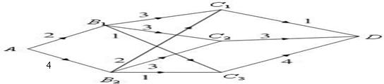

<!-- page: 79 -->

 图4  无向图的最短路问题

编写LINGO 程序如下：
model:
sets:
cities/1..11/;
roads(cities,cities):w,x;
endsets
data:
w=0;
enddata
calc:
w(1,2)=2;w(1,3)=8;w(1,4)=1;
w(2,3)=6;w(2,5)=1;
w(3,4)=7;w(3,5)=5;w(3,6)=1;w(3,7)=2;
w(4,7)=9;
w(5,6)=3;w(5,8)=2;w(5,9)=9;
w(6,7)=4;w(6,9)=6;
w(7,9)=3;w(7,10)=1;
w(8,9)=7;w(8,11)=9;
w(9,10)=1;w(9,11)=2;w(10,11)=4;
@for(roads(i,j):w(i,j)=w(i,j)+w(j,i));
@for(roads(i,j):w(i,j)=@if(w(i,j) #eq# 0, 1000,w(i,j)));
endcalc
n=@size(cities);  !城市的个数;
min=@sum(roads:w*x);
@for(cities(i)|i #ne#1 #and# i #ne#
n:@sum(cities(j):x(i,j))=@sum(cities(j):x(j,i)));
@sum(cities(j):x(1,j))=1;
@sum(cities(j):x(j,1))=0; !不能回到顶点1;
@sum(cities(j):x(j,n))=1;
@for(roads:@bin(x));
end

与有向图相比较，在程序中只增加了一个语句@sum(cities(j):x(j,1))=0，即
从顶点1 离开后，再不能回到该顶点。

求得的最短路径为1→2→5→6→3→7→10→9→11，最短路径长度为13。
3.3 每对顶点之间的最短路径
计算赋权图中各对顶点之间最短路径，显然可以调用Dijkstra 算法。具体方法是：
每次以不同的顶点作为起点，用Dijkstra 算法求出从该起点到其余顶点的最短路径，反
复执行
1
−
n
次这样的操作，就可得到从每一个顶点到其它顶点的最短路径。这种算法

的时间复杂度为
)
(
3
n
O
。第二种解决这一问题的方法是由Floyd R W 提出的算法，称
之为Floyd 算法。

-78-

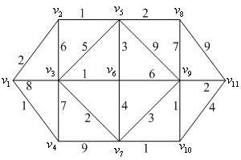

<!-- page: 80 -->

假设图G 权的邻接矩阵为
0
A ，

⎡

⎤

a
a
a

L

1
12
11

n

⎢
⎢
⎢
⎢

⎥
⎥
⎥
⎥

a
a
a

L

2
22
21

n

=

A

0

M
L
M
M

a
a
a

L

⎣

⎦

nn
n
n

2
1

来存放各边长度，其中：

0
=
ii
a
n
i
,
,2,1
L
=
；
∞
=
ij
a
j
i,
之间没有边，在程序中以各边都不可能达到的充分大的数代替；

ij
ij
w
a =
ij
w 是
j
i,
之间边的长度，
n
j
i
,
,2,1
,
L
=
。

对于无向图，
0
A 是对称矩阵，
ji
ij
a
a =
。

Floyd 算法的基本思想是：递推产生一个矩阵序列
n
k
A
A
A
A
,
,
,
,
,
1
0
L
L
，其中
)
,
(
j
i
Ak
表示从顶点
iv 到顶点
jv 的路径上所经过的顶点序号不大于k 的最短路径长

度。

计算时用迭代公式：

))
,
(
)
,
(
),
,
(
min(
)
,
(
1
1
1
j
k
A
k
i
A
j
i
A
j
i
A
k
k
k
k
−
−
−
+
=
k 是迭代次数，
n
k
j
i
,
,2,1
,
,
L
=
。

最后，当
n
k =
时，
n
A 即是各顶点之间的最短通路值。

例12 用Floyd算法求解例9。
矩阵path用来存放每对顶点之间最短路径上所经过的顶点的序号。Floyd算法的
Matlab程序如下：
clear;clc;
n=6; a=zeros(n);
a(1,2)=50;a(1,4)=40;a(1,5)=25;a(1,6)=10;
a(2,3)=15;a(2,4)=20;a(2,6)=25; a(3,4)=10;a(3,5)=20;
a(4,5)=10;a(4,6)=25; a(5,6)=55;
a=a+a'; M=max(max(a))*n^2; %M为充分大的正实数
a=a+((a==0)-eye(n))*M;
path=zeros(n);
for k=1:n
   for i=1:n
      for j=1:n
         if a(i,j)>a(i,k)+a(k,j)
            a(i,j)=a(i,k)+a(k,j);
            path(i,j)=k;
         end
      end
   end
end
a, path
    我们使用LINGO9.0编写的FLOYD算法如下：
model:
sets:

-79-

<!-- page: 81 -->

nodes/c1..c6/;
link(nodes,nodes):w,path;  !path标志最短路径上走过的顶点;
endsets
data:
path=0;
w=0;
@text(mydata1.txt)=@writefor(nodes(i):@writefor(nodes(j):

@format(w(i,j),' 10.0f')),@newline(1));
@text(mydata1.txt)=@write(@newline(1));
@text(mydata1.txt)=@writefor(nodes(i):@writefor(nodes(j):

@format(path(i,j),' 10.0f')),@newline(1));
enddata
calc:
w(1,2)=50;w(1,4)=40;w(1,5)=25;w(1,6)=10;
w(2,3)=15;w(2,4)=20;w(2,6)=25;
w(3,4)=10;w(3,5)=20;
w(4,5)=10;w(4,6)=25;w(5,6)=55;
@for(link(i,j):w(i,j)=w(i,j)+w(j,i));
@for(link(i,j) |i#ne#j:w(i,j)=@if(w(i,j)#eq#0,10000,w(i,j)));
@for(nodes(k):@for(nodes(i):@for(nodes(j):

tm=@smin(w(i,j),w(i,k)+w(k,j));
path(i,j)=@if(w(i,j)#gt# tm,k,path(i,j));w(i,j)=tm)));
endcalc
end
§4  树

4.1 基本概念
连通的无圈图叫做树，记之为T 。若图G 满足
)
(
)
(
T
V
G
V
=
，
)
(
)
(
G
E
T
E
⊂
，

则称T 是G 的生成树。图G 连通的充分必要条件为G 有生成树。一个连通图的生成树
的个数很多，用
)
(G
τ
表示G 的生成树的个数，则有公式

公式  (Caylay)
2
)
(
−
=
n
n
n
K
τ
。

公式
)
(
)
(
)
(
e
G
e
G
G
⋅
+
−
=
τ
τ
τ
。

其中
e
G −
表示从G 上删除边e ，
e
G ⋅
表示把e 的长度收缩为零得到的图。
树有下面常用的五个充要条件。
定理1  （i）G 是树当且仅当G 中任二顶点之间有且仅有一条轨道。
（ii）G 是树当且仅当G 无圈，且
1
−
=ν
ε
。
（iii）G 是树当且仅当G 连通，且
1
−
=ν
ε
。
（iv）G 是树当且仅当G 连通，且
)
(G
E
e∈
∀
，
e
G −
不连通。

（v）G 是树当且仅当G 无圈，
)
(G
E
e∉
∀
，
e
G +
恰有一个圈。
4.2 应用—连线问题
欲修筑连接n 个城市的铁路，已知i 城与j 城之间的铁路造价为
ij
C ，设计一个线

路图，使总造价最低。

连线问题的数学模型是在连通赋权图上求权最小的生成树。赋权图的具最小权的生
成树叫做最小生成树。

下面介绍构造最小生成树的两种常用算法。
4.2.1
prim 算法构造最小生成树
设置两个集合P 和Q ,其中P 用于存放G 的最小生成树中的顶点，集合Q 存放G

-80-

<!-- page: 82 -->

的最小生成树中的边。令集合P 的初值为
}
{ 1v
P =
（假设构造最小生成树时，从顶点
1v

出发），集合Q 的初值为
Φ
=
Q
。prim 算法的思想是，从所有
P
p ∈
，
P
V
v
−
∈
的边

中，选取具有最小权值的边pv ，将顶点v 加入集合P 中，将边pv 加入集合Q 中，如

此不断重复，直到
V
P =
时，最小生成树构造完毕，这时集合Q 中包含了最小生成树
的所有边。

prim 算法如下：
（i）
}
{ 1v
P =
，
Φ
=
Q
；
（ii）while
V
P
=
~
     找最小边pv ，其中
P
V
v
P
p
−
∈
∈
,

}
{v
P
P
+
=

}
{pv
Q
Q
+
=
     end
      图5  最小生成树问题
例13 用prim 算法求图5 的最小生成树。
我们用
n
result ×
3
的第一、二、三行分别表示生成树边的起点、终点、权集合。Matlab

程序如下：
clc;clear;
a=zeros(7);
a(1,2)=50; a(1,3)=60;
a(2,4)=65; a(2,5)=40;
a(3,4)=52;a(3,7)=45;
a(4,5)=50; a(4,6)=30;a(4,7)=42;
a(5,6)=70;
a=a+a';a(find(a==0))=inf;
result=[];p=1;tb=2:length(a);
while length(result)~=length(a)-1
   temp=a(p,tb);temp=temp(:);
   d=min(temp);
   [jb,kb]=find(a(p,tb)==d);
   j=p(jb(1));k=tb(kb(1));
   result=[result,[j;k;d]];p=[p,k];tb(find(tb==k))=[];
end
result

4.2.1
Kruskal 算法构造最小生成树
科茹斯克尔（Kruskal）算法是一个好算法。Kruskal 算法如下:
(i)选
)
(
1
G
E
e ∈
，使得
min
)
( 1 =
e
w
。

-81-

<!-- page: 83 -->

(ii)若
ie
e
e
,
,
,
2
1
L
已选好，则从
}
,
,
,
{
)
(
2
1
ie
e
e
G
E
L
−
中选取
1
+
ie
，使得

①
}]
,
,
,
,
[{
1
2
1
+
i
i e
e
e
e
G
L
中无圈，且

②
min
)
(
1 =
+
ie
w
。

(iii)直到选得
1
−
νe
为止。
例14 用Kruskal 算法构造例3 的最小生成树。
我们用
n
index ×
2
存放各边端点的信息，当选中某一边之后，就将此边对应的顶点序

号中较大序号u 改记为此边的另一序号v ，同时把后面边中所有序号为u 的改记为v 。
此方法的几何意义是：将序号u 的这个顶点收缩到v 顶点，u 顶点不复存在。后面继续
寻查时，发现某边的两个顶点序号相同时，认为已被收缩掉，失去了被选取的资格。

Matlab 程序如下：
clc;clear;
a(1,2)=50; a(1,3)=60; a(2,4)=65; a(2,5)=40;
a(3,4)=52;a(3,7)=45; a(4,5)=50; a(4,6)=30;
a(4,7)=42; a(5,6)=70;
[i,j,b]=find(a);
data=[i';j';b'];index=data(1:2,:);
loop=max(size(a))-1;
result=[];
while length(result)<loop
   temp=min(data(3,:));
   flag=find(data(3,:)==temp);
   flag=flag(1);
   v1=data(1,flag);v2=data(2,flag);
   if index(1,flag)~=index(2,flag)
      result=[result,data(:,flag)];
   end
   index(find(index==v2))=v1;
   data(:,flag)=[];
   index(:,flag)=[];
end
result
§5  匹配问题

定义  若
)
(G
E
M ⊂
，
M
e
e
j
i
∈
∀,
，
ie 与
je 无公共端点（
j
i ≠
），则称M 为图

G 中的一个对集；M 中的一条边的两个端点叫做在对集M 中相配；M 中的端点称为
被M 许配；G 中每个顶点皆被M 许配时，M 称为完美对集；G 中已无使
|
|
|'
|
M
M >

的对集
'
M ，则M 称为最大对集；若G 中有一轨，其边交替地在对集M 内外出现，则
称此轨为M 的交错轨，交错轨的起止顶点都未被许配时，此交错轨称为可增广轨。

若把可增广轨上在M 外的边纳入对集，把M 内的边从对集中删除，则被许配的
顶点数增加2，对集中的“对儿”增加一个。

1957 年，贝尔热(Berge)得到最大对集的充要条件：
定理2  M 是图G 中的最大对集当且仅当G 中无M 可增广轨。
1935 年，霍尔(Hall)得到下面的许配定理：
定理3  G 为二分图，X 与Y 是顶点集的划分，G 中存在把X 中顶点皆许配的

-82-

<!-- page: 84 -->

对集的充要条件是，
X
S ⊂
∀
，则
|
|
|)
(
|
S
S
N
≥
，其中
)
(S
N
是S 中顶点的邻集。
由上述定理可以得出：
推论1：若G 是k 次（
)
0
>
k
正则2 分图，则G 有完美对集。

所谓k 次正则图，即每顶点皆k 度的图。
由此推论得出下面的婚配定理：
定理4  每个姑娘都结识
)1
( ≥
k
k
位小伙子，每个小伙子都结识k 位姑娘，则每位
姑娘都能和她认识的一个小伙子结婚，并且每位小伙子也能和他认识的一个姑娘结婚。

人员分派问题等实际问题可以化成对集来解决。
人员分派问题：工作人员
nx
x
x
,
,
,
2
1
L
去做n 件工作
ny
y
y
,
,
,
2
1
L
，每人适合做其

中一件或几件，问能否每人都有一份适合的工作？如果不能，最多几人可以有适合的工
作？

这个问题的数学模型是：G 是二分图，顶点集划分为
Y
X
G
V
U
=
)
(
，
}
,
,
{ 1
nx
x
X
L
=
，
}
,
,
{
1
ny
y
Y
L
=
，当且仅当
ix 适合做工作
jy 时，
)
(G
E
y
x
j
i
∈
，求
G 中的最大对集。

解决这个问题可以利用1965 年埃德门兹(Edmonds)提出的匈牙利算法。
匈牙利算法：
（i）从G 中任意取定一个初始对集M 。
（ii）若M 把X 中的顶点皆许配，停止，M 即完美对集；否则取X 中未被M 许
配的一顶点u ，记
}
{u
S =
，
Φ
=
T
。

（iii）若
T
S
N
=
)
(
，停止，无完美对集；否则取
T
S
N
y
−
∈
)
(
。

（iv）若y 是被M 许配的，设
M
yz ∈
，
}
{z
S
S
U
=
，
}
{y
T
T
U
=
，转（iii）；

否则，取可增广轨
)
,
(
y
u
P
，令
)
)
(
(
))
(
(
M
P
E
P
E
M
M
−
−
=
U
，转（ii）。
把以上算法稍加修改就能够用来求二分图的最大完美对集。
最优分派问题：在人员分派问题中，工作人员适合做的各项工作当中，效益未必一
致，我们需要制定一个分派方案，使公司总效益最大。

这个问题的数学模型是：在人员分派问题的模型中，图G 的每边加了权

0
)
(
≥
j
i y
x
w
，表示
ix 干
jy 工作的效益，求加权图G 上的权最大的完美对集。

解决这个问题可以用库恩—曼克莱斯（Kuhn-Munkres）算法。为此，我们要引入
可行顶点标号与相等子图的概念。

定义  若映射
R
G
V
l
→
)
(
:
，满足
Y
y
X
x
∈
∈
∀
,
，

)
,
(
)
(
)
(
y
x
w
y
l
x
l
≥
+
，

则称l 是二分图G 的可行顶点标号。令

)}
(
)
(
)
(
),
(
|
{
xy
w
y
l
x
l
G
E
xy
xy
El
=
+
∈
=
，

称以
l
E 为边集的G 的生成子图为相等子图，记作
l
G 。

可行顶点标号是存在的。例如

Y
y
∈
=

;
),
(
max
)
(
X
x
xy
w
x
l

∈

Y
y
y
l
∈
=
,0
)
(
。

定理5
l
G 的完美对集即为G 的权最大的完美对集。

Kuhn-Munkres 算法

-83-

<!-- page: 85 -->

（i）选定初始可行顶点标号l ，确定
l
G ，在
l
G 中选取一个对集M 。

（ii）若X 中顶点皆被M 许配，停止，M 即G 的权最大的完美对集；否则，取
l
G

中未被M 许配的顶点u ，令
}
{u
S =
，
Φ
=
T
。

l
G
⊃
)
(
，转（iv）；若
T
S
N

l
G
=
)
(
，取

(iii)若
T
S
N

∉
∈
α
，

,
xy
w
y
l
x
l
T
y
S
x
l
−
+
=

)}
(
)
(
)
(
{
min

α

∈
−

⎧

S
v
v
l

,
)
(

l
α

⎪⎨

=

∈
+

v
l
l

)
(

T
v
v
l

,
)
(

，

⎪⎩

v
l

其它
),
(

l
l =
 ，
l
l
G
G =
。

l
G
−
)
(
中一顶点y ，若y 已被M 许配，且
M
yz ∈
，则
}
{z
S
S
U
=
，

（iv）选
T
S
N

}
{y
T
T
U
=
，转（iii）；否则，取
l
G 中一个M 可增广轨
)
,
(
y
u
P
，令
)
)
(
(
))
(
(
M
P
E
P
E
M
M
−
−
=
U
，
转（ii）。

其中
)
(S
N

l
G
是
l
G 中S 的相邻顶点集。

§6  Euler 图和Hamilton 图

6.1  基本概念
定义  经过G 的每条边的迹叫做G 的Euler 迹；闭的Euler 迹叫做Euler 回路或E
回路；含Euler 回路的图叫做Euler 图。

直观地讲，Euler 图就是从一顶点出发每边恰通过一次能回到出发点的那种图，即
不重复地行遍所有的边再回到出发点。

定理6  （i）G 是Euler 图的充分必要条件是G 连通且每顶点皆偶次。

d

1
=
=
，
i
C 是圈，

（ii ）G 是Euler 图的充分必要条件是G 连通且
U

i
C
G

i

)
(
)
(
)
(
j
i
C
E
C
E
j
i
≠
Φ
=
I
。

（iii）G 中有Euler 迹的充要条件是G 连通且至多有两个奇次点。
定义  包含G 的每个顶点的轨叫做Hamilton(哈密顿)轨；闭的Hamilton 轨叫做
Hamilton 圈或H 圈；含Hamilton 圈的图叫做Hamilton 图。

直观地讲，Hamilton 图就是从一顶点出发每顶点恰通过一次能回到出发点的那种
图，即不重复地行遍所有的顶点再回到出发点。

6.2  Euler 回路的Fleury 算法
1921 年，Fleury 给出下面的求Euler 回路的算法。
Fleury 算法：
1o.
)
(
0
G
V
v ∈
∀
，令
0
0
v
W =
。

2o. 假设迹
i
i
i
v
e
v
e
v
W
L
1
1
0
=
已经选定，那么按下述方法从
}
,
,
{ 1
ie
e
E
L
−
中选取

边
1
+
ie
：

（i）
1
+
ie
和
iv 相关联；

-84-

<!-- page: 86 -->

（ii）除非没有别的边可选择，否则
1
+
ie
不是
}
,
,
{ 1
i
i
e
e
G
G
L
−
=
的割边(cut edge)。

(所谓割边是一条删除后使连通图不再连通的边)。

3o.  当第2 步不能再执行时，算法停止。
6.3  应用
6.3.1  邮递员问题
中国邮递员问题
一位邮递员从邮局选好邮件去投递，然后返回邮局，当然他必须经过他负责投递的
每条街道至少一次，为他设计一条投递路线，使得他行程最短。

上述中国邮递员问题的数学模型是：在一个赋权连通图上求一个含所有边的回路，
且使此回路的权最小。

显然，若此连通赋权图是Euler 图，则可用Fleury 算法求Euler 回路，此回路即为
所求。

对于非Euler 图，1973 年，Edmonds 和Johnson 给出下面的解法：
设G 是连通赋权图。
（i）求
)}
2
(mod
1
)
(
),
(
|
{
0
=
∈
=
v
d
G
V
v
v
V
。

（ii）对每对顶点
0
,
V
v
u
∈
，求
)
,
(
v
u
d
（
)
,
(
v
u
d
是u 与v 的距离，可用Floyd 算法

求得）。

（iii）构造完全赋权图
|
| 0
V
K
，以
0
V 为顶点集，以
)
,
(
v
u
d
为边uv 的权。

（iv）求
|
| 0
V
K
中权之和最小的完美对集M 。

（v）求M 中边的端点之间的在G 中的最短轨。
（vi）在（v）中求得的每条最短轨上每条边添加一条等权的所谓“倍边”（即共端
点共权的边）。

（vii）在（vi）中得的图
'
G 上求Euler 回路即为中国邮递员问题的解。
多邮递员问题：
邮局有
)
2
( ≥
k
k
位投递员，同时投递信件，全城街道都要投递，完成任务返回邮
局，如何分配投递路线，使得完成投递任务的时间最早？我们把这一问题记成kPP。

kPP 的数学模型如下：

)
,
(
E
V
G
是连通图，
)
(
0
G
V
v ∈
，求G 的回路
k
C
C
,
,
1 L
，使得

（i）
)
(
0
i
C
V
v ∈
，
k
i
,
,2,1
L
=
，

)
(
1
=
∑
∈
≤
≤

（ii）
min
)
(
max

i
C
E
e
k
i
e
w
，

k

=

（iii）U

1
)
(
)
(

i
G
E
C
E

=

i

6.3.2  旅行商（TSP）问题
一名推销员准备前往若干城市推销产品，然后回到他的出发地。如何为他设计一条
最短的旅行路线（从驻地出发，经过每个城市恰好一次，最后返回驻地）？这个问题称
为旅行商问题。用图论的术语说，就是在一个赋权完全图中，找出一个有最小权的
Hamilton 圈。称这种圈为最优圈。与最短路问题及连线问题相反，目前还没有求解旅行
商问题的有效算法。所以希望有一个方法以获得相当好（但不一定最优）的解。

一个可行的办法是首先求一个Hamilton 圈C ，然后适当修改C 以得到具有较小权
的另一个Hamilton 圈。修改的方法叫做改良圈算法。设初始圈
1
2
1
v
v
v
v
C
n
L
=
。

-85-

<!-- page: 87 -->

（i）对于
n
j
i
<
<
+
<
1
1
，构造新的Hamilton 圈:

1
2
1
1
2
1
2
1
v
v
v
v
v
v
v
v
v
v
v
C
n
j
j
i
j
j
j
i
ij
L
L
L
+
+
+
−
−
=
,

它是由C 中删去边
1
+
i
iv
v
和
1
+
j
jv
v
，添加边
j
iv
v
和
1
1
+
+
j
i v
v
而得到的。若

)
(
)
(
)
(
)
(
1
1
1
1
+
+
+
+
+
<
+
j
j
i
i
j
i
j
i
v
v
w
v
v
w
v
v
w
v
v
w
，则以
ij
C 代替C ，
ij
C 叫做C 的改良圈。

（ii）转（i），直至无法改进，停止。
用改良圈算法得到的结果几乎可以肯定不是最优的。为了得到更高的精确度，可以
选择不同的初始圈，重复进行几次算法，以求得较精确的结果。

这个算法的优劣程度有时能用Kruskal 算法加以说明。假设C 是G 中的最优圈。
则对于任何顶点v ，
v
C −
是在
v
G −
中的Hamilton 轨，因而也是
v
G −
的生成树。由
此推知：若T 是
v
G −
中的最优树，同时e 和f 是和v 关联的两条边，并使得
)
(
)
(
f
w
e
w
+
尽可能小，则
)
(
)
(
)
(
f
w
e
w
T
w
+
+
将是
)
(C
w
的一个上界。
这里介绍的方法已被进一步发展。圈的修改过程一次替换三条边比一次仅替换两条
边更为有效；然而，有点奇怪的是，进一步推广这一想法，就不对了。

例15 从北京（Pe）乘飞机到东京(T)、纽约(N)、墨西哥城(M)、伦敦(L)、巴黎(Pa)
五城市做旅游，每城市恰去一次再回北京，应如何安排旅游线，使旅程最短？各城市之
间的航线距离如表7。

表7  六城市间的距离
L
M
N
Pa
Pe
T
L
56
35
21
51
60
M
56
21
57
78
70
N
35
21
36
68
68
Pa
21
57
36
51
61
Pe
51
78
68
51
13
T
60
70
68
61
13
解：编写程序如下：
function main
clc,clear
global a
a=zeros(6);
a(1,2)=56;a(1,3)=35;a(1,4)=21;a(1,5)=51;a(1,6)=60;
a(2,3)=21;a(2,4)=57;a(2,5)=78;a(2,6)=70;
a(3,4)=36;a(3,5)=68;a(3,6)=68; a(4,5)=51;a(4,6)=61;
a(5,6)=13; a=a+a'; L=size(a,1);
c1=[5 1:4 6];
[circle,long]=modifycircle(c1,L);
c2=[5 6 1:4];%改变初始圈，该算法的最后一个顶点不动
[circle2,long2]=modifycircle(c2,L);
if long2<long
   long=long2;
   circle=circle2;
end
circle,long
%*******************************************
%修改圈的子函数
%*******************************************
function [circle,long]=modifycircle(c1,L);

-86-

<!-- page: 88 -->

global a
flag=1;
while flag>0
      flag=0;
   for m=1:L-3
      for n=m+2:L-1
        if a(c1(m),c1(n))+a(c1(m+1),c1(n+1))<...
           a(c1(m),c1(m+1))+a(c1(n),c1(n+1))
           flag=1;
           c1(m+1:n)=c1(n:-1:m+1);
        end
     end
  end
end
long=a(c1(1),c1(L));
for i=1:L-1
   long=long+a(c1(i),c1(i+1));
end
circle=c1;

6.3.3  旅行商问题的数学表达式
设城市的个数为n ，
ij
d 是两个城市i 与j 之间的距离，
0
=
ijx
或1（1 表示走过城

市i 到城市j 的路，0 表示没有选择走这条路）。则有

∑

ij
ijx
d
min

≠j
i

n

1
=
∑

ijx
，
n
i
,
,2,1
L
=
，（每个点只有一条边出去）

s.t.
1

=

j

n

1
=
∑

ijx
，
n
j
,
,2,1
L
=
，（每个点只有一条边进去）

1

=

i

−
≤
∑

ij
，
1
|
|
2
−
≤
≤
n
s
，
}
,
,2,1
{
n
s
L
⊂

1
|
|

s
x

∈

s
j
i

,

    （除起点和终点外，各边不构成圈）
}
1,0
{
∈
ijx
，
n
j
i
,
,2,1
,
L
=
，
j
i ≠
。

其中
|
| s 表示集合s 中元素个数。
将旅行商问题写成数学规划的具体形式还需要一定的技巧，下面的例子我们引用
LINGO 帮助中的一个程序。

例16  已知SV 地区各城镇之间距离见表8，某公司计划在SV 地区做广告宣传，
推销员从城市1 出发，经过各个城镇，再回到城市1。为节约开支，公司希望推销员走
过这10 个城镇的总距离最少。

表8  城镇之间的距离
      2     3     4     5     6     7     8     9     10
1     8     5     9     12    14    12    16    17    22
2           9     15    17    8     11    18    14    22
3                 7     9     11    7     12    12    17
4                       3     17    10    7     15    18

-87-

<!-- page: 89 -->

5                             8     10    6     15    15
6                                   9     14    8     16
7                                         8     6     11
8                                               11    11
9                                                     10

解  编写LINGO 程序如下：
MODEL:
  SETS:
  CITY / 1.. 10/: U; ! U( I) = sequence no. of city;
  LINK( CITY, CITY):
       DIST,  ! The distance matrix;
          X;  ! X( I, J) = 1 if we use link I, J;
 ENDSETS
 DATA:   !Distance matrix, it need not be symmetric;
  DIST =0     8     5     9    12    14    12    16    17    22
     8     0     9    15    17     8    11    18    14    22
     5     9     0     7     9    11     7    12    12    17
     9    15     7     0     3    17    10     7    15    18
    12    17     9     3     0     8    10     6    15    15
    14     8    11    17     8     0     9    14     8    16
    12    11     7    10    10     9     0     8     6    11
    16    18    12     7     6    14     8     0    11    11
    17    14    12    15    15     8     6    11     0    10
    22    22    17    18    15    16    11    11    10     0;
 ENDDATA
 !The model:Ref. Desrochers & Laporte, OR Letters,
  Feb. 91;
  N = @SIZE( CITY);
  MIN = @SUM( LINK: DIST * X);
  @FOR( CITY( K):
  !  It must be entered;
   @SUM( CITY( I)| I #NE# K: X( I, K)) = 1;
  !  It must be departed;
   @SUM( CITY( J)| J #NE# K: X( K, J)) = 1;
  ! Weak form of the subtour breaking constraints;
  ! These are not very powerful for large problems;
   @FOR( CITY( J)| J #GT# 1 #AND# J #NE# K:
       U( J) >= U( K) + X ( K, J) -
       ( N - 2) * ( 1 - X( K, J)) +
       ( N - 3) * X( J, K)));
  ! Make the X's 0/1;
  @FOR( LINK: @BIN( X));
  ! For the first and last stop we know...;
  @FOR( CITY( K)| K #GT# 1:
   U( K) <= N - 1 - ( N - 2) * X( 1, K);
   U( K) >= 1  + ( N - 2) * X( K, 1));
END
§7  最大流问题

7.1  最大流问题的数学描述
7.1.1 网络中的流
    定义  在以V 为节点集，A 为弧集的有向图
)
,
(
A
V
G =
上定义如下的权函数：

-88-

<!-- page: 90 -->

（i）
R
A
L
→
:
为孤上的权函数，弧
A
j
i
∈
)
,
(
对应的权
)
,
(
j
i
L
记为ijl ，称为孤
)
,
(
j
i
的容量下界（lower bound）；

（ii）
R
A
U
→
:
为弧上的权函数，弧
A
j
i
∈
)
,
(
对应的权
)
,
(
j
i
U
记为
ij
u ，称为孤

)
,
(
j
i
的容量上界，或直接称为容量（capacity）；

（iii）
R
V
D
→
:
为顶点上的权函数，节点
V
i ∈
对应的权
)
(i
D
记为
id ，称为顶

点i 的供需量（supply／demand）；

此时所构成的网络称为流网络，可以记为

)
,
,
,
,
(
D
U
L
A
V
N =
。

    由于我们只讨论
A
V,
为有限集合的情况，所以对于弧上的权函数
U
L,
和顶点上的
权函数D ，可以直接用所有孤上对应的权和顶点上的权组成的有限维向量表示，因此

D
U
L
,
,
有时直接称为权向量，或简称权。由于给定有向图
)
,
(
A
V
G =
后，我们总是可
以在它的弧集合和顶点集合上定义各种权函数，所以流网络一般也直接简称为网络。
    在流网络中，弧
)
,
(
j
i
的容量下界ijl 和容量上界
ij
u 表示的物理意义分别是：通过该

弧发送某种“物质”时，必须发送的最小数量为ijl ，而发送的最大数量为
ij
u 。顶点
V
i ∈

对应的供需量
id 则表示该顶点从网络外部获得的“物质”数量（
0
>
id
时），或从该顶

点发送到网络外部的“物质”数量（
0
<
id
时）。下面我们给出严格定义。

    定义  对于流网络
)
,
,
,
,
(
D
U
L
A
V
N =
，其上的一个流（flow）f 是指从N 的弧

集A 到R 的一个函数，即对每条弧
)
,
(
j
i
赋予一个实数
ijf （称为弧
)
,
(
j
i
的流量）。如

果流f 满足

∑
∑

∈
∀
=
−

ij
V
i
d
f
f

,
,
                               （1）

i
ji
A
j
i
j

∈
∈

)
,
(:
)
,
(:

A
i
j
j

A
j
i
u
f
l
ij
ij
ij
∈
∀
≤
≤
)
,
(
,
，                                （2）

则称f 为可行流（feasible flow）。至少存在一个可行流的流网络称为可行网络（feasible
network）．约束（1）称为流量守恒条件（也称流量平衡条件），约束（2）称为容量约
束。
    可见，当
0
>
id
时，表示有
id 个单位的流量从网络外部流入该顶点，因此顶点i 称

为供应点（supply node）或源（source），有时也形象地称为起始点或发点等；当
0
<
id

时，表示有
|
|
id
个单位的流量从该顶点流失到网络外部（或说被该顶点吸收），因此顶

点i 称为需求点（demand node）或汇（sink），有时也形象地称为终止点或收点等；当

0
=
id
时，顶点i 称为转运点（transshipment node）或平衡点、中间点等。此外，根据

（1）可知，对于可行网络，必有

0
=
∑

id
                                           （3）

∈V
i

也就是说，所有节点上的供需量之和为0 是网络中存在可行流的必要条件。
    一般来说，我们总是可以把
0
≠
L
的流网络转化为
0
=
L
的流网络进行研究。所以，
除非特别说明，以后我们总是假设
0
=
L
（即所有孤
)
,
(
j
i
的容量下界
0
=
ijl
），并将

0
=
L
时的流网络简记为
)
,
,
,
(
D
U
A
V
N =
。此时，相应的容量约束（2）为

A
j
i
u
f
ij
ij
∈
∀
≤
≤
)
,
(
,
0
。

-89-

<!-- page: 91 -->

定义  在流网络
)
,
,
,
(
D
U
A
V
N =
中，对于流f ，如果

A
j
i
fij
∈
∀
=
)
,
(
,0
，

则称f 为零流，否则为非零流。如果某条弧
)
,
(
j
i
上的流量等于其容量（
ij
ij
u
f =
），则

称该弧为饱和弧（saturated arc）；如果某条弧
)
,
(
j
i
上的流量小于其容量（
ij
ij
u
f <
），

则称该弧为非饱和弧；如果某条弧
)
,
(
j
i
上的流量为 0（
0
=
ijf
），则称该弧为空弧（void

arc）。

7.1.2 最大流问题
考虑如下流网络
)
,
,
,
(
D
U
A
V
N =
：节点s 为网络中唯一的源点，t 为唯一的汇点，

而其它节点为转运点。如果网络中存在可行流f ，此时称流f 的流量（或流值，flow

value）为
sd （根据（3），它自然也等于
td
−
），通常记为v 或
)
( f
v
，即

t
s
d
d
f
v
v
−
=
=
=
)
(
。

对这种单源单汇的网络，如果我们并不给定
sd 和
td （即流量不给定），则网络一

般记为
)
,
,
,
,
(
U
A
V
t
s
N =
。最大流问题（maximum flow problem ）就是在
)
,
,
,
,
(
U
A
V
t
s
N =
中找到流值最大的可行流（即最大流）。我们将会看到，最大流问题
的许多算法也可以用来求解流量给定的网络中的可行流。也就是说，当我们解决了最大
流问题以后，对于在流量给定的网络中寻找可行流的问题，通常也就可以解决了。

因此，用线性规划的方法，最大流问题可以形式地描述如下：

v
max

=

⎧

s
i
v

,

⎪⎨

s.t.
∑
∑

=
−

≠
=
−

f
f

t
i
v

,

 ，                    （4）

ji
A
j
i
j

ij

∈
∈
⎪⎩

)
,
(:
)
,
(:
,
,0

A
i
j
j

t
s
i

A
j
i
u
f
ij
ij
∈
∀
≤
≤
)
,
(
,
0
.                                （5）

定义  如果一个矩阵A 的任何子方阵的行列式的值都等于0，1或1
−
，则称A 是
全幺模的(totally unimodular TU，又译为全单位模的)，或称A 是全幺模矩阵。

定理7（整流定理） 最大流问题所对应的约束矩阵是全幺模矩阵。若所有弧容量
均为正整数，则问题的最优解为整数解。

最大流问题是一个特殊的线性规划问题。我们将会看到利用图的特点，解决这个问
题的方法较之线性规划的一般方法要方便、直观得多。

7.1.3 单源和单汇运输网络
实际问题往往是多源多汇网络，为了计算的规格化，可将多源多汇网络G 化成单
源单汇网络
'
G 。设X 是G 的源，Y 是G 的汇，具体转化方法如下：
（i）在原图G 中增加两个新的顶点x 和y ，令为新图
'
G 中之单源和单汇，则G 中

所有顶点V 成为
'
G 之中间顶点集。
（ii）用一条容量为∞的弧把x 连接到X 中的每个顶点。
（iii）用一条容量为∞的弧把Y 中的每个顶点连接到y 。

G 和
'
G 中的流以一个简单的方式相互对应。若f 是G 中的流，则由

-90-

<!-- page: 92 -->

⎧

G
a
a
f

),
(

的弧
是
若

⎪⎨

+

=
=

a
f

)
('

v
x
a
v
f

)
,
(
),
(

若

⎪⎩

−

=

y
v
a
v
f

)
,
(
),
(

若

所定义的函数
'f 是
'
G 中使得
)
(
)'
(
f
v
f
v
=
的流，这里
)
(v
f +
表示流出v 的流量，
)
(v
f −
表示流入v 的流量（在G 中）。反之，
'
G 中的流在G 的弧集上的限制就是G 中
具有相同值的流。

7.2 最大流和最小割关系

设
)
,
,
,
,
(
U
A
V
t
s
N =
，
V
S ⊂
，
S
s ∈
，
S
V
t
−
∈
，则称
)
,
(
S
S
为网络的一个割，

其中
S
V
S
−
=
，
)
,
(
S
S
为尾在S ，头在S 的弧集，称

u
S
S
C
∑

∈
=

,
)
,
(
)
,
(

ij

A
j
i

∈
∈

S
j
S
i

为割
)
,
(
S
S
的容量。

定理8  f 是最大流，
)
,
(
S
S
是容量最小的割的充要条件是
)
,
(
)
(
S
S
C
f
v
=
。

在网络
)
,
,
,
,
(
U
A
V
t
s
N =
中，对于轨
)
,
,
,
,
(
1
2
t
v
v
s
n−
L
（此轨为无向的），若
A
v
v
i
i
∈
+1
，则称它为前向弧；若
A
v
v
i
i
∈
+1
，则称它为后向弧。

在网络N 中，从s 到t 的轨P 上，若对所有的前向弧
)
,
(
j
i
都有
ij
ij
u
f <
，对所有

的后向弧
)
,
(
j
i
恒有
0
>
ijf
，则称这条轨P 为从s 到t 的关于f 的可增广轨。

令

⎩
⎨
⎧
−
=

j
i
f
u

)
,
,

（

为前向弧
当

ij
ij
ij
δ
，

j
i
f

)
,
,

（

为后向弧
当

ij

}
min{
ij
δ
δ =

则在这条可增广轨上每条前向弧的流都可以增加一个量δ ，而相应的后向弧的流可减
少δ ，这样就可使得网络的流量获得增加，同时可以使每条弧的流量不超过它的容量，
而且保持为正，也不影响其它弧的流量。总之，网络中f 可增广轨的存在是有意义的，

因为这意味着f 不是最大流。

7.3 最大流的一种算法—标号法
标号法是由Ford 和Fulkerson 在1957 年提出的。用标号法寻求网络中最大流的基
本思想是寻找可增广轨，使网络的流量得到增加，直到最大为止。即首先给出一个初始
流，这样的流是存在的，例如零流。如果存在关于它的可增广轨，那么调整该轨上每条
弧上的流量，就可以得到新的流。对于新的流，如果仍存在可增广轨，则用同样的方法
使流的值增大，继续这个过程，直到网络中不存在关于新得到流的可增广轨为止，则该
流就是所求的最大流。

这种方法分为以下两个过程：
A.标号过程：通过标号过程寻找一条可增广轨。
B.增流过程：沿着可增广轨增加网络的流量。
这两个过程的步骤分述如下。

-91-

<!-- page: 93 -->

（A）标号过程：

（i）给发点标号为
)
,
(
∞
+s
。
（ii）若顶点x 已经标号，则对x 的所有未标号的邻接顶点y 按以下规则标号：

① 若
A
y
x
∈
)
,
(
，且
xy
xy
u
f
<
时，令
}
,
min{
x
xy
xy
y
f
u
δ
δ
−
=
，

则给顶点y 标号为
)
,
(
y
x δ
+
，若
xy
xy
u
f
=
，则不给顶点y 标号。

②
A
x
y
∈
)
,
(
，且
0
>
yx
f
，令
}
,
min{
x
yx
y
f
δ
δ =
，则给y 标号为
)
,
(
y
x δ
−
，若

0
=
yx
f
，则不给y 标号。

（iii）不断地重复步骤（ii）直到收点t 被标号，或不再有顶点可以标号为止。当t
被标号时，表明存在一条从s 到t 的可增广轨，则转向增流过程（B）。如若t 点不能被
标号，且不存在其它可以标号的顶点时，表明不存在从s 到t 的可增广轨，算法结束，
此时所获得的流就是最大流。

（B）增流过程
（i）令
t
u =
。

（ii）若u 的标号为
t
v δ,
(
+
），则
t
vu
vu
f
f
δ
+
=
；若u 的标号为
)
,
(
t
v δ
−
，则

t
uv
uv
f
f
δ
−
=
。

（iii）若
s
u =
，把全部标号去掉，并回到标号过程（A）。否则，令
v
u =
，并回
到增流过程（ii）。

求网络
)
,
,
,
,
(
U
A
V
t
s
N =
中的最大流x 的算法的程序设计具体步骤如下：
对每个节点j ，其标号包括两部分信息

f(j))
max
),
(
pred
(
j

该节点在可能的增广路中的前一个节点
)
(
pred j ，以及沿该可能的增广路到该节点为止

可以增广的最大流量
)
(
f
max
j 。

STEP0  置初始可行流x （如零流）；对节点t 标号，即令
)
(
f
max
t =任意正值（如
1）。
STEP1  若
0
)
(
f
max
>
t
，继续下一步；否则停止，已经得到最大流，结束。

STEP2  取消所有节点
V
j ∈
的标号，即令
0
)
(
f
max
=
j
，
0
)
(
pred
=
j
；令LIST={ s }，对节点s 标号，即令
=
)
(
f
max
s
充分大的正值。

STEP3  如果LIST
Φ
≠
且
0
)
(
f
max
=
t
，继续下一步；否则：（3a）如果t 已经有

标号（即
0
)
(
f
max
>
t
），则找到了一条增广路，沿该增广路对流x 进行增广（增广的

流量为
)
(
f
max
t ，增广路可以根据pred 回溯方便地得到），转STEP1。

（3b）如果t 没有标号（即LIST=Φ 且
0
)
(
f
max
=
t
），则停止，已得到最大流。
STEP4  从LIST 中移走一个节点i ；寻找从节点i 出发的所有可能的增广弧：（4a）
对非饱和前向弧
)
,
(
j
i
，若节点j 没有标号（即
0
)
(
pred
=
j
），对j 进行标号，即令
}
,)
f(
min{max
)
(
f
max
ij
ij
x
u
i
j
−
=
，
i
j =
)
(
pred
，

并将j 加入LIST 中。

（4b）对非空后向弧
)
,
(
i
j
，若节点j 没有标号（即
0
)
(
pred
=
j
），对j 进行标号，
即令

}
,)
f(
min{max
)
(
f
max
ijx
i
j =
，
i
j
−
=
)
(
pred
，

-92-

<!-- page: 94 -->

并将j 加入LIST 中。

例17  用Ford-Fulkerson 算法计算如图6 网络中的最大流，每条弧上的两个数字分
别表示容量和当前流量。

                              图6  最大流问题
解  编写程序如下：
clc,clear
u(1,2)=1;u(1,3)=1;u(1,4)=2;u(2,3)=1;u(2,5)=2;
u(3,5)=1;u(4,3)=3;u(4,5)=3;
f(1,2)=1;f(1,3)=0;f(1,4)=1;f(2,3)=0;f(2,5)=1;
f(3,5)=1;f(4,3)=1;f(4,5)=0;
n=length(u);list=[];maxf(n)=1;
while maxf(n)>0
   maxf=zeros(1,n);pred=zeros(1,n);
   list=1;record=list;maxf(1)=inf;
   %list是未检查邻接点的标号点，record是已标号点
   while (~isempty(list))&(maxf(n)==0)
      flag=list(1);list(1)=[];
      label1= find(u(flag,:)-f(flag,:));
      label1=setdiff(label1,record);
      list=union(list,label1);
      pred(label1)=flag;
      maxf(label1)=min(maxf(flag),u(flag,label1)...
      -f(flag,label1));
      record=union(record,label1);
      label2=find(f(:,flag));
      label2=label2';
      label2=setdiff(label2,record);
      list=union(list,label2);
      pred(label2)=-flag;
      maxf(label2)=min(maxf(flag),f(label2,flag));
      record=union(record,label2);
   end
      if maxf(n)>0
         v2=n; v1=pred(v2);
         while v2~=1
           if v1>0
              f(v1,v2)=f(v1,v2)+maxf(n);
           else
           v1=abs(v1);
           f(v2,v1)=f(v2,v1)-maxf(n);
           end
         v2=v1; v1=pred(v2);
        end
      end
end
f

-93-

<!-- page: 95 -->

    例18  现需要将城市s 的石油通过管道运送到城市t ，中间有4个中转站
3
2
1
,
,
v
v
v

和
4v ，城市与中转站的连接以及管道的容量如图7所示，求从城市s 到城市t 的最大流。

           图7  最大流问题

解  使用最大流的数学规划表达式，编写LINGO程序如下：
model:
sets:
nodes/s,1,2,3,4,t/;
arcs(nodes,nodes)/s 1,s 3,1 2,1 3,2 3,2 t,3 4,4 2,4 t/:c,f;
endsets
data:
c=8 7 9 5 2 5 9 6 10;
enddata
n=@size(nodes); !顶点的个数;
max=flow;
@for(nodes(i)|i #ne#1 #and# i #ne# n:

@sum(arcs(i,j):f(i,j))=@sum(arcs(j,i):f(j,i)));
@sum(arcs(i,j)|i #eq# 1:f(i,j))=flow;
@sum(arcs(i,j)|j #eq# n:f(i,j))=flow;
@for(arcs:@bnd(0,f,c));
end

在上面的程序中，采用了稀疏集的编写方法。下面介绍的程序编写方法是利用赋权邻
接矩阵，这样可以不使用稀疏集的编写方法，更便于推广到复杂网络。
model:
sets:
nodes/s,1,2,3,4,t/;
arcs(nodes,nodes):c,f;
endsets
data:
c=0;
@text('fdata.txt')=f;
enddata
calc:
c(1,2)=8;c(1,4)=7;
c(2,3)=9;c(2,4)=5;
c(3,4)=2;c(3,6)=5;
c(4,5)=9;c(5,3)=6;c(5,6)=10;
endcalc
n=@size(nodes); !顶点的个数;
max=flow;
@for(nodes(i)|i #ne#1 #and# i #ne# n:

@sum(nodes(j):f(i,j))=@sum(nodes(j):f(j,i)));
@sum(nodes(i):f(1,i))=flow;
@sum(nodes(i):f(i,n))=flow;
@for(arcs:@bnd(0,f,c));
end

-94-

<!-- page: 96 -->

§8 最小费用流及其求法

8.1 最小费用流
上面我们介绍了一个网络上最短路以及最大流的算法，但是还没有考虑到网络上流
的费用问题，在许多实际问题中，费用的因素很重要。例如，在运输问题中，人们总是
希望在完成运输任务的同时，寻求一个使总的运输费用最小的运输方案。这就是下面要
介绍的最小费用流问题。

在运输网络
)
,
,
,
,
(
U
A
V
t
s
N =
中，设
ijc 是定义在A 上的非负函数，它表示通过弧

)
,
(
j
i
单位流的费用。所谓最小费用流问题就是从发点到收点怎样以最小费用输送一已

知量为
)
( f
v
的总流量。
最小费用流问题可以用如下的线性规划问题描述：

∑

)
,
(
min

ij
ij f
c

∈A
j
i

s.t.
∑
∑

=
−

ij
d
f
f

 ，

i
ji
A
j
i
j

∈
∈

)
,
(:
)
,
(:

A
i
j
j

A
j
i
u
f
ij
ij
∈
∀
≤
≤
)
,
(
,
0
.

=

⎧

s
i
f
v

),
(

⎪⎨

=

=
−

di

t
i
f
v

),
(

其中

⎪⎩

≠

,
,0

t
s
i

显然，如果
=
)
( f
v
最大流
)
(
max
f
v
，则本问题就是最小费用最大流问题。如果
)
(
)
(
max
f
v
f
v
>
，则本问题无解。

例19（最小费用最大流问题）（续例18）由于输油管道的长短不一或地质等原因，
使每条管道上运输费用也不相同，因此，除考虑输油管道的最大流外，还需要考虑输油
管道输送最大流的最小费用。图8 所示是带有运费的网络，其中第1 个数字是网络的容
量，第2 个数字是网络的单位运费。

    图8  最小费用最大流问题
解  按照最小费用流的数学规划写出相应的LINGO 程序如下：
model:
sets:
nodes/s,1,2,3,4,t/:d;
arcs(nodes,nodes)/s 1,s 3,1 2,1 3,2 3,2 t,3 4,4 2,4 t/:c,u,f;
endsets
data:
d=14 0 0 0 0 -14;  !最大流为14;
c=2 8 2 5 1 6 3 4 7;
u=8 7 9 5 2 5 9 6 10;
enddata
min=@sum(arcs:c*f);

-95-

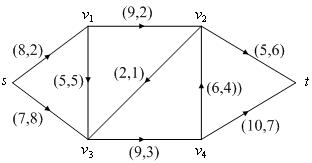

<!-- page: 97 -->

@for(nodes(i):@sum(arcs(i,j):f(i,j))-@sum(arcs(j,i):f(j,i))=d(i));
@for(arcs:@bnd(0,f,u));
end

求得最大流的最小费用是205，而原最大流的费用为210 单位，原方案并不是最优
的。

类似地，可以利用赋权邻接矩阵编程求得最小费用最大流。LINGO 程序如下：
model:
sets:
nodes/s,1,2,3,4,t/:d;
arcs(nodes,nodes):c,u,f;
endsets
data:
d=14 0 0 0 0 -14;
c=0; u=0;
enddata
calc:
c(1,2)=2;c(1,4)=8;
c(2,3)=2;c(2,4)=5;
c(3,4)=1;c(3,6)=6;
c(4,5)=3;c(5,3)=4;c(5,6)=7;
u(1,2)=8;u(1,4)=7;
u(2,3)=9;u(2,4)=5;
u(3,4)=2;u(3,6)=5;
u(4,5)=9;u(5,3)=6;u(5,6)=10;
endcalc
min=@sum(arcs:c*f);
@for(nodes(i):@sum(nodes(j):f(i,j))-@sum(nodes(j):f(j,i))=d(i));
@for(arcs:@bnd(0,f,u));
end

8.2 求最小费用流的一种方法—迭代法
这里所介绍的求最小费用流的方法叫做迭代法。这个方法是由Busacker 和Gowan
在1961 年提出的。其主要步骤如下：

(i)求出从发点到收点的最小费用通路
)
,
( t
s
μ
。

(ii)对该通路
)
,
( t
s
μ
分配最大可能的流量：

μ
∈
=

)
,
(
)
,
(
ij
t
s
j
i
u
f

}
{
min

并让通路上的所有边的容量相应减少f 。这时，对于通路上的饱和边，其单位流费用
相应改为∞。

(iii)作该通路
)
,
( t
s
μ
上所有边
)
,
(
j
i
的反向边
)
,
(
i
j
。令
f
u ji =
，
ij
ji
c
c
−
=

(iv)在这样构成的新网络中，重复上述步骤(i)，(ii)，(iii)，直到从发点到收点的全
部流量等于
)
( f
v
为止（或者再也找不到从s 到t 的最小费用道路）。
下面我们编写了最小费用最大流函数mincostmaxflow，其中调用了利用Floyd 算法
求最短路的函数floydpath。

求解例19 具体程序如下（下面的全部程序放在一个文件中）：

function mainexample19
clear;clc;

-96-

<!-- page: 98 -->

global M num
c=zeros(6);u=zeros(6);
c(1,2)=2;c(1,4)=8;c(2,3)=2;c(2,4)=5;
c(3,4)=1;c(3,6)=6;c(4,5)=3;c(5,3)=4;c(5,6)=7;
u(1,2)=8;u(1,4)=7;u(2,3)=9;u(2,4)=5;
u(3,4)=2;u(3,6)=5;u(4,5)=9;u(5,3)=6;u(5,6)=10;
num=size(u,1);M=sum(sum(u))*num^2;
[f,val]=mincostmaxflow(u,c)
%求最短路径函数
function path=floydpath(w);
global M num
w=w+((w==0)-eye(num))*M;
p=zeros(num);
for k=1:num
   for i=1:num
      for j=1:num
         if w(i,j)>w(i,k)+w(k,j)
            w(i,j)=w(i,k)+w(k,j);
            p(i,j)=k;
         end
      end
   end
end
if w(1,num) ==M
    path=[];
else
    path=zeros(num);
    s=1;t=num;m=p(s,t);
    while ~isempty(m)
        if m(1)
            s=[s,m(1)];t=[t,t(1)];t(1)=m(1);
            m(1)=[];m=[p(s(1),t(1)),m,p(s(end),t(end))];
        else
            path(s(1),t(1))=1;s(1)=[];m(1)=[];t(1)=[];
        end
    end
end
%最小费用最大流函数
function [flow,val]=mincostmaxflow(rongliang,cost,flowvalue);
%第一个参数：容量矩阵；第二个参数：费用矩阵；
%前两个参数必须在不通路处置零
%第三个参数：指定容量值（可以不写，表示求最小费用最大流）
%返回值flow 为可行流矩阵,val 为最小费用值
global M
flow=zeros(size(rongliang));allflow=sum(flow(1,:));
if nargin<3
    flowvalue=M;
end

-97-

<!-- page: 99 -->

while allflow<flowvalue
    w=(flow<rongliang).*cost-((flow>0).*cost)';
    path=floydpath(w);%调用floydpath 函数
    if isempty(path)
        val=sum(sum(flow.*cost));
        return;
    end
    theta=min(min(path.*(rongliang-flow)+(path.*(rongliang-flow)==0).*M));
    theta=min([min(path'.*flow+(path'.*flow==0).*M),theta]);
    flow=flow+(rongliang>0).*(path-path').*theta;
    allflow=sum(flow(1,:));
end
val=sum(sum(flow.*cost));
§9  计划评审方法和关键路线法

计划评审方法（program evaluation and review technique, PERT）和关键路线法
（critical path method, CPM）是网络分析的重要组成部分，它广泛地用于系统分析和项
目管理。计划评审与关键路线方法是在20 世纪50 年代提出并发展起来的，1956 年，
美国杜邦公司为了协调企业不同业务部门的系统规划，提出了关键路线法。1958 年，
美国海军武装部在研制“北极星”导弹计划时，由于导弹的研制系统过于庞大、复杂，
为找到一种有效的管理方法，设计了计划评审方法。由于PERT 与CPM 既有着相同的
目标应用，又有很多相同的术语，这两种方法已合并为一种方法，在国外称为
PERT/CPM，在国内称为统筹方法（scheduling method）。

9.1  计划网络图
例20  某项目工程由11 项作业组成（分别用代号
K
J
B
A
,
,
,
,
L
表示），其计划完
成时间及作业间相互关系如表9 所示，求完成该项目的最短时间。

表9  作业流程数据
作业    计划完成时间（天）   紧前作业
作业    计划完成时间（天）   紧前作业
A           5                 －
B           10                －
C           11                －

G          21
E
B,
H          35
E
B,
I           25
E
B,
J           15
I
G
F
,
,
K           20
G
F,

D           4                B
E            4               A
F           15
D
C,

例20 就是计划评审方法或关键路线法需要解决的问题。
9.1.1  计划网络图的概念
定义  称任何消耗时间或资源的行动称为作业。称作业的开始或结束为事件，事
件本身不消耗资源。

在计划网络图中通常用圆圈表示事件，用箭线表示工作，如图9 所示，1，2，3 表
示事件，
B
A,
表示作业。由这种方法画出的网络图称为计划网络图。

  图9  计划网络图的基本画法

-98-

<!-- page: 100 -->

虚工作用虚箭线“……→”表示。它表示工时为零，不消耗任何资源的虚构工作。
其作用只是为了正确表示工作的前行后继关系。

定义  在计划网络图中，称从初始事件到最终事件的由各项工作连贯组成的一条
路为路线。具有累计作业时间最长的路线称为关键路线。

由此看来，例20 就是求相应的计划网络图中的关键路线。
9.1.2  建立计划网络图应注意的问题
（1）任何作业在网络中用唯一的箭线表示，任何作业其终点事件的编号必须大于
其起点事件。

（2）两个事件之间只能画一条箭线，表示一项作业。对于具有相同开始和结束事
件的两项以上的作业，要引进虚事件和虚作业。

（3）任何计划网络图应有唯一的最初事件和唯一的最终事件。
（4）计划网络图不允许出现回路。
（5）计划网络图的画法一般是从左到右，从上到下，尽量作到清晰美观，避免箭
头交叉。

9.2  时间参数
9.2.1  事件时间参数
（1）事件的最早时间
事件j 的最早时间用
)
( j
tE
表示，它表明以它为始点的各工作最早可能开始的时
间，也表示以它为终点的各工作的最早可能完成时间，它等于从始点事件到该事件的最
长路线上所有工作的工时总和。事件最早时间可用下列递推公式，按照事件编号从小到
大的顺序逐个计算。

设事件编号为
n
,
,2,1
L
，则

=

⎪⎨
⎧

t

0
)1(

E
                                      （6）

+
=

j
i
t
i
t
j
t

)}
,
(
)
(
{
max
)
(

⎪⎩

E
i
E

其中
)
(i
tE
是与事件j 相邻的各紧前事件的最早时间，
)
,
(
j
i
t
是作业
)
,
(
j
i
所需的工时。
终点事件的最早时间显然就是整个工程的总最早完工期，即
=
)
(n
tE
总最早完工期                                            （7）
（2）事件的最迟时间
事件i 的最迟时间用
)
(i
tL
表示，它表明在不影响任务总工期条件下，以它为始点
的工作的最迟必须开始时间，或以它为终点的各工作的最迟必须完成时间。由于一般情
况下，我们都把任务的最早完工时间作为任务的总工期，所以事件最迟时间的计算公式
为：

=

⎪⎨
⎧

n
t
n
t

)
(
)
(

E
L
）
总工期（或

                                      （8）

−
=

j
i
t
j
t
i
t

)}
,
(
)
(
{
min
)
(

⎪⎩

L
j
L

其中
)
( j
tL
是与事件i 相邻的各紧后事件的最迟时间。
公式（8）也是递推公式，但与（6）相反，是从终点事件开始，按编号由大至小的
顺序逐个由后向前计算。
9.2.2  工作的时间参数
（1）工作的最早可能开工时间与工作的最早可能完工时间
一个工作
)
,
(
j
i
的最早可能开工时间用
)
,
(
j
i
tES
表示。任何一件工作都必须在其所

-99-

<!-- page: 101 -->

有紧前工作全部完工后才能开始。工作
)
,
(
j
i
的最早可能完工时间用
)
,
(
j
i
tEF
表示。它
表示工作按最早开工时间开始所能达到的完工时间。它们的计算公式为：

⎧

=

j
t

0
)
,1(

⎪⎪
⎨

ES

+
=

i
k
t
i
k
t
j
i
t

)}
,
(
)
,
(
{
max
)
,
(

                                 （9）

ES
k
ES

⎪⎪
⎩

+
=

j
i
t
j
i
t
j
i
t

)
,
(
)
,
(
)
,
(

ES
EF

这组公式也是递推公式。即所有从总开工事件出发的工作
)
,1(
j ，其最早可能开工

时间为零；任一工作
)
,
(
j
i
的最早开工时间要由它的所有紧前工作
)
,
(
i
k
的最早开工时间

决定；工作
)
,
(
j
i
的最早完工时间显然等于其最早开工时间与工时之和。
（2）工作的最迟必须开工时间与工作的最迟必须完工时间
一个工作
)
,
(
j
i
的最迟开工时间用
)
,
(
j
i
tLS
表示。它表示工作
)
,
(
j
i
在不影响整个任

务如期完成的前提下，必须开始的最晚时间。

工作
)
,
(
j
i
的最迟必须完工时间用
)
,
(
j
i
tLF
表示。它表示工作
)
,
(
j
i
按最迟时间开
工，所能达到的完工时间。它们的计算公式为：

⎧

=

n
i
t
n
i
t

)
,
(
)
,
(

EF
LF
）
总完工期（或

⎪⎪
⎨

−
=

j
i
t
k
j
t
j
i
t

)}
,
(
)
,
(
{
min
)
,
(

                              （10）

LS
k
LS

⎪⎪
⎩

+
=

j
i
t
j
i
t
j
i
t

)
,
(
)
,
(
)
,
(

LS
LF

这组公式是按工作的最迟必须开工时间由终点向始点逐个递推的公式。凡是进入
总完工事件n 的工作
)
,
( n
i
，其最迟完工时间必须等于预定总工期或等于这个工作的最

早可能完工时间。任一工作
)
,
(
j
i
的最迟必须开工时间由它的所有紧后工作
)
,
(
k
j
的最

迟开工时间确定。而工作
)
,
(
j
i
的最迟完工时间显然等于本工作的最迟开工时间与工时
的和。

由于任一个事件i （除去始点事件和终点事件），既表示某些工作的开始又表示某
些工作的结束。所以从事件与工作的关系考虑，用公式（9），公式（10）求得的有关工
作的时间参数也可以通过事件的时间参数公式（6），公式（8）来计算。如工作
)
,
(
j
i
的

最早可能开工时间
)
,
(
j
i
tES
就等于事件i 的最早时间
)
(i
tE
。工作
)
,
(
j
i
的最迟必须完工

时间等于事件j 的最迟时间。

9.2.3  时差
工作的时差又叫工作的机动时间或富裕时间，常用的时差有两种。
（1）工作的总时差

在不影响任务总工期的条件下，某工作
)
,
(
j
i
可以延迟其开工时间的最大幅度，叫

做该工作的总时差，用
)
,
(
j
i
R
表示。其计算公式为：

)
,
(
)
,
(
)
,
(
j
i
t
j
i
t
j
i
R
EF
LF
−
=
                                  （11）

即工作
)
,
(
j
i
的总时差等于它的最迟完工时间与最早完工时间的差。显然
)
,
(
j
i
R
也等于
该工作的最迟开工时间与最早开工时间之差。
（2）工作的单时差

工作的单时差是指在不影响紧后工作的最早开工时间条件下，此工作可以延迟其
开工时间的最大幅度，用
)
,
(
j
i
r
表示。其计算公式为：

-100-

<!-- page: 102 -->

)
,
(
)
,
(
)
,
(
j
i
t
k
j
t
j
i
r
EF
ES
−
=
                                      （12）

即单时差等于其紧后工作的最早开工时间与本工作的最早完工时间之差。

9.3  计划网络图的计算
以例20 的求解过程为例介绍计划网络图的计算方法。
9.3.1  建立计划网络图
首先建立计划网络图。按照上述规则，建立例20 的计划网络图，如图10 所示。

       图10  例20 的计划网络图
9.3.2  写出相应的规划问题
设
ix 是事件i 的开始时间，1为最初事件，n 为最终事件。希望总的工期最短，即

极小化
1x
xn −
。设ijt 是作业
)
,
(
j
i
的计划时间，因此，对于事件i 与事件j 有不等式

ij
i
j
t
x
x
+
≥

由此得到相应的数学规划问题

1
min
x
xn −

s.t.
ij
i
j
t
x
x
+
≥
，
A
j
i
∈
)
,
(
，
V
j
i
∈
,

0
≥
ix
，
V
i ∈

其中V 是所有的事件集合，A 是所有的作业集合。

9.3.3  问题求解
用LINGO 软件求解例20。
解  编写LINGO 程序如下：
model:
sets:
events/1..8/:x;
operate(events,events)/1 2,1 3,1 4,2 5,3 4,3 5,4 6,5 6,
5 7,5 8,6 7,6 8,7 8/:t;
endsets
data:
t=5 10 11 4 4 0 15 21 25 35 0 20 15;
enddata
min=x(8)-x(1);
@for(operate(i,j):x(j)>x(i)+t(i,j));
end

计算结果给出了各个项目的开工时间，如
0
1 =
x
，则作业
C
B
A
,
,
的开工时间均是

第0 天；
5
2 =
x
，作业E 的开工时间是第5 天；
10
3 =
x
，则作业D 的开工时间是第

10 天；等等。每个作业只要按规定的时间开工，整个项目的最短工期为51 天。
尽管上述LINGO 程序给出相应的开工时间和整个项目的最短工期，但统筹方法中

-101-

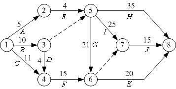

<!-- page: 103 -->

许多有用的信息并没有得到，如项目的关键路径、每个作业的最早开工时间、最迟开工
时间等。

例21（续例20）求例20 中每个作业的最早开工时间、最迟开工时间和作业的关
键路径。

解  为了得到每个作业的最早开工时间、作业的关键路线等，将目标函数改为
∑

ix ，即作业的开始时间尽量早，这样就可以得到作业的最早开工时间。再引进作业

∈V
i

对应弧上的松弛变量
ijs ，且
ij
i
j
ij
t
x
x
s
−
−
=
，
A
j
i
∈
)
,
(
，这样就可以得到作业的最迟

开工时间，记
iy 表示事件i 的最迟开工时间。当最早开工时间与最迟开工时间相同时，

就得到项目的关键路径。

编写LINGO 程序如下：
model:
sets:
events/1..8/:x,z;
operate(events,events)/1 2,1 3,1 4,2 5,3 4,3 5,4 6,5 6,
5 7,5 8,6 7,6 8,7 8/:s,t,m,c,y;
endsets
data:
t=5 10 11 4 4 0 15 21 25 35 0 20 15;
m=5 8  8  3 4 0 15 16 22 30 0 16 12;
c=0 700 400 450 0 0 0 600 300 500 0 500 400;
d=49;
@text(txt2.txt)=x,z;
enddata
min=mincost+sumx;
mincost=@sum(operate:c*y);
sumx=@sum(events:x);
@for(operate(i,j):s(i,j)=x(j)-x(i)+y(i,j)-t(i,j));
n=@size(events);
x(1)=0;
x(n)<d;
@for(operate:@bnd(0,y,t-m));
z(n)=x(n);
@for(events(i)|i#lt#n:z(i)=@min(operate(i,j):z(j)-t(i,j)+y(i,j)));
end

最迟开工时间的分析需要用到松弛变量
ijs ，当
0
>
ijs
时，说明还有剩余时间，对

应作业的工期可以推迟
ijs 。例如，
1
78 =
s
，作业（7，8）（J ）的开工时间可以推迟1

天，即开工时间为36。再如
2
46 =
s
，作业（4，6）（F ）可以推迟2 天开始，
3
14 =
s
，

作业（1，4）（C ）可以推迟3 天开始，但由于作业（4，6）（F ）已能够推迟2 天，
所以，作业（1，4）（C ）最多可推迟5 天。

由此，可以得到所有作业的最早开工时间和最迟开工时间，如下表所示，方括号
中第1 个数字是最早开工时间，第2 个数字是最迟开工时间。

表10  作业数据

作业
)
,
(
j
i
   开工时间   计划完成时间（天）作业
)
,
(
j
i
  开工时间   计划完成时间（天）
)
2,1(
A
       [0,1]           5
)
6,5
(
G
      [10,10]         21

-102-

<!-- page: 104 -->

)3,1(
B
       [0,0]           10
)
4,1(
C
       [0,5]           11
)
4,3
(
D
      [10,12]          4
)
5,2
(
E
       [5,6]           4
)
6,4
(
F
      [14,16]         15

)
8,5
(
H
     [10,16]         35
)
7,5
(I
      [10,11]         25
)
8,7
(
J
      [35,36]        15
)
8,6
(
K
     [31,31]         20

从上表可以看出，当最早开工时间与最迟开工时间相同时，对应的作业在关键路
线上，因此可以画出计划网络图中的关键路线，如图11 粗线所示。关键路线为1→3→
5→6→8。

  图11  带有关键路线的计划网络图

9.3.4  将关键路线看成最长路
如果将关键路线看成最长路，则可以按照求最短路的方法（将求极小改为求极大）
求出关键路线。

设
ijx 为0-1 变量，当作业
)
,
(
j
i
位于关键路线上取1，否则取0。数学规划问题写

成：

∑

)
,
(
max

ij
ijx
t

∈A
j
i

=

⎧

1
,1

i

⎪⎨

n

n

=
−∑
∑

=
−

x
x

,1

n
i

s.t.

1

ij

ji

⎪⎩

∈
=
∈
=
n
i

1
)
,
(

A
j
i
j

A
i
j
j

≠

,1
,0

)
,
(

0
=
ijx
 或 1，
A
j
i
∈
)
,
(

例22  用最长路的方法，求解例20。
解  按上述数学规划问题写出相应的LINGO 程序。
model:
sets:
events/1..8/:d;
operate(events,events)/1 2,1 3,1 4,2 5,3 4,3 5,4 6,5 6,
5 7,5 8,6 7,6 8,7 8/:t,x;
endsets
data:
t=5 10 11 4 4 0 15 21 25 35 0 20 15;
d=1 0 0 0 0 0 0 -1;
enddata
max=@sum(operate:t*x);
@for(events(i):@sum(operate(i,j):x(i,j))-@sum(operate(j,i):x(j,i))=d(i));
end

-103-

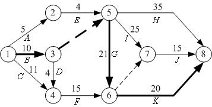

<!-- page: 105 -->

求得工期需要51 天，关键路线为1→3→5→6→8。
    9.4  关键路线与计划网络的优化

例23（关键路线与计划网络的优化） 假设例20 中所列的工程要求在49 天内完成。
为提前完成工程，有些作业需要加快进度，缩短工期，而加快进度需要额外增加费用。
下表列出例20 中可缩短工期的所有作业和缩短一天工期额外增加的费用。现在的问题
是，如何安排作业才能使额外增加的总费用最少。

表11  工程作业数据
作业   计划完成   最短完成  缩短1 天增加

作业   计划完成   最短完成  缩短1 天增加

)
,
(
j
i
 时间（天） 时间（天） 的费用（元）
)3,1(
B
    10        8         700
)
4,1(
C
    11        8         400
)
5,2
(
E
    4        3         450
)
6,5
(
G
   21        16        600

)
,
(
j
i
 时间（天） 时间（天） 的费用（元）

)
8,5
(
H
    35        30         500
)
7,5
(I
     25        22         300
)
8,7
(
J
     15        12         400
)
8,6
(
K
    20        16         500

例23 所涉及的问题就是计划网络的优化问题，这时需要压缩关键路径来减少最短
工期。

9.4.1  计划网络优化的数学表达式
设
ix 是事件i 的开始时间，ijt 是作业
)
,
(
j
i
的计划时间，
ij
m 是完成作业
)
,
(
j
i
的最

短时间，
ijy 是作业
)
,
(
j
i
可能减少的时间，
ijc 是作业
)
,
(
j
i
缩短一天增加的费用，因此

有

ij
ij
i
j
y
t
x
x
−
≥
−
 且
ij
ij
ij
m
t
y
−
≤
≤
0

设d 是要求完成的天数，1 为最初事件，n 为最终事件，所以有
d
x
xn
≤
−
1
。而问题的

总目标是使额外增加的费用最小，即目标函数为
∑

)
,
(
min
。由此得到相应的数学

ij
ij y
c

∈A
j
i

规划问题：

∑

)
,
(
min

ij
ij y
c

∈A
j
i

s.t.
ij
ij
i
j
t
y
x
x
≥
+
−
，
A
j
i
∈
)
,
(
，
V
j
i
∈
,

d
x
xn
≤
−
1

ij
ij
ij
m
t
y
−
≤
≤
0
，
A
j
i
∈
)
,
(
，
V
j
i
∈
,

    9.4.2  计划网络优化的求解

用LINGO 软件求解例23，程序如下：
model:
sets:
events/1..8/:x;
operate(events,events)/1 2,1 3,1 4,2 5,3 4,3 5,4 6,5 6,
5 7,5 8,6 7,6 8,7 8/:t,m,c,y;
endsets
data:
t=5 10 11 4 4 0 15 21 25 35 0 20 15;

-104-

<!-- page: 106 -->

m=5 8  8  3 4 0 15 16 22 30 0 16 12;
c=0 700 400 450 0 0 0 600 300 500 0 500 400;
d=49;
enddata
min=@sum(operate:c*y);
@for(operate(i,j):x(j)-x(i)+y(i,j)>t(i,j));
n=@size(events);
x(n)-x(1)<d;
@for(operate:@bnd(0,y,t-m));
end

作业
)
)(
3,1(
B ）压缩1 天的工期，作业
)
)(
8,6
(
K 压缩1 天工期，这样可以在49 天
完工，需要多花费1200 元。

如果需要知道压缩工期后的关键路径，则需要稍复杂一点的计算。
例24 （续例23） 用LINGO 软件求解例23，并求出相应的关键路径、各作业的
最早开工时间和最迟开工时间。

解  为了得到作业的最早开工时间，仍在目标函数中加入∑

ix ，记
iz 表示事件i

∈V
i

的最迟开工时间，其它处理方法与前面相同。

写出相应的LINGO 程序如下：
model:
sets:
events/1..8/:x,z;
operate(events,events)/1 2,1 3,1 4,2 5,3 4,3 5,4 6,5 6,
5 7,5 8,6 7,6 8,7 8/:s,t,m,c,y;
endsets
data:
t=5 10 11 4 4 0 15 21 25 35 0 20 15;
m=5 8  8  3 4 0 15 16 22 30 0 16 12;
c=0 700 400 450 0 0 0 600 300 500 0 500 400;
d=49;
@text(txt2.txt)=x,z;
enddata
min=mincost+sumx;
mincost=@sum(operate:c*y);
sumx=@sum(events:x);
@for(operate(i,j):s(i,j)=x(j)-x(i)+y(i,j)-t(i,j));
n=@size(events);
x(1)=0;
x(n)<d;
@for(operate:@bnd(0,y,t-m));
z(n)=x(n);
@for(events(i)|i#lt#n:z(i)=@min(operate(i,j):z(j)-t(i,j)+y(i,j)));
end

计算出所有作业的最早开工时间和最迟开工时间，见表12。

表12  作业数据

作业
)
,
(
j
i
   开工时间   实际完成时间（天）作业
)
,
(
j
i
  开工时间   实际完成时间（天）
)
2,1(
A
       [0,0]           5
)
6,5
(
G
      [9,9]         21

-105-

<!-- page: 107 -->

)3,1(
B
       [0,0]           9
)
4,1(
C
       [0,4]           11
)
4,3
(
D
      [9,12]          4
)
5,2
(
E
       [5,5]           4
)
6,4
(
F
      [13,15]         15

)
8,5
(
H
     [9,14]         35
)
7,5
(I
      [9,9]          25
)
8,7
(
J
      [34,34]        15
)
8,6
(
K
     [30,30]        19

当最早开工时间与最迟开工时间相同时，对应的作业就在关键路线上，图12 中的
粗线表示优化后的关键路线。从图5-10 可以看到，关键路线不止一条。

        图12  优化后的关键路线图
    9.5  完成作业期望和实现事件的概率

在例20 中，每项作业完成的时间均看成固定的，但在实际应用中，每一工作的完
成会受到一些意外因素的干扰，一般不可能是完全确定的，往往只能凭借经验和过去完
成类似工作需要的时间进行估计。通常情况下，对完成一项作业可以给出三个时间上的
估计值：最乐观值的估计值（a ），最悲观的估计值（b ）和最可能的估计值（m ）。

设ijt 是完成作业
)
,
(
j
i
的实际时间（是一随机变量），通常用下面的方法计算相应

的数学期望和方差。

b
m
a
t
E
+
+
=
                                            （13）

4
)
(

ij
ij
ij
ij

6

a
b
t
−
=
                                              （14）

2
ij
ij
ij

)
(
)
var(

36

设T 为最短工期，即

t
T
∑
∈
=

                                                  （15）

ij
j
i

关键路线
)
,
(

由中心极限定理，可以假设T 服从正态分布，并且期望值和方差满足

t
E
T
E
T
∑
∈
=
=

)
(
)
(

                                        （16）

ij
j
i

)
,
(

关键路线

t
T
S
∑
∈
=
=

2
ij
j
i

)
var(
)
var(

                                    （17）

)
,
(

关键路线

设规定的工期为d ，则在规定的工期内完成整个项目的概率为

⎛
−
Φ
=
≤
S

⎞
⎜⎜
⎝

T
d
d
T
P
}
{
                                            （18）

⎟⎟
⎠

@psn(x)是LINGO 软件提供的标准正态分布函数，即

2
1
)
(

x
t
∫∞
−

−
=
Φ
=
2
/
2

@psn(x)
dt
e
x

                                  （19）

π

-106-

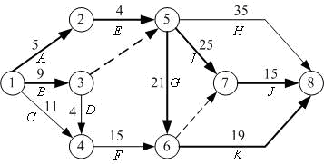

<!-- page: 108 -->

例25  已知例20 中各项作业完成的三个估计时间如下表所示。如果规定时间为52
天，求在规定时间内完成全部作业的概率。进一步，如果完成全部作业的概率大于等于
95％，那么工期至少需要多少天？

表13  作业数据
估计时间（天）
估计时间（天）
作业

作业

)
,
(
j
i
a
m
b
)
2,1(
A
3
5
7
)
6,5
(
G
18
20
28
)3,1(
B
8
9
16
)
8,5
(
H
26
33
52
)
4,1(
C
8
11
14
)
7,5
(I
18
25
32
)
4,3
(
D
2
4
6
)
8,7
(
J
12
15
18
)
5,2
(
E
3
4
5
)
8,6
(
K
11
21
25
)
6,4
(
F
8
16
18

)
,
(
j
i
a
m
b

解  对于这个问题采用最长路的编写方法。
按公式（13）和公式（14）计算出各作业的期望值与方差，再由期望时间计算出关
键路线。从而由公式（16）和公式（17）得到关键路线的期望与方差的估计值，再利用
分布函数@psn(x)，计算出完成作业的概率与完成整个项目的时间。

写出相应的LINGO 程序如下：
model:
sets:
events/1..8/:d;
operate(events,events)/1 2,1 3,1 4,2 5,3 4,3 5,4 6,5 6,
5 7,5 8,6 7,6 8,7 8/:a,m,b,et,dt,x;
endsets
data:
a=3 8 8 3 2 0 8 18 18 26 0 11 12;
m= 5 9 11 4 4 0 16 20 25 33 0 21 15;
b=7 16 14 5 6 0 18 28 32 52 0 25 18;
d=1 0 0 0 0 0 0 -1;
limit=52;
enddata
@for(operate:et=(a+4*m+b)/6;dt=(b-a)^2/36);
max=tbar;
tbar=@sum(operate:et*x);
@for(events(i):@sum(operate(i,j):x(i,j))-@sum(operate(j,i):x(j,i))=d(i));
s^2=@sum(operate:dt*x);
p=@psn((limit-tbar)/s);
@psn((days-tbar)/s)=0.95;
end

求得关键路线的时间期望为51 天，标准差为3.16，在52 天完成全部作业的概率为
62.4%，如果完成全部作业的概率大于等于95％，那么工期至少需要56.2 天。
§10  钢管订购和运输
10.1  问题描述
要铺设一条
15
2
1
A
A
A
→
→
→
L
的输送天然气的主管道, 如图14 所示。经筛选

-107-

<!-- page: 109 -->

后可以生产这种主管道钢管的钢厂有
7
2
1
,
,
S
S
S
L
。图中粗线表示铁路，单细线表示公

路，双细线表示要铺设的管道(假设沿管道或者原来有公路，或者建有施工公路)，圆圈
表示火车站，每段铁路、公路和管道旁的阿拉伯数字表示里程(单位km)。

图14
为方便计，1km 主管道钢管称为1 单位钢管。
一个钢厂如果承担制造这种钢管，至少需要生产500 个单位。钢厂
iS 在指定期限

内能生产该钢管的最大数量为
is 个单位，钢管出厂销价1 单位钢管为
ip 万元，见表14；

1 单位钢管的铁路运价见表15。

表14
i
1
2
3
4
5
6
7

is
800
800
1000
2000
2000
2000
3000

ip
160
155
155
160
155
150
160

表15  单位钢管的铁路运价

里程(km)
≤300
301～350
351～400
401～450
451～500

运价(万元)
20
23
26
29
32

里程(km)
501～600
601～700
701～800
801～900
901～1000

运价(万元)
37
44
50
55
60

1000km 以上每增加1 至100km 运价增加5 万元。公路运输费用为1 单位钢管每公
里0.1 万元（不足整公里部分按整公里计算）。钢管可由铁路、公路运往铺设地点（不
只是运到点
15
2
1
,
,
,
A
A
A
L
，而是管道全线）。

（1）请制定一个主管道钢管的订购和运输计划，使总费用最小（给出总费用)。
（2）请就（1）的模型分析：哪个钢厂钢管的销价的变化对购运计划和总费用影响

-108-

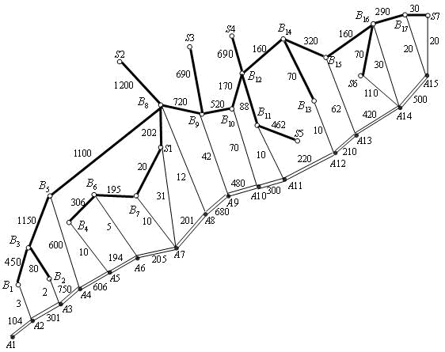

<!-- page: 110 -->

最大，哪个钢厂钢管的产量的上限的变化对购运计划和总费用的影响最大，并给出相应
的数字结果。

（3）如果要铺设的管道不是一条线，而是一个树形图，铁路、公路和管道构成网
络，请就这种更一般的情形给出一种解决办法，并对图15 按（1）的要求给出模型和结
果。

图15
10.2  模型的建立与求解
记第i 个钢厂的最大供应量为
is ，从第i 个钢厂到铺设节点j 的订购和运输费用为

ijc ；用
jl 表示管道第j 段需要铺设的钢管量。ijx 是从钢厂i 运到节点j 的钢管量，
jy 是

从节点j 向左铺设的钢管量，
jz 是从节点j 向右铺设的钢管量。

根据题中所给数据，我们可以先计算出从供应点
iS 到需求点
j
A 的最小购运费
ijc

（即出厂售价与运输费用之和），再根据
ijc 求解总费用，总费用应包括：订购费用（已

包含在
ijc 中），运输费用（由各厂
iS 经铁路、公路至各点
j
A ，
7,
,2,1
L
=
i
,

15
,
,2,1
L
=
j
），铺设管道
)
14
,
,2,1
(
1
L
=
+
j
A
A
j
j
的运费。

10.2.1  运费矩阵的计算模型

购买单位钢管及从
iS （
7,
,2,1
L
=
i
）运送到
j
A （
15
,
,2,1
L
=
j
）的最小购运费

用
ijc 的计算：

①计算铁路任意两点间的最小运输费用
构造铁路距离赋权图
)
,
,
(
1
1
1
W
E
V
G =
,其中
}
,
,
,
,
,
,
,
,
{
17
1
15
1
7
1
B
B
A
A
S
S
V
L
L
L
=
，各顶点的编号见图14；
39
39
1
1
)
(
×
=
ij
w
W
，

⎪⎨
⎧

,
,
1
1
（
1
ij
d 表示i ，j 两点之间的铁路路程。）

j
i
d
w

之间有铁路直接相连

ij
ij
,
,

∞
+
=

⎪⎩

j
i

之间没有铁路直接相连

-109-

<!-- page: 111 -->

由于铁路运费不是连续的，故不能直接用Floyd 算法来计算最小运输费用。但可以
用Floyd 算法来计算任意两点间的最短铁路距离值，再依据题中的铁路运价表，来计算
最小运输费用。这就巧妙的避开铁路运费不是连续的问题。最终计算出铁路任意两点间

的最小运输费用
1
ijc 。其中，路径值无穷大时的费用也为无穷大。

②计算公路任意两点间的最小运输费用

构造公路距离赋权图
)
,
,
(
2
2
2
W
E
V
G =
,其中V 同上，
39
39
2
2
)
(
×
=
ij
w
W
，

⎪⎨
⎧

,
,
2
2
(
2
ij
d 表示i ，j 两点之间的公路路程。)

j
i
d
w

之间有公路直接相连

ij
ij
,
,

∞
+
=

⎪⎩

j
i

之间没有公路直接相连

依据题中“公路运输费用为1 单位钢管每公里0.1 万元（不足整公里部分按整公里

计算）”，计算出公路任意两点间的最小运输费用
2
ijc 。路径值为无穷大时的费用也为无

穷大。

③计算任意两点间的最小运输费用
由于可以用铁路、公路交叉运送，所以任意相邻两点间的最小运输费用为铁路、公
路两者最小运输费用的最小值。

构造铁路公路的混合赋权完全图
)
,
,
(
W
E
V
G =
，
39
39
)
~
(
×
=
ijc
W
，其中

)
,
(
min
~
2
1
ij
ij
ij
c
c
c =
。

对图G 应用Floyd 算法，就可以计算出
iS （
7,
,2,1
L
=
i
）到
j
A （
15
,
,2,1
L
=
j
）

的最小运送费用
ijc (单位：万元)见表16。

表16  最小运费计算结果
170.7
160.3
140.2
98.6
38
20.5
3.1
21.2
64.2
92
96
106
121.2
128
142
215.7
205.3
190.2
171.6
111
95.5
86
71.2
114.2
142
146
156
171.2
178
192
230.7
220.3
200.2
181.6
121
105.5
96
86.2
48.2
82
86
96
111.2
118
132
260.7
250.3
235.2
216.6
156
140.5
131
116.2
84.2
62
51
61
76.2
83
97
255.7
245.3
225.2
206.6
146
130.5
121
111.2
79.2
57
33
51
71.2
73
87
265.7
255.3
235.2
216.6
156
140.5
131
121.2
84.2
62
51
45
26.2
11
28
275.7
265.3
245.2
226.6
166
150.5
141
131.2
99.2
76
66
56
38.2
26
2
任意两点间的最小运输费用加上出厂售价, 得到单位钢管从任一个
iS

（
7,
,2,1
L
=
i
）到
j
A （
15
,
,2,1
L
=
j
）的购买和运送最小费用
ijc 。

    10.2.2 总费用的数学规划模型

分析题目可以知道约束条件应包括：

钢厂产量约束：上限和下限（如果生产的话）；

运量约束：
ijx 对i 求和等于
jz 加
jy ；

1
+
jy
与
jz 之和等于
1
+
j
j A
A
段的长度
jl 。

由
j
A 向
1
−
j
j A
A
段铺设管道的运输总路程为
2
/)1
(
1
+
=
+
+
j
j
j
y
y
y
L
；

由
j
A 向
1
+
j
j A
A
段铺设管道的运输总路程为
2
/)1
(
1
+
=
+
+
j
j
j
z
z
z
L
。

-110-

<!-- page: 112 -->

根据以上条件可以建立模型如下：

7

15

15

1
))
1
(
)1
(
(
2
1.0
min

∑∑
∑
=
=
=

+
+
+
+

j
j
j
j
j
ij
ij
y
y
z
z
x
c
                （20）

i
j

1

1

15

      s.t.
{ }U
0

1
∈
∑

ijx
]
,
500
[
is
7,
,2,1
L
=
i
                     （21）

=
j

7

∑

j
j
ij
y
z
x
15
,
,2,1
L
=
j
                    （22）

+
=

=

1
i

j
j
j
l
z
y
=
+
+1
14
,
,2,1
L
=
j
                     （23）

0
,0
,0
≥
≥
≥
j
j
ij
y
z
x
15
,
2,1
,7
,2,1
L
L
=
=
j
i
         （24）

0
,0
15
1
=
=
z
y
                                              （25）

10.2.3 Lingo 程序
使用计算机求解上述数学规划时，需要对约束条件（20）进行处理。我们引进
1
0 −

变量

⎩
⎨
⎧
=

i
fi
0

,1

生产
钢厂

i

不生产
钢厂
，

把约束条件（20）转化为

15

∑

i
i
ij
i
f
s
x
f
，
7,
,2,1
L
=
i
                                （26）

≤
≤

1
500

=

j

利用Lingo 求得总费用的最小值为127.8632 亿。Lingo 程序如下：
model:
sets:
!nodes 表示节点集合;
nodes /S1,S2,S3,S4,S5,S6,S7,A1,A2,A3,A4,A5,A6,A7,A8,A9,A10,A11,A12,A13,A14,A15,
B1,B2,B3,B4,B5,B6,B7,B8,B9,B10,B11,B12,B13,B14,B15,B16,B17/;
!c1(i,j)表示节点i 到j 铁路运输的最小运价（万元）,c2(i,j)表示节点i 到j 公路运输的费
用邻接矩阵，c(i,j)表示节点i 到j 的最小运价，path 标志最短路径上走过的顶点;
link(nodes, nodes): w, c1,c2,c,path1,path;
supply/S1..S7/:S,P,f;
need/A1..A15/:b,y,z; !y 表示每一点往左铺的量，z 表示往右铺的量;
linkf(supply, need):cf,X;
endsets
data:
S=800 800 1000 2000 2000 2000 3000;
P=160 155  155  160  155  150  160;
b=104,301,750,606,194,205,201,680,480,300,220,210,420,500,0;
path1=0; path=0; w=0; c2=0;
! 以下是格式化输出计算的中间结果和最终结果;

-111-

<!-- page: 113 -->

@text(MiddleCost.txt)=@writefor(supply(i): @writefor(need(j): @format(cf(i,j),' 6.1f' )),
@newline(1));
@text(Train_path.txt)=@writefor(nodes(i):@writefor(nodes(j):@format(path1(i,j),'5.0f')),
@newline(1));
@text(Final_path.txt)=@writefor(nodes(i):@writefor(nodes(j):@format(path(i,j),'5.0f')),
@newline(1));
@text(FinalResult.txt)=@writefor(supply(i):@writefor(need(j):@format(x(i,j),'5.0f')),
@newline(1) );
@text(FinalResult.txt)=@write(@newline(1));
@text(FinalResult.txt)=@writefor(need:@format(y,'5.0f') );
@text(FinalResult.txt)=@write(@newline(2));
@text(FinalResult.txt)=@writefor(need:@format(z,'5.0f') );
enddata
calc:
!输入铁路距离邻接矩阵的上三角元素;
w(1,29)=20;w(1,30)=202;w(2,30)=1200;w(3,31)=690;w(4,34)=690;w(5,33)=462;
w(6,38)=70;w(7,39)=30;w(23,25)=450;w(24,25)=80;w(25,27)=1150;w(26,28)=306;
w(27,30)=1100;w(28,29)=195;w(30,31)=720;w(31,32)=520;w(32,34)=170;w(33,34)=88;
w(34,36)=160;w(35,36)=70;w(36,37)=320;w(37,38)=160;w(38,39)=290;
@for(link(i,j): w(i,j) =  w(i, j)+w(j,i) ); !输入铁路距离邻接矩阵的下三角元素;
@for(link(i,j)|i#ne#j: w(i,j)=@if(w(i,j) #eq# 0, 20000,w(i,j)));  ! 无铁路连接，元素为充分
大的数;
!以下就是最短路计算公式（Floyd-Warshall 算法）;
@for(nodes(k):@for(nodes(i):@for(nodes(j):tm=@smin(w(i,j),w(i,k)+w(k,j));
path1(i,j)=@if(w(i,j)#gt# tm,k,path1(i,j));w(i,j)=tm)));
!以下就是按最短路w 查找相应运费C1 的计算公式;
@for(link|w#eq#0: C1=0);
@for(link|w#gt#0   #and# w#le#300: C1=20);
@for(link|w#gt#300 #and# w#le#350: C1=23);
@for(link|w#gt#350 #and# w#le#400: C1=26);
@for(link|w#gt#400 #and# w#le#450: C1=29);
@for(link|w#gt#450 #and# w#le#500: C1=32);
@for(link|w#gt#500 #and# w#le#600: C1=37);
@for(link|w#gt#600 #and# w#le#700: C1=44);
@for(link|w#gt#700 #and# w#le#800: C1=50);
@for(link|w#gt#800 #and# w#le#900: C1=55);
@for(link|w#gt#900 #and# w#le#1000: C1=60);
@for(link|w#gt#1000: C1= 60+5*@floor(w/100-10)+@if(@mod(w,100)#eq#0,0,5) );
!输入公路距离邻接矩阵的上三角元素;
c2(1,14)=31;c2(6,21)=110;c2(7,22)=20;c2(8,9)=104;c2(9,10)=301;c2(9,23)=3;
c2(10,11)=750;c2(10,24)=2;c2(11,12)=606;c2(11,27)=600;c2(12,13)=194;c2(12,26)=10;
c2(13,14)=205;c2(13,28)=5;c2(14,15)=201;c2(14,29)=10;c2(15,16)=680;c2(15,30)=12;
c2(16,17)=480;c2(16,31)=42;c2(17,18)=300;c2(17,32)=70;c2(18,19)=220;c2(18,33)=10;
c2(19,20)=210;c2(19,35)=10;c2(20,21)=420;c2(20,37)=62;c2(21,22)=500;c2(21,38)=30;
c2(22,39)=20;
@for(link(i,j): c2(i,j) = c2(i,j)+c2(j,i));  !输入公路距离邻接矩阵的下三角元素;
@for(link(i,j):c2(i,j)=0.1*c2(i,j)); ! 距离转化成费用;
@for(link(i,j)|i#ne#j: c2(i,j) =@if(c2(i,j)#eq#0,10000,c2(i,j) ));  !无公路连接，元素为充分
大的数;

-112-

<!-- page: 114 -->

@for(link: C= @if(C1#le#C2,C1,C2));  ! C1 和C2 矩阵对应元素取最小;
@for(nodes(k):@for(nodes(i):@for(nodes(j):tm=@smin(C(i,j),C(i,k)+C(k,j));
path(i,j)=@if(C(i,j)#gt# tm,k,path(i,j));C(i,j)=tm)));
@for(link(i,j)|i #le# 7 #and# j#ge#8 #and# j#le# 22:cf(i,j-7)=c(i,j)); !提取下面二次规划模
型需要的7×15 矩阵;
endcalc
[obj]min=@sum(linkf(i,j):(cf(i,j)+p(i))*x(i,j))+0.05*@sum(need(j):y(j)^2+y(j)+z(j)^2+z(j));
! 约束;
@for(supply(i):[con1]@sum(need(j):x(i,j))<= S(i)*f(i));
@for(supply(i):[con2]@sum(need(j):x(i,j)) >= 500*f(i));
@for(need(j):[con3] @sum(supply(i):x(i,j))=y(j)+z(j));
@for(need(j)|j#NE#15:[con4] z(j)+y(j+1)=b(j));
y(1)=0; z(15)=0;
@for(supply: @bin(f));
@for(need: @gin(y));
end

10.3  管道为树形图时的模型
当管道为树形图时，建立与上面类似的非线性规划模型

)
(
05
.0
min
2
21

7

21

ij
y
y
x
c
+
+
∑∑
∑∑

                    （27）

1
jk
jk
j
E
jk
ij
i
j

=
∈
=
=

1

1
)
(

21

s.t．
∑

i
i
ij
i
f
s
x
f
，
7,
,2,1
L
=
i
                           （28）

≤
≤

1
500

=

j

7

∑
∑
=
∈
=

jk
E
jk
ij
y
x
，
21
,
,2,1
L
=
j
                            （29）

1
)
(
i

0
,
,
≥
=
+
jk
ij
jk
kj
jk
y
x
l
y
y
                                  （30）

其中( jk )是连接
j
A ,
k
A 的边，E 是树形图的边集，
jk
l
是从
j
A 到
k
A 的长度,
jk
y
是由

j
A 沿( jk )铺设的钢管数量。

用Lingo 求解得最小费用为140.6631 亿元。Lingo 程序如下：

model:
sets:
 ! nodes 表示节点集合;
nodes
/S1,S2,S3,S4,S5,S6,S7,A1,A2,A3,A4,A5,A6,A7,A8,A9,A10,A11,A12,A13,A14,A15,A16,A
17,A18,A19,A20,B1,B2,B3,B4,B5,B6,B7,B8,B9,B10,B11,B12/;
!c1(i,j)表示节点i 到j 铁路运输的最小单位运价（万元）,c2(i,j)表示节点i 到j 公路运输
的邻接权重矩阵，c(i,j)表示节点i 到j 的最小单位运价，path 标志最短路径上走过的顶
点;
link(nodes, nodes): w, c1,c2,c,path1,path;
supply/S1..S7/:s,p,f;
need/A1..A21/:b,y,z;!y 表示每一点往节点编号小的方向铺设量，z 表示往节点编号大的
方向铺设量;
linkf(supply, need):cf,x;

-113-

<!-- page: 115 -->

special/1..3/:sx;  ! 铺设节点9，11，17 往最大编号节点方向的铺设量;
endsets
data:
s=800 800 1000 2000 2000 2000 3000;
p=160 155  155  160  155  150  160;
b=104,301,750,606,194,205,201,680,480,300,220,210,420,500,42,10,130,190,260,100,0;
path1=0; path=0; w=0; c2=0;
! 以下是格式化输出计算的中间结果和最终结果;
@text(MiddleCost.txt)=@writefor(supply(i): @writefor(need(j): @format(cf(i,j),' 6.1f' )),
@newline(1));
@text(Train_path.txt)=@writefor(nodes(i):@writefor(nodes(j):@format(path1(i,j),'5.0f')),
@newline(1));
@text(Final_path.txt)=@writefor(nodes(i):@writefor(nodes(j):@format(path(i,j),'5.0f')),
@newline(1));
@text(FinalResult.txt)=@writefor(supply(i):@writefor(need(j):@format(x(i,j),'5.0f')),
@newline(1) );
@text(FinalResult.txt)=@write(@newline(1));
@text(FinalResult.txt)=@writefor(need:@format(y,'5.0f'));
@text(FinalResult.txt)=@write(@newline(2));
@text(FinalResult.txt)=@writefor(need:@format(z,'5.0f'));
enddata
calc:
!输入铁路距离邻接矩阵的上三角元素;
w(28,30)=450;w(29,30)=80;w(30,32)=1150;w(31,33)=306;w(33,34)=195;w(1,34)=20;
w(1,35)=202;w(32,35)=1100;w(2,35)=1200;w(23,35)=720;w(3,23)=690;w(23,36)=520;
w(36,37)=170;w(4,37)=690;w(5,24)=462;w(24,37)=88;w(25,37)=160;w(25,26)=70;
w(25,27)=320;w(27,38)=160;w(6,38)=70;w(38,39)=290;w(7,39)=30;
@for(link(i,j): w(i,j) =  w(i, j)+w(j,i) );!输入铁路距离邻接矩阵的下三角元素;
@for(link(i,j)|i#ne#j: w(i,j)=@if(w(i,j) #eq# 0, 20000,w(i,j)));  ! 无铁路连接，元素为充分
大的数;
!以下就是最短路计算公式（Floyd-Warshall 算法）;
@for(nodes(k):@for(nodes(i):@for(nodes(j):tm=@smin(w(i,j),w(i,k)+w(k,j));
path1(i,j)=@if(w(i,j)#gt# tm,k,path1(i,j));w(i,j)=tm)));
!以下就是按最短路w 查找相应运费C1 的计算公式;
@for(link|w#eq#0: C1=0);
@for(link|w#gt#0   #and# w#le#300: C1=20);
@for(link|w#gt#300 #and# w#le#350: C1=23);
@for(link|w#gt#350 #and# w#le#400: C1=26);
@for(link|w#gt#400 #and# w#le#450: C1=29);
@for(link|w#gt#450 #and# w#le#500: C1=32);
@for(link|w#gt#500 #and# w#le#600: C1=37);
@for(link|w#gt#600 #and# w#le#700: C1=44);
@for(link|w#gt#700 #and# w#le#800: C1=50);
@for(link|w#gt#800 #and# w#le#900: C1=55);
@for(link|w#gt#900 #and# w#le#1000: C1=60);
@for(link|w#gt#1000: C1= 60+5*@floor(w/100-10)+@if(@mod(w,100)#eq#0,0,5) );
!输入公路距离邻接矩阵的上三角元素;
c2(8,9)=104;c2(9,10)=301;c2(10,11)=750;c2(11,12)=606;c2(12,13)=194;c2(13,14)=205;
c2(14,15)=201;c2(15,16)=680;c2(16,17)=480;c2(16,23)=42;c2(17,18)=300;c2(18,19)=220;

-114-

<!-- page: 116 -->

c2(18,24)=10;c2(19,20)=210;c2(20,21)=420;c2(21,22)=500;c2(24,25)=130;c2(24,26)=190;
c2(26,27)=260;c2(6,27)=100;c2(9,28)=3;c2(10,29)=2;c2(11,32)=600;c2(12,31)=10;
c2(13,33)=5;c2(14,34)=10;c2(1,14)=31;c2(15,35)=12;c2(17,36)=70;c2(19,26)=10;
c2(20,27)=62;c2(6,21)=110;c2(21,38)=30;c2(22,39)=20;c2(7,22)=20;
@for(link(i,j): c2(i,j) = c2(i,j)+c2(j,i)); !输入公路距离邻接矩阵的下三角元素;
@for(link(i,j):c2(i,j)=0.1*c2(i,j));  ! 距离转化成费用;
@for(link(i,j)|i#ne#j: c2(i,j) =@if(c2(i,j)#eq#0,10000,c2(i,j) ));  ! 距离转化成费用;
@for(link: C= @if(C1#le#C2,C1,C2)); !邻接矩阵的对角线元素变为0;
@for(nodes(k):@for(nodes(i):@for(nodes(j):tm=@smin(C(i,j),C(i,k)+C(k,j));
path(i,j)=@if(C(i,j)#gt# tm,k,path(i,j));C(i,j)=tm)));
@for(link(i,j)|i #le# 7 #and# j#ge#8 #and# j#le# 27:cf(i,j-7)=c(i,j)); !提取下面二次规划模
型需要的7×21 矩阵;
@for(supply(i):cf(i,21)=c(i,6));
endcalc
[obj]min=@sum(linkf(i,j):(cf(i,j)+p(i))*x(i,j))+0.05*@sum(need(j):y(j)^2+y(j)+z(j)^2+z(j))+
0.05*@sum(special:sx^2+sx);
! 约束;
@for(supply(i):[con1]@sum(need(j):x(i,j))<= s(i)*f(i));
@for(supply(i):[con2]@sum(need(j):x(i,j)) >= 500*f(i));
@for(need(j)|j#ne#9 #and# j#ne#11 #and# j#ne#17:[con3] @sum(supply(i):x(i,j))=y(j)+z(j));
y(9)+z(9)+sx(1)=@sum(supply(i):x(i,9)); y(11)+z(11)+sx(2)=@sum(supply(i):x(i,11));
y(17)+z(17)+sx(3)=@sum(supply(i):x(i,17));
@for(need(j)|j #le# 14:(z(j)+y(j+1))=b(j));
@for(need(j)|j#ge#19 #and# j#le#20:z(j)+y(j+1)=b(j));
sx(1)+y(16)=42; sx(2)+y(17)=10; sx(3)+y(19)=190; z(17)+y(18)=130;
y(1)+z(15)+z(16)+z(18)+z(21)=0;
@for(supply: @bin(f)); @for(need: @gin(y));
end

习 题 五
1. 一只狼、一头山羊和一箩卷心菜在河的同侧。一个摆渡人要将它们运过河去，
但由于船小，他一次只能运三者之一过河。显然，不管是狼和山羊，还是山羊和卷心菜，
都不能在无人监视的情况下留在一起。问摆渡人应怎样把它们运过河去？

2. 北京（Pe）、东京(T)、纽约(N)、墨西哥城(M)、伦敦(L)、巴黎(Pa)各城市之间的
航线距离如表16。

表16  六城市间的航线距离
L
M
N
Pa
Pe
T
L
56
35
21
51
60
M
56
21
57
78
70
N
35
21
36
68
68
Pa
21
57
36
51
61
Pe
51
78
68
51
13
T
60
70
68
61
13
由上述交通网络的数据确定最小生成树。

3.  某台机器可连续工作4 年，也可于每年末卖掉，换一台新的。已知于各年初购
置一台新机器的价格及不同役龄机器年末的的处理价如表17 所示。又新机器第一年运
行及维修费为0.3 万元，使用1-3 年后机器每年的运行及维修费用分别为0.8，1.5，2.0
万元。试确定该机器的最优更新策略，使4 年内用于更换、购买及运行维修的总费用为

-115-

<!-- page: 117 -->

最省。

表17
j
第一年
第二年
第三年
第四年

年初购置价
使用了j 年的机器处理价

2.5
2.0
2.6
1.6
2.8
1.3
3.1
1.1
4. 某产品从仓库运往市场销售。已知各仓库的可供量、各市场需求量及从i 仓库
至j 市场的路径的运输能力如表18 所示（表中数字0 代表无路可通），试求从仓库可运
往市场的最大流量，各市场需求能否满足？

表18
                 市场j

1
2
3
4
可供量

仓库i

A
B
C

30
0
20

10
0
10

0
10
40

40
50
5

20
20
100

需求量
20
20
60
20

5. 某单位招收懂俄、英、日、德、法文的翻译各一人，有5 人应聘。已知乙懂俄
文，甲、乙、丙、丁懂英文，甲、丙、丁懂日文，乙、戊懂德文，戊懂法文，问这5
个人是否都能得到聘书？最多几个得到聘书，招聘后每人从事哪一方面翻译工作？

6. 表19 给出某运输问题的产销平衡表与单位运价表。将此问题转化为最小费用最
大流问题，画出网络图并求数值解。

表19
产地                      销地
1
2
3
产量
A
B

20
30
24
22
5
20
8
7

销量
4
5
6

7. 求图16 所示网络的最小费用最大流，弧旁数字为
)
,
(
ij
ij u
c
。

            图16  最小费用最大流

8. 某公司计划推出一种新型产品，需要完成的作业由表20 所示。

表20
作业    名称     计划完成时间(周)  紧前作业  最短完成时间(周)  缩短1 周的费用(元)

A  设计产品          6            －            4                    800
B  市场调查          5            －            3                    600
C  原材料订货        3            A           1                    300

-116-

<!-- page: 118 -->

D  原材料收购        2            C           1                    600
E  建立产品设计规范  3
D
A,
         1                   400
F  产品广告宣传      2             B           1                   300
G  建立产品生产基地  4             E           2                   200

H  产品运输到库      2
F
G,
         2                   200
    （1）画出产品的计划网络图；

（2）求完成新产品的最短时间，列出各项作业的最早开始时间、最迟开始时间和
计划网络的关键路线；

（3）假定公司计划在17 周内推出该产品，各项作业的最短时间和缩短1 周的费
用如上表所示，求产品在17 周内上市的最小费用；

（4）如果各项作业的完成时间并不能完全确定，而是根据以往的经验估计出来的，
其估计值如表21 所示。试计算出产品在21 周内上市的概率和以95％的概率完成新产
品上市所需的周数。

表21

作业             A     B     C     D     E     F     G     H
最乐观的估计      2      4       2      1       1       3      2       1
最可能的估计      6      5       3      2       3       4      4       2
最悲观的估计      10     6       4      3       5       5      6       4
9．已知下列网络图有关数据如表22，设间接费用为15 元/天，求最低成本日程。
表22
正常时间
特急时间
工作代号
工时（d）
费用（元）
工时（d）
费用（元）
①→②
6
100
4
120
②→③
9
200
5
280
②→④
3
80
2
110
③→④
0
0
0
0
③→⑤
7
150
5
180
④→⑥
8
250
3
375
④→⑦
2
120
1
170
⑤→⑧
1
100
1
100
⑥→⑧
4
180
3
200
⑦→⑧
5
130
2
220

-117-

<!-- page: 119 -->

                          第六章  排队论模型

排队论起源于1909 年丹麦电话工程师A. K．爱尔朗的工作，他对电话通话拥挤问
题进行了研究。1917 年，爱尔朗发表了他的著名的文章—“自动电话交换中的概率理
论的几个问题的解决”。排队论已广泛应用于解决军事、运输、维修、生产、服务、库
存、医疗卫生、教育、水利灌溉之类的排队系统的问题，显示了强大的生命力。

排队是在日常生活中经常遇到的现象，如顾客到商店购买物品、病人到医院看病常
常要排队。此时要求服务的数量超过服务机构（服务台、服务员等）的容量。也就是说，
到达的顾客不能立即得到服务，因而出现了排队现象。这种现象不仅在个人日常生活中
出现，电话局的占线问题，车站、码头等交通枢纽的车船堵塞和疏导，故障机器的停机
待修，水库的存贮调节等都是有形或无形的排队现象。由于顾客到达和服务时间的随机
性。可以说排队现象几乎是不可避免的。
    排队论（Queuing Theory）也称随机服务系统理论，就是为解决上述问题而发展
的一门学科。它研究的内容有下列三部分：

（i）性态问题，即研究各种排队系统的概率规律性，主要是研究队长分布、等待
时间分布和忙期分布等，包括了瞬态和稳态两种情形。
    （ii）最优化问题，又分静态最优和动态最优，前者指最优设计。后者指现有排队
系统的最优运营。
    （iii）排队系统的统计推断，即判断一个给定的排队系统符合于哪种模型，以便
根据排队理论进行分析研究。
    这里将介绍排队论的一些基本知识，分析几个常见的排队模型。
§1  基本概念

1.1  排队过程的一般表示
下图是排队论的一般模型。

                图1  排队模型
图中虚线所包含的部分为排队系统。各个顾客从顾客源出发，随机地来到服务机构，按
一定的排队规则等待服务，直到按一定的服务规则接受完服务后离开排队系统。
    凡要求服务的对象统称为顾客，为顾客服务的人或物称为服务员，由顾客和服务员
组成服务系统。对于一个服务系统来说，如果服务机构过小，以致不能满足要求服务的
众多顾客的需要，那么就会产生拥挤现象而使服务质量降低。 因此，顾客总希望服务
机构越大越好，但是，如果服务机构过大，人力和物力方面的开支也就相应增加，从而
会造成浪费，因此研究排队模型的目的就是要在顾客需要和服务机构的规模之间进行权
衡决策，使其达到合理的平衡。

1.2  排队系统的组成和特征
    一般的排队过程都由输入过程、排队规则、服务过程三部分组成，现分述如下：

1.2.1  输入过程
输入过程是指顾客到来时间的规律性，可能有下列不同情况：
（i）顾客的组成可能是有限的，也可能是无限的。

-118-

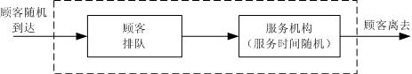

<!-- page: 120 -->

    （ii）顾客到达的方式可能是一个—个的，也可能是成批的。
    （iii）顾客到达可以是相互独立的，即以前的到达情况对以后的到达没有影响；
否则是相关的。
    （iv）输入过程可以是平稳的，即相继到达的间隔时间分布及其数学期望、方差等
数字特征都与时间无关，否则是非平稳的。

1.2.2  排队规则
    排队规则指到达排队系统的顾客按怎样的规则排队等待，可分为损失制，等待制和
混合制三种。
    （i）损失制（消失制）。当顾客到达时，所有的服务台均被占用，顾客随即离去。
    （ii）等待制。当顾客到达时，所有的服务台均被占用，顾客就排队等待，直到接
受完服务才离去。例如出故障的机器排队等待维修就是这种情况。
    （iii）混合制。介于损失制和等待制之间的是混合制，即既有等待又有损失。有
队列长度有限和排队等待时间有限两种情况，在限度以内就排队等待，超过一定限度就
离去。
    排队方式还分为单列、多列和循环队列。
    1.2.3  服务过程

（i）服务机构。主要有以下几种类型：单服务台；多服务台并联（每个服务台同
时为不同顾客服务）；多服务台串联（多服务台依次为同一顾客服务）；混合型。

（ii）服务规则。按为顾客服务的次序采用以下几种规则：
①先到先服务，这是通常的情形。
    ②后到先服务，如情报系统中，最后到的情报信息往往最有价值，因而常被优先处
理。
    ③随机服务，服务台从等待的顾客中随机地取其一进行服务，而不管到达的先后。

④优先服务，如医疗系统对病情严重的病人给予优先治疗。
1.3  排队模型的符号表示
排队模型用六个符号表示，在符号之间用斜线隔开，即
C
B
A
Z
Y
X
/
/
/
/
/
。第一
个符号X 表示顾客到达流或顾客到达间隔时间的分布；第二个符号Y 表示服务时间的
分布；第三个符号Z 表示服务台数目；第四个符号A 是系统容量限制；第五个符号B 是
顾客源数目；第六个符号C 是服务规则，如先到先服务FCFS，后到先服务LCFS 等。并
约定，如略去后三项，即指
FCFS
/
/
/
/
/
∞
∞
Z
Y
X
的情形。我们只讨论先到先服务FCFS
的情形，所以略去第六项。

表示顾客到达间隔时间和服务时间的分布的约定符号为：

M —指数分布（M 是Markov 的字头，因为指数分布具有无记忆性，即Markov
性）；

D —确定型（Deterministic）；

k
E —k 阶爱尔朗(Erlang)分布；
G —一般（general）服务时间的分布；
GI —一般相互独立（General Independent）的时间间隔的分布。
例如，
1
/
/ M
M
表示相继到达间隔时间为指数分布、服务时间为指数分布、单服
务台、等待制系统。
c
M
D
/
/
表示确定的到达时间、服务时间为指数分布、c 个平行
服务台（但顾客是一队）的模型。
    1.4  排队系统的运行指标
    为了研究排队系统运行的效率，估计其服务质量，确定系统的最优参数，评价系统
的结构是否合理并研究其改进的措施，必须确定用以判断系统运行优劣的基本数量指

-119-

<!-- page: 121 -->

标，这些数量指标通常是：
    (i)平均队长：指系统内顾客数（包括正被服务的顾客与排队等待服务的顾客）的
数学期望，记作
sL 。

    (ii)平均排队长:指系统内等待服务的顾客数的数学期望，记作
q
L 。

    (iii)平均逗留时间：顾客在系统内逗留时间（包括排队等待的时间和接受服务的
时间）的数学期望，记作
s
W 。

    （iv）平均等待时间：指一个顾客在排队系统中排队等待时间的数学期望，记作

q
W 。

（v）平均忙期：指服务机构连续繁忙时间（顾客到达空闲服务机构起，到服务机
构再次空闲止的时间）长度的数学期望，记为
bT 。

还有由于顾客被拒绝而使企业受到损失的损失率以及以后经常遇到的服务强度等，
这些都是很重要的指标。

计算这些指标的基础是表达系统状态的概率。所谓系统的状态即指系统中顾客数，
如果系统中有n 个顾客就说系统的状态是n ，它的可能值是

（i）队长没有限制时，
L
,2,1,0
=
n
，
（ii）队长有限制，最大数为N 时，
N
n
,
,1,0
L
=
，
（iii）损失制，服务台个数是c 时，
c
n
,
,1,0
L
=
。
这些状态的概率一般是随时刻t 而变化，所以在时刻t 、系统状态为n 的概率用

)
(t
Pn
表示。稳态时系统状态为n 的概率用
nP 表示。
§2  输入过程与服务时间的分布

排队系统中的事件流包括顾客到达流和服务时间流。由于顾客到达的间隔时间和服
务时间不可能是负值，因此，它的分布是非负随机变量的分布。最常用的分布有泊松分
布、确定型分布，指数分布和爱尔朗分布。

2.1  泊松流与指数分布
设
)
(t
N
表示在时间区间
)
,0
[
t 内到达的顾客数（
0
>
t
），令
)
,
(
2
1 t
t
Pn
表示在时间区

间
)
)(
,
[
1
2
2
1
t
t
t
t
>
内有
)
0
(≥
n
个顾客到达的概率，即

)
0
,
(
}
)
(
)
(
{
)
,
(
1
2
1
2
2
1
≥
>
=
−
=
n
t
t
n
t
N
t
N
P
t
t
Pn

当
)
,
(
2
1 t
t
Pn
合于下列三个条件时，我们说顾客的到达形成泊松流。这三个条件是：

1
o  在不相重叠的时间区间内顾客到达数是相互独立的，我们称这性质为无后效
性。

2
o  对充分小的t
Δ ，在时间区间
)
,
[
t
t
t
Δ
+
内有一个顾客到达的概率与t 无关，而

约与区间长t
Δ 成正比，即

)
(
)
,
(
1
t
o
t
t
t
t
P
Δ
+
Δ
=
Δ
+
λ
                                     （1）

其中
)
( t
o Δ
，当
0
→
Δt
时，是关于t
Δ 的高阶无穷小。
0
>
λ
是常数，它表示单位时间
有一个顾客到达的概率，称为概率强度。

3
o  对于充分小的t
Δ ，在时间区间
)
,
[
t
t
t
Δ
+
内有两个或两个以上顾客到达的概率
极小，以致可以忽略，即

∞

∑

Δ
=
Δ
+

2
)
(
)
,
(

n
t
o
t
t
t
P
                                     （2）

=

n

-120-

<!-- page: 122 -->

在上述条件下，我们研究顾客到达数n 的概率分布。
由条件2

o，我们总可以取时间由0 算起，并简记
)
(
)
,0
(
t
P
t
P
n
n
=
。

o，有
)
(
)
(
)
(
0
0
0
t
P
t
P
t
t
P
Δ
=
Δ
+

o和2

由条件1

n

∑

−
=
Δ
=
Δ
+

k
k
n
n
n
t
P
t
P
t
t
P

0
,2,1
),
(
)
(
)
(
L

=

k

o得
)
(
1
)
(
0
t
o
t
t
P
Δ
+
Δ
−
=
Δ
λ

o和3

由条件2

因而有

−
Δ
+
)
(
)
(
)
(
)
(

Δ
+
−
=
Δ

t
P
t
t
P

t
o
t
P
t

0
0
0
λ
，

t

Δ

−
Δ
+

Δ
+
+
−
=
Δ

t
P
t
t
P

)
(
)
(
)
(
)
(
)
(

t
o
t
P
t
P
t

1
λ
λ
.

n
n
n
n

−

Δ

t

在以上两式中，取t
Δ 趋于零的极限，当假设所涉及的函数可导时，得到以下微分方程
组：

t
dP
λ
−
=
，

)
(
)
(

0
0
t
P
dt

t
dP

L
,2,1
),
(
)
(
)
(

1
=
+
−
=
−
n
t
P
t
P
dt

n
n
n
λ
λ
.

取初值
1
)
0
(
0
=
P
，
)
,2,1
(
0
)
0
(
L
=
=
n
Pn
，容易解出
t
e
t
P
λ
−
=
)
(
0
；再令

t
n
n
e
t
U
t
P
λ
−
=
)
(
)
(
，可以得到
)
(
0 t
U
及其它
)
(t
Un
所满足的微分方程组，即

t
dU

,
,2,1
),
(
)
(

1
L
=
=
−
n
t
U
dt

n
n
λ

1
)
(
0
=
t
U
，
0
)
(
=
t
U n
.

由此容易解得

λ
λ
.

t
t
P
t
n

)
(
)
(
=
=
−
n
e
n

L
,2,1
,
!

n

正如在概率论中所学过的，我们说随机变量
)}
(
)
(
)
(
{
s
N
t
s
N
t
N
−
+
=
服从泊松分
布。它的数学期望和方差分别是

t
t
N
E
λ
=
)]
(
[
；
t
t
N
λ
=
)]
(
Var[
。
当输入过程是泊松流时，那么顾客相继到达的时间间隔T 必服从指数分布。这是
由于

)
,0
{[
}
{
t
P
t
T
P
=
>
内呼叫次数为零
t
e
t
P
λ
−
=
=
)
(
}
0

那么，以
)
(t
F
表示T 的分布函数，则有

⎩
⎨
⎧

−

t
λ

≥
−
=
=
≤

t
e
t
F
t
T
P

0
,
1
)
(
}
{

<

0
,0

t

而分布密度函数为

0
,
)
(
>
=
−
t
e
t
f
t
λ
λ
.

-121-

<!-- page: 123 -->

1 就表示相继顾客到达平均

对于泊松流, λ 表示单位时间平均到达的顾客数,所以λ

间隔时间，而这正和ET 的意义相符。

对一顾客的服务时间也就是在忙期相继离开系统的两顾客的间隔时间，有时也服从
指数分布。这时设它的分布函数和密度函数分别是

t
e
t
G
μ
−
−
= 1
)
(
，
t
e
t
g
μ
μ
−
=
)
(
我们得到

>
Δ
+
≤

Δ
+
≤
<
=
Δ

}
{
lim
}
|
{
lim

t
T
t
t
T
P

t
t
T
t
P
t

μ
=
>
Δ

t
t

0
0
t
T
tP

→
Δ
→
Δ
}
{

这表明，在任何小的时间间隔
)
,
[
t
t
t
Δ
+
内一个顾客被服务完了（离去）的概率是

1 表示

)
( t
o
t
Δ
+
Δ
μ
。μ 表示单位时间能被服务完成的顾客数，称为平均服务率，而μ

一个顾客的平均服务时间。

2.2  常用的几种概率分布及其产生
2.2.1  常用的连续型概率分布
我们只给出这些分布的参数、记号和通常的应用范围，更详细的内容参看专门的概
率论书籍。

（i）均匀分布
区间
)
,
(
b
a
内的均匀分布记作
)
,
(
b
a
U
。服从
)1,0
(
U
分布的随机变量又称为随机

数，它是产生其它随机变量的基础。如若X 为
)1,0
(
U
分布，则
X
a
b
a
Y
)
( −
+
=
服从
)
,
(
b
a
U
。
（ii）正态分布

以μ 为期望，
2
σ
为方差的正态分布记作
)
,
(
2
σ
μ
N
。正态分布的应用十分广泛。
正态分布还可以作为二项分布一定条件下的近似。

（iii）指数分布
指数分布是单参数λ 的非对称分布，记作
)
(
Exp λ ，概率密度函数为：

⎩
⎨
⎧

t
λ
λ

−

≥
=

t
e
t
f

0
,
)
(

<

0
,0

t

1 ，方差为
2
1
λ

它的数学期望为λ

。指数分布是唯一具有无记忆性的连续型随机变量，即

有
)
(
)
|
(
s
X
P
t
X
s
t
X
P
>
=
>
+
>
，在排队论、可靠性分析中有广泛应用。
（iv）Gamma 分布
Gamma 分布是双参数
β
α,
的非对称分布，记作
)
,
(
β
α
G
，期望是αβ 。
1
=
α
时蜕

化为指数分布。n 个相互独立、同分布（参数λ ）的指数分布之和是Gamma 分布
（
)
,
λ
β
α
=
= n
。Gamma 分布可用于服务时间，零件寿命等。
Gamma 分布又称爱尔朗分布。
（v）Weibull 分布
    Weibull 分布是双参数
β
α,
的非对称分布，记作
)
,
(
β
α
W
。
1
=
α
时蜕化为指数分
布。作为设备、零件的寿命分布在可靠性分析中有着非常广泛的应用。

（vi）Beta 分布

-122-

<!-- page: 124 -->

Beta 分布是区间
)1,0
(
内的双参数、非均匀分布，记作
)
,
(
β
α
B
。
2.2.2  常用的离散型概率分布
（i）离散均匀分布
（ii）Bernoulli 分布（两点分布）
Bernoulli 分布是
0,1
=
x
处取值的概率分别是p 和
p
−
1
的两点分布，记作
)
(
Bern p 。用于基本的离散模型。

（iii）泊松（Poisson）分布
泊松分布与指数分布有密切的关系。当顾客平均到达率为常数λ 的到达间隔服从
指数分布时，单位时间内到达的顾客数K 服从泊松分布，即单位时间内到达k 位顾客
的概率为

λ
λ

−

k

e
P

L
,2,1,0
,
!
=
=

k
k

k

记作
)
(
Poisson λ 。泊松分布在排队服务、产品检验、生物与医学统计、天文、物理等
领域都有广泛应用。

（iv）二项分布
在独立进行的每次试验中，某事件发生的概率为p ，则n 次试验中该事件发生的

次数K 服从二项分布，即发生k 次的概率为

n
k
p
p
C
P
k
n
k
k
n
k
,
,1,0
,
)
1(
L
=
−
=
−
.

记作
)
,
(
p
n
B
。二项分布是n 个独立的Bernoulli 分布之和。它在产品检验、保险、生
物和医学统计等领域有着广泛的应用。

当
k
n,
很大时，
)
,
(
p
n
B
近似于正态分布
))
1(
,
(
p
np
np
N
−
；当n 很大、p 很小，

且np 约为常数λ 时，
)
,
(
p
n
B
近似于
)
(
Poisson λ 。
§3  生灭过程

一类非常重要且广泛存在的排队系统是生灭过程排队系统。生灭过程是一类特殊的
随机过程，在生物学、物理学、运筹学中有广泛的应用。在排队论中，如果
)
(t
N
表示

时刻t 系统中的顾客数，则
}
0
),
(
{
≥
t
t
N
就构成了一个随机过程。如果用“生”表示顾

客的到达，“灭”表示顾客的离去，则对许多排队过程来说，
}
0
),
(
{
≥
t
t
N
就是一类特
殊的随机过程－生灭过程。下面结合排队论的术语给出生灭过程的定义。

定义1  设
}
0
),
(
{
≥
t
t
N
为一个随机过程。若
)
(t
N
的概率分布具有以下性质：

（1）假设
n
t
N
=
)
(
，则从时刻t 起到下一个顾客到达时刻止的时间服从参数为
n
λ

的负指数分布，
L
,2,1,0
=
n
。

（2）假设
n
t
N
=
)
(
，则从时刻t 起到下一个顾客离去时刻止的时间服从参数为
n
μ

的负指数分别，
L
,2,1,0
=
n
。
（3）同一时刻只有一个顾客到达或离去。
则称
}
0
),
(
{
≥
t
t
N
为一个生灭过程。

一般来说，得到
)
(t
N
的分布
}
)
(
{
)
(
n
t
N
P
t
pn
=
=
（
L
,2,1,0
=
n
）是比较困难的，

因此通常是求当系统到达平衡后的状态分布，记为
L
,2,1,0
,
=
n
pn
。

为求平稳分布，考虑系统可能处的任一状态n 。假设记录了一段时间内系统进入状
态n 和离开状态n 的次数，则因为“进入”和“离开”是交替发生的，所以这两个数要

-123-

<!-- page: 125 -->

么相等，要么相差为1。但就这两种事件的平均发生率来说，可以认为是相等的。即当
系统运行相当时间而到达平衡状态后，对任一状态n 来说，单位时间内进入该状态的平
均次数和单位时间内离开该状态的平均次数应该相等，这就是系统在统计平衡下的“流
入＝流出”原理。根据这一原理，可得到任一状态下的平衡方程如下：

λ
μ

=

)
(
2
1
0

p
p

0
0
1
1

μ
λ
μ
λ

+
=
+

p
p
p

1
1
1
2
2
0
0

μ
λ
μ
λ

+
=
+

p
p
p

)
(

2
2
2
3
3
1
1

                            （3）

M

M

μ
λ
μ
λ

+
=
+

n
)
(

n
n
n
n
n
n
n
p
p
p

+
+
−
−

1
1
1
1

M

M

由上述平衡方程，可求得

0
1
p
p
μ
λ
=

0：
0
1

λ
=
=
−
+
=

λ
λ
μ
μ
μ

λ
λ
μ

1
2
)
(
1
p
p
p
p
p
p
μ
μ

0
1
1
2

1
0
0
1
1
2
1
2

1：
0
1
2

λ
λ
λ
μ
λ
λ
μ
μ
μ
λ
=
=
−
+
=

2
3
)
(
1
p
p
p
p
p
p
μ
μ
μ

2
1
1
2
2
3
2
3

0
1
2
2
3

2：
0
1
2
3

M                M

λ
λ
μ
μ
μ

λ

λ
λ
λ
μ

1
1
1
1
1
1
)
(
1
p
p
p
p
p
p

L
L

+
−
−
+
+
+
=
=
−
+
=

−

n
n
μ
μ
μ

n
n
n
n
n
n
n
n

n
n
n
n

0
1

n ：
0
1
1

+

n
n

M                M
记

λ
λ
λ

L

n
n
n
C
，
L
,2,1
=
n
                                    （4）

−
−
=

0
2
1
μ
μ
μ

L

−

n
n

1
1

则平稳状态的分布为

0
p
C
p
n
n =
，
L
,2,1
=
n
                                            （5）

由概率分布的要求

∞

0
=
∑

n
p

1

=
n

有

⎤
⎢⎣

⎡+∑

∞

1
1
0
1
=
⎥⎦

p
C

n

=

n

于是

1

=
+
=

n
C
p
                                              （6）

0
1

∞

∑

n

1

注意：（6）只有当级数∑

=1
n
n
C 收敛时才有意义，即当
∞
<
∑

∞

∞

=1
n
n
C
时，才能由上

-124-

<!-- page: 126 -->

述公式得到平稳状态的概率分布。
§4
s
M
M
/
/
等待制排队模型
    4.1  单服务台模型

单服务台等待制模型
∞
/
1
/
/ M
M
是指：顾客的相继到达时间服从参数为λ 的负指
数分布，服务台个数为1，服务时间V 服从参数为μ 的负指数分布，系统空间无限，
允许无限排队，这是一类最简单的排队系统。

4.1.1  队长的分布
记
}
{
n
N
P
pn
=
=
（
L
,2,1,0
=
n
）为系统达到平衡状态后队长N 的概率分布，则

由式（4）～（6），并注意到
L
,2,1,0
,
=
=
n
n
λ
λ
和
L
,2,1,0
,
=
=
n
n
μ
μ
。记

μ
λ
ρ =

并设
1
<
ρ
（否则队列将排至无限远），则

n

⎛
=
μ
λ
，
L
,2,1
=
n

⎞
⎜⎜
⎝

n
C
⎟⎟
⎠

故

0p
p
n
n
ρ
=
，
L
,2,1
=
n

其中

−
−
∞

1
1
1

⎞
⎜⎜
⎝

⎛

⎛
=
+
=

⎞
⎜
⎝

1
1
1

∑
∑

ρ
ρ
ρ
ρ

−
=
⎟
⎠

−
=
⎟⎟
⎠

n

n
p
                （7）

0
n

=
∞

0

1

=

n

1

因此

n
n
p
ρ
ρ)
1( −
=
，
L
,2,1
=
n
                                  （8）

公式（7）和（8）给出了在平衡条件下系统中顾客数为n 的概率。由式（7）不难看出，

ρ 是系统中至少有一个顾客的概率，也就是服务台处于忙的状态的概率，因而也称ρ 为

λ
ρ
的条件下才能得

服务强度，它反映了系统繁忙的程度。此外，（8）式只有在
1
<
= μ

到，即要求顾客的平均到达率小于系统的平均服务率，才能使系统达到统计平衡。
    4.1.2  几个主要数量指标

对单服务台等待制排队系统，由已得到的平稳状态下队长的分布，可以得到平均队
长

∞

∞

−
=
=
∑
∑

ρ
ρ

n

n
s
n
np
L

)
1(

=

=

n

1
0

n

+
+
+
−
+
+
+
=

ρ
ρ
ρ
ρ
ρ
ρ

4
3
2
3
2

)
3
2
(
)
3
2
(

L
L

                     （9）

λ
ρ
ρ
ρ
ρ
ρ

−
=
−
=
+
+
+
=

3
2

L

λ
μ

1

平均排队长
q
L 为

-125-

<!-- page: 127 -->

λ
ρ
−
=
−
=
−
−
=
−
= ∑

∞

2

L
p
L
p
n
L

)
(
)
1(
)1
(

n
q
                  （10）

0
1
λ
μ
μ

=

n

关于顾客在系统中的逗留时间T ，可说明它服从参数为
λ
μ −
的复指数分布，即

t
e
t
T
P
)
(
}
{
λ
μ−
−
=
>
，
0
≥
t
因此，平均逗留时间

λ
μ −
=
1

s
W
                                              （11）

因为，顾客在系统中的逗留时间为等待时间
q
T 和接受服务时间V 之和，即

V
T
T
q +
=

故由

1
)
(
)
(
)
(
+
=
+
=
=
q
q
s
W
V
E
T
E
T
E
W
                       （12）

μ

可得平均等待时间
q
W 为

λ
μ
−
=
−
=
s
q
W
W
                                   （13）

)
(
1
λ
μ
μ

从式（9）和式（11），可发现平均队长
sL 与平均逗留时间
s
W 具有关系

s
s
W
L
λ
=
                                                 （14）

同样，从式（10）和式（13），可发现平均排队长
q
L 与平均等待时间
q
W 具有关系

q
q
W
L
λ
=
                                                 （15）

式（14）和式（15）通常称为Little 公式，是排队论中一个非常重要的公式。
4.1.3  忙期和闲期
在平衡状态下，忙期B 和闲期I 一般均为随机变量，求它们的分布是比较麻烦的。

因此，我们来求一下平均忙期B 和平均闲期I 。由于忙期和闲期出现的概率分别为ρ 和

ρ
−
1
，所以在一段时间内可以认为忙期和闲期的总长度之比为
)
1(:
ρ
ρ
−
。又因为忙
期和闲期是交替出现的，所以在充分长的时间里，它们出现的平均次数应是相同的。于

是，忙期的平均长度B 和闲期的平均长度I 之比也应是
)
1(:
ρ
ρ
−
，即

ρ
ρ
−
= 1
I
B
                                                （16）

又因为在到达为Poisson 流时，根据负指数分布的无记忆性和到达与服务相互独立的假
设，容易证明从系统空闲时刻起到下一个顾客到达时刻止（即闲期）的时间间隔仍服从

1 ，这样，

参数为λ 的负指数分布，且与到达时间间隔相互独立。因此，平均闲期应为λ

便求得平均忙期为

λ
μ
λ
ρ
ρ

−
=
⋅
−
=
1
1
1
B
                                     （17）

与式（11）比较，发现平均逗留时间（
s
W ）＝平均忙期（B ）。这一结果直观看上去

是显然的，顾客在系统中逗留的时间越长，服务员连续繁忙的时间也就越长。因此，一

-126-

<!-- page: 128 -->

个顾客在系统内的平均逗留时间应等于服务员平均连续忙的时间。
    4.2  与排队论模型有关的LINGO 函数

（1）@peb(load,S)
该函数的返回值是当到达负荷为load，服务系统中有S 个服务台且允许排队时系
统繁忙的概率，也就是顾客等待的概率。

（2）@pel（load,S）
该函数的返回值是当到达负荷为load，服务系统中有S 个服务台且不允许排队时
系统损失概率，也就是顾客得不到服务离开的概率。

（3）@pfs(load,S,K)
该函数的返回值是当到达负荷为load，顾客数为K，平行服务台数量为S 时，有限
源的Poisson 服务系统等待或返修顾客数的期望值。

例1  某修理店只有一个修理工，来修理的顾客到达过程为Poisson 流，平均4 人
/h；修理时间服从负指数分布，平均需要6min。试求：（1）修理店空闲的概率；（2）
店内恰有3 个顾客的概率；（3）店内至少有1 个顾客的概率；（4）在店内的平均顾客数；
（5）每位顾客在店内的平均逗留时间；（6）等待服务的平均顾客数；（7）每位顾客平
均等待服务时间；（8）顾客在店内等待时间超过10min 的概率。

解  本例可看成一个
∞
/
1
/
/ M
M
排队问题，其中

4
=
λ
，
10
1.0
1 =
=
μ
，
4.0
=
= μ

λ
ρ

（1）修理店空闲的概率
6.0
4.0
1
1
0
=
−
=
−
=
ρ
p

（2）店内恰有3 个顾客的概率

38
.0
)
4.0
1(
4.0
)
1(
3
3
3
=
−
×
=
−
=
ρ
ρ
p

（3）店内至少有1 个顾客的概率
4.0
1
}
1
{
0
=
=
−
=
≥
ρ
p
N
P

（4）在店内的平均顾客数

67
.0
1
=
−
=
ρ
ρ

sL
（人）

（5）每位顾客在店内的平均逗留时间

(min)
10
)
h
(
4
67
.0
=
=
= λ

L
W

s
s

（6）等待服务的平均顾客数

2
2
=
−
=
−
=
−
=
ρ
ρ
ρ
s
q
L
L
（人）

267
.0
4.0
1
4.0
1

（7）每位顾客平均等待服务时间

L
W

(min)
4
)
h
(
4
267
.0
=
=
= λ

q
q

（8）顾客在店内逗留时间超过10min 的概率

3679
.0
}
10
{
1
)
15
1
6
1
(
10
=
=
=
>
−
−
−
e
e
T
P
编写LINGO 程序如下：
model:

-127-

<!-- page: 129 -->

s=1;lamda=4;mu=10;rho=lamda/mu;
Pwait=@peb(rho,s);
p0=1-Pwait;
Pt_gt_10=@exp(-1);
end

4.3  多服务台模型（
∞
/
/
/
s
M
M
）
设顾客单个到达，相继到达时间间隔服从参数为λ 的负指数分布，系统中共有s 个
服务台，每个服务台的服务时间相互独立，且服从参数为μ 的负指数分布。当顾客到
达时，若有空闲的服务台则马上接受服务，否则便排成一个队列等待，等待时间为无限。

下面来讨论这个排队系统的平稳分布。记
}
{
n
N
P
pn
=
=
（
L
,2,1,0
=
n
）为系统

达到平稳状态后队长N 的概率分布，注意到对个数为s 的多服务台系统，有

λ
λ =
n
，
L
,2,1,0
=
n

和

μ
μ

=
=
L
L

⎩
⎨
⎧

s
n
n

,
,2,1
,

n
μ

+
=

s
s
n
s

,1
,
,

记
μ
λ
ρ
ρ
s
s
s
=
=
，则当
1
<
s
ρ
时，由式（4），式（5）和式（6），有

⎧

μ
λ
L

n

)
/
(

=

s
n
n
C

,
,2,1
,
!

⎪⎪
⎨

=

                          （18）

n
n
s

n

⎞
⎜⎜
⎝

⎛

μ
λ
μ
λ
μ
λ

)
/
(

)
/
(
!

⎪
⎪
⎩

≥
=
⎟⎟
⎠

−
s
n
s
s
s
s

,
!

s
n

故

⎧

ρ
L

n

=
=

s
n
p
n
p

,
,2,1
,
!

⎪⎪
⎨

0

                                    （19）

n

ρ

n

⎪
⎪
⎩

≥

−
s
n
p
s
s

,
!

0

s
n

其中

−
−

1
1

⎤
⎢⎣

⎡

s
n
p
ρ
ρ
ρ
                                     （20）

s
n

s

−
+
= ∑

=
⎥⎦

0
0
)
1(!
!

n
s

公式（19）和式（20）给出了在平衡条件下系统中顾客数为n 的概率，当
s
n ≥
时，即
系统中顾客数大于或等于服务台个数，这时再来的顾客必须等待，因此记

n
ρ
ρ
ρ
−
=
= ∑

∞

s

0
)
1(!
)
,
(
p
s
p
s
c

                                   （21）

=

s
n

s

式（21）称为Erlang 等待公式，它给出了顾客到达系统时需要等待的概率。

对多服务台等待制排队系统，由已得到的平稳分布可得平均排队长
q
L 为：

n
q
s
n
s
p
p
s
n
L
ρ
ρ
)
(
!
)
(
0

−
∞

s

∞

∑
∑

−
=
−
=

s
n
s

1

+
=

=

s
n

s
n

-128-

<!-- page: 130 -->

⎛
=
∑

ρ
ρ
ρ
ρ
ρ

⎞
⎜
⎝

s

∞

s
s

d
s
p

p
d

−
=
⎟
⎠

n
s
s

0
)
1(!
!
s

2
0

                                （22）

ρ

s

=

n

1

或

ρ
ρ
−
=
1
)
,
(
                                            （23）

s
c
L
ρ

s
q

s

记系统中正在接受服务的顾客的平均数为s ，显然s 也是正在忙的服务台的平均数，故

n
ρ
ρ
ρ

−

∞

−

s
s

n

s

1

1

0
)
1(!
!
p
s
s
p
n
n
p
s
np
s

−
+
=
+
=
∑
∑
∑

n

0
0

0

=

=

=

n

s
n

n

s

⎤
⎢⎣

⎡

−
∑
)
1(
)!
1
(
)!
1
(

−
−

ρ
ρ
ρ
ρ
ρ
=
⎥⎦

s
s

1
1

n

1

−
−
+
−
=

s
n
p
                           （24）

0
s

=

n

1

式（24）说明，平均在忙的服务台个数不依赖于服务台个数s ，这是一个有趣的结果。
由式（24），可得到平均队长
sL 为
=
sL
平均排队长+ 正在接受服务的顾客的平均数
ρ
+
=
q
L
              （25）

对多服务台系统，Little 公式依然成立，即有

1
−
=
=
s
q
q
W
L
W
                                     （26）

L
W =
，
μ
λ

s
s

λ

例2  某售票处有3 个窗口，顾客的到达为Poisson 流，平均到达率为

min
/
9.0 人
=
λ
；服务（售票）时间服从负指数分布，平均服务率
min
/
4.0 人
=
μ
。
现设顾客到达后排成一个队列，依次向空闲的窗口购票，这一排队系统可看成是一个

∞
/
/
/
s
M
M
系统，其中

λ
ρ
，
1
3
25
.2
<
=
= μ

λ
ρ
s
s

3
=
s
，
25
.2
=
= μ

由多服务台等待制系统的有关公式，可得到
    （1）整个售票处空闲的概率

−
p

1
3
2
1
0

⎤
⎢⎣

⎡

)
25
.2
(

)
25
.2
(
!0

)
25
.2
(
!1

0748
.0
)
3
/
25
.2
1(!3
)
25
.2
(
!2

0
=
⎥⎦

−
+
+
+
=

（2）平均排队长

×
×
=
q
L
（人）

3
=
−

70
.1
)
3
/
25
.2
1(!3
3
/
25
.2
)
25
.2
(
0748
.0

2

平均队长

95
.3
25
.2
70
.1
=
+
=
+
=
ρ
q
L
L
（人）

（3）平均等待时间

L
W
（min）

89
.1
9.0
70
.1
=
=
= λ

q
q

平均逗留时间

L
W
（min）

39
.4
9.0
95
.3
=
=
= λ

s
s

-129-

<!-- page: 131 -->

（4）顾客到达时必须排队等待的概率

3
=
×
−
=
c

57
.0
0748
.0
)
3
/
25
.2
1(!3
)
25
.2
(
)
25
.2,3
(

在本例中，如果顾客的排队方式变为到达售票处后可到任一窗口前排队，且入队后
不再换队，即可形成3 个队列。这时，原来的
∞
/
3
/
/ M
M
系统实际上变成了由3 个
∞
/
1
/
/ M
M
子系统组成的排队系统，且每个系统的平均到达率为

3.0
3
9.0
3
2
1
=
=
=
=
λ
λ
λ
（人/min）

下表给出了
∞
/
3
/
/ M
M
和3 个
∞
/
1
/
/ M
M
的比较，不难看出一个
∞
/
3
/
/ M
M
系
统比由3 个
∞
/
1
/
/ M
M
系统组成的排队系统具有显著的优越性。即在服务台个数和服
务率都不变的条件下，单队排队方式比多队排队方式要优越，这是在对排队系统进行设
计和管理的时候应注意的地方。

表1  排队系统的指标值
项       目
∞
/
3
/
/ M
M
3 个
∞
/
1
/
/ M
M
空闲的概率
顾客必须等待的概率
平均队长
平均排队长
平均逗留时间
平均等待时间

0.25（每个子系统）
0．75
9（整个系统）
2.25（每个子系统）
10（min）
7.5（min）

0.0748
0.57
       3.95
       1.70
       4.39（min）
       1.89

求解的LINGO 程序如下：
model:
s=3;lamda=0.9;mu=0.4;rho=lamda/mu;rho_s=rho/s;
P_wait=@peb(rho,s);
p0=6*(1-rho_s)/rho^3*P_wait;
L_q=P_wait*rho_s/(1-rho_s);
L_s=L_q+rho;
W_q=L_q/lamda;
W_s=L_s/lamda;
end
§5
s
s
M
M
/
/
/
损失制排队模型
当s 个服务台被占用后，顾客自动离去。
这里我们着重介绍如何使用LINGO 软件中的相关函数。
5.1  损失制排队模型的基本参数
对于损失制排队模型，其模型的基本参数与等待制排队模型有些不同，我们关心如
下指标。

（1）系统损失的概率

lost
P
=@pel(rho,s)

λ ，s 是服务台或服务员的个数。

其中rho 是系统到达负荷μ

（2）单位时间内平均进入系统的顾客数（
e
λ ）
)
1(
lost
P
e
−
= λ
λ

-130-

<!-- page: 132 -->

（3）系统的相对通过能力（Q ）与绝对通过能力（A ）

lost
1
P
Q
−
=

2
lost)
1(
P
Q
A
e
−
=
=
λ
λ

（4）系统在单位时间内占用服务台（或服务员）的均值（即
sL ）

μ
λ /
e
sL =

注意：在损失制排队系统中，
0
=
q
L
，即等待队长为0。

（5）系统服务台（或服务员）的效率
s
Ls /
=
η

（6）顾客在系统内平均逗留时间（即
s
W ）

μ
/
1
=
s
W

注意：在损失制排队系统中，
0
=
q
W
，即等待时间为0。

在上述公式中，引入
e
λ 是十分重要的，因为尽管顾客以平均λ 的速率到达服务系

统，但当系统被占满后，有一部分顾客会自动离去，因此，真正进入系统的顾客输入率
是
e
λ ，它小于λ 。

5.2  损失制排队模型计算实例
5.2.1
1
=
s
的情况（
1
/
1
/
/ M
M
）
例3  设某条电话线，平均每分钟有0.6 次呼唤，若每次通话时间平均为1.25min，
求系统相应的参数指标。

1
=
μ
。编写LINGO 程序如下：

解  其参数为S＝1，
6.0
=
λ
，
25
.1

model:
s=1;lamda=0.6;mu=1/1.25;rho=lamda/mu;
Plost=@pel(rho,s);
Q=1-Plost;
lamda_e=Q*lamda;A=Q*lamda_e;
L_s=lamda_e/mu;
eta=L_s/s;
end

求得系统的顾客损失率为43％，即43％的电话没有接通，有57％的电话得到了服务，
通话率为平均每分钟有0.195次，系统的服务效率为43％。对于一个服务台的损失制系统，
系统的服务效率等于系统的顾客损失率，这一点在理论上也是正确的。

5.2.2
1
>
s
的情况（
s
s
M
M
/
/
/
）
例4  某单位电话交换台有一台200门内线的总机，已知在上班8h的时间内，有20％的
内线分机平均每40min要一次外线电话，80％的分机平均隔120min要一次外线。又知外线
打入内线的电话平均每分钟1次。假设与外线通话的时间平均为3min，并且上述时间均服
从负指数分布，如果要求电话的通话率为95％，问该交换台应设置多少条外线？

解  （1）电话交换台的服务分成两类，第一类内线打外线，其强度为

140
200
8.0
120
60
2.0
40
60
1
=
×
⎟
⎠
⎞
⎜
⎝
⎛
×
+
×
=
λ

第二类是外线打内线，其强度为

60
60
1
2
=
×
=
λ

-131-

<!-- page: 133 -->

因此，总强度为

200
60
140
2
1
=
+
=
+
=
λ
λ
λ

（2）这是损失制服务系统，按题目要求，系统损失的概率不能超过5％，即
05
.0
lost ≤
P

（3）外线是整数，在满足条件下，条数越小越好。
由上述三条，写出相应的LINGO程序如下：
model:
lamda=200;
mu=60/3;rho=lamda/mu;
Plost=@pel(rho,s);Plost<0.05;
Q=1-Plost;
lamda_e=Q*lamda;A=Q*lamda_e;
L_s=lamda_e/mu;
eta=L_s/s;
min=s;@gin(s);
end

求得需要15条外线。在此条件下，交换台的顾客损失率为3.65％，有96.35％的电
话得到了服务，通话率为平均每小时185.67次，交换台每条外线的服务效率为64.23％。

求解时，尽量选用简单的模型让LINGO软件求解，而上述程序是解非线性整数规划（尽
管是一维的），但计算时间可能会较长，因此，我们选用下面的处理方法，分两步处理。

第一步，求出概率为5％的服务台的个数，尽管要求服务台的个数是整数，但@pel给
出的是实数解。

编写LINGO程序：
model:
lamda=200;
mu=60/3;rho=lamda/mu;
@pel(rho,s)=0.05;
end

求得
33555
.
14
=
s
。
第二步，注意到@pel(rho,s)是s的单调递减函数，因此，对s取整数（采用只入不舍
原则）就是满足条件的最小服务台数，然后再计算出其它的参数指标。

编写LINGO程序如下：
model:
lamda=200;
mu=60/3;rho=lamda/mu;
s=15;Plost=@pel(rho,s);
Q=1-Plost;
lamda_e=Q*lamda;A=Q*lamda_e;
L_s=lamda_e/mu;
eta=L_s/s;
end

比较上面两种方法的计算结果，其答案是相同的，但第二种方法比第一种方法在计算
时间上要少许多。
§6
s
M
M
/
/
混合制排队模型
    6.1  单服务台混合制模型

单服务台混合制模型
K
M
M
/
1
/
/
是指：顾客的相继到达时间服从参数为λ 的负指数
分布，服务台个数为1，服务时间V 服从参数为μ 的负指数分布，系统的空间为K ，当K

个位置已被顾客占用时，新到的顾客自动离去，当系统中有空位置时，新到的顾客进入系

-132-

<!-- page: 134 -->

统排队等待。

首先，仍来求平稳状态下队长N 的分布
}
{
n
N
P
pn
=
=
，
L
,2,1,0
=
n
。由于所考虑

的排队系统中最多只能容纳K 个顾客（等待位置只有
1
−
K
个），因而有

1
,
,2,1,0
,
L
λ
λ

−
=
=
K
n

⎩
⎨
⎧

K
n

n
,0

≥

μ
μ =
n
，
K
n
,
,2,1
L
=

由式（4），式（5）和式（6），有

⎧

n
n

⎛
=

⎞
⎜⎜
⎝

,
,2,1
,
L
ρ
μ
λ

=
=
⎟⎟
⎠

⎪⎨

K
n
C

                                             （27）

n

⎪⎩

>

,0

K
n

故

0
p
p
n
n
ρ
=
，
K
n
,
,2,1
L
=

其中

−

ρ

⎧

1
,
1
1

≠
−

ρ
ρ

⎪⎪
⎨

+

1
1

K

=
+
=

p

                                （28）

0
ρ

K

=∑
1
,
1
1

⎪
⎪
⎩

ρ

n

1

=
+

K

n

1

由已得到的单服务台混合制排队系统平稳状态下队长的分布，可知当
1
≠
ρ
时，平

均队长
sL 为：

n
K

K

∑
∑

−

=
=

1
0
0
ρ
ρ

n
s
n
p
np
L

=

=

n

n

1

+

+
−
−
=
−
−
−
−
=
K

ρ
ρ
ρ
ρ
ρ
ρ
ρ

ρ
            （29）

K
K
K
K
K
p

1

2
0
1
)1
(
1
]
)
1(
1[
)
1(
+

1

−

ρ

当
1
=
ρ
时，

n
K

K

K

K
n
K
p
n
np
L

2
1
1

n
s
=
+
=
=
=
∑
∑
∑

ρ
                          （30）

1
0
1
0

=
=
=

n

n

n

类似地可得到平均排队长
q
L 为

K

n
q
−
−
=
−
= ∑

)
1(
)1
(
0
1
p
L
p
n
L
s

                                   （31）

=

n

或

⎧

+
−
−
=

ρ
ρ
ρ
ρ

K

1
,
1
)
1(
1
1

K

≠
−

ρ
ρ

⎪⎪
⎨

+

K

L

q
                                 （32）

−

K
K

1
,
)1
(
2
)1
(

⎪
⎪
⎩

=
+

ρ

K

由于排队系统的容量有限，只有
1
−
K
个排队位置，因此，当系统空间被占满时，
再来的顾客将不能进入系统排队，也就是说不能保证所有到达的顾客都能进入系统等待

-133-

<!-- page: 135 -->

服务。假设顾客的到达率（单位时间内来到系统的顾客的平均数）为λ ，则当系统处
于状态K 时，顾客不能进入系统，即顾客可进入系统的概率是
K
p
−
1
。因此，单位时
间内实际可进入系统的顾客的平均数为：

)
1(
)
1(
0p
pK
e
−
=
−
=
μ
λ
λ
                                          （33）

称
e
λ 为有效到达率，而
K
p 也被称为顾客损失率，它表示了在来到系统的所有顾客中不

能进入系统的顾客的比例。下面根据Little 公式，可得

平均逗留时间

s
s
p
L
L
W
−
=
=
λ
λ

s

)
1(
k

                                       （34）

e

平均等待时间

L
L
W
−
=
=
λ
λ

q
q
p

q

)
1(
K

                                      （35）

e

且仍有

1
+
=
q
s
W
W
                                             （36）

μ

注意：这里的平均逗留时间和平均等待时间都是针对能够进入系统的顾客而言的。

特别，当
1
=
K
时，
1
/
1
/
/ M
M
为单服务台损失系统，在上述有关结果中令
1
=
K
，
可得到：

1
0
p
，
ρ
ρ
+
= 1
1p
                                        （37）

ρ
+
= 1

ρ
ρ
+
=
=
1
1p
Ls
，                                              （38）

ρ
λ
λ
λ
λ
+
=
=
−
=
1
)
1(
0
1
p
p
e
                                    （39）

μ
λ
ρ
λ

L
W
                                              （40）

1
=
=
=

s
s

e

0
=
q
L
，
0
=
q
W
                                                （41）

    例5  某修理站只有一个修理工，且站内最多只能停放4 台待修的机器。设待修机
器按Poisson 流到达修理站，平均每分钟到达1 台；修理时间服从负指数分布，平均每
1.25 分钟可修理1 台，试求该系统的有关指标。
解  该系统可看成是一个
4
/
1
/
/ M
M
排队系统，其中

λ
ρ
,
4
=
K

1
=
=
μ
,
25
.1
=
= μ

1
=
λ
,
8.0
25
.1

由式（28），

ρ
p

−
=
ρ

−
=
−

122
.0
25
.1
1
25
.1
1
1
1

5
5
0
=
−

因而，顾客损失率为：

298
.0
122
.0
25
.1
4
0
4
4
=
×
=
=
p
p
ρ

有效到达率为：

-134-

<!-- page: 136 -->

702
.0
)
298
.0
1(
1
)
1(
4
=
−
×
=
−
=
p
e
λ
λ

平均队长

×
+
−
−
=
sL
（台）

5
=
−

44
.2
25
.1
1
25
.1
)1
4
(
25
.1
1
25
.1

5

平均排队长
56
.1
)
122
.0
1(
44
.2
)
1(
0
=
−
−
=
−
−
=
p
L
L
s
q
（台）

平均逗留时间

L
W
λ

44
.2
=
=
=

s
s

48
.3
702
.0

（分钟）

e

平均等待时间

23
.2
8.0
1
48
.3
1
=
−
=
−
=
μ
s
q
W
W
（分钟）

编写LINGO 程序如下：
model:
sets:
state/1..4/:p;
endsets
lamda=1;mu=1/1.25;rho=lamda/mu;k=4;
lamda*p0=mu*p(1);
(lamda+mu)*p(1)=lamda*p0+mu*p(2);
@for(state(i)|i #gt#1 #and# i #lt#
k:(lamda+mu)*p(i)=lamda*p(i-1)+mu*p(i+1));
lamda*p(k-1)=mu*p(k);
p0+@sum(state:p)=1;
P_lost=p(k);lamda_e=lamda*(1-P_lost);
L_s=@sum(state(i)|i #le#k:i*p(i));
L_q=L_s-(1-p0);
W_s=L_s/lamda_e;
W_q=W_s-1/mu;
end
    6.2  多服务台混合制模型

多服务台混合制模型
K
s
M
M
/
/
/
是指顾客的相继到达时间服从参数为λ 的负指
数分布，服务台个数为s ，每个服务台服务时间相互独立，且服从参数为μ 的负指数分

布，系统的空间为K 。

由式（4），式（5）和式（6），并注意到在本模型中

1
,
,2,1,0
,
L
λ
λ

−
=
=
K
n

⎩
⎨
⎧

K
n

n
,0

≥

μ
μ

<
≤
=
K
n
s
s

⎩
⎨
⎧

s
n
n

0
,
μ

n
,

≤
≤

于是

-135-

<!-- page: 137 -->

⎧

ρ

n

<
≤
=

s
n
p
n
p

0
,
!

⎪⎪
⎨

0

                                  （42）

n

ρ

n

⎪
⎪
⎩

≤
≤

−
K
n
s
p
s
s

,
!

0

s
n

其中

⎧

−
−

1
1

⎞
⎜⎜
⎝

⎛

+
−

ρ
ρ
ρ
ρ
ρ

−
−
+

s
K
s
s
n

1

s

1
,
)
1(!
)
1(
!

∑

≠
⎟⎟
⎠

⎪
⎪

s

s
n
p

=

n
s

0

=
−
−

⎨

                     （43）

0

1
1

⎪
⎪

⎞
⎜⎜
⎝

⎛
+
−
+

ρ
ρ
ρ

s
n

s

∑

=
⎟⎟
⎠

s
K
s
n

1
,
)1
(
!
!

s

⎩

=

n

0

由平稳分布
K
n
pn
,
,2,1,0
,
L
=
，可得平均排队长为

K

∑

−
=

n
q
p
s
n
L
)
(

=

s
n

⎧

ρ
ρ

s
s

p

−
+
−

≠
+
−
−
−
−
−
=

ρ
ρ
ρ
ρ
ρ

1
2
0

s
s
K
s
s
s
K
s
s

s
K
s

1
],
)1
)(
1(
1[
)
1(!

⎪⎪
⎨

           （44）

ρ
ρ

=
+
−
−

s

⎪
⎪
⎩

s
K
s
K
p

1
,
!
2
)1
)(
(

0

s

s

为求平均队长，由

K

K

K

∑
∑
∑

−
=
−
=

n
q
p
s
np
p
s
n
L
)
(

n

n

=
=
=

s
n

s
n

s
n

⎛−
−
−
=
∑
∑
∑
∑

⎞
⎜
⎝

−

−

−

K

s

1

s

1

s

1

n
−
−
−
=
⎟
⎠

s
p
s
n
L
p
s
np
np

0
0
)
(
1

n

n

n
s

=
=

=

=

n

n

n

0

n

0

得到

s
n
p
s
L
L
ρ
                            （45）

−
+
+
=

−

n

)
(
s

1

∑

q
s
n

0
0
!

=

n

由系统空间的有限性，必须考虑顾客的有效到达率
e
λ 。对多服务台系统，仍有

)
1(
K
e
p
−
= λ
λ
                                         （46）

再利用Little 公式，得到

q
q
W
L
W
                               （47）

L
W
λ
=
，
μ
λ

1
−
=
=
s
e

s
s

e

平均被占用的服务台数（也是正在接受服务的顾客的平均数）为

⎡
+
=
+
=
∑
∑
∑
∑

⎤
⎢⎣

ρ
ρ

−

−

n
K

n
s

s

1

1

K

n
s
s
s
n
n
p
p
s
np
s
!
!

⎥⎦

n

0
0

−

s
n

=

=
=

=

n

0

s
n

n

s
n

⎡
+
−
=
∑
∑
∑
∑

⎤
⎢⎣

⎡
−
+
=
⎥⎦

⎤
⎢⎣

−
−

−
K

0
ρ
ρ
ρ
ρ
ρ
ρ
ρ

−

n
s

1
1

n

1

n
K

n
s

K

1

s
s
s
s
n
p
s
s
n
p
!
!
!
!
)!
1
(

⎥⎦

0
0
1

−
−

−
−

s
n

s
n

s
K

=

=
=

=

n

1

s
n

n

s
n

-136-

<!-- page: 138 -->

p
p
s
s
−
=
−
=
−
ρ
ρ
ρ
                                   （48）

K

)
1(
)
!
1(
0
K
s
K

因此，又有
)
1(
K
q
q
s
p
L
s
L
L
−
+
=
+
=
ρ
                                     （49）

    例6  某汽车加油站设有两个加油机，汽车按Poisson 流到达，平均每分钟到达2
辆；汽车加油时间服从负指数分布，平均加油时间为2 分钟。又知加油站上最多只能停
放3 辆等待加油的汽车，汽车到达时，若已满员，则必须开到别的加油站去，试对该系
统进行分析。

解  可将该系统看作一个
5
/
2
/
/ M
M
排队系统，其中

λ
ρ
，
2
=
s
，
5
=
K

2
=
λ
，
5.0
=
μ
，
4
=
= μ

（1）系统空闲的概率

−
+
−
p

1
1
2
5
2

0
=
⎭
⎬
⎫

⎩
⎨
⎧

−
−
+
+
=

008
.0
)
2
/
4
1(!2
]
)
2
/
4
(
1[
4
4
1

（2）顾客损失率

5
=
×
×
=
−
p

5

008
.0
4

512
.0
2
!2

2
5

（3）加油站内在等待的平均汽车数

×
×
=
q
L

2
−
+
−
+
−
−
−
−
−

]
)
2
/
4
)(
1
2
5
)(
2
/
4
1(
)
2
/
4
(
1[
)
2
/
4
1(!2
)
2
/
4
(
4
008
.0
2
5
1
2
5
2

18
.2
=
（辆）
加油站内汽车的平均数为
13
.4
)
512
.0
1(
4
18
.2
)
1(
5
=
−
+
=
−
+
=
p
L
L
q
s
ρ
（辆）

（4）汽车在加油站内平均逗留时间为

23
.4
)
512
.0
1(
2
13
.4
)
1(
5
=
−
=
−
=
p
L
W
s
s
λ

（分钟）

汽车在加油站内平均等待时间为

23
.2
2
23
.4
1
=
−
=
−
=
μ
s
q
W
W
（分钟）

（5）被占用的加油机的平均数为
95
.1
18
.2
13
.4
=
−
=
−
=
q
s
L
L
s
（个）

编写LINGO 程序如下：
model:
sets:
state/1..5/:p;
endsets
lamda=2;mu=0.5;rho=lamda/mu;s=2;k=5;
lamda*p0=mu*p(1);
(lamda+mu)*p(1)=lamda*p0+2*mu*p(2);
@for(state(i)|i #gt#1 #and# i #lt# s:
(lamda+i*mu)*p(i)=lamda*p(i-1)+(i+1)*mu*p(i+1));

-137-

<!-- page: 139 -->

@for(state(i)|i #ge# s #and# i #lt# k:
(lamda+s*mu)*p(i)=lamda*p(i-1)+s*mu*p(i+1));
lamda*p(k-1)=s*mu*p(k);
p0+@sum(state:p)=1;
P_lost=p(k);lamda_e=lamda*(1-P_lost);
L_s=@sum(state(i):i*p(i));
L_q=L_s-lamda_e/mu;
W_s=L_s/lamda_e;
W_q=W_s-1/mu;
end

在对上述多服务台混合制排队模型
K
s
M
M
/
/
/
的讨论中，当
K
s =
时，即为多
服务台损失制系统。对损失制系统，有

ρ
=
，
s
n
,
,2,1
L
=
                                     （50）

n

0
! p
n
p

n

其中

−

1

⎛
= ∑

⎞
⎜⎜
⎝

n
p
ρ
                                               （51）

n

s

=
⎟⎟
⎠

0
0
!

n

顾客的损失率为

−

1

⎛
=
=
∑

⎞
⎜⎜
⎝

s
n
s
p
s
B
ρ
ρ
ρ
                                   （52）

n
s

s

=
⎟⎟
⎠

0
!
!
)
,
(

n

式（52）称为Erlang 损失公式，
)
,
(
ρ
s
B
亦表示了到达系统后由于系统空间已被占满
而不能进入系统的顾客的百分比。

对损失制系统，平均被占用的服务台数（正在接受服务的顾客的平均数）为

0
0
0
!
ρ

n
s

s

n
p
n
n
np
s

∑
∑

=
=

=
=

n

n

−

1

⎛
−
=

⎞
⎜⎜
⎝

⎛
⎟⎟
⎠

⎞
⎜⎜
⎝

0
0
ρ
ρ
ρ
ρ
ρ
ρ
s
B
n
s
n

n
s

s
n

s

=
=
∑
∑
                      （53）

−
=
⎟⎟
⎠

))
,
(
1(
!
!
!

n

n

此外，还有
    平均队长
))
,
(
1(
ρ
ρ
s
B
s
Ls
−
=
=
                                    （54）

1
)]
,
(
1[
)]
,
(
1[
=
−
−
=
=
s
B

ρ
ρ
λ

s
B
L
W

s
s
                          （55）

平均逗留时间
μ
ρ
λ

e

其中
)
1(
s
e
p
−
= λ
λ
为有效到达率。在损失制系统中，还经常用
)
1(
sp
A
−
= λ
表示系

统的绝对通过能力，即单位时间内系统实际可完成的服务次数；用
sp
Q
−
=1
表示系统

的相对通过能力，即被服务的顾客数与请求服务的顾客数的比值。系统的服务台利用率
（或通道利用率）为

s
s
=
η
                                                  （56）

§7  其它排队模型简介
    7.1  有限源排队模型

-138-

<!-- page: 140 -->

现在，来分析一下顾客源为有限的排队问题。这类排队问题的主要特征是顾客总数
是有限的，如果有m 个顾客。每个顾客来到系统中接受服务后仍回到原来的总体，还
有可能再来，这类排队问题的典型例子是机器看管问题。如一个工人同时看管m 台机
器，当机器发生故障时即停下来等待维修，修好后再投入使用，且仍然可能再发生故障。
类似的例子还有m 个终端共用一台打印机等，如图2 所示。

            图2  有限源排队系统

关于顾客的平均到达率，在无限源的情形中是按全体顾客来考虑的，而在有限源的
情形下，必须按每一顾客来考虑。设每个顾客的到达率都是相同的，均为λ（这里λ 的
含义是指单位时间内该顾客来到系统请求服务的次数），且每一顾客在系统外的时间均
服从参数为λ 的负指数分布。由于在系统外的顾客的平均数为
sL
m −
，故系统的有效

到达率为

)
(
s
e
L
m −
= λ
λ

下面讨论平稳状态下队长N 的分布
}
{
n
N
P
pn
=
=
，
m
n
,
,2,1,0
L
=
。由于状态

间的转移率为

)
(
n
m
n
−
= λ
λ
，
m
n
,
,2,1,0
L
=

μ
μ

=
=
m
s
n
s

⎩
⎨
⎧

s
n
n

,
,2,1
,

L
L
μ

n
,
,1
,

+
=

由式（4），式（5）和式（6），有（记
μ
λ
ρ =
）

⎧

m

!

=
−
=

ρ

n

,
,2,1
,
!
)!
(

s
n
n
n
m

L

⎪⎪
⎨

C

                              （57）

n

m

!

⎪
⎪
⎩

=
−

ρ

n
s
n

,
,
,
!
)!
(

−
m
s
n
s
s
n
m

L

故

⎧

m

!

=
−
=

ρ

n

,
,2,1
,
!
)!
(

s
n
p
n
n
m

L

⎪⎪
⎨

0

p

                            （58）

n

m

!

⎪
⎪
⎩

=
−

ρ

n
s
n

,
,
,
!
)!
(

−
m
s
n
p
s
s
n
m

L

0

其中

−

1
1

⎤
⎢⎣

⎡

−

s

m

m
p
ρ
ρ
                     （59）

!
!
)!
(

m
n
n
m

!

−
+
−
=
∑
∑

n

n
s
n

=
⎥⎦

0
0
!
)!
(

−

s
s
n
m

=

n

s
n

下面给出系统的有关运行指标

-139-

<!-- page: 141 -->

m

∑

−
=

n
q
p
s
n
L
)
(
                                                 （60）

=

s
n

−

−

s

1

s

1

0
∑
∑

−
+
+
=

n
s
p
s
L
np
L
                                     （61）

)
1(

n
q

=

=

n

n

0

或

)
(
s
q
e
q
s
L
m
L
L
L
−
+
=
+
=
ρ
μ
λ
                                      （62）

L
W
λ
=
                                                （63）

L
W
λ
=
，

q
q

s
s

e

e

特别，对单服务台（
1
=
s
）系统，有

m
p
n
n
ρ
−
=
，
m
n
,
,2,1
L
=
                                  （64）

!
p
n
m

0
)!
(

−

1

⎤
⎢⎣

⎡

m

m
p
ρ
                                            （65）

!

−
= ∑

n
n
m

=
⎥⎦

0
0
)!
(

n

m

∑

−
=

n
q
p
n
L

1
)1
(
                                                  （66）

=

n

)
1(
0
p
L
L
q
s
−
+
=
                                                  （67）

或

)
1(
0p
m
Ls
−
−
=
λ
μ
                                                （68）

1
)
1(
0
−
−
=
=
p
m
L
W

1
−
=
s
q
W
W
                             （69）

s
s
，
μ

λ
μ
λ

e

系统的相对通过能力
1
=
Q
，绝对通过能力

)
1(
)
(
0
p
L
m
Q
A
s
e
−
=
−
=
=
μ
λ
λ
                                    （70）

例7  设有一工人看管5 台机器，每台机器正常运转的时间服从负指数分布，平均
为15 分钟。当发生故障后，每次修理时间服从负指数分布，平均为12 分钟，试求该系
统的有关运行指标。

解  用有限源排队模型处理本问题。已知

λ
ρ
，
5
=
m

15
1
=
λ
，
12
1
=
μ
，
8.0
=
= μ

于是，有
    （1）修理工人空闲的概率

−
p

1
5
4
3
2
1
0
0
=
⎥⎦
⎤
⎢⎣
⎡
+
+
+
+
+
=

!5
)
8.0
(!2
!5
)
8.0
(!3
!5
)
8.0
(!4
!5
)
8.0
(!5
!5

0073
.0
)
8.0
(!0
!5
)
8.0
(
!1

（2）5 台机器都出故障的概率

287
.0
)
8.0
(!0
!5

0
5
5
=
=
p
p

-140-

<!-- page: 142 -->

（3）出故障机器的平均数

76
.3
)
0073
.0
1(
8.0
1
5
=
−
−
=
sL
（台）

（4）等待修理机器的平均数
77
.2
)
0073
.0
1(
76
.3
=
−
−
=
q
L
（台）

（5）每台机器发生一次故障的平均停工时间

46
15
)
0073
.0
1(
12
1
5
=
−
−
=
s
W
（分钟）

（6）每台机器平均待修时间
34
12
46
=
−
=
q
W
（分钟）

（7）系统绝对通过能力（即工人的维修能力）

083
.0
)
0073
.0
1(
12
1
=
−
=
A
（台）

即该工人每小时可修理机器的平均台数为
96
.4
60
083
.0
=
×
台。
上述结果表面，机器停工时间过长，看管工人几乎没有空闲时间，应采取措施提高
服务率或增加工人。

LINGO 计算程序如下
model:
lamda=1/15;mu=1/12;rho=lamda/mu;s=1;m=5;
load=m*rho;
L_s=@pfs(load,s,m);
p_0=1-(m-L_s)*rho;
lamda_e=lamda*(m-L_s);
p_5=@exp(@lgm(6))*0.8^5*p_0;
L_q=L_s-(1-p_0);
w_s=L_s/lamda_e;w_q=L_q/lamda_e;
end
    7.2  服务率或到达率依赖状态的排队模型

在前面的各类排队模型的分析中，均假设顾客的到达率为常数λ ，服务台的服务
率也为常数μ 。而在实际的排队问题中，到达率或服务率可能是随系统的状态而变化
的。例如，当系统中顾客数已经比较多时，后来的顾客可能不愿意再进入系统；服务员
的服务率当顾客较多时也可能会提高。因此，对单服务台系统，实际的到达率和服务率
（它们均依赖于系统所处的状态n ）可假设为

0
+
=
λ
λ
，
L
,2,1,0
=
n

a
n
n
)1
(

1
μ
μ
b
n
n
=
，
L
,2,1
=
n

对多服务台系统，实际到达率和服务率假设为

λ

−
≤

⎧

1
,

s
n

0

⎪⎨

λ

=

a
n
λ

−
≥
⎟
⎠
⎞
⎜
⎝
⎛

s

s
n
n

1
,
1

⎪⎩

0

+

-141-

<!-- page: 143 -->

μ

≤

⎧

s
n
n

,

1

⎪⎨

μ

=

b
n
,

≥
⎟
⎠
⎞
⎜
⎝
⎛

s
n
s
s
n

μ

⎪⎩

1

其中
n
λ 和
n
μ 分别为系统处于状态n 时的到达率和服务率。上述假设表明，到达率
n
λ 同

系统中已有顾客数n 呈反比关系；服务率
n
μ 同系统状态n 呈正比关系。

由式（4），对多服务台系统有

⎧

μ
λ

n

)
/
(

=
=

1
0

s
n
n
C

,
,2,1
,
!

L

⎪⎪
⎨

                         （71）

n
μ
λ

n

)
/
(

⎪
⎪
⎩

+
=

)
)(
1
(
1
0

s
s
n
s
s
n
s

,1
,
,
)!
/!
(!

−
−
−
+
L

s
n
b
a
b
a

下面看一个简单的特例，考虑一个到达依赖状态的单服务台等待制系统

∞
/
1
/
/ M
M
，其参数为

λ
λ
，
L
,2,1,0
=
n

1
+
= n
n

μ
μ =
n
，
L
,2,1
=
n

λ
ρ
，有

于是由式（5），式（6），并设
1
<
= μ

ρ
=
，
L
,2,1
=
n
                                       （72）

n

0
! p
n
p

n

ρ
−
= e
p0
                                                      (73)

平均队长

ρ
ρ
=
=
=
∑
∑

∞

∞

n

n
s
p
n
n
np
L
                                  （74）

=
0
0
0
!
n

=

n

平均排队长

1
)
1(
)1
(
0
1
−
+
=
−
−
=
−
=
−
∞

=∑

ρ
ρ
e
p
L
p
n
L
s
n

n
q
                    （75）

有效到达率（单位时间内实际进入系统的顾客的平均数）

ρ
μ
λ
λ
−
∞

−
=
+
= ∑
e
p
n
n

)
1(
1
0

n
e
                                   （76）

=

平均逗留时间为

ρ
λ
−
−
=
=
e
L
W

s
s
                                          （77）

)
1(
ρ
μ

e

平均等待时间

q
q
W
L
W
                                             （78）

1
−
=
=
s
e

μ
λ

    7.3  非生灭过程排队模型

-142-

<!-- page: 144 -->

一个排队系统的特征是由输入过程，服务机制和排队规则决定的。本章前面所讨论
的排队模型都是输入过程为Poisson 流，服务时间服从负指数分布的生灭过程排队模
型。这类排队系统的一个主要特征是马尔可夫性，而马尔可夫性的一个主要性质是由系
统当前的状态可以推断未来的状态。但是，当输入过程不是Poisson 流或服务时间不服
从负指数分布时，仅知道系统内当前的顾客数，对于推断系统未来的状态是不充足的，
因为正在接受服务的顾客，已经被服务了多长时间，将影响其离开系统的时间。因此，
必须引入新的方法来分析具有非负指数分布的排队系统。

7.3.1
1
/
/ G
M
排队模型
1
/
/ G
M
系统是指顾客的到达为Poisson 流，单个服务台，服务时间为一般分布

1 ，方差为
2
σ ，则可

的排队系统。现假设顾客的平均到达率为λ ，服务时间的均值为μ

λ
ρ
时，系统可以达到平稳状态，而给出平稳分布的表示是比较困难的。

证明：当
1
<
= μ

已有的几个结果为：

ρ
−
=1
0
p
                                                     （79）

+
=
q
L
                                               （80）

ρ
σ
λ

2
2
2

)
1(
2

−

ρ

q
s
L
L
+
= ρ
                                                    （81）

L
W =
                                                      （82）

q
q

λ

1
+
=
q
s
W
W
                                                  （83）

μ

由式（80）可看出，
q
s
s
q
W
W
L
L
,
,
,
等仅依赖于ρ 和服务时间的方差
2
σ ，而与分布的类

型没有关系，这是排队论中一个非常重要且令人惊奇的结果，式（80）通常被称为
Pollaczek-Khintchine（P-K）公式。

从式（80）还不难发现，当服务率μ 给定后，当方差
2
σ 减少时，平均队长和等待

时间等都将减少。因此，可通过改变服务时间的方差来缩短平均队长，当且仅当
0
2 =
σ
，
即服务时间为定长时，平均队长（包括等待时间）可减少到最少水平，这一点是符合直
观的，因为服务时间越有规律，等候的时间也就越短。

例8  有一汽车冲洗台，汽车按Poisson 流到达，平均每小时到达18 辆，冲洗时

间V 根据过去的经验表明，有
/
05
.0
)
(
h
V
E
=
辆，
2)
h/
(
01
.0
)
(
Var
辆
=
V
，求有关运行
指标，并对系统进行评价。

解  本例中，
18
=
λ
，
9.0
05
.0
18
)
(
=
×
=
=
V
E
λ
ρ
，
01
.0
2 =
σ
，
20
=
μ
，于
是

+
×
=
q
L
（辆）

25
.
20
)
9.0
1(
2
)
9.0
(
01
.0
18
2
2
=
−

15
.
21
9.0
25
.
20
=
+
=
sL
（辆）

175
.1
18
15
.
21
=
=
s
W
（h）

-143-

<!-- page: 145 -->

125
.1
18
25
.
20
=
=
q
W
（h）

上述结果表明，这个服务机构很难令顾客满意，突出的问题是顾客的平均等待时间

Wq
倍（通常称
)
(V
E

Wq
为顾客的时间损失系数）。

是服务时间的
5.
22
05
.0
125
.1
)
(
=
=
V
E

1
)
(
=
V
E
，
0
Var(V)
2
=
=
σ
，

例9  考虑定长服务时间
∞
/
1
/
/ D
M
模型，这时，
μ

由式（80）有

λ
ρ
ρ

2
2

−
=
−
=
q
L
                                     （84）

)
(
2
)
1(
2

λ
μ
μ

λ
μ
λ
ρ
−
−
=
+
=
q
s
L
L
                                       （85）

)
(
2
)
2
(

λ
μ
μ

λ
ρ
λ

ρ

2

−
=
−
=
q
W
                                    （86）

)
(
2
)
1(
2

λ
μ
μ

1
+
=
q
s
W
W
                                                  （87）

μ

将式（13）和式（86）比较，不难发现在服务时间服从负指数分布的条件下，等待时间
正好是定长服务时间的2 倍。可以证明，在一般服务时间分布下得到的
q
L 和
q
W 中，以

定长服务时间下得到的为最小。
    7.3.2  爱尔朗（Erlang）排队模型

爱尔朗分布族比负指数分布族对现实世界具有更广泛的适应性。下面介绍一个最
简单的爱尔朗排队模型。

对爱尔朗排队模型研究的一般方法是根据k 阶Erlang 分布恰为k 个相同负指数分
布随机变量和的分布这个关系，把服务时间或到达过程假想地（实际并非如此）分为k
个独立的同分布的位相（或阶段），然后利用负指数分布的性质来加以分析。如对

∞
/
1
/
/
k
E
M
系统来说，服务时间是k 阶Erlang 分布，把每个顾客的服务时间假想地

1 ，顾客先进入第k 个位相，最后进入第

分为k 个位相，每个位相的平均服务时间为μ
k

1 个位相。仍令N 为系统达到平衡状态时的顾客数，但考虑到顾客可能处在不同位相，
故系统的状态一般用
)
,
(
i
n
表示，其中n 表示有n 个顾客在系统中，i 表示正在接受服
务的顾客处在第i 个位相，令

)}
,
(
{
i
n
N
P
pni
=
=

则可得到类似于（3）的差分方程组，从而在平稳分布存在的条件下得到平稳分布和各
有关指标。由于本节已给出了
∞
/
1
/
/ G
M
系统的主要结果，作为一个特例，可直接给
出
∞
/
1
/
/
k
E
M
的主要数量指标。

由于服务时间为k 阶Erlang 分布，其分布密度函数为

kt
k
t
a
μ
μ
μ
−
−

kt
k

1
，
0
≥
t
                                  （88）

)
(
)
(

−
=
)!
1
(

e
k

故其均值和方差分别为

-144-

<!-- page: 146 -->

1
)
(
=
k
E
E
，
2
1
)
(
Var
μ
k
Ek =

μ

将
μ
λ
ρ =
，
2
2
1
μ
σ
k
=
代入式（80）～式（83），得

+
=
k
k
k

ρ
ρ
ρ
ρ
ρ
ρ

−
−
−
−
=
−

)
1(
2
)1
(
1
)
1(
2
)1
(
2
2
2

k
Lq
                              （89）

ρ
ρ
ρ
ρ
ρ
−
−
−
−
=
+
=
k
k
L
L
q
s
                                 （90）

2

)
1(
2
)1
(
1

ρ
ρ
μ
−
−
−
−
=
k

)
1(
2
)1
(
)
1(
1
ρ
μ

k
Ws
                                    （91）

−
−
−
−
=
k

ρ
ρ
μ

ρ

)
1(
2
)1
(
)
1(
ρ
μ

k
Wq
                                    （92）

    例10  设一电话间的顾客按Poisson 流到达，平均每小时到达6 人，平均通话时
间为8 分钟，方差为16 分钟。直观上估计通话时间服从爱尔朗分布，管理人员想知道
平均排队长度和顾客平均等待时间是多少？

解  设V 为通话时间，服从k 阶Erlang 分布，由

)]
(
[
2
2
=
=
=
V
V
E
k

4
16
8
)
(
Var

可知该系统为
∞
/
1
/
/
4
E
M
系统，其中
8.0
60
8
6
=
×
=
ρ
。由式（89），有

+
=
q
L
（人）

2
)
8.0
1(
4
2
)1
4
(
)
8.0
(
2
=
−
×

L
W
（h）

33
.0
6
2 =
=
= λ

q
q

§8  排队系统的优化

排队系统中的优化模型，一般可分为系统设计的优化和系统控制的优化。前者为静
态优化，即在服务系统设置以前根据一定的质量指标，找出参数的最优值，从而使系统
最为经济。后者为动态优化，即对已有的排队系统寻求使其某一目标函数达到最优的运
营机制。由于对后一类问题的阐述需要较多的数学知识，所以本节着重介绍静态最优问
题。

在优化问题的处理方法上，一般根据变量的类型是离散的还是连续的，相应地采用
边际分析方法或经典的微分法，对较为复杂的优化问题需要用非线性规划或动态规划等
方法。

8.1
1
/
/ M
M
模型中的最优服务率μ

先考虑
∞
/
1
/
/ M
M
模型，取目标函数z 为单位时间服务成本与顾客在系统中逗留
费用之和的期望值，即

s
w
s
L
c
c
z
+
=
μ

其中
sc 为服务一个顾客时单位时间内的服务费用，
w
c 为每个顾客在系统中逗留单位时

-145-

<!-- page: 147 -->

间的费用，则由式（9），有

λ
μ
−
+
=
w
s
c
c
z

λ
μ

令

dz

1

2 =
−
−
=
λ
μ
λ
μ

0
)
(

w
s
c
c
d

解出最优服务率为

w
c
c
+
=
*
                                                （93）

λ
λ
μ

s

下面考虑
K
M
M
/
1
/
/
模型，从使服务机构利润最大化来考虑。由于在平稳状态下，
单位时间内到达并进入系统的平均顾客数为
)
1(
K
e
p
−
= λ
λ
，它也等于单位时间内实际

服务完的平均顾客数。设每服务一个顾客服务机构的收入为G 元，于是单位时间内收
入的期望值是
G
pK )
1( −
λ
元，故利润z 为

−
=
−
−
=
+1
1
1
)
1(

ρ
λ
μ
λ
s
K

K

μ
ρ

s
K
c
G
c
G
p
z
−
−

c
G
−
−
−
=
+
+
1
1

λ
μ
λμ
s
K
K

K
K

μ
λ
μ

dz
，得

令
0
=
μ
d

+
+

ρ
ρ
ρ
                                 （94）

+
+
−

K
K
=
−

1
1
)
1(
)1
(

G
c
K
K
s
K

+

ρ

2
1

cs 后，即可由（94）式得到最优利润的
*
μ 。

当给定K 和G

    例11  设某工人照管4 台自动机床，机床运转时间（或各台机床损坏的相继时间）
平均为负指数分布，假定平均每周有一台机床损坏需要维修，机床运转单位时间内平均

收入100 元，而每增加1 单位μ 的维修费用为75 元。求使总利益达到最大的
*
μ 。

解  该系统为
K
K
M
M
/
/
1
/
/
系统，其中
4
=
K
,
1
=
λ
，
100
=
G
,
75
=
s
C

设
sL 是队长，则正常运装的机器为
sL
K −
部，因此目标函数为

μ
75
)
(
100
−
−
=
sL
K
f

题意就是在上述条件下，求目标函数f 的最大值。

编写LINGO 程序如下：
model:
s=1;k=4;lamda=1;
L_s=@pfs(k*lamda/mu,s,k);
max=100*(k-L_s)-75*mu;
end

求得
799
.1
* =
μ
，最优目标值
49
.
31
* =
f
。

-146-

<!-- page: 148 -->

    例12  假定有一混合制排队系统
K
M
M
/
1
/
/
，其中
3
=
K
，顾客的到达率为每
小时3.6 人，其到达间隔服从Poisson 过程，系统服务一个顾客收费2 元。又设系统的

1
=
μ
，T 为服务时间）服从负指数分布，其服务成本为每小时
μ
5.0
元。

服务强度μ（
T

求系统为每个顾客的最佳服务时间。

解  系统的损失率为
K
p ，则系统每小时服务的人数为
)
1(
K
p
−
λ
，每小时运行成

本为
μ
5.0
，因此目标函数为

μ
λ
5.0
)
1(
2
−
−
=
K
p
f

题意就是在上述条件下，求目标函数f 的最大值。
    编写LINGO 程序如下：
model:
sets:
state/1..3/:p;
endsets
lamda=3.6;k=3;
lamda*p0=p(1)/t;
(lamda+1/t)*p(1)=lamda*p0+p(2)/t;
@for(state(i)|i #gt# 1 #and# i #lt# k:
(lamda+1/t)*p(i)=lamda*p(i-1)+p(i+1)/t);
lamda*p(k-1)=p(k)/t;
p0+@sum(state:p)=1;
max=2*lamda*(1-p(k))-0.5/t;
end
    求得系统为每位顾客最佳服务时间是0.2238h，系统每小时赢利3.70元。

8.2
s
M
M
/
/
模型中的最优的服务台数
*s
这里仅讨论
∞
/
/
/
s
M
M
系统，已知在平稳状态下单位时间内总费用（服务费用
与等待费用）之和的平均值为

L
c
s
c
z
w
s +
=
'
                                                  （95）

其中s 为服务台数，'

sc 是每个服务台单位时间内的费用，L 是平均队长。由于
'
sc ，w
c 是

给定的，故唯一可变的是服务台数s ，所以可将z 看成是s 的函数，记为
)
(s
z
z =
，并

求使
)
(s
z
达到最小的
*s 。

因为s 只取整数，
)
(s
z
不是连续函数，故不能用经典的微分法，下面采用边际分

析方法。根据
)
(
*s
z
应为最小的特点，有

−
≤

*
*

s
z
s
z

)1
(
)
(

                                                （96）

+
≤

*
*

s
z
s
z

)1
(
)
(

将式（95）代入式（96），得

)1
(
)1
(
)
(
*
*
'
*
*
'
−
+
−
≤
+
s
L
c
s
c
s
L
c
s
c
w
s
w
s

)1
(
)1
(
)
(
*
*
'
*
*
'
+
+
+
≤
+
s
L
c
s
c
s
L
c
s
c
w
s
w
s

化简后得到

-147-

<!-- page: 149 -->

)
(
)1
(
)1
(
)
(
*
*
'
*
*
s
L
s
L
c

c
s
L
s
L

s
−
−
≤
≤
+
−
                         （97）

w

c'

依次求当
L
,3,2,1
=
s
时L 的值，并计算相邻两个L 值的差。因

s
c

是已知数，根据其

w

落在哪个与s 有关的不等式中，即可定出最优的
*s 。
    例13  某检验中心为各工厂服务，要求进行检验的工厂（顾客）的到来服从Poisson
流，平均到达率为
48
=
λ
（次/d）；每天来检验由于停工等原因损失6 元；服务（检验）
时间服从负指数分布，平均服务率为
25
=
μ
（次/d）；每设置一个检验员的服务成本为

4 元/d，其它条件均适合
∞
/
/
/
s
M
M
系统。问应设几个检验员可使总费用的平均值最
少？

解  已知
4
' =
sc
，
6
=
w
c
，
48
=
λ
，
25
=
μ
，
92
.1
=
μ
λ
，设检验员数为s ，由

式（20）和式（25）

−
−

1
1

⎤
⎢⎣

⎡

s
n

s

)
92
.1(

)
92
.1(
!

−
−
+
= ∑

s
s
n
p

=
⎥⎦

0
0
)
92
.1
(
)!
1
(

n

+

1
0
+
−
−
=
+
=

s

p
L
L

)
92
.1(

q
ρ

92
.1
)
92
.1
(
)!
1
(

2

s
s

将
5,4,3,2,1
=
s
依次代入得到表2。由于
67
.0
6
4
'

c
落在区间
)
845
.
21
,
582
.0
(
之间，

=
=

s
c

w

故
3
* =
s
，即当设3 个检验员时可使总费用z 最小，最小值为

87
.
27
)
3
(
)
(
*
=
= z
s
z
（元）
                              表2

检验员数s
平均顾客数
)
(s
L
)
(
)1
(
~
)1
(
)
(
s
L
s
L
s
L
s
L
−
−
+
−
总费用
)
(s
z

∞
154.94
27.87
28.38
31.71

∞
24.49
2.645
2.063
1.952

1
2
3
4
5

21.845～∞
0.582～21.845
0.111～0.582

求解的LINGO 程序如下：
model:
lamda=48;mu=25;rho=lamda/mu;
P_wait=@peb(rho,s);
L_q=P_wait*rho/(s-rho);
L_s=L_q+rho;
min=4*s+6*L_s;
@gin(s);@bnd(2,s,5);
end
§9  产生给定分布的随机数的方法

Matlab 可以产生常用分布的随机数。下面我们介绍按照给定的概率分布产生随机

-148-

<!-- page: 150 -->

数的一般方法，这些方法都以
)1,0
(
U
分布的随机变量为基础。
(i)反变换法
定理  设X 是一个具有连续分布函数
)
(x
F
的随机变量，则
)
(X
F
在[0，1]上服
从均匀分布。

设概率分布函数
)
(x
F
是严格单调增的，F 的反函数记作
1
−
F
。先产生
)1,0
(
~ U
U
，再取
)
(
1 U
F
X
−
=
即为所求，称为反变换法。

指数分布
)
(
Exp λ
能够方便地用反变换法产生。由
)
(
Exp λ
的分布函数

x
e
x
F
λ
−
−
= 1
)
(
，可得

)
1
ln(
)
(
1
U
U
F
X
−
−
=
=
−

λ

U
X
ln
−
=
代替上式，对吗，为什么？

思考  有的书上用
λ

（ii）卷积法
如果随机变量X 是n 个独立、同分布的另一随机变量Y 之和，而Y 又容易产生时，
先产生n 个独立的
n
Y
Y
Y
,
,
,
2
1
L
，再令
n
Y
Y
X
+
+
=
L
1
即可。因为X 的分布函数是

n
Y
Y
Y
,
,
,
2
1
L
分布函数的卷积，故称为卷积法。

二项分布可以用卷积法产生。因为
)
,
(
~
p
n
B
X
是n 个独立的
)
(
~
p
Bern
Y
之和，

而
)
(
~
p
Bern
Y
很容易由
)1,0
(
~ U
U
按以下方法得到：若
p
U ≤
，令
1
=
Y
；否则令
0
=
Y
。
(iii)取舍法
若随机变量X 在有限区间
)
,
(
b
a
内变化，但概率密度
)
(x
f
具有任意形式（甚至没
有解析表达式），无法用前面的方法产生时，可用取舍法。一种比较简单的取舍法的步
骤是：

1
o 产生
)
,
(
~
b
a
U
Y
和
)1,0
(
~ U
U
；

Y
f
U
)
(
≤
，则取
Y
X =
；否则，舍去，返回1

b
x
a
≤
≤
=
，若
C

2
o 记
)
(
max
x
f
C

o。

§10  排队模型的计算机模拟

10.1 确定随机变量概率分布的常用方法
在模拟一个带有随机因素的实际系统时，究竟用什么样的概率分布描述问题中的随
机变量，是我们总是要碰到的一个问题，下面简单介绍确定分布的常用方法：

1
o 根据一般知识和经验，可以假定其概率分布的形式，如顾客到达间隔服从指数

分布
)
(
Exp λ ；产品需求量服从正态分布
)
,
(
2
σ
μ
N
；订票后但未能按时前往机场登机

的人数服从二项分布
)
,
(
p
n
B
。然后由实际数据估计分布的参数
σ
μ
λ
,
,
等，参数估计
可用极大似然估计、矩估计等方法。

2
o 直接由大量的实际数据作直方图，得到经验分布，再通过假设检验，拟合分布

函数，可用
2
χ 检验等方法。

3
o 既缺少先验知识，又缺少数据时，对区间
)
,
(
b
a
内变化的随机变量，可选用Beta
分布（包括均匀分布）。先根据经验确定随机变量的均值μ 和频率最高时的数值（即密

-149-

<!-- page: 151 -->

度函数的最大值点）m ，则Beta 分布中的参数
2
1,α
α
可由以下关系求出：

α
α
α
μ
+

−
+
=
a
b
a
，
2
)
)(
1
(

−
−
+
=
α
α
α
a
b
a
m
.

1
)
(

1
−
+

2
1

2
1

10.2  计算机模拟
当排队系统的到达间隔时间和服务时间的概率分布很复杂时，或不能用公式给出
时，那么就不能用解析法求解。这就需用随机模拟法求解，现举例说明。

例14  设某仓库前有一卸货场，货车一般是夜间到达，白天卸货，每天只能卸货2
车，若一天内到达数超过2 车，那么就推迟到次日卸货。根据表3 所示的数据，货车到
达数的概率分布（相对频率）平均为1.5 车/天，求每天推迟卸货的平均车数。

表3  到达车数的概率
到达车数
0       1      2      3      4      5      ≥6
概    率
0.23   0.30   0.30   0.1    0.05   0.02   0.00

解  这是单服务台的排队系统，可验证到达车数不服从泊松分布，服务时间也不服
从指数分布（这是定长服务时间）。

随机模拟法首先要求事件能按历史的概率分布规律出现。模拟时产生的随机数与事
件的对应关系如表4。

表4  到达车数的概率及其对应的随机数
到达车数
概  率
累积概率
对应的随机数
0
1
2
3
4
5

0
<
≤x
0.23
0.23
<
≤x
0.53
0.53
<
≤x
0.83
0.83
<
≤x
0.93
0.93
<
≤x
0.98
0.98
≤
≤x
1.00
我们用a1 表示产生的随机数，a2 表示到达的车数，a3 表示需要卸货车数，a4 表
示实际卸货车数，a5 表示推迟卸货车数。编写程序如下：
clear
rand('state',sum(100*clock));
n=50000;
m=2
a1=rand(n,1);
a2=a1; %a2初始化
a2(find(a1<0.23))=0;
a2(find(0.23<=a1&a1<0.53))=1;
a2(find(0.53<=a1&a1<0.83))=2;
a2(find(0.83<=a1&a1<0.93),1)=3;
a2(find(0.93<=a1&a1<0.98),1)=4;
a2(find(a1>=0.98))=5;
a3=zeros(n,1);a4=zeros(n,1);a5=zeros(n,1); %a2初始化
a3(1)=a2(1);
if a3(1)<=m
   a4(1)=a3(1);a5(1)=0;
else

0.23
0.30
0.30
0.1
0.05
0.02

0.23
0.53
0.83
0.93
0.98
1.00

-150-

<!-- page: 152 -->

   a4(1)=m;a5(1)=a2(1)-m;
end
for i=2:n
   a3(i)=a2(i)+a5(i-1);
   if a3(i)<=m
   a4(i)=a3(i);a5(i)=0;
   else
   a4(i)=m;a5(i)=a3(i)-m;
   end
end
a=[a1,a2,a3,a4,a5];
sum(a)/n

例15  银行计划安置自动取款机，已知A 型机的价格是B 型机的2 倍，而A 型机
的性能—平均服务率也是B 型机的2 倍，问应该购置1 台A 型机还是2 台B 型机。

为了通过模拟回答这类问题，作如下具体假设，顾客平均每分钟到达1 位，A 型
机的平均服务时间为0.9 分钟，B 型机为1.8 分钟，顾客到达间隔和服务时间都服从
指数分布，2 台B 型机采取
2
/
/ M
M
模型（排一队），用前100 名顾客（第1 位顾客到
达时取款机前为空）的平均等待时间为指标，对A 型机和B 型机分别作1000 次模拟，
进行比较。

理论上已经得到，A 型机和B 型机前100 名顾客的平均等待时间分别为

13
.4
)
100
(
1
=
μ
，
70
.3
)
100
(
2
=
μ
，即B 型机优。

对于
1
/
/ M
M
模型，记第k 位顾客的到达时刻为
kc ，离开时刻为
kg ，等待时间为

k
w ，它们很容易根据已有的到达间隔
ki 和服务时间
ks 按照以下的递推关系得到

（
0
1 =
w
，设
1
1, g
c
已知）：

k
k
k
i
c
c
+
=
−1
，
k
k
k
k
s
g
c
g
+
=
−)
,
max(
1
)
,0
max(
1
k
k
k
c
g
w
−
=
−
，
L
,3,2
=
k

在模拟A 型机时，我们用cspan表示到达间隔时间，sspan表示服务时间，ctime
表示到达时间，gtime表示离开时间，wtime表示等待时间。我们总共模拟了m 次，
每次n 个顾客。程序如下：
tic
rand('state',sum(100*clock));
n=100;m=1000;mu1=1;mu2=0.9;
for j=1:m
   cspan=exprnd(mu1,1,n);sspan=exprnd(mu2,1,n);
   ctime(1)=cspan(1);
   gtime(1)=ctime(1)+sspan(1);
   wtime(1)=0;
   for i=2:n
       ctime(i)=ctime(i-1)+cspan(i);
       gtime(i)=max(ctime(i),gtime(i-1))+sspan(i);
       wtime(i)=max(0,gtime(i-1)-ctime(i));
   end
   result1(j)=sum(wtime)/n;
end
result_1=sum(result1)/m

-151-

<!-- page: 153 -->

toc

类似地，模拟B 型机的程序如下：
tic
rand('state',sum(100*clock));
n=100;m=1000;mu1=1;mu2=1.8;
for j=1:m
   cspan=exprnd(mu1,1,n);sspan=exprnd(mu2,1,n);
   ctime(1)=cspan(1);ctime(2)=ctime(1)+cspan(2);
   gtime(1:2)=ctime(1:2)+sspan(1:2);
   wtime(1:2)=0;flag=gtime(1:2);
   for i=3:n
       ctime(i)=ctime(i-1)+cspan(i);
       gtime(i)=max(ctime(i),min(flag))+sspan(i);
       wtime(i)=max(0,min(flag)-ctime(i));
       flag=[max(flag),gtime(i)];
   end
   result2(j)=sum(wtime)/n;
end
result_2=sum(result2)/m
toc

读者可以用下面的程序与上面的程序比较了解编程的效率问题。
tic
clear
rand('state',sum(100*clock));
n=100;m=1000;mu1=1;mu2=0.9;
for j=1:m
   ctime(1)=exprnd(mu1);
   gtime(1)=ctime(1)+exprnd(mu2);
   wtime(1)=0;
   for i=2:n
       ctime(i)=ctime(i-1)+exprnd(mu1);
       gtime(i)=max(ctime(i),gtime(i-1))+exprnd(mu2);
       wtime(i)=max(0,gtime(i-1)-ctime(i));
   end
   result(j)=sum(wtime)/n;
end
result=sum(result)/m
toc

习 题 六
1. 一个车间内有10台相同的机器，每台机器运行时每小时能创造4元的利润，且平
均每小时损坏一次。而一个修理工修复一台机器平均需4小时。以上时间均服从指数分
布。设一名修理工一小时工资为6元，试求：

（i）该车间应设多少名修理工，使总费用为最小；
（ii）若要求不能运转的机器的期望数小于4台，则应设多少名修理工；
（iii）若要求损坏机器等待修理的时间少于4小时，又应设多少名修理工。
2. 到达某铁路售票处顾客分两类：一类买南方线路票，到达率为
1λ /小时，另一

类买北方线路票，到达率为
2
λ /小时，以上均服从泊松分布。该售票处设两个窗口，各

-152-

<!-- page: 154 -->

窗口服务一名顾客时间均服从参数
10
=
μ
的指数分布。试比较下列情况时顾客分别等

待时间
q
W ：（i）两个窗口分别售南方票和北方票；（ii）每个窗口两种票均出售。（分

别比较
8,6,4,2
2
1
=
= λ
λ
时的情形）
3. 一名修理工负责5台机器的维修，每台机器平均每2h损坏一次，又修理工修复一
台机器平均需时18.75min，以上时间均服从负指数分布。试求：

（1）所有机器均正常运转的概率；
（2）等待维修的机器的期望数；
（3）假如希望做到有一半时间所有机器都正常运转，则该修理工最多看管多少台
机器。

（4）假如维修工工资为8元/h，机器不能正常运转时的损失为40元/h，则该修理工
看管多少台机器较为经济合理。

-153-

<!-- page: 155 -->

第七章  对策论

§1 引言

社会及经济的发展带来了人与人之间或团体之间的竞争及矛盾，应用科学的方法来
解决这样的问题开始于17 世纪的科学家，如C.，Huygens 和W.，Leibnitz 等。现代对
策论起源于1944 年J.，Von Neumann 和O.，Morgenstern 的著作《Theory of Games and
Economic Behavior》。

对策论亦称竞赛论或博弈论。是研究具有斗争或竞争性质现象的数学理论和方法。
一般认为，它既是现代数学的一个新分支，也是运筹学中的一个重要学科。对策论发展
的历史并不长，但由于它所研究的现象与人们的政治、经济、军事活动乃至一般的日常
生活等有着密切的联系，并且处理问题的方法又有明显特色。所以日益引起广泛的注意。

在日常生活中，经常看到一些具有相互之间斗争或竞争性质的行为。具有竞争或对
抗性质的行为称为对策行为。在这类行为中。参加斗争或竞争的各方各自具有不同的目
标和利益。为了达到各自的目标和利益，各方必须考虑对手的各种可能的行动方案，并
力图选取对自己最为有利或最为合理的方案。对策论就是研究对策行为中斗争各方是否
存在着最合理的行动方案，以及如何找到这个合理的行动方案的数学理论和方法。
§2  对策问题

对策问题的特征是参与者为利益相互冲突的各方，其结局不取决于其中任意一方的
努力而是各方所采取的策略的综合结果。

先考察一个实际例子。
例1（囚徒的困境） 警察同时逮捕了两人并分开关押，逮捕的原因是他们持有大
量伪币，警方怀疑他们伪造钱币，但没有找到充分证据，希望他们能自己供认，这两个
人都知道：如果他们双方都不供认，将被以持有大量伪币罪被各判刑18 个月；如果双
方都供认伪造了钱币，将各被判刑3 年；如果一方供认另一方不供认，则供认方将被从
宽处理而免刑，但另一方面将被判刑7 年。将嫌疑犯A 、B 被判刑的几种可能情况列
于表1。
                        表1

         嫌疑犯B

供认               不供认

（3，3）
（0，7）
（7，0）          （1.5，1.5）
表1 中每对数字表示嫌疑犯
B
A、
被判刑的年数。如果两名疑犯均担心对方供认并希
望受到最轻的惩罚，最保险的办法自然是承认制造了伪币。
    从这一简单实例中可以看出对策现象中包含有的几个基本要素。

嫌疑犯A
供认
不供认

2.1  对策的基本要素
（i）局中人
在一个对策行为（或一局对策）中，有权决定自己行动方案的对策参加者，称为局
中人。通常用I 表示局中人的集合．如果有n 个局中人，则
}
,
,2,1
{
n
I
L
=
。一般要求

一个对策中至少要有两个局中人。在例1 中，局中人是
B
A、
两名疑犯。
（ii）策略集
一局对策中，可供局中人选择的一个实际可行的完整的行动方案称为一个策略。参
加对策的每一局中人i ，
I
i ∈
，都有自己的策略集
iS 。一般，每一局中人的策略集中

至少应包括两个策略。

-154-

<!-- page: 156 -->

（iii）赢得函数（支付函数）
在一局对策中，各局中人所选定的策略形成的策略组称为一个局势，即若
is 是第i

个局中人的一个策略，则n 个局中人的策略组

)
,
,
,
(
2
1
ns
s
s
s
L
=

就是一个局势。全体局势的集合S 可用各局中人策略集的笛卡尔积表示，即

n
S
S
S
S
×
×
×
=
L
2
1

当局势出现后，对策的结果也就确定了。也就是说，对任一局势，
S
s∈
，局中人
i 可以得到一个赢得
)
(s
H i
。显然，
)
(s
H i
是局势s 的函数，称之为第i 个局中人的赢

得函数。这样，就得到一个向量赢得函数
))
(
,
),
(
(
)
(
1
s
H
s
H
s
H
n
L
=
。

本节我们只讨论有两名局中人的对策问题，其结果可以推广到一般的对策模型中
去。

2.2  零和对策（矩阵对策）
零和对策是一类特殊的对策问题。在这类对策中，只有两名局中人，每个局中人都
只有有限个策略可供选择。在任一纯局势下，两个局中人的赢得之和总是等于零，即双
方的利益是激烈对抗的。

设局中人Ⅰ、Ⅱ的策略集分别为

}
,
,
{
1
1
m
S
α
α L
=
，
}
,
,
{
1
2
n
S
β
β L
=

当局中人Ⅰ选定策略
i
α 和局中人Ⅱ选定策略
j
β 后，就形成了一个局势
)
,
(
j
i β
α
，可见

这样的局势共有mn 个。对任一局势
)
,
(
j
i β
α
，记局中人Ⅰ的赢得值为
ij
a ，并称

⎡

⎤

a
a
a

L

1
12
11

n

⎢
⎢
⎢
⎢

⎥
⎥
⎥
⎥

a
a
a

L

2
22
21

n

=

A

L
L
L
L

a
a
a

L

⎣

⎦

mn
m
m

2
1

为局中人Ⅰ的赢得矩阵（或为局中人Ⅱ的支付矩阵）。由于假定对策为零和的，故局中
人Ⅱ的赢得矩阵就是
A
−
。
当局中人Ⅰ、Ⅱ和策略集
1S 、
2
S 及局中人Ⅰ的赢得矩阵A 确定后，一个零和对策
就给定了，零和对策又可称为矩阵对策并可简记成

}
;
,
{
2
1
A
S
S
G =
。

例
2  设有一矩阵对策
}
;
,
{
2
1
A
S
S
G =
，其中
}
,
,
{
3
2
1
1
α
α
α
=
S
，
}
,
,
,
{
4
3
2
1
2
β
β
β
β
=
S
，

−
−

⎡

⎤

22
30
6
12

⎢
⎢
⎢

⎥
⎥
⎥

=

10
18
2
14

A

−
−

16
10
0
6

⎣

⎦

从A 中可以看出，若局中人Ⅰ希望获得最大赢利30，需采取策略
1
α ，但此时若局

中人Ⅱ采取策略
4
β ，局中人Ⅰ非但得不到30，反而会失去22。为了稳妥，双方都应考
虑到对方有使自己损失最大的动机，在最坏的可能中争取最好的结果，局中人Ⅰ采取策
略
3
2
1
α
α
α
、
、
时，最坏的赢得结果分别为

-155-

<!-- page: 157 -->

22
}
22
,
30
,6
,
12
min{
−
=
−
−
2
}
10
,
18
,2,
14
min{
=

10
}
16
,
10
,0,6
min{
−
=
−
−

其中最好的可能为
2
}
10
,2,
22
max{
=
−
−
。如果局中人Ⅰ采取策略
2
α ，无论局中人Ⅱ
采取什么策略，局中人Ⅰ的赢得均不会少于2。

局中人Ⅱ采取各方案的最大损失为
14
}
6
,
14
,
12
max{
=
−
，
2
}
0,2,6
max{
=
−
，
30
}
10
,
18
,
30
max{
=
−
，和
16
}
16
,
10
,
22
max{
=
−
。当局中人Ⅱ采取策略
2
β 时，其损
失不会超过2。注意到在赢得矩阵中，2 既是所在行中的最小元素又是所在列中的最大
元素。此时，只要对方不改变策略，任一局中人都不可能通过变换策略来增大赢得或减
少损失，称这样的局势为对策的一个稳定点或稳定解。

定义1  设
)
,
(
y
x
f
为一个定义在
A
x ∈
及
B
y ∈
上的实值函数，如果存在
A
x ∈
*
，
B
y ∈
*
，使得对一切
A
x ∈
和
B
y ∈
，有

)
*,
(
*)
*,
(
*)
,
(
y
x
f
y
x
f
y
x
f
≤
≤

则称
*)
*,
(
y
x
为函数f 的一个鞍点。

定义
2  设
}
;
,
{
2
1
A
S
S
G =
为矩阵对策，其中
}
,
,
,
{
2
1
1
m
S
α
α
α
L
=
，
}
,
,
,
{
2
1
2
n
S
β
β
β
L
=
，
n
m
ij
a
A
×
=
)
(
。若等式

*
*
max
min
min
max
j
i
ij
i
j
ij
j
i
a
a
a
=
=
                         （1）

成立，记
*
* j
i
G
a
V =
，则称
G
V 为对策G 的值，称使（1）式成立的纯局势
)
,
(
*
*
j
i β
α
为

对策G 的鞍点或稳定解，赢得矩阵中与
)
,
(
*
*
j
i β
α
相对应的元素
*
* j
ia
称为赢得矩阵的鞍

点，
*
i
α
与
*
j
β
分别称为局中人Ⅰ与Ⅱ的最优纯策略。

给定一个对策G ，如何判断它是否具有鞍点呢？为了回答这一问题，先引入下面
的极大极小原理。

定理1  设
}
;
,
{
2
1
A
S
S
G =
，记
ij
j
i
a
min
max
=
μ
，
ij
i
j
a
max
min
−
=
ν
，则必有

0
≤
+ν
μ
。

证明
)
(
min
max
ij
i
j
a
−
=
ν
，易见μ 为Ⅰ的最小赢得，ν 为Ⅱ的最小赢得，由于G

是零和对策，故
0
≤
+ν
μ
必成立。

定理2  零和对策G 具有稳定解的充要条件为
0
=
+ν
μ
。
证明：（充分性）由μ 和ν 的定义可知，存在一行例如p 行，μ 为p 行中的最小元
素，且存在一列例如q 列，ν
−
为q 列中的最大元素。故有
μ
≥
pq
a
且
ν
−
≤
pq
a

又因
0
=
+ν
μ
，所以
ν
μ
−
=
，从而得出
μ
=
pq
a
，
pq
a
为赢得矩阵的鞍点，
)
,
(
q
p β
α

为G 的稳定解。

（必要性）若G 具有稳定解
)
,
(
q
p β
α
，则
pq
a
为赢得矩阵的鞍点。故有

pq
pj
j
ij
j
i
a
a
a
=
≥
=
min
min
max
μ

pq
iq
i
ij
i
j
a
a
a
=
≤
=
−
max
max
min
ν

-156-

<!-- page: 158 -->

从而可得
0
≥
+ν
μ
，但根据定理1，
0
≤
+ν
μ
必成立，故必有
0
=
+ν
μ
。
上述定理给出了对策问题有稳定解（简称为解）的充要条件。当对策问题有解时，
其解可以不唯一，当解不唯一时，解之间的关系具有下面两条性质：

1
1
j
i β
α
与
)
,
(

2
2
j
i β
α
是对策G 的两个解，则必有

性质1  无差别性。即若
)
,
(

2
2
1
1
j
i
j
i
a
a
=
。

1
1
j
i β
α
和
)
,
(

2
2
j
i β
α
是对策G 的两个解，则
)
,
(

2
1
j
i β
α
和

性质2  可交换性。即若
)
,
(

1
2
j
i β
α
也是解。

)
,
(

§3  零和对策的混合策略

具有稳定解的零和问题是一类特别简单的对策问题，它所对应的赢得矩阵存在鞍
点，任一局中人都不可能通过自己单方面的努力来改进结果。然而，在实际遇到的零和
对策中更典型的是
0
≠
+ν
μ
的情况。由于赢得矩阵中不存在鞍点，此时在只使用纯策
略的范围内，对策问题无解。下面我们引进零和对策的混合策略。

设局中人Ⅰ用概率
ix 选用策略
i
α ，局中人Ⅱ用概率
jy
选用策略
j
β ，

m

n

∑
∑
=
=

=
=

1
1
1，记
T
m
x
x
x
)
,
,
( 1 L
=
，
T
ny
y
y
)
,
,
(
1 L
=
，则局中人Ⅰ的期望赢得为

j
i
y
x

i

j

Ay
x
y
x
E
T
=
)
,
(
。
记

*
1S ：策略
m
α
α
,
,
1 L
*
2
S ：策略
n
β
β
,
,
1 L

       概率
m
x
x
,
,
1 L
                  概率
ny
y
,
,
1 L

分别称
*
1S 与
*
2
S 为局中人Ⅰ和Ⅱ的混合策略。
下面简单地记

m

1
1
*
1
=
=
≥
=
∑

i
i
T
m
x
m
i
x
x
x
S
L
L
，

}
1
;
,
,1
,0
|
)
,
,
{(

=

i

n

1
1
*
2
∑

=
=
≥
=

j
j
T
n
y
n
j
y
y
y
S
L
L

}
1
;
,
,1
,0
|
)
,
,
{(

=

j

定义4  若存在m 维概率向量x 和n 维概率向量y ，使得对一切m 维概率向量x 和
n 维概率向量y 有

T
min
max
=
=

Ay
x
y
A
x
y
A
x
T

T

y

x

则称
)
,
(
y
x
为混合策略对策问题的鞍点。

定理3  设
*
1S
x ∈
，
*
2
S
y ∈
，则
)
,
(
y
x
为
}
;
,
{
2
1
A
S
S
G =
的解的充要条件是：

⎧

T
n

∑

=
≤

m
i
y
A
x
y
a

,
,2,1
,

L

⎪⎪
⎨

j
ij

=

j

1

m

⎪
⎪
⎩

∑

=
≥

T
i

n
j
y
A
x
x
a

,
,2,1
,

L

ij

=

i

1

定理4  任意混合策略对策问题必存在鞍点，即必存在概率向量x 和y ，使得：

-157-

<!-- page: 159 -->

T
max
min
min
max
=
=
。

Ay
x
Ay
x
y
A
x
T

T

y
x

x
y

使用纯策略的对策问题（具有稳定解的对策问题）可以看成使用混合策略的对策问
题的特殊情况，相当于以概率1 选取其中某一策略，以概率0 选取其余策略。

例3
B
A、
为作战双方，A 方拟派两架轰炸机Ⅰ和Ⅱ去轰炸B 方的指挥部，轰
炸机Ⅰ在前面飞行，Ⅱ随后。两架轰炸机中只有一架带有炸弹，而另一架仅为护航。轰
炸机飞至B 方上空，受到B 方战斗机的阻击。若战斗机阻击后面的轰炸机Ⅱ，它仅受
Ⅱ的射击，被击中的概率为0.3(Ⅰ来不及返回攻击它)。若战斗机阻击Ⅰ，它将同时受
到两架轰炸机的射击，被击中的概率为0.7。一旦战斗机未被击中，它将以0.6 的概率
击毁其选中的轰炸机。请为
B
A、
双方各选择一个最优策略，即：对于A 方应选择哪
一架轰炸机装载炸弹？对于B 方战斗机应阻击哪一架轰炸机？

解  双方可选择的策略集分别是

}
,
{
2
1 α
α
=
A
S
，
1
α ：轰炸机Ⅰ装炸弹，Ⅱ护航

2
α ：轰炸机Ⅱ装炸弹，Ⅰ护航
}
,
{
2
1 β
β
=
B
S
，
1
β ：阻击轰炸机Ⅰ

2
β ：阻击轰炸机Ⅱ

赢得矩阵
2
2)
(
×
=
ij
a
R
，
ij
a 为A 方采取策略
i
α 而B 方采取策略
j
β 时，轰炸机轰炸
B 方指挥部的概率，由题意可计算出：

82
.0
)
6.0
1(3.0
7.0
11
=
−
+
=
a
1
12 =
a
，
1
21 =
a

58
.0
)
6.0
1(
7.0
3.0
22
=
−
+
=
a
即赢得矩阵

⎡
=
58
.0
1
1
82
.0
R

⎤
⎢⎣

⎥⎦

易求得
82
.0
min
max
=
=
ij
j
i
a
μ
，
1
max
min
−
=
−
=
ij
i
j
a
ν
。由于
0
≠
+ν
μ
，矩阵

R 不存在鞍点，应当求最佳混合策略。

现设A 以概率
1x 取策略
1
α 、以概率
2x 取策略
2
α ；B 以概率
1y 取策略
1
β 、以概

率
2y 取策略
2
β 。

先从B 方来考虑问题。B 采用
1
β 时，A 方轰炸机攻击指挥部的概率期望值为

2
1
1
82
.0
)
(
x
x
E
+
=
β
，而B 采用
2
β 时，A 方轰炸机攻击指挥部的概率的期望值为

2
1
2
58
.0
)
(
x
x
E
+
=
β
。若
)
(
)
(
2
1
β
β
E
E
≠
，不妨设
)
(
)
(
2
1
β
β
E
E
<
，则B 方必采用
1
β

以减少指挥部被轰炸的概率。故对A 方选取的最佳概率
1x 和
2x ，必满足：

+
=
+

⎩
⎨
⎧

58
.0
82
.0

x
x
x
x

2
1
2
1
x
x

=
+

1

2
1

即

+
=
+

⎩
⎨
⎧

x
a
x
a
x
a
x
a

2
22
1
12
2
21
1
11
x
x

=
+

1
2
1

-158-

<!-- page: 160 -->

由此解得
7.0
1 =
x
，
3.0
2 =
x
。

同样，可从A 方考虑问题，得

+
=
+

⎩
⎨
⎧

58
.0
82
.0

y
y
y
y

2
1
2
1
y
y

=
+

1

2
1

即

+
=
+

⎩
⎨
⎧

y
a
y
a
y
a
y
a

2
22
1
21
2
12
1
11
y
y

=
+

1
2
1

并解得
7.0
1 =
y
，
3.0
2 =
y
。B 方指挥部被轰炸的概率的期望值
874
.0
=
G
V
。

记零和对策G 的解集为
)
(G
T
，下面三个定理是关于对策解集性质的主要结果：
定理5  设有两个零和对策

}
;
,
{
1
2
1
1
A
S
S
G =
，
}
;
,
{
2
2
1
2
A
S
S
G =

其中
}
{
1
ij
a
A =
，
}
{
2
L
a
A
ij +
=
，L 为任一常数。则

（i）
L
V
V
G
G
+
=

1
2

（ii）
)
(
)
(
2
1
G
T
G
T
=
定理6  设有两个零和对策

}
;
,
{
2
1
1
A
S
S
G =
，
}
;
,
{
2
1
2
A
S
S
G
α
=

其中
0
>
α
为任一常数。则
（i）

1
2
G
G
V
V
α
=

（ii）
)
(
)
(
2
1
G
T
G
T
=

定理7  设
}
;
,
{
2
1
A
S
S
G =
为一零和对策，且
T
A
A
−
=
为反对称矩阵（亦称这种对
策为对称对策）。则

（i）
0
=
G
V

（ii）
)
(
)
(
2
1
G
T
G
T
=

其中
)
(
1 G
T
和
)
(
2 G
T
为局中人Ⅰ和Ⅱ的最优策略集。

§4  零和对策的线性规划解法

当
2
>
m
且
2
>
n
时，通常采用线性规划方法求解零和对策问题。

局中人Ⅰ选择混合策略x 的目的是使得

n

∑

=
=

T

T

j
j
T

e
y
A
x
Ay
x
y
A
x

)
(
min
max
min
max

y
x

y
x

=

1

j

n

∑

=

min
max

y
E

j
y
x

j

=

j

1

其中
je 为只有第j 个分量为1 而其余分量均为零的单位向量，
j
T
j
Ae
x
E =
。记

-159-

<!-- page: 161 -->

n

n

j
j
k
E
E
u
min
=
≡
，由于∑

1
1 ，
∑

1
min
在
1
=
ky
，
)
(
0
k
j
y j
≠
=
时达到最

=

jy

j
j
Y
y
E

=

=

j

j

小值u ，故x 应为线性规划问题

u
max

⎧

m

∑

≥
=
≥

E
E
n
j
u
x
a

)
(
,
,2,1
,

L
即

⎪
⎪
⎪

k
j
i
ij

=

i

1

m

∑

=

x

1

⎨

s.t.

                   （2）

i

⎪
⎪
⎪

=

i

1

=
≥

m
i
x

,
,2,1
,0

L

i

⎩

的解。

同理，y 应为线性规划

v
min

⎧

n

∑

=
≤

m
i
v
y
a

,
,2,1
,

L

⎪⎪
⎪
⎪

j
ij

=

j

1

n

∑

=

y

1

⎨

s.t.

                              （3）

j

⎪⎪
⎪
⎪

=

j

1

=
≥

n
j
y

,
,2,1
,0

L

j

⎩

的解。由线性规划知识，（2）与（3）互为对偶线性规划，它们具有相同的最优目标函
数值。

不妨设
0
>
u
，作变换

u
x
x
i
i =
'
，
m
i
,
,2,1
L
=

则线性规划问题（2）化为：

m

∑

1
'
min

i
x

=

i

⎧

m

=
≥
∑

n
j
x
a

,
,2,1
,1
'

⎪⎨

L

i
ij

s.t.

=

i

1
L

⎪⎩

=
≥

m
i
x

,
,2,1
,0
'

i

同理，作变换

y
y

j
j =
'
，
n
j
,
,2,1
L
=

v

则线性规划问题（3）化为：

-160-

<!-- page: 162 -->

m

∑

1
'
max

i
y

=

i

⎧

n

=
≤
∑

m
i
y
a

,
,2,1
,1
'

L

⎪⎨

j
ij

s.t.

=

j

1
L

⎪⎩

=
≥

n
j
y

,
,2,1
,0
'

j

例4  在一场敌对的军事行动中，甲方拥有三种进攻性武器
3
2
1
,
,
A
A
A
，可分别用

于摧毁乙方工事；而乙方有三种防御性武器
3
2
1
,
,
B
B
B
来对付甲方。据平时演习得到的

数据，各种武器间对抗时，相互取胜的可能如下：

1A 对
1
B 2：1；
1A 对
2
B 3：1；
1A 对
3
B 1：2；

2
A 对
1
B 3：7；
2
A 对
2
B 3：2；
2
A 对
3
B 1：3；

3
A 对
1
B 3：1；
3
A 对
2
B 1：4；
3
A 对
3
B 2：1

解  先分别列出甲、乙双方的赢得的可能性矩阵，将甲方矩阵减去乙方矩阵的对应
元素，得零和对策时甲方的赢得矩阵如下：

−

⎡

⎤

3
/
1
2
/
1
3
/
1

⎢
⎢
⎢

⎥
⎥
⎥

=

−
−

A

2
/
1
5
/
1
5
/
2

−

3
/
1
5
/
3
2
/
1

⎣

⎦

编写程序如下：
clear
a=[1/3,1/2,-1/3;-2/5,1/5,-1/2;1/2,-3/5,1/3];b=10;
a=a+b*ones(3);   %把赢得矩阵的每个元素变成大于0的数
[x0,u]=linprog(ones(3,1),-a',-ones(3,1),[],[],zeros(3,1));
x=x0/u,u=1/u-b
[y0,v]=linprog(-ones(3,1),a,ones(3,1),[],[],zeros(3,1));
y=y0/(-v),v=1/(-v)-b

解得
T
0.4717)
5283,0,
.0
(
=
x
，
T
0.6226)
0.3774,
0,
(
=
y
，
0189
.0
−
=
u
，故乙
方有利。

下面我们使用式（2）和（3），利用LINGO 编程求例4 的解。LINGO 程序如下：
model:
sets:
player1/1..3/:x;
player2/1..3/:y;
game(player1,player2):c;
endsets
data:
ctrl=?; !ctrl取1求局中人1的策略，ctrl取0求局中人2的策略;
c=0.3333333 0.5 -0.3333333
-0.4 0.2 -0.5
0.5 -0.6 0.3333333;
enddata
max=u*ctrl-v*(1-ctrl);
@free(u);@free(v);
@for(player2(j):@sum(player1(i):c(i,j)*x(i))>u);

-161-

<!-- page: 163 -->

@for(player1(i):@sum(player2(j):c(i,j)*y(j))<v);
@sum(player1:x)=1;
@sum(player2:y)=1;
end

由定理4知，混合对策问题的求解问题可以转化为求不等式约束的可行点，而
LINGO软件很容易做到这一点。我们编写如下Lingo程序求解上述问题。
model:
sets:
player1/1..3/:x;
player2/1..3/:y;
game(player1,player2):c;
endsets
data:
c=0.3333333 0.5 -0.3333333
-0.4 0.2 -0.5
0.5 -0.6 0.3333333;
enddata
@free(u);
u=@sum(game(i,j):c(i,j)*x(i)*y(j));
@for(player1(i):@sum(player2(j):c(i,j)*y(j))<u);
@for(player2(j):@sum(player1(i):c(i,j)*x(i))>u);
@sum(player1:x)=1;
@sum(player2:y)=1;
end
§5  二人非常数和对策

所谓常数和对策是指局中人I和局中人II所赢得的值之和为一常数。显然，二人零
和对策是二人常数和对策的特例，即常数为零。

对于二人常数和对策，有纯策略对策和混合策略对策，其求解方法与二人零和对
策是相同的。

二人非常数和对策也称为双矩阵对策。也有纯策略对策和混合策略对策两种策略。
5.1  纯策略问题
例1给出了典型的二人非常数和对策，每人的赢得矩阵是不相同的，因此称为双矩
阵对策。

问题分析
这是一个二人非常数和对策问题。从表面上看，两犯罪嫌疑人拒不供认，只能被
判18个月徒刑，结果是最好的。但仔细分析，却无法做到这一点。因为犯罪嫌疑人A 如
果采用不供认策略，他可能被判刑的刑期为18个月或7年，而犯罪嫌疑人B 可能判的刑
期为0或18个月。而A 选择供认，他被判的刑期为0或3年，此时，犯罪嫌疑人B 可能判
的刑期为3年或7年。因此，犯罪嫌疑人A 一定选择供认。基于同样的道理，犯罪嫌疑
人B 也只能选择供认。

选择供认是他们最好的选择，各自被判3年。
按照上面的论述，对于一般纯策略问题，局中人I、II 的赢得矩阵如表2 所示。其
中局中人I 有m 个策略
m
α
α
,
,
1 L
，局中人II 有n 个策略
n
β
β
,
,
1 L
，分别记为

}
,
,
{
1
1
m
S
α
α L
=
，
}
,
,
{
1
2
n
S
β
β L
=

-162-

<!-- page: 164 -->

n
m
ijc
C
×
=
)
( 1
1
为局中人I 的赢得矩阵，
n
m
ijc
C
×
=
)
(
2
2
为局中人II 的赢得矩阵。因此，

双矩阵对策记为

}
,
,
,
{
2
1
2
1
C
C
S
S
G =

表2

1
β
2
β          …
n
β

1
α
)
,
(
2
11
1
11 c
c
)
,
(
2
12
1
12 c
c
       …
)
,
(
2
1
1
1
n
n c
c

2
α
)
,
(
2
21
1
21 c
c
)
,
(
2
22
1
22 c
c
      …
)
,
(
2
2
1
2
n
n c
c

 M              M                  M                       M

m
α
)
,
(
2
1
1
1
m
m c
c
)
,
(
2
2
1
2
m
m c
c
     …
)
,
(
2
1
mn
mn c
c

定义5  设
}
,
,
,
{
2
1
2
1
C
C
S
S
G =
是一双矩阵对策，若等式

1
1
max
min
*
*
ij
i
j
j
i
c
c
=
，
2
2
max
min
*
*
ij
j
i
j
i
c
c
=
                              （4）

成立，则记
1
1
*
* j
ic
v =
，并称
1v 为局中人I的赢得值，记
2
2
*
* j
ic
v =
，并称
2v 为局中人II的

赢得值，称
)
,
(
*
*
j
i β
α
为G 在纯策略下的解（或Nash平衡点），称
*i
α 和
*j
β
分别为局中

人I，II的最优纯策略。

实际上，定义5也同时给出了纯策略问题的求解方法。因此，对于例1，
))
0,1(
),
0,1
((

是Nash平衡点，这里
)
0,1(
表示以概率1取第一个策略，也就是说，坦白是他们的最佳策
略。

5.2  混合对策问题
如果不存在使式（4）成立的对策，则需要求混合对策。类似于二人零和对策情况，
需要给出混合对策的最优解。

（1）混合对策问题的基本概念

定义6  在对策
}
,
,
,
{
2
1
2
1
C
C
S
S
G =
中，若存在策略对
*
2
*
1 ,
S
y
S
x
∈
∈
，使得

⎪⎨
⎧

∈
∀
≤

T
T

*
1
1
1

S
x
y
C
x
y
C
x

,

⎪⎩

∈
∀
≤

T
T

*
2
2
2

S
y
y
C
x
y
C
x

,

则称
)
,
(
y
x
为G 的一个非合作平衡点。记
y
C
x
v
T
1
1 =
，
y
C
x
v
T
2
2 =
，则称
2
1,v
v
分别
为局中人I，II的赢得值。

对于混合对策问题有如下定理。
定理8  每个双矩阵对策至少存在一个非合作平衡点。

定理9  混合策略
)
,
(
y
x
为对策
}
,
,
,
{
2
1
2
1
C
C
S
S
G =
的平衡点的充分必要条件是

⎧

T
n

∑

=
≤

1

1

m
i
y
C
x
y
c

,
,2,1
,

L

⎪⎪
⎨

j
ij

=

j

1

                           （5）

m

⎪
⎪
⎩

∑

=
≤

2

T
i

2

n
j
y
C
x
x
c

,
,2,1
,

L

ij

=

i

1

（2）混合对策问题的求解方法
由定义6可知，求解混合对策就是求非合作对策的平衡点，进一步由定理8得到，
求解非合作对策的平衡点，就是求解满足不等式约束（5）的可行点。因此，混合对策

-163-

<!-- page: 165 -->

问题的求解问题就转化为求不等式约束（5）的可行点，而LINGO软件可以很容易做到
这一点。

例5  有甲、乙两支游泳队举行包括三个项目的对抗赛。这两支游泳队各有一名健
将级运动员（甲队为李，乙队为王），在三个项目中成绩都很突出，但规则准许他们每
人只能参加两项比赛，每队的其他两名运动员可参加全部三项比赛。已知各运动员平时
成绩（秒）见表3。

表3
甲    队
乙    队
赵
钱
李
王
张
孙

100 米蝶泳
59.7
63.2
57.1
58.6
61.4
64.8

100 米仰泳
67.2
68.4
63.2
61.5
64.7
66.5

100 米蛙泳
74.1
75.5
70.3
72.6
73.4
76.9

假定各运动员在比赛中都发挥正常水平，又比赛第一名得5分，第二名得3分，第
三名得1分，问教练员应决定让自己队健将参加哪两项比赛，使本队得分最多？（各队
参加比赛名单互相保密，定下来后不准变动）

解  分别用
1
α 、
2
α 和
3
α 表示甲队中李姓健将不参加蝶泳、仰泳、蛙泳比赛的策

略，分别用
1
β 、
2
β 和
3
β 表示乙队中王姓健将不参加蝶泳、仰泳、蛙泳比赛的策略。

当甲队采用策略
1
α ，乙队采用策略
1
β 时，在100米蝶泳中，甲队中赵获第一、钱获第
三得6分，乙队中张获第二，得3分；在100米仰泳中，甲队中李获第二，得3分，乙队中
王获第一、张获第三，得6分；在100米蛙泳中，甲队中李获第一，得5分，乙队中王获
第二、张获第三，得4分。也就是说，对应于策略
)
,
(
1
1 β
α
，甲、乙两队各自的得分为
)
13
,
14
(
。表4给出了在全部策略下各队的得分，计算的Matlab程序如下：
clc,clear
a=[59.7 63.2 57.1 58.6 61.4 64.8
67.2 68.4 63.2 61.5 64.7 66.5
74.1 75.5 70.3 72.6 73.4 76.9];
m=3;n=3;kk=3;T=1000;
sc1=[5:-2:1,zeros(1,3)]; %1-6 名的得分
sc2=repmat(sc1,kk,1);
for i=1:m
    for j=1:n
        b=a;
        b(i,3)=T;b(j,4)=T; %不参加比赛，时间成绩取为充分大
        [b,ind]=sort(b,2); %对b 的每一行进行排序
        for k=1:m
            sc2(k,ind(k,:))=sc1; %计算得分
        end
        A_sc(i,j)=sum(sum(sc2(:,1:m)));  %统计得分
        B_sc(i,j)=sum(sum(sc2(:,m+1:end)));
    end
end
A_sc,B_sc

-164-

<!-- page: 166 -->

fid=fopen('txt2.txt','w');
fprintf(fid,'%f\n',A_sc');
fwrite(fid,'~','char');       %往纯文本文件中写LINGO 数据的分割符
fprintf(fid,'%f\n',B_sc');
fclose(fid);

表4
1
β
2
β
3
β

1
α

)
13
,
14
(
)
14
,
13
(
)
15
,
12
(
)
14
,
13
(
)
15
,
12
(
)
15
,
12
(
)
15
,
12
(
)
15
,
12
(
)
14
,
13
(

2
α

3
α

按照定理8，求最优混合策略，就是求不等式约束（5）的可行解，写出相应的LINGO
程序如下：

model:
sets:
pa/1..3/:x;
pb/1..3/:y;
link(pa,pb):c1,c2;
endsets
data:
c1=@file(txt2.txt);
c2=@file(txt2.txt);
enddata
v1=@sum(link(i,j):c1(i,j)*x(i)*y(j));
v2=@sum(link(i,j):c2(i,j)*x(i)*y(j));
@for(pa(i):@sum(pb(j):c1(i,j)*y(j))<v1);
@for(pb(j):@sum(pa(i):c2(i,j)*x(i))<v2);
@sum(pa:x)=1;@sum(pb:y)=1;
@free(v1);@free(v2);
end
    求得甲队采用的策略是
1
α 、
3
α 方案各占50％，乙队采用的策略是
2
β 、
3
β 方案各占

50％，甲队的平均得分为12.5分，乙队的平均得分为14.5分。

习 题 七
1. 表5 是一双矩阵对策，试求局中人
B
A,
的最优策略。
                             表5

局 中 人 B

局中人A
(10,4)           (4,8)            (6,6)
(8,8)            (2,12)           (4,10)
2. 有三张纸牌，点数分别为1，2，3，显然按大小顺序为
1
2
3
>
>
。先由A 任抽
一张，看过后反放在桌上，并任喊大（H ）或小（L ）。然后由B 从剩下纸牌中任抽一
张，看过后，B 有两种选择：第一，弃权，付给A 1 元；第二，翻A 的牌，当A 喊H
时，得点数小的牌者付给对方3 元，当A 喊L 时，得点数大的牌者付给对方2 元。要

-165-

<!-- page: 167 -->

求：（i）说明
B
A,
各有多少个纯策略；（ii）根据优超原则淘汰具有劣势的策略，并列
出A 的赢得矩阵；（iii）求解双方各自的最优策略和对策值。
3. “二指莫拉问题”。甲、乙二人游戏，每人出一个或两个手指，同时又把猜测对
方所出的指数叫出来。如果只有一个人猜测正确，则他所赢得的数目为二人所出指数之
和，否则重新开始。写出该对策中各局中人的策略集合及甲的赢得矩阵，并回答局中人
是否存在某种出法比其他出法更为有利。

4. 甲、乙两队进行乒乓球团体赛，每队由3名球员组成。双方可排出3种不同的阵
容。甲队的3种阵容记为
C
B
A
,
,
；乙队的3种阵容为Ⅰ，Ⅱ，Ⅲ。根据以往的记录。两
队以不同的阵容交手的结果如表6所示。

表6  甲队得分数
        乙队
 甲队
Ⅰ
Ⅱ
Ⅲ

A
－3
－1
－2
B
－6
0
3
C
5
1
－4
表6中的数字为双方各种阵容下甲队的得分数。这次团体赛双方各采取什么阵容比较稳
妥？

-166-

<!-- page: 168 -->

第八章  层次分析法

层次分析法（Analytic Hierarchy Process，简称AHP）是对一些较为复杂、较为模
糊的问题作出决策的简易方法，它特别适用于那些难于完全定量分析的问题。它是美
国运筹学家T. L. Saaty 教授于上世纪70 年代初期提出的一种简便、灵活而又实用的
多准则决策方法。
§1 层次分析法的基本原理与步骤

人们在进行社会的、经济的以及科学管理领域问题的系统分析中，面临的常常是
一个由相互关联、相互制约的众多因素构成的复杂而往往缺少定量数据的系统。层次
分析法为这类问题的决策和排序提供了一种新的、简洁而实用的建模方法。

运用层次分析法建模，大体上可按下面四个步骤进行：
（i）建立递阶层次结构模型；
（ii）构造出各层次中的所有判断矩阵；
（iii）层次单排序及一致性检验；
（iv）层次总排序及一致性检验。
下面分别说明这四个步骤的实现过程。
1.1  递阶层次结构的建立与特点
应用AHP 分析决策问题时，首先要把问题条理化、层次化，构造出一个有层次
的结构模型。在这个模型下，复杂问题被分解为元素的组成部分。这些元素又按其属
性及关系形成若干层次。上一层次的元素作为准则对下一层次有关元素起支配作用。
这些层次可以分为三类：

（i）最高层：这一层次中只有一个元素，一般它是分析问题的预定目标或理想结
果，因此也称为目标层。

（ii）中间层：这一层次中包含了为实现目标所涉及的中间环节，它可以由若干
个层次组成，包括所需考虑的准则、子准则，因此也称为准则层。

（iii）最底层：这一层次包括了为实现目标可供选择的各种措施、决策方案等，
因此也称为措施层或方案层。

递阶层次结构中的层次数与问题的复杂程度及需要分析的详尽程度有关，一般地
层次数不受限制。每一层次中各元素所支配的元素一般不要超过9 个。这是因为支配
的元素过多会给两两比较判断带来困难。

下面结合一个实例来说明递阶层次结构的建立。
例1  假期旅游有
1P 、
2P 、
3P 3 个旅游胜地供你选择，试确定一个最佳地点。

在此问题中，你会根据诸如景色、费用、居住、饮食和旅途条件等一些准则去反
复比较3 个侯选地点。可以建立如图1 的层次结构模型。

                      图1  层次结构模型

-167-

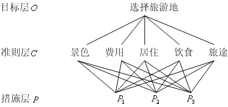

<!-- page: 169 -->

1.2  构造判断矩阵
层次结构反映了因素之间的关系，但准则层中的各准则在目标衡量中所占的比重
并不一定相同，在决策者的心目中，它们各占有一定的比例。

在确定影响某因素的诸因子在该因素中所占的比重时，遇到的主要困难是这些比
重常常不易定量化。此外，当影响某因素的因子较多时，直接考虑各因子对该因素有
多大程度的影响时，常常会因考虑不周全、顾此失彼而使决策者提出与他实际认为的
重要性程度不相一致的数据，甚至有可能提出一组隐含矛盾的数据。为看清这一点，
可作如下假设：将一块重为1 千克的石块砸成n 小块，你可以精确称出它们的重量，
设为
n
w
w
,
,
1 L
，现在，请人估计这n 小块的重量占总重量的比例（不能让他知道各

小石块的重量），此人不仅很难给出精确的比值，而且完全可能因顾此失彼而提供彼
此矛盾的数据。

设现在要比较n 个因子
}
,
,
{ 1
nx
x
X
L
=
对某因素Z 的影响大小，怎样比较才能提

供可信的数据呢？Saaty 等人建议可以采取对因子进行两两比较建立成对比较矩阵的
办法。即每次取两个因子
ix 和
jx ，以
ij
a 表示
ix 和
jx 对Z 的影响大小之比，全部比较

结果用矩阵
n
n
ij
a
A
×
=
)
(
表示，称A 为
X
Z −
之间的成对比较判断矩阵（简称判断矩

阵）。容易看出，若
ix 与
jx 对Z 的影响之比为
ij
a ，则
jx 与
ix 对Z 的影响之比应为

ij
ji
a
a
1
=
。

定义1  若矩阵
n
n
ij
a
A
×
=
)
(
满足

ij
ji
a
a
1
=
（
n
j
i
,
,2,1
,
L
=
）

（i）
0
>
ij
a
，（ii）

则称之为正互反矩阵(易见
1
=
ii
a
，
n
i
,
,1 L
=
)。

关于如何确定
ij
a 的值，Saaty 等建议引用数字1~9 及其倒数作为标度。表1 列出

了1~9 标度的含义：

表1  标度的含义
标度
含      义
1
3
5
7
9
2，4，6，8
倒数

表示两个因素相比，具有相同重要性
表示两个因素相比，前者比后者稍重要
表示两个因素相比，前者比后者明显重要
表示两个因素相比，前者比后者强烈重要
表示两个因素相比，前者比后者极端重要
表示上述相邻判断的中间值
若因素i 与因素j 的重要性之比为
ij
a ，那么因素j 与因素i 重要性

之比为
ij
ji
a
a
/
1
=
。

从心理学观点来看，分级太多会超越人们的判断能力，既增加了作判断的难度，
又容易因此而提供虚假数据。Saaty 等人还用实验方法比较了在各种不同标度下人们判
断结果的正确性，实验结果也表明，采用1~9 标度最为合适。

-168-

<!-- page: 170 -->

最后，应该指出，一般地作
2
)1
( −
n
n
次两两判断是必要的。有人认为把所有元素

都和某个元素比较，即只作
1
−
n
次比较就可以了。这种作法的弊病在于，任何一个判
断的失误均可导致不合理的排序，而个别判断的失误对于难以定量的系统往往是难以

避免的。进行
2
)1
( −
n
n
次比较可以提供更多的信息，通过各种不同角度的反复比较，

从而导出一个合理的排序。

1.3  层次单排序及一致性检验
判断矩阵A 对应于最大特征值
max
λ
的特征向量W ，经归一化后即为同一层次相

应因素对于上一层次某因素相对重要性的排序权值，这一过程称为层次单排序。

上述构造成对比较判断矩阵的办法虽能减少其它因素的干扰，较客观地反映出一
对因子影响力的差别。但综合全部比较结果时，其中难免包含一定程度的非一致性。
如果比较结果是前后完全一致的，则矩阵A 的元素还应当满足：

n
k
j
i
a
a
a
ik
jk
ij
L
,2,1
,
,
,
=
∀
=
                         （1）

定义2  满足关系式（1）的正互反矩阵称为一致矩阵。
需要检验构造出来的（正互反）判断矩阵A 是否严重地非一致，以便确定是否接
受A 。

定理1  正互反矩阵A 的最大特征根
max
λ
必为正实数，其对应特征向量的所有分

量均为正实数。A 的其余特征值的模均严格小于
max
λ
。

定理2  若A 为一致矩阵，则
（i）A 必为正互反矩阵。

（ii）A 的转置矩阵
T
A 也是一致矩阵。
（iii）A 的任意两行成比例，比例因子大于零，从而
1
)
(
rank
=
A
（同样，A 的
任意两列也成比例）。

（iv）A 的最大特征值
n
=
max
λ
，其中n 为矩阵A 的阶。A 的其余特征根均为零。

w
a =
，

（v）若A 的最大特征值
max
λ
对应的特征向量为
T
n
w
w
W
)
,
,
(
1 L
=
，则

i
ij
w

j

n
j
i
,
,2,1
,
L
=
∀
，即

⎡

⎤

w
w
w

w
w

1

1

1

L

⎢
⎢
⎢
⎢
⎢
⎢
⎢

⎥
⎥
⎥
⎥
⎥
⎥
⎥

w

1

2

n

w
w
w
w
w
w

2

2

2

L

=

A

1

2

n

L
L
L
L

w
w
w
w
w
w

n
n
n

L

⎣

⎦

2
1

n

定理3  n 阶正互反矩阵A 为一致矩阵当且仅当其最大特征根
n
=
max
λ
，且当正

互反矩阵A 非一致时，必有
n
>
max
λ
。

根据定理3，我们可以由
max
λ
是否等于n 来检验判断矩阵A 是否为一致矩阵。由

-169-

<!-- page: 171 -->

于特征根连续地依赖于
ij
a ，故
max
λ
比n 大得越多，A 的非一致性程度也就越严重，

max
λ
对应的标准化特征向量也就越不能真实地反映出
}
,
,
{ 1
nx
x
X
L
=
 在对因素Z

的影响中所占的比重。因此，对决策者提供的判断矩阵有必要作一次一致性检验，以
决定是否能接受它。

对判断矩阵的一致性检验的步骤如下：
（i）计算一致性指标CI

−
=
n

n
CI
λ

max

1

−

（ii）查找相应的平均随机一致性指标RI 。对
9,
,1 L
=
n
，Saaty 给出了RI 的值，
如表2 所示。

                     表2   RI 的值
n
1   2   3    4     5    6     7     8     9
RI
0   0  0.58  0.90  1.12  1.24  1.32  1.41  1.45

RI 的值是这样得到的，用随机方法构造500 个样本矩阵：随机地从1~9 及其倒
数中抽取数字构造正互反矩阵，求得最大特征根的平均值
max
'λ
，并定义

n
RI
λ
。

−
=
n

1
'max

−

（ⅲ）计算一致性比例CR

RI
CI
CR =

当
10
.0
<
CR
时，认为判断矩阵的一致性是可以接受的，否则应对判断矩阵作适当修
正。

1.4  层次总排序及一致性检验
上面我们得到的是一组元素对其上一层中某元素的权重向量。我们最终要得到各
元素，特别是最低层中各方案对于目标的排序权重，从而进行方案选择。总排序权重
要自上而下地将单准则下的权重进行合成。
  表3  层次总排序合成表

设上一层次（A 层）包含
m
A
A
,
,
1 L
共m 个因素，它们的层次总排序权重分别为

m
a
a
,
,
1 L
。又设其后的下一层次（B 层）包含n 个因素
n
B
B
,
,
1 L
，它们关于
jA 的层

-170-

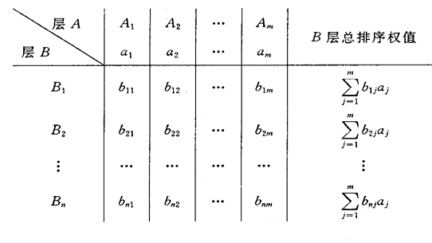

<!-- page: 172 -->

次单排序权重分别为
nj
j
b
b
,
,
1 L
（当
iB 与
jA 无关联时，
0
=
ijb
）。现求B 层中各因素

关于总目标的权重，即求B 层各因素的层次总排序权重
nb
b
,
,
1 L
，计算按表3 所示方

m

式进行，即
∑

1
，
n
i
,
,1 L
=
。

=
=

j
ij
i
a
b
b

j

对层次总排序也需作一致性检验，检验仍象层次总排序那样由高层到低层逐层进
行。这是因为虽然各层次均已经过层次单排序的一致性检验，各成对比较判断矩阵都
已具有较为满意的一致性。但当综合考察时，各层次的非一致性仍有可能积累起来，
引起最终分析结果较严重的非一致性。

设B 层中与
jA 相关的因素的成对比较判断矩阵在单排序中经一致性检验，求得

单排序一致性指标为
)
( j
CI
，（
m
j
,
,1 L
=
），相应的平均随机一致性指标为
)
( j
RI

（
)
(
)
(
j
RI
j
CI
、
已在层次单排序时求得），则B 层总排序随机一致性比例为

m

∑

a
j
CI
CR

)
(

j

=
=
m

j

1

∑

a
j
RI

)
(

j

=

j

1

当
10
.0
<
CR
时，认为层次总排序结果具有较满意的一致性并接受该分析结果。
§2  层次分析法的应用

在应用层次分析法研究问题时，遇到的主要困难有两个：（i）如何根据实际情况
抽象出较为贴切的层次结构；（ii）如何将某些定性的量作比较接近实际定量化处理。
层次分析法对人们的思维过程进行了加工整理，提出了一套系统分析问题的方法，为
科学管理和决策提供了较有说服力的依据。但层次分析法也有其局限性，主要表现在：
（i）它在很大程度上依赖于人们的经验，主观因素的影响很大，它至多只能排除思维
过程中的严重非一致性，却无法排除决策者个人可能存在的严重片面性。（ii）比较、
判断过程较为粗糙，不能用于精度要求较高的决策问题。AHP 至多只能算是一种半定
量（或定性与定量结合）的方法。

在应用层次分析法时，建立层次结构模型是十分关键的一步。现再分析一个实例，
以便说明如何从实际问题中抽象出相应的层次结构。

例2  挑选合适的工作。经双方恳谈，已有三个单位表示愿意录用某毕业生。该
生根据已有信息建立了一个层次结构模型，如图2 所示。

   图2  层次结构模型

-171-

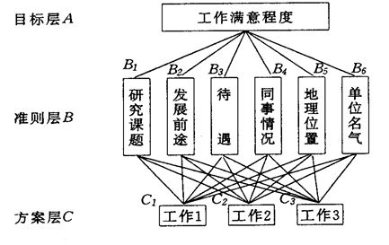

<!-- page: 173 -->

准则层的判断矩阵如表4 所示。

表4  准则层的判断矩阵
A
B1
B2
B3
B4
B5
B6
B1
1
1
1
4
1
1/2
B2
1
1
2
4
1
1/2
B3
1
1/2
1
5
3
1/2
B4
1/4
1/4
1/5
1
1/3
1/3
B5
1
1
1/3
3
1
1
B6
2
2
2
3
3
1

方案层的判断矩阵如表5 所示。

表5  方案层的判断矩阵
B1
C1
C2
C3
B2
C1
C2
C3
B3
C1
C2
C3
C1
1
1/4
1/2
C1
1
1/4
1/5
C1
1
3
1/3
C2
4
1
3
C2
4
1
1/2
C2
1/3
1
1/7
C3
2
1/3
1
C3
5
2
1
C3
3
1
1
B4
C1
C2
C3
B5
C1
C2
C3
B6
C1
C2
C3
C1
1
1/3
5
C1
1
1
7
C1
1
7
9
C2
3
1
7
C2
1
1
7
C2
1/7
1
1
C3
1/5
1/7
1
C3
1/7
1/7
1
C3
1/9
1
1
层次总排序的结果如表6 所示。

表6  层次总排序

准则
研究    发展    待遇    同事    地理    单位
课题    前途            情况    位置    名气
准则层权值
0.1507  0.1792  0.1886  0.0472   0.1464   0.2879

总排序
权值

方案层
单排序

工作1
工作2
工作3

0.3952
0.2996
0.3052
根据层次总排序权值，该生最满意的工作为工作1。
计算的Matlab 程序如下：
clc,clear
fid=fopen('txt3.txt','r');
n1=6;n2=3;
a=[];
for i=1:n1
   tmp=str2num(fgetl(fid));
   a=[a;tmp]; %读准则层判断矩阵
end
for i=1:n1
    str1=char(['b',int2str(i),'=[];']);
    str2=char(['b',int2str(i),'=[b',int2str(i),';tmp];']);
    eval(str1);
    for j=1:n2
        tmp=str2num(fgetl(fid));
        eval(str2); %读方案层的判断矩阵
    end

0.1365  0.0974  0.2426  0.2790   0.4667   0.7986
0.6250  0.3331  0.0879  0.6491   0.4667   0.1049
0.2385  0.5695  0.6694  0.0719   0.0667   0.0965

权值

-172-

<!-- page: 174 -->

end
ri=[0,0,0.58,0.90,1.12,1.24,1.32,1.41,1.45]; %一致性指标
[x,y]=eig(a);
lamda=max(diag(y));
num=find(diag(y)==lamda);
w0=x(:,num)/sum(x(:,num));
cr0=(lamda-n1)/(n1-1)/ri(n1)
for i=1:n1
    [x,y]=eig(eval(char(['b',int2str(i)])));
    lamda=max(diag(y));
    num=find(diag(y)==lamda);
    w1(:,i)=x(:,num)/sum(x(:,num));
    cr1(i)=(lamda-n2)/(n2-1)/ri(n2);
end
cr1, ts=w1*w0, cr=cr1*w0
纯文本文件txt3.txt中的数据格式如下：
1   1      1     4   1      1/2
1   1      2     4   1
 1/2
1   1/2  1     5   3      1/2
1/4   1/4  1/5   1
  1/3   1/3
1   1      1/3   3
  1      1
2   2      2     3   3      1
1   1/4  1/2
4   1      3
2   1/3  1
1   1/4  1/5
4   1      1/2
5   2      1
1   3      1/3
1/3  1      1/7
3   7      1
1   1/3    5
3   1      7
1/5   1/7  1
1   1      7
1   1      7
1/7  1/7  1
1   7      9
1/7   1      1
1/9   1      1

习 题 八
1. 若发现一成对比较判断矩阵A 的非一致性较为严重，应如何寻找引起非一致
性的元素？例如，设已构造了成对比较判断矩阵

⎡

⎤

3
5
1
1

⎢
⎢
⎢
⎢

⎥
⎥
⎥
⎥

=

A

1
6
1
3
1
6
1
5

⎣

⎦

（1）对A 作一致性检验。

-173-

<!-- page: 175 -->

（2）如A 的非一致性较严重，应如何作修正。
2. 你已经去过几家主要的摩托车商店，基本确定将从三种车型中选购一种，你
选择的标准主要有：价格、耗油量大小、舒适程度和外观美观情况。经反复思考比较，
构造了它们之间的成对比较判断矩阵。

⎡

⎤

1
3
/
1
5
/
1
8
/
1
3
1
5
/
1
7
/
1
5
5
1
3
/
1
8
7
3
1

⎢
⎢
⎢
⎢

⎥
⎥
⎥
⎥

=

A

⎣

⎦

三种车型（记为
c
b
a
,
,
）关于价格、耗油量、舒适程度和外表美观情况的成对比较判
断矩阵为
（价格）                          （耗油量）

1
2
/
1
3
/
1
2
1
2
/
1
3
2
1

c
b
a

1
7
/
1
2
7
1
5
2
/
1
5
/
1
1

c
b
a

⎡

⎤

⎡

⎤

c
b
a

c
b
a

⎢
⎢
⎢

⎥
⎥
⎥

⎢
⎢
⎢

⎥
⎥
⎥

⎣

⎦

⎣

⎦

（舒适程度）
   （外表）

1
4
/
1
5
/
1
4
1
3
/
1
5
3
1

c
b
a

1
7
/
1
3
/
1
7
1
5
3
5
/
1
1

c
b
a

⎡

⎤

⎡

⎤

c
b
a

c
b
a

⎢
⎢
⎢

⎥
⎥
⎥

⎢
⎢
⎢

⎥
⎥
⎥

⎣

⎦

⎣

⎦

（1）根据上述矩阵可以看出四项标准在你心目中的比重是不同的，请按由重到
轻顺序将它们排出。
（2）哪辆车最便宜、哪辆车最省油、哪辆车最舒适、哪辆车最漂亮？
（3）用层次分析法确定你对这三种车型的喜欢程度（用百分比表示）。

-174-

<!-- page: 176 -->

第九章  插值与拟合

插值：求过已知有限个数据点的近似函数。
拟合：已知有限个数据点，求近似函数，不要求过已知数据点，只要求在某种意义
下它在这些点上的总偏差最小。

插值和拟合都是要根据一组数据构造一个函数作为近似，由于近似的要求不同，二
者的数学方法上是完全不同的。而面对一个实际问题，究竟应该用插值还是拟合，有时
容易确定，有时则并不明显。
§1 插值方法

下面介绍几种基本的、常用的插值：拉格朗日多项式插值、牛顿插值、分段线性插
值、Hermite 插值和三次样条插值。

1.1  拉格朗日多项式插值
    1.1.1  插值多项式

用多项式作为研究插值的工具，称为代数插值。其基本问题是：已知函数
)
(x
f
在

区间
]
,
[
b
a
上
1
+
n
个不同点
nx
x
x
,
,
,
1
0
L
处的函数值
)
(
i
i
x
f
y =
)
,
,1,0
(
n
i
L
=
，求一个

至多n 次多项式

n
n
n
x
a
x
a
a
x
+
+
+
=
L
1
0
)
(
ϕ
                               （1）

使其在给定点处与
)
(x
f
同值，即满足插值条件

)
,
,1,0
(
)
(
)
(
n
i
y
x
f
x
i
i
i
n
L
=
=
=
ϕ
                           （2）
)
(x
n
ϕ
称为插值多项式，
)
,
,1,0
(
n
i
xi
L
=
称为插值节点，简称节点，
]
,
[
b
a
称为插值区

间。从几何上看，n 次多项式插值就是过
1
+
n
个点
))
(
,
(
i
i
x
f
x
)
,
,1,0
(
n
i
L
=
，作一条

多项式曲线
)
(x
y
n
ϕ
=
近似曲线
)
(x
f
y =
。
n 次多项式（1）有
1
+
n
个待定系数，由插值条件（2）恰好给出
1
+
n
个方程

⎧

=
+
+
+
+

0
0
2
0
2
0
1
0

n
n

y
x
a
x
a
x
a
a

L

⎪
⎪

=
+
+
+
+

1
1
2
1
2
1
1
0

n
n

y
x
a
x
a
x
a
a

L

⎨

  （3）

L
L
L
L
L
L
L
L
L
L
L
L

⎪
⎪

=
+
+
+
+

2
2
1
0

n
n
n
n
n
n

y
x
a
x
a
x
a
a

L

⎩

记此方程组的系数矩阵为A ，则

0
2
0
0

n

1

x
x
x

L

1
2
1
1

n

1

x
x
x

L

)
det(
=

A

L
L
L
L
L
L
L

n
n
n
n

2

1

x
x
x

L

是范德蒙特(Vandermonde)行列式。当
nx
x
x
,
,
,
1
0
L
互不相同时，此行列式值不为零。因

此方程组（3）有唯一解。这表明，只要
1
+
n
个节点互不相同，满足插值要求（2）的
插值多项式（1）是唯一的。

插值多项式与被插函数之间的差

)
(
)
(
)
(
x
x
f
x
R
n
n
ϕ
−
=

-175-

<!-- page: 177 -->

称为截断误差，又称为插值余项。当
)
(x
f
充分光滑时，

+

ξ
ω
ξ

)
1
(

n

b
a
x
n
f
x
L
x
f
x
R
n

)
(
)
(
)
(
)
(
1

n
n
∈
+
=
−
=
+

)
,
(
),
(
)!
1
(

n

其中
∏

0
1
)
(
)
(
ω
。

=
+
−
=

j
n
x
x
x

j

1.1.2  拉格朗日插值多项式
实际上比较方便的作法不是解方程（3）求待定系数，而是先构造一组基函数

−
−
−
−
=

x
x
x
x
x
x
x
x
x
l
−
−
−
−

)
(
)
)(
(
)
(
)
(

L
L

+
−

n
i
i
i
x
x
x
x
x
x
x
x

1
1
0

)
(
)
)(
(
)
(

L
L

+
−

n
i
i
i
i
i
i

1
1
0

−
=∏

x
x
n

j
L
=
−

)
1
0
(
,

0
,n
,,
i
x
x

≠
=

i
j
j
j
i

)
(x
li
是n 次多项式，满足

≠
=
i
j

⎩
⎨
⎧

i
j
x
l
j
i
1
0
)
(

=

令

⎛

⎞

−
=
=

⎜⎜
⎜

≠
=
⎟⎟
⎟

x
x
y
x
l
y
x
L

n

n

n

∑
∑
∏
=
=

j
i
i
i
n
x
x

0
0
0
)
(
)
(
                     （4）

−

i

i

i
j
j
j
i

⎝

⎠

上式称为n 次Lagrange 插值多项式，由方程（3）解的唯一性，
1
+
n
个节点的n 次
Lagrange 插值多项式存在唯一。
    1.1.3  用Matlab 作Lagrange 插值

Matlab 中没有现成的Lagrange 插值函数，必须编写一个M 文件实现Lagrange 插值。
设n 个节点数据以数组
0
,0 y
x
输入（注意Matlat 的数组下标从1 开始），m 个插值
点以数组x 输入，输出数组y 为m 个插值。编写一个名为lagrange.m 的M 文件：
function y=lagrange(x0,y0,x);
n=length(x0);m=length(x);
for i=1:m
   z=x(i);
   s=0.0;
   for k=1:n
      p=1.0;
      for j=1:n
         if j~=k
            p=p*(z-x0(j))/(x0(k)-x0(j));
         end
      end
      s=p*y0(k)+s;
   end
   y(i)=s;
end

-176-

<!-- page: 178 -->

    1.2  牛顿（Newton）插值

在导出Newton 公式前，先介绍公式表示中所需要用到的差商、差分的概念及性质。
1.2.1 差商
定义  设有函数
L
,
,
,
),
(
2
1
0
x
x
x
x
f
为一系列互不相等的点，称

−
)
(
)
(
)
(
j
i ≠
为
)
(x
f
关于点
j
i x
x ,
一阶差商（也称均差）记为
]
,
[
j
i x
x
f
，即

x
f
x
f

j
i

−

x
x

j
i

−
=
)
(
)
(
]
,
[

x
f
x
f
x
x
f
−

j
i
j
i
x
x

j
i

称一阶差商的差商

−
]
,
[
]
,
[

x
x
f
x
x
f

k
j
j
i

−

x
x

k
i

为
)
(x
f
关于点
k
j
i
x
x
x
,
,
的二阶差商，记为
]
,
,
[
k
j
i
x
x
x
f
。一般地，称

−
−

x
x
x
f
x
x
x
f

2
1
1
1
0
]
,
,
,
[
]
,
,
,
[
L
L

k
k

−

x
x

0

k

为
)
(x
f
关于点
kx
x
x
,
,
,
1
0
L
的k 阶差商，记为

−
=
−

x
x
x
f
x
x
x
f
x
x
x
f
−

2
1
1
1
0
1
0
]
,
,
,
[
]
,
,
,
[
]
,
,
,
[
L
L
L

k
k
k
x
x

0

k

容易证明，差商具有下述性质：
]
,
[
]
,
[
i
j
j
i
x
x
f
x
x
f
=

]
,
,
[
]
,
,
[
]
,
,
[
k
i
j
j
k
i
k
j
i
x
x
x
f
x
x
x
f
x
x
x
f
=
=

1.2.2  Newton 插值公式
线性插值公式可表成

]
,
[
)
(
)
(
)
(
1
0
0
0
1
x
x
f
x
x
x
f
x
−
+
=
ϕ

称为一次Newton 插值多项式。一般地，由各阶差商的定义，依次可得

]
,
[
)
(
)
(
)
(
0
0
0
x
x
f
x
x
x
f
x
f
−
+
=

]
,
,
[
)
(
]
,
[
]
,
[
1
0
1
1
0
0
x
x
x
f
x
x
x
x
f
x
x
f
−
+
=

]
,
,
,
[
)
(
]
,
,
[
]
,
,
[
2
1
0
2
2
1
0
1
0
x
x
x
x
f
x
x
x
x
x
f
x
x
x
f
−
+
=
L
L

]
,
,
,
[
)
(
]
,
,
,
[
]
,
,
,
[
0
1
0
1
0
n
n
n
n
x
x
x
f
x
x
x
x
x
f
x
x
x
f
L
L
L
−
+
=
−

将以上各式分别乘以
,
),
)(
(
),
(,1
1
0
0
L
x
x
x
x
x
x
−
−
−
)
(
)
)(
(
1
1
0
−
−
−
−
nx
x
x
x
x
x
L
，然

后相加并消去两边相等的部分，即得

+
−
+
=

x
x
f
x
x
x
f
x
f

]
,
[
)
(
)
(
)
(

L

1
0
0
0

−
−
−
+

]
,
,
,
[
)
(
)
)(
(

x
x
x
f
x
x
x
x
x
x

L
L

−

1
0
1
1
0

n
n

−
−
−
+

]
,
,
,
,
[
)
(
)
)(
(

x
x
x
x
f
x
x
x
x
x
x

L
L

1
0
1
0

n
n

记

-177-

<!-- page: 179 -->

+
−
+
=

x
x
f
x
x
x
f
x
N

]
,
[
)
(
)
(
)
(

L

n

1
0
0
0

−
−
−
+

]
,
,
,
[
)
(
)
)(
(

x
x
x
f
x
x
x
x
x
x

L
L

−

1
0
1
1
0

n
n

−
−
−
=

x
x
x
x
f
x
x
x
x
x
x
x
R

]
,
,
,
,
[
)
(
)
)(
(
)
(

L
L

n
n
n

1
0
1
0

=

ω

]
,
,
,
,
[
)
(

x
x
x
x
f
x

L

+

n
n

1
0
1

显然，
)
(x
N n
是至多n 次的多项式，且满足插值条件，因而它是
)
(x
f
的n 次插值

多项式。这种形式的插值多项式称为Newton 插值多项式。
)
(x
Rn
称为Newton 插值余

项。

Newton 插值的优点是：每增加一个节点，插值多项式只增加一项，即

]
,
,
,
[
)
(
)
(
)
(
)
(
1
1
0
0
1
+
+
−
−
+
=
n
n
n
n
x
x
x
f
x
x
x
x
x
N
x
N
L
L

因而便于递推运算。而且Newton 插值的计算量小于Lagrange 插值。

由插值多项式的唯一性可知，Newton 插值余项与Lagrange 余项也是相等的，即

=

ω
L

x
x
x
x
f
x
x
R

]
,
,
,
,
[
)
(
)
(

+

n
n
n

1
0
1

+

ξ
ω
ξ

)
1
(

n

b
a
x
n
f

)
(

∈
+
=

)
,
(
)
(
)!
1
(

+

n

1

由此可得差商与导数的关系

ξ
=
L

)
(

n

1
0
n
f
x
x
x
f

)
(
]
,
,
,
[

n

!

≤
≤
≤
≤
=
=
∈
β
α
β
α
ξ
。

其中
}
{
max
},
{
min
),
,
(

0
0
i
n
i
i
n
i
x
x

1.2.3  差分
当节点等距时，即相邻两个节点之差（称为步长）为常数，Newton 插值公式的形
式会更简单。此时关于节点间函数的平均变化率（差商）可用函数值之差（差分）来表
示。

定义  设有等距节点
)
,
,1,0
(
0
n
k
kh
x
xk
L
=
+
=
，步长h 为常数，
)
(
k
k
x
f
f =
。

称相邻两个节点
1
,
+
k
k x
x
处的函数值的增量
)1
,
,1,0
(
1
−
=
−
+
n
k
f
f
k
k
L
为函数
)
(x
f
在

点
kx 处以h 为步长的一阶差分，记为
kf
Δ
，即

)
,
,1,0
(
1
n
k
f
f
f
k
k
k
L
=
−
=
Δ
+

类似地，定义差分的差分为高阶差分。如二阶差分为

)
2
,
,1,0
(
1
2
−
=
Δ
−
Δ
=
Δ
+
n
k
f
f
f
k
k
k
L

一般地，m 阶差分为

)
,3,2
(
1
1
1
L
=
Δ
−
Δ
=
Δ
−
+
−
k
f
f
f
k
m
k
m
k
m
，

上面定义的各阶差分又称为向前差分。常用的差分还有两种：
1
−
−
=
∇
k
k
k
f
f
f

称为
)
(x
f
在
kx 处以h 为步长的向后差分；

⎟
⎠
⎞
⎜
⎝
⎛
−
−
⎟
⎠
⎞
⎜
⎝
⎛
+
=
2
2
h
x
f
h
x
f
f
k
k
k
δ

称为
)
(x
f
在
kx 处以h 为步长的中心差分。一般地，m 阶向后差分与m 阶中心差分公

式为

-178-

<!-- page: 180 -->

1
1
1
−
−
−
∇
−
∇
=
∇
k
m
k
m
k
m
f
f
f

−
−
=

−

m
k
m
f
f
f
δ
δ
δ

2
1
1

m

2
1
1

+

−

k

k

差分具有以下性质：
（i）各阶差分均可表成函数值的线性组合，例如

⎛
−
=
Δ
)1
(

⎞
⎜⎜
⎝

j
k
m
f
j
m
f
−
+
=∑
⎟⎟
⎠

m

j
m
k

0

j

⎛
−
=
∇
)1
(

⎞
⎜⎜
⎝

j
k
m
f
j
m
f
−
=∑
⎟⎟
⎠

m

j
k

0

j

（ii）各种差分之间可以互化。向后差分与中心差分化成向前差分的公式如下：

m
k
m
k
m
f
f
−
Δ
=
∇

−
Δ
=
δ

m
k
m
f
f

2
m
k

1.2.4  等距节点插值公式
如果插值节点是等距的，则插值公式可用差分表示。设已知节点

kh
x
xk
+
=
0
)
,
,2,1,0
(
n
k
L
=
，则有

−
+
=

x
x
x
x
f
x
f
x
N

)
](
,
[
)
(
)
(

n

0
1
0
0

−
−
−
+
+

x
x
x
x
x
x
x
x
x
f

)
(
)
)(
](
,
,
,
[

L
L
L

−

1
1
0
1
0

n
n

−
−
−
Δ
+
+
−
Δ
+
=

n

f
f

f
x
x
h

1
1
0
0
0
0
0

x
x
x
x
x
x
h
n

)
(
)
)(
(
!
)
(

L
L

−

n
n

若令
th
x
x
+
=
0
，则上式又可变形为

n
t
t
t
f
t
f
th
x
N
n
n
Δ
+
−
−
+
+
Δ
+
=
+
L
L

)1
(
)1
(
)
(
f
n

0
0
0
0
!

上式称为Newton 向前插值公式。

1.3  分段线性插值
1.3.1  插值多项式的振荡
用Lagrange 插值多项式
)
(x
Ln
近似
)
)(
(
b
x
a
x
f
≤
≤
，虽然随着节点个数的增加，
)
(x
Ln
的次数n 变大，多数情况下误差
|)
(
|
x
Rn
会变小。但是n 增大时，
)
(x
Ln
的光滑

性变坏，有时会出现很大的振荡。理论上，当
∞
→
n
，在
]
,
[
b
a
内并不能保证
)
(x
Ln
处

处收敛于
)
(x
f
。Runge 给出了一个有名的例子：

]
5,5
[
,
1
1
)
(
2
−
∈
+
=
x
x
x
f

对于较大的
|
| x ，随着n 的增大，
)
(x
Ln
振荡越来越大，事实上可以证明，仅当
63
.3
|
|
≤
x

时，才有
)
(
)
(
lim
x
f
x
Ln
n
=
∞
→
，而在此区间外，
)
(x
Ln
是发散的。

高次插值多项式的这些缺陷，促使人们转而寻求简单的低次多项式插值。
1.3.2  分段线性插值
简单地说，将每两个相邻的节点用直线连起来，如此形成的一条折线就是分段线性
插值函数，记作
)
(x
In
，它满足
i
i
n
y
x
I
=
)
(
，且
)
(x
In
在每个小区间
]
,
[
1
+
i
i x
x
上是线性

-179-

<!-- page: 181 -->

函数
)
,
,1,0
(
n
i
L
=
。
)
(x
In
可以表示为

n

∑

=
=

i
i
n
x
l
y
x
I

0
)
(
)
(

i

=
∈
−
−

⎧

x
x

−

i

1

i
x
x
x
x
x

0
(  ]
,
[
,

）

时舍去

⎪
⎪
⎪

−
−

i
i
i
i

1
1

=
∈
−
−

x
x

=
+
+

+

x
l
i
i
i
i

)
(
1
1

n
i
x
x
x
x
x

i

1

]
,
[

）
（
，

⎨

i

时舍去

⎪
⎪
⎪

0

，

其它

⎩

)
(x
In
有良好的收敛性，即对于
]
,
[
b
a
x∈
有，
)
(
)
(
lim
x
f
x
I n
n
=
∞
→
。

用
)
(x
In
计算x 点的插值时，只用到x 左右的两个节点，计算量与节点个数n 无关。

但n 越大，分段越多，插值误差越小。实际上用函数表作插值计算时，分段线性插值就
足够了，如数学、物理中用的特殊函数表，数理统计中用的概率分布表等。

1.3.3  用Matlab 实现分段线性插值
用Matlab 实现分段线性插值不需要编制函数程序，Matlab 中有现成的一维插值函
数interp1。

y=interp1(x0,y0,x,'method')
method 指定插值的方法，默认为线性插值。其值可为：
'nearest'   最近项插值
'linear'    线性插值
'spline'    逐段3 次样条插值
'cubic'    保凹凸性3 次插值。
所有的插值方法要求x0 是单调的。
当x0 为等距时可以用快速插值法，使用快速插值法的格式为'*nearest'、'*linear'、
'*spline'、'*cubic'。

1.4  埃尔米特(Hermite)插值
1.4.1  Hermite 插值多项式
如果对插值函数，不仅要求它在节点处与函数同值，而且要求它与函数有相同的一
阶、二阶甚至更高阶的导数值，这就是Hermite 插值问题。本节主要讨论在节点处插值
函数与函数的值及一阶导数值均相等的Hermite 插值。

设已知函数
)
(x
f
y =
在
1
+
n
个互异节点
nx
x
x
,
,
,
1
0
L
上的函数值
)
(
i
i
x
f
y =
)
,
,1,0
(
n
i
L
=
和导数值
)
('
'
i
i
x
f
y =
)
,
,1,0
(
n
i
L
=
，要求一个至多
1
2 +
n
次的多项式
)
(x
H
，使得

i
i
y
x
H
=
)
(
i
i
y
x
H
'
)
('
=
)
,
,1,0
(
n
i
L
=

满足上述条件的多项式
)
(x
H
称为Hermite 插值多项式。
Hermite 插值多项式为

-180-

<!-- page: 182 -->

n

∑

+
−
−
=

i
i
i
i
i
i
y
y
y
a
x
x
h
x
H

0
]
)
'
2
)(
[(
)
(

=

i

2

⎞
⎜⎜
⎝

⎛

−
=

x
x
h

n

n

1
。

其中
∏

，
∑

≠
=
⎟⎟
⎠

j
i
x
x

≠
=
−
=

i
j
j
j
i
i
x
x
a

−

i
j
j
j
i

0

0

1.4.2  用Matlab 实现Hermite 插值
Matlab 中没有现成的Hermite 插值函数，必须编写一个M 文件实现插值。
设n 个节点的数据以数组0
x （已知点的横坐标），0
y
（函数值），1
y （导数值）
输入（注意Matlat 的数组下标从1 开始），m 个插值点以数组x 输入，输出数组y 为m
个插值。编写一个名为hermite.m 的M 文件：
function y=hermite(x0,y0,y1,x);
n=length(x0);m=length(x);
for k=1:m
   yy=0.0;
   for i=1:n
      h=1.0;
      a=0.0;
      for j=1:n
         if j~=i
            h=h*((x(k)-x0(j))/(x0(i)-x0(j)))^2;
            a=1/(x0(i)-x0(j))+a;
         end
      end
      yy=yy+h*((x0(i)-x(k))*(2*a*y0(i)-y1(i))+y0(i));
   end
   y(k)=yy;
end

1.5  样条插值
许多工程技术中提出的计算问题对插值函数的光滑性有较高要求，如飞机的机翼外
形，内燃机的进、排气门的凸轮曲线，都要求曲线具有较高的光滑程度，不仅要连续，
而且要有连续的曲率，这就导致了样条插值的产生。

1.5.1  样条函数的概念
所谓样条（Spline）本来是工程设计中使用的一种绘图工具，它是富有弹性的细木
条或细金属条。绘图员利用它把一些已知点连接成一条光滑曲线（称为样条曲线），并
使连接点处有连续的曲率。

数学上将具有一定光滑性的分段多项式称为样条函数。具体地说，给定区间
]
,
[
b
a
的一个分划

b
x
x
x
x
a
n
n
=
<
<
<
<
=
Δ
−1
1
0
:
L

如果函数
)
(x
s
满足：

    （i）在每个小区间
)1
,
,1,0
](
,
[
1
−
=
−
n
i
x
x
i
i
L
上
)
(x
s
是k 次多项式；

（ii）
)
(x
s
在
]
,
[
b
a
上具有
1
−
k
阶连续导数。

则称
)
(x
s
为关于分划Δ 的k 次样条函数，其图形称为k 次样条曲线。
nx
x
x
,
,
,
1
0
L
称为

样条节点，
1
2
1
,
,
,
−
nx
x
x
L
称为内节点，
nx
x ,
0
称为边界点，这类样条函数的全体记做

-181-

<!-- page: 183 -->

)
,
(
k
SP Δ
，称为k 次样条函数空间。
显然，折线是一次样条曲线。
若
)
,
(
)
(
k
S
x
s
P Δ
∈
，则
)
(x
s
是关于分划Δ 的k 次多项式样条函数。k 次多项式样
条函数的一般形式为

x
x
s
β
α
，

−

i
i
k
x
x
k
i

k
j
j
k

1

n

∑
∑

−
+
=

1
0
)
(
!
!
)
(

+
=

=

i

j

其中
)
,
,1,0
(
k
i
i
L
=
α
和
)1
,
,2,1
(
−
=
n
j
j
L
β
均为任意常数，而

⎪⎨
⎧

≥
−
=
−
+

j
k
j
k
j
x
x

,
)
(
)
(
，（
1
,
,2,1
−
=
n
j
L
）

x
x
x
x
x
x

<

⎪⎩

,0

j

在实际中最常用的是
2
=
k
和3 的情况，即为二次样条函数和三次样条函数。
二次样条函数：对于
]
,
[
b
a
上的分划
b
x
x
x
a
n =
<
<
<
=
Δ
L
1
0
:
，则

P
j
j
S
x
x
x
x
x
s
β
α
α
α
，              （5）

−

n

1

∑

+
Δ
∈
−
+
+
+
=

2
2
2
1
0
2
)
2,
(
)
(
!2
!2
)
(

=

j

1

⎪⎨
⎧

≥
−
=
−
+

2
2
，（
1
,
,2,1
−
=
n
j
L
）。

,
)
(
)
(

x
x
x
x
x
x

j
j
j
x
x

其中

<

⎪⎩

,0

j

三次样条函数：对于
]
,
[
b
a
上的分划
b
x
x
x
a
n =
<
<
<
=
Δ
L
1
0
:
，则

P
j
j
S
x
x
x
x
x
x
s
β
α
α
α
α
，       （6）

−

n

1

∑

+
Δ
∈
−
+
+
+
+
=

3
3
3
2
2
1
0
3
)
3,
(
)
(
!3
!3
!2
)
(

=

j

1

⎪⎨
⎧

≥
−
=
−
+

3
3
，（
1
,
,2,1
−
=
n
j
L
）。

,
)
(
)
(

x
x
x
x
x
x

j
j
j
x
x

其中

<

⎪⎩

,0

j

利用样条函数进行插值，即取插值函数为样条函数，称为样条插值。例如分段线性插值
是一次样条插值。下面我们介绍二次、三次样条插值。
1.5.2  二次样条函数插值
首先，我们注意到
)
2,
(
)
(
2
Δ
∈
P
S
x
s
中含有
2
+
n
个特定常数，故应需要
2
+
n
个插
值条件，因此，二次样条插值问题可分为两类：
问题（1）：
已知插值节点
ix 和相应的函数值
)
,
,1,0
(
n
i
yi
L
=
以及端点
0x （或
nx ）处的导数

值
0'y
（或
n
y' ），求
)
2,
(
)
(
2
Δ
∈
P
S
x
s
使得

=
=

⎩
⎨
⎧

n
i
y
x
s

)
,
,2,1,0
(
)
(

L

2

i
i

   （7）

=
=

y
x
s
y
x
s

)
)
(
'
(
)
(
'

或

0
0
2

n
n
n

问题（2）：
已知插值节点
ix 和相应的导数值
)
,
,2,1,0
(
'
n
i
y i
L
=
以及端点
0x （或
nx ）处的函

数值
0y （或
ny ），求
)
2,
(
)
(
2
Δ
∈
P
S
x
s
使得

=
=

⎩
⎨
⎧

n
i
y
x
s

)
,
,2,1,0
(
'
)
(
'

L

2

i
i

                                     （8）

=
=

y
x
s
y
x
s

)
)
(
(
)
(

或

2
0
0
2

n
n

-182-

<!-- page: 184 -->

事实上，可以证明这两类插值问题都是唯一可解的。
对于问题（1），由条件（7）

⎧

2
1
)
(

=
+
+
=

α
α
α

0
2
0
2
0
1
0
0
2

y
x
x
x
s

⎪⎪
⎪
⎪

2
1
)
(

=
+
+
=

α
α
α

1
2
1
2
1
1
0
1
2

y
x
x
x
s

⎨

⎪
⎪
⎪
⎪

−

j

1

)
,
,3,2
(
)
(
2
1
2
1
)
(

∑

=
=
−
+
+
+
=

β
α
α
α

2
2
2
1
0
2

n
j
y
x
x
x
x
x
s

L

j
i
j
i
j
j
j

=

i

1

=
+
=

α
α

y
x
x
s

'
)
(
'

⎩

0
0
2
1
0
2

引入记号
T
n
X
)
,
,
,
,
,
(
1
1
2
1
0
−
=
β
β
α
α
α
L
为未知向量，
)
'
,
,
,
,
(
0
1
0
y
y
y
y
C
n
L
=
为已

知向量。

⎡

⎤

0
0
2
1
1

2
0
0

x
x

L

⎢
⎢
⎢
⎢
⎢
⎢
⎢
⎢
⎢
⎢
⎢

⎥
⎥
⎥
⎥
⎥
⎥
⎥
⎥
⎥
⎥
⎥

0
0
2
1
1

2
1
1

x
x

L

0
)
(
2
1
2
1
1

−
=

2
1
2
2
2
2

A

x
x
x
x

L

M
M
M
M
M

)
(
2
1
)
(
2
1
2
1
1

−
−

2
1
2
1
2

x
x
x
x
x
x

L

−
0
0
1
0

n
n
n
n
n

x

L

⎣

⎦

0

于是，问题转化为求方程组
C
AX =
的解
T
n
X
)
,
,
,
,
,
(
1
1
2
1
0
−
=
β
β
α
α
α
L
的问题，

即可得到二次样条函数
)
(
2 x
s
的表达式。
对于问题（2）的情况类似。
1.5.3  三次样条函数插值
由于
)
3,
(
)
(
3
Δ
∈
P
S
x
s
中含有
3
+
n
个待定系数，故应需要
3
+
n
个插值条件，已知

插值节点
ix 和相应的函数值
)
,
,2,1,0
(
)
(
n
i
y
x
f
i
i
L
=
=
，这里提供了
1
+
n
个条件，还

需要2 个边界条件。

常用的三次样条函数的边界条件有3 种类型：
（i）
n
y
b
s
y
a
s
'
)
(
'
,
'
)
(
'
3
0
3
=
=
。由这种边界条件建立的样条插值函数称为
)
(x
f
的

完备三次样条插值函数。

特别地，
0
'
'0
=
=
n
y
y
时，样条曲线在端点处呈水平状态。

如果
)
(' x
f
不知道，我们可以要求
)
(
'3 x
s
与
)
(' x
f
在端点处近似相等。这时以

3
2
1
0
,
,
,
x
x
x
x
为节点作一个三次Newton 插值多项式
)
(x
N a
，以
3
2
1
,
,
,
−
−
−
n
n
n
n
x
x
x
x
作一

个三次Newton 插值多项式
)
(x
N b
，要求

)
(
'
)
('
),
(
'
)
('
b
N
b
s
a
N
a
s
b
a
=
=

由这种边界条件建立的三次样条称为
)
(x
f
的Lagrange 三次样条插值函数。

（ii）
3
3
0
3
"
)
(
"
,
"
)
(
"
y
b
s
y
a
s
=
=
。特别地
0
"
"
=
=
n
n
y
y
时，称为自然边界条件。

-183-

<!-- page: 185 -->

（iii）
)
0
(
"
)
0
(
"
),
0
(
'
)
0
(
'
3
3
3
3
−
=
+
−
=
+
b
s
a
s
b
s
a
s
，(这里要求
=
+ )
0
(
3 a
s
)
0
(
3
−
b
s
)此条件称为周期条件。

1.5.4 三次样条插值在Matlab 中的实现
在Matlab 中数据点称之为断点。如果三次样条插值没有边界条件，最常用的方法，
就是采用非扭结（not-a-knot）条件。这个条件强迫第1 个和第2 个三次多项式的三阶
导数相等。对最后一个和倒数第2 个三次多项式也做同样地处理。

Matlab 中三次样条插值也有现成的函数：
y=interp1(x0,y0,x,'spline')；
y=spline(x0,y0,x)；
pp=csape(x0,y0,conds)，y=ppval(pp,x)。
其中x0,y0 是已知数据点，x 是插值点，y 是插值点的函数值。

对于三次样条插值，我们提倡使用函数csape，csape 的返回值是pp 形式，要求插
值点的函数值，必须调用函数ppval。

pp=csape(x0,y0)：使用默认的边界条件，即Lagrange 边界条件。
pp=csape(x0,y0,conds)中的conds 指定插值的边界条件，其值可为：
'complete'    边界为一阶导数，即默认的边界条件
'not-a-knot'   非扭结条件
'periodic'     周期条件
'second'      边界为二阶导数，二阶导数的值[0, 0]。
'variational'   设置边界的二阶导数值为[0,0]。
对于一些特殊的边界条件，可以通过conds 的一个
2
1×
矩阵来表示，conds 元素的
取值为1，2。此时，使用命令

pp=csape(x0,y0_ext,conds)
其中y0_ext=[left, y0, right]，这里left 表示左边界的取值，right 表示右边界的取值。

conds(i)=j 的含义是给定端点i 的j 阶导数，即conds 的第一个元素表示左边界的条
件，第二个元素表示右边界的条件，conds=[2,1]表示左边界是二阶导数，右边界是一阶
导数，对应的值由left 和right 给出。

详细情况请使用帮助help csape。
例1  机床加工
待加工零件的外形根据工艺要求由一组数据
)
,
(
y
x
给出（在平面情况下），用程控
铣床加工时每一刀只能沿x 方向和y 方向走非常小的一步，这就需要从已知数据得到加

工所要求的步长很小的
)
,
(
y
x
坐标。
表1 中给出的
y
x,
数据位于机翼断面的下轮廓线上，假设需要得到x 坐标每改变

0.1 时的y 坐标。试完成加工所需数据，画出曲线，并求出
0
=
x
处的曲线斜率和
15
13
≤
≤x
范围内y 的最小值。
                         表1

x   0   3   5    7   9   11   12   13   14  15
  y   0  1.2  1.7  2.0  2.1  2.0  1.8  1.2   1.0  1.6
    要求用Lagrange、分段线性和三次样条三种插值方法计算。

解  编写以下程序：
clc,clear
x0=[0   3   5   7   9   11   12   13   14  15];

-184-

<!-- page: 186 -->

y0=[0  1.2  1.7  2.0  2.1  2.0  1.8  1.2   1.0  1.6];
x=0:0.1:15;
y1=lagrange(x0,y0,x);  %调用前面编写的Lagrange插值函数
y2=interp1(x0,y0,x);
y3=interp1(x0,y0,x,'spline');
pp1=csape(x0,y0); y4=ppval(pp1,x);
pp2=csape(x0,y0,'second'); y5=ppval(pp2,x);
fprintf('比较一下不同插值方法和边界条件的结果:\n')
fprintf('x     y1      y2      y3      y4     y5\n')
xianshi=[x',y1',y2',y3',y4',y5'];
fprintf('%f\t%f\t%f\t%f\t%f\t%f\n',xianshi')
subplot(2,2,1), plot(x0,y0,'+',x,y1), title('Lagrange')
subplot(2,2,2), plot(x0,y0,'+',x,y2), title('Piecewise linear')
subplot(2,2,3), plot(x0,y0,'+',x,y3), title('Spline1')
subplot(2,2,4), plot(x0,y0,'+',x,y4), title('Spline2')
dyx0=ppval(fnder(pp1),x0(1))  %求x=0处的导数
ytemp=y3(131:151);
index=find(ytemp==min(ytemp));
xymin=[x(130+index),ytemp(index)]

计算结果略。
可以看出，拉格朗日插值的结果根本不能应用，分段线性插值的光滑性较差（特别
是在
14
=
x
附近弯曲处），建议选用三次样条插值的结果。
1.6  B 样条函数插值方法
1.6.1  磨光函数
实际中的许多问题，往往是既要求近似函数（曲线或曲面）有足够的光滑性，又要
求与实际函数有相同的凹凸性，一般插值函数和样条函数都不具有这种性质。如果对于
一个特殊函数进行磨光处理生成磨光函数（多项式），则用磨光函数构造出样条函数作
为插值函数，既有足够的光滑性，而且也具有较好的保凹凸性，因此磨光函数在一维插
值（曲线）和二维插值（曲面）问题中有着广泛的应用。

由积分理论可知，对于可积函数通过积分会提高函数的光滑度，因此，我们可以利
用积分方法对函数进行磨光处理。

定义  若
)
(x
f
为可积函数，对于
0
>
h
，则称积分

h
x

2
,1
)
(
1
)
(

+

∫

−
=
2

h
x
h
dt
t
f
h
x
f

为
)
(x
f
的一次磨光函数，h 称为磨光宽度。

同样的，可以定义
)
(x
f
的k 次磨光函数为

h
x

2
,1
,
)
(
1
)
(

+

∫

h
x
h
k
h
k
dt
t
f
h
x
f
（
1
>
k
）

−
−
=
2

事实上，磨光函数
)
(
,
x
f
h
k
比
)
(x
f
的光滑程度要高，且当磨光宽度h 很少时
)
(
,
x
f
h
k
很接近于
)
(x
f
。
1.6.2  等距B 样条函数
对于任意的函数
)
(x
f
，定义其步长为1 的中心差分算子δ 如下：

-185-

<!-- page: 187 -->

)
2
1
(
)
2
1
(
)
(
−
−
+
=
x
f
x
f
x
fδ

在此取
0
)
(
+
= x
x
f
，则

0
0
0
2
1
2
1

+
+
+
⎟
⎠
⎞
⎜
⎝
⎛
−
−
⎟
⎠
⎞
⎜
⎝
⎛
+
=
x
x
x
δ

是一个单位方波函数（如图1），记
0
0
)
(
+
=
Ω
x
x
δ
。并取
1
=
h
，对
)
(
0 x
Ω
进行一次磨光

得

⎡

⎤

0
0

⎟
⎠
⎞
⎜
⎝
⎛−
−
⎟
⎠
⎞
⎜
⎝
⎛+
=
Ω
=
Ω
2
1

2
1

2
1
0
1
2
1
2
1
)
(
)
(

+

+

x

x

∫
∫

x
dt
t
t
dt
t
x

−
⎥
⎥
⎦

⎢
⎢
⎣

2
1

−
+
+

x

+

x

0
1 0
x
x
x
dt
t
dt
t

x

+
−
+
−
+
=
−
=
∫
∫
)1
(
2
)1
(
1

+
+
+
−
+

x

x

显然
)
(
1 x
Ω
是连续的（如图1）。

       图1
)
(
0 x
Ω
和
)
(
1 x
Ω
的图形
类似地可得到k 次磨光函数为

k
j
k
j
k
j
k
x
k
C
x

+
⎟
⎠
⎞
⎜
⎝
⎛
−
+
+
−
=
Ω

+

k

1

1
2
1
!
)1
(
)
(

∑

=
+

j

0

实际上，可以证明：
)
(x
k
Ω
是分段k 次多项式，且具有
1
−
k
阶连续导数，其k 阶

导数有
2
+
k
个间断点，记为
2
1
+
−
=
k
j
x j
（
1
,
,2,1,0
+
=
k
j
L
）。从而可知
)
(x
k
Ω
是

对应于分划
+∞
<
<
<
<
<
−∞
Δ
+1
1
0
:
kx
x
x
L
的k 次多项式样条函数，称之为基本样

条函数，简称为k 次B 样条。由于样条节点为
2
1
+
−
=
k
j
x j
（
1
,
,2,1,0
+
=
k
j
L
）是

等距的，故
)
(x
k
Ω
又称为k 次等距B 样条函数。

对于任意函数
)
(x
f
的k 次磨光函数，由归纳法可以得到：

∞
−
−
⎟
⎠
⎞
⎜
⎝
⎛
−
Ω
=
)
(
1
)
(
1
,
（
2
2
h
x
t
h
x
+
≤
≤
−
）

t
x
h
x
f
k
h
k
∫

∞
+

dt
t
f
h

1
=
⎟⎠
⎞
⎜⎝
⎛
−
Ω
∫

特别地，当
1
)
(
=
x
f
时，有
1
1

t
x
h

∞
+

+∞

k
，从而
1
)
(
=
Ω
∫

∞
−
−
dt
h

∞
−
dx
x
k
，且当

1
≥
k
时有递推关系

-186-

<!-- page: 188 -->

⎡
⎟
⎠
⎞
⎜
⎝
⎛
−
Ω
⎟
⎠
⎞
⎜
⎝
⎛
−
−
−
⎟
⎠
⎞
⎜
⎝
⎛
+
Ω
⎟
⎠
⎞
⎜
⎝
⎛
+
+
=
Ω
−
−
2
1
2
1
2
1
2
1
1
)
(
1
1
x
x
k
x
k
x
k
x
k
k
k

⎤
⎢⎣

⎥⎦

1.6.3  一维等距B 样条函数插值
等距B 样条函数与通常的样条有如下的关系：

a
b
h
−
=
，

定理  设有区间
]
,
[
b
a
的均匀分划
jh
x
x j
+
=
Δ
0
:
（
n
j
,
,2,1,0
L
=
），
n

则对任意k 次样条函数
)
,
(
)
(
k
S
x
s
P
k
Δ
∈
都可以表示为B 样条函数族

0
2
1
−
=

n
j

1

⎩
⎨
⎧
⎟
⎠
⎞
⎜
⎝
⎛
+
−
−
−
Ω

−
=
⎭
⎬
⎫

x
x

k
j
h

k
j
k

的线性组合。
根据定理，如果已知曲线上一组点
)
,
(
j
j y
x
，其中
jh
x
x j
+
=
0
（
n
j
h
,
,2,1,0
,0
L
=
>
），则可以构造出一条样条磨光曲线（即为B 样条函数族的线
性组合）

⎟
⎠
⎞
⎜
⎝
⎛
−
−
Ω
=

−

1
0
)
(

n

x
x
c
x
s

∑

k
j
k
j
h

−
=

k
j

其中
jc （
1
,
,1
,
−
+
−
−
=
n
k
k
j
L
）为待定常数。用它来逼近曲线，既有较好的精度，

又有良好的保凸性。
实际中，最常用的是
3
=
k
的情况，即一般形式为

⎟
⎠
⎞
⎜
⎝
⎛
−
−
Ω
=

+

n

1

x
x
c
x
s

∑

0
3
3
)
(

j
j
h

−
=

j

1

其中
3
+
n
个待定系数
jc （
1
,
,0,1
+
−
=
n
j
L
）可以由插值条件确定。

对于插值条件

=
=

⎪⎨
⎧

n
j
y
x
s

)
,2,1,0
(
)
(

j
j
L

3
n
j
y
x
s

=
=

⎪⎩

)
,0
(
'
)
(
'

3

j
j

有

⎧

+

n

1

'
)
(
'
1
)
(
'

∑

=
−
Ω
=

y
j
c
h
x
s

⎪⎪
⎪
⎪

1
3
0
3

j

0

−
=

j

+

n

1

∑

=
=
−
Ω
=

n
i
y
j
i
c
x
s

,
,2,1,0
,
)
(
)
(

⎨

L
                      （9）

1
3
3

j
i

i

⎪⎪
⎪
⎪

−
=

j

+

n

1

'
)
(
'
1
)
(
'

∑

=
−
Ω
=

y
j
n
c
h
x
s

1
3

j
n

3

n

⎩

−
=

j

注意到
)
(
3 x
Ω
的局部非零性及其函数值：
3
2
)
0
(
3
=
Ω
，
6
1
)1
(
3
=
±
Ω
，当
2
≥
x
时

0
)
(
3
=
Ω
x
；且由
)
2
1
(
)
2
1
(
)
(
'
2
2
3
−
Ω
−
+
Ω
=
Ω
x
x
x
知，
0
)
0
(
'3
=
Ω
，
2
1
)1
(
'3
m
=
±
Ω
，

当
2
≥
x
时
0
)
(
'3
=
Ω
x
。则（9）式的每一个方程只有三个非零系数，具体为

-187-

<!-- page: 189 -->

=
+
−

⎧

hy
c
c

'
2

−

0
1
1
L
                           （10）

⎪⎨

=
=
+
+

n
i
y
c
c
c

,
,2,1,0
,
6
4

+
−

i
i
i
i

1
1

⎪⎩

=
+
−

hy
c
c

'
2

+
−

n
n
n

1
1

由方程组（10）容易求解出
jc （
1
,
,0,1
+
−
=
n
j
L
），即可得到三次样条函数
)
(
3 x
s

表达式。
1.6.4  二维等距B 样条函数插值
设有空间曲面
)
,
(
y
x
f
z =
（未知），如果已知二维等距节点
=
)
,
(
j
i y
x

)
,
(
0
0
τj
y
ih
x
+
+
（
0
,
>
τ
h
）上的值为
ijz （
m
j
n
i
,
,1,0
;
,
,1,0
L
L
=
=
），则相应的B

样条磨光曲面的一般形式为

⎟
⎠
⎞
⎜
⎝
⎛
−
−
Ω
⎟
⎠
⎞
⎜
⎝
⎛
−
−
Ω
= ∑∑

−

−

0
1
0
1
)
,
(

n

m

x
x
c
y
x
s
l

j
y
y
i
h

ij
τ

k

−
=

−
=

k
i

l
j

其中
ijc （
m
j
n
i
,
,1,0
;
,
,1,0
L
L
=
=
）为待定常数，
l
k, 可以取不同值，常用的也是

2
, =
l
k
和3的情形。这是一种具有良好保凸性的光滑曲面（函数），在工程设计中是常
用的，但只能使用于均匀划分或近似均匀划分的情况。

1.7 二维插值
前面讲述的都是一维插值，即节点为一维变量，插值函数是一元函数（曲线）。若
节点是二维的，插值函数就是二元函数，即曲面。如在某区域测量了若干点（节点）的
高程（节点值），为了画出较精确的等高线图，就要先插入更多的点（插值点），计算这
些点的高程（插值）。

1.7.1  插值节点为网格节点
已知
n
m×
个节点：
)
,
,
(
ij
j
i
z
y
x
（
n
j
m
i
,
,2,1
;
,
,2,1
L
L
=
=
），且
m
x
x
<
< L
1
；

ny
y
<
< L
1
。求点
)
,
(
y
x
处的插值z 。

Matlab 中有一些计算二维插值的程序。如

   z=interp2(x0,y0,z0,x,y,'method')
其中x0,y0 分别为m 维和n 维向量，表示节点，z0 为
m
n ×
维矩阵，表示节点值，x,y
为一维数组，表示插值点，x 与y 应是方向不同的向量，即一个是行向量，另一个是列
向量，z 为矩阵，它的行数为y 的维数，列数为x 的维数，表示得到的插值，'method'
的用法同上面的一维插值。

如果是三次样条插值，可以使用命令

pp=csape({x0,y0},z0,conds,valconds)，z=fnval(pp,{x,y})
其中x0,y0 分别为m 维和n 维向量，z0 为
n
m ×
维矩阵，z 为矩阵，它的行数为x 的维
数，列数为y 的维数，表示得到的插值，具体使用方法同一维插值。

例2 在一丘陵地带测量高程，x 和y 方向每隔100米测一个点，得高程如2表，试插
值一曲面，确定合适的模型，并由此找出最高点和该点的高程。

解  编写程序如下：
clear,clc
x=100:100:500;
y=100:100:400;
z=[636    697    624    478   450
   698    712    630    478   420

-188-

<!-- page: 190 -->

   680    674    598    412   400
   662    626    552    334   310];
pp=csape({x,y},z')
xi=100:10:500;yi=100:10:400
cz1=fnval(pp,{xi,yi})
cz2=interp2(x,y,z,xi,yi','spline')
[i,j]=find(cz1==max(max(cz1)))
x=xi(i),y=yi(j),zmax=cz1(i,j)

                           表2

    x
y
100
200
300
400
500

100
636
697
624
478
450
200
698
712
630
478
420
300
680
674
598
412
400
400
662
626
552
334
310
    1.7.2  插值节点为散乱节点

已知n 个节点：
)
,
,2,1
)(
,
,
(
n
i
z
y
x
i
i
i
L
=
，求点
)
,
(
y
x
处的插值z 。

对上述问题，Matlab 中提供了插值函数griddata，其格式为：
ZI = GRIDDATA(X,Y,Z,XI,YI)
其中X、Y、Z 均为n 维向量，指明所给数据点的横坐标、纵坐标和竖坐标。向量XI、
YI 是给定的网格点的横坐标和纵坐标，返回值ZI 为网格（XI，YI）处的函数值。XI
与YI 应是方向不同的向量，即一个是行向量，另一个是列向量。

例3  在某海域测得一些点（x,y）处的水深z 由下表给出，在矩形区域（75,200）
×(-50,150) 内画出海底曲面的图形。

表3
x
129
140
103.5
88
185.5
195
105
157.5
107.5
77
81
162
162
117.5
y
7.5
141.5
23
147
22.5
137.5
85.5
-6.5
-81
3
56.5
-66.5
84
-33.5
z
4
8
6
8
6
8
8
9
9
8
8
9
4
9
解  编写程序如下：
x=[129  140  103.5  88  185.5  195  105  157.5  107.5  77  81  162  162  117.5];
y=[7.5  141.5  23   147  22.5  137.5  85.5  -6.5  -81   3  56.5  -66.5  84 -33.5];
z=-[4     8    6     8    6     8     8     9     9   8    8    9    4    9];
xi=75:1:200;
yi=-50:1:150;
zi=griddata(x,y,z,xi,yi','cubic')
subplot(1,2,1), plot(x,y,'*')
subplot(1,2,2), mesh(xi,yi,zi)
§2  曲线拟合的线性最小二乘法

2.1  线性最小二乘法
曲线拟合问题的提法是，已知一组（二维）数据，即平面上的n 个点
)
,
(
i
i y
x
，
n
i
,
,2,1
L
=
，
ix 互不相同，寻求一个函数（曲线）
)
(x
f
y =
，使
)
(x
f
在某种准则下

与所有数据点最为接近，即曲线拟合得最好。

-189-

<!-- page: 191 -->

线性最小二乘法是解决曲线拟合最常用的方法，基本思路是，令

)
(
)
(
)
(
)
(
2
2
1
1
x
r
a
x
r
a
x
r
a
x
f
m
m
+
+
+
=
L
                    （11）

其中
)
(x
rk
是事先选定的一组线性无关的函数，
ka 是待定系数
)
,
,
,2,1
(
n
m
m
k
<
=
L
。

拟合准则是使
iy ，
n
i
,
,2,1
L
=
，与
)
(
ix
f
的距离
iδ 的平方和最小，称为最小二乘准则。

2.1.1  系数
ka 的确定

记

n

n

i
i
m
y
x
f
a
a
J
−
=
= ∑
∑
=
=
δ
L
                    （12）

2
1
]
)
(
[
)
,
,
(
i
i

2

i

1
1

∂

J
)
,
,1
(
m
k
L
=
，得到

为求
m
a
a
,
,
1 L
使J 达到最小，只需利用极值的必要条件
0
=
∂

k
a

关于
m
a
a
,
,
1 L
的线性方程组

n

m

i
i
k
k
i
j
L
=
=
−
∑
∑
=
=

1
1
m
j
y
x
r
a
x
r

)
,
,1
(
,0
]
)
(
)[
(

i

k

即

m

n

n

i
j
i
k
i
j
k
L
=
=
∑
∑
∑
=
=
=

)
,
,1
(
,
)
(
)]
(
)
(
[

1
1
1
m
j
y
x
r
x
r
x
r
a

               （13）

i

k

i

i

记

⎡
=

⎤

x
r
x
r

)
(
)
(

L

1
1
1

m

⎢
⎢
⎢

×
⎥
⎥
⎥

R

M
M
M

，

x
r
x
r

)
(
)
(

L

⎣

⎦

1

m
n
n
m
n

T
m
a
a
A
]
,
,
[
1 L
=
，
T
ny
y
Y
)
,
,
(
1 L
=

方程组（13）可表为

Y
R
RA
R
T
T
=
                                    （14）

当
)}
(
,
),
(
{ 1
x
r
x
r
m
L
线性无关时，R 列满秩，
R
RT
可逆，于是方程组（14）有唯

一解

Y
R
R
R
A
T
T
1
)
(
−
=

2.1.2  函数
)
(x
rk
的选取

面对一组数据
n
i
y
x
i
i
,
,2,1
),
,
(
L
=
，用线性最小二乘法作曲线拟合时，首要的、

也是关键的一步是恰当地选取
)
(
,
),
(
1
x
r
x
r
m
L
。如果通过机理分析，能够知道y 与x 之

间应该有什么样的函数关系，则
)
(
,
),
(
1
x
r
x
r
m
L
容易确定。若无法知道y 与x 之间的关

系，通常可以将数据
n
i
y
x
i
i
,
,2,1
),
,
(
L
=
作图，直观地判断应该用什么样的曲线去作

拟合。人们常用的曲线有

（i）直线
2
1
a
x
a
y
+
=

（ii）多项式
1
1
+
+
+
+
=
m
m
m
a
x
a
x
a
y
L
（一般
3,2
=
m
，不宜太高）

（iii）双曲线（一支）
2
1
a
x
a
y
+
=

-190-

<!-- page: 192 -->

（iv）指数曲线
x
ae
a
y
2
1
=

对于指数曲线，拟合前需作变量代换，化为对
2
1,a
a
的线性函数。
已知一组数据，用什么样的曲线拟合最好，可以在直观判断的基础上，选几种曲线
分别拟合，然后比较，看哪条曲线的最小二乘指标J 最小。
    2.2 最小二乘法的Matlab 实现

2.2.1  解方程组方法
在上面的记号下，

2
1
||
||
)
,
,
(
Y
RA
a
a
J
m
−
=
L

Matlab 中的线性最小二乘的标准型为

2

2
Y
RA
A
−

 ,
min

命令为
Y
R
A
\
=
。

例4  用最小二乘法求一个形如
2
bx
a
y
+
=
的经验公式，使它与表4 所示的数据
拟合。

         表4
x    19     25    31     38    44
  y   19.0   32.3   49.0   73.3   97.8
解  编写程序如下
x=[19     25    31     38    44]';
y=[19.0   32.3   49.0   73.3   97.8]';
r=[ones(5,1),x.^2];
ab=r\y
x0=19:0.1:44;
y0=ab(1)+ab(2)*x0.^2;
plot(x,y,'o',x0,y0,'r')

2.2.2  多项式拟合方法

如果取
}
,
,
,1
{
)}
(
,
),
(
{
1
1
m
m
x
x
x
r
x
r
L
L
=
+
，即用m 次多项式拟合给定数据，Matlab

中有现成的函数

a=polyfit(x0,y0,m)
其中输入参数x0,y0 为要拟合的数据，m 为拟合多项式的次数，输出参数a 为拟合多项
式y=amxm+…+a1x+a0系数a=[ am, …, a1, a0]。

多项式在x 处的值y 可用下面的函数计算

y=polyval(a,x)。
例5 某乡镇企业1990-1996 年的生产利润如表5。
                      表5

年份         1990  1991  1992  1993  1994  1995  1996
  利润（万元）  70   122   144   152   174   196   202
试预测1997 年和1998 年的利润。

解  作已知数据的的散点图，
x0=[1990  1991  1992  1993  1994  1995  1996];
y0=[70   122   144   152   174   196   202];
plot(x0,y0,'*')

-191-

<!-- page: 193 -->

发现该乡镇企业的年生产利润几乎直线上升。因此，我们可以用
0
1
a
x
a
y
+
=
作为

拟合函数来预测该乡镇企业未来的年利润。编写程序如下：
x0=[1990  1991  1992  1993  1994  1995  1996];
y0=[70   122   144   152   174   196   202];
a=polyfit(x0,y0,1)
y97=polyval(a,1997)
y98=polyval(a,1998)

求得
20
1 =
a
，
4
0
10
0705
4
×
−
=
.
a
，1997 年的生产利润y97=233.4286，1998 年的

生产利润y98=253.9286。

§3 最小二乘优化

在无约束最优化问题中，有些重要的特殊情形，比如目标函数由若干个函数的平
方和构成。这类函数一般可以写成：

m

∑

2
)
(
)
(
,
n
R
x ∈

=
=

i
x
f
x
F

i

1

其中
T
nx
x
x
)
,
,
(
1 L
=
，一般假设
n
m ≥
。我们把极小化这类函数的问题：

m

∑

=
=

2
)
(
)
(
min

i
x
f
x
F

i

1

称为最小二乘优化问题。

最小二乘优化是一类比较特殊的优化问题，在处理这类问题时，Matlab 也提供了
一些强大的函数。在Matlab 优化工具箱中，用于求解最小二乘优化问题的函数有：lsqlin、
lsqcurvefit、lsqnonlin、lsqnonneg，用法介绍如下。

3.1  lsqlin 函数

2
2
1
min
d
Cx
x
−

2

求解

≤

⎧

b
x
A

*

⎪⎨

=

beq
x
Aeq

*

     s.t.

⎪⎩

≤
≤

ub
x
lb

其中
Aeq
A
C
,
,
为矩阵，
x
ub
lb
beq
b
d
,
,
,
,
,
为向量。
Matlab 中的函数为：
x=lsqlin(C,d,A,b,Aeq,beq,lb,ub,x0)
例6  用lsqlin 命令求解例4。
解  编写程序如下：
x=[19     25    31     38    44]';
y=[19.0   32.3   49.0   73.3   97.8]';
r=[ones(5,1),x.^2];
ab=lsqlin(r,y)
x0=19:0.1:44;
y0=ab(1)+ab(2)*x0.^2;
plot(x,y,'o',x0,y0,'r')

-192-

<!-- page: 194 -->

3.2  lsqcurvefit 函数
给定输入输出数列
ydata
xdata,
,求参量x ,使得

2
)
,
(
2
1
)
,
(
2
1
min
∑
−
=
−

(
)

2
2

i
i
x
ydata
xdata
x
F
ydata
xdata
x
F

i

Matlab 中的函数为
X=LSQCURVEFIT(FUN,X0,XDATA,YDATA,LB,UB,OPTIONS)
其中FUN 是定义函数
)
,
(
xdata
x
F
的M 文件。

例7  用下面表6 中的数据拟合函数
kt
be
a
t
c
02
.0
)
(
−
+
=
中的参数
k
b
a
,
,
。

表6

jt  100    200   300   400   500   600   700   800   900  1000

jc  4.54  4.99  5.35  5.65  5.90  6.10  6.26  6.39  6.50  6.59

解  该问题即解最优化问题：

10

∑

−
−
+
=

2
02
.0
)
(
)
,
,
(
min

j
kt
c
be
a
k
b
a
F

j

=

i

1

（1）编写M 文件fun1.m 定义函数
)
,
(
tdata
x
F
：
    function f=fun1(x,tdata);

f=x(1)+x(2)*exp(-0.02*x(3)*tdata);  %其中x(1)=a，x(2)=b，x(3)=k
（2）调用函数lsqcurvefit，编写程序如下：
td=100:100:1000;
cd=[4.54  4.99  5.35  5.65  5.90  6.10  6.26  6.39  6.50  6.59];
x0=[0.2 0.05 0.05];
x=lsqcurvefit(@fun1,x0,td,cd)
3.3  lsqnonlin 函数

已知函数向量
[
]

T
k x
f
x
f
x
F
)
(
,
),
(
)
(
1
L
=
，求x 使得

2
)
(
2
1
min
x
F
x

2

Matlab 中的函数为
X=LSQNONLIN(FUN,X0,LB,UB,OPTIONS)
其中FUN 是定义向量函数
)
(x
F
的M 文件。
例8  用lsqnonlin 函数求解例7。
解  这里

[
]

T
kt
kt
c
be
a
c
be
a
t
x
F
x
F
10
02
.0
1
02
.0
10
1
,
,
)
,
(
)
(
−
+
−
+
=
=
−
−
L

[
]
k
b
a
x
,
,
=
（1）编写M 文件fun2.m 如下：
function f=fun2(x);
td=100:100:1000;
cd=[4.54  4.99  5.35  5.65  5.90  6.10  6.26  6.39  6.50  6.59];
f=x(1)+x(2)*exp(-0.02*x(3)*td)-cd;

-193-

<!-- page: 195 -->

（2）调用函数lsqnonlin，编写程序如下：
x0=[0.2 0.05 0.05];  %初始值是任意取的
x=lsqnonlin(@fun2,x0)
3.4  lsqnonneg 函数

2
2
1
min
d
Cx
x
−
，

2

求解非负的x ，使得满足

Matlab 中的函数为
X = LSQNONNEG(C,d,X0,OPTIONS)

⎡

⎤

⎡

⎤

2869
.0
0372
.0

8587
.0

⎢
⎢
⎢
⎢

⎥
⎥
⎥
⎥

⎢
⎢
⎢
⎢

⎥
⎥
⎥
⎥

7071
.0
6861
.0

1781
.0

=

d
，求
)
0
( ≥
x
x
满足

=

C
，

例9  已知

6245
.0
6233
.0

0747
.0

6170
.0
6344
.0

8405
.0

⎣

⎦

⎣

⎦

2
2
1
min
d
Cx
x
−

2

最小。

解  编写程序如下：
c=[0.0372 0.2869;0.6861 0.7071;0.6233 0.6245;0.6344 0.6170];
d=[0.8587;0.1781;0.0747;0.8405];
x=lsqnonneg(c,d)
    3.5  曲线拟合的用户图形界面求法
Matlab 工具箱提供了命令cftool，该命令给出了一维数据拟合的交互式环境。具体
执行步骤如下：
（1）把数据导入到工作空间；
（2）运行cftool，打开用户图形界面窗口；
（3）对数据进行预处理；
（4）选择适当的模型进行拟合；
（5）生成一些相关的统计量，并进行预测。
可以通过帮助（运行doc cftool）熟悉该命令的使用细节。
§4 曲线拟合与函数逼近

前面讲的曲线拟合是已知一组离散数据
}
,
,1
),
,
{(
n
i
y
x
i
i
L
=
，选择一个较简单的

函数
)
(x
f
，如多项式，在一定准则如最小二乘准则下，最接近这些数据。

如果已知一个较为复杂的连续函数
]
,
[
),
(
b
a
x
x
y
∈
，要求选择一个较简单的函数
)
(x
f
，在一定准则下最接近
)
(x
f
，就是所谓函数逼近。
与曲线拟合的最小二乘准则相对应，函数逼近常用的一种准则是最小平方逼近，即

b

∫
−
=

a
dx
x
y
x
f
J
2
)]
(
)
(
[
                                     (15)

达到最小。与曲线拟合一样，选一组函数
}
,
,1
),
(
{
m
k
x
rk
L
=
构造
)
(x
f
，即令
)
(
)
(
)
(
1
1
x
r
a
x
r
a
x
f
m
m
+
+
=
L

-194-

<!-- page: 196 -->

代入（15）式，求
m
a
a
,
,
1 L
使J 达到极小。利用极值必要条件可得

⎡

⎤

⎡

⎡
=
⎥
⎥
⎥

⎤

⎤

)
,
(
)
,
(
1
1

r
r
r
r

a

)
,
(

r
y

L

1
1
1

m

⎢
⎢
⎢

⎥
⎥
⎥

⎢
⎢
⎢

⎢
⎢
⎢

⎥
⎥
⎥

M
M
M

M
M
L

                    （16）

)
,
(
)
,
(

r
r
r
r

a

)
,
(

r
y

⎣

⎦

⎣

⎦

⎣

⎦

m
m
m
m
m

1

b

a
)
(
)
(
)
,
(
∫
=
。当方程组（16）的系数矩阵非奇异时，有唯一解。

这里
dx
x
h
x
g
h
g

最简单的当然是用多项式逼近函数，即选
1
)
(
1
=
x
r
，
x
x
r
=
)
(
2
，
2
3
)
(
x
x
r
=
，…。

并且如果能使∫
=
b

a
j
i
dx
x
r
x
r
0
)
(
)
(
，
)
(
j
i ≠
，方程组（16）的系数矩阵将是对角阵，计

算大大简化。满足这种性质的多项式称正交多项式。

勒让得（Legendre）多项式是在
]1,1
[−
区间上的正交多项式，它的表达式为

k

d
k
x
P
x
P
k
k

L
,2,1
,
)1
(
!
2
1
)
(
,1
)
(
2
0
=
−
=
=
k
x
dx

k
k

可以证明

≠
=
1

⎪⎨
⎧

1
,
1
2
2
,0
)
(
)
(
j
i
i

j
i
dx
x
P
x
P
j
i

∫−
⎪⎩

=
+

+
=
−
+
k
x
P
k

k
x
P
k
k
k

L
,2,1
),
(
1
)
(
1
1
2
)
(
1
1
=
+
−
+

k
x
xP
k

常用的正交多项式还有第一类切比雪夫（Chebyshev）多项式

)
,2,1,0
],
1,1
[
(
),
arccos
cos(
)
(
L
=
−
∈
=
n
x
x
n
x
Tn

和拉盖尔（Laguerre）多项式

n
x
n
。

d
e
x
L
x
n
n

)
,2,1,0
),
,0
[
(
),
(
)
(
L
=
+∞
∈
=
−
n
x
e
x
dx

例10 求
⎥⎦
⎤
⎢⎣
⎡−
∈
=
2
,
2
,
cos
)
(
π
π
x
x
x
f
在
}
,
,1
{
Span
4
2 x
x
H =
中的最佳平方逼近多

项式。
    解  编写程序如下：
syms x
base=[1,x^2,x^4];
y1=base.'*base
y2=cos(x)*base.'
r1=int(y1,-pi/2,pi/2)
r2=int(y2,-pi/2,pi/2)
a=r1\r2
xishu1=double(a)
digits(8),xishu2=vpa(a)

求得xishu1=0.9996     -0.4964    0.0372，即所求的最佳平方逼近多项式为

4
2
0372
.0
4964
.0
9996
.0
x
x
y
+
−
=

-195-

<!-- page: 197 -->

§5  黄河小浪底调水调沙问题

5.1  问题的提出

2004 年6 月至7 月黄河进行了第三次调水调沙试验，特别是首次由小浪底、三门

峡和万家寨三大水库联合调度，采用接力式防洪预泄放水，形成人造洪峰进行调沙试验

获得成功。整个试验期为20 多天，小浪底从6 月19 日开始预泄放水，直到7 月13 日

恢复正常供水结束。小浪底水利工程按设计拦沙量为75.5 亿m3，在这之前，小浪底共

积泥沙达14.15 亿t。这次调水调沙试验一个重要目的就是由小浪底上游的三门峡和万

家寨水库泄洪，在小浪底形成人造洪峰，冲刷小浪底库区沉积的泥沙，在小浪底水库开

闸泄洪以后，从6 月27 日开始三门峡水库和万家寨水库陆续开闸放水，人造洪峰于29

日先后到达小浪底，7 月3 日达到最大流量2700m3/s，使小浪底水库的排沙量也不断地

增加。表7 是由小浪底观测站从6 月29 日到7 月10 检测到的试验数据。

表7  观测数据

日期
6.29
6.30
7.1
7.2
7.3
7.4

时间
8:00
20:00
8:00
20:00
8:00
20:00
8:00
20:00
8:00
20:00
8:00
20:00

水流量
1800
1900
2100
2200
2300
2400
2500
2600
2650
2700
2720
2650

含沙量
32
60
75
85
90
98
100
102
108
112
115
116

日期
7.5
7.6
7.7
7.8
7.9
7.10

时间
8:00
20:00
8:00
20:00
8:00
20:00
8:00
20:00
8:00
20:00
8:00
20:00

水流量
2600
2500
2300
2200
2000
1850
1820
1800
1750
1500
1000
900

含沙量
118
120
118
105
80
60
50
30
26
20
8
5

现在，根据试验数据建立数学模型研究下面的问题：
（1）给出估计任意时刻的排沙量及总排沙量的方法；
（2）确定排沙量与水流量的关系。
5.2  模型的建立与求解
已知给定的观测时刻是等间距的，以6 月29 日零时刻开始计时，则各次观测时刻
（离开始时刻6 月29 日零时刻的时间）分别为

)
4
12
(
3600
−
=
i
ti
，
24
,
,2,1
L
=
i
，

其中计时单位为秒。第1 次观测的时刻
28800
1 =
t
，最后一次观测的时刻
1022400
24 =
t
。

记第i （
24
,
,2,1
L
=
i
）次观测时水流量为
iv ，含沙量为
ic ，则第i 次观测时的排

沙量为
i
i
i
v
c
y =
。有关的数据见表8。

        表8  插值数据对应关系                单位：排沙量为kg
节点
1
2
3
4
5
6
7
8
时刻
28800
72000
115200
158400
201600
244800
288000
331200
排沙量
57600
114000
157500
187000
207000
235200
250000
265200

-196-

<!-- page: 198 -->

节点
9
10
11
12
13
14
15
16
时刻
374400
417600
460800
504000
547200
590400
633600
676800
排沙量
286200
302400
312800
307400
306800
300000
271400
231000
节点
17
18
19
20
21
22
23
24
时刻
720000
763200
806400
849600
892800
936000
979200
1022400
排沙量
160000
111000
91000
54000
45500
30000
8000
4500

对于问题（1），根据所给问题的试验数据，要计算任意时刻的排沙量，就要确定
出排沙量随时间变化的规律，可以通过插值来实现。考虑到实际中的排沙量应该是时间
的连续函数，为了提高模型的精度，我们采用三次样条函数进行插值。
    利用MATLAB 函数，求出三次样条函数，得到排沙量
)
(t
y
y =
与时间的关系，然
后进行积分，就可以得到总的排沙量

t

t∫
=

24

dt
t
y
z

1
)
(

最后求得总的排沙量为
9
10
844
.1
×
t，计算的Matlab 程序如下：
clc,clear
load data.txt    %data.txt 按照原始数据格式把水流量和排沙量排成4 行，12 列
liu=data([1,3],:);
liu=liu';liu=liu(:);
sha=data([2,4],:);
sha=sha';sha=sha(:);
y=sha.*liu;y=y';
i=1:24;
t=(12*i-4)*3600;
t1=t(1);t2=t(end);
pp=csape(t,y);
xsh=pp.coefs  %求得插值多项式的系数矩阵，每一行是一个区间上多项式的系数。
TL=quadl(@(tt)ppval(pp,tt),t1,t2)
也可以利用3 次B 样条函数进行插值，求得总的排沙量也为
9
10
844
.1
×
t，，计算
的Matlab 程序如下：
clc,clear
load data.txt    %data.txt 按照原始数据格式把水流量和排沙量排成4 行，12 列
liu=data([1,3],:);
liu=liu';liu=liu(:);
sha=data([2,4],:);
sha=sha';sha=sha(:);
y=sha.*liu;y=y';
i=1:24;
t=(12*i-4)*3600;
t1=t(1);t2=t(end);
pp=spapi(4,t,y)      %三次B 样条
pp2=fn2fm(pp,'pp')  %把B 样条函数转化为pp 格式
TL=quadl(@(tt)fnval(pp,tt),t1,t2)
对于问题（2），研究排沙量与水量的关系，从试验数据可以看出，开始排沙量是随

-197-

<!-- page: 199 -->

着水流量的增加而增长，而后是随着水流量的减少而减少。显然，变化规律并非是线性
的关系，为此，把问题分为两部分，从开始水流量增加到最大值2720m3/s（即增长的过
程）为第一阶段，从水流量的最大值到结束为第二阶段，分别来研究水流量与排沙量的
关系。
画出排沙量与水流量的散点图（见图2）。

3.5 x 105

3.5 x 105

3

3

2.5

2.5

2

2

1.5

1.5

1

1

0.5

1500
2000
2500
3000
0.5

0
1000
2000
3000
0

第一阶段
第二阶段
          图2  散点图
画散点图的程序如下：
load data.txt
liu=data([1,3],:);
liu=liu';liu=liu(:);
sha=data([2,4],:);
sha=sha';sha=sha(:);
y=sha.*liu;
subplot(1,2,1), plot(liu(1:11),y(1:11),'*')
subplot(1,2,2), plot(liu(12:24),y(12:24),'*')

从散点图可以看出，第一阶段基本上是线性关系，第二阶段准备依次用二次、三次、
四次曲线来拟合，看哪一个模型的剩余标准差小就选取哪一个模型。最后求得第一阶段
排沙量y 与水流量v 之间的预测模型为

4661
.
373384
5655
.
250
−
=
v
y
第二阶段的预测模型为一个四次多项式。

6
2
3
4
7
10
2749668
3226
.1
0441
.
3891
092
.4
0018
.0
10
7693
.2
×
−
+
−
+
×
−
=
−
v
v
v
v
y
计算的Matlab 程序如下：
clc, clear
load data.txt    %data.txt 按照原始数据格式把水流量和排沙量排成4 行，12 列
liu=data([1,3],:); liu=liu'; liu=liu(:);
sha=data([2,4],:); sha=sha'; sha=sha(:);
y=sha.*liu;
%以下是第一阶段的拟合
format long e
nihe1_1=polyfit(liu(1:11),y(1:11),1)   %拟合一次多项式，系数排列从高次幂到低次幂
nihe1_2=polyfit(liu(1:11),y(1:11),2)

-198-

<!-- page: 200 -->

yhat1_1=polyval(nihe1_1,liu(1:11));  %求预测值
yhat1_2=polyval(nihe1_2,liu(1:11));
%以下求误差平凡和与剩余标准差
cha1_1=sum((y(1:11)-yhat1_1).^2); rmse1_1=sqrt(cha1_1/9)
cha1_2=sum((y(1:11)-yhat1_2).^2); rmse1_2=sqrt(cha1_2/8)
%以下是第二阶段的拟合
for j=1:3
    str1=char(['nihe2_' int2str(j) '=polyfit(liu(12:24),y(12:24),' int2str(j+1) ')']);
    eval(str1)
    str2=char(['yhat2_' int2str(j) '=polyval(nihe2_' int2str(j) ',liu(12:24));']);
    eval(str2)
    str3=char(['cha2_' int2str(j) '=sum((y(12:24)-yhat2_' int2str(j) ').^2);'...
        'rmse2_' int2str(j) '=sqrt(cha2_' int2str(j) '/(11-j))']);
    eval(str3)
end
format

习 题 九

1. 用给定的多项式，如
3
5
6
2
3
−
+
−
=
x
x
x
y
，产生一组数据
)
,
(
i
i y
x
，

m
i
,
,2,1
L
=
，再在
iy 上添加随机干扰（可用rand 产生（0,1）均匀分布随机数，或

用randn 产生
)1,0
(
N
分布随机数），然后用
ix 和添加了随机干扰的
iy 作3 次多项式拟

合，与原系数比较。如果作2 或4 次多项式拟合，结果如何？

2. 已知平面区域
5600
0
≤
≤x
，
4800
0
≤
≤y
的高程数据见9 表（单位：m）。
                               表9

1350  1370  1390  1400  1410  960   940   880   800   690   570   430   290   210   150
1370  1390  1410  1430  1440  1140  1110  1050  950   820   690   540   380   300   210
1380  1410  1430  1450  1470  1320  1280  1200  1080  940   780   620   460   370   350
1420  1430  1450  1480  1500  1550  1510  1430  1300  1200  980   850   750   550   500
1430  1450  1460  1500  1550  1600  1550  1600  1600  1600  1550  1500  1500  1550  1550
950   1190  1370  1500  1200  1100  1550  1600  1550  1380  1070  900   1050  1150  1200
910   1090  1270  1500  1200  1100  1350  1450  1200  1150  1010  880   1000  1050  1100
880   1060  1230  1390  1500  1500  1400  900   1100  1060  950   870   900   936   950
830   980   1180  1320  1450  1420   400  1300  700   900   850   810   380   780   750
740   880   1080  1130  1250  1280  1230  1040  900   500   700   780   750   650   550
650   760   880   970   1020  1050  1020  830   800   700   300   500   550   480   350
510   620   730   800   850   870   850   780   720   650   500   200   300   350   320
370   470   550   600   670   690   670   620   580   450   400   300   100   150   250
X
Y /
0     400   800  1200  1600  2000  2400  2800  3200  3600  4000  4400  4800  5200  5600

4800
4400
4000
3600
3200
2800
2400
2000
1600
1200
800
400
0

试用二维插值求
y
x,
方向间隔都为50 的高程，并画出该区域的等高线。

3. 用最小二乘法求一形如
bx
ae
y =
的经验公式拟合表10 中的数据。

                                 表10

ix   1     2     3     4     5     6     7      8

iy  15.3  20.5  27.4  36.6  49.1  65.6  87.87  117.6

4．（水箱水流量问题）许多供水单位由于没有测量流入或流出水箱流量的设备，而
只能测量水箱中的水位。试通过测得的某时刻水箱中水位的数据，估计在任意时刻（包

-199-

<!-- page: 201 -->

括水泵灌水期间）t 流出水箱的流量
)
(t
f
。
给出原始数据表11，其中长度单位为E（1E＝30.24cm）。水箱为圆柱体，其直径
为57E。
假设：
（1）影响水箱流量的唯一因素是该区公众对水的普通需要；
（2）水泵的灌水速度为常数；
（3）从水箱中流出水的最大流速小于水泵的灌水速度；
（4）每天的用水量分布都是相似的；
（5）水箱的流水速度可用光滑曲线来近似；
（6）当水箱的水容量达到514×10

3g 时，开始泵水；达到677.6×10
3g 时，便停止
泵水。

表11  水位数据表
时间（s）
水位（10

－2E）
0
3175
44636
3350
3316
3110
49953
3260
6635
3054
53936
3167
10619
2994
57254
3087
13937
2947
60574
3012
17921
2892
64554
2927
21240
2850
68535
2842
25223
2795
71854
2767
28543
2752
75021
2697
32284
2697
79254
泵水
35932
泵水
82649
泵水
39332
泵水
85968
3475
39435
3550
89953
3397
43318
3445
93270
3340

－2E）
时间（s）
水位（10

-200-

<!-- page: 202 -->

第十章  数据的统计描述和分析

数理统计研究的对象是受随机因素影响的数据，以下数理统计就简称统计，统计是
以概率论为基础的一门应用学科。

数据样本少则几个，多则成千上万，人们希望能用少数几个包含其最多相关信息的
数值来体现数据样本总体的规律。描述性统计就是搜集、整理、加工和分析统计数据，
使之系统化、条理化，以显示出数据资料的趋势、特征和数量关系。它是统计推断的基
础，实用性较强，在统计工作中经常使用。

面对一批数据如何进行描述与分析，需要掌握参数估计和假设检验这两个数理统计
的最基本方法。

我们将用Matlab 的统计工具箱(Statistics Toolbox)来实现数据的统计描述和分析。
§1  统计的基本概念

1.1  总体和样本
总体是人们研究对象的全体，又称母体，如工厂一天生产的全部产品（按合格品及
废品分类），学校全体学生的身高。

总体中的每一个基本单位称为个体，个体的特征用一个变量（如x ）来表示，如一
件产品是合格品记
0
=
x
，是废品记
1
=
x
；一个身高170（cm）的学生记
170
=
x
。
从总体中随机产生的若干个个体的集合称为样本，或子样，如n 件产品，100 名学
生的身高，或者一根轴直径的10 次测量。实际上这就是从总体中随机取得的一批数据，
不妨记作
nx
x
x
,
,
,
2
1
L
，n 称为样本容量。

简单地说，统计的任务是由样本推断总体。
1.2  频数表和直方图
一组数据（样本）往往是杂乱无章的，做出它的频数表和直方图，可以看作是对这
组数据的一个初步整理和直观描述。

将数据的取值范围划分为若干个区间，然后统计这组数据在每个区间中出现的次
数，称为频数，由此得到一个频数表。以数据的取值为横坐标，频数为纵坐标，画出一
个阶梯形的图，称为直方图，或频数分布图。

若样本容量不大，能够手工做出频数表和直方图，当样本容量较大时则可以借助
Matlab 这样的软件了。让我们以下面的例子为例，介绍频数表和直方图的作法。

例1  学生的身高和体重
学校随机抽取100 名学生，测量他们的身高和体重，所得数据如表

表1  身高体重数据
身高
体重
身高
体重
身高
体重
身高
体重
身高
体重
172
75
169
55
169
64
171
65
167
47
171
62
168
67
165
52
169
62
168
65
166
62
168
65
164
59
170
58
165
64
160
55
175
67
173
74
172
64
168
57
155
57
176
64
172
69
169
58
176
57
173
58
168
50
169
52
167
72
170
57
166
55
161
49
173
57
175
76
158
51
170
63
169
63
173
61
164
59
165
62
167
53
171
61
166
70
166
63
172
53
173
60
178
64
163
57
169
54
169
66
178
60
177
66
170
56
167
54
169
58
173
73
170
58
160
65
179
62
172
50
163
47
173
67
165
58
176
63
162
52

-201-

<!-- page: 203 -->

165
66
172
59
177
66
182
69
175
75
170
60
170
62
169
63
186
77
174
66
163
50
172
59
176
60
166
76
167
63
172
57
177
58
177
67
169
72
166
50
182
63
176
68
172
56
173
59
174
64
171
59
175
68
165
56
169
65
168
62
177
64
184
70
166
49
171
71
170
59

（i） 数据输入
数据输入通常有两种方法，一种是在交互环境中直接输入，如果在统计中数据量比
较大，这样作不太方便；另一种办法是先把数据写入一个纯文本数据文件data.txt 中，
格式如例1 的表1，有20 行、10 列，数据列之间用空格键或Tab 键分割，该数据文件
data.txt 存放在matlab\work 子目录下，在Matlab 中用load 命令读入数据，具体作法是：

load data.txt
这样在内存中建立了一个变量data，它是一个包含有
10
20×
个数据的矩阵。
为了得到我们需要的100 个身高和体重各为一列的矩阵，应做如下的改变：
high=data(:,1:2:9);high=high(:)
weight=data(:,2:2:10);weight=weight(:)

（ii）作频数表及直方图
求频数用hist 命令实现，其用法是：

[N,X] = hist(Y,M)
得到数组（行、列均可）Y 的频数表。它将区间[min(Y),max(Y)]等分为M 份（缺省时
M 设定为10），N 返回M 个小区间的频数，X 返回M 个小区间的中点。
命令

hist(Y,M)
画出数组Y 的直方图。

对于例1 的数据，编写程序如下：
load data.txt;
high=data(:,1:2:9);high=high(:);
weight=data(:,2:2:10);weight=weight(:);
[n1,x1]=hist(high)
%下面语句与hist命令等价
%n1=[length(find(high<158.1)),...
%   length(find(high>=158.1&high<161.2)),...
%   length(find(high>=161.2&high<164.5)),...
%   length(find(high>=164.5&high<167.6)),...
%   length(find(high>=167.6&high<170.7)),...
%   length(find(high>=170.7&high<173.8)),...
%   length(find(high>=173.8&high<176.9)),...
%   length(find(high>=176.9&high<180)),...
%   length(find(high>=180&high<183.1)),...
%   length(find(high>=183.1))]
[n2,x2]=hist(weight)
subplot(1,2,1), hist(high)
subplot(1,2,2), hist(weight)

计算结果略，直方图如图1 所示。

-202-

<!-- page: 204 -->

3 0

2 5

2 5

2 0

2 0

1 5

1 5

1 0

1 0

5

5

1 5 0
1 6 0
1 7 0
1 8 0
1 9 0
0

4 0
5 0
6 0
7 0
8 0
0

                        图1  直方图
从直方图上可以看出，身高的分布大致呈中间高、两端低的钟形；而体重则看不出
什么规律。要想从数值上给出更确切的描述，需要进一步研究反映数据特征的所谓“统
计量”。直方图所展示的身高的分布形状可看作正态分布，当然也可以用这组数据对分
布作假设检验。

例2  统计下列五行字符串中字符a、g、c、t 出现的频数
1.aggcacggaaaaacgggaataacggaggaggacttggcacggcattacacggagg
2.cggaggacaaacgggatggcggtattggaggtggcggactgttcgggga
3.gggacggatacggattctggccacggacggaaaggaggacacggcggacataca
4.atggataacggaaacaaaccagacaaacttcggtagaaatacagaagctta
5.cggctggcggacaacggactggcggattccaaaaacggaggaggcggacggaggc
解  把上述五行复制到一个纯文本数据文件shuju.txt 中，放在matlab\work 子目录
下，编写如下程序：
clc
fid1=fopen('shuju.txt','r');
i=1;
while (~feof(fid1))
data=fgetl(fid1);
a=length(find(data==97));
b=length(find(data==99));
c=length(find(data==103));
d=length(find(data==116));
e=length(find(data>=97&data<=122));
f(i,:)=[a  b  c  d  e  a+b+c+d];
i=i+1;
end
f, he=sum(f)
dlmwrite('pinshu.txt',f); dlmwrite('pinshu.txt',he,'-append');
fclose(fid1);
    我们把统计结果最后写到一个纯文本文件pinshu.txt 中，在程序中多引进了几个变
量，是为了检验字符串是否只包含a、g、c、t 四个字符。

1.3  统计量
假设有一个容量为n 的样本（即一组数据），记作
)
,
,
,
(
2
1
nx
x
x
x
L
=
，需要对它进

行一定的加工，才能提出有用的信息，用作对总体（分布）参数的估计和检验。统计量
就是加工出来的、反映样本数量特征的函数，它不含任何未知量。

下面我们介绍几种常用的统计量。

-203-

<!-- page: 205 -->

（i）表示位置的统计量—算术平均值和中位数
算术平均值（简称均值）描述数据取值的平均位置，记作x ，

n

1
                                     （1）

∑

=
=

ix
n
x

i

1

中位数是将数据由小到大排序后位于中间位置的那个数值。
Matlab 中mean(x)返回x 的均值，median(x)返回中位数。
（ii）表示变异程度的统计量—标准差、方差和极差
标准差s 定义为

2
1

⎡
−
−
=
∑

⎤
⎢⎣

n

2)
(
1
1
⎥⎦

i
x
x
n
s
                              （2）

=

i

1

它是各个数据与均值偏离程度的度量，这种偏离不妨称为变异。

方差是标准差的平方
2s 。
极差是
)
,
,
,
(
2
1
nx
x
x
x
L
=
的最大值与最小值之差。

Matlab 中std(x)返回x 的标准差，var(x)返回方差，range(x)返回极差。
你可能注意到标准差s 的定义（2）中，对n 个
)
(
x
xi −
的平方求和，却被
)1
( −
n
除，

这是出于无偏估计的要求。若需要改为被n 除，Matlab 可用std(x,1)和var(x,1)来实现。

（iii）中心矩、表示分布形状的统计量—偏度和峰度

随机变量x 的r 阶中心矩为
r
Ex
x
E
)
( −
。

随机变量x 的偏度和峰度指的是x 的标准化变量
Dx
Ex
x
/)
( −
 的三阶中心矩和
四阶中心矩：

(
)
[
]
(
)

⎡

⎤

3
3

⎛
−
=
ν

⎞
⎜⎜
⎝

x
E
x
E
−
=
⎥
⎥

x
E
x
E
x
D

)
(
)
(

)
(

⎟⎟
⎠

⎢
⎢

,
)
(

1
x
D

2
/
3

⎣

⎦

(
)
[
]
(
)

⎡

⎤

4
4

⎛
−
=
ν

⎞
⎜⎜
⎝

x
E
x
E
−
=
⎥
⎥

x
E
x
E
x
D

)
(
)
(

)
(

⎟⎟
⎠

⎢
⎢

.
)
(

2
x
D

2

⎣

⎦

偏度反映分布的对称性，
0
1 >
ν
称为右偏态，此时数据位于均值右边的比位于左

边的多；
0
1 <
ν
称为左偏态，情况相反；而
1
ν 接近0 则可认为分布是对称的。

    峰度是分布形状的另一种度量，正态分布的峰度为3，若
2
ν 比3 大得多，表示分布
有沉重的尾巴，说明样本中含有较多远离均值的数据，因而峰度可以用作衡量偏离正态
分布的尺度之一。

Matlab 中moment(x,order)返回x 的order 阶中心矩，order 为中心矩的阶数。
skewness(x)返回x 的偏度，kurtosis(x)返回峰度。

在以上用Matlab 计算各个统计量的命令中，若x 为矩阵，则作用于x 的列，返回
一个行向量。

对例1 给出的学生身高和体重，用Matlab 计算这些统计量，程序如下：
clc
load data.txt;
high=data(:,1:2:9);high=high(:);
weight=data(:,2:2:10);weight=weight(:);

-204-

<!-- page: 206 -->

shuju=[high weight];
jun_zhi=mean(shuju)
zhong_wei_shu=median(shuju)
biao_zhun_cha=std(shuju)
ji_cha=range(shuju)
pian_du=skewness(shuju)
feng_du=kurtosis(shuju)

统计量中最重要、最常用的是均值和标准差，由于样本是随机变量，它们作为样本
的函数自然也是随机变量，当用它们去推断总体时，有多大的可靠性就与统计量的概率
分布有关，因此我们需要知道几个重要分布的简单性质。

1.4  统计中几个重要的概率分布
1.4.1  分布函数、密度函数和分位数
随机变量的特性完全由它的（概率）分布函数或（概率）密度函数来描述。设有随
机变量X ，其分布函数定义为
x
X ≤
的概率，即
}
{
)
(
x
X
P
x
F
≤
=
。若X 是连续型随

机变量，则其密度函数
)
(x
p
与
)
(x
F
的关系为

x
dx
x
p
x
F
)
(
)
(
.

∫∞
−
=

上α 分位数是下面常用的一个概念，其定义为：对于
1
0
<
<α
，使某分布函数
α
−
=1
)
(x
F
的x ，称为这个分布的上α 分位数，记作
αx 。

我们前面画过的直方图是频数分布图，频数除以样本容量n ，称为频率，n 充分大
时频率是概率的近似，因此直方图可以看作密度函数图形的（离散化）近似。

1.4.2  统计中几个重要的概率分布
（i）正态分布
正态分布随机变量X 的密度函数曲线呈中间高两边低、对称的钟形，期望（均值）

μ
=
EX
，方差
2
σ
=
DX
，记作
)
,
(
~
2
σ
μ
N
X
，σ 称均方差或标准差，当
1
,0
=
=
σ
μ

时称为标准正态分布，记作
)1,0
(
~ N
X
。正态分布完全由均值μ 和方差
2
σ
决定，它
的偏度为0，峰度为3。

正态分布可以说是最常见的（连续型）概率分布，成批生产时零件的尺寸，射击中
弹着点的位置，仪器反复量测的结果，自然界中一种生物的数量特征等，多数情况下都
服从正态分布，这不仅是观察和经验的总结，而且有着深刻的理论依据，即在大量相互
独立的、作用差不多大的随机因素影响下形成的随机变量，其极限分布为正态分布。

鉴于正态分布的随机变量在实际生活中如此地常见，记住下面3 个数字是有用的：
68%的数值落在距均值左右1 个标准差的范围内，即
68
.0
}
{
=
+
≤
≤
−
σ
μ
σ
μ
X
P
；
95%的数值落在距均值左右2 个标准差的范围内，即
95
.0
}
2
2
{
=
+
≤
≤
−
σ
μ
σ
μ
X
P
；
99.7%的数值落在距均值左右3 个标准差的范围内，即
997
.0
}
3
3
{
=
+
≤
≤
−
σ
μ
σ
μ
X
P
.

（ii）
2
χ 分布(Chi square)

若
n
X
X
X
,
,
,
2
1
L
为相互独立的、服从标准正态分布
)1,0
(
N
的随机变量，则它们的

n

2 服从
2
χ 分布，记作
)
(
~
2 n
Y
χ
，n 称自由度，它的期望
n
EY =
，

平方和
∑

=
=

i
X
Y

i

1

-205-

<!-- page: 207 -->

方差
n
DY
2
=
。
（iii）t 分布

X
T

若
)1,0
(
~ N
X
，
)
(
~
2 n
Y
χ
，且相互独立，则

/
=
服从t 分布，记作

n
Y

)
(
~
n
t
T
，n 称自由度。t 分布又称学生氏(Student)分布。
t 分布的密度函数曲线和
)1,0
(
N
曲线形状相似。理论上
∞
→
n
时，
)1,0
(
)
(
~
N
n
t
T
→
，实际上当
30
>
n
时它与
)1,0
(
N
就相差无几了。
（iv）F 分布

n
X
F =
服从F 分布，记作

/

若
)
(
~
1
2 n
X
χ
，
)
(
~
2
2 n
Y
χ
，且相互独立，则

1
/

n
Y

2

)
,
(
~
2
1 n
n
F
F
，
)
,
(
2
1 n
n
称自由度。
1.4.3  Matlab 统计工具箱(Toolbox\Stats)中的概率分布
Matlab 统计工具箱中有27 种概率分布，这里只对上面所述4 种分布列出命令的字
符：

norm  正态分布；   chi2
2
χ 分布；
t   t 分布            f    F 分布
工具箱对每一种分布都提供5 类函数，其命令的字符是：
pdf 概率密度；  cdf 分布函数；  inv 分布函数的反函数；
stat 均值与方差；  rnd 随机数生成
当需要一种分布的某一类函数时，将以上所列的分布命令字符与函数命令字符接起
来，并输入自变量（可以是标量、数组或矩阵）和参数就行了，如：

p=normpdf(x,mu,sigma)  均值mu、标准差sigma 的正态分布在x 的密度函数
(mu=0，sigma=1 时可缺省)。

p=tcdf(x,n)  t 分布（自由度n）在x 的分布函数。

x=chi2inv(p,n)
2
χ 分布（自由度n）使分布函数F(x)=p 的x(即p 分位数)。
[m,v]=fstat(n1,n2)  F 分布（自由度n1,n2）的均值m 和方差v。
几个分布的密度函数图形就可以用这些命令作出，如：
x=-6:0.01:6;y=normpdf(x);z=normpdf(x,0,2);
plot(x,y,x,z),gtext('N(0,1)'),gtext('N(0,2^2)')

分布函数的反函数的意义从下例看出：

x=chi2inv(0.9,10)
x =
   15.9872
如果反过来计算，则

P=chi2cdf(15.9872,10)
P =
    0.9000
1.5  正态总体统计量的分布
用样本来推断总体，需要知道样本统计量的分布，而样本又是一组与总体同分布的
随机变量，所以样本统计量的分布依赖于总体的分布。当总体服从一般的分布时，求某
个样本统计量的分布是很困难的，只有在总体服从正态分布时，一些重要的样本统计量
（均值、标准差）的分布才有便于使用的结果。另一方面，现实生活中需要进行统计推
断的总体，多数可以认为服从（或近似服从）正态分布，所以统计中人们在正态总体的

-206-

<!-- page: 208 -->

假定下研究统计量的分布，是必要的与合理的。

设总体
)
,
(
~
2
σ
μ
N
X
，
nx
x
x
,
,
,
2
1
L
为一容量n 的样本，其均值x 和标准差s 由

式（1）、（2）确定，则用x 和s 构造的下面几个分布在统计中是非常有用的。

n
N
x
σ
μ
 或
)1,0
(
~
/

μ
−
                           （3）

2

N
n
x
σ

)
,
(
~

2
−
−
n
s
n
χ
σ

).
1
(
~
)1
(
2
2

                                （4）

−
−
n
t
n
s

x
μ
                                     （5）

)1
(
~
/

设有两个总体
)
,
(
~
2
2
1 σ
μ
N
X
和
)
,
(
~
2
2
2 σ
μ
N
Y
，及由容量分别为
1n ，
2n 的两个

样本确定的均值
y
x,
和标准差
2
1,s
s
，则

−
−
−
                              （6）

μ
μ

)
(
)
(

y
x

2
1
N
n
n

)1,0
(
~
/
/

σ
σ

+

2
2
2
1
2
1

−
−
−
n
n
t
n
n
s

μ
μ
                         （7）

)
2
(
~
/
1
/
1
)
(
)
(

y
x

2
1
−
+
+

2
1
2
1

w

−
+
−
=
n
n

2
2
2
2
1
1
2
−
+

其中
2
)1
(
)1
(

s
n
s
n
sw
，

2
1

σ
σ
                              （8）

2
1
2
1
−
−
n
n
F
s
s

)1
,1
(
~
/
/

2
1
2
2
2
2

对于（7）式，假定
2
1
σ
σ =
，但它们未知，于是用s 代替。在下面的统计推断中我们
要反复用到这些分布。
§2 参数估计

利用样本对总体进行统计推断的一类问题是参数估计，即假定已知总体的分布，通

常是
)
,
(
~
2
σ
μ
N
X
，估计有关的参数，如
2
,σ
μ
。参数估计分点估计和区间估计两种。
2.1  点估计
点估计是用样本统计量确定总体参数的一个数值。评价估计优劣的标准有无偏性、
最小方差性、有效性等，估计的方法有矩法、极大似然法等。

最常用的是对总体均值μ 和方差
2
σ （或标准差σ ）作点估计。让我们暂时抛开评

价标准，当从一个样本按照式（1）、（2）算出样本均值x 和方差
2s 后，对μ 和
2
σ （或
σ ）一个自然、合理的点估计显然是（在字母上加^表示它的估计值）

x
=
μˆ
，
2
2ˆ
s
=
σ
，
s
=
σˆ
                           （9）
2.2  区间估计
点估计虽然给出了待估参数的一个数值，却没有告诉我们这个估计值的精度和可信

程度。一般地，总体的待估参数记作θ （如
2
,σ
μ
），由样本算出的θ 的估计量记作θˆ ，

人们常希望给出一个区间
]
ˆ
,
ˆ
[
2
1 θ
θ
，使θ 以一定的概率落在此区间内。若有

α
θ
θ
θ
−
=
<
<
1
}
ˆ
ˆ
{
2
1
P
，
1
0
<
<α
                      （10）

-207-

<!-- page: 209 -->

则
]
ˆ
,
ˆ
[
2
1 θ
θ
称为θ 的置信区间，
2
1 ˆ
,
ˆ θ
θ
分别称为置信下限和置信上限，
α
−
1
称为置信概
率或置信水平，α 称为显著性水平。

给出的置信水平为
α
−
1
的置信区间
]
ˆ
,
ˆ
[
2
1 θ
θ
，称为θ 的区间估计。置信区间越小，
估计的精度越高；置信水平越大，估计的可信程度越高。但是这两个指标显然是矛盾的，
通常是在一定的置信水平下使置信区间尽量小。通俗地说，区间估计给出了点估计的误
差范围。

2.3  参数估计的Matlab 实现
Matlab 统计工具箱中，有专门计算总体均值、标准差的点估计和区间估计的函数。
对于正态总体，命令是

[mu,sigma,muci,sigmaci]=normfit(x,alpha)
其中x 为样本（数组或矩阵），alpha 为显著性水平α （alpha 缺省时设定为0.05），返
回总体均值μ 和标准差σ 的点估计mu 和sigma，及总体均值μ 和标准差σ 的区间估计
muci 和sigmaci。当x 为矩阵时，x 的每一列作为一个样本。

Matlab 统计工具箱中还提供了一些具有特定分布总体的区间估计的命令，如
expfit，poissfit，gamfit，你可以从这些字头猜出它们用于哪个分布，具体用法参见
帮助系统。
§3  假设检验

统计推断的另一类重要问题是假设检验问题。在总体的分布函数完全未知或只知其
形式但不知其参数的情况，为了推断总体的某些性质，提出某些关于总体的假设。例如，
提出总体服从泊松分布的假设，又如对于正态总体提出数学期望等于
0
μ 的假设等。假

设检验就是根据样本对所提出的假设做出判断：是接受还是拒绝。这就是所谓的假设检
验问题。

3.1  单个总体
)
,
(
2
σ
μ
N
均值μ 的检验
假设检验有三种：
双边检验：
0
0 :
μ
μ =
H
，
0
1 :
μ
μ ≠
H
；

右边检验：
0
0 :
μ
μ ≤
H
，
0
1 :
μ
μ >
H
；

左边检验：
0
0 :
μ
μ ≥
H
，
0
1 :
μ
μ <
H
。

3.1.1
2
σ
已知，关于μ 的检验（Z 检验）

在Matlab 中Z 检验法由函数ztest 来实现，命令为
[h,p,ci]=ztest(x,mu,sigma,alpha,tail)
其中输入参数x 是样本，mu 是
0
H 中的
0
μ ，sigma 是总体标准差σ ，alpha 是显著性

水平α （alpha 缺省时设定为0.05），tail 是对备选假设
1
H 的选择：
1
H 为
0
μ
μ ≠
时

用tail=0（可缺省）；
1
H 为
0
μ
μ >
时用tail=1；
1
H 为
0
μ
μ <
时用tail=-1。输出参

数h=0 表示接受
0
H ，h=1 表示拒绝
0
H ，p 表示在假设
0
H 下样本均值出现的概率，p

越小
0
H 越值得怀疑，ci 是
0
μ 的置信区间。

例3  某车间用一台包装机包装糖果。包得的袋装糖重是一个随机变量，它服从正
态分布。当机器正常时，其均值为0.5 公斤，标准差为0.015 公斤。某日开工后为检验
包装机是否正常，随机地抽取它所包装的糖9 袋，称得净重为（公斤）：

0.497   0.506   0.518   0.524   0.498   0.511  0.520  0.515  0.512

-208-

<!-- page: 210 -->

问机器是否正常？

解  总体σ 已知，
)
015
.0,
(
~
2
μ
N
x
，μ 未知。于是提出假设
5.0
:
0
0
=
= μ
μ
H
和

5.0
:
1
≠
μ
H
。
Matlab 实现如下：
x=[0.497   0.506   0.518   0.524   0.498...
   0.511  0.520  0.515  0.512];
[h,p,ci]=ztest(x,0.5,0.015)

求得h=1，p=0.0248，说明在0.05 的水平下，可拒绝原假设，即认为这天包装机
工作不正常。

3.1.2
2
σ
未知，关于μ 的检验（t 检验）
在Matlab 中t 检验法由函数ttest 来实现，命令为

[h,p,ci]=ttest(x,mu,alpha,tail)

例4  某种电子元件的寿命x (以小时计)服从正态分布,
2
,σ
μ
均未知.现得16 只
元件的寿命如下:

159  280  101  212  224  379  179  264
222  362  168  250  149  260  485  170
问是否有理由认为元件的平均寿命大于225(小时)?

解  按题意需检验

225
:
,
225
:
1
0
0
>
=
≤
μ
μ
μ
H
H
，

取
05
.0
=
α
。Matlab 实现如下：
x=[159  280  101  212  224  379  179  264 ...
   222  362  168  250  149  260  485  170];
[h,p,ci]=ttest(x,225,0.05,1)

求得h=0，p=0.2570，说明在显著水平为0.05 的情况下，不能拒绝原假设，认为
元件的平均寿命不大于225 小时。

3.2  两个正态总体均值差的检验（t 检验）
还可以用t 检验法检验具有相同方差的2 个正态总体均值差的假设。在Matlab 中
由函数ttest2 实现，命令为：

[h,p,ci]=ttest2(x,y,alpha,tail)
与上面的ttest 相比，不同处只在于输入的是两个样本x,y（长度不一定相同），
而不是一个样本和它的总体均值；tail 的用法与ttest 相似，可参看帮助系统。

例5 在平炉上进行一项试验以确定改变操作方法的建议是否会增加钢的得率,试
验是在同一平炉上进行的。每炼一炉钢时除操作方法外,其它条件都可能做到相同。先
用标准方法炼一炉,然后用建议的新方法炼一炉,以后交换进行,各炼了10 炉,其得率分
别为

1°标准方法  78.1  72.4  76.2  74.3  77.4  78.4  76.0  75.6  76.7  77.3
2°新方法    79.1  81.0  77.3  79.1  80.0  79.1  79.1  77.3  80.2  82.1

设这两个样本相互独立且分别来自正态总体
)
,
(
2
1 σ
μ
N
和
)
,
(
2
2 σ
μ
N
,
2
2
1
,
,
σ
μ
μ
均未

知，问建议的新方法能否提高得率?(取
05
.0
=
α
。)
解  （i）需要检验假设

0
:
2
1
0
≥
−μ
μ
H
，
0
:
2
1
1
<
−μ
μ
H
.

(ii)Matlab 实现

-209-

<!-- page: 211 -->

x=[78.1  72.4  76.2  74.3  77.4  78.4  76.0  75.6  76.7  77.3];
y=[79.1  81.0  77.3  79.1  80.0  79.1  79.1  77.3  80.2  82.1];
[h,p,ci]=ttest2(x,y,0.05,-1)

-4。表明在
05
.0
=
α
的显著水平下，可以拒绝原假设，即认
为建议的新操作方法较原方法优。

求得h=1,p=2.2126×10

3.3  分布拟合检验
在实际问题中，有时不能预知总体服从什么类型的分布，这时就需要根据样本来检

验关于分布的假设。下面介绍
2
χ 检验法和专用于检验分布是否为正态的“偏峰、峰度
检验法”。

3.3.1
2
χ 检验法

0
H ：总体x 的分布函数为
)
(x
F
,

1
H : 总体x 的分布函数不是
).
(x
F

在用下述
2
χ 检验法检验假设
0
H 时，若在假设
0
H 下
)
(x
F
的形式已知，但其参数

值未知，这时需要先用极大似然估计法估计参数，然后作检验。

2
χ 检验法的基本思想如下：将随机试验可能结果的全体Ω 分为k 个互不相容的事

k

k
L
=
≠
Φ
=
Ω
=
∑

件
k
A
A
A
A
,...,
,
,
3
2
1
)
,
,2,1
, ,
,
,
(

。于是在假设
0
H 下,

1
k
j
i
j
i
A
A
A
j
i

=

i

我们可以计算
)
(
i
i
A
P
p =
（或
)
(ˆ
ˆ
i
i
A
P
p =
），
k
i
,
,2,1
L
=
。在n 次试验中,事件
iA 出

现的频率
n
fi /
与
ip (
ipˆ )往往有差异,但一般来说,若
0
H 为真,且试验的次数又甚多时,

则这种差异不应该很大。基于这种想法，皮尔逊使用

−
=

−
=

2
2
)
(
χ
（或
∑

2
2
ˆ

)
ˆ
(
χ
）                （11）

k

k

np
f

p
n
f

∑

i
i

i
i

np

p
n

=

=

i
i

1

i
i

1

作为检验假设
0
H 的统计量。并证明了以下定理。

定理  若n 充分大,则当
0
H 为真时(不论
0
H 中的分布属什么分布),统计量（11）

总是近似地服从自由度为
1
−
−r
k
的
2
χ 分布,其中r 是被估计的参数的个数。

于是,若在假设
0
H 下算得（11）有

),
1
(
2
2
−
−
≥
r
k
a
χ
χ

则在显著性水平α 下拒绝
0
H ,否则就接受。

注意：在使用
2
χ 检验法时，要求样本容量n 不小于50,以及每个
i
np 都不小于5,

而且
i
np 最好是在5 以上。否则应适当地合并
iA ，以满足这个要求。

例6  下面列出了84 个伊特拉斯坎（Etruscan）人男子的头颅的最大宽度（mm），
试检验这些数据是否来自正态总体（取
)1.0
=
α
。
141  148  132  138  154  142  150  146  155  158
150  140  147  148  144  150  149  145  149  158
143  141  144  144  126  140  144  142  141  140
145  135  147  146  141  136  140  146  142  137
148  154  137  139  143  140  131  143  141  149
148  135  148  152  143  144  141  143  147  146

-210-

<!-- page: 212 -->

150  132  142  142  143  153  149  146  149  138
142  149  142  137  134  144  146  147  140  142
140  137  152  145
解  编写Matlab 程序如下：
clc
x=[141  148  132  138  154  142  150  146  155  158 ...
150  140  147  148  144  150  149  145  149  158 ...
143  141  144  144  126  140  144  142  141  140 ...
145  135  147  146  141  136  140  146  142  137 ...
148  154  137  139  143  140  131  143  141  149 ...
148  135  148  152  143  144  141  143  147  146 ...
150  132  142  142  143  153  149  146  149  138 ...
142  149  142  137  134  144  146  147  140  142 ...
140  137  152  145];
mm=minmax(x)   %求数据中的最小数和最大数
hist(x,8)       %画直方图
fi=[length(find(x<135)),...
   length(find(x>=135&x<138)),...
   length(find(x>=138&x<142)),...
   length(find(x>=142&x<146)),...
   length(find(x>=146&x<150)),...
   length(find(x>=150&x<154)),...
   length(find(x>=154))]      %各区间上出现的频数
mu=mean(x),sigma=std(x)     %均值和标准差
fendian=[135,138,142,146,150,154]   %区间的分点
p0=normcdf(fendian,mu,sigma)         %分点处分布函数的值
p1=diff(p0)                              %中间各区间的概率
p=[p0(1),p1,1-p0(6)]                   %所有区间的概率
chi=(fi-84*p).^2./(84*p)
chisum=sum(chi)                         %皮尔逊统计量的值
x_a=chi2inv(0.9,4)     %chi2分布的0.9分位数

求得皮尔逊统计量chisum= 2.2654，
7.7794
)
4
(
)1
2
7
(
2
1.0
2
1.0
=
=
−
−
χ
χ
，故在

水平0.1下接受
0
H ，即认为数据来自正态分布总体。

3.3.2  偏度、峰度检验（留作习题1）
3.4  其它非参数检验
Matlab还提供了一些非参数方法。
3.4.1  Wilcoxon秩和检验
在Matlab中，秩和检验由函数ranksum实现。命令为：

[p,h]=ranksum(x,y,alpha)
其中x，y可为不等长向量，alpha为给定的显著水平，它必须为0和1之间的数量。p返回
产生两独立样本的总体是否相同的显著性概率，h返回假设检验的结果。如果x和y的总
体差别不显著，则h为零；如果x和y的总体差别显著，则h为1。如果p接近于零，则可对
原假设质疑。

例7  某商店为了确定向公司A 或公司B 购买某种产品，将
B
A,
公司以往各次进
货的次品率进行比较，数据如下所示，设两样本独立。问两公司的商品的质量有无显著
差异。设两公司的商品的次品的密度最多只差一个平移，取
05
.0
=
α
。

-211-

<!-- page: 213 -->

A ：7.0  3.5  9.6  8.1  6.2  5.1  10.4  4.0  2.0  10.5
B ：5.7  3.2  4.2  11.0  9.7  6.9  3.6  4.8  5.6  8.4  10.1  5.5  12.3

解  分别以
B
A
μ
μ 、
记公司
B
A、
的商品次品率总体的均值。所需检验的假设是

B
A
H
μ
μ =
:
0
，
B
A
H
μ
μ
≠
:
1
.

Matlab实现如下：
a=[7.0  3.5  9.6  8.1  6.2  5.1  10.4  4.0  2.0  10.5];
b=[5.7  3.2  4.2  11.0  9.7  6.9  3.6  4.8  5.6  8.4  10.1  5.5
12.3];
[p,h]=ranksum(a,b)

求得p=0.8041，h=0，表明两样本总体均值相等的概率为0.8041，并不很接近于零，
且h=0说明可以接受原假设，即认为两个公司的商品的质量无明显差异。

3.5  中位数检验
在假设检验中还有一种检验方法为中位数检验,在一般的教学中不一定介绍,但在
实际中也是被广泛应用到的。在Matlab中提供了这种检验的函数。函数的使用方法简单，
下面只给出函数介绍。

3.5.1  signrank函数
signrank  Wilcoxon符号秩检验

[p,h]=signrank(x,y,alpha)
其中p给出两个配对样本x和y的中位数相等的假设的显著性概率。向量x，y的长度必须
相同，alpha为给出的显著性水平，取值为0和1之间的数。h返回假设检验的结果。如果
这两个样本的中位数之差几乎为0，则h=0；若有显著差异，则h=1。

3.5.2  signtest函数
signtest  符号检验

[p,h]= signtest(x,y,alpha)
其中p给出两个配对样本x和y的中位数相等的假设的显著性概率。x和y若为向量，二者
的长度必须相同；y亦可为标量，在此情况下，计算x的中位数与常数y之间的差异。alpha
和h同上。

习 题 十
1. 试用偏度、峰度检验法检验例6中的数据是否来自正态总体（取
1.0
=
α
）。
2. 下面列出的是某工厂随机选取的20 只部件的装配时间（分）：
9.8,10.4,10.6,9.6,9.7,9.9,10.9,11.1,9.6,10.2,10.3,9.6,9.9,11.2,10.6,9.8,10.
5,10.1,10.5,9.7。设装配时间的总体服从正态分布，是否可以认为装配时间的均值显
著地大于10（取
05
.0
=
α
）？
3.表2分别给出两个文学家马克﹒吐温(Mark Twain)的八篇小品文及斯诺特格拉
斯（Snodgrass）的10篇小品文中由3个字母组成的词的比例。

表2
马克﹒吐温
0.225  0.262  0.217  0.240  0.230  0.229  0.235  0.217
斯诺特格拉斯
0.209   0.205  0.196   0.210  0.202   0.207  0.224  0.223  0.220  0.201
设两组数据分别来自正态总体，且两总体方差相等。两样本相互独立，问两个作家所写
的小品文中包含由3个字母组成的词的比例是否有显著的差异（取
05
.0
=
α
）？

-212-

<!-- page: 214 -->

第十二章  回归分析
前面我们讲过曲线拟合问题。曲线拟合问题的特点是，根据得到的若干有关变量的
一组数据，寻找因变量与（一个或几个）自变量之间的一个函数，使这个函数对那组数
据拟合得最好。通常，函数的形式可以由经验、先验知识或对数据的直观观察决定，要
作的工作是由数据用最小二乘法计算函数中的待定系数。从计算的角度看，问题似乎已
经完全解决了，还有进一步研究的必要吗?

从数理统计的观点看，这里涉及的都是随机变量，我们根据一个样本计算出的那些
系数，只是它们的一个（点）估计，应该对它们作区间估计或假设检验，如果置信区间
太大，甚至包含了零点，那么系数的估计值是没有多大意义的。另外也可以用方差分析
方法对模型的误差进行分析，对拟合的优劣给出评价。简单地说，回归分析就是对拟合
问题作的统计分析。

具体地说，回归分析在一组数据的基础上研究这样几个问题：
（i）建立因变量y 与自变量
m
x
x
x
,
,
,
2
1
L
之间的回归模型（经验公式）；

（ii）对回归模型的可信度进行检验；
（iii）判断每个自变量
)
,
,2,1
(
m
i
xi
L
=
对y 的影响是否显著；

（iv）诊断回归模型是否适合这组数据；
（v）利用回归模型对y 进行预报或控制。
§1  数据表的基础知识
1.1  样本空间
在本章中，我们所涉及的均是样本点×变量类型的数据表。如果有m 个变量

m
x
x
x
,
,
,
2
1
L
，对它们分别进行了n 次采样（或观测），得到n 个样本点

)
,
,
,
(
2
1
im
i
i
x
x
x
L
，
n
i
,
,2,1
L
=

则所构成的数据表X 可以写成一个
m
n×
维的矩阵。

⎡

⎤

T

e

1
)
(

⎢
⎢
⎢

⎥
⎥
⎥

=
=
×

x
X
M

m
n
ij

T
n

e

⎣

⎦

式中
m
T
im
i
i
i
R
x
x
x
e
∈
=
)
,
,
,
(
2
1
L
，
n
i
,
,2,1
L
=
，
ie 被称为第i 个样本点。

样本的均值为

n

1
，
m
j
,
,2,1
L
=

)
,
,
,
(
2
1
m
x
x
x
x
L
=
，
∑

=
=

ij
j
x
n
x

i

1

样本协方差矩阵及样本相关系数矩阵分别为

n

k
m
m
ij
x
e
x
e
n
s
S
)
()
(
1
1
)
(

1
−
−
−
=
=
∑

T
k

=
×

k

⎛
=
=
×

⎞

s
r
R
)
(

⎟
⎟

⎜
⎜

ij
m
m
ij
s
s

⎝

⎠

jj
ii

其中

-226-

<!-- page: 215 -->

n

1
)
)(
(
1
1

∑

−
−
−
=

j
kj
i
ki
ij
x
x
x
x
n
s

=

k

1.2  数据的标准化处理
（1）数据的中心化处理
数据的中心化处理是指平移变换，即

j
ij
ij
x
x
x
−
=
*
，
n
i
,
,2,1
L
=
；
m
j
,
,2,1
L
=

该变换可以使样本的均值变为0，而这样的变换既不改变样本点间的相互位置，也
不改变变量间的相关性。但变换后，却常常有许多技术上的便利。

（2）数据的无量纲化处理
在实际问题中，不同变量的测量单位往往是不一样的。为了消除变量的量纲效应，
使每个变量都具有同等的表现力，数据分析中常用的消量纲的方法，是对不同的变量进
行所谓的压缩处理，即使每个变量的方差均变成1，即

j
ij
ij
s
x
x
/
* =

n

2)
(
1
1
。

其中
∑

−
−
=

j
ij
j
x
x
n
s

=

i

1

还可以有其它消量纲的方法，如

}
{
max
/
*
ij
i
ij
ij
x
x
x =
，
}
{
min
/
*
ij
i
ij
ij
x
x
x =

j
ij
ij
x
x
x
/
* =
，
})
{
min
}
{
max
/(
*
ij
i
ij
i
ij
ij
x
x
x
x
−
=

（3）标准化处理
所谓对数据的标准化处理，是指对数据同时进行中心化－压缩处理，即

x
x
x
−
=
*
，
n
i
,
,2,1
L
=
，
m
j
,
,2,1
L
=
。

j
ij
ij
s

j

§2  一元线性回归
2.1  模型
一元线性回归的模型为
ε
β
β
+
+
=
x
y
1
0
，                                               （1）

式中，
1
0,β
β
为回归系数，ε 是随机误差项，总是假设
)
,0
(
~
2
σ
ε
N
，则随机变量

)
,
(
~
2
1
0
σ
β
β
x
N
y
+
。

若对y 和x 分别进行了n 次独立观测，得到以下n 对观测值

)
,
(
i
i x
y
，
n
i
,
,2,1
L
=
                                       （2）

这n 对观测值之间的关系符合模型
i
i
x
y
ε
β
β
+
+
=
1
0
，
n
i
,
,2,1
L
=
                                  （3）

这里，
ix 是自变量在第i 次观测时的取值，它是一个非随机变量，并且没有测量误差。

对应于
ix ，
iy 是一个随机变量，它的随机性是由
iε 造成的。
)
,0
(
~
2
σ
ε
N
i
，对于不同

的观测，当
j
i ≠
时，
iε 与
j
ε 是相互独立的。

2.2  最小二乘估计方法

-227-

<!-- page: 216 -->

2.2.1  最小二乘法

用最小二乘法估计
1
0, β
β
的值，即取
1
0, β
β
的一组估计值
1
0 ˆ
,
ˆ β
β
，使
iy 与

x
yi
1
0
ˆ
ˆ
ˆ
β
β +
=
的误差平方和达到最小。若记

n

∑

−
−
=

2
1
0
1
0
)
(
)
,
(
β
β
β
β

i
i
x
y
Q

=

i

1

则

n

∑

2
1
0
1
0
,
1
0
)
ˆ
ˆ
(
)
,
(
min
)
ˆ
,
ˆ
(

1
0
β
β
β
β
β
β

−
−
=
=

i
i
x
y
Q
Q

β
β

=

i

1

显然
0
)
,
(
1
0
≥
β
β
Q
，且关于
1
0, β
β
可微，则由多元函数存在极值的必要条件得

∂
∑

n

i
i
x
y
Q
β
β
β

1
1
0
0
=
−
−
−
=
∂

0
)
(
2

=

i

∂
∑

n

i
i
i
x
y
x
Q
β
β
β

1
1
0
1
=
−
−
−
=
∂

0
)
(
2

=

i

整理后，得到下面的方程组

⎧

n

n

∑
∑

β
β

=
+

y
x
n

⎪⎪
⎨

1
1
1
0

i

i

=
=

i

i

                                    （4）

n

n

n

⎪
⎪
⎩

∑
∑
∑

β
β

=
+

2
1
1
0

y
x
x
x

i

i

i
i

=
=
=

i

i

1
1

i

此方程组称为正规方程组，求解可以得到

⎧

n

∑

−
−
=

)
)(
(
ˆ

y
y
x
x

⎪⎪
⎪

i
i

β

=

1
1

i

n

⎨

∑

                                        （5）

−

2

)
(

x
x

⎪⎪
⎪

i

=

i

1

ˆ
ˆ

β
β

−
=

x
y

⎩

1
0

称
1
0 ˆ
,
ˆ β
β
为
1
0,β
β
的最小二乘估计，其中，
y
x,
分别是
ix 与
iy 的样本均值，即

n

n

1
，
∑

1

∑

=
=

=
=

ix
n
x

iy
n
y

i

1

i

1

关于
1
β 的计算公式还有一个更直观的表示方法，即

n

∑

−
−
=
n

)
)(
(
ˆβ

y
y
x
x

i
i

=

i

1
1
)
(

∑

−

2

x
x

i

=

i

1

-228-

<!-- page: 217 -->

n

n

∑

∑

−
=

2

−
−
⋅

)
(

y
y

)
)(
(

y
y
x
x

i

s
=

i
i

y r
s

=

i

1

=

i

1

xy
x

n

n

n

∑

∑
∑

−

−
−

2

2

2

)
(

x
x

)
(
)
(

y
y
x
x

i

i

i

=

=
=

i

i

i

1

1

1

n

n

2
2
)
(
1
1
，
∑

2
2
)
(
1
1
，
xy
r
是x 与y 的样本相关系数。

式中
∑

−
−
=

−
−
=

i
x
x
x
n
s

i
y
y
y
n
s

=

=

i

1

i

1

显然，当
i
i y
x ,
都是标准化数据时，则有
0
=
x
，
0
=
y
，
1
=
xs
，
1
=
ys
。所以，

有

0
ˆ

0 =
β
，
xy
r
=
1ˆβ

回归方程为
x
r
y
xy
=
ˆ

由上可知，对标准化数据，
1ˆβ 可以表示y 与x 的相关程度。

2.2.2
1
0 ˆ
,
ˆ
β
β
的性质

作为一个随机变量，
1ˆβ 有以下性质。

1．
1ˆβ 是
iy 的线性组合，它可以写成

n

∑

1
1ˆβ
                       （6）

=
=

i
i y
k

i

−
=
n

x
x
k

i
i

式中，
ik 是固定的常量，

。

∑

−

2)
(

x
x

i

=

i

1

证明  事实上

n

n

n

∑

∑
∑

−
−
=
n

−
−
−
=
−

)
)(
(
ˆβ

y
y
x
x

)
(
)
(

x
x
y
y
x
x

i
i

i
i
i

=

=
=

1
1
)
(

i

i

1
1

i

n

∑

∑

−

2

2

)
(

x
x

x
x

i

i

=

=

i

1

i

1

由于

n

1
=
−
=
−
∑

0
)
(
)
(

x
n
x
n
y
x
x
y

i

=

i

所以

−
=

n

x
x
∑

ˆβ

i
y
x
x

i

2
1
)
(

n

∑
=

−

i

1

i

=

i

1

2．因为
1ˆβ 是随机变量
)
,
,2,1
(
n
i
yi
L
=
的线性组合，而
iy 是相互独立、且服从正

态分布的，所以，
1ˆβ 的抽样分布也服从正态分布。

3．点估计量
1ˆβ 是总体参数
1
β 的无偏估计，有

-229-

<!-- page: 218 -->

⎛
=

⎞
⎜
⎝

n

n

∑
∑

1
1
1
)
(
)
ˆ
(β

=
⎟
⎠

i
i
y
E
k
y
k
E
E

i
i

=
=

i

i

n

n

n

∑
∑
∑

+
=
+
=

1
1
1
0
1
0
1
)
(
β
β
β
β

i
x
k
k
x
E
k

i
i

i
i

=
=
=

i

i

i

由于

−
= ∑

i
n

n

x
x
k

∑
∑

2
1
=
−

0
)
(
1

i

n

=

=

i

i

x
x

i

=

i

1

n

∑
∑

−
−
=
−

x
x
x
x
x
x
x

)
)(
(

−
=

i
i

n

n

x
x
x
k

∑
∑

2
1
=
−

=

i
i

i

1

1
)
(

i

i

n

n

∑

=

=

2

i

i

1

)
(

x
x

i

i

=

=

i

1

i

1

所以

1
1)
ˆ
(
β
β
=
E

4．估计量
1ˆβ 的方差为

1
)
(
)
ˆ
(
Var
σ
β
   （7）

2

−
=
n

∑

2

i
x
x

=

i

1

这是因为

⎛
=

⎞
⎜
⎝

n

n

n

n

∑
∑
∑
∑

1
1
)
(
Var
Var
)
ˆ
(
Var
σ
σ
β

=
=
=
⎟
⎠

2

2
2

2
2

i
i
k
k
y
k
y
k

i
i

i

i

=
=
=
=

i

i

1

i

1

i

1

由于

−
=
n

i
n

n

n

x
x
k

1
)
)
(
(

1
)
(

∑
∑

∑
∑
∑
∑

=
−
=
−

=
−

2

2

2
2

x
x
x
x

i

i
n

n

⎤
⎢⎣

⎡
−

2
1

2
1

=

=

i

i

2
1

i

x
x
x
x

)
(

)
(

⎥⎦

i

i

i

=

=

i

1

i

1

=

i

1

因此，式（7）得证。

5．对于总体模型中的参数
1
β ，在它的所有线性无偏估计量中，最小二乘估计量
1ˆβ
具有最小的方差。
记任意一个线性估计量

n

1
1
~β

∑

=
=

i
i y
c

i

式中
ic 是任意常数，
ic 不全为零，
n
i
,
,2,1
L
=
。要求
1
~β 是
1
β 的无偏估计量，即

n

1
1
1
)
(
)
~
(
β
β
=
= ∑

i
i
y
E
c
E

=

i

另一方面，由于
i
i
x
y
E
1
0
)
(
β
β +
=
，所以又可以写成

-230-

<!-- page: 219 -->

n

n

n

1
1
1
0
1
1
0
1
)
(
)
~
(
β
β
β
β
β

∑
∑
∑

+
=
+
=

i
i
x
c
c
x
c
E

i

i
i

=
=
=

i

i

i

为保证无偏性，
ic 要满足下列限制

n

n

1
=
∑

1
=
∑

0

ic
，
0

i
ix
c

=

=

i

i

定义
i
i
i
d
k
c
+
=
，其中
ik 是式（6）中的组合系数，
id 是任意常数，则

⎛
+
+
=
=
∑
∑
∑
∑

⎞
⎜
⎝

n

n

n

n

2
2
1
2
)
~
(
Var
σ
σ
β

⎟
⎠

2
2

2

i
d
k
d
k
c

i

i

i
i

=
=
=
=

i

1

i

1

i

1
1

i

由于

−
=
−
=

n

n

n

n

x
x
c
k
c
k
d
k

∑
∑
∑
∑
∑

−
−

2

i
i

2
1
1
)
(
)
(

i
i
k
x
x

i
i
i

i
n

=
=

=
=

i

i

i

1
1

i

i

=

i

1

n

n

∑
∑

−
=

c
x
x
c

i
i

i

n

1

1

∑
∑
∑
∑

1
1
=
−
−
−
=
−
−

2

=
=

i

i

0
)
(

x
x
x
x
k
x
x

i
n

n

n

2

=

2
1

2

i

)
(

)
(

i

i

i

=

=
=

i

1

i

1

i

1

而

2
2
β
σ
σ
=
−
=

2

n

∑
∑

)
ˆ
(
Var
)
(

x
x
k

i

1

n

=

2

i

1

i

=

i

1

所以

n

2
2
1
1
)
ˆ
(
Var
)
~
(
Var
σ
β
β

∑

=
+
=

id

i

1

n

n

2
0 时，1
~β 的方差最小。但是，只有当
0
≡
id

∑

2 的最小值为零，所以，当∑
=

=

id

id

=

i

1

i

1

n

时，即
i
i
k
c ≡
时，才有∑

2
0 。所以，最小二乘估计量
1ˆβ 在所有无偏估计量中具

=

id

=

i

1

有最小的方差。

同理，可以得出相应于点估计量
0ˆβ 的统计性质。对于一元线性正态误差回归模型

来说，最小二乘估计量
0ˆβ 是
iy 的线性组合，所以，它的抽样分布也是正态的。它是总

体参数
0
β 的无偏估计量，即

0
0)
ˆ
(
β
β
=
E

同样可以证明

2
2
0
∑

x
n
Var
σ
β
                                  （8）

1
[
)
ˆ
(

−
+
=
n

]
)
(

2

i
x
x

=

i

1

-231-

<!-- page: 220 -->

且
0ˆβ 是
0
β 的线性无偏的最小方差估计量。

2.2.3  其它性质
用最小二乘法拟合的回归方程还有一些值得注意的性质：
1．残差和为零。
残差
i
i
i
y
y
e
ˆ
−
=
，
n
i
,
,2,1
L
=

由第一个正规方程，得

n

n

1
1
1
0
1
=
−
−
= ∑
∑

0
)
ˆ
ˆ
(

i
x
y
e
β
β
                                    （9）

i

=
=

i

i

2．拟合值
iyˆ 的平均值等于观测值
iy 的平均值，即

n

n

1
ˆ
1
                                           （10）

i
=
= ∑
∑

y
y
n
y
n

i

=
=
1
1

i

i

按照第一正规方程，有

n

1
1
0
=
−
−
∑

0
)
ˆ
ˆ
(

i
i
x
y
β
β

=

i

所以

n

n

n

∑
∑
∑

1
1
1
0
1
ˆ
)
ˆ
ˆ
(
β
β

=
+
=

i
y
x
y

i

i

=
=
=

i

i

i

3．当第i 次试验的残差以相应的自变量取值为权重时，其加权残差和为零，即

n

1
=
∑

0

i
ie
x
                                                （11）

=

i

n

1
1
0
=
−
−
∑

这个结论由第二个正规方程
0
)
ˆ
ˆ
(

i
i
i
x
y
x
β
β
即可得出。

=

i

4．当第i 次试验的残差以相应的因变量的拟合值为权重时，其加权残差和为零，
即

n

1
=
∑

0
ˆ

ie
y
                                                （12）

i

=

i

这是因为

n

n

n

1
1
1
0
1
1
0
=
+
=
+
∑
∑
∑

0
ˆ
ˆ
)
ˆ
ˆ
(

i
i
e
x
e
e
x
β
β
β
β

i

i
i

=
=
=

i

i

i

5．最小二乘回归线总是通过观测数据的重心
)
,
(
y
x
的。
事实上，当自变量取值为x 时，由式（5）

x
y
1
0
ˆ
ˆ
β
β
−
=

所以

y
x
x
y
x
y
=
+
−
=
+
=
1
1
1
0
ˆ
)
ˆ
(
ˆ
ˆ
ˆ
β
β
β
β
2.3  拟合效果分析
当根据一组观测数据得到最小二乘拟合方程后，必须考察一下，是否真的能由所得

-232-

<!-- page: 221 -->

的模型（
i
i
x
y
1
0
ˆ
ˆ
ˆ
β
β +
=
）来较好地拟合观测值
iy ？用
i
i
x
y
1
0
ˆ
ˆ
ˆ
β
β +
=
能否较好地反映

（或者说解释）
iy 值的取值变化？回归方程的质量如何？误差多大？对这些，都必须

予以正确的评估和分析。
2.3.1  残差的样本方差
记残差
i
i
i
y
y
e
ˆ
−
=
，
n
i
,
,2,1
L
=

残差的样本均值为

n

0
)
ˆ
(
1

1
=
−
= ∑

i
i
y
y
n
e

=

i

残差的样本方差为

n

n

n

2
)
ˆ
(
2
1
2
1
)
(
2
1

∑
∑
∑

−
−
=
−
=
−
−
=

2

2

i
y
y
n
e
n
e
e
n
MSE

i

i
i

=
=
=

i

1

i

1

i

1

n

n

1
=
∑

1
=
∑

i
ie
x
的约束，所以，残差平方和有
)
2
( −
n
个自由度。可

由于有
0

ie
和
0

=

=

i

i

n

以证明，在对∑

2 除以其自由度
)
2
( −
n
后得到的MSE ，是总体回归模型中

ie

=

i

1

)
(
2
i
Var ε
σ
=
的无偏估计量。记

n

2
2
1
                                     （13）

∑

=
−
=
=

i
e
e
n
MSE
S

i

1

一个好的拟合方程，其残差总和应越小越好。残差越小，拟合值与观测值越接近，

各观测点在拟合直线周围聚集的紧密程度越高，也就是说，拟合方程
x
y
1
0
ˆ
ˆ
ˆ
β
β +
=
解释
y 的能力越强。

另外，当
eS 越小时，还说明残差值
ie 的变异程度越小。由于残差的样本均值为零，

所以，其离散范围越小，拟合的模型就越为精确。
2.3.2  判定系数（拟合优度）
对应于不同的
ix 值，观测值
iy 的取值是不同的。建立一元线性回归模型的目的，

就是试图以x 的线性函数（
x
1
0
ˆ
ˆ
β
β +
）来解释y 的变异。那么，回归模型
x
y
1
0
ˆ
ˆ
ˆ
β
β +
=

究竟能以多大的精度来解释y 的变异呢？又有多大部分是无法用这个回归方程来解释
的呢？
ny
y
y
,
,
,
2
1
L
的变异程度可采用样本方差来测度，即

n

2
2
)
(
1
1

∑

−
−
=

i
y
y
n
s

=

i

1

根据式（10），拟合值
ny
y
y
ˆ
,
,
ˆ
,
ˆ
2
1
L
的均值也是y ，其变异程度可以用下式测度

n

2
2
)
ˆ
(
1
1
ˆ

∑

−
−
=

i
y
y
n
s

=

i

1

下面看一下
2s 与
2ˆs 之间的关系，有

-233-

<!-- page: 222 -->

n

n

n

n

∑
∑
∑
∑

−
−
+
−
+
−
=
−

2
)
ˆ
)(
ˆ
(
2
)
ˆ
(
)
ˆ
(
)
(

2

2

i
y
y
y
y
y
y
y
y
y
y

i
i

i

i
i
i

=
=
=
=

i

1

i

1

i

1
1

i

由于

n

n

∑
∑

1
1
0
1
0
1
)
ˆ
ˆ
)(
ˆ
ˆ
(
)
ˆ
)(
ˆ
(
β
β
β
β

−
+
−
−
=
−
−

i
i
i
y
x
x
y
y
y
y
y

i
i
i

=
=

i

i

n

n

n

1
1
0
1
1
0
1
1
1
0
0
=
−
−
−
−
−
+
−
−
=
∑
∑
∑

0
)
ˆ
ˆ
(
)
ˆ
ˆ
(
ˆ
)
ˆ
ˆ
(
ˆ

i
i
x
y
y
x
y
x
x
y
β
β
β
β
β
β
β
β

i
i
i

i
i

=
=
=

i

i

i

因此，得到正交分解式为

n

n

n

∑
∑
∑

−
+
−
=
−

2
)
ˆ
(
)
ˆ
(
)
(
                         （14）

2

2

i
y
y
y
y
y
y

i

i
i

=
=
=

i

1

i

1

i

1

记

n

∑

−
=

2)
(
，这是原始数据
iy 的总变异平方和，其自由度为
1
−
= n
dfT
；

i
y
y
SST

=

i

1

n

∑

2)
ˆ
(
，这是用拟合直线
i
i
x
y
1
0
ˆ
ˆ
ˆ
β
β +
=
可解释的变异平方和，其自

−
=

i
y
y
SSR

=

i

1

由度为
1
=
R
df
；

n

∑

−
=

2)
ˆ
(
，这是残差平方和，其的自由度为
2
−
= n
df E
。

i
i
y
y
SSE

=

i

1

所以，有
SSE
SSR
SST
+
=
，
E
R
T
df
df
df
+
=
从上式可以看出，y 的变异是由两方面的原因引起的；一是由于x 的取值不同，而
给y 带来的系统性变异；另一个是由除x 以外的其它因素的影响。

注意到对于一个确定的样本（一组实现的观测值），SST 是一个定值。所以，可解
释变异SSR 越大，则必然有残差SSE 越小。这个分解式可同时从两个方面说明拟合方
程的优良程度：
（1）SSR 越大，用回归方程来解释
iy 变异的部分越大，回归方程对原数据解释得

越好；
（2）SSE 越小，观测值
iy 绕回归直线越紧密，回归方程对原数据的拟合效果越好。

因此，可以定义一个测量标准来说明回归方程对原始数据的拟合程度，这就是所谓
的判定系数，有些文献上也称之为拟合优度。

判定系数是指可解释的变异占总变异的百分比，用
2
R 表示，有

)
1(
2
SST
SSE
SST
SSR
R
−
=
=
                                          （15）

从判定系数的定义看，
2
R 有以下简单性质：

（1）
1
0
2 ≤
≤R
；

（2）当
1
2 =
R
时，有
SST
SSR =
，也就是说，此时原数据的总变异完全可以由拟
合值的变异来解释，并且残差为零（
0
=
SSE
），即拟合点与原数据完全吻合；

（3）当
0
2 =
R
时，回归方程完全不能解释原数据的总变异，y 的变异完全由与x

-234-

<!-- page: 223 -->

无关的因素引起，这时
SST
SSE =
。
测定系数时一个很有趣的指标：一方面它可以从数据变异的角度指出可解释的变异
占总变异的百分比，从而说明回归直线拟合的优良程度；另一方面，它还可以从相关性
的角度，说明原因变量y 与拟合变量yˆ 的相关程度，从这个角度看，拟合变量yˆ 与原
变量y 的相关度越大，拟合直线的优良度就越高。
看下面的式子

2

⎡
−
−
+
=
−

⎤
⎢⎣

n

n

∑

∑

)
ˆ
)(
ˆ
(

−
=
=

y
y
y
e
y

2

)
ˆ
(

y
y

⎥⎦

i
i
i

i

SST
SSR
R
n

=

=
−
−

i

1

2
y
y
r
y
y
y
y

=
   （16）

2

)ˆ
,
(
)
ˆ
(
)
(

i

1

n

n

∑

∑
∑

2

2

2

)
(

y
y

i

i

i

=

=
=

i

1

i

1

i

1

在推导中，注意有

n

n

n

1
1
1
=
−
=
−
∑
∑
∑

0
ˆ
)
ˆ
(

i
i
e
y
y
e
y
y
e

i
i

i

=
=
=

i

i

i

所以，
2
R 又等于y 与拟合变量yˆ 的相关系数平方。

还可以证明，
2
R 等于y 与自变量x 的相关系数，而相关系数的正、负号与回归

系数
1ˆβ 的符号相同。
2.4  显著性检验
2.4.1  回归模型的线性关系检验
在拟合回归方程之前，我们曾假设数据总体是符合线性正态误差模型的，也就是说，
y 与x 之间的关系是线性关系，即

i
i
i
x
y
ε
β
β
+
+
=
1
0
，
)
,0
(
~
2
σ
ε
N
i
，
n
i
,
,2,1
L
=

然而，这种假设是否真实，还需进行检验。

对于一个实际观测的样本，虽然可以用判定系数
2
R 说明y 与yˆ 的相关程度，但是，
样本测度指标具有一定的随机因素，还不足以肯定y 与x 的线性关系。
假设y 与x 之间存在线性关系，则总体模型为

i
i
i
x
y
ε
β
β
+
+
=
1
0
，
n
i
,
,2,1
L
=

如果
0
1 ≠
β
，则称这个模型为全模型。
用最小二乘法拟合全模型，并求出误差平方和为

n

∑

−
=

2)
ˆ
(

i
i
y
y
SSE

=

i

1

现给出假设
0
:
1
0
=
β
H
。如果
0
H 假设成立，则

i
iy
ε
β +
=
0

这个模型被称为选模型。用最小二乘法拟合这个模型，则有

0
ˆ

1 =
β

y
x
y
=
−
=
0
0
ˆ
ˆ
β
β

因此，对所有的
n
i
,
,2,1
L
=
，有

-235-

<!-- page: 224 -->

y
yi ≡
ˆ

该拟合模型的误差平方和为

n

i
=
−
∑

2)
(

SST
y
y

=1

i

因此，有
SST
SSE ≤
这就是说，全模型的误差总是小于（或等于）选模型的误差的。其原因是在全模型中有
较多的参数，可以更好地拟合数据。
假若在某个实际问题中，全模型的误差并不比选模型的误差小很多的话，这说明

0
H 假设成立，即
1
β 近似于零。因此，差额
)
(
SSE
SST −
很少时，表明
0
H 成立。若这

个差额很大，说明增加了x 的线性项后，拟合方程的误差大幅度减少，则应否定
0
H ，

认为总体参数
1
β 显著不为零。
假设检验使用的统计量为

MSE
MSR
n
SSE

SSR
F
=
−
=
)
2
/(

1
/

式中
1
/
/
SSR
df
SSR
MSR
R =
=

)
2
/(
/
−
=
=
n
SSE
df
SSE
MSE
E

若假设
0
:
1
0
=
β
H
成立，由于
SSE
SSR
SST
+
=
，则
2
/σ
SSE
与
2
/σ
SSR
是独立

的随机变量，且

)
2
(
~
/
2
2
−
n
SSE
χ
σ
，
)1(
~
/
2
2
χ
σ
SSR
这时

)
2
,1(
~
−
=
n
F
MSE
MSR
F

综上所述，为了检验是否可以用x 的线性方程式来解释y ，可以进行下面的统计检

验。记
iy 关于
ix 的总体回归系数为
1
β ，则F 检验的原假设
0
H 与备则假设
1
H 分别是

0
:
1
0
=
β
H
，
0
:
1
1
≠
β
H

检验的统计量为

)
2
,1(
~
−
=
n
F
MSE
MSR
F
                                         （17）

对于检验水平α ，按自由度（
1
1 =
n
，
2
2
−
= n
n
）查F 分布表，得到拒绝域的临

界值
)
2
,1(
−
n
Fα
。决策规则为

若
)
2
,1(
−
≤
n
F
F
α
，则接受
0
H 假设，这时认为
1
β 显著为零，无法用x 的线性关

系式来解释y 。

若
)
2
,1(
−
>
n
F
F
α
，则否定
0
H ，接受
1
H 。这时认为
1
β 显著不为零，可以用x 的

线性关系来解释y 。习惯上说，线性回归方程的F 检验通过了。

需要注意的是，即使F 检验通过了，也不说明
i
i
i
x
y
ε
β
β
+
+
=
1
0

-236-

<!-- page: 225 -->

就是一个恰当的回归模型，事实上，当
0
H 假设被拒绝后，只能说明y 与x 之间存在显

著的线性关系，但很有可能在模型中还包括更多的回归变量，而不仅仅是一个回归变量

x 。
一般地，回归方程的假设检验包括两个方面：一个是对模型的检验，即检验自变量
与因变量之间的关系能否用一个线性模型来表示，这是由F 检验来完成的；另一个检
验是关于回归参数的检验，即当模型检验通过后，还要具体检验每一个自变量对因变量
的影响程度是否显著。这就是下面要讨论的t 检验。在一元线性分析中，由于自变量的
个数只有一个，这两种检验是统一的，它们的效果完全是等价的。但是，在多元线性回
归分析中，由于变量的个数只有一个，这两种检验是统一的，它们的效果完全是等价的。
但是，在多元线性回归分析中，这两个建议的意义是不同的。从逻辑上说，一般常在F
检验通过后，再进一步进行t 建议。
2.4.2  回归系数的显著性建议
回归参数的建议是考察每一个自变量对因变量的影响是否显著。换句话说，就是要
检验每一个总体参数是否显著不为零。
首先看对
0
1 =
β
的检验。
1
β 代表
ix 变化一个单位对
iy 的影响程度。对
1
β 的检验

就是要看这种影响程度与零是否有显著差异。

由于

i
x
x
N
σ
β
β

2

)
)
(
,
(
~
ˆ

1
1
∑

n

−

2

=

i

1

1
)
(
)
ˆ
(
Var
σ
β
的点估计为

2

−
=
n

∑

2

i
x
x

=

i

1

MSE
S

)
(
)
ˆ
(β

−
=
n

2
1
2

∑

i
x
x

=

i

1

容易证明统计量

ˆ

β
β

1
1
−
−
n
t
S β

)
2
(
~
)
ˆ
(

1

事实上，由于

)
ˆ
(
Var
/)
ˆ
(

ˆ

−
=
−

β
β
β

β
β

1
1
1

1
1
β
β

)
ˆ
(

β

)
ˆ
(
Var
/)
ˆ
(

S
S

1

1
1

其分子
)
ˆ
(
Var
/)
ˆ
(
1
1
1
β
β
β −
服从标准正态分布，而分母项有

n

∑

−
=

2

x
x
MSE
S

)
(
/

)
ˆ
(

σ
σ
σ
β
β

i

1
2

n
SSE
MSE

−
=
=
−

=

i

1

)
2
(
)
(
/

)
ˆ
(
Var

n

2
2

∑

2
2

x
x

1

i

=

i

1

已知
)
2
(
~
/
2
2
−
n
SSE
χ
σ
，所以

-237-

<!-- page: 226 -->

ˆ

β
β

1
1
−
−
n
t
S β

)
2
(
~
)
ˆ
(

1

1ˆβ 的抽样分布清楚后，可以进行
1
β 是否显著为零的检验。

0
:
1
0
=
β
H
，
0
:
1
1
≠
β
H

检验统计量为

ˆ

1
1
β
β
S
t =

)
ˆ
(

1

检验统计量1t 在
0
1 =
β
假设为真时，服从自由度为
)
2
( −
n
的t 分布。

对于给定的检验水平α ，则通过t 分布表可查到统计量1t 的临界值
)
2
(

2
−
n
tα
。决

策规则是：

2
1
−
≤
n
t
t
α
，则接受
0
H ，认为
1
β 显著为零；

若
)
2
(

2
1
−
>
n
t
t
α
，则拒绝
0
H ，认为
1
β 显著不为零。

若
)
2
(

当拒绝了
0
H ，认为
1
β 显著不为零时，又称
1
β 通过了t 检验。

另一方面，由于

⎪⎨
⎧

⎪⎬
⎫

ˆ

β
β

−
<
−
1
)
2
(
)
ˆ
(

α
β

α
−
=
⎪⎭

1
1
n
t
S
P

⎪⎩

2
1

还可以确定
1
β 的置信度为
α
−
1
的置信区间为

)
ˆ
(
)
2
(
ˆ
)
ˆ
(
)
2
(
ˆ

1
2
1
1
1
2
1
β
β
β
β
β
α
α
S
n
t
S
n
t
−
+
≤
≤
−
−
                    （18）

同样地，也可以对总体参数
0
β 进行显著性检验，并且求出它的置信区间。它的最

小二乘估计量
0ˆβ 的抽样分布为正态分布，即

2
2
0
0
∑

x
n
N
σ
β
β

1
[
,
(
~
ˆ

−
+
n

])
)
(

2

i
x
x

=

i

1

)
ˆ
(
Var
0
β
的估计量为

2

x
n
MSE
S
β

1
[
)
ˆ
(

−
+
=
n

0
2
∑

]
)
(

2

i
x
x

=

i

1

可以推出

ˆ

β
β

0
0
−
−
n
t
S β

)
2
(
~
)
ˆ
(

0

为检验
0
β 是否显著为零，提出假设

0
:
0
0
=
β
H
，
0
:
0
1
≠
β
H

-238-

<!-- page: 227 -->

检验统计量为

ˆ

0
0
β
β
S
t =

)
ˆ
(

0

在
0
0 =
β
时，检验统计量0t 服从自由度为
)
2
( −
n
的t 分布。

2
−
n
tα
。决

对于给定的检验水平α ，则通过t 分布表可查到统计量0t 的临界值
)
2
(

策准则为：

2
0
−
≤
n
t
t
α
，则接受
0
H ，认为
0
β 显著为零；

若
)
2
(

2
0
−
>
n
t
t
α
，则拒绝
0
H ，认为
0
β 显著不为零。

若
)
2
(

此外，根据

⎪⎨
⎧

⎪⎬
⎫

ˆ

β
β

−
<
−
1
)
2
(
)
ˆ
(

α
β

α
−
=
⎪⎭

0
0
n
t
S
P

⎪⎩

2
0

还可以确定
0
β 的置信度为
α
−
1
的置信区间为

)
ˆ
(
)
2
(
ˆ
)
ˆ
(
)
2
(
ˆ

0
2
0
0
0
2
0
β
β
β
β
β
α
α
S
n
t
S
n
t
−
+
≤
≤
−
−
                    （19）

§3  多元线性回归

3.1  模型
多元线性回归分析的模型为

⎩
⎨
⎧
+
+
+
+
=

ε
β
β
β

x
x
y
m
m
L

1
1
0
σ
ε

                           （20）

)
,0
(
~
2

N

式中
2
1
0
,
,
,
,
σ
β
β
β
m
L
都是与
m
x
x
x
,
,
,
2
1
L
无关的未知参数，其中
m
β
β
β
,
,
,
1
0
L
称为回

归系数。

现得到n 个独立观测数据
)
,
,
,
(
1
im
i
i
x
x
y
L
，
m
n
n
i
>
=
,
,
,1 L
，由（20）得

+
+
+
+
=

ε
β
β
β

⎩
⎨
⎧

x
x
y

L

i
im
m
i
i

1
1
0
L

                     （21）

σ
ε

=

,
,1
),
,0
(
~
2

n
i
N

i

记

⎡
=

⎤

⎡
=

⎤

1

x
x

y

L

1
11

m

1
                 （22）

⎢
⎢
⎢

⎥
⎥
⎥

⎢
⎢
⎢

⎥
⎥
⎥

X

Y
M

M
L
M
M

，

1

x
x

ny

L

⎣

⎦

⎣

⎦

nm
n

1

T
n ]
[
1
ε
ε
ε
L
=
，
T
m]
[
1
0
β
β
β
β
L
=

（20）表为

⎩
⎨
⎧
+
=

ε
β

X
Y

                                   （23）

σ
ε

)
,0
(
~
2
n
E
N

其中
n
E 为n 阶单位矩阵。

-239-

<!-- page: 228 -->

3.2  参数估计

模型（20）中的参数
m
β
β
β
,
,
,
1
0
L
仍用最小二乘法估计，即应选取估计值
j
βˆ ，使

当
j
j
β
β
ˆ
=
时，
m
j
,
,2,1,0
L
=
时，误差平方和

n

n

∑
∑
=
=

−
−
−
−
=
=

2
1
1
0
2
)
(
β
β
β
ε
L
                     （24）

im
m
i
i
i
x
x
y
Q

i

1
1

i

达到最小。为此，令

∂

Q
β

0
=
∂

，
n
j
,
,2,1,0
L
=

j

得

⎧

∂

n

x
x
y
Q

∑

=
−
−
−
−
−
=
∂

β
β
β
β

0
)
(
2

L

⎪⎪
⎨

1
1
1
0
0

im
m
i
i

=

i

    （25）

∂

n

m
j
x
x
x
y
Q

⎪
⎪
⎩

∑

=
=
−
−
−
−
−
=
∂

β
β
β
β

,
,2,1
,0
)
(
2

L
L

ij
im
m
i
i
j

1
1
1
0

=

i

经整理化为以下正规方程组

⎧

n

n

n

n

∑
∑
∑
∑

β
β
β
β

=
+
+
+
+

y
x
x
x
n

L

⎪
⎪
⎪

1
1
1
2
2
1
1
1
0

i

i

im
m

i

=
=
=
=

i

i

i

i

n

n

n

n

n

∑
∑
∑
∑
∑

β
β
β
β

=
+
+
+
+

2
1
1
1
1
0

y
x
x
x
x
x
x
x

⎨

L

    （26）

i

1
1
1
1
1
2
1
2
1

i

i
i

im
i
m

i
i

⎪
⎪
⎪

=
=
=
=
=

i

i

i

i

i

n

n

n

n

n

∑
∑
∑
∑
∑

β
β
β
β

=
+
+
+
+

2

y
x
x
x
x
x
x
x

L

1
2
2
1
1
1
1
0

im

i
im

i
im

im
m

i
im

⎩

=
=
=
=
=

i

i

i

i

1
1

i

正规方程组的矩阵形式为

Y
X
X
X
T
T
=
β
                                         （27）

当矩阵X 列满秩时，
X
X T
为可逆方阵，（27）式的解为

Y
X
X
X
T
T
1
)
(
ˆ
−
=
β
                                   （28）

将βˆ 代回原模型得到y 的估计值

m
mx
x
y
β
β
β
ˆ
ˆ
ˆ
ˆ
1
1
0
+
+
+
=
L
                             （29）

而这组数据的拟合值为
βˆ
ˆ
X
Y =
，拟合误差
Y
Y
e
ˆ
−
=
称为残差，可作为随机误差ε 的
估计，而

n

n

∑
∑
=
=

−
=
=

2
2
)
ˆ
(
                             （30）

i
i
i
y
y
e
Q

i

1
1

i

为残差平方和（或剩余平方和），即
)ˆ
(β
Q
。
3.3  统计分析
不加证明地给出以下结果：

（i）βˆ 是β 的线性无偏最小方差估计。指的是βˆ 是Y 的线性函数；βˆ 的期望等于

β ；在β 的线性无偏估计中，βˆ 的方差最小。

-240-

<!-- page: 229 -->

（ii）βˆ 服从正态分布

)
)
(
,
(
~
ˆ
1
2
−
X
X
N
T
σ
β
β
                                 （31）

记
n
n
ij
T
c
X
X
×
−=
)
(
)
(
1
。

（iii）对残差平方和Q ，
2
)1
(
σ
−
−
=
m
n
EQ
，且

)1
(
~
2
2
−
−m
n
Q
χ
σ

                                    （32）

由此得到
2
σ
的无偏估计

Q
s
                                  （33）

2
2
ˆ
1
σ
=
−
−
=
m
n

2s 是剩余方差（残差的方差），s 称为剩余标准差。

n

（iv）对总平方和
∑

−
=

2)
(
进行分解，有

i
y
y
SST

=

i

1

n

U
Q
SST
+
=
，
∑

−
=

2)
ˆ
(
                        （34）

i
y
y
U

=

i

1

其中Q 是由（24）定义的残差平方和，反映随机误差对y 的影响，U 称为回归平方和，
反映自变量对y 的影响。上面的分解中利用了正规方程组。

3.4  回归模型的假设检验
因变量y 与自变量
m
x
x
,
,
1 L
之间是否存在如模型（20）所示的线性关系是需要检

验的，显然，如果所有的
|
ˆ
|
j
β
)
,
,1
(
m
j
L
=
都很小，y 与
m
x
x
,
,
1 L
的线性关系就不

明显，所以可令原假设为

)
,
,1
(
0
:
0
m
j
H
j
L
=
=
β

当
0
H 成立时由分解式（34）定义的
Q
U,
满足

m
U
F
                    (35)

/
−
−
−
−
=
m
n
m
F
m
n
Q

)1
,
(
~
)1
/(

在显著性水平α 下有上α 分位数
)1
,
(
−
−m
n
m
Fα
，若
)1
,
(
−
−
<
m
n
m
F
F
α
，接受

0
H ；否则，拒绝。

注意  接受
0
H 只说明y 与
m
x
x
,
,
1 L
的线性关系不明显，可能存在非线性关系，

如平方关系。

还有一些衡量y 与
m
x
x
,
,
1 L
相关程度的指标，如用回归平方和在总平方和中的比

值定义复判定系数

S
U
R =
2
                                     （36）

2
R
R =
称为复相关系数，R 越大，y 与
m
x
x
,
,
1 L
相关关系越密切，通常，R 大于

0.8（或0.9）才认为相关关系成立。
3.5  回归系数的假设检验和区间估计
当上面的
0
H 被拒绝时，
j
β 不全为零，但是不排除其中若干个等于零。所以应进

-241-

<!-- page: 230 -->

一步作如下m 个检验
)
,
,1,0
(
m
j
L
=
：

0
:
)
(
0
=
j
j
H
β

由（31）式，
)
,
(
~
ˆ
2
jj
j
j
c
N
σ
β
β
，jj
c 是
1
)
(
−
X
X T
中的第
)
,
(
j
j
元素，用
2s 代替
2
σ
，

由（31）~（33）式，当
)
(
0
j
H
成立时

/
ˆ

β

c
t

jj
j
j

−
−
−
−
=
m
n
t
m
n
Q

)1
(
~
)1
/(

                      （37）

对给定的α ，若
)1
(
|
|

2
−
−
<
m
n
t
t j
α
，接受
)
(
0
j
H
；否则，拒绝。

（37）式也可用于对
j
β 作区间估计（
m
j
,
,1,0
L
=
），在置信水平
α
−
1
下，
j
β 的

置信区间为

]
)1
(
ˆ
,
)1
(
ˆ
[

2
2
jj
j
jj
j
c
s
m
n
t
c
s
m
n
t
−
−
+
−
−
−
α
α
β
β
              （38）

Q
s
。

其中
1
−
−
=
m
n

3.6  利用回归模型进行预测
当回归模型和系数通过检验后，可由给定的
)
,
,
(
0
01
0
m
x
x
x
L
=
预测
0y ，
0y 是随机

的，显然其预测值（点估计）为

m
mx
x
y
0
01
1
0
0
ˆ
ˆ
ˆ
ˆ
β
β
β
+
+
+
=
L
                         （39）

给定α 可以算出
0y 的预测区间（区间估计），结果较复杂，但当n 较大且
i
x0 接近平均

值
ix 时，
0y 的预测区间可简化为

2
0
2
0
s
z
y
s
z
y
α
α
+
−
                                 （40）

]
ˆ
,
ˆ
[

α 分位数。

2
αz 是标准正态分布的上2

其中

对
0y 的区间估计方法可用于给出已知数据残差
i
i
i
y
y
e
ˆ
−
=
)
,
,1
(
n
i
L
=
的置信区

间，
ie 服从均值为零的正态分布，所以若某个
ie 的置信区间不包含零点，则认为这个

数据是异常的，可予以剔除。
§4  Matlab 中的回归分析
4.1  多元线性回归
Matlab 统计工具箱用命令regress 实现多元线性回归，用的方法是最小二乘法，用
法是：

b=regress(Y,X)

其中Y,X 为按（22）式排列的数据，b 为回归系数估计值
m
β
β
β
ˆ
,
,
ˆ
,
ˆ

1
0
L
。
[b,bint,r,rint,stats]=regress(Y,X,alpha)
这里Y,X 同上，alpha 为显著性水平（缺省时设定为0.05），b,bint 为回归系数估计值和
它们的置信区间，r,rint 为残差（向量）及其置信区间，stats 是用于检验回归模型的统

计量，有四个数值，第一个是
2
R （见（36）式），第二个是F （见（35）式），第三个

-242-

<!-- page: 231 -->

是与F 对应的概率p ，
α
<
p
拒绝
0
H ，回归模型成立，第四个是残差的方差
2s （见

（33）式）。

残差及其置信区间可以用rcoplot(r,rint)画图。
例1  合金的强度y 与其中的碳含量x 有比较密切的关系，今从生产中收集了一批
数据如下表1。

                   表1
x
0.10  0.11  0.12  0.13  0.14  0.15  0.16  0.17  0.18
y
42.0  41.5  45.0  45.5  45.0  47.5  49.0  55.0  50.0
试先拟合一个函数
)
(x
y
，再用回归分析对它进行检验。
解  先画出散点图：
x=0.1:0.01:0.18;
y=[42,41.5,45.0,45.5,45.0,47.5,49.0,55.0,50.0];
plot(x,y,'+')

可知y 与x 大致上为线性关系。
设回归模型为
x
y
1
0
β
β +
=
                                      （41）

用regress 和rcoplot 编程如下：
clc,clear
x1=[0.1:0.01:0.18]';
y=[42,41.5,45.0,45.5,45.0,47.5,49.0,55.0,50.0]';
x=[ones(9,1),x1];
[b,bint,r,rint,stats]=regress(y,x);
b,bint,stats,rcoplot(r,rint)
得到

b =27.4722  137.5000
bint =18.6851    36.2594
     75.7755   199.2245
stats =0.7985   27.7469    0.0012     4.0883

1 =
β
，
0ˆβ 的置信区间是[18.6851,36.2594]，
1ˆβ 的置信区

即
4722
.
27
ˆ

0 =
β
，
5000
.
137
ˆ

间是[75.7755,199.2245]；
7985
.0
2 =
R
，
7469
.
27
=
F
，
0012
.0
=
p
，
0883
.4
2 =
s
。
可知模型（41）成立。
观察命令rcoplot(r,rint)所画的残差分布，除第8 个数据外其余残差的置信区间均包
含零点，第8 个点应视为异常点，将其剔除后重新计算，可得

b =30.7820     109.3985
bint =26.2805    35.2834
     76.9014   141.8955
stats =0.9188   67.8534    0.0002    0.8797
应该用修改后的这个结果。

表2

1x 元
120  140  190  130  155  175  125  145  180  150

2x 元
100  110   90  150  210  150  250  270  300  250
y 个
102  100  120  77   46   93   26   69   65   85

-243-

<!-- page: 232 -->

例2  某厂生产的一种电器的销售量y 与竞争对手的价格
1x 和本厂的价格
2x 有

关。表2 是该商品在10 个城市的销售记录。试根据这些数据建立y 与
1x 和
2x 的关系
式，对得到的模型和系数进行检验。若某市本厂产品售价160（元），竞争对手售价170
（元），预测商品在该市的销售量。

解  分别画出y 关于
1x 和y 关于
2x 的散点图，可以看出y 与
2x 有较明显的线性

关系，而y 与
1x 之间的关系则难以确定，我们将作几种尝试，用统计分析决定优劣。
设回归模型为
2
2
1
1
0
x
x
y
β
β
β
+
+
=
                                 （42）

编写如下程序：
x1=[120  140  190  130  155  175  125  145  180  150]';
x2=[100  110   90  150  210  150  250  270  300  250]';
y=[102  100   120  77   46   93   26   69   65   85]';
x=[ones(10,1),x1,x2];
[b,bint,r,rint,stats]=regress(y,x);
b,bint,stats
得到

b =66.5176    0.4139   -0.2698
bint =-32.5060  165.5411
     -0.2018    1.0296
     -0.4611    -0.0785
stats =0.6527    6.5786    0.0247    351.0445
可以看出结果不是太好：
0247
.0
=
p
，取
05
.0
=
α
时回归模型（42）可用，但取

01
.0
=
α
则模型不能用；
6527
.0
2 =
R
较小；
1
0 ˆ
,
ˆ β
β
的置信区间包含了零点。下面将

试图用
2
1, x
x
的二次函数改进它。
4.2  多项式回归
如果从数据的散点图上发现y 与x 呈较明显的二次（或高次）函数关系，或者用线
性模型（20）的效果不太好，就可以选用多项式回归。

4.2.1  一元多项式回归
一元多项式回归可用命令polyfit 实现。
例3  将17 至29 岁的运动员每两岁一组分为7 组，每组两人测量其旋转定向能力，
以考察年龄对这种运动能力的影响。现得到一组数据如表3。

表3
年 龄
17    19     21    23    25    27    29
第一人
20.48  25.13  26.15  30.0  26.1   20.3  19.35
第二人
24.35  28.11  26.3   31.4  26.92  25.7  21.3
试建立二者之间的关系。

解  数据的散点图明显地呈现两端低中间高的形状，所以应拟合一条二次曲线。
选用二次模型

0
1
2
2
a
x
a
x
a
y
+
+
=
                                （43）

编写如下程序：
x0=17:2:29;x0=[x0,x0];
y0=[20.48  25.13  26.15  30.0  26.1   20.3  19.35...
      24.35  28.11  26.3   31.4  26.92  25.7  21.3];

-244-

<!-- page: 233 -->

[p,s]=polyfit(x0,y0,2); p
得到

p =-0.2003    8.9782  -72.2150
即
2003
.0
2
−
=
a
，
9782
.8
1 =
a
，
2150
.
72
0
−
=
a
。

上面的s是一个数据结构，用于计算函数值，如

[y,delta]=polyconf(p,x0,s);y
得到y 的拟合值，及预测值y 的置信区间半径delta。

3 5

3 0

2 5

2 0

1 5

1 8
2 0
2 2
2 4
2 6
2 8
1 0

             图1  拟合的交互式画面
用polytool(x0,y0,2)，可以得到一个如1图的交互式画面，在画面中绿色曲线为拟合
曲线，它两侧的红线是y 的置信区间。你可以用鼠标移动图中的十字线来改变图下方
的x 值，也可以在窗口内输入，左边就给出y 的预测值及其置信区间。通过左下方的
Export下拉式菜单，可以输出回归系数等。这个命令的用法与下面将介绍的rstool相似。

4.2.2  多元二项式回归
统计工具箱提供了一个作多元二项式回归的命令rstool，它也产生一个交互式画面，
并输出有关信息，用法是

rstool(x,y,model,alpha)
其中输入数据x,y分别为
m
n ×
矩阵和n 维向量，alpha为显著性水平α （缺省时设定为
0.05），model由下列4个模型中选择1个（用字符串输入，缺省时设定为线性模型）：
    linear(线性)：
m
mx
x
y
β
β
β
+
+
+
=
L
1
1
0

m

    purequadratic(纯二次)：
∑

=
+
+
+
+
=

2
1
1
0
β
β
β
β
L

j
jj
m
m
x
x
x
y

j

1

    interaction（交叉）：
∑

≤
≠
≤
+
+
+
+
=

1
1
1
0
β
β
β
β
L

k
j
jk
m
m
x
x
x
x
y

m
k
j

    quadratic(完全二次)：
∑

≤
≤
+
+
+
+
=

,
1
1
1
0
β
β
β
β
L

k
j
jk
m
m
x
x
x
x
y

m
k
j

我们再作一遍例2 商品销售量与价格问题，选择纯二次模型，即

2
2
22
2
1
11
2
2
1
1
0
x
x
x
x
y
β
β
β
β
β
+
+
+
+
=
                     （44）

编程如下：
x1=[120  140  190  130  155  175  125  145  180  150]';
x2=[100  110   90  150  210  150  250  270  300  250]';
y=[102  100   120  77   46   93   26   69   65   85]';

-245-

<!-- page: 234 -->

x=[x1 x2];
rstool(x,y,'purequadratic')

300

200

100

0

140
160
180
-100

150
200
250

                    图2  拟合的交互式画面
得到一个如图2所示的交互式画面，左边是
1x （=151）固定时的曲线
)
(
1x
y
及其置

信区间，右边是
2x （=188）固定时的曲线
)
(
2x
y
及其置信区间。用鼠标移动图中的十

字线，或在图下方窗口内输入，可改变
2
1, x
x
。图左边给出y 的预测值及其置信区间，
就用这种画面可以回答例2提出的“若某市本厂产品售价160（元），竞争对手售价170
（元），预测该市的销售量”问题。

图的左下方有两个下拉式菜单，一个菜单Export用以向Matlab工作区传送数据，包
括beta(回归系数)，rmse（剩余标准差），residuals(残差)。模型（41）的回归系数和剩余
标准差为

beta =-312.5871    7.2701   -1.7337   -0.0228   0.0037
rmse =16.6436
另一个菜单model用以在上述4个模型中选择，你可以比较一下它们的剩余标准差，
会发现以模型（24）的rmse=16.6436最小。

注意本例子在Matlab中完全二次模型的形式为

2
2
5
2
1
4
2
1
3
2
2
1
1
0
x
b
x
b
x
x
b
x
b
x
b
b
y
+
+
+
+
+
=
                             （45）
§5  非线性回归和逐步回归

本节介绍怎样用Matlab统计工具箱实现非线性回归和逐步回归。
5.1 非线性回归
非线性回归是指因变量y 对回归系数
m
β
β
,
,
1 L
（而不是自变量）是非线性的。

Matlab统计工具箱中的nlinfit，nlparci，nlpredci，nlintool，不仅给出拟合的回归系数，
而且可以给出它的置信区间，及预测值和置信区间等。下面通过例题说明这些命令的用
法。

例4  在研究化学动力学反应过程中，建立了一个反应速度和反应物含量的数学模
型，形式为

x
x
y
β
β
β

−
=

β
β

3
2
4

5

+
+
+

1
x
x
x

3
3
2
2
1
1

-246-

<!-- page: 235 -->

其中
5
1
,
,
β
β L
是未知的参数，
3
2
1
,
,
x
x
x
是三种反应物（氢，n 戊烷，异构戊烷）的含

量，y 是反应速度。今测得一组数据如表4，试由此确定参数
5
1
,
,
β
β L
，并给出其置信

区间。
5
1
,
,
β
β L
的参考值为（0.1，0.05，0.02，1，2）。

表4

序号  反应速度y  氢
1x  n 戊烷
2x  异构戊烷
3x

1       8.55       470      300        10
2       3.79       285      80         10
3       4.82       470      300        120
4       0.02       470      80         120
5       2.75       470      80         10
6       14.39      100      190        10
7       2.54       100      80         65
8       4.35       470      190        65
9       13.00      100      300        54
10      8.50       100      300        120
11      0.05       100      80         120
12      11.32      285      300        10
13      3.13       285      190        120
解  首先，以回归系数和自变量为输入变量，将要拟合的模型写成函数文件
huaxue.m：

function yhat=huaxue(beta,x);
yhat=(beta(4)*x(:,2)-x(:,3)/beta(5))./(1+beta(1)*x(:,1)+...
beta(2)*x(:,2)+beta(3)*x(:,3));
然后，用nlinfit计算回归系数，用nlparci计算回归系数的置信区间，用nlpredci
计算预测值及其置信区间，编程如下：
clc,clear
x0=[ 1       8.55      470      300       10
 2       3.79      285      80        10
 3       4.82      470      300       120
 4       0.02      470      80        120
 5       2.75      470      80        10
 6       14.39     100      190       10
 7       2.54      100      80        65
 8       4.35      470      190       65
 9       13.00     100      300       54
 10      8.50      100      300       120
 11      0.05      100      80        120
 12      11.32     285      300       10
 13      3.13      285      190       120];
x=x0(:,3:5);
y=x0(:,2);
beta=[0.1,0.05,0.02,1,2]';  %回归系数的初值,任意取的
[betahat,r,j]=nlinfit(x,y,@huaxue,beta);  %r,j是下面命令用的信息
betaci=nlparci(betahat,r,'jacobian',j);
betaa=[betahat,betaci]   %回归系数及其置信区间
[yhat,delta]=nlpredci(@huaxue,x,betahat,r,'jacobian',j)
%y的预测值及其置信区间的半径，置信区间为yhat±delta。

用nlintool得到一个交互式画面，左下方的Export可向工作区传送数据，如剩余标

-247-

<!-- page: 236 -->

准差等。使用命令

nlintool(x,y,'huaxue',beta)
可看到画面，并传出剩余标准差rmse= 0.1933。

4.2  逐步回归
实际问题中影响因变量的因素可能很多，我们希望从中挑选出影响显著的自变量来
建立回归模型，这就涉及到变量选择的问题，逐步回归是一种从众多变量中有效地选择
重要变量的方法。以下只讨论线性回归模型（1）式的情况。

变量选择的标准，简单地说就是所有对因变量影响显著的变量都应选入模型，而影
响不显著的变量都不应选入模型，从便于应用的角度应使模型中变量个数尽可能少。

若候选的自变量集合为
}
,
,
{ 1
m
x
x
S
L
=
，从中选出一个子集
S
S ⊂
1
，设
1S 中有l

个自变量
)
,
,1
(
m
l
L
=
，由
1S 和因变量y 构造的回归模型的误差平方和为Q ，则模型

Q
s
，n 为数据样本容量。所选子集
1S 应使s 尽量小，

2
−
−
=
l
n

的剩余标准差的平方
1

通常回归模型中包含的自变量越多，误差平方和Q 越小，但若模型中包含有对y 影响

很小的变量，那么Q 不会由于包含这些变量在内而减少多少， 却因l 的增加可能使s 反
而增大，同时这些对y 影响不显著的变量也会影响模型的稳定性，因此可将剩余标准
差s 最小作为衡量变量选择的一个数量标准。

逐步回归是实现变量选择的一种方法，基本思路为，先确定一初始子集，然后每次
从子集外影响显著的变量中引入一个对y 影响最大的，再对原来子集中的变量进行检
验，从变得不显著的变量中剔除一个影响最小的，直到不能引入和剔除为止。使用逐步
回归有两点值得注意，一是要适当地选定引入变量的显著性水平
in
α
和剔除变量的显著

性水平
out
α
，显然，
in
α
越大，引入的变量越多；
out
α
越大，剔除的变量越少。二是由

于各个变量之间的相关性，一个新的变量引入后，会使原来认为显著的某个变量变得不
显著，从而被剔除，所以在最初选择变量时应尽量选择相互独立性强的那些。

在Matlab统计工具箱中用作逐步回归的是命令stepwise，它提供了一个交互式画
面，通过这个工具你可以自由地选择变量，进行统计分析，其通常用法是：

stepwise(x,y,inmodel,alpha)
其中x是自变量数据，y是因变量数据，分别为
m
n ×
和
1
×
n
矩阵，inmodel是矩阵x的
列数的指标，给出初始模型中包括的子集（缺省时设定为空），alpha为显著性水平。

Stepwise Regression 窗口，显示回归系数及其置信区间，和其它一些统计量的信
息。绿色表明在模型中的变量，红色表明从模型中移去的变量。在这个窗口中有Export
按钮，点击Export产生一个菜单，表明了要传送给Matlab工作区的参数，它们给出了统
计计算的一些结果。

下面通过一个例子说明stepwise的用法。
例5  水泥凝固时放出的热量y 与水泥中4种化学成分
4
3
2
1
,
,
,
x
x
x
x
有关，今测得一

组数据如表5，试用逐步回归来确定一个线性模型

表5

序号
1x
2x
3x
4x     y

1      7     26     6     60     78.5
2      1     29     15    52     74.3
3      11    56     8     20     104.3
4      11    31     8     47     87.6
5      7     52     6     33     95.9

-248-

<!-- page: 237 -->

6      11    55     9     22     109.2
7      3     71     17    6      102.7
8      1     31     22    44     72.5
9      2     54     18    22     93.1
10     21    47     4     26     115.9
11     1     40     23    34     83.8
12     11    66     9     12     113.3
13     10    68     8     12     109.4
编写程序如下：
clc,clear
x0=[1      7     26     6     60     78.5
 2      1     29     15    52     74.3
 3      11    56     8     20     104.3
 4      11    31     8     47     87.6
 5      7     52     6     33     95.9
 6      11    55     9     22     109.2
 7      3     71     17    6      102.7
 8      1     31     22    44     72.5
 9      2     54     18    22     93.1
 10     21    47     4     26     115.9
 11     1     40     23    34     83.8
 12     11    66     9     12     113.3
 13     10    68     8     12     109.4];
x=x0(:,2:5);
y=x0(:,6);
stepwise(x,y)

得到图3所示的图形界面。

Coefficients with Error Bars

     C o e f f .   t - s t a t    p - v a l

X1

      1 . 5 5 1 1   2 . 0 8 2 7   0 . 0 7 0 8

X2

    0 . 5 1 0 1 6 8   0 . 7 0 4 9   0 . 5 0 0 9

X3

    0 . 1 0 1 9 0 9   0 . 1 3 5 0   0 . 8 9 5 9

X4

   - 0 . 1 4 4 0 6 1  - 0 . 2 0 3 2   0 . 8 4 4 1

-2
-1
0
1
2
3

2.45
Model History

2.4

RMSE

2.35

1
2
3
4
5
6
7
8
9
2.3

 图3  逐步回归交互式画面

-249-

<!-- page: 238 -->

可以看出，
4
3, x
x
不显著，移去这两个变量后的统计结果如图4。

Coefficients with Error Bars

     C o e f f .   t - s t a t    p - v a l

X1

     1 . 4 6 8 3 1  1 2 . 1 0 4 7   0 . 0 0 0 0

X2

     0 . 6 6 2 2 5  1 4 . 4 4 2 4   0 . 0 0 0 0

X3

    0 . 2 5 0 0 1 8   1 . 3 5 3 6   0 . 2 0 8 9

X4

    - 0 . 2 3 6 5 4  - 1 . 3 6 5 0   0 . 2 0 5 4

-0.5
0
0.5
1
1.5

2.45
Model History

2.4

RMSE

2.35

1
2
3
4
5
6
7
8
9
10
11
2.3

                       图4  逐步回归交互式画面
这个表中的
4
3, x
x
两行用红色显示，表明它们已移去。

从新的统计结果可以看出，虽然剩余标准差s（RMSE）没有太大的变化，但是统计
量F 的值明显增大，因此新的回归模型更好一些。可以求出最终的模型为

2
1
6623
.0
4683
.1
5773
.
52
x
x
y
+
+
=

习 题 十 二
1. 某人记录了21天每天使用空调器的时间和使用烘干器的次数，并监视电表以计
算出每天的耗电量，数据见表6，试研究耗电量（KWH）与空调器使用的小时数(AC)和烘
干器使用次数(DRYER)之间的关系，建立并检验回归模型，诊断是否有异常点。

表6
序号   1     2     3     4     5     6     7     8     9      10    11
KWH    35    63    66    17    94    79    93    66    94     82    78
AC     1.5   4.5   5.0   2.0   8.5   6.0   13.5  8.0   12.5   7.5   6.5
DRYER  1     2     2     0     3     3     1     1     1      2     3

序号   12    13    14    15    16    17    18    19    20    21
kWH    65    77    75    62    85    43    57    33    65    33
AC     8.0   7.5   8.0   7.5   12.0  6.0   2.5   5.0   7.5   6.0
DRYER  1     2     2     1     1     0     3     0     1     0

2. 在一丘陵地带测量高程，x 和y 方向每隔100米测一个点，得高程如下表，试拟
合一曲面，确定合适的模型，并由此找出最高点和该点的高程。

-250-

<!-- page: 239 -->

表7

x
y

100    200    300    400

636    697    624    478
698    712    630    478
680    674    598    412
662    626    552    334
3. 一矿脉有13个相邻样本点，人为地设定一原点，现测得各样本点对原点的距离
x ，与该样本点处某种金属含量y 的一组数据如下，画出散点图观测二者的关系，试建
立合适的回归模型，如二次曲线、双曲线、对数曲线等。

100
200
300
400

表8
x    2          3        4         5         7         8        10

y 106.42   109.20   109.58   109.50   110.00   109.93  110.49
x    11        14       15        16        18        19

y 110.59   110.60   110.90   110.76   111.00   111.20

-251-

<!-- page: 240 -->

第十一章  方差分析

我们已经作过两个总体均值的假设检验，如两台机床生产的零件尺寸是否相等，病
人和正常人的某个生理指标是否一样。如果把这类问题推广一下，要检验两个以上总体
的均值彼此是否相等，仍然用以前介绍的方法是很难做到的。而你在实际生产和生活中
可以举出许多这样的问题：从用几种不同工艺制成的灯泡中，各抽取了若干个测量其寿
命，要推断这几种工艺制成的灯泡寿命是否有显著差异；用几种化肥和几个小麦品种在
若干块试验田里种植小麦，要推断不同的化肥和品种对产量有无显著影响。
    可以看到，为了使生产过程稳定，达到优质、高产，需要对影响产品质量的因素进
行分析，找出有显著影响的那些因素，除了从机理方面进行研究外，常常要作许多试验，
对结果作分析、比较，寻求规律。用数理统计分析试验结果、鉴别各因素对结果影响程
度的方法称为方差分析（Analysis Of Variance），记作ANOVA。

人们关心的试验结果称为指标，试验中需要考察、可以控制的条件称为因素或因子，
因素所处的状态称为水平。上面提到的灯泡寿命问题是单因素试验，小麦产量问题是双
因素试验。处理这些试验结果的统计方法就称为单因素方差分析和双因素方差分析。
§1  单因素方差分析

只考虑一个因素A 对所关心的指标的影响，A 取几个水平，在每个水平上作若干
个试验，试验过程中除A 外其它影响指标的因素都保持不变（只有随机因素存在），我
们的任务是从试验结果推断，因素A 对指标有无显著影响，即当A 取不同水平时指标
有无显著差别。

A 取某个水平下的指标视为随机变量，判断A 取不同水平时指标有无显著差别，
相当于检验若干总体的均值是否相等。

1.1  数学模型

设A 取r 个水平
rA
A
A
,
,
,
2
1
L
，在水平
iA 下总体
ix 服从正态分布
)
,
(
2
σ
μi
N
，

r
i
,
,1 L
=
，这里
2
,σ
μi
未知，
iμ 可以互不相同，但假定
ix 有相同的方差。又设在每

个水平
iA 下作了
in 次独立试验，即从中抽取容量为
in 的样本，记作
i
ij
n
j
x
,
,1
,
L
=
，ijx

服从
)
,
(
2
σ
μi
N
，
in
j
r
i
,
,1
,
,
,1
L
L
=
=
且相互独立。将这些数据列成表1（单因素试

验数据表）的形式。

       表1  单因素试验数据表

1A
11
x
12
x
…

1
1n
x

2
A
21
x
22
x
…

2
2n
x

…
…
…
…
…

rA
1
rx
2
rx
…

r
rn
x

将第i 行称为第i 组数据。判断A 的r 个水平对指标有无显著影响，相当于要作以
下的假设检验

r
H
μ
μ
μ
=
=
=
L
2
1
0 :
；
r
H
μ
μ
μ
,
,
,
:
2
1
1
L
不全相等

由于
ijx 的取值既受不同水平
iA 的影响，又受
iA 固定下随机因素的影响，所以将它

分解为

ij
i
ijx
ε
μ +
=
，
r
i
,
,1 L
=
，
in
j
,
,1 L
=
                          （1）

-213-

<!-- page: 241 -->

其中
)
,0
(
~
2
σ
ε
N
ij
，且相互独立。记

r

r

1
μ
μ
，
∑

∑

=
=

=
=

1
，
μ
μ
α
−
=
i
i
，
r
i
,
,1 L
=
                （2）

i
in
n
1

in
n

i

i

μ 是总均值，
i
α 是水平
iA 对指标的效应。由（1）、（2）模型可表为

⎧

+
+
=

ε
α
μ

x

ij
i
ij

⎪
⎪

r

∑

α

=

0

⎨

                     （3）

i

⎪
⎪

=

1
L
L
σ
ε

i

=
=

2

,
,1
,
,
,1
),
,0
(
~

n
j
r
i
N

⎩

i
ij

原假设为（以后略去备选假设）

0
:
2
1
0
=
=
=
=
r
H
α
α
α
L
                              （4）

1.2  统计分析
记

in

n

r

1
，
∑∑

1
                                 （5）

i

∑

=
• =

=
=
=

ij
i
i
x
n
x

x
n
x

ij

j

1

i

1
1

j

•ix 是第i 组数据的组平均值，x 是总平均值。考察全体数据对x 的偏差平方和

n

r

i

∑∑

−
=

2)
(
                                 （6）

x
x
S

ij
T

=
=

i

1
1

j

经分解可得

n

r

r

i

∑∑
∑

•
−
+
−
=

2
)
(
)
(

2

x
x
x
x
n
S

•
=

i
i
T

i
ij

=
=

i

1

i

1
1

j

记

r

∑

• −
=

2)
(
                                 （7）

i
i
A
x
x
n
S

=

i

1

n

r

i

∑∑

•
−
=

2)
(
                               （8）

x
x
S

i
ij
E

=
=

i

1
1

j

则

E
A
T
S
S
S
+
=
                                     （9）

A
S 是各组均值对总方差的偏差平方和，称为组间平方和；
E
S 是各组内的数据对均值偏

差平方和的总和。
A
S 反映A 不同水平间的差异，
E
S 则表示在同一水平下随机误差的
大小。

in

注意到∑

2)
(
是总体
)
,
(
2
σ
μi
N
的样本方差的
1
−
in
倍，于是有

•
−

i
ij
x
x

=

j

1

n

i

2
2
−
−
∑

χ
σ

)1
(
~
)
(
2

i
ij
n
x
x

•
i

=

j

1

由
2
χ 分布的可加性知

-214-

<!-- page: 242 -->

⎞
⎜
⎝

⎛
−
∑

r

2
2
)1
(
~ χ
σ

⎟
⎠

i
E
n
S

=

i

1

即

)
(
~
2
2
r
n
SE
−
χ
σ
且有

2
)
(
σ
r
n
ESE
−
=
                                       （10）

对
A
S 作进一步分析可得

r

∑

=
+
−
=

2
2
)1
(
α
σ
                              （11）

i
i
A
n
r
ES

i

1

当
0
H 成立时

2
)1
(
σ
−
= r
ES A
                                    （12）

可知若
0
H 成立，
A
S 只反映随机波动，而若
0
H 不成立，那它就还反映了A 的不同水平

的效应
i
α 。单从数值上看，当
0
H 成立时，由（10）、（12）对于一次试验应有

)1
/(
≈
−
−

r
S

1
)
/(

A

r
n
S

E

而当
0
H 不成立时这个比值将远大于1。当
0
H 成立时，该比值服从自由度
1
1
−
= r
n
，

)
(
2
r
n
n
−
=
的F 分布，即

A
−
−
−
−
=
                          （13）

r
S
F

)1
/(
r
n
r
F
r
n
S

)
,1
(
~
)
/(

E

为检验
0
H ，给定显著性水平α ，记F 分布的
α
−
1
分位数为
))
(,1
(
1
r
n
r
F
−
−
−α
，检验

规则为
))
(,1
(
1
r
n
r
F
F
−
−
<
−α
时接受
0
H ，否则拒绝。

以上对
T
E
A
S
S
S
,
,
的分析相当于对组间、组内等方差的分析，所以这种假设检验方法称
方差分析。

1.3  方差分析表
将试验数据按上述分析、计算的结果排成表2 的形式，称为单因素方差分析表
（Matlab 中给出的方差分析表）。

表2  单因素方差分析表

方差来源
平方和
自由度
均方
rp
−
1
分位数
概率

S
S
A
A
)
,1
(
1
r
n
r
F

rp
−
−
−
rp

因素A
A
S
1
−
r
1
−
= r

S
S
E
E
−
=

误差
E
S
r
n −

r
n

总和
T
S
1
−
n
最后一列给出大于F 值的概率
rp ，
))
(,1
(
1
1
r
n
r
F
F

rp
−
−
<
−
−
α
相当于
α
>
rp
。

-215-

<!-- page: 243 -->

方差分析一般用的显著性水平是：取
01
.0
=
α
，拒绝
0
H ，称因素A 的影响（或A

各水平的差异）非常显著；取
01
.0
=
α
，不拒绝
0
H ，但取
05
.0
=
α
，拒绝
0
H ，称因

素A 的影响显著；取
05
.0
=
α
，不拒绝
0
H ，称因素A 无显著影响。

1.4  Matlab 实现
Matlab 统计工具箱中单因素方差分析的命令是anoval。
若各组数据个数相等，称为均衡数据。若各组数据个数不等，称非均衡数据。
（1）均衡数据
处理均衡数据的用法为：

p=anoval(x)
返回值p 是一个概率，当p
α
>
时接受
0
H ，x 为
r
m×
的数据矩阵，x 的每一列是一个

水平的数据（这里各个水平上的样本容量
m
ni =
）。另外，还输出一个方差表和一个

Box 图。

例1  为考察5 名工人的劳动生产率是否相同，记录了每人4 天的产量，并算出其
平均值，如表3。你能从这些数据推断出他们的生产率有无显著差别吗？

                            表3

工人
天
1A
2
A
3
A
4
A
5
A

1
256      254     250     248     236
2
242      330     277     280     252
3
280      290     230     305     220
4
298      295     302     289     252
平均产量
269     292.25  264.75   280.5    240
解  编写程序如下：
x=[256     254     250     248    236
   242     330     277     280    252
   280     290     230     305    220
   298     295     302     289    252];
p=anova1(x)

求得
05
.0
1109
.0
=
>
=
α
p
，故接受
0
H ，即5 名工人的生产率没有显著差异。方

差表对应于上面的单因素方差分析表的
4
~
1
列，
262
.2
=
F
是
)
15
,4
(
F
分布的
p
−
1
分
位数，可以验证

 fcdf(2.262,4,15)=0.8891=1-p
Box 图反映了各组数据的特征。
注：接受
0
H ，是将5 名工人的生产率作为一个整体进行假设检验的结果，并不表

明取其中2 个工人的生产率作两总体的均值检验时，也一定接受均值相等的假设。实际
上，读者可以用ttest2 对本题作
5
2
0 :
μ
μ =
H
的检验，看看会得到什么结果。

（2）非均衡数据
处理非均衡数据的用法为：

p=anova1(x,group)
x 为向量，从第1 组到第r 组数据依次排列；group 为与x 同长度的向量，标志x 中数
据的组别（在与x 第i 组数据相对应的位置处输入整数
)
,
,2,1
(
r
i
i
L
=
）。

-216-

<!-- page: 244 -->

例2  用4 种工艺生产灯泡，从各种工艺制成的灯泡中各抽出了若干个测量其寿命，
结果如下表，试推断这几种工艺制成的灯泡寿命是否有显著差异。

                   表4

工艺
1A
2
A
3
A
4
A

序号

1       1620    1580    1460    1500
2       1670    1600    1540    1550
3       1700    1640    1620    1610
4       1750    1720            1680
5       1800

解  编写程序如下：
x=[1620    1580    1460    1500
   1670    1600    1540    1550
   1700    1640    1620    1610
   1750    1720    1680    1800];
x=[x(1:4),x(16),x(5:8),x(9:11),x(12:15)];
g=[ones(1,5),2*ones(1,4),3*ones(1,3),4*ones(1,4)];
p=anova1(x,g)

求得 0.01<p=0.0331<0.05，所以几种工艺制成的灯泡寿命有显著差异。
1.5  多重比较
在灯泡寿命问题中，为了确定哪几种工艺制成的灯泡寿命有显著差异，我们先算出
各组数据的均值：

工艺
1A
2
A
3
A
4
A

均值    1708     1635     1540    1585
虽然
1A 的均值最大，但要判断它与其它几种有显著差异，还需做多重比较。一般
多重比较要对所有r 个总体作两两对比，分析相互间的差异。根据问题的具体情况可以
减少对比次数。

对于上述问题，Matlab 多重比较的程序为
x=[1620    1580    1460    1500
   1670    1600    1540    1550
   1700    1640    1620    1610
   1750    1720    1680    1800];
x=[x(1:4),x(16),x(5:8),x(9:11),x(12:15)];
g=[ones(1,5),2*ones(1,4),3*ones(1,3),4*ones(1,4)];
[p,t,st]=anova1(x,g)
[c,m,h,nms] = multcompare(st);
[nms num2cell(m)]
§2  双因素方差分析

如果要考虑两个因素
B
A,
对指标的影响，
B
A,
各划分几个水平，对每一个水平组
合作若干次试验，对所得数据进行方差分析，检验两因素是否分别对指标有显著影响，
或者还要进一步检验两因素是否对指标有显著的交互影响。

2.1  数学模型
设A 取r 个水平
rA
A
A
,
,
,
2
1
L
，B 取s 个水平
s
B
B
B
,
,
,
2
1
L
，在水平组合
)
,
(
j
i B
A

-217-

<!-- page: 245 -->

下总体
ijx 服从正态分布
)
,
(
2
σ
μij
N
，
r
i
,
,1 L
=
，
s
j
,
,1 L
=
。又设在水平组合
)
,
(
j
i B
A

下作了t 个试验，所得结果记作
ijk
x
，
ijk
x
服从
)
,
(
2
σ
μij
N
，
r
i
,
,1 L
=
，
s
j
,
,1 L
=
，

t
k
,
,1 L
=
，且相互独立。将这些数据列成表5 的形式。

           表5  双因素试验数据表

1
B
2
B        …
s
B

1A
t
x
x
11
111L
t
x
x
12
121L
  …
st
s
x
x
1
1
1 L

2
A
t
x
x
21
211L
t
x
x
22
221L
  …
st
s
x
x
2
1
2 L

 M       M          M        M       M
rA
t
r
r
x
x
1
11L
t
r
r
x
x
2
21L
  …
rst
rs
x
x
L
1

将
ijk
x
分解为

ijk
ij
ijk
x
ε
μ +
=
，
r
i
,
,1 L
=
，
s
j
,
,1 L
=
，
t
k
,
,1 L
=
             （14）

其中
)
,0
(
~
2
σ
ε
N
ijk
，且相互独立。记

r

s

s

1
μ
μ
，
∑

1
μ
μ
，
μ
μ
α
−
=
•i
i

∑∑

=
=
=

=
• =

ij
rs
1
1

ij
i
s
1

i

j

j

r

1
μ
μ
，
μ
μ
β
−
=
• j
j
，
j
i
ij
ij
β
α
μ
μ
γ
−
−
−
=
        （15）

∑

=
• =

ij
j
r
1

i

μ 是总均值，
i
α 是水平
iA 对指标的效应，
j
β 是水平
j
B 对指标的效应，
ij
γ 是水平
iA 与

j
B 对指标的交互效应。模型表为

⎧

+
+
+
+
=

ε
γ
β
α
μ

x

ijk
ij
j
i
ijk

⎪
⎪

r

s

r

s

∑
∑
∑
∑
=
=
=
=

γ
γ
β
α

=
=
=
=

0
,0
,0

⎨

               （16）

ij
ij
j
i

⎪
⎪

i

1
1
1
1

j

i

j

L
L
L
σ
ε

=
=
=

2

,
,1
,
,
,1
,
,
,1
),
,0
(
~

t
k
s
j
r
i
N

⎩

ijk

原假设为

)
,
,1
(
0
:
01
r
i
H
i
L
=
=
α
                                     （17）
)
,
,1
(
0
:
02
s
j
H
j
L
=
=
β
                                    （18）

)
,
,1
;
,
,1
(
0
:
03
s
j
r
i
H
ij
L
L
=
=
=
γ
                           （19）

2.2  无交互影响的双因素方差分析
如果根据经验或某种分析能够事先判定两因素之间没有交互影响，每组试验就不必
重复，即可令
1
=
t
，过程大为简化。
假设
0
=
ij
γ
，于是

j
i
ij
β
α
μ
μ
+
+
=
，
r
i
,
,1 L
=
，
s
j
,
,1 L
=

此时，模型（16）可写成

-218-

<!-- page: 246 -->

⎧

+
+
+
=

ε
β
α
μ

x

ij
j
i
ij

⎪
⎪

r

s

∑
∑
=
=

β
α

=
=

0
,0

⎨

                            （20）

j
i

⎪
⎪

i

1
1

j

L
L
σ
ε

=
=

2

,
,1
,
,
,1
),
,0
(
~

s
j
r
i
N

⎩

ij

对这个模型我们所要检验的假设为式（17）和式（18）。下面采用与单因素方差分析模
型类似的方法导出检验统计量。
记

r

r

s

s

1

1
，
∑

1
,
∑

∑∑

=
• =

=
=
=

=
• =

ij
j
x
r
x

ijx
rs
x

ij
i
x
s
x

i

1
1

j

j

1

i

1

r

s

∑∑

−
=

2)
(

ij
T
x
x
S

=
=

i

1
1

j

其中
T
S 为全部试验数据的总变差，称为总平方和，对其进行分解

r

s

∑∑

−
=

2)
(

ij
T
x
x
S

=
=

i

1
1

j

r

s

r

s

       ∑
∑
∑
∑
=
=

•
•
−
+
−
+
+
−
−
=

2
)
(
)
(
)
(

2

2

j
i
ij
x
x
r
x
x
s
x
x
x
x

•
=

•
=

i

j

i

1
1

s

1

i

1

j

B
A
E
S
S
S
+
+
=
可以验证，在上述平方和分解中交叉项均为0。其中

r

s

∑∑

•
•
+
−
−
=

2)
(

j
i
ij
E
x
x
x
x
S

=
=

i

1
1

s

r

s

∑

2)
(
，
∑

• −
=

• −
=

2)
(

i
A
x
x
s
S

j
B
x
x
r
S

=

=

i

1

j

1

我们先来看看
A
S 的统计意义。因为
•ix 是水平
iA 下所有观测值的平均，所以

r

∑

• −

2)
(
反映了
•
•
•
rx
x
x
,
,
,
2
1
L
差异的程度。这种差异是由于因素A 的不同水平所

i
x
x

=

i

1

引起的，因此
A
S 称为因素A 的平方和。类似地，
B
S 称为因素B 的平方和。至于
E
S 的
意义不甚明显，我们可以这样来理解：因为
B
A
T
E
S
S
S
S
−
−
=
                                              （21）

在我们所考虑的两因素问题中，除了因素A 和B 之外，剩余的再没有其它系统性因素
的影响，因此从总平方和中减去
A
S 和
B
S 之后，剩下的数据变差只能归入随机误差，故

E
S 反映了试验的随机误差。
有了总平方和的分解式
B
A
E
T
S
S
S
S
+
+
=

以及各个平方和的统计意义，我们就可以明白，假设（17）的检验统计量应取为
A
S 与
E
S
的比。
和一元方差分析相类似，可以证明，当
01
H
成立时，

-219-

<!-- page: 247 -->

S

A

−
=
s
r
r
F

S
r

1
−
−
−

))
1
)(
1
(,1
(
~

F

A
                        （22）

E

−
−

)1
)(
1
(

s
r

当
02
H
成立时，

S

B

−
=
s
r
s
F

S
s

1
−
−
−

))
1
)(
1
(,1
(
~

F

B
                        （23）

E

−
−

)1
)(
1
(

s
r

检验规则为
))
1
)(
1
(,1
(
1
−
−
−
<
−
s
r
r
F
FA
α
时接受
01
H
，否则拒绝
01
H
；

))
1
)(
1
(,1
(
1
−
−
−
<
−
s
r
s
F
FB
α
时接受
02
H
，否则拒绝
02
H
。

我们可以写出方差分析表，如表6 所示。

表6  无交互效应的两因素方差分析表
方差来源
平方和
自由度
均方
F 比

A
S
S

S
S
A
A

因素A
A
S
1
−
r
1
−
= r

E

B
S
S

S
S
B
B

因素B
B
S
1
−
s
1
−
= s

E

S
S
E
E

误差
E
S
)1
)(
1
(
−
−
s
r
)1
)(
1
(
−
−
=
s
r

总和
T
S
1
−
rs

2.3  关于交互效应的双因素方差分析
与前面方法类似，记

t

r

s

t

1

1
，
∑

∑∑∑

=
• =

=
=
=
=

ijk
ij
x
t
x

ijk
x
rst
x

i

j

k

k

1
1
1

1

r

t

s

t

1

1
，
∑∑

∑∑

=
=
•
•
=

=
=
•
• =

ijk
j
x
rt
x

ijk
i
x
st
x

j

1
1

k

i

k

1
1

将全体数据对x 的偏差平方和

r

s

t

∑∑∑

−
=

2)
(
                                        （24）

ijk
T
x
x
S

=
=
=

i

1
1
1

j

k

进行分解，可得
AB
B
A
E
T
S
S
S
S
S
+
+
+
=
                                       （25）
其中

r

s

t

r

2)
(
，
∑

∑∑∑

•
−
=

•
• −
=

2)
(

ij
ijk
E
x
x
S

i
A
x
x
st
S

=
=
=

=

i

1
1
1

j

k

i

1

-220-

<!-- page: 248 -->

s

r

s

∑

2)
(
，
∑∑

•
•
−
=

•
•
•
•
•
+
−
−
=

2)
(

j
B
x
x
rt
S

j
i
ij
AB
x
x
x
x
t
S

=

=
=

j

1

i

1
1

j

称
E
S 为误差平方和，
A
S 为因素A 的平方和（或行间平方和），
B
S 为因素B 的平方和

（或列间平方和），
AB
S
为交互作用的平方和（或格间平方和）。

可以证明，当
03
H
成立时

S

AB

−
−
=
t
rs
s
r
F

)1
)(
1
(
−
−
−

s
r

))
1
(
),
1
)(
1
((
~

F

AB
                    （26）

S

E

−

t
rs

)1
(

据此统计量，可以检验
03
H
。

检验因子A 和B 的各个水平的效应是否有差异，与2.2 中的检验是一样的。
将试验数据按上述分析、计算的结果排成表7 的形式，称为双因素方差分析表。

表7  关于交互效应的两因素方差分析表
方差来源
平方和
自由度
均方
F 比

A
S
S

S
S
A
A

因素A
A
S
1
−
r
1
−
= r

E

B
S
S

S
S
B
B

因素B
B
S
1
−
s
1
−
= s

E

S
S
AB
AB

AB
S
S

交互效应
AB
S
)1
)(
1
(
−
−
s
r
)1
)(
1
(
−
−
=
s
r

E

S
S
E

误差
E
S
)1
( −
t
rs
)1
( −
=
t
rs

总和
T
S
1
−
rst

2.4  Matlab 实现
统计工具箱中用anova2 作双因素方差分析。命令为

p=anova2(x,reps)
其中x 不同列的数据表示单一因素的变化情况，不同行中的数据表示另一因素的变化情
况。如果每种行—列对（“单元”）有不止一个的观测值，则用参数reps 来表明每个“单
元”多个观测值的不同标号，即reps 给出重复试验的次数t 。下面的矩阵中，列因素
有3 种水平，行因素有两种水平，但每组水平有两组样本，相应地用下标来标识：

⎡

⎤

x
x
x

131
121
111

⎢
⎢
⎢
⎢

⎥
⎥
⎥
⎥

x
x
x

132
122
112

x
x
x

231
221
211

x
x
x

⎣

⎦

232
222
212

例3  一种火箭使用了四种燃料、三种推进器，进行射程试验，对于每种燃料与每
种推进器的组合作一次试验，得到试验数据如表8。问各种燃料之间及各种推进器之间
有无显著差异？

-221-

<!-- page: 249 -->

表8  火箭试验数据
1
B
2
B
3
B

1A
58.2
56.2
65.3

2
A
49.1
54.1
51.6

3
A
60.1
70.9
39.2

4
A
75.8
58.2
48.7

解  记燃料为因素A ，它有4 个水平，水平效应为
4,3,2,1
, =
i
i
α
。推进器为因素B ，

它有3 个水平，水平效应为
3,2,1
,
=
j
j
β
。我们在显著性水平
05
.0
=
α
下检验

0
:
4
3
2
1
1
=
=
=
=
α
α
α
α
H

0
:
3
2
1
2
=
=
=
β
β
β
H

编写如下的Matlab 程序：
x=[58.2 56.2    65.3
49.1    54.1    51.6
60.1    70.9    39.2
75.8    58.2    48.7];
[p,t,st]=anova2(x)
求得p=0.4491    0.7387，表明各种燃料和各种推进器之间的差异对于火箭射
程无显著影响。

例4  一火箭使用了4 种燃料，3 种推进器作射程试验，每种燃料与每种推进器的
组合各发射火箭2 次，得到如表9 结果。

                               表9  火箭试验数据

1
B
2
B
3
B

1A
58.2,52.6
56.2,41.2
65.3,60.8

2
A
49.1,42.8
54.1,50.5
51.6,48.4

3
A
60.1,58.3
70.9,73.2
39.2,40.7

4
A
75.8,71.5
58.2,51.0
48.7,41.4

试在水平0.05 下，检验不同燃料（因素A ）、不同推进器（因素B ）下的射程是
否有显著差异？交互作用是否显著？

解  编写程序如下：
clc,clear
x0=[58.2,52.6 56.2,41.2
65.3,60.8
49.1,42.8
54.1,50.5
51.6,48.4
60.1,58.3
70.9,73.2
39.2,40.7
75.8,71.5
58.2,51.0
48.7,41.4];
x1=x0(:,1:2:5);x2=x0(:,2:2:6);
for i=1:4
   x(2*i-1,:)=x1(i,:);
   x(2*i,:)=x2(i,:);
end
[p,t,st]=anova2(x,2)

-222-

<!-- page: 250 -->

求得p=0.0035   0.0260   0.0001，表明各试验均值相等的概率都为小概率，故
可拒绝均值相等假设。即认为不同燃料（因素A ）、不同推进器（因素B ）下的射程有
显著差异，交互作用也是显著的。
§3  正交试验设计与方差分析
前面介绍了一个或两个因素的试验，由于因素较少，我们可以对不同因素的所有可
能的水平组合做试验，这叫做全面试验。当因素较多时，虽然理论上仍可采用前面的方
法进行全面试验后再做相应的方差分析，但是在实际中有时会遇到试验次数太多的问

题。如三因素四水平的问题，所有不同水平的组合有
3
4 ＝64 种，在每一种组合下只进
行一次试验，也需做64 次。如果考虑更多的因素及水平，则全面试验的次数可能会大
得惊人。因此在实际应用中，对于多因素做全面试验是不现实的。于是我们考虑是否可
以选择其中一部分组合进行试验，这就要用到试验设计方法选择合理的试验方案，使得
试验次数不多，但也能得到比较满意的结果。
3.1  用正交表安排试验

正交表是一系列规格化的表格，每个表都有一个记号，如
)
3
(
4
9
L
，见表10。

                    表10  正交表
)
3
(
4
9
L

     列号
试验号
 1      2      3      4

 1      1      3      2
 2      1      1      1
 3      1      2      3
 1      2      2      1
 2      2      3      3
 3      2      1      2
 1      3      1      3
 2      3      2      2
 3      3      3      1

1
2
3
4
5
6
7
8
9

从表10 可见，
)
3
(
4
9
L
有9 行，4 列，表中由数字1，2，3 组成。

正交表的特点：

    （1）每列中数字出现的次数相同，如
)
3
(
4
9
L
表每列中数字1，2，3 均出现三次。

    （2）任取两列数字的搭配是均衡的，如
)
3
(
4
9
L
表里每两列中
)1,1(
，
)
2,1(
，…，
)
3,3
(
，九种组合各出现一次。
这种均衡性是一般正交表构造的特点，它使得根据正交表安排的试验，其试验结果
具有很好的可比性，易于进行统计分析。
用正交表安排试验时，根据因素和水平个数的多少以及试验工作量的大小来考虑选
用哪张正交表，下面举例说明。
例5  为提高某种化学产品的转化率（％），考虑三个有关因素：反应温度A（℃），
反应时间B（min）和使用催化剂的含量C（％）。各因素选取三个水平，如表11 所示。

                     表11  转化率试验因素水平表

       因素
水平
温度A    时间B    催化剂含量C

1
  80        90            5

-223-

<!-- page: 251 -->

2
3
  85       120            6
  90       150            7

如果做全面试验，则需
33 ＝27 次，若用正交表
)
3
(
4
9
L
，仅做9 次试验。将三个因

素
C
B
A
,
,
分别放在
)
3
(
4
9
L
表的任意三列上，如将
B
A,
分别放在
)
3
(
4
9
L
的第1，2 列上，

C 放在
)
3
(
4
9
L
的第4 列上。将表中
C
B
A
,
,
所在的三列上的数字1，2，3 分别用相应的

因素水平去替代，得9 次试验方案。以上工作称为表头设计。再将9 次试验结果转化率
数据列于表上（见表12）。

表12  转化率试验的正交表
       因素
试验号
反应温度A
反应时间B
催化剂含量C
转化率

31
54
38
53
49
42
57
62
64
解  我们这里不作统计分析，直接利用Matlab 多因素方差分析的函数anovan 进行
求解，程序如下：
y=[31 54 38 53 49 42 57 62 64];
g1=[1 2 3  1 2 3 1 2 3];
g2=[1 1 1 2 2 2 3 3 3];
g3=[2 1 3 1 3 2 3 2 1];
[p,t,st]=anovan(y,{g1,g2,g3})
    求得概率p= 0.1364  0.0283  0.0714，可见因素
C
B、
的各水平对指标值的影响
有显著差异（显著性水平取0.1），而因素A 的各水平对指标值的影响无显著差异。

1
2
3
4
5
6
7
8
9

80（1）
85（2）
90（3）
80（1）
85（2）
90（3）
80（1）
85（2）
90（3）

90（1）
90（1）
90（1）
120（2）
120（2）
120（2）
150（3）
150（3）
150（3）

6（2）
5（1）
7（3）
5（1）
7（3）
6（2）
7（3）
6（2）
5（1）

习 题 十 一
1. 将抗生素注入人体会产生抗生素与血浆蛋白质结合的现象，以致减少了药效。
表13 列出5 种常用的抗生素注入到牛的体内时，抗生素与血浆蛋白质结合的百分比。
试在水平
05
.0
=
α
下检验这些百分比的均值有无显著的差异。设各总体服从正态分布，
且方差相同。

                             表13

青霉素
四环素
链霉素
红霉素
氯霉素
29.6
24.3
28.5
32.0

29.2
32.8
25.0
24.2
2. 为分析4 种化肥和3 个小麦品种对小麦产量的影响，把一块试验田等分成36
小块，对种子和化肥的每一种组合种植3 小块田，产量如表14 所示（单位公斤），问品
种、化肥及二者的交互作用对小麦产量有无显著影响。

27.3
32.6
30.8
34.8

5.8
6.2
11.0
8.3

21.6
17.4
18.3
19.0

-224-

<!-- page: 252 -->

                                  表14
   化肥
1A
2
A
3
A
4
A

1
B
173,172,173
174,176,178
177,179,176
172,173,174

2
B
175,173,176
178,177,179
174,175,173
170,171,172
品
种

3
B
177,175,176
174,174,175
174,173,174
169,169,170

3．（三因素方差分析）某集团为了研究商品销售点所在的地理位置、销售点处的
广告和销售点的装潢这三个因素对商品的影响程度，选了三个位置（如市中心黄金地段、
非中心的地段、城乡结合部），两种广告形式，两种装潢档次在四个城市进行了搭配试
验。表15是销售量的数据，试在显著水平0.05下，检验不同地理位置、不同广告、不同
装潢下的销售量是否有显著差异？

表15  三因素方差数据
       城市号
水平组合
1
2
3
4

1
1
1
C
B
A
955
967
960
980

2
1
1
C
B
A
927
949
950
930

1
2
1
C
B
A
905
930
910
920

2
2
1
C
B
A
855
860
880
875

1
1
2
C
B
A
880
890
895
900

2
1
2
C
B
A
860
840
850
830

1
2
2
C
B
A
870
865
850
860

2
2
2
C
B
A
830
850
840
830

1
1
3
C
B
A
875
888
900
892

2
1
3
C
B
A
870
850
847
965

1
2
3
C
B
A
870
863
845
855

2
2
3
C
B
A
821
842
832
848

-225-

<!-- page: 253 -->

第十三章  微分方程建模

微分方程建模是数学建模的重要方法，因为许多实际问题的数学描述将导致求解微
分方程的定解问题。把形形色色的实际问题化成微分方程的定解问题，大体上可以按以
下几步：
    1. 根据实际要求确定要研究的量(自变量、未知函数、必要的参数等)并确定坐标系。
    2. 找出这些量所满足的基本规律(物理的、几何的、化学的或生物学的等等)。
    3. 运用这些规律列出方程和定解条件。
    列方程常见的方法有：
    （i）按规律直接列方程
    在数学、力学、物理、化学等学科中许多自然现象所满足的规律已为人们所熟悉，
并直接由微分方程所描述。如牛顿第二定律、放射性物质的放射性规律等。我们常利用
这些规律对某些实际问题列出微分方程。

（ii）微元分析法与任意区域上取积分的方法
    自然界中也有许多现象所满足的规律是通过变量的微元之间的关系式来表达的。对
于这类问题，我们不能直接列出自变量和未知函数及其变化率之间的关系式，而是通过
微元分析法，利用已知的规律建立一些变量（自变量与未知函数）的微元之间的关系式，
然后再通过取极限的方法得到微分方程，或等价地通过任意区域上取积分的方法来建立
微分方程。

（iii）模拟近似法
    在生物、经济等学科中，许多现象所满足的规律并不很清楚而且相当复杂，因而需
要根据实际资料或大量的实验数据，提出各种假设。在一定的假设下，给出实际现象所
满足的规律，然后利用适当的数学方法列出微分方程。
    在实际的微分方程建模过程中，也往往是上述方法的综合应用。不论应用哪种方法，
通常要根据实际情况，作出一定的假设与简化，并要把模型的理论或计算结果与实际情
况进行对照验证，以修改模型使之更准确地描述实际问题并进而达到预测预报的目的。

本章将利用上述方法讨论具体的微分方程的建模问题。
§1  发射卫星为什么用三级火箭

采用运载火箭把人造卫星发射到高空轨道上运行，为什么不能用一级火箭而必须用
多级火箭系统？

下面通过建立运载火箭有关的数学模型来回答上述问题。
火箭是一个复杂的系统，为了使问题简单明了，我们只从动力系统和整体结构上分
析，并且假设引擎是足够强大的。

1.1  为什么不能用一级火箭发射人造卫星
下面用三个数学模型回答这个问题
1.1.1  卫星进入600km 高空轨道时，火箭必须的最低速度
首先将问题理想化，假设：
（i）卫星轨道是以地球中心为圆心的某个平面上的圆周，卫星在此轨道上以地球
引力作为向心力绕地球作平面匀速圆周运动；

（ii）地球是固定于空间中的一个均匀球体，其质量集中于球心；
（iii）其它星球对卫星的引力忽略不计。
建模与求解：设地球半径为R ，质量为M ；卫星轨道半径为r ，卫星质量为m 。
根据假设（ii）和（iii），卫星只受到地球的引力，由牛顿万有引力定律可知其引力

-153-

<!-- page: 254 -->

大小为

2r
GMm
F =
                                     （1）

其中G 为引力常数。

为消去常数G ，把卫星放在地球表面，则由（1）式得

2
R
GMm
mg =
   或
g
R
GM
2
=

再代入（1）式，得

2
⎟
⎠
⎞
⎜
⎝
⎛
=
r
R
mg
F
                                    （2）

其中
)
m/s
(
81
.9
2
=
g
为重力加速度。

根据假设（i），若卫星围绕地球作匀速圆周运动的速度为v ，则其向心力为
r
mv /
2
，
因为卫星所受的地球引力就是它作匀速运动的向心力，故有

2
2
=
⎟
⎠
⎞
⎜
⎝
⎛

r
mv
r
R
mg

由此便推得卫星距地面为
km
)
(
R
r −
，必须的最低速度的数学模型为

r
g
R
v =
                                           （3）

取
km
6400
=
R
，
km
600
=
−R
r
，代入上式，得
km/s
6.7
≈
v
即要把卫星送入离地面600km 高的轨道，火箭的末速度最低应为7.6km/s。

1.1.2  火箭推进力及升空速度
火箭的简单模型是由一台发动机和一个燃料仓组成。燃料燃烧产生大量气体从火箭
末端喷出，给火箭一个向前的推力。火箭飞行要受地球引力、空气阻力、地球自转与公
转等的影响，使火箭升空后作曲线运动。为使问题简化，假设：

（i）火箭在喷气推动下作直线运动，火箭所受的重力和空气阻力忽略不计。
（ii）在t 时刻火箭质量为
)
(t
m
，速度为
)
(t
v
，且均为时间t 的连续可微函数；
（iii）从火箭末端喷出气体的速度（相对火箭本身）为常数u 。
建模与分析：由于火箭在运动过程中不断喷出气体，使其质量不断减少，在

)
,
(
t
t
t
Δ
+
内的减少量可由台劳展式表示为

)
(
)
(
)
(
t
o
t
dt
dm
t
m
t
t
m
Δ
+
Δ
=
−
Δ
+
                      （4）

因为喷出的气体相对于地球的速度为
u
t
v
−
)
(
，则由动量守恒定律有

)
)
(
(
)
(
)
(
)
(
)
(
)
(
u
t
v
t
o
t
dt
dm
t
t
v
t
t
m
t
v
t
m
−
⎥⎦
⎤
⎢⎣
⎡
Δ
+
Δ
−
Δ
+
Δ
+
=
         （5）

从（4）式和（5）式可得火箭推进力的数学模型为

dt
dm
u
dt
dv
m
−
=
                                （6）

令
0
=
t
时，
0
)
0
(
v
v
=
，
0
)
0
(
m
m
=
，求解上式，得火箭升空速度模型

-154-

<!-- page: 255 -->

m
u
v
t
v
+
=
                           （7）

)
(
ln
)
(
0
0
t
m

（6）式表明火箭所受推力等于燃料消耗速度与喷气速度（相对火箭）的乘积。（7）
式表明，在
0
0,m
v
一定的条件下，升空速度
)
(t
v
由喷气速度（相对火箭）u 及质量比
)
(
/
0
t
m
m
决定。这为提高火箭速度找到了正确途径：从燃料上设法提高u 值；从结构

上设法减少
)
(t
m
。
1.1.3  一级火箭末速度上限
火箭—卫星系统的质量可分为三部分：
p
m （有效负载，如卫星），
F
m （燃料质量），

s
m （结构质量，如外壳、燃料容器及推进器）。一级火箭末速度上限主要是受目前技术

条件的限制，假设：

（i）目前技术条件为：相对火箭的喷气速度
3
=
u
km/s 及

m

9
1
≥
+
s
F

s

m
m

（ii）初速度
0v 忽略不计，即
0
0 =
v
。

建模与求解：因为升空火箭的最终（燃料耗尽）质量为
s
p
m
m +
，由（7）式及假

设（ii）得到末速度为

m
u
v
+
=
0
ln
                                    （8）

s
p
m
m

令
)
(
)
(
0
p
s
F
s
m
m
m
m
m
−
=
+
=
λ
λ
，代入上式，得

m
u
v
)
1(
ln

0
λ
λ
−
+
=
                             （9）

p
m
m

0

于是，当卫星脱离火箭，即
0
=
p
m
时，便得火箭末速度上限的数学模型为

1
ln
0
u
v =

λ

由假设（i），取
3
=
u
km，
9
1
=
λ
，便得火箭速度上限

6.6
9
ln
3
0
≈
=
v
km/s
因此，用一级火箭发射卫星，在目前技术条件下无法达到相应高度所需的速度。

1.2  理想火箭模型
从前面对问题的假设和分析可以看出：火箭推进力自始至终在加速着整个火箭，然
而随着燃料的不断消耗，所出现的无用结构质量也在随之不断加速，作了无用功，故效
益低，浪费大。

所谓理想火箭，就是能够随着燃料的燃烧不断抛弃火箭的无用结构。下面建立它的
数学模型。

假设：在
)
,
(
t
t
t
Δ
+
时段丢弃的结构质量与烧掉的燃料质量以α 与
α
−
1
的比例同
时进行。

建模与分析：由动量守恒定律，有

-155-

<!-- page: 256 -->

)
(
)
(
)
(
)
(
)
(
t
v
t
dt
dm
t
t
v
t
t
m
t
v
t
m
⋅
Δ
−
Δ
+
Δ
+
=
α

)
(
)
)
(
(
)
1(
t
o
u
t
v
t
dt
dm
Δ
+
−
⋅
Δ
−
−
α

由上式可得理想火箭的数学模型为

u
dt
dm
dt

t
dv
t
m
⋅
−
=
−
)
1(
)
(
)
(
α
                            （10）

及
0
)
0
(
=
v
，
0
)
0
(
m
m
=

解之得

m
u
t
v
α
−
=
                                （11）

)
(
ln
)
1(
)
(
0
t
m

由上式可知，当燃料耗尽，结构质量抛弃完时，便只剩卫星质量
p
m ，从而最终速

度的数学模型为

m
u
t
v
0
ln
)
1(
)
(
α
−
=
                                （12）

p
m

（12）式表明，当
0
m 足够大时，便可使卫星达到我们所希望它具有的任意速度。

例如，考虑到空气阻力和重力等因素，估计要使
5.
10
=
v
km/s 才行，如果取
3
=
u
km/s，
1.0
=
α
，则可推出
50
/
0
=
p
m
m
，即发射1 吨重的卫星大约需50 吨重的理想火箭。

1.3  多级火箭卫星系统
理想火箭是设想把无用结构质量连续抛弃以达到最佳的升空速度，虽然这在目前的
技术条件下办不到，但它确为发展火箭技术指明了奋斗目标。目前已商业化的多级火箭
卫星系统便是朝着这种目标迈进的第一步。多级火箭是从末级开始，逐级燃烧，当第i
级燃料烧尽时，第
1
+
i
级火箭立即自动点火，并抛弃已经无用的第i 级。我们用
i
m 表

示第i 级火箭质量，
p
m 表示有效负载。为了简单起见，先作如下假设：

（i）设各级火箭具有相同的λ ，
i
m
λ
表示第i 级结构质量，
i
m
)
1(
λ
−
表示第i 级

的燃料质量。

（ii）喷气相对火箭的速度u 相同，燃烧级的初始质量与其负载质量之比保持不变，
记该比值为k 。

先考虑二级火箭。由（7）式，当第一级火箭燃烧完时，其速度为

+
+
=
k
k
u
m
m
m

m
m
m
u
v

2
1
1
+
+
=
+
+

1
1
ln
ln

p

λ
λ

2
1

p

在第二级火箭燃烧完时，其速度为

+
+
=
k
k
u
m
m

m
m
u
v
v

2
1
2
+
+
=
+

1
1
ln
2
ln

p

                     （13）

λ
λ

2

p

仍取
3
=
u
km/s，
1.0
=
λ
，考虑到阻力等因素，为了达到第一宇宙速度，对于二
级火箭，欲使
5.
10
2 =
v
km/s，由（13）式得

-156-

<!-- page: 257 -->

5.
10
1
1.0
1
ln
6
=
+
+
k
k

解之得
2.
11
=
k
，
这时

149
)1
(
2
2
1
0
≈
+
=
+
+
=
k
m

m
m
m

m

p

m

p

p

同理，可推出三级火箭

1
1
ln
3
3
+
+
=
k
k
u
v
λ

欲使
5.
10
3 =
v
km/s，应该
25
.3
≈
k
，从而
77
/
0
≈
p
m
m
。

与二级火箭相比，在达到相同效果的情况下，三级火箭的质量几乎节省了一半。
现记n 级火箭的总质量（包括有效负载
p
m ）为
0
m ，在相同假设下（
3
=
u
km/s，

5.
10
=
末
v
km/s，
1.0
=
λ
），可以算出相应的
p
m
m /
0
值，现将计算结果列于下表中：
n （级数）       1     2     3     4    5    …   ∞

p
m
m /
0
          ×   149   77    65    60   …   50

实际上，由于受技术条件的限制，采用四级或四级以上的火箭，经济效益是不合算
的，因此采用三级火箭是最好的方案。

1.4  最佳结构设计
下面我们将考虑当用n 级火箭发射卫星时的最佳结构，即使
p
m
m /
0
最小的结构。

记

p
n
m
m
m
m
m
w
+
+
+
+
=
=
L
2
1
0
1

p
n
m
m
m
w
+
+
+
=
L
2
2

            …
p
n
m
w
=
+1

记

w
k =
，…，

w
k

1
+
=

1
1
w

n
n
w

2

n

⎞
⎜⎜
⎝

⎛

w
u
v
λ
λ
L
末

w
w
m

⎟⎟
⎠

+
+
=

n

1
ln

w
m

+1
2
1

n
n

由于
2
1
1
w
w
m
−
=
，
3
2
2
w
w
m
−
=
，…，
1
+
−
=
n
n
n
w
w
m
，可以推出

⎞
⎜⎜
⎝

⎛

k
k

k
u
v
λ
λ
L
末

⎟⎟
⎠

+
−
+
−
=
1
)1
(
1
)1
(
ln

1

n
k

1

n

易知

m
L
2
1
0 =

k
k
k
m

n
p

则最佳结构问题转化为

-157-

<!-- page: 258 -->

nk
k
k
L
2
1
min

k
k
k

L

n
=
+
−
+
−
]1
)1
(
[
]1
)1
(
[
1

2
1
λ
λ
L

            s.t.
c
k
k

n

m0 最小。

可以推出当
nk
k
k
=
=
=
L
2
1
时，

p
m

§2  人口模型

2.1  问题提出
据考古学家论证，地球上出现生命距今已有20 亿年，而人类的出现距今却不足200
万年。纵观人类人口总数的增长情况，我们发现：1000 年前人口总数为2.75 亿。经过
漫长的过程到1830 年，人口总数达10 亿，又经过100 年，在1930 年，人口总数达20
亿；30 年之后，在1960 年，人口总数为30 亿；又经过15 年，1975 年的人口总数是
40 亿，12 年之后即1987 年，人口已达50 亿。
我们自然会产生这样一个问题：人类人口增长的规律是什么？如何在数学上描述这
一规律。

2.2  Malthus 模型
1789 年，英国神父Malthus 在分析了一百多年人口统计资料之后，提出了Malthus
模型。

模型假设
（i）设
)
(t
x
表示t 时刻的人口数，且
)
(t
x
连续可微。
（ii）人口的增长率r 是常数（增长率=出生率—死亡率）。
（iii）人口数量的变化是封闭的，即人口数量的增加与减少只取决于人口中个体的
生育和死亡，且每一个体都具有同样的生育能力与死亡率。

建模与求解
由假设，t 时刻到
t
t
Δ
+
时刻人口的增量为
t
t
rx
t
x
t
t
x
Δ
=
−
Δ
+
)
(
)
(
)
(
于是得

⎪⎨
⎧

rx
dt
dx

=

                                     （14）

⎪⎩

=

0
)
0
(
x
x

其解为

rt
e
x
t
x
0
)
(
=
                                      (15)

模型评价

考虑二百多年来人口增长的实际情况，1961 年世界人口总数为
9
10
06
.3
×
，在
1961～1970 年这段时间内，每年平均的人口自然增长率为2%，则（15）式可写为

)
1961
(
02
.0
9
10
06
.3
)
(
−
⋅
×
=
t
e
t
x
                         (16)
根据1700～1961 年间世界人口统计数据，我们发现这些数据与（16）式的计算结
果相当符合。因为在这期间地球上人口大约每 35 年增加 1 倍，而（16）式算出每 34.6
年增加1 倍。

但是，当人们用（15）式对1790 年以来的美国人口进行检验，发现有很大差异。
    利用（16）式对世界人口进行预测，也会得出惊异的结论：当
2670
=
t
年时，

-158-

<!-- page: 259 -->

15
10
4.4
)
(
×
=
t
x
，即4400 万亿，这相当于地球上每平方米要容纳至少 20 人。
显然，用这一模型进行预测的结果远高于实际人口增长，误差的原因是对增长率r
的估计过高。由此，可以对r 是常数的假设提出疑问。

2.3  阻滞增长模型（Logistic 模型）
如何对增长率r 进行修正呢？我们知道，地球上的资源是有限的，它只能提供一定
数量的生命生存所需的条件。随着人口数量的增加，自然资源、环境条件等对人口再增
长的限制作用将越来越显著。如果在人口较少时，我们可以把增长率r 看成常数，那么
当人口增加到一定数量之后，就应当视r 为一个随着人口的增加而减小的量，即将增长
率r 表示为人口
)
(t
x
的函数
)
(x
r
，且
)
(x
r
为x 的减函数。
    模型假设
   （i）设
)
(x
r
为x 的线性函数，
sx
r
x
r
−
=
)
(
。（工程师原则，首先用线性）

   （ii）自然资源与环境条件所能容纳的最大人口数为
m
x ，即当
m
x
x =
时，增长率
0
)
(
=
m
x
r
。

    建模与求解

x
r
x
r
−
=
，则有

由假设（i），（ii）可得
)
1(
)
(

m
x

⎧

x
r
dt
dx

−
=

,
)
1(

x
x

⎪⎨

m
                               （17）

⎪⎩

=

x
t
x

0
0)
(

（17）式是一个可分离变量的方程，其解为

x
t
x

−
−
−
+
=
                         (18)

m

0
)1
(
1
)
(

e
x
x

t
t
r
m

)
(

0

模型检验  由（17）式，计算可得

2
−
−
=
                        (19)

x
d

x
r
dt

)
2
1
)(
1(
2
2

x
x

x
x

m
m

人口总数
)
(t
x
有如下规律：

x
t
x
=
+∞
→

)
(
lim
，即无论人口初值
m
x 如何，人口总数以
m
x 为极限。

（i）
m
t

x
r
dt
dx

（ii）当
m
x
x <
<
0
0
时，
0
)
1(
>
−
=
x
x

，这说明
)
(t
x
是单调增加的，又由

m

2
>
dt

2
<
dt

m
x
x <
时，
0
2

m
x
x >
时，
0
2

x
d
，
)
(t
x
x =
为凹，当
2

x
d
，
)
(t
x
x =

（19）式知：当
2

为凸。

m
x
x =
时取到最大值，即人口总数达到极限值一半以前

dx 在
2

（iii）人口变化率dt

是加速生长时期，经过这一点之后，生长速率会逐渐变小，最终达到零。

与Malthus 模型一样，代入一些实际数据进行验算，若取1790 年为
0
0 =
= t
t
，

6
0
10
9.3
×
=
x
，
6
10
197×
=
m
x
，
3134
.0
=
r
可以看出，直到 1930 年，计算结果与

-159-

<!-- page: 260 -->

实际数据都能较好地吻合，在1930 年之后，计算与实际偏差较大。原因之一是60 年代
的实际人口已经突破了假设的极限人口
m
x ，由此可知，本模型的缺点之一就是不易确

定
m
x 。

2.4  模型推广
可以从另一个角度导出阻滞增长模型，在Malthus 模型上增加一个竞争项

)
0
(
2
>
−
b
bx
，它的作用是使纯增长率减少。如果一个国家工业化程度较高，食品供应

较充足，能够提供更多的人生存，此时b 较小；反之b 较大，故建立方程

⎪⎨
⎧

b
a
bx
a
x
dt
dx

>
−
=

),
0
,
(
)
(

                      （20）

⎪⎩

=

0
0
x
t
x

,
)
(

其解为

ax
t
x
−
−
−
+
=
                           (21)

0

0
)
(
)
(
t
t
a
e
bx
a
bx

)
(
0
0

由（21）式，得

2
−
−
=
                              (22)

x
d
)
)(
2
(
2

x
bx
a
bx
a
dt

对(20)~(22)式进行分析，有

（i）对任意
0t
t >
，有
0
)
(
>
t
x
，且
b
a
t
x
t
=
+∞
→
)
(
lim

（ii）当
b
a
x <
<
0
时，
0
)
('
>
t
x
，
)
(t
x
递增；当
b
a
x =
时，
0
)
('
=
t
x
；当
b
a
t
x
>
)
(

时，
0
)
('
<
t
x
，
)
(t
x
递减。

（iii）当
b
a
x
2
0
<
<
时，
0
)
(''
>
t
x
，
)
(t
x
为凹，当
b
a
x
b
a
<
<
2
时，
0
)
(''
<
t
x
，

)
(t
x
为凸。

令（20）式第一个方程的右边为0，得
0
1 =
x
，
b
a
x =
2
，称它们是微分方程（20）

的平衡解。易知
b
a
t
x
t
=
+∞
→
)
(
lim
，故又称b

a 是（20）式的稳定平衡解。可预测：不论人

口开始的数量
0x 为多少，经过相当长的时间后，人口总数将稳定在b
a 。

参数a 和b 可以通过已知数据利用Matlab 中的非线性回归命令nlinfit 求得。
§3  战争模型

早在第一次世界大战期间，F. W. Lanchester 就提出了几个预测战争结局的数学模
型，其中包括作战双方均为正规部队；作战双方均为游击队；作战的一方为正规部队，
另一方为游击队。后来人们对这些模型作了改进和进一步的解释，用以分析历史上一些
著名的战争，如二次世界大战中的美日硫黄岛之战和1975 年的越南战争。

影响战争胜负的因素有很多，兵力的多少和战斗力的强弱是两个主要的因素。士兵
的数量会随着战争的进行而减少，这种减少可能是因为阵亡、负伤与被俘，也可能是因

-160-

<!-- page: 261 -->

为疾病与开小差。分别称之为战斗减员与非战斗减员。士兵的数量也可随着增援部队的
到来而增加。从某种意义上来说，当战争结束时，如果一方的士兵人数为零，那么另一
方就取得了胜利。如何定量地描述战争中相关因素之间的关系呢？比如如何描述增加士
兵数量与提高士兵素质之间的关系。

3.1  模型一  正规战模型
模型假设
（i）双方士兵公开活动。x 方士兵的战斗减员仅与y 方士兵人数有关。记双方士

兵人数分别为
)
(
),
(
t
y
t
x
，则x 方士兵战斗减员率为
)
(t
ay
，a 表示y 方每个士兵的杀伤

率。可知
y
y p
r
a =
，
yr 为y 方士兵的射击率（每个士兵单位时间的射击次数），
y
p 每

次射击的命中率。同理，用b 表示x 方士兵对y 方士兵的杀伤率，即
x
x p
r
b =
。

（ii）双方的非战斗减员率仅与本方兵力成正比。减员率系数分别为
β
α,
。

（iii）设双方的兵力增援率为
)
(
),
(
t
v
t
u
。
模型与求解
    由假设可知

⎧

t
u
x
ay
dt
dx

α

+
−
−
=

)
(

⎪⎪
⎨

                            （23）

t
v
y
bx
dt
dy

⎪⎪
⎩

β

+
−
−
=

)
(

我们对（23）式中的一种理想的情况进行求解，即双方均没有增援与非战斗减员。
则（23）式化为

⎧

ay
dt
dx

−
=

⎪⎪
⎪

bx
dt
dy

−
=

⎨

                           （24）

⎪
⎪
⎪

=
=

0
0
)
0
(
,
)
0
(
y
y
x
x

⎩

其中
0
0, y
x
为双方战前的兵力。

由（24）式的前两式相除，得

ay
bx
dx
dy =

分离变量并积分得

)
(
)
(
2
0
2
2
0
2
x
x
b
y
y
a
−
=
−
,

整理得

2
0
2
0
2
2
by
ay
bx
ay
−
=
−

若令
2
0
2
0
bx
ay
k
−
=
，则有

k
bx
ay
=
−
2
2

当
0
=
k
，双方打成平局。当
0
>
k
时，y 方获胜。当
0
<
k
时，x 方获胜。这样，
y 方要想取得战斗胜利，就要使
0
>
k
，即

-161-

<!-- page: 262 -->

0
2
0
2
0
>
−bx
ay

考虑到假设（i），上式可写为

2

⎛
>
⎟⎟
⎠

⎞
⎜⎜
⎝

⎛
⎟⎟
⎠

⎞
⎜⎜
⎝

⎞
⎜⎜
⎝

⎛

p
p
r
r
x
y

⎟⎟
⎠

0
                               (25)

x

x

0

y

y

(25)式是y 方占优势的条件。若交战双方都训练有素，且都处于良好的作战状态。则xr

与
yr ，
zp 与
y
p 相差不大，（25）式右边近似为1。（25）式左边表明，初始兵力比例被

0
x
y ，以平方的关系影响着战争的结局。比如说，

平方地放大了。即双方初始兵力之比

0

如果y 方的兵力增加到原来的2 倍，x 方兵力不变，则影响着战争的结局的能力将增加

4 倍。此时，x 方要想与y 方抗衡，须把其士兵的射击率xr 增加到原来的4 倍（
y
y
x
p
r
p
,
,

均不变）。

以上是研究双方之间兵力的变化关系。下面将讨论每一方的兵力随时间的变化关
系。

对(24)式两边对t 求导，得

2
，

abx
dt
dy
a
dt

x
d
=
−
=
2

即

2
=
−abx
dt

x
d
                                   （27）

0
2

初始条件为

0
0
0,
)
0
(
ay
dt
dx
x
x
t
−
=
=
=

解之，得

)
(
sh
)
(
ch
)
(
0
0
t
ab
y
b
a
t
ab
x
t
x
−
=

同理可求得
)
(t
y
的表达式为

)
(
sh
)
(
ch
)
(
0
0
t
ab
x
a
b
t
ab
y
t
y
−
=
。

3.2  模型二  游击战模型
模型假设
（i）y 方士兵看不见x 方士兵，x 方士兵在某个面积为
x
S 的区域内活动。y 方士

兵不是向x 方士兵射击，而是向该区域射击。此时，x 方士兵的战斗减员不仅与y 方兵
力有关，而且随着x 方兵力增加而增加。因为在一个有限区域内，士兵人数越多，被杀
伤的可能性越大。可设，x 方的战斗减员率为cxy ，其中c 为y 方战斗效果系数，

S
r
p
r
c
=
=
，其中
yr 仍为射击率，命中率
y
p 为y 方一次射击的有效面积（
ry
S
）

ry
y
y
y
S

x

与x 方活动面积（
x
S ）之比。

-162-

<!-- page: 263 -->

假设（ii），（iii）同模型一的假设（ii），（iii）。
模型与求解
由假设，可得方程

⎧

t
u
x
cxy
dt
dx

+
−
−
=

α

)
(

⎪⎪
⎨

                                 （28）

t
v
y
dxy
dt
dy

⎪⎪
⎩

+
−
−
=

β

)
(

rx
x
x
x
S
S
r
p
r
d
=
=
是x 方战斗效果系数。

其中

y

为了使（28）式容易求解，可以做一些简化：设交战双方在作战中均无非战斗减员
和增援。此时，有

⎧

cxy
dt
dx

−
=

⎪⎪
⎨

                                         （29）

dxy
dt
dy

⎪⎪
⎩

−
=

两式相除，得

c
d
dx
dy =
，

其解为

)
(
)
(
0
0
x
x
d
y
y
c
−
=
−

令
0
0
dx
cy
l
−
=
，上式可化为

l
dx
cy
=
−
                                         (30)

当
0
=
l
，双方打成平局。当
0
>
l
时，y 方获胜。当
0
<
l
时，x 方获胜。
y 方获胜的条件可以表示为

S
S
r
c
d
x
y
=
>

0

x
rx
x

S
S
r

0

y
ry
y

0
x
y 以线性关系影响战斗的结局。当双方的射击率
y
x r
r ,
与有效射击面积

即初始兵力之比

0

ry
rx S
S ,
一定时，增加活动面积
y
S 与增加初始兵力
0y 起着同样的作用。

3.3  模型三  混合战模型
模型假设
（i）x 方为游击队，y 方为正规部队。
（ii）交战双方均无战斗减员与增援。
模型与求解
借鉴模型一与二的思想，可得

-163-

<!-- page: 264 -->

⎧

cxy
dt
dx

−
=

⎪⎪
⎪

bx
dt
dy

−
=

⎨

                            （31）

⎪
⎪
⎪

=
=

0
0
)
0
(
,
)
0
(
y
y
x
x

⎩

其解为

m
bx
cy
=
−2
2
                                   （32）

其中
0
2
0
2bx
cy
m
−
=
。

0
x
y 远远大于1 时，正规部队y 才能战胜游击队。当
0
>
m
时，

经验表明，只有当兵力

0

y 方胜，此时

2

⎞
⎜⎜
⎝

⎛
                           （33）

0
2
2
x
S
r

b
x
y

S
p
r
cx

x
x
x
=
>
⎟⎟
⎠

0

0
0

ry
y

一般来说，正规部队以火力强而见长，游击队以活动灵活，活动范围大而见长。这
可以通过一些具体数据进行计算。

不妨设
100
0 =
x
，命中率
1.0
=
x
p
，
2
1
=

x
r
r
，活动区域的面积
6
10
=
x
S
m2，y 方

y

有效射击面积
1
=
ry
S
m2，则由（33），y 方取胜的条件为

100
100
1
2
10
1.0
1.0
2
6
2

⎞
⎜⎜
⎝

⎛

×
×
×
>
⎟⎟
⎠

x
y

0
=
×
×

0

0
0
10x
y >
，y 方的兵力是x 方的10 倍。

美国人曾用这个模型分析越南战争。根据类似于上面的计算以及四五十年代发生在
马来亚、菲律宾、印尼、老挝等地的混合战争的实际情况估计出，正规部队一方要想取
胜必须至少投入8 倍于游击部队一方的兵力，而美国至多只能派出6 倍于越南的兵力。
越南战争的结局是美国不得不接受和谈并撤军，越南人民取得最后的胜利。

3.4  模型四  一个战争实例
J. H. Engel 用二次大战末期美日硫黄岛战役中的美军战地记录，对正规战争模型进
行了验证，发现模型结果与实际数据吻合得很好。

硫黄岛位于东京以南660 英里的海面上，是日军的重要空军基地。美军在1945 年
2 月开始进攻，激烈的战斗持续了一个月，双方伤亡惨重，日方守军21500 人全部阵亡
或被俘，美方投入兵力73000 人，伤亡20265 人，战争进行到28 天时美军宣布占领该
岛，实际战斗到36 天才停止。美军的战地记录有按天统计的战斗减员和增援情况。日
军没有后援，战地记录则全部遗失。

用
)
(t
A
和
)
(t
J
表示美军和日军第t 天的人数，忽略双方的非战斗减员，则

-164-

<!-- page: 265 -->

⎧

t
u
aJ
dt
dA

+
−
=

)
(

⎪⎪
⎪

bA
dt
dJ

−
=

⎨

                           （34）

⎪
⎪
⎪

=
=

21500
)
0
(
,0
)
0
(

J
A

⎩

美军战地记录给出增援率
)
(t
u
为

<
≤

⎧

1
0
,
54000

t

⎪⎪
⎨

<
≤

3
2
,
6000

t

=

t
u

)
(
t

<
≤

6
5
,
13000

⎪
⎪
⎩

其它
,0

并可由每天伤亡人数算出
)
(t
A
，
36
,
,2,1
L
=
t
。下面要利用这些实际数据代入（34）

式，算出
)
(t
A
的理论值，并与实际值比较。

利用给出的数据，对参数
b
a,
进行估计。对（34）式两边积分，并用求和来近似代
替积分，有

t
t

∑
∑
=
=
+
−
=
−

τ
τ
                        （35）

u
J
a
A
t
A

1
1
)
(
)
(
)
0
(
)
(

τ
τ

t

∑

=
−
=
−

τ                                 (36)

A
b
J
t
J

1
)
(
)
0
(
)
(

τ

为估计b 在（36）式中取
36
=
t
，因为
0
)
36
(
=
J
，且由
)
(t
A
的实际数据可得

36

∑

=

t
A
，于是从（36）式估计出
0106
.0
=
b
。再把这个值代入(36)式即可

1
2037000
)
(

=

t

算出
)
(t
J
，
36
,
,2,1
L
=
t
。

然后从(35)式估计a 。令
36
=
t
，得

36

∑

−
=
36

τ

)
36
(
)
(

A
u
a
                                （37）

τ

=

1

∑

τ

J

)
(

τ

=

1

其中分子是美军的总伤亡人数，为20265 人，分母可由已经算出的
)
(t
J
得到，为372500

人，于是从（37）式有
0544
.0
=
a
。把这个值代入（35）式得

t
t

∑
∑
=
=
+
−
=

τ
τ
                     （38）

u
J
t
A

1
1
)
(
)
(
0544
.0
)
(

τ
τ

由（38）式就能够算出美军人数
)
(t
A
的理论值，与实际数据吻合得很好。

习 题 十 三
1. 设位于坐标原点的甲舰向位于x 轴上点
)
0,1(
A
处的乙舰发射导弹，导弹始终对

准乙舰。如果乙舰以最大的速度
0v （
0v 是常数）沿平行于y 轴的直线行驶，导弹的速

-165-

<!-- page: 266 -->

度是
0
5v ，求导弹运行的曲线。又乙舰行驶多远时，导弹将它击中？

2. 有高为1m 的半球形容器，水从它的底部小孔流出。小孔横截面积为1cm2。开
始时容器内盛满了水，求水从小孔流出过程中容器里水面的高度h（水面与孔口中心的
距离）随时间t 变化的规律。

3. 在交通十字路口，都会设置红绿灯。为了让那些正行驶在交叉路口或离交叉路
口太近而无法停下的车辆通过路口，红绿灯转换中间还要亮起一段时间的黄灯。对于一
位驶近交叉路口的驾驶员来说，万万不可处于这样的进退两难的境地：要安全停车则离
路口太近；要想在红灯亮之前通过路口又觉太远。

那么，黄灯应亮多长时间才最为合理呢？
4. 我们知道现在的香烟都有过滤嘴，而且有的过滤嘴还很长，据说过滤嘴可以起
到减少毒物进入体内。你认为呢？过滤嘴的作用到底有多大，与使用的材料和过滤嘴的
长度有无关系？请你建立一个描述吸烟过程的数学模型，分析人体吸入的毒量与哪些因
素有关，以及它们之间的数量表达式。

5. 根据经验当一种新商品投入市场后，随着人们对它的拥有量的增加，其销售量
)
(t
s
下降的速度与
)
(t
s
成正比。广告宣传可给销量添加一个增长速度，它与广告费
)
(t
a
成正比，但广告只能影响这种商品在市场上尚未饱和的部分（设饱和量为M ）。建立一
个销售
)
(t
s
的模型。若广告宣传只进行有限时间τ ，且广告费为常数a ，问
)
(t
s
如何变
化？

-166-

<!-- page: 267 -->

第十四章  稳定状态模型

虽然动态过程的变化规律一般要用微分方程建立的动态模型来描述，但是对于某些
实际问题，建模的主要目的并不是要寻求动态过程每个瞬时的性态，而是研究某种意义
下稳定状态的特征，特别是当时间充分长以后动态过程的变化趋势。譬如在什么情况下
描述过程的变量会越来越接近某些确定的数值，在什么情况下又会越来越远离这些数值
而导致过程不稳定。为了分析这种稳定与不稳定的规律常常不需要求解微分方程，而可
以利用微分方程稳定性理论，直接研究平衡状态的稳定性就行了。

本章先介绍平衡状态与稳定性的概念，然后列举几个这方面的建模例子。
§1  微分方程稳定性理论简介

定义1  称一个常微分方程（组）是自治的，如果方程（组）

⎡
=
=

⎤

t
x
f

)
,
(

1

t
x
F
dt
dx

⎢
⎢
⎢

⎥
⎥
⎥

)
,
(

M
                               （1）

t
f

)
(

⎣

⎦

N

中的
)
(
)
,
(
x
F
t
x
F
=
，即在F 中不含时间变量t 。
事实上，如果增补一个方程，一个非自治系统可以转化自治系统，就是说，如果定
义

⎡
= t

⎤
⎢⎣

⎡
=
1
)
,
(
)
(
t
x
F
y
G

⎤
⎢⎣

x
y
，
⎥⎦

⎥⎦

且引入另一个变量s ，则方程（1）与下述方程

)
(y
G
ds
dy =

是等价的。这就是说自治系统的概念是相对的。下面仅考虑自治系统，这样的系统也称
为动力系统。

定义2  系统

)
(x
F
dt
dx =
                                       （2）

的相空间是以
)
,
,
(
1
nx
x L
为坐标的空间
n
R ，特别，当
2
=
n
时，称相空间为相平面。

空间
n
R 中的点集
}
,
,1
,)
2
(
)
(
|)
,
,
{(
1
n
i
t
x
x
x
x
i
i
n
L
L
=
=
满足

称为系统（2）的轨线，所有轨线在相空间中的分布图称为相图。

定义3  相空间中满足
0
)
(
0 =
x
F
的点
0x 称为系统（2）的奇点（或平衡点）。

奇点可以是孤立的，也可以是连续的点集。例如，系统

⎧

t
dx

)
(

+
=

by
ax
dt

⎪⎪
⎨

                                 （3）

t
dy

)
(

⎪⎪
⎩

+
=

dy
cx
dt

当
0
=
−bc
ad
时，有一个连续的奇点的集合。当
0
≠
−bc
ad
时，
)
0,0
(
是这个系统的
唯一的奇点。下面仅考虑孤立奇点。为了知道何时有孤立奇点，给出下述定理：

-167-

<!-- page: 268 -->

定理1  设
)
(x
F
是实解析函数，且
0x 系统（2）的奇点。若
)
(x
F
在点
0x 处的

Jacobian 矩阵

⎡

⎤

∂
=

f
x
J
)
(
0

i
x

⎢
⎢
⎣

⎥
⎥
⎦

∂

j

是非奇异的，则
0x 是该系统的孤立奇点。

定义4  设
0x 是（2）的奇点，称

（i）
0x 是稳定的，如果对于任意给定的
0
>
ε
，存在一个
0
>
δ
，使得如果
δ
<
−
|
)
0
(
|
0x
x
，则
ε
<
−
|
)
(
|
0x
t
x
对所有的t 都成立。

（ii）
0x 是渐近稳定的，如果它是稳定的，且
0
|
)
(
|
lim
0 =
−
∞
→
x
t
x
t
。

这样，如果当系统的初始状态靠近于奇点，其轨线对所有的时间t 仍然接近它，于
是说
0x 是稳定的。另一方面，如果当
∞
→
t
时这些轨线趋于
0x ，则
0x 是渐近稳定的。

定义5  一个奇点不是稳定的，则称这个奇点是不稳定的。
对于常系数齐次线性系统（3）有下述定理。
定理2  设
)
(t
x
x =
是系统（3）的通解。则

（i）如果系统（3）的系数矩阵A 的一切特征根的实部都是负的，则系统（3）的
零解是渐近稳定的。

（ii）如果A 的特征根中至少有一个根的实部是正的，则系统（3）的零解是不稳
定的。

（iii）如果A 的一切特征根的实部都不是正的，但有零实部，则系统（3）的零解
可能是稳定的，也可能是不稳定的，但总不会是渐近稳定的。

定理2 告诉我们：系统（3）的零解渐近稳定的充分必要条件是A 的一切特征根的
实部都是负的。

对于非线性系统，一般不可能找出其积分曲线或轨迹，也就不可能直接导出奇点的
稳定性。为克服这一困难，在奇点附近用一个线性系统来近似这个非线性系统，用这个
近似系统的解来给出这个奇点的稳定解。

定义6   设
0x 是系统（2）的一个孤立奇点。称系统在
0x 点几乎是线性的，如果F

在
0x 的Jacobian 矩阵是非奇异的，即
0
)
(
det
0 ≠
x
J
。

设
)
(x
F
在
0
=
x
的某邻域内连续，并有直到二阶连续偏导数，则由多元函数的

Taylor 公式，可将
)
(x
F
展开成
)
|
(|
)
(
2
x
O
Ax
x
F
+
=
，其中

∂
∂

∂

⎡

⎤

f
x

f

1

1

L

⎢
⎢
⎢
⎢
⎢

⎥
⎥
⎥
⎥
⎥

∂

x

1

n

=

A

M
M
M

∂
∂
∂

f
x
f

n
n

L

∂

x

⎣

⎦

1

n

是一个常数矩阵，这样得到的线性系统

Ax
dt
dx =
                                       （4）

称为系统（2）的线性近似。一开始，人们以为总可以用线性近似系统来代替所研究的

-168-

<!-- page: 269 -->

原系统。但后来人们发现，这种看法是不对的，或至少说是不全面的，非线性系统中的
许多性质，在它的线性近似中不再保留。即使象零解稳定性这样一个问题，也要在一定
条件下，才可用它的线性近似系统代替原系统来研究。关于这个问题，我们有下述定理：

定理3  如果系统（4）的零解是渐近稳定的，或不稳定的，则原系统的零解也是
渐近稳定的或不稳定的。然而，如果系统（4）的零解是稳定的，则原系统的零解是不
定的，即此时不能从线性化的系统来导出原系统的稳定性。

⎡
=
d
c

⎤
⎢⎣

b
a
A
的行列式
0
det
≠
A
的条件下，可知
)
0,0
(
是

系统（3）在其系数矩阵
⎥⎦

系统（3）的唯一的平衡点，它的稳定性由特征方程：

0
)
det(
=
−I
A
λ

的根λ （特征根）决定。

定理4  设线性系统（3）所对应的特征方程是

0
2
=
+
+
q
pλ
λ

其中
)
(
d
a
p
+
−
=
，
bc
ad
q
−
=
。设
1λ 和
2
λ 是它的根，则当
0
≠
q
时关于奇点
)
0,0
(
O
有下述结论：

（i）
0
2
1
<
< λ
λ
，O 是稳定结点；

（ii）
0
2
1
<
= λ
λ
，O 是稳定退化结点；

（iii）
0
2
1
>
> λ
λ
，O 是不稳定结点；

（iv）
0
2
1
>
= λ
λ
，O 是不稳定退化结点；

（v）
2
1
0
λ
λ
<
<
，O 是不稳定鞍点；

（vi）
0
,
2
,1
<
±
=
α
β
α
λ
i
，O 是稳定焦点；

（vii）
0
,
2
,1
>
±
=
α
β
α
λ
i
，O 是不稳定焦点；

（viii）
0
,
2
,1
=
±
=
α
β
α
λ
i
，O 是不稳定中心。

定理5  设非线性系统

⎧

y
x
by
ax
dt
dx

+
+
=

ϕ

)
,
(

⎪⎪
⎨

                              （5）

y
x
by
ax
dt
dy

⎪⎪
⎩

+
+
=

ψ

)
,
(

中的ϕ 和ψ 满足条件：

（i）在点O 的某邻域内存在连续的一阶偏导数。
（ii）存在常数
0
>
δ
，使得

ψ
ϕ

0
)
,
(
lim
)
,
(
lim
1
0
1
0
=
=
+
→
+
→
δ
δ

y
x
r

y
x

r
r
，（
2
2
y
x
r
+
=
）

r

又设系统（5）的一次近似系统（3）的特征方程的根没有零实部，则（5）式与（3）式
的奇点O 的类型相同，并有相同的稳定性或不稳定性。
§2  再生资源的管理和开发

渔业资源是一种再生资源，再生资源要注意适度开发，不能为了一时的高产“竭泽
而渔”，应该在持续稳产的前提下追求最高产量或最优的经济效益。

-169-

<!-- page: 270 -->

这是一类可再生资源管理与开发的模型，这类模型的建立一般先考虑在没有收获的
情况下资源自然增长模型，然后再考虑收获策略对资源增长情况的影响。

2.1  资源增长模型
考虑某种鱼的种群的动态。在建立模型之前，做如下的基本假设：
（i）鱼群的数量本身是离散变量，谈不到可微性。但是，由于突然增加或减少的
只是单一个体或少数几个个体，与全体数量相比，这种增长率是微小的。所以，可以近
似地假设鱼群的数量随时间连续地，甚至是可微地变化。

（ii）假设鱼群生活在一个稳定的环境中，即其增长率与时间无关。
（iii）种群的增长是种群个体死亡与繁殖共同作用的结果。
（iv）资源有限的生存环境对种群的繁衍，生长有抑制作用，而且这一作用与鱼群
的数量是成正比的。

记时刻t 渔场中鱼量为
)
(t
x
，我们可以得到
)
(t
x
所满足的Logistic 模型：

⎪⎨
⎧

x
rx
t
x&

−
=

)
1(
)
(

N

                                   （6）

⎪⎩

=

N
x

0
)
0
(

其中r 是固有增长率，N 是环境容许的最大鱼量。由分离变量法求得方程（6）解为

N
t
x
rt
−
+
=
−

0
0 /)
(
1
)
(
N
N
N
e

（6）式有两个平衡点，即
0
1 =
x
，
N
x =
2
，其中
1x 是不稳定的，
2x 在正半轴内全局
稳定。

2.2  资源开发模型
建立一个在捕捞情况下渔场鱼量遵从的方程，分析鱼量稳定的条件，并且在稳定的
前提下，讨论如何控制捕捞使持续产量或经济效益达到最大。

设单位时间的捕捞量与渔场鱼量
)
(t
x
成正比，比例系数k 表示单位时间捕捞率，k

可以进一步分解分解为
qE
k =
，E 称为捕捞强度，用可以控制的参数如出海渔船数来

度量；q 称为捕捞系数，表示单位强度下的捕捞率。为方便取
1
=
q
，于是单位时间的

捕捞量为
)
(
)
(
t
Ex
x
h
=
。
=
)
(x
h
常数，表示一个特定的捕捞策略，即要求捕鱼者每天
只能捕捞一定的数量。这样，捕捞情况下渔场鱼量满足方程

x
rx
t
x
−
−
=
)
1(
)
(&
                               （7）

Ex
N

这是一个一阶非线性方程，且是黎卡提型的。也称为Scheafer 模型。

希望知道渔场的稳定鱼量和保持稳定的条件，即时间t 足够长以后渔场鱼量
)
(t
x
的

趋向，并且由此确定最大持续产量。在平衡点处有
0
=
dt
dx
，方程（7）有两个平衡点

0
1 =
x
，
)
1(
2
r
E
N
x
−
=
。显然，它们均是方程的解。

在
r
E <
的情况下，
2x 是一正平衡点。（7）式可改写为

)
(
)
(
2x
x
x
t
x
−
−
=
&
                                  （8）

易知，当
2
0
x
x <
<
时，
0
)
(
>
t
x&
；
2x
x >
时，
0
)
(
<
t
x&
，即平衡解
1x 是不稳定的，而

2x 是稳定平衡解。即在捕捞强度
r
E <
的情况下，渔场鱼量将稳定在
2x 的水平，因此

-170-

<!-- page: 271 -->

产量（单位时间的捕捞量）也将稳定在
2
Ex 的水平，即此时可获得持续收获量。

当然，当
r
E >
时，
0
)
(
<
t
x&
，渔场鱼量将逐渐减少至
0
1 =
x
，这时的捕捞其实是
“竭泽而渔”，当然谈不上获得持续产量了。

如何才能做到渔资源在持续捕捞的条件下为我们提供最大的收益？从数学上说，就

是在
0
)
(
=
t
x&
或
)
(
))
(
1
)(
(
t
Ex
N

t
x
t
rx
=
−
的条件下极大化所期望的“收益”，这里的“收

益”可理解为产量
)
(t
Ex
h =
，则问题就可以数学地叙述为下述优化问题：

)
(
max
max
t
Ex
h
=

约束条件为
0
)
(
))
(
1
)(
(
=
−
−
t
Ex
N

t
x
t
rx
。

这里它可以归结为E 的二次函数
)
1(
)
(
r
E
NE
E
h
−
=
的最大值问题。简单的推导不

r
E
=
，最大持续产量为
4
max

rN
h
=
。捕捞强度
max
E
是

难得到最大持续捕捞强度为
2
max

得到最大持续捕鱼量的策略。

2.3  经济效益模型
当今，对鱼类资源的开发和利用已经成为人类经济活动的一部分。其目的不是追求
最大的渔产量而是最大的经济收益。因而一个自然的想法就是进一步分析经济学行为对
鱼类资源开发利用的影响。

如果经济效益用从捕捞所得的收入中扣除开支后的利润来衡量，并且简单地设鱼的
销售单价为常数p ，单位捕捞强度（如每条出海渔船）的费用为常数c ，那么单位时间

的收入T 和支出S 分别为

pEx
x
ph
T
=
=
)
(
，
cE
S =
单位时间的利润为

cE
pEx
S
T
R
−
=
−
=
利润是渔民所关注的焦点。因此在制定管理策略时所期望极大化的“收益”，这时
就应理解为经济利润或净收入而不是鱼的产量h 。因而所讨论的问题就变成了在使鱼量

稳定在
)
1(
2
r
E
N
x
x
−
=
=
的约束条件下的
max
R
。即求

cE
r
E
pNE
E
R
−
−
=
)
1(
)
(

的最大值。容易求出使
)
(E
R
达到最大的捕捞强度为

c
r
E
−
=

)
1(
2
max
pN

最大利润下的渔场稳定鱼量

p
c
N
x
2
2
max
+
=

最大利润下渔场单位时间的持续产量为

2
max
max
max
N
p

c
rN
N
x
rx
h
−
=
−
=

)
1(
4
)
1(
2
2

-171-

<!-- page: 272 -->

最大可持续净收益

c
prN
R
−
=

2
max
)
1(
4
pN

与前一模型相比较可以看出，在最大效益原则下捕捞强度和持续产量均有减少，而
渔场的鱼量有所增加。并且，减少或增加的比例随着捕捞成本c 的增长而变大，随着销
售价格p 的增长而变小，这显然是符合实际情况的。

2.4  种群的相互竞争模型
有甲乙两个种群，当它们独自在一个自然环境中生存时，数量的演变均遵从Logistic
规律。记
)
(
),
(
2
1
t
x
t
x
是两个种群的数量，
2
1,r
r
是它们的固有增长率，
2
1, N
N
是它们的
最大容量。

于是，对于种群甲有

x
x
r
t
x
−
=
&

1
1
1
N

)
1(
)
(

1

其中，因子
)
1(
1
N
x
−
反映由于甲对有限资源的消耗导致的对它本身增长的阻滞作用，

x

1
N

1

可解释为相对
1
N 而言单位数量的甲消耗的食物量（设食物总量为1）。当两个种群在同
一自然环境中生存时，考察由于乙消耗同一种有限资源对甲的增长产生的影响，可以合

理地在因子
)
1(
1
N
x
−
中再减去一项，该项与种群乙的数量
2x （相对于
2
N 而言）成正比，

于是，种群甲增长的方程为

x
x
r
t
x
σ
−
−
=
&
                          （9）

x
N

1
1
1
1
N

2
1
1

)
1(
)
(

2

这里
1
σ 的意义是，单位数量乙（相对
2
N 而言）消耗的供养甲的食物量为单位数量甲（相

对
1
N ）消耗的供养乙的食物量的
1
σ 倍，类似地，甲的存在也影响了乙的增长，种群乙
的方程应该是

x
x
r
t
x
−
−
=
σ
&
                         （10）

x
N

1
2
2
2
2
N

2

)
1(
)
(

1

2

对
2
σ 可作相应的解释。

在两个种群的相互竞争中，
2
1,σ
σ
是两个关键的指标。从上面对它们的解释可知，
1
1 >
σ
表示在消耗供养甲的资源中，乙的消耗多于甲，对
1
2 >
σ
可作相应的理解。一

般来说，
2
1,σ
σ
之间没有确定的关系，在此我们仅讨论
2
1,σ
σ
相互独立的情形。

目的是研究两个种群相互竞争的结局，即
∞
→
t
时，
)
(
),
(
2
1
t
x
t
x
的趋向，不必要
解方程组（9）和（10），只需对它的平衡点进行稳定性分析。为此我们解代数方程

⎧

x
x
r
x
x
f

x
N

=
−
−
=

σ

1
1
1
2
1

2
1
1

0
)
1(
)
,
(

⎪⎪
⎨

N

2

                    (11)

x
x
r
x
x
g

x
N

⎪
⎪
⎩

=
−
−
=

σ

1
2
2
2
2
1

2

0
)
1(
)
,
(

N

1

2

-172-

<!-- page: 273 -->

−
N
N
P
，
)
0,0
(
4P
。

−
−

σ
σ
σ

σ

得到四个平衡点分别为
)
0,
(
1
1 N
P
，
)
,0
(
2
2
N
P
，
)
1
)
1(
,
1
)
1(
(

1
1
3
σ
σ

2
2

−

2
1

2
1

为分析这些点的稳定性，需使用相空间的技巧。首先找出在
2
1x
x
平面上使
0
)
(
>
t
xi&

x
x
r
σ
时
0
)
(
1
>
t
x&
，但要

x
N

或
0
)
(
<
t
xi&
)
2,1
( =
i
的区域。注意到，当
0
)
1(

1
1
1
>
−
−
N

2
1
1

2

使
0
1 >
x
和
0
)
(
1
>
t
x&
，当且仅当

x
N

x
σ

1
>
>
−
−
x
N

2
1
1

0
,0
1
1
2

类似地
0
)
(
1
<
t
x&
，当且仅当

x
N

x
σ

1
>
<
−
−
x
N

2
1
1

0
,0
1
1
2

这样我们得到在
2
1x
x
平面中,直线

x
σ
ϕ
                               (12)

x
N

1
=
−
−
=
N

2
1
1

0
1

2

把平面划分为
0
)
(
1
>
t
x&
和
0
)
(
1
<
t
x&
两个区域。类似地，对
2x 进行分析得到

（i）
0
)
(
2
>
t
x&
，当且仅当

x
σ

x
N

1
2
>
>
−
−
x
N

2

0
,0
1
2
2

1

（ii）
0
)
(
2
<
t
x&
，当且仅当

x
σ

x
N

1
2
>
<
−
−
x
N

2

0
,0
1
2
2

1

（iii）直线

x
σ
φ
                                （13）

x
N

1
2
=
−
−
=
N

2

0
1

1

2

将
2
1x
x
平面划分为
0
)
(
2
>
t
x&
和
0
)
(
2
<
t
x&
两个区域。
两直线（12）和（13）之间的位置关系可以由下图的四种情况来说明。每种可能性
对应于平衡点的稳定性说明如下：

（i）
1
,1
2
1
>
<
σ
σ
，由图（b）知，两直线将平面
)
0
,0
(
2
1
>
>
x
x
划分为三个区
域：

0
)
(
,0
)
(
:
2
1
1
>
>
t
x
t
x
S
&
&
                                 （14）

0
)
(
,0
)
(
:
2
1
2
<
>
t
x
t
x
S
&
&
                                 （15）

0
)
(
,0
)
(
:
2
1
3
<
<
t
x
t
x
S
&
&
                                  （16）

可以说明不论轨线从哪个区域出发，
∞
→
t
时都将趋向
)
0,
(
1
1 N
P
。若轨线从
1S 出

发，由（14）式可知随着t 的增加轨线向右上方运动，必然进入
2
S ；若轨线从
2
S 出发，

由（15）式可知轨线向下方运动，那么它或者趋向
1P 点，或者进入
3
S ，但进入
3
S 是不

可能的。因为，如果设轨线在某时刻1t 经直线（12）式进入
3
S ，则
0
)
( 1
1
=
t
x&
，由式（9）、

-173-

<!-- page: 274 -->

（10）不难看出。

1
1
1
1
t
x
t
x
N
r
t
x
&
&&
σ
−
=

)
(
)
(
)
(
1
2
1
2

由式（15）、（16）知
0
)
( 1
2
<
t
x&
，故
0
)
( 1
1
>
t
x&&
，表明
)
( 1
1 t
x
在1t 达到极小值，而这是不

可能的，因为在
2
S 中
0
)
(
1
>
t
x&
，即
)
( 1
1 t
x
一直是增加的。若轨线从
3
S 出发，由（16）

式可知轨线向左下方运动，那么它或者趋向
1P 点，或者进入
2
S ，而进入
2
S 后，根据上

面的分析最终也将趋向
1P 。综合上述分析可以画出轨线示意图。因为直线（12）式上
0
1 =
dx
，所以在（12）式上轨线方向垂直于x 轴；在（13）式上
0
2 =
dx
，轨线方向

平行于
1x 轴。

（ii）
1
,1
2
1
<
>
σ
σ
，类似的分析可知
)
,0
(
2
N
P
稳定。

    （iii）
1
,1
2
1
<
<
σ
σ
，
3P 稳定。

（iv）
1
,1
2
1
>
>
σ
σ
，
3P 不稳定（鞍点）。

因为轨线的初始位置不同，其走向也不同或趋于
1P 或趋于
2P 。根据建模过程中

2
1,σ
σ
的含义，可以说明
3
2
1
,
,
P
P
P
点稳定在生态学上的意义：

①
1
,1
2
1
>
<
σ
σ
：
1
1 <
σ
意味着在对供养甲的资源的竞争中乙弱于甲，
1
2 >
σ
意
味着在对供养乙的资源的竞争中甲强于乙，于是种群乙终将灭绝，种群甲趋向最大容量，
即
)
(
),
(
2
1
t
x
t
x
趋向平衡点
)
0,
(
1
1 N
P
。

②
1
,1
2
1
<
>
σ
σ
：情况与①正好相反。

③
1
,1
2
1
<
<
σ
σ
：因为在竞争甲的资源中乙较弱，而在竞争乙的资源中甲较弱，

于是可以达到一个双方共存的稳定的平衡状态
3P ，这是种群竞争中很少出现的情况。

    ④
1
,1
2
1
>
>
σ
σ
：留作习题。
§3  Volterra 模型

-174-

<!-- page: 275 -->

意大利生物学家D'Ancona 曾致力于鱼类种群相互制约关系的研究，在研究过程中
他无意中发现了第一次世界大战期间地中海各港口捕获的几种鱼类占捕获总量百分比
的资料，从这些资料中他发现各种软骨掠肉鱼，如鲨鱼、鲢鱼等我们称之为捕食者的一
些不是很理想的鱼占总渔获量的百分比，在1914～1923 年期间，意大利阜姆港收购的
捕食者所占的比例有明显的增加：

年代     1914    1915    1916    1917    1918
百分比   11.9    21.4    22.1     21.2     36.4
年代     1919   1920    1921    1922     1923
百分比   27.3    16.0    15.9     14.8     10.7
他知道，捕获的各种鱼的比例基本上代表了地中海渔场中各种鱼类的比例。战争中捕获
量大幅度下降，当然使渔场中食用鱼（食饵）增加，以此为生的鲨鱼也随之增加。但是
捕获量的下降为什么会使鲨鱼的比例增加，即对捕食者而不是对食饵有利呢？他无法解
释这个现象，于是求助于著名的意大利数学家V. Volterra，希望建立一个食饵—捕食者
系统的数学模型，定量地回答这个问题。
    3.l  形成模型

为建立这样的模型，我们分别用
)
(
1 t
x
和
)
(
2 t
x
记食饵和捕食者在时刻t 的数量。因

为大海中鱼类的资源丰富，可以假设如果食饵独立生存则食饵将以增长率1r 按指数规律

增长，即有
)
(
)
(
1
1
1
t
x
r
t
x
=
&
。捕食者的存在使食饵的增长率降低，设降低的程度与捕食

者数量成正比，于是
)
(
1 t
x
满足方程

)
(
)
(
2
1
1
1
1
x
r
x
t
x
λ
−
=
&
                                 （17）
比例系数反映捕食者掠取食饵的能力。

捕食者离开食饵无法生存，若设它独自存在时死亡率为2r ，即
)
(
)
(
2
2
2
t
x
r
t
x
−
=
&
，
而食饵为它提供食物的作用相当于使死亡率降低，或使之增长。设这个作用与食饵数量
成正比，于是
)
(
2 t
x
满足

)
(
)
(
1
2
2
2
2
x
r
x
t
x
λ
+
−
=
&
                               （18）

比例系数
2
λ 反映食饵对捕食者的供养能力。
    方程（17）和（18）是在没有人工捕获情况下自然环境中食饵与捕食者之间的制约
关系，是Volterra 提出的最简单的模型。这个模型没有引入竞争项。
    3.2  模型分析

这是一个非线性模型，不能求出其解析解，所以我们还是通过平衡点的稳定性分析，
研究
)
(
),
(
2
1
t
x
t
x
的变化规律。容易得到方程（17）和（18）的平衡点为

r
r
P
                                  (19)

2
2
λ
λ

1

)
0,0
(
1P
,
)
,
(

2

1

当然，平衡解
)
0,0
(
1P
对我们来说是没有意义的。这个方程组还有一族解

t
re
C
t
x
1
1
1 )
(
=
，
0
)
(
2
=
t
x
和
0
)
(
1
=
t
x
，
t
r
e
C
x
2
2
2
−
=
。因此，
1x 轴和
2x 轴都是方程组

（17），（18）的轨线。这意味着：方程（17）、（18）在
0t
t =
由第一象限
0
,0
2
1
>
>
x
x

出发的每一个解
)
(
),
(
2
1
t
x
t
x
在以后一切时间
0t
t ≥
都保持在第一象限内。当
0
,
2
1
>
x
x

时，方程（17）、（18）的轨线是一阶方程

-175-

<!-- page: 276 -->

−
=

λ
λ
+
−

x
r
x
dx

dx

)
(

1
x
r
x

2
1
1
1

)
(

2

1
2
2
2

的解曲线。用分离变量方法解得

c
e
x
e
x
x
r
x
r
=
−
−
)
)(
(
2
1
1
1
2
2
2
1
λ
λ
                            (20)
c 是任意常数。因此，方程（17），（18）的轨线是由式（20）定义的曲线族，我们来证
明这些曲线是封闭的。

引理1  当
0
,
2
1
>
x
x
时，方程（20）定义了一组封闭曲线。

证明  我们首先来确定当
0
,
2
1
>
x
x
时函数

1
2
2
1
1)
(
x
r e
x
x
λ
ϕ
−
=
和

2
1
1
2
2)
(
x
r e
x
x
λ
φ
−
=

的性状。利用微积分方法可以作出ϕ 和φ 的图形。如下图所示。

若它们的极大值分别记作
m
ϕ
和
m
φ ，则不难确定
0
2
0
1
x
x 、
满足

r
x =
                                  （21）

m
x
ϕ
ϕ
=
)
(
0
1
，

2
0
1
λ

2

r
x =
                                   （22）

m
x
φ
φ
=
)
(
0
2
，

1
0
2
λ

1

显然，仅当（20）式右端常数
m
m
c
φ
ϕ
≤
时相轨线才有定义。

当
m
m
c
φ
ϕ
=
时，
0
1
1
x
x =
，
0
2
2
x
x =
，将式（21）和（22）与（19）式比较可知
)
,
(
0
2
0
1 x
x

正是平衡点
2P ，所以
2P 是相轨线的退化点。

为了考察
m
m
c
φ
ϕ
<
时
)
0
( >
c
轨线的形状，我们只需考虑
m
c
λφ
=
的情况，其中

m
ϕ
λ <
<
0
。首先注意到：方程
λ
λ
=
−
1
2
2
1
x
r e
x
具有一个解
0
1
1
1
'
x
x
x
<
=
和另一个解

0
1
1
1
''
x
x
x
>
=
。因此，当
1
1
'x
x <
或
1
1
''x
x >
时，方程

⎛
=
=
−
−

⎞
⎜⎜
⎝

e
x
e
x
x
φ
λ
φ
λ
λ

⎟⎟
⎠

m
x
r
x
r

1
2
2)
(

2
1
1

1
2
2

没有解
2x 。当
1
1
'x
x =
或
1
1
''x
x =
时，这个方程具有唯一的解
0
2
2
x
x =
，而对于

1
1
1
''
'
x
x
x
<
<
，则具有两个解
)
(
'
1
2 x
x
和
)
(
''
1
2 x
x
。较小的解
)
(
'
1
2 x
x
总是小于
0
2x ，较

大的解总是大于
0
2x 。当
1x 趋于
1'x 或
1''x
时，
)
(
'
1
2 x
x
和
)
(
''
1
2 x
x
都趋向于
0
2x 。因此，

-176-

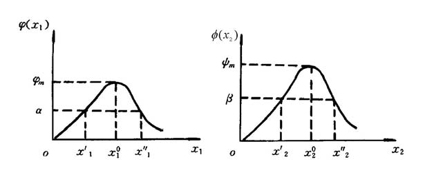

<!-- page: 277 -->

当
1x 和
2x 是正数时，由（20）所定义的曲线都是封闭的。而且，这些封闭曲线中的每

一条（除
0
1
1
x
x =
和
0
2
2
x
x =
以外）， 都不含（17）和（18）的任何平衡点。所以（17）

和（18）的具有初始条件
0
)
0
(
1
>
x
，
0
)
0
(
2
>
x
的所有的解
)
(
1 t
x
，
)
(
2 t
x
都是时间的

周期函数。也就是说，（17）和（18）的具有初始条件
0
)
0
(
1
>
x
，
0
)
0
(
2
>
x
的每一个

解
)
(
1 t
x
，
)
(
2 t
x
都具有这样的性质：
)
(
)
(
1
1
t
x
T
t
x
=
+
，
)
(
)
(
2
2
t
x
T
t
x
=
+
，其中T 是某
一正数。

D'Ancona 所用的数据实际上是捕食者的百分比
在每一年中的平均值。因此，为了把这些数据同方程
组（17）和（18）的结果进行比较，对于（17）和（18）
的任何解
)
(
1 t
x
，
)
(
2 t
x
，我们必须算出
)
(
1 t
x
和
)
(
2 t
x
的“平均值”。值得注意的是，即使还没有准确地求
得
)
(
1 t
x
和
)
(
2 t
x
，我们仍然能够算出这些平均值。

引理2  设
)
(
1 t
x
，
)
(
2 t
x
是（17）和（18）的周期解，其周期
0
>
T
，
)
(
1 t
x
和
)
(
2 t
x
的平均值定义为

0 1
1
)
(
1
，
∫
=

0
2
2
)
(
1

T
dt
t
x
T
x

T
dt
t
x
T
x

∫
=

这时，
0
1
1
x
x =
，
0
2
2
x
x =
。换句话说，
)
(
1 t
x
和
)
(
2 t
x
的平均值是平衡解。

t
x
λ
−
=
&
，于是

1 )
(
x
r
x

证明  把（17）的两端除以
1x ，得到
2
1
1
1

t
x
T
0
2
1
1
0
1

)
(
1
λ
&

1
)]
(
[
1
)
(

T
T
dt
t
x
r
T
dt
t
x

∫
∫
−
=

由于

t
x

)
(
&

∫
=
−
=
T
x
T
x
dt
t
x

1
0
)
0
(
ln
)
(
ln
)
(

0
1
1
1

因此，

∫
∫
=
=
T
T
r
dt
r
T
dt
t
x
T
0
1
0 1
2
1
1
)
(
1
λ
，

r
x =
。类似地，把（18）的两端除以
)
(
2 t
Tx
，由0 到T 积分，我们得到

r
x =
。

1
2
λ

2
1
λ

于是，

1

2

下面，我们考虑渔业对于上述数学模型的影响。注意到渔业使得食饵总数以速率

1x
ε
减少，而使得捕食者的总数以速率
2x
ε
减少。常数ε 反映渔业的水平；即反映了海
上的渔船数和下水的网数。因此，真实的状态由下列修正的微分方程组来描述：

λ
ε
ε
λ
&

−
−
=
−
−
=

⎩
⎨
⎧

x
x
x
r
x
x
r
x
t
x

)
(
)
(
)
(

&

2
1
1
1
1
1
2
1
1
1
1
)
(
)
(
)
(

            （23）

+
+
−
=
−
+
−
=

λ
ε
ε
λ

x
x
x
r
x
x
r
x
t
x

2
1
2
2
2
2
1
2
2
2
2

这个方程组同（17），（18）完全一样（当
0
1
>
−ε
r
时），只是其中1r 换成
ε
−
1r
，而2r

换成
ε
+
2r
。因此，现在
)
(
1 t
x
和
)
(
2 t
x
的平均值是

-177-

<!-- page: 278 -->

ε
+
= r
x
，

ε
−
= r
x

2
1
λ

1
2
λ

2

1

平均说来，中等捕鱼量
)
(
1r
<
ε
实际上会增加食饵的数目，而减少捕食者的数目。相反，
捕鱼量的降低，平均说来，会增加捕食者的数目，而减少食饵的数目。这个值得注意的
结果称为Volterra 原理，它解释了D'Ancona 的数据。

值得注意的是Volterra 模型是非常粗糙的，有兴趣的读者可以作进一步的探讨。

习 题 十 四
1. 单棵树木的商品价值V 是由这棵树能够生产的木材体积和质量所决定的。显然
)
(t
V
V =
依赖于树木的年龄t 。假设曲线
)
(t
V
已知，c 为树木砍伐成本。试给出砍伐
树木（更确切地说砍伐相同年龄的树木）的最优年龄。如果考虑到森林轮种问题，即一
旦树木从某一处砍掉，这块土地便可以种植新树，假定各轮种周期具有相等的长度，试
建模讨论最优砍伐轮种的森林管理策略的问题。

2. 如果两个种群都能独立生存，共处时又能相互提供食物，试建立种群依存模型
并讨论平衡点及稳定性，解释稳定的意义。

3. 如果两个种群都不能独立生存，但共处时可以相互提供食物，试建模以讨论共
处的可能性。

4. 如果在食饵—捕食者系统中，捕食者掠夺的对象只是成年的食饵，而未成年的
食饵因体积太小免遭捕获。在适当的假设下建立这三者之间关系的模型，求平衡点。

-178-

<!-- page: 279 -->

第十五章  常微分方程的解法

建立微分方程只是解决问题的第一步，通常需要求出方程的解来说明实际现象，并
加以检验。如果能得到解析形式的解固然是便于分析和应用的，但是我们知道，只有线
性常系数微分方程，并且自由项是某些特殊类型的函数时，才可以肯定得到这样的解，
而绝大多数变系数方程、非线性方程都是所谓“解不出来”的，即使看起来非常简单的

方程如
2
2
x
y
dx
dy
+
=
，于是对于用微分方程解决实际问题来说，数值解法就是一个十

分重要的手段。
§1  常微分方程的离散化

下面主要讨论一阶常微分方程的初值问题，其一般形式是

⎪⎨
⎧

b
x
a
y
x
f
dx
dy

≤
≤
=

)
,
(

                             (1)

⎪⎩

=

y
a
y

0
)
(

在下面的讨论中，我们总假定函数
)
,
(
y
x
f
连续，且关于y 满足李普希兹(Lipschitz)条
件，即存在常数L ，使得
|
|
|)
,
(
)
,
(
|
y
y
L
y
x
f
y
x
f
−
≤
−
这样，由常微分方程理论知，初值问题(1)的解必定存在唯一。

所谓数值解法，就是求问题（1）的解
)
(x
y
在若干点

b
x
x
x
x
a
N =
<
<
<
<
=
L
2
1
0

处的近似值
)
,
,2,1
(
N
n
yn
L
=
的方法，
)
,
,2,1
(
N
n
yn
L
=
称为问题（1）的数值解，

n
n
n
x
x
h
−
=
+1
称为由
nx 到
1
+
nx
的步长。今后如无特别说明，我们总取步长为常量h 。

建立数值解法，首先要将微分方程离散化，一般采用以下几种方法：
（i）用差商近似导数

x
y
x
y
n
n
)
(
)
(
1 −
+
代替
)
('
nx
y
代入（1）中的微分方程，则得

若用向前差商
h

)
,1,0
(
))
(
,
(
)
(
)
(
1
L
=
≈
−
+
n
x
y
x
f
h

x
y
x
y

n
n
n
n

化简得

))
(
,
(
)
(
)
(
1
n
n
n
n
x
y
x
hf
x
y
x
y
+
≈
+

如果用
)
(
nx
y
的近似值
ny 代入上式右端，所得结果作为
)
(
1
+
nx
y
的近似值，记为
1
+
ny
，

则有
)
,1,0
(
)
,
(
1
L
=
+
=
+
n
y
x
hf
y
y
n
n
n
n
                        （2）

这样，问题（1）的近似解可通过求解下述问题

=
+
=
+

⎩
⎨
⎧

n
y
x
hf
y
y
n
n
n
n
L

)
,1,0
(
)
,
(

1
a
y
y

                        （3）

=

)
(

0

得到，按式（3）由初值
0y 可逐次算出
L
,
,
2
1 y
y
。式（3）是个离散化的问题，称为差

分方程初值问题。

-179-

<!-- page: 280 -->

需要说明的是，用不同的差商近似导数，将得到不同的计算公式。
（ii）用数值积分方法

将问题（1）的解表成积分形式，用数值积分方法离散化。例如，对微分方程两端
积分，得

x

∫

+
=
=
−
+

1
)
,1,0
(
))
(
,
(
)
(
)
(
1

n

x
n
n
n
dx
x
y
x
f
x
y
x
y
L               (4)

n

右边的积分用矩形公式或梯形公式计算。

（iii）Taylor 多项式近似
将函数
)
(x
y
在
nx 处展开，取一次Taylor 多项式近似，则得

))
(
,
(
)
(
)
('
)
(
)
(
1
n
n
n
n
n
n
x
y
x
hf
x
y
x
hy
x
y
x
y
+
=
+
≈
+

再将
)
(
nx
y
的近似值
ny 代入上式右端，所得结果作为
)
(
1
+
nx
y
的近似值
1
+
ny
，得到离

散化的计算公式
)
,
(
1
n
n
n
n
y
x
hf
y
y
+
=
+

以上三种方法都是将微分方程离散化的常用方法，每一类方法又可导出不同形式的
计算公式。其中的Taylor 展开法，不仅可以得到求数值解的公式，而且容易估计截断
误差。

§2 欧拉（Euler）方法

2.1  Euler 方法
Euler 方法就是用差分方程初值问题（3）的解来近似微分方程初值问题（1）的解，
即由公式（3）依次算出
)
(
nx
y
的近似值
)
,2,1
(
L
=
n
yn
。这组公式求问题（1）的数值

解称为向前Euler 公式。

)
(
)
(
)
('
1
1
−
≈
+
+
，

x
y
x
y
x
y
n
n
n

如果在微分方程离散化时，用向后差商代替导数，即
h

则得计算公式

=
+
=
+
+
+

⎩
⎨
⎧

n
y
x
hf
y
y
n
n
n
n
L

)
,1,0
(
)
,
(

1
1
1
a
y
y

                （5）

=

)
(

0

用这组公式求问题（1）的数值解称为向后Euler 公式。

向后Euler 法与Euler 法形式上相似，但实际计算时却复杂得多。向前Euler 公式
是显式的，可直接求解。向后Euler 公式的右端含有
1
+
ny
，因此是隐式公式，一般要用

迭代法求解，迭代公式通常为

⎪⎨
⎧

+
=

)
0
(

y
x
hf
y
y

)
,
(

+

1
L
k
y
x
hf
y
y

n
n
n
n
           （6）

⎪⎩

+
+
+
+

=
+
=

k
n
n
n
k
n

1
1
)
1
(

)
(

)
,2,1,0
(
)
,
(

1

2.2  Euler 方法的误差估计
    对于向前Euler 公式（3）我们看到，当
L
,2,1
=
n
时公式右端的
ny 都是近似的，

所以用它计算的
1
+
ny
会有累积误差，分析累积误差比较复杂，这里先讨论比较简单的

所谓局部截断误差。

假定用（3）式时右端的
ny 没有误差，即
)
(
n
n
x
y
y =
，那么由此算出

))
(
,
(
)
(
1
n
n
n
n
x
y
x
hf
x
y
y
+
=
+
                            （7）

-180-

<!-- page: 281 -->

局部截断误差指的是，按（7）式计算由
nx 到
1
+
nx
这一步的计算值
1
+
ny
与精确值
)
(
1
+
nx
y

之差
1
1)
(
+
+
−
n
n
y
x
y
。为了估计它，由Taylor 展开得到的精确值
)
(
1
+
nx
y
是

)
(
)
(''
2
)
('
)
(
)
(
3
2

1
h
O
x
y
h
x
hy
x
y
x
y
n
n
n
n
+
+
+
=
+
              （8）

（7）、（8）两式相减（注意到
)
,
(
'
y
x
f
y =
）得

)
(
)
(
)
(''
2
)
(
2
3
2

1
1
h
O
h
O
x
y
h
y
x
y
n
n
n
≈
+
=
−
+
+
                 （9）

即局部截断误差是
2
h 阶的，而数值算法的精度定义为：

若一种算法的局部截断误差为
)
(
1
+
p
h
O
，则称该算法具有p 阶精度。
显然p 越大，方法的精度越高。式（9）说明，向前Euler 方法是一阶方法，因此
它的精度不高。
§3  改进的Euler 方法

3.1  梯形公式
利用数值积分方法将微分方程离散化时，若用梯形公式计算式(4)中之右端积分，
即

x
x
y
x
f
x
y
x
f
h
dx
x
y
x
f
n

x

1
+
+
+
≈
∫

+

))]
(
,
(
))
(
,
(
[
2
))
(
,
(
1
1

n
n
n
n

n

并用
1
,
+
n
n y
y
代替
)
(
),
(
1
+
n
n
x
y
x
y
，则得计算公式

)]
,
(
)
,
(
[
2
1
1
1
+
+
+
+
+
=
n
n
n
n
n
n
y
x
f
y
x
f
h
y
y

这就是求解初值问题（1）的梯形公式。

直观上容易看出，用梯形公式计算数值积分要比矩形公式好。梯形公式为二阶方法。
梯形公式也是隐式格式，一般需用迭代法求解，迭代公式为

⎧

+
=

)
0
(

y
x
hf
y
y

)
,
(

+

n
n
n
n

1

⎪⎪
⎨

y
x
f
y
x
f
h
y
y

+
+
+
+

+
+
=

k
n
n
n
n
n
k
n

1
1
)
1
(

)
(

)]
,
(
)
,
(
[
2

                  (10)

1

⎪
⎪
⎩

=

)
,2,1,0
(

L
k

由于函数
)
,
(
y
x
f
关于y 满足Lipschitz 条件，容易看出

1
−
+
+
+
+
+
−
≤
−
k
n
k
n
k
n
k
n
y
y
hL
y
y

|
|
2
|
|
)
1
(

1
)
1
(

1
)
(

1
)
(

其中L 为Lipschitz 常数。因此，当
1
2
0
<
< hL
时，迭代收敛。但这样做计算量较大。

如果实际计算时精度要求不太高，用公式（10）求解时，每步可以只迭代一次，由此导
出一种新的方法—改进Euler 法。

3.2  改进Euler 法
按式（5）计算问题（1）的数值解时，如果每步只迭代一次，相当于将Euler 公式
与梯形公式结合使用：先用Euler 公式求
1
+
ny
的一个初步近似值
1
+
ny
，称为预测值，然

后用梯形公式校正求得近似值
1
+
ny
，即

-181-

<!-- page: 282 -->

+
=

⎪⎨
⎧

y
x
hf
y
y

)
,
(

预测

+

n
n
n
n

1

               （11）

y
x
f
y
x
f
h
y
y

+
+
=

 ] )
,
(
)
,
(
[
2

校正

⎪⎩

+
+
+

n
n
n
n
n
n

1
1
1

式（11）称为由Euler 公式和梯形公式得到的预测—校正系统，也叫改进Euler 法。

为便于编制程序上机，式（11）常改写成

⎧

⎪
⎪

+
=

y
x
hf
y
y

)
,
(

n
n
n
p

+
+
=

y
h
x
hf
y
y

)
,
(

⎨

                               （12）

p
n
n
q

⎪
⎪

+
)
(
2
1

+
=

y
y
y

1
q
p
n

⎩

改进Euler 法是二阶方法。
§4  龙格—库塔（Runge—Kutta）方法

回到Euler 方法的基本思想—用差商代替导数—上来。实际上，按照微分中值定理
应有

1
0
),
('
)
(
)
(
1
<
<
+
=
−
+
θ
θh
x
y
h

x
y
x
y

n
n
n

注意到方程
)
,
(
'
y
x
f
y =
就有

))
(
,
(
)
(
)
(
1
h
x
y
h
x
hf
x
y
x
y
n
n
n
n
θ
θ
+
+
+
=
+
                 （13）

不妨记
))
(
,
(
h
x
y
h
x
f
K
n
n
θ
θ
+
+
=
，称为区间
]
,
[
1
+
n
n x
x
上的平均斜率。可见给出一种

斜率K ，（13）式就对应地导出一种算法。

向前Euler 公式简单地取
)
,
(
n
n y
x
f
为K ，精度自然很低。改进的Euler 公式可理

解为K 取
)
,
(
n
n y
x
f
，
)
,
(
1
1
+
+
n
n
y
x
f
的平均值，其中
)
,
(
1
n
n
n
n
y
x
hf
y
y
+
=
+
，这种处

理提高了精度。

如上分析启示我们，在区间
]
,
[
1
+
n
n x
x
内多取几个点，将它们的斜率加权平均作为

K ，就有可能构造出精度更高的计算公式。这就是龙格—库塔方法的基本思想。

4.1  首先不妨在区间
]
,
[
1
+
n
n x
x
内仍取2 个点，仿照（13）式用以下形式试一下

+
+
=
+

λ
λ

⎧

k
k
h
y
y

)
(

n
n

2
2
1
1
1

⎪⎨

=

y
x
f
k

)
,
(

              （14）

1

n
n

⎪⎩

<
<
+
+
=

β
α
β
α

hk
y
h
x
f
k

1
,
0
),
,
(

1
2

n
n

其中
β
α
λ
λ
,
,
,
2
1
为待定系数，看看如何确定它们使（14）式的精度尽量高。为此我们

分析局部截断误差
1
1)
(
+
+
−
n
n
y
x
y
，因为
)
(
n
n
x
y
y =
，所以（14）可以化为

-182-

<!-- page: 283 -->

⎧

+
+
=
+

λ
λ

k
k
h
x
y
y

)
(
)
(

n
n

2
2
1
1
1

⎪⎪
⎪

=
=

x
y
x
y
x
f
k

)
('
))
(
,
(

1

n
n
n

+
+
=

β
α

hk
x
y
h
x
f
k

)
)
(
,
(

⎨

                      （15）

1
2

n
n

⎪
⎪
⎪

+
=

α

))
(
,
(
))
(
,
(

x
y
x
hf
x
y
x
f

n
n
x
n
n

+
+

β

2
1

)
(
))
(
,
(

h
O
x
y
x
f
hk

⎩

n
n
y

其中
2k 在点
))
(
,
(
n
n
x
y
x
作了Taylor 展开。（15）式又可表为

β
α
λ
λ
λ

)
(
)
(
)
('
)
(
)
(
3
2
2
2
1
1
h
O
ff
f
h
x
hy
x
y
y
y
x
n
n
n
+
+
+
+
+
=
+
α

注意到

)
(
)
(''
2
)
('
)
(
)
(
3
2

1
h
O
x
y
h
x
hy
x
y
x
y
n
n
n
n
+
+
+
=
+

中
f
y =
'
，
y
x
ff
f
y
+
=
''
，可见为使误差
)
(
)
(
3
1
1
h
O
y
x
y
n
n
=
−
+
+
，只须令

β
                          （16）

1
2
1
=
+ λ
λ
，
2
1

2
=
α
λ
，
1
=
α

待定系数满足（16）的（15）式称为2 阶龙格—库塔公式。由于（16）式有4 个未知数

而只有3 个方程，所以解不唯一。不难发现，若令
2
1

2
1
=
= λ
λ
 ，
1
=
= β
α
，即为改

进的Euler 公式。可以证明，在
]
,
[
1
+
n
n x
x
内只取2 点的龙格—库塔公式精度最高为2

阶。

4.2  4 阶龙格—库塔公式
要进一步提高精度，必须取更多的点，如取4 点构造如下形式的公式：

λ
λ
λ
λ

+
+
+
+
=
+

⎧

)
(

k
k
k
k
h
y
y

n
n

4
4
3
3
2
2
1
1
1

⎪⎪
⎪

=

y
x
f
k

)
,
(

1

n
n

+
+
=

β
α

hk
y
h
x
f
k

)
,
(

⎨

              （17）

n
n

1
1
1
2

⎪
⎪
⎪

+
+
+
=

β
β
α

hk
hk
y
h
x
f
k

)
,
(

n
n

2
3
1
2
2
3

β
β
β
α

+
+
+
+
=

)
,
(

hk
hk
hk
y
h
x
f
k

⎩

3
6
2
5
1
4
3
4

n
n

其中待定系数
i
i
i
β
α
λ
,
,
共13 个，经过与推导2 阶龙格—库塔公式类似、但更复杂的计

算，得到使局部误差
)
(
)
(
5
1
1
h
O
y
x
y
n
n
=
−
+
+
的11 个方程。取既满足这些方程、又较简

单的一组
i
i
i
β
α
λ
,
,
，可得

-183-

<!-- page: 284 -->

⎧

k
k
k
k
h
y

+
+
+
=
+

)
2
2
(
6

⎪⎪
⎪
⎪
⎪

n

4
3
2
1
1

=

y
x
f
k

)
,
(

1

n
n

hk
y
h
x
f
k

+
+
=

1
2

)
2
,
2
(

⎨

                          （18）

n
n

⎪⎪
⎪
⎪
⎪

hk
y
h
x
f
k

+
+
=

2
3

)
2
,
2
(

n
n

+
+
=

hk
y
h
x
f
k

)
,
(

⎩

3
4

n
n

这就是常用的4 阶龙格—库塔方法（简称RK 方法）。
§5  线性多步法

以上所介绍的各种数值解法都是单步法，这是因为它们在计算
1
+
ny
时，都只用到

前一步的值
ny ，单步法的一般形式是

)1
,
,1,0
(
)
,
,
(
1
−
=
+
=
+
N
n
h
y
x
h
y
y
n
n
n
n
L
ϕ
                 （19）

其中
)
,
,
(
h
y
x
ϕ
称为增量函数，例如Euler 方法的增量函数为
)
,
(
y
x
f
，改进Euler 法的
增量函数为

))]
,
(
,
(
)
,
(
[
2
1
)
,
,
(
y
x
hf
y
h
x
f
y
x
f
h
y
x
+
+
+
=
ϕ

如何通过较多地利用前面的已知信息，如
r
n
n
n
y
y
y
−
−
,
,
,
1 L
，来构造高精度的算法

计算
1
+
ny
，这就是多步法的基本思想。经常使用的是线性多步法。

让我们试验一下
1
=
r
，即利用
1
,
−
n
n y
y
计算
1
+
ny
的情况。

从用数值积分方法离散化方程的（4）式

x

∫

+
=
−
+

1
))
(
,
(
)
(
)
(
1

n

x
n
n
dx
x
y
x
f
x
y
x
y

n

出发，记
n
n
n
f
y
x
f
=
)
,
(
，
1
1
1
)
,
(
−
−
−
=
n
n
n
f
y
x
f
，式中被积函数
))
(
,
(
x
y
x
f
用二节点
)
,
(
1
1
−
−
n
n
f
x
，
)
,
(
n
n f
x
的插值公式得到（因
)
nx
x ≥
，所以是外插。

−
−
+
−
−
=

x
x
f
x
y
x
f

x
x
f
x
x

−

n
n

n
n
n
n

1

))
(
,
(

−
−
−

1
1
1

x
x

n
n

                   （20）

]
)
(
)
[(
1

−
−
−
=

f
x
x
f
x
x
h

−
−

n
n
n
n

1
1

此式在区间
]
,
[
1
+
n
n x
x
上积分可得

1
2
2
3
))
(
,
(
1
−
−
=
∫

x
f
h
f
h
dx
x
y
x
f
n

x

+

n
n

n

于是得到

)
3
(
2
1
1
−
+
−
+
=
n
n
n
n
f
f
h
y
y
                             （21）

注意到插值公式（20）的误差项含因子
)
)(
(
1
n
n
x
x
x
x
−
−
−
，在区间
]
,
[
1
+
n
n x
x
上积分后

-184-

<!-- page: 285 -->

得出
3
h ，故公式（21）的局部截断误差为
)
(
3
h
O
，精度比向前Euler 公式提高1 阶。

若取
L
,3,2
=
r
可以用类似的方法推导公式，如对于
3
=
r
有

)
9
37
59
55
(
24
3
2
1
1
−
−
−
+
−
+
−
+
=
n
n
n
n
n
n
f
f
f
f
h
y
y
                 （22）

其局部截断误差为
)
(
5
h
O
。

如果将上面代替被积函数
))
(
,
(
x
y
x
f
用的插值公式由外插改为内插，可进一步减

小误差。内插法用的是
1
1
,
,
,
+
−
+
r
n
n
n
y
y
y
L
，取
1
=
r
时得到的是梯形公式，取
3
=
r
时

可得

)
5
19
9
(
24
2
1
1
1
−
−
+
+
+
−
+
+
=
n
n
n
n
n
n
f
f
f
f
h
y
y
                   （23）

与（22）式相比，虽然其局部截断误差仍为
)
(
5
h
O
，但因它的各项系数（绝对值）大

为减小，误差还是小了。当然，（23）式右端的
1
+
nf
未知，需要如同向后Euler 公式一

样，用迭代或校正的办法处理。
§6 一阶微分方程组与高阶微分方程的数值解法

6.1  一阶微分方程组的数值解法
设有一阶微分方程组的初值问题

=

⎩
⎨
⎧

y
y
y
x
f
y
L

)
,
,
,
,
(
'

m
i
i

2
1
)
(

)
,
,2,1
(
m
i
L
=
               （24）

=

y
a
y

i
i

0

若记
T
m
y
y
y
y
)
,
,
,
(
2
1
L
=
，
T
m
y
y
y
y
)
,
,
,
(
0
20
10
0
L
=
，
T
mf
f
f
f
)
,
,
,
(
2
1
L
=
，则初值

问题（24）可写成如下向量形式

=

⎩
⎨
⎧

y
x
f
y

)
,
(
'

                                     （25）

=

y
a
y

0
)
(

如果向量函数
)
,
(
y
x
f
在区域D ：

m
R
y
b
x
a
∈
≤
≤
,

连续，且关于y 满足Lipschitz 条件，即存在
0
>
L
，使得对
]
,
[
b
a
x ∈
∀
，
m
R
y
y
∈
2
1,
，
都有

2
1
2
1
)
,
(
)
,
(
y
y
L
y
x
f
y
x
f
−
≤
−

那么问题（25）在
]
,
[
b
a
上存在唯一解
)
(x
y
y =
。
问题（25）与（1）形式上完全相同，故对初值问题（1）所建立的各种数值解法可
全部用于求解问题（25）。

6.2  高阶微分方程的数值解法
高阶微分方程的初值问题可以通过变量代换化为一阶微分方程组初值问题。
设有m 阶常微分方程初值问题

⎩
⎨
⎧

−

≤
≤
=

)
1
(
)
(

m
m

b
x
a
y
y
y
x
f
y

)
,
,'
,
,
(

L

             （26）

−
−

=
=
=

)
1
(
0
)
1
(
)
1
(
0
0

m
m

y
a
y
y
a
y
y
a
y

)
(
,
,
)
('
,
)
(

L

引入新变量
)
1
(
2
1
,
,'
,
−
=
=
=
m
m
y
y
y
y
y
y
L
，问题（26）就化为一阶微分方程初值问题

-185-

<!-- page: 286 -->

⎧

=
=

y
a
y
y
y

)
(
'

0
1
2
1

⎪⎪
⎪

=
=

)
1
(
0
2
3
2

y
a
y
y
y

)
(
'

⎨

M
M
                   （27）

⎪
⎪
⎪

−
−
−

=
=

m
m
m
m

)
2
(
0
1
1

y
a
y
y
y

)
(
'

−

=
=

m
m
m
m

)
1
(
0
1

y
a
y
y
y
x
f
y

)
(
)
,
,
,
(
'

L

⎩

然后用6.1 中的数值方法求解问题（27），就可以得到问题（26）的数值解。

最后需要指出的是，在化学工程及自动控制等领域中，所涉及的常微分方程组初值
问题常常是所谓的“刚性”问题。具体地说，对一阶线性微分方程组

)
(x
Ay
dx
dy
Φ
+
=
                                  （28）

其中
A
R
y
m,
,
∈
Φ
为m 阶方阵。若矩阵A 的特征值
)
,
,2,1
(
m
i
i
L
=
λ
满足关系

)
,
,2,1
(
0
Re
m
i
i
L
=
<
λ

1
1
i
m
i
i
m
i
λ
λ

≤
≤
≤
≤
>>

|
Re
|
min
|
Re
|
max

则称方程组（28）为刚性方程组或Stiff 方程组，称数

1
1
i
m
i
i
m
i
s
λ
λ

≤
≤
≤
≤
=

|
Re
|
min
/|
Re
|
max

为刚性比。对刚性方程组，用前面所介绍的方法求解，都会遇到本质上的困难，这是由
数值方法本身的稳定性限制所决定的。理论上的分析表明，求解刚性问题所选用的数值
方法最好是对步长h 不作任何限制。
§7  Matlab 解法

7.1  Matlab 数值解
7.1.1  非刚性常微分方程的解法
Matlab 的工具箱提供了几个解非刚性常微分方程的功能函数，如ode45，ode23，
ode113，其中ode45 采用四五阶RK 方法，是解非刚性常微分方程的首选方法，ode23
采用二三阶RK 方法，ode113 采用的是多步法，效率一般比ode45 高。

Matlab 的工具箱中没有Euler 方法的功能函数。
（I）对简单的一阶方程的初值问题

=
=

⎩
⎨
⎧

y
x
f
y

)
,
(
'

y
x
y

0
0)
(

改进的Euler 公式为

⎧

⎪
⎪

+
=

y
x
hf
y
y

)
,
(

n
n
n
p

+
+
=

y
h
x
hf
y
y

)
,
(

⎨

p
n
n
q

⎪
⎪

+
)
(
2
1

+
=

y
y
y

1
q
p
n

⎩

我们自己编写改进的Euler 方法函数eulerpro.m 如下：
function [x,y]=eulerpro(fun,x0,xfinal,y0,n);
if nargin<5,n=50;end

-186-

<!-- page: 287 -->

h=(xfinal-x0)/n;
x(1)=x0;y(1)=y0;
for i=1:n
   x(i+1)=x(i)+h;
   y1=y(i)+h*feval(fun,x(i),y(i));
   y2=y(i)+h*feval(fun,x(i+1),y1);
   y(i+1)=(y1+y2)/2;
end

例1  用改进的Euler方法求解

x
x
y
y
2
2
2
'
2 +
+
−
=
，
)
5.0
0
(
≤
≤x
，
1
)
0
(
=
y
解  编写函数文件doty.m 如下：
function f=doty(x,y);
f=-2*y+2*x^2+2*x;

在Matlab命令窗口输入：

[x,y]=eulerpro('doty',0,0.5,1,10)
即可求得数值解。

（II）ode23，ode45，ode113的使用
Matlab的函数形式是
[t,y]=solver('F',tspan，y0)
这里solver为ode45，ode23，ode113，输入参数 F 是用M文件定义的微分方程

)
,
(
'
y
x
f
y =
右端的函数。tspan=[t0,tfinal]是求解区间，y0是初值。
例2  用RK方法求解

x
x
y
y
2
2
2
'
2 +
+
−
=
，
)
5.0
0
(
≤
≤x
，
1
)
0
(
=
y
解  同样地编写函数文件doty.m 如下：
function f=doty(x,y);
f=-2*y+2*x^2+2*x;

在Matlab命令窗口输入：

[x,y]=ode45('doty',0,0.5,1)
即可求得数值解。

7.1.2  刚性常微分方程的解法
Matlab的工具箱提供了几个解刚性常微分方程的功能函数，如ode15s，ode23s，
ode23t，ode23tb，这些函数的使用同上述非刚性微分方程的功能函数。

7.1.3  高阶微分方程
)
,
,'
,
,
(
)
1
(
)
(
−
=
n
n
y
y
y
t
f
y
L
解法
    例3  考虑初值问题

1
)
0
(''
1
)
0
('
0
)
0
(
0
'
''
3
'''
−
=
=
=
=
−
−
y
y
y
y
y
y
y

解 （i）如果设
''
,'
,
3
2
1
y
y
y
y
y
y
=
=
=
，那么

=
=

⎧

y
y
y

0
)
0
(
'

1
2
1

⎪⎨

=
=

y
y
y

1
)
0
(
'

2
3
2

⎪⎩

−
=
+
=

y
y
y
y
y

1
)
0
(
3
'

3
1
2
3
3

初值问题可以写成
0
)
0
(
),
,
(
'
Y
Y
Y
t
F
Y
=
=
的形式，其中
]
;
;
[
3
2
1
y
y
y
Y =
。

（ii）把一阶方程组写成接受两个参数t 和y ，返回一个列向量的M 文件F.m：
   function dy=F(t,y);

-187-

<!-- page: 288 -->

dy=[y(2);y(3);3*y(3)+y(2)*y(1)];
注意：尽管不一定用到参数t 和y ，M—文件必须接受此两参数。这里向量dy 必须是列
向量。

（iii）用Matlab 解决此问题的函数形式为

[T,Y]=solver('F',tspan,y0)
这里solver 为ode45、ode23、ode113，输入参数F 是用M 文件定义的常微分方程组，
tspan=[t0 tfinal]是求解区间，y0 是初值列向量。在Matlab 命令窗口输入

[T,Y]=ode45('F',[0 1],[0;1;-1])
就得到上述常微分方程的数值解。这里Y 和时刻T 是一一对应的，Y(:,1)是初值问题的
解，Y(:,2)是解的导数，Y(:,3)是解的二阶导数。

例4  求 van der Pol 方程

0
'
)
1(
''
2
=
+
−
−
y
y
y
y
μ

的数值解，这里
0
>
μ
是一参数。

解 （i）化成常微分方程组。设
'
,
2
1
y
y
y
y
=
=
，则有

=

⎩
⎨
⎧

y
y

'

2
1
)
1(
'

−
−
=

μ

1
2
2
1
2

y
y
y
y

（ii）书写M 文件（对于
1
=
μ
）vdp1.m:
function dy=vdp1(t,y);
dy=[y(2);(1-y(1)^2)*y(2)-y(1)];

（iii）调用Matlab 函数。对于初值
0
)
0
('
,2
)
0
(
=
=
y
y
，解为
 [T,Y]=ode45('vdp1',[0 20],[2;0]);

（iv）观察结果。利用图形输出解的结果：
plot(T,Y(:,1),'-',T,Y(:,2),'--')
title('Solution of van der Pol Equation,mu=1');
xlabel('time t');
ylabel('solution y');
legend('y1','y2');

3
Solution of van der Pol Equation,mu=1

y1
y2

2

1

solution y

0

-1

-2

0
2
4
6
8
10
12
14
16
18
20
-3

time t

例5  van der Pol 方程，
1000
=
μ
（刚性）
解  (i)书写M 文件vdp1000.m:

-188-

<!-- page: 289 -->

function dy=vdp1000(t,y);
dy=[y(2);1000*(1-y(1)^2)*y(2)-y(1)];

（ii）观察结果
[t,y]=ode15s('vdp1000',[0 3000],[2;0]);
plot(t,y(:,1),'o')
title('Solution of van der Pol Equation,mu=1000');
xlabel('time t');
ylabel('solution y(:,1)');

7.2  常微分方程的解析解
在Matlab 中，符号运算工具箱提供了功能强大的求解常微分方程的符号运算命令
dsolve。常微分方程在Matlab 中按如下规定重新表达：

符号D 表示对变量的求导。Dy 表示对变量y 求一阶导数，当需要求变量的n 阶导
数时，用Dn 表示，D4y 表示对变量y 求4 阶导数。

由此，常微分方程
y
y
y
=
+
'
2
''
在Matlab 中，将写成'D2y+2*Dy=y'。
7.2.1  求解常微分方程的通解
无初边值条件的常微分方程的解就是该方程的通解。其使用格式为：

    dsolve('diff_equation')
    dsolve(' diff_equation'，'var')
式中diff_equation 为待解的常微分方程，第1 种格式将以变量t 为自变量进行求解，
第2 种格式则需定义自变量var。

例6  试解常微分方程

0
'
)
2
(
2
=
−
+
+
y
y
x
y
x
解  编写程序如下：
syms x y
diff_equ='x^2+y+(x-2*y)*Dy=0';
dsolve(diff_equ,'x')

7.2.2  求解常微分方程的初边值问题
求解带有初边值条件的常微分方程的使用格式为：

   dsolve('diff_equation'，'condition1，condition2，…'，'var')
其中condition1，condition2，… 即为微分方程的初边值条件。

例7  试求微分方程

x
y
y
=
−
''
'''
，
4
)
2
(''
,7
)1('
,8
)1(
=
=
=
y
y
y

的解。

解  编写程序如下：

y=dsolve('D3y-D2y=x','y(1)=8,Dy(1)=7,D2y(2)=4','x')
7.2.3  求解常微分方程组
求解常微分方程组的命令格式为：

dsolve('diff_equ1，diff_equ2，…'，'var')
 dsolve('diff_equ1，diff_equ2，…'，'condition1，condition2，…'，'var')
第1 种格式用于求解方程组的通解，第2 种格式可以加上初边值条件，用于具体求解。

例8  试求常微分方程组：

=
+

⎩
⎨
⎧

x
g
f

sin
3
''

=
+

x
f
g

cos
'
'

-189-

<!-- page: 290 -->

的通解和在初边值条件为
1
)
5
(
,3
)3
(
,0
)
2
('
=
=
=
g
f
f
的解。
解  编写程序如下：
clc,clear
equ1='D2f+3*g=sin(x)';
equ2='Dg+Df=cos(x)';
[general_f,general_g]=dsolve(equ1,equ2,'x')
[f,g]=dsolve(equ1,equ2,'Df(2)=0,f(3)=3,g(5)=1','x')

7.2.4  求解线性常微分方程组
（i）一阶齐次线性微分方程组

⎡
=

⎤

⎡
=

⎤

x

a
a

L

1
，

1
11

n

⎢
⎢
⎢

⎥
⎥
⎥

⎢
⎢
⎢

⎥
⎥
⎥

AX
X =
'
，

X
M

A

M
M
M

nx

a
a

L

⎣

⎦

⎣

⎦

nn
n

1

这里的’表示对t 求导数。
At
e
是它的基解矩阵。
AX
X =
'
，
0
0)
(
X
t
X
=
的解为

0
)
(
0
)
(
X
e
t
X
t
t
A
−
=
。

例9  试解初值问题

⎡

⎤

⎡
=

⎤

3
1
2

1

⎢
⎢
⎢

⎥
⎥
⎥

⎢
⎢
⎢

⎥
⎥
⎥

−
=

X
X

'
，

1
2
0

)
0
(
X

2

2
0
0

1

⎣

⎦

⎣

⎦

解  编写程序如下：
syms t
a=[2,1,3;0,2,-1;0,0,2];
x0=[1;2;1];
x=expm(a*t)*x0

（ii）非齐次线性方程组

由参数变易法可求得初值问题
)
(
'
t
f
AX
X
+
=
，
0
0)
(
X
t
X
=

的解为

t

∫

−
−
+
=

s
t
A
t
t
A
ds
s
f
e
X
e
t
X

0
)
(
)
(
)
(
0
)
(
.

t

0

例10  试解初值问题

⎡

⎤

⎡
+

⎤

⎡
=

⎤

0
0
1

0

0

⎢
⎢
⎢

⎥
⎥
⎥

⎢
⎢
⎢

⎥
⎥
⎥

⎢
⎢
⎢

⎥
⎥
⎥

−
=

X
X

)
0
(
X
。

'
，

2
1
2

0

1

t
2
cos

t
e

1
2
3

1

⎣

⎦

⎣

⎦

⎣

⎦

解  编写程序如下：
clc,clear
syms t s
a=[1,0,0;2,1,-2;3,2,1];ft=[0;0;exp(t)*cos(2*t)];
x0=[0;1;1];
x=expm(a*t)*x0+int(expm(a*(t-s))*subs(ft,s),s,0,t);
x=simple(x)

-190-

<!-- page: 291 -->

习 题 十 五
1. 用欧拉方法和龙格—库塔方法求微分方程数值解，画出解的图形，对结果进行
分析比较。

（i）
π
π
π
2
2
'
,2
2
,0
)
(
'
''
2
2
2
−
=
⎟⎠
⎞
⎜⎝
⎛
=
⎟⎠
⎞
⎜⎝
⎛
=
−
+
+
y
y
y
n
x
xy
y
x
（Bessel 方程，令

)
2
1
=
n
，精确解
x
x
y
π
2
sin
=
。

（ii）
0
)
0
('
,1
)
0
(
,0
cos
''
=
=
=
+
y
y
x
y
y
，幂级数解

L
−
+
−
+
−
=
8
6
4
2
!8
55
!6
9
!4
2
!2
1
1
x
x
x
x
y

2. 一只小船渡过宽为d 的河流，目标是起点A 正对着的另一岸B 点。已知河水
流速
1v 与船在静水中的速度
2v 之比为k 。
（i）建立小船航线的方程，求其解析解。
（ii）设
100
=
d
m，
1
1 =
v
m/s，
2
2 =
v
m/s，用数值解法求渡河所需时间、任
意时刻小船的位置及航行曲线，作图，并与解析解比较。

-191-

<!-- page: 292 -->

第十六章  差分方程模型

离散状态转移模型涉及的范围很广，可以用到各种不同的数学工具。下面我们对差
分方程作一简单的介绍，下一章我们将介绍马氏链模型。

§1  差分方程

1.1  差分方程简介
规定t 只取非负整数。记
ty 为变量y 在t 点的取值，则称
t
t
t
y
y
y
−
=
Δ
+1
为
ty 的一

阶向前差分，简称差分，称
t
t
t
t
t
t
t
y
y
y
y
y
y
y
+
−
=
Δ
−
Δ
=
Δ
Δ
=
Δ
+
+
+
1
2
1
2
2
)
(
为
ty 的二

阶差分。类似地，可以定义
ty 的n 阶差分
t
n y
Δ
。

由
ty
t、
及
ty 的差分给出的方程称为
ty 的差分方程，其中含
ty 的最高阶差分的阶

数称为该差分方程的阶。差分方程也可以写成不显含差分的形式。例如，二阶差分方程

0
2
=
+
Δ
+
Δ
t
t
t
y
y
y
也可改写成
0
1
2
=
+
−
+
+
t
t
t
y
y
y
。

满足一差分方程的序列
ty 称为差分方程的解。类似于微分方程情况，若解中含有

的独立常数的个数等于差分方程的阶数时，称此解为该差分方程的通解。若解中不含任
意常数，则称此解为满足某些初值条件的特解。

称如下形式的差分方程

)
(
1
1
0
t
b
y
a
y
a
y
a
t
n
t
n
t
n
=
+
+
+
−
+
+
L
                        （1）

为n 阶常系数线性差分方程，其中
n
a
a
a
,
,
,
1
0
L
是常数，
0
0 ≠
a
。其对应的齐次方程为
0
1
1
0
=
+
+
+
−
+
+
t
n
t
n
t
n
y
a
y
a
y
a
L
                          （2）

容易证明，若序列
)
1
(
ty
与
)
2
(
ty
均为（2）的解，则
)
2
(
2
)
1
(
1
t
t
t
y
c
y
c
y
+
=
也是方程（2）的

解，其中
2
1,c
c
为任意常数。若
)
1
(
ty
是方程（2）的解，
)
2
(
ty
是方程（1）的解，则

t
t
t
y
y
y
+
=
也是方程（1）的解。

)
2
(
)
1
(

方程（1）可用如下的代数方法求其通解：
（I）先求解对应的特征方程

0
0
1
1
0
=
+
+
+
−
a
a
a
n
n
L
λ
λ
                                 （3）

（II）根据特征根的不同情况，求齐次方程（2）的通解。
（i）若特征方程（3）有n 个互不相同的实根
n
λ
λ
,
,
1 L
，则齐次方程（2）的通解

为

t
n
n
t
c
c
λ
λ
+
+L
1
1
 （
nc
c
,
,
1 L
为任意常数）

（ii）若λ 是特征方程（3）的k 重根，通解中对应于λ 的项为
t
k
kt
c
c
λ
)
(
1
1
−
+
+L
，
)
,
,1
(
k
i
ci
L
=
为任意常数。

（iii ）若特征方程（3 ）有单重复根
i
β
α
λ
±
=
，通解中对应它们的项为

β
ϕ
arctg
=
为λ 的幅角。

t
c
t
c
t
t
ϕ
ρ
ϕ
ρ
sin
cos
2
1
+
，其中
2
2
β
α
ρ
+
=
为λ 的模，
α

（iv）若
i
β
α
λ
±
=
是特征方程（3）的k 重复根，则通解对应于它们的项为

t
t
c
c
t
t
c
c
t
k
k
k
t
k
k
ϕ
ρ
ϕ
ρ
sin
)
(
cos
)
(
1
2
1
1
1
−
+
−
+
+
+
+
+
L
L

-192-

<!-- page: 293 -->

)
2,
,1
(
k
i
ci
L
=
为任意常数。

（III）求非齐次方程（1）的一个特解
ty 。若
ty 为方程（2）的通解，则非齐次方

程（1）的通解为
t
t
y
y +
。

求非齐次方程（1）的特解一般要用到常数变易法，计算较繁。对特殊形式的
)
(t
b

也可使用待定系数法。例如，当
)
(
)
(
t
p
b
t
b
k
t
=
，
)
(t
pk
为t 的k 次多项式时可以证明：

若b 不是特征根，则非齐次方程（1）有形如
)
(t
q
b
k
t
的特解，
)
(t
qk
也是t 的k 次多项

式；若b 是r 重特征根，则方程（1）有形如
)
(t
q
t
b
k
r
t
的特解。进而可利用待定系数法

求出
)
(t
qk
，从而得到方程（1）的一个特解
ty 。

例1  求解两阶差分方程
t
y
y
t
t
=
+
+2
。

解  对应齐次方程的特征方程为
0
1
2
=
+
λ
，其特征根为
i
±
=
2
,1λ
，对应齐次方程

的通解为

t
c
t
c
yt
2
sin
2
cos
2
1
π
π
+
=

原方程有形如
b
at +
的特解。代入原方程求得
2
1
=
a
，
2
1
−
=
b
，故原方程的通解

为

2
1
2
1
2
sin
2
cos
2
1
−
+
+
t
t
c
t
c
π
π

例2  在信道上传输仅用三个字母
c
b
a
,
,
且长度为n 的词，规定有两个a 连续出现
的词不能传输，试确定这个信道容许传输的词的个数。

解  令
)
(n
h
表示容许传输且长度为n 的词的个数，
L
,2,1
=
n
，通过简单计算可

求得：
3
)1(
=
h
，
8
)
2
(
=
h
。当
3
≥
n
时，若词的第一个字母是b 或,c 则词可按
)1
( −
n
h

种方式完成；若词的第一个字母是a ，则第二个字母是b 或c ，该词剩下的部分可按

)
2
( −
n
h
种方式完成。于是，得差分方程

)
2
(
2
)1
(
2
)
(
−
+
−
=
n
h
n
h
n
h
，
)
,4,3
(
L
=
n
其特征方程为

0
2
2
2
=
−
−λ
λ
特征根

3
1
1
+
=
λ
，
3
1
2
−
=
λ
则通解为

n
n
c
c
n
h
)
3
1(
)
3
1(
)
(
2
1
−
+
+
=
，
)
,4,3
(
L
=
n

利用条件
3
)1(
=
h
，
8
)
2
(
=
h
，求得

n
n
n
h
)
3
1(
3
2
3
2
)
3
1(
3
2
3
2
)
(
−
+
−
+
+
+
=
，
)
,2,1
(
L
=
n

在应用差分方程研究问题时，我们常常需要讨论解的稳定性。对常系数非齐次线性
差分方程（1），若不论其对应齐次方程的通解中任意常数
nc
c
,
,
1 L
如何取值，在
+∞
→
t

时总有
0
→
ty
，则称方程（1）的解是稳定的。根据通解的结构不难看出，非齐次方

-193-

<!-- page: 294 -->

程（1）稳定的充要条件为其所有特征根的模均小于1。

1.2  常系数线性差分方程的Z 变换解法
常系数线性差分方程采用解析解法比较容易，而且对其解的意义也容易理解，但采
用这种解法求解常系数线性非齐次差分方程比较繁琐，通常是采用Z 变换，将差分方
程变换为代数方程去求解。

设有离散序列
)
(k
x
，
)
,2,1,0
(
L
=
k
，则
)
(k
x
的Z 变换定义为

∞

∑

−
=
=

k
z
k
x
k
x
Z
z
X
                           （4）

0
)
(
)]
(
[
)
(

=

k

其中z 是复变量。显然上式右端的级数收敛域是某个圆的外部。

)
(z
X
的Z 反变换记作

)]
(
[
)
(
1
z
X
Z
k
x
−
=
1.2.1  几个常用离散函数的Z 变换
（i）单位冲激函数
)
(k
δ
的Z 变换

∞

∑

=
−
−
=
×
=
=

k
k
k
z
z
k
k
Z
δ
δ

0
0
1
]
1[
)
(
)]
(
[

=

k

即单位冲激函数的Z 变换为1。

（ii）单位阶跃函数
)
(k
U
的Z 变换

∞

∞

∑
∑

−
−
×
=
=

k
k
z
z
k
U
k
U
Z
，

0
0
1
)
(
)]
(
[

=

=

k
k

即

z
k
U
Z

)1
|
(|
1
)]
(
[
>
−
=
z
z

（iii）单边指数函数
k
a
k
f
=
)
(
的Z 变换（a 为不等于1 的正常数）

∞

z
z
a
a
Z

∑

−
>
−
=
=

k
k
k
a
z
a
z

0
)
|
(|
]
[

=

k

1.2.2  Z 变换的性质
（i）线性性质
设
)
(
)]
(
[
1
1
z
F
k
f
Z
=
，
)
(
)]
(
[
2
2
z
F
k
f
Z
=
，则

)
(
)
(
)]
(
)
(
[
2
1
2
1
z
bF
z
aF
k
bf
k
af
Z
+
=
+

其中
b
a,
为常数。收敛域为
)
(
1 z
F
和
)
(
2 z
F
的公共区域。
（ii）平移性
设
)
(
)]
(
[
z
F
k
f
Z
=
，则

)]
0
(
)
(
[
)]
1
(
[
f
z
F
z
k
f
Z
−
=
+
，

−

N

1

0∑

−
−
=
+

k
N
z
k
f
z
F
z
N
k
f
Z
，

]
)
(
)
(
[
)]
(
[

=

k

]
)1
(
)
(
[
)]
1
(
[
1
z
f
z
F
z
k
f
Z
−
+
=
−
−
，

−

N

1

1∑

−
−
+
=
−

k
N
z
k
f
z
F
z
N
k
f
Z

]
)
(
)
(
[
)]
(
[

=

k

例3  求齐次差分方程

-194-

<!-- page: 295 -->

0
)
(
2
)1
(
3
)
2
(
=
+
+
+
+
k
x
k
x
k
x
，
0
)
0
(
=
x
，
1
)1(
=
x
的解。

解  令
)
(
)]
(
[
z
X
k
x
Z
=
，对差分方程取Z 变换，得

0
)
(
2
)
(
3
)
(
2
=
+
+
−
z
X
z
zX
z
z
X
z
，

z
z
X
，

z
z
z

z
z

2
1
2
3
)
(
2
+
−
+
=
+
+
=
z

对上式取z 反变换，便得差分方程的解为

k
k
k
x
)
2
(
)1
(
)
(
−
−
−
=
。
§2  蛛网模型

2.1  问题提出
在自由竞争的社会中，很多领域会出现循环波动的现象。在经济领域中，可以从自
由集市上某种商品的价格变化看到如下现象：在某一时期，商品的上市量大于需求，引
起价格下跌，生产者觉得该商品无利可图，转而经营其它商品；一段时间之后，随着产
量的下降，带来的供不应求又会导致价格上升，又有很多生产商会进行该商品的生产；
随之而来的，又会出现商品过剩，价格下降。在没有外界干扰的情况下，这种现象将会
反复出现。

如何从数学的角度来描述上述现象呢？
2.2  模型假设
（i）设k 时段商品数量为
kx ，其价格为
ky 。这里，把时间离散化为时段，一个时

期相当于商品的一个生产周期。

（ii）同一时段的商品的价格取决于该时段商品的数量，把

)
(
k
k
x
f
y =
                                       （5）

称之为需求函数。出于对自由经济的理解，商品的数量越多，其价格就越低，故可以假
设：需求函数为一个单调下降函数。

（iii）下一时段商品数量由上一个时段的商品的价格决定，把

)
(
1
k
k
y
g
x
=
+
                                       （6）

称之为供应函数。由于价格越高可以导致产量越大，故可假设供应函数是一个单调上升
的函数。

2.3  模型求解
在同一个坐标系中做出需求函数与供应函数的图形，设两条曲线相交于

)
,
(
0
0
0
y
x
P
，则
0P 为平衡点。因为此时
)
(
0
0
y
g
x =
，
)
(
0
0
x
f
y =
，若某个k ，有
0x
xk =
，

则可推出

0y
yl =
，
0x
xl =
，
)
,1
,
(
L
+
=
k
k
l

即商品的数量保持在
0x ，价格保持在
0y ，不妨设
0
1
x
x ≠
，下面考虑
k
k y
x ,
在图上的变

化
)
,2,1
(
L
=
k
。如下图所示，当
1x 给定后，价格
1y 由f 上的
1P

-195-

<!-- page: 296 -->

点决定，下一时段的数量
2x 由g 上的
2P 点决定，
2y 又可由f 上的
3P 点决定。依此类

推，可得一系列的点
)
,
(
1
1
1
y
x
P
，
)
,
(
1
2
2
y
x
P
，
)
,
(
2
2
3
y
x
P
，
)
,
(
2
3
4
y
x
P
，图上的箭头

表示求出
kP 的次序，由图知：

)
,
(
)
,
(
lim
0
0
0
y
x
P
y
x
Pk
k
=
+∞
→
，

即市场经济将趋于稳定。

并不是所有的需求函数和供应函数都趋于稳定，若给定的f 与g 的图形如下图所

示，得出的
L
,
,
2
1 P
P
就不趋于
0P ，此时，市场经济趋向不稳定。

上两图中的折线
L
,
,
,
4
3
3
2
2
1
P
P
P
P
P
P
形似蛛网，故把这种模型称为蛛网模型。在进

行市场经济分析中，f 取决于消费者对某种商品的需要程度及其消费水平，g 取决于
生产者的生产、管理等能力。

当已经知道需求函数和供应函数之后，可以根据f 和g 的性质判断平衡点
0P 的稳

定性。利用结论：当
|
|
0
1
x
x −
较小时，
0P 点的稳定性取决于f 与g 在
0P 点的斜率，即

当

|)
('
|
|)
('
|
0
0
y
g
x
f
<
                                   （7）

时，
0P 点稳定，当
|)
('
|
|)
('
|
0
0
y
g
x
f
>
                                   （8）

时，
0P 点不稳定。

这一结论的直观解释是：需求曲线越平，供应曲线越陡，越有利于经济稳定。

设
|)
('
|
0x
f
=
α
，
|)
('
|
1

0y
g
=
β

，在
0P 点附近取f 与g 的线性近似，由（5），（6）

式得

-196-

<!-- page: 297 -->

)
(
0
0
x
x
y
y
k
k
−
−
=
−
α
                                 （9）

)
(
0
0
1
y
y
x
x
k
k
−
=
−
+
β
                                （10）

上两式中消去
ky ，得

0
1
)
1(
x
x
x
k
k
αβ
αβ
+
+
−
=
+
                             （11）

（11）式对
L
,2,1
=
k
均成立，有

0
1
)
1(
x
x
x
k
k
αβ
αβ
+
+
−
=
+

0
1
2
)
1
)(
(
)
(
)
(
x
x
x
k
k
αβ
αβ
αβ
αβ
+
−
+
−
=
−
−

0
2
2
3
1
2
)
1(
)
(
)
(
)
(
x
x
x
k
k
αβ
αβ
αβ
αβ
+
−
+
−
=
−
−
−

               ………………………………………………

0
2
2
1
3
2
)
1(
)
(
)
(
)
(
x
x
x
k
k
k
αβ
αβ
αβ
αβ
+
−
+
−
=
−
−
−
−

0
1
1
2
1
)
1(
)
(
)
(
)
(
x
x
x
k
k
k
αβ
αβ
αβ
αβ
+
−
+
−
=
−
−
−

以上k 个式子相加，有

−
+
+
−
+
+
+
−
=
−
L

αβ
αβ
αβ
αβ

1
0
1
]
)
(
1[
)
(

k
k
k

x
x
x

]
)
(
)
(
1[
)
1(
)
(

          （12）

−
−
+
−
=

αβ
αβ

k
k

x
x

0
1

此为（11）式的解。

若
0P 是稳定点，则应有：

0
1
lim
x
xk
k
=
+
+∞
→

结合（12）式考虑，
0P 点稳定的条件是
1
<
αβ
                                      （13）
即

β
α
1
<

同理，
0P 点不稳定的条件是
1
>
αβ
                                      （14）
即

β
α
1
>

此时，
∞
=
+
+∞
→
1
lim
k
k
x
。这与（7），（8）式是一致的。

2.4  模型的修正
在上面模型假设的第（iii）点中引进了供应函数，并且知道g 取决于管理者的生产、

管理水平。如果生产者的管理水平更高一些，他们在决定该商品生产数量
1
+
kx
时，不仅

考虑了前一时期的价格
ky ，而且也考虑了价格
1
−
ky
。为了简化起见，不妨设
1
+
kx
由

)
(
2
1

1
−
+
k
k
y
y
决定，则供应函数可写成

-197-

<!-- page: 298 -->

⎥⎦
⎤
⎢⎣
⎡
+
=
−
+
)
(
2
1

1
1
k
k
k
y
y
g
x

在
0P 附近取线性近似，则有

β
                        （15）

)
2
(
2
0
1
0
1
y
y
y
x
x
k
k
k
−
+
=
−
−
+

由（9）式有
)
(
0
0
x
x
y
y
k
k
−
−
=
α

)
(
0
1
0
1
x
x
y
y
k
k
−
−
=
−
−
α

将上两式代入（15）式，整理得

0
1
1
)
1(
2
x
x
x
x
k
k
k
αβ
αβ
αβ
+
=
+
+
−
+
，
)
,3,2
(
L
=
k

这是一个二阶线性差分方程，其特征方程为

0
2
2
=
+
+
αβ
αβλ
λ
经计算，可得其特征根

αβ
αβ
αβ
λ
−
±
−
=
                          （16）

4
8
)
(
2

2
,1

结论：若方程的特征根均在单位圆内，即
1
|
|
1 <
λ
，
1
|
|
2 <
λ
，则
0P 为稳定点。

当
8
>
αβ
时，（16）式有两个实根，因

2
αβ
αβ
αβ
αβ
λ
−
<
−
−
−
=
，

4
4
8
)
(
2

则有
2
|
|
2 >
λ
，故此时
0P 不是稳定点。

当
8
<
αβ
时，（16）式有两个共轭复根，此时

2
1
2
2
2

⎡

⎤

αβ
αβ
αβ
αβ
λ
=
⎥
⎥
⎦

⎟⎠
⎞
⎜⎝
⎛
−
+
⎟⎠
⎞
⎜⎝
⎛
=

2
)
(
8
4
1
4
|
|

⎢
⎢
⎣

2
,1

要使
0P 为稳定点，只需

2
<
αβ

与（13）式相比，α 与β 的范围扩大了。这是由于经营者经营管理水平的提高带来的
结果。
§3  商品销售量预测

在利用差分方程建模研究实际问题时，常常需要根据统计数据并用最小二乘法来拟
合出差分方程的系数。其系统稳定性讨论要用到代数方程的求根。对问题的进一步研究
又常需考虑到随机因素的影响，从而用到相应的概率统计知识。

例4  某商品前5 年的销售量见表。现希望根据前5 年的统计数据预测第6 年起该
商品在各季度中的销售量。

  年份
季度
第一年   第二年   第三年   第四年   第五年

1
2
  11       12       13       15       16
  16       18       20       24       25

-198-

<!-- page: 299 -->

3
4
  25       26       27       30       32
  12       14       15       15       17

从表中可以看出，该商品在前5 年相同季节里的销售量呈增长趋势，而在同一年中
销售量先增后减，第一季度的销售量最小而第三季度的销售量最大。预测该商品以后的
销售情况，根据本例中数据的特征，可以用回归分析方法按季度建立四个经验公式，分
别用来预测以后各年同一季度的销售量。例如，如认为第一季度的销售量大体按线性增

长，可设销售量
b
at
yt
+
=
)
1
(
，由
x=[[1:5]',ones(5,1)];y=[11 12 13 15 16]';z=x\y
求得
3.1
)1(
=
= z
a
，
5.9
)
2
(
=
= z
b
。

根据
5.9
3.1
)
1
(
+
=
t
yt
，预测第六年起第一季度的销售量为
3.
17
)
1
(
6
=
y
，

6.
18
)
1(
7
=
y
，…。由于数据少，用回归分析效果不一定好。

如认为销售量并非逐年等量增长而是按前一年或前几年同期销售量的一定比例增
长的，则可建立相应的差分方程模型。仍以第一季度为例，为简单起见不再引入上标，
以
ty 表示第t 年第一季度的销售量，建立形式如下的差分公式：

2
1
1
a
y
a
y
t
t
+
=
−

或
3
2
2
1
1
a
y
a
y
a
y
t
t
t
+
+
=
−
−

等等。

上述差分方程中的系数不一定能使所有统计数据吻合，较为合理的办法是用最小二
乘法求一组总体吻合较好的数据。以建立二阶差分方程
3
2
2
1
1
a
y
a
y
a
y
t
t
t
+
+
=
−
−
为例，

选取
3
2
1
,
,
a
a
a
使

5

∑

−
−
+
+
−

2
3
2
2
1
1
)]
(
[

t
t
t
a
y
a
y
a
y

=

t

3

最小。编写Matlab 程序如下：
y0=[11 12 13 15 16]';
y=y0(3:5);x=[y0(2:4),y0(1:3),ones(3,1)];
z=x\y

求得
1
)1(
1
−
=
= z
a
，
3
)
2
(
2
=
= z
a
，
8
)3
(
3
−
=
= z
a
。即所求二阶差分方程为
8
3
2
1
−
+
−
=
−
−
t
t
t
y
y
y
。

虽然这一差分方程恰好使所有统计数据吻合，但这只是一个巧合。根据这一方程，
可迭代求出以后各年第一季度销售量的预测值
21
6 =
y
，
19
7 =
y
，…等。

上述为预测各年第一季度销售量而建立的二阶差分方程，虽然其系数与前5 年第一
季度的统计数据完全吻合，但用于预测时预测值与事实不符。凭直觉，第六年估计值明
显偏高，第七年销售量预测值甚至小于第六年。稍作分析，不难看出，如分别对每一季
度建立一差分方程，则根据统计数据拟合出的系数可能会相差甚大，但对同一种商品，
这种差异应当是微小的，故应根据统计数据建立一个共用于各个季度的差分方程。为此，
将季度编号为
20
,
,2,1
L
=
t
，令
2
4
1
a
y
a
y
t
t
+
=
−
或
3
8
2
4
1
a
y
a
y
a
y
t
t
t
+
+
=
−
−
等，利用

全体数据来拟合，求拟合得最好的系数。以二阶差分方程为例，为求
3
2
1
,
,
a
a
a
使得

-199-

<!-- page: 300 -->

20

∑

−
−
+
+
−
=

2
3
8
2
4
1
3
2
1
)]
(
[
)
,
,
(

t
t
t
a
y
a
y
a
y
a
a
a
Q

=

t

9

最小，编写Matlab 程序如下：
y0=[11 16 25 12 12 18 26 14 13 20 27 15 15 24 30 15 16 25 32 17]';
y=y0(9:20);
x=[y0(5:16),y0(1:12),ones(12,1)];
z=x\y

求得
8737
.0
)1(
1
=
= z
a
，
1941
.0
)
2
(
2
=
= z
a
，
6957
.0
)3
(
3
=
= z
a
，故求得二

阶差分方程

6957
.0
1941
.0
8737
.0
8
4
+
+
=
−
−
t
t
t
y
y
y
，
)
21
( ≥
t

根据此式迭代，可求得第六年和第七年第一季度销售量的预测值为

5869
.
17
21 =
y
，
1676
.
19
25 =
y

还是较为可信的。
§4  遗传模型

随着人类的进化，人们为了揭示生命的奥妙，越来越重视遗传学的研究，特别是遗
传特征的逐代传播，引起人们更多的注意。无论是人，还是动植物都会将本身的特征遗
传给下一代，这主要是因为后代继承了双亲的基因，形成自己的基因对，基因对将确定
后代所表现的特征。下面，我们来研究两种类型的遗传：常染色体遗传和
−
x
链遗传。
根据亲体基因遗传给后代的方式，建立模型，利用这些模型可以逐代研究一个总体基因
型的分布。

4.1  常染色体遗传模型
常染色体遗传中，后代从每个亲体的基因对中各继承一个基因，形成自己的基因对，
基因对也称为基因型。如果我们所考虑的遗传特征是由两个基因A 和a 控制的，那么
就有三种基因对，记为
aa
Aa
AA
,
,
。例如，金鱼草由两个遗传基因决定花的颜色，基
因型是AA 的金鱼草开红花，Aa 型的开粉红色花，而aa 型的开白花。又如人类眼睛
的颜色也是通过常染色体遗传控制的。基因型是AA或Aa 的人，眼睛为棕色，基因型
是aa 的人，眼睛为蓝色。这里因为AA和Aa 都表示了同一外部特征，我们认为基因A
支配基因a ，也可以认为基因a 对于A 来说是隐性的。当一个亲体的基因型为Aa ，而
另一个亲体的基因型是aa 时，那么后代可以从aa 型中得到基因a ，从Aa 型中或得到
基因A ，或得到基因a 。这样，后代基因型为Aa 或aa 的可能性相等。下面给出双亲
体基因型的所有可能的结合，以及其后代形成每种基因型的概率，如下表所示。

父体—母体的基因型

AA
AA −
Aa
AA −
aa
AA −
Aa
Aa −
aa
Aa −
aa
aa −
AA
1
1/2
0
1/4
0
0
Aa
0
1/2
1
1/2
1/2
0
后代
基因

型
aa
0
0
0
1/4
1/2
1

例5  农场的植物园中某种植物的基因型为
Aa
AA,
和aa 。农场计划采用AA型的
植物与每种基因型植物相结合的方案培育植物后代。那么经过若干年后，这种植物的任
一代的三种基因型分布如何？

（a）假设
令
L
,2,1,0
=
n
。

-200-

<!-- page: 301 -->

（i）设
n
n b
a ,
和
nc 分别表示第n 代植物中，基因型为
Aa
AA,
和aa 的植物占植物

总数的百分率。令
)
(n
x
为第n 代植物的基因型分布：

[
]

T
n
n
n
n
c
b
a
x
=
)
(

当
0
=
n
时

[
]

T
c
b
a
x
0
0
0
)
0
(
=

表示植物基因的初始分布（即培育开始时的分布），显然有

1
0
0
0
=
+
+
c
b
a

（ii）第n 代的分布与第
1
−
n
代的分布之间的关系是通过上面的表格确定的。
（b）建模
根据假设（ii），先考虑第n 代中的AA型。由于第
1
−
n
代的AA型与AA型结合，

1 ；而

后代全部是AA型；第
1
−
n
代的Aa 型与AA型结合，后代是AA型的可能性为2

第
1
−
n
代的aa 型与AA型结合，后代不可能是AA 型。因此当
L
,2,1
=
n
时

1
1
1
0
2
1
1
−
−
−
⋅
+
+
⋅
=
n
n
n
n
c
b
a
a

即

1
1
2
1

−
−+
=
n
n
n
b
a
a
                              （17）

类似可推出

1
1
2
1

−
−+
=
n
n
n
c
b
b
                               （18）

0
=
nc
                                        （19）

将（17），（18），（19）式相加，得

1
1
1
−
−
−
+
+
=
+
+
n
n
n
n
n
n
c
b
a
c
b
a

根据假设（i），有
1
0
0
0
=
+
+
=
+
+
c
b
a
c
b
a
n
n
n

对于（17），（18），（19）式，我们采用矩阵形式简记为

)
1
(
)
(
−
=
n
n
Mx
x
，
L
,2,1
=
n
                          （20）
其中

⎡

⎤

0
2
1
1

⎢
⎢
⎢
⎢
⎢
⎢

⎥
⎥
⎥
⎥
⎥
⎥

1
2
1
0

=

M

0
0
0

⎣

⎦

由（20）式递推，得

)
0
(
)
2
(
2
)
1
(
)
(
x
M
x
M
Mx
x
n
n
n
n
=
=
=
=
−
−
L
（21）
（21）式给出第n 代基因型的分布与初始分布的关系。

-201-

<!-- page: 302 -->

    编写如下Matlab 程序：
syms n a0 b0 c0
M=sym('[1,1/2,0;0,1/2,1;0,0,0]');
[p,lamda]=eig(M);
x=p*lamda.^n*p^(-1)*[a0;b0;c0]；
x=simple(x)
求得

⎧

−

n
n

1

⎟
⎠
⎞
⎜
⎝
⎛
−
⎟
⎠
⎞
⎜
⎝
⎛
−
=

2
1
2
1
1

c
b
a

⎪⎪
⎪
⎪

n

0

0

−

n
n

1

⎟⎠
⎞
⎜⎝
⎛
+
⎟⎠
⎞
⎜⎝
⎛
=

0
2
1
2
1

c
b
b

⎨

                      （22）

n

0

0

⎪
⎪
⎪
⎪

=

c

n

⎩

n

当
∞
→
n
时，
0
2
1
→
⎟
⎠
⎞
⎜
⎝
⎛

，所以从（22）式得到

1
→
n
a
，
0
→
nb
，
0
=
nc

即在极限的情况下，培育的植物都是AA 型。

（c）模型的讨论
若在上述问题中，不选用基因AA 型的植物与每一植物结合，而是将具有相同基因
型植物相结合，那么后代具有三种基因型的概率如下表所示。

父体—母体的基因型

AA
AA−
Aa
Aa −
aa
aa −
AA
1
1/4
0
Aa
0
1/2
0
后代
基因

型
aa
0
1/4
1
并且
)
0
(
)
(
x
M
x
n
n =
，其中

⎡

⎤

0
4
1
1

⎢
⎢
⎢
⎢
⎢
⎢

⎥
⎥
⎥
⎥
⎥
⎥

0
2
1
0

=

M

1
4
1
0

⎣

⎦

编写如下Matlab 程序：
syms n a0 b0 c0
M=sym('[1,1/4,0;0,1/2,0;0,1/4,1]');
[p,lamda]=eig(M);
x=p*lamda.^n*p^(-1)*[a0;b0;c0];
x=simple(x)

-202-

<!-- page: 303 -->

求得

⎧

⎡

⎤

+

n

1

⎟
⎠
⎞
⎜
⎝
⎛
−
+
=

2
1
2
1

⎪
⎪
⎪
⎪

b
a
a

⎢
⎢
⎣

⎥
⎥
⎦

n

0

0

n

⎟⎠
⎞
⎜⎝
⎛
=

2
1

b
b

⎨

                          （23）

n

0

⎪
⎪
⎪
⎪

⎡

⎤

+

n

1

⎟⎠
⎞
⎜⎝
⎛
−
+
=

2
1
2
1

b
c
c

⎢
⎢
⎣

⎥
⎥
⎦

n

0

0

⎩

当
∞
→
n
时，
0
0
2
1 b
a
an
+
→
，
0
→
nb
，
0
0
2
1 b
c
cn
+
→
。因此，如果用基因型相同

的植物培育后代，在极限情况下，后代仅具有基因AA和aa 。

4.2  常染色体隐性病模型
现在世界上已经发现的遗传病有将近4000 种。在一般情况下，遗传病与特殊的种
族、部落及群体有关。例如，遗传病库利氏贫血症的患者以居住在地中海沿岸为多，镰
状网性贫血症一般流行在黑人中，家族黑蒙性白痴症则流行在东欧犹太人中间。患者经
常未到成年就痛苦地死去，而他们的父母则是疾病的病源。假若我们能识别这些疾病的
隐性患者，并且规定两个隐性患者不能结合（因为两个隐性患者结合，他们的后代就可
能成为显性患者），那么未来的儿童，虽然有可能是隐性患者，但决不会出现显性特征，
不会受到疾病的折磨。现在，我们考虑在控制结合的情况下，如何确定后代中隐性患者
的概率。

（a）假设
（i）常染色体遗传的正常基因记为A ，不正常基因记为a ，并以
aa
Aa
AA
,
,
分别
表示正常人，隐性患者，显性患者的基因型。

（ii）设
n
n b
a ,
分别表示第n 代中基因型为
Aa
AA,
的人占总人数的百分比，记

⎡
=

⎤
⎢⎣

a
x
)
(
，
L
,2,1
=
n

n
n

⎥⎦

b

n

（iii）为使每个儿童至少有一个正常的父亲或母亲，因此隐性患者必须与正常人结
合，其后代的基因型概率由下表给出：

父母的基因型

AA
AA−
Aa
AA−
AA
1
1/2
后代
基因型
Aa
0
1/2

（b）建模
由假设（iii），从第
1
−
n
代到第n 代基因型分布的变化取决于方程

1
1
2
1

−
−+
=
n
n
n
b
a
a

1
1
2
1
0
−
−+
⋅
=
n
n
n
b
a
b

所以
)
1
(
)
(
−
=
n
n
Mx
x
，
L
,2,1
=
n
，其中

-203-

<!-- page: 304 -->

⎡

⎤

2
1
1
M

⎢
⎢
⎢

⎥
⎥
⎥

=

2
1
0

⎣

⎦

如果初始分布
)
0
(x
已知，那么第n 代基因型分布为
)
0
(
)
(
x
M
x
n
n =
，
L
,2,1
=
n
。
易知

⎧

n

⎟⎠
⎞
⎜⎝
⎛
−
=

2
1
1

b
a

⎪⎪

n

0

L
,2,1
=
n
                         （24）

⎨

n

⎟
⎠
⎞
⎜
⎝
⎛
=

⎪
⎪

2
1

b
b

n

0

⎩

当
∞
→
n
时，
1
→
n
a
，
0
→
nb
，隐性患者逐渐消失。从（24）式中可知

1
2
1

−
=
n
n
b
b

1 。

这说明每代隐性患者的概率是前一代隐性患者概率的2

（c）模型讨论
研究在随机结合的情况下，隐性患者的变化是很有意思的，但随机结合导致了非线
性化问题，超出了本章范围，然而用其它技巧，在随机结合的情况下可以把（24）式改
写为

b
b
                                     （25）

+
=

−

n
n

1

2
1
1
−

b

n

1

下面给出数值的例子：
某地区有10%的黑人是镰状网性贫血症隐性患者，如果控制结合，根据（24）式
可知下一代（大约27 年）的隐性患者将减少到5%；如果随机结合，根据（25）式，
可以预言下一代人中有9.5%是隐性患者，并且可计算出大约每出生400 个黑人孩子，
其中有一个是显性患者。

4.3
−
X
链遗传模型
−
X
链遗传是指雄性具有一个基因A 或a ，雌性具有两个基因AA，或Aa ，或aa 。
其遗传规律是雄性后代以相等概率得到母体两个基因中的一个，雌性后代从父体中得到
一个基因，并从母体的两个基因中等可能地得到一个。下面，研究与
−
X
链遗传有关
的近亲繁殖过程。

（a）假设
（i）从一对雌雄结合开始，在它们的后代中，任选雌雄各一个成配偶，然后在它
们产生的后代中任选两个结成配偶。如此继续下去。

（ii）父体与母体的基因型组成同胞对，同胞对的形式有
)
,
(
AA
A
，
)
,
(
Aa
A
，
)
,
(
aa
A
，
)
,
(
AA
a
，
)
,
(
Aa
a
，
)
,
(
aa
a
六种。初始一对雌雄的同胞对，是这六种类型
中的任一种，其后代的基因型如下表所示。

父体—母体的基因型

)
,
(
AA
A
)
,
(
Aa
A
)
,
(
aa
A
)
,
(
AA
a
)
,
(
Aa
a
)
,
(
aa
a

-204-

<!-- page: 305 -->

A
1
1/2
0
1
1/2
0
a
0
1/2
1
0
1/2
1
AA
1
1/2
0
0
0
0
Aa
0
1/2
1
1
1/2
0

后
代
基
因
型
aa
0
0
0
0
1/2
1

（iii）在每一代中，配偶的同胞对也是六种类型之一，并有确定的概率。为计算这
些概率，设
n
n
n
n
n
n
f
e
d
c
b
a
,
,
,
,
,
分别是第n 代中配偶的同胞对为
)
,
(
AA
A
，
)
,
(
Aa
A
，
)
,
(
aa
A
，
)
,
(
AA
a
，
)
,
(
Aa
a
，
)
,
(
aa
a
型的概率，
L
,1,0
=
n
。令
[
]

T
n
n
n
n
n
n
n
f
e
d
c
b
a
x
=
)
(
，
L
,1,0
=
n

（iv）如果第
1
−
n
代配偶的同胞对是
)
,
(
Aa
A
型，那么它们的雄性后代将等可能地

得到基因A 和a ，它们的雌性后代的基因型将等可能地是AA 或Aa 。又由于第n 代雌
雄结合是随机的，那么第n 代配偶的同胞对将等可能地为四种类型
)
,
(
AA
A
，
)
,
(
Aa
A
，
)
,
(
AA
a
，
)
,
(
Aa
a
之一。对于其它类型的同胞对，我们可以进行同样分析，因此有

)
1
(
)
(
−
=
n
n
Mx
x
，
L
,2,1
=
n
                           （26）
其中

⎡

⎤

0
0
0
0
4
1
1

⎢
⎢
⎢
⎢
⎢
⎢
⎢
⎢
⎢
⎢
⎢
⎢
⎢

⎥
⎥
⎥
⎥
⎥
⎥
⎥
⎥
⎥
⎥
⎥
⎥
⎥

0
4
1
1
0
4
1
0

0
4
1
0
0
0
0

=

M

0
0
0
0
4
1
0

0
4
1
0
1
4
1
0

1
4
1
0
0
0
0

⎣

⎦

从（26）式中易得

)
0
(
)
(
x
M
x
n
n =
，
L
,2,1
=
n
编写如下Matlab 程序：
syms n a0 b0 c0 d0 e0 f0
M=[1 1/4 0 0 0 0;0 1/4 0 1 1/4 0;0 0 0 0 1/4 0;
   0 1/4 0 0 0 0;0 1/4 1 0 1/4 0;0 0 0 0 1/4 1];
M=sym(M);
[p,lamda]=eig(M);
x=p*lamda.^n*p^(-1)*[a0;b0;c0;d0;e0;f0];
x=simple(x)

由上述程序计算结果可以看出

-205-

<!-- page: 306 -->

⎡

⎤

3
2
3
1
3
2
3
1
0
0
0
0
3
1
3
2
3
1
3
2

+
+
+
+

e
d
c
b
a

⎢
⎢
⎢
⎢
⎢
⎢
⎢
⎢
⎢

⎥
⎥
⎥
⎥
⎥
⎥
⎥
⎥
⎥

0
0
0
0
0

当
∞
→
n
时，

→

x n
，

)
(

+
+
+
+

f
e
d
c
b

0
0
0
0
0

⎣

⎦

因此，在极限情况下所有同胞对或者是
)
,
(
AA
A
型，或者是
)
,
(
aa
a
型。如果初始的父

母体同胞对是
)
,
(
Aa
A
型，即
1
0 =
b
，而
0
0
0
0
0
0
=
=
=
=
=
f
e
d
c
a
，于是，当
∞
→
n

时

T
n
x
⎥⎦
⎤
⎢⎣
⎡
→
3
1
0
0
0
0
3
2
)
(

2 ，是
)
,
(
aa
a
型的概率是3

1 。

即同胞对是
)
,
(
AA
A
型的概率是3

习 题 十 六
1. （汉诺塔问题）n 个大小不同的圆盘依其半径大小依次套在桩A 上，大的在下，
小的在上。现要将此n 个盘移到空桩B 或C 上，但要求一次只能移动一个盘且移动过
程中，始终保持大盘在下，小盘在上。移动过程中桩A 也可利用。设移动n 个盘的次
数为
n
a ，试建立关于
n
a 的差分方程，并求
n
a 的通项公式。

2. 设第一月初有雌雄各一的一对小兔。假定两月后长成成兔，同时（即第三月）
开始每月初产雌雄各一的一对小兔，新增小兔也按此规律繁殖。设第n 月末共有
n
F 对

兔子，试建立关于
n
F 的差分方程，并求
n
F 的通项公式。

3. 在常染色体遗传的问题中，假设植物总是和基因型是Aa 的植物结合。求在第n
代中，基因型为
Aa
AA,
和aa 的植物的百分率，并求当n 趋于无穷大时，基因型分布
的极限。

-206-

<!-- page: 307 -->

第十七章  马氏链模型
§1  随机过程的概念

一个随机试验的结果有多种可能性，在数学上用一个随机变量（或随机向量）来描
述。在许多情况下，人们不仅需要对随机现象进行一次观测，而且要进行多次，甚至接
连不断地观测它的变化过程。这就要研究无限多个，即一族随机变量。随机过程理论就
是研究随机现象变化过程的概率规律性的。

定义1  设
}
,
{
T
t
t
∈
ξ
是一族随机变量，T 是一个实数集合，若对任意实数
t
T
t
ξ,
∈

是一个随机变量，则称
}
,
{
T
t
t
∈
ξ
为随机过程。
T 称为参数集合，参数t 可以看作时间。tξ 的每一个可能取值称为随机过程的一个

状态。其全体可能取值所构成的集合称为状态空间，记作E 。当参数集合T 为非负整
数集时，随机过程又称随机序列。本章要介绍的马尔可夫链就是一类特殊的随机序列。

例1  在一条自动生产线上检验产品质量，每次取一个，“废品”记为1，“合格品”
记为0。以
n
ξ 表示第n 次检验结果，则
n
ξ 是一个随机变量。不断检验，得到一列随机

变量
L
,
,
2
1 ξ
ξ
，记为
}
,2,1
,
{
L
=
n
n
ξ
。它是一个随机序列，其状态空间
}
1,0
{
=
E
。

例2  在m 个商店联营出租照相机的业务中（顾客从其中一个商店租出，可以到m
个商店中的任意一个归还），规定一天为一个时间单位，“
j
t =
ξ
”表示“第t 天开始营

业时照相机在第j 个商店”，
m
j
,
,2,1
L
=
。则
}
,2,1
,
{
L
=
n
n
ξ
是一个随机序列，其状

态空间
}
,
,2,1
{
m
E
L
=
。
例3  统计某种商品在t 时刻的库存量，对于不同的t ，得到一族随机变量，

)}
,0
[
,
{
+∞
∈
t
tξ
是一个随机过程，状态空间
]
,0
[
R
E =
，其中R 为最大库存量。

我们用一族分布函数来描述随机过程的统计规律。一般地，一个随机过程

}
,
{
T
t
t
∈
ξ
，对于任意正整数n 及T 中任意n 个元素
nt
t
,
,
1 L
相应的随机变量

nt
t
ξ
ξ
,
,
1 L

的联合分布函数记为

n
n
≤
≤
=
ξ
ξ
L
L
L
                （1）

}
,
,
{
)
,
,
(
1
1
1
1
n
t
t
n
t
t
x
x
P
x
x
F

由于n 及
)
,
,1
(
n
i
ti
L
=
的任意性，（1）式给出了一族分布函数。记为

}
,2,1
;
,
,1
,
),
,
,
(
{
1
1
L
L
L
L
=
=
∈
n
n
i
T
t
x
x
F
i
n
t
t
n

称它为随机过程
}
,
{
T
t
t
∈
ξ
的有穷维分布函数族。它完整地描述了这一随机过程的统计

规律性。
§2  马尔可夫链

2.1  马尔可夫链的定义
现实世界中有很多这样的现象：某一系统在已知现在情况的条件下，系统未来时刻
的情况只与现在有关，而与过去的历史无直接关系。比如，研究一个商店的累计销售额，
如果现在时刻的累计销售额已知，则未来某一时刻的累计销售额与现在时刻以前的任一
时刻累计销售额无关。上节中的几个例子也均属此类。描述这类随机现象的数学模型称
为马氏模型。

定义2  设
}
,2,1
,
{
L
=
n
n
ξ
是一个随机序列，状态空间E 为有限或可列集，对于任

意的正整数
n
m,
，若
)1
,
,1
(
,
,
−
=
∈
n
k
E
i
j
i
k
L
，有

-207-

<!-- page: 308 -->

}
|
{
}
,
,
,
|
{
1
1
1
1
i
j
P
i
i
i
j
P
n
m
n
n
n
n
m
n
=
=
=
=
=
=
=
+
−
−
+
ξ
ξ
ξ
ξ
ξ
ξ
L
           （2）

则称
}
,2,1
,
{
L
=
n
n
ξ
为一个马尔可夫链（简称马氏链），（2）式称为马氏性。

事实上，可以证明若等式（2）对于
1
=
m
成立，则它对于任意的正整数m 也成立。
因此，只要当
1
=
m
时（2）式成立，就可以称随机序列
}
,2,1
,
{
L
=
n
n
ξ
具有马氏性，

即
}
,2,1
,
{
L
=
n
n
ξ
是一个马尔可夫链。

定义3  设
}
,2,1
,
{
L
=
n
n
ξ
是一个马氏链。如果等式（2）右边的条件概率与n 无

关，即

)
(
}
|
{
m
p
i
j
P
ij
n
m
n
=
=
=
+
ξ
ξ
                        （3）

则称
}
,2,1
,
{
L
=
n
n
ξ
为时齐的马氏链。称
)
(m
pij
为系统由状态i 经过m 个时间间隔（或
m 步）转移到状态j 的转移概率。（3）称为时齐性。它的含义是：系统由状态i 到状态

j 的转移概率只依赖于时间间隔的长短，与起始的时刻无关。本章介绍的马氏链假定都
是时齐的，因此省略“时齐”二字。

2.2  转移概率矩阵及柯尔莫哥洛夫定理
对于一个马尔可夫链
}
,2,1
,
{
L
=
n
n
ξ
，称以m 步转移概率
)
(m
pij
为元素的矩阵

))
(
(
)
(
m
p
m
P
ij
=
为马尔可夫链的m 步转移矩阵。当
1
=
m
时，记
P
P
=
)1(
称为马尔可

夫链的一步转移矩阵，或简称转移矩阵。它们具有下列三个基本性质：

（i）对一切
E
j
i
∈
,
，
1
)
(
0
≤
≤
m
pij
；

（ii）对一切
E
i ∈
，∑

=

ij m
p
1
)
(
；

∈

E
j

≠
=
=
=

⎩
⎨
⎧

j
i
p
ij
ij
0
,1
)
0
(
δ
。

时
当
，
j
i

（iii）对一切
E
j
i
∈
,
，

时
当

当实际问题可以用马尔可夫链来描述时，首先要确定它的状态空间及参数集合，然
后确定它的一步转移概率。关于这一概率的确定，可以由问题的内在规律得到，也可以
由过去经验给出，还可以根据观测数据来估计。

例4  某计算机机房的一台计算机经常出故障，研究者每隔15 分钟观察一次计算
机的运行状态，收集了24 小时的数据（共作97 次观察）。用1 表示正常状态，用0 表
示不正常状态，所得的数据序列如下：

1110010011111110011110111111001111111110001101101
111011011010111101110111101111110011011111100111
解  设
)
97
,
,1
(
L
=
n
X n
为第n 个时段的计算机状态，可以认为它是一个时齐马氏

链，状态空间
}
1,0
{
=
E
，编写如下Matlab 程序：
a1='1110010011111110011110111111001111111110001101101';
a2='111011011010111101110111101111110011011111100111';
a=[a1 a2];
f00=length(findstr('00',a))
f01=length(findstr('01',a))
f10=length(findstr('10',a))
f11=length(findstr('11',a))

或者把上述数据序列保存到纯文本文件data1.txt中，存放在Matlab下的work
子目录中，编写程序如下：

clc,clear

-208-

<!-- page: 309 -->

format rat
fid=fopen('data1.txt','r');
a=[];
while (~feof(fid))
    a=[a fgetl(fid)];
end
for i=0:1
    for j=0:1
        s=[int2str(i),int2str(j)];
        f(i+1,j+1)=length(findstr(s,a));
    end
end
fs=sum(f');
for i=1:2
    f(i,:)=f(i,:)/fs(i);
end
f
求得96 次状态转移的情况是：

0
0 →
，8 次；
1
0 →
，18 次；
0
1→
，18 次；
1
1→
，52 次，
因此，一步转移概率可用频率近似地表示为

13
4
18
8
8
}
0
|
0
{
1
00
=
+
≈
=
=
=
+
n
n
X
X
P
p

13
9
18
8
18
}
0
|
1
{
1
01
=
+
≈
=
=
=
+
n
n
X
X
P
p

35
9
52
18
18
}
1
|
0
{
1
10
=
+
≈
=
=
=
+
n
n
X
X
P
p

35
26
52
18
52
}
1
|
1
{
1
11
=
+
≈
=
=
=
+
n
n
X
X
P
p

例5  设一随机系统状态空间
}
4,3,2,1
{
=
E
，记录观测系统所处状态如下：
4  3  2  1  4  3  1  1  2  3
2  1  2  3  4  4  3  3  1  1
1  3  3  2  1  2  2  2  4  4
2  3  2  3  1  1  2  4  3  1
若该系统可用马氏模型描述，估计转移概率
ij
p 。

解  首先将不同类型的转移数
ij
n 统计出来分类记入下表

j
i →
转移数
ij
n

1   2   3   4
行和
in

1
2
3
4

4   4   1   1
3   2   4   2
4   4   2   1
0   1   4   2

10
11
11
7

各类转移总和∑∑

ij
n 等于观测数据中马氏链处于各种状态次数总和减1，而行和
in 是

i
j

-209-

<!-- page: 310 -->

系统从状态i 转移到其它状态的次数，
ij
n 是由状态i 到状态j 的转移次数，则
ij
p 的估

n
p =
。计算得

ij
ij
n

计值

i

⎡

⎤

7
/
2
7
/
4
7
/
1
0
11
/
1
11
/
2
11
/
4
11
/
4
11
/
2
11
/
4
11
/
2
11
/
3
10
/
1
10
/
1
5
/
2
5
/
2

⎢
⎢
⎢
⎢

⎥
⎥
⎥
⎥

ˆP

=

⎣

⎦

Matlab 计算程序如下：
format rat
clc
a=[4  3  2  1  4  3  1  1  2  3 ...
   2  1  2  3  4  4  3  3  1  1 ...
   1  3  3  2  1  2  2  2  4  4 ...
   2  3  2  3  1  1  2  4  3  1];
for i=1:4
   for j=1:4
      f(i,j)=length(findstr([i j],a));
   end
end
f
ni=(sum(f'))'
for i=1:4
   p(i,:)=f(i,:)/ni(i);
end
p

例6（带有反射壁的随机徘徊）如果在原点右边距离原点一个单位及距原点
)1
( >
s
s
个单位处各立一个弹性壁。一个质点在数轴右半部从距原点两个单位处开始随机徘徊。
每次分别以概率
)1
0
(
<
< p
p
和
)
1
(
p
q
q
−
=
向右和向左移动一个单位；若在+1 处，则

以概率p 反射到2，以概率q 停在原处；在s 处，则以概率q 反射到
1
−
s
，以概率p 停

在原处。设
n
ξ 表示徘徊n 步后的质点位置。
}
,2,1
,
{
L
=
n
n
ξ
是一个马尔可夫链，其状

态空间
}
,
,2,1
{
s
E
L
=
，写出转移矩阵P 。

≠
=
=
=

⎩
⎨
⎧

时
当
，
2
0
2
,1
}
{ 0
i
i
i
P ξ

解

时
当

=

⎧

j
q

1
,

时
当

⎪⎨

=

=

p j

1
j
p

2
,

时
当

⎪⎩

,0

其它

=

⎧

s
j
p

,

时
当

⎪⎨

=

−
=

psj

s
j
q

1
,

时
当

⎪⎩

,0

其它

-210-

<!-- page: 311 -->

=
−

⎧

i
j
p

1
,

时
当

⎪⎨

=

−
=
−
=
−

pij
L

s
i
i
j
q

)1
,
,3,2
(
1
,

时
当

⎪⎩

,0

其它

因此，P 为一个s 阶方阵，即

⎡

⎤

p
q

0
0
0
0
0
0
0
0
0
0

L
L
L

⎢
⎢
⎢
⎢
⎢
⎢
⎢

⎥
⎥
⎥
⎥
⎥
⎥
⎥

p
q

q

=

P

。

L
L
L
L
L
L

0
0
0
0
0
0
0
0

p
q

p
q

⎣

⎦

定理1 （柯尔莫哥洛夫—开普曼定理）设
}
,2,1
,
{
L
=
n
n
ξ
是一个马尔可夫链，其

状态空间
}
,2,1
{
L
=
E
，则对任意正整数
n
m,
有

∑

∈
=
+

kj
ik
ij
m
p
n
p
m
n
p
)
(
)
(
)
(

E
k

其中的
E
j
i
∈
,
。

定理2  设P 是一个马氏链转移矩阵（P 的行向量是概率向量），
)
0
(
P
是初始分布
行向量，则第n 步的概率分布为

n
n
P
P
P
)
0
(
)
(
=
。
例7  若顾客的购买是无记忆的，即已知现在顾客购买情况，未来顾客的购买情况
不受过去购买历史的影响，而只与现在购买情况有关。现在市场上供应
C
B
A
、
、
三个
不同厂家生产的50 克袋状味精，用“
1
=
n
ξ
”、“
2
=
n
ξ
”、“
3
=
n
ξ
”分别表示“顾客

第n 次购买
C
B
A
、
、
厂的味精”。显然，
}
,2,1
,
{
L
=
n
n
ξ
是一个马氏链。若已知第一

次顾客购买三个厂味精的概率依次为0.2，0.4，0.4。又知道一般顾客购买的倾向由表2
给出。求顾客第四次购买各家味精的概率。

表2

下 次 购 买

A
B
C

A
B
C

    0.8
    0.5

    0.1

     0.1

上次
购买

0.1
0.3

 0.4
     0.2

0.5

解  第一次购买的概率分布为

[
]
4.0
4.0
2.0
)
1
(
=
P

⎡
=

⎤

1.0
1.0
8.0

⎢
⎢
⎢

⎥
⎥
⎥

P

4.0
1.0
5.0

转移矩阵

2.0
3.0
5.0

⎣

⎦

则顾客第四次购买各家味精的概率为

[
]
1636
.0
136
.0
7004
.0
3
)
1
(
)
4
(
=
=
P
P
P
。
2.3  转移概率的渐近性质—极限概率分布

-211-

<!-- page: 312 -->

现在我们考虑，随n 的增大，
n
P 是否会趋于某一固定向量？先考虑一个简单例子：

⎡
=
3.0
7.0
5.0
5.0
P
，当
+∞
→
n
时，

⎤
⎢⎣

转移矩阵
⎥⎦

⎡

⎤

12
5
12
7
12
5
12
7

⎢
⎢
⎢

⎥
⎥
⎥

→

n
P

⎣

⎦

又若取
⎥⎦
⎤
⎢⎣
⎡
=
12
5
12
7
u
，则
u
uP =
，T
u 为矩阵
T
P 的对应于特征值
1
=
λ
的特征（概

率）向量，u 也称为P 的不动点向量。哪些转移矩阵具有不动点向量？为此我们给出
正则矩阵的概念。

定义４ 一个马氏链的转移矩阵P 是正则的，当且仅当存在正整数k ，使
k
P 的每
一元素都是正数。

定理３ 若P 是一个马氏链的正则阵，那么：
（i）P 有唯一的不动点向量W ，W 的每个分量为正。

（ii）P 的n 次幂
n
P （n 为正整数）随n 的增加趋于矩阵W ，W 的每一行向量均
等于不动点向量W 。

例8  信息的传播  一条新闻在
L
L
,
,
,
,
2
1
n
a
a
a
等人中间传播，传播的方式是
1a 传

给
2
a ，
2
a 传给
3a ，…如此继续下去，每次传播都是由
ia 传给
1
+
ia
。每次传播消息的失

真概率是p ，
1
0
<
< p
，即
ia 将消息传给
1
+
ia
时，传错的概率是p ，这样经过长时间

传播，第n 个人得知消息时，消息的真实程度如何？

设整个传播过程为随机转移过程，消息经过一次传播失真的概率为p ，转移矩阵

真
假

⎡
=
−
−

p
p
P
1
1

⎤

假

⎢
⎢
⎣

⎥
⎥
⎦

p
p

真

P 是正则矩阵。又设V 是初始分布，则消息经过n 次传播后，其可靠程度的概率分布

为
n
P
V ⋅
。
一般地，设时齐马氏链的状态空间为E ，如果对于所有
E
j
i
∈
,
，转移概率
)
(n
pij
存在极限

j
ij
n
n
p
π
=
∞
→
)
(
lim
，（不依赖于i ）

或

π
π
π

⎡

⎤

L
L

2
1

j

⎢
⎢
⎢
⎢
⎢
⎢

⎥
⎥
⎥
⎥
⎥
⎥

π
π
π

L
L

2
1

j

⎯
⎯
→
⎯
=
∞
→

n
n
P
n
P

)
(
)
(
，

L
L
L
L
L

π
π
π

L
L

2
1

j

L
L
L
L
L

⎣

⎦

-212-

<!-- page: 313 -->

则称此链具有遍历性。又若∑
=

j
1
π
，则同时称
)
,
,
(
2
1
L
π
π
π =
为链的极限分布。

j

下面就有限链的遍历性给出一个充分条件。
定理4  设时齐（齐次）马氏链
}
,2,1
,
{
L
=
n
n
ξ
的状态空间为
}
,
,
{ 1
N
a
a
E
L
=
，
)
(
ij
p
P =
是它的一步转移概率矩阵，如果存在正整数m ，使对任意的
E
a
a
j
i
∈
,
，都

有

0
)
(
>
m
pij
，
N
j
i
,
,2,1
,
L
=

则此链具有遍历性；且有极限分布
)
,
,
(
1
N
π
π
π
L
=
，它是方程组

N

P
π
π =
 或即
∑

1
π
π
，
N
j
,
,1 L
=

=
=

ij
i
j
p

i

的满足条件

N

1
=
∑

0
>
j
π
，
1

j
π

=

j

的唯一解。

例9  根据例7 中给出的一般顾客购买三种味精倾向的转移矩阵，预测经过长期的
多次购买之后，顾客的购买倾向如何？

解  这个马氏链的转移矩阵满足定理4 的条件，可以求出其极限概率分布。为此，
解下列方程组：

+
+
=

⎧

p
p
p
p

5.0
5.0
8.0

3
2
1
1

⎪⎪
⎨

+
+
=

p
p
p
p

3.0
1.0
1.0

3
2
1
2

+
+
=

p
p
p
p

2.0
4.0
1.0

⎪
⎪
⎩

3
2
1
3

=
+
+

p
p
p

1

3
2
1

编写如下的Matlab 程序：
format rat
p=[0.8 0.1 0.1;0.5 0.1 0.4;0.5 0.3 0.2];
a=[p'-eye(3);ones(1,3)];
b=[zeros(3,1);1];
p_limit=a\b

或者利用求转移矩阵P 的转置矩阵
T
P 的特征值1 对应的特征(概率)向量，求得极
限概率。编写程序如下：
p=[0.8 0.1 0.1;0.5 0.1 0.4;0.5 0.3 0.2];
p=sym(p');
[x,y]=eig(p)
for i=1:3
   x(:,i)=x(:,i)/sum(x(:,i));
end
x

求得
7
5

1 =
p
，
84
11

2 =
p
，
84
13

3 =
p
。

这说明，无论第一次顾客购买的情况如何，经过长期多次购买以后，A 厂产的味

-213-

<!-- page: 314 -->

11 ，84
13 。

5 ，
C
B,
两厂产品分别占有市场的84

精占有市场的7

2.4  吸收链
马氏链还有一种重要类型—吸收链。
若马氏链的转移矩阵为

4
3
2
1

⎡

⎤

4
3
2
1

1
0
0
0
4.0
3.0
3.0
0
0.3
0.2
0.3
0.2
0.4
0
0.3
0.3

⎢
⎢
⎢
⎢

⎥
⎥
⎥
⎥

，

=

P

⎣

⎦

P 的最后一行表示的是，当转移到状态4 时，将停留在状态4，状态4 称为吸收状态。

如果马氏链至少含有一个吸收状态，并且从每一个非吸收状态出发，都可以到达某
个吸收状态，那么这个马氏链被称为吸收链。

具有r 个吸收状态，
)
(
r
n
s
s
−
=
个非吸收状态的吸收链，它的
n
n ×
转移矩阵的标
准形式为

⎡
=
S
R

⎤
⎢⎣

O
I
P

r
                                    （4）

⎥⎦

其中
rI 为r 阶单位阵，O 为
s
r ×
零阵，R 为
r
s ×
矩阵，S 为
s
s ×
矩阵。从（4）得

⎡
=
n
r
n

⎤
⎢⎣

O
I
P
                                   （5）

⎥⎦

S
Q

（5）式中的子阵
n
S 表示以任何非吸收状态作为初始状态，经过n 步转移后，处于s 个
非吸收状态的概率。

在吸收链中，令
1
)
(
−
−
=
S
I
F
，则F 称为基矩阵。
对于具有标准形式（即(4)式）转移矩阵的吸收链，可以证明以下定理：
定理5  吸收链的基矩阵F 中的每个元素，表示从一个非吸收状态出发，过程到达
每个非吸收状态的平均转移次数。

定理6  设
FC
N =
，F 为吸收链的基矩阵，
[
]

T
C
1
1
1
L
=
，则N 的每个
元素表示从非吸收状态出发，到达某个吸收状态被吸收之前的平均转移次数。

定理7  设
)
(
ijb
FR
B
=
=
，其中F 为吸收链的基矩阵，R 为（4）式中的子阵，

则
ijb 表示从非吸收状态i 出发，被吸收状态j 吸收的概率。

例10  智力竞赛问题  甲、乙两队进行智力竞赛。竞赛规则规定：竞赛开始时，
甲、乙两队各记2 分，在抢答问题时，如果甲队赢得1 分，那么甲队的总分将增加1
分，同时乙队总分将减少1 分。当甲（或乙）队总分达到4 分时，竞赛结束，甲（或乙）
获胜。根据队员的智力水平，知道甲队赢得1 分的概率为p ，失去1 分的概率为
p
−
1
，
求：（i）甲队获胜的概率是多少？（ii）竞赛从开始到结束，分数转移的平均次数是多
少？（iii）甲队获得1、2、3 分的平均次数是多少？

分析  甲队得分有5 种可能，即0、1、2、3、4，分别记为状态
4
3
2
1
0
,
,
,
,
a
a
a
a
a
，

其中
0a 和
4
a 是吸收状态，
2
1,a
a
和
3a 是非吸收状态。过程是以
2
a 作为初始状态。根据

-214-

<!-- page: 315 -->

甲队赢得1 分的概率为p ，建立转移矩阵：

a
a
a
a
a

4
3
2
1
0

⎡

⎤

a

0
0
0
0
1

0

⎢
⎢
⎢
⎢
⎢
⎢

⎥
⎥
⎥
⎥
⎥
⎥

−
=

a

0
0
0
1

p
p

1

                     （6）

−

P

a

0
0
1
0

p
p

2

−

a

0
1
0
0

p
p

3

a

1
0
0
0
0

⎣

⎦

4

将（6）式改记为标准形式：

⎡
=
S
R

⎤
⎢⎣

O
I
P

2

⎥⎦

其中

⎡−

⎤

⎡

⎤

0
1

p

0
0

p

⎢
⎢
⎢

⎥
⎥
⎥

⎢
⎢
⎢

⎥
⎥
⎥

=

−
−
=

R

0
0
0

S
，

0
1
0
0
1

p
p

，

p

p

⎣

⎦

⎣

⎦

计算

⎡

⎤

−

2

1
1

p
p
pq

⎢
⎢
⎢

⎥
⎥
⎥

2
1
1
)
(

−
=
−
=
−

1
3

pq
S
I
F

p
q

−

2

pq
q
q

1

⎣

⎦

其中
p
q
−
= 1
。

因为
2
a 是初始状态，根据定理5，甲队获得1，2，3 分的平均次数为
pq
q
2
1−
，

pq
2
1
1
−

，
pq
p
2
1−
。又

⎡

⎤

−

2

1

p
p
pq

⎢
⎢
⎢

⎥
⎥
⎥

2
1
1

−
=
=

pq
FC
N

p
q

1
1

−

2

pq
q
q

⎣

⎦

[
]
2
2
2
1
2
2
1
2
1
1
p
p
pq
+
+
−
=

根据定理6，以
2
a 为初始状态，甲队最终获胜的分数转移的平均次数为
pq
2
1
2
−

。

又因为

⎡

⎤

−

3

)
1(

p
p
pq

⎢
⎢
⎢

⎥
⎥
⎥

2
1
1

−
=
=

2
2

pq
FR
B

p
q

−

3

p
pq
q

)
1(

⎣

⎦

-215-

<!-- page: 316 -->

2

根据定理7，甲队最后获胜的概率
pq
p
b
2
1

22
−
=
。

Matlab 程序如下：
syms p q
r=[q,0;0,0;0,p];
s=[0,p,0;q,0,p;0,q,0];
f=(eye(3)-s)^(-1);f=simple(f)
n=f*ones(3,1);n=simple(n)
b=f*r;b=simple(b)
§3  马尔可夫链的应用

应用马尔可夫链的计算方法进行马尔可夫分析，主要目的是根据某些变量现在的情
况及其变动趋向，来预测它在未来某特定区间可能产生的变动，作为提供某种决策的依
据。

例11（服务网点的设置问题）为适应日益扩大的旅游事业的需要，某城市的甲、
乙、丙三个照相馆组成一个联营部，联合经营出租相机的业务。游客可由甲、乙、丙三
处任何一处租出相机，用完后，还在三处中任意一处即可。估计其转移概率如下表所示：

还 相 机 处

甲
乙
丙

0.2
0.8
0.1

0.8
0
0.3

0
0.2
0.6

甲
乙
丙

租相机处

今欲选择其中之一附设相机维修点，问该点设在哪一个照相馆为最好？

解  由于旅客还相机的情况只与该次租机地点有关，而与相机以前所在的店址无
关，所以可用
n
X 表示相机第n 次被租时所在的店址；
“
1
=
n
X
”、
“
2
=
n
X
”、
“
3
=
n
X
”

分别表示相机第n 次被租用时在甲、乙、丙馆。则
}
,2,1
,
{
L
=
n
X n
是一个马尔可夫链，

其转移矩阵P 由上表给出。考虑维修点的设置地点问题，实际上要计算这一马尔可夫
链的极限概率分布。

转移矩阵满足定理4 的条件，极限概率存在，解方程组

+
+
=

⎧

p
p
p
p

1.0
8.0
2.0

3
2
1
1

⎪⎪
⎨

+
=

p
p
p

3.0
8.0

3
1
2

+
=

p
p
p

6.0
2.0

⎪
⎪
⎩

3
2
3

=
+
+

p
p
p

1

3
2
1

得极限概率
41
17

1 =
p
，
41
16

2 =
p
，
41
8

3 =
p
。

由计算看出，经过长期经营后，该联营部的每架照相机还到甲、乙、丙照相馆的概

17 、41
16 、41
8 。由于还到甲馆的照相机较多，因此维修点设在甲馆较好。但

率分别为41

由于还到乙馆的相机与还到甲馆的相差不多，若是乙的其它因素更为有利的话，比如，
交通较甲方便，便于零配件的运输，电力供应稳定等等，亦可考虑设在乙馆。

习 题 十 七

-216-

<!-- page: 317 -->

1. 在英国，工党成员的第二代加入工党的概率为0.5，加入保守党的概率为0.4，
加入自由党的概率为0.1。而保守党成员的第二代加入保守党的概率为0.7，加入工党的
概率为0.2，加入自由党的概率为0.1。而自由党成员的第二代加入保守党的概率为0.2，
加入工党的概率为0.4，加入自由党的概率为0.4。求自由党成员的第三代加入工党的概
率是多少？在经过较长的时间后，各党成员的后代加入各党派的概率分布是否具有稳定
性？

2. 社会学的某些调查结果指出：儿童受教育的水平依赖于他们父母受教育的水
平。调查过程是将人们划分为三类：E 类，这类人具有初中或初中以下的文化程度；S
类，这类人具有高中文化程度；C 类，这类人受过高等教育。当父或母（指文化程度
较高者）是这三类人中某一类型时，其子女将属于这三种类型中的任一种的概率由下面
给出

子女

C
S
E

⎡

⎤

S
E

7.0
2.0
1.0
2.0
4.0
4.0
1.0
2.0
7.0

母
或
父

⎢
⎢
⎢

⎥
⎥
⎥

C

⎣

⎦

问：（i）属于S 类的人们中，其第三代将接受高等教育的概率是多少？

（ii）假设不同的调查结果表明，如果父母之一受过高等教育，那么他们的子女总
可以进入大学，修改上面的转移矩阵。

（iii）根据（ii）的解，每一类型人的后代平均要经过多少代，最终都可以接受高
等教育？

3. 色盲是
−
X
链遗传，由两种基因A 和a 决定。男性只有一个基因A 或a ，女性
有两个基因
Aa
AA、
或aa ，当基因为a 或aa 时呈现色盲。基因遗传规律为：男性等
概率地取母亲的两个基因之一，女性取父亲的基因外又等概率地取母亲的两个基因之
一。由此可知，母亲色盲则儿子必色盲但女儿不一定。试用马氏链研究：

（i）若近亲结婚，其后代的发展趋势如何？若父亲非色盲而母亲色盲，问平均经
多少代，其后代就会变为全色盲或全不色盲，两者的概率各为多少？

（ii）若不允许双方均色盲的人结婚，情况会怎样？

-217-

<!-- page: 318 -->

第十八章  动态优化模型

动态过程的另一类问题是所谓的动态优化问题，这类问题一般要归结为求最优控制
函数使某个泛函达到极值。当控制函数可以事先确定为某种特殊的函数形式时，问题又
简化为求普通函数的极值。求解泛函极值问题的方法主要有变分法和最优控制理论方
法。
§1  变分法简介

变分法是研究泛函极值问题的一种经典数学方法，有着广泛的应用。下面先介绍变
分法的基本概念和基本结果，然后介绍动态系统最优控制问题求解的必要条件和最大值
原理。

1.1  变分法的基本概念
1.1.1  泛函
设S 为一函数集合，若对于每一个函数
S
t
x
∈
)
(
有一个实数J 与之对应，则称J 是

对应在S 上的泛函，记作
))
(
(
t
x
J
。S 称为J 的容许函数集。
通俗地说，泛函就是“函数的函数”。
例如对于xy 平面上过定点
)
,
(
1
1 y
x
A
和
)
,
(
2
2 y
x
B
的每一条光滑曲线
)
(x
y
，绕x 轴

旋转得一旋转体，旋转体的侧面积是曲线
)
(x
y
的泛函
))
(
(
x
y
J
。由微积分知识不难写
出

x

2
∫
+
=
π
                     （1）

2

dx
x
y
x
y
x
y
J

x
 )
(
'
1
)
(
2
))
(
(

1

容许函数集可表示为

}
)
(
 ,
)
(
],
,
[
)
(
|)
(
{
2
2
1
1
2
1
1
y
x
y
y
x
y
x
x
C
x
y
x
y
S
=
=
∈
=
           （2）
最简单的一类泛函表为

t

∫
=

2

t
dt
x
x
t
F
t
x
J
&
                             （3）

1
)
,
,
(
))
(
(

被积函数F 包含自变量t ，未知函数x 及导数x& 。（1）式是最简泛函。

1.1.2
泛函的极值
泛函
))
(
(
t
x
J
在
S
t
x
∈
)
(
0
取得极小值是指，对于任意一个与
)
(
0 t
x
接近的
S
t
x
∈
)
(
，都有
))
(
(
))
(
(
0 t
x
J
t
x
J
≥
。所谓接近，可以用距离
ε
<
))
(
),
(
(
0 t
x
t
x
d
来度量，

而距离定义为

t
t
t
&
&
−
−
=

|}
)
(
)
(
||,
)
(
)
(
{|
max
))
(
),
(
(
0
0
0
2
1
t
x
t
x
t
x
t
x
t
x
t
x
d

≤
≤

泛函的极大值可以类似地定义。
)
(
0 t
x
称为泛函的极值函数或极值曲线。

1.1.3
泛函的变分
如同函数的微分是增量的线性主部一样，泛函的变分是泛函增量的线性主部。作为
泛函的自变量，函数
)
(t
x
在
)
(
0 t
x
的增量记为

)
(
)
(
)
(
0 t
x
t
x
t
x
−
=
δ

也称函数的变分。由它引起的泛函的增量记作
))
(
(
))
(
)
(
(
0
0
t
x
J
t
x
t
x
J
J
−
+
=
Δ
δ

如果J
Δ
可以表为

-218-

<!-- page: 319 -->

))
(
),
(
(
))
(
),
(
(
0
0
t
x
t
x
r
t
x
t
x
L
J
δ
δ
+
=
Δ

其中L 为x
δ
的线性项，而r 是x
δ
的高阶项，则L 称为泛函在
)
(
0 t
x
的变分，记作
))
(
(
0 t
x
J
δ
。用变动的
)
(t
x
代替
)
(
0 t
x
，就有
))
(
(
t
x
J
δ
。

泛函变分的一个重要形式是它可以表为对参数α 的导数：

∂
=
α
αδ
α
δ
t
x
t
x
J
t
x
J
                       （4）

0
))
(
)
(
(
))
(
(
=
+
∂

这是因为当变分存在时，增量
)
),
(
(
)
),
(
(
))
(
(
)
)
(
(
x
t
x
r
x
t
x
L
t
x
J
x
t
x
J
J
αδ
αδ
αδ
+
=
−
+
=
Δ
根据L 和r 的性质有
)
),
(
(
)
),
(
(
x
t
x
L
x
t
x
L
δ
α
αδ
=

αδ
α

αδ

0
)
),
(
(
lim
)
),
(
(
lim

x
t
x
r
x
t
x
r
δ
αδ

0
0
=
=

→
→
x
x

α
α

所以

0
0
x
J
x
x
J
x
x
J
−
+
=
+
∂

∂

α
αδ
αδ
α
α
α

)
(
)
(
lim
)
(

→
=

α
=
=
+
=

αδ
αδ

)
(
)
,
(
)
,
(
)
,
(
lim

0
x
J
x
x
L
x
x
r
x
x
L
δ
δ
α

→

1.1.4  极值与变分
利用变分的表达式（4）可以得到泛函极值与变分的关系：
若
))
(
(
t
x
J
在
)
(
0 t
x
达到极值（极大或极小），则

0
))
(
(
0
=
t
x
J
δ
                                      （5）

这是因为对任意给定的x
δ ，
)
(
0
x
x
J
αδ
+
是变量α 的函数，该函数在
0
=
α
处达到极

值。根据函数极值的必要条件知

∂

0
)
(
0
0
=
+
∂

=
α
αδ
α
x
x
J

于是由（4）式直接得到（5）式。

1.1.5. 变分法的基本引理

引理
]
,
[
)
(
2
1 x
x
C
x ∈
ϕ
，
]
,
[
)
(
2
1
1
x
x
C
x ∈
∀η
，
0
)
(
)
(
2
1
=
=
x
x
η
η
，有
∫
≡
2

1
0
)
(
)
(
x

x
dx
x
x η
ϕ
，

则
]
,
[
  ,0
)
(
2
1 x
x
x
x
∈
≡
ϕ
。
1.2  无约束条件的泛函极值
求泛函

ft

∫
=

t
dt
t
x
t
x
t
F
J

0
))
(
),
(
,
(
&
                               （6）

的极值，一般是用泛函极值的必要条件去寻找一条曲线
)
(t
x
，使给定的二阶连续可微

函数F 沿该曲线的积分达到极值。常称这条曲线为极值曲线（或轨线），记为
)
(
* t
x
。
1.2.1 端点固定的情况
设容许曲线
)
(t
x
满足边界条件

-219-

<!-- page: 320 -->

0
0)
(
x
t
x
=
，
f
f
x
t
x
=
)
(
                                （7）

且二次可微。

首先计算（6）式的变分：

∂
=
α
αδ
α
δ
t
x
t
x
J
J

0
))
(
)
(
(
=
+
∂

∂
=

ft

         ∫
=
+
+
∂

0
0
))
(
)
(
),
(
)
(
,
(
α
αδ
αδ
α

t
dt
t
x
t
x
t
x
t
x
t
F

&
&

ft

         ∫
+
=

0
]
)
,
,
(
)
,
,
(
[
&
&
&
&
δ
δ
                        （8）

t
x
x
dt
x
x
x
t
F
x
x
x
t
F

对上式右端第二项做分布积分，并利用
0
)
(
)
( 0
=
=
ft
x
t
x
δ
δ
，有

d
dt
x
x
x
t
F

t

f
f
t

∫
∫
−
=

0
0
)
,
,
(
)
,
,
(
δ
δ
&
&
&
&
&
，

t
x
xdt
x
x
t
F
dt

t
x

再代回到（8）式，并利用泛函取极值的必要条件，有

d
F
J

ft

∫
=
−
=

0
0
]
[
δ
δ
&

t
x
x
xdt
F
dt

因为x
δ 的任意性，及
0
)
(
)
( 0
=
=
ft
x
t
x
δ
δ
，所以由基本引理得到著名的欧拉方程

d
F
&
                             （9）

0
=
−
x
x
F
dt

它是这类最简泛函取极值的必要条件。

（9）式又可记作

0
=
−
−
−
x
F
x
F
F
F
x
x
x
x
xt
x
&&
&
&&
&
&
                                （10）

通常这是
)
(t
x
的二阶微分方程，其通解的两个任意常数由（7）式中的两个端点条件确
定。

1.2.2  最简泛函的几种特殊情形
(i) F 不依赖于x& ，即
)
,
( x
t
F
F =

    这时
0
≡
x
F&
，欧拉方程为
0
)
,
(
=
x
t
Fx
，这个方程以隐函数形式给出
)
(t
x
，但它一

般不满足边界条件，因此，变分问题无解。

(ii) F 不依赖x ，即
)
,
( x
t
F
F
&
=
欧拉方程为

d

0
)
,
(
=
x
t
F
dt

x
&
&

将上式积分一次，便得首次积分
1
)
,
(
c
x
t
Fx
=
&
&
，由此可求出
)
,
(
1c
t
x
ϕ
=
&
，积分后得到

可能的极值曲线族

(
)dt
c
t
x ∫
=
1
,
ϕ

(iii) F 只依赖于x& ，即
)
(x
F
F
&
=

这时
0
,0
,0
=
=
=
x
x
xt
x
F
F
F
&
&
，欧拉方程为
0
=
x
x
F
x
&&
&&

由此可设
0
=
x&&
或
0
=
x
x
F &&
，如果
0
=
x&&
，则得到含有两个参数的直线族
2
1
c
t
c
x
+
=
。

-220-

<!-- page: 321 -->

另外若
0
=
x
x
F &&
有一个或几个实根时，则除了上面的直线族外，又得到含有一个参数c 的

直线族
c
kt
x
+
=
，它包含于上面含有两个参数的直线族
2
1
c
t
c
x
+
=
 中，于是，在
)
(x
F
F
&
=
情况下，极值曲线必然是直线族。

（iv）F 只依赖于x 和x& ，即
)
,
(
x
x
F
F
&
=

这时有
0
=
xtF &
，故欧拉方程为

0
=
−
−
x
x
x
x
x
F
x
F
x
F
&&
&
&&
&

此方程具有首次积分为

1c
F
x
F
x =
−
&
&

事实上，注意到F 不依赖于t ，于是有

d
x
F
x
x
F
x
F
F
x
F
dt

d

d
F
x
F
dt

0
)
(
)
(
=
−
=
−
−
+
=
−
x
x
x
x
x
x
x
F
dt

&
&
&
&
&
&
&
&&
&&
&
&
。

例1  (最速降线问题)最速降线问题是历史上变分法开始发展的第一个问题。它是
约翰·贝努里（J. Bernoulli）于1696 年提出的。问题的提法是这样的：设A 和B 是铅
直平面上不在同一铅直线上的两点，在所有连结A 和B 的平面曲线中，求一曲线，当
质点仅受重力作用，且初速为零，沿此曲线从A 滑行至B 时，使所需时间最短。

解  将A 点取为坐标原点，x 轴水平向右，y 轴垂直向下，B 点为
)
,
(
2
2 y
x
B
。根

ds 满足（s 为弧长）

据能量守恒定律，质点在曲线
)
(x
y
上任一点处的速度dt

2

mgy
dt
ds
m
=
⎟
⎠
⎞
⎜
⎝
⎛

2
1

将
dx
x
y
ds
)
(
'
1
2
+
=
代入上式得

y
dt
2
'
1
2
+
=

dx
gy

于是质点滑行时间应表为
)
(x
y
的泛函

+
=

2

y
x
y
J

2
'
1
))
(
(

x∫

2

dx
gy

0

端点条件为
2
2)
(
,0
)
0
(
y
x
y
y
=
=
最速降线满足欧拉方程，因为

2'
1
)'
,
(
+
=

y
y
y
F

y

不含自变量x ，所以方程（10）可写作

0
''
'
'
'
'
=
−
−
y
F
y
F
F
y
y
yy
y

等价于

d

0
)
'
(
' =
−
y
F
y
F
dx

作一次积分得

-221-

<!-- page: 322 -->

1
2 )
'
1(
c
y
y
=
+

令
,
2
'
θ
ctg
y =
则方程化为

1
2
1
2
1
θ
θ
−
=
=
+
=
c
c
y
c
y

)
cos
1(
2
2
sin
'
1

又因

θ
θ
θ

d
c

2
cos
2
sin

d
c

y
dy
dx
)
cos
1(
2
2

1
1
−
=
=
=

θ
θ
θ

'

ctg

积分之，得

2
1
)
sin
(
2
c
c
x
+
−
=
θ
θ

由边界条件
0
)
0
(
=
y
，可知
0
2 =
c
，故得

⎧

c
x

−
=

θ
θ

1

)
sin
(
2

⎪⎪
⎨

c
y

⎪⎪
⎩

−
=

θ

1

).
cos
1(
2

这是摆线（圆滚线）的参数方程，其中常数
1c 可利用另一边界条件
2
2
(
y
x
y
=
）
来确定。
例2  最小旋转面问题

x

2
∫
+
= π

2

dx
x
y
x
y
x
y
J

x
 )
(
'
1
)
(
2
))
(
(

1

}
)
(
 ,
)
(
],
,
[
|
{
2
2
1
1
2
1
1
y
x
y
y
x
y
x
x
C
y
y
S
=
=
∈
=

解  因
'
1
2
y
y
F
+
=
不包含x ，故有首次积分

y
y
y
y
y
F
y
F
y
=
+
−
+
=
−

'
'
'
1
'
c
y

2
'
'
1

1
2

化简得
2
1
'
1
y
c
y
+
=

令
sht
y =
'
，代入上式，
cht
c
t
sh
c
y
1
2
1 1
=
+
=

由于
dt
c
sht
shtdt
c
y
dy
dx
1
1
'
=
=
=

积分之，得
2
1
c
t
c
x
+
=

c
x
ch
c
y
−
=
 。

2
1
c

消去t ，就得到

1

这是悬链线方程。

1.2.3  最简泛函的推广
最简泛函取极值的必要条件可以推广到其它情况。
（ⅰ）含多个函数的泛函

-222-

<!-- page: 323 -->

使泛函

x

∫
=

2

x
dx
z
z
y
y
x
F
x
z
x
y
J

1
)'
,
,'
,
,
(
))
(
),
(
(

取极值且满足固定边界条件

.
)
(
,
)
(
,
)
(
,
)
(
2
2
1
1
2
2
1
1
z
x
z
z
x
z
y
x
y
y
x
y
=
=
=
=

的极值曲线
)
(
),
(
x
z
z
x
y
y
=
=
必满足欧拉方程组

⎧

d
F

=
−

F
dx

0

⎪⎪
⎨

y
y

'

d
F

⎪⎪
⎩

=
−

F
dx

0

'

z
z

（ii）含高阶导数的泛函
使泛函

x

∫
=

2

x
dx
y
y
y
x
F
x
y
J

1
)
"
,'
,
,
(
))
(
(

取极值且满足固定边界条件
1
1)
(
y
x
y
=
,
2
2
1
1
2
2
'
)
('
,
'
)
('
y
x
y
y
x
y
y
x
y
=
=
=
，
）
（

的极值曲线
)
(x
y
y =
必满足微分方程

2

d
F

d
F
dx

'
=
+
−
y
y
y
F
dx

0
"
2

（iii） 含多元函数的泛函

设
D
y
x
c
y
x
z
∈
∈
)
,
(,
)
,
(
2
，使泛函

∫∫
=

y
x
dxdy
z
z
z
y
x
F
y
x
z
J
)
,
,
,
,
(
))
,
(
(

D

取极值且在区域D 的边界线l 上取已知值的极值函数
)
,
(
y
x
z
z =
必满足方程

∂
−

∂
−
∂

0
=
∂

y
x
z
z
z
F
y
F
x
F

上式称为奥式方程。

1.2.4  端点变动的情况（横截条件）
设容许曲线
)
(t
x
在
0t 固定，在另一端点
ft
t =
时不固定，是沿着给定的曲线

)
(t
x
ψ
=
上变动。于是端点条件表示为

=

⎩
⎨
⎧

)
(
0
0
t
t
x

x
t
x

=

ψ

)
(
)
(

这里t 是变动的，不妨用参数形式表示为
f
f
dt
t
t
α
+
=

寻找端点变动情况的必要条件，可仿照前面端点固定情况进行推导，即有

∂
=
=
∫
α

α
αδ
αδ
α
δ
dt
x
x
x
x
t
F
J

+
+
+
∂

f
f
dt
t

0
)
,
,
(
0

t
&
&

0
=

d
F

=
=
+
+
−
= ∫
δ
δ
&
&
0
)
(
                  （11）

t

f

t
x
x
dt
F
x
F
xdt
F
dt

f
t
t
t
t
x

f
f

-223-

<!-- page: 324 -->

再对（11）式做如下分析：

（i）对每一个固定的
ft ，
)
(t
x
都满足欧拉方程，即（11）式右端的第一项积分为

零；

ft
t
x =
δ
之间的关系，因为

（ii）为考察（11）式的第二、第三项，建立
f
dt 与

)
(
)
(
)
(
f
f
f
f
f
f
dt
t
dt
t
x
dt
t
x
α
ψ
α
αδ
α
+
=
+
+
+

对α 求导并令
0
=
α
得

f
)
(
)
(
ψ
δ
&
&
=
+
=

f
f
t
t
f
f
dt
t
x
dt
t
x

即

f
)]
(
)
(
[
&
&
−
=
=
ψ
δ
                        （12）

f
f
f
t
t
dt
t
x
t
x

把（12）代入（11）并利用
f
dt 的任意性，得

0
]
)
(
[
=
−
+
= ft
t
x
F
x
F
&
&
&ψ
                           （13）

（13）式就是确定欧拉方程通解中另一常数的定解条件，称为横截条件。

横截条件有两种常见的特殊情况：
（i）当
)
(t
x
ψ
=
是垂直横轴的直线时，
ft 固定，
)
( ft
x
自由，并称
)
( ft
x
为自由

端点。此时（11）式中
0
=
f
dt
及

ft
t
x =
δ
的任意性，便得自由端点的横截条件

0
=
= ft
t
x
F&
                              （14）

（ii）当
)
(t
x
ψ
=
是平行横轴的直线时，
ft 自由，
)
( ft
x
固定，并称
)
( ft
x
为平动

端点。此时
0
=
ψ&
，（13）式的横截条件变为

0
=
−
= ft
t
x
F
x
F
&
&
                            （15）

注意，横截条件与欧拉方程联立才能构成泛函极值的必要条件。

1.3  有约束条件的泛函极值
在最优控制系统中，常常要涉及到有约束条件泛函的极值问题，其典型形式是对动
态系统

))
(
),
(
,
(
)
(
t
u
t
x
t
f
t
x
=
&
                             （16）
寻求最优性能指标（目标函数）

ft

∫
+
=

0
))
(
),
(
,
(
))
(
,
(
))
(
(
ϕ
                （17）

t
f
f
dt
t
u
t
x
t
F
t
x
t
t
u
J

其中
)
(t
u
是控制策略，
)
(t
x
是轨线，0t 固定，ft 及
)
( ft
x
自由，
n
R
t
x
∈
)
(
，
m
R
t
u
∈
)
(

（不受限，充满
m
R
空间），
F
f
,
,ϕ
连续可微。

下面推导取得目标函数极值的最优控制策略
)
(
* t
u
和最优轨线
)
(
* t
x
的必要条件。
采用拉格朗日乘子法，化条件极值为无条件极值，即考虑

ft

∫
−
+
+
=

0
)]
)
,
,
(
)(
(
)
,
,
(
[
))
(
,
(
)
,
,
(
1
&
λ
ϕ
λ
      （18）

T
f
f
dt
x
u
x
t
f
t
u
x
t
F
t
x
t
u
x
J

t

的无条件极值，首先定义（16）式和（17）式的哈密顿（Hamilton）函数为

)
,
,
(
)
(
)
,
,
(
)
,
,
,
(
u
x
t
f
t
u
x
t
F
u
x
t
H
T
λ
λ
+
=
                    （19）
将其代入（18）式，得到泛函

-224-

<!-- page: 325 -->

ft

∫
−
+
=

0
]
)
,
,
,
(
[
))
(
,
(
)
,
,
(
1
&
λ
λ
ϕ
λ
            （20）

T
f
f
dt
x
u
x
t
H
t
x
t
u
x
J

t

下面先对其求变分

∂
=

))
(
)
(
,
(
{
1
f
f
f
f
t
x
t
x
dt
t
J
αδ
α
ϕ
α
δ
+
+
∂

+
+
+
−
+
+
+
+ ∫
α

α
αδ
αδλ
λ
αδλ
λ
αδ
αδ
dt
x
x
u
u
x
x
t
H
T
dt
t

f
f
&
&

0
}
)]
(
)
(
)
,
,
,
(
[

0
=

t

[
]

f
f
f
f
t
t
T
T
f
t
t
T
f
t
T
f
t
x
T
f
x
dt
u
x
t
H
dt
dt
t
x
=
=
−
+
+
=
)
(
)
(
)
,
,
,
(
)
(
)
(
)
(
)
(
&
λ
λ
ϕ
ϕ
δ

dt
x
x
H
H
u
H
x
T
T
T
u
T
x
T
t

0
&
&
δ
λ
δλ
δλ
δ
δ
λ
−
−
+
+
+∫

f
]
)
(
)
(
)
(
)
([

t

f
f
f
t
x
T
f
t
t
t
T
f
t
x
t
u
x
t
F
dt
ϕ
δ
ϕ
+
+
=
=

)
(
)]
(
[
]
)
,
,
,
(
[
)
(

T
t
t
f
T
t

f
t

∫
∫
+
−
−
+
+
+
=

0
0
)
(
)
(
]
)
(
)
(
)
(
)
[(
λ
δ
δ
λ
δλ
δλ
δ
δ
λ
&
&

f

T
T
u
T
x
T
dt
x
x
t
dt
x
H
H
u
H
x

f

t

t

f
δ
δ
≠
=
，
f
f
f
t
t
dt
t
x
t
x
x

f
)
(
)
(
&
−
=
=
δ
δ
，因而

  注意到
)
( f
t
t
t
x
x

f
f
f
t
t
x
T
f
t
t
t
T
f
t
x
u
x
t
H
dt
J
=
=
−
+
+
=
)
(
)]
(
[
]
)
,
,
,
(
[
)
(
1
λ
ϕ
δ
λ
ϕ
δ

ft

         ∫
+
−
+
+
+

0
]
)
(
)
(
)
(
)
(
)
[(
δ
δλ
λ
δ
λ
&
&

t
u
T
T
x
T
dt
H
u
x
H
H
x

再令
0
1 =
J
δ
，由
δλ
δ
δ
δ
,
,
),
(
,
u
x
t
x
dt
f
f
的任意性，便得

（i）
*
*,λ
x
必满足正则方程：

① 状态方程
)
,
,
(
u
x
t
f
H
x
=
=
λ
&

② 协态方程
x
H
−
=
λ&
。

（ii）哈密顿函数
)
,
,
,
(
*
*
λ
u
x
t
H
作为u 的函数，也必满足

0
=
u
H

并由此方程求得
*
u 。

（iii）求
*
*
*
,
,
u
x λ
时，必利用边界条件

①
0
0)
(
x
t
x
=
，           （用于确定
*x ）

ft
x
ft
ϕ
λ
=
，        （用于确定
*λ ）

②
)
(
)
(

f
f
t
t
t
u
x
t
H
=
−
=
)
,
,
,
(
λ
ϕ
， （确定
ft ）

③

1.4  最大（小）值原理
如果受控系统

)
,
,
(
u
x
t
f
x =
&
，
0
0)
(
x
t
x
=

其控制策略
)
(t
u
的全体构成有界集U ，求
U
t
u
∈
)
(
，使性能指标

ft

∫
+
=

0
)
,
,
(
))
(
,
(
))
(
(
ϕ

t
f
f
dt
u
x
t
F
t
x
t
t
u
J

达到最大（小）值。

最大（小）值原理：如果
)
,
,
(
u
x
t
f
，
))
(
,
(
f
f
t
x
t
ϕ
和
)
,
,
(
u
x
t
F
都是连续可微的，

-225-

<!-- page: 326 -->

那么最优控制策略
)
(
* t
u
和相应的最优轨线
)
(
* t
x
由下列的必要条件决定：

（i）最优轨线
)
(
* t
x
，协态向量
)
(
* t
λ
由下列的必要条件决定：

)
,
,
(
u
x
t
f
dt
dx =
，
U
t
u
∈
)
(
，

∂
∂
−
=
λ
.

x
H
dt
d

（ii）哈密顿函数

)
,
,
(
)
(
)
,
,
(
)
,
,
,
(
*
*
*
*
*
u
x
t
f
t
u
x
t
F
u
x
t
H
T
λ
λ
+
=

作为
)
(t
u
的函数，最优策略
)
(
* t
u
必须使

)
,
,
,
(
max
)
,
,
,
(
*
*
*
*
*
λ
λ
u
x
t
H
u
x
t
H

U
u∈
=

或使

)
,
,
,
(
min
)
,
,
,
(
*
*
*
*
*
λ
λ
u
x
t
H
u
x
t
H

U
u∈
=
(最小值原理)

（iii）满足相应的边界条件
① 若两端点固定，则正则方程的边界条件为

0
)
0
(
x
x
=
，
f
f
x
t
x
=
)
(
。

② 若始端固定，终端
ft 也固定，而
)
( ft
x
自由，则正则方程的边界条件为

0
)
0
(
x
x
=
，
))
(
,
(
)
(
)
(
f
f
t
x
f
t
x
t
t

f
ϕ
λ
=
。

③ 若始端固定，终端
)
(
,
f
f
t
x
t
都自由，则正则方程的边界条件为

0
)
0
(
x
x
=
，
))
(
,
(
)
(
)
(
f
f
t
x
f
t
x
t
t

f
ϕ
λ
=
，

0
))
(
,
(
))
(
),
(
),
(
,
(
=
+
f
f
t
f
f
f
f
t
x
t
t
t
u
t
x
t
H

f
ϕ
λ
。

§2  生产设备的最大经济效益
某工厂购买了一台新设备投入到生产中。一方面该设备随着运行时间的推移其磨损
程度愈来愈大，因此其转卖价将随着使用设备的时间增加而减小；另一方面生产设备总
是要进行日常保养，花费一定的保养费，保养可以减缓设备的磨损程度，提高设备的转
卖价。那么，怎样确定最优保养费和设备转卖时间，才能使这台设备的经济效益最大。
    2.1 问题分析与假设
    （i）设备的转卖价是时间t 的函数，记为
)
(t
x
。
)
(t
x
的大小与设备的磨损程度和

保养费的多少密切相关。记初始转卖价
0
)
0
(
x
x
=
。

    （ii）设备随其运行时间的推移，磨损程度越来越大。t 时刻设备的磨损程度可以
用t 时刻转卖价的损失值来刻画，常称其为磨损函数或废弃函数，记为
)
(t
m
。

（iii）保养设备可以减缓设备的磨损速度，提高转卖价。如果
)
(t
u
是单位时间的保

养费，
)
(t
g
是t 时刻的保养效益系数（每用一元保养费所增加的转卖价），那么单位时

间的保养效益为
)
(
)
(
t
u
t
g
。另外，保养费不能过大（如单位时间保养费超过单位时间产

值时，保养失去了意义），只能在有界函数集中选取，记有界函数集为W ，则
W
t
u
∈
)
(
。

（iv）设单位时间的产值与转卖价的比值记为p ，则
)
(t
px
表示在t 时刻单位时间
的产值，即t 时刻的生产率。

-226-

<!-- page: 327 -->

    （v）转卖价
)
(t
x
及单位时间的保养费
)
(t
u
都是时间t 的连续可微函数。为了统一

标准，采用它们的贴现值。对于贴现值的计算，例如转卖价
)
(t
x
的贴现值计算，如果

它的贴现因子为δ （经过单位时间的单位费用贴现），那么由

⎧

t
dx
δ

)
(
)
(

=

t
x
dt

1

⎪⎨

1
1

⎪⎩

=

t
x

1
)
(

解得

)
(
1
1
)
(
t
t
e
t
x
−
−
=
δ

令
0
1 =
t
，便得t 时刻单位费用的贴现（称贴现系数）为
t
e δ
−
，所以设备在t 时刻转卖价
)
(t
x
的贴现为
t
e
t
x
δ
−
)
(
。仿此计算，
)
(t
u
的贴现为
t
e
t
u
δ
−
)
(
，单位时间产值的贴现为

t
e
t
px
δ
−
)
(
。

    （vi）欲确定的转卖时间
ft 和转卖价
)
( ft
x
都是自由的。

2.2  模型构造
根据以上的分析与假设可知：考察的对象是设备在生产中的磨损—保养系统；转卖
价体现了磨损和保养的综合指标，可以选作系统的状态变量；在生产中设备磨损的不可
控性强，其微弱的可控性也是通过保养体现，加之保养本身具有较强的可控性，所以选
单位时间的保养费
)
(t
u
作为控制策略。这样，生产设备的最大经济效益模型可以构成
为在设备磨损—保养系统的（转卖价）状态方程

⎪⎨
⎧

t
dx

)
(
)
(
)
(
)
(

+
−
=

t
u
t
g
t
m
dt

                            （21）

⎪⎩

=

x
x

0
)
0
(

之下，在满足
U
t
u
≤
≤
)
(
0
的函数集W 中寻求最优控制策略
)
(
* t
u
，使系统的经济效益
这一性能指标

f
f
t
t
t
f
dt
e
t
u
t
px
e
t
x
t
u
J

∫

0
)]
(
)
(
[
)
(
))
(
(
δ
δ
                （22）

−
−
−
+
=

为最大，其中
)
(
,
f
f
t
x
t
都是自由的。

2.3  模型求解
首先写出问题的哈密顿函数

)]
(
)
(
)
(
[
)]
(
)
(
[
t
m
t
g
t
m
e
t
u
t
px
H
t
+
−
+
−
=
−
λ
δ
                （23）

再由协态方程及边界条件求出
)
(t
λ
，即由

λ

⎧

t
d

)
(

−

δ

−
=
−
=

t
x

pe
H
dt

⎪⎨

⎪⎩

−

δ

t
t
x
f

ϕ
λ

=
=

)
(
)
(

e
t

f

f

解得

t
t
e
p
e
p
t

f
δ
δ

δ
δ
λ
−
−
+
−
=
)
1(
)
(

下面利用最大值原理求
)
(
* t
u
。先将（23）式改变为

-227-

<!-- page: 328 -->

)
(
]
)
(
[
)
(
)
(
t
u
e
t
g
t
m
e
t
px
H
t
t
δ
δ
λ
λ
−
−
−
+
−
=
显然，H 是对u 的线性函数，因此得到

⎩
⎨
⎧

−

δ

>
−
=
−

λ

t

e
t
g
U
t
u
δ

0
)
(
,
)
(
*

                            （24）

λ

<
−

t

0
)
(
,0

e
t
g

或

⎧

e
t
g
e
p
e
p
U
t
u

−
−
−

δ
δ
δ

t
t
t

>
−
+
−
=

0
)
(
]
)
1
[(
,
)
(
*

f

⎪⎪
⎨

δ
δ
           （25）

e
t
g
e
p
e
p

⎪⎪
⎩

−
−
−

δ
δ
δ

t
t
t

<
−
+
−

0
)
(
]
)
1
[(
,0

f

δ
δ

在上式中，还需解决两个问题：一是
U
t
u
=
)
(
*
与
0
)
(
*
=
t
u
的转换点st 在什么位置，

即st 等于多少？二是
)
(
* t
u
是由U 到0，还是由0到U 。

转换点st 应满足

0
)
(
]
)
1
[(
=
−
+
−
−
−
−
t
t
t
e
t
g
e
p
e
p
f
δ
δ
δ

δ
δ

即

−
t
g
e
p
p
ft
t
δ
δ
δ

)
(
=
−
−
−

0
1
)
(
]
)1
(
[

                         （26）

从而可解出st 。

因为
)
(t
g
是时间t 的减函数，所以（26）式的左端也是时间t 的减函数，也就是说
)
(
* t
u
随时间应由U 到0。于是最优控制策略的具体表达式为

<
≤
=

⎩
⎨
⎧

t
t
U
u
,0

0
,
*

s
t
t
t

≤
<

f
s

至于
ft ，
)
( ft
x
的求法，请见下面的例子。

例3  在生产设备的最大经济效益的问题中，设
100
)
0
(
=
x
，
1
=
U
，
2
)
(
=
t
m
，

2
)
(

+
=
，试求
ft ，
)
( ft
x
和
)
(
* t
u
。

1.0
=
p
，
05
.0
=
δ
，

t
t
g

2
1
)
1(

解  由（26）式可得求st 的公式

)
(
05
.0
2
1
2
4
)
1(
f
s
t
t
s
e
t

−
−
=
+
                            （27）

当
st
t <
时，
1
)
(
*
=
= U
t
u
，状态方程为

2
2
t
dt
dx

+
+
−
=

2
1
)
1(

当
st
t >
时，
0
)
(
*
=
t
u
，状态方程为

2
−
=
dt
dx

-228-

<!-- page: 329 -->

于是
st
t >
时，有

s
dt
dt
t
dt
dt
dx

2
2
[

∫
∫
∫
−
+
+
+
−
=
t
t
t

s

0
0
2
1
)
2
(
]
)
1(

t

解得

t
t
t
x
s
2
96
)
1(
4
)
(
2
1
−
+
+
=
                             （28）

δ
λ

−
=
)
(
，得

ft
f
e
t

f
f
t
t
t
H
ϕ
−
=
=
及

由自由边界条件

−
−
−
−
=
+
−

f
f
f
δ
δ
δ
δ

)
(
2
)
(
f
t
t
t
f
t
x
e
e
e
t
px

于是

40
2
)
(
=
−
=
δ
p
t
x
f

当
ft
t =
时，由（28）式有

f
s
t
t
2
96
)
1(
4
40
2
1
−
+
+
=

即

28
)
1(
2
2
1
+
+
=
s
f
t
t
                               （29）

将（27）和（29）联立求解，编写如下Matlab 程序
[x,y]=solve('(1+ts)^(1/2)=4-2*exp(0.05*(ts-tf))','tf=2*(1+ts)^
(1/2)+28')
求得
6.
10
=
st
，
8.
34
=
ft

于是，最优控制策略（保养费）为

≤
<
<
≤
=
8.
34
6.
10
,0

⎩
⎨
⎧

6.
10
0
,1
)
(
*
t
t
t
u

习 题 十 八
1. 求自原点（0,0）到直线
0
1 =
−
+ y
x
的最速降线。

2. 求概率密度函数
)
(x
ϕ
，使得信息量

+∞

∫

∞
−
−
=
dx
x
x
J
)]
(
ln[
)
(
νϕ
ϕ

取最大值，且满足等周条件

+∞

+∞

1
)
(
=
∫

∞
−
dx
x
ϕ
 ，
2
2
)
(
σ
ϕ
=
∫

∞
−
dx
x
x
（常数）。

3. 在生产设备或科学仪器中长期运行的零部件，如滚珠、轴承、电器元件等会突
然发生故障或损坏，即使是及时更换也已经造成了一定的经济损失。如果在零部件运行
一定时期后，就对尚属正常的零件做预防性更换，以避免一旦发生故障带来的损失，从
经济上看是否更为合算？如果合算，做这种预防性更换的时间如何确定呢？

-229-

<!-- page: 330 -->

第十九章  神经网络模型

§1  神经网络简介
人工神经网络是在现代神经科学的基础上提出和发展起来的，旨在反映人脑结构及
功能的一种抽象数学模型。自1943 年美国心理学家W. McCulloch 和数学家W. Pitts 提
出形式神经元的抽象数学模型—MP 模型以来，人工神经网络理论技术经过了50 多年
曲折的发展。特别是20 世纪80 年代，人工神经网络的研究取得了重大进展，有关的理
论和方法已经发展成一门界于物理学、数学、计算机科学和神经生物学之间的交叉学科。
它在模式识别，图像处理，智能控制，组合优化，金融预测与管理，通信，机器人以及
专家系统等领域得到广泛的应用，提出了40 多种神经网络模型，其中比较著名的有感
知机，Hopfield 网络，Boltzman 机，自适应共振理论及反向传播网络（BP）等。在这
里我们仅讨论最基本的网络模型及其学习算法。

1.1  人工神经元模型
下图表示出了作为人工神经网络（artificial neural network，以下简称NN）的基本
单元的神经元模型，它有三个基本要素：

（i）一组连接（对应于生物神经元的突触），连接强度由各连接上的权值表示，权
值为正表示激活，为负表示抑制。

（ii）一个求和单元，用于求取各输入信号的加权和（线性组合）。
（iii）一个非线性激活函数，起非线性映射作用并将神经元输出幅度限制在一定范
围内（一般限制在
)1,0
(
或
)1,1
(−
之间）。

此外还有一个阈值
k
θ （或偏置
k
kb
θ
−
=
）。

以上作用可分别以数学式表达出来：

p

∑

=
=

1
，
k
k
k
u
v
θ
−
=
，
)
(
k
k
v
y
ϕ
=

j
kj
k
x
w
u

j

式中
p
x
x
x
,
,
,
2
1
L
为输入信号，
kp
k
k
w
w
w
,
,
,
2
1
L
为神经元k 之权值，
ku 为线性组合结

果，
k
θ 为阈值，
)
(⋅
ϕ
为激活函数，
ky 为神经元k 的输出。

若把输入的维数增加一维，则可把阈值
k
θ 包括进去。例如

p

∑

=
=

0
，
)
(
k
k
u
y
ϕ
=

j
kj
k
x
w
v

j

此处增加了一个新的连接，其输入为
1
0
−
=
x
（或1
+
），权值为
k
k
w
θ
=
0
（或
kb ），如

下图所示。

-230-

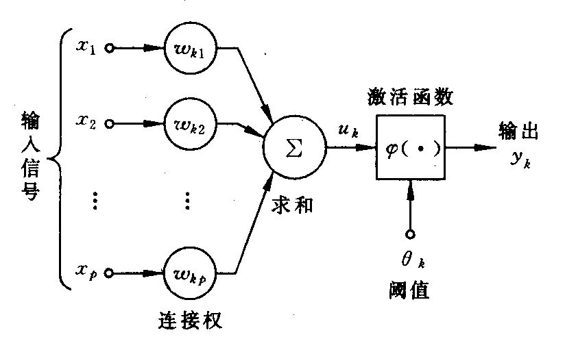

<!-- page: 331 -->

激活函数
)
(⋅
ϕ
可以有以下几种:
（i）阈值函数

<
≥
=
0
,0

⎩
⎨
⎧

0
,1
)
(
v
v
v
ϕ
                                     （1）

即阶梯函数。这时相应的输出
ky 为

≥
=
0
,0

⎩
⎨
⎧

v
y

0
,1

k
k
v

<

k

p

其中
∑

−
=

1
θ ，常称此种神经元为
P
M −
模型。

k
j
kj
k
x
w
v

=

j

（ii）分段线性函数

≥

⎧

1
1
),
1(
2
1
1
,1

v

⎪⎪
⎨

v
ϕ
                        （2）

=

<
<
−
+

)
(

v
v

⎪
⎪
⎩

−
≤

1
,0

v

它类似于一个放大系数为1 的非线性放大器，当工作于线性区时它是一个线性组合器，
放大系数趋于无穷大时变成一个阈值单元。

（iii）sigmoid 函数
最常用的函数形式为

)
exp(
1
1
)
(
v
v
α
ϕ
−
+
=
                                （3）

参数
0
>
α
可控制其斜率。另一种常用的是双曲正切函数

−
−
=
⎟
⎠
⎞
⎜
⎝
⎛
=
ϕ
                        （4）

)
exp(
1
)
exp(
1
2
tanh
)
(
v
v
v
v
−
+

这类函数具有平滑和渐近性，并保持单调性。

Matlab 中的激活（传递）函数如下表所示：

函数名
功  能
purelin
线性传递函数

-231-

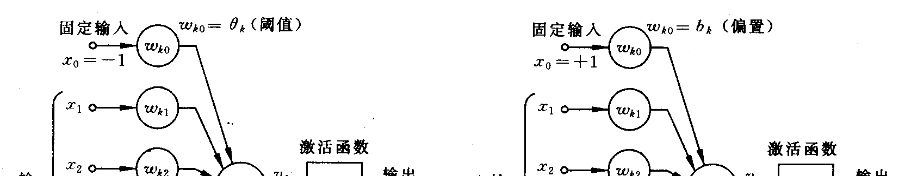

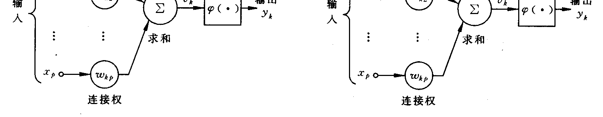

<!-- page: 332 -->

hardlim
硬限幅传递函数
hardlims
对称硬限幅传递函数
satlin
饱和线性传递函数
satlins
对称饱和线性传递函数
logsig
对数S 形传递函数
tansig
正切S 形传递函数
radbas
径向基传递函数
compet
竞争层传递函数
各个函数的定义及使用方法，可以参看Matlab 的帮助（如在Matlab 命令窗口运行

help tansig，可以看到tantig 的使用方法，及tansig 的定义为
1
1
2
)
(
2 −
+
=
−v
e
v
ϕ
）。

1.2  网络结构及工作方式
除单元特性外，网络的拓扑结构也是NN 的一个重要特性。从连接方式看NN 主要
有两种。

（i）前馈型网络
各神经元接受前一层的输入，并输出给下一层，没有反馈。结点分为两类，即输入
单元和计算单元，每一计算单元可有任意个输入，但只有一个输出（它可耦合到任意多
个其它结点作为其输入）。通常前馈网络可分为不同的层，第i 层的输入只与第
1
−
i
层
输出相连，输入和输出结点与外界相连，而其它中间层则称为隐层。

（ii）反馈型网络
所有结点都是计算单元，同时也可接受输入，并向外界输出。
NN 的工作过程主要分为两个阶段：第一个阶段是学习期，此时各计算单元状态不
变，各连线上的权值可通过学习来修改；第二阶段是工作期，此时各连接权固定，计算
单元状态变化，以达到某种稳定状态。

从作用效果看，前馈网络主要是函数映射，可用于模式识别和函数逼近。反馈网络
按对能量函数的极小点的利用来分类有两种：第一类是能量函数的所有极小点都起作
用，这一类主要用作各种联想存储器；第二类只利用全局极小点，它主要用于求解最优
化问题。
§2  蠓虫分类问题与多层前馈网络

2.1  蠓虫分类问题
蠓虫分类问题可概括叙述如下：生物学家试图对两种蠓虫（Af 与Apf）进行鉴别，
依据的资料是触角和翅膀的长度，已经测得了9 支Af 和6 支Apf 的数据如下：

Af: (1.24,1.27)，(1.36,1.74)，(1.38,1.64)，(1.38,1.82)，(1.38,1.90)，(1.40,1.70)，

(1.48,1.82)，(1.54,1.82)，(1.56,2.08).
Apf: (1.14,1.82)，(1.18,1.96)，(1.20,1.86)，(1.26,2.00)，(1.28,2.00)，(1.30,1.96).
现在的问题是：
（i）根据如上资料，如何制定一种方法，正确地区分两类蠓虫。
（ii）对触角和翼长分别为(1.24,1.80)，(1.28,1.84)与(1.40,2.04)的3 个标本，用所得
到的方法加以识别。

（iii）设Af 是宝贵的传粉益虫，Apf 是某疾病的载体，是否应该修改分类方法。
如上的问题是有代表性的，它的特点是要求依据已知资料（9 支Af 的数据和6 支
Apf 的数据）制定一种分类方法，类别是已经给定的（Af 或Apf）。今后，我们将9 支

-232-

<!-- page: 333 -->

Af 及6 支Apf 的数据集合称之为学习样本。

2.2  多层前馈网络
为解决上述问题，考虑一个其结构如下图所示的人工神经网络，

激活函数由

)
exp(
1
1
)
(
v
v
α
ϕ
−
+
=

来决定。图中最下面单元，即由• 所示的一层称为输入层，用以输入已知测量值。在
我们的例子中，它只需包括两个单元，一个用以输入触角长度，一个用以输入翅膀长度。
中间一层称为处理层或隐单元层，单元个数适当选取，对于它的选取方法，有一些文献
进行了讨论，但通过试验来决定，或许是最好的途径。在我们的例子中，取三个就足够
了。最上面一层称为输出层，在我们的例子中只包含二个单元，用以输出与每一组输入
数据相对应的分类信息．任何一个中间层单元接受所有输入单元传来的信号，并把处理
后的结果传向每一个输出单元，供输出层再次加工，同层的神经元彼此不相联接，输入
与输出单元之间也没有直接联接。这样，除了神经元的形式定义外，我们又给出了网络
结构。有些文献将这样的网络称为两层前传网络，称为两层的理由是，只有中间层及输
出层的单元才对信号进行处理；输入层的单元对输入数据没有任何加工，故不计算在层
数之内。

为了叙述上的方便，此处引人如下记号上的约定：令s 表示一个确定的已知样品标
号，在蠓虫问题中，
15
,
,2,1
L
=
s
，分别表示学习样本中的15 个样品；当将第s 个样

品的原始数据输入网络时，相应的输出单元状态记为
)
2,1
( =
i
O s

i
，隐单元状态记为

j
，输入单元取值记为
)
2,1
( =
k
I s

)3,2,1
( =
j
H s

k
。请注意，此处下标
k
j
i
,
,
依次对应于

输出层、中间层及输入层。在这一约定下，从中间层到输出层的权记为
ij
w ，从输入层

到中间层的权记为
jk
w
。如果
ij
w ，
jk
w
均已给定，那么，对应于任何一组确定的输入

)
,
(
2
1
s
s I
I
，网络中所有单元的取值不难确定。事实上，对样品s 而言，隐单元j 的输入
是

2

∑

=
=

s
k
jk
s
j
I
w
h
                                       （5）

1
k

相应的输出状态是

2

∑

=
=
=

s
k
jk
s
j
s
j
I
w
h
H
ϕ
ϕ
   （6）

1
)
(
)
(

k

由此，输出单元i 所接收到的迭加信号是

-233-

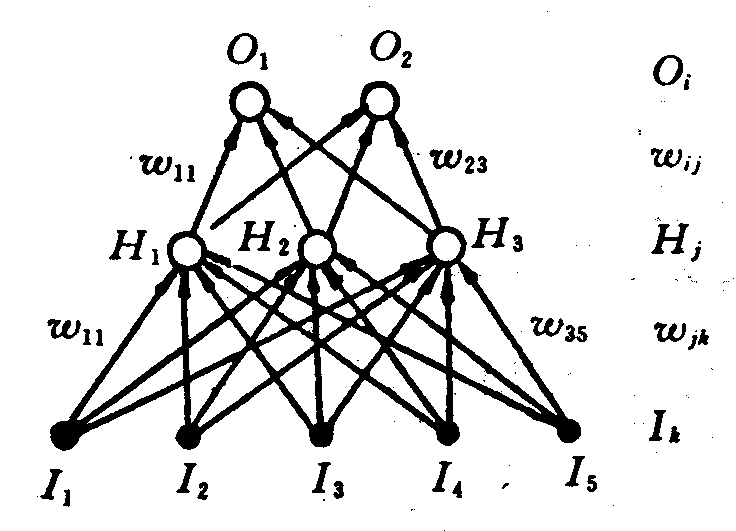

<!-- page: 334 -->

3

3

2

∑
∑
∑
=
=
=
=
=

s
k
jk
ij
s
j
ij
s
i
I
w
w
H
w
h
ϕ
       （7）

1
)
(

j
j
k

1

1

网络的最终输出是

3

3

2

1
∑
∑
∑

s
j
ij
s
i
s
i
I
w
w
H
w
h
O
ϕ
ϕ
ϕ
ϕ
             （8）

=
=
=

s
k
jk
ij
j

))
(
(
)
(
)
(

=
=
=

j
k

1

1

这里，没有考虑阈值，正如前面已经说明的那样，这一点是无关紧要的。还应指出的是，
对于任何一组确定的输入，输出是所有权
}
,
{
jk
ij w
w
的函数。

如果我们能够选定一组适当的权值
}
,
{
jk
ij w
w
，使得对应于学习样本中任何一组Af

样品的输入
)
,
(
2
1
s
s I
I
，输出
)
0,1(
)
,
(
2
1
=
s
s O
O
，对应于Apf 的输入数据，输出为
)1,0
(
，
那么蠓虫分类问题实际上就解决了。因为，对于任何一个未知类别的样品，只要将其触
角及翅膀长度输入网络，视其输出模式靠近
)
0,1(
亦或
)1,0
(
，就可能判断其归属。当然，
有可能出现介于中间无法判断的情况。现在的问题是，如何找到一组适当的权值，实现
上面所设想的网络功能。

2.3  向后传播算法
对于一个多层网络，如何求得一组恰当的权值，使网络具有特定的功能，在很长一
段时间内，曾经是使研究工作者感到困难的一个问题，直到1985 年，美国加州大学的
一个研究小组提出了所谓向后传播算法（Back-Propagation），使问题有了重大进展，这
一算法也是促成人工神经网络研究迅猛发展的一个原因。下面就来介绍这一算法。

如前所述，我们希望对应于学习样本中Af 样品的输出是
)
0,1(
，对应于Apf 的输出

是
)1,0
(
，这样的输出称之为理想输出。实际上要精确地作到这一点是不可能的，只能
希望实际输出尽可能地接近理想输出。为清楚起见，把对应于样品s 的理想输出记为

}
{
s
iT
，那么

2)
(
2
1
)
(
                              （9）

∑
−
=

s
i
s
i
O
T
W
E

s
i

,

度量了在一组给定的权下，实际输出与理想输出的差异，由此，寻找一组恰当的权的问
题，自然地归结为求适当W 的值，使
)
(W
E
达到极小的问题。将式（8）代入（9），有

2
3

2

1
)]
)
(
(
[
2
1
)
(
ϕ
ϕ
               （10）

∑
∑
∑
=
=
−
=

s
k
jk
ij
s
i
I
w
w
T
W
E

i
s
j
k

,

1

易知，对每一个变量
ij
w 或
ij
w 而言，这是一个连续可微的非线性函数，为了求得其极

小点与极小值，最为方便的就是使用最速下降法。最速下降法是一种迭代算法，为求出

)
(W
E
的（局部）极小，它从一个任取的初始点
0
W 出发，计算在
0
W 点的负梯度方向

—
)
(
0
W
E
∇
，这是函数在该点下降最快的方向；只要
0
)
(
0 ≠
∇
W
E
，就可沿该方向移动

一小段距离，达到一个新的点
)
(
0
0
1
W
E
W
W
∇
−
=
η
，η 是一个参数，只要η 足够小，

定能保证
)
(
)
(
0
1
W
E
W
E
<
。不断重复这一过程，一定能达到E 的一个（局部）极小点。

就本质而言，这就是BP 算法的全部内容，然而，对人工神经网络问题而言，这一算法
的具体形式是非常重要的，下面我们就来给出这一形式表达。

对于隐单元到输出单元的权
ij
w 而言，最速下降法给出的每一步的修正量是

-234-

<!-- page: 335 -->

∂
−
=
Δ

E
w
δ
η
ϕ
η
η
)
('
]
[
         （11）

∑
∑
=
−
=
∂

s
j
s
i
s
j
s
i
s
i
s
i
ij
ij
H
H
h
O
T
w

s
s

此处令

]
)[
('
s
i
s
i
s
i
s
i
O
T
h
−
= ϕ
δ
                                 （12）

对输入单元到隐单元的权
jk
w

∂
−
=
Δ

E
w

∑
−
=
∂

)
('
)
('
]
[
ϕ
ϕ
η
η

s
j
s
j
ij
s
i
s
i
s
i
jk
jk
I
h
w
h
O
T
w

i
s

,

∑
∑
=
=

s
k
s
j
ij
s
i
I
I
h
w
δ
η
ϕ
δ
η

s
k
s
j
i
s

)
('
                             （13）

,

s

此处

∑
=

s
i
ij
s
j
s
j
w
h
δ
ϕ
δ
)
('

i

从（11）和（13）式可以看出，所有权的修正量都有如下形式，即

∑
=
Δ

s
q
s
p
pq
v
w
δ
η
                                 （14）

s

指标p 对应于两个单元中输出信号的一端，q 对应于输入信号的一端，v 或者代表H 或
者代表I 。形式上看来，这一修正是“局部”的，可以看作是Hebb 律的一种表现形式。

还应注意，
s
iδ 由实际输出与理想输出的差及
s
ih 决定，而
s
j
δ
则需依赖
s
iδ 算出，因此，

这一算法才称为向后传播算法。稍加分析还可知道，利用由（11）~（13）式所给出的

计算安排，较之不考虑
s
p
δ 的向后传播，直接计算所有含'
ϕ 的原表达式，极大地降低了

计算工作量。这组关系式称作广义
−
δ
法则，它们不难推广到一般的多层网络上去。
利用这一迭代算法，最终生成在一定精度内满足要求的
}
,
{
jk
ij w
w
的过程，称为人

工神经网络的学习过程。可以看出，这里所提供的学习机制是元与元之间权的不断调整，
学习样本中任何一个样品所提供的信息，最终将包含在网络的每一个权之中。参数η 的
大小则反映了学习效率。

为了更有效地应用BP 算法，我们做出如下一些补充说明。
（i）在式（11）与（13）中，
jk
ij
w
w
Δ
Δ
,
表示为与所有样品s 有关的求和计算。

实际上，我们还可以每次仅考虑输入一个样品所造成的修正，然后，按照随机选取的顺
序，将所有样品逐个输入，不断重复这一手续，直至收敛到一个满意的解为止。

（ii）在如上的算法中，利用实际输出与理想输出差的平方和作为度量
}
,
{
jk
ij w
w
优

劣的标准，这并不是唯一的度量方式，完全可以从其它的函数形式出发，例如从相对熵
出发，导出相应的算法。

（iii）在如上的讨论中使用的是最速下降法，显然，这也不是唯一的选择，其它的
非线性优化方法，诸如共轭梯度法，拟牛顿法等，都可用于计算。为了加速算法的收敛
速度，还可以考虑各种不同的修正方式。

（iv）BP 算法的出现，虽然对人工神经网络的发展起了重大推动作用，但是这一
算法仍有很多问题．对于一个大的网络系统，BP 算法的工作量仍然是十分可观的，这
主要在于算法的收敛速度很慢。更为严重的是，此处所讨论的是非线性函数的优化，那
么它就无法逃脱该类问题的共同困难：BP 算法所求得的解，只能保证是依赖于初值选
取的局部极小点。为克服这一缺陷，可以考虑改进方法，例如模拟退火算法，或从多个

-235-

<!-- page: 336 -->

随机选定的初值点出发，进行多次计算，但这些方法都不可避免地加大了工作量。

2.4  蠓虫分类问题的求解
下面利用上文所叙述的网络结构及方法，对蠓虫分类问题求解。编写Matlab 程序
如下：
clear
p1=[1.24,1.27;1.36,1.74;1.38,1.64;1.38,1.82;1.38,1.90;
   1.40,1.70;1.48,1.82;1.54,1.82;1.56,2.08];
p2=[1.14,1.82;1.18,1.96;1.20,1.86;1.26,2.00
   1.28,2.00;1.30,1.96];
p=[p1;p2]';
pr=minmax(p);
goal=[ones(1,9),zeros(1,6);zeros(1,9),ones(1,6)];
plot(p1(:,1),p1(:,2),'h',p2(:,1),p2(:,2),'o')
net=newff(pr,[3,2],{'logsig','logsig'});
net.trainParam.show = 10;
net.trainParam.lr = 0.05;
net.trainParam.goal = 1e-10;
net.trainParam.epochs = 50000;
net = train(net,p,goal);
x=[1.24 1.80;1.28 1.84;1.40 2.04]';
y0=sim(net,p)
y=sim(net,x)
§3  处理蠓虫分类的另一种网络方法

3.1 几个有关概念
在介绍本节主要内容之前，首先说明几个不同的概念。在上一节中，我们把利用
BP 算法确定联接强度，即权值的过程称为“学习过程”，这种学习的特点是，对任何一
个输入样品，其类别事先是已知的，理想输出也已事先规定，因而从它所产生的实际输
出与理想输出的异同，我们清楚地知道网络判断正确与否，故此把这一类学习称为在教
师监督下的学习；与它不同的是，有些情况下学习是无监督的，例如，我们试图把一组
样品按其本身特点分类，所要划分的类别是事先未知的，需要网络自身通过学习来决定，
因而，在学习过程中，对每一输入所产生的输出也就无所谓对错，对于这样的情况，显
然BP 算法是不适用的。

另一个有关概念是所谓有竞争的学习。在上节所讨论的蠓虫分类网络中，尽管我们
所希望的理想输出是
)
0,1(
或
)1,0
(
，但实际输出并不如此，一般而言，两个输出单元均
同时不为0。与此不同，我们完全可以设想另外一种输出模式：对应任何一组输入，所
有输出单元中，只允许有一个处于激发态，即取值为1，其它输出单元均被抑制，即取
值为0。一种形象的说法是，对应任何一组输入，要求所有的输出单元彼此竞争，唯一
的胜利者赢得一切，失败者一无所获，形成这样一种输出机制的网络学习过程，称为有
竞争的学习。

3.2  最简单的无监督有竞争的学习
本节叙述一种无监督有竞争的网络学习方法，由此产生的网络可用来将一组输入样
品自动划分类别，相似的样品归于同一类别，因而激发同一输出单元，这一分类方式，
是网络自身通过学习，从输入数据的关系中得出的。

蠓虫分类问题对应有教师的网络学习过程，显然不能由如上的方法来解决。但在这
种无监督有竞争的学习阐明之后，很容易从中导出一种适用于有监督情况的网络方法；
此外，本节所介绍的网络，在数据压缩等多种领域，都有其重要应用。

-236-

<!-- page: 337 -->

考虑一个仅由输入层与输出层组成的网络系统，输入单元数目与每一样品的测量值
数目相等，输出单元数目适当选取。每一个输入单元与所有输出单元联接，第j 个输入

元到第i 个输出元的权记为
ij
w ，同层单元间无横向联接。无妨假设所有输入数值均已

规化到
]1,1
[−
之间，又因为是有竞争的学习，输出单元只取0 或1 两个值，且对应每一
组输入，只有一个输出元取1。

取1 的输出元记为*i ，称之为优胜者．对于任何一组输入s ，规定优胜者是有最大
净输入的输出元，即对输入
)
,
,
( 1
nI
I
I
L
=
而言，

∑
⋅
≡
=

i
j
ij
i
I
W
I
w
h
                              (15)

j

取最大值的单元，其中
i
W 是输出元i 所有权系数组成的向量，也就是说

I
W
I
W
i
i
⋅
≥
⋅
*
，
)
( i
∀
                            （16）

如果权向量是按照∑
=

ij
w
1
2
的方式标准化的，（16）式等价于

j

|
|
|
|
*
I
W
I
W
i
i
−
≤
−
，
)
( i
∀
                          （17）

即优胜者是其标准化权向量最靠近输入向量的输出元。令
1
* =
i
O
，其余的输出

0
=
i
O
。这样的输出规定了输入向量的类别，但为了使这种分类方式有意义，问题化

为如何将学习样本中的所有样品，自然地划分为聚类，并对每一聚类找出适当的权向量。
为此，采用如下的算法：随机取定一组不大的初始权向量，注意不使它们有任何对称性。

然后，将已知样品按照随机顺序输入网络。对输入样品s ，按上文所述确定优胜者*i ，

对所有与*i 有关的权作如下修正

)
(
*
*
j
i
s
j
j
i
w
I
w
−
=
Δ
η
                            （18）

所有其它输出单元的权保持不变。注意到
1
* =
i
O
，
)
(
0
*i
i
Oi
≠
=
，所有权的修正公式

可统一表示为

)
(
*
*
j
i
s
j
i
j
i
w
I
O
w
−
=
Δ
η

这一形式也可视为Hebb 律的一种表现。（18）式的几何意义是清楚的，每次修正将优

胜者的权向量向输入向量移近一小段距离，这使得同一样品再次输入时，*i 有更大的
获胜可能。可以合理地预期，反复重复以上步骤，使得每个输出单元对应了输入向量的
一个聚类，相应的权向量落在了该聚类样品的重心附近。当然，这只是一个极不严密的
说明。

特别应当指出，上述算法，对于事先按照∑
=1
jI
标准化了的输入数据更为适用，

整个过程不难由计算机模拟实现。

为了更有效地使用如上算法，下面对实际计算时可能产生的问题，作一些简要说明。
首先，如果初始权选择不当，那么可能出现这样的输出单元，它的权远离任何输入
向量，因此，永远不会成为优胜者，相应的权也就永远不会得到修正，这样的单元称之
为死单元。为避免出现死单元，可以有多种方法。一种办法是初始权从学习样本中抽样
选取，这就保证了它们都落在正确范围内；另一种办法是修正上述的学习算法，使得每
一步不仅调整优胜者的权，同时也以一个小得多的η 值，修正所有其它的权。这样，对
于总是失败的单元，其权逐渐地朝着平均输入方向运动，最终也会在某一次竞争中取胜。
此外，还存在有多种处理死单元的方法，感兴趣的读者可从文献中找到更多的方法。

-237-

<!-- page: 338 -->

另外一个问题是这一算法的收敛性。如果式（18）或（19）中反映学习效率的参数
η 取为一个固定常数，那么权向量永远不会真正在某一有限点集上稳定下来。因此，应

当考虑在公式中引进随学习时间而变化的收敛因子。例如，取
a
t
t
−
=
=
0
)
(
η
η
η
，
1
0
≤
< a
。这一因子的适当选取是极为重要的，η 下降太慢，无疑增加了不必要工作
量，η 下降太快，则会使学习变得无效。

3.3  LVQ 方法
上述有竞争学习的一个最重要应用是数据压缩中的向量量子化方法（Vector

Quantization）。它的基本想法是，把一个给定的输入向量集合
sI 分成M 个类别，然后
用类别指标来代表所有属于该类的向量。向量分量通常取连续值，一旦一组适当的类别
确定之后，代替传输或存储输入向量本身，可以只传输或存储它的类别指标。所有的类
别由M 个所谓“原型向量”来表示，我们可以利用一般的欧氏距离，对每一个输入向
量找到最靠近的原型向量，作为它的类别。显然，这种分类方法可以通过有竞争的学习
直接得到。一旦学习过程结束，所有权向量的集合，便构成了一个“电码本”。

一般而言，上述无监督有竞争的学习，实际提供了一种聚类分析方法，对如蠓虫分
类这种有监督的问题并不适用。1989 年，Kohonen 对向量量子化方法加以修改，提出
了一种适用于有监督情况的学习方法，称为学习向量量子化（Learning Vector
Quantization），该方法可用于蠓虫分类问题。在有监督的情况下，学习样品的类别是事
先已知的，与此相应，每个输出单元所对应的类别也事先作了规定，但是，代表同一类
别的输出单元可以不止一个。

在LVQ 中，对于任一输入向量，仍按无监督有竞争的方式选出优胜者*i ，但权的

修正规则则依输入向量的类别与*i 所代表的是否一致而不同，确切地说，令

⎪⎨
⎧

−
=
Δ

η

j
i
s
j

w
I
w

)
(

一致情况

*

*

j
i
w
I

−
−

η

j
i
s
j

)
(

⎪⎩

不一致情况

*

前一种情况，修正和无监督的学习一致，权朝向样品方向移动一小段距离；后一种
则相反，权向离开样品方向移动，这样就减少了错误分类的机会。

对于上述的蠓虫分类问题，我们编写Matlab 程序如下：
clear
p1=[1.24,1.27;1.36,1.74;1.38,1.64;1.38,1.82;1.38,1.90;
   1.40,1.70;1.48,1.82;1.54,1.82;1.56,2.08];
p2=[1.14,1.82;1.18,1.96;1.20,1.86;1.26,2.00
   1.28,2.00;1.30,1.96];
p=[p1;p2]'
pr=minmax(p)
goal=[ones(1,9),zeros(1,6);zeros(1,9),ones(1,6)]
net = newlvq(pr,4,[0.6,0.4])
net = train(net,p,goal)
Y = sim(net,p)
x=[1.24 1.80;1.28 1.84;1.40 2.04]'
sim(net,x)

习 题 十 九
1. 利用BP 算法及sigmoid 函数，研究以下各函数的逼近问题

-238-

<!-- page: 339 -->

（i）
100
1
,
1
)
(
≤
≤
=
x
x
x
f

（ii）
2
0
,
sin
)
(
π
≤
≤
=
x
x
x
f

对每一函数要完成如下工作：
① 获取两组数据，一组作为训练集，一组作为测试集；
② 利用训练集训练一个单隐层的网络；用测试集检验训练结果，改变隐层单元数，
研究它对逼近效果的影响。

2. 给定待拟合的曲线形式为
)
2
sin(
4.0
5.0
)
(
x
x
f
π
+
=

在
)
(x
f
上等间隔取11 个点的数据，在此数据的输出值上加均值为0，均方差
05
.0
=
σ
的正态分布噪声作为给定训练数据，用多项式拟合此函数，分别取多项式的阶次为1，
3 和11 阶，图示出拟合结果，并讨论多项式阶次对拟合结果的影响。

-239-

<!-- page: 340 -->

第二十章  偏微分方程的数值解

自然科学与工程技术中种种运动发展过程与平衡现象各自遵守一定的规律。这些规
律的定量表述一般地呈现为关于含有未知函数及其导数的方程。我们将只含有未知多元
函数及其偏导数的方程，称之为偏微分方程。

方程中出现的未知函数偏导数的最高阶数称为偏微分方程的阶。如果方程中对于未
知函数和它的所有偏导数都是线性的，这样的方程称为线性偏微分方程，否则称它为非
线性偏微分方程。

初始条件和边界条件称为定解条件，未附加定解条件的偏微分方程称为泛定方程。
对于一个具体的问题，定解条件与泛定方程总是同时提出。定解条件与泛定方程作为一
个整体，称为定解问题。

§1  偏微分方程的定解问题

各种物理性质的定常（即不随时间变化）过程，都可用椭圆型方程来描述。其最典
型、最简单的形式是泊松(Poisson)方程

u
u
=
∂
∂
+
∂
∂
=
Δ
                            （1）

2
y
x
f
y

2

u
x

)
,
(
2

2

特别地，当
0
)
,
(
≡
y
x
f
时，即为拉普拉斯(Laplace)方程，又称为调和方程

2
=
∂
∂
+
∂
∂
=
Δ
y

2

u
u
                                  （2）

u
x

0
2

2

带有稳定热源或内部无热源的稳定温度场的温度分布，不可压缩流体的稳定无旋流动及
静电场的电势等均满足这类方程。

Poisson 方程的第一边值问题为

⎧

Ω
∈
=
∂
∂
+
∂
∂

2

2

u
x

u

y
x
y
x
f
y

)
,
(
)
,
(

⎪⎨

2

2

                       （3）

⎪⎩

y
x
ϕ

Ω
∂
=
Γ
=

y
x
y
x
u

Γ
∈
)
,
(
|)
,
(

)
,
(

其中Ω 为以Γ 为边界的有界区域，Γ 为分段光滑曲线，
Γ
Ω U
称为定解区域，
)
,
(
),
,
(
y
x
y
x
f
ϕ
分别为
Γ
Ω,
上的已知连续函数。
第二类和第三类边界条件可统一表示成

y
x
ϕ
α
=
⎟
⎠
⎞
⎜
⎝
⎛
+
∂
∂

)
,
(
)
,
(
y
x
u
n
u

Γ
∈
                               （4）

其中n 为边界Γ 的外法线方向。当
0
=
α
时为第二类边界条件，
0
≠
α
时为第三类边界
条件。

在研究热传导过程，气体扩散现象及电磁场的传播等随时间变化的非定常物理问
题时，常常会遇到抛物型方程。其最简单的形式为一维热传导方程

2
>
=
∂
∂
−
∂
∂
a
x

u
a
t
u
                                 （5）

)
0
(
0
2

方程（5）可以有两种不同类型的定解问题：
初值问题（也称为Cauchy 问题）

-240-

<!-- page: 341 -->

⎪⎨
⎧

+∞
<
<
∞
−
>
=
∂
∂
−
∂
∂

2

u
a
t
u

x
t
x

,0
0
2

                    （6）

⎪⎩

+∞
<
<
∞
−
=

ϕ

x
x
x
u

)
(
)
0,
(

初边值问题

⎧

<
<
<
<
=
∂
∂
−
∂
∂

2

u
a
t
u

l
x
T
t
x

0
,
0
0

⎪⎪
⎪

2

=

ϕ
                     （7）

x
x
u

)
(
)
0,
(

⎨

⎪⎪
⎪

≤
≤
=
=

T
t
t
g
t
l
u
t
g
t
u

0
),
(
)
,
(
),
(
)
,0
(

2
1

⎩

其中
)
(
),
(
),
(
2
1
t
g
t
g
x
ϕ
为已知函数，且满足连接条件

)
0
(
)
(
),
0
(
)
0
(
2
1
g
l
g
=
=
ϕ
ϕ

问题（7）中的边界条件
)
(
)
,
(
),
(
)
,0
(
2
1
t
g
t
l
u
t
g
t
u
=
=
称为第一类边界条件。第二类和
第三类边界条件为

≤
≤
=
⎥⎦
⎤
⎢⎣
⎡
−
∂
∂

T
t
t
g
u
t
x
u

λ

0
),
(
)
(

1
0
1

=

x

                        （8）

≤
≤
=
⎥⎦
⎤
⎢⎣
⎡
+
∂
∂

T
t
t
g
u
t
x
u

λ

0
),
(
)
(

2
2

=

l
x

其中
0
)
(
,0
)
(
2
1
≥
≥
t
t
λ
λ
。当
0
)
(
)
(
2
1
≡
=
t
t
λ
λ
时，为第二类边界条件，否则称为第三
类边界条件。

双曲型方程的最简单形式为一阶双曲型方程

0
=
∂
∂
+
∂
∂

x
u
a
t
u
                                      （9）

物理中常见的一维振动与波动问题可用二阶波动方程

∂
∂
=
∂
∂
                                     （10）

2

2
2
2

u
a
t

u

2

x

描述，它是双曲型方程的典型形式。方程（10）的初值问题为

⎧

+∞
<
<
∞
−
>
∂
∂
=
∂
∂

2

2
2
2

u
a
t

u

x
t
x

,0

⎪⎪
⎪

2

+∞
<
<
∞
−
=

ϕ
                 （11）

x
x
x
u

)
(
)
0,
(

⎨

⎪
⎪
⎪

+∞
<
<
∞
−
=
∂
∂

x
x
t
u

φ

)
(

⎩

=

t

0

边界条件一般也有三类，最简单的初边值问题为

-241-

<!-- page: 342 -->

⎧

<
<
>
∂
∂
=
∂
∂

2

2
2
2

u
a
t

u

l
x
t
x

0
,0

⎪
⎪
⎪

2

≤
≤
=
∂
∂
=

l
x
x
t
u
x
x
u

φ
ϕ

0
)
(
),
(
)
0,
(

⎨

⎪
⎪
⎪

=

t

0

≤
≤
=
=

T
t
t
g
t
l
u
t
g
t
u

0
)
(
)
,
(
),
(
)
,0
(

2
1

⎩

如果偏微分方程定解问题的解存在，唯一且连续依赖于定解数据（即出现在方程
和定解条件中的已知函数），则此定解问题是适定的。可以证明，上面所举各种定解问
题都是适定的。
§2  偏微分方程的差分解法

差分方法又称为有限差分方法或网格法，是求偏微分方程定解问题的数值解中应用
最广泛的方法之一。它的基本思想是：先对求解区域作网格剖分，将自变量的连续变化
区域用有限离散点（网格点）集代替；将问题中出现的连续变量的函数用定义在网格点
上离散变量的函数代替；通过用网格点上函数的差商代替导数，将含连续变量的偏微分
方程定解问题化成只含有限个未知数的代数方程组（称为差分格式）。如果差分格式有
解，且当网格无限变小时其解收敛于原微分方程定解问题的解，则差分格式的解就作为
原问题的近似解（数值解）。因此，用差分方法求偏微分方程定解问题一般需要解决以
下问题：

（i）选取网格；
（ii）对微分方程及定解条件选择差分近似，列出差分格式；
（iii）求解差分格式；
（iv）讨论差分格式解对于微分方程解的收敛性及误差估计。
下面我们只对偏微分方程的差分解法作一简要的介绍。

2.1  椭圆型方程第一边值问题的差分解法
以Poisson 方程（1）为基本模型讨论第一边值问题的差分方法。
考虑Poisson 方程的第一边值问题（3）

⎧

Ω
∈
=
∂
∂
+
∂
∂

2

2

u
x

u

y
x
y
x
f
y

)
,
(
)
,
(

⎪⎨

2

2

⎪⎩

Ω
∂
=
Γ
=

y
x
ϕ

y
x
y
x
u

Γ
∈
)
,
(
|)
,
(

)
,
(

取
τ,h
分别为x 方向和y 方向的步长，以两族平行线
τj
y
y
kh
x
x
j
k
=
=
=
=
,
)
,2
,1
,0
,
(
L
±
±
=
j
k
将定解区域剖分成矩形网格。节点的全体记为

}
,
,
,
|)
,
{(
为整数
j
i
j
y
kh
x
y
x
R
j
k
j
k
τ
=
=
=
。定解区域内部的节点称为内点，记内点

集
Ω
I
R
为
τ
h
Ω
。边界Γ 与网格线的交点称为边界点，边界点全体记为
τ
h
Γ
。与节点
)
,
(
j
k y
x
沿x 方向或y 方向只差一个步长的点
)
,
(
1
j
k
y
x ±
和
)
,
(
1
±
j
k y
x
称为节点

)
,
(
j
k y
x
的相邻节点。如果一个内点的四个相邻节点均属于
Γ
Ω U
，称为正则内点，正

则内点的全体记为
)
1
(
Ω
，至少有一个相邻节点不属于
Γ
Ω U
的内点称为非正则内点，

非正则内点的全体记为
)
2
(
Ω
。我们的问题是要求出问题（3）在全体内点上的数值解。
为简便记，记
)
,
(
),
,
(
)
,
(
),
,
(
)
,
(
,
j
k
j
k
j
k
j
k
y
x
f
f
y
x
u
j
k
u
y
x
j
k
=
=
=
。对正则内点

-242-

<!-- page: 343 -->

)
1
(
)
,
(
Ω
∈
j
k
，由二阶中心差商公式

+
−
+
−
+
=
∂
∂

2
h
O
h

)
(
)
,1
(
)
,
(
2
)
,1
(
2
2
)
,
(
2

j
k
u
j
k
u
j
k
u
x

u

j
k

+
−
+
−
+
=
∂
∂

2
τ
τ

O
j
k
u
j
k
u
j
k
u
y

u

)
(
)1
,
(
)
,
(
2
)1
,
(
2
2
)
,
(
2

j
k

Poisson 方程（1）在点
)
,
(
j
k
处可表示为

−
+
−
+
+
−
+
−
+

j
k
u
j
k
u
j
k
u

)1
,
(
)
,
(
2
)1
,
(
)
,1
(
)
,
(
2
)
,1
(

j
k
u
j
k
u
j
k
u
h

τ
+
+
=

2
2

    （12）

τ

2
2
,

h
O
f

)
(

j
k

在式（12）中略去
)
(
2
2
τ
+
h
O
，即得与方程（1）相近似的差分方程

,1
,
,1
2
2
=
+
−
+
+
−
−
+
−
+

u
u
u

j
k
j
k
j
k
j
k
j
k
j
k
j
k
f
u
u
u

1
,
,
1
,

                (13)

,
2

τ

2

h

式（13）中方程的个数等于正则内点的个数，而未知数
j
k
u , 则除了包含正则内点处

解u 的近似值，还包含一些非正则内点处u 的近似值，因而方程个数少于未知数个数。
在非正则内点处Poisson 方程的差分近似不能按式（13）给出，需要利用边界条件得到。

边界条件的处理可以有各种方案，下面介绍较简单的两种。
(i) 直接转移
(ii) 线性插值
由式（13）所给出的差分格式称为五点菱形格式，实际计算时经常取
τ
=
h
，此时
五点菱形格式可化为

,
,
1
,
1
,
,1
,1
2
)
4
(
1
=
−
+
+
+
−
+
−
+
                    (14)

j
k
j
k
j
k
j
k
j
k
j
k
f
u
u
u
u
u
h

简记为

,
,
2
1
=
◊
                                       （15）

j
k
j
k
f
u
h

其中
j
k
j
k
j
k
j
k
j
k
j
k
u
u
u
u
u
u
,
1
,
1
,
,1
,1
,
4
−
+
+
+
=
◊
−
+
−
+
。

    求解差分方程组最常用的方法是同步迭代法，同步迭代法是最简单的迭代方式。除
边界节点外，区域内节点的初始值是任意取定的。

例1  用五点菱形格式求解Laplace 方程第一边值问题

⎧

Ω
∈
=
∂
∂
+
∂
∂

2

2

u
x

u

y
x
y

)
,
(
0

⎪⎨

2

2

⎪⎩

Ω
∂
=
Γ
+
+
=

2
2
)
,
(

y
x
y
x
u

Γ
∈
]
)
1
lg[(
|)
,
(

y
x

其中
}
1
,
0
|)
,
{(
≤
≤
=
Ω
y
x
y
x
。取
3
1
=
= τ
h
。

当
τ
=
h
时，利用点
)1
,1
(
),
1
,1
(
),
,
(
+
±
−
±
j
k
j
k
j
k
构造的差分格式

,
,
1
,1
1
,1
1
,1
1
,1
2
)
4
(
2
1
=
−
+
+
+
−
−
+
−
−
+
+
+
            （16）

j
k
j
k
j
k
j
k
j
k
j
k
f
u
u
u
u
u
h

-243-

<!-- page: 344 -->

称为五点矩形格式，简记为

2
2
1
h

ٱj
k
j
k
f
u
,
, =
                                    （17）

其中ٱj
k
j
k
j
k
j
k
j
k
j
k
u
u
u
u
u
u
,
1
,1
1
,1
1
,1
1
,1
,
4
−
+
+
+
=
−
−
+
−
−
+
+
+
。

2.2  抛物型方程的差分解法
以一维热传导方程（5）

2
>
=
∂
∂
−
∂
∂
a
t

u
a
t
u

)
0
(
0
2

为基本模型讨论适用于抛物型方程定解问题的几种差分格式。

首先对xt 平面进行网格剖分。分别取
τ,h
为x 方向与t 方向的步长，用两族平行直

线
)
,2
,1
,0
(
L
±
±
=
=
=
k
kh
x
x
k
，
)
,2,1,0
(
L
=
=
=
j
j
t
t
j
τ
，将xt 平面剖分成矩形网

格，节点为
)
,2,1,0
,
,2
,1
,0
)(
,
(
L
L
=
±
±
=
j
k
t
x
j
k
。为简便起见，记
)
,
(
)
,
(
j
k y
x
j
k
=
，

)
,
(
)
,
(
j
k y
x
u
j
k
u
=
，
)
(
k
k
x
ϕ
ϕ =
，
)
(
1
1
j
j
t
g
g
=
，
)
(
2
2
j
j
t
g
g
=
，
)
(
1
1
j
j
t
λ
λ
=
，

)
(
2
2
j
j
t
λ
λ
=
。

2.2.1  微分方程的差分近似

在网格内点
)
,
(
j
k
处，对
t
u
∂
∂
分别采用向前、向后及中心差商公式，对
2

u
∂
∂
采用二

2

x

阶中心差商公式，一维热传导方程（5）可分别表示为

j
k
u
j
k
u
j
k
u
a
j
k
u
j
k
u
+
=
−
+
−
+
−
−
+
τ
τ

)
(
)
,1
(
)
,
(
2
)
,1
(
)
,
(
)1
,
(
2
2
h
O
h

j
k
u
j
k
u
j
k
u
a
j
k
u
j
k
u
+
=
−
+
−
+
−
−
−
τ
τ

)
(
)
,1
(
)
,
(
2
)
,1
(
)1
,
(
)
,
(
2
2
h
O
h

j
k
u
j
k
u
j
k
u
a
j
k
u
j
k
u
+
=
−
+
−
+
−
−
−
+
τ
τ

)
(
)
,1
(
)
,
(
2
)
,1
(
2
)1
,
(
)1
,
(
2
2
h
O
h

由此得到一维热传导方程的不同的差分近似

,1
,
,1
,
1
,
=
+
−
−
−
−
+
+

0
2

u
u
u
a
u
u
j
k
j
k
j
k
j
k
j
k

                         （18）

τ

2

h

,1
,
,1
1
,
,
=
+
−
−
−
−
+
−

0
2

u
u
u
a
u
u
j
k
j
k
j
k
j
k
j
k

                         （19）

τ

2

h

,1
,
,1
1
,
1
,
=
+
−
−
−
−
+
−
+

0
2

u
u
u
a
u
u
j
k
j
k
j
k
j
k
j
k

                        （20）

τ

2
2

h

2.2.2  初、边值条件的处理
为用差分方程求解定解问题（6），（7）等，还需对定解条件进行离散化。
对初始条件及第一类边界条件，可直接得到

k
k
k
x
u
u
ϕ
=
=
)
0,
(
0,
)
,
,1,0
,1
,0
(
n
k
k
L
L
=
±
=
或
              （21）

=
=

g
t
u
u

)
,0
(

,0

ij
j
j

)1
,
,1,0
(
−
=
m
j
L
                     （22）

=
=

g
t
l
u
u

)
,
(

j
j
j
n

2
,

-244-

<!-- page: 345 -->

其中
τ
T
m
h

l
n
=
=
,
。

对第二、三类边界条件则需用差商近似。下面介绍两种较简单的处理方法。

u
∂
∂
，在右边界
)
(
l
x =
处用向后差

（i）在左边界
)
0
( =
x
处用向前差商近似偏导数x

u
∂
∂
，即

商近似偏导数x

+
−
=
∂
∂

j
u
j
u
x
u

)
(
)
,0
(
)
,1(

h
O
h

)
,0
(

j

)
,
,1,0
(
m
j
L
=

+
−
−
=
∂
∂

j
n
u
j
n
u
x
u

)
(
)
,1
(
)
,
(

h
O
h

)
,
(

j
n

即得边界条件（8）的差分近似为

=
−
−

⎧

u
u

1
,0
1
,0
,1

j
j
j
j
j

λ

g
u
h

⎪⎪
⎨

)
,
,1,0
(
m
j
L
=
             （23）

=
+
−

u
u

⎪
⎪
⎩

−

j
j
n
j
j
n
j
n

2
,
2
,1
,

λ

g
u
h

u
∂
∂
，即

（ii）用中心差商近似x

+
−
−
=
∂
∂

j
u
j
u
x
u

)
(
2
)
,1
(
)
,1(

2

h
O
h

)
,0
(

j

)
,
,1,0
(
m
j
L
=

+
−
−
+
=
∂
∂

j
n
u
j
n
u
x
u

)
(
2
)
,1
(
)
,1
(

2

h
O
h

)
,
(

j
n

则得边界条件的差分近似为

=
−
−

⎧

u
u

−

1
,0
1
,1
,1

j
j
j
j
j

λ

g
u
h

⎪⎪
⎨

2

)
,
,1,0
(
m
j
L
=
             （24）

=
+
−

u
u

⎪
⎪
⎩

−
+

j
j
n
j
j
n
j
n

2
,
2
,1
,1

λ

g
u
h

2

这样处理边界条件，误差的阶数提高了，但式（24）中出现定解区域外的节点
)
,1
(
j
−
和
)
,1
(
j
n +
，这就需要将解拓展到定解区域外。可以通过用内节点上的u 值插值求出
j
u
,1
−

和
j
n
u
,1
+
，也可以假定热传导方程（5）在边界上也成立，将差分方程扩展到边界节点

上，由此消去
j
u
,1
−
和
j
n
u
,1
+
。

2.2.3  几种常用的差分格式
下面我们以热传导方程的初边值问题（7）为例给出几种常用的差分格式。
(i) 古典显式格式

为便于计算，令
2
h
a
r
τ
=
，式（18）改写成以下形式

-245-

<!-- page: 346 -->

j
k
j
k
j
k
j
k
ru
u
r
ru
u
,1
,
,1
1
,
)
2
1(
−
+
+
+
−
+
=

将式（18）与（21），（22）结合，我们得到求解问题（7）的一种差分格式

⎧

−
=
−
=
+
−
+
=
−
+
+

m
j
n
k
ru
u
r
ru
u

)1
,
,1,0
,1
,
,2,1
(
)
2
1(

L
L

j
k
j
k
j
k
j
k

,1
,
,1
1
,

⎪
⎨

=
=

ϕ
 （25）

n
k
u

)
,
,2,1
(

L

k
k

0,

⎪
⎩

=
=
=

m
j
g
u
g
u

)
,
,2,1
(
,

L

2
,
1
,0

j
j
n
j
j

由于第0 层
)
0
( =
j
上节点处的u 值已知
)
(
0
,
k
k
u
ϕ
=
，由式（25）即可算出u 在第一层

)1
( =
j
上节点处的近似值
1,
k
u
。重复使用式（25），可以逐层计算出各层节点的近似值。

（ii）古典隐式格式
将（19）整理并与式（21），（22）联立，得差分格式如下

⎧

−
=
−
=
+
−
+
=
+
−
+
+
+
+

m
j
n
k
u
u
u
r
u
u

)1
,
,1,0
,1
,
,2,1
)(
2
(

L
L

j
k
j
k
j
k
j
k
j
k

1
,1
1
,
1
,1
,
1
,

⎪
⎨

=
=

ϕ
（26）

n
k
u

)
,
,1,0
(

L

k
k

0,

⎪
⎩

=
=
=

m
j
g
u
g
u

)
,
,1,0
(
,

L

2
,
1
,0

j
j
n
j
j

其中
2
h
a
r
τ
=
。虽然第0 层上的u 值仍为已知，但不能由式（30）直接计算以上各层节

点上的值
j
k
u , ，故差分格式（26）称为古典隐式格式。

（iii）杜福特—弗兰克尔（DoFort—Frankel）格式
DoFort—Frankel 格式是三层显式格式，它是由式（24）与（25），（26）结合得到
的。具体形式如下：

−
=
−
=
+
−
+
+
+
=
−
−
+
+

⎧

m
j
n
k
u
r
r
u
u
r
r
u

)1
,
,2,1
,1
,
,2,1
(
2
1
2
1
)
(
2
1
2

L
L

⎪
⎪

j
k
j
k
j
k
j
k

1
,
,1
,1
1
,

=
=

ϕ
(27)

n
k
u

)
,
,1,0
(

⎨

L

k
k

0,

⎪
⎪

=
=
=

m
j
g
u
g
u

)
,
,1,0
(
,

L

2
,
1
,0

j
j
n
j
j

⎩

用这种格式求解时，除了第0 层上的值
0,
k
u
由初值条件（21）得到，必须先用二层格式

求出第1 层上的值
1,
k
u
，然后再按格式（27）逐层计算
)
,
,3,2
(
,
m
j
u
j
k
L
=
。

2.3  双曲型方程的差分解法
对二阶波动方程（10）

∂
∂
=
∂
∂

2

2
2
2

u
a
t

u

2

x

如果令
x
u
v
t
u
v
∂
∂
=
∂
∂
=
2
1
,
，则方程（10）可化成一阶线性双曲型方程组

∂
∂
=
∂
∂

⎧

x
v
a
t
v

2
2
1

⎪⎪
⎨

                                     （28）

∂
∂
=
∂
∂

x
v
t
v

⎪⎪
⎩

1
2

记
T
v
v
v
)
,
(
2
1
=
，则方程组（28）可表成矩阵形式

-246-

<!-- page: 347 -->

⎡
=
∂
∂

⎤
⎢
⎣

0
2
                               （29）

∂
∂
=
∂
∂
⎥
⎦

x
v
A
x
v
a
t
v

0
1

矩阵A 有两个不同的特征值
a
±
=
λ
，故存在非奇异矩阵P ，使得

⎤
⎢⎣

⎡

a
a
PAP
0
0
1

−
=
−

Λ
=
⎥⎦

作变换
T
w
w
Pv
w
)
,
(
2
1
=
=
，方程组（29）可化成

∂
∂
Λ
=
∂
∂
                                    （30）

x
w
t
w

方程组（30）由两个独立的一阶双曲型方程联立而成。因此下面主要讨论一阶双曲型方
程的差分解法。

考虑一阶双曲型方程的初值问题

+∞
<
<
∞
−
>
=
∂
∂
+
∂
∂

⎪⎨
⎧

x
t
x
u
a
t
u

0
0

                (31)

⎪⎩

+∞
<
<
∞
−
=

ϕ

x
x
x
u

)
(
)
0,
(

与抛物型方程的讨论类似，仍将xt 平面剖分成矩形网格。取x 方向步长为h ，t 方向步
长为τ ，网格线为
),
,2
,1
,0
(
L
±
±
=
=
=
k
kh
x
x
k
)
,2,1,0
(
L
=
=
=
j
j
t
t
j
τ
。为简便起

见，记
)
,
(
)
,
(
j
k y
x
j
k
=
，
)
,
(
)
,
(
j
k y
x
u
j
k
u
=
，
)
(
k
k
x
ϕ
ϕ
=
。

    以不同的差商近似偏导数，可以得到方程（9）的不同的差分近似

0
,
,1
,
1
,
=
−
+
−
+
+

u
u
a
u
u
j
k
j
k
j
k
j
k

                          （32）

τ

h

0
,1
,
,
1
,
=
−
−
−
−
+

u
u
a
u
u
j
k
j
k
j
k
j
k

                           （33）

τ

h

,1
,1
,
1
,
=
−
−
−
−
+
+

u
u
a
u
u
j
k
j
k
j
k
j
k

0
2

                          （34）

τ

h

结合离散化的初始条件，可以得到几种简单的差分格式。
§3  一维状态空间的偏微分方程的MATLAB 解法
3.1  工具箱命令介绍
MATLAB 提供了一个指令pdepe，用以解以下的PDE 方程式

∂
=
∂
∂
∂
∂
−
       （35）

∂
∂
+
∂
∂
∂

)
,
,
,
(
))
,
,
,
(
(
)
,
,
,
(
x
u
u
t
x
s
x
u
u
t
x
f
x
x
x
t
u
x
u
u
t
x
c
m
m

其中时间介于
ft
t
t
≤
≤
0
之间，而位置x 则介于
]
,
[
b
a
有限区域之间。m 值表示问题的

对称性，其可为0，1 或2，分别表示平板(slab)，圆柱(cylindrical)或球体(spherical)的情
形。因而，如果
0
>
m
，则a 必等于b ，也就是说其具有圆柱或球体的对称关系。同时，
式中
)
,
,
,
(
x
u
u
t
x
f
∂
∂
一项为流通量(flux)，而
)
,
,
,
(
x
u
u
t
x
s
∂
∂
为来源(source)项。
)
,
,
,
(
x
u
u
t
x
c
∂
∂
为偏微分方程的对角线系数矩阵。若某一对角线元素为0，则表示该偏
微分方程为椭圆型偏微分方程，若为正值(不为0)，则为拋物型偏微分方程。请注意c 的
对角线元素一定不全为0。偏微分方程初始值可表示为

-247-

<!-- page: 348 -->

)
(
)
,
(
0
0
x
v
t
x
u
=
                              （36）

而边界条件为
0
)
,
,
,
(
)
,
(
)
,
,
(
=
∂
∂
+
x
u
u
t
x
f
t
x
q
u
t
x
p
                   （37）

其中x 为两端点位置，即a 或b

用以解含上述初始值及边界值条件的偏微分方程的MATLAB 命令pdepe 的用法如
下：

)
,
,
,
,
,
,
(
options
tspan
xmesh
bcfun
icfun
pdepe
m
pdepe
sol =
其中

m 为问题之对称参数；

xmesh 为空间变量x 的网格点(mesh)位置向量，即
]
,
,
,
[
1
0
N
x
x
x
xmesh
L
=
，其中
a
x =
0
(起点)，
b
xN =
(终点)。

tspan 为时间变量t 的向量，即
]
,
,
,
[
1
0
M
t
t
t
tspan
L
=
，其中0t 为起始时间，M
t
为

终点时间。

pdefun 为使用者提供的pde 函数文件。其函数格式如下：

       [
]
)
,
,
,
(
,
,
dudx
u
t
x
pdefun
s
f
c
=

亦即，使用者仅需提供偏微分方程中的系数向量。c ，f 和s 均为行(column)向量，而
向量c 即为矩阵c 的对角线元素。
    icfun 提供解u 的起始值，其格式为
)
(x
icfun
u =
值得注意的是u 为行向量。

    bcfun 使用者提供的边界条件函数，格式如下：

[
]
(
)t
ur
xr
ul
xl
bcfun
ql
pr
ql
pl
,
,
,
,
,
,
,
=

其中ul 和ur 分别表示左边界
)
(
b
xl =
和右边界
)
(
a
xr =
u 的近似解。输出变量中，pl

和ql 分别表示左边界p 和q 的行向量，而pr 和qr 则为右边界p 和q 的行向量。

sol 为解答输出。sol 为多维的输出向量，
)
:
(:, i
sol
为
iu 的输出，即
)
:,
(:, i
sol
ui =
。

元素
)
,
,
(
)
,
(
i
k
j
sol
k
j
ui
=
表示在
)
( j
tspan
t =
和
)
(k
xmesh
x =
时
iu 之答案。
options 为求解器的相关解法参数。详细说明参见odeset 的使用方法。
    注：

1. MATLAB PDE 求解器pdepe 的算法，主要是将原来的椭圆型和拋物线型偏微分
方程转化为一组常微分方程。此转换的过程是基于使用者所指定的mesh 点，以二阶空
间离散化(spatial discretization)技术为之(Keel and Berzins,1990)，然后以ode15s 的指令
求解。采用ode15s 的ode 解法，主要是因为在离散化的过程中，椭圆型偏微分方程被
转化为一组代数方程，而拋物线型的偏微分方程则被转化为一组联立的微分方程。因而，
原偏微分方程被离散化后，变成一组同时伴有微分方程与代数方程的微分代数方程组，
故以ode15s 便可顺利求解。

2. x 的取点(mesh)位置对解的精确度影响很大，若pdepe 求解器给出“…has
difficulty finding consistent initial considition”的讯息时，使用者可进一步将mesh 点取密
一点，即增加mesh 点数。另外，若状态u 在某些特定点上有较快速的变动时，亦需将
此处的点取密集些，以增加精确度。值得注意的是pdepe 并不会自动做xmesh 的自动取
点，使用者必须观察解的特性，自行作取点的操作。一般而言，所取的点数至少需大于
3 以上。
3. tspan 的选取主要是基于使用者对那些特定时间的状态有兴趣而选定。而间距

-248-

<!-- page: 349 -->

(step size)的控制由程序自动完成。

4. 若要获得特定位置及时间下的解，可配合以pdeval 命令。使用格式如下：
[
]
)
,
,
,
(
,
xout
ui
xmesh
m
pdeval
duoutdx
uout
=
其中

m 代表问题的对称性。m =0 表示平板；m =1 表示圆柱体；m =2 表示球体。其意
义同pdepe 中的自变量m 。
    xmesh 为使用者在pdepe 中所指定的输出点位置向量。
0
1
[
,
,
,
]
N
xmesh
x x
x
=
L
。

    ui 即
)
:,
,
(
i
j
sol
。也就是说其为pdepe 输出中第i 个输出ui 在各点位置xmesh 处，

时间固定为
)
( j
tspan
t j =
下的解。

    xout 为所欲内插输出点位置向量。此为使用者重新指定的位置向量。
    uout 为基于所指定位置xout ，固定时间
ft 下的相对应输出。

    duoutdx 为相对应的
dx
du
输出值。
    ref. Keel,R.D. and M. Berzins,“A Method for the Spatial Discritization of Parabolic
Equations in One Space Variable”，SIAM J. Sci. and Sat. Comput.,Vol.11,pp.1-32,1990.

以下将以数个例子，详细说明pdepe 的用法。
3.2  求解一维偏微分方程
例2  试解以下之偏微分方程式

∂
∂
=
∂
∂
π

2
2
x

u
t
u

2

其中
1
0
≤
≤x
，且满足以下之条件限制式
(i)起始值条件
IC：
)
sin(
)
0,
(
x
x
u
π
=
(ii)边界条件
BC1：
0
)
,0
(
=
t
u

BC2：
0
)
,1(
=
∂
∂
+
−

t
u
e t
π

x

注：本问题的解析解为
)
sin(
)
,
(
x
e
t
x
u
t
π
−
=
    解  下面将叙述求解的步骤与过程。当完成以下各步骤后，可进一步将其汇总为一
主程序ex20_1.m，然后求解。
    步骤1  将欲求解的偏微分方程改写成如式的标准式。

∂
=
∂
∂

∂
∂
∂

0
0
0
2
+
⎟
⎠
⎞
⎜
⎝
⎛

x
u
x
x
x
t
u
π

此即

                       (
)
2
,
,
,
π
=
∂
∂
x
u
u
t
x
c

(
)
x
u
x
u
u
t
x
f
∂
∂
=
∂
∂
,
,
,

                       (
)
0
,
,
,
=
∂
∂
x
u
u
t
x
s

和
0
=
m
。
步骤2  编写偏微分方程的系数向量函数。
function [c,f,s]=ex20_1pdefun(x,t,u,dudx)

-249-

<!-- page: 350 -->

c=pi^2;
f=dudx;
s=0;

步骤3  编写起始值条件。
function u0=ex20_1ic(x)
u0=sin(pi*x);
    步骤4  编写边界条件。在编写之前，先将边界条件改写成标准形式，如式（37），
找出相对应的
)
(⋅
p
和
)
(⋅
q
函数，然后写出MATLAB 的边界条件函数，例如，原边界条
件可写成

∂
⋅
+
x
t
x
t
u

        BC1：
0
,
0
)
,0
(
0
)
,0
(
=
=
∂

        BC2：
1
,
0
)
,1(
1
=
=
∂
∂
⋅
+
−
x
t
x
u
e t
π

即
(0, ),
0,
pl
u
t
ql
=
=
和

,
1
t
pr
e
qr
π
−
=
=
因而，边界条件函数可编写成
    function [pl,ql,pr,qr]=ex20_1bc(xl,ul,xr,ur,t)

pl=ul;
ql=0;
pr=pi*exp(-t);
qr=1;
    步骤5  取点。例如
    x=linspace(0,1,20); %x 取20 点

t=linspace(0,2,5); %时间取5 点输出
    步骤6  利用pdepe 求解。
    m=0; %依步骤1 之结果

sol=pdepe(m,@ex20_1pdefun,@ex20_1ic,@ex20_1bc,x,t);
    步骤7  显示结果。

u=sol(:,:,1);
surf(x,t,u)
title('pde 数值解')
xlabel('位置')
ylabel('时间' )
zlabel('u')

若要显示特定点上的解，可进一步指定x 或t 的位置，以便绘图。例如，欲了解时
间为2(终点)时，各位置下的解，可输入以下指令(利用pdeval 指令)：

figure(2); %绘成图2
M=length(t); %取终点时间的下标
xout=linspace(0,1,100); %输出点位置
[uout,dudx]=pdeval(m,x,u(M,:),xout);
plot(xout,uout); %绘图
title('时间为2 时,各位置下的解')
xlabel('x')
ylabel('u')

-250-

<!-- page: 351 -->

    综合以上各步骤，可写成一个程序求解例2。其参考程序如下：

function ex20_1
%************************************
%求解一维热传导偏微分方程的一个综合函数程序
%************************************
m=0;
x=linspace(0,1,20); %xmesh
t=linspace(0,2,20); %tspan
%************
%以pde 求解
%************
sol=pdepe(m,@ex20_1pdefun,@ex20_1ic,@ex20_1bc,x,t);
u=sol(:,:,1); %取出答案
%************
%绘图输出
%************
figure(1)
surf(x,t,u)
title('pde 数值解')
xlabel('位置x')
ylabel('时间t' )
zlabel('数值解u')
%*************
%与解析解做比较
%*************
figure(2)
surf(x,t,exp(-t)'*sin(pi*x));
title('解析解')
xlabel('位置x')
ylabel('时间t' )
zlabel('数值解u')
%*****************
%t=tf=2 时各位置之解
%*****************
figure(3)
M=length(t); %取终点时间的下表
xout=linspace(0,1,100); %输出点位置
[uout,dudx]=pdeval(m,x,u(M,:),xout);
plot(xout,uout); %绘图
title('时间为2 时,各位置下的解')
xlabel('x')
ylabel('u')
%******************
%pde 函数
%******************
function [c,f,s]=ex20_1pdefun(x,t,u,dudx)
c=pi^2;
f=dudx;
s=0;
%******************

-251-

<!-- page: 352 -->

%初始条件函数
%******************
function u0=ex20_1ic(x)
u0=sin(pi*x);
%******************
%边界条件函数
%******************
function [pl,ql,pr,qr]=ex20_1bc(xl,ul,xr,ur,t)
pl=ul;
ql=0;
pr=pi*exp(-t);
qr=1;
    例3  试解以下联立的偏微分方程系统

u
t
u
−
−
∂
∂
=
∂
∂

)
(
024
.0
2
1
2
1
2
1
u
u
F
x

u
t
u
−
+
∂
∂
=
∂
∂

)
(
170
.0
2
1
2
2
2
2
u
u
F
x

其中
))
(
46
.
11
exp(
))
(
73
.5
exp(
)
(
2
1
2
1
2
1
u
u
u
u
u
u
F
−
−
−
−
=
−
，且
1
0
≤
≤x
和
0
≥
t
。
此联立偏微分方程系统满足以下初边值条件。

(i)初值条件

1
)
0,
(
1
=
x
u

0
)
0,
(
2
=
x
u
(ii)边值条件

0
)
,0
(
1
=
∂
∂
t
x
u

0
)
,0
(
2
=
t
u

1
)
,1(
1
=
t
u

0
)
,1(
2
=
∂
∂
t
x
u

解  步骤1：改写偏微分方程为标准式

∂
∂

⎡

⎤

x
u

1

024
.0
*
1

⎢
⎢
⎢

−
−
+
⎥
⎥
⎥

⎡
∂

⎤
⎢⎣

⎤
⎢⎣

⎡

⎤
⎢⎣

⎡

∂
⎥⎦

u

∂
=
⎥⎦

u
u
F

)
(

1

1
u
u
F

2
1

⎥⎦

∂
∂

x
u

−

∂

•
)
(

x
u

t

2

170
.0

2

2
1

⎣

⎦

因此

⎡
= 1

⎤
⎢⎣

1
c

⎥⎦

∂
∂

⎡

⎤

x
u

1

024
.0

⎢
⎢
⎢

⎥
⎥
⎥

=

f

∂
∂

x
u

2

170
.0

⎣

⎦

-252-

<!-- page: 353 -->

−
−
=
)
(

⎤
⎢⎣

⎡

u
u
F
s

)
(

2
1
u
u
F

⎥⎦

−

2
1

和
0
=
m
。另外，左边界条件(
0
x =
处)。写成

∂
∂

⎡

⎤

x
u

1

024
.0

⎢
⎢
⎢

⎡
=
⎥
⎥
⎥

⎤
⎢⎣

⎡

⎡
+
⎥⎦

⎤
⎢⎣

⎤
⎢⎣

1
0

0

∗
⎥⎦

⎥⎦

∂
∂

2
x
u

u

0

•
0

2

170
.0

⎣

⎦

即

⎡
=

⎤
⎢⎣

⎡
= 0

⎤
⎢⎣

0

1
ql

u
pl
，
⎥⎦

⎥⎦

2

同理，右边界条件(
1
x =
处)为

∂
∂

⎡

⎤

x
u
u

1

024
.0

⎢
⎢
⎢

⎡
=
⎥
⎥
⎥

⎡
−

⎤
⎢⎣

⎡
+
⎥⎦

⎤
⎢⎣

⎤
⎢⎣

1

0

0

1

∗
⎥⎦

⎥⎦

∂
∂

x
u

0

1

•
0

2

170
.0

⎣

⎦

即

⎡
−
=
0
1
1u
pr
，
⎥⎦

⎤
⎢⎣

⎡
= 1

⎤
⎢⎣

0
qr

⎥⎦

步骤2：编写偏微分方程的系数向量函数。
function [c,f,s]=ex20_2pdefun(x,t,u,dudx)
c=[1 1]';
f=[0.024 0.170]'.*dudx;
y=u(1)-u(2);
F=exp(5.73*y)-exp(-11.47*y);
s=[-F F]';

步骤3：编写初始条件函数
function u0=ex20_2ic(x)
u0=[1 0]';

步骤4：编写边界条件函数
function [pl,ql,pr,qr]=ex20_2bc(xl,ul,xr,ur,t)
pl=[0 ul(2)]';
ql=[1 0]';
pr=[ur(1)-1 0]';
qr=[0 1]';

步骤5： 取点。
由于此问题的端点均受边界条件的限制，且时间t 很小时状态的变动很大(由多次求
解后的经验得知)，故在两端点处的点可稍微密集些。同时对于t 小处亦可取密一些。例
如，

x=[0 0.005 0.01 0.05 0.1 0.2 0.5 0.7 0.9 0.95 0.99 0.995 1];
t=[0 0.005 0.01 0.05 0.1 0.5 1 1.5 2];

以上几个主要步骤编写完成后，事实上就可直接完成主程序来求解。此问题的参考
程序如下：

function ex20_2
%***************************************

-253-

<!-- page: 354 -->

%求解一维偏微分方程组的一个综合函数程序
%***************************************
m=0;
x=[0 0.005 0.01 0.05 0.1 0.2 0.5 0.7 0.9 0.95 0.99 0.995 1];
t=[0 0.005 0.01 0.05 0.1 0.5 1 1.5 2];
%*************************************
%利用pdepe 求解
%*************************************
sol=pdepe(m,@ex20_2pdefun,@ex20_2ic,@ex20_2bc,x,t);
u1=sol(:,:,1); %第一个状态之数值解输出
u2=sol(:,:,2); %第二个状态之数值解输出
%*************************************
%绘图输出
%*************************************
figure(1)
surf(x,t,u1)
title('u1 之数值解')
xlabel('x')
ylabel('t')
%
figure(2)
surf(x,t,u2)
title('u2 之数值解')
xlabel('x')
ylabel('t')
%***************************************
%pde 函数
%***************************************
function [c,f,s]=ex20_2pdefun(x,t,u,dudx)
c=[1 1]';
f=[0.024 0.170]'.*dudx;
y=u(1)-u(2);
F=exp(5.73*y)-exp(-11.47*y);
s=[-F F]';
%****************************************
%初始条件函数
%****************************************
function u0=ex20_2ic(x)
u0=[1 0]';
%****************************************
%边界条件函数
%****************************************
function [pl,ql,pr,qr]=ex20_2bc(xl,ul,xr,ur,t)
pl=[0 ul(2)]';
ql=[1 0]';
pr=[ur(1)-1 0]';
qr=[0 1]';
3.3 化工应用实例
例4  触煤反应装置内温度及转换率的分布

-254-

<!-- page: 355 -->

以外部热交换式的管形固定层触煤反应装置，进行苯加氢反应产生环己烷。此反应
系统之质量平衡及热平衡方程式如下：

⎞
⎜⎜
⎝

⎛

k
L
T
ρ

2
=
Δ
−
+
⎟⎟
⎠

∂
∂
+
∂
∂
+
∂
∂
−

H
r
r
T
r
r

0
)
(
1

T
GC

e

r
B
A

2

GC

p

p

⎞
⎜⎜
⎝

⎛

f
u
D
L
f
ar
B
A
e
ρ

∂
∂
+
∂
∂
+
∂
∂
−
Gy

2
=
+
⎟⎟
⎠

M
r
r
f
r
r

0
1

0
2

其中T 为温度(℃)，f 为反应率，L 为轴向距离，r 为径向距离。此系统的边界条件为

0
=
L
 ,
)
(
0 r
T
T =
,
)
(
0 r
f
f =

0
=
r
 ,
0
=
∂
∂
=
∂
∂

r
f
r
T

wr
r =
,
)
(
w
w
e
T
T
h
r
T
k
−
=
∂
∂
−

wr
r =
,
0
=
∂
∂

r
f

此外，式中之相关数据及操作条件如下：

(i)反应速率式

2
3H

苯
氢
环己烷

                     图1  反应示意图

3
3

P
P
K
kK
r
+
+
+
=

B
H
B
H
A
P
K
P
K
P
K

4

)
1(
C
C
B
B
H
H

其中P 表示分压(atm)，而速率参数为
R
RT
K
3.
32
12100
ln
+
−
=

R
RT
K H
9.
31
15500
ln
−
=

R
RT
K B
1.
23
11200
ln
−
=
R
RT
KC
4.
19
8900
ln
−
=

上式中，下标B，H 及C 分别代表苯，氢及环己烷。R 为理想气体常数(1.987cal/mol·K)。

(ii)操作条件及物性数据
              总压
atm
Pt
25
.1
=

              反应管管径
cm
rw
5.2
=

壁温
100
=
w
T
℃

              质量速度
hr
m
kg
G
⋅
=
2
631

              苯对氢之莫耳流量比
30
=
m
反应管入口的苯之莫耳分率
0323
.0
0 =
y

反应气体之平均分子量
47
.4
=
av
M

-255-

<!-- page: 356 -->

              触煤层密度
3
1200
m
kg
PB =

              流体平均比热
mol
kg
kcal
CP
−
=
74
.1

反应热
mol
kg
kcal
H r
−
−
=
Δ
49250

              整体传热系数
C
hr
m
kcal
h
0
2
0
8.
65
⋅
⋅
=

              进料温度
125
)
0
(
=
T
℃

              反应管管长
cm
L
45
=
              流速
hr
m
u
03
.8
=

0
65
.0
⋅
⋅
=

              有效热传导系数
C
hr
m
kcal
Ke

0
2
112
⋅
⋅
=

              壁境膜传热系数
C
hr
m
kcal
hw

2
755
.0
=

              有效扩散系数
hr
m
De

题意解析：
因反应速率式
Ar 与分压有关，而分压又与反应率f 有关。故需进一步将
Ar 由反应

率f 表示，方能求解偏微分方程。基于以下的反应方程

2
3H

1
m

-f
-3f
f
1-f
m-3f
f

图2  反应方程
则各分压与总压之关系为

−
=

f
m
P
P
t
H
3
1
3
−
+

f
m

−
=

f
m
P
P
t
B
3
1
−
+

f
m

f
P
P
t
C
3
1
−
+
=

f
m

将上式，连同反应速率式，带入平衡方程式中，配合边界条件，可利用pdepe 求解。
MATLAB 程序设计
    将原方程改写成如式（35）的标准式

⎡
Δ
−

ρ

⎤

H
r

)
(

∂
∂
∂
∂

⎡

⎤

k
r

r
T
GC

∂
∂
∂
∂

⎡

⎤

L
f
L
T

r
B
A

e

⎢
⎢
⎢
⎢

⎥
⎥
⎥
⎥

⎢
⎢
⎢
⎢

⎥
⎥
⎥
⎥

⎢
⎢
⎢

∂
=
⎥
⎥
⎥

⎤
⎢⎣

⎡
−

1
0
0
1

GC

+

1

p

r
r

p

⎥⎦

ρ

M
r

∂

r
f
u
D
r

av
B
A

e

⎣

⎦

Gy

⎣

⎦

⎣

⎦

0

因此

-256-

<!-- page: 357 -->

⎡
Δ
−

ρ

⎤

H
r

)
(

∂
∂
∂
∂

⎡

⎤

k

r
T
GC

r
B
A

e
~
，

⎢
⎢
⎢
⎢

⎥
⎥
⎥
⎥

⎢
⎢
⎢
⎢

⎥
⎥
⎥
⎥

⎡
= 1

⎤
⎢⎣

1
~c
，

GC

~

=

=

p

f

s

p

⎥⎦

ρ

M
r

r
f
u
D

av
B
A

e

Gy

⎣

⎦

⎣

⎦

0

和
1
+
=
m
(圆柱)。另外，左边界条件(
0
=
r
处)写成

⎤
⎢⎣

⎡

⎡
+
⎥⎦

⎤
⎢⎣

⎡
=
⎥⎦

⎤
⎢⎣

•
0
0
~
*
1
1
0
0
f

⎥⎦

即

⎡
= 0

⎤
⎢⎣

⎡
= 1

⎤
⎢⎣

0
pl
，
⎥⎦

1
ql

⎥⎦

同理右边界条件(
wr
r =
)可写成

⎡
−

⎡+
+
⎥⎦

⎤
⎢⎣

⎤
⎢⎣

⎡
=
⎥⎦

⎤
⎢⎣

•
0
0
~
*
1
0
)
(
f
GC
T
T
h
p
w
w

⎥⎦

即

⎡
−
=
0
)
(
w
w
T
T
h
pr
，
⎥⎦

⎡+
=
0

⎤
⎢⎣

⎤
⎢⎣

p
GC
qr

⎥⎦

根据以上的分析，可编写MATLAB 程序求解此PDE 问题，其参考程序如下：
function ex60_3_1
%******************************
% 触媒反应器内温度及转化率的分布
%******************************
global Pt rw Tw G M y0 Mav rho_B Cp dHr h0 u R ke hw De
%******************************
% 给定数据
%******************************
Pt=1.25;  %总压(atm)
rw=0.025;  %管径(m)
Tw=100+273;  %壁温(℃)
G=631;  %质量流率(kg/m2hr)
M=30;
y0=0.0323;
Mav=4.47;
rho_B=1200;
Cp=1.74;
dHr=-49250;
h0=65.8;
T0=125+273;
Lw=1;
u=8.03;
R=1.987;
ke=0.65;
hw=112;
De=0.755;
%********************

-257-

<!-- page: 358 -->

m=1;
%********************
% 取点
%********************
r=linspace(0,rw,10);
L=linspace(0,Lw,10);
%***********************
% 利用pdepe 求解
%***********************
sol=pdepe(m,@ex20_3_1pdefun,@ex20_3_1ic,@ex20_3_1bc,r,L);
T=sol(:,:,1);  %温度
f=sol(:,:,2);  %反应率
%***********************
% 绘图输出
%***********************
figure(1)
surf(L,r,T'-273)
title('temp')
xlabel('L')
ylabel('r')
zlabel('temp (0C)')
%
figure(2)
surf(L,r,f')
title('reaction rate')
xlabel('L')
ylabel('r')
zlabel('reaction rate')
%*************************************************
% PDE 函数
%*************************************************
function [c1,f1,s1]=ex20_3_1pdefun(r,L,u1,DuDr)
global Pt rw Tw G M y0 Mav rho_B Cp dHr h0 u R ke hw De
T=u1(1);
f=u1(2);
%
k=exp(-12100/(R*T)+32.3/R);
Kh=exp(15500/(R*T)-31.9/R);
Kb=exp(11200/(R*T)-23.1/R);
Kc=exp(8900/(R*T)-19.4/R);
%
a=1+M-3*f;
ph=Pt*(M-3*f)/a;
pb=Pt*(1-f)/a;
pc=Pt*f/a;
%
rA=k*Kh^3*Kb*ph^3*pb/(1+Kh*ph+Kb*pb+Kc*pc)^4;
%
c1=[1 1]';
f1=[ke/(G*Cp) De/u]'.*DuDr;
%s1=[ke/(G*Cp*r)*DuDr(1)-rA*rho_B*dHr/(G*Cp)-2*h0*(T-Tw)/(rw)
s1=[-rA*rho_B*dHr/(G*Cp);rA*rho_B*Mav/(G*y0)];
%**********************************

-258-

<!-- page: 359 -->

%初始条件函数
%**********************************
function u0=ex20_3_1ic(x)
u0=[125+273 0]';
%**********************************
% 边界条件档
%**********************************
function [pl,ql,pr,qr]=ex20_3_1bc(rl,ul,rr,ur,L)
global Pt rw Tw G M y0 Mav rho_B Cp dHr h0 u R ke hw De
pl=[0 0]';
ql=[1 1]';
pr=[hw*(ur(1)-Tw) 0]';
qr=[G*Cp 1]';

例5  扩散系统之浓度分布
参考如图3 的装置。管中储放静止液体B，高度为L=10 ㎝，放置于充满A 气体的

环境中。假设与B 液体接触面之浓度为
3
0
01
.0
m
mol
C A =
，且此浓度不随时间改变

而改变，即在操作时间内(
10
=
h
天)维持定值。气体A 在液体B 中之扩散系数为
s
m
DAB

2
9
10
2
−
×
=
。试决定以下两种情况下，气体A 溶于液体B 中之流通量(flux)。
(a) A 与B 不发生反应；
    (b) A 与B 发生以下之反应
         A
B
C
+
→
，
A
A
kC
r =
−

其反应速率常数
1
7
10
2
−
−
×
=
s
k
。

气体A

液体

B
1 0
c m
z

图3  气体A 在液体B 中的扩散
题意解析：
(a) 因气体A 与液体B 不发生反应，故其扩散现象的质量平衡方程如下：

∂
∂
=
∂
∂

2

C
D
t
C
A
AB
A

2

z

依题意，其初始及边界条件为
          I.C.
0
)
0,
(
=
z
C A
，
0
>
z

B.C.
0
)
,0
(
A
A
C
t
C
=
，
0
≥
t
；
0
=
∂
∂

A
z
C
，
0
≥
t

=L
z

(b) 在气体A 与液体B 会发生一次反应的情况下，其质量平衡方程需改写为

C
D
t
C
+
∂
∂
=
∂
∂

2

A
A
AB
A
kC
z

2

而起始及边界条件同上。

-259-

<!-- page: 360 -->

在获得浓度分布后，即可以Fick’s law

=
∂
∂
−
=

A
AB
Az
z
C
D
t
N

0
)
(

z

计算流通量。
    MATLAB 程序设计：
    此问题依旧可以利用pdepe 迅速求解。现就各状况的处理过程简述如下。

(a)与标准式（35）比较，可得
1
=
C
，
z
C
D
f
A
AB
∂
∂
=
，
0
=
s
，和
0
=
m
。另
外，经与式（37）比较后得知，左边界及右边界条件之系数分别为

左边界(
0
=
z
)：
0
)
,0
(
A
A
C
t
C
pl
−
=
，
0
=
ql
。

AB
D
qr
1
=
。

右边界(
L
z =
)：
0
=
pr
，

(b)与标准式（35）比较，可得
0
=
m
，
1
=
C
，
z
C
D
f
A
AB
∂
∂
=
，和
A
kC
s =
。
而边界条件之系数同(a)之结果。
    利用以上的处理结果，可编写MATLAB 参考程序如下：
function ex20_3_2
%*****************************
% 扩散系统之浓度分布
%*****************************
clear
clc
global DAB k CA0
%******************************
% 给定数据
%******************************
CA0=0.01;
L=0.1;
DAB=2e-9;
k=2e-7;
h=10*24*3600;
%*******************************
% 取点
%*******************************
t=linspace(0,h,100);
z=linspace(0,L,10);
%*******************************
% case (a)
%*******************************
m=0;
sol=pdepe(m,@ex20_3_2pdefuna,@ex20_3_2ic,@ex20_3_2bc,z,t);
CA=sol(:,:,1);
for i=1:length(t)
  [CA_i,dCAdz_i]=pdeval(m,z,CA(i,:),0);
  NAz(i)=-dCAdz_i*DAB;
end
figure(1)
subplot(211)
surf(z,t/(24*3600),CA)
title('case (a)')

-260-

<!-- page: 361 -->

xlabel('length (m)')
ylabel('time (day)')
zlabel('conc. (mol/m^3)')
subplot(212)
plot(t/(24*3600),NAz'*24*3600)
xlabel('time (day)')
ylabel('flux (mol/m^2.day)')
%************************************
% case (b)
%************************************
m=0;
sol=pdepe(m,@ex20_3_2pdefunb,@ex20_3_2ic,@ex20_3_2bc,z,t);
CA=sol(:,:,1);
for i=1:length(t)
  [CA_i,dCAdz_i]=pdeval(m,z,CA(i,:),0);
  NAz(i)=-dCAdz_i*DAB;
end
%
figure(2)
subplot(211)
surf(z,t/(24*3600),CA)
title('case (b)')
xlabel('length (m)')
ylabel('time (day)')
zlabel('conc. (mol/m^3)')
subplot(212)
plot(t/(24*3600),NAz'*24*3600)
xlabel('time (day)')
ylabel('flux (mol/m^2.day)')
%********************************************
% PDE 函数
%********************************************
% case (a)
%********************************************
function [c,f,s]=ex20_3_2pdefuna(z,t,CA,dCAdz)
global DAB k CA0
c=1;
f=DAB*dCAdz;
s=0;
%*********************************************
% case (a)
%*********************************************
function [c,f,s]=ex20_3_2pdefunb(z,t,CA,dCAdz)
global DAB k CA0
c=1;
f=DAB*dCAdz;
s=k*CA;
%**********************************************
% 初始条件函数
%**********************************************
function CA_i=ex20_3_2ic(z)
CA_i=0;
%************************************************

-261-

<!-- page: 362 -->

% 边界条件函数
%************************************************
function [pl,ql,pr,qr]=ex20_3_2bc(zl,CAl,zr,CAr,t)
global DAB k CA0
pl=CAl-CA0;
ql=0;
pr=0;
qr=1/DAB;
§4  二维状态空间的偏微分方程的MATLAB 解法

MATLAB 中的偏微分方程（PDE）工具箱是用有限元法寻求典型偏微分方程的数
值近似解，该工具箱求解偏微分方程具体步骤与用有限元方法求解偏微分方程的过程是
一致的，包括几个步骤，即几何描述、边界条件描述、偏微分方程类型选择、有限元划
分计算网格、初始化条件输入，最后给出偏微分方程的数值解（包括画图）。

下面我们讨论的方程是定义在平面上的有界区域Ω 上，区域的边界记作Ω
∂
。
4.1  方程类型
MATLAB 工具箱可以解决下列类型的偏微分方程：
（i）椭圆型偏微分方程
Ω
=
+
∇
⋅
∇
−
in
)
(
f
au
u
c

其中
f
a
c
,
,
和未知的u 可以是Ω 上的复值函数。
（ii）抛物型偏微分方程

Ω
=
+
∇
⋅
∇
−
∂
∂
in
)
(
f
au
u
c
t
u
d

其中
d
f
a
c
,
,
,
可以依赖于时间t 。
（iii）双曲型偏微分方程

Ω
=
+
∇
⋅
∇
−
∂
∂
in
)
(
2

2
f
au
u
c
t

u
d

（iv）特征值问题
Ω
=
+
∇
⋅
∇
−
in
)
(
du
au
u
c
λ

其中λ 是未知的特征值，d 是Ω 上的复值函数。

（v）非线性椭圆偏微分方程
Ω
=
+
∇
⋅
∇
−
in
)
(
)
(
)
)
(
(
u
f
u
u
a
u
u
c

其中
f
a
c
,
,
可以是u 的函数。
（vi）方程组

=
+
+
∇
⋅
∇
−
∇
⋅
∇
−

⎩
⎨
⎧

)
(
)
(

f
u
a
u
a
u
c
u
c

1
2
12
1
11
2
12
1
11
)
(
)
(

=
+
+
∇
⋅
∇
−
∇
⋅
∇
−

f
u
a
u
a
u
c
u
c

2
2
22
1
21
2
22
1
21

4.2  边界条件
边界条件有如下三种：
（i）Dirichlet 条件：
r
hu =
   on
Ω
∂
。
（ii）Neumann 条件：
g
qu
u
c
n
=
+
∇
⋅
)
(
r
  on
Ω
∂
。

这里nr 为区域的单位外法线，
g
q
r
h
,
,
,
是定义在Ω
∂
上的复值函数。
对于二维方程组情形，Dirichlet 边界条件为
1
2
12
1
11
r
u
h
u
h
=
+
，

-262-

<!-- page: 363 -->

2
2
22
1
21
r
u
h
u
h
=
+
；
Neumann 边界条件为：
1
2
12
1
11
2
12
1
11
)
(
)
(
g
u
q
u
q
u
c
n
u
c
n
=
+
+
∇
⋅
+
∇
⋅
r
r

2
2
22
1
21
2
22
1
21
)
(
)
(
g
u
q
u
q
u
c
n
u
c
n
=
+
+
∇
⋅
+
∇
⋅
r
r
（iii）对于偏微分方程组，混合边界条件为
1
2
12
1
11
r
u
h
u
h
=
+

11
1
2
12
1
11
2
12
1
11
)
(
)
(
h
g
u
q
u
q
u
c
n
u
c
n
μ
+
=
+
+
∇
⋅
+
∇
⋅
r
r

12
2
2
22
1
21
2
22
1
21
)
(
)
(
h
g
u
q
u
q
u
c
n
u
c
n
μ
+
=
+
+
∇
⋅
+
∇
⋅
r
r
这里μ 的计算是使得满足Dirichlet 边界条件。

4.3  求解偏微分方程
例6  求解泊松方程

1
2
=
∇
−
u
，
求解区域为单位圆盘，边界条件为在圆盘边界上
0
=
u
。
解  它的精确解为

2
2
y
x
y
x
u
−
−
=

4
1
)
,
(

下面求它的数值解，编写程序如下：
%(1)问题定义
g='circleg';        %单位圆
b='circleb1';       %边界上为零条件
c=1;a=0;f=1;
%（2）产生初始的三角形网格
[p,e,t]=initmesh(g);
%（3）迭代直至得到误差允许范围内的合格解
error=[]; err=1;
while err > 0.01,
[p,e,t]=refinemesh(g,p,e,t);
u=assempde(b,p,e,t,c,a,f);  %求得数值解
exact=(1-p(1,:).^2-p(2,:).^2)/4;
err=norm(u-exact',inf);
error=[error err];
end
%结果显示
subplot(2,2,1),pdemesh(p,e,t);
subplot(2,2,2),pdesurf(p,t,u)
subplot(2,2,3),pdesurf(p,t,u-exact')

例7  考虑最小表面问题

1
(

2
=
∇
∇
+
⋅
∇
−
u
u

  在
}
1
|)
,
{(
2
2
≤
+
=
Ω
y
x
y
x
，

0
)
|
|
1

在圆盘边界上
2
x
u =
。

1

2
=
=
∇
+
=
f
a
u
c
，编写程序如下：

解  这是椭圆型方程，其中
0
,0
,
|
|
1

-263-

<!-- page: 364 -->

g='circleg';
b='circleb2';
c='1./sqrt(1+ux.^2+uy.^2)';
rtol=1e-3;
[p,e,t]=initmesh(g);
[p,e,t]=refinemesh(g,p,e,t);
u=pdenonlin(b,p,e,t,c,0,0,'Tol',rtol);
pdesurf(p,t,u)

例8  求解正方形区域
}
1
,
1
|)
,
{(
≤
≤
−
y
x
y
x
上的热传导方程

u
t
u
Δ
=
∂
∂

⎩
⎨
⎧
<
+
=

2
2
2
y
x
u

4.0
,1
)
0
(

初始条件为

其它
,0

边界条件为Dirichlet条件
0
=
u
。
    解  这里是抛物型方程，其中
1
,0
,0
,1
=
=
=
=
d
f
a
c
。编写程序如下：

%(1)问题定义
g='squareg';        %定义正方形区域
b='squareb1';       %边界上为零条件
c=1;a=0;f=0;d=1;
%（2）产生初始的三角形网格
[p,e,t]=initmesh(g);
%(3)定义初始条件
u0=zeros(size(p,2),1);
ix=find(sqrt(p(1,:).^2+p(2,:).^2)<0.4);
u0(ix)=1
%(4)在时间段为0到0.1的20个点上求解
nframe=20;
tlist=linspace(0,0.1,nframe);
u1=parabolic(u0,tlist,b,p,e,t,c,a,f,d);
%(5)动画图示结果
for j=1:nframe
   pdesurf(p,t,u1(:,j));
   mv(j)=getframe;
end
movie(mv,10)

例9  求解正方形区域
}
1
,
1
|)
,
{(
≤
≤
−
y
x
y
x
上的波方程

u
Δ
=
∂
∂

2

u
t

2

初始条件为
))
(
arctan(cos
)
0
(
x
u
π
=
，
))
exp(cos(
)
sin(
3
)
0
(
y
x
dt
du
π
π
=
，边界条件为在

1
±
=
x
上满足Dirichlet条件
0
=
u
，在
1
±
=
y
上满足Neumann条件
0
=
∂
∂

n
u
。

解  这里是双曲型方程，其中
1
,0
,0
,1
=
=
=
=
d
f
a
c
。编写程序如下：

%(1)问题定义

-264-

<!-- page: 365 -->

g='squareg';        %定义正方形区域
b='squareb3';       %定义边界
c=1;a=0;f=0;d=1;
%（2）产生初始的三角形网格
[p,e,t]=initmesh(g);
%(3)定义初始条件
x=p(1,:)';y=p(2,:)';
u0=atan(cos(pi*x));
ut0=3*sin(pi*x).*exp(cos(pi*y));
%(4)在时间段为0到5的31个点上求解
n=31;
tlist=linspace(0,5,n);
uu=hyperbolic(u0,ut0,tlist,b,p,e,t,c,a,f,d);
%(5)动画图示结果
for j=1:n
   pdesurf(p,t,uu(:,j));
   mv(j)=getframe;
end
movie(mv,10)

例10  求解泊松方程

)
0,0
(
2
δ
=
∇
−
u
，

求解区域为单位圆盘，边界条件为在圆盘边界上
0
=
u
。
解  它的精确解为

2
2
ln
2
1
)
,
(
y
x
y
x
u
+
−
=
π

。

下面求它的数值解，编写程序如下：
g='circleg';
b='circleb1';
c=1;a=0;f='circlef';
[p,e,t]=initmesh(g);
[p,e,t]=refinemesh(g,p,e,t);
u=assempde(b,p,e,t,c,a,f);
exact=-1/(2*pi)*log(sqrt(p(1,:).^2+p(2,:).^2));
subplot(2,2,1),pdemesh(p,e,t);
subplot(2,2,2),pdesurf(p,t,u)
subplot(2,2,3),pdesurf(p,t,u-exact')

4.4  偏微分方程的pdetool 解法
4.4.1  图形界面解法简介
对于一般的区域，任意边界条件的偏微分方程，我们可以利用MATLAB 中pdetool
提供的偏微分方程用户图形界面解法。

图形界面解法步骤大致上为：
（1）定义PDE 问题，包括二维空间范围，边界条件以及PDE 系数等。
（2）产生离散化之点，并将原PDE 方程式离散化。
（3）利用有限元素法(finite element method；FEM)求解并显示答案。
 在说明此解法工具之前，先介绍此PDE 图形界面的菜单下方的功能图标(icon)按
钮。

-265-

<!-- page: 366 -->

透过这些按钮，使用者可轻松地完成偏微分方程的求解。现将这些按钮的主要功能叙述
如下：

前五个按钮为PDE 系统之边界范围绘制功能，由左至右之用法为：

：以对角绘制矩形或正方形。按住鼠标左键可绘制矩形，而正方形需以按住
右键的方式绘制。

：从中心点至某一角边的方式绘制矩形或正方形。同样地，鼠标左键绘矩形，
右键绘正方形。

：由周围界线的方式绘制椭圆或圆形区域。鼠标左键用以绘制椭圆，而右键
用来绘制圆形图形。

：以中心点向外的方式绘制椭圆或圆。同样地，鼠标左及右键，分别用以绘
制椭圆及圆形的区域。

：用以绘制多边型等不规则区域，欲关闭此功能需按鼠标右键。
在这些绘制按钮之后的按钮功能依序如下：

：用以给定边界条件。在此功能选定后，使用者可在任一图形边界上按住鼠
标左键双击，然后在对话框中输入边界条件。

：用以指定PDE 问题及相关参数。

：产生图形区域内离散化的网点。

：用以进一步将离散化的网点再取密一点(refine mesh)。

：在指定PDE 系统，边界条件及区域后，按此钮即开始解题。

：用以指定显示结果绘制方式。

：放大缩小功能，便于图形绘制及显示。

4.4.2  图形界面解法的使用步骤
    要利用pdetool 接口求解之前，需先定义PDE 问题，其包含三大部份：

（1）利用绘图(draw)模式，定义欲解问题的空间范围(domain)Ω 。
（2）利用boundary 模式，指定边界条件。
（3）利用PDE 模式，指定PDE 系数，即输入c，a，f 和d 等PDE 模式中的系数。
在定义PDE 问题之后，可依以下两个步骤求解
（1）在mesh 模式下，产生mesh 点，以便将原问题离散化。
（2）在solve 模式下，求解。
（3）最后，在Plot 模式下，显示答案。
下面以
s
Poisson'
方程式
f
u =
Δ
−
的求解为例，详细说明pdetool 的用法。此问题
的几何图形及相关边界条件，将于求解过程中加以说明。

步骤1：在命令窗口中键入pdetool 以进入GUI(graphical user interface)界面。选取
Options 中之Grid 功能，以显示网格线。

步骤2：利用Draw 功能，画出问题之几何图形。请注意：使用者可利用内定对象
“多边型“，“矩形”，“正方形”，“圆形”，及“椭圆型”，予以组合，例如

(i)先选取“矩形/正方形”对象
，移动鼠标至所欲输入左上角点，如坐标(-1,0)
点，按住鼠标左键，往右下角拉至坐标为(1,-0.4)处，即形成代号为R1 的矩形。其余图

-266-

<!-- page: 367 -->

形C1，R1 和C2 可选取适当对象并类似地画出，以形成如图4 的图形区域。以代数公
式而言，其为R1+C1+R2+C2

       图4  画求解区域                             图5  求解区域图

值得注意的是，圆形区域需以按住鼠标右键的方式来制作(非左键)。同时，如欲进
一步修改各图形对象之大小及位置数据，可在该图上双击鼠标左键，然后在对象对话框
上输入数据。

(ii)若所欲形成的图形区域，需将C2 去除，则可在公式列中直接输入R1+C1+R2-C2
即可。

步骤3：选取PDE 功能项，以输入PDE 方程的系数及类型。因问题为
f
u =
Δ
−
，

故此为椭圆型的问题，且其标准形式为
f
au
u
c
=
+
∇
⋅
∇
−
)
(
，比较得知，c=1，a=0 和
f=10，所以对话框输入的情况如图6。

     图6  对话框输入                                  图7  对话框输入

步骤4：选取Boundary 功能，以输入边界条件。假设边界条件为Neumann 形，且
为
5
=
∂
∂
n
u
。其中在弧形部份与标准式知，g=-5 且q=0。但直线部分其边界条件则在
Dirichlet type 使h=0，r=0。对话框输入情况见图7。

步骤5：选取Mesh 功能，产生网点。使用者亦可进一步利用
将网点取得密一
点(refine mesh)，见图8。

-267-

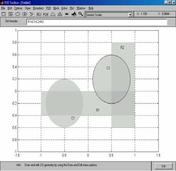

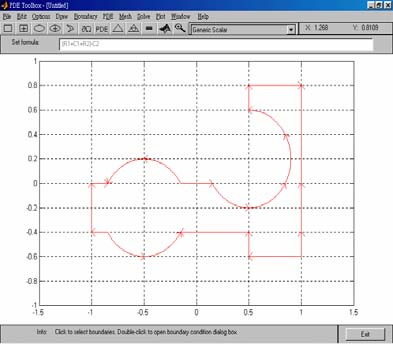

<!-- page: 368 -->

  图8  网格剖分求解区域                    图9  求解结果示意图

步骤6：选取solve 功能，解此PDE，见图9。

注意：
1. MATLAB 会以图形的方式展示结果，使用者亦可点选plot 下之“parameters”功
能，选择适当的方式显示图形及数据。例如用3D 方式显示求解结果。参数设置见图10，
显示结果见图11。

        图10  显示参数设置                     图11  求解结果显示

2. 另外，若使用者欲将结果输出到命令窗口中，以供后续处理，可利用solve 功能
项下之“export solution”指定变量名称来完成。

3. 如果求抛物型或双曲型方程的数值解，还需要通过“solve”菜单下的
“parameters…”选项设置初值条件。

4. 在上面定义边界条件和初始条件时，可以使用一些内置变量。
（1）在边界条件输入框中，可以使用如下变量：
二维坐标x 和y，边界线段长度参数s（s 是以箭头的方向沿边界线段从0 增加到1），
外法向矢量的分量nx 和ny（如果需要边界的切线方向，可以通过tx=-ny 和ty=nx 表示），
解u。

（2）在初值条件的输入框中，也可以输入用户定义的MATLAB 可接受变量（p，
e，t，x，y）的函数。

-268-

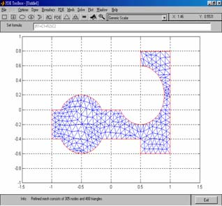

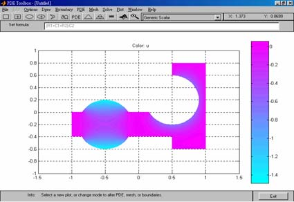

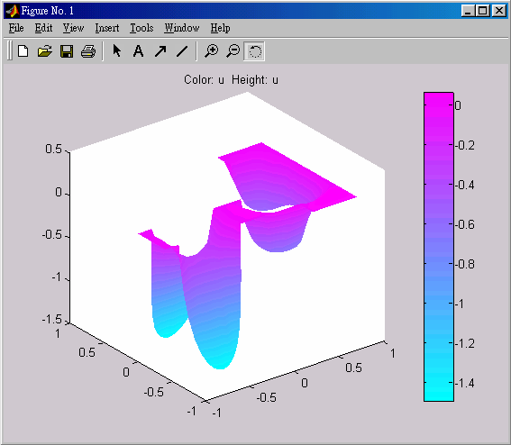

<!-- page: 369 -->

例11  使用PDETOOL 重新求例8 的数值解。
1）定义PDE 问题，包括二维空间范围，边界条件以及PDE 系数等。我们这里就
省略了。

2）区域剖分以后，通过“Mesh”菜单下的“Export Mesh…”选项可以把p，e，t
三个参数分别输出到工作间。

3）然后编写函数fun1(x,y)如下：
function f=fun1(x,y);
f=zeros(length(x),1);
ix=find(x.^2+y.^2<0.16);
f(ix)=1;
其中的变量x，y 是MATLAB 可接受的内置变量。

设置“solve”菜单下的“parameters…”选项如下：
时间框中输入：linspace(0,0.1,20)；
初值框中输入：fun1。
4）设置“plot"菜单下的“parameters…”选项如下：选择Height(3-D plot) 和Animation
两项。

5）用鼠标点一下工具栏上的“＝”按钮，就可以画出数值解的3-D 图形。

习 题 二 十
1. 求二维拉普拉斯方程

2
=
∂
∂
+
∂
∂
=
Δ
y

2

u
u

u
x

0
2

2

在边界条件
0
)
,
(
)
,
(
)
,
(
0
6
0
=
=
=
=
=
=
y
x
x
y
x
u
y
x
u
y
x
u
，
10
)
,
(
2 =
=
y
y
x
u
下的数值解。

2. 求初边值问题

⎧

<
<
>
∂
∂
=
∂
∂

2

u
t
u

x
t
x

1
0
,0
,
2

⎪⎪
⎪

≤
≤
=

x
x
u

1
0
,1
)
0,
(

⎨

⎪
⎪
⎪

=
−

t
u
t
u

0
)
,0
(
)
,0
(
'

x

≥
=
+

t
t
u
t
u

0
0
)
,1(
)
,1(
'

⎩

x

在
3
0
≤
≤t
范围内的数值解。
3. 求热传导方程初边值问题

⎧

<
<
<
<
∂
∂
=
∂
∂

2

u
t
u

t
x
x

5.0
0
,1
0
2

⎪
⎪

≤
≤
=

π

x
x
x
u

1
0
sin
)
0,
(

⎨

⎪
⎪

≤
≤
=
=

t
t
u
t
u

5.0
0
0
)
,1(
)
,0
(

⎩

的数值解，并将计算结果与准确解
x
e
t
x
u
t
π
π sin
)
,
(

2
−
=
比较。

-269-

<!-- page: 370 -->

第二十一章  目标规划

§1  引言

1．线性规划的局限性
只能解决一组线性约束条件下，某一目标只能是一个目标的最大或最小值的问题。
2．实际决策中，衡量方案优劣考虑多个目标
这些目标中，有主要的，也有次要的；有最大值的，也有最小值的；有定量的，
也有定性的；有相互补充的，也有相互对立的，LP 则无能为力。

3．目标规划（Goal Programming）
美国经济学家查恩斯（A. Charnes）和库柏（W. W. Cooper）在1961 年出版的《管
理模型及线性规划的工业应用》一书中，首先提出的。

4．求解思路
（1）加权系数法
为每一目标赋一个权系数，把多目标模型转化成单一目标的模型。但困难是要确
定合理的权系数，以反映不同目标之间的重要程度。

（2）优先等级法
将各目标按其重要程度不同的优先等级，转化为单目标模型。
（3）有效解法
寻求能够照顾到各个目标，并使决策者感到满意的解。由决策者来确定选取哪一个
解，即得到一个满意解。但有效解的数目太多而难以将其一一求出。
§2  目标规划的数学模型

为了具体说明目标规划与线性规划在处理问题的方法上的区别，先通过例子来介绍
目标规划的有关概念及数学模型。

例1  某工厂生产I，II 两种产品，已知有关数据见下表

                    I          II              拥有量
   原材料 kg        2          1              11
   设  备 hr        1          2              10
   利润 元/件       8          10
试求获利最大的生产方案。

解  这是一个单目标的规划问题，用线性规划模型表述为：
2
1
10
8
max
x
x
z
+
=

≤
+

⎧

11
2

x
x

2
1

⎪⎨

≤
+

x
x

10
2

2
1

⎪⎩

≥

x
x

0
,

2
1

最优决策方案为：
62
,3
,4
*
*
2
*
1
=
=
=
z
x
x
元。
但实际上工厂在作决策方案时，要考虑市场等一系列其它条件。如
（i）根据市场信息，产品I 的销售量有下降的趋势，故考虑产品I 的产量不大于
产品II。

（ii）超过计划供应的原材料，需要高价采购，这就使成本增加。
（iii）应尽可能充分利用设备，但不希望加班。

-253-

<!-- page: 371 -->

（iv）应尽可能达到并超过计划利润指标56 元。
这样在考虑产品决策时，便为多目标决策问题。目标规划方法是解决这类决策问题
的方法之一。下面引入与建立目标规划数学模型有关的概念。

1.
正、负偏差变量

设d 为决策变量的函数，正偏差变量
}
0,
max{
0
d
d
d
−
=
+
表示决策值超过目标值

的部分，负偏差变量
}
0,
min{
0
d
d
d
−
−
=
−
表示决策值未达到目标值的部分，这里
0
d 表

示d 的目标值。因决策值不可能既超过目标值同时又未达到目标值，即恒有

0
=
×
−
+
d
d
。
2.
绝对（刚性）约束和目标约束
绝对约束是指必须严格满足的等式约束和不等式约束；如线性规划问题的所有约束
条件，不能满足这些约束条件的解称为非可行解，所以它们是硬约束。目标约束是目标
规划特有的，可把约束右端项看作要追求的目标值。在达到此目标值时允许发生正或负
偏差，因此在这些约束中加入正、负偏差变量，它们是软约束。线性规划问题的目标函
数，在给定目标值和加入正、负偏差变量后可变换为目标约束。也可根据问题的需要将
绝对约束变换为目标约束。如：例1 的目标函数
2
1
10
8
x
x
z
+
=
可变换为目标约束

56
10
8
1
1
2
1
=
−
+
+
+
−
d
d
x
x
。绝对约束
11
2
2
1
≤
+ x
x
可变换为目标约束
11
2
2
2
2
1
=
−
+
+
+
−
d
d
x
x
。
3.
优先因子（优先等级）与权系数
一个规划问题常常有若干目标。但决策者在要求达到这些目标时，是有主次或轻重
缓急的不同。凡要求第一位达到的目标赋于优先因子
1P ，次位的目标赋于优先因子
L
,
2P
，并规定
q
k
P
P
k
k
,
,2,1
,
1
L
=
>>
+
。表示
kP 比
1
+
kP
有更大的优先权。以此类推，

若要区别具有相同优先因子的两个目标的差别，这时可分别赋于它们不同的权系数
j
w ，

这些都由决策者按具体情况而定。

4.
目标规划的目标函数
目标规划的目标函数（准则函数）是按各目标约束的正、负偏差变量和赋于相应的
优先因子而构造的。当每一目标值确定后，决策者的要求是尽可能缩小偏离目标值。因

此目标规划的目标函数只能是
)
,
(
min
−
+
=
d
d
f
z
。其基本形式有三种：
（1）要求恰好达到目标值，即正、负偏差变量都要尽可能地小，这时

)
(
min
−
+ +
=
d
d
f
z
（2）要求不超过目标值，即允许达不到目标值，就是正偏差变量要尽可能地小，
这时

)
(
min
+
=
d
f
z
（3）要求超过目标值，即超过量不限，但必须是负偏差变量要尽可能地小，这时

)
(
min
−
=
d
f
z
对每一个具体目标规划问题，可根据决策者的要求和赋于各目标的优先因子来构造目标
函数，以下用例子说明。

例2  例1 的决策者在原材料供应受严格限制的基础上考虑：首先是产品II 的产
量不低于产品I 的产量；其次是充分利用设备有效台时，不加班；再次是利润额不小于
56 元。求决策方案。
解  按决策者所要求的，分别赋于这三个目标
3
2
1
,
,
P
P
P
优先因子。这问题的数学

-254-

<!-- page: 372 -->

模型是

−
+
−
+
+
+
+
3
3
2
2
2
1
1
)
(
min
d
P
d
d
P
d
P

≤
+

⎧

11
2

x
x

2
1

⎪⎪
⎪

+
−

=
−
+
−

d
d
x
x

0

1
1
2
1

+
−

=
−
+
+

d
d
x
x

10
2

⎨

2
2
2
1

⎪
⎪
⎪

+
−

=
−
+
+

56
10
8

d
d
x
x

3
3
2
1

+
−

=
≥

i
d
d
x
x

.3,2,1
,0
,
,
,

⎩

2
1

i
i

5．目标规划的一般数学模型
    设
jx （
n
j
,
,2,1
L
=
）是目标规划的决策变量，共有m 个约束是刚性约束，

可能是等式约束，也可能是不等式约束。设有l 个柔性目标约束，其目标规划约束的偏

差为
−
+

i
i d
d ,
（
l
i
,
,2,1
L
=
）。设有q 个优先级别，分别为
qP
P
P
,
,
,
2
1
L
。在同一个优先

级
kP 中，有不同的权重，分别记为
)
,
,2,1
(
,
l
j
w
w
kj
kj
L
=
−
+
。因此目标规划模型的一般

数学表达式为

⎛
+
=
∑
∑

⎞
⎜⎜
⎝

q

l

⎟⎟
⎠

+
+
−
−

1
1
min

k
d
w
d
w
P
z

j
kj
j
kj

=

=

k

j

⎧

n

∑

=
≥
=
≤

m
i
b
x
a

,
,1
,
)
,
(

L

⎪⎪
⎪
⎪

i
j
ij

=

j

1

n

∑

+
−

=
=
−
+

l
i
g
d
d
x
c

,
,2,1
,

L

⎨

i
i
i
j
ij

⎪
⎪
⎪
⎪

=

j

1

=
≥

n
j
x

,
,2,1
,0

L

j

+
−

=
≥

l
i
d
d

,
,2,1
,0
,

L

⎩

i
i

建立目标规划的数学模型时，需要确定目标值、优先等级、权系数等，它都具有一
定的主观性和模糊性，可以用专家评定法给以量化。
§3  求解目标规划的序贯式算法

序贯式算法是求解目标规划的一种早期算法，其核心是根据优先级的先后次序，
将目标规划问题分解成一系列的单目标规划问题，然后再依次求解。

求解目标规划的序贯算法
对于
q
k
,
,2,1
L
=
，求解单目标规划

l

∑

+
+
−
−
+
=

1
)
(
min
                                  （1）

j
kj
j
kj
d
w
d
w
z

=

j

n

s.t.  ∑

=
≥
=
≤

1
,
,1
,
)
,
(
L
                            （2）

i
j
ij
m
i
b
x
a

=

j

n

    ∑

+
−
=
=
−
+

1
,
,2,1
,
L
                       （3）

i
i
i
j
ij
l
i
g
d
d
x
c

=

j

-255-

<!-- page: 373 -->

l

j
sj
j
sj
z
d
w
d
w
≤
+
∑

+
+
−
−
，
1
,
,2,1
−
=
k
s
L
，                  （4）

*

1
)
(
s

=

j

n
j
x j
,
,2,1
,0
L
=
≥
                                    （5）

l
i
d
d
i
i
,
,2,1
,0
,
L
=
≥
+
−
                                  （6）

其最优目标值为
*
kz ，当
1
=
k
时，约束（4）为空约束。当
q
k =
时，
*
qz 所对应的解
*x 为

目标规划的最优解。

注  此时最优解的概念与线性规划最优解的概念已有所不同，但为方便起见，仍
称为最优解。

例3  某企业生产甲、乙两种产品，需要用到
C
B
A
,
,
三种设备，关于产品的赢利
与使用设备的工时及限制如下表所示。问该企业应如何安排生产，才能达到下列目标：

                        甲                 乙                设备的生产能力（h）

A (h/件)                 2                  2                       12
B (h/件)                 4                  0                       16
C (h/件)                 0                  5                       15
赢利（元/件）           200                300
    （1）力求使利润指标不低于1500 元；

（2）考虑到市场需求，甲、乙两种产品的产量比应尽量保持1:2；
（3）设备A 为贵重设备，严格禁止超时使用；
（4）设备C 可以适当加班，但要控制；设备B 既要求充分利用，又尽可能不加班。
在重要性上，设备B 是设备C 的3 倍。

建立相应的目标规划模型并求解。
解  设备A 是刚性约束，其余是柔性约束。首先，最重要的指标是企业的利润，
因此，将它的优先级列为第一级；其次，甲、乙两种产品的产量保持1:2 的比例，列为
第二级；再次，设备
B
C,
的工作时间要有所控制，列为第三级。在第三级中，设备B 的

重要性是设备C 的三倍，因此，它们的权重不一样，设备B 前的系数是设备C 前系数
的3 倍。由此得到相应的目标规划模型。

)
3
3
(
)
(
min
4
3
3
3
2
2
2
1
1
+
−
+
−
+
−
+
+
+
+
+
=
d
d
d
P
d
d
P
d
P
z
                  （7）

s.t.
12
2
2
2
1
≤
+ x
x
                                                 （8）

1500
300
200
1
1
2
1
=
−
+
+
+
−
d
d
x
x
                                （9）

0
2
2
2
2
1
=
−
+
−
+
−
d
d
x
x
                                        （10）

16
4
3
3
1
=
−
+
+
−
d
d
x
                                            （11）

15
5
4
4
2
=
−
+
+
−
d
d
x
                                           （12）

0
,
,
,
2
1
≥
+
−

i
i d
d
x
x
，
4,3,2,1
=
i
                                  （13）

序贯算法中每个单目标问题都是一个线性规划问题，可以使用LINGO 软件进行求
解。

求第一级目标。LINGO 程序如下：
model:
sets:
variable/1..2/:x;

-256-

<!-- page: 374 -->

S_Con_Num/1..4/:g,dplus,dminus;
S_con(S_Con_Num,Variable):c;
endsets
data:
g=1500 0 16 15;
c=200 300 2 -1 4 0 0 5;
enddata
min=dminus(1);
2*x(1)+2*x(2)<12;
@for(S_Con_Num(i):@sum(Variable(j):c(i,j)*x(j))+dminus(i)-dplus(i
)=g(i));
end

求得dminus(1)=0，即目标函数的最优值为0，第一级偏差为0。
求第二级目标，LINGO 程序如下：
model:
sets:
variable/1..2/:x;
S_Con_Num/1..4/:g,dplus,dminus;
S_con(S_Con_Num,Variable):c;
endsets
data:
g=1500 0 16 15;
c=200 300 2 -1 4 0 0 5;
enddata
min=dplus(2)+dminus(2);    !二级目标函数;
2*x(1)+2*x(2)<12;
@for(S_Con_Num(i):@sum(Variable(j):c(i,j)*x(j))+dminus(i)-dplus(i
)=g(i));
dminus(1)=0;!一级目标约束;
@for(variable:@gin(x));
end

求得目标函数的最优值为0，即第二级的偏差仍为0。
求第三级目标，LINGO 程序如下：
model:
sets:
variable/1..2/:x;
S_Con_Num/1..4/:g,dplus,dminus;
S_con(S_Con_Num,Variable):c;
endsets
data:
g=1500 0 16 15;
c=200 300 2 -1 4 0 0 5;
enddata
min=3*dplus(3)+3*dminus(3)+dplus(4);    !三级目标函数;
2*x(1)+2*x(2)<12;
@for(S_Con_Num(i):@sum(Variable(j):c(i,j)*x(j))+dminus(i)-dplus(i
)=g(i));
dminus(1)=0;!一级目标约束;
dplus(2)+dminus(2)=0;!二级目标约束;
end

目标函数的最优值为29，即第三级偏差为29。

-257-

<!-- page: 375 -->

分析计算结果，
2
1 =
x
，
4
2 =
x
，
100
1 =
+
d
，因此，目标规划的最优解为
)
4,2
(
* =
x
，

最优利润为1600。

上述过程虽然给出了目标规划问题的最优解，但需要连续编几个程序，这样在使
用时不方便，下面用LINGO 软件，编写一个通用的程序，在程序中用到数据段未知数
据的编程方法。

例4（续例3）  按照序贯式算法，编写求解例3 的通用LINGO 程序。
model:
sets:
level/1..3/:p,z,goal;
variable/1..2/:x;
h_con_num/1..1/:b;
s_con_num/1..4/:g,dplus,dminus;
h_con(h_con_num,variable):a;
s_con(s_con_num,variable):c;
obj(level,s_con_num)/1 1,2 2,3 3,3 4/:wplus,wminus;
endsets
data:
ctr=?;
goal=? ? 0;
b=12;
g=1500 0 16 15;
a=2 2;
c=200 300 2 -1 4 0 0 5;
wplus=0 1 3 1;
wminus=1 1 3 0;
enddata
min=@sum(level:p*z);
p(ctr)=1;
@for(level(i)|i#ne#ctr:p(i)=0);
@for(level(i):z(i)=@sum(obj(i,j):wplus(i,j)*dplus(j)+wminus(i,j)*
dminus(j)));
@for(h_con_num(i):@sum(variable(j):a(i,j)*x(j))<b(i));
@for(s_con_num(i):@sum(variable(j):c(i,j)*x(j))+dminus(i)-dplus(i
)=g(i));
@for(level(i)|i #lt# @size(level):@bnd(0,z(i),goal(i)));
end

当程序运行时，会出现一个对话框。
在做第一级目标计算时，ctr 输入1，goal(1)和goal(2)输入两个较大的值，表明这
两项约束不起作用。求得第一级的最优偏差为0，进行第二轮计算。

在第二级目标的运算中，ctr 输入2。由于第一级的偏差为0，因此goal(1)的输入值
为0，goal(2)输入一个较大的值。求得第二级的最优偏差仍为0，进行第三级计算。

在第三级的计算中，ctr 输入3。由于第一级、第二级的偏差均是0，因此，goal(1)
和goal(2)的输入值也均是0。最终结果是：
2
1 =
x
，
4
2 =
x
，最优利润是1600 元，第
三级的最优偏差为29。
§4  多标规划的Matlab 解法

多目标规划可以归结为

-258-

<!-- page: 376 -->

γ γ
,
min

x

使得
goal
weight
x
F
≤
⋅
−
γ
)
(

beq
x
Aeq
b
x
A
=
⋅
≤
⋅
,

0
)
(
,0
)
(
=
≤
x
ceq
x
c

ub
x
lb
≤
≤
其中
lb
beq
b
goal
weight
x
,
,
,
,
,
和ub 是向量，A 和Aeq 是矩阵；
)
(
),
(
x
ceq
x
c
和
)
(x
F

是向量函数，他们可以是非线性函数。
)
(x
F
是所考虑的目标函数，goal 是欲达到的
目标，多目标规划的Matlab 函数fgoalattain 的用法为
          ［x,fval］= fgoalattain('fun',x0,goal,weight)
          ［x,fval］= fgoalattain('fun',x0,goal,weight,A,b)
          ［x,fval］= fgoalattain('fun',x0,goal,weight,A,b,Aeq,beq)
          ［x,fval］= fgoalattain('fun',x0,goal,weight,A,b,Aeq,beq,lb,ub,nonlcon)
其中fun 是用M 文件定义的目标向量函数，x0 是初值，weight 是权重。A,b 定义不等
式约束A*x≤b，Aeq,beq 定义等式约束Aeq*x=Beq，nonlcon 是用M 文件定义的非线性
约束c(x)≤0，ceq(x)=0。返回值fval 是目标向量函数的值。

要完整掌握其用法，请用 help  fgoalattain 或 type  fgoalattain 查询相关的帮助。
例5  求解多目标线性规划问题

+
+
+
=

70
80
90
100
max

x
x
x
x
Z

4
3
2
1
1
2
3
min

+
=

x
x
Z

4
2
2

≥
+

⎧

x
x

30

2
1

⎪⎪
⎪

≥
+

x
x

30

4
3

≤
+

120
2
3

x
x

⎨

3
1

⎪
⎪
⎪

≤
+

48
2
3

x
x

4
2

=
≥

L
i
x

4,
,1
  ,0

⎩

i

解  （i）编写 M 函数 Fun.m:
function F=Fun(x);
F(1)=-100*x(1)-90*x(2)-80*x(2)-70*x(4);
F(2)=3*x(2)+2*x(4);
（ii）编写 M 文件
a=[-1 -1  0  0
   0  0  -1 -1
   3  0   2  0
   0  3   0  2];
b=[-30 -30 120 48]';
c1=[-100 -90 -80 -70];
c2=[0 3 0 2];
[x1,g1]=linprog(c1,a,b,[],[],zeros(4,1))  %求第一个目标函数的目标值
[x2,g2]=linprog(c2,a,b,[],[],zeros(4,1))  %求第二个目标函数的目标值
g3=[g1;g2]  %目标goal的值
[x,fval]=fgoalattain('Fun',rand(4,1),g3,abs(g3),a,b,[],[],zeros(4
,1))

-259-

<!-- page: 377 -->

%这里权重weight=目标goal的绝对值

就可求得问题的解。
§5  目标规划模型的实例

前面介绍了目标规划的求解方法，这里再介绍几个目标规划模型的模型，帮助我
们进一步了解目标规划模型的建立和求解过程。

例6  某计算机公司生产三种型号的笔记本电脑
C
B
A
,
,
。这三种笔记本电脑需要

在复杂的装配线上生产，生产1台
C
B
A
,
,
型号的笔记本电脑分别需要5，8，12（h）。公

司装配线正常的生产时间是每月1700h。公司营业部门估计
C
B
A
,
,
三种笔记本电脑的利
润分别是每台1000，1440，2520（元），而公司预测这个月生产的笔记本电脑能够全部
售出。公司经理考虑以下目标：

第一目标：充分利用正常的生产能力，避免开工不足；
第二目标：优先满足老客户的需求，
C
B
A
,
,
三种型号的电脑50，50，80（台），
同时根据三种电脑的纯利润分配不同的权因子；

第三目标：限制装配线加班时间，最好不要超过200h；
第四目标：满足各种型号电脑的销售目标，
C
B
A
,
,
型号分别为100，120，100（台），
再根据三种电脑的纯利润分配不同的权因子；

第五目标：装配线的加班时间尽可能少。
请列出相应的目标规划模型，并用LINGO软件求解。
解  建立目标约束。
（1）装配线正常生产

设生产
C
B
A
,
,
型号的电脑为
3
2
1
,
,
x
x
x
（台），
−
1d 为装配线正常生产时间未利用数，

+
1d 为装配线加班时间，希望装配线正常生产，避免开工不足，因此装配线目标约束为

⎪⎨
⎧

−

}
{
min

d

1
d
d
x
x
x

                                 （14）

⎪⎩

=
−
+
+
+
+
−

1700
12
8
5

1
1
3
2
1

（2）销售目标
优先满足老客户的需求，并根据三种电脑的纯利润分配不同的权因子，
C
B
A
,
,
三

种型号的电脑每小时的利润是
12
2520
,
8
1440
,
5
1000
，因此，老客户的销售目标约束为

⎧

−
−
−

+
+

}
21
18
20
{
min

d
d
d

4
3
2

⎪
⎪

+
−

=
−
+

d
d
x

50

2
2
1

⎨

                                       （15）

+
−

=
−
+

d
d
x

50

⎪
⎪

3
3
2

+
−

=
−
+

d
d
x

80

⎩

4
4
3

再考虑一般销售。类似上面的讨论，得到

⎧

−
−
−

+
+

}
21
18
20
{
min

d
d
d

7
6
5

⎪
⎪

+
−

=
−
+

d
d
x

100

5
5
1

⎨

                                       （16）

+
−

=
−
+

d
d
x

120

⎪
⎪

6
6
2

+
−

=
−
+

d
d
x

100

⎩

7
7
3

（3）加班限制

-260-

<!-- page: 378 -->

首先是限制装配线加班时间，不允许超过200h，因此得到

⎪⎨
⎧

−

}
{
min

d

8
d
d
x
x
x

                                 （17）

⎪⎩

=
−
+
+
+
+
−

1900
12
8
5

8
8
3
2
1

其次装配线的加班时间尽可能少，即

⎪⎨
⎧

+

}
{
min

d

1
d
d
x
x
x

                                 （18）

⎪⎩

=
−
+
+
+
+
−

1700
12
8
5

1
1
3
2
1

写出目标规划的数学模型

+
−
−
−
−

+
+
+
+
=

)
21
18
20
(
min

d
P
d
d
d
P
d
P
z

8
3
4
3
2
2
1
1
)
21
18
20
(

+
−
−
−

+
+
+
+

d
P
d
d
d
P

1
5
7
6
5
4

s.t.
1700
12
8
5
1
1
3
2
1
=
−
+
+
+
+
−
d
d
x
x
x

+
−

=
−
+

d
d
x

50

2
2
1

+
−

=
−
+

d
d
x

50

3
3
2

+
−

=
−
+

d
d
x

80

4
4
3

+
−

=
−
+

d
d
x

100

5
5
1

+
−

=
−
+

d
d
x

120

6
6
2

+
−

=
−
+

d
d
x

100

7
7
3

1900
12
8
5
8
8
3
2
1
=
−
+
+
+
+
−
d
d
x
x
x

0
,
,
,
2
1
≥
+
−

i
i d
d
x
x
，
8,
,2,1
L
=
i

写出相应的LINGO程序如下：
model:
sets:
level/1..5/:p,z,goal;
variable/1..3/:x;
s_con_num/1..8/:g,dplus,dminus;
s_con(s_con_num,variable):c;
obj(level,s_con_num)/1 1,2 2,2 3,2 4,3 8,4 5,4 6,4 7,5
1/:wplus,wminus;
endsets
data:
ctr=?;
goal=? ? ? ? 0;
g=1700 50 50 80 100 120 100 1900;
c=5 8 12 1 0 0 0 1 0 0 0 1 1 0 0 0 1 0 0 0 1 5 8 12;
wplus=0 0 0 0 1 0 0 0 1;
wminus=1 20 18 21 0 20 18 21 0;
enddata
min=@sum(level:p*z);
p(ctr)=1;
@for(level(i)|i#ne#ctr:p(i)=0);
@for(level(i):z(i)=@sum(obj(i,j):wplus(i,j)*dplus(j)+wminus(i,j)*
dminus(j)));
@for(s_con_num(i):@sum(variable(j):c(i,j)*x(j))+dminus(i)-dplus(i

-261-

<!-- page: 379 -->

)=g(i));
@for(level(i)|i #lt# @size(level):@bnd(0,z(i),goal));
End

经5次计算得到
100
1 =
x
，
55
2 =
x
，
80
3 =
x
。装配线生产时间为1900h，满足装配

线加班不超过200h的要求。能够满足老客户的需求，但未能达到销售目标。销售总利润为

380800
2520
80
1440
55
1000
100
=
×
+
×
+
×
（元）
例7  已知三个工厂生产的产品供应给四个客户，各工厂生产量、用户需求量及从
各工厂到用户的单位产品的运输费用如下表所示，其中总生产量小于总需求量。

用 户         1           2          3          4          生产量
工厂1         5           2          6          7          300
工厂2         3           5          4          6          200
工厂3         4           5          2          3          400
需求量       200         100        450        250

（1）求总运费最小的运输问题的调度方案。
（2）上级部门经研究后，制定了调配方案的8项指标，并规定了重要性的次序。
第一目标：用户4为重要部门，需求量必须全部满足；
第二目标：供应用户1的产品中，工厂3的产品不少于100个单位；
第三目标：每个用户的满足率不低于80％；
第四目标：应尽量满足各用户的需求；
第五目标：新方案的总运费不超过原运输问题的调度方案的10％；
第六目标：因道路限制，工厂2到用户4的路线应尽量避免运输任务；
第七目标：用户1和用户3的满足率应尽量保持平衡；
第八目标：力求减少总运费。
请列出相应的目标规划模型，并用LINGO程序求解。
解  （1）求解原运输问题
由于总生产量小于总需求量，虚设工厂4，生产量为100个单位，到各个用户间的运
费单价为0。用LINGO软件求解，得到总运费是2950元，运输方案如下表所示。

用 户         1           2          3          4          生产量
工厂1                    100         200                     300
工厂2        200                                             200
工厂3                                250        150          400
工厂4                                           100          100
需求量       200         100         450        250

（2）下面按照目标的重要性的等级列出目标规划的约束和目标函数。
设
ijx 为工厂
)
3,2,1
( =
i
i
调配给用户
)
4,3,2,1
( =
j
j
的运量，
ijc 表示从工厂i 到用户j

的单位产品的运输费用，
)
4,3,2,1
( =
j
a j
表示第j 个用户的需求量，
)
3,2,1
( =
i
bi
表示第i

个工厂的生产量。

i）供应约束应严格满足，即

4

ij
b
x ≤
∑

i
j

1

=

ii）供应用户1的产品中，工厂3的产品不少于100个单位，即

100
1
1
31
=
−
+
+
−
d
d
x

iii）需求约束。各用户的满足率不低于80％，即

-262-

<!-- page: 380 -->

160
2
2
31
21
11
=
−
+
+
+
+
−
d
d
x
x
x

80
3
3
32
22
12
=
−
+
+
+
+
−
d
d
x
x
x

360
4
4
33
23
13
=
−
+
+
+
+
−
d
d
x
x
x

200
5
5
34
24
14
=
−
+
+
+
+
−
d
d
x
x
x

应尽量满足各用户的需求，即

200
6
6
31
21
11
=
−
+
+
+
+
−
d
d
x
x
x

100
7
7
32
22
12
=
−
+
+
+
+
−
d
d
x
x
x

450
8
8
33
23
13
=
−
+
+
+
+
−
d
d
x
x
x

250
9
9
34
24
14
=
−
+
+
+
+
−
d
d
x
x
x

iv）新方案的总运费不超过原方案的10％（原运输方案的运费为2950元），即

3

4

=
=
∑∑
d
d
x
c

1
=
−
+
+
−

3245
10
10

ij

ij
j

i

1

v）工厂2到用户4的路线应尽量避免运输任务，即

0
11
11
24
=
−
+
+
−
d
d
x

vi）用户1和用户3的满足率应尽量保持平衡，即

0
)
(
450
200
)
(
12
12
33
23
13
31
21
11
=
−
+
+
+
−
+
+
+
−
d
d
x
x
x
x
x
x

vii）力求总运费最少，即

3

4

=
=
∑∑
d
d
x
c

1
=
−
+
+
−

2950
13
13

ij

ij
j

i

1

目标函数为

−
−
−
−
−
−
−
−
−
−

+
+
+
+
+
+
+
+
+
=

)
(
)
(
min

d
d
d
d
P
d
d
d
d
P
d
P
d
P
z

9
8
7
6
4
5
4
3
2
3
1
2
9
1
)
(

+
+
−
+
+

+
+
+
+
+

d
P
d
d
P
d
P
d
P

13
8
12
12
7
11
6
10
5

编写LINGO程序如下：
model:
sets:
level/1..8/:p,z,goal;
s_con_num/1..13/:g,dplus,dminus;
plant/1..3/:a;
customer/1..4/:b;
routes(plant,customer):c,x;
obj(level,s_con_num)/1 9,2 1,3 2,3 3,3 4,3 5,4 6,4 7,4 8,4 9,5 10,6
11,7 12,8 13/:wplus,wminus;
endsets
data:
ctr=?;
goal=? ? ? ? ? ? ? 0;
a=300 200 400;
b=200 100 450 250;
c=5 2 6 7 3 5 4 6 4 5 2 3;
wplus=0 0 0 0 0 0 0 0 0 0 1 1 1 1;
wminus=1 1 1 1 1 1 1 1 1 1 0 0 1 0;

-263-

<!-- page: 381 -->

enddata
min=@sum(level:p*z);
p(ctr)=1;
@for(level(i)|i#ne#ctr:p(i)=0);
@for(level(i):z(i)=@sum(obj(i,j):wplus(i,j)*dplus(j)+wminus(i,j)*
dminus(j)));
@for(plant(i):@sum(customer(j):x(i,j))<a(i));
x(3,1)+dminus(1)-dplus(1)=100;
@for(customer(j):@sum(plant(i):x(i,j))+dminus(1+j)-dplus(1+j)=0.8
*b(j);
@sum(plant(i):x(i,j))+dminus(5+j)-dplus(5+j)=b(j));
@sum(routes:c*x)+dminus(10)-dplus(10)=3245;
x(2,4)+dminus(11)-dplus(11)=0;
@sum(plant(i):x(i,1))-20/45*@sum(plant(i):x(i,3))+dminus(12)-dplu
s(12)=0;
@sum(routes:c*x)+dminus(13)-dplus(13)=2950;
@for(level(i)|i #lt# @size(level):@bnd(0,z(i),goal));
End

经8次运算，得到最终的计算结果，见下表。总运费为3360元，高于原运费410元，超
过原方案10％的上限115元。

用 户         1           2          3          4          生产量
工厂1                    100                    200          300
工厂2        90                      110                     200
工厂3        100                     250        50           400
实际运量     190         100         360        250
需求量       200         100         450        250

例8  某公司从三个仓库向四个用户提供某种产品。仓库与用户所在地的供需量及
单位运价见下表。

                                                     单位：元/件

1
B
2
B
3
B
4
B          供应量（件）

1A             5           2           6            7              300

2
A             3           5           4            6              200

3
A             4           5           2            3              400

需求量（件）    200          100         450          250

    公司有关部门根据供求关系和经营条件，确定了下列目标：

1P ：完全满足用户
4
B 的需要；

2P ：
3
A 向
1
B 提供的产品数量不少于100件；

3P ：每个用户的供应量不少于其需求的80%；

4P ：从仓库
1A 到用户
2
B 之间的公路正在大修，运货量应尽量少；

5P ：平衡用户
1
B 和
2
B 的供货满意水平；

6P ：力求总运费最省；

试求满意的调运方案。

解  这是具有6个优先级目标的运输问题。设
ijx 为从仓库
iA 到用户
j
B 的运输量

-264-

<!-- page: 382 -->

（
3,2,1
=
i
；
4,3,2,1
=
j
），
+
−

k
k d
d ,
为第k 个目标约束中，未达到规定目标的负偏差和

超过目标的正偏差。
ia （
3,2,1
=
i
）是第i 个仓库的供应量。

约束条件有以下几种：
i）供应约束（硬约束）。

4

ij
a
x ≤
∑

1
，
3,2,1
=
i

i
j

=

ii）需求约束。由于产品供不应求，向各用户的实际供应量不可能超过需求量，所

以需求正偏差没有意义。记
−
j
d 为各用户需求量的负偏差，
jb 是各用户的需求量

（
4,3,2,1
=
j
），约束为

3

=∑

ij
b
d
x
=
+
−

1
，
4,3,2,1
=
j

j
j
i

iii）
3
A 向
1
B 的供货约束：

100
5
5
31
=
−
+
+
−
d
d
x

iv）至少满足用户需求80％的约束：

3

+
=∑
，
4,3,2,1
=
j

1
=
−
+
+

+
−

ij
b
d
d
x
8.0
5
5

j
j
j
i

v）
1A 到
2
B 的运货量尽量少，也就是运货量尽可能为零。显然，负偏差没有意义，
故有

0
10
12
=
−
+
d
x

vi）平衡用户
1
B 和
4
B 的满意水平，也就是供应率要相同。约束条件为

3

3

0
450
200
11
11

=
=
∑
∑
d
d
x
x

1
1
=
−
+
−
+
−

i

i
i

1
3

i

vii）运费尽量少，即尽量等于零，负偏差没有意义。所以

3

4

1
=
−
∑∑

+

0

ij
ij
d
x
c

1
12

=
i
j

=

目标函数为

+
+
−
+
−
−
−
−
−
−
+
+
+
+
+
+
+
+
+
=
12
6
11
11
5
10
4
9
8
7
6
3
5
2
4
1
)
(
)
(
min
d
P
d
d
P
d
P
d
d
d
d
P
d
P
d
P
z

计算程序如下。
model:
sets:
plant/A1..A3/:a;
customer/B1..B4/:b;
routes(plant,customer):c,x;
deviation/1..12/:d1,d2,p1,p2;
endsets
data:
a=300 200 400;
b=200 100 450 250;
c=5 2 6 7 3 5 4 6 4 5 2 3;
p1=0,0,0,100000,10000,1000,1000,1000,1000,0,10,0;
p2=0,0,0,0,0,0,0,0,0,100,10,1;

-265-

<!-- page: 383 -->

enddata
@for(plant(i):[con1]@sum(customer(j):x(i,j))<a(i));
@for(customer(j):[con2]@sum(plant(i):x(i,j))+d1(j)=b(j));
[con3] x(3,1)+d1(5)-d2(5)=100;
@for(customer(j):[con4]@sum(plant(i):x(i,j))+d1(5+j)-d2(5+j)=0.8*
b(j));
[con5] x(1,2)-d2(10)=0;
[con6]
@sum(plant(i):x(i,1))-4/9*@sum(plant(i):x(i,3))+d1(11)-d2(11)=0;
[con7] @sum(routes:c*x)-d2(12)=0;
[obj] min=@sum(deviation:p1*d1+p2*d2);
End

程序中集合Deviation的属性d1，d2分别为各个负、正偏差变量，p1，p2分别为目标
函数中负、正偏差变量的系数。各优先级取值为：

5
1
10
=
P
，
4
2
10
=
P
，
3
3
10
=
P
，
2
4
10
=
P
，
10
5 =
P
，
1
1 =
P

    上述程序目标函数的值为3570，观察d1，d2的值可以看出最小运费为3570元。
§6  数据包络分析

1978年A. Charnes, W. W. Cooper和E. Rhodes给出了评价多个决策单元（Decision
Making Units，简称DMU）相对有效性的数据包络分析方法（data envelopment analysis,
DEA）。

目前，数据包络分析是评价具有多指标输入和多指标输出系统的较为有效的方法。
6.1  数据包络分析的基本概念
（1）相对有效评价问题
例9（多指标评价问题） 某市教委需要对六所重点中学进行评价，其相应的指标
如下表所示。表中的生均投入和非低收入家庭百分比是输入指标，生均写作得分和生均
科技得分是输出指标。请根据这些指标，评价哪些学校是相对有效的。

学    校              A         B         C         D         E        F
生均投入(百元/年)     89.39      86.25        108.13    106.38      62.40      47.19
非低收入家庭百分比(%) 64.3       99           99.6      96          96.2       79.9
生均写作得分(分)      25.2       28.2         29.4      26.4        27.2       25.2
生均科技得分(分)      223        287          317       291         295        222

为求解例9，先对上表作简单的分析。
学校C 的两项输出指标都是最高的，达到29.4和317，应该说，学校C 是最有效的。
但从另一方面说，对它的投入也是最高的，达到108.13和99.6，因此，它的效率也可能
是最低的。究竟如何评价这六所学校呢？这还需要仔细地分析。

这是一个多指标输入和多指标输出的问题，对于这类评价问题，A. Charnes, W. W.
Cooper和E. Rhodes建立了评价决策单元相对有效性的C2R模型。

（2）数据包络分析的C2R模型
数据包络分析有多种模型，其中C2R（由Charnes，Cooper和Rhodes三位作者的第一
个英文字母命名）的建模思路清晰、模型形式简单、理论完善。设有n 个DMU，每个
DMU都有m 种投入和s 种产出，设
ijx （
m
i
,
,1 L
=
，
n
j
,
,1 L
=
）表示第j 个DMU

的第i 种投入量，
rj
y （
s
r
,
,1 L
=
，
n
j
,
,1 L
=
）表示第j 个DMU的第r 种产出量，iv

)
,
,1
(
m
i
L
=
表示第i 种投入的权值，
ru （
s
r
,
,1 L
=
）表示第r 种产出的权值。

-266-

<!-- page: 384 -->

向量
)
,
,1
(
,
n
j
Y
X
j
j
L
=
分别表示决策单元j 的输入和输出向量，v 和u 分别表示

输入、输出权值向量，则
T
mj
j
j
j
x
x
x
X
)
,
,
,
(
2
1
L
=
，
T
sj
j
j
j
y
y
y
Y
)
,
,
,
(
2
1
L
=
，

T
m
u
u
u
u
)
,
,
,
(
2
1
L
=
，
T
sv
v
v
v
)
,
,
,
(
2
1
L
=
。

定义决策单元j 的效率评价指数为

)
/(
)
(
j
T
j
T
j
X
v
Y
u
h =
，（
n
j
,
,2,1
L
=
）

评价决策单元
0j 效率的数学模型为

j
T

Y
u

0
max

j
T

X
v

0

⎧

j
T

Y
u

=
≤

n
j
X
v

,
,2,1
,1

⎪⎨

L

j
T

s.t.

                                   （19）

⎪⎩

≠
≠
≥
≥

v
u
v
u

0
,0
,0
,0

1

通过Charnes-Cooper变换：
tv
=
ω
，
tu
=
μ
，

j
T X
v
t =
，可以将模型（19）变化

0

为等价的线性规划问题

0
0
max
j
T
j
Y
V
μ
=

⎧

μ
ω

=
≥
−

j
T
j
T

n
j
Y
X
L

,
,2,1
,0

⎪⎪
⎨

ω

=

j
T

X

1

s.t.

                             （20）

0
μ
ω

⎪⎪
⎩

≥
≥

0
,0

可以证明，模型（19）与模型（20）是等价的。由于线性规划问题的对偶线性规
划模型具有明确的经济意义。下面写出模型（20）的对偶形式

θ
min

⎧

n

∑

θ
λ

≤

X
X

⎪⎪
⎪
⎪

j
j

j

0

=

j

1

n

∑

λ

≥

Y
Y

⎨

s.t.

                                         （21）

j

j
j

0

⎪⎪
⎪
⎪

=

j

1

L
λ

=
≥

,
,2,1
,0

n
j

j

⎩

对于C2R模型（20），有如下定义。
定义1  若线性规划问题（20）的最优目标值
1
0 =
j
V
，则称决策单元
0j 是弱DEA

有效的。

定义2  若线性规划问题（20）存在最优解
0
0 >
j
ω
，
0
0 >
j
μ
，并且其最优目标值

1
0 =
j
V
，则称决策单元
0j 是DEA有效的。

从上述定义可以看出，所谓DEA有效，就是指那些决策单元，它们的投入产出比
达到最大。因此，我们可以用DEA来对决策单元进行评价。

-267-

<!-- page: 385 -->

（3）C2R模型的求解
从上面的模型可以看到，求解C2R模型，需要求解若干个线性规划，这一点可以用
LINGO软件完成。

例10（续例9） 运用C2R模型（20）求解例9。
解  按照C2R模型写出相应的LINGO程序如下：
model:
sets:
dmu/1..6/:s,t,p;    !决策单元;
inw/1..2/:w;        !输入权重;
outw/1..2/:u;       !输出权重;
inv(inw,dmu):x;     !输入变量;
outv(outw,dmu):y;
endsets
data:
ctr=?;
x=89.39      86.25        108.13    106.38      62.40      47.19
  64.3       99           99.6      96          96.2       79.9;
y=25.2       28.2         29.4      26.4        27.2       25.2
  223        287          317       291         295        222;
enddata
max=@sum(dmu:p*t);
p(ctr)=1;
@for(dmu(i)|i#ne#ctr:p(i)=0);
@for(dmu(j):s(j)=@sum(inw(i):w(i)*x(i,j));
t(j)=@sum(outw(i):u(i)*y(i,j));s(j)>t(j));
@sum(dmu:p*s)=1;
end

在上述程序中，ctr的值分别输入
6,
,2,1
L
，经过6次计算，得到6个最优目标值

1，0.9096132，0.9635345，0.9143053，1，1
并且对于学校A （决策单元1）有
0
,0
1
2
>
>
μ
ω
，对于学校E （决策单元5）有
0
1 >
ω
，
0
2 >
μ
和对于学校F（决策单元6）有
0
,0
1
1
>
>
μ
ω
。因此，学校
F
E
A
,
,
是DEA有效的。

习题二十一
1. 试求解多目标线性规划问题

≤
+

⎧

x
x

7

2
1

⎪⎪
⎨

+
=

≤

⎩
⎨
⎧

3
max
x
x
z

x
x
z

x

5

2
1
1
2

1

        s.t.

+
=

≤

x

5

⎪
⎪
⎩

2
1
2

2

≥

x
x

0
,

2
1

2．一个小型的无线电广播台考虑如何最好地安排音乐、新闻和商业节目时间。依
据法律，该台每天允许广播12小时，其中商业节目用以赢利，每分钟可收入250美元，
新闻节目每分钟需支出40美元，音乐节目每播一分钟费用为17.50美元。法律规定，正
常情况下商业节目只能占广播时间的20%，每小时至少安排5分钟新闻节目。问每天的
广播节目该如何安排？优先级如下：

1p ：满足法律规定的要求；

2
p ：每天的纯收入最大。

-268-

<!-- page: 386 -->

试建立该问题的目标规划模型。
3. 某工厂生产两种产品,每件产品I可获利10元，每件产品II可获利8元。每生产一件
产品I，需要3小时；每生产一件产品II，需要2.5小时。每周总的有效时间为120小时。
若加班生产，则每件产品I的利润降低1.5元；每件产品II的利润降低1元。决策者希望在
允许的工作及加班时间内取最大利润，试建立该问题的目标规划模型，并求解。

-269-

<!-- page: 387 -->

第二十二章  模糊数学模型

§1  模糊数学的基本概念

1.1  模糊数学简介

1965 年，美国著名计算机与控制专家查德(L.A.Zadeh)教授提出了模糊的概念，并

在国际期刊《Information and Control》并发表了第一篇用数学方法研究模糊现象的论文

“Fuzzy Sets”(模糊集合)，开创了模糊数学的新领域。

模糊是指客观事物差异的中间过渡中的“不分明性”或“亦此亦彼性”。如高个子

与矮个子、年轻人与老年人、热水与凉水、环境污染严重与不严重等。在决策中，也有

这种模糊的现象，如选举一个好干部，但怎样才算一个好干部？好干部与不好干部之间

没有绝对分明和固定不变的界限。这些现象很难用经典的数学来描述。

模糊数学就是用数学方法研究与处理模糊现象的数学。它作为一门崭新的学科，它

是继经典数学、统计数学之后发展起来的一个新的数学学科。经过短暂的沉默和争议之

后，迅猛的发展起来了，而且应用越来越广泛。如今的模糊数学的应用已经遍及理、工、

农、医及社会科学的各个领域，充分的表现了它强大的生命力和渗透力。

统计数学是将数学的应用范围从确定性的领域扩大到了不确定性的领域，即从必然

现象到偶然现象，而模糊数学则是把数学的应用范围从确定领域扩大到了模糊领域，即

从精确现象到模糊现象。

实际中，我们处理现实的数学模型可以分成三大类：第一类是确定性数学模型，即

模型的背景具有确定性，对象之间具有必然的关系。第二类是随机性的数学模型，即模

型的背景具有随机性和偶然性。第三类是模糊性模型，即模型的背景及关系具有模糊性。

1.2  基本概念

1.2.1  模糊集和隶属函数

定义1  论域X 到
]1,0
[
闭区间上的任意映射

A
μ ：
]1,0
[
→
X

-257-

<!-- page: 388 -->

)
(x
x
A
μ
→

都确定X 上的一个模糊集合A ，
A
μ 叫做A 的隶属函数，
)
(x
A
μ
叫做x 对模糊集A 的

隶属度，记为：

}
|
))
(
,
{(
X
x
x
x
A
A
∈
=
μ

使
5.0
)
(
=
x
A
μ
的点
0x 称为模糊集A 的过渡点，此点最具模糊性。

显然，模糊集合A 完全由隶属函数
A
μ 来刻画，当
}
1,0
{
)
(
=
x
A
μ
时，A 退化为一

个普通集。

1.2.2  模糊集合的表示方法

当论域X 为有限集时，记
}
,
,
,
{
2
1
nx
x
x
X
L
=
，则X 上的模糊集A 有下列三种常

见的表示形式。

i)  zadeh 表示法

当论域X 为有限集时，记
}
,
,
,
{
2
1
nx
x
x
X
L
=
，则X 上的模糊集A 可以写成

μ
μ
μ
μ
+
+
+
=
=∑

n
A
A
A
n

i
A
)
(
)
(
)
(
)
(

x
x

x
x

x
x

A

1

2

L

x

=

i
i

1

1

2

n

x )
(
μ
”不是

注：“∑
”和“+”不是求和的意思，只是概括集合诸元的记号；“

i
A

x

i

分数，它表示点
ix 对模糊集A 的隶属度是
)
(
i
A x
μ
。

ii)  序偶表示法

))}
(
,
(,
)),
(
,
(
)),
(
,
{(
2
2
1
1
n
A
n
A
A
x
x
x
x
x
x
A
μ
μ
μ
L
=

iii)  向量表示法

))
(
,
),
(
),
(
(
2
1
n
A
A
A
x
x
x
A
μ
μ
μ
L
=

当论域X 为无限集时，X 上的模糊集A 可以写成

-258-

<!-- page: 389 -->

x
A
)
(
μ

∫
∈
=

A

x

X
x

x )
(
μ
”也不是分数。

注：“ ∫
”也不是表示积分的意思，“

i
A

x

i

例1  设论域
)}
190
(
),
180
(
),
170
(
),
160
(
),
150
(
),
140
(
{
6
5
4
3
2
1
x
x
x
x
x
x
X =
(单位:

cm)表示人的身高，X 上的一个模糊集“高个子”( A )的隶属函数
)
(x
A
μ
可定义为

140
190
140
)
(
−
−
=
x
x
A
μ

用zadeh 表示法，

1
8.0
6.0
4.0
2.0
0
x
x
x
x
x
x
A
+
+
+
+
+
=

6
5
4
3
2
1

用向量表示法，

)1,8.0,6.0,4.0,2.0,0
(
=
A

例2  设论域
]1,0
[
=
X
，Fuzzy 集A 表示“年老”，B 表示“年轻”，Zadeh 给出A 、

B 的隶属度函数分别为

≤
≤
=
−
−
100
50
]
)
5
50
(
1[

⎪⎨
⎧

x
x
A

50
0
0
)
(
1
2
x
x

≤
<
−
+

⎪⎩

≤
≤
=
−
100
25
]
)
5
25
(
1[

⎪⎨
⎧

x
x
B

25
0
1
)
(
1
2
x
x

≤
≤
−
+

⎪⎩

94
.0
)
70
(
≈
A
，即“70 岁”属于“年老”的程度为0.94。又易知
8.0
)
60
(
≈
A
，

02
.0
)
60
(
≈
B
，可认为“60 岁”是“较老的”。

−
−
−
+
100

1
2]
)
5
50
(
1[

x

A ＝“年老”＝∫

x

50

-259-

<!-- page: 390 -->

−
−
+
+

]
)
5
25
(
1[
1
x

x

1
2

25

100

B ＝“年轻”＝
∫
∫

x

0

25

1.2.3  模糊集的运算

常用取大“∨”和取小“∧”算子来定义Fuzzy 集之间的运算。

定义2  对于论域X 上的模糊集A ，B ，其隶属函数分别为
)
(x
A
μ
，
)
(x
B
μ
。

i) 若对任意
X
x∈
，有
)
(
)
(
x
x
A
B
μ
μ
≤
，则称A 包含B ，记为
A
B ⊆
；

ii) 若
B
A ⊆
且
A
B ⊆
，则称A 与B 相等，记为
B
A =
。

定义3  对于论域X 上的模糊集A ，B ，

i) 称Fuzzy 集
B
A
C
U
=
，
B
A
D
I
=
为A 与B 的并（union）和交（intersection），

即

)
(
)
(
)}
(
),
(
max{
)
)(
(
x
B
x
A
x
B
x
A
x
B
A
C
∨
=
=
=
U

)
(
)
(
)}
(
),
(
min{
)
(
(
x
B
x
A
x
B
x
A
x
B
A
D
∧
=
=
=
I

他们相应的隶属度
)
(
),
(
x
x
D
C
μ
μ
被定义为

)}
(
),
(
max{
)
(
x
x
x
B
A
C
μ
μ
μ
=

)}
(
),
(
min{
)
(
x
x
x
B
A
D
μ
μ
μ
=

ii) Fuzzy 集
C
A 为A 的补集或余集(complement)，其隶属度

)
(
1
)
(
x
x
A
AC
μ
μ
−
=

例3  已知

},8,7,6,5,4,3,2,1
{
=
X
，

5
1.0
4
4.0
3
8.0
2
5.0
1
3.0
+
+
+
+
=
A
，

6
5.0
5
9.0
4
3.0
3
2.0
+
+
+
=
B
，

则有

-260-

<!-- page: 391 -->

B
AU
＝
6
5.0
5
9.0
4
4.0
3
8.0
2
5.0
1
3.0
+
+
+
+
+
，

B
AI
＝
5
1.0
4
3.0
3
2.0
+
+
，

=
C
A
8
1
7
1
6
1
5
9.0
4
6.0
3
2.0
2
5.0
1
7.0
+
+
+
+
+
+
+
。

1.2.4  隶属函数的确定方法

    模糊数学的基本思想是隶属度的思想。应用模糊数学方法建立数学模型的关键是建

立符合实际的隶属函数。如何确定一个模糊集的隶属函数至今还是尚未解决的问题。这

里仅仅介绍几种常用的确定隶属函数的方法。

（1）模糊统计方法

    模糊统计方法是一种客观方法，主要是基于模糊统计试验的基础上根据隶属度的客

观存在性来确定的。所谓的模糊统计试验包含以下四个要素：

    i) 论域X ；

    ii) X 中的一个固定元素
0x ；

    iii) X 中一个随机变动的几何
*
A (普通集)；

    iv) X 中一个以
*
A 作为弹性边界的模糊集A ，对
*
A 的变动起着制约作用。其中

*
0
A
x ∈
，或者
*
0
A
x ∉
，致使
0x 对A 的关系是不确定的。

    假设做n 次模糊统计试验，则可计算出

0x 对A 的隶属频率＝
n
A
x
的次数
*
0 ∈

实际上，当n 不断增大时，隶属频率趋于稳定，其频率的稳定值称为
0x 对A 的隶属度，

即

的次数
*
0
lim
∈

)
(
0x
A
μ
＝
n
A
x

∞
→

n

（2）指派方法

-261-

<!-- page: 392 -->

    指派方法是一种主观的方法，它主要依据人们的实践经验来确定某些模糊集隶属函

数的一种方法。

    如果模糊集定义在实数域R 上，则模糊集的隶属函数称为模糊分布。所谓指派方

法就是根据问题的性质主观地选用某些形式地模糊分布，再根据实际测量数据确定其中

所包含地参数，常用的模糊分布如表1 所示。

    实际中，根据问题对研究对象的描述来选择适当的模糊分布：

① 偏小型模糊分布一般适合于描述像“小，少，浅，淡，冷，疏，青年”等偏小

的程度的模糊现象。

② 偏大型模糊分布一般适合于描述像“大，多，深，浓，热，密，老年”等偏大

的程度的模糊现象。

③ 中间型模糊分布一般适合于描述像“中，适中，不太多，不太少，不太深，不

太浓，暖和，中年”等处于中间状态的模糊现象。

但是，表1 给出的隶属函数都是近似的，应用时需要对实际问题进行分析，逐步修

改进行完善，最后得到近似程度更好的隶属函数。

（3）其它方法

    在实际应用中，用来确定模糊集的隶属函数的方法示多种多样的，主要根据问题的

实际意义来确定。譬如，在经济管理、社会管理中，可以借助于已有的“客观尺度”作

为模糊集的隶属度。下面举例说明。

    如果设论域X 表示机器设备，在X 上定义模糊集A ＝“设备完好”，则可以用“设

备完好率”作为A 的隶属度。如果X 表示产品，在X 上定义模糊集A ＝“质量稳定”，

则可以用产品的“正品率”作为A 的隶属度。如果X 表示家庭，在X 上定义模糊集A

＝“家庭贫困”，则可以用“Engel 系数＝食品消费/总消费”作为A 的隶属度。

    另外，对于有些模糊集而言，直接给出隶属度有时是很困难的，但可以利用所谓的

“二元对比排序法”来确定，即首先通过两两比较确定两个元素相应隶属度的大小排出

顺序，然后用数学方法加工处理得到所需的隶属函数。

-262-

<!-- page: 393 -->

表1  常用的模糊分布

类
型
偏小型
中间型
偏大型

矩
阵
型
⎩
⎨
⎧

≤
≤
=
b
x
a
x

>
≤
=
a
x

<
≥
=
a
x

⎩
⎨
⎧

⎩
⎨
⎧

,1
μ

b
x
a

A
,0
,1
μ

a
x

A
,0
,1
μ

a
x

A
或
,0

>
<

≤
≤
−
−

⎧

a
x

b
x
a
a
b

,

⎪
⎪
⎪

≤

<

⎧

⎧

,1

a
x

,0

a
x

⎪⎪
⎨

⎪⎪
⎨

梯
形
型
⎪
⎪
⎩

≤
≤

≤
≤
−
−

≤
≤
−
−

,1

c
x
b

x
b

a
x

μ

μ

=

μ

=

=

b
x
a
a
b

,

b
x
a
a
b

,

⎨

A

A

A

≤
≤
−
−

x
d

⎪
⎪
⎪

⎪
⎪
⎩

d
x
c
c
d

,

>

>

,0

b
x

,1

b
x

≥
<

,
,0

d
x
a
x

⎩

≤
≤
−
−

⎧

a
x

k

,
)
(

b
x
a
a
b

k
次
抛
物
型
⎪
⎪
⎩

⎪
⎪
⎪

≤

<

⎧

⎧

,1

a
x

,0

a
x

⎪⎪
⎨

⎪⎪
⎨

≤
≤

≤
≤
−
−

≤
≤
−
−

,1

c
x
b

x
b

a
x

μ

=

μ

=

μ

=

k
A

k
A

,
)
(

b
x
a
a
b

,
)
(

b
x
a
a
b

⎨

A

≤
≤
−
−

x
d

⎪
⎪
⎪

⎪
⎪
⎩

k

,
)
(

d
x
c
c
d

>

>

,0

b
x

,1

b
x

≥
<

,
,0

d
x
a
x

⎩

⎧

−

<

a
x
k

)
(

a
x
e

,

≤
=
−
−
a
x
e

<
=
−
−
a
x
e

Γ
型
⎩
⎨
⎧

⎩
⎨
⎧

⎪⎨

,1

a
x

,0

a
x

μ

=

≤
≤

)
(
μ

)
(
μ

,1

b
x
a

a
x
k
A
,

A

a
x
k
A
,
1

>

≥
−

⎪⎩

−
−

>

a
x
k

)
(

b
x
e

,

≤

⎧

,1

a
x

≤

⎧

,0

a
x

正
态
型
⎪
⎩

⎪⎨
⎧

⎪⎬
⎫

2
exp
σ
μ
a
x
A

⎪
⎨

⎟
⎠
⎞
⎜
⎝
⎛
−
−
=

⎪
⎨

⎪⎨
⎧

⎪⎬
⎫

⎪⎨
⎧

⎪⎬
⎫

μ

=
a
x
a
x

2

μ

=
a
x
a
x

2

⎟
⎠
⎞
⎜
⎝
⎛
−
−

⎟
⎠
⎞
⎜
⎝
⎛
−
−
−

A
,
exp

A
,
exp
1

>
⎪⎭

>
⎪⎭

⎪⎩

⎪⎭

⎪
⎩

σ

σ

⎪⎩

⎪⎩

≤
=
a
x
a
x

≤
=

⎧

,1

a
x

⎧

A
,
)
(
1
1
,0

a
x

⎪⎨

⎪⎨

β
α
μ
)
(
1
1
a
x
A
−
+
=

β
α
μ

β
α
μ

A
,
)
(
1
1

柯
西
型

>
−
+

>
−
+

−
a
x
a
x

⎪⎩

⎪⎩

(
β
α
,0
>
为正偶数)

)
0
,0
(
>
>
β
α

)
0
,0
(
>
>
β
α

1.3  模糊关系、模糊矩阵

-263-

<!-- page: 394 -->

1.3.1  基本概念

定义4  设论域U ，V ，乘积空间上
}
,
)
,
{(
V
v
U
u
v
u
V
U
∈
∈
=
×
上的一个模糊

子集R 为从从集合U 到集合V 的模糊关系。如果模糊关系R 的隶属函数为

R
μ ：
V
U ×
]1,0
[
→
，
a
)
,
(
y
x
)
,
(
y
x
R
μ

则称隶属度
)
,
(
y
x
R
μ
为
)
,
(
y
x
关于模糊关系R 的相关程度。

这是二元模糊关系的数学定义，多元模糊关系也可以类似定义。

设
{
}
m
x
x
x
U
,
,
,
2
1
L
=
，
{
}
ny
y
y
V
,
,
,
2
1
L
=
，R 为从从U 到V 的模糊关系，其

隶属函数为
)
,
(
y
x
R
μ
，对任意的
)
,
(
j
i y
x
∈
V
U ×
有
]1,0
[
)
,
(
∈
=
ij
j
i
R
r
y
x
μ
，

n
j
m
i
,
,2,1
,
,
,2,1
L
L
=
=
，记
n
m
ijr
R
×
=
)
(
，则R 就是所谓的模糊矩阵。下面给出一

般的定义。

定义5  设矩阵
n
m
ijr
R
×
=
)
(
，且
]1,0
[
∈
ij
r
，
n
j
m
i
,
,2,1
,
,
,2,1
L
L
=
=
，则R 称

为模糊矩阵。

特别地，如果
}
1,0
{
∈
ij
r
，
n
j
m
i
,
,2,1
,
,
,2,1
L
L
=
=
，则称R 为布尔(Bool)矩阵。

当模糊方阵
n
n
ijr
R
×
=
)
(
的对角线上的元素
ij
r 都为1 时，称R 为模糊自反矩阵。

    当
1
=
m
或者
1
=
n
时，相应地模糊矩阵为
)
,
,
,
(
2
1
nr
r
r
R
L
=
或者

T
nr
r
r
R
)
,
,
,
(
2
1
L
=
，则分别称为模糊行向量和模糊列向量。

例4  设评定科研成果等级的指标集为
)
,
,
,
(
5
2
1
x
x
x
U
L
=
，1x 表示为科研成果发

明或创造、革新的程度，
2x 表示安全性能，
3x 表示经济效益，
4x 表示推广前景，
5x 表

示成熟性；V 表示定性评价的评语论域
)
,
,
,
(
4
3
2
1
y
y
y
y
V =
，
4
3
2
1
,
,
,
y
y
y
y
分别表示很

好、较好、一般、不好。通过专家评审打分，按下表给出
V
U ×
上每个有序对
)
,
(
i
i y
x
指

定的隶属度。

-264-

<!-- page: 395 -->

表2  有序对
)
,
(
i
i y
x
指定的隶属度

y

V

u
x

y1 很好
y2 较好
y3 一般
y4 不好

x1
0.45
0.35
0.15
0.05

x2
0.30
0.34
0.10
0.26

x3
0.50
0.30
0.10
0.10

x4
0.60
0.30
0.05
0.05

x5
0.56
0.10
0.20
0.14

由此确定一个从U 到V 的模糊关系R ，这个模糊关系的隶属度函数是一个5×4 阶

的矩阵，记为

⎛

⎞

05
.0
05
.0
3.0
6.0
1.0
1.0
3.0
5.0
26
.0
1.0
34
.0
3.0
05
.0
15
.0
35
.0
45
.0

⎜
⎜
⎜
⎜
⎜
⎜

⎟
⎟
⎟
⎟
⎟
⎟

=

R

14
.0
2.0
1.0
56
.0

⎝

⎠

则R 为一个模糊关系矩阵。

1.3.2  模糊矩阵的运算及其性质

(1) 模糊矩阵间的关系及并、交、余运算

定义6   设
n
m
ij
a
A
×
=
)
(
，
n
m
ijb
B
×
=
)
(
，
n
j
m
i
,
,2,1
,
,
,2,1
L
L
=
=
都是模糊矩阵，

定义

i) 相等：

B
A =
⇔
ij
ij
b
a =
；

ii) 包含：

B
A ≤
⇔
ij
ij
b
a ≤
；

iii) 并：

n
m
ij
ij
b
a
B
A
×
∨
=
)
(
U
；

-265-

<!-- page: 396 -->

iv) 交：

n
m
ij
ij
b
a
B
A
×
∧
=
)
(
I

v) 余：

n
m
ij
C
a
A
×
−
=
)
1(

⎛
=
5.0
3.0
1.0
1
A
，
⎟⎟
⎠

⎞
⎜⎜
⎝

⎛
=
9.0
4.0
0
7.0
B
，则

⎞
⎜⎜
⎝

例5  设
⎟⎟
⎠

⎛
=
9.0
4.0
1.0
1
B
AU
，
⎟⎟
⎠

⎞
⎜⎜
⎝

⎛
=
5.0
3.0
0
7.0
B
AI
，
=
C
A
⎟⎟
⎠

⎞
⎜⎜
⎝

⎞
⎜⎜
⎝

⎛

5.0
7.0
9.0
0

⎟⎟
⎠

(2) 模糊矩阵的合成

定义7  设
s
m
ik
a
A
×
=
)
(
，
n
s
kj
b
B
×
=
)
(
，称模糊矩阵

n
m
ijc
B
A
×
=
)
(
o

为A 与B 的合成，其中

{
}
s
k
b
a
c
kj
ik
ij
≤
≤
∧
=
1
)
(
max

⎛
=

⎞

7.0
1

⎜
⎜
⎜

⎟
⎟
⎟

⎛
=
5.0
8.0
1
0
7.0
4.0
A
，

⎞
⎜⎜
⎝

    例6  设
⎟⎟
⎠

6.0
4.0

B
，则

3.0
0

⎝

⎠

⎛
=

⎞

5.0
7.0
7.0

⎜
⎜
⎜

⎟
⎟
⎟

⎛
=
7.0
1
6.0
4.0
B
Ao
，

⎞
⎜⎜
⎝

⎟⎟
⎠

5.0
6.0
6.0

A
B o

3.0
3.0
3.0

⎝

⎠

两模糊矩阵合成的MATLAB 函数如下：

function ab=synt(a,b);

m=size(a,1);n=size(b,2);

for i=1:m

    for j=1:n

        ab(i,j)=max(min([a(i,:);b(:,j)']));

    end

end

-266-

<!-- page: 397 -->

模糊方阵
m
m
ij
a
A
×
=
)
(
的幂定义为

A
A
A
o
=
2
，
A
A
A
k
k
o
1
−
=

(3) 模糊矩阵的转置

定义8  设
n
m
ij
a
A
×
=
)
(
，
n
j
m
i
,
,2,1
,
,
,2,1
L
L
=
=
，称
m
n
T

ji
T
a
A
×
=
)
(
为A 的转

ji
a
a
=
。

置矩阵，其中
ij
T

(4) 模糊矩阵的
−
λ
截矩阵

定义9  设
n
m
ij
a
A
×
=
)
(
，对任意的
]1,0
[
∈
λ
，

i) 令

λ
λ

≥
=
λ

⎪⎨
⎧

a
a
,0

,1
)
(

ij

ij
a

<

⎪⎩

ij

则称
n
m
ij
a
A
×
=
)
(
)
(λ
λ
为模糊矩阵A 的λ 截矩阵。

    ii) 令

λ
λ

>
=
λ

⎪⎨
⎧

a
a
,0

,1
)
(

ij

ij
a

≤

⎪⎩

ij

•
)
(
)
(λ
λ
为模糊矩阵A 的λ 强截矩阵。

则称
n
m
ij
a
A
×
=

    显然，对于任意的
]1,0
[
∈
λ
,λ 截矩阵是布尔矩阵。

⎛

⎞

1
8.0
3.0
0
8.0
1
1.0
2.0
3.0
1.0
1
5.0
0
2.0
5.0
1

⎜⎜
⎜
⎜
⎜

⎟⎟
⎟
⎟
⎟

=

A
，则

    例7  设

⎝

⎠

⎛

⎞

⎛

⎞

1
1
0
0
1
1
0
0
0
0
1
1
0
0
1
1

1
1
1
0
1
1
0
0
1
0
1
1
0
0
1
1

⎜⎜
⎜
⎜
⎜

⎟⎟
⎟
⎟
⎟

⎜⎜
⎜
⎜
⎜

⎟⎟
⎟
⎟
⎟

=

=

5.0
A
，

3.0
A

⎝

⎠

⎝

⎠

下面给出模糊矩阵的一个性质。

-267-

<!-- page: 398 -->

性质  设
n
m
ij
a
A
×
=
)
(
，
n
j
m
i
,
,2,1
,
,
,2,1
L
L
=
=
是模糊自反矩阵(对角线上的元

素
ij
r 都为1 的模糊矩阵)，I 是n 阶单位矩阵，则

2
R
R
I
≤
≤

    证：因为
n
m
ij
a
A
×
=
)
(
是模糊自反矩阵，即有
1
=
ii
r
，所以
R
I ≤
，又

{
}
ij
ij
ii
kj
ik
r
r
r
n
k
a
a
=
∧
≥
≤
≤
∧
1
)
(
max

即有
2
R
R ≤
。

§2  模糊模式识别

本节我们假定论域为U ，U 上的模糊集的全体记为
)
(U
F
。

    2.1  模糊集的贴近度
贴近度是对两个模糊集接近程度的一种度量。

定义10  设
)
(
,
,
U
F
C
B
A
∈
，若映射

]1,0
[
)
(
)
(
:
→
×
U
F
U
F
N

满足条件：

    （1）
)
,
(
)
,
(
A
B
N
B
A
N
=
；

（2）
1
)
,
(
=
A
A
N
，
0
)
,
(
=
Φ
U
N
，这里Φ 为空集；

（3）若
C
B
A
⊆
⊆
，则
)
,
(
)
,
(
)
,
(
C
B
N
B
A
N
C
A
N
∧
≤
；

则称
)
,
(
B
A
N
为模糊集A 与B 的贴近度。N 称为
)
(U
F
上的贴近度函数。

    1．海明贴近度

若
}
,
,
,
{
2
1
n
u
u
u
U
L
=
，则

n

1
|)
(
)
(
|
1
1
)
,
(

∑

−
−
Δ

i
i
u
B
u
A
n
B
A
N

=

i

当U 为实数域上的闭区间
]
,
[
b
a
时，则有

-268-

<!-- page: 399 -->

a∫
−
−
−
Δ
|)
(
)
(
|
1
1
)
,
(

b

du
u
B
u
A
a
b
B
A
N

2．欧几里得贴近度

若
}
,
,
,
{
2
1
n
u
u
u
U
L
=
，则

2
/
1

⎛
−
−
Δ
∑

⎞
⎜
⎝

n

2
))
(
)
(
(
1
1
)
,
(
⎟
⎠

i
i
u
B
u
A
n
B
A
N

=

i

1

当
]
,
[
b
a
U =
时，则有

2
/
1
2
))
(
)
(
(
1
1
)
,
(
⎟⎠
⎞
⎜⎝
⎛
−
−
−
Δ
∫

b

a
du
u
B
u
A
a
b
B
A
N

3．黎曼贴近度

若U 为实数域，被积函数为黎曼可积，且广义积分收敛，则

+∞

∫
∫

∧
Δ

du
u
B
u
A
B
A
N

))
(
)
(
(
)
,
(
1

∞
−

∞
+

∨

))
(
)
(
(

du
u
B
u
A

∞
−

+∞

∫
∫
∫

∧
Δ

du
u
B
u
A
B
A
N

))
(
)
(
(
2
)
,
(
2

∞
−

∞
+

∞
+

+

du
u
B
du
u
A

)
(
)
(

∞
−

∞
−

例8  设
]
100
,0
[
=
U
，且

<
≤

<
≤

⎧

⎧

60
20
,
40
20
20
0
,0

x

80
40
,
40
80
40
0
,1

x

⎪⎪
⎨

⎪⎪
⎨

<
≤
−

<
≤
−

x
x

x
x

=

=

x
A
，

)
(

x
B

)
(

⎪
⎪
⎩

⎪
⎪
⎩

≤
≤

≤
≤

100
60
,1

x

100
80
,0

x

见图1。求黎曼贴近度
)
,
(
1
B
A
N
。

    图1  隶属函数图

-269-

<!-- page: 400 -->

解  不难求得
)
(x
A
和
)
(x
B
的交点坐标
50
* =
x
，于是

<
≤
−

⎧

x
x

50
20
,
40
20

⎪⎪
⎪

<
≤
−

)
(
)
(
x
x

80
50
,
40
80

=
∧

x
B
x
A

⎨

⎪
⎪
⎪

其它
,0

⎩

<
≤

⎧

50
40
,
40
80
40
0
,
,1

x

⎪
⎪
⎪

<
≤
−

x
x

=
∨

x
B
x
A

)
(
)
(

⎨

<
≤
−

x
x

60
50
,
40
20

⎪
⎪
⎪

≤
≤

100
60
,1

x

⎩

100

∫
∫

∧
=

du
u
B
u
A
B
A
N

))
(
)
(
(
)
,
(
100

0
1
≈
∨

2308
.0
))
(
)
(
(

du
u
B
u
A

0

计算的MATLAB 程序：

i）编写定义函数
)
(
)
(
x
B
x
A
∧
的MATLAB 函数

function f1=jixiao(x);

f1=(x>=20 & x<50).*(x-20)/40+(x>=50 & x<80).*(80-x)/40;

ii）编写定义函数
)
(
)
(
x
B
x
A
∨
的MATLAB 函数

function f2=jida(x);

f2=(x>=0 & x<40)+(x>=40 & x<50).*(80-x)/40+(x>=50 &

x<60).*(x-20)/40+(x>=60 & x<=100);

iii）利用MATLAB 的积分命令quadl 计算
)
,
(
1
B
A
N

N1=quadl(@jixiao,0,100)/quadl(@jida,0,100)

    例9  设
R
U =
（实数域），正态型隶属函数

2

2

⎛
−
−
=

⎞
⎜⎜
⎝

⎛
−
−
=

⎞
⎜⎜
⎝

a
x
e
x
A
，

a
x
e
x
B

⎟⎟
⎠

⎟⎟
⎠

σ

σ

1
)
(

2
)
(

-270-

<!-- page: 401 -->

求当
2
1
σ
σ ≤
时，
)
,
(
B
A
N
（见图2）

             图2  隶属函数图

解  当
2
1
σ
σ ≤
，
R
x ∈
∀
，
)
(
)
(
x
B
x
A
≤

根据黎曼贴近度，有

+∞

∫
∫

dx
x
A
B
A
N

)
(
)
,
(
σ

σ
=
=

∞
−

1
1
)
(

∞
+

dx
x
B

2

∞
−

+∞

∫

dx
x
A
B
A
N

)
(
2
)
,
(
σ
σ

σ
+
=
+
=

1
2
2

∞
−

∞
+

∞
+

∫
∫

dx
x
B
dx
x
A

)
(
)
(

2
1

∞
−

∞
−

2.2  格贴近度

定义10  设
)
(
,
U
F
B
A
∈
，称

U
u
∧
∨
=

A ⊙
))
(
)
(
(
u
B
u
A
B

∈

为模糊集
B
A,
的内积。

内积的对偶运算为外积。

定义11  设
)
(
,
U
F
B
A
∈
，称

U
u
∨
∧
=
⊗

))
(
)
(
(
u
B
u
A
B
A

∈

为模糊集
B
A,
的外积。

如果在闭区间
]1,0
[
上定义“余”运算：
]1,0
[
∈
∀α
，
α
α
−
= 1
c
，那么有性质1

性质1
c
c
A
B
A
=
⊗
)
(
⊙
c
B ，A
(
⊙
c
c
c
B
A
B
⊗
=
)
。

对
)
(U
F
A∈
，令

-271-

<!-- page: 402 -->

U
u∈∨
=
，
)
(u
A
a

U
u∈∧
=

)
(u
A
a

a 和a 分别叫做模糊集A 的峰值和谷值。对模糊集
C
B
A
,
,
，不难得到如下性质。

性质2  A ⊙
b
a
B
∧
≤
，
b
a
B
A
∨
≥
⊗
。

性质3  A ⊙
a
A =
，
a
A
A
=
⊗

性质4
A
U
F
B
(
)
(
∈∨
⊙
a
B =
)
，
a
B
A
U
F
B
=
⊗
∧
∈
)
(
)
(

性质5
A
B
A
⇒
⊆
⊙
a
B =
，
b
B
A
=
⊗

性质6  A ⊙
2
1
≤
c
A
，
2
1
≥
⊗B
A

性质7
A
B
A
⇒
⊆
⊙
B
B ≤
⊙C ，并且
C
B
C
A
⊗
≤
⊗

由性质发现，给定模糊集A ，让模糊集B 靠近A ，会使内积A ⊙B 增大而外积

B
A⊗
减少。换句话说，当A ⊙B 较大且
B
A⊗
较少时，A 与B 比较贴近。所以，采
用内积与外积相结合的“格贴近度”来刻画两个模糊集的贴近程度。

引理1  设
)
(
,
U
F
B
A
∈
，令
A
B
A
(
)
,
(
=
⊙
c
B
A
B
)
(
)
⊗
∧
，则下列结论成立：

（1）
1
)
,
(
0
≤
≤
B
A
；

（2）
)
,
(
)
,
(
A
B
B
A
=
；

（3）
)
1(
)
,
(
a
a
A
A
−
∧
=
；

（4）
C
B
A
⊆
⊆
⇒
)
,
(
)
,
(
)
,
(
C
B
B
A
C
A
∧
≤

特别当
1
=
a
，
0
=
a
时，
1
)
,
(
=
A
A
。

根据引理1 和贴近度的定义，立即得到：

定理1  设
)
(
,
U
F
B
A
∈
，则

A
B
A
(
)
,
(
=
⊙
c
B
A
B
)
(
)
⊗
∧

是模糊集
B
A,
的贴近度，叫做
B
A,
的格贴近度。记为

A
B
A
N
(
)
,
(
=
⊙
c
B
A
B
)
(
)
⊗
∧

-272-

<!-- page: 403 -->

例10  设论域R 为实数域，模糊集的隶属函数为

2

2

⎛
−
−
=

⎞
⎜⎜
⎝

⎛
−
−
=

⎞
⎜⎜
⎝

a
x
e
x
A
，

a
x
e
x
B

⎟⎟
⎠

⎟⎟
⎠

1
)
(

2
)
(

σ

σ

1

2

求
)
,
(
B
A
N
。

解法I  （格贴近度法）对上述函数，有

若
)
(
)
(
x
B
x
A
≤
，则A ⊙
)
(
)
(
))
(
)
(
(
*x
B
x
A
x
B
x
A
B

R
x
R
x
=
∨
=
∧
∨
=

∈
∈

若
)
(
)
(
x
A
x
B
≤
，则A ⊙
)
(
)
(
))
(
)
(
(
*x
A
x
B
x
B
x
A
B

R
x
R
x
=
∨
=
∧
∨
=

∈
∈

可见，内积A ⊙B 是
)
(x
A
与
)
(x
B
相等时的值，这时
*x
x =
。故可令
)
(
)
(
x
B
x
A
=
，

求
*x ，即从

2
2

2

⎛−
−

⎞
⎜⎜
⎝

⎛−
−
⎟⎟
⎠

⎞
⎜⎜
⎝

a
x
a
x

1
⎟⎟
⎠

σ
σ

=

e
e
求得

1

2

+
=
a
a
x
，

σ
σ

−
−
=
a
a
x

σ
σ

1
2
2
1
1
σ
σ

2
1
1
2
2
σ
σ

+

2
1

1
2

其中
2x 不是最大值点，故选
1
*
x
x =
。于是

2

⎞
⎜⎜
⎝

⎛

+
−
−
=
=

a
a
e
x
A
B

⎟⎟
⎠

1
2
)
( 1

σ
σ

A ⊙

1
2

而

C
A ⊙
1
)))
(
1(
))
(
1
((
=
−
∧
−
∨
=

C

∈
x
B
x
A
B

R
x

由格贴近度公式，得

2

⎞
⎜⎜
⎝

⎛

+
−
−
=

a
a
e
B
A
N

⎟⎟
⎠

1
2
)
,
(

σ
σ

1
2

解法II（黎曼贴近度法）

2

2

⎛−
−

⎞
⎜⎜
⎝

⎛−
−

⎞
⎜⎜
⎝

a
x
x

a
x

⎟⎟
⎠

∞
+
⎟⎟
⎠

1
*

2

∫
∫

σ
σ

+
=

dx
e
dx
e
B
A
N

2

1

*

∞
−

x

)
,
(
1

2

2

⎛−
−

⎞
⎜⎜
⎝

⎛−
−

⎞
⎜⎜
⎝

a
x
x

a
x

⎟⎟
⎠

∞
+
⎟⎟
⎠

2
*

1

∫
∫

σ
σ

+

dx
e
dx
e

1

2

*

∞
−

x

-273-

<!-- page: 404 -->

2

2

⎛−
−

⎞
⎜⎜
⎝

⎛−
−

⎞
⎜⎜
⎝

a
x
x

a
x

⎟⎟
⎠

∞
+
⎟⎟
⎠

1
*

2

∫
∫

σ
σ

+
=
2

dx
e
dx
e
B
A
N

2

1

*

∞
−

x

)
,
(
2

2
2

⎛−
−
∞
+

⎛−
−

⎞
⎜⎜
⎝

⎞
⎜⎜
⎝

a
x
a
x

⎟⎟
⎠

⎟⎟
⎠

1

∞
+

∫
∫

σ
σ

+

dx
e
dx
e

1

2

∞
−

∞
−

+
=
a
a
x
（见解法I）。

σ
σ

其中，
2
*
1
a
x
a
<
<
，

2
1
1
2
*
σ
σ

+

2
1

求解式中各积分非常麻烦，这里就不解下去了。不过已经发现，求解此题，以选择
格贴近度法最好。

2.3  模糊模式识别原则
模糊模式识别大致有两种方法，一是直接方法，按“最大隶属原则”归类，主要应
用于个体的识别；另一是间接方法，按“择近原则”归类，一般应用于群体模型的识别。

2.3.1  最大隶属原则

设
)
(U
F
Ai ∈
（
n
i
,
,2,1
L
=
），对
U
u ∈
0
，若存在0i ，使

)}
(
,
),
(
),
(
max{
)
(
0
0
2
0
1
0
0
u
A
u
A
u
A
u
A
n
i
L
=

则认为
0
u 相对地隶属于
iA ，这是最大隶属原则。

    例11  考虑人的年龄问题，分为年轻、中年、老年三类，分别对应三个模糊集

3
2
1
,
,
A
A
A
。设论域
]
100
,0
(
=
U
，且对
]
100
,0
(
∈
x
，有

≤
<

⎧

20
0
,1

x

⎪⎪
⎪
⎪

2

≤
<
⎟
⎠
⎞
⎜
⎝
⎛
−
−

30
20
,
20
20
2
1

x
x

=

x
A

)
(
2

⎨

1

≤
<
⎟
⎠
⎞
⎜
⎝
⎛
−

⎪
⎪
⎪
⎪

40
30
,
20
40
2

x
x

≤
<

100
40
,0

x

⎩

≤
<

⎧

50
0
,0

x

⎪⎪
⎪
⎪

2

≤
<
⎟
⎠
⎞
⎜
⎝
⎛
−

60
50
,
20
50
2

x
x

=

x
A

)
(
2

⎨

3

≤
<
⎟
⎠
⎞
⎜
⎝
⎛
−
−

⎪
⎪
⎪
⎪

70
60
,
20
70
2
1

x
x

≤
<

100
70
,1

x

⎩

-274-

<!-- page: 405 -->

≤
<

⎧

20
0
,0

x

⎪⎪
⎪
⎪
⎪
⎪
⎪
⎪

2

≤
<
⎟
⎠
⎞
⎜
⎝
⎛
−

30
20
,
20
20
2

x
x

2

≤
<
⎟
⎠
⎞
⎜
⎝
⎛
−
−

40
30
,
20
40
2
1

x
x

=
−
−
=

≤
<

x
A
x
A
x
A

)
(
)
(
1
)
(

50
40
,1

x

⎨

3
1
2

⎪
⎪
⎪
⎪
⎪
⎪
⎪
⎪

≤
<
⎟
⎠
⎞
⎜
⎝
⎛
−
−

60
50
,
20
50
2
1

x
x

2

≤
<
⎟
⎠
⎞
⎜
⎝
⎛
−

70
60
,
20
70
2

x
x

≤
<

100
70
,0

x

⎩

某人40 岁，根据上式，
0
)
40
(
1
=
A
，
1
)
40
(
2
=
A
，
0
)
40
(
3
=
A
，则

1
)}
40
(
),
40
(
),
40
(
max{
)
40
(
3
2
1
2
=
=
A
A
A
A

按最大隶属原则，他应该是中年人。

又如当
35
=
x
时，
125
.0
)
35
(
1
=
A
，
875
.0
)
35
(
2
=
A
，
0
)
35
(
3
=
A
。可见35 岁

的人应该是中年人。

2.3.2  择近原则

设
)
(
,
U
F
B
Ai
∈
（
n
i
,
,2,1
L
=
），若存在0i ，使

)}
,
(
,
),
,
(
),
,
(
max{
)
,
(
2
1
0
B
A
N
B
A
N
B
A
N
B
A
N
n
i
L
=

则认为B 与

0iA 最贴近，即判定B 与
0iA 为一类。该原则称为择近原则。

例12  现有五个等级的茶叶样品
5
4
3
2
1
,
,
,
,
A
A
A
A
A
，待识别茶叶B 。反映茶叶质

量的因素有六项指标，构成论域U ，其中

)}
(
),
(
),
(
),
(
),
(
),
(
{
6
5
4
3
2
1
滋味
香气
汤色
净度
色泽
条索
x
x
x
x
x
x
U =

设五个等级的样品对6 项指标的数值为：

)
4.0,5.0,6.0,3.0,4.0,5.0
(
1 =
A

)
2.0,2.0,1.0,2.0,2.0,3.0
(
2 =
A

-275-

<!-- page: 406 -->

)
2.0,1.0,1.0,2.0,2.0,2.0
(
3 =
A

)1.0,1.0,1.0,2.0,1.0,0
(
4 =
A

)1.0,1.0,1.0,1.0,1.0,0
(
5 =
A

待识别茶叶的各项指标值为

)
6.0,5.0,4.0,1.0,2.0,4.0
(
=
B

确定B 的属类。

解  利用格贴近度公式计算可得

,
(B
N
I
5.0
) =
，
,
(B
N
II
3.0
) =
，
,
(B
N
III
2.0
) =
，

,
(B
N
IV
2.0
) =
，
,
(B
N
V
1.0
) =

按择近原则，可以将B 定为一级茶叶（与
1
A 同属一类）。

计算的MATLAB 程序如下：
a=[0.5 0.4 0.3 0.6 0.5 0.4

    0.3 0.2 0.2 0.1 0.2 0.2

    0.2 0.2 0.2 0.1 0.1 0.2

    0 0.1 0.2 0.1 0.1 0.1

    0 0.1 0.1 0.1 0.1 0.1];

b=[0.4 0.2 0.1 0.4 0.5 0.6];

for i=1:5

    x=[a(i,:);b];

    t(i)=min([max(min(x)) 1-min(max(x))]);

end

t

§3  模糊聚类分析方法

在工程技术和经济管理中，常常需要对某些指标按照一定的标准(相似的程度或亲

疏关系等)进行分类处理。例如，根据生物的某些性态对其进行分类，根据空气的性质

对空气质量进行分类，以及工业上对产品质量的分类、工程上对工程规模的分类、图像

识别中对图形的分类、地质学中对土壤的分类、水资源中的水质分类等等。这些对客观

事物按一定的标准进行分类的数学方法称为聚类分析，它是多元统计“物以聚类”的一

-276-

<!-- page: 407 -->

种分类方法。然而，在科学技术、经济管理中有许多事物的类与类之间并无清晰的划分，

边界具有模糊性，它们之间的关系更多的是模糊关系。对于这类事物的分类，一般用模

糊数学方法、我们把应用模糊数学方法进行的聚类分析，称为模糊聚类分析。

3.1  预备知识

3.1.1  模糊等价矩阵

    定义12  设
n
n
ijr
R
×
=
)
(
是n 阶模糊方阵，
n
j
m
i
,
,2,1
,
,
,2,1
L
L
=
=
，I 是n 阶单

位方阵，若R 满足

    ① 自反性：

)1
(
=
⇔
≤
iir
R
I
；

    ② 对称性：

)
(
ji
ij
T
r
r
R
R
=
⇔
=
；

    ③ 传递性：

R
R ≤
2
{
}
)
1
)
(
max
(
ij
kj
ik
r
n
k
a
a
≥
≤
≤
∧
⇔
；

则称R 为模糊等价矩阵。

    定理2  设
n
n
ijr
R
×
=
)
(
是n 阶模糊等价方阵，则
]1,0
[
∈
∀λ
，
λ
R 是n 阶等价布尔

矩阵。

    定理3  设
n
n
ijr
R
×
=
)
(
是n 阶模糊等价矩阵，则
1
0
≤
≤
≤
∀
μ
λ
，
μ
R 所决定的分

类中的每一个类是
λ
R 所决定的分类中的某个子集。

    这就是说，如果
j
i x
x ,
按
μ
R 分在一类，则按
λ
R
)1
0
(
≤
≤
≤
μ
λ
也必分在一类，即

μ
R 所决定的分类中的每一个类是
λ
R 所决定的分类中的某个子集。

    定理3 表明：当
μ
λ <
时，
μ
R 的分类是
λ
R 分类的加细，当λ 由1 变成0 时，
λ
R

的分类由细变粗，形成一个动态的聚类图，称之为模糊分类。

-277-

<!-- page: 408 -->

    例13  设
}
,
,
,
,
{
5
4
3
2
1
x
x
x
x
x
X =
，

⎛

⎞

1
6.0
5.0
4.0
5.0
6.0
1
5.0
4.0
5.0
5.0
5.0
1
4.0
8.0
4.0
4.0
4.0
1
4.0
5.0
5.0
8.0
4.0
1

⎜
⎜
⎜
⎜
⎜
⎜

⎟
⎟
⎟
⎟
⎟
⎟

=

R

⎝

⎠

容易验证，R 为模糊等价矩阵。

⎛

⎞

1
0
0
0
0
0
1
0
0
0
0
0
1
0
0
0
0
0
1
0
0
0
0
0
1

⎜
⎜
⎜
⎜
⎜
⎜

⎟
⎟
⎟
⎟
⎟
⎟

    当
1
=
λ
时，
=
1
R

，得到的分类是
}
{
},
{
},
{
},
{
},
{
5
4
3
2
1
x
x
x
x
x
；

⎝

⎠

⎛

⎞

1
0
0
0
0
0
1
0
0
0
0
0
1
0
1
0
0
0
1
0
0
0
1
0
1

⎜
⎜
⎜
⎜
⎜
⎜

⎟
⎟
⎟
⎟
⎟
⎟

当
8.0
=
λ
时，
=
8.0
R

，得到的分类是
}
{
},
{
},
{
},
,
{
5
4
2
3
1
x
x
x
x
x
；

⎝

⎠

⎛

⎞

1
1
0
0
0
1
1
0
0
0
0
0
1
0
1
0
0
0
1
0
0
0
1
0
1

⎜
⎜
⎜
⎜
⎜
⎜

⎟
⎟
⎟
⎟
⎟
⎟

当
6.0
=
λ
时，
=
6.0
R

，得到的分类是
}
,
{
},
{
},
,
{
5
4
2
3
1
x
x
x
x
x
；

⎝

⎠

⎛

⎞

1
1
1
0
1
1
1
1
0
1
1
1
1
0
1
0
0
0
1
0
1
1
1
0
1

⎜
⎜
⎜
⎜
⎜
⎜

⎟
⎟
⎟
⎟
⎟
⎟

当
5.0
=
λ
时，
=
5.0
R

，得到的分类是
}
{
},
,
,
,
{
2
5
4
3
1
x
x
x
x
x
；

⎝

⎠

-278-

<!-- page: 409 -->

⎛

⎞

1
1
1
1
1
1
1
1
1
1
1
1
1
1
1
1
1
1
1
1
1
1
1
1
1

⎜
⎜
⎜
⎜
⎜
⎜

⎟
⎟
⎟
⎟
⎟
⎟

当
4.0
=
λ
时，
=
5.0
R

，得到的分类是
}
,
,
,
,
{
5
4
3
2
1
x
x
x
x
x
。

⎝

⎠

3.1.2 模糊相似矩阵

    定义13  设
n
n
ijr
R
×
=
)
(
是n 阶模糊方阵，
n
j
m
i
,
,2,1
,
,
,2,1
L
L
=
=
，I 是n 阶单

位方阵，若R 满足

    ① 自反性：

)1
(
=
⇔
≤
iir
R
I
；

    ② 对称性：

)
(
ji
ij
T
r
r
R
R
=
⇔
=
；

则称R 为模糊相似矩阵。

    定理4  设R 为模糊相似矩阵，则存在一个最小的自然数k
)
(
n
k ≤
，使得
k
R 为模

糊等价矩阵，且对一切大于k 的自然数l ，恒有
k
l
R
R =
。

    证明从略。

定义13  定理4 中的
k
R 称为R 的传递闭包矩阵，记为
)
(R
t
。

由定理4 可以得到将n 阶模糊相似矩阵R 改造成n 阶模糊等价矩阵的方法：

从n 阶模糊相似矩阵R 出发，依次求平方：

L
→
→
→
4
2
R
R
R
，

直到

i
i
i
R
R
R
2
2
2
=
o
(
n
i
n
i

2
log
,
2
≤
≤
)

为止，则

i
R
R
t
2
)
(
=
。

-279-

<!-- page: 410 -->

    例14  设

⎛
=

⎞

2.0
1.0
1

⎜
⎜
⎜

⎟
⎟
⎟

R

3.0
1
1.0

1
3.0
2.0

⎝

⎠

容易验证，R 为模糊相似矩阵，用平方法求其传递闭包
)
(R
t
。

⎛
=
o
o

⎞

⎛

⎛
=
⎟
⎟
⎟

⎞

⎞

2.0
1.0
1

2.0
1.0
1

2.0
2.0
1

R
R
R
=
⎟
⎟
⎟

⎜
⎜
⎜

⎟
⎟
⎟

⎜
⎜
⎜

⎜
⎜
⎜

2

3.0
1
1.0

3.0
1
1.0

3.0
1
2.0

1
3.0
2.0

1
3.0
2.0

1
3.0
2.0

⎝

⎠

⎝

⎠

⎝

⎠

⎛
=
o
o

⎞

⎛

⎛
=
⎟
⎟
⎟

⎞

⎞

2.0
2.0
1

2.0
2.0
1

2.0
2.0
1

R
R
R
=
⎟
⎟
⎟

⎜
⎜
⎜

⎟
⎟
⎟

⎜
⎜
⎜

⎜
⎜
⎜

2
2
2

3.0
1
2.0

3.0
1
2.0

3.0
1
2.0

1
3.0
2.0

1
3.0
2.0

1
3.0
2.0

⎝

⎠

⎝

⎠

⎝

⎠

故传递闭包

⎛
=
=

⎞

2.0
2.0
1

⎜
⎜
⎜

⎟
⎟
⎟

)
(
2
R
R
t

3.0
1
2.0

1
3.0
2.0

⎝

⎠

~
R
t
是模糊等价矩阵。

容易验证，传递闭包
)
(

3.2  模糊聚类分析法的基本步骤

Step1: 数据标准化

(1) 获取数据

设论域
}
,
,
,
{
2
1
nx
x
x
X
L
=
为被分类的对象，每个对象又由m 个指标表示其性态，

即

}
,
,
,
{
2
1
im
i
i
i
x
x
x
x
L
=
)
,
,2,1
(
n
i
L
=

于是可以得到原始数据矩阵
m
n
ijx
A
×
=
)
(
。

    (2) 数据的标准化处理

    在实际问题中，不同的数据可能有不同的性质和不同的量纲，为了使原始数据能够

适合模糊聚类的要求，需要将原始数据矩阵A 作标准化处理，即通过适当的数据变换，

-280-

<!-- page: 411 -->

将其转化为模糊矩阵。常用的方法有以下两种：

    ① 平移—标准差变换

x
x
x
−
=
'
)
,
,2,1
,
,
,2,1
(
m
j
n
i
L
L
=
=

j
ij
ij
s

j

其中

1
，
2
1

n

n

2]
)
(
1
[ ∑

∑

=
=

j
ij
j
x
x
n
s
，
)
,
,2,1
(
m
j
L
=

−
=

ij
j
x
n
x

=

i

1

i

1

   ② 平移—极差变换

    如果经过平移—标准差变换后还有某些
]1,0
[
' ∉
ijx
，则还需对其进行平移—极差变

换，即

−
=
，
)
,
,2,1
(
m
j
L
=

'

'

x
x
x

}
{
min

ij
n
i
ij

≤
≤

''

1

ij
x
x

−

'

'

}
{
min
}
{
max

ij
n
i
ij
n
i

≤
≤
≤
≤

1

1

显然所有的
]1,0
[
'' ∈
ijx
，且也不存在量纲因素的影响，从而可以得到模糊矩阵

m
n
ijx
R
×
=
)
(
''

Step2: 建立模糊相似矩阵

设论域
}
,
,
,
{
2
1
nx
x
x
X
L
=
，
}
,
,
,
{
2
1
im
i
i
i
x
x
x
x
L
=
)
,
,2,1
(
n
i
L
=
，即数据矩阵

m
n
ijx
A
×
=
)
(
。如果
ix 与
jx 的相似程度为
)
,
(
j
i
ij
x
x
R
r =
，则称之为相似系数。确定相

似系数
ijr 有下列方法。

    (1) 数量积法

m

    对于
}
,
,
,
{
2
1
im
i
i
i
x
x
x
x
L
=
，令
∑

=
≠
⋅
=

ik
ik
j
i
x
x
M

1
)
(
max
，则取

k

=
=
∑

⎧

j
i
r

,1

⎪⎨

m

1
,
1

jk
ik
ij
j
i
x
x
M

≠
⋅

⎪⎩

=

k

-281-

<!-- page: 412 -->

1
'
+
=

r
r
，则有
'
ijr
]1,0
[
∈
。也可以用

ij
ij

显然
]1,0
[
∈
ijr
，若出现某些
0
<
ijr
，可令
2

平移—极差变换将其压缩到
]1,0
[
上，可以得到模糊相似矩阵
m
n
ijr
R
×
=
)
(
。

(2) 夹角余弦法

m

∑

⋅
=

x
x
r

jk
ik

=

k

1
，
)
,
,2,1
,
(
n
j
i
L
=

ij

m

m

∑
∑

⋅

2
2

x
x

jk
ik

=
=

k

1
1

k

(3) 相关系数法

m

∑

−
⋅
−
=

x
x
x
x
r

)
(
)
(

j
jk
i
ik

=

，
)
,
,2,1
,
(
n
j
i
L
=

k

1

ij

m

m

∑
∑

−
⋅
−

2
2

)
(
)
(

x
x
x
x

j
jk
i
ik

=
=

k

1
1

k

    (4) 指数相似系数法

⎪⎨
⎧
−
−
=

⎪⎬
⎫

2
,
)
(

x
x

m

4
3
exp
1

∑

jk
ik
ij
s

m
r

1
2

=
⎪⎭

⎪⎩

k
k

其中

n

n

1
，
∑

2)
(
1
，
)
,
,2,1
(
m
k
L
=

∑

=
=

−
=

ik
k
x
n
x

k
ik
k
x
x
n
s

=

k

1

i

1

    (5) 最大最小值法

m

∑

∧
=
m

x
x
r

)
(

jk
ik

，
)
,
,2,1
,
,0
(
n
j
i
xij
L
=
>

=

k

1

ij

∑

∨

)
(

x
x

jk
ik

=

k

1

    (6) 算术平均值法

-282-

<!-- page: 413 -->

m

∑

∧
=
m

x
x
r

)
(

jk
ik

，
)
,
,2,1
,
,0
(
n
j
i
xij
L
=
>

=

k

1

ij

)
(
2
1

∑

+

x
x

jk
ik

=

k

1

    (7) 几何平均值法

m

∑

∧
=
m

x
x
r

1
)
(

jk
ik

，
)
,
,2,1
,
,0
(
n
j
i
xij
L
=
>

=

k

ij

∑

⋅

x
x

jk
ik

=

k

1

    (8) 绝对值倒数法

=
=
∑

⎧

j
i
r

,1

⎪⎨

−
m

jk
ik
ij
j
i
x
x
M

≠
−

1,
)
(

⎪⎩

=

k

1

其中M 为使得所有
]1,0
[
∈
ijr
)
,
,2,1
,
(
n
j
i
L
=
的确定常数。

    (9) 绝对值指数法

m

∑

−
−
=

1
}
exp{
)
,
,2,1
,
(
n
j
i
L
=

jk
ik
ij
x
x
r

=

k

    (10) 海明距离法

⋅
−
=

⎧

x
x
d
H
r

)
,
(
1

j
i
ij

⎪⎨

，
)
,
,2,1
,
(
n
j
i
L
=

m

∑

−
=

x
x
x
x
d

1
)
,
(

⎪⎩

jk
ik
j
i

=

k

其中H 为使得所有
]1,0
[
∈
ijr
)
,
,2,1
,
(
n
j
i
L
=
的确定常数。

    (11) 欧氏距离法

⋅
−
=

⎧

x
x
d
E
r

)
,
(
1

j
i
ij

⎪
⎨

，
)
,
,2,1
,
(
n
j
i
L
=

m

∑

−
=

2)
(
)
,
(

x
x
x
x
d

⎪
⎩

jk
ik
j
i

=

k

1

其中E 为使得所有
]1,0
[
∈
ijr
)
,
,2,1
,
(
n
j
i
L
=
的确定常数。

-283-

<!-- page: 414 -->

    (12) 切比雪夫距离法

⋅
−
=

⎪⎨
⎧

x
x
d
Q
r

)
,
(
1

j
i
ij

m

−
∨
=

x
x
x
x
d

1
)
,
(

⎪⎩

k
j
i

=
jk
ik

其中Q 为使得所有
]1,0
[
∈
ijr
)
,
,2,1
,
(
n
j
i
L
=
的确定常数。

    (13) 主观评分法

    设有N 个专家组成专家组
}
,
,
,
{
2
1
N
p
p
p
L
，让每一个专家对所研究的对象
ix 与

jx 相似程度给出评价，并对自己的自信度作出评估。如果第k 位专家
k
p 关于对象
ix 与

jx 的相似程度评价位
)
(k
rij
，对自己的自信度评估为
)
(k
aij
，
)
,
,2,1
,
(
n
j
i
L
=
，则相

关系数定义为

N

∑

⋅
=
N

k
r
k
a
r

))
(
)
(
(

ij
ij

，
)
,
,2,1
,
(
n
j
i
L
=

=

k

1

ij

∑

k
a

)
(

ij

=

k

1

Step3: 聚类

所谓聚类方法就是依据模糊矩阵将所研究的对象进行分类的方法。对于不同的置信

水平
]1,0
[
∈
λ
，可以得到不同的分类结果，从而形成动态聚类图。常用的方法如下：

(1) 传递闭包法

从Step2 中求出的模糊相似矩阵R 出发，来构造一个模糊等价矩阵
*
R 。其方法就

是用平方法求出R 的传递闭包
)
(R
t
，则
*
)
(
R
R
t
=
；然后，由大到小取一组
]1,0
[
∈
λ
，

确定相应的λ 截矩阵，则可以将其分类，同时也可以构成动态聚类图。

(2) 布尔矩阵法

设论域
}
,
,
,
{
2
1
nx
x
x
X
L
=
，R 是X 上的模糊相似矩阵，对于确定的λ 水平要求

X 中的元素分类。

-284-

<!-- page: 415 -->

首先，由模糊相似矩阵作出其λ 截矩阵
))
(
(
λ
λ
ijr
R =
，即
λ
R 为布尔矩阵；然后，

依据
λ
R 中的1 元素可以将其分类。

如果
λ
R 为等价矩阵，则R 也是等价矩阵，则可以直接分类。

若
λ
R 不是等价矩阵，则首先按一定的规则将
λ
R 改造成一个等价的布尔矩阵，再

进行分类。

(3) 直接聚类法

此方法是直接由模糊相似矩阵求出聚类图的方法，具体步骤如下：

1) 取
1
1 =
λ
(最大值)，对于每个
ix 作相似类：
}
1
{
]
[
=
=
ij
j
R
i
r
x
x
，即将满足
1
=
ijr

的
ix 与
jx 视为一类，构成相似类。

相似类和等价类有所不同，不同的相似类可能有公共元素，实际中对于这种情况可

以合并为一类。

2) 取
)
(
1
2
2
λ
λ
λ
<
为次大值，从R 中直接找出相似程度为
2
λ 的元素对
)
,
(
j
i x
x
，

即
2
λ
=
ijr
，并相应地将对应于
1
1 =
λ
的等价分类中
ix 与
jx 所在的类合并为一类，即可

得到
2
λ 水平上的等价分类。

3) 依次取
L
>
>
>
3
2
1
λ
λ
λ
，按第2)步的方法依次类推，直到合并到X 成为一类

为止，最后可以得到动态聚类图。

3.3  模糊聚类分析应用案例

例15  某地区内有12 个气象观测站，10 年来各站测得的年降水量如表3 所示。
为了节省开支，想要适当减少气象观测站，试问减少哪些观察站可以使所得到的降水量
信息仍然足够大？

表3  年降水量（mm）

站1
站2
站3
站4
站5
站6
站7
站8
站9
站10
站11
站12

1981
276.2
324.5
158.6
412.5
292.8
258.4
334.1
303.2
292.9
243.2
159.7
331.2

1982
251.5
287.3
349.5
297.4
227.8
453.6
321.5
451.0
466.2
307.5
421.1
455.1

1983
192.7
433.2
289.9
366.3
466.2
239.1
357.4
219.7
245.7
411.1
357.0
353.2

-285-

<!-- page: 416 -->

1984
246.2
232.4
243.7
372.5
460.4
158.9
298.7
314.5
256.6
327.0
296.5
423.0

1985
291.7
311.0
502.4
254.0
245.6
324.8
401.0
266.5
251.3
289.9
255.4
362.1

1986
466.5
158.9
223.5
425.1
251.4
321.0
315.4
317.4
246.2
277.5
304.2
410.7

1987
258.6
327.4
432.1
403.9
256.6
282.9
389.7
413.2
466.5
199.3
282.1
387.6

1988
453.4
365.5
357.6
258.1
278.8
467.2
355.2
228.5
453.6
315.6
456.3
407.2

1989
158.2
271.0
410.2
344.2
250.0
360.7
376.4
179.4
159.2
342.4
331.2
377.7

1990
324.8
406.5
235.7
288.8
192.6
284.9
290.5
343.7
283.4
281.2
243.7
411.1

解  我们把12 个气象观测站的观测值看成12 个向量组，由于本题只给出了10 年
的观测数据，根据线性代数的理论可知，若向量组所含向量的个数大于向量的维数，则
该向量组必然线性相关。于是只要求出该向量组的秩就可确定该向量组的最大无关组所
含向量的个数，也就是需保留的气象观测站的个数。由于向量组中的其余向量都可由极
大线性无关组线性表示，因此，可以使所得到的降水信息量足够大。

用
10
,
,2,1
L
=
i
分别表示1981 年，1982 年，…，1990 年。
ij
a （
10
,
,2,1
L
=
i
，

12
,
,2,1
L
=
j
）表示第j 个观测站第i 年的观测值，记
12
10
)
(
×
=
ij
a
A
。

利用MATLAB 可计算出矩阵A 的秩
10
)
(
=
A
r
，且任意10 个列向量组成的向量组

都是极大线性无关组，例如，我们选取前10 个气象观测站的观测值作为极大线性无关
组，则第11，12 这两个气象观测站的降水量数据完全可以由前10 个气象观测站的数据

表示。设
ix （
12
,
,2,1
L
=
i
）表示第i 个气象观测站或第i 个观测站的观测值。则有

−
+
+
−
=

x
x
x
x
x
x

3075
.1
3191
.0
1639
.0
756
.0
0124
.0

5
4
3
2
1
11
9379
.2
679
.1
8396
.0
1649
.0
0442
.1

+
+
−
−
−

x
x
x
x
x

10
9
8
7
6

+
+
+
+
=

x
x
x
x
x
x

9423
.
18
3458
.6
8035
.9
6301
.
10
4549
.1

5
4
3
2
1
12
9397
.
26
5581
.
15
868
.5
0196
.
27
8061
.
19

−
−
+
−
+

x
x
x
x
x

10
9
8
7
6

到目前为止，问题似乎已经完全解决了，可其实不然，因为如果上述观测站的数
据不是10 年，而是超过12 年，则此时向量的维数大于向量组所含的向量个数，这样的
向量组未必线性相关。故上述的解法不具有一般性，下面我们考虑一般的解法，首先，
我们利用已有的12 个气象观测站的数据进行模糊聚类分析，最后确定从哪几类中去掉
几个观测站。

（1）建立模糊集合

设
j
A （这里我们仍用普通集合表示）表示第j 个观测站的降水量信息

（
12
,
,2,1
L
=
j
），我们利用模糊数学建立隶属函数：

-286-

<!-- page: 417 -->

2

⎛
−
−
=

⎞
⎜⎜
⎝

a
x

j

⎟⎟
⎠

b

A
e
x
μ

)
(

j

j

10

1∑
=
= i

a
a
，
∑

ij

10

2)
(
9
1

−
=

j
ij
j
a
a
b
。

其中
10

j

=

i

1

利用MATLAB 程序可以求得
j
j b
a ,
（
12
,
,2,1
L
=
j
）的值分别见表4，表5。

表4  均值
ja （
12
,
,2,1
L
=
j
）的值

1a
2a
3a
4a
5a
6a
7a
8a
9a
10
a
11
a
12
a

291.98
311.77
320.32
342.28
292.22
315.15
343.99
303.71
312.16
299.47
310.72
391.89

表5  均值
jb （
12
,
,2,1
L
=
j
）的值

1b
2b
3b
4b
5b
6b
7b
8b
9b
10
b
11
b
12
b

100.25
80.93
108.24
63.97
94.1
94.2
38.05
85.07
109.4
57.25
86.52
36.83

（2）利用格贴近度建立模糊相似矩阵
令

2

⎞
⎜
⎜
⎝

⎛

−
−
=

a
a

⎟
⎟
⎠

i
j

+

b
b

ij
e
r
，（
12
,
,2,1
,
L
=
j
i
）

j
i

求模糊相似矩阵
12
12
)
(
×
=
ijr
R
，具体求解结果略。

（3）求R 的传递闭包

求得
4
R 是传递闭包，也就是所求的等价矩阵。这里传递闭包的结果略。

取
998
.0
=
λ
，进行聚类，可以把观测站分为4 类：

}
{
}
,
{
}
,
,
,
,
,
,
{
}
,
{
12
7
4
11
10
9
8
6
3
2
5
1
x
x
x
x
x
x
x
x
x
x
x
x
U
U
U

上述分类具有明显的意义，
5
1,x
x
属于该地区10 年中平均降水量偏低的观测站，

7
4,x
x
属于该地区10 年平均降水量偏高的观测站，
12
x 是平均降水量最大的观测站，而

-287-

<!-- page: 418 -->

其余观测站属于中间水平。

（4）选择保留观测站的准则
显然，去掉的观测站越少，则保留的信息量越大。为此，我们考虑在去掉的观测
站数目确定的条件下，使得信息量最大的准则。由于该地区的观测站分为4 类，且第4
类只含有一个观测站，因此，我们从前3 类中各去掉一个观测站，我们的准则如下：

10

∑

−
=

2
3
)
(
min

i
i
d
d
err

=

i

1

其中，
id 表示该地区第i 年的平均降水量，
3
id 表示该地区去掉3 各观测站以后第i 年

的平均降水量。利用MATLAB 软件，我们计算了28 组不同的方案（表7），求得满足

上述准则应去掉的观测站为：
7
6
5
,
,
x
x
x
，此时年平均降水量曲线如图1 所示，二者很

接近。

370

370

360

360

350

350

340

340

330

330

320

320

310

310

300

300

290

290

280

1980
1985
1990
280

1980
1985
1990
270

该地区年平均降水量
取消3个站点后年平均降水量
                    图3  年降水量比较示意图

表6  前3 类各取消一个站点的各方案的误差平方和

取消站点编号
err
取消站点编号
err

1
4
2
1.71E+03
5
4
2
3.36E+03

1
4
3
1.30E+03
5
4
3
2.27E+03

1
4
6
2.03E+03
5
4
6
1.14E+03

1
4
8
2.94E+03
5
4
8
3.26E+03

1
4
9
2.29E+03
5
4
9
2.04E+03

1
4
10
1.94E+03
5
4
10
4.08E+03

1
4
11
1.49E+03
5
4
11
2.39E+03

1
7
2
1.29E+03
5
7
2
2.51E+03

-288-

<!-- page: 419 -->

1
7
3
1.82E+03
5
7
3
2.36E+03

1
7
6
1.95E+03
5
7
6
6.26E+02

1
7
8
1.53E+03
5
7
8
1.42E+03

1
7
9
1.65E+03
5
7
9
9.72E+02

1
7
10
1.11E+03
5
7
10
2.81E+03

1
7
11
1.05E+03
5
7
11
1.51E+03

    （5）求解的MATLAB 程序如下：

i）求模糊相似矩阵的MATLAB 程序
a=[276.2    324.5   158.6   412.5   292.8   258.4   334.1   303.2   292.9   243.2   159.7   331.2

251.5   287.3   349.5   297.4   227.8   453.6   321.5   451.0   466.2   307.5   421.1   455.1

192.7   433.2   289.9   366.3   466.2   239.1   357.4   219.7   245.7   411.1   357.0   353.2

246.2   232.4   243.7   372.5   460.4   158.9   298.7   314.5   256.6   327.0   296.5   423.0

291.7   311.0   502.4   254.0   245.6   324.8   401.0   266.5   251.3   289.9   255.4   362.1

466.5   158.9   223.5   425.1   251.4   321.0   315.4   317.4   246.2   277.5   304.2   410.7

258.6   327.4   432.1   403.9   256.6   282.9   389.7   413.2   466.5   199.3   282.1   387.6

453.4   365.5   357.6   258.1   278.8   467.2   355.2   228.5   453.6   315.6   456.3   407.2

158.2   271.0   410.2   344.2   250.0   360.7   376.4   179.4   159.2   342.4   331.2   377.7

324.8   406.5   235.7   288.8   192.6   284.9   290.5   343.7   283.4   281.2   243.7   411.1];

mu=mean(a),sigma=std(a)

for i=1:12

    for j=1:12

        r(i,j)=exp(-(mu(j)-mu(i))^2/(sigma(i)+sigma(j))^2);

    end

end

r

save data1 r a

ii）矩阵合成的MATLAB 函数
function rhat=hecheng(r);

n=length(r);

for i=1:n

    for j=1:n

        rhat(i,j)=max(min([r(i,:);r(:,j)']));

    end

end

iii）求模糊等价矩阵和聚类的程序
load data1

r1=hecheng(r)

r2=hecheng(r1)

-289-

<!-- page: 420 -->

r3=hecheng(r2)

bh=zeros(12);

bh(find(r2>0.998))=1

iv)计算表6的程序

编写计算误差平方和的函数如下：
function err=wucha(a,t);

b=a;b(:,t)=[];

mu1=mean(a,2);mu2=mean(b,2);

err=sum((mu1-mu2).^2);

计算28个方案的主程序如下：

load data1

ind1=[1,5];ind2=[2:3,6,8:11];ind3=[4,7];

so=[];

for i=1:length(ind1)

    for j=1:length(ind3)

        for k=1:length(ind2)

            t=[ind1(i),ind3(j),ind2(k)];

            err=wucha(a,t);

            so=[so;[t,err]];

        end

    end

end

so

tm=find(so(:,4)==min(so(:,4)));

shanchu=so(tm,1:3)

§3  模糊决策分析方法

模糊数学中有一个研究的热点问题就是“模糊决策”，它就是研究在模糊环境下或者

模糊系统中进行决策的数学理论和方法。模糊决策的目标是把决策论域中的对象在模糊

环境下进行排序，或按某些模糊限制条件从决策域中选择出最优对象。

3.1  模糊综合评价法

模糊综合评价方法，是应用模糊关系合成的原理，从多个因素(指标)对被评价事物

隶属等级状况进行综合性评判的一种方法，其具体的步骤为:

-290-

<!-- page: 421 -->

(1) 确定被评判对象的因素论域U ，
)
,
,
,
(
2
1
n
u
u
u
U
L
=
；

(2) 确定评语等级论域V ，
)
,
,
,
(
2
1
nv
v
v
V
L
=
。通常评语有
=
V
(很高，高，较

高，…，较低，低，很低)；

(3) 进行单因素评判，建立模糊关系矩阵R

⎛

⎞

r
r
r

L
L

⎜⎜
⎜
⎜
⎜

⎟⎟
⎟
⎟
⎟

1
12
11

m

r
r
r

2
22
21

m

，
1
0
≤
≤
ijr

=

R

L
L
L
L

r
r
r

L

⎝

⎠

nm
n
n

2
1

其中
ijr 为U 中因素
iu 对于V 中等级
jv 的隶属关系；

(4) 确定评判因素权向量
)
,
,
,
(
2
1
n
a
a
a
A
L
=
，A 是U 中各因素对被评事物的隶属

关系，它取决于人们进行模糊综合评判时的着眼点，即根据评判时各因素的重要性分配

权重；

(5) 选择评价的合成算子，将A 与R 合成得到
)
,
,
,
(
2
1
m
b
b
b
B
L
=
。

⎛

⎞

r
r
r

L
L

⎜⎜
⎜
⎜
⎜

⎟⎟
⎟
⎟
⎟

1
12
11

m

r
r
r

2
22
21

m

=
Ο
=
R
A
B
)
,
,
,
(
2
1
n
a
a
a
L

Ο

L
L
L
L

r
r
r

L

⎝

⎠

nm
n
n

2
1

∗
∗
∗
∗
•
+
+
•
+
•
=
L
，
m
j
,
,2,1
L
=

*
*
2
2
1
1
nj
n
j
j
j
r
a
r
a
r
a
b

)
(
)
(
)
(

常用的模糊算子有:

①
)
,
(
∨
∧
M
， 即用∧代替

∗• ，用∨代替

∗+ ，式中∧为取小运算，∨代表取大运

算；

②
)
,
( ∨
•
M
， 即用实数乘法• 代替

∗• ， 用∨代替

∗+ ；

③
)
,
(
⊕
∧
M
，即用∧代替

∗• ， 用⊕代替

∗+ ， 其中
)
,1
min(
b
a
b
a
+
=
⊕
；

④
)
,
( ⊕
•
M
，即用实数乘法• 代替

∗• ， 用⊕代替

∗+ 。

-291-

<!-- page: 422 -->

经过比较研究，
)
,
( ⊕
•
M
对各因素按权数大小，统筹兼顾，综合考虑，比较合理。

(6) 对模糊综合评价结果B 作分析处理。

★ 多目标模糊综合评价法建模实例

科技成果通常可用技术水平、技术难度、工作量、经济效益、社会效益等5 个指

标进行评价，等级分为一等、二等、三等、四等。某项科研成果经过评委会评定，得到

单因素评判矩阵

⎛

⎞

04
.0
22
.0
39
.0
35
.0

⎜
⎜
⎜
⎜
⎜
⎜

⎟
⎟
⎟
⎟
⎟
⎟

26
.0
44
.0
30
.0
0
09
.0
39
.0
35
.0
17
.0

=

R

39
.0
30
.0
22
.0
09
.0

0
22
.0
35
.0
43
.0

⎝

⎠

若为了评定作者的学术成就，取权数分配

)1.0,1.0,1.0,
35
.0,
35
.0
(
=
A
，

综合评判为

⎛

⎞

04
.0
22
.0
39
.0
35
.0

⎜
⎜
⎜
⎜
⎜
⎜

⎟
⎟
⎟
⎟
⎟
⎟

26
.0
44
.0
30
.0
0
09
.0
39
.0
35
.0
17
.0

=
Ο
=
R
A
B
)1.0,1.0,1.0,
35
.0,
35
.0
(
=
A

Ο

39
.0
30
.0
22
.0
09
.0

0
22
.0
35
.0
43
.0

⎝

⎠

用
)
,
(
∨
∧
M
算子计算得到
)1.0,
35
.0,
35
.0,
35
.0
(
=
B
成果仍模糊，成果评一、二、

三等都行，无法分辨。

用
)
,
( ∨
•
M
算子，得

)
04
.0,
14
.0,
14
.0,
12
.0
(
=
B

用
)
,
(
⊕
∧
M
算子，得

)
33
.0,
87
.0,1,
71
.0
(
=
B

-292-

<!-- page: 423 -->

用
)
,
( ⊕
•
M
算子，得

)
11
.0,
31
.0,
35
.0,
23
.0
(
=
B

由计算结果可见，用
)
,
( ⊕
•
M
评价模型比较合理，成果应评为二等奖。

3.2  多目标模糊综合评价决策法

当被评价的对象有两个以上时，从多个对象中选择出一个最优的方法称为多目标模

糊综合评价决策法。

评价的步骤：

①对每个对象按上面多个目标（因素）进行模糊综合评价；

②将模糊评语量化，计算各对象的优先度。假设模糊评价评语量化集（或评价尺

度）为S ，则各对象的优先度为：

T
m
m
k
k
k
T
k
k
S
S
S
B
B
B
S
B
N
)
,
,
,
(
)
,
,
,
(
2
1
2
1
L
L
⋅
=
=

★ 多目标模糊综合评价决策法建模实例

假定在上例中有两项科研成果，第一项科研成果为甲项，其模糊评价结果为

)
11
.0,
31
.0,5.0,
23
.0
(
1 =
B

现对科研成果乙进行同样的模糊评价，其评价矩阵为

⎛

⎞

3.0
3.0
2.0
2.0
1.0
6.0
2.0
1.0
1.0
2.0
30
.0
4.0
0
1.0
6.0
3.0
0
1.0
6.0
3.0

⎜
⎜
⎜
⎜
⎜
⎜

⎟
⎟
⎟
⎟
⎟
⎟

=

2
R

⎝

⎠

各评价因素的权值分配为
)1.0,1.0,1.0,
35
.0,
35
.0
(
=
A

所以，综合评价为

-293-

<!-- page: 424 -->

⎛

⎞

3.0
3.0
2.0
2.0
1.0
6.0
2.0
1.0
1.0
2.0
30
.0
4.0
0
1.0
6.0
3.0
0
1.0
6.0
3.0

⎜
⎜
⎜
⎜
⎜
⎜

⎟
⎟
⎟
⎟
⎟
⎟

=
Ο
=
2
2
R
A
B
)1.0,1.0,1.0,
35
.0,
35
.0
(
=
A

Ο

⎝

⎠

)
003
.0,
18
.0,
49
.0,
28
.0
(
=

下面将评语集量化：即（一等、二等、三等、四等）＝
)1.0,2.0,3.0,4.0
(
＝S

所以
=
=
T
S
B
N
1
1
)
11
.0,
31
.0,5.0,
23
.0
(
315
.0
)1.0,2.0,3.0,4.0
(
=
T

=
=
T
S
B
N
2
2
)
003
.0,
18
.0,
49
.0,
28
.0
(
=
2953
.0
)1.0,2.0,3.0,4.0
(
=
T

所以，
2
1
N
N >
，即项目甲优于项目乙。

例16  某露天煤矿有五个边坡设计方案，其各项参数根据分析计算结果得到边坡
设计方案的参数如下表所示。

表7 设计方案数据表

项    目
方案I
方案II
方案III
方案IV
方案V

可采矿量(万吨)
4700
6700
5900
8800
7600

基建投资(万元)
5000
5500
5300
6800
6000

采矿成本(元/吨)
4.0
6.1
5.5
7.0
6.8

不稳定费用(万元)
30
50
40
200
160

净现值(万元)
1500
700
1000
50
100

据勘探该矿探明储量8800 吨，开采总投资不超过8000 万元，试作出各方案的优
劣排序，选出最佳方案。

解  首先确定隶属函数：
    （1）可采矿量的隶属函数

因为勘探的地质储量为8800 吨，故可用资源的利用函数作为隶属函数

8800
)
(
x
x
A
=
μ

（2）投资约束是8000 万元，所以
1
8000
)
(
+
−
=
x
x
B
μ
。

（3）根据专家意见，采矿成本
5.5
1 ≤
a
元/吨为低成本，
0.8
2 =
a
元/吨为高成本，

故

-294-

<!-- page: 425 -->

⎧

≤
≤

0
,1

a
x

1

⎪⎪
⎨

−

x
a

)
(
μ

=

≤
≤
−

2

x
C

a
x
a
a
a

,

2
1
1
2

⎪
⎪
⎩

<

,0

x
a

2

（4）不稳定费用的隶属函数
200
1
)
(
x
x
D
−
=
μ
。

（5）净现值的隶属函数
取上限15（百万元），下限0.5（百万元），采用线性隶属函数

)
5.0
(
5.
14
1
)
(
−
=
x
x
E
μ

根据各隶属函数计算出5 个方案所对应的不同隶属度，见表8。

表8  隶属度表

项    目
方案I
方案II
方案III
方案IV
方案V

可采矿量
0.5341
0.7614
0.6705
1
0.8636

基建投资
0.3750
0.3125
0.3375
0.15
0.25

采矿成本
1
0.76
1
0.4
0.48

不稳定费用
0.85
0.75
0.8
0
0.2

净现值
1
0.4480
0.6552
0
0.0345

这样就决定了模糊关系矩阵

⎡

⎤

8636
.0
1
6705
.0
7614
.0
5341
.0

⎢
⎢
⎢
⎢
⎢
⎢

⎥
⎥
⎥
⎥
⎥
⎥

48
.0
4.0
1
76
.0
1
25
.0
15
.0
3375
.0
3125
.0
3750
.0

=

R

0345
.0
0
6552
.0
4480
.0
1
2.0
0
8.0
75
.0
85
.0

⎣

⎦

根据专家评价，诸项目在决策中占的权重为
)
25
.0
,
10
.0
,
20
.0
,
20
.0
,
25
.0
(
=
A
，

于是得诸方案的综合评价为

)
3905
.0
,
3600
.0
,
6789
.0
,
5919
.0
,
7435
.0
(
=
= AR
B

由此可知：方案I 最佳，III 次之，IV 最差。
程序计算如下：
（1）首先编写函数文件myfun.m 如下：
function f=myfun(x);
f(1,:)=x(1,:)/8800;
f(2,:)=1-x(2,:)/8000;
f(3,:)=0;
f(3,find(x(3,:)<=5.5))=1;

-295-

<!-- page: 426 -->

flag=find(x(3,:)>5.5 & x(3,:)<=8);
f(3,flag)=(8-x(3,flag))/2.5;
f(4,:)=1-x(4,:)/200;
f(5,:)=(x(5,:)-50)/1450;
（2）编写程序文件如下：
x=[4700 6700
5900
8800
7600
5000
5500
5300
6800
6000
4.0 6.1 5.5 7.0 6.8
30 50 40 200 160
1500
700 1000
50 100];
r=myfun(x);
a=[0.25,0.20,0.20,0.10,0.25];
b=a*r

3.3  多层次模糊综合评价模型的数学方法

3.3.1 多层次模糊综合评价模型数学方法的基本步骤

    (1) 给出被评价的对象集合
}
,
,
,
,
{
3
2
1
kx
x
x
x
X
L

    (2) 确定因素集(亦称指标体系)
}
,
,
,
{
2
1
n
u
u
u
U
L
=

若因素众多，往往将
}
,
,
{
2
1
n
u
u
u
U
L
=
按某些属性分成s 个子集，

}
,
,
,
{
)
(
)
(
2
)
(
1
i
n
i
i
i
i
u
u
u
U
L
=
，
s
i
L
,2,1
=
， 且满足条件：

s

s

i =
∑

1
；   ③
j
i
U
U
j
i
≠
= ,
φ
I

i =

=U

    ①
n
n

；   ②
U
U

=1

i

i

    (3) 确定评语集
}
,
,
{
2
1
m
v
v
v
V
L
=
.

⎛

⎞

)
(
1
)
(
12
)
(
11

i
m
i
i

r
r
r
R

L

⎜
⎜
⎜

⎟
⎟
⎟

(4) 由因素集
i
U 与评语集V ，可获得一个评价矩阵

=

M
M
M

i

i
m
n
i
n
i
n

2
)
(

)
(
)
(

i
i
i
r
r
r

L

⎝

⎠

1

    (5) 对每一个
i
U ，分别作出综合决策。设
i
U 中的各因素权重的分配(称为模糊权向

in

)
( =
∑

量)为
)
,
,
(
)
(
)
(
2
)
(
1
i
n
i
i
i
i
a
a
a
A
L
=
，其中
1

i
ta
。

=

t

1

-296-

<!-- page: 427 -->

若
iR 为单因素矩阵，则得到一级评价向量为:

i
im
i
i
i
i
B
)
b,
,
b,
b
(
R
A
Δ
=
Ο
L
2
1
，
s
i
L
,2,1
=

    (6) 将每个
i
U 视为一个因素，记
}
,
,
{
2
1
s
U
U
U
U
L
=
，于是U 又是单因素集， U

⎛

⎞

B

⎜⎜
⎜
⎜
⎜

⎟⎟
⎟
⎟
⎟

1

⎛
=

⎞

b
b
b

L

⎜
⎜
⎜

⎟
⎟
⎟

1
12
11
2

m

B

=

R

M
M
M

的单因素判断矩阵为

M

b
b
b

L

⎝

⎠

sm
s
s

2
1

B

⎝

⎠

s

每个
i
U 作为U 的一部分，反映了U 的某种属性，可以按他们的重要性给出权重分配

)
,
,
,
(
2
1
sa
a
a
A
L
=

于是得到二级模糊综合评价模型为:

)
,
,
,
(
2
1
m
b
b
b
R
A
B
L
=
Ο
=

    若每个子因素
i
U (
s
i
,
,2,1
L
=
)仍有较多因素， 则可将
i
U 再划分，于是有三级或

更高级模型。

3.3.2  多目标模糊综合评价决策法建模实例

科技成果模糊综合评价模型的建立及其有关参数的确定。

（1）科技成果综合评价的因素集(指标体系)的确定

    根据科研成果的特点， 并经过专家调研， 设计以下一套综合评价指标体系.

⎧

⎧

直接经济效益

)
(

u

11

⎪
⎪
⎪
⎪
⎪
⎪
⎪

⎪⎨

科研效益

)
(

U

潜在经济效益

)
(

u

1

12

⎪⎩

社会效益

)
(

u

13

⎧

学识水平

)
(

u

21

⎪⎪
⎨

学术创新

)
(

u

22

科技成果综合评价

)
(

A

科研水平

)
(

U

⎨

2

技术水平

)
(

u

⎪
⎪
⎪
⎪
⎪
⎪
⎪

⎪
⎪
⎩

23

技术创新

)
(

u

24

⎩
⎨
⎧

科研规模
科研投入

)
(
)
(

u
U

31
3

科研效率

)
(

u

32

⎩

-297-

<!-- page: 428 -->

目标层
)
(A          准则层
)
(B    指标层
)
(C

图3  科技成果综合评价层次结构

    （2）科技成果的评语集的确定

    在评价科技成果时，可以将其分为一定的等级. 在此， 从“专家打分”的角度把

评价的等级分为“10 分”、“8 分”、“6 分”、“4 分”、“2 分”五个等级，因此评语集表

示为：

=
V
{10 分， 8 分， 6 分， 4 分， 2 分}.

    （3）确定各指标
iu 隶属于V 中评语的隶属度
ijr .

    采用评委会评分法确定隶属度
ijr .

    若评委会有n 个人，那么对某一科技成果， 指标层中某一指标隶属于V 中某一评

语的隶属度表示为:

j
V
u
C
r
i
ij

个等级的人数
中第
全体评委中评其为
中的某一因子
对
,
=

n

    由于C 中的9 个指标按科研效益
1
U 、科研水平
2
U 、科研投入
3
U 三个准则分成了

三类，把每个类别中的元素作为一个整体来构造评价矩阵，如
1
U (科研效益)中的“直

接经济效益”、“潜在经济效益”、“社会效益”对评语集V 中的五个等级而言，按上述

的定义可得到
5
3×
矩阵
1
R ，同样可得到
2
R ，
3
R ， 即

⎡
=

⎤

r
r
r
r
r
R
，

15
14
13
12
11

⎢
⎢
⎢

⎥
⎥
⎥

r
r
r
r
r

1
r
r
r
r
r

25
24
23
22
21

⎣

⎦

35
34
33
32
31

⎡

⎤

'
15
'
14
'
13
'
12
'
11

r
r
r
r
r

⎢
⎢
⎢
⎢
⎢

⎥
⎥
⎥
⎥
⎥

'
25
'
24
'
23
'
22
'
21

r
r
r
r
r

=

R

2

'
35
'
34
'
33
'
32
'
31

r
r
r
r
r

'
45
'
44
'
43
'
42
'
41

r
r
r
r
r

⎣

⎦

⎡
=
"
25
"
24
"
23
"
22
"
21

⎤
⎢
⎣

"
15
"
14
"
13
"
12
"
11
3
r
r
r
r
r

r
r
r
r
r
R

⎥
⎦

-298-

<!-- page: 429 -->

    （4）权重
k
a 的确定

    在（1）给出的综合评价体系中三大准则及9 个指标中， 他们在综合评价中的重要

程度是不一样的。地位重要的，应给予较大的权重；反之，应给出较小的权重。下文给

出两种确定权重的实用方法。

    ① 频数统计法确定权重.

    设因素集为
}
,
,
{
2
1
n
u
u
u
U
L
=
，请k
)
30
( ≥
k
位专家对各因素提出自己的权重分

配。组织者根据回收的权重分配调查表，对每个因素
iu (
n
i
L
,2,1
=
)进行单因素的权

重统计试验， 步骤如下:

i) 对因素
iu (
n
i
L
,2,1
=
)在它的权重
ij
a (
k
j
L
,2,1
=
)中找出最大值
i
M 和最小值

i
m .

m
M
i
i −
计算出把权重分成p 组的组距， 并将

    ii) 适当选取正整数p ，利用公式
p

权重从大到小分成p 组.

    iii) 计算落在每组内权重的频数与频率.

    iv) 根据频数和频率分布情况，一般取最大频率所在分组的组中值为因素
iu 的权重

ia (
n
i
L
,2,1
=
)， 从而得到初始权重的向量为
)
,
,
,
(
2
1
n
a
a
a
A
L
=
， 再归一化处理，

得权重向量为:

a

a
A
L
.

a

=
n

n
n

1
∑
∑
∑

2

)
,
,
,
(

n

a

i
a

a

i

i

=
=
=

i

1

i

1
1

i

    ② 模糊层次分析法（AHP）确定权重

    该法的基本原理是从（1）中给出的综合评价体系的层次结构出发，针对每个准则

内的指标，运用专家的知识、智慧、信息和价值观，对同一层或同一个域的指标进行两

两比较对比，并按1—9 判断标度及含义构造判断矩阵
n
n
ij
d
D
×
=
)
(
，再由组织者计算比

-299-

<!-- page: 430 -->

较判断矩阵D 的最大特征根
max
λ
，并由
max
λ
解特征方程：
x
Dx
max
λ
=
得到对应
max
λ
的

特征向量
T
nx
x
x
x
)
,
,
,
(
2
1
L
=
，最后进行归一化处理，得到最后的评价指标权重向量：

x
A
L

x

x

=
n

n
n

)
,
,
,
(

1
∑
∑
∑

2

n

x

i
x

x

i

i

=
=
=

i

1

i

1
1

i

在确定最终的权重向量之前需要对判断矩阵D 作一致性检验。

设由以上提供的任一方法所确定的权数向量为：

)
,
,
(
3
2
1
a
a
a
A =
)
,
,
(
13
12
11
1
a
a
a
A =
)
,
,
,
(
24
23
22
21
2
a
a
a
a
A =
)
,
(
32
31
3
a
a
A =

其中A 表示科研效益
1
U 、科研水平
2
U 、科研投入
3
U 三个准则的权重向量；
iA 表示各

准则
i
U （
3,2,1
=
i
）中的各指标的权重向量。

（5）科技成果的综合评价

Ο

⎛

⎞

⎛

⎞

R
A

b
b
b
b
b

A
B =
Ο
Ο
=
⎟
⎟
⎟

⎜
⎜
⎜

⎜
⎜
⎜

⎟
⎟
⎟

1
1

15
14
13
12
11

Ο
=
)
,
,
(
)
,
,
(
3
2
1

Ο

a
a
a
R

3
2
1
a
a
a

R
A

b
b
b
b
b

2
2

25
24
23
22
21

Ο

R
A

b
b
b
b
b

⎝

⎠

⎝

⎠

3
3

35
34
33
32
31

)
,
,
,
,
(
5
4
3
2
1
b
b
b
b
b
=

其中“ Ο ” 取算子
)
,
( ⊕
•
M
：• 定义为
ab
b
a
b
a
=
×
=
⋅
；⊕定义为

1
)
(
∧
+
=
⊕
b
a
b
a
。

    对B 进行归一化处理得：

⎛

⎞

⎜
⎜
⎜
⎜

⎟
⎟
⎟
⎟

b

b
B

b

1
,
,
,
L
%)
,
%,
%,
(
5
2
1
C
C
C
L
Δ

=

2
5

5
5

n

∑
∑
∑

b

i
b

b

i
i

i
i

⎝

⎠

=
=
=

1

1

i

1

    结果说明：对某科技成果，评委中有
%
1
C
的人认为可得10 分，有
%
2
C
的人认为

可得8 分，有
%
3
C
的人认为可得6 分，有
%
4
C
的人认为可得4 分，有
%
5
C
的人认为

-300-

<!-- page: 431 -->

可得2 分。

    进一步的， 把10 分，8 分，6 分，4 分，2 分作为5 个档次。令
T
Y
)
2,4,6,8,
10
(
=
，

所以该科技成果的综合评价得分为：
Y
B
Z
Ο
=
， “Ο ”取算子
)
,( +
⋅
M
得到：

=
Z
%
2
%
4
%
6
%
8
%
10
5
4
3
2
1
C
C
C
C
C
+
+
+
+

3.4  模糊多属性决策方法

3.4.1  模糊多属性决策理论的描述

模糊多属性决策理论是在经典多属性决策理论基础上发展起来的，它可以描述为：

给定一个方案集
}
,
,
,
{
2
1
m
A
A
A
A
L
=
和相应的每个方案的属性集（也称指标集）

=
C
)
,
,
,
(
2
1
n
C
C
C
L
，并给定每种属性相对重要程度的权重集合
)
,
,
,
(
2
1
n
w
w
w
w
L
=
。

把已知的属性指标、权重大小和数据结构都相应的表示成决策空间中的模糊子集或模糊

数，得到模糊指标值矩阵，记为
n
m
ijf
F
×
=
)
(
。然后采用广义模糊合成算子对模糊权重

向量w 和模糊指标值矩阵F 实施变换，得到模糊决策矩阵D :
F
w
D
Θ
=
， 对于D 中

的元素采用模糊折衷型决策方法对其进行排序， 以此来选出
iA (
m
i
,
,2,1
L
=
)中的最

优方案。

3.4.2  折衷型模糊多属性决策方法

（1）折衷型模糊决策的基本原理

折衷型模糊决策的基本原理是：从原始的样本数据出发，先虚拟模糊正理想和模糊

负理想，其中模糊正理想是由每一个指标中模糊指标值的极大值构成；模糊负理想是由

每一个指标中模糊指标值的极小值构成。然后采用加权欧氏距离的测度工具来计算各备

选对象与模糊正理想和模糊负理想之间的距离。在此基础上，再计算各备选对象属于模

糊正理想的隶属度，其方案优选的原则是，隶属度越大，该方案越理想。

（2）折衷型模糊决策的基本步骤

 Step1：指标数据的三角形模糊数表达

-301-

<!-- page: 432 -->

定义14  记
)
(R
F
为R 上的全体模糊集，设
)
(R
F
M ∈
。如果M 的隶属度函数
M
μ

表示为

∈
−
−

⎧

l
x

m
l
x
l
m

]
,
[
,

⎪
⎪
⎪

∈
−
−

u
x

u
m
x
u
m

]
,
[
,

)
(
μ

=

x
M

⎨

⎪
⎪
⎪

>
<

或
,
0

u
x
l
x

⎩

其中
u
m
l
≤
≤
，则称M 为三角形模糊数，记为
)
,
,
(
)
,
,
(
R
L
m
m
m
u
m
l
M
=
=
。

下面运用以上的定义将定性、定量指标以及权重数据统一量化为三角形模糊数.

1) 对于定性指标，可以将两极比例法改进为三角模糊数比例法。再利用三角模糊

数比例法将定性指标转化为定量指标，其具体的转化形式见表9。

表9  定性指标向定量指标转化的三角模糊数比例法

量

化

值
属

(0,0,1)

(1,1,2)

(2,3,4)

(4,5,6)

(6,7,8)

(7,8,9)

(9,10,10)

性

成本型指标
最高
很高
高
一般
低
很低
最低

收益型指标
最低
很低
低
一般
高
很高
最高

2) 对于精确的定量指标值，也写成三角模糊数的形式。设a 是一个具体的精确数，

由三角模糊数的定义，则a 表示成三角模糊数的形式为：

)
,
,
(
a
a
a
a =
                                        （1）

当所有的属性指标全部化为三角模糊数后，设此时得到的模糊指标矩阵为

n
m
ijf
F
×
=
)
(
。

3）对于权重向量的三角模糊数表示

① 若权重是定量的形式给出的，则由公式（1）可表示为

[
])
,
,
(
),
,
,
(
),
,
,
(
),
,
,
(
),
,
,
(
),
,
,
(
6
6
6
5
5
5
4
4
4
3
3
3
2
2
2
1
1
1
w
w
w
w
w
w
w
w
w
w
w
w
w
w
w
w
w
w
w =
（2）

② 若权重是定性描述给出的， 此时可以利用表3 的转化方法将其转化为三角模糊

-302-

<!-- page: 433 -->

数的表达形式.

Step2: 模糊指标矩阵F 归一化处理

    一般地，设有N 个评价对象，对于第j
)
5
,
,2
,1
(
L
=
j
个评价指标而言，在F 中

对应有N 个模糊指标值，记为
)
,
,
(
i
i
i
i
c
b
a
x =
，
)
,
,2,1
(
N
i
L
=
。将
ix 进行归一化的

具体公式如下:

    ① 若
ix 是成本型指标对应的模糊指标值，则归一化公式为

⎛
∧
=
1
)
min(
,)
min(
,)
min(

⎞
⎜⎜
⎝

a
y
                              （3）

b
c

c
b

⎟⎟
⎠

i
i
a

i

i

i

i

i

    ② 若
ix~ 是收益型指标对应的模糊指标值，则化归公式为

⎛
∧
=
1
)
max(
,)
max(
,)
max(
i

⎞
⎜⎜
⎝

i
i
a
c
b
b
c
a
y
                          （3’）

⎟⎟
⎠

i

i

i

i

设归一化后的模糊指标矩阵
n
m
ijy
R
×
=
)
(
。

Step3: 构造模糊决策矩阵

将归一化后的模糊指标矩阵R 进行加权处理可得到模糊决策矩阵
n
m
ijr
D
×
=
)
(
，

其中

ij
ij
y
w
r
Θ
=
(
N
i
,
,2
,1
L
=
，
5,
,2
,1
L
=
j
)

这里我们采用普通的加权方式， 即若
)
,
,
(
)
3
(
)
2
(
)
1
(
w
w
w
w =
，
)
,
,
(
)
3
(
)
2
(
)
1
(

ij
ij
ij
ij
y
y
y
y =
， 则

ij
ij
ij
ij
ij
y
w
y
w
y
w
y
w
r
=
Θ
=
                   （4）

)
,
,
(
)
3
(
)
3
(
)
2
(
)
2
(
)
1
(
)
1
(

Step4: 确定模糊正理想
+
M
与模糊负理想
−
M

设

)
,
,
,
(
15
2
1
+
+
+
+ =
M
M
M
M
L
，
)
,
,
,
(
15
2
1
−
−
−
−=
M
M
M
M
L
               （5）

其中分量
}
,
,
,
max{
2
1
nj
j
j
j
r
r
r
M
L
=
+
(
15
,
,2
,1
L
=
j
)是模糊决策矩阵D 中第j 列的模

-303-

<!-- page: 434 -->

糊指标值所对应的模糊极大值；
}
,
,
,
min{
2
1
mj
j
j
j
r
r
r
M
L
=
−
（
15
,
,2
,1
L
=
j
）是模糊决

策矩阵D 中第j 列的模糊指标值所对应的模糊极小值。

Step5: 确定评价对象i 与模糊正理想
+
M
之间的距离
+
id

15

∑

+
+
−
=

j
ij
i
M
r
d
 ，
N
i
,
2
,1
L
=
                     （6）

2)
(

=

j

1

Step6: 确定评价对象i 与模糊负理想
−
M
之间的距离
−
id

15

∑

−
−
−
=

j
ij
i
M
r
d
 ，
N
i
,
2
,1
L
=
                     （7）

2)
(

=

j

1

Step7: 模糊优选决策

设评价对象i 以隶属度
iμ 从属于模糊正理想，则

−

d
μ
，
N
i
,
,2
,1
L
=
                            （8）

+
=

i
i
d
d

−
+

i
i

显然
1
0
≤
≤
iμ
，若
iA 与
+
M
越接近，则
iμ 越接近于1。按隶属度
iμ 从大到小进行排

序。
iμ 越大，表示评价对象i 越优。最后按隶属度的排序结果确定评价对象的优劣。

3.4.3 折衷型模糊决策方法建模实例

某市直属单位因工作需要，拟向社会公开招聘8 名公务员，具体的招聘办法和程序

如下：

（一）公开考试：凡是年龄不超过30 周岁，大学专科以上学历，身体健康者均可

报名参加考试，考试科目有：综合基础知识、专业知识和“行政职业能力测验”三个部

分，每科满分为100 分。根据考试总分的高低排序选出16 人选择进入第二阶段的面试

考核。

（二）面试考核：面试考核主要考核应聘人员的知识面、对问题的理解能力、应变

能力、表达能力等综合素质。按照一定的标准，面试专家组对每个应聘人员的各个方面

都给出一个等级评分，从高到低分成A/B/C/D 四个等级，具体结果见表10 所示。

-304-

<!-- page: 435 -->

现要求根据表8 中的数据信息对16 名应聘人员作出综合评价，选出8 名作为录用

的公务员。

表10  招聘公务员笔试成绩，专家面试评分

专家组对应聘者特长的等级评分
应聘

笔试

人员

成绩
知识面
理解能力
应变能力
表达能力

人员1
290
A
A
B
B

人员2
288
A
B
A
C

人员3
288
B
A
D
C

人员4
285
A
B
B
B

人员5
283
B
A
B
C

人员6
283
B
D
A
B

人员7
280
A
B
C
B

人员8
280
B
A
A
C

人员9
280
B
B
A
B

人员10
280
D
B
A
C

人员11
278
D
C
B
A

人员12
277
A
B
C
A

人员13
275
B
C
D
A

人员14
275
D
B
A
B

人员15
274
A
B
C
B

人员16
273
B
A
B
C

（此题来源于2004 高教社杯全国大学生数学建模竞赛D 题——公务员招聘）

建模过程：

① 借鉴表9 的思想，对于定性指标值A，B，C，D，可以定义表10 的量化标准

将这些定性指标进行量化，其具体的量化形式见表11。

表11  定性指标量化标准

专家评分等级
A
B
C
D

量化模糊数
(85，90，100)
(75，80，85)
（60，70，75）
(50，55，60)

② 由表11 和公式（1）把表10 中的指标信息、权重信息化成三角形模糊数，得到

-305-

<!-- page: 436 -->

⎡

⎤

)
85
,
80
,
75
(
)
85
,
80
,
75
(
)
100
,
90
,
85
(
)
100
,
90
,
85
(
)
290
,
290
,
290
(

⎢
⎢
⎢
⎢
⎢
⎢
⎢
⎢
⎢
⎢
⎢
⎢
⎢
⎢
⎢
⎢
⎢
⎢
⎢

⎥
⎥
⎥
⎥
⎥
⎥
⎥
⎥
⎥
⎥
⎥
⎥
⎥
⎥
⎥
⎥
⎥
⎥
⎥

)
75
,
70
,
65
(
)
100
,
90
,
85
(
)
85
,
80
,
75
(
)
100
,
90
,
85
(
)
288
,
288
,
288
(

)
75
,
70
,
65
(
)
65
,
60
,
50
(
)
100
,
90
,
85
(
)
85
,
80
,
75
(
)
288
,
288
,
288
(

)
85
,
80
,
75
(
)
85
,
80
,
75
(
)
85
,
80
,
75
(
)
100
,
90
,
85
(
)
285
,
285
,
285
(

)
75
,
70
,
65
(
)
85
,
80
,
75
(
)
100
,
90
,
85
(
)
85
,
80
,
75
(
)
283
,
283
,
283
(

)
85
,
80
,
75
(
)
100
,
90
,
85
(
)
65
,
60
,
50
(
)
85
,
80
,
75
(
)
283
,
283
,
283
(

)
85
,
80
,
75
(
)
75
,
70
,
65
(
)
85
,
80
,
75
(
)
100
,
90
,
85
(
)
280
,
280
,
280
(

)
75
,
70
,
65
(
)
100
,
90
,
85
(
)
100
,
90
,
85
(
)
85
,
80
,
75
(
)
280
,
280
,
280
(

=

F

)
85
,
80
,
75
(
)
100
,
90
,
85
(
)
85
,
80
,
75
(
)
85
,
80
,
75
(
)
280
,
280
,
280
(

)
75
,
70
,
65
(
)
100
,
90
,
85
(
)
85
,
80
,
75
(
)
65
,
60
,
50
(
)
280
,
280
,
280
(

)
100
,
90
,
85
(
)
85
,
80
,
75
(
)
75
,
70
,
65
(
)
65
,
60
,
50
(
)
278
,
278
,
278
(

)
100
,
90
,
85
(
)
75
,
70
,
65
(
)
85
,
80
,
75
(
)
100
,
90
,
85
(
)
277
,
277
,
277
(

)
100
,
90
,
85
(
)
65
,
60
,
50
(
)
75
,
70
,
65
(
)
85
,
80
,
75
(
)
275
,
275
,
275
(

)
85
,
80
,
75
(
)
100
,
90
,
85
(
)
85
,
80
,
75
(
)
65
,
60
,
50
(
)
275
,
275
,
275
(

)
85
,
80
,
75
(
)
75
,
70
,
65
(
)
85
,
80
,
75
(
)
100
,
90
,
85
(
)
274
,
274
,
274
(

⎣

⎦

)
75
,
70
,
65
(
)
85
,
80
,
75
(
)
100
,
90
,
85
(
)
85
,
80
,
75
(
)
273
,
273
,
273
(

[
])
125
.0,
125
.0,
125
.0
(
),
125
.0,
125
.0,
125
.0
(
),
125
.0,
125
.0,
125
.0
)(
125
.0,
125
.0,
125
.0
(
),
5.0,5.0,5.0
(
=
W

③ 由公式（3’）和（4）将F 中的数据进行归一加权化，得到模糊决策矩阵D 。
 ④ 由公式（5）确定出模糊正理想与模糊负理想

),
125
.0,
125
.0,
1063
.0
(
),
125
.0,
125
.0,
1063
.0
(
),
5.0,5.0,5.0
[(
=
+
M

)]
125
.0,
125
.0,
1063
.0
(
),
125
.0,
125
.0,
1063
.0
(

),
0882
.0,
0764
.0,
0625
.0
(
),
0882
.0,
0764
.0,
0625
.0
(
),
4707
.0,
4707
.0,
4707
.0
[(
=
−
M

)]
125
.0,
0972
.0,
075
.0
(
),
0882
.0,
0764
.0,
0625
.0
(

⑤ 模糊优选决策

由公式（6）～（8），可求出相应的
+
id ，
−
id ，
iμ (
16
,
,2,1
L
=
i
)，结果如表12。

表12  计算结果数据表

人员编号
模糊正理想
+
id
模糊负理想
−
id
隶属度
iμ

1
0.0264
0.1338
0.8351

2
0.0462
0.1296
0.7373

3
0.0881
0.1057
0.5454

4
0.0356
0.1205
0.7718

5
0.0537
0.1166
0.6846

6
0.0822
0.103
0.5559

7
0.0578
0.1099
0.6555

8
0.0547
0.1234
0.693

9
0.044
0.117
0.7265

10
0.0928
0.098
0.5135

-306-

<!-- page: 437 -->

11
0.0949
0.0863
0.4762

12
0.06
0.114
0.655

13
0.0987
0.0852
0.4634

14
0.0913
0.0987
0.5195

15
0.0688
0.108
0.6109

16
0.0709
0.1127
0.6139

由以上结果可知，16 个人的综合水平的高低排序为:

μ
μ
μ
μ
μ
μ
μ
μ
μ

>
>
>
>
>
>
>
>

16
12
7
5
8
9
2
4
1
μ
μ
μ
μ
μ
μ
μ

>
>
>
>
>
>
>

13
11
10
14
3
6
15

因此被选种的8 个人员是人员1、4、2、9、8、5、7、12。

计算的MATLAB 程序如下：
%把表3 中的数据复制到纯文本文件mohu.txt 中，然后把A 替换成85 90 100，
%B 替换成75 80 85，C 替换成60 70 75，D 替换成50 55 60
clc,clear
load mohu.txt
sj=[repmat(mohu(:,1),1,3),mohu(:,2:end)];
%首先进行归一化处理
n=size(sj,2)/3;m=size(sj,1);
w=[0.5*ones(1,3),0.125*ones(1,12)];
w=repmat(w,m,1);
y=[];
for i=1:n
    tm=sj(:,3*i-2:3*i);
    max_t=max(tm);
    max_t=repmat(max_t,m,1);
    max_t=max_t(:,3:-1:1);
    yt=tm./max_t;yt(:,3)=min([yt(:,3)';ones(1,m)]);
    y=[y,yt];
end
%下面求模糊决策矩阵
r=[];
for i=1:n
    tm1=y(:,3*i-2:3*i);tm2=w(:,3*i-2:3*i);
    r=[r,tm1.*tm2];
end
%求M＋、M－和距离
mplus=max(r);mminus=min(r);

-307-

<!-- page: 438 -->

dplus=dist(mplus,r');dminus=dist(mminus,r');
%求隶属度
mu=dminus./(dplus+dminus);
[mu_sort,ind]=sort(mu,'descend')

习题二十二
1. （工程评标问题）某建设单位组织一项工程项目的招标，现组建成评标专家组
对4 个投标单位的标书进行评标。4 个标书的指标信息见表13，其中前三个指标信息是
各投标单位给定的精确数据，后三个指标信息是评标专家组经考察后的定性结论。 请
你帮评标专家组设计一个工程评标模型，以确定最后中标单位。

表13    各投标单位基本信息表

投标报价

工期

主材用料

施工方案
质量业绩
企  业

指

标
单

(万元)

(月)

(万元)

信誉度

位

A1
480
15
192
很好
好
高

A2
490
14
196
好
一般
一般

A3
501
14
204
好
好
很高

A4
475
18
190
一般
很好
一般

权重
0.3
0.1
0.1
0.2
0.1
0.2

-308-

<!-- page: 439 -->

第二十三章  现代优化算法

现代优化算法是80 年代初兴起的启发式算法。这些算法包括禁忌搜索（tabu
search），模拟退火（simulated annealing），遗传算法（genetic algorithms），人工神经网
络（neural networks）。它们主要用于解决大量的实际应用问题。目前，这些算法在理论
和实际应用方面得到了较大的发展。无论这些算法是怎样产生的，它们有一个共同的目
标－求NP-hard 组合优化问题的全局最优解。虽然有这些目标，但NP-hard 理论限制它
们只能以启发式的算法去求解实际问题。

启发式算法包含的算法很多，例如解决复杂优化问题的蚁群算法（Ant Colony
Algorithms）。有些启发式算法是根据实际问题而产生的，如解空间分解、解空间的限
制等；另一类算法是集成算法，这些算法是诸多启发式算法的合成。

现代优化算法解决组合优化问题，如TSP（Traveling Salesman Problem）问题，QAP
（Quadratic Assignment Problem）问题，JSP（Job-shop Scheduling Problem）问题等效
果很好。

§1  模拟退火算法

1.1  算法简介
模拟退火算法得益于材料的统计力学的研究成果。统计力学表明材料中粒子的不
同结构对应于粒子的不同能量水平。在高温条件下，粒子的能量较高，可以自由运动和
重新排列。在低温条件下，粒子能量较低。如果从高温开始，非常缓慢地降温（这个过
程被称为退火），粒子就可以在每个温度下达到热平衡。当系统完全被冷却时，最终形
成处于低能状态的晶体。

如果用粒子的能量定义材料的状态，Metropolis 算法用一个简单的数学模型描述了
退火过程。假设材料在状态i 之下的能量为
)
(i
E
，那么材料在温度T 时从状态i 进入状
态j 就遵循如下规律：

（1）如果
)
(
)
(
i
E
j
E
≤
，接受该状态被转换。

（2）如果
)
(
)
(
i
E
j
E
>
，则状态转换以如下概率被接受：

)
(
)
(
−

j
E
i
E
e

KT

其中K 是物理学中的波尔兹曼常数，T 是材料温度。

在某一个特定温度下，进行了充分的转换之后，材料将达到热平衡。这时材料处
于状态i 的概率满足波尔兹曼分布：

i
E

)
(

−
=
=

e
i
x
P
)
(

KT

)
(

T

j
E

−

∑

e

KT

∈

S
j

其中x 表示材料当前状态的随机变量，S 表示状态空间集合。

显然

i
E

)
(

−

1
lim
)
(

e

KT

T
=
∑

|
|

∞
→

j
E

S
e

−

KT

∈

S
j

-271-

<!-- page: 440 -->

其中
|
| S 表示集合S 中状态的数量。这表明所有状态在高温下具有相同的概率。而当温
度下降时，

−
−

−
−

E
i
E

)
(

E
i
E

)
(

min

min

e

e

KT

KT

=

0
lim
lim

−
−

−
−

−
−

E
j
E

0
)
(

E
j
E

)
(
)
(

E
j
E

→

→

T

T

min

min

min

∑
∑
∑

+

e

e
e

KT

KT

KT

∈

∈

∉

S
j

S
j

S
j

min

min

⎧
∈
=
=

−
−

1
lim

E
i
E

)
(

min

|
|

S
i
S

若

⎪⎨

e

KT

min
min
)
(

T

−
−

E
j
E

→

0

min

⎪⎩

∑
∈

0

e

其它

KT

S
j

min

S
j∈
=
且
}
)
(
|
{
min
min
E
i
E
i
S
=
=
。

其中
)
(
min
min
j
E
E

上式表明当温度降至很低时，材料会以很大概率进入最小能量状态。
假定我们要解决的问题是一个寻找最小值的优化问题。将物理学中模拟退火的思
想应用于优化问题就可以得到模拟退火寻优方法。

考虑这样一个组合优化问题：优化函数为
+
→R
x
f :
，其中
S
x ∈
，它表示优化

问题的一个可行解，
}
0
,
|
{
>
∈
=
+
y
R
y
y
R
，S 表示函数的定义域。
S
x
N
⊆
)
(
表示x
的一个邻域集合。

首先给定一个初始温度
0
T 和该优化问题的一个初始解
)
0
(x
，并由
)
0
(x
生成下一个

解
))
0
(
(
'
x
N
x ∈
，是否接受'x 作为一个新解
)1(
x
依赖于下面概率：

⎪⎨
⎧
<
=
→
−
−

x
f
x
f
x
x
P

))
0
(
(
)'
(
1
)'
)
0
(
(

若

x
f
x
f
e

))
0
(
(
)'
(

⎪⎩

T

其它

0

换句话说，如果生成的解'x 的函数值比前一个解的函数值更小，则接受
'
)1(
x
x
=
作为

−
−

x
f
x
f
e

))
0
(
(
)'
(

T

接受'x 作为一个新解。
泛泛地说，对于某一个温度
iT 和该优化问题的一个解
)
(k
x
，可以生成'x 。接受'x

一个新解。否则以概率
0

作为下一个新解
)1
( +
k
x
的概率为：

⎪⎨
⎧
<
=
→
−
−

k
x
f
x
f
x
k
x
P
           （1）

))
(
(
)'
(
1
)'
)
(
(

若

k
x
f
x
f
e

))
(
(
)'
(

⎪⎩

T

其它

0

在温度
iT 下，经过很多次的转移之后，降低温度
iT ，得到
i
i
T
T
<
+1
。在
1
+
iT
下重复上述

过程。因此整个优化过程就是不断寻找新解和缓慢降温的交替过程。最终的解是对该问
题寻优的结果。

我们注意到，在每个
iT 下，所得到的一个新状态
)1
( +
k
x
完全依赖于前一个状态
)
(k
x
，可以和前面的状态
)1
(
,
),
0
(
−
k
x
x
L
无关，因此这是一个马尔可夫过程。使用马

尔可夫过程对上述模拟退火的步骤进行分析，结果表明：从任何一个状态
)
(k
x
生成'x 的

概率，在
))
(
(
k
x
N
中是均匀分布的，且新状态'x 被接受的概率满足式（1），那么经过

有限次的转换，在温度
iT 下的平衡态
ix 的分布由下式给出：

-272-

<!-- page: 441 -->

x
f

)
(

i

−
=

e
T
P
)
(

T

)
(
                                  （2）

i
i

x
f

i

−

∑

T

e

i

∈

S
j

当温度T 降为0 时，
ix 的分布为：

⎧
∈
=

1

min
min
*
S
x
S
P

|
|

若

⎪⎨

i
i

⎪⎩

0

其它

并且

* =
∑
∈S
x

1

P

i

i

min

这说明如果温度下降十分缓慢，而在每个温度都有足够多次的状态转移，使之在每一个
温度下达到热平衡，则全局最优解将以概率1 被找到。因此可以说模拟退火算法可以找
到全局最优解。

在模拟退火算法中应注意以下问题：
（1）理论上，降温过程要足够缓慢，要使得在每一温度下达到热平衡。但在计算
机实现中，如果降温速度过缓，所得到的解的性能会较为令人满意，但是算法会太慢，
相对于简单的搜索算法不具有明显优势。如果降温速度过快，很可能最终得不到全局最
优解。因此使用时要综合考虑解的性能和算法速度，在两者之间采取一种折衷。

（2）要确定在每一温度下状态转换的结束准则。实际操作可以考虑当连续m 次的
转换过程没有使状态发生变化时结束该温度下的状态转换。最终温度的确定可以提前定
为一个较小的值
eT ，或连续几个温度下转换过程没有使状态发生变化算法就结束。

（3）选择初始温度和确定某个可行解的邻域的方法也要恰当。
1.2  应用举例
例  已知敌方100 个目标的经度、纬度如表1 所示。
                     表1  经度和纬度数据表
经度      纬度
经度      纬度
经度      纬度
经度      纬度
53.7121   15.3046
51.1758    0.0322
46.3253   28.2753
30.3313    6.9348
56.5432   21.4188
10.8198   16.2529
22.7891   23.1045
10.1584   12.4819
20.1050   15.4562
1.9451    0.2057
26.4951   22.1221
31.4847    8.9640
26.2418   18.1760
44.0356   13.5401
28.9836   25.9879
38.4722   20.1731
28.2694   29.0011
32.1910    5.8699
36.4863   29.7284
0.9718   28.1477
8.9586   24.6635
16.5618   23.6143
10.5597   15.1178
50.2111   10.2944
8.1519    9.5325
22.1075   18.5569
0.1215   18.8726
48.2077   16.8889
31.9499   17.6309
0.7732    0.4656
47.4134   23.7783
41.8671    3.5667
43.5474    3.9061
53.3524   26.7256
30.8165   13.4595
27.7133    5.0706
23.9222    7.6306
51.9612   22.8511
12.7938   15.7307
4.9568    8.3669
21.5051   24.0909
15.2548   27.2111
6.2070    5.1442
49.2430   16.7044
17.1168   20.0354
34.1688   22.7571
9.4402    3.9200
11.5812   14.5677
52.1181    0.4088
9.5559   11.4219
24.4509    6.5634
26.7213   28.5667
37.5848   16.8474
35.6619    9.9333
24.4654    3.1644
0.7775    6.9576
14.4703   13.6368
19.8660   15.1224
3.1616    4.2428
18.5245   14.3598
58.6849   27.1485
39.5168   16.9371
56.5089   13.7090
52.5211   15.7957
38.4300    8.4648
51.8181   23.0159
8.9983   23.6440
50.1156   23.7816
13.7909    1.9510
34.0574   23.3960
23.0624    8.4319
19.9857    5.7902

-273-

<!-- page: 442 -->

40.8801   14.2978
58.8289   14.5229
18.6635    6.7436
52.8423   27.2880
39.9494   29.5114
47.5099   24.0664
10.1121   27.2662
28.7812   27.6659
8.0831   27.6705
9.1556   14.1304
53.7989    0.2199
33.6490    0.3980
1.3496   16.8359
49.9816    6.0828
19.3635   17.6622
36.9545   23.0265
15.7320   19.5697
11.5118   17.3884
44.0398   16.2635
39.7139   28.4203
6.9909   23.1804
38.3392   19.9950
24.6543   19.6057
36.9980   24.3992
4.1591    3.1853
40.1400   20.3030
23.9876    9.4030
41.1084   27.7149
我方有一个基地，经度和纬度为（70,40）。假设我方飞机的速度为1000 公里/小时。
我方派一架飞机从基地出发，侦察完敌方所有目标，再返回原来的基地。在敌方每一目
标点的侦察时间不计，求该架飞机所花费的时间（假设我方飞机巡航时间可以充分长）。

这是一个旅行商问题。我们依次给基地编号为1，敌方目标依次编号为2，3，…，
101，最后我方基地再重复编号为102（这样便于程序中计算）。距离矩阵
102
102
)
(
×
=
ij
d
D
，

其中
ij
d 表示表示
j
i,
两点的距离，
102
,
,2,1
,
L
=
j
i
，这里D 为实对称矩阵。则问题是

求一个从点1 出发，走遍所有中间点，到达点102 的一个最短路径。

上面问题中给定的是地理坐标（经度和纬度），我们必须求两点间的实际距离。设
B
A,
两点的地理坐标分别为
)
,
(
1
1 y
x
，
)
,
(
2
2 y
x
，过
B
A,
两点的大圆的劣弧长即为两点

的实际距离。以地心为坐标原点O ，以赤道平面为XOY 平面，以0 度经线圈所在的平
面为XOZ 平面建立三维直角坐标系。则
B
A,
两点的直角坐标分别为：

)
sin
,
cos
sin
,
cos
cos
(
1
1
1
1
1
y
R
y
x
R
y
x
R
A

)
sin
,
cos
sin
,
cos
cos
(
2
2
2
2
2
y
R
y
x
R
y
x
R
B

其中
6370
=
R
为地球半径。
B
A,
两点的实际距离

⎛

⎞

⎜⎜
⎜

⎟⎟
⎟

⋅
=

OB
R
d

OA
arccos
，

⋅

OA

OB

⎝

⎠

化简得

]
sin
sin
cos
cos
)
(
arccos[cos
2
1
2
1
2
1
y
y
y
y
x
x
R
d
+
−
=
。
求解的模拟退火算法描述如下：
（1）解空间
解空间S 可表为{
102
,
101
,
,2,1
L
}的所有固定起点和终点的循环排列集合，即

}
102
,
}
101
,
,3,2
{
)
,
,
(,1
|)
,
,
{(
102
101
2
1
102
1
=
=
=
π
π
π
π
π
π
的循环排列
为
L
L
L
S

其中每一个循环排列表示侦察100 个目标的一个回路，
j
i =
π
表示在第i 次侦察j 点，

初始解可选为
)
102
,
,2,1(
L
，本文中我们使用Monte Carlo 方法求得一个较好的初始解。
（2）目标函数
此时的目标函数为侦察所有目标的路径长度或称代价函数。我们要求

101

∑

i
i
d
f
π
π
π
π
π
L

+
=

1
2
1
1
102 )
,
,
,
(
min

=

i

而一次迭代由下列三步构成：

（3）新解的产生
① 2 变换法

-274-

<!-- page: 443 -->

任选序号
v
u,
（
v
u <
）交换u 与v 之间的顺序，此时的新路径为：

102
1
1
1
1
1
π
π
π
π
π
π
π
π
L
L
L
+
+
+
−
v
u
u
v
v
u

② 3 变换法
任选序号
v
u,
和w ，将u 和v 之间的路径插到w 之后，对应的新路径为（设
w
v
u
<
<
）
102
1
1
1
1
π
π
π
π
π
π
π
π
L
L
L
L
+
+
−
w
v
u
w
v
u

（4）代价函数差
    对于2 变换法，路径差可表示为

1
1
1
1
+
−
+
−
+
−
+
=
Δ

v
v
u
u
v
u
v
u
d
d
d
d
f
π
π
π
π
π
π
π
π

)
(
)
(

（5）接受准则

<
Δ
=
0
)
/
exp(

⎩
⎨
⎧

f
P

0
1
f
T
f

≥
Δ
Δ
−

    如果
0
<
Δf
，则接受新的路径。否则，以概率
)
/
exp(
T
f
Δ
−
 接受新的路径，即若
)
/
exp(
T
f
Δ
−
大于0 到1 之间的随机数则接受。
（6）降温
利用选定的降温系数α 进行降温即：
T
T
α
←
，得到新的温度，这里我们取
999
.0
=
α
。
（7）结束条件

用选定的终止温度
30
10−
=
e
，判断退火过程是否结束。若
e
T <
，算法结束，输出
当前状态。

我们编写如下的matlab 程序如下：
clc,clear
load sj.txt    %加载敌方100 个目标的数据，数据按照表格中的位置保存在纯文本
文件sj.txt 中

x=sj(:,1:2:8);x=x(:);
y=sj(:,2:2:8);y=y(:);
sj=[x y];
d1=[70,40];
sj=[d1;sj;d1];
sj=sj*pi/180;
%距离矩阵d
d=zeros(102);
for i=1:101
    for j=i+1:102
        temp=cos(sj(i,1)-sj(j,1))*cos(sj(i,2))*cos(sj(j,2))+sin(sj(i,2))*sin(sj(j,2));
        d(i,j)=6370*acos(temp);
    end
end
d=d+d';
S0=[];Sum=inf;
rand('state',sum(clock));
for j=1:1000
    S=[1 1+randperm(100),102];
    temp=0;

-275-

<!-- page: 444 -->

    for i=1:101
        temp=temp+d(S(i),S(i+1));
    end
    if temp<Sum
        S0=S;Sum=temp;
    end
end
e=0.1^30;L=20000;at=0.999;T=1;
%退火过程
for k=1:L
   %产生新解
c=2+floor(100*rand(1,2));
c=sort(c);
c1=c(1);c2=c(2);
  %计算代价函数值
  df=d(S0(c1-1),S0(c2))+d(S0(c1),S0(c2+1))-d(S0(c1-1),S0(c1))-d(S0(c2),S0(c2+1));
   %接受准则
  if df<0
  S0=[S0(1:c1-1),S0(c2:-1:c1),S0(c2+1:102)];
  Sum=Sum+df;
  elseif exp(-df/T)>rand(1)
  S0=[S0(1:c1-1),S0(c2:-1:c1),S0(c2+1:102)];
  Sum=Sum+df;
  end
  T=T*at;
   if T<e
       break;
   end
end
 % 输出巡航路径及路径长度
S0,Sum

计算结果为44 小时左右。其中的一个巡航路径如图1 所示。

4 0

3 5

3 0

2 5

2 0

1 5

1 0

5

0
1 0
2 0
3 0
4 0
5 0
6 0
7 0
0

               图1  模拟退火算法求得的巡航路径示意图

-276-

<!-- page: 445 -->

§2  遗传算法

2.1  遗传算法简介
遗传算法（Genetic Algorithms，简称 GA）是一种基于自然选择原理和自然遗传机
制的搜索（寻优）算法，它是模拟自然界中的生命进化机制，在人工系统中实现特定目
标的优化。遗传算法的实质是通过群体搜索技术，根据适者生存的原则逐代进化，最终
得到最优解或准最优解。它必须做以下操作：初始群体的产生、求每一个体的适应度、
根据适者生存的原则选择优良个体、被选出的优良个体两两配对，通过随机交叉其染色
体的基因并随机变异某些染色体的基因后生成下一代群体，按此方法使群体逐代进化，
直到满足进化终止条件。其实现方法如下：

（1） 根据具体问题确定可行解域，确定一种编码方法，能用数值串或字符串表示
可行解域的每一解。
    （2） 对每一解应有一个度量好坏的依据，它用一函数表示，叫做适应度函数，适
应度函数应为非负函数。
    （3） 确定进化参数群体规模M 、交叉概率
cp 、变异概率
m
p 、进化终止条件。

为便于计算，一般来说，每一代群体的个体数目都取相等。群体规模越大、越容
易找到最优解，但由于受到计算机的运算能力的限制，群体规模越大，计算所需要的时
间也相应的增加。进化终止条件指的是当进化到什么时候结束，它可以设定到某一代进
化结束，也可能根据找出近似最优是否满足精度要求来确定。表1 列出了生物遗传概念
在遗传算法中的对应关系。

表2 生物遗传概念在遗传算法中的对应关系
生物遗传概念
遗传算法中的作用

适者生存
算法停止时，最优目标值的解有最大的可能被留住

个体
解

染色体
解的编码

基因
解中每一分量的特征

适应性
适应度函数值

种群
根据适应度函数值选取的一组解

交配
通过交配原则产生一组新解的过程

变异
编码的某一分量发生变化的过程

2.2 模型及算法
我们用遗传算法研究3.1.2 中的问题。
求解的遗传算法的参数设定如下：
种群大小：
50
=
M
最大代数：
1000
=
G
交叉率：
1
=
cp
，交叉概率为1 能保证种群的充分进化。

变异率：
1.0
=
m
p
， 一般而言，变异发生的可能性较小。

（1） 编码策略

-277-

<!-- page: 446 -->

采用十进制编码，用随机数列
102
2
1
ω
ω
ω
K
作为染色体，其中
1
0
<
<
i
ω

（
101
,
,3,2
L
=
i
），
0
1 =
ω
，
1
102 =
ω
；每一个随机序列都和种群中的一个个体相对

应，例如一个9 城市问题的一个染色体为

 [0.23，0.82，0.45，0.74，0.87，0.11，0.56，0.69，0.78]
其中编码位置i 代表城市i ，位置i 的随机数表示城市i 在巡回中的顺序，我们将这些随
机数按升序排列得到如下巡回：

6－1－3－7－8－4－9－2－5
    （2） 初始种群

本文中我们先利用经典的近似算法—改良圈算法求得一个较好的初始种群。即对于
初
始
圈
102
1
1
1
1
1
π
π
π
π
π
π
π
π
L
L
L
+
−
+
−
=
v
v
v
u
u
u
C
，
101
2
≤
<
≤
v
u
，
101
2
≤
<
≤
v
u
π
π
，交换u 与v 之间的顺序，此时的新路径为：

102
1
1
1
1
1
π
π
π
π
π
π
π
π
L
L
L
+
+
−
−
v
u
u
v
v
u

1
1
1
1
+
−
+
−
+
−
+
=
Δ

v
v
u
u
v
u
v
u
d
d
d
d
f
π
π
π
π
π
π
π
π
，若
0
<
Δf
，则以新的路经修改旧的路

记
)
(
)
(

经，直到不能修改为止。
    （3） 目标函数

目标函数为侦察所有目标的路径长度，适应度函数就取为目标函数。我们要求

101

∑

i
i
d
f
π
π
π
π
π
L

+
=

1
2
1
1
102 )
,
,
,
(
min

=

i

   （4） 交叉操作

我们的交叉操作采用单点交叉。设计如下，对于选定的两个父代个体

102
2
1
1
ω
ω
ω
K
=
f
，
102
'
2
'
1
'
2
ω
ω
ω
K
=
f
，我们随机地选取第t 个基因处为交叉点，则

经过交叉运算后得到的子代编码为
1s 和
2s ，
1s 的基因由
1f 的前t 个基因和
2f 的后
t
−
102
个基因构成，
2s 的基因由
2f 的前t 个基因和
1f 的后
t
−
102
个基因构成，例如：
1]
,0.19,
0.54,
0.29,
|
0.27,
0.25,
0.14,
0,
[
1
L
=
f
1]
,0.24,
0.21,
0.74,
|
0.56,
0.44,
0.23,
0,
[
2
L
=
f
设交叉点为第四个基因处，则

1]
,0.24,
0.21,
0.74,
|
0.27,
0.25,
0.14,
0,
[
1
L
=
s
1]
,0.19,
0.54,
0.29,
|
0.56,
0.44,
0.23,
0,
[
2
L
=
s
交叉操作的方式有很多种选择，我们应该尽可能选取好的交叉方式，保证子代能继
承父代的优良特性。同时这里的交叉操作也蕴含了变异操作。
    （5） 变异操作

变异也是实现群体多样性的一种手段，同时也是全局寻优的保证。具体设计如下，
按照给定的变异率，对选定变异的个体，随机地取三个整数，满足
102
1
<
<
<
<
w
v
u
，
把
v
u,
之间（包括u 和v ）的基因段插到w 后面。
（6） 选择
采用确定性的选择策略，也就是说选择目标函数值最小的M 个个体进化到下一代，这
样可以保证父代的优良特性被保存下来。
    2.3  模型求解及结论
    编写MATLAB 程序如下：
tic

-278-

<!-- page: 447 -->

clc,clear
load sj.txt       %加载敌方100 个目标的数据
x=sj(:,1:2:8);x=x(:);
y=sj(:,2:2:8);y=y(:);
sj=[x y];
d1=[70,40];
sj0=[d1;sj;d1];
%距离矩阵d
sj=sj0*pi/180;
d=zeros(102);
for i=1:101
    for j=i+1:102
        temp=cos(sj(i,1)-sj(j,1))*cos(sj(i,2))*cos(sj(j,2))+sin(sj(i,2))*sin(sj(j,2));
        d(i,j)=6370*acos(temp);
    end
end
d=d+d';L=102;w=50;dai=100;
%通过改良圈算法选取优良父代A
for k=1:w
    c=randperm(100);
    c1=[1,c+1,102];
    flag=1;
 while flag>0
      flag=0;
   for m=1:L-3
      for n=m+2:L-1
        if d(c1(m),c1(n))+d(c1(m+1),c1(n+1))<d(c1(m),c1(m+1))+d(c1(n),c1(n+1))
           flag=1;
           c1(m+1:n)=c1(n:-1:m+1);
        end
      end
   end
 end
  J(k,c1)=1:102;
end
J=J/102;
J(:,1)=0;J(:,102)=1;
rand('state',sum(clock));
%遗传算法实现过程
A=J;
for k=1:dai  %产生0～1 间随机数列进行编码
    B=A;
    c=randperm(w);
%交配产生子代B
    for i=1:2:w
        F=2+floor(100*rand(1));
        temp=B(c(i),F:102);
        B(c(i),F:102)=B(c(i+1),F:102);
        B(c(i+1),F:102)=temp;
    end

-279-

<!-- page: 448 -->

%变异产生子代C
by=find(rand(1,w)<0.1);
if length(by)==0
    by=floor(w*rand(1))+1;
end
C=A(by,:);
L3=length(by);
for j=1:L3
   bw=2+floor(100*rand(1,3));
   bw=sort(bw);
   C(j,:)=C(j,[1:bw(1)-1,bw(2)+1:bw(3),bw(1):bw(2),bw(3)+1:102]);
end
   G=[A;B;C];
   TL=size(G,1);
   %在父代和子代中选择优良品种作为新的父代
   [dd,IX]=sort(G,2);temp(1:TL)=0;
   for j=1:TL
       for i=1:101
           temp(j)=temp(j)+d(IX(j,i),IX(j,i+1));
       end
   end
     [DZ,IZ]=sort(temp);
     A=G(IZ(1:w),:);
end
path=IX(IZ(1),:)
long=DZ(1)
toc
xx=sj0(path,1);yy=sj0(path,2);
plot(xx,yy,'-o')

计算结果为40 小时左右。其中的一个巡航路径如图2 所示。

40

35

30

25

20

15

10

5

0
10
20
30
40
50
60
70
0

                 图2  遗传算法求得的巡航路径示意图
3  禁忌搜索算法
3.1  禁忌搜索算法简介
禁忌搜索算法是组合优化算法的一种，是局部搜索算法的扩展。禁忌搜索算法是人
工智能在组合优化算法中的一个成功应用。禁忌搜索算法的特点是采用了禁忌技术。所
谓禁忌就是禁止重复前面的工作。禁忌搜索算法用一个禁忌表记录下已经到达过的局部

-280-

<!-- page: 449 -->

最优点，在下一次搜索中，利用禁忌表中的信息不再或有选择地搜索这些点。

 禁忌搜索算法实现的技术问题是算法的关键。禁忌搜索算法涉及侯选集合、禁忌
对象、评价函数、特赦规则、记忆频率信息等概念。

（1）邻域
在组合优化中，距离的概念通常不再适用，但是在一点附近搜索另一个下降的点仍
然是组合优化数值求解的基本思想。因此，需要重新定义邻域的概念。

一个组合优化问题可用三参数
)
,
,
(
f
F
D
表示，其中D 表示决策变量的定义域，F

表示可行解区域，F 中的任何一个元素称为该问题的可行解，f 表示目标函数。满足

}
|)
(
min{
*)
(
F
x
x
f
x
f
∈
=
的可行解*
x
称为该问题的最优解。

 定义1  对于组合优化问题
)
,
,
(
f
F
D
，D 上的一个映射：

D
S
N
D
S
N
2
)
(
:
∈
→
∈

称为一个邻域映射，其中
D
2
表示D 的所有子集组成的集合，
)
(S
N
称为S 的邻域，
)
(
'
S
N
S ∈
称为S 的一个邻居。
    （2）侯选集合

侯选集合由邻域中的邻居组成。常规的方法是从邻域中选择若干个目标值或评价
值最佳的邻居入选。

（3）禁忌对象和禁忌长度
禁忌表中的两个主要指标是禁忌对象和禁忌长度。禁忌算法中，由于我们要避免
一些操作的重复进行，就要将一些元素放到禁忌表中以禁止对这些元素进行操作，这些
元素就是我们指的禁忌对象。禁忌长度是被禁对象不允许选取的迭代次数。一般是给被
禁对象x 一个数（禁忌长度）t ，要求对象x 在t 步迭代内被禁，在禁忌表中采用

t
x =
)
(
tabu
记忆，每迭代一步，该项指标做运算
1
)
(
tabu
−
= t
x
，直到
0
)
(
tabu
=
x
时
解禁。于是，我们可将所有元素分成两类，被禁元素和自由元素。禁忌长度t 的选取可

以有多种方法，例如=
t
常数，或
]
[ n
t =
，其中n 为邻域中邻居的个数；这种规则容
易在算法中实现。

（4）评价函数
评价函数是侯选集合元素选取的一个评价公式，侯选集合的元素通过评价函数值
来选取。以目标函数作为评价函数是比较容易理解的。目标值是一个非常直观的指标，
但有时为了方便或易于计算，会采用其他函数来取代目标函数。

（5）特赦规则
在禁忌搜索算法的迭代过程中，会出现侯选集中的全部对象都被禁忌，或有一对
象被禁，但若解禁则其目标值将有非常大的下降情况。在这样的情况下，为了达到全局
最优，我们会让一些禁忌对象重新可选。这种方法称为特赦，相应的规则称为特赦规则。

（6）记忆频率信息
在计算的过程中，记忆一些信息对解决问题是有利的。如一个最好的目标值出现
的频率很高，这使我们有理由推测：现有参数的算法可能无法再得到更好的解。根据解
决问题的需要，我们可以记忆解集合、被禁对象组、目标值集合等的出现频率。

频率信息有助于进一步加强禁忌搜索的效率。我们可以根据频率信息动态控制禁
忌的长度。一个最佳的目标值出现的频率很高，有理由终止计算而将此值认为是最优值。

3.2  模型及求解
我们用禁忌搜索算法研究如下的两个问题：
（1）研究1.2 中同样的问题。

-281-

<!-- page: 450 -->

（2）我方有三个基地，经度、纬度分别为（70,40），（72,45），（68,48）。假设我方
所有无人侦察机的速度都为1000 公里/小时。三个基地各派出一架飞机侦察敌方目标，
怎样划分任务，才能使时间最短，且任务比较均衡。

3.2.1  问题（1）的求解
求解的禁忌搜索算法描述如下：
（1）解空间
解空间S 可表为
}
102
,
101
,
,2,1
{
L
的所有固定起点和终点的循环排列集合，即

}
102
,
}
101
,
,3,2
{
)
,
,
(,1
|)
,
,
{(
102
101
2
1
102
1
=
=
=
π
π
π
π
π
π
的循环排列
为
L
L
L
S

其中每一个循环排列表示侦察100 个目标的一个回路，
j
i =
π
表示第i 次侦察j 点。

（2）目标函数
目标函数为侦察所有目标的路径长度。我们要求

101

∑

i
i
w
f
π
π
π
π
π
L

+
=

1
2
1
1
102 )
,
,
,
(
min

=

i

（3）候选集合
定义2  对于路径
102
1
1
1
1
1
π
π
π
π
π
π
π
π
L
L
L
+
−
+
−
v
v
v
u
u
u
，交换u 与v 之间的顺序，

得到的新路径为

102
1
1
1
1
1
π
π
π
π
π
π
π
π
L
L
L
+
+
−
−
v
u
u
v
v
u
，

称为原路径二邻域的一个邻居。

定义3  对于路径
102
1
1
1
1
1
π
π
π
π
π
π
π
π
π
L
L
L
L
+
+
−
+
w
w
v
v
v
u
u
，将u 和v 之间的路

径插到w 之后，得到的新路径为

102
1
1
1
1
π
π
π
π
π
π
π
π
L
L
L
L
+
+
−
w
v
u
w
v
u
，

称为原路径三邻域的一个邻居。

如果要考虑当前解的全部二邻域（或三邻域）的邻居，将面临着太大的工作量。
因此我们用随机选取的方法每次选取50 个邻居组成的集合作为侯选集合。而将省下的
时间作更多次搜索，这样做同样可以保证较高的精确度，同时可以大大提高算法的效率。
    （4）禁忌长度及禁忌对象

    对于上述定义的二邻域中的邻居总数为
2
100
C
，我们的禁忌长度取为

2
100
70
C
t
≈
=
。

我们把禁忌表设计成一个循环队列，初始化禁忌表
Φ
=
H
。从候选集合C 中选出
一个向量x ，如果
H
x ∉
，并且H 不满，则把向量x 添加到禁忌表中；如果H 已满，
则最早进入禁忌表的向量出列，向量x 进入到出列的位置。

（5）评价函数

可以用目标函数作为评价函数，但是这样每选取一个新的路径都得去计算总时间，
计算量比较大。对于上述二邻域中的邻居作为侯选集合，每一个新路径中只有两条边发
生了变化，因此将目标函数的差值作为评价函数可以极大地提高算法的效率。评价函数
取为

1
1
1
1
+
−
+
−
+
−
+
=
Δ

v
v
u
u
v
u
v
u
w
w
w
w
f
π
π
π
π
π
π
π
π

)
(
)
(

禁忌搜索算法的流程如下：

STEP1  选定一个初始解
now
x
及给以禁忌表
Φ
=
H
；

-282-

<!-- page: 451 -->

STEP2  若满足停止条件，停止计算；否则，在
now
x
的邻域
)
,
(
now
x
H
N
中选出满

足禁忌要求的侯选集
)
(
_
Can
now
x
N
，在
)
(
_
Can
now
x
N
中选一个评价值最佳的解

next
x
，
next
now :
x
x
=
，更新禁忌表H ，重复STEP2。
利用Matlab 程序求得，我们的巡航时间大约在41 小时左右，其中的一个巡航路径
如下图所示

4 0

3 5

3 0

2 5

2 0

1 5

1 0

5

0
1 0
2 0
3 0
4 0
5 0
6 0
7 0
0

       图3 禁忌搜索算法求得的巡航路径示意图
3.2.2  问题（2）的求解
对于这个问题，我们的基本想法是，先根据敌方基地的分布特点将敌方的基地大体

划分在三个区域之内，并使三架侦察机分别对这三个区域的敌军基地进行侦察，求取各

自的最短时间。然后对任务不均衡区域之中的点做适当调整。

我们解决问题的步骤如下：

（1）划分子图。要达到比较均衡，应使每架飞机的巡航时间基本相同，由于敌方
目标的分布较均匀，可以将敌方目标的地理位置图分成面积基本相同的三部分。如过点

（70，40）以斜率
5
4

1 =
k
作一条斜线，过点（68，48）以斜率
68
43

2 =
k
作一条斜线，

把基地所在的地区划分成三部分
3
2
1
,
,
G
G
G
（见图4）。

5 0

4 5

4 0

3 5

3 0

2 5

2 0

1 5

1 0

5

0
1 0
2 0
3 0
4 0
5 0
6 0
7 0
8 0
0

             图4 任务划分示意图
（2）再对每个子图
)
3,2,1
( =
i
Gi
分别运用禁忌搜索算法求得其最短侦察路径
i
ψ ，

和最短侦察时间
)
(
i
t ψ
)
3,2,1
( =
i
。

（3）均衡任务。定义均衡率

-283-

<!-- page: 452 -->

ψ
ψ
ψ
η
t
t
t

)}
(
),
(
),
(
min{

t
t
t

3
2
1
×
=
ψ
ψ
ψ

%
100
)}
(
),
(
),
(
max{

3
2
1

若η 接近于1，则上面划分的任务就可以接受。否则的话，根据
)
(
i
t ψ
（
3,2,1
=
i
）的

大小用局部搜索算法，调整
2
1,k
k
的斜率，从而调整各分区内点的个数，直至任务达到
均衡。

最后计算结果如下
两直线的斜率分别为
68
.0
1 =
k
，
6484
.0
2 =
k
。

均衡率
%
57
.
97
=
η
。
三架飞机侦察完所有目标所用的时间分别为

401
.
20
)
(
1 =
ψ
t
小时，
910
.
20
)
(
2 =
ψ
t
小时，
729
.
20
)
(
3 =
ψ
t
小时。
§4  改进的遗传算法

4.1  引言
无人机航路规划问题实际上是一个组合优化问题，是优化理论中的NP—hard 问题。
因为其解空间不连续，解邻域表达困难，所以难以用通常的算法求解。遗传算法作为现
代优化算法之一[1]，其主要特点是对非线性极值问题能以概率1 跳出局部最优解，找
到全局最优解。而遗传算法这种跳出局部最优寻找全局最优特性都基于算法中的交叉和
变异。在传统遗传算法的结构中，变异操作在交叉操作基础上进行，强调的是交叉作用，
认为变异只是一个生物学背景机制[2]。在具体交叉操作中，人们通常采用断点交叉法
（段交叉）多点交叉与均匀交叉，其中断点交叉是指随机地在基因序列中选择一个断点，
然后交换双亲上断点右端的所有染色体。在变异操作中，变异算子一般是用Guassian 分
布的随机变异来实现[3,4]。近年来，也有学者尝试用Cauchy 分布的随机序列来实现变
异[5], 希望通过Cauchy 分布宽大的两翼特性实现更大范围的变异，以利于找到全局最
优解。[6]从理论上分析了采用Cauchy 分布随机变异进化算法的局部收敛性。[7]进一
步把二者结合起来, 采用两种分布的线性叠加，但仿真结果显示，算法改进效果并不十
分明显。文献[8]将生物进化看成是随机性加上反馈，并指出其中的随机性主要是由系
统的内在因素所引起，而不是由外部环境的随机扰动所造成。而混沌系统在其混沌域中
表现为随机性，它是确定系统内部随机性的反映，不同于外在的随机特性。本文根据以
上特点对基于求解航路规划的遗传算法进行改进，首先将变异操作从交叉操作中分离出
来，使其成为独立的并列于交叉的寻优操作，在具体遗传操作中，混沌与遗传操作联系
在一起，在交叉操作中，以“门当户对”原则进行个体的配对，利用混沌序列确定交叉
点，实行强度最弱的单点交叉，以确保算法收敛精度，削弱和避免寻优抖振问题；在变
异操作中，利用混沌序列对染色体中多个基因进行变异，以避免算法早熟。

下面我们研究1.2 中同样的问题。
4.2  模型及算法
与标准的遗传算法相比，我们做了如下的两点改进。
（1）交叉操作

我们的交叉操作采用改进型交叉。具体设计如下：首先以“门当户对”原则，对父

代个体进行配对，即对父代以适应度函数（目标函数）值进行排序，目标函数小的与小

的配对，目标函数大的与大的配对。然后利用混沌序列确定交叉点的位置，最后对确定

的交叉项进行交叉。例如
)
,
(
2
1 Ω
Ω
配对，他们的染色体分别是
1
102
1
2
1
1
1
ω
ω
ω
K
=
Ω
，

-284-

<!-- page: 453 -->

2
102
2
2
2
1
2
ω
ω
ω
K
=
Ω
，采用Logistic 混沌序列
))
(
1
)(
(
4
)1
(
n
x
n
x
n
x
−
=
+
产生一个2 到101 之间

的正整数，具体步骤如下：

取一个
)1,0
(
随机初始值，然后利用
))
(
1
)(
(
4
)1
(
n
x
n
x
n
x
−
=
+
迭代一次产生1 个
)1,0
(
上的混沌值，保存以上混沌值作为产生下一代交叉项的混沌迭代初值，再把这个
值分别乘以100 并加上2，最后取整即可。假如这个数为33，那么我们对
)
,
(
2
1 Ω
Ω
染色

体中相应的基因进行交叉，得到新的染色体
)
,
(
'
2
'
1 Ω
Ω
L
L
L
1
61
1
60
1
34
2
33
1
5
1
4
1
3
1
2
1
1
'
1
ω
ω
ω
ω
ω
ω
ω
ω
ω
=
Ω

L
L
L
2
61
2
60
2
34
1
33
2
5
2
4
2
3
2
2
2
1
'
2
ω
ω
ω
ω
ω
ω
ω
ω
ω
=
Ω

很明显这种单点交叉对原来的解改动很小，这可以削弱避免遗传算法在组合优化应用中
产生的寻优抖振问题，可以提高算法收敛精度。

（2）变异操作
变异也是实现群体多样性的一种手段，是跳出局部最优，全局寻优的重要保证。在
本文具体变异算子设计如下，首先根据给定的变异率(本文选为0.02)，随机地取两个在
2 到101 之间的整数，对这两个数对应位置的基因进行变异，具体变异以当前的基因值
为初值利用混沌序列
))
(
1
)(
(
4
)1
(
n
x
n
x
n
x
−
=
+
进行适当次数的迭代，得到变异后新的基因
值，从而得到新的染色体。

4.3  仿真结果对比及算法性能分析
计算的MATLAB 程序如下：
tic
clc,clear
load sj.txt       %加载敌方100 个目标的数据
x=sj(:,1:2:8);x=x(:);
y=sj(:,2:2:8);y=y(:);
sj=[x y];
d1=[70,40];
sj=[d1;sj;d1];
%距离矩阵d
sj=sj*pi/180;
d=zeros(102);
for i=1:101
    for j=i+1:102

temp=cos(sj(i,1)-sj(j,1))*cos(sj(i,2))*cos(sj(j,2))+sin(sj(i,2)
)*sin(sj(j,2));
        d(i,j)=6370*acos(temp);
    end
end
d=d+d';L=102;w=50;dai=100;
%通过改良圈算法选取优良父代A
for k=1:w
    c=randperm(100);
    c1=[1,c+1,102];

-285-

<!-- page: 454 -->

    flag=1;
 while flag>0
      flag=0;
   for m=1:L-3
      for n=m+2:L-1
        if
d(c1(m),c1(n))+d(c1(m+1),c1(n+1))<d(c1(m),c1(m+1))+d(c1(n),c1(n+1))

           flag=1;
           c1(m+1:n)=c1(n:-1:m+1);
        end
      end
   end
 end
  J(k,c1)=1:102;
end
J=J/102;
J(:,1)=0;J(:,102)=1;
rand('state',sum(clock));
%遗传算法实现过程
A=J;
for k=1:dai  %产生0～1 间随机数列进行编码
    B=A;
    %交配产生子代B
    for i=1:2:w
        ch0=rand;ch(1)=4*ch0*(1-ch0);
        for j=2:50
            ch(j)=4*ch(j-1)*(1-ch(j-1));
        end
        ch=2+floor(100*ch);
        temp=B(i,ch);
        B(i,ch)=B(i+1,ch);
        B(i+1,ch)=temp;
    end
%变异产生子代C
by=find(rand(1,w)<0.1);
if length(by)==0
    by=floor(w*rand(1))+1;
end
C=A(by,:);
L3=length(by);
for j=1:L3
   bw=2+floor(100*rand(1,3));
   bw=sort(bw);
   C(j,:)=C(j,[1:bw(1)-1,bw(2)+1:bw(3),bw(1):bw(2),bw(3)+1:102]);

-286-

<!-- page: 455 -->

end
   G=[A;B;C];
   TL=size(G,1);
   %在父代和子代中选择优良品种作为新的父代
   [dd,IX]=sort(G,2);temp(1:TL)=0;
   for j=1:TL
       for i=1:101
           temp(j)=temp(j)+d(IX(j,i),IX(j,i+1));
       end
   end
     [DZ,IZ]=sort(temp);
     A=G(IZ(1:w),:);
end
path=IX(IZ(1),:)
long=DZ(1)
toc
在仿真试验中，我们对文中航路规划问题分别利用断点交叉和换位变异结合的遗传
算法，多点交叉和移位变异结合的遗传算法[10]和文中提出的改进算法进行求解比较。
表1 是各种算法种群规模（
50
=
M
）和迭代次数（
100
=
G
）都相同时连续20 次求
解的平均值（公里），算法平均运算时间（秒）。

表3  算法性能比较表

指标
断点交叉算法
多点交叉算法
文中改进算法
平均航路距离
41572
40416
39648
算法执行时间
5.937
6.125
2.985
本文从算法结构到具体的遗传操作都进行了改进，其中变异操作从交叉操作中分离
出来，使得遗传算法也可以通过并行计算实现，提高算法实现效率。其次改进后的算法，
分别采用变化强度不同的交叉操作和变异操作，其中交叉操作采用强度最弱的单点交
叉，保证了算法收敛精度，削弱和避免算法因交叉强度大而产生的寻优抖振问题。当然
单一的单点交叉很容易使算法早熟，文中采用较大强度的多个基因变异正好解决早熟问
题。从仿真结果可以看到改进后的算法效果较为明显。
§5  蚁群算法

5.1  蚁群算法简介
蚁群是自然界中常见的一种生物，人们对蚂蚁的关注大都是因为“蚁群搬家，天
要下雨”之类的民谚。然而随着近代仿生学的发展，这种似乎微不足道的小东西越来越
多地受到学者们地关注。1991 年意大利学者M. Dorigo 等人首先提出了蚁群算法，人们
开始了对蚁群的研究：相对弱小，功能并不强大的个体是如何完成复杂的工作的（如寻
找到食物的最佳路径并返回等）。在此基础上一种很好的优化算法逐步发展起来。

蚁群算法的特点是模拟自然界中蚂蚁的群体行为。科学家发现，蚁群总是能够发
现从蚁巢到食物源的最短路径。经研究发现，蚂蚁在行走过的路上留下一种挥发性的激
素，蚂蚁就是通过这种激素进行信息交流。蚂蚁趋向于走激素积累较多的路径。找到最
短路径的蚂蚁总是最早返回巢穴，从而在路上留下了较多的激素。由于最短路径上积累
了较多的激素，选择这条路径的蚂蚁就会越来越多，到最后所有的蚂蚁都会趋向于选择

-287-

<!-- page: 456 -->

这条最短路径。基于蚂蚁这种行为而提出的蚁群算法具有群体合作，正反馈选择，并行
计算等三大特点，并且可以根据需要为人工蚁加入前瞻、回溯等自然蚁所没有的特点。

在使用蚁群算法求解现实问题时，先生成具有一定数量蚂蚁的蚁群，让每一只蚂
蚁建立一个解或解的一部分，每只人工蚁从问题的初始状态出发，根据“激素”浓度来
选择下一个要转移到的状态，直到建立起一个解，每只蚂蚁根据所找到的解的好坏程度
在所经过的状态上释放与解的质量成正比例的“激素”。之后，每只蚂蚁又开始新的求
解过程，直到寻找到满意解。为避免停滞现象，引入了激素更新机制。

5.2  解决TSP 问题的蚁群算法描述
现以TSP 问题的求解为例说明蚁群系统模型。首先引进如下记号：n 为城市的个
数；m 为蚁群中蚂蚁的数量；
ij
d 为两城市i 和j 之间距离；
)
(t
bi
为t 时刻位于城市i 的

n

蚂蚁的个数，
∑

=
=

1
)
(
；
)
(t
ij
τ
为t 时刻边弧
)
,
(
j
i
的轨迹强度（即ij 连线上残留的

i t
b
m

i

信息量），且设
c
ij
=
)
0
(
τ
（c 为常数），
n
j
i
,
,2,1
,
L
=
，
j
i ≠
；
)
(t
ij
η
为t 时刻边弧
)
,
(
j
i

的能见度，反映由城市i 转移到城市j 的期望程度。

根据上述原理，蚂蚁
)
,
,2,1
(
m
k
k
L
=
在运动过程中根据各条路径上的信息量决定
转移方向。与真实蚁群系统不同，人工蚁群系统具有一定的记忆功能。随着时间的推移，
以前留下的信息逐渐消逝，经n 个时刻，蚂蚁完成一次循环，各路径上信息量要作调整。
由此得到下述的人工蚁群系统模型：

1）设人工蚁群在并行地搜索TSP 的解，并通过一种信息素做媒介相互通信，在每
个结点上且和该结点相连的边上以信息素量做搜索下一结点的试探依据，直到找到一个
TSP 问题的可行解。

2）在时刻t 人工蚁k 由位置i 转移至位置j 的转移概率为

⎧

β
α

η
τ

)
(
)
(

t
t

ij
ij

∈
= ∑

⎪⎪
⎨

, )
(
)
(

S
j
t
t

β
α

η
τ

k
ij

t
p

)
(

                                （3）

iv
iv

⎪
⎪
⎩

∈

S
v

∉

,0

S
j

其中参数α 为轨迹的相对重要性（
0
≥
α
）；β 为能见度的相对重要性（
0
≥
β
）；S 为

可行点集，即蚂蚁k 下一步允许选择的城市。
β
α,
分别反映了蚂蚁在运动过程中所积
累的信息及启发式因子在蚂蚁选择路径中所起的不同作用。

3）当m 个人工蚁按（3）式找到了可行解，则将各边的信息量用下式修改。即调
整信息量的轨迹强度更新方程为

ij
ij
ij
t
t
τ
ρτ
τ
Δ
+
=
+
)
(
)1
(
，
)1,0
(
∈
ρ
                                 （4）

m

∑

Δ
=
Δ

1
τ
τ

k
ij
ij

=

k

其中
k
ij
τ
Δ
为第k 只蚂蚁在本次循环中留在路径
)
,
(
j
i
上的信息量；
ij
τ
Δ
为本次循环中路

径
)
,
(
j
i
上的信息量的增量；参数ρ 为轨迹的持久性；
ρ
−
1
为轨迹衰减度，表示信息
消逝程度。

对上述系统模型，采用人工蚁群方法求解的算法步骤可归结为：
step 1：
0
←
NC
（NC 为迭代步数或搜索次数）；各
ij
τ 和
ij
τ
Δ
的初始化；将m 个

蚂蚁置于n 个顶点上。

-288-

<!-- page: 457 -->

step 2：将各蚂蚁的初始出发点置于当前解集中；对每个蚂蚁k （
m
k
,
,2,1
L
=
）

按概率
k
ij
p 转移至下一顶点j ；将顶点j 置于当前解集。

step 3：计算各蚂蚁的目标函数值
)
,
,1
(
m
k
zk
L
=
，记录当前的最好解。

step 4：按更新方程修改轨迹强度。
step 5：
1
+
←NC
NC
，若
<
NC
预定的迭代次数且无退化行为（即找到的都是
相同解），则转step 2。

若为了简化计算，增加处理较大规模的TSP 问题的能力，则可将（4）式修改为：
ij
ij
ij
t
t
τ
ρ
ρτ
τ
Δ
−
+
=
+
)
1(
)
(
)1
(
，
)1,0
(
∈
ρ

其中

⎧
∈
=
Δ

)
,
(
,
1
BE
j
i
dij
k
ij
τ

⎪⎨

⎪⎩

其它
,0

此处BE 为本次最优路线上的边集。
    5.3  人工蚁群算法性能的讨论

人工蚁群算法是一种基于种群的进化算法。作为一个新兴的研究领域，虽它还远
未像GA、SA 等算法那样形成系统的分析方法和坚实的数学基础，但目前已有一些基
本结果。

在M. Dorigo 三种不同的模型中，循环路径
)
,
(
j
i
上信息量的增量
ij
τ
Δ
不同。

1）Ant-quantity system 模型中，

⎧
+
=
Δ

Q

1
,
ij
t
t
k
d

之间经过
和
只蚂蚁在时刻
若第

⎪⎨

ij
k
ij
τ

⎪⎩

,0

其它

2）在Ant-density system 模型中，

⎩
⎨
⎧
+
=
Δ

1
,
ij
t
t
k
Q
k
ij
τ

之间经过
和
只蚂蚁在时刻
若第

,0

其它

3）在Ant-cycle system 模型中，

⎧
=
Δ

Q

,
ij
k
L

过
只蚂蚁在本次循环中经
若第

⎪⎨

k
k
ij
τ

⎪⎩

,0

其它

其中Q 是反映蚂蚁所留轨迹数量的常数，
k
L 表示第k 只蚂蚁在本次循环中所走路径的

长度；且
0
=
t
时，
c
k
ij
=
)
0
(
τ
，
0
=
Δ
k
ij
τ
。算法中模型1）、2）利用的是局部信息，模

型3）利用的是整体信息。

人工蚁群算法中，
Q
,
, β
α
等参数对算法性能也有很大的影响。α 值的大小表明留
在每个结点上的信息量受重视的程度，α 值越大，蚂蚁选择以前选过的点的可能性越
大，但过大会使搜索过早陷于局部极小点；β 的大小表明启发式信息受重视的程度；Q

值会影响算法的收敛速度，Q 过大会使算法收敛于局部极小值，过小又会影响算法的

收敛速度，随问题规模的增大Q 的值也需要随之变化；蚂蚁的数目越多，算法的全局

-289-

<!-- page: 458 -->

搜索能力越强，但数目加大将使算法的收敛速度减慢。
参考文献
[1]  邢文训，谢金星. 现代优化算法. 北京: 清华大学出版社, 1999.
[2] 张文修，梁怡. 遗传算法的数学基础. 西安：西安交通大学出版社，2002.
[3]  Back T，Hoffimeister F and Schwefel H P，“A survey of evolution strategies,” In Proc

of the 4th Int. Genetic Algorithms Conference, CA: Morgan Kaufmann Publishers， pp.2-9,
1991.
[4]  Fogel D B, “An introduction to simulated evolutionary optimization,” IEEE Transaction

Neural Network, vol.5, no.1, pp.3-14, 1994.
[5]  Wei C.J，Yao S.S and He Z.Y., “A modified evolutionary programming,” In Proc 1996 IEEE

Int. Evolutionary Computation Conference, NJ, IEEE Press, pp.135-138, 1996.
[6] Rudolph G, “Local convergence rates of simple evolutionary algorithms with Cauchy

mutations,” IEEE Transaction Evolutionary Computation, vol.1, no.4, pp.249-258, 1997.
[7] Chellapilla K., “Combining mutation operators in evolutionary programming,” IEEE Trans

on Evolutionary Computation, vol.2, no.3, pp.91-96, 1998.
[8]  吴祥兴, 陈忠. 混沌学导论. 上海: 上海科学技术文献出版社, 1996.
[9]  吴翊，吴梦达，成礼智编著. 数学建模的理论与实践. 长沙：国防科技大学出版社, 1999.
[10] 玄光男，程润伟著，汪定伟等译. 遗传算法与工程设计. 科学出版社，2000.

-290-

<!-- page: 459 -->

第二十四章   时间序列模型

时间序列是按时间顺序排列的、随时间变化且相互关联的数据序列。分析时间序
列的方法构成数据分析的一个重要领域，即时间序列分析。

时间序列根据所研究的依据不同，可有不同的分类。
1．按所研究的对象的多少分，有一元时间序列和多元时间序列。
2．按时间的连续性可将时间序列分为离散时间序列和连续时间序列两种。
3．按序列的统计特性分，有平稳时间序列和非平稳时间序列。如果一个时间序列
的概率分布与时间t 无关，则称该序列为严格的（狭义的）平稳时间序列。如果序列的
一、二阶矩存在，而且对任意时刻t 满足：

（1）均值为常数
（2）协方差为时间间隔τ 的函数。
则称该序列为宽平稳时间序列，也叫广义平稳时间序列。我们以后所研究的时间序列主
要是宽平稳时间序列。

4．按时间序列的分布规律来分，有高斯型时间序列和非高斯型时间序列。
§1  确定性时间序列分析方法概述

时间序列预测技术就是通过对预测目标自身时间序列的处理，来研究其变化趋势
的。一个时间序列往往是以下几类变化形式的叠加或耦合。

（1）长期趋势变动。它是指时间序列朝着一定的方向持续上升或下降，或停留在
某一水平上的倾向，它反映了客观事物的主要变化趋势。

（2）季节变动。
（3）循环变动。通常是指周期为一年以上，由非季节因素引起的涨落起伏波形相
似的波动。

（4）不规则变动。通常它分为突然变动和随机变动。
通常用
tT 表示长期趋势项，
tS 表示季节变动趋势项，
t
C 表示循环变动趋势项，
tR

表示随机干扰项。常见的确定性时间序列模型有以下几种类型：

（1）加法模型
t
t
t
t
t
R
C
S
T
y
+
+
+
=

（2）乘法模型
t
t
t
t
t
R
C
S
T
y
⋅
⋅
⋅
=

（3）混合模型
t
t
t
t
R
S
T
y
+
⋅
=

t
t
t
t
t
R
C
T
S
y
⋅
⋅
+
=

其中
ty 是观测目标的观测记录，
0
)
(
=
tR
E
，
2
2)
(
σ
=
tR
E
。

如果在预测时间范围以内，无突然变动且随机变动的方差
2
σ
较小，并且有理由认
为过去和现在的演变趋势将继续发展到未来时，可用一些经验方法进行预测。
§2  移动平均法
移动平均法是根据时间序列资料逐渐推移，依次计算包含一定项数的时序平均数，
以反映长期趋势的方法。当时间序列的数值由于受周期变动和不规则变动的影响，起伏
较大，不易显示出发展趋势时，可用移动平均法，消除这些因素的影响，分析、预测序

-280-

<!-- page: 460 -->

列的长期趋势。
移动平均法有简单移动平均法，加权移动平均法，趋势移动平均法等。

2.1  简单移动平均法
设观测序列为
Ty
y
,
,
1 L
，取移动平均的项数
T
N <
。一次简单移动平均值计算公
式为：

)
(
1

+
−
−
+
+
+
=
N
t
t
t
t
y
y
y
N
M
L

1
1
)
1
(

)
(
1
)
(
1
)
(
1
)
1(
1
1
N
t
t
t
N
t
t
N
t
t
y
y
N
M
y
y
N
y
y
N

−
−
−
−
−
−
+
=
−
+
+
+
=
L
    （1）

当预测目标的基本趋势是在某一水平上下波动时，可用一次简单移动平均方法建
立预测模型：

)
ˆ
ˆ
(
1
ˆ
1
)
1(
1
+
−
+
+
+
=
=
N
t
t
t
t
y
y
N
M
y
L
，
L
,1
,
+
=
N
N
t
，                 （2）

其预测标准误差为：

T

−
=
∑

2)
ˆ
(

y
y
S

t
t

+
=
1

N
t

N
T

，                                          （3）

−

最近N 期序列值的平均值作为未来各期的预测结果。一般N 取值范围：

200
5
≤
≤N
。当历史序列的基本趋势变化不大且序列中随机变动成分较多时，N 的
取值应较大一些。否则N 的取值应小一些。在有确定的季节变动周期的资料中，移动
平均的项数应取周期长度。选择最佳N 值的一个有效方法是，比较若干模型的预测误
差。预测标准误差最小者为好。

例1  某企业1 月～11 月份的销售收入时间序列如表1 示。试用一次简单滑动平
均法预测第12 月份的销售收入。

表1  企业销售收入
月份t
1
2
3
4
5
6

销售收入
ty
533.8
574.6
606.9
649.8
705.1
772.0

月份t
7
8
9
10
11

销售收入
ty
816.4
892.7
963.9
1015.1
1102.7

解：  分别取
5
,4
=
=
N
N
的预测公式

+
+
+
=
t
t
t
t
t

y
y
y
y
y
，
11
,
,5,4
L
=
t

4
ˆ
3
2
1
)
1(
1
−
−
−
+

+
+
+
+
=
t
t
t
t
t
t

y
y
y
y
y
y
，
11
,
,5 L
=
t

5
ˆ
4
3
2
1
)
2
(

1
−
−
−
−
+

当
4
=
N
时，预测值
993.6
ˆ
)
1(
12 =
y
，预测的标准误差为

11

−
= ∑

2
)
1(

)
ˆ
(

t
t
y
y
S

1
=
−

=
t

5

150.5
4
11

当
5
=
N
时，预测值
182.4
ˆ
)
2
(
12 =
y
，预测的标准误差为

-281-

<!-- page: 461 -->

11

−
= ∑

2
)
2
(

)
ˆ
(

t
t
y
y
S

2
=
−

=
t

6

958.2
5
11

计算结果表明，
4
=
N
时，预测的标准误差较小，所以选取
4
=
N
。预测第12 月份的
销售收入为993.6。

计算的Matlab 程序如下：

clc,clear
y=[533.8  574.6  606.9  649.8   705.1  772.0  816.4  892.7  963.9  1015.1
1102.7];
m=length(y);
n=[4,5];   %n 为移动平均的项数
for i=1:length(n)
    %由于n 的取值不同，yhat 的长度不一致，下面使用了细胞数组
    for j=1:m-n(i)+1
        yhat{i}(j)=sum(y(j:j+n(i)-1))/n(i);
    end
    y12(i)=yhat{i}(end);
    s(i)=sqrt(mean((y(n(i)+1:m)-yhat{i}(1:end-1)).^2));
end
y12,s
简单移动平均法只适合做近期预测，而且是预测目标的发展趋势变化不大的情况。
如果目标的发展趋势存在其它的变化，采用简单移动平均法就会产生较大的预测偏差和
滞后。

2.2  加权移动平均法
在简单移动平均公式中，每期数据在求平均时的作用是等同的。但是，每期数据
所包含的信息量不一样，近期数据包含着更多关于未来情况的信心。因此，把各期数据
等同看待是不尽合理的，应考虑各期数据的重要性，对近期数据给予较大的权重，这就
是加权移动平均法的基本思想。

设时间序列为
L
L
,
,
,
,
2
1
ty
y
y
；加权移动平均公式为

+
+
+
=
+
−
L
L

y
w
y
w
y
w
M
+
+
+

1
2
2
1
，
N
t ≥
                        （4）

N
t
N
t
tw
w
w
w

2
1

N

式中
tw
M
为t 期加权移动平均数；
iw 为
1
+
−i
ty
的权数，它体现了相应的
ty 在加权平均数

中的重要性。
利用加权移动平均数来做预测，其预测公式为
tw
t
M
y
=
+1
ˆ
                                                  （5）

即以第t 期加权移动平均数作为第
1
+
t
期的预测值。
例2  我国1979～1988 年原煤产量如表2 所示，试用加权移动平均法预测1989 年
的产量。

表2  我国原煤产量统计数据及加权移动平均预测值表
年份
1979
1980
1981
1982
1983
1984
1985
1986
1987
1988

原煤产量
ty
6.35
6.20
6.22
6.66
7.15
7.89
8.72
8.94
9.28
9.8

三年加权移动平均预测值
6.235
6.4367
6.8317
7.4383
8.1817
8.6917
9.0733

-282-

<!-- page: 462 -->

相对误差（％）
6.38
9.98
13.41
14.7
8.48
6.34
7.41

解  取
1
,2
,3
3
2
1
=
=
=
w
w
w
，按预测公式

+
+
=
−
−
+

1
2
3
2
3
ˆ
2
1
1
+
+

y
y
y
y

t
t
t
t

计算三年加权移动平均预测值，其结果列于表2 中。1989 年我国原煤产量的预测
值为（亿吨）

48
.9
6
94
.8
28
.9
2
8.9
3
ˆ1989
=
+
×
+
×
=
y

这个预测值偏低，可以修正。其方法是：先计算各年预测值与实际值的相对误差，例如
1982 年为

235
.6
66
.6
=
−

%
38
.6
66
.6

将相对误差列于表2 中，再计算总的平均相对误差。

∑

⎞
⎜⎜
⎝

⎛

%
5.9
%
100
)
44
.
58
89
.
52
1(
%
100
ˆ
1
=
×
−
=
×
⎟⎟
⎠

y

t
y

−∑

t

由于总预测值的平均值比实际值低
%
5.9
，所以可将1989 年的预测值修正为

4788
.
10
%
5.9
1
48
.9
=
−

计算的MATLAB 程序如下：
y=[6.35 6.20    6.22    6.66    7.15    7.89    8.72    8.94    9.28
9.8];
w=[1/6;2/6;3/6];
m=length(y);n=3;
for i=1:m-n+1
    yhat(i)=y(i:i+n-1)*w;
end
yhat
err=abs(y(n+1:m)-yhat(1:end-1))./y(n+1:m)
T_err=1-sum(yhat(1:end-1))/sum(y(n+1:m))
y1989=yhat(end)/(1-T_err)
在加权移动平均法中，
tw 的选择，同样具有一定的经验性。一般的原则是：近期

数据的权数大，远期数据的权数小。至于大到什么程度和小到什么程度，则需要按照预
测者对序列的了解和分析来确定。
2.3  趋势移动平均法
简单移动平均法和加权移动平均法，在时间序列没有明显的趋势变动时，能够准确
反映实际情况。但当时间序列出现直线增加或减少的变动趋势时，用简单移动平均法和
加权移动平均法来预测就会出现滞后偏差。因此，需要进行修正，修正的方法是作二次
移动平均，利用移动平均滞后偏差的规律来建立直线趋势的预测模型。这就是趋势移动
平均法。
一次移动的平均数为

-283-

<!-- page: 463 -->

)
(
1

+
−
−
+
+
+
=
N
t
t
t
t
y
y
y
N
M
L

1
1
)
1
(

在一次移动平均的基础上再进行一次移动平均就是二次移动平均，其计算公式为

)
(
1
)
(
1
)
1(
)
1
(
)
2
(

N
t
t
t
N
t
t
t
M
M
N
M
M
M
N
M
−
−
+
−
−
+
=
+
+
=
L
            （6）

1
)
1(
1
)
1(
)
2
(

下面讨论如何利用移动平均的滞后偏差建立直线趋势预测模型。
设时间序列
}
{
ty
从某时期开始具有直线趋势，且认为未来时期也按此直线趋势变

化，则可设此直线趋势预测模型为

T
b
a
y
t
t
T
t
+
=
+
ˆ
，
L
,2,1
=
T
                                  （7）

其中t 为当前时期数；T 为由t 至预测期的时期数；
ta 为截距；
tb 为斜率。两者又称为

平滑系数。
现在，我们根据移动平均值来确定平滑系数。由模型（7）可知
t
t
y
a =

t
t
t
b
y
y
−
=
−1

t
t
t
b
y
y
2
2
−
=
−

…
t
t
N
t
b
N
y
y
)1
(
1
−
−
=
+
−

所以

−
−
+
+
−
+
=
+
+
+
=
+
−
−

y
y
y
M

]
)1
(
[
)
(
1
1
)
1(

b
N
y
b
y
y
N

L
L

t
t
t
t
t
N
t
t
t
t

N

−
−
=
−
+
+
+
−
=

b
N
Ny

2
1
)]
1
(
2
1[

b
N
y
N

L

t
t
t
t

因此

t
t
t
b
N
M
y
2
1
)
1(
−
=
−
                                         （8）

由式（7），类似式（8）的推导，可得

t
t
t
b
N
M
y
2
1
)
1(
1
1
−
=
−
−
−
  （9）

所以

t
t
t
t
t
b
M
M
y
y
=
−
=
−
−
−

)
1(
1
)
1(
1
     （10）

类似式（8）的推导，可得

t
t
t
b
N
M
M
2
1
)
2
(
)
1
(
−
=
−
 （11）

于是，由式（8）和式（11）可得平滑系数的计算公式为

⎪⎨
⎧

−
=

)
2
(
)
1(

M
M
a

2

t
t
t

                                   （12）

)
(
1
2

−
−
=

)
2
(
)
1(

M
M
N
b

⎪⎩

t
t
t

例3  我国1965～1985 年的发电总量如表3 所示，试预测1986 年和1987 年的发
电总量。

-284-

<!-- page: 464 -->

表3  我国发电量及一、二次移动平均值计算表
年份
t
发电总量yt
一次移动平均，N＝6
二次移动平均，N＝6
1965
1
676
1966
2
825
1967
3
774
1968
4
716
1969
5
940
1970
6
1159
848.3
1971
7
1384
966.3
1972
8
1524
1082.8
1973
9
1668
1231.8
1974
10
1688
1393.8
1975
11
1958
1563.5
1181.1
1976
12
2031
1708.8
1324.5
1977
13
2234
1850.5
1471.9
1978
14
2566
2024.2
1628.8
1979
15
2820
2216.2
1792.8
1980
16
3006
2435.8
1966.5
1981
17
3093
2625
2143.4
1982
18
3277
2832.7
2330.7
1983
19
3514
3046
2530
1984
20
3770
3246.7
2733.7
1985
21
4107
3461.2
2941.2

解  由散点图1 可以看出，发电总量基本呈直线上升趋势，可用趋势移动平均法
来预测。

4500

4000

3500

3000

2500

2000

1500

1000

0
5
10
15
20
25
500

         图1  原始数据散点图
取
6
=
N
，分别计算一次和二次移动平均值并列于表3 中。

2.
3461
)
1(
21 =
M
，
2.
2941
)
2
(
21 =
M
再由公式（12），得

3981.1
2
)
2
(
21
)
1
(
21
21
=
−
=
M
M
a

208
)
(
1
6
2
)
2
(
21
)
1(
21
21
=
−
−
=
M
M
b

于是，得
21
=
t
时直线趋势预测模型为
T
y
T
208
1.
3981
ˆ21
+
=
+
预测1986 年和1987 年的发电总量为
1.
4192
ˆ
ˆ
ˆ
1
21
22
1986
=
=
=
+
y
y
y

1.
4397
ˆ
ˆ
ˆ
2
21
23
1987
=
=
=
+
y
y
y

计算的MATLAB 程序如下：

-285-

<!-- page: 465 -->

clc,clear
load y.txt   %把原始数据保存在纯文本文件y.txt 中
m1=length(y);
n=6;   %n 为移动平均的项数
for i=1:m1-n+1
    yhat1(i)=sum(y(i:i+n-1))/n;
end
yhat1
m2=length(yhat1);
for i=1:m2-n+1
    yhat2(i)=sum(yhat1(i:i+n-1))/n;
end
yhat2
plot(1:21,y,'*')
a21=2*yhat1(end)-yhat2(end)
b21=2*(yhat1(end)-yhat2(end))/(n-1)
y1986=a21+b21
y1987=a21+2*b21
趋势移动平均法对于同时存在直线趋势与周期波动的序列，是一种既能反映趋势变
化，又可以有效地分离出来周期变动的方法。
§3  指数平滑法

1 ；而N 期

一次移动平均实际上认为最近N 期数据对未来值影响相同，都加权N

以前的数据对未来值没有影响，加权为0。但是，二次及更高次移动平均数的权数却不

1 ，且次数越高，权数的结构越复杂，但永远保持对称的权数，即两端项权数小，

是N

中间项权数大，不符合一般系统的动态性。一般说来历史数据对未来值的影响是随时间
间隔的增长而递减的。所以，更切合实际的方法应是对各期观测值依时间顺序进行加权
平均作为预测值。指数平滑法可满足这一要求，而且具有简单的递推形式。

指数平滑法根据平滑次数的不同，又分为一次指数平滑法、二次指数平滑法和三
次指数平滑法等，分别介绍如下。

3.1  一次指数平滑法
1．预测模型
设时间序列为
L
L
,
,
,
,
2
1
ty
y
y
，α 为加权系数，
1
0
<
< α
，一次指数平滑公式为：

)
(
)
1(
)
1(
1
)
1(
1
)
1(
1
)
1(
−
−
−
−
+
=
−
+
=
t
t
t
t
t
t
S
y
S
S
y
S
α
α
α
                       （13）

式（13）是由移动平均公式改进而来的。由式（1）知，移动平均数的递推公式为

−
+
=
)
1(
1
)
1(

y
y
M
M
N
t
t
t
t

−
−

N

以
)
1
(

1
−
t
M
作为
N
ty −的最佳估计，则有

1
)
1
(
1
1
−
−
−
⎟
⎠
⎞
⎜
⎝
⎛−
+
=
−
+
=
t
t
t
t
t
t
M
N
N
y
N

)
1
(

M
y
M
M

)
1
(

1
)
1
(

1

-286-

<!-- page: 466 -->

1
=
α
，以
tS 代替
)
1
(
t
M
，即得式（13）

令
N

)
1(
1
)
1
(
)
1(
−
−
+
=
t
t
t
S
y
S
α
α

为进一步理解指数平滑的实质，把式（13）依次展开，有

∞

∑

j
t
j
t
t
t
t
y
S
y
y
S
α
α
α
α
α
α
L
       （14）

−
−
−
−
=
=
−
+
−
+
=

2
1
)
1
(
)
1(
]
)
1(
)[
1(

)
1
(

=

j

0

（14 ）式表明
)
1
(
tS
是全部历史数据的加权平均，加权系数分别为

L
,
)
1(
),
1(
,
2
α
α
α
α
α
−
−
；显然有

α
α
α
α

∞

          ∑

=
−
−
=
−

j

0
1
)
1(
1
)
1(

=

j

由于加权系数符合指数规律，又具有平滑数据的功能，故称为指数平滑。
以这种平滑值进行预测，就是一次指数平滑法。预测模型为

)
1
(
1
ˆ
t
t
S
y
=
+

即
t
t
t
y
y
y
ˆ
)
1(
ˆ
1
α
α
−
+
=
+
                     （15）

也就是以第t 期指数平滑值作为
1
+
t
期预测值。
2．加权系数的选择
在进行指数平滑时，加权系数的选择是很重要的。由式（15）可以看出，α 的大
小规定了在新预测值中新数据和原预测值所占的比重。α 值越大，新数据所占的比重
就愈大，原预测值所占的比重就愈小，反之亦然。若把式（15）改写为
)
ˆ
(
ˆ
ˆ
1
t
t
t
t
y
y
y
y
−
+
=
+
α
     （16）

则从上式可看出，新预测值是根据预测误差对原预测值进行修正而得到的。α 的大小
则体现了修正的幅度，α 值愈大，修正幅度愈大；α 值愈小，修正幅度也愈小。
若选取
0
=
α
，则
t
t
y
y
ˆ
ˆ
1 =
+
，即下期预测值就等于本期预测值，在预测过程中不考

虑任何新信息；若选取
1
=
α
，则
t
t
y
y
=
+1
ˆ
，即下期预测值就等于本期观测值，完全不

相信过去的信息。这两种极端情况很难做出正确的预测。因此，α 值应根据时间序列
的具体性质在0～1 之间选择。具体如何选择一般可遵循下列原则：①如果时间序列波
动不大，比较平稳，则α 应取小一点，如（0.1～0.5）。以减少修正幅度，使预测模型
能包含较长时间序列的信息；②如果时间序列具有迅速且明显的变动倾向，则α 应取
大一点，如（0.6～0.8）。使预测模型灵敏度高一些，以便迅速跟上数据的变化。
在实用上，类似移动平均法，多取几个α 值进行试算，看哪个预测误差小，就采
用哪个。
3．初始值的确定

用一次指数平滑法进行预测，除了选择合适的α 外，还要确定初始值
(1)
0s
。初始值

是由预测者估计或指定的。当时间序列的数据较多，比如在20 个以上时，初始值对以
后的预测值影响很少，可选用第一期数据为初始值。如果时间序列的数据较少，在20
个以下时，初始值对以后的预测值影响很大，这时，就必须认真研究如何正确确定初始
值。一般以最初几期实际值的平均值作为初始值。
例4  某市1976～1987 年某种电器销售额如表4 所示。试预测1988 年该电器销售
额。

-287-

<!-- page: 467 -->

解  采用指数平滑法，并分别取
0.2,0.5
α =
和0.8进行计算，初始值

(1)
1
2
0
51
2
y
y
S
+
=
=

即

(1)
1
0
ˆ
51
y
S
=
=

按预测模型
1
ˆ
ˆ
(1
)
t
t
t
y
y
y
α
α
+ =
+
−

计算各期预测值，列于表4 中。

表4  某种电器销售额及指数平滑预测值计算表  （单位：万元）

年份
t
实际销售额
ty
预测值ˆty

预测值ˆty

预测值ˆty

0.8
α =
1976
1
50
51
51
51
1977
2
52
50.8
50.5
50.2
1978
3
47
51.04
51.25
51.64
1979
4
51
50.23
49.13
47.93
1980
5
49
50.39
50.06
50.39
1981
6
48
50.11
49.53
49.28
1982
7
51
49.69
48.77
48.26
1983
8
40
49.95
49.88
50.45
1984
9
48
47.96
44.94
42.09
1985
10
52
47.97
46.47
46.82
1986
11
51
48.77
49.24
50.96
1987
12
59
49.22
50.12
50.99
从表4 可以看出，
0.2,0.5
α =
和0.8时，预测值是很不相同的。究竟α 取何值为好，

0.2
α =

0.5
α =

可通过计算它们的预测标准误差S ，选取使S 较小的那个α 值。预测的标准误差见表5。

表5  预测的标准误差
α
0.2
0.5
0.8
S
4.5029
4.5908
4.8426
计算结果表明：
2.0
=
α
时，S 较小，故选取
2.0
=
α
，预测1988 年该电器销售额
为
51.1754
ˆ1988 =
y
。

计算的MATLAB 程序如下：
clc,clear
load dianqi.txt   %原始数据以列向量的方式存放在纯文本文件中
yt=dianqi; n=length(yt);
alpha=[0.2 0.5 0.8];m=length(alpha);
yhat(1,1:m)=(yt(1)+yt(2))/2;
for i=2:n
    yhat(i,:)=alpha*yt(i-1)+(1-alpha).*yhat(i-1,:);
end
yhat
err=sqrt(mean((repmat(yt,1,m)-yhat).^2))
xlswrite('dianqi.xls',yhat)
yhat1988=alpha*yt(n)+(1-alpha).*yhat(n,:)

-288-

<!-- page: 468 -->

3.2  二次指数平滑法
一次指数平滑法虽然克服了移动平均法的缺点。但当时间序列的变动出现直线趋
势时，用一次指数平滑法进行预测，仍存在明显的滞后偏差。因此，也必须加以修正。
修正的方法与趋势移动平均法相同，即再作二次指数平滑，利用滞后偏差的规律建立直
线趋势模型。这就是二次指数平滑法。其计算公式为

)
1(
1
)
1(
)
1(
−
−
+
=
t
t
t
S
y
S
α
α

1
)
1
(
)
2
(
)
1(
−
−
+
=
t
t
t
S
S
S
α
α
                                        （17）

)
2
(

式中
)
1
(
tS
为一次指数的平滑值；
)
2
(
tS
为二次指数的平滑值。当时间序列
}
{
ty
，从某时

期开始具有直线趋势时，类似趋势移动平均法，可用直线趋势模型
T
b
a
y
t
t
T
t
+
=
+
ˆ
，
L
,2,1
=
T
                                      （18）

⎪⎨
⎧

−
=

)
2
(
)
1
(

S
S
a

2

t
t
t

α
α
                                         （19）

−
−
=

)
2
(
)
1
(

S
S
b

)
(
1

⎪⎩

t
t
t

进行预测。
例5  仍以例3 我国1965～1985 年的发电总量资料为例，试用二次指数平滑法预
测1986 年和1987 年的发电总量。

表6  我国发电总量及一、二次指数平滑值计算表             （单位：亿度）
年份
t
发电总量yt
一次平滑值
二次平滑值
yt+1 的估计值
1965
1
676
676
676
1966
2
825
720.7
689.4
676
1967
3
774
736.7
703.6
765.4
1968
4
716
730.5
711.7
784.0
1969
5
940
793.3
736.2
757.4
1970
6
1159
903.0
786.2
875.0
1971
7
1384
1047.3
864.6
1069.9
1972
8
1524
1190.3
962.3
1308.4
1973
9
1668
1333.6
1073.7
1516.1
1974
10
1688
1439.9
1183.6
1705.0
1975
11
1958
1595.4
1307.1
1806.1
1976
12
2031
1726.1
1432.8
2007.2
1977
13
2234
1878.4
1566.5
2145.0
1978
14
2566
2084.7
1722.0
2324.1
1979
15
2820
2305.3
1897.0
2602.9
1980
16
3006
2515.5
2082.5
2888.6
1981
17
3093
2688.8
2264.4
3134.1
1982
18
3277
2865.2
2444.6
3295.0
1983
19
3514
3059.9
2629.2
3466.1
1984
20
3770
3272.9
2822.3
3675.1
1985
21
4107
3523.1
3032.6
3916.6

解  取
3.0
=
α
，初始值
)
1
(
0
S
和
)
2
(
0
S
都取序列的首项数值，即
676
)
0
(
0
)
1(
0
=
= S
S
。

计算
)
2
(
)
1
( ,
t
t
S
S
，列于表6。得到

1.
3523
)
1
(
21 =
S
，
6.
3032
)
2
(
21 =
S

由公式（19），可得
21
=
t
时

-289-

<!-- page: 469 -->

4013.7
2
)
2
(
21
)
1
(
21
21
=
−
=
S
S
a
，

)
2
(
21
)
1
(
21
21
=
−
−
=
S
S
b
α
α

210.24
)
(
1

于是，得
21
=
t
时直线趋势方程为
T
y
T
24
.
210
7.
4013
ˆ21
+
=
+
预测1986 年和1987 年的发电总量为（单位：亿度）
4223.95
ˆ
ˆ
ˆ
1
21
22
1986
=
=
=
+
y
y
y

4434.19
ˆ
ˆ
ˆ
2
21
23
1987
=
=
=
+
y
y
y

为了求各期的模拟值。可将式（19）代入直线趋势模型（18），并令
1
=
T
，则得

)
(
1
)
2
(
ˆ
)
2
(
)
1
(
)
2
(
)
1
(
1
t
t
t
t
t
S
S
S
S
y
−
−
+
−
=
+
α
α

即

)
2
(
)
1
(
1
1
1
1
1
1
ˆ
t
t
t
S
S
y
α
α
−
−
⎟⎠
⎞
⎜⎝
⎛

−
+
=
+
                                 （20）

令
21
,
,2,1
L
=
t
，由公式（20）可求出各期的模拟值。计算结果见表6。
    计算的MATLAB 程序如下：

clc,clear
load fadian.txt   %原始数据以列向量的方式存放在纯文本文件中
yt=fadian; n=length(yt);
alpha=0.3; st1(1)=yt(1); st2(1)=yt(1);
for i=2:n
    st1(i)=alpha*yt(i)+(1-alpha)*st1(i-1);
    st2(i)=alpha*st1(i)+(1-alpha)*st2(i-1);
end
xlswrite('fadian.xls',[st1',st2'])
a=2*st1-st2
b=alpha/(1-alpha)*(st1-st2)
yhat=a+b;
xlswrite('fadian.xls',yhat','Sheet1','C2')
str=char(['C',int2str(n+2)]);
xlswrite('fadian.xls',a(n)+2*b(n),'Sheet1',str)
3.3  三次指数平滑法
当时间序列的变动表现为二次曲线趋势时，则需要用三次指数平滑法。三次指数平
滑是在二次指数平滑的基础上，再进行一次平滑，其计算公式为

⎧

−
+
=

α
α

1
)
1
(

)
1
(

S
y
S

)
1(

−

t
t
t

⎪
⎨

−
+
=

α
α

1
)
1
(
)
2
(

)
2
(

S
S
S

)
1(

                                  （21）

−

t
t
t

⎪
⎩

−
+
=

α
α

1
)
2
(
)
3
(

)
3
(

S
S
S

)
1(

−

t
t
t

式中
)
3
(
tS
为三次指数平滑值。

三次指数平滑法的预测模型为

2
ˆ
T
C
T
b
a
y
t
t
t
T
t
+
+
=
+
，
L
,2,1
=
T
                                （22）

-290-

<!-- page: 470 -->

其中

⎧

⎪⎪
⎪
⎪

+
−
=

)
3
(
)
2
(
)
1
(

S
S
S
a

3
3

t
t
t
t

α
α
α
α
α
           （23）

−
+
−
−
−
−
=

)
3
(
)
2
(
)
1
(
2

S
S
S
b

]
)
3
4
(
)
4
5
(
2
)
5
6
[(
)
1(
2

⎨

t
t
t
t

⎪⎪
⎪
⎪

α
α

2

+
−
−
=

)
3
(
)
2
(
)
1
(
2

S
S
S
c

]
2
[
)
1(
2

t
t
t
t

⎩

 例6  某省1978～1988 年全民所有制单位固定资产投资总额如表7 所示，试预测
1989 年和1990 年固定资产投资总额。
表7  某省全民所有制单位固定资产投资总额及一、二、三次指数平滑值计算表（单位：亿元）

年份
t
投资总额yt
一次平滑值
二次平滑值
三次平滑值
yt+1的估计值
1978
1
20.04
21.37
21.77
21.89
21.94
1979
2
20.06
20.98
21.53
21.78
20.23
1980
3
25.72
22.40
21.79
21.78
19.56
1981
4
34.61
26.06
23.07
22.17
24.49
1982
5
51.77
33.78
26.28
23.40
34.59
1983
6
55.92
40.42
30.52
25.54
53.89
1984
7
80.65
52.49
37.11
29.01
64.58
1985
8
131.11
76.07
48.80
34.95
89.30
1986
9
148.58
97.83
63.51
43.52
142.42
1987
10
162.67
117.28
79.64
54.35
176.09
1988
11
232.26
151.77
101.28
68.43
196.26
解  从图2 可以看出，投资总额呈二次曲线上升，可用三次指数平滑法进行预测。

250

实际值
预测值

200

150

100

50

1
2
3
4
5
6
7
8
9
10
11
0

        图2  某省固定资产投资总额趋势图

3
2
1
)
0
(
3
)
0
(
2
)
0
(
1
=
+
+
=
=
=
y
y
y
S
S
S
。计算
)
3
(
)
2
(
)
1
(
,
,
t
t
t
S
S
S

取
3.0
=
α
，初始值
94
.
21
3

列于表7 中。得到

77
.
151
)
1
(
11 =
S
，
28
.
101
)
2
(
11 =
S
，
43
.
68
)
3
(
11 =
S

由公式（23），可得到当
11
=
t
时
219.91
11 =
a
，
38.38
11 =
b
，
62
.1
11 =
c

于是，得
11
=
t
时预测模型为

2
11
62
.1
38
.
38
91
.
219
ˆ
T
T
y
T
+
+
=
+

-291-

<!-- page: 471 -->

预测1989 年和1990 年的固定资产投资总额为（单位：亿元）
91
.
259
ˆ
ˆ
ˆ
11
11
11
1
11
12
1989
=
+
+
=
=
=
+
c
b
a
y
y
y

303.16
2
2
ˆ
ˆ
ˆ
11
2
11
11
2
11
13
1990
=
+
+
=
=
=
+
c
b
a
y
y
y

因为国家从1989 年开始对固定资产投资采取压缩政策，这些预测值显然偏高，应
作适当的修正，以消除政策因素的影响。
与二次指数平滑法一样，为了计算各期的模拟值，可将式（23）代入预测模型（22），
并令
1
=
T
，则得

+
−
=
+
               （24）

−
−
−

α
α

α
α

2

1
)
1(
1
)
1(
3
)
1(
3
3
ˆ
t
t
t
t
S
S
S
y
α
α

−
+
−

)
3
(
2
)
2
(
2
)
1
(
2

令
11
,
,2,1,0
L
=
t
，公式（24）可求出各期的模拟值，见表7。
计算的MATLAB 程序如下：

clc,clear
load touzi.txt   %原始数据以列向量的方式存放在纯文本文件中
yt=touzi; n=length(yt);
alpha=0.3; st1_0=mean(yt(1:3)); st2_0=st1_0;st3_0=st1_0;
st1(1)=alpha*yt(1)+(1-alpha)*st1_0;
st2(1)=alpha*st1(1)+(1-alpha)*st2_0;
st3(1)=alpha*st2(1)+(1-alpha)*st3_0;
for i=2:n
    st1(i)=alpha*yt(i)+(1-alpha)*st1(i-1);
    st2(i)=alpha*st1(i)+(1-alpha)*st2(i-1);
    st3(i)=alpha*st2(i)+(1-alpha)*st3(i-1);
end
xlswrite('touzi.xls',[st1',st2',st3'])
st1=[st1_0,st1];st2=[st2_0,st2];st3=[st3_0,st3];
a=3*st1-3*st2+st3;
b=0.5*alpha/(1-alpha)^2*((6-5*alpha)*st1-2*(5-4*alpha)*st2+(4-3*alpha)*st3);
c=0.5*alpha^2/(1-alpha)^2*(st1-2*st2+st3);
yhat=a+b+c;
xlswrite('touzi.xls',yhat','Sheet1','D1')
plot(1:n,yt,'*',1:n,yhat(1:n),'O')
legend('实际值','预测值',2)
xishu=[c(n+1),b(n+1),a(n+1)];
yhat1990=polyval(xishu,2)
指数平滑预测模型是以时刻t 为起点，综合历史序列的信息，对未来进行预测的。
选择合适的加权系数α 是提高预测精度的关键环节。根据实践经验，α 的取值范围一
般以0.1～0.3 为宜。α 值愈大，加权系数序列衰减速度愈快，所以实际上α 取值大小
起着控制参加平均的历史数据的个数的作用。α 值愈大意味着采用的数据愈少。因此，
可以得到选择α 值的一些基本准则。

（1）如果序列的基本趋势比较稳，预测偏差由随机因素造成，则α 值应取小一些，
以减少修正幅度，使预测模型能包含更多历史数据的信息。

（2）如果预测目标的基本趋势已发生系统地变化，则α 值应取得大一些。这样，
可以偏重新数据的信息对原模型进行大幅度修正，以使预测模型适应预测目标的新变
化。

-292-

<!-- page: 472 -->

另外，由于指数平滑公式是递推计算公式，所以必须确定初始值
)
3
(
0
)
2
(
0
)
1
(
0
,
,
S
S
S
。

可以取前3～5 个数据的算术平均值作为初始值。

§4  差分指数平滑法
在上节我们已经讲过，当时间序列的变动具有直线趋势时，用一次指数平滑法会出
现滞后偏差，其原因在于数据不满足模型要求。因此，我们也可以从数据变换的角度来
考虑改进措施，即在运用指数平滑法以前先对数据作一些技术上的处理，使之能适合于
一次指数平滑模型，以后再对输出结果作技术上的返回处理，使之恢复为原变量的形态。
差分方法是改变数据变动趋势的简易方法。下面我们讨论如何用差分方法来改进指数平
滑法。
4.1  一阶差分指数平滑法
当时间序列呈直线增加时，可运用一阶差分指数平滑模型来预测。其公式如下：
1
−
−
=
∇
t
t
t
y
y
y
     （25）

t
t
t
y
y
y
ˆ
)
1(
ˆ
1
∇
−
+
∇
=
∇
+
α
α
 （26）

t
t
t
y
y
y
+
∇
=
+
+
1
1
ˆ
ˆ
 （27）

其中的∇为差分记号。式（25）表示对呈现直线增加的序列作一阶差分，构成一个平
稳的新序列；式（26）表示把经过一阶差分后的新序列的指数平滑预测值与变量当前的
实际值迭加，作为变量下一期的预测值。对于这个公式的数学意义可作如下的解释。
因为
t
t
t
t
t
t
y
y
y
y
y
y
+
∇
=
+
−
=
+
+
+
1
1
1
             （28）

当我们采用按式（26）计算的预测值去估计式（28）中的
1
+
ty
，从而式（28）等号左边

的
1
+
ty
也要改为预测值，亦即成为式（27）。

在前面我们已分析过，指数平滑值实际上是一种加权平均数。因此把序列中逐期增
量的加权平均数（指数平滑值）加上当前值的实际数进行预测，比一次指数平滑法只用
变量以往取值的加权平均数作为下一期的预测更合理。从而使预测值始终围绕实际值上
下波动，从根本上解决了在有直线增长趋势的情况下，用一次指数平滑法所得出的结果
始终落后于实际值的问题。
例7  某工业企业1977～1986 年锅炉燃料消耗量资料如表8 所示，试预测1987 年
的燃料消耗量。

表8  某企业锅炉燃料消耗量的差分指数平滑法计算表（
4.0
=
α
）（单位：百吨）
年份
t
燃料消耗量yt
差分
差分指数平滑值
预测值
1977
1
24
1978
2
26
2
1979
3
27
1
2
28
1980
4
30
3
1.6
28.6
1981
5
32
2
2.16
32.16
1982
6
33
1
2.10
34.10
1983
7
36
3
1.66
34.66
1984
8
40
4
2.19
38.19
1985
9
41
1
2.92
42.92
1986
10
44
3
2.15
43.15
1987
11
2.49
46.49

解  由资料可以看出，燃料消耗量，除个别年份外，逐期增长量大体在200 吨左

-293-

<!-- page: 473 -->

右，即呈直线增长，因此可用一阶差分指数平滑模型来预测。我们取
4.0
=
α
，初始值
为新序列首项值，计算结果列于表8 中。预测1987 年燃料消耗量为

49
.
46
44
49
.2
ˆ1987
=
+
=
y
（百吨）。

    4.2  二阶差分指数平滑模型
当时间序列呈现二次曲线增长时，可用二阶差分指数平滑模型来预测，计算公式如
下：
1
−
−
=
∇
t
t
t
y
y
y
     （29）

1
2
−
∇
−
∇
=
∇
t
t
t
y
y
y
 （30）

t
t
t
y
y
y
ˆ
)
1(
ˆ
2
2
1
2
∇
−
+
∇
=
∇
+
α
α
 （31）

t
t
t
t
y
y
y
y
+
∇
+
∇
=
+
+
1
2
1
ˆ
ˆ
                                         （32）

其中
2
∇表示二阶差分。
因为

t
t
t
t
t
t
t
t
t
t
t
t
t
y
y
y
y
y
y
y
y
y
y
y
y
y
+
∇
+
∇
=
+
∇
+
∇
−
∇
=
+
∇
=
+
−
=
+
+
+
+
+
1
2
1
1
1
1
)
(

同样，用
1
2
+
∇
ty
的估计值代替
1
2
+
∇
ty
得到式（32）。

差分方法和指数平滑法的联合运用，除了能克服一次指数平滑法的滞后偏差之外，
对初始值的问题也有显著的改进。因为数据经过差分处理后，所产生的新序列基本上是
平稳的。这时，初始值取新序列的第一期数据对于未来预测值不会有多大影响。其次，
它拓展了指数平滑法的适用范围，使一些原来需要运用配合直线趋势模型处理的情况可
用这种组合模型来取代。但是，对于指数平滑法存在的加权系数α 的选择问题，以及
只能逐期预测问题，差分指数平滑模型也没有改进。
§5  自适应滤波法
5.1  自适应滤波法的基本过程
自适应滤波法与移动平均法、指数平滑法一样，也是以时间序列的历史观测值进行
某种加权平均来预测的，它要寻找一组“最佳”的权数，其办法是先用一组给定的权数
来计算一个预测值，然后计算预测误差，再根据预测误差调整权数以减少误差。这样反
复进行，直至找出一组“最佳”权数，使误差减少到最低限度。由于这种调整权数的过
程与通讯工程中的传输噪声过滤过程极为接近，故称为自适应滤波法。
自适应滤波法的基本预测公式为

N

∑

+
−
+
−
−
+
=
+
+
+
=

1
1
1
1
2
1
1
ˆ
L
                   （33）

i
t
i
N
t
N
t
t
t
y
w
y
w
y
w
y
w
y

=

i

式（33）中，
1
ˆ +
ty
为第
1
+
t
期的预测值，
iw 为第
1
+
−i
t
期的观测值权数，
1
+
−i
ty
为第
1
+
−i
t
期的观测值，N 为权数的个数。其调整权数的公式为

1
1
'
2
+
−
+
⋅
+
=
i
t
i
i
i
y
e
k
w
w
                                          （34）

式中，
N
i
,
,2,1
L
=
，
n
N
N
t
,
,1
,
L
+
=
，n 为序列数据的个数，
iw 为调整前的第i 个

权数，
'
iw 为调整后的第i 个权数，k 为学习常数，
1
+
ie
为第
1
+
t
期的预测误差。式（34）

表明：调整后的一组权数应等于旧的一组权数加上误差调整项，这个调整项包括预测误
差、原观测值和学习常数等三个因素。学习常数k 的大小决定权数调整的速度。
下面举一个简单的例子来说明此法的全过程。设有一个时间序列包括10 个观测值，
如表9 所示。试用自适应滤波法，以两个权数来求第11 期的预测值。

-294-

<!-- page: 474 -->

表9  某时间序列数据表
时期t
1
2
3
4
5
6
7
8
9
1
观测值yt
0.1
0.2
0.3
0.4
0.5
0.6
0.7
0.8
0.9
1.0

本例中
2
=
N
。取初始权数
5.0
1 =
w
，
5.0
2 =
w
，并设
9.0
=
k
。t 的取值由
2
=
N

开始，当
2
=
t
时：
（1）按预测公式（33），求第
3
1=
+
t
期的预测值。
15
.0
ˆ
ˆ
1
2
2
1
3
1
=
+
=
=
+
y
w
y
w
y
yt

（2）计算预测误差。
15
.0
15
.0
3.0
ˆ3
3
3
1
=
−
=
−
=
=
+
y
y
e
et

（3）根据式（34），

1
1
'
2
+
−
+
⋅
+
=
i
t
i
i
i
y
e
k
w
w

调整权数为

554
.0
2
2
3
1
'
1
=
+
=
y
ke
w
w

527
.0
2
1
3
2
'
2
=
+
=
y
ke
w
w

（1）～（3）结束，即完成了一次权数调整，然后t 进1 再重复以前步骤。当
3
=
t
时：
（1）利用所得到的权数，计算第
4
1 =
+
t
期的预测值。方法是，舍去最前面的一
个观测值
1y ，增加一个新的观测值
3y 。即

2716
.0
ˆ
ˆ
2
'
2
3
'
1
4
1
=
+
=
=
+
y
w
y
w
y
yt

（2）计算预测误差
13
.0
ˆ4
4
4
1
=
−
=
=
+
y
y
e
et

（3）调整权数

624
.0
3.0
13
.0
9.0
2
554
.0
'
1
=
×
×
×
+
=
w

564
.0
2.0
13
.0
9.0
2
527
.0
'
2
=
×
×
×
+
=
w

这样进行到
10
=
t
时

9
'
2
10
'
1
11
1
ˆ
ˆ
y
w
y
w
y
yt
+
=
=
+

但由于没有
11
=
t
的观测值
11
y ，因此

11
11
11
1
ˆy
y
e
et
−
=
=
+

无法计算。这时，第一轮的调整就此结束。把现有的新权数作为初始权数，重新开始
2
=
t
的过程。这样反复进行下去，到预测误差（指新一轮的预测总误差）没有明显改进时，
就认为获得了一组“最佳”权数，能实际用来预测第11 期的数值。本例在调整过程中，
可使得误差降为零，而权数达到稳定不变，最后得到的“最佳”权数为

0.2
'
1 =
w
，
0.1
'
2
−
=
w
用“最佳”权数预测第11 期的取值

1.1
ˆ
9
'
2
10
'
1
11
=
+
=
y
w
y
w
y

在实际应用中，权数调整计算工作量可能很大，必须借助于计算机才能实现。
计算的MATLAB 程序如下：
clc,clear
yt=0.1:0.1:1;

-295-

<!-- page: 475 -->

m=length(yt); k=0.9;
N=2; Terr=10000;
w=ones(1,N)/N;
while abs(Terr)>0.00001
    Terr=[];
    for j=N+1:m-1
        yhat(j)=w*yt(j-1:-1:j-N)';
        err=yt(j)-yhat(j);
        Terr=[Terr,abs(err)];
        w=w+2*k*err*yt(j-1:-1:j-N);
    end
    Terr=max(Terr);
end
w, yhat
5.2
k
N,
值和初始权数的确定

在开始调整权数时，首先要确定权数个数N 和学习常数k 。一般说来，当时间序
列的观测值呈季节变动时，N 应取季节性长度值。如序列以一年为周期进行季节变动
时，若数据是月度的，则取
12
=
N
，若季节是季度的，则取
4
=
N
。如果时间序列无
明显的周期变动，则可用自相关系数法来确定，即取N 为最高自相关系数的滞后时期。
k 的取值一般可定为
N
/
1
，也可以用不同的k 值来进行计算，以确定一个能使S 最
小的k 值。
初始权数的确定也很重要，如无其它依据，也可用
N
/
1
作为初始权系数用，即

)
,
,2,1
(
1
N
i
N
wi
L
=
=

自适应滤波法有两个明显的优点：一是技术比较简单，可根据预测意图来选择权数
的个数和学习常数，以控制预测。也可以由计算机自动选定。二是它使用了全部历史数
据来寻求最佳权系数，并随数据轨迹的变化而不断更新权数，从而不断改进预测。
由于自适应滤波法的预测模型简单，又可以在计算机上对数据进行处理，所以这种
预测方法应用较为广泛。
§6  趋势外推预测方法

趋势外推法是根据事物的历史和现时资料，寻求事物发展规律，从而推测出事物
未来状况的一种比较常用的预测方法。利用趋势外推法进行预测，主要包括六个阶段：
（a）选择应预测的参数；（b）收集必要的数据；（c）利用数据拟合曲线；（d）趋势外
推；（e）预测说明；（f）研究预测结果在进行决策中应用的可能性。

趋势外推法常用的典型数学模型有：指数曲线、修正指数曲线、生长曲线、包络
曲线等。

6.1  指数曲线法
一般来说，技术的进步和生产的增长，在其未达饱和之前的新生时期是遵循指数
曲线增长规律的，因此可以用指数曲线对发展中的事物进行预测。

指数曲线的数学模型为

Kt
e
y
y
0
=
                                                 （35）

其中系数
0y 和K 值由历史数据利用回归方法求得。对式（35）取对数可得

Kt
y
y
+
=
0
ln
ln
 （36）

-296-

<!-- page: 476 -->

令
y
Y
ln
=
，
0
ln y
A =

则
Kt
A
Y
+
=
其中
K
A,
可以用最小二乘法求得。
6.2  修正指数曲线法
利用指数曲线外推来进行预测时，存在着预测值随着时间的推移会无限增大的情
况。这是不符合客观规律的。因为任何事物的发展都是有一定限度的。例如某种畅销产
品，在其占有市场的初期是呈指数曲线增长的，但随着产品销售量的增加，产品总量接
近于社会饱和量时。这时的预测模型应改用修正指数曲线。

t
t
ab
K
y
+
=
ˆ
                                              （37）

在此数学模型中有三个参数
a
K,
和b 要用历史数据来确定。
修正指数曲线用于描述这样一类现象。
（1）初期增长迅速，随后增长率逐渐降低。

（2）当
0
>
K
，
0
<
a
，
1
0
<
< b
时，
∞
→
t
，
0
→
t
ab
，即
K
yt →
ˆ
。

当K 值可预先确定时，采用最小二乘法确定模型中的参数。而当K 值不能预先确
定时，应采用三和法。

把时间序列的n 个观察值等分为三部分，每部分有m 期，即
m
n
3
=
。
第一部分：
m
y
y
y
,
,
,
2
1
L
；

第二部分：
m
m
m
y
y
y
2
2
1
,
,
,
L
+
+
；

第三部分：
m
m
m
y
y
y
3
2
2
1
2
,
,
,
L
+
+

令每部分的趋势值之和等于相应的观察值之和，由此给出参数估计值。三和法步骤
如下：

记观察值的各部分之和

m

2

m

3

m

∑
∑
∑

=
=
=

t
y
S
y
S
y
S

1
2
1
1
,
,
                              （38）

t

t

1
2
3

+
=
+
=
=

t

m
t

m
t

且

⎧

t
m

m
m

∑
∑

−

+
+
+
+
=
+
=
=

1
2

)
1(
)
(
ˆ

b
b
b
ab
mK
ab
K
y
S

L

⎪
⎪
⎪

1
1
1

t

=
=

t

t

2

t
m

1
2
1
2

m
m
m

∑
∑

−
+

+
+
+
+
=
+
=
=

)
1(
)
(
ˆ

b
b
b
ab
mK
ab
K
y
S

⎨

L

     （39）

1
2

t

⎪
⎪
⎪

+
=
+
=

m
t

m
t

1

3

t
m

1
2
1
2
3

m
m
m

∑
∑

−
+

+
+
+
+
=
+
=
=

)
1(
)
(
ˆ

b
b
b
ab
mK
ab
K
y
S

L

1
2
3

t

⎩

+
=
+
=

m
t

m
t

1
2

由于

1
)1
)(
1(
1
2
−
=
−
+
+
+
−
m
m
b
b
b
b
b
L
                           （40）
则根据( 11.35 ) 式，得

-297-

<!-- page: 477 -->

⎧

−

m

1

b
b
ab
mK
S

−
+
=

⎪
⎪
⎪

1

1

−
+

1
1
2

m
m

b
b
ab
mK
S

−
+
=

⎨

                                     （41）

1

⎪
⎪
⎪

−
+

1
1
2
3

m
m

b
b
ab
mK
S

−
+
=

1

⎩

由（41）式，解得

⎧

1

⎞
⎜⎜
⎝

⎛

−
−
=

S
S
b

m

⎪
⎪
⎪
⎪

⎟⎟
⎠

2
3

S
S

1
2

−
−
−
=

b
S
S
a

1
)
(

⎨

                                  （42）

2
1
2

m

b
b

)1
(

⎪
⎪
⎪
⎪

⎤
⎢⎣

⎡

−
−
=

m

b
ab
S
m
K

1
)1
(
1

⎥⎦

1

−

b

⎩

至此三个参数全部确定了，于是就可以用式（37）进行预测。
值得注意的是，并不是任何一组数据都可以用修正指数曲线拟合。采用前应对数
据进行检验，检验方法是看给定数据的逐期增长量的比率是否接近某一常数b 。即

−

y
y

t
t
≈
−

+

1
                                 （43）

b
y
y

−

t
t

1

例8  根据统计资料，某厂收音机连续15 年的销售量如表10。

表11  某厂收音机销售量
时间(年)
1969
1970
1971
1972
1973
1974
1975
1976
销售量(万部)
42.1
47.5
52.7
57.7
62.5
67.1
71.5
75.7
时间(年)
1977
1978
1979
1980
1981
1982
1983
销售量(万部)
79.8
83.7
87.5
91.1
94.6
97.9
101.1
试用修正指数曲线预测1986 年的销售量。
解  经计算可知

−

y
y

1
∈
−

+

t
t

]
0.9762
0.9429,
[

y
y

−

t
t

1

可以认定这组数据可以采用修正指数曲线拟合。现将以上15 个数据分为三部分，
每部分5 个数据，即
15
=
n
，
5
=
m
，并以1969 年作为开始年份
1
=
t
。
根据式（38），得
5.
262
1 =
S
，
8.
377
2 =
S
，
2.
472
3 =
S

再由（42）式，得
9608
.0
=
b
，
2063
.
143
−
=
a
，
7162
.
179
=
K
故修正指数曲线的数学模型为

t
y
9608
.0
2063
.
143
7162
.
179
×
−
=
                               （44）

预测1986 年的产量时，
18
1
1969
1986
=
+
−
=
t
。所以

-298-

<!-- page: 478 -->

110
9608
.0
2063
.
143
7162
.
179
18
1986
=
×
−
=
y
（万部）

计算的MATLAB 程序如下：
function chanliang
clc,clear
global a b k
load xsh.txt %原始数据存放在纯文本文件xsh.txt 中
yt=xsh; n=length(yt);m=n/3
cf=diff(yt);
for i=1:n-2
    bzh(i)=cf(i+1)/cf(i);
end
range=minmax(bzh)
s1=sum(yt(1:m)), s2=sum(yt(m+1:2*m)), s3=sum(yt(2*m+1:end))
b=((s3-s2)/(s2-s1))^(1/m)
a=(s2-s1)*(b-1)/(b*(b^m-1)^2)
k=(s1-a*b*(b^m-1)/(b-1))/m
y=yuce(1:18)
%************************************
%定义预测函数
%************************************
function y=yuce(t)
global a b k
y=k+a*b.^t;
6.3  Compertz 曲线
曲线的一般形式

tb
t
Ka
y =
ˆ
，
1
0
,
1
0
,
0
≠
<
≠
<
>
b
a
K
                            （45）

采用Compertz 曲线前应对数据进行检验，检验方法是看给定数据的对数逐期增长
量的比率是否接近某一常数b 。即

−

y
y

ln
ln
                         （46）

t
t
≈
−

+

1
ln
ln

b
y
y

−

t
t

1

Compertz 曲线用于描述这样一类现象：初期增长缓慢，以后逐渐加快。当达到一
定程度后，增长率又逐渐下降。

参数估计方法如下：
式（46）两边取对数，得

t
t
b
a
K
y
)
(log
log
ˆ
log
+
=
                                    （47）

记

a
a
K
K
y
y
t
t
ln
'
,
ln
'
,
ˆ
ln
'ˆ
=
=
=

得

t
t
b
a
K
y
'
'
'ˆ
+
=

仿照修正指数曲线的三和法估计参数，令

m

2

m

3

m

∑
∑
∑

=
=
=

t
y
S
y
S
y
S

1
2
1
1
'
,
'
,
'
                             （48）

t

1
2
3

t

+
=
+
=
=

t

m
t

m
t

其中
t
t
y
y
ln
' =
。则类似式（42），得

-299-

<!-- page: 479 -->

⎧

1

⎞
⎜⎜
⎝

⎛

−
−
=

S
S
b

m

⎪
⎪
⎪
⎪

⎟⎟
⎠

2
3

S
S

1
2

−
−
−
=

b
S
S
a

1
)
(
'

⎨

                                  （49）

2
1
2

m

b
b

)1
(

⎪
⎪
⎪
⎪

⎤
⎢⎣

⎡

−
−
=

m

b
b
a
S
m
K

1
)1
(
'
1
'

⎥⎦

1

−

b

⎩

例9（续例8）  根据表10 的数据，试确定收音机销售量的Gompertz 曲线方程，
求出各年收音机销售量的趋势值，并预测1986 年的销售量。
解：已知
15
=
n
，
5
=
m
，根据式（48），得
19.7558
1 =
S
，
21.6094
2 =
S
，
22.7333
3 =
S

再由式（49），得
0.9048
=
b
1.2588
'
−
=
a
，
0.284
=
a
4.8929
'=
K
，
133.3341
=
K
从而收音机销售量的Compertz 曲线方程为

t

ty
9048
.0
284
.0
3341
.
133
ˆ
×
=

将
18
=
t
代入方程，得1986 年收音机销售量的预测值为
108.3143
ˆ1986 =
y
（万部）

计算的MATLAB 程序如下：
function chanliang2
clc,clear
global a b k
load xsh.txt %原始数据存放在纯文本文件xsh.txt 中
yt=log(xsh); n=length(yt);m=n/3;
s1=sum(yt(1:m)), s2=sum(yt(m+1:2*m)), s3=sum(yt(2*m+1:end))
b=((s3-s2)/(s2-s1))^(1/m)
a=(s2-s1)*(b-1)/(b*(b^m-1)^2)
k=(s1-a*b*(b^m-1)/(b-1))/m
a=exp(a)
k=exp(k)
y=yuce(1:18)
%************************************
%定义预测函数
%************************************
function y=yuce(t);
global a b k
y=k*a.^(b.^t);
6.4  Logistic 曲线（生长曲线）
生物的生长过程经历发生、发展到成熟三个阶段，在三个阶段生物的生长速度是不
一样的，例如南瓜的重量增长速度，在第一阶段增长的较慢，在发展时期则突然加快，
而到了成熟期又趋减慢，形成一条S 形曲线，这就是有名的Logistic 曲线（生长曲线），

-300-

<!-- page: 480 -->

很多事物，如技术和产品发展进程都有类似的发展过程，因此Logistic 曲线在预测中有
相当广泛的应用。
Logistic 曲线的一般数学模型是

y
ry
dt
dy
−
=
                                                （50）

)
1(
L

式中y 为预测值，L 为y 的极限值，r 为增长率常数，
0
>
r
。解此微分方程得

rt
ce
L
y
−
+
= 1

                                             （51）

式中c 为常数。
下面我们记Logistic 曲线的一般形式为

t
t
ab
K
y
+
=
1
，
0
>
K
，
0
>
a
，
1
0
≠
< b
                       （52）

检验能否使用Logistic 曲线的方法，是看给定数据倒数的逐期增长量的比率是否接
近某一常数b 。即

−

y
y

1
/
1
/
1
/
1
/
1
                         （53）

t
t
≈
−

+

b
y
y

−

t
t

1

Logistic 曲线中参数估计方法如下：
作变换

t
t
y
y
1
' =

得

t
t
ab
K
y
+
=
'

仿照修正指数曲线的三和法估计参数，令

m

2

m

3

m

∑
∑
∑

=
=
=

t
y
S
y
S
y
S

1
2
1
1
'
,
'
,
'
                         （54）

t

1
2
3

t

+
=
+
=
=

t

m
t

m
t

则类似式（42），得

⎧

1

⎞
⎜⎜
⎝

⎛

−
−
=

S
S
b

m

⎪
⎪
⎪
⎪

⎟⎟
⎠

2
3

S
S

1
2

−
−
−
=

b
S
S
a

1
)
(

⎨

                                   （55）

2
1
2

m

b
b

)1
(

⎪
⎪
⎪
⎪

⎤
⎢⎣

⎡

−
−
=

m

b
ab
S
m
K

1
)1
(
1

⎥⎦

1

−

b

⎩

例10（续例8）  根据表10 的数据，试确定收音机销售量的Logistic 曲线方程，
求出各年收音机销售量的趋势值，并预测1986 年的销售量。

解：已知
15
=
n
，
5
=
m
，根据式（54），得
0.0971
1 =
S
，
0.0666
2 =
S
，
0.0531
3 =
S

再由式（55），得
0.8493
=
b
，
0.0174
=
a
，
0.0085
=
K

-301-

<!-- page: 481 -->

从而收音机销售量的Logistic 曲线方程为

1
ˆ

×
+
=

t
ty
8493
.0
0174
.0
0085
.0

将
18
=
t
代入方程，得1986 年收音机销售量的预测值为
106.3981
ˆ1986 =
y

计算的MATLAB 程序如下：
function chanliang3
clc,clear
global a b k
load xsh.txt %原始数据存放在纯文本文件xsh.txt 中
yt=1./xsh; n=length(yt);m=n/3;
s1=sum(yt(1:m)), s2=sum(yt(m+1:2*m)), s3=sum(yt(2*m+1:end))
b=((s3-s2)/(s2-s1))^(1/m)
a=(s2-s1)*(b-1)/(b*(b^m-1)^2)
k=(s1-a*b*(b^m-1)/(b-1))/m
y=yuce(1:18)
%************************************
%定义预测函数
%************************************
function y=yuce(t);
global a b k
y=1./(k+a*b.^t);
6.5  趋势线的选择
趋势线的选择有以下几种方式。
1．由散点图选择趋势线。
2．由数据本身的取值规律选择趋势线。
3．比较预测标准误差大小

n

2)
ˆ
(
1
                                       （56）

∑

−
=

i
i
y
y
n
S

=

i

1

当有几种趋势线可供选择时，应选择S 最小的趋势线。
§7  平稳时间序列模型

这里的平稳是指宽平稳，其特性是序列的统计特性不随时间的平移而变化，即均
值和协方差不随时间的平移而变化。

下面自回归模型（Auto Regressive Model）简称AR 模型，移动平均模型（Moving
Average Model）简称MA 模型，自回归移动平均模型（Auto Regressive Moving Average
Model）简称ARMA 模型。下面的
t
X 为零均值（即中心化处理的）平稳序列。

（1）一般自回归模型AR(n )
假设时间序列
t
X 仅与
n
t
t
t
X
X
X
−
−
−
,
,
,
2
1
L
有线性关系，而在
n
t
t
t
X
X
X
−
−
−
,
,
,
2
1
L

已知条件下，
t
X
与
)
,2
,1
(
L
+
+
=
−
n
n
j
X
j
t
无关，
ta
是一个独立于

n
t
t
t
X
X
X
−
−
−
,
,
,
2
1
L
的白噪声序列，
)
,0
(
~
2
a
t
N
a
σ
。

t
n
t
n
t
t
t
a
X
X
X
X
+
+
+
+
=
−
−
−
ϕ
ϕ
ϕ
L
2
2
1
1

-302-

<!-- page: 482 -->

上式还可以表示为

n
t
n
t
t
t
t
X
X
X
X
a
−
−
−
−
−
−
−
=
ϕ
ϕ
ϕ
L
2
2
1
1

可见，
)
(
AR n 系统的响应
t
X 具有n 阶动态性。
)
(
AR n 模型通过把
t
X 中的依赖于

n
t
t
t
X
X
X
−
−
−
,
,
,
2
1
L
的部分消除掉之后，使得具有n 阶动态性的序列
t
X 转化为独立的

序列
ta 。因此，拟合
)
(
AR n 模型的过程也就是使相关序列独立化的过程。

（2）移动平均模型
)
(
MA m
)
(
AR n
系统的特征是系统在t 时刻的响应
t
X 仅与其以前时刻的响应

n
t
t
t
X
X
X
−
−
−
,
,
,
2
1
L
有关，而与其以前时刻进入系统的扰动无关。如果一个系统在t 时

刻的响应
t
X ，与其以前时刻
L
,2
,1 −
−
t
t
的响应
L
,
,
2
1
−
−
t
t
X
X
无关，而与其以前时刻
m
t
t
t
−
−
−
,
,2
,1
L
进入系统的扰动
m
t
t
t
a
a
a
−
−
−
,
,
,
2
1
L
存在着一定的相关关系，那么，

这一类系统为
)
(
MA m 系统。

m
t
m
t
t
t
t
a
a
a
a
X
−
−
−
−
−
−
−
=
θ
θ
θ
L
2
2
1
1

（3）自回归移动平均模型
一个系统，如果它在时刻t 的响应
t
X ，不仅与其以前时刻的自身值有关，而且还

与其以前时刻进入系统的扰动存在一定的依存关系，那么，这个系统就是自回归移动平
均系统。

)
,
(
ARMA
m
n
模型为

m
t
m
t
t
n
t
n
t
t
a
a
a
X
X
X
−
−
−
−
−
−
−
=
−
−
−
θ
θ
ϕ
ϕ
L
L
1
1
1
1

对于平稳系统来说，由于AR、MA、
)
,
(
ARMA
m
n
模型都是
)1
,
(
ARMA
−
n
n
模

型的特例，我们以
)1
,
(
ARMA
−
n
n
模型为一般形式来建立时序模型。
§8  ARMA 模型的特性

在时间序列的时域分析中，线性差分方程是极为有效的工具。事实上，任何一个
ARMA 模型都是一个线性差分方程。

8.1  AR(1)系统的格林函数
格林函数就是描述系统记忆扰动程度的函数。
AR(1)模型为

t
t
t
a
X
X
=
−
−1
1
ϕ

设
)
(
1
t
y
X t
=
−
，则有

ta
t
y
t
y
=
−
+
)
(
)1
(
1
ϕ
                                           （57）

显然是一个一阶非齐次差分方程。

由于

t
t
t
t
t
t
a
a
X
a
X
X
+
+
=
+
=
−
−
−
)
(
1
2
1
1
1
1
ϕ
ϕ
ϕ

t
t
t
a
a
X
+
+
=
−
−
1
1
2
2
1
ϕ
ϕ

L
=
+
+
+
=
−
−
−
t
t
t
t
a
a
a
X
1
1
2
2
1
3
3
1
ϕ
ϕ
ϕ

依次递推下去，可得到

∞

∑

j
t
j
t
a
X
ϕ
                                                （58）

−
=

0
1
j

=

-303-

<!-- page: 483 -->

显然（58）式是差分方程（57）的解。

方程解的系数函数
j
1
ϕ 客观地描述了该系统的动态性，故这个系统函数就叫做记忆

函数，也叫格林函数。若用
j
G 表示，则AR(1)模型的格林函数可以表示为

j
j
G
1
ϕ
=

这样（58）式可等价地写成：

∞

∑

−
=

j
t
j
t
a
G
X
                                                （59）

=

0
j

上式也可写成

t

∑

−
=

k
k
t
t
a
G
X

−∞
=

k

这里
1
0
1
0
=
= ϕ
G
。

定义后移算子B ，
L
,
,
2
2
1
−
−
=
=
t
t
t
t
X
X
B
X
BX
，这样，AR(1)可写成

t
t
a
X
B
=
−
)
1(
1
ϕ

它的解为

t
t
t
a
B
B
a
B
X
)
1(
1
1
2
2
1
1
1
L
+
+
+
=
−
=
ϕ
ϕ
ϕ

∞

∑

−
−
−
=
+
+
+
=

j
t
j
t
t
t
a
G
a
a
a
L
ϕ
ϕ

0
2
2
1
1
1
j

=

由于格林函数就是差分方程解的系数函数，格林函数的意义可概括如下：

（1）
j
G 是前j 个时间单位以前进入系统的扰动
j
ta −对系统现在行为（响应）影

响的权数。

（2）
j
G 客观地刻画了系统动态响应衰减的快慢程度。

（3）对于一个平稳系统来说，在某一时刻由于受到进入系统的扰动
ta 的作用，离

开其平衡位置（即平均数－零），
j
G 描述系统回到平衡位置的速度，
1
ϕ 的值较小，速

度较快；
1
ϕ 的值较大，回复的速度就较慢。

8.2
)1,2
(
ARMA
系统的格林函数

（1）
)1,2
(
ARMA
系统的格林函数的隐式
)1,2
(
ARMA
模型是一个二阶非齐次差分方程

1
1
2
2
1
1
−
−
−
−
=
−
−
t
t
t
t
t
a
a
X
X
X
θ
ϕ
ϕ

设该二阶非齐次差分方程的解为

∞

∑

−
=

j
t
j
t
a
G
X
                                                （60）

=

0
j

为方便起见，可用B 算子：

t
t
a
B
X
B
B
)
1(
)
1(
1
2
2
1
θ
ϕ
ϕ
−
=
−
−
                                （61）

⎛
= ∑

⎞
⎜⎜
⎝

∞

j
j
t
a
B
G
X
⎟⎟
⎠

                                             （62）

t
j

=0

-304-

<!-- page: 484 -->

把（62）式代入（61），比较两边B 的同次幂的系数得
1
0 =
G
，
1
1
1
θ
ϕ −
=
G
，
L
,4,3
,
2
2
1
1
=
+
=
−
−
j
G
G
G
j
j
j
ϕ
ϕ

（2）
)1,2
(
ARMA
系统的格林函数的显式
)1,2
(
ARMA
模型实质上是一个二阶非齐次差分方程：

1
1
2
2
1
1
−
−
−
−
=
−
−
t
t
t
t
t
a
a
X
X
X
θ
ϕ
ϕ

欲求其解，必须先求出其相应的齐次差分方程的通解。

齐次方程对应的特征方程为

0
2
1
2
=
−
−
ϕ
λ
ϕ
λ
，
特征根为

4
2
2
1
1
1
ϕ
ϕ
ϕ
λ
+
+
=
，
2

4
2
2
1
1
2
ϕ
ϕ
ϕ
λ
+
−
=

2

齐次差分方程的通解为

j
j
j
c
c
G
2
2
1
1
λ
λ +
=

其中
1c 和
2c 是任意常数，其值由初始条件唯一地确定。这里的初始条件为：

=

⎩
⎨
⎧

G

0
1

θ
ϕ
θ
ϕ
G
G

−
=
⇒
−
=
−

1
1
1
1
1
1

于是有

=
+
=

⎩
⎨
⎧

c
c
G

2
1
0
1

θ
ϕ
λ
λ
c
c
G

−
=
+
=

1
1
2
2
1
1
1

而
1
2
1
ϕ
λ
λ
=
+
，即

=
+

⎩
⎨
⎧

c
c

2
1
1

θ
λ
λ
λ
λ
c
c

−
+
=
+

1
2
1
2
2
1
1

解之，得

−
=
c
，

θ
λ

−
−
=
c

θ
λ

1
1
1
λ
λ

1
2
2
λ
λ

−

2
1

1
2

则
)1,2
(
ARMA
系统的格林函数为：

−
=

θ
λ
λ
λ
λ

θ
λ

−
−
+
−

1
1
λ
λ
λ

j
j
j
G
2
1
2

1
2
1
2
1

8.3  逆函数和可逆性
前面的格林函数，把
t
X 表示为过去
ta 对
t
X 的影响，或者说系统对过去
ta 的记忆

性，也就是用一个MA 模型来逼近
t
X 的行为。平稳序列
t
X 的这种表达形式称为
t
X 的

“传递形式”。同样我们也可以用过去的
t
X 的一个线性组合来逼近系统现在时刻的行

为。即

∞

∑

−
−
−
+
=
+
+
+
=

t
j
t
j
t
t
t
t
a
X
I
a
X
I
X
I
X
L

1
2
2
1
1
j

=

我们把这种表达形式称为
t
X 的“逆转形式”。其中的系数函数
)1
(
0 =
I
I j
称为逆函

-305-

<!-- page: 485 -->

数。可见它是一个无穷阶的自回归模型。一个过程是否具有逆转形式，也就是说逆函数
是否存在的性质，通常称为过程是否具有可逆性，如果一个过程可以用一个无限阶的自
回归模型逼近，即逆函数存在，我们就称该过程具有可逆性，否则，就是不可逆的。

对于AR（2）模型

t
t
t
t
a
X
X
X
+
+
=
−
−
2
2
1
1
ϕ
ϕ

有
1
1
ϕ
=
I
，
2
2
ϕ
=
I
，
L
,4,3
,0
=
=
j
I j

可见，所谓可逆性，是指移动平均模型可以用AR 模型表示。
MA(1)模型：

t
t
a
B
X
)
1(
1
θ
−
=

那么

∞

j
t
j
t
t
t
t
X
X
X
B
B
B
X
a
θ
θ
θ
θ
L

∑

−
+
=
+
+
+
=
−
=

1
1
2
2
1
1
1
)
1(
1
j

=

即

∞

∑

t
j
t
j
t
a
X
X
θ

−
+
−
=

1
1
)
(

=

j

可见，
j
jI
1
θ
−
=
，显然，只有
1
|
|
1 <
θ
时，才有
∞
→
j
，
0
→
jI
，故MA（1）的可

逆性条件为
1
|
|
1 <
θ
§9  时间序列建模的基本步骤

上面我们介绍了时间序列的一些基本概念，下面我们初步给出时间序列建模的基
本步骤，有兴趣的读者可以去查阅相关的参考资料。

时间序列建模的基本步骤如下：
1．数据的预处理：数据的剔取及提取趋势项。
2．取
1
=
n
，拟合
)1
2,
2
ARMA(
−
n
n
（即ARMA(2,1)）模型

（1）
3
=
p
，拟和
)
(
AR p 模型。

设所要拟合的模型为
t
t
t
t
t
a
X
X
X
X
+
+
+
=
−
−
−
3
3
2
2
1
1
ϕ
ϕ
ϕ
，

用最小二乘法拟合出系数
3
2
1
,
,
ϕ
ϕ
ϕ
。

    注意到对于AR( p )模型，
j
j
I
=
ϕ
，这里
jI 是模型的逆函数，于是可得到
3
2
1
,
,
I
I
I

的值。

（2）估计ARMA(2,1)模型
1
1
2
2
1
1
−
−
−
−
=
−
−
t
t
t
t
t
a
a
X
X
X
θ
ϕ
ϕ
参数的初始值。

对于ARMA(2,1)模型，我们有：

2
,
0
1
>
=
−
−
1
j
I
I
j
j
θ
，

于是

3
1
2
3
0
I
I
I
I
=
⇒
=
−
1
θ
θ
。

2

注意：以AR(3)中的
3
2
1
,
,
I
I
I
替代ARMA(2,1) 中的
3
2
1
,
,
I
I
I
是一种近似代替。通

-306-

<!-- page: 486 -->

过这种方法求得的
1
θ 的绝对值若大于1，则取其倒数作为初始值，以满足可逆性条件。

知道了
3
2
1
,
,
I
I
I
及
1
θ ，再用下式来确定ARMA(2,1)模型中的
2
1,ϕ
ϕ
：

1
1
1
θ
ϕ
+
= I
；
2
1
1
2
2
I
I +
−
=
θ
θ
ϕ
。

（3）以（2）中得到的
1
2
1
,
,
θ
ϕ
ϕ
为初始值，利用非线性最小二乘法得到
1
2
1
,
,
θ
ϕ
ϕ
的终值及置信区间，并且求出残差平方和(RSS)。
3．
1
+
= n
n
，拟合ARMA
)1
2,
2
(
−
n
n
模型
    其基本步骤与2 类似。
4．用F 准则检验模型的适用性。若F 检验显著，则转入第2 步。若F 检验不显
著，转入第5 步。
    对于ARMA 模型的适用性检验的实际就是对
ta 的独立性检验。检验
ta 的独立性的

一个简便而有效的办法是拟合更高阶的模型。若更高阶模型的残差平方和有明显减少，
就意味着现有模型的
ta 不是独立的，因而模型不适用；若更高阶模型的残差平方和没

有明显减少，同时更高阶模型中的附加参数的值也很小（其置信区间包含0），则可认
为该模型是适用的。具体的检验准则如下。

设有模型
)
,
(
ARMA
1
1 m
n
和
)
,
(
ARMA
2
2 m
n
，
1
2
1
2
,
m
m
n
n
>
>
。假设
)
,
(
ARMA
1
1
0
m
n
A =
模型的残差
ta 之平方和，
)
,
(
ARMA
2
2
1
m
n
A =
模型的残差
ta 之

平方和，N 是采集数据的数目，则检验准则为：

)
,
(
~
0
0
1
γ
γ
−
−
−
=
N
s
F
N

A
A
F
，

A
s

其中
2
2
m
n +
=
γ
，
)
(
1
1
2
2
m
n
m
n
s
+
−
+
=
。

若这样得到的F 值超过由F 分布查表所得的在5%置信水平上的
)
,
(
γ
−
N
s
F
值，

那么由
)
,
(
ARMA
1
1 m
n
模型改变为
)
,
(
ARMA
2
2 m
n
时，残差平方和的改善是显著的，

因而拒绝关于模型
)
,
(
ARMA
1
1 m
n
的适用性假设；F 值低于查表所得之值，就可以认
为在该置信水平上这个模型是适用的。
5．检查
1
2
2 ,
−
n
n θ
ϕ
的值是否很小，其置信区间是否包含零。若不是，则适用的模型

就是
)1
2,
2
ARMA(
−
n
n
。

若
1
2
2 ,
−
n
n θ
ϕ
很小，且其置信区间包含零，则拟合
)
2
2,1
2
ARMA(
−
−
n
n
。

6．利用F 准则检验模型
)1
2,
2
ARMA(
−
n
n
和
)
2
2,1
2
ARMA(
−
−
n
n
，若F 值不
显著，转入第7 步；若F 值显著，转入第8 步。
7．舍弃小的MA 参数，拟合
2
2 −
< n
m
的模型
)
,1
2
ARMA(
m
n −
，并用F 准则
进行检验。重复这一过程，直到得出具有最小参数的适用模型为止。
8．舍弃小的MA 参数，拟合
1
2 −
< n
m
的模型
)
,
2
ARMA(
m
n
，并用F 准则进行
检验。重复这一过程，直到得出具有最小参数的适用模型为止。

习题二十四
1．我国1974～1981 年布的产量如表11 所示。
表11  1974～1981 年布的产量
年份
1974
1975
1976
1977
1978
1979
1980
1981
产量(亿米)
80.8
94.0
88.4
101.5
110.3
121.5
134.7
142.7

-307-

<!-- page: 487 -->

（1）试用趋势移动平均法（取
3
=
N
），建立布的年产量预测模型。

3
2
1
)
2
(
0
)
1
(
0
=
+
+
=
=
y
y
y
S
S
，建立布的直

（2）分别取
3.0
=
α
，
6.0
=
α
，
7.
87
3

线指数平滑预测模型。
（3）计算模型拟合误差，比较3 个模型的优劣。
（4）用最优的模型预测1982 年和1985 年布的产量。
2．1960～1982 年全国社会商品零售额如表12 所示（单位：亿元）。

表12 全国社会商品零售额数据
年份
1960
1961
1962
1963
1964
1965
1966
1967
零售总额
696.9
607.7
604
604.5
638.2
670.3
732.8
770.5
年份
1968
1969
1970
1971
1972
1973
1974
1975
零售总额
737.3
801.5
858
929.2
1023.3
1106.7
1163.6
1271.1
年份
1976
1977
1978
1979
1980
1981
1982
零售总额
1339.4
1432.8
1558.6
1800
2140
2350
2570

试用三次指数平滑法预测1983 年和1985 年全国社会商品零售额。
3．某地区粮食产量（亿千克），从1969～1983 年顺次为：3.78，4.19，4.83，5.46，
6.71，7.99，8.60，9.24，9.67，9.87，10.49，10.92，10.93，12.39，12.59，试选用2～3
种适当的曲线预测模型，预测1985 年和1990 年的粮食产量。

-308-

<!-- page: 488 -->

第二十五章  存贮论

存贮论（或称为库存论）是定量方法和技术最早的领域之一，是研究存贮系统的
性质、运行规律以及如何寻找最优存贮策略的一门学科，是运筹学的重要分支。存贮论
的数学模型一般分成两类：一类是确定性模型，它不包含任何随机因素，另一类是带有
随机因素的随机存贮模型。
§1  存贮模型中的基本概念

所谓存贮实质上是将供应与需求两个环节以存贮中心联结起来，起到协调与缓和
供需之间矛盾的作用。存贮模型的基本形式如图1 所示。

        图1  存贮问题基本模型

1．存贮问题的基本要素

（1）需求率：单位时间内对某种物品的需求量，用D 表示。

（2）订货批量：一次订货中，包含某种货物的数量，用Q 表示。

（3）订货间隔期：两次订货之间的时间间隔，用T 表示。
2．存贮模型的基本费用
（1）订货费：每组织一次生产、订货或采购的费用，通常认为与定购数量无关，

记为
D
C 。

（2）存贮费：所有用于存贮的全部费用，通常与存贮物品的多少和时间长短有关。

单位存贮费记为
P
C 。

（3）短缺损失费：由于物品短缺所产生的一切损失费用，通常与损失物品的多少

和短缺时间的长短有关，记为
S
C 。

3．存贮策略
所谓一个存贮策略，是指决定什么情况下对存贮进行补充，以及补充数量的多少。
下面是一些比较常见的存贮策略。

（1）t 循环策略：不论实际的存贮状态如何，总是每隔一个固定的时间t ，补充

一个固定的存贮量Q 。

（2）
)
,
( S
t
策略：每隔一个固定的时间t 补充一次，补充数量以补足一个固定的

最大存贮量S 为准。因此，每次补充的数量是不固定的，要视实际存贮量而定。当存

-317-

<!-- page: 489 -->

贮（余额）为I 时，补充数量为
I
S
Q
−
=
。

（3）
)
,
(
S
s
策略：当存贮（余额）为I ，若
s
I >
，则不对存贮进行补充；若
s
I ≤
，

则对存贮进行补充，补充数量
I
S
Q
−
=
。补充后达到最大存贮量S 。s 称为订货点（或

保险存贮量、安全存贮量、警戒点等）。在很多情况下，实际存贮量需要通过盘点才能

得知。若每隔一个固定的时间t 盘点一次，得知当时存贮I ，然后根据I 是否超过订货

点s ，决定是否订货、订货多少，这样的策略称为
)
,
,
(
S
s
t
策略。

§2  无约束的确定型存贮模型

我们首先考察经济订购批量存贮模型。

所谓经济订购批量存贮模型（economic ordering quantity, EOQ）是指不允许缺货、
货物生产（或补充）的时间很短（通常近似为0）的模型。

2.1  模型一：不允许缺货，补充时间极短—基本的经济订购批量存贮模型
基本的经济订购批量存贮模型有以下假设：

（1）短缺费为无穷，即
∞
=
S
C
；

（2）当存贮降到零后，可以立即得到补充；

（3）需求是连续的、均匀的，即需求速度（单位时间的需求量）D 为常数；
（4）每次的订货量不变，订购费不变；

（5）单位存贮费为
p
C 。

由上述假设，存贮量的变化情况如图2 所示。

     图2  EOQ 模型的存贮量曲线

在每一个周期（T ）内，最大的存贮量为Q ，最小的存贮量为0，且需求是连续均

匀的，因此在一个周期内，其平均存贮量为
Q
2
1
，存贮费用为
Q
CP
2
1
。

-318-

<!-- page: 490 -->

一次订货费为
D
C ，那么在一个周期（T ）内的平均订货非为
T
CD /
。由于在最初

时刻，订货量为Q ，在T 时刻，存贮量为0，而且单位时间的需求量为D 且连续均匀

变化，因此，得到订货量Q 、需求量D 和订货周期T 之间的关系
D
Q
T =
。

由此计算出一个单位时间内的平均总费用

D
C
Q
C
C
D
P
+
= 2

1
                                              （1）

Q

对式（1）求导数，并令其为0，即

D
C
C
dQ
dC
D
P
                                          （2）

0
2
1

2
=
−
=
Q

得到费用最小的订货量

D
C
Q
2
* =
                                                  （3）

D
C

P

最佳订货周期

D
2
*
*
=
=
                                               （4）

C
D
Q
T

D
C

P

最小费用

D
C
Q
C
C
P
D
D
P
2
2
1
*
*
=
+
=
                                （5）

D
C
C
Q

    公式（3）称为经济订购批量（economic ordering quantity，简写EOQ）公式，也称
为经济批量（economic lot size）公式。
    例1  某商品单位成本为5 元，每天保管费为成本的0.1%，每次定购费为10 元。
已知对该商品的需求是100 件/天，不允许缺货。假设该商品的进货可以随时实现。问
应怎样组织进货，才能最经济。

解  根据题意，
005
.0
%
1.0
5
=
×
=
p
C
（元/件·天），
10
=
D
C
元，
100
=
D
件/

天。

由式（3）～（5），有

100
10
2
2
*
=
×
×
=
=

D
C
Q
（件）

D
C

632
005
.0

P

-319-

<!-- page: 491 -->

32
.6
100
632
*
*
=
=
= D

Q
T
（天）

16
.3
2
*
=
=
D
C
C
C
P
D
（元/天）

    所以，应该每隔6.32 天进货一次，每次进货该商品632 件，能使总费用（存贮费
和定购费之和）为最少，平均约3.16 元/天。

进一步研究，全年的订货次数为

75
.
57
32
.6
365 =
=
n
（天）

但n 必须为正整数，故还需要比较
57
=
n
与
58
=
n
时全年的费用。

    编写如下LINGO程序：
model:

sets:

times/1 2/:n,Q,C;

endsets

data:

n=57 58;

enddata

C_D=10;

D=100*365;

C_P=0.005*365;

@for(times:n=D/Q;C=0.5*C_P*Q+C_D*D/Q);

end

求得全年组织58 次订货费用少一点。
利用LINGO 软件，我们可以直接求出问题的整数解。
LINGO 程序如下：
model:

sets:

times/1..100/:C,Q; !100不是必须的，通常取一个适当大的数就可以了;
endsets

C_D=10;

D=100*365;

C_P=0.005*365;

@for(times(i):Q(i)=D/i;C(i)=0.5*C_P*Q+C_D*D/Q);

C_min=@min(times:C);

Q_best=@sum(times(i):Q(i)*(C(i) #eq# C_min));

N_best=D/Q_best;

end

-320-

<!-- page: 492 -->

求得一年组织58 次订货，每次的订货量为629.3 件，最优费用为1154.25 元。
2.2  模型二：允许缺货，补充时间较长—经济生产批量存贮模型
模型假设条件：

（1）需求是连续的，即需求速度D 为常数；
（2）补充需要一定时间。即一旦需要，生产可立刻开始，但生产需要一定周期。

设生产是连续均匀的，即生产速度P 为常数。同时，设
D
P >
；

（3）单位存贮费为
P
C ，单位缺货费为
S
C ，订购费为
D
C 。不考虑货物价值。

存贮状态图见图3。

图3  允许缺货且补充时间较长的存贮模型

]
,0
[ T 为一个存贮周期，1t 时刻开始生产，3t 时刻结束生产。

]
,0
[
2t
时间内存贮为0，1t 时达到最大缺货量B ，
]
,
[
2
1 t
t
时间内产量一方面以速度

D 满足需求，另一方面以速度
D
P −
补充
]
,0
[
1t
时间内的缺货，至2t 时刻缺货补足。

]
,
[
3
2 t
t
时间内产量一方面以速度D 满足需求，另一方面以速度
D
P −
增加存贮。

至3t 时刻达到最大存贮量A ，并停止生产。

]
,
[ 3 T
t
时间内以存贮满足需求，存贮以速度D 减少。至T 时刻存贮降为零，进入

下一个存贮周期。

下面，根据模型假设条件和存贮状态图，首先导出
]
,0
[ T 时间内的平均总费用（即

费用函数），然后确定最优存贮策略。

从
]
,0
[
1t
看，最大缺货量
1
Dt
B =
；从
]
,
[
2
1 t
t
看，最大缺货量
)
)(
(
1
2
t
t
D
P
B
−
−
=
。

-321-

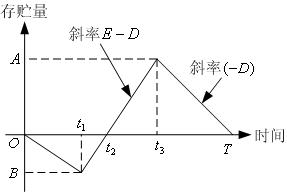

<!-- page: 493 -->

故有
)
)(
(
1
2
1
t
t
D
P
Dt
−
−
=
，从中解出：

D
P
t
−
=
                                                    （6）

2
1
t
P

从
]
,
[
3
2 t
t
看，最大存贮量
)
)(
(
2
3
t
t
D
P
A
−
−
=
；从
]
,
[ 3 T
t
看，最大存贮量

)
(
3t
T
D
A
−
=
。故有
)
(
)
)(
(
3
2
3
t
T
R
t
t
D
P
−
=
−
−
，从中解得

)
(
2
2
3
t
T
P
D
t
t
−
=
−
                                              （7）

易知，在
]
,0
[ T 时间内：

存贮费为
)
)(
)(
(
2
1

2
2
3
t
T
t
t
D
P
CP
−
−
−
；

缺货费为
2
1
2
1
t
Dt
CS
；

定购费为
D
C 。

故
]
,0
[ T 时间内平均总费用为

⎥⎦
⎤
⎢⎣
⎡
+
+
−
−
−
=
D
s
P
C
t
Dt
C
t
T
t
t
D
P
C
T
t
T
C
2
1
2
2
3
2
2
1
)
)(
)(
(
2
1
1
)
,
(

故将（6）和（7）代入，整理后得

⎡
+
+
−
−
=

⎤
⎢⎣

2
2
2
2
)
(
2
2
)
(
)
,
(
                （8）

T
C
T
t
C
C
t
C
T
C
P

D
D
P
t
T
C
D
S
P
P
p
+
⎥⎦

解方程组

=
∂
∂

⎧

t
T
C

0
)
,
(

2

⎪⎪
⎨

T

=
∂
∂

t
T
C

0
)
,
(

⎪
⎪
⎩

2

t

2

可得

+
=

C
C
C
T

)
(
2
*

S
P
D

P
D
C
DC

−

)
1(

S
P

-322-

<!-- page: 494 -->

C
t

P
+
=

*
*
2
T
C
C

S
P

容易证明，此时的费用
)
,
(
*
2
* t
T
C
是费用函数
)
,
(
2t
T
C
的最小值。

因此，模型的最优存贮策略各参数值为：

+
=
=
                              （9）

C
C
C
T
T

)
(
2
*
*

S
P
D

最优存贮周期

P
D
C
DC

−

)
1(

S
P

+
=
=
                          （10）

C
C
D
C
DT
Q

)
(
2
*
*

S
P
D

经济生产批量

P
D
C
C

−

)
1(

S
P

C
t

2
*
*
2

D
C
C
T
C
C

−
+
=
+
=
                 （11）

P

P
D

缺货补足时间

P
D
C
C
C

)
1
)(
(

S
P

S
P
S

P
D
D
C
C
t
P

−
=
−
=
                       （12）

)
1(
2
*
2
*
1
S
P
S

D
P
t
+

P
D

开始生产时间
)
(

C
C
C

结束生产时间
*
2
*
*
3
)
1(
t
P
D
T
P
D
t
−
+
=
                                   （13）

最大存贮量
)
(
*
3
*
*
t
T
D
A
−
=
                                          （14）

最大缺货量
*
1
*
Dt
B =
                                                （15）

C
C
D
=
                                               （16）

平均总费用
*
*
2
T

例2  有一个生产和销售图书设备的公司，经营一种图书专用设备，基于以往的销
售记录和今后市场预测。估计今后一年的需求量为4900 个，由于占用资金的利息以及
存贮库房和其它人力物力的费用，存贮一个书架一年要花费1000 元。这种书架是该公
司自己生产的，每年的生产量9800 个，而组织一次生产要花费设备调试等生产准备费
500 元。如果允许缺货，缺货费为每年每件2000 元。该公司为了把成本降到最低，应
如何组织生产？要求出其生产、存贮周期，每个周期的最优生产量，以及最少的年总费
用。

解  根据题意知，
4900
=
D
，
1000
=
P
C
，
9800
=
P
，
500
=
D
C
，
2000
=
S
C
，

-323-

<!-- page: 495 -->

利用式（9）～（13），（16）求相关的指标。

编写的LINGO 程序如下：
model:

D=4900;

C_P=1000;

P=9800;

C_D=500;

C_S=2000;

T1=(2*C_D*(C_P+C_S)/(D*C_P*C_S*(1-D/P)))^0.5;  !单位为年;

T=T1*365;  !单位为天;
Q=D*T1;

T_S=C_P*T/(C_P+C_S);  !求缺货时间;

T_P=D*T/P;   ! 求生产周期;

C=2*C_D/T1;  ! 求年总费用;
end

求得每个周期为9 天，其中9 天中有4.5 天在生产，每次的生产量为121 件，而且
缺货的时间有3 天。总的费用（包括存贮费、订货费和缺货费）为4044.52 元。

可以把模型一看作模型二的特殊情况。在模型二中，取消允许缺货和补充需要一定

时间的条件，即
∞
→
S
C
，
∞
→
P
，则模型二就是模型一。事实上，如将
∞
→
S
C
和

∞
→
P
代入模型二的最优存贮策略各参数公式，就可得到模型一的最优存贮策略。只
是必须注意，按照模型一的假设条件，应有

0
*
3
*
2
*
1
=
=
=
t
t
t
，
*
*
Q
A =
，
0
* =
B

2.3  模型三：不允许缺货，补充时间较长—基本的经济生产批量存贮模型

在模型二的假设条件中，取消允许缺货条件（即设
∞
→
s
C
，
0
2 =
t
），就成为模

型三。因此，模型三的存贮状态图和最优存贮策略可以从模型二直接导出。

模型三的存贮状态见图4。下面我们用另外的方法导出模型三的最优存贮策略。

        图4  经济生产批量模型存贮量的变化情况

经济生产批量存贮模型除满足基本假设外，其最主要的假设是：当存贮降到零后，

-324-

<!-- page: 496 -->

开始进行生产，生产率为P ，且
D
P >
，即生产的产品一部分满足需求，剩余部分才
作为存贮。

设生产批量为Q ，生产时间为t ，则生产时间与生产率之间的关系为

P
Q
t =

对于经济生产批量模型，有

    最高存贮量
Q
P
D
P
Q
D
P
t
D
P
)
1(
)
(
)
(
−
=
−
=
−
=
                     （17）

而平均存贮量是最高存贮量的一半，关于平均固定生产费与经济定购模型中的平均订货

D
CD
。这样，平均总费用为

费相同，同样是
Q

D
C
QC
P
D
C
D
P +
−
=
)
1(
2
1
                                       （18）

Q

类似于前面的推导，得到最优生产量、最优存贮周期、最大存贮量和最优存贮费用

D
C
Q

2
*

−
=
  （19）

D

P
D
C

)
1(

P

)
(
2
*
*
D
P
D
C

P
C
D
Q
T

−
=
=
                                       （20）

D

P

D
C
P
D

)
1(
2
)
1(
*
*
−
=
−
=
                                （21）

Q
P
D
A

D

C

P

C
C
D
P
D
)
1(
2
2

D
C
C
P
D
T

*
*
−
=
=
                                  （22）

    例3  商店经销某商品，月需求量为30 件，需求速度为常数。该商品每件进价300
元，月存贮费为进价的2％。向工厂订购该商品时订购费每次20 元，定购后需5 天才
开始到货，到货速度为常数，即2 件/天。求最优存贮策略。

解  本例特点是补充除需要入库时间（相当于生产时间）外，还需要考虑拖后时
间。因此，订购时间应在存贮降为零之前的第5 天。除此之外，本例和模型三的假设条
件完全一致。本例的存贮状态见图5。

-325-

<!-- page: 497 -->

   图5  拖后时间的存贮模型

从图5 可见，拖后时间为
]
,0
[
0t
，存贮量L 应恰好满足这段时间的需求，故
0
Dt
L =
。

根据题意，有
2
=
P
件/天，
1
=
D
件/天，
2.0
30
1
%
2
300
=
×
×
=
P
C
元/天·件，

20
=
D
C
元/次，
5
0 =
t
天，
5
5
1
=
×
=
L
件。代入（19）～（22），求得

20
* =
Q
件，
20
* =
T
天，
10
* =
A
件，
2
* =
C
元

在本例中，L 称为订货点，其意义是每当发现存贮量降到L 或更低时就定购。在
存贮管理中，称这样的存贮策略为“定点订货”。类似地，称每隔一个固定时间就订货
的存贮策略为“定时订货”，称每次订购量不变的存贮策略为“定量订货”。

2.4  模型四：允许缺货，补充时间极短的经济订购批量存贮模型

在模型二的假设条件中，取消补充需要一定时间的条件（即设
∞
→
P
），就成为
模型四。因此，和模型三一样，模型四的存贮状态图和最优存贮策略也可以从模型二直
接导出。

模型四的存贮状态图见图6。下面我们用另外的方法导出模型四的最优存贮策略。

设T 仍为时间周期，其中
1T 表示T 中不缺货时间，
2
T 表示T 中缺货时间，即

T
T
T
=
+
2
1
。S 为最大缺货量,
s
C 为缺货损失的单价，Q 仍为每次的最高订货量，则

S
Q −
为最高存贮量，因为每次得到订货量Q 后，立即支付给顾客最大缺货S 。

-326-

<!-- page: 498 -->

            图6  允许缺货的经济订购批量存贮模型的存贮情况

以一个周期为例，计算出平均存贮量、平均缺货量和平均总费用。

2
)
(
0
)
(
2
1

1
2
1
−
=
+
−
=
                           （23）

T
T
S
Q

T
S
Q
T

平均存贮量
T

其中

S
Q
T
−
=
1
，
D

S
T =
2
，
D
Q
T =
                                         （24）

D

由此计算出

2
)
(
2
)
(
2
1
−
=
−
=
，                                  （25）

T
S
Q

S
Q
T

平均存贮量
Q

2
2 =
=
                                             （26）

平均缺货量
Q
S
T
ST

2
2

因此，允许缺货的经济订购批量存贮模型的平均总费用

2
2
)
(
2
2
+
+
−
=
                                 （27）

S
C
Q

S
Q
C
C
S
D
P

D
C
Q

Q

求式（10）关于Q 和S 的偏导数，并求出其极小点

C
C
D
C
Q
)
(
2
*
+
=
                                        （28）

s
P
D

C
C

s
P

C
S

P
+
=
                                               （29）

*
*
Q
C
C

s
P

最佳订货周期

s
P
D
)
(
2
*
*
+
=
=
                                     （30）

C
C
C
D
Q
T

D
C
C

s
P

-327-

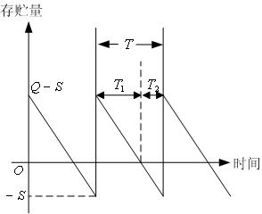

<!-- page: 499 -->

最大存贮量

)
(
2
*
*
*

D
C
C
S
Q
A
+
=
−
=
                                  （31）

S
D

C
C
C

s
P
P

最小费用

C
C
S
D
P
D
+
+
−
=
=
                     （32）

2
*

2
*
*

*
*
2
)
(
2
)
(
2
Q

S
C
Q

S
Q
C
T

D
C
Q

*

*
*

例4  某电器公司的生产流水线需要某种零件，该零件需要靠订货得到。已知批量
订货的订货费12000 元/次，每个零件的存贮机费用为0.3 元/（件·月），每个零件的缺
货损失为1.1 元/（件·月），设该零件的每月需求量为8000 件。求全年的订货次数、订
货量以及最优存贮费用。

解  根据题意，取一年为单位时间，由已知条件，订货费
12000
=
D
C
元/次，存贮

费
6.3
=
P
C
元/（件·年），缺货损失费
2.
13
=
S
C
元/（件·年），需求率
96000
=
D
件

/年。该存贮问题可由一个整数规划来表示

2
2
+
+
−

S
C
Q

2
2
)
(
min

S
Q
C
S
D
P

D
C
Q

Q

s.t.
Q
D
n =
，

0
,
≥
S
Q
，
0
≥
n
且取整数

编写LINGO 程序如下：
model:

min=0.5*C_P*(Q-S)^2/Q+C_D*D/Q+0.5*C_S*S^2/Q;

n=D/Q;@gin(n);

data:

C_D=12000;

D=96000;

C_P=3.6;

C_S=13.2;

enddata

end

    求得全年组织3 次订货，每次的订货量为32000 件，最大缺货量为6857.141 件，
最优费用为81257.14 元。

对于确定型存贮问题，上述四个模型是最基本的模型。其中，模型一、三、四又

-328-

<!-- page: 500 -->

可看作模型二的特殊情况。在每个模型的最优存贮策略的各个参数中，最优存贮周期T
是最基本的参数，其它各个参数和它的关系在各个模型中都是相同的。根据模型假设条

C
C +
对应了

件的不同，各个模型的最优存贮周期
*
T 之间也有明显的规律性。因子

S
P

C

S

P
−

对应了补充是否需要时间的假设条件。

是否允许缺货的假设条件，因子
D
P

一个存贮问题是否允许缺货或补充是否需要时间，完全取决于对实际问题的处理
角度，不存在绝对意义上的不允许缺货或绝对意义上的补充不需要时间。如果缺货引起
的后果或损失十分严重，则从管理的角度应当提出不允许缺货的建模要求；否则，可视
为允许缺货的情况。至于缺货损失的估计，应当力求全面和精确。如果补充需要的时间
相对于存贮周期是微不足道的，则可考虑补充不需要时间的假设条件；否则，需要考虑
补充时间。在考虑补充时间时，必须分清拖后时间和生产时间，两者在概念上是不同的。

2.5  模型五：经济定购批量折扣模型
所谓经济订购批量折扣模型是经济订购批量存贮模型的一种发展，即商品的价格
是不固定的，是随着订货量的多少而改变的。就一半情况而论，物品订购的越多，物品
的单价也就越低，因此折扣模型就是讨论这种情况下物品的订购数量。

一年花费的总费用由三个方面组成：年平均存贮费、年平均订货费和商品的购买
费用，即

D
C
Q
QC
C
D
P
+
+
=
                                 （33）

)
(
)
(
2
1
Q
DK
Q

在式（33）中，
)
(Q
K
是物品的价格，它与物品的订购数量有关，一般是一个分段表示

的函数，即

≤
≤

⎧

Q
Q
K

0
,

1
1

⎪⎪
⎨

≤
<

Q
Q
Q
K

,

2
1
2

=

Q
K

)
(
M

⎪
⎪
⎩

≤
<

−
m
m
m
Q
Q
Q
K

,

1

其中
m
i
i
Q
≤
≤
1}
{
是单调递增的，而
m
i
i
C
≤
≤
1}
{
是单调递减的。

物品的存贮费
)
(Q
CP
与物品的价格有关，通常是价格
)
(Q
K
的r （
1
0
<
< r
）倍，

即

)
(
)
(
Q
rK
Q
CP
=
  （34）

-329-

<!-- page: 501 -->

在经济订购批量存贮模型中，也应包含时（33）中的第三项，但当时
c
Q
K
=
)
(
是

常数，因此，第三项也为常数，与目标函数求极值无关，因此，在分析时，没有讨论此
项。

对于折扣模型，经济订购批量折扣存贮模型中求最优订购量的公式（3）仍然成立，

只不过此时的
P
C 不是常数罢了。假设
P
C 是由式（29）和式（30）确定的，则最优订

购量为

D
C
Q
2
* =
，
m
j
,
,2,1
L
=
，                                   （35）

D
j
rK

j

D
C
Q
rK
C
j
j

D
j
j
j
+
+
=
*
*
*
2
1
，
m
j
,
,2,1
L
=
                       （36）

D
K
Q

然后再根据
*
j
Q 所在的区间和
*
j
C 的值，选择合适的
*
j
Q 。实际上，若存在某个

}
,
,2,1
{
m
i
L
∈
，使得
]
,
[
1
*
i
i
i
Q
Q
Q
−
∈
，则该
*
i
Q 就为最优订货量。

例5  某公司计划订购一种商品用于销售。该商品的年销售量为40000 件，每次订
货费为9000 元，商品的价格与订货量的大小有关，为

≤
<
≤
≤

⎧

30000
,
825
.
33
30000
20000
,
175
.
34
20000
10000
,
525
.
34
10000
0
,
225
.
35

Q
Q
Q
Q

⎪⎪
⎨

=

Q
K

)
(

≤
<

⎪
⎪
⎩

<

存贮费是商品价格的20％。问如何安排订购量与订货时间。
解  按上述方法，编写如下的LINGO 程序：
model:

sets:

range/1..4/:B,K,C_P,Q,EOQ,C; !B是订货量的分界点，Q表示由式（35）计算出
的订货量，EOQ是调整后的订货量;
endsets

data:

D=40000; C_D=9000; R=0.2;

B=10000,20000,30000,40000;

K=35.225,34.525,34.175,33.825;
Enddata

@for(range:C_P=R*K;Q=(2*C_D*D/C_P)^0.5);

EOQ(1)=Q(1)-(Q(1)-B(1))*(Q(1)#gt# B(1));

-330-

<!-- page: 502 -->

@for(range(i)|i #gt# 1:EOQ(i)=Q(i)+(B(i-1)-Q(i)+1)*(Q(i) #lt#

B(i-1))-(Q(i)-B(i))*(Q(i) #gt# B(i)));

@for(range:C=0.5*C_P*EOQ+C_D*D/EOQ+K*D);

C_min=@min(range:C);

Q_best=@sum(range:EOQ*(C #eq# C_min));

T_best=Q_best/D;

end

求得最优订货量为10211 件，最优存贮费用为145151510 元，最优订货周期是平均
0.255 年一次。
比较计算结果中的Q 值与EOQ 值，会对程序的理解有很大的帮助。

    我们也可以使用如下的LINGO程序求得最优订货量和最优订货周期。
model:

sets:

range/1..4/:B,K,C_P,Q; !B是订货量的分界点，Q表示由式（35）计算出的订货量，
EOQ是调整后的订货量;
endsets

data:

D=40000; C_D=9000; R=0.2;

B=10000,20000,30000,40000;

K=35.225,34.525,34.175,33.825;
Enddata

n=@size(range);

@for(range:C_P=R*K;Q=(2*C_D*D/C_P)^0.5);

Q_best=Q(1)*(Q(1) #le# B(1))+@sum(range(i)| i #ne# 1 :Q(i)*(Q(i) #gt#

B(i-1) #and# Q(i) #le# B(i)));

T_best=Q_best/D;

end

§3  有约束的确定型存贮模型

3.1  带有约束的经济订购批量存贮模型
现在考虑多物品、带有约束的情况。设有m 种物品，采用下列记号：

（1）
i
i
i
K
Q
D
,
,
（
m
i
,
,2,1
L
=
）分别表示第i 种物品的单位需求量、每次订货的

批量和物品的单价；

（2）
D
C 表示实施一次订货的订货费，即无论物品是否相同，订货费总是相同的；

iP
C
（
m
i
,
,2,1
L
=
）表示第i 种产品的单位存贮费；

（3）

-331-

<!-- page: 503 -->

（4）
T
W
J,
分别表示每次订货可占用资金和库存总容量；

（5）
iw （
m
i
,
,2,1
L
=
）表示单位第i 种物品占用的库容量。

类似于前面的推导，可以得到带有约束的多物品的EOQ 模型。
3.1.1  具有资金约束的EOQ 模型

类似前面的分析，对于第i（
m
i
,
,2,1
L
=
）种物品，当每次订货的订货量为
i
Q 时，

单位时间总平均费用为

D
C
Q
C
C

1

i
+
= 2

i
D
i
P
i
Q

i

每种物品的单价为
i
K ，每次的订货量为
i
Q ，则
i
iQ
K
是该种物品占用的资金。因此，

资金约束为

m

i
i
≤
∑

J
Q
K

=1

i

综上所述，得到具有资金约束的EOQ 模型

⎞
⎜⎜
⎝

⎛
+

m

D
C
Q
C

i
1 2
1
min
                                     （37）

∑

=
⎟⎟
⎠

i
D
i
P
Q

i
i

m

i
i
≤
∑

s.t.
J
Q
K

                                               （38）

=1

i

0
≥
i
Q
，
m
i
,
,2,1
L
=
                                        （39）

    3.1.2  具有库容约束的EOQ 模型

单位第i 种物品占用的库容量是
iw ，因此，
i
iQ
w
是该种物品占用的总的库容量，

结合上面的分析，具有库容约束的EOQ 模型是

⎞
⎜⎜
⎝

⎛
+

m

D
C
Q
C

i
1 2
1
min
                                     （40）

∑

=
⎟⎟
⎠

i
D
i
P
Q

i
i

m

i
i
W
Q
w
≤
∑

s.t.
T

                                              （41）

=1

i

0
≥
i
Q
，
m
i
,
,2,1
L
=
                                        （42）

-332-

<!-- page: 504 -->

    3.1.3  兼有资金与库容约束的最佳批量模型

结合上述两种模型，得到兼有资金与库容约束的最佳批量模型

⎞
⎜⎜
⎝

⎛
+

m

D
C
Q
C

i
1 2
1
min
                                     （43）

∑

=
⎟⎟
⎠

i
D
i
P
Q

i
i

m

i
i
≤
∑

s.t.
J
Q
K

                                               （44）

=1

i

m

i
i
W
Q
w
≤
∑

T

                                              （45）

=1

i

0
≥
i
Q
，
m
i
,
,2,1
L
=
                                        （46）

对于这三种模型，可以容易地用LINGO 软件进行求解。
例6  某公司需要5 种物资，其供应与存贮模式为确定性、周期补充、均匀消耗和

不允许缺货模型。设该公司的最大库容量
)
(
T
W
为1500m3，一次订货占用流动资金的上

限（J ）为40 万元，订货费（
D
C ）为1000 元。5 种物资的年需求量
i
D ，物资单价
i
K ，

iP
C
，单位占用库
iw 如表1 所示。试求各种物品的订货次数、订货量和

物资的存贮费

总的存贮费用。

表1  物资需求、单价、存贮费和单位占用库容情况表

iP
C
 (元/(件·年))   单位占用库容
iw （m3/

物资i   年需求量
i
D   单价
i
K (元/件)   存贮费

件）

  1         600             300                 60                        1.0

  2         900            1000                200                        1.5

  3        2400             500                100                        0.5

  4       12000             500                100                        2.0

  5       18000             100                 20                        1.0

解  设
in 是第i （
5,4,3,2,1
=
i
）中物资的年订货次数，按照带有资金与库容约束

的最佳批量模型（43）～（46），写出相应的整数规划模型

⎞
⎜⎜
⎝

⎛
+

5

D
C
Q
C

1 2
1
min

∑

=
⎟⎟
⎠

i
D
i
P
Q

i

i
i

-333-

<!-- page: 505 -->

5

i
i
≤
∑

s.t.
J
Q
K

1

=

i

5

i
i
W
Q
w
≤
∑

T
i

1

=

0
≥
i
Q
，
5,
,2,1
L
=
i

i
i
Q
D
n =
，且
in 为整数，
5,
,2,1
L
=
i

i

编写LINGO 程序如下：
model:

sets:

kinds/1..5/:C_P,D,K,W,Q,N;

endsets

min=@sum(kinds:0.5*C_P*Q+C_D*D/Q);

@sum(kinds:K*Q)<J;

@sum(kinds:W*Q)<W_T;

@for(kinds:N=D/Q;@gin(n));

data:

C_D=1000;

D=600 900 2400 12000 18000;

K=300 1000 500 500 100;

C_P=60 200 100 100 20;

W=1.0 1.5 0.5 2.0 1.0;

J=400000;

W_T=1500;

enddata

end

求得总费用为142272.8 元，订货资金还余7271.694 元，库存余4.035621 m3，其余
计算结果整理在表2 中。

                表2  物资的订货次数与订货量

       物资i                  订货次数                     订货量
*
i
Q （件）

         1                        7                           85.71429

         2                       13                           69.23077

         3                       14                           171.4286

         4                       40                           300.0000

-334-

<!-- page: 506 -->

         5                       29                           620.6897

上述计算采用整数规划，如果不计算年订货次数，而只有年订货周期，则不需要
整数约束。由于整数规划的计算较慢，因此，在有可能的情况下，应尽量避免求解整数
规划问题。

3.2  带有约束允许缺货模型
类似于不允许缺货情况的讨论，对于允许缺货模型，也可以考虑多种类、带有资

iS
i C
S ,
分别为第i 种物品的最大缺货量、缺货损失单价，

金和库容约束的数学模型。设

其它符号的意义不变。由于
i
Q 是第i 种物品的最大订货量，则
i
iQ
K
是第i 种物品占用

资金数，
i
i
S
Q −
是第i 种物品的最大存贮量（占用库存数），因为
iS 部分偿还缺货，已

不用存贮了。因此，带有资金和库容约束允许缺货的数学模型如下：

⎞
⎜⎜
⎝

⎛

+
+
−
n

2
2

)
(
min
                        （47）

S
Q
C

S
C

D
C
Q

∑

=
⎟⎟
⎠

i
i
P

i
S

i
D

i
i

2
2

Q

Q

i
i

1

i

i

n

i
i
≤
∑

s.t.
J
Q
K

                                               （48）

=1

i

n

i
i
i
W
S
Q
w
≤
−
∑

)
(
                                        （49）

T

=1

i

0
≥
i
Q
，
n
i
,
,2,1
L
=
                                        （50）

iS
C
）是物品的存贮费（

iP
C
）的2 倍，其它参

例7（续例6） 假设缺货损失费（

数不变，试求出各种物品的订货次数、订货量和总的存贮费用。

解  设
in 是第i 种物品的年订货次数，按照模型（47）～（50），写出相应的整数

规划模型

⎞
⎜⎜
⎝

⎛

+
+
−
5

2
2

)
(
min

S
Q
C

S
C

D
C
Q

∑

=
⎟⎟
⎠

i
i
P

i
S

i
D

i
i

2
2

Q

Q

i
i

1

i

i

5

i
i
≤
∑

s.t.
J
Q
K

1

=

i

-335-

<!-- page: 507 -->

5

i
i
i
W
S
Q
w
≤
−
∑

1
)
(

T
i

=

i
i
Q
D
n =
，且
in 为整数，
5,
,2,1
L
=
i

i

0
≥
i
Q
，
5,
,2,1
L
=
i

编写LINGO 程序如下：
model:

sets:

kinds/1..5/:C_P,D,K,W,C_S,Q,S,N;

endsets

min=@sum(kinds:0.5*C_P*(Q-S)^2/Q+C_D*D/Q+0.5*C_S*S^2/Q);

@sum(kinds:K*Q)<J;

@sum(kinds:W*(Q-S))<W_T;

@for(kinds:N=D/Q;@gin(n));

data:

C_D=1000;

D=600 900 2400 12000 18000;

K=300 1000 500 500 100;

C_P=60 200 100 100 20;

W=1.0 1.5 0.5 2.0 1.0;

J=400000;

W_T=1500;

enddata

@for(kinds:C_S=2*C_P);

end

求得总费用为124660.8 元，订货资金还余88.46 元，库存余343.317m3，其余计算
结果整理在表3 中。

           表3  允许缺货的物资的订货次数与订货量

  物资i            订货次数              订货量
*
i
Q （件）        最大缺货量
iS （件）

    1                 7                   85.71429                   28.57142

    2                15                   60.00000                   20.00000

    3                17                   141.1765                   47.05881

    4                38                   315.7895                   105.2631

    5                21                   857.1429                   285.7142

-336-

<!-- page: 508 -->

3.3  带有约束的经济生产批量存贮模型
与经济定购模型类似，对于经济生产批量存贮模型，也可以考虑带有不同情况的
约束条件和各种不同物品的综合情况。下面用一个例子来说明问题。

例8  某公司生产并销售
C
B
A
,
,
三种商品，根据市场预测，三种商品每天需求量

分别是400，300，300（件），三种商品每天的生产量分别是1300，1100，900（件），
每安排一次生产，其固定费用（与生产量无关）分别为10000，12000，13000（元），
生产费用每件分别为1.0，1.1，1.4（元）。商品的生产速率、需求率和最大生产量满足
如下约束：

⎞
⎜⎜
⎝

⎛
+

3

1
1
5.1

D
P
D

∑

≤
⎟⎟
⎠

i

i

Q

=

i
i

i

求每种商品的最优生产时间与存贮时间，以及总的最优存贮费用。

解  建立最优生产批量存贮模型：

⎤
⎢
⎣

⎡
+
−

D
C
C
Q
P
D
i

3

1
)
1(
2
1
min

∑

i
D
P
i
i

i

i

=
⎥
⎦

Q

i
i

⎞
⎜⎜
⎝

⎛
+

3

1
1
5.1

D
P
D

s.t.  ∑

≤
⎟⎟
⎠

i

i

Q

=

i
i

i

i
i
D
Q
T =
，
3,2,1
=
i

i

0
≥
iT
，
0
≥
i
Q
，
3,2,1
=
i

编写LINGO 程序如下：
model:

sets:

kinds/1..3/:C_P,P,C_D,D,Q,T,T_P; !T_P表示生产时间;
endsets

min=@sum(kinds:0.5*(1-D/P)*Q*C_P+C_D*D/Q);

@sum(kinds:D/P+1.5*D/Q)<1;

@for(kinds:T=Q/D;T_P=Q/P);

data:

C_D=1000,1200,1300;

D=400,300,300;

C_P=1.0,1.1,1.4;

P=1300,1100,900;

enddata

-337-

<!-- page: 509 -->

end

求得
C
B
A
,
,
三种商品的生产、存贮周期分别为51.05936，54.86175，50.79914 天，

其中生产天数分别为15.71057，14.96229，16.93305 天。总的最优生产，存贮费用为
20832.10 元。
§4  单周期随机库存模型

在许多情形中需求量是随机的。随机需求模型可以分为周期观测与连续观测两类。
周期观测模型又可分为单周期、多周期及无穷周期等模型。

本节仅讨论单周期随机库存模型。
单周期库存模型又称为单订货模型。模型假定周期末库存对下一个周期没有任何
价值。这个问题也称为报童问题，因为报童手中的报纸若卖不完，明天就没有用了。该
模型研究的是仅有一次机会的存贮与供需关系的产品。

4.1  模型的基本假设
本模型的基本假设如下：

（1）在整个需求期内只订购一次货物，订货量为Q ，订购费和初始库存均为0，

每单位产品的购价（成本）为K ；

（2）需求量D 为一个连续的随机变量，且D 的概率密度为
)
(x
f
，当货物出售时，

每单位产品的价格为U ；

（3）需求期结束时，没有卖出的货物不存贮而是折价卖出，单位价格为V 。
4.2  模型的推导

单周期随机库存模型的问题是求订购量Q 为多少时，使得总利润最大。

当需求量
x
D =
时，物品的出售量取决于物品的订购量Q 和需求量x ，即

>
≤
=
Q
x
Q

⎩
⎨
⎧

Q
x
x

,
,

出售量

                                           （51）

因此，产生的利润

≤
−
−
+
=
Q
x
KQ
UQ

⎩
⎨
⎧

Q
x
KQ
x
Q
V
Ux
Q
G
,

,
)
(
)
(
                            （52）

>
−

这样一个周期的总利润应该是
)
(Q
G
的期望值，即

∞
−
+
−
−
+
=

Q
)
(
)
(
)
(
)
)
(
(
))
(
(

0
∫
∫

dx
x
f
KQ
UQ
dx
x
f
KQ
x
Q
V
Ux
Q
G
E

Q

-338-

<!-- page: 510 -->

Q
dx
x
f
x
Q
V
U
Q
K
U

∫
−
−
−
−
=

0
)
(
)
(
)
(
)
(
                      （53）

+∞
dx
x
f
。

注意，在上式推导中用到概率密度的性质
1
)
(
0
=
∫

    为求极大值，对式（53）两端关于Q 求导数，得到

Q
G
dE

0
)
(
)
(
)
(
)]
(
[
                     （54）

Q
dx
x
f
V
U
K
U
dQ

∫
−
−
−
=

2
<
−
−
=
Q
f
V
U
dQ

0
)
(
)
(
)]
(
[

Q
G
E
d
，                            （55）

2

注意到二阶导数小于0，因此，满足方程

−
−
=
∫0
)
(
                                         （56）

K
U
dx
x
f
Q

V
U

的Q 一定是
)]
(
[
Q
G
E
的极大值点。

对于销售价U 、成本价K 和折扣价V ，应满足
V
K
U
>
>
。令
K
U
g
−
=
是

物品出售后的利润，同时表示物品不足时，由于缺货造成的损失。令
V
K
h
−
=
是物品
折扣出售的损失，因此方程（56）也可写成

+
=
−
−
=
∫0
)
(
                                     （57）

g
V
U

K
U
dx
x
f
Q

h
g

为进一步理解公式（53）的含义，将公式（53）改写为

+∞
−
−
−
−
−
−
−
=

∫

Q
dx
x
f
x
Q
V
U
Q
V
U
Q
K
U
Q
G
E
)
(
)
(
)
(
)
)(
(
)
(
)]
(
[
μ

∞
−
−
−
−
+
−
=
)
(
)
(
)
(
)
(
μ
μ
         （58）

Q∫

dx
x
f
Q
x
V
U
Q
V
KQ
U

+∞
=

其中
dx
x
xf
∫

0
)
(
μ
为需求量D 的数学期望。或者写成

+∞
−
+
−
−
−
=
μ
μ
              （59）

Q
)
(
)
(
)
(
)
(
)]
(
[
∫

dx
x
f
Q
x
h
g
Q
h
g
Q
G
E

+∞
−
)
(
)
(
相当于当
Q
x >
时的损失函数，即式（58）可

在式（58）中，积分
dx
x
f
Q
x
Q∫

以理解为

总收入
＝
期望值

总利润

折扣收入
－成本＋
期望值

缺货收入
－
期望值

期望值

-339-

<!-- page: 511 -->

4.3  模型的求解
例9（报童问题）  在街中有一报亭，平均每天出售报纸500 份，出售报纸的数量，
与来往的人流有关，假设服从Poisson 分布，每卖出一份报纸能盈利0.15 元。如果卖不
出去，只能作为废纸处理，每份报纸亏损0.40 元，问：报亭应如何安排报纸的订购量，
使得报亭的利润最大？

解  由题意知，均值
500
=
μ
；每份报纸的利润
15
.0
=
g
元；作为废纸处理时，

每份报纸亏损
4.0
=
h
元。利用式（57）计算出Q 来，再利用式（59）计算出期望总利

润。

Q
dx
x
f
0
)
(
可由LINGO 中的函数@pps 计算，

对于Poisson 分布，式（57）中的积分∫

@pps(
Q
,
μ
)是均值为μ 的Poisson 分布函数，即

μ
μ

x

Q

    @pps(
Q
,
μ
) ∑

−
=

e
x
0
!

=

x

若Q 不是整数，该函数采用线性插值计算。

+∞
−
Q
dx
x
f
Q
x
)
(
)
(
可由函数@ppl 计算，@ppl(
Q
,
μ
)表示Poisson

    式（59）中的积分∫

分布的线性损失函数，即

−
−
=

e
x
Q
x
μ
μ

+∞

x

)
(

@ppl(
Q
,
μ
)
∑

1
!

+
=

Q
x

编写LINGO 程序如下：
model:

data:

mu=500;g=0.15;h=0.40;

enddata

@pps(mu,Q)=g/(g+h);

E_G=g*mu-h*(Q-mu)-(g+h)*@ppl(mu,Q);

end

求得报亭每天订购报纸486 份，每天盈利70.93 元。

g
+

下面我们使用MATLAB 求例9 的解。实际上式（57）中的Q 是Poisson 分布的
h
g

分位点。对于式（59）中的积分计算，首先定义被积函数，然后使用MATLAB 中的积
分命令QUADL 进行积分，注意在积分时必须把积分区间化成有限区间。MATLAB 中

-340-

<!-- page: 512 -->

被积函数定义如下（其中文件名为fun1.m）
function f=fun1(x);

global Q mu

f=(x-Q).*poisspdf(mu,x);

最后编写调用的程序如下：
global mu Q

mu=500;g=0.15;h=0.40;

Q=poissinv(g/(g+h),mu)

E_G=g*mu-h*(Q-mu)-(g+h)*(mu-Q-quadl(@fun1,0,Q))

求得报亭每天订购报纸486 份，每天赢利71.09 元。

例10  设在某食品店内，每天对面包的需求服从
300
=
μ
，
50
=
σ
的正态分布。

已知每个面包的售价为1.50 元，成本0.90 元，对当天未售出的其处理价为每个0.60 元，
问该商店每天应生产多少面包，使预期的利润为最大？

解  根据题意
300
=
μ
，
50
=
σ
，
50
.1
=
U
，
9.0
=
K
，
60
.0
=
V
。利用式（57）

计算出Q 来，再利用式（59）计算出期望总利润。但对于正态分布分布，LINGO 只提

供了标准正态分布函数@psn( Z )，即

2
1
)
(

Z∫∞
−

−
=
Φ
=
2
/
2

τ
d
e
Z

@psn( Z )
τ
π

和标准正态分布的线性损失函数@psl( Z )，即

+∞
−
−
=
2
/
2
)
(
2
1

τ
d
e
Z
z∫

@psl( Z )
τ
τ
π

因此，若用函数@psn 和@psl 计算式（57）和式（59）的积分

2

2

−
−
2

μ

∞
+
−
−
−

μ

dx
e
Q
x
∫∞
−

)
(

)
(
)
(
2
1
σ

x
∫

2
1
σ

2

 和
dx
e
Q
x
Q

2

2

πσ

πσ

μ
τ
−
= x
，即

需要做变换
σ

2
Z
d
e
dx
e

−
−

μ

)
(
2

τ
σ

Z
Q
x

)
(
psn
@
2
1
2
1
2
2

−

=
=
∫
∫
∞
−

τ
π
πσ

2

∞
−

2
Z
d
e
Z
dx
e
Q
x

∞
+
−
∞
+
−
−

μ

)
(
2

τ
σ

x

σ
τ
τ
π
σ
πσ

)
(
psl
@
)
(
2
)
(
2
1
2
2

=
−
=
−
∫
∫

2

Z
Q

-341-

<!-- page: 513 -->

μ
−
= Q
Z
。

其中
σ

编写LINGO 程序如下
data:

mu = 300; sigma = 50; U = 1.50; K = 0.90; V = 0.60;

enddata

@psn(Z)=(U-K)/(U-V);

Z=(Q-mu)/sigma;

@free(Z);

E_G = U*mu-K*Q+V*(Q-mu)-(U-V)*sigma*@psl(Z);

求得商店每天生产322 个面包，可以使总利润达到最大，预期的最大利润为163.638
元。

同样地，我们使用MATLAB 求例10 的解。实际上，式（57）中的Q 是正态分布

−
−
分位点。式（59）中的被积函数的MATLAB 定义如下（其中文件

K
U

)
,
(
2
σ
μ
N
的
V
U

名为fun2.m）：
function f=fun2(x);

global mu sigma Q

f=(x-Q).*normpdf(x,mu,sigma);

最后编写调用的程序如下：
global mu sigma Q

mu = 300; sigma = 50; U = 1.50; K = 0.90; V = 0.60;

Q=norminv((U-K)/(U-V),mu,sigma)

E_G=U*mu-K*Q+V*(Q-mu)-(U-V)*(mu-Q-quadl(@fun2,0,Q))

求得的结果和LINGO 的计算结果完全一样。
    例11  （航空机票超订票问题）  某航空公司执行两地的飞行任务，已知飞机的
有效载客量为150 人。按民用航空管理有关规定：旅客因有事或误机，机票可免费改签
一次，此外也可在飞机起飞前退票。航空公司为了避免由此发生的损失，采用超量订票
的方法，即每班售出票数大于飞机载客数。但由此会发生持票登机旅客多于座位数的情
况，在这种情况下，航空公司让超员旅客改乘其它航班，并给旅客机票价的20％作为
补偿。现假设两地的机票价为1500 元，每位旅客有0.04 的概率发生有事、误机或退票
的情况，问航空公司多售出多少张票？使该公司的预期损失达到最小。

解  先对该问题进行分析。

设飞机的有效载客数为N ，超订票数为S （即售出票数为
S
N +
），k 为每个座位
的赢利值，h 为改乘其它航班旅客的补偿值。设x 是购票未登机的人数，是一个随机变

量，其概率密度为
)
(x
f
。当
S
x ≤
时，有
x
S −
个人购票后，不能登机，航空公司要为

-342-

<!-- page: 514 -->

这部分旅客进行补偿。当
S
x >
时，有
S
x −
个座位没有人坐，航空公司损失的是座位
应得的利润，因此，航空公司的损失函数为

≤
−
=
S
x
S
x
k

⎩
⎨
⎧

S
x
x
S
h
S
L
),
(

),
(
)
(
      （60）

>
−

其期望值为

+∞
−
+
−
=

S
)
(
)
(
)
(
)
(
)]
(
[

0
∫
∫

dx
x
f
S
x
k
dx
x
f
x
S
h
S
L
E

S

S
)
(
)
(
)
(

0∫
−
+
+
−
=
μ
                      （61）

dx
x
f
x
S
h
k
kS
k

+∞
=

其中
∫

0
)
(
dx
x
xf
μ
为购票未登机的期望人数。

对式（61）两端关于S 求导数，得到

S
L
dE

0
)
(
)
(
)]
(
[
                                （62）

S
dx
x
f
h
k
k
dS

∫
+
+
−
=

2
>
+
=
S
f
h
k
dS

0
)
(
)
(
)]
(
[

S
L
E
d
                                    （63）

2

因此，满足方程

k
dx
x
f
S

+
=
∫0
)
(
  （64）

h
k

的S 是函数
)]
(
[
S
L
E
的极小值点，即满足方程（64）的S 使航空公司的损失达到最小。

下面给出具体的求解过程。

设每位顾客购票未登机的概率为p ，共有
S
N +
位旅客，则恰有y 位旅客未登机

S
N
p
p
C
−
+
+
−
)
1(
，即未登机人数x 服从二项分布。因此，式（64）中的

的概率是
y
S
N
y
y

积分应用二项分布计算。

在LINGO 中提供了二项分布函数
)
,
,
(
pbn
@
S
S
N
p
+
，即

S

∑

−
+
+
−
=
+

y
S
N
y
y

0
)
1(
)
,
,
(
pbn
@
                      （65）

S
N
p
p
C
S
S
N
p

=

y

当
S
N +
和S 不是整数时，采用线性插值计算。

在这里，
)
,
,
(
pbn
@
S
S
N
p
+
的直观意义是：在
S
N +
位旅客中至多有S 位旅客

购票未登机的概率。

-343-

<!-- page: 515 -->

根据题意，
150
=
N
，
04
.0
=
p
，
1500
=
k
（假设机票价就是航空公司的赢利），

300
2.0
1500
=
×
=
h
。写出相应的LINGO 程序如下：
data:

  N = 150;p = 0.04;k = 1500;h = 300;

enddata

@pbn(p, N+S, S) = k/(k+h);

求得超订的票数
8.222487
=
S
，因而，超订的票数在8～9 张之间，即每班售出的
票数在158～159 张之间。

k
dx
x
f
S
g

+
−
= ∫0
)
(
)
(
，

S

下面我们使用MATLAB 求例11 的解。首先定义函数
h
k

然后求
)
(S
G
的零点即可。编写
)
(S
g
的MATLAB 函数如下（文件名为fun3.m）：

function f=fun3(s);

N = 150;p = 0.04;k = 1500;h = 300;

f=binocdf(s,s+N,p)-k/(k+h);

MATLAB 中求函数
)
(S
g
的零点时溢出（使用命令FZERO），我们只能编写

MATLAB 的搜索算法如下：
for s=1:100

    g(s)=fun3(s);

end

g

例12（续例11）  所有参数不变，问航空公司多售出多少张票，使该公司的预期
利润达到最大，并计算出相应的利润。

解  下面的计算希望达到以下目的：第一，得到超订票的整数解；第二，计算出
预期的利润值。

设飞机的有效载客数为N ，超订票数为S （即售出票数为
S
N +
），k 为每个座位

的赢利值，h 为改乘其它航班旅客的补偿值，p 为每位旅客购票未登机的概率。设x 是

购票未登机的人数，是一个随机变量，其概率密度为
)
(x
f
。当
S
x ≤
时，飞机满座，

有
x
S −
个人购票后，不能登机，航空公司要为这部分旅客进行补偿。当
S
x >
时，飞
机没有满座，有
x
S
N
−
+
名旅客乘机，因此，航空公司的利润函数为

≤
−
−
=
S
x
x
S
N
k

⎩
⎨
⎧

S
x
x
S
h
kN
S
I
),
(

),
(
)
(
                                       （66）

>
−
+

其期望值为

-344-

<!-- page: 516 -->

+∞
−
+
+
+
−
=
)
(
)
(
)
(
)
(
)]
(
[

S
∫
∫

dx
x
f
x
S
N
k
dx
x
f
hx
hS
kN
S
I
E

0

S

S
S
∫
∫
+
+
+
−
−
+
=

0
0
)
(
)
(
)
(
)
(
)
(
μ
      （67）

dx
x
xf
k
h
dx
x
f
S
k
h
S
N
k

+∞
=

其中
∫

0
)
(
dx
x
xf
μ
为购票未登机的期望人数。

对式（67）两端关于S 求导数，得到

S
L
dE

0
)
(
)
(
)]
(
[
                                 （68）

S
dx
x
f
h
k
k
dS

∫
+
−
=

2
<
+
−
=
S
f
h
k
dS

0
)
(
)
(
)]
(
[

S
L
E
d
                                  （69）

2

因此，满足方程

k
dx
x
f
S

+
=
∫0
)
(
  （70）

h
k

的S 是函数
)]
(
[
S
I
E
的极小值点，即满足方程（70）的S 使航空公司的利润达到最大。

具体的求解过程同例11。下面我们比较一下
8
=
S
和
9
=
S
哪种情形下的利润最大，
首先把式（67）改写成

S∫
+
−
−
+
=

0
)
(
)
(
)
(
)]
(
[
μ

dx
x
F
k
h
S
N
k
S
I
E

编写的MATLAB 程序如下：
clear,clc

N = 150;p = 0.04;k = 1500;h = 300;

for S=1:15

E_I(S)=k*(N+S-(N+S)*p)-(h+k)*quadl(@(x)binocdf(x,N+S,p),0,S);

end

E_I

上面的算法，我们实际上把二项分布看成是连续型的分布。下面从离散分布的角
度建立赢利期望值的递推公式。

记
j
E （
S
j
,
,1,0
L
=
）为超订票数为j 时，航空公司赢利的期望值。
L
j
E 为超订票

数为j 时，最后一个旅客的订票使航空公司获得赢利的期望值。则有

L
j
j
j
E
E
E
+
=
−1

=
L
j
E
最后1 名旅客乘到飞机时航空公司赢利值－最后1 名乘客无座位时的补偿值

因而有

-345-

<!-- page: 517 -->

)
1(
0
p
kN
E
−
=
，

+
=
+
=
0
1
0
1
E
E
E
E
L
k
N
P
p
⋅
−
}
{
)
1(
1人不乘机
名旅客中至少有

h
N
P
p
⋅
−
−
}
{
)
1(
名旅客都乘机

h
N
p
p
k
N
p
p
E
⋅
⋅
−
−
⋅
−
−
+
=
)
0,
,
(
pbn
@
)
1(
)]
0,
,
(
pbn
@
1
)[
1(
0

)]
0,
,
(
pbn
@
)
(
)[
1(
0
N
p
h
k
k
p
E
⋅
+
−
−
+
=

             M

k
i
i
N
P
p
E
E
E
E
j
L
j
j
j
⋅
−
+
−
+
=
+
=
−
−
}
1
{
)
1(
1
1
人不乘机
个旅客至少有

h
i
i
N
P
p
⋅
−
+
−
−
}
1
1
{
)
1(
人不乘机
个旅客至多有－

⋅
−
−
+
−
−
+
=

k
i
i
N
p
p
E

)]
1
,1
,
(
pbn
@
1
)[
1(
0

h
i
i
N
p
p

⋅
−
−
+
⋅
−
−

)1
,1
,
(
pbn
@
)
1(

)]
1
,1
,
(
pbn
@
)
(
)[
1(
0
−
−
+
⋅
+
−
−
+
=
i
i
N
p
h
k
k
p
E

在上式中，
)
,
,
(
pbn
@
x
m
p
是LINGO 中的二项分布函数，即

x

∑

−
−
=

k
m
k
k
m
p
p
C
x
m
p

0
)
1(
)
,
,
(
pbn
@

=

k

因此，我们只要计算出超订票数
L
,2,1,0
=
S
的期望值，并比较它们的大小，就可

以计算出最优的超订票数和最大赢利的期望值。编写LINGO 程序如下：
sets:

    seats/1..150/;

    extra/1..15/: E_T;

endsets

data:

k = 1500; h = 300; p = 0.04;

enddata

N = @size(seats);

E_T0 = k*N*(1-p);

E_T(1) = E_T0+(1-p)*(k-(k+h)*@pbn(p,N,0));

@for(extra(i)|i #gt# 1:E_T(i) =

-346-

<!-- page: 518 -->

E_T(i-1)+(1-p)*(k-(k+h)*@pbn(p,N+i-1, i-1)));

从计算结果可以看出，超订票数为9张时，航空公司获利利润最大，预期的期望值
达到223832.6。

下面我们写出递推运算的MATLAB 程序如下：
clear,clc

k = 1500; h = 300; p = 0.04; n=150;

E_T0=k*n*(1-p)

E_T(1)=E_T0+(1-p)*(k-(k+h)*binocdf(0,n,p));

for i=2:15

    E_T(i)=E_T(i-1)+(1-p)*(k-(k+h)*binocdf(i-1,n+i-1,p));

end

E_T

计算结果和LINGO 的计算结果完全一致。

习题二十五
1．企业生产某种产品，正常生产条件下可生产10 件/天。根据供货合同，需按7
件/天供货。存贮费每件0.13 元/天，缺货费每件0.5 元/天，每次生产准备费用（装配费）
为80 元，求最优存贮策略。

2．某大型机械需要外购3 种零件，其有关数据见表4。若存贮费占单件价格的25
％，不允许缺货。又限定外购零件的总费用不超过240000 元，仓库总面积为250m2，
试确定每种外购零件的最优订货量、订货周期和最小费用。

表4  三种外购零件的相关数据

零件      年需求量（件）      订货费（元）      单价（元）      占用仓库面积（m2）

 1           1000               1000              3000                 0.5

 2           3000               1000              1000                  1

 3           2000               1000              2500                 0.8

3．（航空公司超订票问题） 已知飞机的有效载客量为150 人，机票价为1500 元。
根据公司的长期统计，每个航班旅客的退票和改签发生的人数如表5 所示。在登机旅客
多于座位数的情况下，航空公司规定：超员旅客改乘本公司下一班机，机票免费（即退
回原机票款）；若改乘其它航空公司的航班，按机票的105%退款。据统计前一类旅客
占超员旅客的80%，后一类旅客占20%。问航空公司多售出多少张票，使该公司的预
期损失达到最小。

表5  航班旅客退票和改签人数概率表

人数i      0        1       2        3        4       5       6       7       8

ip      0.18     0.25     0.25     0.16     0.06     0.04    0.03     0.02    0.01

-347-

<!-- page: 519 -->

    4．某工厂生产某种产品必须经过两道工序，第一道工序在甲车间进行，第二道工
序在乙车间进行，甲车间生产的产品作为乙车间生产的原料，工厂计划年生产1200 件
产品，因而乙车间的生产速度为每月100 件，而甲车间的生产速度为每月500 件。由于
受到乙车间生产能力的限制，甲车间要进行等周期分批的有间断的生产，同时还必须保
证乙车间不停工待料。甲车间的产品运到乙车间时要包装，平均每批的包装费为5 元。
若运到乙车间后暂时来不及加工，则要花费存贮费，每件存贮费为0.4 元。试研究甲车
间的最优生产周期，生产时间和生产批量。

-348-

<!-- page: 520 -->

第二十六章  经济与金融中的优化问题

本章主要介绍用LINGO 软件求解经济、金融和市场营销方面的几个优化问题的案
例。
§1  经济均衡问题及其应用

在市场经济活动中，当市场上某种产品的价格越高时，生产商越是愿意扩大生产
能力（供应能力），提供更多的产品满足市场需求；但市场价格太高时，消费者的消费
欲望（需求能力）会下降。反之，当市场上某种商品的价格越低时，消费者的消费欲望
（需求能力）会上升，但生产商的供应能力会下降。如果生产商的供应能力和消费者的
需求能力长期不匹配，就会导致经济不稳定。在完全市场竞争的环境中，我们总是认为
经济活动应当达到均衡（equilibrium），即生产和消费（供应能力和需求能力）达到平
衡，不再发生变化，这时该商品的价格就是市场的清算价格。

下面考虑两个简单的单一市场及双边市场的具体实例，并介绍经济均衡思想在拍
卖与投标问题、交通流分配问题中的应用案例。

1.1  单一生产商、单一消费者的情形
例1  假设市场上只有一个生产商（记为甲）和一个消费者（记为乙）。对某种商
品，他们在不同价格下的供应能力和需求能力如表1 所示。举例来说，表中数据的含义
是：当单价低于2 万元但大于或等于1 万元时，甲愿意生产2t 产品，乙愿意购买8t 产
品；当单价等于或低于9 万元但大于4.5 万元时，乙愿意购买2t 产品，甲愿意生产8t
产品；依次类推。那么的市场价格应该是多少？

表1  不同价格下的供应能力和需求能力

生产商（甲）
消费者（乙）

单价（万元/t）             供应能力（t）
单价（万元/t）             需求能力（t）

      1                        2

      9                        2

      2                        4

     4.5                       4

      3                        6

      3                        6

      4                        8

     2.25                      8

（1）问题分析
仔细观察一下表1 就可以看出来，这个具体问题的解是一目了然的：清算价格显
然应该是3 万元/t，因为此时供需平衡（都是6t）。为了能够处理一般情况，下面通过
建立优化模型来解决这个问题。

这个问题给人的第一印象似乎没有明确的目标函数，不太像是一个优化问题。不
过，我们可以换一个角度来想问题：假设市场上还有一个虚拟的经销商，他是甲乙进行
交易的中介。那么，为了使自己获得的利润最大，他将总是以可能的最低价格从甲购买
产品，再以可能的最高价格卖给乙，直到进一步的交易无利可图为止。例如，最开始的

-348-

<!-- page: 521 -->

2t 产品他将会以1 万元的单价从甲购买，以9 万元的单价卖给乙；接下来的2t 产品他
会以2 万元的单价从甲购买，再以4.5 万元的单价卖给乙；再接下来的2t 产品他只能以
3 万元的单价从甲购买，再以3 万元的单价卖给乙（其实这次交易他已经只是保本，但
我们仍然假设这笔交易会发生，例如他为了使自己的营业额尽量大）；最后，如果他继
续购买甲的产品卖给乙，他一定会亏本，所以他肯定不会交易。因此，市场清算价格就
是3 万元。根据这个想法，我们就可以建立这个问题的线性规划模型。

（2）模型建立
决策变量：设甲以1 万元，2 万元，3 万元，4 万元的单价售出的产品数量（单位：

t）分别是
4
3
2
1
,
,
,
x
x
x
x
，乙以9 万元，4.5 万元，3 万元，2.25 万元的单价购买的产品

数量（单位：t）分别是
4
3
2
1
,
,
,
y
y
y
y
。

目标函数：就是虚拟经销商的总利润，即

4
3
2
1
4
3
2
1
4
3
2
5.2
3
5.4
9
x
x
x
x
y
y
y
y
−
−
−
−
+
+
+
              （1）

约束条件：

4

4

    供需平衡
∑
∑

=

i
y
x
                                         （2）

i
i

=
=

1
i

1

供应限制
2
≤
ix
，
4,3,2,1
=
i
                                     （3）

消费限制
2
≤
iy
，
4,3,2,1
=
i
                                     （4）

非负限制
0
,
≥
i
i y
x
，
4,3,2,1
=
i
                                  （5）

（3）模型求解
式（1）～（5）是一个线性规划模型，可以用LINGO 求解，对应的LINGO 程序
如下：
model:

sets:

gx/1..4/:c1,c2,x,y;

endsets

data:

c1=1 2 3 4;

c2=9,4.5,3,2.5;

enddata

max=@sum(gx:c2*y-c1*x);

@sum(gx:x)=@sum(gx:y);

@for(gx:@bnd(0,x,2);@bnd(0,y,2));

-349-

<!-- page: 522 -->

end

求解这个模型，得到如下解答：

Global optimal solution found at iteration:             5

  Objective value:                                 21.00000

                       Variable           Value        Reduced Cost

                         C1( 1)        1.000000            0.000000

                         C1( 2)        2.000000            0.000000

                         C1( 3)        3.000000            0.000000

                         C1( 4)        4.000000            0.000000

                         C2( 1)        9.000000            0.000000

                         C2( 2)        4.500000            0.000000

                         C2( 3)        3.000000            0.000000

                         C2( 4)        2.500000            0.000000

                          X( 1)        2.000000           -2.000000

                          X( 2)        2.000000           -1.000000

                          X( 3)        0.000000            0.000000

                          X( 4)        0.000000            1.000000

                          Y( 1)        2.000000           -6.000000

                          Y( 2)        2.000000           -1.500000

                          Y( 3)        0.000000            0.000000

                          Y( 4)        0.000000           0.5000000

                            Row    Slack or Surplus      Dual Price

                              1        21.00000            1.000000

                              2        0.000000           -3.000000

（4）结果解释

可以看出，最优解为
2
2
1
2
1
=
=
=
=
y
y
x
x
，
0
4
3
4
3
=
=
=
=
y
y
x
x
。但你肯定觉

得这还是没有解决问题，甚至认为这个模型错了，因为这个解法没有包括3 万元单价的

2t 交易量。虽然容易验证
0
3
2
1
3
2
1
=
=
=
=
=
=
y
y
y
x
x
x
，
0
4
4
=
= y
x
也是最优解，

但在一般情况下是难以保证一定求出这个解的。

那么如何才能确定清算价格呢？请仔细思考一下供需平衡约束（2）的对偶价格
（dual prices）的含义。对偶价格又称影子价格，表示的是对应约束的右端项的价值。
供需平衡约束目前的右端项为0，影子价格为－3，意思就是说如果右端项增加一个很
小的量（即甲的供应量增加一个很小的量），引起的经销商的损失就是这个小量的3 倍。
可见，此时的销售单价就是3 万元，这就是清算价格。

（5）模型扩展

一般地，可以假设甲的供应能力随价格的变化情况分为K 段，即价格位于区间

-350-

<!-- page: 523 -->

)
,
[
1
+
k
k p
p
时，供应量最多为
kc （
K
k
,
,2,1
L
=
；
∞
=
<
<
<
<
+1
2
1
0
K
p
p
p
L
；

K
C
c
c
c
<
<
<
<
=
L
2
1
0
0
），我们把这个函数关系称为供应函数（这里它是一个阶梯

函数）。同理，假设乙的消费能力随价格的变化情况分为L 段，即价格位于区间
]
,
(
1
j
j
q
q +

时，消费量最多为
j
d （
L
j
,
,2,1
L
=
；
0
1
1
=
>
>
>
+
L
L
q
q
q
L
；
L
d
d
d
L
<
<
=
1
0
0
），

我们把这个函数关系称为需求函数（这里它也是一个阶梯函数）。

设甲以
kp 的价格售出的产品数量为
kx （
K
k
,
,2,1
L
=
），乙以
jq 的价格购入的产

品数量为
jy （
L
j
,
,2,1
L
=
）。记
0
0
0
=
= d
c
，则可以建立如下所示的线性规划模型：

L

K

∑
∑

−

1
1
max
   （6）

j
j
x
p
y
q

k
k

=
=

j

k

K

L

1
1
=
−∑
∑

s.t.
0

k
y
x
                                           （7）

j

=
=

k

j

1
0
−
−
≤
≤
k
k
k
c
c
x
，
K
k
,
,2,1
L
=
                              （8）

1
0
−
−
≤
≤
j
j
j
d
d
y
，
L
j
,
,2,1
L
=
                             （9）

1.2  两个生产商、两个消费者的情形
例2  假设市场上除了例1 中的甲和乙外，还有另一个生产商（记为丙）和另一个
消费者（记为丁），他们在不同价格下的供应能力和需求能力如表2 所示。此外，从甲
销售到丁的每吨产品的运输成本是1.5 万元，从丙销售到乙的每吨产品的运输成本是2
万元，而甲、乙之间没有运输成本，丙、丁之间没有运输成本。这时，市场的清算价格
应该是多少？甲和丙分别生产多少？乙和丁分别购买多少？

表2  不同价格下的供应能力和消费能力

生产商（丙）
生产商（丁）

单价（万元/t）             供应能力（t）
单价（万元/t）             供应能力（t）

      2                        1

     15                        1

      4                        4

     8                         3

      6                        8

     5                         6

      8                       12

     3                        10

    （1）问题分析

-351-

<!-- page: 524 -->

首先，我们看看为什么要考虑从甲销售到丁的产品的运输成本和从丙销售到乙的
产品的运输成本。如果不考虑这些运输成本，我们就可以认为甲乙丙丁处于同一个市场
上，因此可以将两个生产商（甲和丙）的供应函数合并成一个供应函数，合并后就可以
认为市场上仍然只有一个供应商。类似地，乙和丁的需求函数也可以合并成一个需求函
数，合并后就可以认为市场上仍然只有一个消费者。这样，就回到了例1 的情形。

也就是说，考虑运输成本在经济学上的含义，应当是认为甲乙是一个市场（地区
或国家），而丙丁是另一个市场（地区或国家）。运输成本也可能还包括关税等成本，由
于这个成本的存在，两个市场的清算价可能是不同的。

仍然按照例1 的思路，可以建立这个问题的线性规划模型。
（2）模型的建立和求解

设甲以1，2，3，4（万元）的单价售出的产品数量（单位：t）分别是
4
3
2
1
,
,
,
A
A
A
A
，

乙以9，4.5，3，2.25（万元）的单价购买的产品数量（单位：t）分别是
4
3
2
1
,
,
,
X
X
X
X
；

丙以2，4，6，8（万元）的单价售出的产品数量（单位：t）分别是
4
3
2
1
,
,
,
B
B
B
B
，丁

以15，8，5，3（万元）的单价购买的产品数量（单位：t）分别是
4
3
2
1
,
,
,
Y
Y
Y
Y
。此外，

假设AX 和AY 分别是甲向乙和丁的供货量，BX 和BY 分别是丙向乙和丁的供货量。
这些决策变量之间的关系参见示意图1。

         图1  决策变量之间的关系

目标函数仍然是虚拟经销商的总利润，约束条件仍然是四类（供需平衡、供应限制、
需求限制和非负限制），不过这时应注意供需平衡约束应该是包括图1 所示的决策变量
之间的关系：

4
3
2
1
A
A
A
A
AY
AX
+
+
+
=
+
                                   （10）

4
3
2
1
B
B
B
B
BY
BX
+
+
+
=
+
                                    （11）

4
3
2
1
X
X
X
X
BX
AX
+
+
+
=
+
                                  （12）

-352-

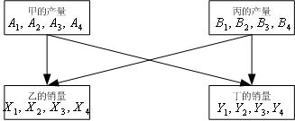

<!-- page: 525 -->

4
3
2
1
Y
Y
Y
Y
BY
AY
+
+
+
=
+
                                     （13）

此外的其它约束实际上只是一个简单的变量上界约束。
下面直接给出LINGO 程序：
model:

sets:

num1/1..4/:c1,c2,c3,c4,d1,d2,A,B,X,Y;

num2/1,2/:AXY,BXY;

endsets

data:

c1=9 4.5 3 2.25;

c2=15 8 5 3;

c3=1 2 3 4;

c4=2 4 6 8;

d1=1 3 4 4;

d2=1 2 3 4;

enddata

max=@sum(num1:c1*x+c2*y-c3*A-c4*B)-2*BXY(1)-1.5*AXY(2);

@sum(num1:A)-@sum(num2:AXY)=0;

@sum(num1:B)-@sum(num2:BXY)=0;

AXY(1)+BXY(1)-@sum(num1:X)=0;

AXY(2)+BXY(2)-@sum(num1:Y)=0;

@for(num1:@bnd(0,A,2);@bnd(0,X,2);@bnd(0,B,d1);@bnd(0,Y,d2));

end

求解这个模型，得到如下解答：
  Global optimal solution found at iteration:             0

  Objective value:                                 44.00000

                       Variable           Value        Reduced Cost

                         C1( 1)        9.000000            0.000000

                         C1( 2)        4.500000            0.000000

                         C1( 3)        3.000000            0.000000

                         C1( 4)        2.250000            0.000000

                         C2( 1)        15.00000            0.000000

                         C2( 2)        8.000000            0.000000

                         C2( 3)        5.000000            0.000000

                         C2( 4)        3.000000            0.000000

                         C3( 1)        1.000000            0.000000

                         C3( 2)        2.000000            0.000000

                         C3( 3)        3.000000            0.000000

-353-

<!-- page: 526 -->

                         C3( 4)        4.000000            0.000000

                         C4( 1)        2.000000            0.000000

                         C4( 2)        4.000000            0.000000

                         C4( 3)        6.000000            0.000000

                         C4( 4)        8.000000            0.000000

                         D1( 1)        1.000000            0.000000

                         D1( 2)        3.000000            0.000000

                         D1( 3)        4.000000            0.000000

                         D1( 4)        4.000000            0.000000

                         D2( 1)        1.000000            0.000000

                         D2( 2)        2.000000            0.000000

                         D2( 3)        3.000000            0.000000

                         D2( 4)        4.000000            0.000000

                          A( 1)        2.000000           -2.000000

                          A( 2)        2.000000           -1.000000

                          A( 3)        2.000000            0.000000

                          A( 4)        0.000000            1.000000

                          B( 1)        1.000000           -2.500000

                          B( 2)        3.000000          -0.5000000

                          B( 3)        0.000000            1.500000

                          B( 4)        0.000000            3.500000

                          X( 1)        2.000000           -6.000000

                          X( 2)        2.000000           -1.500000

                          X( 3)        0.000000            0.000000

                          X( 4)        0.000000           0.7500000

                          Y( 1)        1.000000           -10.50000

                          Y( 2)        2.000000           -3.500000

                          Y( 3)        3.000000          -0.5000000

                          Y( 4)        0.000000            1.500000

                        AXY( 1)        4.000000            0.000000

                        AXY( 2)        2.000000            0.000000

                        BXY( 1)        0.000000            3.500000

                        BXY( 2)        4.000000            0.000000

                            Row    Slack or Surplus      Dual Price

                              1        44.00000            1.000000

                              2        0.000000           -3.000000

                              3        0.000000           -4.500000

                              4        0.000000           -3.000000

                              5        0.000000           -4.500000

-354-

<!-- page: 527 -->

（3）结果解释

可以看到，最优解为
2
2
1
3
2
1
=
=
=
=
=
X
X
A
A
A
，
1
1 =
B
，
3
2 =
B
，
1
1 =
Y
，

3
2 =
Y
，
3
3 =
Y
，
4
=
= BY
AX
，
2
=
AY
，
0
4
4
3
4
3
4
=
=
=
=
=
=
=
BX
Y
X
X
B
B
A
。

也就是说，甲将向丁销售2t产品，丙不会向乙销售。

那么如何才能确定清算价格呢？与例1类似，约束（2）是针对生产商甲的供需平
衡条件，目前的右端项为0，影子价格为－3，意思就是说如果右端项增加一个很少的
量（即甲的供应量增加一个很少的量），引起的经销商的损失就是这个小量的3.5倍。
可见，此时甲的销售单价就是3万元，这就是甲面对的清算价格。

完全类似地，可以知道生产商丙面对的清算价格为4.5。自然地，乙面对的清算价
格也是3，丁面对的清算价格也是4.5，因为甲乙位于同一个市场，而丙丁也位于同一
个市场。这两个市场的清算价之差正好等于从甲、乙到丙、丁的运输成本（1.5），这
是非常合理的。

（4）模型扩展
可以和1.1一样，将上面的具体模型一般化，即考虑供应函数和需求函数的分段数
不是固定为4，而是任意有限正整数的情形。

很自然地，上面的方法很容易推广到不仅仅是2个市场，而是任意有限个市场的情
形。理论上看这当然没有什么难度，只是这时变量会更多，数学表达式变得更复杂一些。

1.3  拍卖与投标问题
例3  假设一家拍卖行对委托的5类艺术品对外拍卖，采用在规定日期前投标人提
交投标书的方式进行，最后收到了来自4个投标人的投标书。每类项目的数量、投标人
对每个项目的投标价格如表3中所示。例如，有3件第4类艺术品；对每件第4类艺术品，
投标人1，2，3愿意出的最高价分别为6，1，3，2（货币单位，如万元）。此外，假
设每个投标人对每类艺术品最多只能购买1件，并且每个投标人购买的艺术品的总数不
能超过3件。那么，哪些艺术品能够卖出去？卖给谁？这个拍卖和投标问题中每类物品
的清算价应该是多少？

表3  拍卖与投标信息

招标项目类型
1
2
3
4
5

招标项目的数量
1
2
3
3
4

投标人1
9
2
8
6
3

投标人2
6
7
9
1
5

投标人3
7
8
6
3
4
投标价格

投标人4
5
4
3
2
1

    （1）问题分析

这个具体问题在实际中可能可以通过对所有投标的报价进行排序来解决，例如可以
总是将艺术品优先卖给出价最高的投标人。但这种方法不太好确定每类艺术品的清算

-355-

<!-- page: 528 -->

价，所以我们这里还是借用前面两个例子中的方法，即假设有一个中间商希望最大化自
己的利润，从而建立这个问题的线性规划模型。

（2）问题的一般提法和假设
先建立一般的模型，然后求解本例的具体问题，设有n 类物品需要拍卖，第j 类物

品的数量为
js （
n
j
,
,2,1
L
=
）；有m 个投标者，投标者i （
m
i
L
,2,1
=
）对第j 类

物品的投标价格为
ijb （假设非负）。投标者i 对每类物品最多购买一件，且总件数不能

超过
ic 。我们的目标之一是要确定第j 类物品的清算价格
jp ，它应当满足下列假设条

件：

i）成交的第j 类物品的数量不超过
js （
n
j
,
,2,1
L
=
）；

ii）对第j 类物品的报价低于
jp 的投标人将不能获得第j 类物品；

iii）如果成交的第j 类物品的数量少于
js （
n
j
,
,2,1
L
=
）可以认为
0
=
jp
（除

非拍卖方另外指定一个最低的保护价）；

iv）对第j 类物品的报价高于
jp 的投标人有权获得第j 类物品，但如果他有权获

得的物品超过3件，那么我们假设他总是希望使自己的满意度最大（满意度可以用他的
报价与市场清算价之差来衡量）。

（3）优化模型

用
1
0 −变量
ijx 表示是否分配一件第j 类物品给投标者i ，即
1
=
ijx
表示分配，而

0
=
ijx
表示不分配。目标函数仍然是虚拟的中间商的总利润（认为这些利润全部是拍

卖行的利润也可以），即

m

n

∑∑

ij
ijx
b

1
1
                                                    （14）

=
=

i

j

除变量取值为0或1的约束外，问题的约束条件主要是两类：每类物品的数量限制
和每个投标人所能分到的物品的数量限制，即

m

ij
s
x ≤
∑

，
n
j
,
,2,1
L
=
                                        （15）

j

=1

i

n

ij
c
x ≤
∑

，
m
i
,
,2,1
L
=
                                        (16)

i

=1

j

-356-

<!-- page: 529 -->

模型就是在约束（15）、（16）下最大化目标函数（14）。
（4）模型求解
编写的LINGO程序如下：
MODEL:

TITLE 拍卖与投标;
SETS:

AUCTION/1..5/: S;

BIDDER/1..4/ : C;

LINK(BIDDER,AUCTION): B, X;

ENDSETS

DATA:

S=1 2 3 3 4;

C=3 3 3 3;

B=

9
2
8
6
3

6
7
9
1
5

7
8
6
3
4

5
4
3
2
1

;

ENDDATA

MAX=@SUM(LINK: B*X);

@FOR(AUCTION(J):

[AUC_LIM] @SUM(BIDDER(I): X(I,J)) < S(J) );

@FOR(BIDDER(I):

   [BID_LIM] @SUM(AUCTION(J): X(I,J)) < C(I) );

@FOR(LINK: @BND(0,X,1));

END

    需要指出的是，上面程序中DATA语句的数据表是直接从WORD文档中复制（Ctrl
+C）后粘贴（Ctrl+V）过来的，所以显示格式继续保持了WORD文档的风格。

（5）求解结果解释
可以看到，最优解为：投标人1得到艺术品1，3，4，投标人2，3都得到艺术品2，
3，5，投标人4得到艺术品4，5。结果，第4，5类艺术品各剩下1件没有成交。
那么如何才能确定清算价格呢？与例1和例2类似，约束“AUC_LIM”是针对每类
艺术品的数量限制的，对应的影子价格就是其清算价格：即5类艺术品的清算价格分别
是5，5，3，0，0。第4，5类艺术品有剩余，所以清算价格为0，这是符合前面的假设
的。

可以指出的是：即使上面模型中不要求
ijx 为
1
0 −变量（即只要求取0～1之间的实

-357-

<!-- page: 530 -->

数），由于这个问题的特殊性，最优解中
ijx 也会要么取0，要么取1，不可能取0～1之

间的其它数，所以可以将LINGO模型中“@BIN(X)”改为“@BND(0,X,1)”，这个线

性规划的结果将与
1
0 −整数线性规划得到的结果相同。
最后，大学生的选课问题与此是类似的，即把课程看成招标（拍卖）项目，而把学
生愿意付出的选课费看成投标。据说国外有些大学的选课系统就是使用这个模型确定每
门课程的清算价格（选课费用）的，而且取得了成功。

1.4  交通流均衡问题

例4  某地有如图2所示的一个公路网，每天上班时间有6千辆小汽车要从居民区A
前往工作区D 。经过长期观察，我们得到了图中5条道路上每辆汽车的平均行驶时间和
汽车流量之间的关系，如表4所示，那么，长期来看，这些汽车将如何在每条道路上分
布？

   图2  一个公路网示意图

表4  平均行驶时间和汽车流量之间的关系

道       路
AB
AC
BC
BD
CD

流量
2
≤
20
52
12
52
20
<
2
流量
3
≤
30
53
13
53
30
行驶时间

（min）

3< 流量
4
≤
40
54
14
54
40

    （1）问题分析

这个问题看起来似乎与前面几个例子完全不同，但实际上交通流与市场经济活动类
似，也存在着均衡。

我们可以想象有一个协调者，正如前面几个例子中的所谓中间商可以理解为市场规
律一样，实际上这里的所谓协调者也可以认为是交通流的规律。交通流的规律就是每辆

汽车都将选择使自己从A 到D 运行时间最少的路线，其必然的结果是无论走哪条路线
从A 到D ，最终花费的时间应该是一样的（否则，花费时间较长的那条线路上的部分
汽车就会改变自己的路线，以缩短自己的行驶时间）。

也就是说，长期来看，这些汽车在每条道路上的分布将达到均衡状态（所谓均衡，
这里的含义就是每辆汽车都不能仅仅通过自身独自改变道路，节省其行驶时间）。在这
种想法下，我们来建立线性规划模型。

（2）优化模型
交通流的规律要求所有道路上的流量达到均衡，我们仍然类似例1和例2来考虑问
题。如果车流量是一辆车一辆车增加的，那么在每条道路上车流量小于2时，车流量会

-358-

<!-- page: 531 -->

有一个分布规律；当某条道路上流量正好超过2时，新加入的一辆车需要选择使自己堵
塞时间最短的道路。这就提示我们把同一条道路上的流量分布分解成不同性质的三个部

分。也就是说，我们用
)
(AB
Y
表示道路AB 上的总的流量，并进一步把它分解成三部

分：

i）道路AB 上的流量不超过2时的流量，用
)
,2
(
AB
X
表示；

ii）道路AB 上的流量超过2但不超过3时，超过2的流量部分用
)
,3
(
AB
X
表示；

iii）道路AB 上的流量超过3但不超过4时，超过3的流量部分用
)
,4
(
AB
X
表示。

依次类推，对道路
CD
BD
BC
AC
,
,
,
上同理可以定义类似的决策变量。因此，问题

中总共有20个决策变量
)
( j
Y
和
)
,
(
j
i
X
（
4,3,2
=
i
，
CD
BD
BC
AC
AB
j
,
,
,
,
=
）。

问题的目标应当是使总的堵塞时间最小。用
)
,
(
j
i
T
表示流量
)
,
(
j
i
X
对应的堵塞时

间（即表3中的数据，是对每辆车而言的），我们看看用∑∑

j
i
X
j
i
T

)
,
(
)
,
(

作为

=
4
,3,2

i
j

为道路

总堵塞时间是否合适。很容易理解：后面加入道路的车辆可能又会造成前面进入道路的

车辆的进一步堵塞，如流量为3时，原先流量为2的车辆实际上也只能按
)
,3
(
j
T
的时间

通过，而不是
)
,2
(
j
T
。也就是说，∑∑

j
i
X
j
i
T

)
,
(
)
,
(

并不是总堵塞时间。但是

=
4
,3,2

i
j

为道路

我们也可以发现，
)
,
(
j
i
T
关于i 是单调增加的，即不断增加的车流只会使以前的堵塞加

剧而不可能使以前的堵塞减缓。所以，关于决策变量
)
,
(
j
i
X
而言，

∑∑
=
4
,3,2

j
i
X
j
i
T

)
,
(
)
,
(

与我们希望优化的目标的单调性是一致的。因此，可以用

i
j

为道路

∑∑
=
4
,3,2

j
i
X
j
i
T

)
,
(
)
,
(

作为目标函数进行优化。

i
j

为道路

约束条件有三类：

i）每条道路上的总流量Y 等于该道路上的分流量X 的和；

ii）道路交汇处
D
C
B
A
,
,
,
（一般称为节点）的流量守恒（即进入量等于流出量）；

iii）决策变量的上限限制，如
2
)
,2
(
≤
AB
X
，
1
)
,3
(
≤
AB
X
，
1
)
,4
(
≤
AB
X
等。

于是对应的优化模型很容易直接写出（略）。

-359-

<!-- page: 532 -->

（3）模型求解
编写LINGO程序如下：
MODEL:

TITLE 交通流均衡;
SETS:

ROAD/AB,AC,BC,BD,CD/:Y;

CAR/2,3,4/;

LINK(CAR,ROAD): T, X;

ENDSETS

DATA:

! 行驶时间(分钟) ;
T=20,52,12,52,20

        30,53,13,53,30

  40,54,14,54,40;

ENDDATA

[OBJ] MIN=@SUM(LINK: T*X); ! 目标函数;

! 四个节点的流量守恒条件;
[NODE_A] Y(@INDEX(AB))+Y(@INDEX(AC)) = 6;

[NODE_B] Y(@INDEX(AB))=Y(@INDEX(BC))+Y(@INDEX(BD));

[NODE_C] Y(@INDEX(AC))+Y(@INDEX(BC))=Y(@INDEX(CD));

[NODE_D] Y(@INDEX(BD))+Y(@INDEX(CD))=6;

! 每条道路上的总流量Y等于该道路上的分流量X的和;
@FOR( ROAD(I): [ROAD_LIM] @SUM(CAR(J): X(J,I)) = Y(I));

! 每条道路的分流量X的上下界设定;
@FOR(LINK(I,J)|I#EQ#1: @BND(0,X(I,J),2) );

@FOR(LINK(I,J)|I#GT#1: @BND(0,X(I,J),1) );

END

可以指出的是，上面4个节点的流量守恒条件中，其实只有3个是独立的（也就是
说，第4个条件总可以从其它3个方程推导出来），因此从中去掉任何一个都不会影响
到计算结果。

（4）结果解释

LINGO的运行结果表明，均衡时道路
CD
BD
BC
AC
AB
,
,
,
,
的流量分别是4，2，2，

2，4（千辆）车。但是要注意，正如我们建立目标函数时所讨论过的，这时得到的目
标函数值452并不是真正的总运行和堵塞时间，而是一个用来表示目标函数趋势的虚拟
的量，没有太多实际物理意义。事实上，可以求出这时的真正运行时间是：每辆车通过

CD
BD
BC
AC
AB
,
,
,
,
道路分别需要40，52，12，52，40（min），也就是在图中三

-360-

<!-- page: 533 -->

条路线
ABCD
ACD
ABD
,
,
上都需要92min，所以这也说明交通流确实达到了均衡。

于是，均衡时真正的总运行时间应该是
552
92
6
=
×
（千辆车·min）。
（5）模型讨论
仔细想想就会发现，上面的解并不是最优解，即均衡解并不一定是最优的流量分配
方案。为了求出使所有汽车的总运行时间最小的交通流，应该如何做呢？也就是说，这
相当于假设有一个权威的机构来统筹安排，最优地分配这些交通流，而不是像求均衡解
时那样认为各个个体（每辆车）都可以自己选择道路，自然达到平衡状态。

为了进行统筹规划，我们需要把新增的流量
)
,
(
j
i
X
（
4,3,2
=
i
，

CD
BD
BC
AC
AB
j
,
,
,
,
=
）造成的实际堵塞时间计算出来（仍按每辆车计算），而不

是像上面那样不考虑对原有车流造成的堵塞效应。以道路AB 为例。

i）当流量为2千辆时，每辆车的通过时间为20min，所以总通过时间是40（千辆
车·min）；

ii）当流量增加一个单位（本题中一个单位就是1千辆）达到3千辆时，每辆车的
通过时间为30min，所以总通过时间是90（千辆车·min）；

iii）当流量再增加一个单位达到4千辆时，每辆车的通过时间为40min，所以总
通过时间是160（千辆车·min）。

由此可见，流量超过2而不超过3时，单位流量的增加导致的总通过时间的变化为
90－40＝50（千辆车·min）；流量超过3而不超过4时，单位流量的增加导致的总通
过时间的变化为160－90＝70（千辆车·min）。

类似地，对所有道路，都可以得到单位流量的增加导致总行驶时间的增量和汽车流
量之间的关系（参加表5）。

表5  单位流量的增加导致总行驶时间的增量和汽车流量之间的关系

道       路
AB
AC
BC
BD
CD

流量
2
≤
20
52
12
52
20
<
2
流量
3
≤
50
55
15
55
50

总行驶时间

的增量（千辆

车· min）
3< 流量
4
≤
70
57
17
57
70

    用表5中的总行驶时间的增量数据代替前面模型中的每辆车的行驶时间数据

)
,
(
j
i
T
，模型的其它部分完全不用变。重新求解LINGO模型，LINGO程序如下：

MODEL:

TITLE 交通流均衡;
SETS:

ROAD/AB,AC,BC,BD,CD/:Y;

CAR/2,3,4/;

-361-

<!-- page: 534 -->

LINK(CAR,ROAD): T, X;

ENDSETS

DATA:

! 行驶时间(分钟) ;
T=

20
52
12
52
20

50
55
15
55
50

70
57
17
57
70

;

ENDDATA

[OBJ] MIN=@SUM(LINK: T*X); ! 目标函数;

! 四个节点的流量守恒条件;
[NODE_A] Y(@INDEX(AB))+Y(@INDEX(AC)) = 6;

[NODE_B] Y(@INDEX(AB))=Y(@INDEX(BC))+Y(@INDEX(BD));

[NODE_C] Y(@INDEX(AC))+Y(@INDEX(BC))=Y(@INDEX(CD));

[NODE_D] Y(@INDEX(BD))+Y(@INDEX(CD))=6;

! 每条道路上的总流量Y等于该道路上的分流量X的和;
@FOR( ROAD(I): [ROAD_LIM] @SUM(CAR(J): X(J,I)) = Y(I));

! 每条道路的分流量X的上下界设定;
@FOR(LINK(I,J)|I#EQ#1: @BND(0,X(I,J),2) );

@FOR(LINK(I,J)|I#GT#1: @BND(0,X(I,J),1) );

END

求得的最优车流分配方式是：道路
CD
BD
AC
AB
,
,
,
的流量都是3千辆，而道路BC

上没有流量；总（加权）运行时间为498（千辆车·min），优于均衡时的结果552（千
辆车·min）。此时，每辆车的运行时间＝498/6=83（min），少于均衡时的92min。

当然，这个最优解必须强制执行，否则AB 道路上的一些车到底B 点时，发现当前走

BCD 的时间只需要
42
30
12
=
+
（min），比走BD 的时间（53min）短很多，所以
他们就会改走BCD ，导致走BCD 的时间（主要是走道路CD 的时间）增加；如此下
去，最后终将到达前面我们得到的均衡状态。

这是一个非常有趣的结果：当一个系统中的每个个体都独自追求个体利益最大化
时，整体的利益却没有达到最大化。

更令人惊讶的是：这个例子的道路网中如果没有道路BC ，从A 到D 的平均时间
是83min；而新开了一条道路BC 以后，从A 到D 的平均时间居然变成92min，不是
加快反而减慢了。由此也可以理解，做出一个科学、合理的交通网的规划是一件相当复
杂的工作。

§2  投资组合问题
    2.1  基本的投资组合模型

-362-

<!-- page: 535 -->

例5  美国某三种股票（
C
B
A
,
,
）12年（1943－1954）的价格（已经包括了分

红在内）每年的增长情况如表6所示（表中还给出了相应年份的500种股票的价格指数

的增长情况）。例如，表中第一个数据1.300的含义是股票A 在1943年的年末价值是
其年初价值的1.300倍，即收益为30％，其余数据的含义依此类推。假设你在1955年
时有一笔资金准备投资这三种股票，并期望年收益率至少达到15％，那么你应当如何
投资？当期望的年收益率变化时，投资组合和相应的风险如何变化？

表6  股票收益数据

年  份          股票A          股票B          股票C          股票指数

1943           1.300          1.225           1.149           1.258997

1944           1.103          1.290           1.260           1.197526

1945           1.216          1.216           1.419           1.364361

1946           0.954          0.728           0.922           0.919287

1947           0.929          1.144           1.169           1.057080

1948           1.056          1.107           0.965           1.055012

1949           1.038          1.321           1.133           1.187925

1950           1.089          1.305           1.732           1.317130

1951           1.090          1.195           1.021           1.240164

1952           1.083          1.390           1.131           1.183675

1953           1.035          0.928           1.006           0.990108

1954           1.176          1.715           1.908           1.526236

    （1）问题分析

本例的问题称为投资组合（portfolio）问题，早在1952年Markowitz就给出
了这个模型的基本框架，而且这个模型后来又得到了不断的研究和改进。一般来说，人
们投资股票时的收益是不确定的，因此是一个随机变量，所以除了考虑收益的期望值外，
还应当考虑风险。风险用什么衡量？Markowitz建议，风险可以用收益的方差（或标
准差）来进行衡量：方差越大，则认为风险越大；方差越小，则认为风险越小。在一定
的假设下，用收益的方差（或标准差）来衡量风险确实是合适的。为此，我们先对表6
中给出的数据计算出三种股票收益的均值和方差（包括协方差）备用。

一种股票收益的均值衡量的是这种股票的平均收益状况，而收益的方差衡量的是这
种股票收益的波动幅度，方差越大则波动越大（收益越不稳定）。两种股票收益的协方
差表示的则是它们之间的相关程度：

i）协方差为0时两者不相关。
ii）协方差为正数表示两者正相关，协方差越大则正相关性越强（越有可能一赚
皆赚，一赔俱赔）。

iii）协方差为负数表示两者负相关，绝对值越大则负相关性越强（越有可能一个
赚，另一个赔）。

-363-

<!-- page: 536 -->

记股票
C
B
A
,
,
每年的收益率分别为
3
2
1
,
,
R
R
R
（注意表中的数据减去1以后才是年

收益率），则
iR （
3,2,1
=
i
）是一个随机变量。用E 和D 分别表示随机变量的数学期

望和方差算子，用cov表示两个随机变量的协方差（covariance），根据概率论的知
识和表6给出的数据，则可以计算出年收益率的数学期望为

0890833
.0
1 =
ER
，
0.2136667
2 =
ER
，
0.2345833
3 =
ER
               （17）

同样，可以计算股票
C
B
A
,
,
年收益率的协方差矩阵为

⎡
=

⎤

0.01307513
0.01240721
0.01080754

⎢
⎢
⎢

⎥
⎥
⎥

COV
               (18)

0.05542639
0.05839170
0.01240721

0.09422681
0.05542639
0.01307513

⎣

⎦

计算的LINGO程序如下：
MODEL:

Title 均值向量Mean与协方差矩阵COV;
SETS:

   YEAR/1..12/;

   STOCKS/ A,  B,  C/: Mean;

   link(YEAR, STOCKS): R;

   temp/1..5/;

   tmatrix(YEAR,temp):tm;

   STST(Stocks,stocks): COV;

ENDSETS

DATA:

   tm =

1943           1.300          1.225           1.149           1.258997

1944           1.103          1.290           1.260           1.197526

1945           1.216          1.216           1.419           1.364361

1946           0.954          0.728           0.922           0.919287

1947           0.929          1.144           1.169           1.057080

1948           1.056          1.107           0.965           1.055012

1949           1.038          1.321           1.133           1.187925

1950           1.089          1.305           1.732           1.317130

1951           1.090          1.195           1.021           1.240164

1952           1.083          1.390           1.131           1.183675

1953           1.035          0.928           1.006           0.990108

   1954           1.176          1.715           1.908           1.526236;

-364-

<!-- page: 537 -->

@text(data1.txt)=R;

@text(data2.txt)=Mean;

@text(data3.txt)=COV;

ENDDATA

CALC: !计算均值向量Mean与协方差矩阵COV;
@for(tmatrix(i,j)|j #ge#2 #and# j #le# 4:R(i,j-1)=tm(i,j)-1);

@for(stocks(i): Mean(i) = @sum(year(j): R(j,i)) / @size(year) );

@for(stst(i,j): COV(i,j) = @sum(year(k):

(R(k,i)-mean(i))*(R(k,j)-mean(j))) / (@size(year)-1) );

ENDCALC

END

    注意模型中计算协方差矩阵COV时，分母是样本数减去1，而不是样本数，这是常
用的计算方法，主要是为了保持这个估计的无偏性（当然，样本数较大时两者差别不太）。

（2）模型建立

用决策变量
2
1, x
x
和
3x 分别表示投资人投资股票
C
B
A
,
,
的比例。假设市场上没有

其它投资渠道，且手上资金（可以不妨假设只有1个单位的资金）必须全部用于投资这
三种股票，则

0
,
,
3
2
1
≥
x
x
x
，
1
3
2
1
=
+
+
x
x
x
                                   （19）

年投资收益率
3
3
2
2
1
1
R
x
R
x
R
x
R
+
+
=
也是一个随机变量。根据概率论的知识，投

资的总期望收益为

3
3
2
2
1
1
ER
x
ER
x
ER
x
ER
+
+
=
                                    （20）

年投资收益率的方差为

+
+
=

R
x
R
x
R
x
D
V

)
(

3
3
2
2
1
1

+
+
=

3
2
3
2
2
2
1
2
1

DR
x
DR
x
DR
x

+
+
+

)
,
cov(
2
)
,
cov(
2
)
,
cov(
2

R
R
x
x
R
R
x
x
R
R
x
x

      （21）

3
2
3
2
3
1
3
1
2
1
2
1

3

3

∑∑

=
=
=

)
,
cov(

j
i
j
i
R
R
x
x

i
j

1

1

实际的投资者可能面临许多约束条件，这里只考虑题中要求的年收益率（的数学期
望）不低于15％，即

15
.0
3
3
2
2
1
1
≥
+
+
ER
x
ER
x
ER
x
                                  （22）

所以，最后的优化模型就是在约束（19）和（22）下极小化（21）。由于目标函

数V 是决策变量的二次函数，而约束都是线性函数，所以这是一个二次规划问题。

（3）用LINGO求解模型

-365-

<!-- page: 538 -->

编写LINGO程序如下：
MODEL:

SETS:

   YEAR/1..12/;

   STOCKS/ A,  B,  C/: Mean,X;

   link(YEAR, STOCKS): R;

   STST(Stocks,stocks): COV;

ENDSETS

DATA:

TARGET=0.15;

Mean=@file(data2.txt);

COV=@file(data3.txt);

ENDDATA

[OBJ] MIN = @sum(STST(i,j): COV(i,j)*x(i)*x(j));

[ONE] @SUM(STOCKS: X) = 1;

[TWO] @SUM(stocks: mean*x) >= TARGET;

END

求得投资三种股票的比例大致是：A 占53％，B 占36％，C 占11％。风险（方
差）为0.02241378。

（4）用MATLAB软件对模型进行参数分析
对实际投资人来说，可能不仅希望知道指定的期望投资回报率下的风险（回报率的
方差），可能更希望知道风险随着不同的投资回报率是如何变化的，然后作出最后的投
资决策。这当然可以通过在上面的模型中不断修改约束中的参数（目前为0.15）来实
现，如将0.15改为0.2345，则表示投资回报率希望达到23.45％（这几乎是可能达到

的最大值了，因为这几乎是三种股票中最大的投资回报率，即股票C 的回报率）。可
以想到，这时应主要投资在股票C 上。实际求解一下，可以知道最优解中投资股票C 的
份额大约是99.6％（剩余的大约0.4％投资在股票B 上）。

目前LINGO软件还没有二次规划灵敏度分析的功能。下面我们利用MATLAB软件进
行灵敏度分析，回报率的取值区间为[0.09,0.234]，变化步长为0.002。编写程序
如下：
clc,clear

load data2.txt,load data3.txt

h=reshape(data3,[3,3]);

a=data2';

solution=[];

target=0.09;

hold on

while target<0.234

    [x,y]=quadprog(2*h,[],-a,-target,ones(1,3),1,zeros(3,1));

-366-

<!-- page: 539 -->

    plot(target,y,'*b');

    solution=[solution [target;x;y]];

    target=target+0.002;

    end

solution

得到的投资回报率与风险之间的关系曲线如图3所示

0.09

风险

0.08

0.07

0.06

0.05

0.04

0.03

0.02

投资回报率

0.08
0.1
0.12
0.14
0.16
0.18
0.2
0.22
0.24
0.01

        图3  投资回报率与风险之间的关系

从图3可以看出，投资回报率从22％附近开始，风险迅速增大。

    2.2  存在无风险资产时的投资组合模型

例6  假设除了例5中的三种股票外，投资人还有一种无风险的投资方式，如购买国库券。假设国

库券的年收益率为5％，如何考虑例5中的问题？

（1）问题分析

其实，无风险的投资方式（如国库券、银行存款等）是有风险的投资方式（如股票）的一种特例，

所以这就意味着例5中的模型仍然是适用的。只不过无风险的投资方式的收益是固定的，所以方差（包

括它与其它投资方式的收益的协方差）都是0。

（2）问题求解

假设国库券的投资方式记为D ，则当希望回报率为15％时，对应的LINGO模型如下：
MODEL:

Title 含有国库券的投资组合模型;
SETS:

   STOCKS1/ A,  B,  C/: mean1;

   STST1(Stocks1,stocks1): COV1;

   STOCKS/ A,  B,  C, D/: mean,X;

   STST(Stocks,stocks): COV;

ENDSETS

DATA:

mean=0.05;

-367-

<!-- page: 540 -->

COV=0;

COV1=@file(data3.txt);

Mean1=@file(data2.txt);

TARGET = 0.15; ! 0.10;

ENDDATA

calc:

@for(STOCKS(i)|i #ne# 4: mean(i)=mean1(i));

@for(STST(i,j)| i #ne# 4 #and# j #ne# 4:COV(i,j)=COV1(i,j));

endcalc

[OBJ] MIN = @sum(STST(i,j): COV(i,j)*x(i)*x(j));
[ONE] @SUM(STOCKS: X) = 1;

[TWO] @SUM(stocks: mean*x) >= TARGET;

END

计算结果为，投资A 占8.7％，B 占42.9％，C 占14.3％，D （国库券）占34.1％，风险

（方差）为0.02080347。与例5中的风险（方差为0.02241378）比较，无风险资产的存

在可以使得投资风险减少。虽然国库券的收益率只有5％，比希望得到的收益率15％小很多，

但在国库券上的投资要占到34.1％，其原因就是为了减少风险。

现在，我们把上面模型中的期望收益减少到10％，即把数据段中的语句“TARGET =

0.15”改为“TARGET = 0.10”，重新求解模型。计算结果如下：

投资A 占4.3％，B 占21.4％，C 占7.2％，D （国库券）占67.1％，此时风险（方差为

0.0052）进一步下降。请特别注意：你能发现这个结果（这里不妨称为结果2）与刚才

“TARGET = 0.15”的结果（这里不妨称为结果1）有什么联系吗？

仔细观察这两个结果，可以发现：结果2中投资在有风险资产（股票
C
B
A
,
,
）上的比

例大约都是结果1中相应的比例的一半。也就是说，无论你的期望收益和风险偏好如何，你

手上所持有的风险资产本身相互之间的比例居然是不变的！变化的只是投资于风险资产与

无风险资产之间的比例。有趣的是，这一现象在一般情况下也是成立的，一般称为“分离

定理”，即风险资产之间的投资比例与期望收益和风险偏好无关。1981年诺贝尔经济学奖

得主Tobin教授之所以获奖，很大一部分原因就是因为他发现了这个重要的规律。

也正是由于有这样一个重要结果，我们在下面各节的讨论中就不再考虑存在无风险资产

的情形了，而只考虑确定风险资产之间的投资比例。

2.3  考虑交易成本的投资组合模型

例7  继续考虑例5（期望收益仍定为15％）。假设你目前持有的股票比例为：股票A 占

50％，B 占35％，C 占15％。这个比例与例5中得到的最优解有所不同。实际股票市场上

每次股票买卖通常总有交易费，例如按交易额的1％收取交易费，这时你是否仍需要对所持

的股票进行买卖（换手），以便满足最优解的要求？

（1）建立模型

-368-

<!-- page: 541 -->

仍用决策变量
2
1, x
x
和
3x 分别表示投资人应当投资股票
C
B
A
、
、
的比例，进一步假

设购买股票
C
B
A
、
、
的比例为
2
1, y
y
和
3y ，卖出股票
C
B
A
、
、
的比例为
2
1, z
z
和
3z 。

其中，
iy 和
iz （
3,2,1
=
i
）中显然最多只能有一个严格取正数，且

0
,
,
≥
i
i
i
z
y
x
，
3,2,1
=
i
                                             （23）

由于交易费用的存在，这时约束
1
3
2
1
=
+
+
x
x
x
不一定还成立（只有不进行股票买卖，

即
0
3
2
1
3
2
1
=
=
=
=
=
=
z
z
z
y
y
y
时，这个约束才成立）。其实，这个关系式的本质是：

当前持有的总资金是守恒的，在有交易成本（1％）的情况下，应当表示成如下形式：

3

3

1
=
+
⋅
+
∑
∑

1
)
(
01
.0

i
z
y
x
                                      （24）

i
i
i

=
=
i

1

另外，考虑到当前持有的各只股票的份额
i
i
i
y
x
c
,
,
与
iz （
3,2,1
=
i
）之间也应该满足

守恒关系式

i
i
i
i
z
y
c
x
−
+
=
，
3,2,1
=
i
                                         （25）

这就是新问题的约束条件，模型的其它部分不用改变。

（2）模型求解

问题对应的LINGO程序如下：
MODEL:

Title 考虑交易费的投资组合模型;
SETS:

   STOCKS/ A,  B,  C/: C,Mean,X,Y,Z;

   STST(Stocks,stocks): COV;

ENDSETS

DATA:

! 股票的初始份额;
c=0.5  0.35  0.15;

TARGET=0.15;

Mean=@file(data2.txt);

COV=@file(data3.txt);

ENDDATA

[OBJ] MIN = @sum(STST(i,j): COV(i,j)*x(i)*x(j));

[ONE] @SUM(STOCKS: X+0.01*Y+0.01*Z) = 1;

-369-

<!-- page: 542 -->

[TWO] @SUM(stocks: mean*x) >= TARGET;

@FOR(stocks: [ADD] x = c + y - z);
END

在这个LINGO模型中，股票C是原始集合“STOCKS”的一个元素，不会因为与集
合的属性C同名而混淆。这是LINGO新版本比LINGO旧版本的一个改进之处。

2.4  利用股票指数简化投资组合模型
例8  继续考虑例5（期望收益率仍定为15％）。在实际的股票市场上，一般存在
成千上万的股票，这时计算两两之间的相关性（协方差矩阵）将是一件非常费事甚至不

可能的事情。例如，1000只股票就需要计算
499500
2
1000 =
C
个协方差。能否通过一定

方式避免协方差的计算，对模型进行简化呢？例如，例5中还给出了当时股票指数的信
息，但我们到此为止一直没有利用。我们这一节就考虑利用股票指数对前面的模型进行
修改和简化。

（1）问题分析
可以认为股票指数反映的是股票市场的大势信息，对具体每只股票的涨跌通常是有
显著影响的。我们这里最简单地假设每只股票的收益与股票指数成线性关系，从而可以
通过线性回归方法找出这个线性关系。

（2）线性回归

具体地说，用M 表示股票指数（也是一个随机变量），其均值为
)
(
0
M
E
m =
，

方差为
)
(
2
0
M
D
s =
。根据上面的线性关系的假定，对某只具体的股票i ，其价值
iR （随

机变量）可以表示成

i
i
i
i
e
M
b
u
R
+
+
=
                                              （26）

其中
iu 和
ib 需要根据所给数据经过回归计算得到，
ie 是一个随机误差项，其均值为

0
)
(
=
ie
E
，方差为
)
(
2
i
i
e
D
s =
。此外，假设随机误差项
ie 与其它股票j （
i
j ≠
）和股

票指数M 都是独立的，所以
0
)
(
)
(
=
=
M
e
E
e
e
E
i
j
i
。

先看看如何根据所给数据经过回归计算得到
iu 和
ib 。记所给的12年的数据为

}
,
{
)
(
)
(
k
i
k R
M
，（
12
,
,2,1
L
=
k
），线性回归实际上是要使误差的平方和最小，即要解

如下优化问题：

-370-

<!-- page: 543 -->

2
)
(
)
(
12

12

∑
∑

k
i
R
M
b
u
e
，
3,2,1
=
i
                 （27）

−
+
=

2
)
(
|
|
)
(
min

k
i
k
i
i
k

=
=

1

k

1

对这里给出的三种股票，可以编写如下LINGO程序求出线性回归的系数
iu 和
ib（同

时也在计算（CALC）段计算M 的均值
0
m 和方差
2
0s ，标准差
0s 的值）：

MODEL:

Title 线性回归模型;
SETS:

   YEAR/1..12/:M;

   STOCKS/A,  B,  C/: u, b, s2, s;

   temp/1..5/;

   tmatrix(YEAR,temp):tm;

   link(YEAR, STOCKS): R, e;

ENDSETS

DATA:

   num=?;

   tm =

1943           1.300          1.225           1.149           1.258997

1944           1.103          1.290           1.260           1.197526

1945           1.216          1.216           1.419           1.364361

1946           0.954          0.728           0.922           0.919287

1947           0.929          1.144           1.169           1.057080

1948           1.056          1.107           0.965           1.055012

1949           1.038          1.321           1.133           1.187925

1950           1.089          1.305           1.732           1.317130

1951           1.090          1.195           1.021           1.240164

1952           1.083          1.390           1.131           1.183675

1953           1.035          0.928           1.006           0.990108

   1954           1.176          1.715           1.908           1.526236;

ENDDATA

CALC:
@for(tmatrix(i,j)|j #ge#2 #and# j #le# 4:R(i,j-1)=tm(i,j));

@for(tmatrix(i,j)| j #eq# 5:M(i)=tm(i,j));

mean0=@sum(year: M)/@size(year);

s20=@sum(year: @sqr(M-mean0)) / (@size(year)-1);

s0=@sqrt(s20);

ENDCALC

-371-

<!-- page: 544 -->

[OBJ] MIN = @sum(stocks(i)|i#eq#num: s2(i));

@for(link(k,i)|i#eq#num: [ERROR] e(k,i) = R(k,i)-u(i)-b(i)*M(k));

@for(stocks(i)|i#eq#num:[VAR] s2(i)=(@sum(year(k): @sqr(e(k,i))) /

(@size(year)-2));

[STD] s(i)=@sqrt(s2(i)) );

@for(stocks: @free(u);@free(b) );

@for(link: @free(e) );
END

对上面的这个程序，请注意以下几点：

i）在CALC段直接计算了M 的均值
0
m 和方差
2
0s （为了使这个估计是无偏估计，

分母是11而不是12）以及标准差
0s 。

ii）程序中使用了两个常用的数学函数：平方函数@sqr和平方根函数@sqrt。

iii）除了计算回归系数外，我们同时估计了回归误差的方差
2
is 和标准差
is 。为了使

这个估计是无偏估计，计算
2
is 时分母是10而不是11或12，这时因为此时估计了两个参数，

自由度少了两个。

iv）@free(u)，@free(b)，@free(e)三个语句一定不能少，因为这几个变量不一定是

非负的。

v）DATA段定义了一个变量num，并用“num=?”语句表示其具体值需要由使用者在程序

运行时输入。变量num的作用是控制当前对哪只股票进行线性回归（num＝1，2，3分别对应

于股票
C
B
A
,
,
）。

vi）其实，这个问题也可以对三只股票的回归不加区分，即放在同一个模型中同时优

化（相应地，只需要去掉上面程序中的控制变量num和所有的过滤条件“i#eq#num”），不

过这样就会增加变量的个数，我们不建议大家那样做。也就是说，对于能够分解成小规模

问题的优化问题，最好一个一个分开做，这样可以减少问题规模，有助于求到比较好的解。

运行上述LINGO程序，得到的计算结果为：股票指数M 的均值
1.191458
0 =
m
，方差

为
0.02873661
2
0 =
s
，标准差为
0.1695188
0 =
s
；对股票A ，回归系数
0.5639761
1 =
u
，

0.4407264
1 =
b
，误差的方差
0.00574832
2
1 =
s
，误差的标准差
0.07581767
1 =
s
。

同理（运行时输入num=2或3），可以得到：对股票B ，回归系数
0.2635028
2
−
=
u
，

1.239799
2 =
b
，误差的方差
0.01564263
2
2 =
s
，误差的标准差
0.1250705
2 =
s
。对股

-372-

<!-- page: 545 -->

票C ，回归系数
0.5809592
3
−
=
u
，
1.523798
3 =
b
，误差的方差
0.03025165
2
3 =
s
，误

差的标准差
0.17393
3 =
s
。

（3）优化模型

现在，仍用决策变量
2
1, x
x
和
3x 分别表示投资人应当投资股票
C
B
A
,
,
的比例，其

中

0
,
,
3
2
1
≥
x
x
x
，
1
3
2
1
=
+
+
x
x
x
                                   （28）

此时，与2.1节的讨论类似，对应的收益应该表示为

3

3

i
i
e
M
b
u
x
R
x
R
+
+
=
=
∑
∑

)
(

                               （29）

i
i

1
i
i
i
i

=
=

1

收益的期望为

3

3

∑
∑

+
=
+
+
=

i
i
i
i
m
b
u
x
e
M
b
u
E
x
ER
         （30）

1
)
(
)
(

i
i
i
i

1
0

=
=

i

收益的方差为

2
3

2
2
0
2
3

i
i
i
i
x
s
s
b
e
M
b
u
D
x
DR
∑
∑

+
=
+
+
=
                   （31）

2
)
(
)
(
i
i

i
i
i

=
=

1

1

综上所述，建立如下模型

2
3

i
i
x
s
s
b
∑

+
                                           （32）

2
2
0
2
)
(
min
i
i

=

1

3

1
=
∑

s.t.
1

ix
，                                              （33）

=
i

3

1
0
≥
+
∑

15
.0
)
(

i
i
x
m
b
u
                                   （34）

i
i

=

0
≥
ix
，
3,2,1
=
i
 （35）

（4）模型求解

为了数据传递方便，我们把三个回归模型同时计算。LINGO程序如下：
MODEL:

Title 线性回归模型;
SETS:

-373-

<!-- page: 546 -->

   YEAR/1..12/:M;

   STOCKS/A,  B,  C/: u, b, s2, s;

   temp/1..5/;

   tmatrix(YEAR,temp):tm;

   link(YEAR, STOCKS): R, e;

ENDSETS

DATA:

tm =

1943           1.300          1.225           1.149           1.258997

1944           1.103          1.290           1.260           1.197526

1945           1.216          1.216           1.419           1.364361

1946           0.954          0.728           0.922           0.919287

1947           0.929          1.144           1.169           1.057080

1948           1.056          1.107           0.965           1.055012

1949           1.038          1.321           1.133           1.187925

1950           1.089          1.305           1.732           1.317130

1951           1.090          1.195           1.021           1.240164

1952           1.083          1.390           1.131           1.183675

1953           1.035          0.928           1.006           0.990108

   1954           1.176          1.715           1.908           1.526236;

@text('data4.txt')=s2;

@text('data5.txt')=u;

@text('data6.txt')=b;

ENDDATA

CALC:
@for(tmatrix(i,j)|j #ge#2 #and# j #le# 4:R(i,j-1)=tm(i,j));

@for(tmatrix(i,j)| j #eq# 5:M(i)=tm(i,j));

mean0=@sum(year: M)/@size(year);

s20=@sum(year: @sqr(M-mean0)) / (@size(year)-1);

s0=@sqrt(s20);

ENDCALC

[OBJ] MIN = @sum(stocks(i): s2(i));

@for(link(k,i): [ERROR] e(k,i) = R(k,i)-u(i)-b(i)*M(k));

@for(stocks(i):[VAR] s2(i)=(@sum(year(k): @sqr(e(k,i))) / (@size(year)-2));

[STD] s(i)=@sqrt(s2(i)) );

@for(stocks: @free(u);@free(b) );

@for(link: @free(e) );
END

二次规划（32）～（35）的LINGO程序如下：

-374-

<!-- page: 547 -->

MODEL:

Title 利用股票指数简化投资组合模型;
SETS:

   STOCKS/A,  B,  C/: u, b, s2, x;

ENDSETS

DATA:

mean0=1.191458;

s20 = 0.02873661;

s2  =  @file(data4.txt);

u   =  @file(data5.txt);

b   =  @file(data6.txt);
ENDDATA

[OBJ] MIN = @sum(stocks: (@sqr(b)*s20+s2)*@sqr(x));

@sum(stocks: x)=1;

@sum(stocks: (u+b*mean0)*x)>1.15;
END

计算结果为，最后的持股情况是：A 大约占初始时刻总资产的54％，B 占27％，C

占19％。这个结果与例5的结果是不同的。

2.5  其它目标下的投资组合模型
前面介绍的模型中都是在可能获得的收益的数学期望满足一定最低要求的前提下，
用可能获得的收益的方差来衡量投资风险，将其作为最小化的目标。这种做法的合理性
通常至少需要有两个基本假设：

（1）可能获得的收益的分布是对称的（如正态分布）。因为这时未来收益高于设
定的最低要求和低于设定的最低要求的数量和概率是一样的。可惜的是，实际中这个假
设往往难以验证。

（2）投资者对风险（或偏好）的效用函数是二次的，否则为什么值选择效益（随
机变量）的二阶矩（方差）来衡量风险使之最小化，而不采用其它阶数的矩？

一般来说，投资者实际关心的通常是未来收益低于设定的最低要求的数量（即低多
少）和概率，也就是说更关心的是下侧风险（downside risk）。所以，如果分布不
是对称的，则采用收益的方差来衡量投资风险就不一定合适。为了克服这个缺陷，可以
用收益低于最低要求的数量的均值（一阶矩）作为下侧风险的衡量依据，即作为最小化
的目标。此外，也可以采用收益低于最低要求的数量的二阶矩（即收益的半方差，
semivariance）作为衡量投资风险的依据。其实，半方差计算与方差计算类似，只
是只有当收益低于最低要求的收益率时，才把两者之差的平方记入总风险，而对收益高
于最低要求的收益率时的数据忽略不计。这方面的具体模型这里就不再详细介绍了。

下面介绍一个与上面这些优化目标完全不同的投资组合模型，这个模型虽然很简
单，但却会产生一些非常有趣的现象。

例9  假设市场上只有两只股票
B
A、
可供某个投资者购买，且该投资者对未来一

-375-

<!-- page: 548 -->

年的股票市场进行了仔细分析，认为市场只能出现两种可能的情况（1和2）。此外，
该投资者对每种情况出现的概率、每种情况出现时两只股票的增值情况都进行了预测和
分析（见表7，可以看出股票
B
A、
的均值和方差都是一样的）。该投资者是一位非常

保守的投资人，其投资目标是使两种情况下最小的收益最大化（也就是说，不管未来发
生哪种情况，他都能至少获得这个收益）。如何建立模型和求解？

表7  两种情况出现的概率及两只股票的增值情况

       情形            发生概率            股票A            股票B

        1                0.8                1.0              1.2

        2                0.2                1.5              0.7

    （1）优化模型与求解

设年初投资股票
B
A、
的比例分别为
2
1, x
x
，决策变量
2
1, x
x
显然应该满足

0
,
2
1
≥
x
x
，
1
2
1
=
+ x
x
     （36）

此外，使最小收益最大的“保守”目标实际上就是希望：

)}
7.0
5.1,
2.1
0.1
max{min(
2
1
2
1
x
x
x
x
+
+
                          （37）

引入一个辅助变量
)
7.0
5.1,
2.1
0.1
min(
2
1
2
1
x
x
x
x
y
+
+
=
，这个模型就可以线性化为

y
max

s.t.
1
2
1
=
+ x
x

y
x
x
≥
+
2
1
2.1

y
x
x
≥
+
2
1
7.0
5.1

编写LINGO程序如下：
model:

sets:

COL/1..2/:x;

ROW/1..2/;

link(ROW,COL):a;

endsets

data:

a=1 1.2 1.5 0.7;

enddata

max=y;

-376-

<!-- page: 549 -->

@sum(COL:x)=1;

@for(ROW(i):@sum(COL(j):a(i,j)*x(j))>y);

End

可见，此时应该投资
B
A、
股票各50％，至少可以增值10％。

（2）讨论
现在，假设有一位绝对可靠的朋友告诉该投资者一条重要信息：如果情形1发生，

股票B 的增值将达到30％而不是表7中给出的20％。那么，一般人的想法应该是增加
对股票B 的持有份额。果真如此吗？这个投资人如果将上面模型中的1.2改为1.3计

算，将得到如下结果：
0.5454545
1 =
x
，
0.4545455
2 =
x
，
1.136364
=
y
。

也就是说，应该减少对股票B 的持有份额，增加对股票A 的持有份额。这真是叫
人大吃一惊！这相当于说：有人告诉你有某只股票涨幅要增加了，你赶紧说：那我马上
把这只股票再卖点吧。之所以出现如此奇怪的现象，就是由于这个例子中的目标的特殊
性引起的：我们可以看到新的解可以保证增值达到13.6364％，确实比原来的10％增
加了。

最后需要指出：我们上面所有关于投资组合的这些讨论基本上只是纯技术面的讨
论，只利用历史数据来说话，认为历史数据中包含了引起股票涨跌的所有因素。在实际
股票市场上，影响股票涨跌的因素可能有很多（如政策变化、银行加息、能源短缺、技
术进步等），未来不长时间内可能发生的一些重大事件很可能以前没有发生过，因此也
不可能体现在历史数据中。所以，进行投资选择前，还应该进行基本面分析，需要对未
来的一些重要影响因素、重大事件发生的可能性及其对每种股票涨跌的影响进行预测和
分析，最后综合利用历史数据和这些预测数据，决定投资组合。如何将这些预测数据与
历史数据一起使用，建立相应的投资组合模型，这里就不再更多地介绍了。这方面的模
型有很多，有兴趣的可以继续查阅相关的专业书籍和研究文献。

§3  市场营销问题
    3.1  新产品的市场预测

例10  某公司开发了一种新产品，打算与目前市场上已有的三种同类产品竞争。
为了了解这种新产品在市场上的竞争力，在大规模投放市场前，公司营销部门进行了广
泛的市场调查，得到了表8。四种产品分别记为
D
C
B
A
、
、
、
，其中A 为新产品，表

中的数据的含义是：最近购买某种产品（用行表示）的顾客下次购买四种产品的机会（概
率）。例如：表中第一行数据表示当前购买产品A 的顾客，下次购买产品
D
C
B
A
、
、
、

的概率分别为75％，10％，5％，10％。请你根据这个调查结果，分析新产品A 未来
的市场份额大概是多少？

表8  市场调查数据

产品          A            B          C           D

  A           0.75          0.1         0.05        0.1

  B           0.4           0.2         0.1         0.3

  C           0.1           0.2         0.4         0.3

-377-

<!-- page: 550 -->

  D           0.2           0.2         0.3         0.3

（1）问题分析
新产品进入市场后，初期的市场份额将会不断发生变化，因此，本例中的问题是一
个离散动态随机过程，也就是马氏链（Markov chain）。很显然，上面给出的表实

际上是转移概率矩阵（注意每行元素的和肯定为1）。要分析新产品A 未来的市场份额，
就是要计算稳定状态下每种产品的概率。

（2）模型的建立

记N 为产品种数。产品编号为i（
N
i
,
,2,1
L
=
），转移概率矩阵的元素记为
ij
T ，

稳定状态下产品i 的市场份额记为
ip 。

因为是稳定状态，所以应该有

n

∑

=
=

1
，
N
i
,
,2,1
L
=
                                    （38）

ji
j
i
T
p
p

j

不过，这N 个方程实际上并不独立，至少有一个是冗余的。好在我们还有另一个
约束，即N 种产品的市场份额之和等于1

N

1
=
∑

1

jp
 （39）

=

j

可见，这个问题的模型实际上是一个非常简单的方程组（当然，还应该增加概率
ip

非负的约束）。如果把这些看成约束条件，那就是一个特殊的优化模型（没有目标函数）。

（3）模型的求解
LINGO程序如下：
MODEL:

TITLE 新产品的市场预测;
SETS:

   PROD/ A B C D/: P;

   LINK(PROD, PROD): T;

ENDSETS

DATA: ! 转移概率矩阵;
   T = .75  .1  .05  .1

       .4   .2  .1   .3

       .1   .2  .4   .3

       .2   .2  .3   .3;

ENDDATA

@FOR(PROD(I): P(I)=@SUM(LINK(J,I): P(J)* T(J,I)) );

-378-

<!-- page: 551 -->

@SUM(PROD: P) = 1;

@FOR(PROD(I): @WARN( '输入矩阵的每行之和必须是1', @ABS( 1 -
@SUM(LINK(I,J): T(I,J)))#GT# .000001));

END

可以指出的是，上面LINGO模型中最后的语句@WARN只是为了验证输入矩阵的每行

之和必须是1，而且我们看到为了比较两个实数（如X和1）是否相等，一般不能直接用

“X#NE#1”，因为受计算机字长（精度）的限制，实数在计算机内存存储是有误差的。所

以，通常的方法是比较这两个实数之差的绝对值是否足够小。

求解结果为
D
C
B
A
,
,
,
的市场份额分别是47.5％，15.25％，16.75％，20.5％。

3.2  产品属性的效用函数
一般来讲，每种产品（如某种品牌的小汽车）都有不同方面的属性，例如价格、安
全性、外观、保质期等。在设计和销售新产品之前，了解顾客对每种属性的各个选项的
偏好程度非常重要。偏好程度可以用效用函数来表示，即某种属性的不同选项对顾客的
价值（效用）。不幸的是，让顾客直接精确地给出每个属性的效用函数一般是困难的，
例如对于价格，一般的顾客当然会说越便宜越好，但很难确定10万元的价格和15万元
的价格的效用具体是多少。但是，对于具体的产品，产品的各个属性的具体选项配置都
已经确定下来了，所以如果我们把一些具体的产品让顾客进行评估打分，顾客通常能比
较容易地给出具体产品的效用。那么，从这些具体产品的效用信息中，我们能否反过来
估计每个属性中各个选项的效用呢？这种方法通常称为联合分析（conjoint
analysis）。下面通过一个例子来说明。

例11  对某种牌号的小汽车，假设只考虑两种属性：价格和安全气囊。价格分为
12.9万元、9.9万元、7.9万元；安全气囊的配置为两个、一个、没有。经过市场调查，
顾客对该产品的不同配置的偏好程度（效用）如表9所示（表中的值（权重）越大表示
顾客越喜欢）。那么，价格和安全气囊的效用函数如何？

表9  顾客对产品的不同配置的偏好程度

安   全   气   囊
价格（万元）

2
1
0

12.9
7
3
1

9.9
8
4
2

7.9
9
6
5

    （1）模型建立

记价格选项分别为H（高），M（中），L（低），对应的效用为
jp （
=
j
H，M，L）；

安全气囊选项分别为0，1，2，对应的效用为
iq （
2,1,0
=
i
）。我们的目的实际上就是

-379-

<!-- page: 552 -->

要求出
jp 和
iq 。

假设价格和安全气囊的效用是线性可加的，即当价格选项为j 、安全气囊选项为i

时，具体产品的效用
)
,
(
j
i
c
应该可以用价格的和安全气囊的效用之和来估计

i
j
q
p
j
i
c
+
=
)
,
(
 （40）

那么，如何比较不同的估计的好坏呢？一种简单的想法是针对6个待定参数（
jp 和

iq ），表中给出了9组数据，因此可以用最小二乘法确定
jp 和
iq 。也就是说，此时的

目标为

∑∑
−

j
i
c
j
i
c
2
0
)]
,
(
)
,
(
[
min
     （41）

i
j

其中，
)
,
(
0
j
i
c
是表中的数据（安全气囊选项为i 、价格选项为j 时具体产品的效用）。

因为做效用分析的主要目的是将来用于把不同配置的具体产品的优劣次序排出来，

所以另一种方法是希望
)
,
(
j
i
c
和
)
,
(
0
j
i
c
保持同样的顺序：即对任意的
)
,
(
j
i
和
)
,
(
l
k
，

当
)
,
(
1
)
,
(
0
0
l
k
c
j
i
c
≤
+
时，也尽量有
)
,
(
1
)
,
(
l
k
c
j
i
c
≤
+
（这里“+1”表示
)
,
(
j
i
c
严格

小于
)
,
(
l
k
c
，且至少相差1）。于是，可以考虑如下目标函数

∑∑
−
−
+
+

}
0,
1
max{
min
 （42）

k
l
i
j
q
p
q
p

j
i
l
k

,
,

式中的求和只是对满足
)
,
(
1
)
,
(
0
0
l
k
c
j
i
c
≤
+
的
)
,
(
j
i
和
)
,
(
l
k
求和。在LINGO中由于所

有的变量默认的都为非负变量，程序中式（42）可以改写为

∑∑
−
−
+
+

)
1(
min

k
l
i
j
q
p
q
p

j
i
l
k

,
,

（2）模型求解
LINGO程序如下：
MODEL:

TITLE 产品属性的效用函数;

SETS:
    PRICE/H,M,L/:P;
    SAFETY/2,1,0/:Q;
    M(safety,PRICE):CI;
    MM(M,M)|CI(&1,&2)+1 #LE# CI(&3,&4):ERROR;

-380-

<!-- page: 553 -->

ENDSETS
DATA:
    CI=7  8  9  3  4  6  1  2  5;
ENDDATA
@FOR(MM(i,j,k,l):ERROR(i,j,k,l)>1+P(j)+Q(i)-(P(l)+Q(k)));
[obj] MIN = @SUM(mm: ERROR);
END

求解这个模型，得到

0
=
H
p
，
1
=
M
p
，
4
=
L
p
，
0
0 =
q
，
2
1 =
q
，
7
2 =
q

此时模型的最优值（误差和）为0，所以说明在这个效用函数下，虽然得到的产品
权重（效用）与问题中给出的数据不完全相同，但产品的相对偏好顺序是完全一致的。

（3）模型的讨论

下面我们看看用最小二乘法确定
jp 和
iq 的结果是否与此相同。此时的模型实际上

就是一个简单的二次规划模型。LINGO程序为
MODEL:

TITLE 最小二乘法计算产品属性的效用函数;

SETS:
    PRICE/H,M,L/:P;
    SAFETY/2,1,0/:Q;
    M(safety,PRICE):CI,ERROR,sort;
ENDSETS
DATA:
    CI =7  8  9  3  4  6  1  2  5;
ENDDATA
@FOR(M(i,j):sort(i,j)=p(j)+q(i);ERROR(i,j)= sort(i,j)-CI(i,j) );
MIN=@SUM(M:@sqr(ERROR));
@FOR(M(i,j): @FREE(ERROR) );
!@FOR(price:@gin(P));
!@FOR(safety:@gin(Q));
END

上面模型中的sort变量表示的就是按照这里新计算的效用函数得到的不同配置下
的产品的效用。

通过运行LINGO程序，可以看到，此时的效用函数的结果与前面得到的结果不同，
但仔细察看SORT的结果可以发现，不同配置产品之间的相对顺序仍然是保持的。

不过，最小二乘法得到的产品的效用是一些带有小数的数，实际中使用不太方便。
如果希望得到整数解，只需要在模型中“END”语句前增加下面两行语句：

@FOR(price:@gin(P));

-381-

<!-- page: 554 -->

@FOR(safety:@gin(Q));
求解结果中，SORT（1，M）＝SORT（0，L）＝4，这两个配置没能分辨出来。
综合这些讨论，结论还是我们在基本模型中给出的结果比较令人满意。请读者思考
一下：基本模型中并没有要求决策变量取整数，为什么正好是整数？这是偶然的，还是
必然的？

3.3  机票的销售策略

例12  某航空公司每天有三个航班服务于
H
C
B
A
,
,
,
四个城市，其中城市H 是可

供转机使用的。三个航班的出发地－目的地分别为
HC
HB
AH
,
,
，可搭乘旅客的最大

数量分别为120人，100人，110人，机票的价格分头等舱和经济舱两类。经过市场调
查，公司销售部得到了每天旅客的相关信息，见表10。该公司应该在每条航线上分别
分配多少头等舱和经济舱的机票？

表10  市场调查数据

头等舱

头等舱

经济舱

经济舱

出发地－目的地

需求（人）

价格（元）

需求（人）

价格（元）

AH
33
190
56
90

)
(
转机
经H
AB
24
244
43
193

)
(
转机
经H
AC
12
261
67
199

HB
44
140
69
80

HC
16
186
17
103

    （1）问题分析

公司的目标应该是使销售收入最大化，由于头等舱的机票价格大于对应的经济舱的

机票价格，很容易让人想到先满足所有头等舱的顾客需求：这样AH 上的头等舱数量
=33+24+12=69，HB 上的头等舱数量=24+44=68，HC 上的头等舱数量=12+16=28，
等等，但这种贪婪算法是否一定得到最好的销售计划？

（2）模型建立

考虑5个起终点航线
HC
HB
AC
AB
AH
,
,
,
,
，依次编号为i（
5,
,2,1
L
=
i
），相应

的头等舱需求记为
ia ，价格记为
ip ；相应的经济舱需求记为
ib ，价格记为
iq 。此外，

三个航班
HC
HB
AH
,
,
的顾客容量分别是
120
1 =
c
，
100
2 =
c
，
110
3 =
c
。这就是例

中给出的全部数据。

-382-

<!-- page: 555 -->

设航线i（
5,
,2,1
L
=
i
）上销售的头等舱机票数为
ix ，销售的经济舱机票数为
iy ，

这就是决策变量。

显然，目标函数应该是

5

∑

+

1
)
(

i
i
i
i
y
q
x
p
                                               （43）

=

i

约束条件有以下两类：
i）三个航班上的容量限制

例如，航班AH 上的乘客应当是购买
AC
AB
AH
,
,
机票的所有旅客，所以

3

i
i
≤
+
∑

1
)
(
c
y
x

                                               （44）

1

=

i

同理，有

2
4
4
2
2
c
y
x
y
x
≤
+
+
+
                                          （45）

3
5
5
3
3
c
y
x
y
x
≤
+
+
+
                                           （46）

ii）每条航线上的需求限制

i
i
a
x ≤
≤
0
，
i
i
b
y ≤
≤
0
，
5,
,2,1
L
=
i
                              （47）

（3）模型求解
MODEL:

TITLE 机票销售计划;

SETS:
    route /AH,AB,AC,HB,HC/:a,b,p,q,x,y;
ENDSETS
DATA:
a p b q=

33
190
56
90

24
244
43
193

12
261
67
199

44
140
69
80

16
186
17
103

;

c1 c2 c3 = 120 100 110;
ENDDATA
[obj] Max = @SUM(route: p*x+q*y );

-383-

<!-- page: 556 -->

[AH] @SUM(route(i)|i#ne#4#and#i#ne#5:x(i)+y(i)) < c1;
[HB] @SUM(route(i)|i#eq#2#or#i#eq#4:x(i)+y(i))  < c2;
[HC] @SUM(route(i)|i#eq#3#or#i#eq#5:x(i)+y(i))  < c3;

@FOR(route: @bnd(0,x,a);@bnd(0,y,b) );
END

计算结果为，航线
HC
HB
AC
AB
AH
,
,
,
,
上分别销售33，10，12，44，16张头

等舱机票，分别销售0，0，65，46，17张经济舱机票，总销售收入为39344元。从三
个约束的松弛/剩余（slack or surplus）均为0可知，机上已经全部满员。

（4）结果讨论
按道理，机票张数还应该有整数约束。这里直接按连续线性规划解，得到的解已经
都是整数，所以也就没有必要再加上整数约束了。

最后我们指出：最优解中AB 线路上头等舱的需求（24人）并没有全部得到满足，
所以本节开始时介绍的贪婪算法的思想是不能保证求到最优解的。事实上，读者不难求
出贪婪算法得到的解对应的总销售额是38854元，小于这里的最优值39344元。

习题二十六
    1．某银行经理计划用一笔资金进行有价证券的投资，可供购进的证券及其信用等
级、到期年限、收益如表11所示。按照规定，市政证券的收益可以免税，其它证券的
收益需按50％的税率纳税。此外还有以下限制：

i）政府及代办机构的证券总共至少要购进400万元；
ii）所购证券的平均信用等级不超过1.4（信用等级数字越小，信用程度越高）；
iii）所购证券的平均到期年限不超过5年。

表11  证券相关的信息

 证券名称       证券种类       信用等级       到期年限       到期税前收益（％）

    A           市政             2              9                4.3

    B         代办机构           2             15                5.4

    C           政府             1              4                5.0

    D           政府             1              3                4.4

    E           市政             5              2                4.5

    （1）若该经理有1000万元资金，应如何投资？

（2）如果能够以2.75％的利率借到不超过100万元资金，该经理应如何操作？

（3）在1000万元资金情况下，若证券A 的税前收益增加为4.5％，投资应否改变？
若证券C 的税前收益减少为4.8％，投资应否改变？

2．假设某公司在银行有一个现金帐户和一个长期投资帐户，现金帐户利息很低，
而长期投资帐户利息较高。所有业务往来（收入和支出）只能通过现金帐户进行，如果
现金帐户中钱很多，就可能需要将一部分钱转入长期投资帐户；反之，需要将一部分钱

-384-

<!-- page: 557 -->

从长期投资帐户转入现金帐户。为简单起见，假设以万元为单位，现金帐户的钱数只能
是－20，－10，0，…，40，50（万元）之一，分别记为状态1，2，…，7，8，它们
每个月分别导致的费用如表12所示。此外，根据统计，如果当月现金帐户的状态位于i

（
7
2
≤
≤i
），下个月现金帐户的状态只可能位于
1
,
,1
+
−
i
i
i
三者之一，并且概率分

别为0.4，0.1，0.5；如果当月现金帐户的状态位于1，则下个月现金帐户的状态只可
能位于1和2，并且概率分别为0.5，0.5；如果当月现金帐户的状态位于8，则下个月
现金帐户的状态只可能位于7和8，并且概率分别为0.4，0.6。

表12  现金帐户的钱数对应的成本

现金数量(万元)
-20      -10       0      10      20      30      40      50

状态
 1         2        3       4       5       6       7        8

费用(万元)
1.4      0.7       0      0.2     0.4     0.6    0.8       1

    每月初你可以改变当前状态（即从长期投资帐户转入现金帐户，或从现金帐户转入
长期投资帐户），但假设每次状态的改变银行收取0.3万元的固定费用，此外还要收取
转帐金额5％的转帐手续费。请你建立优化模型，确定如果当月现金帐户的状态位于i ，
是否应该改变当前状态，如何改变状态？

-385-

<!-- page: 558 -->

第二十七章  生产与服务运作管理中的优化问题

本章主要介绍生产和服务运作管理方面的一些优化问题。实际上，生产和服务运作
管理的内容也是非常丰富的，几乎包含了企业管理的所有方面，本章中只是介绍几个实
例而已。
§1  有瓶颈设备的多级生产计划问题
    1.1  问题实例

在制造企业的中期或短期生产计划管理中，常常要考虑如下的生产计划优化问题：
在给定的外部需求和生产能力等限制条件下，按照一定的生产目标（通常是生产总费用
最小）编制未来若干个生产周期的最优生产计划，这种问题在文献上一般称为批量问题
（lotsizing problems）。所谓某一产品的生产批量（lotsize），就是每通过一次生产准备生
产该产品时的生产数量，它同时决定了库存水平。由于实际生产环境的复杂性，如需求
的动态性，生产费用的非线性，生产工艺过程和产品网络结构的复杂性，生产能力的限
制，以及车间层生产排序的复杂性等，批量问题是一个非常复杂、非常困难的问题。

我们通过下面的具体实例来说明这种多级生产计划问题的优化模型。这里“多级”
的意思是需要考虑产品是通过多个生产阶段（工艺过程）生产出来的。

例1  某工厂的主要任务是通过组装生产产品A ，用于满足外部市场需求。产品A

的构成与组装过程见图1，即
G
F
E
D
,
,
,
是从外部采购的零件，先将零件
E
D,
组装成

部件B ，零件
G
F,
组装成部件C ，然后将部件
C
B,
组装成产品A 出售。图中弧上的

数字表示的是组装时部件（或产品）中包含的零件（或部件）的数量（可以称为消耗系

数），例如DB 弧上数字“9”表示组装1 个部件B 需要用到9 个零件D ；BA 弧上的
数字“5”表示组装1 件产品A 需要用到5 个部件B ；依此类推。

    图1  产品构成与组装过程图

假设该工厂每次生产计划的计划期为6 周（即每次制定未来6 周的生产计划），只

有最终产品A 有外部需求，目前收到的订单的需求件数按周的分布如表1 第2 行所示。

部件
C
B,
是在该工厂最关键的设备（可以称为瓶颈设备）上组装出来的，瓶颈设备的

-386-

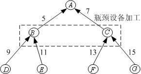

<!-- page: 559 -->

生产能力非常紧张，具体可供能力如表1 第3 行所示（第2 周设备检修，不能使用）。C
B,

的能力消耗系数分别为5 和8，即生产1 件B 需要占用5 个单位的能力，生产1 件C 需
要占用8 个单位的能力。

表1  生产计划的原始数据

周次          1        2          3          4         5          6

A 的外部需求    40        0         100         0         90        10

瓶颈能力     10000       0        5000        5000      1000      1000

零件编号      A        B        C        D        E        F      G

生产准备费用    400       500       1000        300       200        400     100

单件库存费用    12        0.6        1.0         0.04       0.03       0.04     0.04

对于每种零部件或产品，如果工厂在某一周订购或者生产该零部件或产品，工厂
需要一个与订购或生产数量无关的固定成本（称为生产准备费用）；如果某一周结束时
该零部件或产品有库存存在，则工厂必须付出一定的库存费用（与库存数量成正比）。
这些数据在表1 第5 、6 行给出。

按照工厂的信誉要求，目前接收的所有订单到期必须全部交货，不能有缺货；此
外，不妨简单地假设目前该企业没有任何零部件或产品库存，也不希望第6 周结束后留
下任何零部件或产品库存。最后，假设不考虑生产提前期，即假设当周采购的零件马上

就可用于组装，组装出来的部件也可以马上用于当周组装成品A 。

在上述假设和所给数据下，如何制定未来6 周的生产计划。
1.2  建立模型
（1）问题分析
这个实例考虑的是在有限的计划期内，给定产品结构、生产能力和相关费用及零
部件或成品（以下统称为生产项目）在离散的时间段上（这里是周，也可以是天、月等）
的外部需求之后，确定每一生产项目在每一时间段上的生产量（即批量），使总费用最
小。由于每一生产项目在每一时间段上生产时必须经过生产准备（setup），所以通常的
讨论中总费用至少应考虑生产准备费用和库存费用。其实，细心的读者一定会问：是否
需要考虑生产的直接成本（如原材料成本、人力成本、电力成本等）？这是因为本例中
假设了不能有缺货发生，且计划初期和末期的库存都是0，因此在这个6 周的计划期内

A 的总产量一定正好等于A 的总需求，所以可以认为相应的直接生产成本是一个常数，
因此就不予考虑了。只要理解了我们下面建立优化模型的过程和思想，对于放松这些假
定条件以后的情形，也是很容易类似地建立优化模型的。

（2）符号说明
为了建立这类问题的一般模型，我们定义如下数学符号：

N ：生产项目总数（本例中
7
=
N
）；
T ：计划期长度（本例中
6
=
T
）；
K ：瓶颈资源种类数（本例中
1
=
K
）；

-387-

<!-- page: 560 -->

M ：一个充分大的正数，在模型中起到使模型线性化的作用；

t
id , ：项目i 在t 时段的外部需求（本例中只有产品A 有外部需求）；

t
i
X , ：项目i 在t 时段的生产批量；

t
iI , ：项目i 在t 时段的库存量；

t
iY , ：项目i 在t 时段是否生产的标志（0：不生产，1：生产）；

)
(i
S
：产品结构中项目i 的直接后继项目集合；

j
ir , ：产品结构中项目j 对项目i 的消耗系数；

t
is , ：项目i 在t 时段生产时的生产准备费用；

t
ih , ：项目i 在t 时段的单件库存费用；

t
k
C , ：资源k 在t 时段的能力上限；

t
i
k
a
,
,
：项目i 在t 时段生产时，生产单个项目占用资源k 的能力；

在上述数学符号中，只有
t
i
X , ，
t
iI , ，
t
iY , 为决策变量，其余均为已知的计划参数。

其实，真正的生产计划只是要求确定
t
i
X , 就可以了，因为知道
t
i
X , 以后
t
iI , ，
t
iY , 也就

自然确定了。另外，在我们的具体例子中参数
t
is , ，
t
ih , ，
t
i
k
a
,
,
其实只与项目i 有关，而

不随时段t 变化，我们这里加上下标t 只是为了使模型能够更一般化。

（3）目标函数
这个问题的目标是使生产准备费用和库存费用的总和最小。因此，目标函数应该
是每个项目在每个阶段上的生产准备费用和库存费用的总和，即

N

T

∑∑

+

1
1
,
,
,
,
)
(
                                           （1）

t
i
t
i
t
i
t
i
I
h
Y
s

=
=

i

t

（4）约束条件
这个问题中的约束有如下几类：每个项目的物流应该守恒、资源能力限制应该满

足、每时段生产某项目前必须经过生产准备和非负约束（对
t
iY , 是
1
0 −
约束）。

所谓物流守恒，是指对每个时段、每个项目（图中一个节点）而言，该项目在上

-388-

<!-- page: 561 -->

一个时段的库存量加上当前时段的生产量，减去该项目当前时段用于满足外部需求的量
和用于组装其它项目（直接后继项目）的量，应当等于当前时段的库存量。具体可以写

成如下表达式（假设
0
0
, =
iI
）：

ij
t
i
t
i
t
i
t
i
X
r
d
I
X
I
,
)
(
,
,
,
1
,
∑
∈
−
+
=
−
+

t
j
i
S
j

N
i
,
,2,1
L
=
，
T
t
,
,2,1
L
=
                                       （2）

资源能力限制比较容易理解，即

N

t
i
k
C
X
a
,
,
1
,
,
≤
∑

，
K
k
,
,2,1
L
=
，
T
t
,
,2,1
L
=
                    （3）

t
k
t
i

=

i

每时段生产某项目前必须经过生产准备，也就是说当
0
, =
t
i
X
时
0
, =
t
iY
；
0
, >
t
i
X

时
1
, =
t
iY
。这本来是一个非线性约束，但是通过引入参数M （很大的正数，表示每个

项目每个时段的最大产量）可以化成线性约束，即

t
i
t
i
MY
X
,
,
0
≤
≤
，
}
1,0
{
, ∈
t
iY
，
N
i
,
,2,1
L
=
，
T
t
,
,2,1
L
=
           （4）

另外有

0
, ≥
t
iI
，
N
i
,
,2,1
L
=
，
T
t
,
,2,1
L
=
，
   （5）

总结上面的讨论，这个问题的优化模型就是在约束（2）~（4）下使目标函数（1）

达到最小。这可以认为是一个混合整数规划模型（因为产量一般较大，可以把
t
i
X , 和
t
iI ,

看成连续变量（实数）求解，而只有
t
iY , 为
1
0 −
变量）。

1.3  求解模型

本例中生产项目总数
7
=
N
（分别用1～7 表示项目
G
F
E
D
C
B
A
,
,
,
,
,
,
），计划期

长度
6
=
T
（周），瓶颈资源种类数
1
=
K
。只有A 有外部需求，所以
t
id , 中只有
t
d ,1 可

以取非零需求，即表1 中的第2 行的数据，其它
t
id , 全部为零。参数
t
is , ，
t
ih , 只与项目

i 有关，而不随时段t 变化，所以可以略去下标t ，其数值就是表1 中的最后两行数据。

由于只有一种资源，参数
t
k
C , 可以略去下标k ，其数值就是表1 中的第3 行的数据；而

t
i
ka
,
, 只与项目i 有关，而不随时段t 变化，所以可以同时略去下标k 和t ，即
5
2 =
a
，

-389-

<!-- page: 562 -->

8
3 =
a
（其它
ia 为0）。从图1 中容易得到项目i 的直接后继项目集合
)
(i
S
和消耗系数

j
ir , 。

对本例，A 的外部总需求为240 ，所以任何项目的产量不会超过

25000
15
7
240
=
×
×
（从图1 可以知道，这里
15
7×
已经是每件产品A 对任意一个项
目的最大的消耗系数了），所以取
25000
=
M
就已经足够了。
MODEL:

TITLE 瓶颈设备的多级生产计划;
SETS:

! PART=项目集合,Setup=生产准备费，Hold=单件库存成本，

  A=对瓶颈资源的消耗系数;
PART/A B C D E F G/:Setup,Hold,A;

! TIME=计划期集合，Capacity=瓶颈设备的能力;
TIME/1..6/:Capacity;

! USES=项目结构关系，Req=项目之间的消耗系数;
USES(PART,PART):Req;

! PXT=项目与时间的派生集合，Demand=外部需求,

  X=产量（批量）, Y=0/1变量，INV=库存;
PXT(PART,TIME):Demand,X,Y,Inv;

ENDSETS

! 目标函数;
[OBJ]Min=@sum(PXT(i,t):setup(i)*Y(i,t)+hold(i)*Inv(i,t));

! 物流平衡方程;
@FOR(PXT(i,t)|t #NE#

1:[Bal]Inv(i,t-1)+X(i,t)-Inv(i,t)=Demand(i,t)+@SUM(USES(i,j):Req(

i,j)*X(j,t)));

@FOR(PXT(i,t)|t #eq#

1:[Ba0]X(i,t)-Inv(i,t)=Demand(i,t)+@SUM(USES(i,j):Req(i,j)*X(j,t)

));

! 能力约束;
@FOR(TIME(t):[Cap]@SUM(PART(i):A(i)*X(i,t))<Capacity(t));

! 其他约束;
M = 25000;

@FOR(PXT(i,t):X(i,t)<=M*Y(i,t));

@FOR(PXT:@BIN(Y));

DATA:

Demand=0;Req =0;

Capacity=10000 0 5000 5000 1000 1000;

-390-

<!-- page: 563 -->

Setup=400 500 1000 300 200 400 100;

Hold=12 0.6 1.0 0.04 0.03 0.04 0.04;

A=0 5 8 0 0 0 0;

ENDDATA

CALC:

demand(1,1)=40;demand(1,3)=100;

demand(1,5)=90;demand(1,6)=10;

req(2,1)=5;req(3,1)=7;req(4,2)=9;

req(5,2)=11;req(6,3)=13;req(7,3)=15;

ENDCALC

END

计算结果见表2（只列出了生产产量
t
i
X , ，空格表示不生产，即产量为0）。

表2  生产计划的最后结果

周次            1           2           3           4           5           6

A 的产量       40                     100                      100

B 的产量      200                    1000

C 的产量     1055                                 625

D 的产量     1800                    9000

E 的产量     2200                    11000

F 的产量     13715                                8125

G 的产量     15825                                9375

§2  下料问题

生产中常会遇到通过切割、剪裁、冲压等手段，将原材料加工成所需大小这种工
艺过程，称为原料下料（cutting stock）问题。按照进一步的工艺要求，确定下料方案，
使用料最省或利润最大，是典型的优化问题。本节通过两个实例讨论用数学规划模型解
决这类问题的方法。

2.1  钢管下料问题
例2  某钢管零售商从钢管厂进货，将钢管按照顾客的要求切割后售出。从钢管厂
进货时得到的原料钢管都是19m 长。

（1）现有一客户需要50 根4m 长，20 根6m 长和15 根8m 长的钢管。应如何下
料最节省？

（2）零售商如果采用的不同切割模式太多，将会导致生产过程的复杂化，从而增
加生产和管理成本，所以该零售商规定采用的不同切割模式不能超过3 种。此外，该客
户除需要（1）中的三种钢管外，还需要10 根5m 长的钢管。应如何下料最节省？

2.1.1  问题（1）的求解
（1）问题分析
首先，应当确定哪些切割模式是可行的。所谓一个切割模式，是指按照客户需要

-391-

<!-- page: 564 -->

在原料钢管上安排切割的一种组合。例如，我们可以将19m 长的钢管切割成3 根4m
长的钢管，余料为7m；或者将19m 长的钢管切割成4m，6m 和8m 长的钢管各1 根，
余料为1m。显然，可行的切割模式是很多的。

其次，应当确定哪些切割模式是合理的。通常假设一个合理的切割模式的余料不
应该大于或等于客户需要的钢管的最小尺寸。例如，将19m 长的钢管切割成3 根4m
的钢管是可行的，但余料为7m，可以进一步将7m 的余料切割成4m 钢管（余料为3m），
或者将7m 的余料切割成6m 钢管（余料为1m）。在这种合理性假设下，切割模式一共
有7 种，如表3 所示。

                       表3  钢管下料的合理切割模式

             4m 钢管根数        6m 钢管根数        8m 钢管根数        余料（m）

模式1            4                  0                  0                3

模式2            3                  1                  0                1

模式3            2                  0                  1                3

模式4            1                  2                  0                3

模式5            1                  1                  1                1

模式6            0                  3                  0                1

模式7            0                  0                  2                3

问题化为在满足客户需要的条件下，按照哪些种合理的模式，切割多少根原料钢
管，最为节省。而所谓节省，可以有两种标准，一是切割后剩余的总余料量最小，二是
切割原料钢管的总根数最少。下面将对这两个目标分别讨论。

（2）模型建立

决策变量：用
ix 表示按照第i 种模式（
7,
,2,1
L
=
i
）切割的原料钢管的根数，显

然它们应当是非负整数。

决策目标：以切割后剩余的总余料量最小为目标，则由表3 可得

7
6
5
4
3
2
1
1
3
3
3
3
min
x
x
x
x
x
x
x
z
+
+
+
+
+
+
=
                       （6）

以切割原料钢管的总根数最少为目标，则有

7

∑

=
=

1
2
min

ix
z
           （7）

i

下面分别在这两种目标下求解。

约束条件：为满足客户的需求，按照表3 应用

50
2
3
4
5
4
3
2
1
≥
+
+
+
+
x
x
x
x
x
                                    （8）

20
3
6
5
4
2
≥
+
+
+
x
x
x
x
   （9）

-392-

<!-- page: 565 -->

15
2
7
5
3
≥
+
+
x
x
x
                                              （10）

（3）模型求解
i）将式（6）、（8）～（9）构成的整数线性规划模型（加上整数约束）输入LINGO
model:

TITLE 钢管下料－最小化余量;
sets:

col/1..7/:c,x;

row/1..3/:b;

link(row,col):a;

endsets

data:

c=3 1 3 3 1 1 3;

b=50 20 15;

a=4 3 2 1 1 0 0

  0 1 0 2 1 3 0

  0 0 1 0 1 0 2;

enddata

min=@sum(col:c*x);

@for(row(i):@sum(col(j):a(i,j)*x(j))>=b(i));

@for(col:@gin(x));

end

求得按照模式2 切割12 根原料钢管，按照模式5 切割15 根原料钢管，共27 根，
总余料量为27m。但4m 长的钢管比要求多切割了1 根，6m 长的钢管比要求多切割了
7 根。显然，在总余料量最小的目标下，最优解将是使用余料尽可能小的切割方式（模
式2 和模式5 的余料为1m），这会导致切割原料钢管的总根数较多。

ii）将式（7）～（10）构成的整数线性规划模型输入LINGO
model:

TITLE 钢管下料－最小钢管数;
sets:

col/1..7/:c0,c,x;

row/1..3/:b;

link(row,col):a;

endsets

data:

c0=3 1 3 3 1 1 3;

c=1 1 1 1 1 1 1;

b=50 20 15;

a=4 3 2 1 1 0 0

-393-

<!-- page: 566 -->

  0 1 0 2 1 3 0

  0 0 1 0 1 0 2;

enddata

min=@sum(col:c*x);

@for(row(i):[con1]@sum(col(j):a(i,j)*x(j))>=b(i));
@for(col:@gin(x));

[remainder]y=@sum(col:c0*x);

end

求得按照模式2 切割15 根原料钢管，按模式5 切割5 根，按模式7 切割5 根，共
25 根，可算出总余料量为35m。但各长度的钢管数恰好全部满足要求，没有多切割。
与上面得到的结果比较，总余料量增加了8m，但是所用的原料钢管的总根数减少了2
根。在余料没有什么用途的情况下，通常选择总根数最少为目标。

2.1.2  问题（2）的求解
（1）问题分析
按照问题（1）的思路，可以通过枚举法首先确定哪些切割模式是可行的。但由于
需要的钢管规格增加到4 种，所以枚举法的工作量较大。下面介绍的整数非线性规划模
型，可以同时确定切割模式和切割计划，是带有普遍性的方法。

同问题（1）类似，一个合理的切割模式的余料不应该大于或等于客户需要的钢管
的最小尺寸（本题中为4m），切割计划中只使用合理的切割模式，而由于本题中参数都
是整数，所以合理的切割模式的余量不能大于3m。此外，这里我们仅选择总根数最少
为目标进行求解。

（2）模型建立

决策变量：由于不同切割模式不能超过3 种，可以用
jx 表示按照第j 种模式

（
3,2,1
=
j
）切割的原料钢管的根数，显然它们应当是非负整数。设所使用的第j 种

切割模式下每根原料钢管生产4m 长，5m 长，6m 长和8m 长的钢管数量分别为

j
j
j
j
r
r
r
r
4
3
2
1
,
,
,
（非负整数）。记客户需求的4 种钢管的长度为il ，数量为
ib（
4,3,2,1
=
i
）。

决策目标：以切割原料钢管的总根数最少为目标，即目标为

3

∑

1
min

jx                                                     （11）

=

j

约束条件：为满足客户的需求，应有

3

ij
b
x
r
≥
∑

1
，
4,3,2,1
=
i
                                         （12）

i
j
j

=

每一种切割模式必须可行、合理，所以每根原料钢管的成品量不能超过19m，也
不能少于16m（余量不能大于3m），于是

-394-

<!-- page: 567 -->

4

1
≤
≤∑

ij
ir
l
，
3,2,1
=
j
                                  （13）

19
16

=
i

（3）模型求解
式（11）～（13）构成这个问题的优化模型。由于在式（11）～（13）中出现了决
策变量的乘积，所以这是一个整数非线性规划模型，虽然用LINGO 软件可以直接求解，
但我们发现有时LINGO 软件运行很长时间也难以得到最优解。为了减少运行时间，可
以增加一些显然的约束条件，从而缩小可行解的搜索范围。

例如，由于3 种切割模型的排列顺序是无关紧要的，所以不妨增加以下约束：

3
2
1
x
x
x
≥
≥
                                                    （14）

又如，我们注意到所需原料钢管的总根数有着明显的上界和下界。首先，无论如何，原

料钢管的总根数不可能少于
26
]
19
/)
15
8
20
6
10
5
50
4
[(
=
×
+
×
+
×
+
×
（根）。其次，

考虑一种非常特殊的生产计划：第一种切割模式下只生产4m 钢管，1 根原料钢管切割
成4 根4m 钢管，为满足50 根4m 钢管的需求，需要13 根原料钢管；第二种切割模式
下只生产5m、6m 钢管，一根原料钢管切割成1 根5m 钢管和2 根6m 钢管，为满足10
根5m 钢管和20 根6m 钢管的需求，需要10 根原料钢管；第三种切割模式下只生产8m
钢管，1 根原料钢管切割成2 根8m 钢管，为满足15 根8m 钢管的需求，需要8 根原料

钢管。于是满足要求的这种生产计划共需
31
8
10
13
=
+
+
根原料钢管，这就得到了最
优解的一个上界。所以可增加以下约束：

3

1
≤
≤∑

31
26

ix
                                                （15）

=
i

    将式（11）～（15）构成的模型输入LINGO 如下：

model:
Title 钢管下料 - 最小化钢管根数的LINGO模型;

SETS:

NEEDS/1..4/:LENGTH,b;

CUTS/1..3/:X;

PATTERNS(NEEDS,CUTS):R;

ENDSETS

DATA:

LENGTH=4 5 6 8;

b=50 10 20 15;

CAPACITY=19;

ENDDATA

min=@SUM(CUTS(I): X(I) );

@FOR(NEEDS(I):@SUM(CUTS(J):X(J)*R(I,J))>b(I) );

-395-

<!-- page: 568 -->

@FOR(CUTS(J):@SUM(NEEDS(I):LENGTH(I)*R(I,J))<CAPACITY );

@FOR(CUTS(J):@SUM(NEEDS(I):LENGTH(I)*R(I,J))>CAPACITY-@MIN(NEEDS(I):

LENGTH(I)));

@SUM(CUTS(I):X(I))>26; @SUM(CUTS(I):X(I)) <31; !人为增加约束;

@FOR(CUTS(I)|I#LT#@SIZE(CUTS):X(I)>X(I+1) ); !人为增加约束;

@FOR(CUTS(J): @GIN(X(J))) ;

@FOR(PATTERNS(I,J):@GIN(R(I,J)));

end

得到按照模式1，2，3 分别切割10，10，8 根原料钢管，使用原料钢管总根数为
28 根。第一种切割模式下1 根原料钢管切割成2 根4m 钢管、1 根5m 钢管和1 根6m
钢管；第二种切割模式下1 根原料钢管切割成3 根4m 钢管和1 根6m 钢管；第三种模
式下1 根原料钢管切割成2 根8m 钢管。
    2.2  易拉罐下料问题

例3  某公司采用一套冲压设备生产一种罐装饮料的易拉罐，这种易拉罐是用镀锡
板冲压制成的（参见图2）。易拉罐为圆柱形，包括罐身、上盖和下底，罐身高10cm，
上盖和下底的直径均为5cm。该公司使用两种不同规格的镀锡板原料，规格1 的镀锡板
为正方形，边长24cm；规格2 的镀锡板为长方形，长、宽分别为32cm 和28cm。由于
生产设备和生产工艺的限制，对于规格1 的镀锡板原料，只可以按照图3 中的模式1、
2 或3 进行冲压；对于规格2 的镀锡板原料只能按照模式4 进行冲压。使用模式1、2、
3、4 进行每次冲压所需要的时间分别为1.5s、2s、1s、3s。

              图2  易拉罐下料模式

该工厂每周工作40h，每周可供使用的规格1、2 的镀锡板原料分别为5 万张和2
万张。目前每只易拉罐的利润为0.10 元，原料余料损失为0.001 元/cm2（如果周末有罐
身、上盖或下底不能配套组装成易拉罐出售，也看做是原料余料损失）。工厂应如何安
排每周的生产？

（1）问题分析
与钢管下料问题不同的是，这里的切割模式已经确定，只需计算各种模式下的余

料损失。已知上盖和下底的直径
5
=
d
cm，可得其面积为
6.
19
4
/
2
1
≈
= d
S
π
cm2。周

-396-

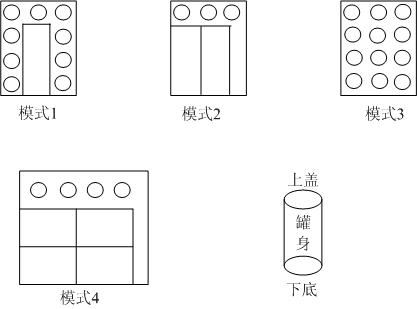

<!-- page: 569 -->

长为
7.
15
≈
= d
L
π
cm；已知罐身高
10
=
h
cm，可得其面积为
1.
157
2
≈
= hL
S
cm2。

于是模式1 下的余料损失为
242.2
9
24
2
1
2
≈
−
−
S
S
。同理计算其它模式下的余料损失，

并可将4 种冲压模式的特征归纳如表4。

表4  4 种冲压模式的特征

              罐身个数        底、盖个数        余料损失（cm2）      冲压时间（s）

模式1         1                9                 242.2                 1.5

模式2         2                3                 202.9                  2

模式3         0               12                 340.4                  1

模式4         4                4                 189.1                  3

问题的目标显然应是易拉罐的利润扣除原料余料损失后的净利润最大，约束条件
除每周工作时间和原料数量外，还要考虑罐身和底、盖的配套组装。

（2）模型建立

决策变量：用
ix 表示按照第i 种模式的冲压次数（
4,3,2,1
=
i
），
1y 表示一周生产

的易拉罐个数。为计算不能配套组装的罐身和底、盖造成的原料损失，用
2y 表示不配

套的罐身个数，
3y 表示不配套的底、盖个数。虽然实际上
ix 和
3
2
1
,
,
y
y
y
应该是整数，

但是由于生产量相当大，可以把它们看成是实数，从而用线性规划模型处理。我们的计
量单位是万。

决策目标：假设每周生产的易拉罐能够全部售出，公司每周的销售利润是
1
1.0 y 。

原料余料损失包括两部分：4 种冲压模式下的余料损失，和不配套的罐身和底、盖造成
的原料损失。按照前面的计算及表4 的结果，总损失为

)
6.
19
1.
157
1.
189
4.
340
9.
202
2.
242
(
001
.0
3
2
4
3
2
1
y
y
x
x
x
x
+
+
+
+
+

于是，决策目标为

)
6.
19
1.
157
1.
189
4.
340
9.
202
2.
242
(
001
.0
1.0
max
3
2
4
3
2
1
1
y
y
x
x
x
x
y
+
+
+
+
+
−
（16）

约束条件：
i）时间约束。每周工作时间不超过40h=144000s=14.4（万秒），由表4 最后一列得

4.
14
3
2
5.1
4
3
2
1
≤
+
+
+
x
x
x
x
                                  （17）

ii）原料约束。每周可供使用的规格1、2 的镀锡板原料分别为5 万张和2 万张，
即

-397-

<!-- page: 570 -->

5
3
2
1
≤
+
+
x
x
x
                                                （18）

2
4 ≤
x
                                                        （19）

iii）配套约束。由表4 知，一周生产的罐身个数为
4
2
1
4
2
x
x
x
+
+
，一周生产的底、

盖个数为
4
3
2
1
4
12
3
9
x
x
x
x
+
+
+
，因为应尽可能将它们配套组装成易拉罐销售。所以
1y

满足

}
2
/)
4
12
3
9
(,
4
2
min{
4
3
2
1
4
2
1
1
x
x
x
x
x
x
x
y
+
+
+
+
+
=
               （20）

这时不配套的罐身个数
2y 和不配套的底、盖个数
3y 应为

1
4
2
1
2
4
2
y
x
x
x
y
−
+
+
=
                          （21）

1
4
3
2
1
3
2
4
12
3
9
y
x
x
x
x
y
−
+
+
+
=
                                （22）

式（16）～（22）就是我们得到的模型，其中式（20）式一个非线性关系，不易
直接处理，但是它可以等价为以下两个线性不等式：

4
2
1
1
4
2
x
x
x
y
+
+
≤
      （23）

2
/)
4
12
3
9
(
4
3
2
1
1
x
x
x
x
y
+
+
+
≤
                                 （24）

（3）模型求解
在LINGO 程序中，我们没有必要把式（20）线性化，LINGO 能够自动线性化的。
编写LINGO 程序如下：
max=0.1*y1-0.2422*x1-0.2029*x2-0.3404*x3-0.1891*x4-0.1571*y2-0.01

96*y3;

1.5*x1+2*x2+x3+3*x4<14.4;

x1+x2+x3<5;

x4<4;

y1=@smin(x1+2*x2+4*x4,(9*x1+3*x2+12*x3+4*x4)/2);

y2=x1+2*x2+4*x4-y1;

y3=9*x1+3*x2+12*x3+4*x4-2*y1;

计算结果略。
（4）评注
下料问题的建模主要有两部分组成，一是确定下料模式，二是构造优化模型。确
定下料模式尚无通用的方法，对于钢管下料这样的一维问题，当需要下料的规格不太多
时，可以枚举出下料模式，建立整数线性规划模型；否则就要构造整数非线性规划模型，

-398-

<!-- page: 571 -->

而这种模型求解比较困难。本节介绍的增加约束条件的方法是将原来的可行域“割去”
一部分，但要保证剩下的可行域中仍存在原问题的最优解。而像易拉罐这样的二维问题，
就要复杂多了。
§3  面试顺序与消防车调度问题

3.1  面试顺序问题
例4  有4 名同学到一家公司参加三个阶段的面试：公司要求每个同学都必须首先
找公司秘书初试，然后到部门主管处复试，最后到经理处参加面试，并且不允许插队（即
在任何一个阶段4 名同学的顺序是一样的）。由于4 名同学的专业背景不同，所以每人
在三个阶段的面试时间也不同，如表5 所示。这4 名同学约定他们全部面试完以后一起
离开公司。假定现在时间是早晨8:00，请问他们最早何时能离开公司？

表5  面试时间要求

                   秘书初试            主管复试            经理面试

 同学甲               13                  15                  20

 同学乙               10                  20                  18

 同学丙               20                  16                  10

 同学丁                8                  10                  15

（1）建立模型
实际上，这个问题就是要安排4 名同学的面试顺序，使完成全部面试所花费的时
间最少。

记ijt 为第i 名同学参加第j 阶段面试需要的时间（已知），令
ijx 表示第i 名同学参

加第j 阶段面试的开始时间（不妨记早上8:00 面试开始为0 时刻）（
4,3,2,1
=
i
；

3,2,1
=
j
），T 为完成全部面试所花费的最少时间。

优化目标为

)}
(
max
{
min
3
3
i
i
i
t
x
T
+
=
                                        （25）

约束条件：
i）时间先后次序约束（每人只有参加完前一个阶段的面试后才能进入下一个阶段）：

1
, +
≤
+
j
i
ij
ij
x
t
x
，
4,3,2,1
=
i
，
2,1
=
j
                          （26）

ii）每个阶段j 同一时间只能面试1 名同学：用
1
0 −变量
ik
y 表示第k 名同学是否

排在第i 名同学前面（1 表示“是”，0 表示“否”），则

-399-

<!-- page: 572 -->

ik
kj
ij
ij
Ty
x
t
x
≤
−
+
，
4,3,2,1
,
=
k
i
，
k
i <
，
3,2,1
=
j
                  （27）

)
1(
ik
ij
kj
kj
y
T
x
t
x
−
≤
−
+
，
4,3,2,1
,
=
k
i
，
k
i <
，
3,2,1
=
j
         （28）

可以将非线性的优化目标（25）改写为如下线性优化目标：

T
min
                                                    （29）

s.t.
3
3
i
i
t
x
T
+
≥
，
4,3,2,1
=
i
                                 （30）

式（26）～（30）就是这个问题的
1
0 −非线性规划模型（当然所有变量还有非负

约束，变量
ik
y 还有
1
0 −约束）。

（2）求解模型
编写LINGO 程序如下：
model:
Title 面试问题;
SETS:
Person/1..4/;
Stage/1..3/;
PXS(Person,Stage): T, X;
PXP(Person,Person)|&1 #LT# &2: Y;
ENDSETS
DATA:
T=13, 15, 20, 10 , 20 , 18, 20, 16, 10, 8, 10, 15;
ENDDATA
[obj] min=MAXT;
MAXT>= @max(PXS(i,j)|j#EQ#@size(stage):x(i,j)+t(i,j));
! 只有参加完前一个阶段的面试后才能进入下一个阶段;
@for(PXS(i,j)|j#LT#@size(stage):[ORDER]x(i,j)+t(i,j)<x(i,j+1));

! 同一时间只能面试1名同学;
@for(Stage(j):
@for(PXP(i,k):[SORT1]x(i,j)+t(i,j)-x(k,j)<MAXT*Y(i,k));
@for(PXP(i,k):[SORT2]x(k,j)+t(k,j)-x(i,j)<MAXT*(1-Y(i,k))));
@for(PXP: @bin(y));
end

计算结果为，所有面试完成至少需要84min，面试顺序为4－1－2－3（丁－甲－
乙－丙）。早上8:00 面试开始，最早9:24 面试可以全部结束。

3.2  消防车调度问题

-400-

<!-- page: 573 -->

例5  某市消防中心同时接到了三处火警电话。根据当前的火势，三处火警地点分
别需要2 辆、2 辆和3 辆消防车前往灭火。三处火警地点的损失将依赖于消防车到达的

及时程度：记ijt 为第j 辆消防车到达火警地点i 的时间，则三处火警地点的损失分别为

12
11
4
6
t
t
+
，
22
21
3
7
t
t
+
，
33
32
31
5
8
9
t
t
t
+
+
。目前可供消防中心调度的消防车正好有7

辆，分别属于三个消防站（可用消防车数量分别为3 辆、2 辆、2 辆）。消防车从三个消
防站到三个火警地点所需要的时间如表6 所示。应如何调度消防车，才能使总损失最
小？

表6  消防站到三个火警地点所需要的时间

 时间             火警地点1           火警地点2            火警地点3

消防站1               6                   7                     9

消防站2               5                   8                    11

消防站3               6                   9                    10

如果三处火警地点的损失分别为
12
11
6
4
t
t +
，
22
21
7
3
t
t
+
，
33
32
31
9
8
5
t
t
t
+
+
，调度

方案是否需要改变？

（1）问题分析
本题考虑的是为每个火警地点分配消防车的问题，初步看来与线性规划中经典的
运输问题有些类似。本题的问题可以看成是指派问题和运输问题的一种变形，我们下面
首先把它变成一个运输问题建模求解。

（2）决策变量
为了用运输问题建模求解，我们很自然地把3 个消防站看成供应点。如果直接把3
个火警地点看成需求点，我们却不能很方便地描述消防车到达的先后次序，因此难以确
定损失的大小。下面我们把7 辆车的需求分别看成7 个需求点（分别对应于到达时间

33
32
31
22
21
12
11
,
,
,
,
,
,
t
t
t
t
t
t
t
）。用
ijx 表示消防站i 是否向第j 个需求点派车（1 表示派车，0

表示不派车），则共有21 个
1
0 −变量。
（3）模型建立
题目中给出的损失函数都是消防车到达时间的线性函数，所以由所给数据进行简
单的计算可知，如果消防站1 向第6 个需求点派车（即消防站1 向火警地点3 派车但该

消防车是到达火警地点3 的第二辆车），则由此引起的损失为
72
9
8
=
×
。同理计算，

可以得到损失矩阵如表7 所示（元素分别记为
ijc ）。

表7  损失矩阵

火警地点1
火警地点2
火警地点3
ijc

1
=
j
2
=
j
3
=
j
4
=
j
5
=
j
6
=
j
7
=
j

-401-

<!-- page: 574 -->

消防站
1
=
i

36       24

49       21

  81      72     45

消防站
2
=
i

30       20

56       24

  99      88     55

消防站
3
=
i

36       24

63       27

  90      80     50

于是，使总损失最小的决策目标为

3

7

∑∑

=
=
=

1
min

ij
ijx
c
Z
                                            （31）

i
j

1

约束条件：约束条件有两类，一类是消防站拥有的消防车的数量限制，另一类是
各需求点对消防车的需求量限制。

记
ib （
3,2,1
=
i
）为第i 个消防站拥有消防车的数量，则消防站拥有的消防车的数

量限制可以表示为

7

ij
b
x =
∑

1
，
3,2,1
=
i
          （32）

i
j

=

各需求点对消防车的需求量限制可以表示为

3

1
=
∑

ijx
，
7,
,2,1
L
=
j
                                         （33）

1

=
i

（4）模型求解
MODEL:

TITLE 消防车问题;
SETS:

supply/1..3/:b;

need/1..7/;

links(supply,need):c,x;

ENDSETS

[OBJ]Min=@sum(links:c*x);

@FOR(supply(i):@sum(need(j):x(i,j))=b(i));

@FOR(need(j):@sum(supply(i):x(i,j))=1);

DATA:

b=3,2,2;

c=36,24,49,21,81,72,45

  30,20,56,24,99,88,55

  36,24,63,27,90,80,50;

ENDDATA

END

求得结果为，消防站1 应向火警地点2 派1 辆车，向火警地点3 派2 辆车；消防

-402-

<!-- page: 575 -->

站2 应向火警地点1 派2 辆车；消防站3 应向火警地点2、3 各派1 辆车。最小总损失
为329。

（5）讨论
i）这个问题本质上仍然和经典的运输问题类似，可以把每辆车到达火场看做需求

点，消防站看做供应点。在上面模型中，我们虽然假设
ijx 为
1
0 −变量，但求解时是采

用线性规划求解的，也就是说没有加上
ijx 为
1
0 −变量或整数变量的限制条件，但求解

得到的结果中
ijx 正好是
1
0 −变量。这一结果不是偶然的，而是运输问题特有的一种性

质。

ii）在上面模型中，没有考虑消防车到达各火警地点的先后次序约束，但得到的结
果正好满足所有的先后次序约束，这一结果不是必然的，而只是巧合。如对例题后半部
分的情形，结果就不是这样了。显然，此时只需要修改损失矩阵如表8 所示（元素仍然

分别记为
ijc ）。

表8  新的损失矩阵

火警地点1
火警地点2
火警地点3
ijc

1
=
j
2
=
j
3
=
j
4
=
j
5
=
j
6
=
j
7
=
j

消防站
1
=
i

24       36

21       49

  45      72     81

消防站
2
=
i

20       30

24       56

  55      88     99

消防站
3
=
i

24       36

27       63

  50      80     90

此时重新将式（31）～（33）构成的线性规划模型输入LINGO 求解，可以得到新

的最优解：
1
35
33
22
21
17
16
14
=
=
=
=
=
=
=
x
x
x
x
x
x
x
，其它变量为0（最小总损失仍

为329）。实际上，损失矩阵中只是1、2 列交换了位置，3、4 列交换了位置，5、7 列
交换了位置，因此不用重新求解就可以直接看出以上新的最优解。

但是，以上新的最优解却是不符合实际情况的。例如，
1
33
14
=
= x
x
表明火警地点

2 的第一辆消防车来自消防站3，第二辆消防车来自消防站1，但这是不合理的，因为
火警地点2 与消费站3 有9min 的距离，大于与消防站1 的7min 的距离。分配给火警
地点3 的消防车也有类似的不合理问题。为了解决这一问题，我们必须考虑消防车到达
各火警地点的先后次序约束，也就是说必须在简单的运输问题模型中增加一些新的约
束，以保证以上的不合理问题不再出现。

首先考虑火警地点2。由于消防站1 的消防车到达所需时间（7min）小于消防站2
的消防车到达所需时间（8 分钟），并都小于消防站3 的消防车到达所需时间（9 分钟），
因此火警地点2 的第二辆消防车如果来自消防站1，则火警地点2 的第1 辆消防车也一
定来自消防站1；火警地点2 的第2 辆消防车如果来自消防站2，则火警地点2 的第1

-403-

<!-- page: 576 -->

辆消防车一定来自消防站1 或2。因此，必须增加以下约束：

13
14
x
x
≤
                                                       （34）

23
13
24
x
x
x
+
≤
                                                  （35）

同理，对火警地点1，必须增加以下约束：

21
22
x
x
≤
                                                      （36）

对火警地点3，必须增加以下约束：

15
16
x
x
≤
                                                       （37）

16
17
x
x
≤
                                                       （38）

35
15
36
x
x
x
+
≤
                                                  （39）

36
35
16
15
37
2
x
x
x
x
x
+
+
+
≤
                                       （40）

    重新将式（31）～（40）构成的整数规划模型（
ijx 是
1
0 −变量）输入LINGO 软

件如下：
MODEL:

TITLE 消防车问题;
SETS:

supply/1..3/:b;

need/1..7/;

links(supply,need):c,x;

ENDSETS

[OBJ]Min=@sum(links:c*x);

@FOR(supply(i):@sum(need(j):x(i,j))=b(i));

@FOR(need(j):@sum(supply(i):x(i,j))=1);

x(1,4)<x(1,3);

x(2,4)<x(1,3)+x(2,3);

x(2,2)<x(2,1);

x(1,6)<x(1,5);

x(1,7)<x(1,6);

x(3,6)<x(1,5)+x(3,5);

2*x(3,7)<x(1,5)+x(1,6)+x(3,5)+x(3,6);

@for(links:@bin(x));

DATA:

-404-

<!-- page: 577 -->

b=3,2,2;

c=  24    36    21    49    45    72    81

    20    30    24    56    55    88    99

    24    36    27    63    50    80    90;

ENDDATA

END

求解可以得到：
1
37
36
22
21
15
14
13
=
=
=
=
=
=
=
x
x
x
x
x
x
x
，其它变量为0（最小

总损失仍为335）。也就是说，消防站1 应向火警地点2 派2 辆车，向火警地点3 派1
辆车；消防站2 应向火警地点1 派2 辆车；消防站3 应向火警地点3 派2 辆车。经过检
验可以发现，此时的派车方案是合理的。
§4  飞机定位和飞行计划问题
    4.1  飞机的精确定位问题

例6  飞机在飞行过程中，能够收到地面上各个监控台发来的关于飞机当前位置的
信息，根据这些信息可以比较精确地确定飞机的位置。如图3 所示，VOR 是高频多向
导航设备的英文缩写，它能够得到飞机与该设备连线的角度信息；DME 是距离测量装
置的英文缩写，它能够得到飞机与该设备的举例信息。图中飞机接收到来自3 个VOR
给出的角度和1 个DME 给出的距离（括号内是测量误差限），并已知这4 种设备的
y
x,

坐标（假设飞机和这些设备在同一平面上）。如何根据这些信息精确地确定当前飞机的
位置？

                         图3  飞机与监控台

（1）问题分析

记4 种设备VOR1、VOR2、VOR3、DME 的坐标为
)
,
(
i
i y
x
（以km 为单位），

4,3,2,1
=
i
；VOR1、VOR2、VOR3 测量得到的角度为
iθ （从图中可以看出，按照航空

飞行管理的惯例，该角度是从北开始，沿顺时针方向的角度，取值在
o
o
360
~
0
之间），

-405-

<!-- page: 578 -->

角度的误差限为
3,2,1
, =
i
i
σ
；DME 测量得到的距离为
4
d （单位：km），距离的误差限

为
4
σ 。设飞机当前位置的坐标为
)
,
(
y
x
，则问题就是在表9 的已知数据下计算
)
,
(
y
x
。

表9  飞机定位问题的数据

ix
iy
原始的
iθ (或
4
d )
i
σ

VOR1
VOR2
VOR3

746

1393

161.2°(2.81347rad)

161.2°(2.81347rad)

629

375

45.1°(0.78714rad)

161.2°(2.81347rad)

1571

259

309.0°(5.39307rad)

161.2°(2.81347rad)

DME

155

987

864.3km

2.0km

（2）模型1 及求解

图中角度
iθ 是点
)
,
(
i
i y
x
和点
)
,
(
y
x
的连线与y 轴的夹角（以y 轴正向为基准，顺

时针方向夹角为正，而不考虑逆时针方向的夹角），于是角度
iθ 的正切

−
−
=
θ
tan
，
3,2,1
=
i
                                        （41）

x
x

i
i
y
y

i

对DME 测量得到的距离，显然有

2
4
2
4
4
)
(
)
(
y
y
x
x
d
−
+
−
=
  （42）

直接利用上面得到的4 个等式确定飞机的坐标
y
x,
，这是一个求解超定（非线性）

方程组的问题，在最小二乘准则下使计算值与测量值的误差平方和最小（越接近0 越
好），则需要求解

i
−
+
−
−
+
−
−
−
= ∑

3

x
x
y
x
J

θ
      （43）

2
]
)
(
)
(
[
)
tan
(
)
,
(
min
y
y
x
x
d
y
y

2
2
4
2
4
4

i
i

=

i

1

式（43）是一个非线性（无约束）最小二乘拟合问题。很容易写出其LINGO 程序
如下：
MODEL:

TITLE 飞机定位模型1;
SETS:

VOR/1..3/:x0,y0,cita,sigma;

ENDSETS

DATA:

x0, y0, cita, sigma =

746  1393 161.2   0.8

-406-

<!-- page: 579 -->

629  375
45.1     0.6

1571 259
309.0    1.3;

x4 y4 d4 sigma4=155,987,864.3,2.0;

ENDDATA

calc:

@for(VOR:cita=cita*3.14159/180;sigma=sigma*3.14159/180);

endcalc

min=@sum(VOR:@sqr((x-x0)/(y-y0)-@tan(cita)))+@sqr(d4-@sqrt(@sqr(x

-x4)+@sqr(y-y4)));

END

 上述程序必须使用全局求解器进行求解，否则求得的是一个局部最优解。用
“LINGO|OPTIONS”菜单命令启动“Global Solver”选项卡上的“Use Global Solver”

选项，然后求解，可以得到全局最优解
1019.306
=
x
，
987.2909
=
y
，对应的目标函

数值为0.4729562，这里的解受π 的取值影响很大。

（3）模型2 及求解
注意到这个问题中角度和距离的单位是不一致的（角度为弧度，距离为公里），因
此将这4 个误差平方和同等对待（相加）不是很合适。并且，4 种设备测量的精度（误
差限）不同，而上面的方法根本没有考虑测量误差问题。如何利用测量设备的精度信息？
这就需要看对例中给出的设备精度如何理解。

一种可能的理解是：设备的测量误差是均匀分布的。以VOR1 为例，目前测得的

角度为
o2.
161
，测量精度为
o8.0
，所以实际的角度应该位于区间

]
8.0
2.
161
,
8.0
2.
161
[
o
o
o
o
+
−
内。对其它设备也可以类似理解。由于
i
σ 很少，即测量

精度很高，所以在相应区间内正切函数tan 的单调性成立。于是可以得到一组不等式：

x
x
σ
θ
σ
θ
+
≤
−
−
≤
−
                              （44）

i
i
i
y
y

)
tan(
)
tan(
i
i
i

4
4
2
4
2
4
4
4
)
(
)
(
σ
σ
+
≤
−
+
−
≤
−
d
y
y
x
x
d
                        （45）

也就是说，飞机坐标应该位于上述不等式组成的区域内。

由于这里假设设备的测量误差是均匀分布的，所以飞机坐标在这个区域内的每个
点上的可能性应该也是一样的，我们最好应该给出这个区域的x 和y 坐标的最大值和最

小值。于是我们可以分别以
x
min
，
x
max
，
y
min
，
y
max
为目标，以上面的区域

限制条件为约束，求出x 和y 坐标的最大值和最小值。

以
x
min
为例，相应的LINGO 程序为：

-407-

<!-- page: 580 -->

MODEL:

TITLE 飞机定位模型2;
SETS:

VOR/1..3/:x0,y0,cita,sigma;

ENDSETS

INIT:

x=1000; y=900;

ENDINIT
DATA:

x0, y0, cita, sigma =

746  1393 161.2   0.8

629  375
45.1     0.6

1571 259
309.0    1.3;

x4 y4 d4 sigma4=155,987,864.3,2.0;

ENDDATA

calc:

@for(VOR:cita=cita*3.14159/180;sigma=sigma*3.14159/180);

endcalc

min=x;

@for(VOR:(x-x0)/(y-y0)>@tan(cita-sigma));

@for(VOR:(x-x0)/(y-y0)<@tan(cita+sigma));

d4-sigma4 <((x-x4)^2+(y-y4)^2)^.5 ;

d4+sigma4 >((x-x4)^2+(y-y4)^2)^.5 ;
END

注意：用LINGO9 求解非线性问题，必须对决策变量进行初始化，否则LINGO 可
能找不到可行解。决策变量的初值也有范围限制，取的不合适也可能找不到可行解。

求得的x 的最小值为974. 8433。类似地（只需要换目标函数就可以了），可得
到x 的最大值为982.2005，y 的最小值为717.1614，y 的最大值为733.1582。

因此，最后得到的解是一个比较大的矩形区域，大致为
]
717,733
[
]
975,982
[
×
。

（4）模型3 及求解
模型2 得到的只是一个很大的矩形区域，仍不能令人满意。实际上，模型2 假设
设备的测量误差是均匀分布的，这是很不合理的。一般来说，在多次测量中，应该假设

设备的测量误差是正态分布的，而且均值为0。本例中给出的精度
i
σ 可以认为是测量

误差的标准差。

在这种理解下，用各自的误差限
i
σ 对测量误差进行无量纲化（也可以看成是一种

加权法）处理是合理的，即求解如下的无约束优化问题更合理。

-408-

<!-- page: 581 -->

2
3

⎛
−
+
−
−
+
⎟⎟
⎠

⎞

2
)
(
)
(
)
,
(
min
∑

⎛
−
=

⎞
⎜⎜
⎝

2
4
2
4
4

θ
α
          （46）

i
i
y
y
x
x
d
y
x
E
σ
σ

=
⎟
⎟

⎜
⎜

⎝

⎠

i
i

1
4

其中

−
−
=
α
tan
，
3,2,1
=
i
      （47）

x
x

i
i
y
y

i

由于目标函数是平方和的形式，因此这是一个非线性最小二乘拟合问题。相应的
LINGO 程序为：
MODEL:

TITLE 飞机定位模型3;
SETS:

VOR/1..3/:x0,y0,cita,sigma,alpha;

ENDSETS

INIT:

x=1000; y=900;

ENDINIT
DATA:

x0, y0, cita, sigma =

746  1393 161.2   0.8

629  375
45.1     0.6

1571 259
309.0    1.3;

x4 y4 d4 sigma4=155,987,864.3,2.0;

ENDDATA

calc:

@for(VOR:cita=cita*3.14159/180;sigma=sigma*3.14159/180);

endcalc

min=@sum(VOR:((alpha-cita)/sigma)^2)+((d4-((x-x4)^2+(y-y4)^2)^.5 )/

sigma4 )^2;
@for(VOR: @tan(alpha)=(x-x0)/(y-y0) );

END

启动LINGO 的全局最优求解程序求解，得到全局最优解
978.3071
=
x
，

723.9841
=
y
，对应的目标函数的值为0.668035。

这里得到的误差比模型1 的大，这是因为模型1 中使用的是绝对误差，而这里使

用的是相对于精度
i
σ 的误差。对角度而言，分母
i
σ 很少，所以相对误差比绝对误差大，

这是可以理解的。

-409-

<!-- page: 582 -->

4.2  飞行计划问题
例7  这个问题是以第二次世界大战中的一个实际问题为背景，经过简化而提出来
的。在甲、乙双方的一场战争中，一部分甲方部队被乙方部队包围长达4 个月。由于乙
方封锁了所有水陆交通要道，被包围的甲方部队只能依靠空中交通维持供给。运送4
个月的供给分别需要2，3，3，4 次飞行，每次飞行编队由50 架飞机组成（每架飞机需
要3 名飞行员），可以运送10 万吨物质。每架飞机每个月只能飞行一次，每名飞行员每
个月也只能飞行一次。在执行完运输任务后的返回途中有20％的飞机会被乙方部队击
落，相应的飞行员也因此牺牲或失踪。在第1 个月开始时，甲方拥有110 架飞机和330
名熟练的飞行员。在每个月开始时，甲方可以招聘新飞行员和购买新飞机。新飞机必须
经过一个月的检查后才可以投入使用，新飞行员必须在熟练飞行员的指导下经过一个月
的训练才能投入飞行。每名熟练飞行员可以作为教练每个月指导20 名飞行员（包括他
自己在内）进行训练。每名飞行员在完成一个月的飞行任务后，必须有一个月的带薪假
期，假期结束后才能再投入飞行。已知各项费用（单位略去）如表10 所示，请为甲方
安排一个飞行计划。

如果每名熟练飞行员可以作为教练每个月指导不超过20 名飞行员（包括他自己在
内）进行训练，模型和结果有哪些改变？

表10  飞行计划的原始数据

                                     第1 个月    第2 个月    第3 个月    第4 个月

新飞机价格                             200.0        195.0        190.0       185.0

闲置的熟练飞行员报酬                     7.0          6.9          6.8         6.7

教练和新飞行员报酬（包括培训费用）      10.0          9,9          9.8         9.7

执行飞行任务的熟练飞行员报酬             9.0          8.9          9.8         9.7

休假期间的熟练飞行员报酬                 5.0          4.9          4.8         4.7

（1）问题分析
这个问题看起来很复杂，但只要理解了这个例子中所描述的事实，其实建立优化
模型并不困难。首先可以看出，执行飞行任务以及执行飞行任务后休假的熟练飞行员数
量是常数，所以这部分费用（报酬）是固定的，在优化目标中可以不考虑。

（2）决策变量

设4 个月开始时甲方新购买的飞机数量分别为
ix （
4,3,2,1
=
i
）架，闲置的飞机数

量分别为
iy 架。4 个月中，飞行员中教练和新飞行员数量分别为
iu （
4,3,2,1
=
i
）人，

闲置的熟练飞行员数量分别为
iv 人。

（3）目标函数
优化目标是

-410-

<!-- page: 583 -->

+
+
+
+
+
+
+

7.9
8.9
9.9
10
185
190
195
200
min

u
u
u
u
x
x
x
x

4
3
2
1
4
3
2
1
7.6
8.6
9.6
7

+
+
+
+

v
v
v
v

4
3
2
1

（4）约束条件
需要考虑的约束包括：
i）飞机数量限制。4 个月中执行飞行任务的飞机分别为100，150，150，200（架），
但只有80，120，120，160（架）能够返回供下个月使用。

第1 个月
110
100
1 =
+ y
                                         （48）

第2 个月
1
1
2
80
150
x
y
y
+
+
=
+
                                  （49）

第3 个月
2
2
3
120
150
x
y
y
+
+
=
+
                                （50）

第4 个月
3
3
4
120
200
x
y
y
+
+
=
+
                                （51）

ii）飞行员数量限制。4 个月中执行飞行任务的熟练飞行员分别为300，450，450，
600（人），但只有240，360，360，480（人）能够返回（下个月一定休假）。

第1 个月
330
05
.0
300
1
1
=
+
+
v
u
                                 （52）

第2 个月
1
1
2
2
05
.0
450
v
u
v
u
+
=
+
+
                               （53）

第3 个月
240
05
.0
450
2
2
3
3
+
+
=
+
+
v
u
v
u
                        （54）

第4 个月
360
05
.0
600
3
3
4
3
+
+
=
+
+
v
u
v
u
                        （55）

（5）求解
编写LINGO 程序如下：
model:

sets:

col/1..4/:c1,c2,c3,x,u,v,y;

row/1..3/:b1,b2;

endsets

data:

c1=200 195 190 185;

c2=10 9.9 9.8 9.7;

c3=7 6.9 6.8 6.7;

b1=70 30 80;

b2=450 210 240;

enddata

-411-

<!-- page: 584 -->

min=@sum(col:c1*x+c2*u+c3*v);

y(1)=10;

@for(col(i)|i#lt#4:y(i)+x(i)-y(i+1)=b1(i));

0.05*u(1)+v(1)=30;

@for(col(i)|i#lt#4:u(i)+v(i)-0.05*u(i+1)-v(i+1)=b2(i));

@for(col:@gin(x);@gin(u);@gin(v);@gin(y));

end

求得的最优解为
60
1 =
x
，
30
2 =
x
，
80
3 =
x
，
0
4 =
x
，
460
1 =
u
，
220
2 =
u
，

240
3 =
u
，
0
4 =
u
，
7
1 =
v
，
6
2 =
v
，
4
3 =
v
，
4
4 =
v
，
10
1 =
y
，
0
4
3
2
=
=
=
y
y
y
；

目标函数值为42324.4。

（6）问题讨论
如果每名熟练飞行员可以作为教练每个月指导不超过20 名飞行员（包括他自己在

内）进行训练，则应将教练与新飞行员分开。设4 个月飞行员中教练为
4
3
2
1
,
,
,
u
u
u
u
（人），

新飞行员数量分别为
4
3
2
1
,
,
,
w
w
w
w
（人）。其它符号不变。飞行员的数量限制约束为

第1 个月
330
300
1
1
=
+
+
v
u
；

第2 个月
1
1
1
2
2
450
w
v
u
v
u
+
+
=
+
+
，
1
1
20u
w ≤
；

第3 个月
2
2
2
3
3
240
450
w
v
u
v
u
+
+
+
=
+
+
，
2
2
20u
w ≤
；

第4 个月
3
3
3
4
3
360
600
w
v
u
v
u
+
+
+
=
+
+
；
3
3
20u
w ≤
；

目标函数作相应修改，输入LINGO 如下：
model:

sets:

col/1..4/:c1,c2,c3,x,u,v,w,y;

row/1..3/:b1,b2;

endsets

data:

c1=200 195 190 185;

c2=10 9.9 9.8 9.7;

c3=7 6.9 6.8 6.7;

b1=70 30 80;

b2=450 210 240;

enddata

-412-

<!-- page: 585 -->

min=@sum(col:c1*x+c2*(u+w)+c3*v);

y(1)=10;

@for(col(i)|i#lt#4:y(i)+x(i)-y(i+1)=b1(i));

u(1)+v(1)=30;

@for(col(i)|i#lt#4:u(i)+v(i)+w(i)-u(i+1)-v(i+1)=b2(i));

@for(col(i)|i#lt#4:w(i)<20*u(i));

@for(col:@gin(x);@gin(u);@gin(v);@gin(w);@gin(y));

end

求得最优解为
0
,
12
,
11
,
22
4
3
2
1
=
=
=
=
u
u
u
u
，
0
,8
4
3
2
1
=
=
=
=
v
v
v
v
，

0
,
228
,
211
,
431
4
3
2
1
=
=
=
=
w
w
w
w
（
4
1
4
1
~
,
~
y
y
x
x
不变）；目标函数的值为

42185.8。

习题二十七
1．某农户拥有100 亩土地和25000 元可供投资，每年冬季（9 月中旬至来年5 月
中旬），该家庭的成员可以贡献3500h 的劳动时间，而夏季为4000h。如果这些劳动时
间有富裕，该家庭中的年轻成员将去附近的农场打工，冬季每小时6.8 元，夏季每小时
7.0 元。
现金收入来源于三种农作物（大豆、玉米和燕麦）以及两种家禽（奶牛和母鸡）。
农作物不需要付出投资，但每头奶牛需要400 元的初始投资，每只母鸡需要3 元的初始
投资。每头奶牛需要使用1.5 亩土地，并且冬季需要付出100h 劳动时间，夏季付出50h
劳动时间，每年产生的净现金收入为450 元；每只母鸡的对应数字为：不占用土地，冬
季0.6h，夏季0.3h，年净现金收入3.5 元。养鸡厂房最多只能容纳3000 只母鸡，栅栏
的大小限制了最多能饲养32 头奶牛。

根据估计，三种农作物每种植一亩所需要的劳动时间和收入如表11 所示。建立数
学模型，帮助确定每种农作物应该种植多少亩，以及奶牛和母鸡应该各蓄养多少，使年
净现金收入最大。

表11  种植一亩农作物所需要的劳动时间和收入

 农作物       冬季劳动时间（h）       夏季劳动时间（h）       年净现金收入（元/亩）

  大豆              20                     30                      175.0

玉米              35                     75                      300.0

燕麦              10                     40                      120.0

2．如图4，有若干工厂的排污口流入某江，各口有污水处理站，处理站对面是居
民点。工厂1 上游江水流量和污水浓度，国家标准规定的水的污染浓度，以及各个工厂
的污水流量和污水浓度均已知道。设污水处理费用与污水处理前后的浓度差和污水流量
成正比，使每单位流量的污水下降一个浓度单位需要的处理费用（称处理系数）为已知。
处理后的污水与江水混合，流到下一个排污口之前，自然状态下的江水也会使污水浓度

-413-

<!-- page: 586 -->

降低一个比例系数（称自净系数），该系数可以估计。试确定各污水处理站出口的污水
浓度，使在符合国家标准规定的条件下总的处理费用最小。

               图4  污水处理问题

先建立一般情况下的数学模型，再求解以下的具体问题：

设上游江水流量为1000（
min
/
L
1012
），污水浓度为
mg/L
8.0
，3 个工厂的污水

流量均为5（
min
/
L
1012
），污水浓度（从上游到下游排列）分别为100，60，50（mg/L ），

处理系数均为1 万元/
(mg/L))
L/min)
10
(
12
×
，3 个工厂之间的两段江面的自净系数（从

上游到下游）分别为0.9 和0.6。国家标准规定水的污染浓度不能超过mg/L
1
。

（1）为了使江面上所有地段的水污染达到国家标准，最少需要花费多少费用？
（2）如果只要求三个居民点上游的水污染达到国家标准，最少需要花费多少费
用？

-414-

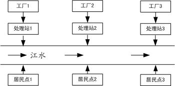

<!-- page: 587 -->

第二十八章  灰色系统理论及其应用

客观世界的很多实际问题，其内部的结构、参数以及特征并未全部被人们了解，
人们不可能象研究白箱问题那样将其内部机理研究清楚，只能依据某种思维逻辑与推断
来构造模型。对这类部分信息已知而部分信息未知的系统，我们称之为灰色系统。本章
介绍的方法是从灰色系统的本征灰色出发，研究在信息大量缺乏或紊乱的情况下，如何
对实际问题进行分析和解决。
§1  灰色系统概论

客观世界在不断发展变化的同时，往往通过事物之间及因素之间相互制约、相互
联系而构成一个整体，我们称之为系统。按事物内涵的不同，人们已建立了工程技术、
社会系统、经济系统等。人们试图对各种系统所外露出的一些特征进行分析，从而弄清
楚系统内部的运行机理。从信息的完备性与模型的构建上看，工程技术等系统具有较充
足的信息量，其发展变化规律明显，定量描述较方便，结构与参数较具体，人们称之为
白色系统；对另一类系统诸如社会系统、农业系统、生态系统等，人们无法建立客观的
物理原型，其作用原理亦不明确，内部因素难以辨识或之间关系隐蔽，人们很难准确了
解这类系统的行为特征，因此对其定量描述难度较大，带来建立模型的困难。这类系统
内部特性部分已知的系统称之为灰色系统。一个系统的内部特性全部未知，则称之为黑
色系统。

区别白色系统与灰色系统的重要标志是系统内各因素之间是否具有确定的关系。
运动学中物体运动的速度、加速度与其所受到的外力有关，其关系可用牛顿定律以明确
的定量来阐明，因此，物体的运动便是一个白色系统。

当然，白、灰、黑是相对于一定的认识层次而言的，因而具有相对性。某人有一
天去他朋友家做客，发现当外面的汽车开过来时，他朋友家的狗就躲到屋角里瑟瑟发抖。
他对此莫名其妙。但对他朋友来讲，狗的这种行为是可以理解的，因为他知道，狗在前
不久曾被汽车撞伤过。显然，同样对于“狗的惧怕行为”，客人因不知内情而面临一个
黑箱，而主人则面临一个灰箱。

作为实际问题，灰色系统在大千世界中是大量存在的，绝对的白色或黑色系统是
很少的。随着人类认识的进步及对掌握现实世界的要求的升级，人们对社会、经济等问
题的研究往往已不满足于定性分析。尽管当代科技日新月异，发展迅速，但人们对自然
界的认识仍然是肤浅的。粮食作物的生产是一个实际的关系到人们吃饭的大问题，但同
时，它又是一个抽象的灰色系统。肥料、种子、农药、气象、土壤、劳力、水利、耕作
及政策等皆是影响生产的因素，但又难以确定影响生产的确定因素，更难确定这些因素
与粮食产量的定量关系。人们只能在一定的假设条件（往往是一些经验及常识）下按照
某种逻辑推理演绎而得到模型。这种模型并非是粮食作物生产问题在理论认识上的“翻
版”，而只能看作是人们在认识上对实际问题的一种“反映”或“逼近”。

社会、经济、农业以及生态系统一般都会有不可忽略的“噪声”（即随即干扰）。
现有的研究经常被“噪声”污染。受随机干扰侵蚀的系统理论主要立足于概率统计。通
过统计规律、概率分布对事物的发展进行预测，对事物的处置进行决策。现有的系统分

-415-

<!-- page: 588 -->

析的量化方法，大都是数理统计法如回归分析、方差分析、主成分分析等，回归分析是
应用最广泛的一种办法。但回归分析要求大样本，只有通过大量的数据才能得到量化的
规律，这对很多无法得到或一时缺乏数据的实际问题的解决带来困难。回归分析还要求
样本有较好的分布规律，而很多实际情形并非如此。例如，我国建国以来经济方面有几
次大起大落，难以满足样本有较规律的分布要求。因此，有了大量的数据也不一定能得
到统计规律，甚至即使得到了统计规律，也并非任何情况都可以分析。另外，回归分析
不能分析因素间动态的关联程度，即使是静态，其精度也不高，且常常出现反常现象。

灰色系统理论提出了一种新的分析方法—关联度分析方法，即根据因素之间发展
态势的相似或相异程度来衡量因素间关联的程度，它揭示了事物动态关联的特征与程
度。由于以发展态势为立足点，因此对样本量的多少没有过分的要求，也不需要典型的
分布规律，计算量少到甚至可用手算，且不致出现关联度的量化结果与定性分析不一致
的情况。这种方法已应用到农业经济、水利、宏观经济等各方面，都取得了较好的效果。

灰色系统理论建模的主要任务是根据具体灰色系统的行为特征数据，充分开发并
利用不多的数据中的显信息和隐信息，寻找因素间或因素本身的数学关系。通常的办法
是采用离散模型，建立一个按时间作逐段分析的模型。但是，离散模型只能对客观系统
的发展做短期分析，适应不了从现在起做较长远的分析、规划、决策的要求。尽管连续
系统的离散近似模型对许多工程应用来讲是有用的，但在某些研究领域中，人们却常常
希望使用微分方程模型。事实上，微分方程的系统描述了我们所希望辨识的系统内部的
物理或化学过程的本质。

灰色系统理论首先基于对客观系统的新的认识。尽管某些系统的信息不够充分，
但作为系统必然是有特定功能和有序的，只是其内在规律并未充分外露。有些随机量、
无规则的干扰成分以及杂乱无章的数据列，从灰色系统的观点看，并不认为是不可捉摸
的。相反地，灰色系统理论将随机量看作是在一定范围内变化的灰色量，按适当的办法
将原始数据进行处理，将灰色数变换为生成数，从生成数进而得到规律性较强的生成函
数。例如，某些系统的数据经处理后呈现出指数规律，这是由于大多数系统都是广义的
能量系统，而指数规律是能量变化的一种规律。灰色系统理论的量化基础是生成数，从
而突破了概率统计的局限性，使其结果不再是过去依据大量数据得到的经验性的统计规
律，而是现实性的生成律。这种使灰色系统变得尽量清晰明了的过程被称为白化。

目前，灰色系统理论已成功地应用于工程控制、经济管理、未来学研究、生态系
统及复杂多变的农业系统中，并取得了可喜的成就。灰色系统理论有可能对社会、经济
等抽象系统进行分析、建模、预测、决策和控制，它有可能成为人们认识客观系统改造
客观系统的一个新型的理论工具。
§2  关联分析

大千世界里的客观事物往往现象复杂，因素繁多。我们往往需要对系统进行因素
分析，这些因素中哪些对系统来讲是主要的，哪些是次要的，哪些需要发展，哪些需要
抑制，哪些是潜在的，哪些是明显的。一般来讲，这些都是我们极为关心的问题。事实
上，因素间关联性如何、关联程度如何量化等问题是系统分析的关键和起点。

因素分析的基本方法过去主要采取回归分析等办法。正如前一节指出的，回归分

-416-

<!-- page: 589 -->

析的办法有很多欠缺，如要求大量数据、计算量大及可能出现反常情况等。为克服以上
弊病，本节采用关联度分析的办法来做系统分析。

作为一个发展变化的系统，关联分析实际上是动态过程发展态势的量化比较分析。
所谓发展态势比较，也就是系统各时期有关统计数据的几何关系的比较。

例如，某地区1977～1983 年总收入与养猪、养兔收入资料见表1。

表1  收入数据

1977      1978      1979      1980      1981      1982      1983

18        20        22        40        44        48        60

总收入

10        15        16        24        38        40        50

养  猪

3         2         12        10        22        18        20

养  兔

根据表1，做曲线图1。

60

50

40

30

A

20

B

10

C

1977
1978
1979
1980
1981
1982
1983
0

          图1  收入数据图

由上图易看出，曲线A 与曲线B 发展趋势比较接近，而与曲线C 相差较大，因此
可以判断，该地区对总收入影响较直接的是养猪业，而不是养兔业。

很显然，几何形状越接近，关联程度也就越大。当然，直观分析对于稍微复杂些
的问题则显得难于进行。因此，需要给出一种计算方法来衡量因素间关联程度的大小。

2.1 数据变换技术

为保证建模的质量与系统分析的正确结果，对收集来的原始数据必须进行数据变换
和处理，使其消除量纲和具有可比性。

定义1  设有序列

))
(
,
),
2
(
),
1(
(
n
x
x
x
x
"
=

则称映射

-417-

<!-- page: 590 -->

→

y
x
f

:

"
=
=

n
k
k
y
k
x
f

,
,2,1
),
(
))
(
(

为序列x 到序列y 的数据变换。

1）当

k
x
k
x
f

)
(
))
(
(
≠
=
=
x
k
y
x

0
)1(
),
(
)1(

称f 是初值化变换。

2）当

k
x
k
x
f

1
)
(
1
),
(
)
(
))
(
(

n

∑

=
=
=
=

k
x
n
x
k
y
x

k

称f 是均值化变换。

3）当

x k
f x k
y k
x k
=
=

( )
( ( ))
( )
max ( )

k

称f 是百分比变换。

4）当

x k
f x k
y k
x k
x k
=
=
≠

( )
( ( ))
( ),    min ( )
0
min ( )
k
k

称f 是倍数变换。

5）当

k
x
k
x
f
=
=

)
(
)
(
))
(
(

0
k
y
x

其中
0x 为大于零的某个值，称f 是归一化变换。

6）当

-418-

<!-- page: 591 -->

k
=
−
=

k
x
k
x
k
x
f

)
(
min
)
(
))
(
(
k
y
k
x

)
(
)
(
max

k

称f 是极差最大值化变换。

7）当

−
=

k
x
k
x
k
x
f

)
(
min
)
(
))
(
(
k
y
k
x
k
x

k
=
−

)
(
)
(
min
)
(
max

k
k

称f 是区间值化变换。

2.2  关联分析
定义2  选取参考数列

))
(
,
),
2
(
),
1(
(
}
,
,2,1
|)
(
{
0
0
0
0
0
n
x
x
x
n
k
k
x
x
"
"
=
=
=

其中k 表示时刻。假设有m 个比较数列

))
(
,
),
2
(
),
1(
(
}
,
,2,1
|)
(
{
n
x
x
x
n
k
k
x
x
i
i
i
i
i
"
"
=
=
=
，
m
i
,
,2,1
"
=

则称

ρ
ξ
                 （1）

−
+
−
=
ρ

)
(
)
(
max
max
)
(
)
(
min
min
)
(

t
x
t
x
t
x
t
x
k

s
t
s
s
t
s
i
−
+
−

0
0
t
x
t
x
k
x
k
x

)
(
)
(
max
max
)
(
)
(

0
0

s
t
s
i

为比较数列
ix 对参考数列
0x 在k 时刻的关联系数，其中
]1,0
[
∈
ρ
为分辨系数。称（1）

式中
)
(
)
(
min
min
0
t
x
t
x
s
t
s
−
、
)
(
)
(
max
max
0
t
x
t
x
s
t
s
−
分别为两级最小差及两级最大差。

一般来讲，分辨系数ρ 越大，分辨率越大；ρ 越小，分辨率越小。

（1）式定义的关联系数是描述比较数列与参考数列在某时刻关联程度的一种指
标，由于各个时刻都有一个关联数，因此信息显得过于分散，不便于比较，为此我们给
出

定义3  称

n

1
)
(
1
ξ
                                              （2）

∑

=
=

i
i
k
n
r

k

为数列
ix 对参考数列
0x 的关联度。

由（2）易看出，关联度是把各个时刻的关联系数集中为一个平均值，亦即把过于
分散的信息集中处理。利用关联度这个概念，我们可以对各种问题进行因素分析。考虑

-419-

<!-- page: 592 -->

下面的问题。

例1  通过对某健将级女子铅球运动员的跟踪调查，获得其1982 年至1986 年每年
最好成绩及16 项专项素质和身体素质的时间序列资料，见表2，试对此铅球运动员的
专项成绩进行因素分析。

表2  各项成绩数据

1982
1983
1984
1985
1986

铅球专项成绩
0
x
13.6
14.01
14.54
15.64
15.69

4kg 前抛
1x
11.50
13.00
15.15
15.30
15.02

4kg 后抛
2
x
13.76
16.36
16.90
16.56
17.30

4kg 原地
3x
12.41
12.70
13.96
14.04
13.46

立定跳远
4
x
2.48
2.49
2.56
2.64
2.59

高    翻
5x
85
85
90
100
105

抓    举
6
x
55
65
75
80
80

卧    推
7
x
65
70
75
85
90

3kg 前抛
8x
12.80
15.30
16.24
16.40
17.05

3kg 后抛
9x
15.30
18.40
18.75
17.95
19.30

3kg 原地
10
x
12.71
14.50
14.66
15.88
15.70

3kg 滑步
11
x
14.78
15.54
16.03
16.87
17.82

立定三级跳远
12
x
7.64
7.56
7.76
7.54
7.70

全    蹲
13
x
120
125
130
140
140

挺    举
14
x
80
85
90
90
95

30 米起跑
15
x
4’’2
4’’25
4’’1
4’’06
3’’99

100 米
16
x
13’’1
13’’42
12’’85
12’’72
12’’56

在利用（1）式及（2）式计算关联度之前，我们需对表2 的各个数列做初始化处
理。一般来讲，实际问题中的不同数列往往具有不同的量纲，而我们在计算关联系数时，
要求量纲要相同。因此，需首先对各种数据进行无量纲化。另外，为了易于比较，要求
所有数列有公共的交点。为了解决上述两个问题，我们对给定数列进行变换。

定义4  给定数列
))
(
,
),
2
(
),
1(
(
n
x
x
x
x
"
=
，称

-420-

<!-- page: 593 -->

⎛
=
)1(

⎞
⎜⎜
⎝

n
x
x
x
x
"

)
2
(
,1
x

)
(
,
,
)1(

⎟⎟
⎠

为原始数列X 的初始化数列。

这样，我们可对表2 中的17 个数列进行初始化处理。注意，对于前15 个数列，
随着时间的增加，数值的增加意味着运动水平的进步，而对后2 个数列来讲，随着时间

的增加，数值（秒数）的减少却意味着运动水平的进步。因此，在对数列
15
x
及
16
x
进

行初始化处理时，采取以下公式

⎛
=
)
5
(

⎞
⎜⎜
⎝

x
x
，
16
,
15
=
i

)1(
,1

x
x

)1(
,)
2
(

x
x

)1(
,)
3
(

x
x

)1(
,)
4
(

⎟⎟
⎠

i
i
x

i

i

i

i

i

i

i

依照问题的要求，我们自然选取铅球运动员专项成绩作为参考数列，将表2 中的
各个数列的初始化数列代入（1）及（2）式，易算出各数列的关联度如下表（这里

5.0
=
ρ
）。

              表3  关联度计算结果

1r
2r
3r
4r
5r
6r
7r
8r

0.588
0.663
0.854
0.776
0.855
0.502
0.659
0.582

9r
10
r
11
r
12
r
13
r
14
r
15
r
16
r

0.683
0.696
0.896
0.705
0.933
0.847
0.745
0.726

计算的MATLAB 程序如下：
clc,clear
load x.txt   %把原始数据存放在纯文本文件x.txt 中
for i=1:15
    x(i,:)=x(i,:)/x(i,1);   %标准化数据
end
for i=16:17
    x(i,:)=x(i,1)./x(i,:);  %标准化数据
end
data=x;
n=size(data,1);
ck=data(1,:);m1=size(ck,1);
bj=data(2:n,:);m2=size(bj,1);
for i=1:m1
    for j=1:m2
      t(j,:)=bj(j,:)-ck(i,:);

-421-

<!-- page: 594 -->

    end
    jc1=min(min(abs(t')));jc2=max(max(abs(t')));
    rho=0.5;
    ksi=(jc1+rho*jc2)./(abs(t)+rho*jc2);
    rt=sum(ksi')/size(ksi,2);
    r(i,:)=rt;
end
r
[rs,rind]=sort(r,'descend')   %对关联度进行排序

由表3 易看出，影响铅球专项成绩的前八项主要因素依次为全蹲、3kg 滑步、高翻、
4kg 原地、挺举、立定跳远、30 米起跳、100 米成绩。因此，在训练中应着重考虑安排
这八项指标的练习。这样可减少训练的盲目性，提高训练效果。

应该指出的是，公式（1）中的
|)
(
)
(
|
0
k
x
k
x
i
−
不能区别因素关联是正关联还是负

关联，可采取下述办法解决这个问题。记

n

n

n

i
i
n
k
k
x
k
kx

∑
∑
∑

1
1
1
)
(
)
(
σ
，
n
i
,
,2,1
"
=

−
=

i

=
=
=

k

k

k

则：

    （1）当
)
(
sign
)
(
sign
j
i
σ
σ
=
，则
ix 和
jx 为正关联；

（2）当
)
(
sign
)
(
sign
j
i
σ
σ
−
=
，则
ix 和
jx 为负关联。

§3  优势分析
当参考数列不止一个，被比较的因素也不止一个时，则需进行优势分析。

假设有m 个参考数列（宜称母因素），记为
m
y
y
y
,
,
,
2
1
"
，再假设有l 个比较数列（亦

称子因素），记为
lx
x
x
,
,
,
2
1
"
。显然，每一个参考数列对l 个比较数列有l 个关联度，

设ijr 表示比较数列
jx 对参考数列
iy 的关联度，可构造关联（度）矩阵
l
m
ijr
R
×
=
)
(
。根

据矩阵R 的各个元素的大小，可分析判断出哪些因素起主要影响，哪些因素起次要影
响。起主要影响的因素称之为优势因素。再进一步，当某一列元素大于其它列元素时，
称此列所对应的子因素为优势子因素；若某一行元素均大于其它行元素时，称此行所对

应的母元素为优势母元素。例如，矩阵R 的第3 列元素大于其它各列元素，

ij
i
r
r >
3
，
m
i
,
,2,1
"
=
；
3
≠
j

-422-

<!-- page: 595 -->

则称
3x 为优势子因素。

如果矩阵R 的某个元素达到最大，则该行对应的母因素被认为是所有母因素中影
响最大的。

为简单起见，先来讨论一下“对角线”以上元素为零的关联矩阵，例如

⎡

⎤

0
504
.0
7.0
2.0
8.0
3.0
0
0
9.0
7.0
6.0
4.0
0
0
0
3.0
7.0
7.0
0
0
0
0
5.0
6.0
0
0
0
0
0
8.0

⎢
⎢
⎢
⎢
⎢
⎢

⎥
⎥
⎥
⎥
⎥
⎥

=

R

⎣

⎦

因为第1 列元素是满的，故称第1 个子元素为潜在优势子因素。第2 列元素中有一个元
素为零，故称第2 个子因素为次潜在优势子因素。余下类推。

当关联矩阵的“对角线”以下全都是零元素，则称第1 个母因素为潜在优势母因
素……，为了分析方便，我们经常把相对较小的元素近似为零，从而使关联矩阵尽量稀
疏。

我们参考一个实际问题。

例2  某地区有6 个母因素
iy （
6,
,2,1
"
=
i
），5 个子因素
jx （
5,
,2,1
"
=
j
）如

下：

1x ：固定资产投资
1y ：国民收入

2x ：工业投资
2y ：工业收入

3x ：农业投资
3y ：农业收入

4x ：科技投资
4y ：商业收入

5x ：交通投资
5y ：交通收入

6y ：建筑业收入

其数据列于表4。

                  表4  投资和收入数据

1979
1980
1981
1982
1983

1x
308.58
310
295
346
367

2
x
195.4
189.9
187.2
205
222.7

-423-

<!-- page: 596 -->

3
x
24.6
21
12.2
15.1
14.57

4
x
20
25.6
23.3
29.2
30

5
x
18.98
19
22.3
23.5
27.655

1
y
170
174
197
216.4
235.8

2
y
57.55
70.74
76.8
80.7
89.85

3
y
88.56
70
85.38
99.83
103.4

4
y
11.19
13.28
16.82
18.9
22.8

5
y
4.03
4.26
4.34
5.06
5.78

6
y
13.7
15.6
13.77
11.98
13.95

根据表4 的数据，利用如下的MATLAB 程序
clc,clear
load data.txt  %把原始数据存放在纯文本文件data.txt 中
n=size(data,1);
for i=1:n
    data(i,:)=data(i,:)/data(i,1); %标准化数据
end
ck=data(6:n,:);m1=size(ck,1);
bj=data(1:5,:);m2=size(bj,1);
for i=1:m1
    for j=1:m2
      t(j,:)=bj(j,:)-ck(i,:);
    end
    jc1=min(min(abs(t')));jc2=max(max(abs(t')));
    rho=0.5;
    ksi=(jc1+rho*jc2)./(abs(t)+rho*jc2);
    rt=sum(ksi')/size(ksi,2);
    r(i,:)=rt;
end
r

计算出各个子因素对母因素的关联度（这里取
5.0
=
ρ
），从而得到关联矩阵为

-424-

<!-- page: 597 -->

⎡

⎤

936
.0
810
.0
557
.0
761
.0
802
.0

⎢⎢
⎢
⎢
⎢
⎢
⎢
⎢

⎥⎥
⎥
⎥
⎥
⎥
⎥
⎥

800
.0
885
.0
529
.0
666
.0
689
.0

675
.0
577
.0
579
.0
858
.0
891
.0

=

R

731
.0
780
.0
568
.0
663
.0
678
.0

921
.0
804
.0
565
.0
774
.0
811
.0

632
.0
607
.0
562
.0
766
.0
743
.0

⎣

⎦

从关联矩阵R 可以看出：
（1）第4 行元素几乎最小，表明各种投资对商业收入影响不大，即商业是一个不
太需要依赖外资而能自行发展的行业。从消耗投资上看，这是劣势，但从少投资多收入
的效益观点看，商业是优势。

（2）
936
.0
15 =
r
最大，表明交通投资的多少对国民收入的影响最大。也可以从此

看出交通的影响。

（3）
921
.0
55 =
r
仅次于15
r ，表明交通收入主要取决于交通投资，这是很自然的。

（4）在第4 列中
0.885
24 =
r
最大，表明科技对工业影响最大；而
0.577
34 =
r
是

该列中最小的，表明从全面来衡量，还没有使科技投资与农业经济挂上钩，即科技投资
针对的不是农村需要的科技。

（5）第三行的前3 个元素比价大，表明农业是个综合性行业，需其它方面的配合，

例如，
0.891
31 =
r
表明固定资产投资能够较大地促进农业的发展。另外，
858
.0
32 =
r
表

明农业发展与交通发展也是密切相关的。
§4  生成数

4.1  累加生成
在研究社会系统、经济系统等抽象系统时，往往要遇到随机干扰（即所谓“噪声”）。
人们对“噪声”污染系统的研究大多基于概率统计方法。但概率统计方法有很多不足之
处：要求大量数据、要求有典型的统计规律、计算工作量等。而且在某些问题中，其概
率意义下的结论并不直观或信息量少。例如，预报某天下雨的概率是0.5，晴天的概率
也是0.5，这种结论对于人们来讲毫无意义。

灰色系统理论把一切随机量都看作灰色数—即在指定范围内变化的所有白色数的
全体。对灰色数的处理不是找概率分布或求统计规律，而是利用数据处理的办法去寻找
数据间的规律。通过对数列中的数据进行处理，产生新的数列，以此来挖掘和寻找数的
规律性的方法，叫做数的生成。数的生成方式有多种：累加生成、累减生成以及加权累
加等等。这里主要介绍累加生成。

定义5  把数列x 各时刻数据依次累加的过程叫做累加过程，记作AGO，累加所
得的新数列，叫做累加生成数列。具体地，设原始数列为

-425-

<!-- page: 598 -->

))
(
,
),
2
(
),
1(
(
)
0
(
)
0
(
)
0
(
0
n
x
x
x
x
"
=
，累加生成数列记为
))
(
,
),
1(
(
)
1
(
)
1
(
)
1
(
n
x
x
x
"
=
，且

)
0
(x
与
)
1
(x
满足

k

i∑

=
=

，
n
k
,
,"
α
=
                                  （3）

)
(
)
(
)
0
(
)
1
(
i
x
k
x

α

其中
n
≤
α
为正整数。上述累加过程当
k
≤
< α
1
时称为去首累加生成，当
1
=
α
时称为
一般累加生成。

这里，我们只讨论
1
=
α
时的情形，（3）式中上标（1）表示1 次累加生成，记作1

—AGO。在一次累加数列
)
1
(x
的基础上再做1 次累加生成，可得到2 次累加生成，记作

2—AGO。依次下去，对原始数列
)
0
(x
，我们可做r 次累加生成，记作r —AGO，从而

得到r 次累加生成数列
)
(r
x
。
)
(r
x
与
)
1
( −
r
x
满足下面的关系：

k

r
r
∑

−
=
,
n
k
,
,2,1
"
=
                              （4）

)
1
(
)
(
i
x
k
x

)
(
)
(

=

i

1

在实际应用中，最常用的是1 次累加生成。本节只讨论1 次累加生成。
一般地，经济数列等实际问题的数列皆是非负数列，累加生成可使非负的摆动与非
摆动的数列或任意无规律性的数列转化为非减的、递增的数列。
    当然，有些实际问题的数列中有负数（例如温度等），累加时略微复杂。有时，由
于出现正负抵消这种信息损失的现象，数列经过累加生成后规律性非但没得到加强，甚
至可能被削弱。对于这种情形，我们可以先进行移轴，然后再做累加生成。

4.2  累减生成
当然，利用数的生成可得到一系列有规律的数据，甚至可拟合成一些函数。但生
成数列并非是直接可用的数列，因此，对于生成数还有个还原的问题。对累加生成，还
原的办法采用累减生成。

对原始数列依次做前后两数据相减的运算过程叫累减生成，记作IAGO。若
)
(r
x
为

r —AGO 数列，则称

)1
(
)
(
)
(
)
(
)
(
)
1
(
−
−
=
−
k
x
k
x
k
x
r
r
r
 ，
n
k
,
,3,2
"
=
           （5）

为r 次累减生成数列。
    4.3  均值生成

设原始数列为
))
(
,
),
2
(
),
1(
(
)
0
(
)
0
(
)
0
(
)
0
(
n
x
x
x
x
"
=
，则称
)1
(
)
0
(
−
k
x
与
)
(
)
0
(
k
x
为数

-426-

<!-- page: 599 -->

列
)
0
(x
的一对（紧）邻值，
)1
(
)
0
(
−
k
x
称为前值，
)
(
)
0
(
k
x
称为后值。

对于常数
]1,0
[
∈
α
，则称

)1
(
)
1(
)
(
)
(
)
0
(
)
0
(
)
0
(
−
−
+
=
k
x
k
x
k
z
α
α

为由数列
)
0
(x
的邻值在生成系数（权）α 下的邻值生成数（或生成值）。

特别地，当生成系数
5.0
=
α
时，则称

)1
(
5.0
)
(
5.0
)
(
)
0
(
)
0
(
)
0
(
−
+
=
k
x
k
x
k
z
                                （6）

为（紧）邻均值生成数，即等权邻值生成数。
类似地，可以定义非邻值生成数：

)1
(
)
1(
)1
(
)
(
)
0
(
)
0
(
)
0
(
−
−
+
+
=
k
x
k
X
k
z
α
α

和

)1
(
5.0
)1
(
5.0
)
(
~
)
0
(
)
0
(
)
0
(
−
+
+
=
k
x
k
x
k
z

而数列
))
(
~
,
),
2
(
~
),
1(
~
(
~
)
0
(
)
0
(
)
0
(
)
0
(
n
z
z
z
z
"
=
称为非紧邻均值（mean）生成数列。

§5  灰色模型GM
灰色系统理论是基于关联空间、光滑离散函数等概念定义灰导数与灰微分方程，进
而用离散数据列建立微分方程形式的动态模型，由于这是本征灰色系统的基本模型，而
且模型是近似的、非唯一的，故这种模型为灰色模型，记为GM（Grey Model），即灰
色模型是利用离散随机数经过生成变为随机性被显著削弱而且较有规律的生成数，建立
起的微分方程形式的模型，这样便于对其变化过程进行研究和描述。
    5.1  GM(1,1)模型
1．GM(1,1)的定义

设
)
0
(x
为n 个元素的数列
))
(
,
),
2
(
),
1(
(
)
0
(
)
0
(
)
0
(
)
0
(
n
x
x
x
x
"
=
，
)
0
(x
的AGO 生成数

k

列为
))
(
,
),
2
(
),
1(
(
)
1
(
)
1(
)
1
(
)
1
(
n
x
x
x
x
"
=
，其中
∑

)
0
(
)
1
(
)
(
)
(
（
n
k
,
,2,1
"
=
）。则

=
=

i
x
k
x

i

1

定义
)
1
(x
的灰导数为

)1
(
)
(
)
(
)
(
)
1
(
)
1
(
)
0
(
−
−
=
=
k
x
k
x
k
x
k
d
，

-427-

<!-- page: 600 -->

令
)
1(z
为数列
)
1
(x
的紧邻均值数列，即

)1
(
5.0
)
(
5.0
)
(
)
1(
)
1(
)
1(
−
+
=
k
x
k
x
k
z
，
n
k
"
,3,2
=

则
))
(
,
),
3
(
),
2
(
(
)
1(
)
1(
)
1
(
)
1
(
n
z
z
z
z
"
=
。于是定义GM(1,1)的灰微分方程模型为

b
k
az
k
d
=
+
)
(
)
(
)
1(
，

即

b
k
az
k
x
=
+
)
(
)
(
)
1
(
)
0
(
                                            （7）

其中
)
(
)
0
(
k
x
称为灰导数，a 称为发展系数，
)
(
)
1
(
k
z
称为白化背景值，b 称为灰作用量。

将时刻
n
k
,
,3,2
"
=
代入（7）式中有

⎧

=
+

)
1(
)
0
(

b
az
x

)
2
(
)
2
(

⎪
⎪

=
+

)
1
(
)
0
(

b
az
x

)3
(
)
3
(

⎨

"
"
"

⎪
⎪

=
+

)
1(
)
0
(

b
n
az
n
x

)
(
)
(

⎩

⎡

⎤

−
−

)
1
(

z
z

1
)
2
(

⎢⎢
⎢
⎢
⎢

⎥⎥
⎥
⎥
⎥

)
1
(

1
)3
(

令
T
n
x
x
x
Y
))
(
,
),
3
(
),
2
(
(
)
0
(
)
0
(
)
0
(
"
=
，
T
b
a
u
)
,
(
=
，

=

，称Y 为

B

#
#

−

)
1
(

n
z

1
)
(

⎣

⎦

数据向量，B 为数据矩阵，u 为参数向量，则GM(1,1)模型可以表示为矩阵方程
Bu
Y =
。
由最小二乘法可以求得

Y
B
B
B
b
a
u
T
T
T
1
)
(
)ˆ
,ˆ
(
ˆ
−
=
=

2．GM(1,1)的白化型

对于GM(1,1)的灰微分方程（7），如果将
)
(
)
0
(
k
x
的时刻
n
k
,
,3,2
"
=
视为连续连

续的变量t ，则数列
)
1
(x
就可以视为时间t 的函数，记为
)
(
)
1
(
)
1
(
t
x
x
=
，并让灰导数

dx
)
1
(

)
(
)
0
(
k
x
对应于导数dt

，背景值
)
(
)
1
(
k
z
对应于
)
(
)
1
(
t
x
。于是得到GM(1,1)的灰微分

方程对应的白微分方程为

-428-

<!-- page: 601 -->

b
ax
dt
dx
=
+
)
1
(
)
1
(

                                                 （8）

称之为GM(1,1)的白化型。
值得注意的是：GM(1,1)的白化型（8）并不是由GM(1,1)的灰微分方程直接推导出
来的，它仅仅是一种“借用”或“白化默认”。

另一方面，GM(1,1)的白化型是一个真正的微分方程，如果白化型模型精度高，则
表明所用数列建立的模型GM(1,1)与真正的微分方程模型吻合较好，反之亦然。

5.2
)
,1(
GM
N 模型

1．
)
,1(
GM
N 模型定义

GM(1,1)即表示模型是1 阶的，且只含1 个变量的灰色模型。而
)
,1(
GM
N 即表示

模型是1 阶的，包含有N 个变量的灰色模型。

设系统有N 个行为因子，即原始数列为

))
(
,
),
2
(
),
1(
(
)
0
(
)
0
(
)
0
(
)
0
(
n
x
x
x
x
i
i
i
i
"
=
，
N
i
,
,2,1
"
=

记
)
1
(
ix
为
)
0
(
ix
的AGO 数列，即

))
(
,
),
2
(
),
1(
(
)
1(
)
1(
)
1
(
)
1(
n
x
x
x
x
i
i
i
i
"
=

))
(
)1
(
,
),
2
(
)1(
),
1(
(
)
0
(
)
1(
)
0
(
)
1(
)
1
(
n
x
n
x
x
x
x
i
i
i
i
i
+
−
+
=
"
，
N
i
,
,2,1
"
=

k

其中
∑

)
0
(
)
1
(
)
(
)
(
（
n
k
,
,2,1
"
=
）。取
)
1
(
1x
的均值数列

=
=

i
i
j
x
k
x

j

1

)1
(
5.0
)
(
5.0
)
(
)
1
(
1
)
1
(
1
)
1
(
1
−
+
=
k
x
k
x
k
z
，
n
k
,
,3,2
"
=

则
))
(
,
),
3
(
),
2
(
(
)
1
(
1
)
1
(
1
)
1
(
1
)
1
(
1
n
z
z
z
z
"
=
。于是可得到
)
,1(
GM
N 的灰微分方程为

N

i
i
∑

=
=
+
                                    （9）

)
1
(
)
1
(
1
)
0
(
1
k
x
b
k
az
k
x

)
(
)
(
)
(

i

2

其中
)
(
)
0
(
1
k
x
为灰导数，
)
(
)
1
(
1
k
z
为背景值，
)
,
,3,2
(
,
N
i
b
a
i
"
=
为参数。

如果对于一切时刻
n
k
,
,3,2
"
=
，引入向量矩阵记号

-429-

<!-- page: 602 -->

T
n
x
x
x
Y
)]
(
,
),
3
(
),
2
(
[
)
0
(
1
)
0
(
1
)
0
(
1
"
=
，
T
N
b
b
b
a
u
]
,
,
,
,
[
3
2
"
=

⎡

⎤

−

)
1
(
)
1
(
2
)
1
(
1

"

x
x
z

)
2
(
)
2
(
)
2
(

N

⎢
⎢
⎢
⎢
⎢

⎥
⎥
⎥
⎥
⎥

−

)
1
(
)
1
(
2
)
1
(
1

"

x
x
z

)
3
(
)
3
(
)
3
(

=

N

B

#
#
#
#

−

)
1
(
)
1
(
2
)
1
(
1

"

n
x
n
x
n
z

)
(
)
(
)
(

⎣

⎦

N

则
)
,1(
GM
N 的灰微分方程为

Bu
Y =

其中Y 为已知数据向量，B 为
)
,1(
GM
N 已知数据矩阵，u 为参数向量。用uˆ 表示u 的

估计值，令
u
B
Y
ˆ
−
=
ε
表示估计值的残差，根据最小二乘法，求使

)ˆ
(
)ˆ
(
)ˆ
(
u
B
Y
u
B
Y
u
J
T
T
−
−
=
=
ε
ε

达到最小值的估计值uˆ 。

事实上，如果存在
1
)
(
−
B
BT
，则有

1
3
2
)
(
]
ˆ
,
,
ˆ
,
ˆ
,ˆ
[
ˆ
−
=
=
"
                             （10）

Y
B
B
B
b
b
b
a
u
T
T
T
N

如果
)
(
B
BT
为奇异矩阵（例如当
N
n
<
−1
时），即
1
)
(
−
B
BT
不存在，则此时uˆ 不

能用（10）式确定。但注意到uˆ 的元素实际上是各子因素对主因素影响大小的反映，因

此，我们可以引入加权矩阵
)
,
,
,
diag(
2
1
N
w
w
w
W
"
=
，使对各因素的未来发展趋势进

行调整控制。对于未来发展减弱趋势的因素赋予较大的权值，而对于未来增强趋势的因

素赋予较小的权值，使之更好地反映未来的实际情况。此时，计算向量uˆ 可采用下面的
公式

1
1
1
3
2
)
(
]
ˆ
,
,
ˆ
,
ˆ
,ˆ
[
ˆ
−
−
−
=
=
"

Y
B
BW
B
W
b
b
b
a
u
T
T
T
N

2．
)
,1(
GM
N 的白化型

对于模型
)
,1(
GM
N 的灰微分方程（9），如果将
)
(
)
1
(
k
xi
的时刻
N
k
,
,2,1
"
=
视为

连续变量t ，则数列
)
(
)
1
(
k
xi
就可以视为时间t 的函数，记为
)
(
)
1(
)
1
(
t
x
x
i
i
=
。则可得到

)
,1(
GM
N 的白化微分方程

-430-

<!-- page: 603 -->

)
1
(
1
)
(
)
(
，

N

i
i
t
x
b
t
ax
dt
dx

∑

=
=
+

)
1
(
)
1
(
1

i

2

即为一阶N 个变量的微分方程。
§6  灰色预测
灰色预测是指利用GM 模型对系统行为特征的发展变化规律进行估计预测，同时
也可以对行为特征的异常情况发生的时刻进行估计计算，以及对在特定时区内发生事件
的未来时间分布情况做出研究等等。这些工作实质上是将“随机过程”当作“灰色过程”，
“随机变量”当作“灰变量”，并主要以灰色系统理论中的GM(1,1)模型来进行处理。
灰色预测在工业、农业、商业等经济领域，以及环境、社会和军事等领域中都有广
泛的应用。特别是依据目前已有的数据对未来的发展趋势做出预测分析。
6.1  灰色预测的方法

设已知参考数据列为
))
(
,
),
2
(
),
1(
(
)
0
(
)
0
(
)
0
(
)
0
(
n
x
x
x
x
"
=
，做1 次累加（AGO）生

成数列

))
(
,
),
2
(
),
1(
(
)
1
(
)
1
(
)
1
(
)
1
(
n
x
x
x
x
"
=

))
(
)1
(
,
),
2
(
)1(
),
1(
(
)
0
(
)
1
(
)
0
(
)
1
(
)
1
(
n
x
n
x
x
x
x
+
−
+
=
"

k

其中
∑

)
0
(
)
1
(
)
(
)
(
（
n
k
,
,2,1
"
=
）。求均值数列

=
=

i
x
k
x

i

1

)1
(
5.0
)
(
5.0
)
(
)
1
(
)
1
(
)
1
(
−
+
=
k
x
k
x
k
z
，
n
k
"
,3,2
=

则
))
(
,
),
3
(
),
2
(
(
)
1
(
)
1
(
)
1
(
)
1
(
n
z
z
z
z
"
=
。于是建立灰微分方程为

b
k
az
k
x
=
+
)
(
)
(
)
1
(
)
0
(
，
n
k
,
,3,2
"
=

相应的白化微分方程为

b
t
ax
dt
dx
=
+
)
(
)
1
(
)
1
(

，                                            （11）

⎡

⎤

−

)
1
(

z

1
)
2
(

⎢⎢
⎢
⎢
⎢

⎥⎥
⎥
⎥
⎥

−

)
1
(

z

1
)3
(

记
T
b
a
u
)
,
(
=
，
T
n
x
x
x
Y
))
(
,
),
3
(
),
2
(
(
)
0
(
)
0
(
)
0
(
"
=
，

=

B

，则由最小二

#
#

−

)
1
(

n
z

1
)
(

⎣

⎦

-431-

<!-- page: 604 -->

乘法，求得使
)ˆ
(
)ˆ
(
)ˆ
(
u
B
Y
u
B
Y
u
J
T
−
−
=
达到最小值的
Y
B
B
B
b
a
u
T
T
T
1
)
(
)
,
(
ˆ
−
=
=
。于

是求解方程（11）得

a
b
e
a
b
x
k
x
ak +
−
=
+
−
)
)1(
(
)1
(
)
0
(
)
1
(
，
1
,
,2,1
−
=
n
k
"
。

6.2  灰色预测的步骤
1．数据的检验与处理
首先，为了保证建模方法的可行性，需要对已知数据列做必要的检验处理。设参考

数据为
))
(
,
),
2
(
),
1(
(
)
0
(
)
0
(
)
0
(
)
0
(
n
x
x
x
x
"
=
，计算数列的级比

k
x
k
−
=
λ
，
n
k
,
,3,2
"
=

)
0
(

)1
(
)
(
)
0
(

)
(

k
x

如果所有的级比
)
(k
λ
都落在可容覆盖
)
,
(
2
2
1
2
+
+
−

n
n
e
e
内，则数列
)
0
(x
可以作为模型

GM(1,1)的数据进行灰色预测。否则，需要对数列
)
0
(x
做必要的变换处理，使其落入可

容覆盖内。即取适当的常数c ，作平移变换

c
k
x
k
y
+
=
)
(
)
(
)
0
(
)
0
(
，
n
k
,
,2,1
"
=

则使数列
))
(
,
),
2
(
),
1(
(
)
0
(
)
0
(
)
0
(
)
0
(
n
y
y
y
y
"
=
的级比

k
y
k
y
∈
−
=
)
(

)
0
(
λ
，
n
k
,
,3,2
"
=

)1
(
)
(
)
0
(

X
k
y

2．建立模型
按6.1 节中的方法建立模型GM(1,1)，则可以得到预测值

a
b
e
a
b
x
k
x
ak +
⎟
⎠
⎞
⎜
⎝
⎛
−
=
+
−
)1(
)1
(
ˆ
)
0
(
)
1
(
，
1
,
,2,1
−
=
n
k
"

而且
)
(
ˆ
)1
(
ˆ
)1
(
ˆ
)
1
(
)
1
(
)
0
(
k
x
k
x
k
x
−
+
=
+
，
1
,
,2,1
−
=
n
k
"
。

3．检验预测值

（1）残差检验：令残差为
)
(k
ε
，计算

k
x
k
x
k
−
=
ε
，
n
k
,
,2,1
"
=

)
0
(
)
0
(

)
(
ˆ
)
(
)
(
)
0
(

)
(

k
x

-432-

<!-- page: 605 -->

如果
2.0
)
(
<
k
ε
，则可认为达到一般要求；如果
1.0
)
(
<
k
ε
，则认为达到较高的要求。

（2）级比偏差值检验：首先由参考数据
)1
(
)
0
(
−
k
x
，
)
(
)
0
(
k
x
计算出级比
)
(k
λ
，

再用发展系数a 求出相应的级比偏差

+
−
−
=

)
(
5.0
1
5.0
1
1
)
(
k
a
a
k
λ
ρ
⎟
⎠
⎞
⎜
⎝
⎛

如果
2.0
)
(
<
k
ρ
，则可认为达到一般要求；如果
1.0
)
(
<
k
ρ
，则认为达到较高的要求。

4．预测预报
由模型GM(1,1)所得到的指定时区内的预测值，实际问题的需要，给出相应的预测
预报。
6.3  灾变预测

给定原始数据列
))
(
,
),
2
(
),
1(
(
)
0
(
)
0
(
)
0
(
)
0
(
n
x
x
x
x
"
=
。如果指定某个定值ζ ，并认

为
)
0
(x
中那些大于ζ 的点为具有异常值的点，然后将这些数据挑出来另组一数列，则

称这一数列为上限灾变数列。例如，给定数列
)
5,8,7.0,3
(
)
0
(
=
x
，若取
1
=
ζ
，则其上

限灾变数列为

)
5,8,3
(
0 =
ζx

同理，可定义下限灾变数列这个概念。注意，灾变预测不是预测数据本身的大小，
而是预测异常值出现的时间。我们考虑下面这个问题。
    例3  某地区年平均降雨量数据如表5

表5  某地区年平均降雨量数据

年
1
2
3
4
5
6
7
8
9

降雨量
390.6
412
320
559.2
380.8
542.4
553
310
561

年
10
11
12
13
14
15
16
17

降雨量
300
632
540
406.2
313.8
576
587.6
318.5

规定
320
=
ζ
，并认为
ζ
≤
)
(
)
0
(
i
x
为旱灾。预测下一次旱灾发生的时间。

写出初始数列

=
)
0
(x
(390.6,412,320,559.2, 380.8,542.4,553,310,561,300,632,

540,406.2,313.8,576,587.6,318.5)

-433-

<!-- page: 606 -->

由于满足
320
)
(
)
0
(
≤
i
x
的
)
(
)
0
(
i
x
即为异常值，易得下限灾变数列为

)
5.
318
,8.
313
,
300
,
310
,
320
(
0 =
ζx

其对应的时刻数列为

)
17
,
14
,
10
,8,3
(
=
t

将数列t 做1 次累加，得

)
52
,
35
,
21
,
11
,3
(
)
1
(
=
t

建立GM(1,1)模型，得

)
585
0.2536,6.2
(
)
,
(
ˆ
−
=
=
T
b
a
u

6774
.
24
.6774
27
)1
(
ˆ
2536
0
)
1
(
−
=
+
k
.
e
k
t
                            （12）

通过（12）式，预测到第6 个及第7 个数据为

22.034
)
6
(
)
0
(
=
t
，
28.3946
)
7
(
)
0
(
=
t

由于22.034 与17 相差5.034，这表明下一次旱灾将发生在五年以后。

计算的MATLAB 程序如下：
clc,clear

a=[390.6,412,320,559.2,

380.8,542.4,553,310,561,300,632,540,406.2,313.8,576,587.6,318.5]'

;

t0=find(a<=320);

t1=cumsum(t0);n=length(t1);

B=[-0.5*(t1(1:end-1)+t1(2:end)),ones(n-1,1)];Y=t0(2:end);

r=B\Y

y=dsolve('Dy+a*y=b','y(0)=y0');

y=subs(y,{'a','b','y0'},{r(1),r(2),t1(1)});

yuce1=subs(y,'t',[0:n+1])

digits(6),y=vpa(y)   %为提高预测精度，先计算预测值，再显示微分方程的解
yuce=diff(yuce1);

yuce=[t0(1),yuce]

    6.4  灰色预测计算实例

例4  北方某城市1986～1992 年道路交通噪声平均声级数据见表6

表6  市近年来交通噪声数据[dB(A)]

-434-

<!-- page: 607 -->

序号
年份
eq
L
序号
年份
eq
L

1
1986
71.1
5
1990
71.4

2
1987
72.4
6
1991
72.0

3
1988
72.4
7
1992
71.6

4
1989
72.1

第一步: 级比检验

建立交通噪声平均声级数据时间序列如下：

(0)
(0)
(0)
(0)
(
(1),
(2),
,
(7))
(71.1, 72.4, 72.4, 72.1, 71.4, 72.0, 71.6)
x
x
x
x
=
=

"

（1）求级比
)
(k
λ

k
x
k
−
=
λ

)
0
(

)1
(
)
(
)
0
(

k
x

)
(

=
λ
λ
λ
λ
"

))
7
(
,
),
3
(
),
2
(
(

=

)
0056
.1
,
9917
.0
,
0098
.1
,
0042
.1
,1
,
982
.0
(

（2）级比判断

由于所有的
]
0098
.1
,
982
.0
[
)
(
∈
k
λ
，
7,
,3,2
"
=
k
，故可以用
(0)
x
作满意的GM

（1，1）建模。

第二步: GM（1，1）建模

（1）对原始数据
(0)
x
作一次累加，即

(1)
(71.1,143.5,215.9,288,359.4,431.4,503)
x
=

（2）构造数据矩阵B 及数据向量Y

-435-

<!-- page: 608 -->

⎡
⎤
−
+
⎢
⎥
⎢
⎥
⎢
⎥
−
+
⎢
⎥
=

1 (
(1)
(2))
1
2
1 (
(2)
(3))
1
2

(1)
(1)

x
x

⎡
⎤
⎢
⎥
⎢
⎥
= ⎢
⎥
⎢
⎥
⎣
⎦

(0)

x

(2)

(1)
(1)

(0)

x
x
B

x
Y

(3)

，

⎢
⎥
⎢
⎥
⎢
⎥
−
+
⎢
⎥
⎣
⎦

#

#
#

(0)

x

(7)

1 (
(6)
(7))
1
2

(1)
(1)

x
x

（3）计算ˆu

T
T
T
u
a b
B B
B Y
−
⎛
⎞
=
=
= ⎜
⎟
⎝
⎠


1
0.0023
( , )
(
)
72.6573

于是得到
0.0023
a =
，
6573
.
72
=
b
。

（4）建立模型

(1)

(1)
0.0023
72.6573
dx
x
dt +
=

求解得

(1)
(0)
0.0023
(
1)
(
(1)
)
30929
31000
ak
k
b
b
x
k
x
e
e
a
a

−
−
+
=
−
+
= −
+

（5）求生成数列值
(1)
ˆ
(
1)
x
k +
及模型还原值
(0)
ˆ
(
1)
x
k +
：

令
,6,5,4,3,2,1
=
k
由上面的时间响应函数可算得
(1)
ˆx
，其中取

(1)
(0)
(0)
ˆ
ˆ
(1)
(1)
(1)
71.1
x
x
x
=
=
=

由
(0)
(1)
(1)
ˆ
ˆ
ˆ
( )
( )
(
1),
x
k
x
k
x
k
=
−
−
取
2,3,4,
,7
k =
"
，得

(0)
(0)
(0)
(0)
ˆ
ˆ
ˆ
ˆ
(
(1),
(2),
,
(7))
(71.1, 72.4, 72.2, 72.1, 71.9, 71.7, 71.6)
x
x
x
x
=
=
"

第四步: 模型检验

模型的各种检验指标值的计算结果见表7.

表7  GM(1,1)模型检验表

序号
年份
原始值
模型值
残差
相对误差
级比偏差

1
1986
71.1
71.1
0
0

2
1987
72.4
72.4
-0.0057
0.01%
0.0023

3
1988
72.4
72.2
0.1638
0.23%
0.0203

-436-

<!-- page: 609 -->

4
1989
72.1
72.1
0.0329
0.05%
-0.0018

5
1990
71.4
71.9
-0.4984
0.7%
-0.0074

6
1991
72.0
71.7
0.2699
0.37%
0.0107

7
1992
71.6
71.6
0.0378
0.05%
-0.0032

经验证，该模型的精度较高，可进行预测和预报。
计算的MATLAB 程序如下：
clc,clear
x0=[71.1 72.4 72.4 72.1 71.4 72.0 71.6];
n=length(x0);
lamda=x0(1:n-1)./x0(2:n)
range=minmax(lamda)
x1=cumsum(x0)
for i=2:n
    z(i)=0.5*(x1(i)+x1(i-1));
end
B=[-z(2:n)',ones(n-1,1)];
Y=x0(2:n)';
u=B\Y
x=dsolve('Dx+a*x=b','x(0)=x0');
x=subs(x,{'a','b','x0'},{u(1),u(2),x1(1)});
yuce1=subs(x,'t',[0:n-1]);
digits(6),y=vpa(x)   %为提高预测精度，先计算预测值，再显示微分方程的解
yuce=[x0(1),diff(yuce1)]
epsilon=x0-yuce    %计算残差
delta=abs(epsilon./x0)  %计算相对误差
rho=1-(1-0.5*u(1))/(1+0.5*u(1))*lamda  %计算级比偏差值
§7  SARS 疫情对某些经济指标影响问题
7.1  问题的提出
2003 年的SARS 疫情对中国部分行业的经济发展产生了一定影响，特别是对部分
疫情较严重的省市的相关行业所造成的影响是显著的，经济影响主要分为直接经济影响
和间接影响。直接经济影响涉及商品零售业、旅游业、综合服务等行业。很多方面难以
进行定量地评估，现仅就SARS 疫情较重的某市商品零售业、旅游业和综合服务业的影
响进行定量的评估分析。
究竟SARS 疫情对商品零售业、旅游业和综合服务业的影响有多大，已知某市从
1997 年1 月到2003 年12 月的商品零售额、接待旅游人数和综合服务收入的统计数据
如表8、表9 和表10。

表8  商品的零售额（单位：亿元）

-437-

<!-- page: 610 -->

年代
1 月   2 月   3 月   4 月   5 月   6 月   7 月   8 月    9 月   10 月    11 月   12 月

1997

83.0   79.8   78.1   85.1   86.6   88.2   90.3   86.7    93.3    92.5    90.9    96.9

1998

101.7  85.1   87.8   91.6   93.4   94.5   97.4   99.5   104.2   102.3   101.0    123.5

1999

92.2  114.0   93.3  101.0  103.5  105.2  109.5  109.2   109.6   111.2   121.7    131.3

2000

105.0 125.7  106.6   116.0  117.6  118.0  121.7  118.7   120.2   127.8   121.8   121.9

2001

139.3 129.5  122.5   124.5  135.7  130.8  138.7  133.7   136.8   138.9   129.6   133.7

2002

137.5 135.3  133.0   133.4  142.8  141.6  142.9  147.3   159.6   162.1   153.5   155.9

2003

163.2 159.7  158.4   145.2  124.0  144.1  157.0  162.6   171.8   180.7   173.5   176.5

表9  接待海外旅游人数（单位：万人）

年代
1 月   2 月   3 月   4 月   5 月   6 月   7 月   8 月    9 月   10 月    11 月   12 月

1997

9.4    11.3   16.8   19.8   20.3   18.8   20.9   24.9    24.7    24.3    19.4    18.6

1998

9.6    11.7   15.8   19.9   19.5   17.8   17.8   23.3    21.4    24.5    20.1    15.9

1999

10.1   12.9   17.7   21.0   21.0   20.4   21.9   25.8    29.3    29.8    23.6    16.5

2000

11.4   26.0   19.6   25.9   27.6   24.3   23.0   27.8    27.3    28.5    32.8    18.5

2001

11.5   26.4   20.4   26.1   28.9   28.0   25.2   30.8    28.7    28.1    22.2    20.7

2002

13.7   29.7   23.1   28.9   29.0   27.4   26.0   32.2    31.4    32.6    29.2    22.9

2003

15.4   17.1   23.5   11.6   1.78   2.61   8.8    16.2    20.1    24.9    26.5    21.8

表10  综合服务业累计数额（单位：亿元）

年代
2 月   3 月    4 月    5 月    6 月    7 月    8 月    9 月    10 月    11 月    12 月

1997

96    144     194     276    383     466    554     652     747     832     972

1998

111   169     235     400    459     565    695     805     881     1011    1139

1999

151   238     335     425    541     641    739     866     975     1087    1238

2000

164   263     376     531    600     711    913    1038     1173    1296    1497

2001

182   318     445     576    708     856   1000    1145     1292    1435    1667

2002

216   361     504     642    818     979   1142    1305     1479    1644    1920

2003

241   404     584     741    923    1114   1298    1492     1684    1885    2218

试根据这些历史数据建立预测评估模型，评估2003 年SARS 疫情给该市的商品零
售业、旅游业和综合服务业所造成的影响。

7.2  模型的分析与假设
根据所掌握的历史统计数据可以看出，在正常情况下，全年的平均值较好地反映了
相关指标的变化规律，这样可以把预测评估分成两部分：

（1）利用灰色理论建立GM(1,1)模型，由1997－2002 年的平均值预测2003 年平
均值；

（2）通过历史数据计算每个月的指标值与全年总值的关系，从而可预测出正常情

-438-

<!-- page: 611 -->

况下2003 年每个月的指标值，再与实际值比较可以估算出SARS 疫情实际造成的影响。

给出下面两条假设：
（1）假设该市的统计数据都是可靠准确的；
（2）假设该市在SARS 疫情流行期间和结束之后，数据的变化只与SARS 疫情的
影响有关，不考虑其它随机因素的影响。

7.3  建立灰色预测模型GM(1,1)

由已知数据，对于1997－2002 年某项指标记为矩阵
6 12
(
)
ij
A
a
×
=
，计算每年的年平

均值，记为

(0)
(0)
(0)
(0)
(
(1),
(2),
,
(6))
x
x
x
x
=
"
                                 （13）

并要求级比
(0)
(0)
( )
(
1) /
( )
(0.7515,1.3307)
i
x
i
x
i
λ
=
−
∈
（
2,3,
,6
i =
"
）。对
(0)
x
作一

次累加，则

i

=
= ∑
（
2,3,
,6
i =
"
）

(1)
(0)
(1)
(1)
x
x
=
，
(1)
(0)

k
x
i
x
k

1
( )
( )

记

(1)
(1)
(1)
(1)
(
(1),
(2),
,
(6))
x
x
x
x
=
"
                                  （14）

取
(1)
x
的加权均值，则
)1
(
)
1(
)
(
)
(
)
1
(
)
1
(
)
1
(
−
−
+
=
k
x
k
x
k
z
α
α
（
6,
,3,2
"
=
k
），α 为确

定参数，记

))
6
(
,
),
3
(
),
2
(
(
)
1
(
)
1
(
)
1
(
)
1
(
z
z
z
z
"
=
  （15）

GM(1,1)的白化微分方程模型为

b
ax
dt
dx
=
+
)
1
(
)
1
(

                                               （16）

其中a 是发展灰度，b 是内生控制灰度。

由于
)
(
)1
(
)
(
)
0
(
)
1
(
)
1
(
k
x
k
x
k
x
=
−
−
，取
)
(
)
0
(
k
x
为灰导数，
)
(
)
1
(
k
z
为背景值，则方

程（16）相应的灰微分方程为

b
k
az
k
x
=
+
)
(
)
(
)
1
(
)
0
(
（
6,
,3,2
"
=
k
）

或

b
k
az
k
x
+
−
=
)
(
)
(
)
1
(
)
0
(
（
6,
,3,2
"
=
k
）                            （17）

即矩阵形式为

-439-

<!-- page: 612 -->

T
b
a
B
Y
)
,
(
=
，

T
z
z
z
B
⎥
⎦

⎡
−
−
−
=

⎤
⎢
⎣

)
6
(
)
3
(
)
2
(
)
1
(
)
1
(
)
1
(

"
。

其中
))
6
(
,
),
3
(
),
2
(
(
)
0
(
)
0
(
)
0
(
x
x
x
Y
"
=
，

"

1
1
1

用最小二乘法求得参数的估计值为

Y
B
B
B
b
a
T
T
T
1
)
(
)ˆ
,ˆ
(
−
=
  （18）

于是方程（17）有响应（特解）

a
b
e
a
b
x
t
x
at +
⎟
⎠
⎞
⎜
⎝
⎛
−
=
+
−
)1(
)1
(
ˆ
)
0
(
)
1
(

则

(
)
)
1
(
)
0
(
)
1
(
)
1
(
)
0
(
)1(
)
(
ˆ
)1
(
ˆ
)1
(
ˆ
−
−
−
−
⎟
⎠
⎞
⎜
⎝
⎛
−
=
−
+
=
+
k
a
ak
e
e
a
b
x
k
x
k
x
k
x
           （19）

由（19）式可以得到2003 年的平均值为x ，则预测2003 年的总值为
x
Z
12
=
。

根据历史数据，可以统计计算出2003 年第i 个月的指标值占全年总值的比例为
iu ，即

12

6

12

6

∑∑
∑∑

ij
i
a
a
u
，
（
12
,
,2,1
"
=
i
）                         （20）

=
=
=
=
=

ij
i
j

1

1
i
j

1

1

则
)
,
,
,
(
12
2
1
u
u
u
u
"
=
，于是可得2003 年每一个月的指标值为
Zu
V =
。

7.4  模型的求解
（1）商品零售额
由数据表8，用（13）和（14）式计算可得年平均值、一次累加值分别为

)
4083
.
145
,
8083
.
132
,
4167
.
118
,
475
.
108
,5.
98
,
6167
.
87
(
)
0
(
=
x

)
225
.
691
,
8167
.
545
,
0083
.
413
,
5917
.
294
,
1167
.
186
,
6167
.
97
(
)
1
(
=
x

显然
)
0
(x
的所有级比都在可容区域内，经检验，在这里取参数
4.0
=
α
比较合适，

由（15）式则有

)
98
.
603
,
1317
.
466
,
9583
.
341
,
5067
.
229
,
0167
.
127
(
)
1
(
=
z

由最小二乘法用（18）式求得
099
.0
−
=
a
，
5985
.
85
=
b
。由（16）式可得2003
年的月平均值为
162.8793
=
x
亿元；年总值为
1954.6
=
Z
亿元。由（20）式得每月的
比例为

-440-

<!-- page: 613 -->

,
0818
.0
,
0819
.0
,
0786
.0
,
0749
.0
,
0807
.0
,
0794
.0
(
=
u

)
092
.0
,
0866
.0
,
0886
.0
,
0872
.0
,
0838
.0
,
0845
.0

故2003 年1－12 月的预测值为

=
= Zu
V

,8.
159
,1.
160
,5.
153
,4.
146
,7.
157
,2.
155
(

)
(
)
8.
179
,3.
169
,1.
173
,5.
170
,8.
163
,1.
165

亿元

将预测值与实际统计值进行比较如表11 所示。

表11  2003 年商品的零售额（单位：亿元）

月  份
1 月   2 月   3 月    4 月   5 月   6 月   7 月   8 月   9 月   10 月  11 月  12 月

155.2  157.7  146.4   153.5  160.1  159.8  165.1  163.8  170.5  173.1  169.3  179.8

预测值

163.2  159.7  158.4   145.2  124.0  144.1  157.0  162.6  171.8  180.7  173.5  176.5

实际值

    计算的MATLAB 程序如下：
clc,clear

load han1.txt    %把原始数据保存在纯文本文件han1.txt中
han1(end,:)=[];m=size(han1,2);

x0=mean(han1,2);

x1=cumsum(x0)

alpha=0.4;n=length(x0);

z1=alpha*x1(2:n)+(1-alpha)*x1(1:n-1)

Y=x0(2:n);B=[-z1,ones(n-1,1)];

ab=B\Y

k=6;

x7hat=(x0(1)-ab(2)/ab(1))*(exp(-ab(1)*k)-exp(-ab(1)*(k-1)))

z=m*x7hat

u=sum(han1)/sum(sum(han1))

v=z*u

（2）接待海外旅游人数

由数据表9，用（13）和（14）式计算年平均值
)
0
(x
和一次累加值
)
1
(x
。取参数
5.0
=
α
，

由（15）式可得加权平均值
)
1
(z
。由（18），（19），（20）式可求得
0938
.0
−
=
a
，

2671
.
16
=
b
，
2649
.
30
=
x
，
1785
.
363
12
=
=
x
Z
，以及

,
0848
.0
,
0907
.0
,
0878
.0
,
0703
.0
,
0732
.0
,
0407
.0
(
=
u

)
0701
.0
,
0914
.0
,
1041
.0
,
101
.0
,
1022
.0
,
0836
.0

于是可得到2003 年的接待海外旅游人数的预测值，并与实际值比较如表12 所示。

表12  2003 年接待海外旅游人数（单位：万人）

-441-

<!-- page: 614 -->

月  份
1 月   2 月   3 月    4 月   5 月   6 月   7 月   8 月   9 月   10 月  11 月  12 月

14.8   26.2   25.5   31.9   33.0    30.8   30.4   37.1   36.7   37.8   33.2   25.5

预测值

15.4   17.1   23.5   11.6   1.78    2.61    8.8   16.2   20.1   24.9   26.5   21.8

实际值

（3）综合服务业累计数据

首先将表10 的数据进行必要的处理，然后用（13）和（14）式计算年平均值
)
0
(x
和

一次累加值
)
1
(x
。取参数
4.0
=
α
，由（15）式可得加权平均值
)
1
(z
。用（18），（19），

（20）式可求得
1361
.0
−
=
a
，
7639
.
487
=
b
，
3.
1171
=
x
，
12885
11 =
=
x
Z
，以
及

,
0875
.0
,
0728
.0
,
0591
.0
,
0433
.0
,
031
.0
,
0191
.0
(
=
u

)
1749
.0
,
1515
.0
,
1358
.0
,
1205
.0
,
1046
.0

于是可得到2003 年的综合服务业累计数额的预测值，并与实际值比较如表13 所示。

表13  2003 年综合服务业累计数据（单位：亿元）

月  份
2 月    3 月    4 月    5 月    6 月    7 月    8 月    9 月   10 月  11 月   12 月

249     399    558    762     938    1127    1348   1553   1750   1952   2254

预测值

241     404    584    741     923    1114    1298   1492   1684   1885   2218

实际值

    7.5  模型的结果分析

根据该市的统计报告显示，2003 年4、5、6 三个月的实际商品零售额分别为145.2、
124、144.1 亿元。在这之前，根据统计部门的估计4、5、6 三个月份SARS 疫情对该市
的商品零售业的影响最为严重，这三个月估计大约损失62 亿元左右。从我们的模型预
测结果来计算，4、5、6 三个月的损失为60.1 亿元，这个数基本与专家的估计值相符，
8 月基本恢复正常，这业说明了模型的正确性和可靠性。
对于旅游业来说是受影响最严重的行业之一，最严重的4、5、6、7 四个月就损失
100 多万人，按最新统计数据，平均每人消费1002 美元计算，大约损失10 亿美元。全
年大约损失162 万人，约合16.2 亿美元，到年底基本恢复正常。

对于综合服务业中的部分行业影响较大，如航空交通运输、宾馆餐饮等，但有些
行业影响不大，如电信、通讯等，总平均来看，影响还不算太大，5、6、7、8 四个月
大约损失70 亿元。

该模型虽是就某经济指标的发展规律进行评估预测而建立的，但类似地也适用于
其它方面的一些数据规律的评估预测问题，即该模型具有很广泛的应用性。

§8  道路交通事故灰色Verhulst 预测模型[43]
灰色预测是通过原始数据的处理和灰色模型的建立，发现和掌握系统发展规律，对
系统的未来状态作出科学的定量预测。目前应用较多的灰色预测模型是GM(1,1)模型、
灰色马尔可夫预测模型等，可用于预测交通事故发生次数、死亡人数、受伤人数和财产
损失等指标。GM(1,1)模型适用于具有较强指数规律的序列，只能描述单调的变化过程。

-442-

<!-- page: 615 -->

但是道路交通系统是一个动态的时变系统，道路交通事故作为道路系统的行为特征量，
具有一定的随机波动性，它的发展呈现某种变化趋势的非平稳随机过程，因此可建立交
通事故灰色马尔可夫预测模型，以提高预测精度。但灰色马尔可夫预测模型的应用难点
是如何进行状态划分，故对于非单调的摆动发展序列或具有饱和状态的S 形序列，
Verhulst 模型，GM(2,1)模型等更适用。Verhulst 模型主要用来描述具有饱和状态的过程，
即S 形过程，常用于人口预测、生物生长、繁殖预测及产品经济寿命预测等。今年来
中国道路交通事故表现为具有饱和状态的S 形过程，故可采用Verhulst 模型对其进行预
测。
8.1  Verhulst 模型简介
Verhulst 模型的基本原理和计算方法简介图下。

定义6  设
)
0
(x
为原始数据序列

nx
x
x
x
"
=

)
,
,
,
(
)
0
(
)
0
(
2
)
0
(
1
)
0
(

)
1
(x
为
)
0
(x
的一次累加生成（1－AGO）序列

)
,
,
,
(
)
1(
)
1
(
2
)
1
(
1
)
1(
nx
x
x
x
"
=

k

∑

)
0
(
)
1
(
（
n
k
,
,2,1
"
=
）

=
=

i
k
x
x

i

1

)
1
(z
为
)
1
(x
的紧邻均值生成序列

nz
z
z
z
"
=

)
,
,
,
(
)
1
(
)
1
(
2
)
1
(
1
)
1
(

)
(
5.0
)
1(
1
)
1
(
)
1(
−
+
=
k
k
k
x
x
z
，
n
k
,
,3,2
"
=

则称

2
)
1
(
)
1
(
)
0
(
)
(z
b
az
x
=
+
                                    （21）

为灰色Verhulst 模型，a 和b 为参数。称

2
)
1
(
)
1
(
)
1
(

)
(x
b
ax
dt
dx
=
+
  （22）

为灰色Verhulst 模型的白化方程，t 为时间。
定理1  设灰色Verhulst 模型如上所述，若

T
b
a
)
,
(
ˆ =
α

为参数列，且

-443-

<!-- page: 616 -->

⎡

⎤

⎡

⎤

−

2
)
1
(
2
)
1
(
2

)
0
(
2

z
z

)
(

x

⎢
⎢
⎢
⎢
⎢

⎥
⎥
⎥
⎥
⎥

⎢
⎢
⎢
⎢
⎢

⎥
⎥
⎥
⎥
⎥

−

2
)
1
(
3
)
1
(
3

)
0
(
3

z
z

)
(

x

=

=

B

Y

，

#
#

#

−

2
)
1
(
)
1
(

)
0
(

n
n
z
z

)
(

nx

⎣

⎦

⎣

⎦

则参数列αˆ 的最小二乘估计满足

Y
B
B
B
T
T
1
)
(
ˆ
−
=
α

定理2  设灰色Verhulst 模型如上所述，则白化方程的解（时间响应函数）为

)
1
(
0
)
1
(

ax
t
x
)
(
)
(
)
1
(
0
)
1
(
0

−
+
=
                                （23）

at
e
bx
a
bx

灰色Verhulst 模型的时间响应序列为

)
1
(
0
)
1
(

ax
x
)
(
ˆ
)
1
(
0
)
1
(
0

1
−
+
=
+
                                  （24）

ak
k
e
bx
a
bx

)
1
(
0x
取为
)
0
(
1x
，则式（24）变为

)
0
(
1
)
1
(

ax
x
)
(
ˆ
)
0
(
1
)
0
(
1

1
−
+
=
+
                  （25）

ak
k
e
bx
a
bx

累减还原式为

1
ˆ
ˆ
ˆ
k
k
k
x
x
x
−
=
+
+
                                            （26）

)
1
(
)
1(
1
)
0
(

8.2  道路交通事故Verhulst 预测模型

在实际问题中，常遇到原始数据本身呈S 形的过程，这时，可取原始数据为
)
1
(x
，

其一次累减生成（1—IAGO）为
)
0
(x
，建立Verhulst 模型，直接对
)
1
(x
进行预测（模拟）。

现以中国道路交通事故死亡人数为例，建立交通事故死亡人数Verhualst 预测模型。
由《中国交通年鉴》、《中国汽车工业年鉴》等可得近年来中国道路交通事故死亡
人数统计资料，见表14。对于2004 年，“2004(a)”表示按《道路交通安全法》施行前
口径统计，“2004(b)”表示按《道路交通安全法》施行后口径统计。

表14  道路交通事故死亡人数统计

年份
1990
1991
1992
1993
1994
1995
1996
1997

死亡人数(万人)
4.93
5.33
5.87
6.35
6.63
7.15
7.37
7.39

年份
1998
1999
2000
2001
2002
2003
2004(a)
2004(b)

死亡人数(万人)
7.81
8.35
9.39
10.59
10.94
10.44
9.92
10.71

-444-

<!-- page: 617 -->

1990～2003 年中国道路交通事故死亡人数曲线见图2，可见曲线呈S 形，故可建立
Verhulst 模型进行预测，其建模过程如下。

11

10

9

8

7

6

5

1990
1992
1994
1996
1998
2000
2002
2004
4

           图2  死亡人数曲线

（1）设
)
1
(x
为1990～2003 年死亡人数的原始数据序列，即

,
15
.7
,
63
.6
,
35
.6
,
87
.5
,
33
.5
,
93
.4
(
)
,
,
,
(
)
1
(
14
)
1
(
2
)
1
(
1
)
1
(
=
=
x
x
x
x
"

)
44
.
10
,
94
.
10
,
59
.
10
,
39
.9
,
35
.8
,
81
.7
,
39
.7
,
37
.7

（2）对
)
1
(x
作一次累减生成（1—IAGO），由

−
−
=
k
k
k
x
x
x
，
14
,
,3,2
"
=
k

)
1(
1
)
1(
)
0
(

得

=
=
x
x
x
x
"

,
22
.0
,
52
.0
,
28
.0
,
48
.0
,
54
.0
,4.0
,
93
.4
(
)
,
,
,
(
)
0
(
14
)
0
(
2
)
0
(
1
)
0
(

−

)
5.0
,
35
.0
,2.1
,
04
.1
,
54
.0
,
42
.0
,
02
.0

（3）对
)
1
(x
作紧邻均值生成，令

)
(
5.0
)
1(
1
)
1
(
)
1(
−
+
=
k
k
k
x
x
z
，
14
,
,3,2
"
=
k

得

,
38
.7
,
26
.7
,
89
.6
,
49
.6
,
11
.6
,6.5
,
13
.5
(
)
,
,
,
(
)
1
(
14
)
1
(
3
)
1
(
2
)
1
(
=
=
z
z
z
z
"

)
69
.
10
,
765
.
10
,
99
.9
,
87
.8
,
08
.8
,6.7

于是

⎡

⎤

⎡

⎤

−

2
)
1
(
2
)
1
(
2

)
0
(
2

z
z

x

)
(

⎢
⎢
⎢
⎢
⎢

⎥
⎥
⎥
⎥
⎥

⎢
⎢
⎢
⎢
⎢

⎥
⎥
⎥
⎥
⎥

−

2
)
1
(
3
)
1
(
3

)
0
(
3

z
z

x

)
(

=

=

B

Y

，

#
#

#

−

2
)
1
(
14
)
1
(
14

)
0
(
14

z
z

)
(

x

⎣

⎦

⎣

⎦

-445-

<!-- page: 618 -->

（4）对参数列

T
b
a
)
,
(
ˆ =
α

进行最小二乘估计，得

−
=
=
−

⎤
⎢⎣

⎡

128
.0
)
(
ˆ
1
Y
B
B
B
T
T
α

⎥⎦

−

0089
.0

（5）Verhulst 模型为

2
)
1
(
)
1
(
)
1
(

)
(
0089
.0
128
.0
x
x
dt
dx
−
=
−

其时间响应为

)
1(
1
)
1
(

ˆ
ˆ
−
+
+
=
−
+
=

x
a
x
128
.0
)
1(
1
)
1
(
1

6312
.0
)
ˆ
ˆ
(
ˆ

k
ak
k
e
e
x
b
a
x
b

1
08395
.0
04409
.0

（6）
)
1
(x
的预测值
)
1
(ˆx
为

,
1438
.7
,
6864
.6
,
2328
.6
,
7866
.5
,
3513
.5
,
9297
.4
(
)
ˆ
,
,
ˆ
,
ˆ
(
ˆ
)
1
(
14
)
1(
2
)
1(
1
)
1
(
=
=
x
x
x
x
"

)
522
.
10
,
1545
.
10
,
7668
.9
,
3606
.9
,
9382
.8
,
502
.8
,
0553
.8
,
6014
.7

（7）模型精度检验。一个灰色模型要经过检验才能判定其是否合理。只有通过检
验的模型才能用来进行预测。检验方法有以下几种。
① 残差合格模型
设原始序列为

nx
x
x
x
"
=

)
,
,
,
(
)
0
(
)
0
(
2
)
0
(
1
)
0
(

相应的灰色模型预测（模拟）序列为

nx
x
x
x
"
=

)
ˆ
,
,
ˆ
,
ˆ
(
ˆ
)
0
(
)
0
(
2
)
0
(
1
)
0
(

残差序列为

n
n
n
x
x
x
x
−
−
=
=
"
" ε
ε
ε
ε

)
ˆ
,
,
ˆ
(
)
,
,
,
(
)
0
(
)
0
(
)
0
(
1
)
0
(
1
2
1
)
0
(

相对误差序列为

⎛
=
Δ
Δ
Δ
=
Δ
)
0
(
)
0
(
2

⎞
⎜⎜
⎝

ε
ε
ε
"
"

⎟⎟
⎠

n
n
x
x
x

1
2
1
,
,
,
)
,
,
,
(

2
)
0
(
1

n

则对于
n
k ≤
，称

-446-

<!-- page: 619 -->

ε
=
Δ

k
k
x

)
0
(
k

为k 点模拟相对误差，称

n

1

∑

Δ
=
Δ

k
n
1

=

k

为平均相对误差；称
Δ
−
1
为平均相对精度，称
k
Δ
−
1
为k 点模拟精度；给定α ，当

α
<
Δ
且
α
<
Δk
成立时，称模型为残差合格模型。

② 关联度合格模型

设
)
0
(x
为原始序列，
)
0
(ˆx
为相应的灰色模型预测（模拟）序列，g 为
)
0
(x
与
)
0
(ˆx
的

绝对关联度。若对于给定的
0
0 >
g
，有
0
g
g >
，则称模型为关联度合格模型。

③ 均方差比合格模型

设
)
0
(x
为原始序列，
)
0
(ˆx
为相应的灰色模型预测（模拟）序列，
)
0
(ε
为残差序列，

则
)
0
(x
的均值、方差分别为

⎧

n

1

∑

=

)
0
(

x
n
x

⎪⎪
⎨

k

=

k

1

          （27）

n

)
(
1

⎪
⎪
⎩

∑

−
=

2
)
0
(
2
1

x
x
n
S

k

=

k

1

)
0
(ε
的均值、方差分别为

⎧

n

1

∑

ε
ε

=

⎪⎪
⎨

k

n

=

k

1

          （28）

n

)
(
1

⎪
⎪
⎩

∑

−
=

ε
ε

2
2
2

n
S

k

=

k

1

均方差比值为

2
S
S
C =

1

对于给定的
0
0 >
C
，当
0
C
C <
时，称模型为均方差比合格模型。

-447-

<!-- page: 620 -->

④ 小误差概率合格模型
小误差概率为

}
6745
.0
{
1S
P
p
k
<
−
=
ε
ε

对于给定的
0
0 >
p
，当
0p
p >
时，称模型为小误差概率合格模型。

由上可知，给定一组取值，就确定了检验模型精度的一个等级。常用的精度等级见
表15，可供检验模型参考。一般情况下，最常用的是相对误差检验指标。

表15  灰色模型精度检验等级

指      标
等级

相对误差Δ
绝对关联度
0
g
均方差比值
0
C
小误差概率
0p

一
0.01
0.90
0.35
0.95

二
0.05
0.80
0.50
0.80

三
0.10
0.70
0.65
0.70

四
0.20
0.60
0.80
0.60

由以上检验方法，可得1990～2003 年中国道路交通事故死亡人数Verhulst 模型误
差检验值见表16。

表16  Verhulst 模型误差

原始数据

相对误差

预测值

残差

序号k
年份

)
1
(

)
1
(ˆkx
（万人）

)
1
(
)
1
(
ˆk
k
x
x
−
（万人）

k
Δ (%)

kx
（万人）

1
1990
4.93
4.93
0
0

2
1991
5.33
5.3517
-0.0217
0.41

3
1992
5.87
5.7872
0.0828
1.41

4
1993
6.35
6.2335
0.1165
1.83

5
1994
6.63
6.6873
-0.0573
0.86

6
1995
7.15
7.1448
0.0052
0.07

7
1996
7.37
7.6025
-0.2325
3.16

8
1997
7.39
8.0566
-0.6666
9.02

9
1998
7.81
8.5034
-0.6934
8.88

10
1999
8.35
8.9397
-0.5897
7.06

11
2000
9.39
9.3622
0.0278
0.3

12
2001
10.59
9.7685
0.8215
7.76

13
2002
10.94
10.1562
0.7838
7.16

14
2003
10.44
10.5237
-0.0837
0.8

15
2004(a)
9.92
10.8681
-0.9498
9.57

-448-

<!-- page: 621 -->

16
2004(b)
10.71
10.8698
-0.1598
1.49

平均相对误差
3.74%
=
Δ
，则模型精度为二级；同时算得绝对关联度g 为0.9845，

均方差比值C 为0.2355，则模型精度为一级，可见模型精度较高，可用于事故预测。
计算的MATLAB 程序如下：
clc,clear
x1=[4.93    5.33    5.87    6.35    6.63    7.15    7.37    7.39  7.81  8.35
9.39    10.59   10.94   10.44];
n=length(x1);
nian=1990:2003;
plot(nian,x1,'o-');
x0=diff(x1);
x0=[x1(1),x0]
for i=2:n
    z1(i)=0.5*(x1(i)+x1(i-1));
end
z1
B=[-z1(2:end)',z1(2:end)'.^2]
Y=x0(2:end)'
abhat=B\Y     %估计参数a,b 的值
x=dsolve('Dx+a*x=b*x^2','x(0)=x0');  %求解常微分方程
x=subs(x,{'a','b','x0'},{abhat(1),abhat(2),x1(1)});  %代入参数值
yuce=subs(x,'t',0:14)   %计算预测值
digits(6); x=vpa(x) %显示微分方程的解，为了提高计算精度，把该语句放在计算预测值
之后，或者不使用该语句
yuce(16)=yuce(15);
x1_all=[x1,9.92,10.71];
epsilon=x1_all-yuce   %计算残差
delta=abs(epsilon./x1_all)   %计算相对误差
delta_mean=mean(delta)   %计算平均相对误差
x1_all_0=x1_all-x1_all(1);    %数据列的始点零化像
yuce_0=yuce-yuce(1);    %数据列的始点零化像
s0=abs(sum(x1_all_0(1:end-1))+0.5*x1_all_0(end));
s1=abs(sum(yuce_0(1:end-1))+0.5*yuce_0(end));
tt=yuce_0-x1_all_0;
s1_s0=abs(sum(tt(1:end-1))+0.5*tt(end));
absdegree=(1+s0+s1)/(1+s0+s1+s1_s0)   %计算灰色绝对关联度
c=std(epsilon,1)/std(x1_all,1)   %计算标准差比值

-449-

<!-- page: 622 -->

    8.3  预测结果比较
由1990～2003 年中国道路交通事故死亡人数资料，得到相应的GM(1,1)模型为

5.0
0098
.0
)
1
(
)
1
(

=
−
x
dt
dx

其时间响应式为

1
0039
.
46
9339
.
50
ˆ
−
+
−
=
，
"
,2,1,0
=
k

k
k
e
x
0098
.0
)
1
(

由以上检验法可得1990～2003 年中国道路交通事故死亡人数GM(1,1)模型误差值
见表17。

表17  GM(1,1)模型误差

原始数据

相对误差

预测值

残差

序号k
年份

)
1
(

)
1
(ˆkx
（万人）

)
1
(
)
1
(
ˆk
k
x
x
−
（万人）

k
Δ (%)

kx
（万人）

1
1990
4.93
4.93
0
0

2
1991
5.33
5.3794
-0.0494
0.0093

3
1992
5.87
5.8244
0.0456
0.0078

4
1993
6.35
6.2651
0.0849
0.0134

5
1994
6.63
6.7014
-0.0714
0.0108

6
1995
7.15
7.1335
0.0165
0.0023

7
1996
7.37
7.5614
-0.1914
0.026

8
1997
7.39
7.9851
-0.5951
0.0805

9
1998
7.81
8.4046
-0.5946
0.0761

10
1999
8.35
8.8201
-0.4701
0.0563

11
2000
9.39
9.2315
0.1585
0.0169

12
2001
10.59
9.6389
0.9511
0.0898

13
2002
10.94
10.0423
0.8977
0.0821

14
2003
10.44
10.4417
-0.0017
0.0002

15
2004(a)
9.92
10.8373
-0.9173
0.0925

16
2004(b)
10.71
10.8373
-0.1273
0.0119

平均相对误差
3.6%
=
Δ
，则模型精度为二级；同时算得绝对关联度g 为0.9918，

均方差比值C 为0.2395，则模型精度为一级，可见模型精度较高，可用于事故预测。
比较表16 和表17 可知，Verhulst 模型预测精度与GM(1,1)模型几乎没有差别。
计算的MATLAB 程序如下：
clc,clear
x1=[4.93    5.33    5.87    6.35    6.63    7.15    7.37    7.39  7.81  8.35
9.39    10.59   10.94   10.44];

-450-

<!-- page: 623 -->

n=length(x1);
x0=diff(x1);
x0=[x1(1),x0]
for i=2:n
    z1(i)=0.5*(x1(i)+x1(i-1));
end
B=[-z1(2:end)',ones(n-1,1)];
Y=x0(2:end)';
abhat=B\Y     %估计参数a,b 的值
x=dsolve('Dx+a*x=b','x(0)=x0');
x=subs(x,{'a','b','x0'},{abhat(1),abhat(2),x1(1)});
yuce=subs(x,'t',0:14)   %计算预测值
digits(6); x=vpa(x)  %显示微分方程的解，为了提高计算精度，把该语句放在计算预测
值之后，或者不使用该语句
yuce(16)=yuce(15);
x1_all=[x1,9.92,10.71];
epsilon=x1_all-yuce   %计算残差
delta=abs(epsilon./x1_all)   %计算相对误差
delta_mean=mean(delta)   %计算平均相对误差
x1_all_0=x1_all-x1_all(1);    %数据列的始点零化像
yuce_0=yuce-yuce(1);    %数据列的始点零化像
s0=abs(sum(x1_all_0(1:end-1))+0.5*x1_all_0(end));
s1=abs(sum(yuce_0(1:end-1))+0.5*yuce_0(end));
tt=yuce_0-x1_all_0;
s1_s0=abs(sum(tt(1:end-1))+0.5*tt(end));
absdegree=(1+s0+s1)/(1+s0+s1+s1_s0)   %计算灰色绝对关联度
c=std(epsilon,1)/std(x1_all,1)   %计算标准差比值
8.4  结语
道路交通安全系统是一个灰色系统，可以应用灰色系统理论进行研究和分析，其中
灰色预测模型和方法简便易用，在交通事故预测中得到了较多应用。GM(1,1)模型适用
于具有较强指数规律的序列，只能描述单调的变化过程，而Verhulst 模型则适用于非单
调的摆动发展序列或具有饱和状态的S 形序列。
§9  GM(2,1)和DGM 模型
GM(1,1)模型适用于具有较强指数规律的序列，只能描述单调的变化过程，对于非
单调的摆动发展序列或有饱和的S 形序列，可以考虑建立GM(2,1)，DGM 和Verhulst
模型。
9.1  GM(2,1)模型

-451-

<!-- page: 624 -->

定义7  设原始序列

))
(
,
),
2
(
),
1(
(
)
0
(
)
0
(
)
0
(
)
0
(
n
x
x
x
x
"
=

其1－AGO 序列
)
1
(x
和1－IAGO 序列
)
0
(
)
1( x
α
分别为

))
(
,
),
2
(
),
1(
(
)
1
(
)
1
(
)
1
(
)
1
(
n
x
x
x
x
"
=

和

))
(
,
),
2
(
(
)
0
(
)
1
(
)
0
(
)
1
(
)
0
(
)
1
(
n
x
x
x
α
α
α
"
=

其中

)1
(
)
(
)
(
)
0
(
)
0
(
)
0
(
)
1
(
−
−
=
k
x
k
x
k
x
α
，
n
k
,
,3,2
"
=

)
1
(x
的紧邻均值生成序列为

))
(
,
),
3
(
),
2
(
(
)
1
(
)
1
(
)
1
(
)
1
(
n
z
z
z
z
"
=

则称

b
k
z
a
k
x
a
k
x
=
+
+
)
(
)
(
)
(
)
1
(
2
)
0
(
1
)
0
(
)
1
(
α
                         （29）

为GM(2,1)模型。
定义8  称

)
1
(
2
  （30）

)
1
(

b
x
a
dt
dx
a
dt

x
d
=
+
+
)
1
(
2

1
2

为GM(2,1)模型的白化方程。

定理3  设
)
0
(x
，
)
1
(x
，
)
0
(
)
1
( x
α
如定义7 所述，且

⎡

⎤

⎡

⎤

⎡

⎤

−
−

α
α

−

)
1
(
)
0
(

)
0
(
)
1
(

)
0
(
)
0
(

z
x

x
x

x
x

1
)
2
(
)
2
(

)
2
(

)1(
)
2
(

⎢⎢
⎢
⎢
⎢

⎥⎥
⎥
⎥
⎥

⎢⎢
⎢
⎢
⎢

⎥⎥
⎥
⎥
⎥

⎢⎢
⎢
⎢
⎢

⎥⎥
⎥
⎥
⎥

−
−

−

)
1
(
)
0
(

)
0
(
)
1
(

)
0
(
)
0
(

z
x

1
)
3
(
)
3
(

)
3
(

x
x

)
2
(
)
3
(

=

=

=

B

Y

，

#
#
#

#
#

−
−

α

−
−

)
1
(
)
0
(

)
0
(
)
1
(

)
0
(
)
0
(

n
z
n
x

1
)
(
)
(

n
x

)
(

n
x
n
x

)1
(
)
(

⎣

⎦

⎣

⎦

⎣

⎦

则GM(2,1)参数列
T
b
a
a
a
)
,
,
(
ˆ
2
1
=
的最小二乘估计为

Y
B
B
B
a
T
T
1
)
(
ˆ
−
=

定理4  关于GM(2,1)白化方程的解有以下结论：

-452-

<!-- page: 625 -->

)
1
(
2
的特解，
)
1
(x
是对应齐次方程

)
1
(

（1）若
)*
1
(x
是
b
x
a
dt
dx
a
dt

x
d
=
+
+
)
1
(
2

1
2

)
1
(
2
=
+
+
x
a
dt
dx
a
dt

)
1
(

x
d

0
)
1
(
2

1
2

的通解，则
)
1(
*)
1
(
x
x
+
是GM(2,1)白化方程的通解。

（2）齐次方程的通解有以下三种情况：

当特征方程
0
2
1
2
=
+
+
a
r
a
r
有两个不相等的实根
2
1,r
r
时，

t
r
t
r
e
c
e
c
x
2
1
2
1
)
1
(
+
=
                  （31）

当特征方程有重根r 时，

)
(
2
1
)
1
(
t
c
c
e
x
rt
+
=
      （32）

当特征方程有一对共轭复根
β
α
i
r
+
=
1
，
β
α
i
r
−
=
2
时

)
sin
cos
(
2
1
)
1
(
t
c
t
c
e
x
t
β
β
α
+
=
          （33）

（3）白化方程的特解有以下三种情况：

当零不是特征方程的根时，
C
x
=
*
)
1
(
；

当零是特征方程的单根时，
Cx
x
=
*
)
1
(
；

当零是特征方程的重根时，
2
*)
1
(
Cx
x
=
。

定理5  设原始数据序列

))
(
,
),
2
(
),
1(
(
n
x
x
x
x
"
=

令

)
)
(
,
,
)
2
(
,
)1(
(
d
n
x
d
x
d
x
xd
"
=

其中

)]
(
)1
(
)
(
[
1
1
)
(
n
x
k
x
k
x
k
n
d
k
x
+
+
+
+
+
−
=
"
；
n
k
,
,2,1
"
=
     （34）

则当x 为单调增长序列、单调衰减序列或振荡序列时，d 皆为弱化算子，并称d 为平
均弱化缓冲算子（AWBO）。
例5  上海市上网户数的GM(2,1)模型。1996～2001 年上海市上网户数数据序列为

-453-

<!-- page: 626 -->

)1.
104
,
24
.
88
,
24
.
42
,
24
.
10
,9.0
,
33
.0
(
))
6
(
,
),
2
(
),
1(
(
)
0
(
)
0
(
)
0
(
)
0
(
=
=
x
x
x
x
"

在互联网发展初期，增长势头十分强劲。因此，定理5 引入的一阶缓冲算子弱化该序列

的增长趋势，一阶缓冲序列仍记为
)
0
(x
，

)
104
,
96
,
78
,
61
,
49
,
41
(
)
0
(
=
x

试以该序列为基础建立GM(2,1)模型。

解
)
0
(x
的1－AGO 序列和1－IAGO 序列分别为

)
429
,
325
,
229
,
151
,
90
,
41
(
)
1
(
=
x

)
8
,
18
,
17
,
12
,8
,0
(
)
0
(
)
1
(
=
x
α

)
1
(x
的紧邻均值生成序列

)
377
,
277
,
190
,5.
120
,5.
65
,0
(
)
1
(
=
z

−
−

⎡

⎤

1
377
104
1
277
96
1
190
78
1
5.
120
61
1
5.
65
49

⎡

⎤

−
−

)
1
(
)
0
(

z
x

1
)
2
(
)
2
(

⎢
⎢
⎢
⎢
⎢
⎢

⎥
⎥
⎥
⎥
⎥
⎥

−
−

⎢⎢
⎢
⎢
⎢

⎥⎥
⎥
⎥
⎥

−
−

)
1
(
)
0
(

z
x

1
)
3
(
)3
(

=

=

−
−

B

#
#
#

−
−

−
−

)
1
(
)
0
(

z
x

1
)
6
(
)
6
(

⎣

⎦

−
−

⎣

⎦

T
Y
)
8
,
18
,
17
,
12
,8
(
=

−

⎡
=
−

⎤

⎡

⎤

a

0922
.1

1
Y
B
B
B

⎢
⎢
⎢

=
=
⎥
⎥
⎥

⎢
⎢
⎢

⎥
⎥
⎥

a
T
T

)
(
ˆ
1
2

a

1959
.0

−

b

7983
.
31

⎣

⎦

⎣

⎦

故得GM(2,1)白化模型

7983
.
31
1959
.0
0922
.1
)
1
(
)
1
(

)
1
(
2
−
=
+
−
x
dt
dx
dt

x
d

2

利用边界条件
41
)1(
)
1
(
=
x
，
429
)
6
(
)
1
=
(x
，解之得

317
.
162
5324
.0
85
.
203
)
(
86597
.0
22622
.0
)
1
(
−
−
=
t
t
e
e
t
x

于是GM(2,1)时间响应式

-454-

<!-- page: 627 -->

317
.
162
5324
.0
85
.
203
)1
(
ˆ
86597
.0
22622
.0
)
1
(
−
−
=
+
k
k
e
e
k
x

所以

)
429
,
325
,
232
,
155
,
92
,
41
(
ˆ
)
1
(
=
x

做IAGO 还原，有

)
(
ˆ
)1
(
ˆ
)1
(
ˆ
)
1
(
)
1
(
)
0
(
k
x
k
x
k
x
−
+
=
+

)
104
,
92
,
77
,
63
,
51
,
41
(
ˆ
)
0
(
=
x

表18  误差检验表

序号
实际数据

)
0
(

)
0
(ˆkx
残差

)
0
(
)
0
(
ˆk
k
x
x
−
相对误差
k
Δ

kx
模拟数据

2
49
51
－2
4.1%

3
61
63
－2
3.5%

4
78
77
1
1%

5
96
92
4
4%

6
104
104
0
0

计算的MATLAB 程序如下：
clc,clear

x0=[41,49,61,78,96,104];

n=length(x0);

x1=cumsum(x0)

a_x0=diff(x0);

a_x0=[0,a_x0]

for i=2:n

    z(i)=0.5*(x1(i)+x1(i-1));

end

B=[-x0(2:end)',-z(2:end)',ones(n-1,1)];

Y=a_x0(2:end)';

u=B\Y

x=dsolve('D2x+a1*Dx+a2*x=b','x(0)=c1,x(5)=c2');

x=subs(x,{'a1','a2','b','c1','c2'},{u(1),u(2),u(3),x1(1),x1(6)});

yuce=subs(x,'t',0:n-1);

digits(6),x=vpa(x)

x0_hat=[yuce(1),diff(yuce)]

epsilon=x0-x0_hat

delta=abs(epsilon./x0)

-455-

<!-- page: 628 -->

9.2  DGM(2,1)模型
定义9  设原始序列

))
(
,
),
2
(
),
1(
(
)
0
(
)
0
(
)
0
(
)
0
(
n
x
x
x
x
"
=

其1－AGO 序列
)
1
(x
和1－IAGO 序列
)
0
(
)
1( x
α
分别为

))
(
,
),
2
(
),
1(
(
)
1
(
)
1
(
)
1
(
)
1
(
n
x
x
x
x
"
=

和

))
(
,
),
2
(
(
)
0
(
)
1
(
)
0
(
)
1
(
)
0
(
)
1
(
n
x
x
x
α
α
α
"
=

其中

)1
(
)
(
)
(
)
0
(
)
0
(
)
0
(
)
1
(
−
−
=
k
x
k
x
k
x
α
，
n
k
,
,3,2
"
=

则称

b
k
ax
k
x
=
+
)
(
)
(
)
0
(
)
0
(
)
1
(
α
                                    （35）

为DGM(2,1)模型。
定义10  称

)
1
(
)
1
(
2
  （36）

b
dt
dx
a
dt

x
d
=
+

为DGM(2,1)模型的白化方程。

定理6  若
T
b
a
a
]
,
[
ˆ =
为参数列，而
)
0
(
)
1
(
)
1
(
)
0
(
,
,
x
x
x
α
如定义9所述，

⎡

⎤

⎡

⎤

⎡

⎤

−
−

α

−

)
0
(

)
0
(
)
1
(

)
0
(
)
0
(

x
x

x
x

x
x

1
)
2
(

)
2
(

)1(
)
2
(

⎢⎢
⎢
⎢
⎢

⎥⎥
⎥
⎥
⎥

⎢⎢
⎢
⎢
⎢

⎥⎥
⎥
⎥
⎥

⎢⎢
⎢
⎢
⎢

⎥⎥
⎥
⎥
⎥

−

α

)
0
(

)
0
(
)
1
(

)
0
(
)
0
(

1
)
3
(

)
3
(

x
x

)
2
(
)
3
(

=

=

=

B

Y

，

#
#

#
#

−

−
−

α

)
0
(

)
0
(
)
1
(

)
0
(
)
0
(

n
x

1
)
(

n
x

)
(

n
x
n
x

)1
(
)
(

⎣

⎦

⎣

⎦

⎣

⎦

则DGM(2,1)模型
b
k
ax
k
x
=
+
)
(
)
(
)
0
(
)
0
(
)
1
(
α
的最小二乘估计满足

Y
B
B
B
b
a
a
T
T
T
1
)
(
]
,
[
ˆ
−
=
=

定理7  设
)
0
(x
为非负序列，
)
1
(x
为
)
0
(x
的1－AGO 序列，
a
Y
B
ˆ
,
,
如定理6 所述，

则

-456-

<!-- page: 629 -->

)
1
(
)
1
(
2
的时间响应函数为

（1）白化方程
b
dt
dx
a
dt

x
d
=
+

⎛
−
=
−
−
1
)1(
)1(
)
(
ˆ
)
0
(
)
1
(
)
0
(

⎞
⎜⎜
⎝

b
t
x
t
a
+
⎟
⎠
⎞
⎜
⎝
⎛
−
+
+
⎟⎟
⎠

a
a
b
x
t
a
b
e
a
x
a

2
)
1
(
            （37）

a

（2）DGM(2,1)模型
b
k
ax
k
x
=
+
)
(
)
(
)
0
(
)
0
(
)
1
(
α
的时间响应序列为

⎛
−
=
+
−
1
)1(
)1
(
)1(
)1
(
ˆ
)
0
(
)
0
(

⎞
⎜⎜
⎝

b
k
x
ak
+
⎟
⎠
⎞
⎜
⎝
⎛
−
+
+
+
⎟⎟
⎠

a
a
b
x
k
a
b
e
a
x
a

2
)
1
(
      （38）

a

（3）还原值为

)
(
ˆ
)1
(
ˆ
)1
(
ˆ
)1
(
ˆ
)
1
(
)
1
(
)
1
(
)
1
(
)
0
(
k
x
k
x
k
x
k
x
−
+
=
+
=
+
α
                   （40）

)
1
(
)
1
(
2
的通解为
2
1
)
1(
)
(
ˆ
c
t
a
b
e
c
t
x
at
+
+
=
−
。

证明：（1）
b
dt
dx
a
dt

x
d
=
+

下面来确定任意常数
2
1,c
c
。

由于
)1(
)1(
)
0
(
)
1
(
x
x
=
，即
)1(
)
(
)
0
(

t
=
=
，所以

)
1(
x
t
x

1

2
1
)
0
(
)
1
(
)1(
)1(
c
a
b
e
c
x
x
a
+
+
=
=
−
                                  （41）

又因为
2
1
)
1(
)
(
ˆ
c
t
a
b
e
c
t
x
at
+
+
=
−
，所以
a
b
e
ac
t
x
at +
−
=
−
1
)
0
(
)
(
，而
)1(
)
(
)
0
(

t
=
=
,

)
0
(
x
t
x

1

故

a
b
e
ac
x
a +
−
=
−
1
)
0
(
)1(
                              （42）

由式（41）和（42）得

⎛
−
=
)1(
)
0
(

⎞
⎜⎜
⎝

a
a
b
x
c
+
⎟⎠
⎞
⎜⎝
⎛
−
=
1
)
0
(
2

ae
a
x
a

b
c
⎟⎟
⎠

2
1
，
a

)
1
(
)
1
(
2
的时间响应函数为

故白化方程
b
dt
dx
a
dt

x
d
=
+

⎛
−
=
−
−
1
)1(
)1(
)
(
ˆ
)
0
(
)
1
(
)
0
(

⎞
⎜⎜
⎝

b
t
x
t
a
+
⎟
⎠
⎞
⎜
⎝
⎛
−
+
+
⎟⎟
⎠

a
a
b
x
t
a
b
e
a
x
a

2
)
1
(

a

-457-

<!-- page: 630 -->

（2）由（1）的证明结果，令
1
+
= k
t
，则
)1
(
)
(
)
1
(
)
1
(
+
=
k
x
t
x
，可得DGM(2,1)

模型的时间响应序列：

⎛
−
=
+
−
1
)1(
)1
(
)1(
)1
(
ˆ
)
0
(
)
0
(

⎞
⎜⎜
⎝

b
k
x
ak
+
⎟
⎠
⎞
⎜
⎝
⎛
−
+
+
+
⎟⎟
⎠

a
a
b
x
k
a
b
e
a
x
a

2
)
1
(

a

（3）显然成立。
例6  试对序列

)
8.3
,
77
.3
,
679
.3
,
39
.3
,
278
.3
,
874
.2
(
)
0
(
=
x

建立DGM(2,1)模型。
解  因为

T
B
⎥⎦

⎡
−
−
−
−
−
=
1
1
1
1
1
8.3
77
.3
679
.3
39
.3
284
.3

⎤
⎢⎣

[
]
03
.0
091
.0
289
.0
112
.0
404
.0
=
Y

⎡
=
−

⎤
⎢⎣

⎡
=
=
⎥⎦

⎤
⎢⎣

424
.0
)
(
ˆ
1
Y
B
B
B
b
a
a
T
T

⎥⎦

7046
.1

得DGM模型的时间响应序列为

1707
.0
0202
.4
7033
.2
)1
(
ˆ
424
.0
)
1
(
+
+
=
+
−
k
e
k
x
k

所以

)
5962
.
20
,
7473
.
16
,
9889
.
12
,
3688
.9
,
96
.5
,
874
.2
(
ˆ
)
1
( =
x

作1－IAGO还原

)1
(
ˆ
)
(
ˆ
)
(
ˆ
)
1(
)
1(
)
0
(
−
−
=
k
x
k
x
k
x

得

)
8488
.3
,
7584
.3
,
6201
.3
,
4088
.3
,
086
.3
,
874
.2
(
ˆ
)
0
(
=
x

结果见表19

表19  误差检验表

序号
原始数据

)
0
(

)
0
(ˆ kx
残差

)
0
(
)
0
(
ˆk
k
x
x
−
相对误差
k
Δ

kx
模拟数据

2
3.278
3.086
－2
4.1%

3
3.39
3.4088
－2
3.5%

4
3.679
3.6201
1
1%

-458-

<!-- page: 631 -->

5
3.77
3.7584
4
4%

6
3.8
3.8488
0
0

    计算的MATLAB程序如下：
clc,clear

x0=[2.874,3.278,3.39,3.679,3.77,3.8];

n=length(x0);

a_x0=diff(x0);

a_x0=[0,a_x0]

B=[-x0(2:end)',ones(n-1,1)];

Y=a_x0(2:end)';

u=B\Y

x=dsolve('D2x+a*Dx=b','x(0)=c1,Dx(0)=c2');

x=subs(x,{'a','b','c1','c2'},{u(1),u(2),x0(1),x0(1)});

yuce=subs(x,'t',0:n-1);

digits(6),x=vpa(x)

x0_hat=[yuce(1),diff(yuce)]

epsilon=x0-x0_hat

delta=abs(epsilon./x0)

§10
)
,1(
GM
N 和
)
,0
(
GM
N 模型

10.1
)
,1(
GM
N 模型

定义11  设
))
(
,
),
2
(
),
1(
(
)
0
(
1
)
0
(
1
)
0
(
1
)
0
(
1
n
x
x
x
x
"
=
为系统特征数据序列，而

))
(
,
),
2
(
),
1(
(
)
0
(
2
)
0
(
2
)
0
(
2
)
0
(
2
n
x
x
x
x
"
=

))
(
,
),
2
(
),
1(
(
)
0
(
2
)
0
(
2
)
0
(
2
)
0
(
2
n
x
x
x
x
"
=

……………………………………

))
(
,
),
2
(
),
1(
(
)
0
(
)
0
(
)
0
(
)
0
(
n
x
x
x
x
N
N
N
N
"
=

为相关因素序列，
)
1
(
ix
为
)
0
(
ix
的1－AGO序列（
N
i
,
,2,1
"
=
），
)
1(
1z
为
)
1
(
1x
的紧邻均值

生成序列，则称

N

∑

=
=
+

)
1(
)
1(
1
)
0
(
1
)
(
)
(
)
(
                              （43）

i
i
k
x
b
k
az
k
x

i

2

-459-

<!-- page: 632 -->

为
)
,1(
GM
N 模型。

定义12  在
)
,1(
GM
N 模型中，
a
−
称为系统发展系数，
)
(
)
1(
k
x
b
i
i
称为驱动项，
ib

称为驱动系数，
T
N
b
b
a
a
]
,
,
,
[
ˆ
2 "
=
称为参数列。

定理8  设
)
0
(
1x
为系统特征数据序列，
)
,
,3,2
(
)
0
(
N
i
xi
"
=
为相关因素数据序列，

)
1
(
ix
为诸
)
0
(
ix
的1－AGO序列，
)
1(
1z
为
)
1
(
1x
的紧邻均值生成序列，

⎡

⎤

⎡

⎤

−

)
1(
)
1
(
2
)
1
(
1

)
0
(
1

"

x
x
z

)
2
(
)
2
(
)
2
(

x

)
2
(

N

⎢
⎢
⎢
⎢
⎢

⎥
⎥
⎥
⎥
⎥

⎢
⎢
⎢
⎢
⎢

⎥
⎥
⎥
⎥
⎥

−

)
1(
)
1(
2
)
1(
1

)
0
(
1

"

x
x
z

)
3
(
)
3
(
)
3
(

x

)3
(

=

=

N

B

Y

，

#
#
#
#

#

−

)
1(
)
1(
2
)
1(
1

)
0
(
1

n
x
n
x
n
z

)
(
)
(
)
(

"

n
x

)
(

⎣

⎦

⎣

⎦

N

则参数列
[
]

T
N
b
b
a
u
,
,
,
2 "
=
的最小二乘估计满足

Y
B
B
B
u
T
T
1
)
(
−
=

定义13  设
[
]

T
N
b
b
a
u
,
,
,
2 "
=
，则称

)
1
(
1
N
N x
b
x
b
x
b
ax
dt
dx
+
+
+
=
+
"
                      （44）

)
1
(
)
1
(
3
3
)
1
(
2
2
)
1(
1

为
)
,1(
GM
N 模型

)
(
)
(
)
(
)
(
)
(
)
1
(
)
1(
3
3
)
1
(
2
2
)
1
(
1
)
0
(
1
k
x
b
k
x
b
k
x
b
k
az
k
x
N
N
+
+
+
=
+
"

的白化方程，也称影子方程。

定理9  设
)
,
,2,1
(
,
)
1
(
)
0
(
N
i
x
x
i
i
"
=
，
Y
B,
如定理8所述，

[
]
Y
B
B
B
b
b
a
u
T
T
T
N

1
2
)
(
,
,
,
−
=
=
"

则

)
1
(
1
的解为

N

i
ix
b
ax
dt
dx

（1）白化方程
∑

=
=
+

)
1(
)
1(
1

i

2

-460-

<!-- page: 633 -->

⎡
−
+
=
∑
∑∫
∫
=
=

⎤
⎢⎣

N

N

−

i
i
at
i
i
at
dt
x
b
x
dt
e
t
x
b
e
t
x

)
1(
)
1(
1
)
1
(
)
1(
1
)
0
(
)
0
(
)
(
)
(

⎥⎦

i

2
2

i

⎡
+
−
=
∑∫
∑

⎤
⎢⎣

N

N

−

i
i
at
dt
e
t
x
b
x
b
t
x
e

)
1
(
)
1(
1
)
(
)
0
(
)
0
(
             （45）

at
i
i

)
1(

⎥⎦

=
=

i

2

i

2

N

（2）当
)
,
,2,1
(
)
1
(
N
i
xi
"
=
变化幅度很小时，可视∑

)
1(
)
(
为灰常量，则

i
i
k
x
b

=

i

2

N

)
,1(
GM
N 模型
∑

=
=
+

)
1(
)
1
(
1
)
0
(
1
)
(
)
(
)
(
的近似时间响应式为

i
i
k
x
b
k
az
k
x

i

2

⎛
+
−
=
+

⎞
⎜
⎝

i
i
ak
N

N

)
1(
)
1(
1
)
1
(
1
)1
(
1
)1
(
1
)
0
(
)1
(
ˆ
     （46）

∑
∑

−

+
+
⎟
⎠

)
1
(

i
i
k
x
b
a
e
k
x
b
a
x
k
x

=

=

i

2

i

2

其中
)
0
(
)
1(
1x
取为
)1(
)
0
(
1x
。

（3）累减还原式为

)
(
ˆ
)1
(
ˆ
)1
(
ˆ
)1
(
ˆ
)
1(
1
)
1(
1
)
1(
1
)
1
(
)
0
(
1
k
x
k
x
k
x
k
x
−
+
=
+
=
+
α

（4）
)
,1(
GM
N 差分模拟式为

N

∑

=
+
−
=

)
1
(
)
1(
1
)
0
(
1
)
(
ˆ
)
(
)
(
ˆ

i
i
k
x
b
k
az
k
x

i

2

10.2
)
,0
(
GM
N 模型

定义14  设
))
(
,
),
2
(
),
1(
(
)
0
(
1
)
0
(
1
)
0
(
1
)
0
(
1
n
x
x
x
x
"
=
为系统特征数据序列，而

))
(
,
),
2
(
),
1(
(
)
0
(
2
)
0
(
2
)
0
(
2
)
0
(
2
n
x
x
x
x
"
=

))
(
,
),
2
(
),
1(
(
)
0
(
2
)
0
(
2
)
0
(
2
)
0
(
2
n
x
x
x
x
"
=

……………………………………

))
(
,
),
2
(
),
1(
(
)
0
(
)
0
(
)
0
(
)
0
(
n
x
x
x
x
N
N
N
N
"
=

为相关因素序列，
)
1
(
ix
为
)
0
(
ix
的1－AGO序列（
N
i
,
,2,1
"
=
），则称

-461-

<!-- page: 634 -->

)
(
)
(
)
(
)
(
)
1
(
)
1(
3
3
)
1(
2
2
)
1
(
1
k
x
b
k
x
b
k
x
b
a
k
x
N
N
+
+
+
+
=
"
               （47）

为
)
,0
(
GM
N 模型。

)
,0
(
GM
N 模型不含导数，因此为静态模型。它形如多元线性回归模型但与一般的

多元线性回归模型有着本质的区别。一般的多元线性回归建模以原始数据序列为基础，

)
,0
(
GM
N 的建模基础则是原始数据的1－AGO序列。

定理10  设
)
1(
)
0
( ,
i
i
x
x
如定义14所述，

⎡

⎤

⎡

⎤

)
1(
)
1(
3
)
1
(
2

)
1
(
1

"

x
x
x

)
2
(
)
2
(
)
2
(

x

)
2
(

N

⎢
⎢
⎢
⎢
⎢

⎥
⎥
⎥
⎥
⎥

⎢
⎢
⎢
⎢
⎢

⎥
⎥
⎥
⎥
⎥

)
1(
)
1
(
3
)
1
(
2

)
1
(
1

"

x
x
x

)
3
(
)
3
(
)3
(

x

)3
(

=

=

N

B

Y

，

#
#
#

#

)
1
(
)
1
(
3
)
1(
2

)
1(
1

n
x
n
x
n
x

)
(
)
(
)
(

"

n
x

)
(

⎣

⎦

⎣

⎦

N

则参数列
T
N
b
b
a
u
]
,
,
,
[
2 "
=
的最小二乘估计为

Y
B
B
B
u
T
T
1
)
(
−
=

例7  设系统特征数据序列为

5
1
)
0
(
1
)
0
(
1
)}
(
{
)
679
.3
,
39
.3
,
307
.3
,
278
.3
,
874
.2
(
k
x
x
=
=

相关因素数据序列为

5
1
)
0
(
2
)
0
(
2
)}
(
{
)
774
.8
,
53
.8
,
075
.8
,
645
.7
,
04
.7
(
k
x
x
=
=

试分别建立GM(1,2)和GM(0,2)模型。
解  （1）设GM(1,2)白化方程为

)
1
(
1
bx
ax
dt
dx
=
+

)
1(
2
)
1(
1

对
)
0
(
1x
和
)
0
(
2x
作1－AGO，得

))
5
(
),
4
(
),
3
(
),
2
(
),
1(
(
)
1(
1
)
1
(
1
)
1(
1
)
1
(
1
)
1
(
1
)
1(
1
x
x
x
x
x
x
=

)
528
.
16
,
849
.
12
,
459
.9
,
152
.6
,
874
.2
(
=

))
5
(
),
4
(
),
3
(
),
2
(
),
1(
(
)
1
(
2
)
1(
2
)
1
(
2
)
1
(
2
)
1(
2
)
1
(
2
x
x
x
x
x
x
=

-462-

<!-- page: 635 -->

)
064
.
40
,
29
.
31
,
76
.
22
,
685
.
14
,
04
.7
(
=

)
1
(
1x
的紧邻均值生成序列

)
6885
.
14
,
154
.
11
,
8055
.7
,
513
.4
(
))
5
(
),
4
(
),
3
(
),
2
(
(
)
1(
1
)
1(
1
)
1
(
1
)
1
(
1
)
1(
1
=
=
z
z
z
z
z

于是有

⎡

⎤

−

−

⎡

⎤

)
1(
2
)
1(
1

685
.
14
513
.4

x
z

)
2
(
)
2
(

⎢
⎢
⎢
⎢
⎢

⎥
⎥
⎥
⎥
⎥

⎢
⎢
⎢
⎢

⎥
⎥
⎥
⎥

−

−

)
1(
2
)
1
(
1

76
.
22
8055
.7

x
z

)
3
(
)
3
(

=

=

B

−

29
.
31
154
.
11

#
#

−

−

)
1
(
2
)
1(
1

064
.
40
6885
.
14

x
z

)
5
(
)
5
(

⎣

⎦

⎣

⎦

T
T
x
x
x
x
Y
]
679
.3
,
39
.3
,
307
.3
,
278
.3
[
)]
5
(
),
4
(
),
3
(
),
2
(
[
)
0
(
1
)
0
(
1
)
0
(
1
)
0
(
1
=
=

所以

⎡
=
−

⎤
⎢⎣

⎡
=
=
⎥⎦

⎤
⎢⎣

2273
.2
)
(
1
Y
B
B
B
b
a
u
T
T

⎥⎦

9067
.0

得估计模型

)
1(
1
9067
.0
2273
.2
x
x
dt
dx
=
+

)
1(
2
)
1(
1

及近似时间响应式

)1
(
)1
(
)1(
)1
(
ˆ
)
1(
2
)
1
(
2
)
0
(
1
)
1
(
1
+
+
⎟
⎠
⎞
⎜
⎝
⎛
+
−
=
+
−
k
x
a
b
e
k
x
a
b
x
k
x
ak

)1
(
4071
.0
))
1
(
4071
.0
874
.2
(
)
1
(
2
2273
.2
)
1
(
2
+
+
+
−
=
−
k
x
e
k
x
k

由此可得

6433
.5
)
2
(
ˆ
)
1
(
1
=
x
，
1908
.9
)
3
(
ˆ
)
1
(
1
=
x
，
7251
.
12
)
4
(
ˆ
)
1
(
1
=
x
，
3082
.
16
)
5
(
ˆ
)
1(
1
=
x

作1－IAGO还原

)1
(
ˆ
)
(
ˆ
)
(
ˆ
)
1(
1
)
1(
1
)
0
(
1
−
−
=
k
x
k
x
k
x

))
5
(
ˆ
),
4
(
ˆ
),
3
(
ˆ
),
2
(
ˆ
),
1(
ˆ
(
ˆ
)
0
(
1
)
0
(
1
)
0
(
1
)
0
(
1
)
0
(
1
)
0
(
1
x
x
x
x
x
x
=

)
5822
.3
,
5343
.3
,
5475
.3
,
7693
.2
,
874
.2
(
=

结果见表20。

-463-

<!-- page: 636 -->

表20  误差检验表

序号
实际数据

)
0
(

)
0
(ˆ kx
残差

)
0
(
)
0
(
ˆk
k
x
x
−
相对误差
k
Δ

kx
模拟数据

2
3.278
2.7693
0.5087
15.52%

3
3.307
3.5475
-0.2405
7.27%

4
3.39
3.5343
-0.1443
4.26%

5
3.679
3.5822
0.0968
2.63%

计算的MATLAB程序如下：
clc,clear

x10=[2.874,3.278,3.307,3.39,3.679];

x20=[7.04,7.645,8.075,8.53,8.774];

n=length(x10);

x11=cumsum(x10)

x21=cumsum(x20)

for i=2:n

    z11(i)=0.5*(x11(i)+x11(i-1));

end

B=[-z11(2:n)',x21(2:n)'];

Y=x10(2:n)';

u=B\Y

x=dsolve('Dx+a*x=b*x2','x(0)=x0');

x=subs(x,{'a','b','x0','x2'},{u(1),u(2),x10(1),'x21'});

digits(6),x=vpa(x);x=simple(x)

x=subs(x,{'t','x21'},{[0:n-1],x21(1:n)})

xhat=[x(1),diff(x)]

epsilon=x10-xhat

delta=abs(epsilon./x10)

（2）设GM(0,2)模型为
)
1
(
2
)
1
(
1
bx
a
x
+
=
，由

⎡

⎤

⎡

⎤

⎡

⎤

⎡

⎤

)
1
(
2

)
1
(
1

04
.7
1

874
.2

)1(
1

x

x

)1(

⎢
⎢
⎢
⎢
⎢
⎢

⎥
⎥
⎥
⎥
⎥
⎥

⎢
⎢
⎢
⎢
⎢
⎢

⎥
⎥
⎥
⎥
⎥
⎥

⎢
⎢
⎢
⎢
⎢
⎢

⎥
⎥
⎥
⎥
⎥
⎥

⎢
⎢
⎢
⎢
⎢
⎢

⎥
⎥
⎥
⎥
⎥
⎥

)
1
(
2

)
1
(
1

685
.
14
1

152
.6

)
2
(
1

x

x

)
2
(

=

=

=

=

B
，

)
1
(
2

Y

)
1
(
1

76
.
22
1

459
.9

)
3
(
1

x

x

)
3
(

)
1
(
2

)
1
(
1

29
.
31
1

849
.
12

)
4
(
1

x

x

)
4
(

)
1
(
2

)
1
(
1

064
.
40
1

528
.
16

)
5
(
1

x

x

)
5
(

⎣

⎦

⎣

⎦

⎣

⎦

⎣

⎦

可得
T
b
a
u
]
,
[
=
的最小二乘估计

-464-

<!-- page: 637 -->

⎡
=
−

⎤
⎢⎣

⎡
=
=
⎥⎦

⎤
⎢⎣

0425
.0
)
(
1
Y
B
B
B
b
a
u
T
T

⎥⎦

4113
.0

故有GM(0,2)估计式
)
(
4113
.0
0425
.0
)
(
ˆ
)
1
(
2
)
1
(
1
k
x
k
x
+
=
。

由此可得

9383
.2
)1(
ˆ
)
1
(
1
=
x
，
0831
.6
)
2
(
ˆ
)
1
(
1
=
x
，
4047
.9
)3
(
ˆ
)
1
(
1
=
x

9134
.
12
)
4
(
ˆ
)
1
(
1
=
x
，
5225
.
16
)
5
(
ˆ
)
1
(
1
=
x

作1－IAGO还原

)1
(
ˆ
)
(
ˆ
)
(
ˆ
)
1
(
1
)
1
(
1
)
0
(
1
−
−
=
k
x
k
x
k
x

))
5
(
ˆ
),
4
(
ˆ
),
3
(
ˆ
),
2
(
ˆ
),
1(
ˆ
(
ˆ
)
0
(
1
)
0
(
1
)
0
(
1
)
0
(
1
)
0
(
1
)
0
(
1
x
x
x
x
x
x
=

)
6091
.3
,
5088
.3
,
3216
.3
,
1447
.3
,
9383
.2
(
=

结果见表21。

表21  误差检验表

序号
实际数据

)
0
(

)
0
(ˆkx
残差

)
0
(
)
0
(
ˆk
k
x
x
−
相对误差
k
Δ

kx
模拟数据

2
3.278
3.1447
0.1333
4.1%

3
3.307
3.3216
-0.0146
0.4%

4
3.39
3.5088
-0.1188
3.5%

5
3.679
3.6091
0.0699
1.9%

计算的MATLAB程序如下：
clc,clear

x10=[2.874,3.278,3.307,3.39,3.679];

x20=[7.04,7.645,8.075,8.53,8.774];

n=length(x10);

x11=cumsum(x10)

x21=cumsum(x20)

B=[ones(n,1),x21(1:n)'];

Y=x11(1:n)';

u=B\Y

x11hat=B*u

x10hat=[x11hat(1),diff(x11hat)']

epsilon=x10-x10hat

-465-

<!-- page: 638 -->

delta=abs(epsilon./x10)

§11  总结
灰色预测法与传统统计方法的比较见表22。

表22  传统统计方法与灰色预测法的比较

方法
所需最少的数据
数据之型态
数据之间隔

简单指数平滑型
 5 至 10 个
等间距
短间隔

Holt’s 指数平滑型
 10 至 15 个
同趋势
短或中间隔

Winter’s 指数平滑型
至少5 个以上
同趋势且具规律性
短或中间隔

 10 或 20 个以

回归分析法

同趋势且具规律性
短或中间隔

上

Causal 回归法
 10 个以上
可各种型态相互混合
短、中及长间隔

同趋势、具规律性且可自

时间序列压缩法
 2 个峰值以上

短或中间隔

我调整

Box Jenkins 法
 50 个以上
等间距
短、中及长间隔

灰色预测法
 4 个
等间距及非等间距
短、中及长间隔

-466-

<!-- page: 639 -->

第二十九章  多元分析

多元分析（multivariate analyses）是多变量的统计分析方法，是数理统计中应用广
泛的一个重要分支，其内容庞杂，视角独特，方法多样，深受工程技术人员的青睐和广
泛使用，并在使用中不断完善和创新。由于变量的相关性，不能简单地把每个变量的结
果进行汇总，这是多变量统计分析的基本出发点。
§1  聚类分析

将认识对象进行分类是人类认识世界的一种重要方法，比如有关世界的时间进程
的研究，就形成了历史学，也有关世界空间地域的研究，则形成了地理学。又如在生物
学中，为了研究生物的演变，需要对生物进行分类，生物学家根据各种生物的特征，将
它们归属于不同的界、门、纲、目、科、属、种之中。事实上，分门别类地对事物进行
研究，要远比在一个混杂多变的集合中更清晰、明了和细致，这是因为同一类事物会具
有更多的近似特性。在企业的经营管理中，为了确定其目标市场，首先要进行市场细分。
因为无论一个企业多么庞大和成功，它也无法满足整个市场的各种需求。而市场细分，
可以帮助企业找到适合自己特色，并使企业具有竞争力的分市场，将其作为自己的重点
开发目标。

通常，人们可以凭经验和专业知识来实现分类。而聚类分析（cluster analyses）作
为一种定量方法，将从数据分析的角度，给出一个更准确、细致的分类工具。

1.1  相似性度量
1.1.1  样本的相似性度量
要用数量化的方法对事物进行分类，就必须用数量化的方法描述事物之间的相似
程度。一个事物常常需要用多个变量来刻画。如果对于一群有待分类的样本点需用p 个

变量描述，则每个样本点可以看成是
p
R 空间中的一个点。因此，很自然地想到可以用

距离来度量样本点间的相似程度。

记Ω 是样本点集，距离
),( ⋅⋅
d
是
+
→
Ω
×
Ω
R 的一个函数，满足条件：

1）
0
)
,
(
≥
y
x
d
，
Ω
∈
y
x,
；

2）
0
)
,
(
=
y
x
d
当且仅当
y
x =
；

3）
)
,
(
)
,
(
x
y
d
y
x
d
=
，
Ω
∈
y
x,
；

4）
)
,
(
)
,
(
)
,
(
y
x
d
z
x
d
y
x
d
+
≤
，
Ω
∈
z
y
x
,
,
。

这一距离的定义是我们所熟知的，它满足正定性，对称性和三角不等式。在聚类
分析中，对于定量变量，最常用的是Minkowski 距离

-443-

<!-- page: 640 -->

1

⎡
−
= ∑

⎤
⎢⎣

q
p

q
k
k
q
y
x
y
x
d

，
0
>
q

1
)
,
(
⎥⎦

=

k

当
2,1
=
q
或
+∞
→
q
时，则分别得到

1）绝对值距离

q

∑

−
=

k
k
y
x
y
x
d

1
1
)
,
(
，
   （1）

=

k

2）欧氏距离

2
1

⎡
−
= ∑

⎤
⎢⎣

p

2
2
)
,
(
⎥⎦

k
k
y
x
y
x
d
，
   （2）

=

k

1

3）Chebyshev 距离

k
k
p
k
y
x
y
x
d
−
=

≤
≤
∞
1max
)
,
(
。                                    （3）

在Minkowski 距离中，最常用的是欧氏距离，它的主要优点是当坐标轴进行正交
旋转时，欧氏距离是保持不变的。因此，如果对原坐标系进行平移和旋转变换，则变换
后样本点间的距离和变换前完全相同。
值得注意的是在采用Minkowski 距离时，一定要采用相同量纲的变量。如果变量
的量纲不同，测量值变异范围相差悬殊时，建议首先进行数据的标准化处理，然后再计
算距离。在采用Minkowski 距离时，还应尽可能地避免变量的多重相关性
（multicollinearity）。多重相关性所造成的信息重叠，会片面强调某些变量的重要性。
由于Minkowski 距离的这些缺点，一种改进的距离就是马氏距离，定义如下
4）马氏（Mahalanobis）距离

)
(
)
(
)
,
(
1
y
x
y
x
y
x
d
T
−
Σ
−
=
−
   （4）

其中
y
x,
为来自p 维总体Z 的样本观测值，Σ 为Z 的协方差矩阵，实际中Σ 往往是不

知道的，常常需要用样本协方差来估计。马氏距离对一切线性变换是不变的，故不受量
纲的影响。
此外，还可采用样本相关系数、夹角余弦和其它关联性度量作为相似性度量。近年
来随着数据挖掘研究的深入，这方面的新方法层出不穷。
1.1.2  类与类间的相似性度量

如果有两个样本类
1
G 和
2
G ，我们可以用下面的一系列方法度量它们间的距离：

1）最短距离法（nearest neighbor or single linkage method）

-444-

<!-- page: 641 -->

∈
=
，
       （5）

)}
,
(
{
min
)
,
(

G
x
y
x
d
G
G
D

2
1
2
1
j
i

j
i ∈

G
y

它的直观意义为两个类中最近两点间的距离。

2）最长距离法（farthest neighbor or complete linkage method）

∈
=
，
       （6）

)}
,
(
{
max
)
,
(

G
x
y
x
d
G
G
D

2
1
2
1
j
i

j
i ∈

G
y

它的直观意义为两个类中最远两点间的距离。

3）重心法（centroid method）

)
,
(
)
,
(
2
1
y
x
d
G
G
D
=
，
           （7）

其中
y
x,
分别为
2
1,G
G
的重心。

4）类平均法（group average method）

1
2
)
,
(
1
)
,
(

∑∑

∈
∈
=

x
x
d
n
n
G
G
D
，
   （8）

2
1
2
1
G
x
G
x

j
i

i
j

它等于
2
1,G
G
中两两样本点距离的平均，式中
2
1,n
n
分别为
2
1,G
G
中的样本点个数。

5）离差平方和法（sum of squares method）
若记

x
x
x
x
D
，
∑

∑

−
−
=

−
−
=

i
T
i

j
T
j

x
x
x
x
D
，

2
)
(
)
(
2
2
2
G
x

1
)
(
)
(
1
1
1
G
x

∈

∈

i

j

∑
∈

−
−
=

k
T
k

x
x
x
x
D

2
1
)
(
)
(
12
G
G
x

，

∪

k

其中

2
2
2
1

1
1
1
1

1

x
n
x
，
∑

∑

x
n
x
，
∑
∈
+
=

∈
=

∈
=

x
n
n
x

i

j

k

G
x

G
x

G
G
x

∪

2
1
2
1

i

j

k

则定义

2
1
12
2
1
)
,
(
D
D
D
G
G
D
−
−
=
   （9）

事实上，若
2
1,G
G
内部点与点距离很小，则它们能很好地各自聚为一类，并且这两类

又能够充分分离（即
12
D 很大），这时必然有
2
1
12
D
D
D
D
−
−
=
很大。因此，按定义可

以认为，两类
2
1,G
G
之间的距离很大。离差平方和法最初是由Ward 在1936 年提出，

-445-

<!-- page: 642 -->

后经Orloci 等人1976 年发展起来的，故又称为Ward 方法。
1.2  系统聚类法
1.2.1  系统聚类法的功能与特点
系统聚类法是聚类分析方法中最常用的一种方法。它的优点在于可以指出由粗到细
的多种分类情况，典型的系统聚类结果可由一个聚类图展示出来。

例如，在平面上有7 个点
7
2
1
,
,
,
w
w
w
"
（如图1（a）），可以用聚类图（如图1（b））

来表示聚类结果。

              图1  聚类方法示意图

记
}
,
,
,
{
7
2
1
w
w
w
"
=
Ω
，聚类结果如下：当距离值为
5f 时，分为一类

}
,
,
,
,
,
,
{
7
6
5
4
3
2
1
1
w
w
w
w
w
w
w
G =
；

距离值为
4f 分为两类：

}
,
,
{
3
2
1
1
w
w
w
G =
，
}
,
,
,
{
7
6
5
4
2
w
w
w
w
G =
；

距离值为
3f 分为三类：

}
,
,
{
3
2
1
1
w
w
w
G =
，
}
,
,
{
6
5
4
2
w
w
w
G =
，
}
{
7
3
w
G =
；

距离值为
2f 分为四类：

}
,
,
{
3
2
1
1
w
w
w
G =
，
}
,
{
5
4
2
w
w
G =
，
}
{
6
3
w
G =
，
}
{
7
4
w
G =

距离值为
1f 分为六类：

}
,
{
5
4
1
w
w
G =
，
}
{
1
2
w
G =
，
}
{
2
3
w
G =
，
}
{
3
4
w
G =
，
}
{
6
5
w
G =
，
}
{
7
6
w
G =

距离小于
1f 分为七类，每一个点自成一类。

-446-

<!-- page: 643 -->

怎样才能生成这样的聚类图呢？步骤如下：设
}
,
,
,
{
7
2
1
w
w
w
"
=
Ω
，

1）计算n 个样本点两两之间的距离
}
{
ij
d
，记为矩阵
n
n
ij
d
D
×
=
)
(
；

2）首先构造n 个类，每一个类中只包含一个样本点，每一类的平台高度均为零；
3）合并距离最近的两类为新类，并且以这两类间的距离值作为聚类图中的平台高
度；

4）计算新类与当前各类的距离，若类的个数已经等于1，转入步骤5），否则，回
到步骤3）；

5）画聚类图；
6）决定类的个数和类。
显而易见，这种系统归类过程与计算类和类之间的距离有关，采用不同的距离定
义，有可能得出不同的聚类结果。

1.2.2  最短距离法与最长距离法
如果使用最短距离法来测量类与类之间的距离，即称其为系统聚类法中的最短距离
法（又称最近邻法），最先由Florek 等人1951 年和Sneath1957 年引入。下面举例说明
最短距离法的计算步骤。

例1  设有5 个销售员
5
4
3
2
1
,
,
,
,
w
w
w
w
w
，他们的销售业绩由二维变量
)
,
(
2
1 v
v
描述，

见表1。

表1  销售员业绩表

销售员

1v （销售量）百件
2v （回收款项）万元

1
w
1
0

2
w
1
1

3
w
3
2

4
w
4
3

5
w
2
5

记销售员
)
5,4,3,2,1
( =
i
wi
的销售业绩为
)
,
(
2
1
i
i v
v
。如果使用绝对值距离来测量点

与点之间的距离，使用最短距离法来测量类与类之间的距离，即

2

∑

−
=

∈
∈
=

jk
ik
j
i
v
v
w
w
d
，
)}
,
(
{
min
)
,
(
j
i

1
)
,
(

G
w
q
p
w
w
d
G
G
D

p
i

=

k

G
w

q
j

-447-

<!-- page: 644 -->

由距离公式
),( ⋅⋅
d
，可以算出距离矩阵。

w
w
w
w
w

5
4
3
2
1

⎡

⎤

w

6
6
4
1
0

1

⎢
⎢
⎢
⎢
⎢
⎢

⎥
⎥
⎥
⎥
⎥
⎥

w

5
5
3
0

2

w
w

4
0
4
2
0

3

4

w

4

⎣

⎦

5

第一步，所有的元素自成一类
}
,
,
,
,
{
5
4
3
2
1
1
w
w
w
w
w
H =
。每一个类的平台高度为

零，即
)
5,4,3,2,1
(
0
)
(
=
=
i
w
f
i
。显然，这时
)
,
(
)
,
(
q
p
q
p
w
w
d
G
G
D
=
。

第二步，取新类的平台高度为1，把
2
1, w
w
合成一个新类
6h ，此时的分类情况是

}
,
,
,
{
5
4
3
6
2
w
w
w
h
H =

第三步，取新类的平台高度为2，把
4
3,w
w
合成一个新类
7h ，此时的分类情况是

}
,
,
{
5
7
6
3
w
h
h
H =

第四步，取新类的平台高度为3，把
7
6,h
h
合成一个新类
8h ，此时的分类情况是

}
,
{
5
8
4
w
h
H =

第五步，取新类的平台高度为4，把
8h 和
5
w 合成一个新类
9h ，此时的分类情况是

}
{ 9
5
h
H =

               图2  最短距离法

这样，
9h 已把所有的样本点聚为一类，因此，可以转到画聚类图步骤。画出聚类

-448-

<!-- page: 645 -->

图（如图2（a））。这是一颗二叉树，如图2（b）。

有了聚类图，就可以按要求进行分类。可以看出，在这五个推销员中
5
w 的工作成

绩最佳，
4
3,w
w
的工作成绩最好，而
2
1, w
w
的工作成绩较差。

完全类似于以上步骤，但以最长距离法来计算类间距离，就称为系统聚类法中的
最长距离法。

计算的MATLAB 程序如下：
clc,clear

a=[1,0;1,1;3,2;4,3;2,5];

[m,n]=size(a);

d=zeros(m,m);

for i=1:m

    for j=i+1:m

        d(i,j)=mandist(a(i,:),a(j,:)');

    end

end

d

nd=nonzeros(d);

nd=union(nd,nd)

for i=1:m-1

    nd_min=min(nd);

    [row,col]=find(d==nd_min);tm=union(row,col);

    tm=reshape(tm,1,length(tm));

    s(i)={char(['第',int2str(i),'次合成，平台高度为',num2str(nd_min),'

时的分类结果为：',int2str(tm)])};

    %上面大括号{}代表建立数组
    nd(find(nd==nd_min))=[];

    if length(nd)==0

        break

    end

end

s(:)

   或者使用MATLAB统计工具箱的相关命令，编写如下程序：
clc,clear

a=[1,0;1,1;3,2;4,3;2,5];

y=pdist(a,'cityblock');yc=squareform(y)

z=linkage(y)

[h,t]=dendrogram(z)

-449-

<!-- page: 646 -->

MATLAB中相关命令的使用说明如下：
1）pdist
Y=pdist(X)计算
n
m×
矩阵X（被看作m 个大小为n 的向量）中两两对象间的欧氏

距离。对于有m 个对象组成的数据集，共有
2
/
)1
(
m
m
⋅
−
个两两对象组合。

输出Y是包含距离信息的长度为
2
/
)1
(
m
m
⋅
−
的向量。可用squareform函数将此向

量转换为方阵，这样可使矩阵中的元素（i,j）对应原始数据集中对象i和j间的距离。

Y=pdist(X,’metric’)中用’metric’指定的方法计算矩阵X中对象间的距
离。’metric’可取表2中特征字符串值。

表2  ’metric’取值及含义

       字符串
        含  义

    ’Euclid’
    欧氏距离（缺省）

    ’SEuclid’
    标准欧氏距离

    ’Mahal’
    马氏距离（Mahalanobis距离）

    ’CityBlock’
    绝对值距离

    ’Minkowski’
    闵氏距离（Minkowski距离）

Y=pdist(X,’minkowski’,p)用闵氏距离计算矩阵X中对象间的距离。P为闵氏距离
计算用到的指数值，缺省为2。

2）linkage
Z=linkage(Y)使用最短距离算法生成具层次结构的聚类树。输入矩阵Y为pdist函数

输出的
2
/
)1
(
m
m
⋅
−
维距离行向量。

Z=linkage(Y,’method’)使用由’method’指定的算法计算生成聚类
树。’method’可取表3中特征字符串值。

表3  ’method’取值及含义

       字符串
        含  义

    ’single’
    最短距离（缺省）

    ’complete’
    最大距离

    ’average’
    平均距离

    ’centroid’
    重心距离

    ’ward’
    离差平方和方法（Ward方法）

输出Z为包含聚类树信息的
3
)1
(
×
−
m
矩阵。聚类树上的叶节点为原始数据集中的

对象，由1到m 。它们是单元素的类，级别更高的类都由它们生成。对应于Z中行j 每
个新生成的类，其索引为
j
m +
，其中m 为初始叶节点的数量。

-450-

<!-- page: 647 -->

第1列和第2列，即Z(i,1:2)包含了被两两连接生成一个新类的所有对象的索引。生

成的新类索引为
j
m +
。共有
1
−
m
个级别更高的类，它们对应于聚类树中的内部节点。

第三列，Z(i,3)包含了相应的在类中的两两对象间的连接距离。
3）cluster
T=cluster(Z,cutoff)从连接输出（linkage）中创建聚类。cutoff为定义cluster
函数如何生成聚类的阈值，其不同的值含义如表4所示。

表4  cutoff取值及含义

cutoff取值
            含    义

cutoff作为不一致系数的阈值。不一致系数对聚类树中对象间的差

0<cutoff<2

异进行了量化。如果一个连接的不一致系数大于阈值，则cluster

函数将其作为聚类分组的边界。

2<=cutoff
cutoff作为包含在聚类树中的最大分类数

T=cluster(Z,cutoff,depth,flag)从连接输出(linkage)中创建聚类。参数depth
指定了聚类数中的层数，进行不一致系数计算时要用到。不一致系数将聚类树中两对象
的连接与相邻的连接进行比较。详细说明见函数inconsistent。当参数depth被指定时，
cutoff通常作为不一致系数阈值。

参数flag重载参数cutoff的缺省含义。如flag为’inconsistent’，则cutoff作为
不一致系数的阈值。如flag为’cluster’，则cutoff作为分类的最大数目。

输出T为大小为m 的向量，它用数字对每个对象所属的类进行标识。为了找到包含
在类i中的来自原始数据集的对象，可用find(T==i)。

4）zsore(X)
对数据矩阵进行标准化处理，处理方式为

x
x
x
−
=
~

j
ij
ij
s

j

其中矩阵
n
m
ijx
X
×
=
)
(
看作是m 个大小为n 的向量，
j
j s
x ,
是每一列的均值和标准差。

    5）H＝dendrogram(Z,P)

由linkage产生的数据矩阵Z画聚类树状图。P是结点数，默认值是30。
6）T=clusterdata(X,cutoff)
将矩阵X的数据分类。X为
n
m×
矩阵，被看作m 个大小为n 的向量。它与以下几个
命令等价：

Y=pdist(X,’euclid’)
Z=linkage(Y,’single’)
T=cluster(Z,cutoff)
7)squareform
将pdist的输出转换为方阵。

-451-

<!-- page: 648 -->

8）cophenet
c=cophenet(Z,Y) 计算相干系数，它是将Z中的距离信息（由linkage()函数产生）

和Y中的距离信息（由pdist()）函数产生进行比较。Z为
3
)1
(
×
−
m
矩阵，距离信息包

含在第三列。Y是
2
/
)1
(
m
m
⋅
−
维的行向量。

例如，给定距离为Y的一组对象
}
,
,2,1
{
m
"
，函数linkage()生成聚类树。cophenet()

函数用来度量这种分类的失真程度，即由分类所确定的结构与数据间的拟合程度。

输出值c为相干系数。对于要求很高的解，该值的幅度应非常接近1。它也可用来比
较两种由不同算法所生成的分类解。

Z(:,3)和Y之间的相干系数定义为

∑

−
−

)
)(
(

z
z
y
y

ij
ij

<

j
i

=

c

∑
∑

−
−

2
2
)
(
)
(

z
z
y
y

ij
j
i

ij

<
<

j
i

其中
ijy 为Y中对象i 和j 间的距离；ijz 为Z(:,3)中对象i 和j 间的距离；y 和z 分别为Y

和Z(:,3)的平均距离。
    1.3  变量聚类法
在实际工作中，变量聚类法的应用也是十分重要的。在系统分析或评估过程中，为
避免遗漏某些重要因素，往往在一开始选取指标时，尽可能多地考虑所有的相关因素。
而这样做的结果，则是变量过多，变量间的相关度高，给系统分析与建模带来很大的不
便。因此，人们常常希望能研究变量间的相似关系，按照变量的相似关系把它们聚合成
若干类，进而找出影响系统的主要因素。
    1.3.1  变量相似性度量
在对变量进行聚类分析时，首先要确定变量的相似性度量，常用的变量相似性度量
有两种。
1）相关系数

记变量
jx 的取值
)
,
,2,1
(
)
,
,
,
(
2
1
m
j
R
x
x
x
n
T
nj
j
j
"
"
=
∈
。则可以用两变量
jx 与
kx

的样本相关系数作为它们的相似性度量

n

∑

−
−
=

x
x
x
x
r
，                             （10）

)
)(
(

k
ik
j
ij

=

i

1

jk

2
1

⎤
⎢⎣

⎡
−
−

n

n

∑
∑

2
2

)
(
)
(

x
x
x
x

⎥⎦

k
ik
j
ij

=
=

i

1
1

i

在对变量进行聚类分析时，利用相关系数矩阵是最多的。

-452-

<!-- page: 649 -->

2）夹角余弦

也可以直接利用两变量
jx 与
kx 的夹角余弦
jk
r
来定义它们的相似性度量，有

n

∑

x
x
r
                                           （11）

ik
ij

⎛
=

=

i

1

jk

2
1

⎞
⎜
⎝

n

n

∑
∑

⎟
⎠

2

2

x
x

ij

ik

=
=

i

1

i

1

各种定义的相似度量均应具有以下两个性质：

a）
1
≤
jk
r
，对于一切
k
j,
；

b）
kj
jk
r
r
=
,对于一切
k
j,
。

jk
r
越接近1，
jx 与
kx 越相关或越相似。
jk
r
越接近零，
jx 与
kx 的相似性越弱。

1.3.2  变量聚类法
类似于样本集合聚类分析中最常用的最短距离法、最长距离法等，变量聚类法采用
了与系统聚类法相同的思路和过程。在变量聚类问题中，常用的有最大系数法、最小系
数法等。
1）最大系数法
在最大系数法中，定义两类变量的距离为

∈
∈
=
，                                          （12）

}
{
max
)
,
(

G
x
r
G
G
R

1
2
1
jk

j

G
x

k

2

这时，
)
,
(
2
1 G
G
R
等于两类中最相似的两变量间的相似性度量值。

2）最小系数法
在最小系数法中，定义两类变量的距离为

∈
∈
=
，                                          （13）

}
{
min
)
,
(

G
x
r
G
G
R

1
2
1
jk

j

G
x

k

2

这时，
)
,
(
2
1 G
G
R
等于两类中相似性最小的两个变量间的相似性度量值。

例2  服装标准制定中的变量聚类法。
在服装标准制定中，对某地成年女子的各部位尺寸进行了统计，通过14个部位的测
量资料，获得各因素之间的相关系数表（见表2）。

表5  成年女子各部位相关系数

1x
2
x
3x
4
x
5x
6x
7x
8x
9x
10
x
11
x
12
x
13
x
14
x

-453-

<!-- page: 650 -->

1x
1

2
x
0.366
1

3x
0.242
0.233
1

4
x
0.28
0.194
0.59
1

5x
0.36
0.324
0.476
0.435
1

6x
0.282
0.262
0.483
0.47
0.452
1

7x
0.245
0.265
0.54
0.478
0.535
0.663
1

8x
0.448
0.345
0.452
0.404
0.431
0.322
0.266
1

9x
0.486
0.367
0.365
0.357
0.429
0.283
0.287
0.82
1

10
x 0.648
0.662
0.216
0.032
0.429
0.283
0.263
0.527
0.547
1

11
x 0.689
0.671
0.243
0.313
0.43
0.302
0.294
0.52
0.558
0.957
1

12
x 0.486
0.636
0.174
0.243
0.375
0.296
0.255
0.403
0.417
0.857
0.852
1

13
x 0.133
0.153
0.732
0.477
0.339
0.392
0.446
0.266
0.241
0.054
0.099
0.055
1

14
x 0.376
0.252
0.676
0.581
0.441
0.447
0.44
0.424
0.372
0.363
0.376
0.321
0.627
1

其中
−
1x
上体长，
−
2x
手臂长，
−
3x
胸围，
−
4x
颈围，
−
5x
总肩围，
−
6x
总胸宽，
−
7x

后背宽，
−
8x
前腰节高，
−
9x
后腰节高，
−
10
x
总体长，
−
11
x
身高，
−
12
x
下体长，
−
13
x

腰围，
−
14
x
臀围。用最大系数法对这14个变量进行系统聚类，分类结果如图3。

1

0.9

0.8

0.7

0.6

0.5

0.4

0.3

0.2

0.1

10
11
12
 2
 1
 8
 9
 3
13
14
 4
 5
 6
 7
0

          图3  成年女子14个部位指标的聚类图

-454-

<!-- page: 651 -->

计算的MATLAB程序如下：
%把下三角相关系数矩阵粘贴到纯文本文件ch.txt中
a=textread('ch.txt');
for i=1:14
    a(i,i)=0;
end
b=a(:);b=nonzeros(b);b=b';b=1-b;
z=linkage(b,'complete');
y=cluster(z,2)
dendrogram(z)
ind1=find(y==2);ind1=ind1'
ind2=find(y==1);ind2=ind2'
可以看出，人体的变量大体可以分为两类：一类反映人高、矮的变量，如上体长，
手臂长，前腰节高，后腰节高，总体长，身高，下体长；另一类是反映人体胖瘦的变量，
如胸围，颈围，总肩围，总胸宽，后背宽，腰围，臀围。
§2  聚类分析案例—我国各地区普通高等教育发展状况分析
聚类分析又称群分析，是对多个样本（或指标）进行定量分类的一种多元统计分析
方法。对样本进行分类称为Q型聚类分析，对指标进行分类称为R型聚类分析。本案例
运用Q型和R型聚类分析方法对我国各地区普通高等教育的发展状况进行分析。
1．案例研究背景
近年来，我国普通高等教育得到了迅速发展，为国家培养了大批人才。但由于我国
各地区经济发展水平不均衡，加之高等院校原有布局使各地区高等教育发展的起点不一
致，因而各地区普通高等教育的发展水平存在一定的差异， 不同的地区具有不同的特
点。对我国各地区普通高等教育的发展状况进行聚类分析，明确各类地区普通高等教育
发展状况的差异与特点，有利于管理和决策部门从宏观上把握我国普通高等教育的整体
发展现状，分类制定相关政策，更好的指导和规划我国高教事业的整体健康发展。

2．案例研究过程
（1）建立综合评价指标体系

高等教育是依赖高等院校进行的，高等教育的发展状况主要体现在高等院校的相
关方面。遵循可比性原则，从高等教育的五个方面选取十项评价指标，具体如图4。

（2）数据资料
指标的原始数据取自《中国统计年鉴，1995》和《中国教育统计年鉴，1995》除以

各地区相应的人口数得到十项指标值见表6。其中：1x 为每百万人口高等院校数；2x

 为

每十万人口高等院校毕业生数；
3x 为每十万人口高等院校招生数；
4x 为每十万人口高

等院校在校生数；
5x 为每十万人口高等院校教职工数；
6x 为每十万人口高等院校专职

-455-

<!-- page: 652 -->

教师数；
7x 为高级职称占专职教师的比例；
8x 为平均每所高等院校的在校生数；
9x 为

国家财政预算内普通高教经费占国内生产总值的比重；
10
x 为生均教育经费。

             图4  高等教育的十项评价指标

表6  我国各地区普通高等教育发展状况数据

地区
1x
2x
3x
4x
5x
6x
7x
8x
9x
10
x

北京
5.96
310
461
1557
931
319
44.36
2615
2.20  13631

上海
3.39
234
308
1035
498
161
35.02
3052
.90
12665

天津
2.35
157
229
713
295
109
38.40
3031
.86
9385

陕西
1.35
81
111
364
150
58
30.45
2699
1.22  7881

辽宁
1.50
88
128
421
144
58
34.30
2808
.54
7733

吉林
1.67
86
120
370
153
58
33.53
2215
.76
7480

黑龙江
1.17
63
93
296
117
44
35.22
2528
.58
8570

湖北
1.05
67
92
297
115
43
32.89
2835
.66
7262

江苏
.95
64
94
287
102
39
31.54
3008
.39
7786

广东
.69
39
71
205
61
24
34.50
2988
.37
11355

四川
.56
40
57
177
61
23
32.62
3149
.55
7693

山东
.57
58
64
181
57
22
32.95
3202
.28
6805

甘肃
.71
42
62
190
66
26
28.13
2657
.73
7282

湖南
.74
42
61
194
61
24
33.06
2618
.47
6477

浙江
.86
42
71
204
66
26
29.94
2363
.25
7704

新疆
1.29
47
73
265
114
46
25.93
2060
.37
5719

福建
1.04
53
71
218
63
26
29.01
2099
.29
7106

山西
.85
53
65
218
76
30
25.63
2555
.43
5580

河北
.81
43
66
188
61
23
29.82
2313
.31
5704

-456-

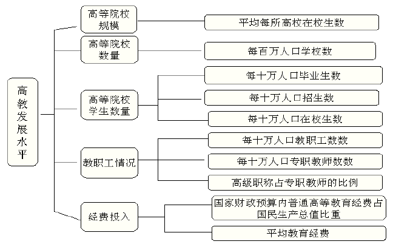

<!-- page: 653 -->

安徽
.59
35
47
146
46
20
32.83
2488
.33
5628

云南
.66
36
40
130
44
19
28.55
1974
.48
9106

江西
.77
43
63
194
67
23
28.81
2515
.34
4085

海南
.70
33
51
165
47
18
27.34
2344
.28
7928

内蒙古
.84
43
48
171
65
29
27.65
2032
.32
5581

西藏
1.69
26
45
137
75
33
12.10
810
1.00  14199

河南
.55
32
46
130
44
17
28.41
2341
.30
5714

广西
.60
28
43
129
39
17
31.93
2146
.24
5139

宁夏
1.39
48
62
208
77
34
22.70
1500
.42
5377

贵州
.64
23
32
93
37
16
28.12
1469
.34
5415

青海
1.48
38
46
151
63
30
17.87
1024
.38
7368

（3）R型聚类分析

定性考察反映高等教育发展状况的五个方面十项评价指标，可以看出，某些指标之
间可能存在较强的相关性。比如每十万人口高等院校毕业生数、每十万人口高等院校招
生数与每十万人口高等院校在校生数之间可能存在较强的相关性， 每十万人口高等院
校教职工数和每十万人口高等院校专职教师数之间可能存在较强的相关性。为了验证这
种想法，运用MATLAB软件计算十个指标之间的相关系数，相关系数矩阵如表6所示。

表6  相关系数矩阵

1x
2x
3x
4x
5x
6x
7x
8x
9x
10
x

1x
1.0000
0.9434
0.9528
0.9591
0.9746
0.9798
0.4065
0.0663
0.8680
0.6609

2x
0.9434
1.0000
0.9946
0.9946
0.9743
0.9702
0.6136
0.3500
0.8039
0.5998

3x
0.9528
0.9946
1.0000
0.9987
0.9831
0.9807
0.6261
0.3445
0.8231
0.6171

4x
0.9591
0.9946
0.9987
1.0000
0.9878
0.9856
0.6096
0.3256
0.8276
0.6124

5x
0.9746
0.9743
0.9831
0.9878
1.0000
0.9986
0.5599
0.2411
0.8590
0.6174

6x
0.9798
0.9702
0.9807
0.9856
0.9986
1.0000
0.5500
0.2222
0.8691
0.6164

7x
0.4065
0.6136
0.6261
0.6096
0.5599
0.5500
1.0000
0.7789
0.3655
0.1510

8x
0.0663
0.3500
0.3445
0.3256
0.2411
0.2222
0.7789
1.0000
0.1122
0.0482

9x
0.8680
0.8039
0.8231
0.8276
0.8590
0.8691
0.3655
0.1122
1.0000
0.6833

10
x
0.6609
0.5998
0.6171
0.6124
0.6174
0.6164
0.1510
0.0482
0.6833
1.0000

可以看出某些指标之间确实存在很强的相关性，因此可以考虑从这些指标中选取

-457-

<!-- page: 654 -->

几个有代表性的指标进行聚类分析。为此，把十个指标根据其相关性进行R型聚类，再
从每个类中选取代表性的指标。首先对每个变量（指标）的数据分别进行标准化处理。
变量间相近性度量采用相关系数，类间相近性度量的计算选用类平均法。聚类树型图见
图5。

0.35

0.3

0.25

0.2

0.15

0.1

0.05

 3
 4
 2
 5
 6
 1
 9
10
 7
 8
0

         图5  指标聚类树型图

计算的MATLAB 程序如下：
load gj.txt   %把原始数据保存在纯文本文件gj.txt 中
r=corrcoef(gj);  %计算相关系数矩阵
d=tril(r);       %取出相关系数矩阵的下三角元素
for i=1:10       %对角线元素化成零
    d(i,i)=0;
end
d=d(:);
d=nonzeros(d);  %取出非零元素
d=d';d=1-d;
z=linkage(d)
dendrogram(z)
从聚类图中可以看出，每十万人口高等院校招生数、每十万人口高等院校在校生数、
每十万人口高等院校教职工数、每十万人口高等院校专职教师数、每十万人口高等院校
毕业生数5 个指标之间有较大的相关性，最先被聚到一起。如果将10 个指标分为6 类，
其它5 个指标各自为一类。这样就从十个指标中选定了六个分析指标：

1x ：每百万人口高等院校数；

2x ：每十万人口高等院校毕业生数；

7x ：高级职称占专职教师的比例；

8x ：平均每所高等院校的在校生数；

-458-

<!-- page: 655 -->

9x ：国家财政预算内普通高教经费占国内生产总值的比重；

10
x ：生均教育经费。

可以根据这六个指标对30 个地区进行聚类分析。

（4）Q 型聚类分析

根据这六个指标对30个地区进行聚类分析。首先对每个变量的数据分别进行标准化
处理，样本间相近性采用欧氏距离度量，类间距离的计算选用类平均法。聚类树型图见
图6。

8

7

6

5

4

3

2

1

19 26 27 22 14 20 16 24 18 15 23 17 21 5
 8
 7
 6
 9 12 11 13 10 4 28 29 30 2
 3 25 1
0

                        图6  各地区聚类树型图

计算的MATLAB程序如下：

load gj.txt   %把原始数据保存在纯文本文件gj.txt中
gj(:,3:6)=[];

gj=zscore(gj);

y=pdist(gj);

z=linkage(y)

dendrogram(z,'average')

4．案例研究结果

各地区高等教育发展状况存在较大的差异，高教资源的地区分布很不均衡。如果根
据各地区高等教育发展状况把30 个地区分为三类，结果为：

第一类：北京；第二类：西藏；第三类：其他地区。
如果根据各地区高等教育发展状况把30个地区分为四类，结果为：

第一类：北京；第二类：西藏；第三类：上海天津；第四类：其他地区。
如果根据各地区高等教育发展状况把30个地区分为五类，结果为：

第一类：北京；第二类：西藏；第三类：上海天津；第四类：宁夏、贵州、青海；
第五类：其他地区。

从以上结果结合聚类图中的合并距离可以看出，北京的高等教育状况与其它地区相
比有非常大的不同，主要表现在每百万人口的学校数量和每十万人口的学生数量以及国

-459-

<!-- page: 656 -->

家财政预算内普通高教经费占国内生产总值的比重等方面远远高于其他地区，这与北京
作为全国的政治、经济与文化中心的地位是吻合的。上海和天津作为另外两个较早的直
辖市，高等教育状况和北京是类似的状况。宁夏、贵州和青海的高等教育状况极为类似，
高等教育资源相对匮乏。西藏作为一个非常特殊的民族地区，其高等教育状况具有和其
他地区不同的情形，被单独聚为一类，主要表现在每百万人口高等院校数比较高，国家
财政预算内普通高教经费占国内生产总值的比重和生均教育经费也相对较高，而高级职
称占专职教师的比例与平均每所高等院校的在校生数又都是全国最低的。这正是西藏高
等教育状况的特殊之处：人口相对较少，经费比较充足，高等院校规模较小，师资力量
薄弱。其他地区的高等教育状况较为类似，共同被聚为一类。针对这种情况，有关部门
可以采取相应措施对宁夏、贵州、青海和西藏地区进行扶持，促进当地高等教育事业的
发展。
§3  主成分分析
主成分分析（principal component analysis）是1901年Pearson对非随机变量引
入的，1933年Hotelling将此方法推广到随机向量的情形，主成分分析和聚类分析有很
大的不同，它有严格的数学理论作基础。
主成分分析的主要目的是希望用较少的变量去解释原来资料中的大部分变异，将我
们手中许多相关性很高的变量转化成彼此相互独立或不相关的变量。通常是选出比原始
变量个数少，能解释大部分资料中的变异的几个新变量，即所谓主成分，并用以解释资
料的综合性指标。由此可见，主成分分析实际上是一种降维方法。
3.1  基本思想及方法

如果用
p
x
x
x
,
,
,
2
1
"
表示p 门课程，
p
c
c
c
,
,
,
2
1
"
表示各门课程的权重，那么加权

之和就是

p
px
c
x
c
x
c
s
+
+
+
=
"
2
2
1
1
      （14）

我们希望选择适当的权重能更好地区分学生的成绩。每个学生都对应一个这样的综合成

绩，记为
ns
s
s
,
,
,
2
1
"
，n 为学生人数。如果这些值很分散，表明区分得好，即是说，

需要寻找这样的加权，能使
ns
s
s
,
,
,
2
1
"
尽可能的分散，下面来看它的统计定义。

设
p
X
X
X
,
,
,
2
1
"
表示以
p
x
x
x
,
,
,
2
1
"
为样本观测值的随机变量，如果能找到

p
c
c
c
,
,
,
2
1
"
，使得

)
(
Var
2
2
1
1
p
p X
c
X
c
X
c
+
+
+
"
      （15）

的值达到最大，则由于方差反映了数据差异的程度，因此也就表明我们抓住了这p 个

变量的最大变异。当然，（15）式必须加上某种限制，否则权值可选择无穷大而没有意

-460-

<!-- page: 657 -->

义，通常规定

1
2
2
2
2
1
=
+
+
+
p
c
c
c
"
                                            （16）

在此约束下，求（15）式的最优解。由于这个解是
−
p
维空间的一个单位向量，它代表

一个“方向”，它就是常说的主成分方向。
一个主成分不足以代表原来的p 个变量，因此需要寻找第二个乃至第三、第四主

成分，第二个主成分不应该再包含第一个主成分的信息，统计上的描述就是让这两个主
成分的协方差为零，几何上就是这两个主成分的方向正交。具体确定各个主成分的方法
如下。

设
iZ 表示第i 个主成分，
p
i
,
,2,1
"
=
，可设

+
+
+
=

⎧

"

X
c
X
c
X
c
Z

1
2
12
1
11
1

p
p

⎪
⎪

+
+
+
=

X
c
X
c
X
c
Z

"

2
2
22
1
21
2

p
p

⎨

                               （17）

"
"
"
"
"
"
"
"
"
"
"
"

⎪
⎪

+
+
+
=

"

X
c
X
c
X
c
Z

⎩

2
2
1
1

p
pp
p
p
p

其中对每一个i ，均有
1
2
2
2
2
1
=
+
+
+
ip
i
i
c
c
c
"
，且
)
,
,
,
(
1
12
11
p
c
c
c
"
使得
)
(
Var
1
Z
的值达

到最大；
)
,
,
,
(
2
22
21
p
c
c
c
"
不仅垂直于
)
,
,
,
(
1
12
11
p
c
c
c
"
，而且使
)
(
Var
2
Z
的值达到最大；

)
,
,
,
(
3
32
31
p
c
c
c
"
同时垂直于
)
,
,
,
(
1
12
11
p
c
c
c
"
和
)
,
,
,
(
2
22
21
p
c
c
c
"
，并使
)
(
Var
3
Z
的值

达到最大；以此类推可得全部p 个主成分，这项工作用手做是很繁琐的，但借助于计

算机很容易完成。剩下的是如何确定主成分的个数，我们总结在下面几个注意事项中。
1）主成分分析的结果受量纲的影响，由于各变量的单位可能不一样，如果各自改
变量纲，结果会不一样，这是主成分分析的最大问题，回归分析是不存在这种情况的，
所以实际中可以先把各变量的数据标准化，然后使用协方差矩阵或相关系数矩阵进行分
析。
2）为使方差达到最大的主成分分析，所以不用转轴（由于统计软件常把主成分分
析和因子分析放在一起，后者往往需要转轴，使用时应注意）。
3）主成分的保留。用相关系数矩阵求主成分时，Kaiser主张将特征值小于1的主成
分予以放弃（这也是SPSS软件的默认值）。
4）在实际研究中，由于主成分的目的是为了降维，减少变量的个数，故一般选取
少量的主成分（不超过5或6个），只要它们能解释变异的70％～80％（称累积贡献率）
就行了。
下面我们直接通过主成分估计（principle estimate）进一步阐述主成分分析的基
本思想和相关概念。
3.2  主成分估计

-461-

<!-- page: 658 -->

主成分估计（principal component estimate）是Massy在1965年提出的，它是回
归系数参数的一种线性有偏估计（biased estimate），同其它有偏估计，如岭估计（ridge
estimate）等一样，是为了克服最小二乘（LS）估计在设计阵病态（即存在多重共线性）
时表现出的不稳定性而提出的。
主成分估计采用的方法是将原来的回归自变量变换到另另一组变量，即主成分，选
择其中一部分重要的主成分作为新的自变量（此时丢弃了一部分，影响不大的自变量，
这实际达到了降维的目的），然后用最小二乘法对选取主成分后的模型参数进行估计，
最后再变换回原来的模型求出参数的估计。

设有p 个回归（自）变量
p
x
x
x
,
,
,
2
1
"
，它在第i 次试验中的取值为

ip
i
i
x
x
x
,
,
,
2
1
"
（
n
i
,
,2,1
"
=
）

将它们写成矩阵形式

⎛

⎞

x
x
x

"
"

⎜⎜
⎜
⎜
⎜

⎟⎟
⎟
⎟
⎟

1
12
11

p

x
x
x

2
22
21

p

=
=

x
x
x
X

2
1
)
,
,
,
(
  （18）

"

p

#
#
#

"

x
x
x

⎝

⎠

np
n
n

2
1

（注意这里
p
x
x
x
,
,
,
2
1
"
既表示回归自变量，又表示这些变量的观测值列向量，从上下

文中我们容易区分开。）（18）即为设计阵，考虑线性模型

ε
β
β
+
+
=
X
Y
1
0
，
)
,0
(
~
2I
N
σ
ε
，
  （19）

其中Y 为
1
×
n
向量，
0
β 为未知参数，1为所有元素均为1的n 维列向量，β 为
1
×
p
未

知参数向量，ε 为
1
×
n
误差向量。假定X 已经标准化（即X 的每个分量
jx 均已标准

化，如果未标准化，需要作变量的标准化变换
j
j
ij
s
x
x
/)
(
−
，其中
j
j s
x ,
为
jx 各分量的

均值和标准差。），此时

n

1
0
1
ˆβ
  （20）

∑

=
=
=

iY
n
Y

i

对于自变量的任意一个线性组合

p

p
px
c
x
c
x
c
z
+
+
+
=
"
2
2
1
1
，∑

=

2
1，
          （21）

jc

=

j

1

将z 视为一个新的变量。于是z 在第i 次试验中的取值为

-462-

<!-- page: 659 -->

ip
p
i
i
i
x
c
x
c
x
c
z
+
+
+
=
"
2
2
1
1
（
n
i
,
,2,1
"
=
）
      （22）

由于X 已经标准化，因此

p

p

n

n

1
1
1
1
0
1
1
  （23）

∑
∑
∑
∑
=
=
=
=

=
=
=

ij
j
x
c
n
x
c
n
z

j

ij

i

j

j

i

记
T
p
c
c
c
w
)
,
,
,
(
2
1
"
=
，则

2
*
2
Xw
Xw
n
z
n
z
z
n
M
T
n

n

)
(
)
(
1
1
)
(
1

i
=
=
−
=
∑
∑

2

  （24）

i

=
=

i

1

i

1

对于新变量z 来说，如果在n 次试验之下它的取值变化不大，即是说
*
2
M 较小，则这个

新变量可以去掉。反之，
*
2
M 较大，那么这个新变量有较大的变化，它的作用比较明显。

注意到
iz 的取值与
ic 的选取有关。因此，我们总是希望所选择的
)
,
,2,1
(
p
i
ci
"
=
，使

*
2
M 达到最大，这才说明新变量在新建的回归模型中有较大的影响。

如果
X
X T
的特征值
p
λ
λ
λ
≥
≥
≥
"
2
1
，它们所对应的标准化正交特征向量为

p
η
η
η
,
,
,
2
1
"
，则
n
Xw
Xw
M
T
/)
(
)
(
*
2 =
的最大值在
1
η
=
w
时达到，且最大值为
n
/
1λ
。

此时新变量z 即为

1
η
X
z =

常记
1
1
η
X
z =
，并称之为自变量的第一主成分。一般地，如果已经确定了k 个主成分

i
i
X
z
η
=
（
k
i
,
,2,1
"
=
），
      （25）

则第
1
+
k
个主成分
Xw
zk
=
+1
可由下面两个条件决定：

1）
0
=
i
T
w η
，
k
i
,
,2,1
"
=
，
1
=
w
wT
；

2）在条件1）之下，使
*
2
M 达到最大。

由二次型的条件极值可知，第
1
+
k
个主成分就是
1
1
+
+ =
k
k
X
z
η
，这样，总共可以找到p

-463-

<!-- page: 660 -->

个主成分
i
i
X
z
η
=
（
p
i
,
,2,1
"
=
）。

现在回到线性模型（19），将
p
x
x
x
,
,
,
2
1
"
变换为主成分
pz
z
z
,
,
,
2
1
"
之后再求β 的

估计，令

⎛

⎞

z
z
z

"
"

⎜⎜
⎜
⎜
⎜

⎟⎟
⎟
⎟
⎟

1
12
11

p

z
z
z

2
22
21

p

=
=

z
z
z
Z

2
1
)
,
,
,
(
      （26）

"

p

#
#
#

"

z
z
z

⎝

⎠

np
n
n

2
1

记
p
p
p
Q
×
=
)
,
,
,
(
2
1
η
η
η
"
，Q 为标准化正交阵，且
XQ
Z =
，引入新参数
β
α
T
Q
=
，

或者
α
β
Q
=
，则

ε
α
β
ε
β
β
+
+
=
+
+
=
Z
ZQ
Y
T
1
1
0
0
，
  （27）

其中

⎛

⎞

λ

0
)
(

⎜
⎜
⎜

⎟
⎟
⎟

1
%
          （28）

=
Λ
=
=
=

T
T
T
T
T
Q
X
X
Q
XQ
X
Q
Z
Z

λ

0

⎝

⎠

p

式（27）称之为模型（19）的典则形式。由式（28）可知，
X
X T
的特征值
iλ 度量了第

i 个主成分
iz 在n 次试验中取值变化的大小。如果
0
≈
iλ
，则该主成分在n 次试验中取

值的变化很小，它的作用可以并入模型（27）中的常数项
0
β 。这相当于在典则形式中

剔除变量
iz 。

如果
0
1
≈
=
=
+
p
r
λ
λ
"
，则剔除
p
r
r
z
z
z
,
,
,
2
1
"
+
+
，只剩下α 的前r 个分量

r
α
α
α
,
,
,
2
1
"
，设它的最小二乘估计为
r
α
α
α
ˆ
,
,
ˆ
,
ˆ
2
1
"
，而α 后面的
r
p −
个分量则以0

作为它们的估计，然后由关系式
α
β
Q
=
即可确定β 的估计，我们称之为β 的主成分

估计，实际步骤如下：

先将
α
,
Q
分块，即

-464-

<!-- page: 661 -->

α
α
    （29）

⎛
=

⎞
⎜⎜
⎝

)
,
(
2
1 Q
Q
Q =
，
⎟⎟
⎠

1
α

2

其中
1
Q 为
r
p ×
矩阵，
1
α 为r 维向量，从而α 的主成分估计为

(
)

T
0
ˆ
ˆ
1
α
α =
                                                （30）

从而得到β 的主成分估计

ˆ
)
,
(
ˆ
α
α
β
Q
Q
Q
=
⎟⎟
⎠

⎛
=
                                      （31）

⎞
⎜⎜
⎝

1
1
1
2
1
ˆ
0

理论上表明：主成分估计在设计阵病态时优于LS估计，但（31）在特征值为1的附
近存在跳跃，会影响计算的稳定性，杨虎在1989年给出的单参数主成分估计解决了这个
问题。

定义1  若存在
p
r <
≤
1
，使
1
1
+
>
≥
r
r
λ
λ
，记

θ
λ
"
"
+
+
−
+
−
=
                  （32）

θ
λ
λ

)
,
,
,
1
,
,
1
(
diag
1
1

r
A
θλ
θλ
λ

1
p
r
r

这里
)1,
(
p
λ
θ ∈
为平稳参数，我们称
1
1 ˆ
ˆ
α
β
Q
QAQT
=
为β 的单参数主成分估计。

例3  Hald水泥问题，考察含如下四种化学成分

=
1x
3CaO·Al2O3的含量（％），
=
2x
3CaO·SiO2的含量（％），

=
3x
4CaO·Al2O3·Fe2O3的含量（％），
=
4x
2CaO·SiO2的含量（％），

的某种水泥，每一克所释放出的热量（卡）Y 与这四种成分含量之间的关系。数据共

13组，见表7，对数据实施标准化，则
12
/
X
X T
就是样本相关系数阵（见表8）。

表7  Hald水泥

序号
1x
2x
3x
4x
y

1
7
26
6
60
78.5

2
1
29
15
52
74.3

3
11
56
8
20
104.3

4
11
31
8
47
87.6

5
7
52
6
33
95.9

6
11
55
9
22
109.2

-465-

<!-- page: 662 -->

7
3
71
17
6
102.7

8
1
31
22
44
72.5

9
2
54
18
22
93.1

10
21
47
4
26
115.9

11
1
40
23
34
83.8

12
11
66
9
12
113.3

13
10
68
8
12
109.4

表8  Hald水泥数据的样本相关系数阵

1x
2x
3x
4x

1x
1
0.2286
-0.8241
-0.2454

2x
0.2286
1
-0.1392
-0.9730

3x
-0.8241
-0.1392
1
0.0295

4x
-0.2454
-0.9730
0.0295
1

相关系数阵的四个特征值依次为2.2357，1.5761，0.1866，0.0016。最后一个特征
值接近于零，前三个特征值之和所占比例（累积贡献率）达到0.999594。于是我们略去
第4个主成分。其它三个保留的特征值对应的三个特征向量分别为

)
5479
.0
,
3941
.0
,
5639
.0,
476
.0
(
1
−
−
=
T
η

)
4512
.0
,
605
.0,
4139
.0,
509
.0
(
2
−
−
=
T
η

)
1954
.0
,
6377
.0,
3144
.0
,
6755
.0
(
3
−
−
=
T
η

对Hald数据直接作线性回归得经验回归方程

4
3
2
1
144
.0
102
.0
5102
.0
5511
.1
4054
.
62
ˆ
x
x
x
x
y
−
+
+
+
=

再由（31）式计算出主成分估计，即可获得如下主成分回归方程

4
3
2
1
3801
.0
1428
.0
2694
.0
3119
.1
7433
.
85
ˆ
x
x
x
x
y
−
−
+
+
=

两个方程的区别在于后者具有更小的均方误差，因而更稳定。此外前者所有系数都无法
通过显著性检验。
计算的MATLAB程序如下：
clc,clear
load sn.txt  %把原始的x1,x2,x3,x4,y的数据保存在纯文本文件sn.txt中
[m,n]=size(sn);num=3; %num为选取的主成分的个数

-466-

<!-- page: 663 -->

mu=mean(sn);sigma=std(sn);
snb=zscore(sn); %数据标准化
b=snb(:,1:end-1); %x1,x2,x3,x4的数据赋给b
r=cov(b);  %标准化数据的协方差阵就是相关系数阵
[x,y,z]=pcacov(r);
f=repmat(sign(sum(x)),size(x,1),1);
x=x.*f;
%以下是普通的最小二乘法回归
r=[ones(m,1),b]\snb(:,end);  %标准化数据的回归方程系数
bzh=mu./sigma;
ch10=mu(end)-bzh(1:end-1)*r(2:end)*sigma(end)  %原始数据的常数项
fr=r(2:end);fr=fr';
ch1=fr./sigma(1:end-1)*sigma(end) %原始数据的x1,x2等等系数
%以下是主成分回归
pval=b*x(:,1:num);
rp=[ones(m,1),pval]\snb(:,end);  %主成分数据的回归方程系数
beta=x(:,1:num)*rp(2:num+1);           %标准化数据的回归方程系数
ch20=mu(end)-bzh(1:end-1)*beta*sigma(end)  %原始数据的常数项
fr=beta';
ch2=fr./sigma(1:end-1)*sigma(end) %原始数据的x1,x2等等系数
check1=sqrt(sum((sn(:,1:end-1)*ch1'+ch10-sn(:,end)).^2)/(m-n))
check2=sqrt(sum((sn(:,1:end-1)*ch2'+ch20-sn(:,end)).^2)/(m-num-1))
3.3  特征值因子的筛选
回到主成分分析，实际中确定（17）式中的系数就是采用（28）式中矩阵的特征向

量。因此，剩下的问题仅仅是将
X
X T
的特征值按由大到小的次序排列之后，如何筛选

这些特征值？一个实用的方法是删去
p
r
r
λ
λ
λ
,
,
,
2
1
"
+
+
后，这些删去的特征值之和占整

个特征值之和∑
iλ 的15％以下，换句话说，余下的特征值所占的比重（定义为累积贡

献率）将超过85％，当然这不是一种严格的规定，今年来文献中关于这方面的讨论很多，
有很多比较成熟的方法，这里不一一介绍。
单纯考虑累积贡献率有时是不够的，还需要考虑选择的主成分对原始变量的贡献

值，我们用相关系数的平方和来表示，如果选取的主成分为
rz
z
z
,
,
,
2
1
"
，则它们对原

变量
ix 的贡献值为

-467-

<!-- page: 664 -->

r

∑

2
)
,
(
ρ
                                              （33）

=
=

i
j
i
x
z
r

j

1

例4  设
)
,
,
(
3
2
1
x
x
x
X =
，且

−

⎛

⎞

0
2
1

⎜
⎜
⎜

⎟
⎟
⎟

=

−

X
X T

0
5
2

0
0
0

⎝

⎠

则可算得
8284
.5
1 =
λ
，
0.1716
2 =
λ
，如果我们仅取第一个主成分，由于其累积贡献

率已经达到97.14% ，似乎很理想了，但如果进一步计算主成分对原变量的贡献值，容
易发现

0
)
,
(
3
1
2
3
=
=
x
z
r
ρ

可见，第一个主成分对第三个变量的贡献值为0，这是因为
3x 和
2
1, x
x
都不相关。由于

在第一个主成分中一点也不包含
3x 的信息，这时只选择一个主成分就不够了，需要再

取第二个主成分。
例5  研究纽约股票市场上五种股票的周回升率。这里，周回升率＝（本星期五市
场收盘价－上星期五市场收盘价）/上星期五市场收盘价。从1975年1月到1976年12月，
对这五种股票作了100组独立观测。因为随着一般经济状况的变化，股票有集聚的趋势，
因此，不同股票周末回升率是彼此相关的。

设
5
2
1
,
,
,
x
x
x
"
分别为五只股票的周回升率，则从数据算得

)
0037
.0
,
0063
.0
,
0057
.0
,
0048
.0
,
0054
.0
(
=
T
x

⎛

⎞

462
.0
387
.0
509
.0
577
.0
000
.1

⎜
⎜
⎜
⎜
⎜
⎜

⎟
⎟
⎟
⎟
⎟
⎟

322
.0
389
.0
599
.0
000
.1
577
.0

=

R

426
.0
436
.0
000
.1
599
.0
509
.0

523
.0
000
.1
436
.0
389
.0
387
.0

000
.1
523
.0
426
.0
322
.0
462
.0

⎝

⎠

这里R 是标准化数据的协方差矩阵，R 的特征值和标准正交特征向量为

857
.2
1 =
λ
，
809
.0
2 =
λ
，
540
.0
3 =
λ
，
452
.0
4 =
λ
，
343
.0
5 =
λ
，

)
421
.0
,
421
.0
,
470
.0
,
457
.0
,
464
.0
(
1 =
T
η

-468-

<!-- page: 665 -->

)
582
.0
,
526
.0
,
260
.0
,
509
.0
,
240
.0
(
2
−
−
=
T
η

标准化变量的前两个主成分为

5
4
3
2
1
1
~
421
.0
~
421
.0
~
470
.0
~
457
.0
~
464
.0
x
x
x
x
x
z
+
+
+
+
=

5
4
3
2
1
2
~
582
.0
~
526
.0
~
260
.0
~
509
.0
~
240
.0
x
x
x
x
x
z
−
−
+
+
=

它们的累积贡献率为

λ
λ

2
1
=
×
+
∑

%
73
%
100
5

iλ

=
i

1

这两个主成分具有重要的实际解释，第一主成分大约等于这五种股票周回升率和的一个

常数倍，通常称为股票市场主成分，简称市场主成分；第二主成分代表化学股票（在
2z

中系数为正的三只股票都是化学工业上市企业）和石油股票（在
2z 中系数为负的两只

股票恰好都为石油板块的上市企业）的一个对照，称之为工业主成分。这说明，这些股
票周回升率的大部分变差来自市场活动和与它不相关的工业活动。关于股票价格的这个
结论与经典的证券理论吻合。至于其它主成分解释较为困难，很可能表示每种股票自身
的变差，好在它们的贡献率很少，可以忽略不计。
§4  主成分分析案例－我国各地区普通高等教育发展水平综合评价

主成分分析试图在力保数据信息丢失最少的原则下，对多变量的截面数据表进行最
佳综合简化，也就是说，对高维变量空间进行降维处理。本案例运用主成分分析方法综
合评价我国各地区普通高等教育的发展水平。

问题与第2节中的问题相同，我们这里就不重复叙述了。
4.1  主成分分析法的步骤
主成分分析法进行评价的步骤如下：
1）对原始数据进行标准化处理

假设进行主成分分析的指标变量有m 个：
m
x
x
x
,
,
,
2
1
"
，共有n 个评价对象，第i

个评价对象的第j 个指标的取值为
ijx 。将各指标值
ijx 转换成标准化指标
ijx~ ，

x
x
x
−
=
~
，（
n
i
,
,2,1
"
=
；
m
j
,
,2,1
"
=
）

j
ij
ij
s

j

-469-

<!-- page: 666 -->

n

n

1
，
∑

2)
(
1
1
，(
m
j
,
,2,1
"
=
)，即
j
j s
x ,
为第j 个指

其中
∑

=
=

−
−
=

ij
j
x
n
x

j
ij
j
x
x
n
s

=

i

1

i

1

标的样本均值和样本标准差。对应地，称

x
x
x
−
=
~
，（
m
i
,
,2,1
"
=
）

i
i
i
s

i

为标准化指标变量。

2）计算相关系数矩阵R

相关系数矩阵
m
m
ijr
R
×
=
)
(

n

⋅
= ∑

~
~

x
x
r

kj
ki

ij
，（
m
j
i
,
,2,1
,
"
=
）

=

k

1
−

1

n

式中
1
=
iir
，
ji
ij
r
r =
，ijr 是第i 个指标与第j 个指标的相关系数。

3）计算特征值和特征向量

计算相关系数矩阵R 的特征值
0
2
1
≥
≥
≥
≥
m
λ
λ
λ
"
，及对应的特征向量

m
u
u
u
,
,
,
2
1
"
，其中
T
nj
j
j
j
u
u
u
u
)
,
,
,
(
2
1
"
=
，由特征向量组成m 个新的指标变量

~
~
~

+
+
+
=

⎧

"

x
u
x
u
x
u
y

1
2
21
1
11
1

n
n

⎪⎪
⎨

~
~
~

+
+
+
=

x
u
x
u
x
u
y

"

2
2
22
1
12
2

n
n

"
"
"
"
"
"
"
"
"
"
"

⎪
⎪
⎩

~
~
~

+
+
+
=

x
u
x
u
x
u
y

"

n
nm
m
m
m

2
2
1
1

式中
1y 是第1主成分，
2y 是第2主成分，…，
m
y 是第m 主成分。

4）选择p （
m
p ≤
）个主成分，计算综合评价值

① 计算特征值
)
,
,2,1
(
m
j
j
"
=
λ
的信息贡献率和累积贡献率。称

λ

j
jb

=
m

（
m
j
,
,2,1
"
=
）

∑

1
λ

k

=

k

为主成分
jy 的信息贡献率；

-470-

<!-- page: 667 -->

p

∑

λ
α

k

=
=
m

k

1

p

∑

λ

k

=

k

1

为主成分
p
y
y
y
,
,
,
2
1
"
的累积贡献率，当
p
α 接近于1（
95
.0
,
90
.0
,
85
.0
=
p
α
）时，则

选择前p 个指标变量
p
y
y
y
,
,
,
2
1
"
作为p 个主成分，代替原来m 个指标变量，从而可

对p 个主成分进行综合分析。

    ② 计算综合得分

p

∑

=
=

j
j y
b
Z

1

j

其中
jb 为第j 个主成分的信息贡献率，根据综合得分值就可进行评价。

4.2  基于主成分分析法的综合评价

定性考察反映高等教育发展状况的五个方面十项评价指标，可以看出，某些指标之
间可能存在较强的相关性。比如每十万人口高等院校毕业生数、每十万人口高等院校招
生数与每十万人口高等院校在校生数之间可能存在较强的相关性， 每十万人口高等院
校教职工数和每十万人口高等院校专职教师数之间可能存在较强的相关性。为了验证这
种想法，计算十个指标之间的相关系数。

可以看出某些指标之间确实存在很强的相关性，如果直接用这些指标进行综合评
价，必然造成信息的重叠，影响评价结果的客观性。主成分分析方法可以把多个指标转
化为少数几个不相关的综合指标，因此，可以考虑利用主成分进行综合评价。

利用MATLAB软件对十个评价指标进行主成分分析，相关系数矩阵的前几个特征根及
其贡献率如表7。

表7  主成分分析结果

序号
特征根
贡献率
累计贡献率

1
7.5022
75.0216
75.0216

2
1.577
15.7699
90.7915

3
0.5362
5.3621
96.1536

4
0.2064
2.0638
98.2174

5
0.145
1.4500
99.6674

6
0.0222
0.2219
99.8893

可以看出，前两个特征根的累计贡献率就达到90%以上，主成分分析效果很好。下
面选取前四个主成分（累计贡献率就达到98%）进行综合评价。前四个特征根对应的特

-471-

<!-- page: 668 -->

征向量见表8。

表8  标准化变量的前4个主成分对应的特征向量

1~x
2~x
3~x
4~x
5~x
6~x
7~x
8~x
9~x
10
~x

第1特

0.3497
0.3590
0.3623
0.3623
0.3605
0.3602
0.2241
0.1201
0.3192
0.2452

征向量

第2特

-0.1972
0.0343
0.0291
0.0138
-0.0507
-0.0646
0.5826
0.7021
-0.1941
-0.2865

征向量

第3特

-0.1639
-0.1084
-0.0900
-0.1128
-0.1534
-0.1645
-0.0397
0.3577
0.1204
0.8637

征向量

第4特

-0.1022
-0.2266
-0.1692
-0.1607
-0.0442
-0.0032
0.0812
0.0702
0.8999
0.2457

征向量

由此可得四个主成分分别为

10
2
1
1
~
2452
.0
~
359
.0
~
3497
.0
x
x
x
y
+
+
+
=
"

10
2
1
2
~
286
.0
~
0343
.0
~
1972
.0
x
x
x
y
−
+
+
−
=
"

10
2
1
3
~
8637
.0
~
1084
.0
~
1639
.0
x
x
x
y
+
+
−
−
=
"

10
2
1
4
~
2457
.0
~
2266
.0
~
1022
.0
x
x
x
y
−
+
−
−
=
"

从主成分的系数可以看出，第一主成分主要反映了前六个指标（学校数、学生数和教师
数方面）的信息，第二主成分主要反映了高校规模和教师中高级职称的比例，第三主成
分主要反映了生均教育经费，第四主成分主要反映了国家财政预算内普通高教经费占国
内生产总值的比重。把各地区原始十个指标的标准化数据代入四个主成分的表达式，就
可以得到各地区的四个主成分值。

分别以四个主成分的贡献率为权重，构建主成分综合评价模型：

4
3
2
1
0206
.0
0536
.0
1577
.0
7502
.0
y
y
y
y
Z
+
+
+
=

把各地区的四个主成分值代入上式，可以得到各地区高教发展水平的综合评价值以及排
序结果如表9。

表9  排名和综合评价结果

地区
北京
上海
天津
陕西
辽宁
吉林
黑龙江
湖北
江苏
广东

名次
1
2
3
4
5
6
7
8
9
10

综合

评价值
8.6043
4.4738
2.7881
0.8119
0.7621
0.5884
0.2971
0.2455
0.0581
0.0058

地区
四川
山东
甘肃
湖南
浙江
新疆
福建
山西
河北
安徽

-472-

<!-- page: 669 -->

名次
11
12
13
14
15
16
17
18
19
20

综合

评价值
-0.268
-0.3645
-0.4879
-0.5065
-0.7016
-0.7428
-0.7697
-0.7965
-0.8895
-0.8917

地区
云南
江西
海南
内蒙古
西藏
河南
广西
宁夏
贵州
青海

名次
21
22
23
24
25
26
27
28
28
30

综合

评价值
-0.9557
-0.9610
-1.0147
-1.1246
-1.1470
-1.2059
-1.2250
-1.2513
-1.6514
-1.68

clc,clear

load gj.txt   %把原始数据保存在纯文本文件gj.txt中

gj=zscore(gj); %数据标准化

r=corrcoef(gj);  %计算相关系数矩阵
[x,y,z]=pcacov(r);

f=repmat(sign(sum(x)),size(x,1),1);

x=x.*f;

df=gj*x(:,1:4)

tf=df*z(1:4)/100;

[stf,ind]=sort(tf,'descend')

4.3  结论

各地区高等教育发展水平存在较大的差异，高教资源的地区分布很不均衡。北京、
上海、天津等地区高等教育发展水平遥遥领先，主要表现在每百万人口的学校数量和每
十万人口的教师数量、学生数量以及国家财政预算内普通高教经费占国内生产总值的比
重等方面。陕西和东北三省地区高等教育发展水平也比较高。贵州、广西、河南、安徽
等地区高等教育发展水平比较落后，这些地区的高等教育发展需要政策和资金的扶持。
值得一提的是西藏、新疆、甘肃等经济不发达地区的高等教育发展水平居于中上游水平，
可能是由于人口等原因。
§5  因子分析
因子分析（factor analysis）是由英国心理学家Spearman在1904年提出来的，他
成功地解决了智力测验得分的统计分析，长期以来，教育心理学家不断丰富、发展了因
子分析理论和方法，并应用这一方法在行为科学领域进行了广泛的研究。
因子分析可以看成主成分分析的推广，它也是多元统计分析中常用的一种降维方
式，因子分析所涉及的计算与主成分分析也很类似，但差别也是很明显的：1）主成分
分析把方差划分为不同的正交成分，而因子分析则把方差划归为不同的起因因子；2）
因子分析中特征值的计算只能从相关系数矩阵出发，且必须将主成分转换成因子。
因子分析有确定的模型，观察数据在模型中被分解为公共因子、特殊因子和误差三
部分。初学因子分析的最大困难在于理解它的模型，我们先看如下几个例子。
例6  为了解学生的知识和能力，对学生进行了抽样命题考试，考题包括的面很广，
但总的来讲可归结为学生的语文水平、数学推导、艺术修养、历史知识、生活知识等五

-473-

<!-- page: 670 -->

个方面，我们把每一个方面称为一个（公共）因子，显然每个学生的成绩均可由这五个

因子来确定，即可设想第i 个学生考试的分数
i
X 能用这五个公共因子
5
2
1
,
,
,
F
F
F
"
的

线性组合表示出来

i
i
i
i
i
i
U
F
a
F
a
F
a
X
+
+
+
+
+
=
5
5
2
2
1
1
"
μ
，（
N
i
,
,2,1
"
=
）            （34）

线性组合系数
5
2
1
,
,
,
i
i
i
a
a
a
"
称为因子载荷（loadings），它分别表示第i 个学生在这

五个因子方面的能力；
iμ 是总平均，
i
U 是第i 个学生的能力和知识不能被这五个因子

包含的部分，称为特殊因子，常假定
)
,0
(
~
2
i
i
N
U
σ
，不难发现，这个模型与回归模型

在形式上是很相似的，但这里
5
2
1
,
,
,
F
F
F
"
的值却是未知的，有关参数的意义也有很大

的差异。

因子分析的首要任务就是估计因子载荷
ij
a 的方差
2
i
σ ，然后给因子
iF 一个合理的

解释，若难以进行合理的解释，则需要进一步作因子旋转，希望旋转后能发现比较合理
的解释。
例7  诊断时，医生检测了病人的五个生理指标：收缩压、舒张压、心跳间隔、呼
吸间隔和舌下温度，但依据生理学知识，这五个指标是受植物神经支配的，植物神经又
分为交感神经和副交感神经，因此这五个指标可用交感神经和副交感神经两个公共因子
来确定，从而也构成了因子模型。
例8  Holjinger和Swineford在芝加哥郊区对145名七、八年级学生进行了24个心理
测验，通过因子分析，这24个心理指标被归结为4个公共因子，即词语因子、速度因子、
推理因子和记忆因子。
特别需要说明的是这里的因子和试验设计里的因子（或因素）是不同的，它比较抽
象和概括，往往是不可以单独测量的。
5.1  因子分析模型

设有p 个原始变量
)
,
,2,1
(
p
i
xi
"
=
，它们可能相关，也可能独立，将
ix 标准化得

到新变量
iz ，则可以建立因子分析模型如下：

i
i
m
im
i
i
i
U
c
F
a
F
a
F
a
z
+
+
+
+
=
"
2
2
1
1
（
p
i
,
,2,1
"
=
），                 （35）

其中
)
,
,2,1
(
m
j
Fj
"
=
出现在每个变量的表达式中，称为公共因子，它们的含义要根

据具体问题来解释，
)
,
,2,1
(
p
i
Ui
"
=
仅与变量
iz 有关，称为特殊因子，系数
i
ij c
a ,

-474-

<!-- page: 671 -->

（
p
i
,
,2,1
"
=
，
m
j
,
,2,1
"
=
）称为因子载荷，
)
(
ij
a
A =
称为载荷矩阵。

可以将（35）式表示为如下的矩阵形式

CU
AF
z
+
=
                                              （36）

其中
T
pz
z
z
z
)
,
,
,
(
2
1
"
=
，
T
m
F
F
F
F
)
,
,
,
(
2
1
"
=
，
T
p
U
U
U
U
)
,
,
,
(
2
1
"
=
，

m
p
ij
a
A
×
=
)
(
，
)
,
,
,
(
diag
2
1
p
c
c
c
C
"
=

对此模型通常需要假设
1）各特殊因子之间以及特殊因子与所有公共因子之间均相互独立，即

⎪⎨
⎧

U
p
σ
σ
σ
"

=

)
,
,
,
(
diag
)
(
Cov
2
2
2
2
1
F,U

⎪⎩

=

0
)
Cov(

（37）
2）各公共因子都是均值为0，方差为1的独立正态随机变量，其协方差矩阵为单位

阵
m
I ，即
)
,0
(
~
m
I
N
F
。当因子F 的各个分量相关时，
)
(
Cov F 不再是对角阵，这样

的模型称为斜交因子模型，我们不考虑这种模型。

m 个公共因子对第i 个变量方差的贡献称为第i 共同度，记为
2
ih ，

2
2
2
2
1
2
im
i
i
i
a
a
a
h
+
+
+
=
"
      （38）

而特殊因子的方差称为特殊方差或者特殊值（即（37）式中的
2
i
σ ，
p
i
,
,2,1
"
=
），

从而第i 个变量的方差有如下分解

2
2
Var
i
i
i
h
z
σ
+
=
，
p
i
,
,2,1
"
=
                                  （39）

因子分析的一个基本问题是如何估计因子载荷，亦即如何求解因子模型（35），我

们下面仅仅介绍最常用的基于样本相关系数矩阵R 的主成分解。

设
p
λ
λ
λ
≥
≥
≥
"
2
1
为样本相关系数矩阵R 的特征值，
p
η
η
η
,
,
,
2
1
"
为相应的标准

正交化特征向量。设
p
m <
，则样本相关系数矩阵R 的主成分因子分析的载荷矩阵A 为

)
,
,
,
(
2
2
1
1
m
m
A
η
λ
η
λ
η
λ
"
=
，
          （40）

特殊因子的方差用
T
AA
R −
的对角元来估计，即

-475-

<!-- page: 672 -->

m

∑

2
2
1
σ
                                                 （41）

=
−
=

ij
i
a

j

1

例9（续例5） 我们考虑样本相关系数矩阵R 的前两个样本主成分，对
1
=
m
和
2
=
m
，

因子分析主成分解见表10，对
2
=
m
，残差矩阵
)
(
Cov U
AA
R
T −
−
为

−
−
−

⎡

⎤

0173
.0
0689
.0
1643
.0
1274
0
0
.

⎢
⎢
⎢
⎢
⎢
⎢

⎥
⎥
⎥
⎥
⎥
⎥

−
−

0118
.0
0553
.0
1223
.0
0
1274
.0

−
−
−
−

0171
.0
0193
.0
0
1234
.0
1643
.0

−
−
−

2317
.0
0
0193
.0
0553
.0
0689
.0

−
−

0
2317
.0
0171
.0
0118
.0
0173
.0

⎣

⎦

表10  因子分析主成分解

一个因子
两个因子

因子载荷估计
变量

因子载荷估计
1F
特殊方差

特殊方差

1F
2
F

1

0.7836

 0.3860

0.7836

-0.2162

0.3393

2

0.7726

 0.4031

0.7726

-0.4581

0.1932

3

0.7947

 0.3685

0.7947

-0.2343

0.3136

4

0.7123

 0.4926

0.7123

0.4729

0.2690

5

0.7119

 0.4931

0.7119

0.5235

0.2191

累积贡献
0.571342
0.571342
0.733175

由这两个因子解释的总方差比一个因子大很多。然而，对
2
=
m
，残差矩阵负元素较多，

这表明
T
AA 产生的数比R 中对应元素（相关系数）要大。

第一个因子
1F 代表了一般经济条件，称为市场因子，所有股票在这个因子上的载

荷都比较大，且大致相等，第二个因子是化学股和石油股的一个对照，两者分别有比较

大的负、正载荷。可见
2
F 使不同的工业部门的股票产生差异，通常称之为工业因子。

归纳起来，我们有如下结论：股票回升率由一般经济条件、工业部门活动和各公司本身
特殊活动三部分决定，这与例5的结论基本一致。
计算的MATLAB程序如下：
clc,clear
r=[1.000 0.577 0.509 0.387 0.462
   0.577 1.000 0.599 0.389 0.322

-476-

<!-- page: 673 -->

   0.509 0.599 1.000 0.436 0.426
   0.387 0.389 0.436 1.000 0.523
   0.462 0.322 0.426 0.523 1.000];
[vec,val,con]=pcacov(r);
f1=repmat(sign(sum(vec)),size(vec,1),1);
vec=vec.*f1;     %特征向量正负号转换
f2=repmat(sqrt(val)',size(vec,1),1);
a=vec.*f2
a1=a(:,1);   %一个因子的载荷矩阵
tm=r-a1*a1';
tcha1=diag(tm)   %一个因子的特殊方差
a2=a(:,[1,2]);  %两个因子的载荷矩阵
tm=r-a2*a2';
tcha2=diag(tm)  %两个因子的特殊方差
ccha2=r-a2*a2'-diag(tcha2)  %求两个因子时的残差矩阵
gong=cumsum(con)     %求累积贡献率
    5.2  因子旋转

上面主成分解是不唯一的，因为对A 作任何正交变换都不会改变原来的
T
AA ，即

设Q 为m 阶正交矩阵，
AQ
B =
则有
T
T
AA
BB =
，载荷矩阵的这种不唯一性表明看是

不利的，但我们却可以利用这种不变性，通过适当的因子变换，使变换后新的因子具有

更鲜明的实际意义或可解释性，比如，我们可以通过正交变换使B 中有尽可能多的元
素等于或接近于0，从而使因子载荷矩阵结构简单化，便于做出更有实际意义的解释。
由于正交变换是一种旋转变换，如果我们选取方差最大的正交旋转，即将各个因子
旋转到某个位置，使每个变量在旋转后的因子轴上的投影向最大、最小两级分化，从而
使每个因子中的高载荷只出现在少数的变量上，在最后得到的旋转因子载荷矩阵中，每
列元素除几个值外，其余的均接近于0。
5.2.1  考虑两个因子的平面正交旋转
设因子载荷矩阵为

)
(
ij
a
A =
，
p
i
,
,2,1
"
=
，
2,1
=
j
                                （42）

取正交矩阵

⎛
−
=
φ
φ

φ
φ

⎞
⎜⎜
⎝

sin
cos
Q
                                           （43）

⎟⎟
⎠

cos
sin

这是逆时针旋转，如作顺时针旋转，只需将（43）式次对角线上的两个元素对换即可。
并记

-477-

<!-- page: 674 -->

)
( ijb
AQ
B
=
=
，
p
i
,
,2,1
"
=
，
2,1
=
j
                           （44）

称B 为旋转因子载荷矩阵，此时模型（36）变为

CU
F
Q
B
z
T
+
=
)
(
              （45）

同时，公共因子F 也随之变为
F
QT
，现在希望通过旋转，将变量分为主要由不同因子

说明的两个部分，因此，要求
)
,
,
,
(
2
1
2
21
2
11
p
b
b
b
"
和
T
p
b
b
b
)
,
,
,
(
2
2
2
22
2
12
"
这两列数据分别求

得的方差尽可能的大。
下面考虑相对方差

2
2

2

⎛
=

⎞
⎜⎜
⎝

⎛
−
⎟⎟
⎠

⎞
⎜⎜
⎝

2
1
1
，
2,1
=
j
                        （46）

b

b

p

p

∑
∑
=
=
⎟⎟
⎠

ij
j
h

ij

p
V

2

1
2

p
h

i

1

i
i

i

取
ijb 是为了消除
ijb 符号的影响，除以
2
ih 是为了消除各个变量对公共因子依赖程度不同

的影响，正交旋转的目的是为了使总方差
2
1
V
V
V
+
=
达到最大。令
0
=
φ
d
dV
，经计算，

φ 应满足

−
=
φ
                                    （47）

/
2
4
tan
2
0
2
0
0

p
B
A
D

0
0
0
−
−

p
B
A
C

/)
(

其中

⎧

p

p

∑
∑

⎪⎪
⎪
⎪

=
=

v
B
u
A

,

1
0
1
0

i

i

=
=

i

i

p

p

∑
∑

=
−
=

1
1
0
2
2
0

v
u
D
v
u
C

2
),
(

⎨

                         （48）

i
i
i
i

⎪
⎪
⎪
⎪

=
=

i

i

2

2

⎞
⎜⎜
⎝

⎛
−
⎟⎟
⎠

⎞
⎜⎜
⎝

⎛
=

a
a
v
h
a
h
a
u

2
,

=
⎟⎟
⎠

i
i

1

i

i
i
i
i

2

2
2
1

h

⎩

i

i

    当
2
=
m
时，还可以通过图解法，凭直觉将坐标轴旋转一个角度φ ，一般的做法是

先对变量聚类，利用这些类很容易确定新的公共因子。

    5.2.2  公共因子数
2
>
m
的情形
可以每次考虑不同的两个因子的旋转，从m 个因子中每次选两个旋转，共有

-478-

<!-- page: 675 -->

2
/)1
(
−
m
m
种选择，这样共有
2
/)1
(
−
m
m
旋转，做完这
2
/)1
(
−
m
m
次旋转就算完成

了一个循环，然后重新开始第二个循环，每经一个循环，A 阵的各列的相对方差和V 只

会变大，当第k 次循环后的
)
(k
V
与上一次循环的
)
1
( −
k
V
比较变化不大时，就停止旋转。

例10  设某三个变量的样本相关系数矩阵为

−

⎛

⎞

3
/
2
3
/
1
1

⎜
⎜
⎜

⎟
⎟
⎟

=

−

R

0
1
3
/
1

1
0
3
/
2

⎝

⎠

试从R 出发，作因子分析。
解  1）求R 的特征值及其相应的特征向量。

由特征方程
0
)
det(
=
−I
R
λ
可得三个特征值，依大小次序记为
7454
.1
1 =
λ
，

1
2 =
λ
，
2546
.0
3 =
λ
，由于前面两个特征值的累积方差贡献率已达91.51% ，因而只

要取两个主因子就行了，下面给出了前两个特征值对应的特征向量：

)
6325
.0
,
3162
.0
,
7071
.0
(
1
−
=
T
η

)
4472
.0
,
8944
.0
,0
(
2 =
T
η

2）求因子载荷矩阵A
由（40）式即可算出

⎛

⎞

0
9342
.0

⎜
⎜
⎜

⎟
⎟
⎟

−
=

A

8944
.0
4178
.0

4472
.0
8355
.0

⎝

⎠

3）对载荷矩阵A 作正交旋转

对载荷矩阵A 作正交旋转，使得到的矩阵
AQ
A =
1
的方差和最大。计算结果为

−
⎛
⎞
⎜
⎟
= −
⎜
⎟
⎜
⎟
⎝
⎠

0.8706
0.3386

0.9320
0.3625
0.3625
0.9320
Q
−
⎛
⎞
= ⎜
⎟
⎝
⎠

A

0.0651
0.9850

，
1

0.9408
0.1139

求解的MATLAB程序如下：
clc,clear
r=[1 -1/3 2/3;-1/3 1 0;2/3 0 1];
[vec,val,con]=pcacov(r);num=2;
f1=repmat(sign(sum(vec)),size(vec,1),1);

-479-

<!-- page: 676 -->

vec=vec.*f1;     %特征向量正负号转换
f2=repmat(sqrt(val)',size(vec,1),1);
a=vec.*f2   %载荷矩阵
[b,t]=rotatefactors(a(:,1:num),'method', 'varimax')
例11  在一项关于消费者爱好的研究中，随机的邀请一些顾客对某种新食品进行评
价，共有5项指标（变量，1－味道，2－价格，3－风味，4－适于快餐，5－能量补充），
均采用7级打分法，它们的相关系数矩阵

⎛

⎞

01
.0
42
.0
96
.0
02
.0
1

⎜
⎜
⎜
⎜
⎜
⎜

⎟
⎟
⎟
⎟
⎟
⎟

85
.0
71
.0
13
.0
1
02
.0

=

R

11
.0
5.0
1
13
.0
96
.0

79
.0
1
5.0
71
.0
42
.0

1
79
.0
11
.0
85
.0
01
.0

⎝

⎠

从相关系数矩阵R 可以看出，变量1和3、2和5各成一组，而变量4似乎更接近（2，5）
组，于是，我们可以期望，因子模型可以取两个、至多三个公共因子。

R 的前两个特征值为2.8531和1.8063，其余三个均小于1，这两个公共因子对样本
方差的累计贡献率为0.9319，于是，我们选
2
=
m
，因子载荷、贡献率和特殊方差的估
计列入表11中。

表11  因子分析表

变量
因子载荷估计
旋转因子载荷估计

特殊方差

共同度

(未旋转)

1F
2
F

T
2
F
Q

T

1F
Q

1

0.5599

0.8161

0.027

0.9854

0.9795

0.0205

2

0.7773

-0.5242

0.8734

0.0034

0.8789

0.1211

3

0.6453

0.7479

0.1329

0.9705

0.9759

0.0241

4

0.9391

-0.1049

0.8178

0.4035

0.8929

0.1071

5

0.7982

-0.5432

0.9734

-0.0179

0.9322

0.0678

特征值
2.8531
1.8063

累积贡献
57.0618
93.1885

因为
)
(
Cov U
AAT +
与R 比较接近，所以从直观上，我们可以认为两个因子的模

型给出了数据较好的拟合。另一方面，五个贡献值都比较大，表明了这两个公共因子确
实解释了每个变量方差的绝大部分。

很明显，变量2，4，5在
1F
QT
上有大载荷，而在
2
F
QT
上的载荷较小或可忽略。相

反，变量1，3在
2
F
QT
上有大载荷，而在
1F
QT
上的载荷却是可以忽略。因此，我们有

-480-

<!-- page: 677 -->

理由称
1F
QT
为营养因子，
2
F
QT
为滋味因子。旋转的效果一目了然。

计算的MATLAB程序如下：
clc,clear
load li11.txt  %把原始的相关系数矩阵保存在纯文本文件li11.txt中
r=li11;num=2; %num为因子的个数
[vec,val,con]=pcacov(r);
f1=repmat(sign(sum(vec)),size(vec,1),1);
vec=vec.*f1;     %特征向量正负号转换
f2=repmat(sqrt(val)',size(vec,1),1);
a=vec.*f2
a1=a(:,[1:num])   %因子的载荷矩阵
tm=r-a1*a1';
tcha=diag(tm)   %因子的特殊方差
ccha=r-a1*a1'-diag(tcha)  %求残差矩阵
gong=cumsum(con(1:num))     %求累积贡献率
[b1,b2]=factoran(r,2,'xtype','cov','rotate','varimax')   %求旋转因子载荷矩
阵和特殊方差
在因子分析中，一般人们的重点是估计因子模型的参数，即载荷矩阵，有时公共因
子的估计，即所谓因子得分，也是需要的，因子得分可以用于模型诊断，也可以作下一
步分析的原始数据，需要指出的是，因子得分的计算并不是通常意义下的参数估计，它

是对不可观测的随机向量
iF 取值的估计。通常可以用加权最小二乘法和回归法来估计

因子得分。
§6  因子分析案例

因子分析(factor analysis)是一种数据简化的技术。它通过研究众多变量之间的
内部依赖关系，探求观测数据中的基本结构，并用少数几个假想变量来表示其基本的数
据结构。这几个假想变量能够反映原来众多变量的主要信息。原始的变量是可观测的显
在变量，而假想变量是不可观测的潜在变量，称为因子。

因子分析与回归分析不同，因子分析中的因子是一个比较抽象的概念，而回归因
子有非常明确的实际意义。

主成分分析分析与因子分析也有不同，主成分分析仅仅是变量变换，而因子分析
需要构造因子模型。

主成分分析:原始变量的线性组合表示新的综合变量，即主成分。
因子分析：潜在的假想变量和随机影响变量的线性组合表示原始变量。
下面我们首先总结一下因子分析的原理。

6.1  因子分析的原理

-481-

<!-- page: 678 -->

6.1.1  因子分析模型
1.数学模型

设
)
,
,2,1
(
p
i
X i
"
=
个变量，如果表示为

i
m
im
i
i
i
F
a
F
a
X
ε
μ
+
+
+
+
=
"
1
1
，（
p
m ≤
）                       （49）

或

μ

ε

⎡

⎤

⎡

⎤

⎡

⎤

⎡

⎤

X

a
a
a

"

⎡

⎤

F

1

1

1
12
11

m

1

1

⎢
⎢
⎢
⎢
⎢

⎥
⎥
⎥
⎥
⎥

⎢
⎢
⎢
⎢
⎢

⎥
⎥
⎥
⎥
⎥

⎢
⎢
⎢
⎢
⎢

⎥
⎥
⎥
⎥
⎥

⎢
⎢
⎢
⎢
⎢

⎥
⎥
⎥
⎥
⎥

⎢
⎢
⎢
⎢

⎥
⎥
⎥
⎥

μ

ε

"

X

a
a
a

F

2

2

2
22
21

m

2

2

=

+

+

#
#

#
#
#

#
#
"

μ

ε

X

a
a
a

p
p
F

⎣

⎦

⎣

⎦

⎣

⎦

⎣

⎦

⎣

⎦

p
m
pm
p
p

2
1

或

ε
μ
+
=
−
AF
X

其中

μ

ε

⎡

⎤

⎡

⎤

⎡

⎤

⎡

⎤

X

a
a
a

"

1

1

1
12
11

m

1

⎢
⎢
⎢
⎢
⎢

⎥
⎥
⎥
⎥
⎥

⎢
⎢
⎢
⎢
⎢

⎥
⎥
⎥
⎥
⎥

⎢
⎢
⎢
⎢
⎢

⎥
⎥
⎥
⎥
⎥

⎢
⎢
⎢
⎢
⎢

⎥
⎥
⎥
⎥
⎥

μ

ε

"

X

a
a
a

2

2

2
22
21

m

2

=

μ
#

=

=

ε
#

=

X
#

A

,

，

，

#
#
#

p
μ

p
ε

"

p
X

a
a
a

⎣

⎦

⎣

⎦

⎣

⎦

⎣

⎦

pm
p
p

2
1

称
p
F
F
F
,
,
,
2
1
"
为公共因子，是不可观测的变量，它们的系数称为载荷因子。iε 是

特殊因子，是不能被前m 个公共因子包含的部分。并且满足

0
)
(
=
F
E
，
0
)
(
=
ε
E
，
m
I
F =
)
(
Cov
，

)
,
,
,
(
diag
)
(
)
(
2
2
2
2
1
m
Cov
D
σ
σ
σ
ε
ε
"
=
=
，
0
)
,
cov(
=
ε
F
。

2．因子分析模型的性质

（1）原始变量X 的协方差矩阵的分解

由
ε
μ
+
=
−
AF
X
，得
)
(
Cov
)
(
Cov
)
(
Cov
ε
μ
+
=
−
T
A
F
A
X
，即

)
,
,
,
(
diag
)
(
2
2
2
2
1
m
T
AA
X
Cov
σ
σ
σ
"
+
=

2
2
2
2
1
,
,
,
m
σ
σ
σ
"
的值越小，则公共因子共享的成分越多。

（2）载荷矩阵不是唯一的

设T 为一个
p
p ×
的正交矩阵，令
AT
A =
~
，
F
T
F
T
=
~
，则模型可以表示为

-482-

<!-- page: 679 -->

ε
μ
+
+
=
F
A
X
~
~

3．因子载荷矩阵中的几个统计性质

（1）因子载荷
ij
a 的统计意义

因子载荷
ij
a 是第i 个变量与第j 个公共因子的相关系数，反映了第i 个变量与第j

个公共因子的相关重要性。绝对值越大，相关的密切程度越高。

（2）变量共同度的统计意义

m

变量
i
X 的共同度是因子载荷矩阵的第i 行的元素的平方和。记为
∑

=
=

2
2
。对

ij
i
a
h

j

1

（49）式两边求方差，得

)
(
Var
)
(
Var
)
(
Var
)
(
Var
2
1
2
1
i
m
im
i
i
F
a
F
a
X
ε
+
+
+
=
"

即

m

ij
a
σ
+
= ∑

2

2
1
i

=

j

1

m

可以看出所有的公共因子和特殊因子对变量
i
X 的贡献为1。如果∑

2 非常靠近1，

ij
a

=

j

1

2
i
σ
 非常小，则因子分析的效果好，从原变量空间到公共因子空间的转化效果好。

（3）公共因子
j
F 方差贡献的统计意义

因子载荷矩阵中各列元素的平方和

p

∑

=
=

2

ij
j
a
S

i

1

称为
)
,
,2,1
(
m
j
Fj
"
=
对所有的
i
X 的方差贡献和。衡量
j
F 的相对重要性。

6.1.2  因子载荷矩阵的估计方法
1.主成分分析法
见第五节。
2．主因子法
主因子方法是对主成分方法的修正，假定我们首先对变量进行标准化变换。则

D
AA
R
T +
=
D
R
AA
R
T
−
=
=
*

-483-

<!-- page: 680 -->

称
*
R 为约相关系数矩阵，
*
R 对角线上的元素是
2
ih ，而不是1。

ˆ

⎡

⎤

1
12
2
1

r
r
h

"

p

⎢
⎢
⎢
⎢
⎢

⎥
⎥
⎥
⎥
⎥

ˆ

2
2
2
21

"

r
h
r

ˆ

=
−
=

*

p

D
R
R

#
#
#

ˆ

2
2
1

"

h
r
r

⎣

⎦

p
p
p

直接求
*
R 的前p 个特征值和对应的正交特征向量。得到如下的矩阵

]
[
*
*
*
2
*
2
*
1
*
1
p
pu
u
u
A
λ
λ
λ
"
=

其中
*
R 的特征值：
*
*
2
*
1
p
λ
λ
λ
≥
≥
≥
"
，对应的正交特征向量为
*
*
2
*
1
,
,
,
p
u
u
u
"
。

在实际应用中，特殊因子的方差一般都是未知的，可以通过一组样本来估计。估计
的方法有如下几种：

1）取
1
ˆ2 =
ih
，在这个情况下主因子解与主成分解等价。

2）取
2
2ˆ
i
i
R
h =
，
2
iR 为
ix 与其它所有的原始变量
jx 的复相关系数的平方，即
ix 对

其余的
1
−
p
个
jx 的回归方程的判定系数，这是因为
ix 与公共因子的关系是通过其余

的
1
−
p
个
jx 的线性组合联系起来的。

3）取
)
(
max
ˆ2
i
j
r
h
ij
i
≠
=
，这意味着取
ix 与其余的
jx 的简单相关系数的绝对值最

大者。

p

2
1
1
ˆ
，其中要求该值为正数。

4）取
∑

≠
=
−
=

ij
i
r
p
h

i
j
j

1

5）取
ii
i
r
h
/
1
ˆ2 =
，其中
iir 是
1
−
R
的对角元素。

3．极大似然估计法（略）

例12  假定某地固定资产投资率
1x ，通货膨胀率
2x ，失业率
3x ，相关系数矩阵为

−

⎡

⎤

5
/
1
5
/
1
1

⎢
⎢
⎢

⎥
⎥
⎥

−

5
/
2
1
5
/
1

−
−

1
5
/
2
5
/
1

⎣

⎦

-484-

<!-- page: 681 -->

试用主成分分析法求因子分析模型。

解  特征值为
5464
.1
1 =
λ
，
8536
.0
2 =
λ
，
6.0
3 =
λ
，特征向量

⎡

⎤

⎡

⎤

⎡
=

⎤

4597
.0

8881
.0

0

⎢
⎢
⎢

⎥
⎥
⎥

⎢
⎢
⎢

⎥
⎥
⎥

⎢
⎢
⎢

⎥
⎥
⎥

=

−
=

1u
，

628
.0

2
u
，

3251
.0

3
u

7071
.0

−

628
.0

3251
.0

7071
.0

⎣

⎦

⎣

⎦

⎣

⎦

载荷矩阵

⎡

⎤

0
8205
.0
5717
.0

[
]

⎢
⎢
⎢

⎥
⎥
⎥

3
3
2
2
1
1
u
u
u
A
λ
λ
λ

−
=
=

5477
.0
3003
.0
7809
.0

−

5477
.0
3003
.0
7809
.0

⎣

⎦

2
1
1
8205
.0
5717
.0
F
F
x
+
=

3
2
1
2
5477
.0
3003
.0
7809
.0
F
F
F
x
+
−
=

3
2
1
3
5477
.0
3003
.0
7809
.0
F
F
F
x
+
+
−
=

可取前两个因子
1F 和
2
F 为公共因子，第一公因子
1F 为物价因子，对X 的贡献为

1.5464，第二公因子
2
F 为投资因子，对X 的贡献为0.8536。共同度分别为1，0.7，0.7。

计算的MATLAB程序为：
clc,clear
r=[1 1/5 -1/5;1/5 1 -2/5;-1/5 -2/5 1];
[vec,val,con]=pcacov(r);num=2;
f1=repmat(sign(sum(vec)),size(vec,1),1);
vec=vec.*f1;     %特征向量正负号转换
f2=repmat(sqrt(val)',size(vec,1),1);
a=vec.*f2   %载荷矩阵
s1=sum(a.^2,1)
tt=a.^2;tt=tt(:,1:num);
s2=sum(tt,2)

例13  假定某地固定资产投资率
1x ，通货膨胀率
2x ，失业率
3x ，相关系数矩阵为

−

⎡

⎤

5
/
1
5
/
1
1

⎢
⎢
⎢

⎥
⎥
⎥

−

5
/
2
1
5
/
1

−
−

1
5
/
2
5
/
1

⎣

⎦

-485-

<!-- page: 682 -->

试用主因子分析法求因子分析模型。

解  假定用
)
(
max
ˆ2
i
j
r
h
ij
i
≠
=
代替初始的
2
ih 。则有
5
1
2
1 =
h
，
5
2
2
2 =
h
，
5
2
2
3 =
h
 。

−

⎡

⎤

5
/
1
5
/
1
5
/
1

⎢
⎢
⎢

⎥
⎥
⎥

=

−

*
R

5
/
2
5
/
2
5
/
1

−
−

5
/
2
5
/
2
5
/
1

⎣

⎦

特征值为
9123
.0
1 =
λ
，
0877
.0
2 =
λ
，
0
3 =
λ
。非零特征值对应的特征向量为

⎡

⎤

⎡

⎤

369
.0

9294
.0

⎢
⎢
⎢

⎥
⎥
⎥

⎢
⎢
⎢

⎥
⎥
⎥

=

−
=

1u
，

6572
.0

2
u

261
.0

−

6572
.0

261
.0

⎣

⎦

⎣

⎦

取两个主因子，求得载荷矩阵

⎡

⎤

2752
.0
3525
.0

⎢
⎢
⎢

⎥
⎥
⎥

−
=

A

0773
.0
6277
.0

−

0773
.0
6277
.0

⎣

⎦

6.1.3  因子旋转（正交变换）
建立因子分析数学模型目的不仅仅要找出公共因子以及对变量进行分组，更重要的
要知道每个公共因子的意义，以便进行进一步的分析，如果每个公共因子的含义不清，
则不便于进行实际背景的解释。由于因子载荷阵是不唯一的，所以应该对因子载荷阵进
行旋转。目的是使因子载荷阵的结构简化，使载荷矩阵每列或行的元素平方值向0和1
两级分化。有三种主要的正交旋转法，四次方最大法、方差最大法和等量最大法。
1．方差最大法
方差最大法从简化因子载荷矩阵的每一列出发，使和每个因子有关的载荷的平方的
方差最大。当只有少数几个变量在某个因子上有较高的载荷时，对因子的解释最简单。
方差最大的直观意义是希望通过因子旋转后，使每个因子上的载荷尽量拉开距离，一部
分的载荷趋于±1，另一部分趋于0。
2．四次方最大旋转
四次方最大旋转是从简化载荷矩阵的行出发，通过旋转初始因子，使每个变量只在
一个因子上有较高的载荷，而在其它的因子上尽可能低的载荷。如果每个变量只在一个
因子上有非零的载荷，这时的因子解释是最简单的。
    四次方最大法通过使因子载荷矩阵中每一行的因子载荷平方的方差达到最大。

3．等量最大法
等量最大法把四次方最大法和方差最大法结合起来，求它们的加权平均最大。
6.2  因子得分
1．因子得分的概念
前面我们主要解决了用公共因子的线性组合来表示一组观测变量的有关问题。如果

-486-

<!-- page: 683 -->

我们要使用这些因子做其他的研究，比如把得到的因子作为自变量来做回归分析，对样
本进行分类或评价，这就需要我们对公共因子进行测度，即给出公共因子的值。

因子分析的数学模型为：

⎡

⎤

⎡

⎤

X

a
a
a

"

⎡

⎤

F

1

1
12
11

m

1

⎢
⎢
⎢
⎢
⎢

⎥
⎥
⎥
⎥
⎥

⎢
⎢
⎢
⎢
⎢

⎥
⎥
⎥
⎥
⎥

⎢
⎢
⎢
⎢

⎥
⎥
⎥
⎥

"

X

a
a
a

F

2

2
22
21

m

2

=

#

#
#
#

#
"

X

a
a
a

p
F

⎣

⎦

⎣

⎦

⎣

⎦

m
pm
p
p

2
1

原变量被表示为公共因子的线性组合，当载荷矩阵旋转之后，公共因子可以做出解
释，通常的情况下，我们还想反过来把公共因子表示为原变量的线性组合。

因子得分函数

p
jp
j
j
X
X
F
β
β
+
+
=
"
1
1
，
m
j
,
,2,1
"
=

可见，要求得每个因子的得分，必须求得分函数的系数，而由于
m
p >
，所以不能得

到精确的得分，只能通过估计。
（1）巴特莱特因子得分(加权最小二乘法）

把
i
ix
μ
−
看作因变量，把因子载荷矩阵

⎡

⎤

a
a
a

"

1
12
11

m

⎢
⎢
⎢
⎢
⎢

⎥
⎥
⎥
⎥
⎥

"

a
a
a

2
22
21

m

#
#
#

"

a
a
a

⎣

⎦

pm
p
p

2
1

看成自变量的观测。

+
+
+
+
=
−

ε
μ

⎧

f
a
f
a
f
a
x

"

m
m
i

1
1
2
12
1
11
1
1

⎪⎪
⎨

+
+
+
+
=
−

ε
μ

f
a
f
a
f
a
x

"

m
m
i

2
2
2
22
1
21
2
2

"
"
"
"
"
"
"
"
"
"
"
"
"
"
"
"

⎪
⎪
⎩

+
+
+
+
=
−

ε
μ

f
a
f
a
f
a
x

"

p
m
pm
p
p
p
ip

2
2
1
1

由于特殊因子的方差相异，所以用加权最小二乘法求得分。使

p

∑

2
2
2
2
1
1
/
)]
ˆ
ˆ
ˆ
(
)
[(
σ
μ
"

+
+
−
−

i
m
im
i
i
i
ij
f
a
f
a
f
a
x

=

j

1

最小的
mf
f
ˆ
,
,
ˆ

1 "
是相应个案的因子得分。

用矩阵表达有

ε
μ
+
=
−
AF
x

则要使

-487-

<!-- page: 684 -->

)
(
)
(
1
AF
x
D
AF
x
T
−
−
−
−
−
μ
μ
                            （50）

达到最小，其中

⎤

⎡

−

σ

2
1

⎢
⎢
⎢

⎥
⎥
⎥

=

%

D

−

σ

2

⎣

⎦

p

使（50）式取得最小值的F 是相应个案的因子得分。
计算得F 满足

)
(
1
1
μ
−
=
−
−
x
A
D
A
F
D
A
T
T

解之得

)
(
)
(
ˆ
1
1
1
μ
−
=
−
−
−
x
D
A
A
D
A
F
T
T

（2）回归方法
下面我们简单介绍一下回归方法的思想。
不妨设

⎡

⎤

⎡

⎤

X

a
a
a

"
"

⎡

⎤

F

1

1
12
11

m

1

⎢
⎢
⎢
⎢
⎢

⎥
⎥
⎥
⎥
⎥

⎢
⎢
⎢
⎢
⎢

⎥
⎥
⎥
⎥
⎥

⎢
⎢
⎢
⎢

⎥
⎥
⎥
⎥

X

a
a
a

F

2

2
22
21

m

2

=

#

#
#
#

#
"

X

a
a
a

p
F

⎣

⎦

⎣

⎦

⎣

⎦

m
pm
p
p

2
1

则有

p
jp
j
j
X
b
X
b
F
+
+
=
"
1
1
ˆ
，
m
j
,
,2,1
"
=

记

⎡

⎤

b
b
b

"
"

⎡

⎤

b

1
12
11

p

1

⎢
⎢
⎢
⎢
⎢

⎥
⎥
⎥
⎥
⎥

⎢
⎢
⎢
⎢

⎥
⎥
⎥
⎥

b
b
b

b

2
22
21

p

2

=

#
#
#

#
"

b
b
b

b

⎣

⎦

⎣

⎦

m
mp
m
m

2
1

j
i
+
+
=
=
=
"
γ

)]
(
[
)
(
1
1
p
jp
j
i
j
i
F
X
ij
X
b
X
b
X
E
F
X
E
a

⎡

⎤

b

j

1

⎢
⎢
⎢
⎢
⎢

⎥
⎥
⎥
⎥
⎥

b

j

2

=
+
+
=

2
1
1
1
]
[
γ
γ
γ
γ
γ

b
b
#
"
"

ip
i
i
ip
jp
i
j

b

⎣

⎦

jp

则我们有如下的方程组

-488-

<!-- page: 685 -->

γ
γ
γ

⎡

⎤

⎡

⎤

⎡

⎤

"
"

b

a

1
12
11

p

j

1

1

j

⎢
⎢
⎢
⎢
⎢

⎥
⎥
⎥
⎥
⎥

⎢
⎢
⎢
⎢
⎢

⎥
⎥
⎥
⎥
⎥

⎢
⎢
⎢
⎢
⎢

⎥
⎥
⎥
⎥
⎥

γ
γ
γ

b

a

2
22
21

p

j

2

2

j

=

#
#
#

#
#

γ

"

b
b

b

a

⎣

⎦

⎣

⎦

⎣

⎦

pp
p
p

2
1

jp

pj

其中

γ
γ
γ

⎡

⎤

⎡

⎤

⎡

⎤

"
"

b

a

1
12
11

p

j

1

1

j

⎢
⎢
⎢
⎢
⎢

⎥
⎥
⎥
⎥
⎥

⎢
⎢
⎢
⎢
⎢

⎥
⎥
⎥
⎥
⎥

⎢
⎢
⎢
⎢
⎢

⎥
⎥
⎥
⎥
⎥

γ
γ
γ

b

a

2
22
21

p

j

2

2

j

，

，

#
#
#

#

#

γ

b
b
"

b

a

⎣

⎣

⎣

⎦

⎦

⎦

pp
p
p

2
1

jp

pj

分别为原始变量的相关系数矩阵，第j 个因子得分函数的系数，载荷矩阵的第j 列。

用矩阵表示有

A
R
b
b
b
T
m
T
T
1
2
1
]
[
−
=
"

6.3  因子分析的步骤
1．选择分析的变量
用定性分析和定量分析的方法选择变量，因子分析的前提条件是观测变量间有较强
的相关性，因为如果变量之间无相关性或相关性较小的话，他们不会有共享因子,所以
原始变量间应该有较强的相关性。

2．计算所选原始变量的相关系数矩阵
相关系数矩阵描述了原始变量之间的相关关系。可以帮助判断原始变量之间是否存
在相关关系，这对因子分析是非常重要的，因为如果所选变量之间无关系，做因子分析
是不恰当的。并且相关系数矩阵是估计因子结构的基础。

3．提出公共因子
这一步要确定因子求解的方法和因子的个数。需要根据研究者的设计方案或有关的
经验或知识事先确定。因子个数的确定可以根据因子方差的大小。只取方差大于1(或特
征值大于1)的那些因子，因为方差小于1的因子其贡献可能很小；按照因子的累计方差
贡献率来确定，一般认为要达到60％才能符合要求。

4．因子旋转
通过坐标变换使每个原始变量在尽可能少的因子之间有密切的关系，这样因子解的
实际意义更容易解释,并为每个潜在因子赋予有实际意义的名字。

5．计算因子得分
求出各样本的因子得分，有了因子得分值，则可以在许多分析中使用这些因子，例
如以因子的得分做聚类分析的变量，做回归分析中的回归因子。

6.4  我国上市公司赢利能力与资本结构的实证分析
已知上市公司的数据见表12。

表12  上市公司数据

-489-

<!-- page: 686 -->

3x
销售毛利率

4x
资产负利率x

公司
销售净利率
1x 资产净利率
2x
净资产收益率

歌华有线
43.31
7.39
8.73
54.89
15.35

五粮液
17.11
12.13
17.29
44.25
29.69

用友软件
21.11
6.03
7
89.37
13.82

太太药业
29.55
8.62
10.13
73
14.88

浙江阳光
11
8.41
11.83
25.22
25.49

烟台万华
17.63
13.86
15.41
36.44
10.03

方正科技
2.73
4.22
17.16
9.96
74.12

红河光明
29.11
5.44
6.09
56.26
9.85

贵州茅台
20.29
9.48
12.97
82.23
26.73

中铁二局
3.99
4.64
9.35
13.04
50.19

红星发展
22.65
11.13
14.3
50.51
21.59

伊利股份
4.43
7.3
14.36
29.04
44.74

青岛海尔
5.4
8.9
12.53
65.5
23.27

湖北宜化
7.06
2.79
5.24
19.79
40.68

雅戈尔
19.82
10.53
18.55
42.04
37.19

福建南纸
7.26
2.99
6.99
22.72
56.58

试用因子分析法对上述企业进行综合评价。
1.对原始数据进行标准化处理

假设进行因子分析的指标变量有p 个：
p
x
x
x
,
,
,
2
1
"
，共有n 个评价对象，第i 个

评价对象的第j 个指标的取值为
ijx 。将各指标值
ijx 转换成标准化指标
ijx~ ，

x
x
x
−
=
~
，（
n
i
,
,2,1
"
=
；
p
j
,
,2,1
"
=
）

j
ij
ij
s

j

n

n

1
，
∑

2)
(
1
1
，(
p
j
,
,2,1
"
=
)，即
j
j s
x ,
为第j 个指

其中
∑

=
=

−
−
=

ij
j
x
n
x

j
ij
j
x
x
n
s

=

i

1

i

1

标的样本均值和样本标准差。对应地，称

x
x
x
−
=
~
，（
p
i
,
,2,1
"
=
）

i
i
i
s

i

为标准化指标变量。

2．计算相关系数矩阵R

相关系数矩阵
p
p
ijr
R
×
=
)
(

-490-

<!-- page: 687 -->

n

⋅
= ∑

~
~

x
x
r

kj
ki

ij
，（
p
j
i
,
,2,1
,
"
=
）

=

k

1
−

1

n

式中
1
=
iir
，
ji
ij
r
r =
，ijr 是第i 个指标与第j 个指标的相关系数。

3．计算初等载荷矩阵

计算相关系数矩阵R 的特征值
0
2
1
≥
≥
≥
≥
p
λ
λ
λ
"
，及对应的特征向量

p
u
u
u
,
,
,
2
1
"
，其中
T
nj
j
j
j
u
u
u
u
)
,
,
,
(
2
1
"
=
，初等载荷矩阵

1
1
2
2
[
]
p
p
A
u
u
u
λ
λ
λ
=
"

4．选择m （
p
m ≤
）个主因子，进行因子旋转

根据初等载荷矩阵，计算各个公共因子的贡献率，并选择m 个主因子。对提取的





因子载荷矩阵进行旋转，得到矩阵B
AT
=

为A 的前m 列，T 为正交矩阵），

（其中A

构造因子模型

~

⎧

+
+
=

"

F
b
F
b
x

1
1
11
1

m
m

⎪⎨

"
"
"
"
"
"
"
"

⎪⎩

~

+
+
=

F
b
F
b
x

"

m
pm
p
p

1
1

利用MATLAB程序计算得旋转后的因子贡献及贡献率见表13、因子载荷阵见表14。

表13 贡献率数据

因子
贡献
贡献率 累计贡献率

 1

1.7794

44.49

44.49

2

1.6673

41.68

86.17

表14  旋转因子分析表

指标
主因子1
主因子2

销售净利率

0.893

0.0082

资产净利率

0.372

0.8854

净资产收益率

-0.2302

0.9386

销售毛利率

0.8892

0.0494

5.计算因子得分，并进行综合评价
我们用回归方法求单个因子得分函数

p
jp
j
j
x
b
x
b
F
~
~
ˆ

1
1
+
+
=
"
，
m
j
,
,2,1
"
=

-491-

<!-- page: 688 -->

记

⎡

⎤

b
b
b

"
"

⎡

⎤

b

1
12
11

p

1

⎢
⎢
⎢
⎢
⎢

⎥
⎥
⎥
⎥
⎥

⎢
⎢
⎢
⎢

⎥
⎥
⎥
⎥

b
b
b

b

2
22
21

p

=

2

#
#
#

#
"

b
b
b

b

⎣

⎦

⎣

⎦

m
mp
m
m

2
1

则有

A
R
b
b
b
T
m
T
T
1
2
1
]
[
−
=
"

计算得各个因子得分函数

4
3
2
1
1
~
5015
.0
~
1831
.0
~
1615
.0
~
531
.0
x
x
x
x
F
+
−
+
=

4
3
2
1
2
~
0199
.0
~
581
.0
~
5151
.0
~
045
.0
x
x
x
x
F
−
+
+
−
=

利用综合因子得分公式

17
.
86
41.68
44.49
2
1
F
F
F
+
=

计算出16家上市公司赢利能力的综合得分见表15。
                 表15  上市公司综合排名表

排名
1
2
3
4
5
6
7
8

1F
0.0315
0.0025
0.9789
0.4558
-0.0563
1.2791
1.5159
1.2477

2F
1.4691
1.4477
0.3959
0.8548
1.3577
-0.1564
-0.5814
-0.9729

F
0.7269
0．7016
0．6969
0．6488
0．6277
0．5847
0．5014
0.1735

公司
烟台万华
五粮液
贵州茅台
红星发展
雅戈尔
太太药业
歌华有线
用友软件

排名
9
10
11
12
13
14
15
16

1F
-0.0351
0.9313
-0.6094
-0.9859
-1.7266
-1.2509
-0.8872
-0.891

2F
0.3166
-1.1949
0.1544
0.3468
0.2639
-0.7424
-1.1091
-1.2403

F
0.135
-0.0972
-0.2399
-0.3412
-0.7637
-1.0049
-1.1091
-1.2403

公司
青岛海尔
红河光明
浙江阳光
伊利股份
方正科技
中铁二局
福建南纸
湖北宜化

我们通过相关分析，在显著水平为0.05的情况下，得出赢利能力F 与资产负债率x
之间的相关系数为-0.6987，这表明两者存在中度相关关系。因子分析法的回归方程为：

x
F
0268
.0
829
.0
−
=
回归方程在显著性水平0.05的情况下，通过了假设检验。
计算的MATLAB程序如下：
clc,clear

-492-

<!-- page: 689 -->

load data.txt   %把原始数据保存在纯文本文件data.txt中
data=reshape(data,[16,5]);
m=size(data,1);
x=data(:,5);data=data(:,1:4),num=2;
data=zscore(data); %数据标准化
r=cov(data);
[vec,val,con]=pcacov(r);  %进行主成分分析的相关计算
val,con
f1=repmat(sign(sum(vec)),size(vec,1),1);
vec=vec.*f1;     %特征向量正负号转换
f2=repmat(sqrt(val)',size(vec,1),1);
a=vec.*f2   %载荷矩阵
%如果指标变量多，选取的主因子个数少，可以直接使用factoran进行因子
分析
%本题中4个指标变量，选取2个主因子，factoran无法实现
[b,t]=rotatefactors(a(:,1:num),'method', 'varimax')  %旋转变换
bz=[b,a(:,num+1:end)]   %旋转后的载荷矩阵
gx=sum(bz.^2)             %计算因子贡献
gxv=gx/sum(gx)            %计算因子贡献率
dfxsh=inv(r)*b            %计算得分函数的系数
df=data*dfxsh           %计算各个因子的得分
zdf=df*gxv(1:num)'/sum(gxv(1:num))           %对各因子的得分进行
加权求和
[szdf,ind]=sort(zdf,'descend')      %对企业进行排名
xianshi=[df(ind,:)';zdf(ind)';ind'] %显示计算结果
[x_zdf_coef,p]=corrcoef([zdf,x])    %计算相关系数
[d1,d1int,d2,d2int,stats]=regress(zdf,[ones(m,1),x]) %回归分析计算
6.4  主成分分析法与因子分析法数学模型的异同比较
1．相同点
在以下几方面是相同的：指标的标准化，相关系数矩阵及其特征值和特征向量，用
累计贡献率确定主成分、因子个数m ，单个主成分与综合主成分的分析评价、单因子
与综合因子的分析评价步骤。
2．不同点
不同之处见表16。

表16  主成分分析与因子分析法的不同点

主成分分析数学模型
因子分析的一种数学模型

-493-

<!-- page: 690 -->

=
+
+

"

F
a x
a x
a x

1
1
2
2
j
j
j
jm
m
j
x
b F
b F
b F
ε
=
+
+
+
+
"

i
i
i
pi
p

1
1
2
2

=
=

T
i

"

a x
i
m

,
1,2,
,

1,2,
,
j
p
=
"

因子载荷矩阵
ˆ
(
)
ij
p m
B
b
BC
×
=
=
，ˆB =

1
2
(
)
( ,
,
,
)
ij
p m
m
A
a
a a
a
×
=
=
"
，
1
i
i
Ra
a
λ
=

R 为相关系数矩阵，
,
i
ia
λ
是相应的特征值和单

1
1
(
,
,
)
m
m
a
a
λ
λ
"
为初等因子载荷矩阵

位特征向量，
1
2
0
p
λ
λ
λ
≥
≥
≥
≥
"

（
,
i
ia
λ
同左），C 为正交旋转矩阵

T
A A
I
=
（A 为正交矩阵）
T
B B
I
≠
（B 为非正交阵）

用A 的第i 列绝对值大的对应变量对
iF 命名
将B 的第j 列绝对值大的对应变量归为
jF 一类

并由此对
jz 命名

i
j
X F
ij
r
b
=
不是唯一的

1
2
,
,
m
λ λ
λ
"
互不相同时，
ija 唯一
相关系数

i
j
i
j
δ
≠
⎧
= ⎨
=
⎩

i
j
i
j
δ
≠
⎧
= ⎨
=
⎩

协方差cov(
,
)
i
j
i
ij
F F
λδ
=
，
0,
1,
ij

协方差cov(
,
)
i
j
ij
F F
δ
=
，
0,
1,
ij

p

=
=
≠
∑
为因子
iF 对x 的贡献

iλ （特征值）为主成分
iF 的方差
2

i
ki
i
k
v
b
λ

1
(
)

主成分
j
F 是由x 确定的
因子
iF 是不可观测的

主成分函数
1
2
(
,
,
,
)T
T
m
F F
F
A x
=
"
因子得分函数
1
1
2
(
,
,
,
)T
m
F F
F
R Bx
−
=
"

p

m

=
∑
，

+
=
+
=
∑
，
2
jh 称为共同度，

b
h
σ
σ

主成分
iF 中x 的系数平方和
2

2
2
2
2

1
1

a

1
1

ki
k

ji
j
j
j
i

=

=

无特殊因子

2
j
σ
称为特殊方差

m

m

=
= ∑
，
综合因子得分函数：

=
=∑
，

i
i
i
F
p F
λ

1
(
/
)

i
i
i
F
v
p F

1
(
/
)

综合主成分函数：

-494-

<!-- page: 691 -->

m

m

=
= ∑
其中

=
= ∑

i
i
p
λ

i
i
p
v

其中

1

1

§7  判别分析

判别分析（distinguish analysis）是根据所研究的个体的观测指标来推断该个体所属
类型的一种统计方法，在自然科学和社会科学的研究中经常会碰到这种统计问题。例如
在地质找矿中我们要根据某异常点的地质结构、化探和物探的各项指标来判断该异常点
属于哪一种矿化类型；医生要根据某人的各项化验指标的结果来判断该人属于什么病
症；调查了某地区的土地生产率、劳动生产率、人均收入、费用水平、农村工业比重等
指标，来确定该地区属于哪一种经济类型地区等等。该方法起源于1921 年Pearson 的
种族相似系数法，1936 年Fisher 提出线性判别函数，并形成把一个样本归类到两个总
体之一的判别法。

判别问题用统计的语言来表达，就是已有q 个总体
1
2
,
,
,
q
X
X
X
"
，它们的分布函

数分别为
1
2
( ),
( ),
( )
q
F x F x
F x
"
，每个
( )
iF x 都是p 维函数。对于给定的样本X ，要判

断它来自哪一个总体？当然，应该要求判别准则在某种意义下是最优的，例如错判的概
率最小或错判的损失最小等。我们仅介绍最基本的几种判别方法，即距离判别，Bayes
判别和Fisher 判别。

7.1  距离判别
距离判别是简单、直观的一种判别方法，该方法适用于连续性随机变量的判别类，
对变量的概率分布没有什么限制。

1．Mahalanobis 距离的概念
通常我们定义的距离是Euclid 距离（简称欧氏距离）。但在统计分析与计算中，
Euclid 距离就不适用了，看一下下面的例子（见图6）。

为简单起见，考虑一维
1
p = 的情况。设
(0,1)
X
N
∼
，
2
~
(4,2 )
Y
N
。从图6 上

来看，A 点距X 的均值
1
0
μ =
较近，距Y 的均值
2
4
μ =
较远。但从概率角度来分析问

题，情况并非如此。经计算，A 点的x 值为1.66，也就是说，A 点距
1
0
μ =
是
1
1.66σ ，

而A 点距
2
4
μ =
却只有
2
1.77σ ，因此，应该认为A 点距
2
μ 更近一点。

-495-

<!-- page: 692 -->

         图6  不同均值、方差的正态分布

定义2  设,x y 是从均值为μ ，协方差为Σ 的总体A 中抽取的样本，则总体A 内

两点x 与y 的Mahalanobis 距离（简称马氏距离）定义为

1
( , )
(
)
(
)
T
d x y
x
y
x
y
−
=
−
Σ
−

定义样本x 与总体A 的Mahalanobis 距离为

1
( , )
(
)
(
)
T
d x A
x
x
μ
μ
−
=
−
Σ
−

2．距离判别的判别准则和判别函数
在这里讨论两个总体的距离判别，分协方差相同和协方差不同两种进行讨论。

设总体A 和B 的均值向量分别为
1
μ 和
2
μ ，协方差阵分别为
1
Σ 和
2
Σ ，今给一个样

本x ，要判断x 来自哪一个总体。
首先考虑协方差相同，即

1
2
μ
μ
≠
，
1
2
Σ = Σ = Σ

要判断x 来自哪一个总体，需要计算x 到总体A 和B Mahalanobis 距离( , )
d x A 和

( , )
d x B ，然后进行比较，若( , )
( , )
d x A
d x B
≤
，则判定x 属于A ；否则判定x 来自B 。

由此得到如下判别准则：

,
( , )
( , )
,
( , )
( , )
A
d x A
d x B
x
B
d x A
d x B
≤
⎧
∈⎨
>
⎩

现在引进判别函数的表达式，考察
2( , )
d
x A 与
2( , )
d
x B 之间的关系，有

2
2
1
1
2
2
1
1
( , )
( , )
(
)
(
)
(
)
(
)
T
T
d
x B
d
x A
x
x
x
x
μ
μ
μ
μ
−
−
−
=
−
Σ
−
−
−
Σ
−

-496-

<!-- page: 693 -->

1
1
2
2(
)
(
)
T
x
μ
μ
μ
−
=
−
Σ
−

其中
1
2
2
μ
μ
μ
+
=
是两个总体的均值。

令

1
1
2
( )
(
)
(
)
T
w x
x
μ
μ
μ
−
=
−
Σ
−
                                     （51）

称
( )
w x 为两总体距离的判别函数，因此判别准则变为

≥
⎧
∈⎨
<
⎩

,
( )
0
,
( )
0
A
w x
x
B
w x

在实际计算中，总体的均值与协方差阵是未知的，因此总体的均值与协方差需要用

1
(1)
(1)
(1)
1
2
,
,
,
n
x
x
x
"
是来自总体A 的
1n 个样本，

样本的均值与协方差来代替，设

2
(2)
(2)
(2)
1
2
,
,
,
n
x
x
x
"
是来自总体B 的
2n 个样本，则样本的均值与协方差为

in
i
i
i
j
j
i
x
x
n
μ

1
ˆ

=
=
=
∑
，
1,2
j =
                                   （52）

( )
( )

1

in

1
1
ˆ
(
)(
)
(
)
2
2

2
( )
( )
( )
( )

x
x
x
x
S
S
n
n
n
n
=
=
Σ =
−
−
=
+
+
−
+
−
∑∑
   （53）

i
i
i
i
T
j
j
i
j

1
2
1
1
1
2
1
2

其中

in

=
=
−
−
∑
，
1,2
i =

( )
( )
( )
( )

i
i
i
i
T
i
j
j
j
S
x
x
x
x

1
(
)(
)

对于待测样本x ，其判别函数定义为

1
(1)
(2)
ˆ
ˆ( )
(
)
(
)
T
w x
x
x
x
x
−
=
−
Σ
−
，

其中

2
x
x
x
+
=

(1)
(2)

其判别准则为

≥
⎧
∈⎨
<
⎩

ˆ
,
( )
0
ˆ
,
( )
0
A
w x
x
B
w x

再考虑协方差不同的情况，即

-497-

<!-- page: 694 -->

1
2
μ
μ
≠
，
1
2
Σ ≠Σ

对于样本x ，在方差不同的情况下，判别函数为

1
1
2
2
2
1
1
1
( )
(
)
(
)
(
)
(
)
T
T
w x
x
x
x
x
μ
μ
μ
μ
−
−
=
−
Σ
−
−
−
Σ
−

与前面讨论的情况相同，在实际计算中总体的均值与协方差是未知的，同样需要用
样本的均值与协方差来代替。因此，对于待测样本x ，判别函数定义为

(2)
1
(2)
(1)
1
(1)
2
1
ˆ
ˆ
ˆ( )
(
)
(
)
(
)
(
)
T
T
w x
x
x
x
x
x
x
x
x
−
−
=
−
Σ
−
−
−
Σ
−

其中

in

1
1
ˆ
(
)(
)
1
1

i
i
i
i
T
i
j
j
i
j
i
i
x
x
x
x
S
n
n
=
Σ =
−
−
=
−
−
∑
，
1,2
i =
。

( )
( )
( )
( )

1

7.2  Fisher 判别
Fisher 判别的基本思想是投影，即将表面上不易分类的数据通过投影到某个方向
上，使得投影类与类之间得以分离的一种判别方法。

仅考虑两总体的情况，设两个p 维总体为
1
2
,
X
X ，且都有二阶矩存在。Fisher 的

判别思想是变换多元观测x 到一元观测y ，使得由总体
1
2
,
X
X 产生的y 尽可能的分离

开来。

设在p 维的情况下，x 的线性组合
T
y
a x
=
，其中a 为p 维实向量。设
1
2
,
X
X 的

均值向量分别为
1
2
,
μ μ （均为p 维），且有公共的协方差矩阵Σ（
0
Σ >
）。那么线性组

合
T
y
a x
=
的均值为

1
1
1
( |
)
T
y
E y x
X
a
μ
μ
=
∈
=

2
2
2
( |
)
T
y
E y x
X
a
μ
μ
=
∈
=

其方差为

2
Var( )
T
y
y
a
a
σ
=
=
Σ

考虑比

μ
μ
μ
μ
δ
σ

−
−
=
=
Σ
Σ

1
2
2
2
2
1
2
2
(
)
[
(
)]
(
)
T
T
y
y

a
a
a
a
a
a

                           （54）

T
T
y

-498-

<!-- page: 695 -->

其中
1
2
δ
μ
μ
=
−
为两总体均值向量差，根据Fisher 的思想，我们要选择a 使得（54）

式达到最大。

定理1  x 为p 维随机变量，设
T
y
a x
=
，当选取
1
a
c
δ
−
= Σ
，
0
c ≠
为常数时，
（54）

式达到最大。

特别当
1
c =
时，线性函数

1
1
2
(
)
T
T
y
a x
x
μ
μ
−
=
=
−
Σ

称为Fisher 线性判别函数。令

1
2
1
1
2
1
2
1
2
1
1
1
(
)
(
)
(
)
(
)
2
2
2

T
T
T
y
y
K
a
a
μ
μ
μ
μ
μ
μ
μ
μ
−
=
+
=
+
=
−
Σ
+

定理2  利用上面的记号，取
1
1
2
(
)
T
T
a
μ
μ
−
=
−
Σ
，则有

0
1
>
−K
y
μ
，
0
2
<
−K
y
μ

由定理2 我们得到如下的Fisher 判别规则：

⎪⎨
⎧

−

≥
Σ
−
∈

μ
μ

1
2
1
1
)
(
,

T

K
x
x
X
x

)
(
,

使得
当

⎪⎩

−

μ
μ

<
Σ
−
∈

1
2
1
2

T

K
x
x
X
x

使得
当

定义判别函数

)
(
))
(
2
1
(
)
(
)
(
2
1
1
2
1
1
2
1
μ
μ
μ
μ
μ
μ
−
Σ
+
−
=
−
Σ
−
=
−
−
T
T
x
K
x
x
W
        （55）

则判别规则可改写成

≥
∈

⎩
⎨
⎧

x
W
x
X
x

0
)
(
,

使得
当

1
x
W
x
X
x

<
∈

0
)
(
,

使得
当

2

当总体的参数未知时，我们用样本对
2
1, μ
μ
及Σ 进行估计，注意到这里的Fisher

判别与距离判别一样不需要知道总体的分布类型，但两总体的均值向量必须有显著的差
异才行，否则判别无意义。
7.3  Bayes 判别
Bayes 判别和Bayes 估计的思想方法是一样的，即假定对研究的对象已经有一定的
认识，这种认识常用先验概率来描述，当我们取得一个样本后，就可以用样本来修正已
有的先验概率分布，得出后验概率分布，再通过后验概率分布进行各种统计推断。
1．误判概率与误判损失

设有两个总体
1
X 和
2
X ，根据某一个判别规则，将实际上为
1
X 的个体判为
2
X 或

-499-

<!-- page: 696 -->

者将实际上为
2
X 的个体判为
1
X 的概率就是误判概率，一个好的判别规则应该使误判

概率最小。除此之外还有一个误判损失问题或者说误判产生的花费（cost）问题，如把

1
X 的个体误判到
2
X 的损失比
2
X 的个体误判到
1
X 严重得多，则人们在作前一种判断

时就要特别谨慎。譬如在药品检验中把有毒的样品判为无毒后果比无毒样品判为有毒严
重得多，因此一个好的判别规则还必须使误判损失最小。

为了说明问题，我们仍以两个总体的情况来讨论。设所考虑的两个总体：
1
X 与
2
X

分别具有密度函数
)
(
1 x
f
与
)
(
2 x
f
，其中x 为p 维向量。记Ω 为x 的所有可能观测值的

全体，称它为样本空间，
1
R 为根据我们的规则要判为
1
X 的那些x 的全体，而

1
2
R
R
−
Ω
=
是要判为
2
X 的那些x 的全体。显然
1
R 与
2
R 互斥完备。某样本实际是来自

1
X ，但被判为
2
X 的概率为

R ∫
∫
=
∈
=
)
(
)
|
(
)1|
2
(
1
1
2

2
"

dx
x
f
X
R
x
P
P

来自
2
X ，但被判为
1
X 的概率为

R ∫
∫
=
∈
=
)
(
)
|
(
)
2
|1(
2
2
1

1
"

dx
x
f
X
R
x
P
P

类似地，来自
1
X 被判为
1
X 的概率，来自
2
X 被判为
2
X 的概率分别为

R ∫
∫
=
∈
=
)
(
)
|
(
)1|1(
1
1
1

1
"

dx
x
f
X
R
x
P
P

R ∫
∫
=
∈
=
)
(
)
|
(
)
2
|
2
(
2
2
2

2
"

dx
x
f
X
R
x
P
P

又设
2
1, p
p
分别表示总体
1
X 和
2
X 的先验概率，且
1
2
1
=
+ p
p
，于是

1
1
1
1
1
1
1
)1|1(
)
(
)
|
(
)
,
(
)
(
p
P
X
P
X
R
x
P
X
X
P
X
P
⋅
=
⋅
∈
=
=
被判为
来自
正确地判为

2
2
2
1
1
2
1
)
2
|1(
)
(
)
|
(
)
,
(
)
(
p
P
X
P
X
R
x
P
X
X
P
X
P
⋅
=
⋅
∈
=
=
被判为
来自
误判到

类似地有

2
2
)
2
|
2
(
)
(
p
P
X
P
⋅
=
正确地判为

-500-

<!-- page: 697 -->

1
2
)1|
2
(
)
(
p
P
X
P
⋅
=
误判到

设
)
2
|
1(
L
表示来自
2
X 误判为
1
X 引起的损失，
)1|
2
(
L
表示来自
1
X 误判为
2
X 引

起的损失，并规定
0
)
2
|
2
(
)1|1(
=
= L
L
。

将上述的误判概率与误判损失结合起来，定义平均误判损失（expected cost of
misclassification，简记为ECM）如下：

ECM
2
1
2
1
)
2
|1(
)
2
|1(
)1|
2
(
)1|
2
(
)
,
(
p
P
L
p
P
L
R
R
+
=
，                   （56）

一个合理的判别规则应使ECM 达到极小。
2．两总体的Bayes 判别

由上面叙述知道，我们要选择样本空间Ω 的一个划分：
1
R 和
1
2
R
R
−
Ω
=
使得平

均损失（56）式达到极小。

定理3  极小化平均损失（56）的区域
1
R 和
2
R 为

⎩
⎨
⎧
⋅
≥
=

⎭
⎬
⎫

x
f
x
R

)
(
:
p
p
L
L
x
f

)
2
|1(
)
(

1
1
)1|
2
(

2

2

1

⎩
⎨
⎧
⋅
<
=

⎭
⎬
⎫

x
f
x
R

)
(
:
p
p
L
L
x
f

)
2
|1(
)
(

1
2
)1|
2
(

2

2

1

p
p
L
L
x
f

x
f
⋅
<
时，即x 为边界点，它可归入
1
R ，
2
R 的任何一个，为了方

)
(

)
2
|1(
)
(

1
)1|
2
(

2

（当

2

1

便就将它归入
1
R ）。

由上述定理，我们得到两总体的Bayes 判别准则：

⎧

x
f
x
X
x

)
(
,

p
p
L
L
x
f

)
2
|1(
)
(

⋅
≥
∈

1
1

2

使得
当

⎪⎪
⎨

)1|
2
(

2

1

  （57）

x
f
x
X
x

)
(
,

p
p
L
L
x
f

)
2
|1(
)
(

⎪
⎪
⎩

⋅
<
∈

1
2

2

使得
当

)1|
2
(

2

1

应用此准则时仅仅需要计算：

1）新样本点
T
p
x
x
x
x
)
,
,
,
(
0
02
01
0
"
=
的密度函数比
)
(
/)
(
0
2
0
1
x
f
x
f
；

2）损失比
)1|
2
(
/)
2
|1(
L
L
；

-501-

<!-- page: 698 -->

3）先验概率比
1
2 / p
p
。

损失和先验概率以比值的形式出现是很重要的，因为确定两种损失的比值（或两总
体的先验概率的比值）往往比确定损失本身（或先验概率本身）来得容易。下面列举（57）
的三种特殊情况：

1）当
1
/
1
2
=
p
p

⎧

x
f
x
X
x

)
(
,

L
L
x
f

)
2
|1(
)
(

≥
∈

1
1

使得
当

⎪⎪
⎨

)1|
2
(

2

  （58）

x
f
x
X
x

)
(
,

L
L
x
f

)
2
|1(
)
(

⎪
⎪
⎩

<
∈

1
2

使得
当

)1|
2
(

2

2）当
1
)1|
2
(
/)
2
|1(
=
L
L
时

⎧

x
f
x
X
x

)
(
,

p
p
x
f

≥
∈

1
1

2

使得
当

⎪⎪
⎨

)
(

2

1

          （59）

x
f
x
X
x

)
(
,

p
p
x
f

⎪
⎪
⎩

<
∈

1
2

2

使得
当

)
(

2

1

3）
1
)1|
2
(
/)
2
|1(
/
2
1
=
=
L
L
p
p
时

⎧

x
f
x
X
x

)
(
,

≥
∈

1
1

1
)
(

使得
当

⎪⎪
⎨

x
f

2

  （60）

x
f
x
X
x

)
(
,

⎪
⎪
⎩

<
∈

1
2

1
)
(

使得
当

x
f

2

对于具体问题，如果先验概率或者其比值都难以确定，此时就利用规则（58），同
样如误判损失或者其比值都是难以确定，此时就利用规则（59），如果上述两者都难以
确定则利用规则（60），最后这种情况是一种无可奈何的办法，当然判别也变得很简单：

若
)
(
)
(
2
1
x
f
x
f
≥
，则判
1
X
x∈
，否则判
2
X
x∈
。

我们将上述的两总体Bayes 判别应用于正态总体
)
,
(
~
i
i
p
i
N
X
Σ
μ
（
2,1
=
i
），分

两种情况讨论。

1）
Σ
=
Σ
=
Σ
2
1
，（
0
>
Σ
），此时
i
X 的密度为

)}
(
)
(
2
1
exp{
|
|
)
2
(
)
(
1
2
/
1
2
/

i
T
i
p
i
x
x
x
f
μ
μ
π
−
Σ
−
−
Σ
=
−
−
−
             （61）

-502-

<!-- page: 699 -->

定理4  设总体
)
,
(
~
i
i
p
i
N
X
Σ
μ
（
2,1
=
i
），其中
0
>
Σ
，则使平均误判损失极小

的划分为

≥
=

β

⎩
⎨
⎧

x
W
x
R

}
)
(
:
{

1
β

                                           （62）

<
=

x
W
x
R

}
)
(
:
{

2

其中

)
(
)]
(
2
1
[
)
(
2
1
1
2
1
μ
μ
μ
μ
−
Σ
+
−
=
−
T
x
x
W
                            （63）

⋅
⋅
=
β
                                              （64）

)
2
|1(
ln
p
L

p
L

2
)1|
2
(

1

不难发现（63）式的
)
(x
W
与Fisher 判别和马氏距离判别的线性判别函数（55），
（51）

是一致的。判别规则也只是判别限不一样。

如果总体的
2
1, μ
μ
和Σ 未知，用式（52）和（53），算出总体样本的
2
1 ˆ
,
ˆ μ
μ
和Σˆ ，

来代替
2
1, μ
μ
和Σ ，得到的判别函数

)
ˆ
ˆ
(
ˆ
)]
ˆ
ˆ
(
2
1
[
)
(
2
1
1
2
1
μ
μ
μ
μ
−
Σ
+
−
=
−
T
x
x
W
                           （65）

称为Anderson 线性判别函数，判别的规则为

≥
∈

β

⎩
⎨
⎧

x
W
x
X
x

)
(
,

使得
当

1
x
W
x
X
x

                                     （66）

<
∈

β

)
(
,

使得
当

2

其中β 由（64）所决定。

这里应该指出，总体参数用其估计来代替，所得到的规则，仅仅只是最优（在平
均误判损失达到极小的意义下）规则的一个估计，这时对于一个具体问题来讲，我们并
没有把握说所得到的规则能够使平均误判损失达到最小，但当样本的容量充分大时，估

计
Σˆ
,
ˆ
,
ˆ
2
1 μ
μ
分别和
Σ
,
,
2
1 μ
μ
很接近，因此我们有理由认为“样本”判别规则的性质会

很好。

2）
2
1
Σ
≠
Σ
（
0
1 >
Σ
，
0
2 >
Σ
）

由于误判损失极小化的划分依赖于密度函数之比
)
(
/)
(
2
1
x
f
x
f
或等价于它的对数

2
/
1
iΣ

))
(
/)
(
ln(
2
1
x
f
x
f
，把协方差矩阵不等的两个多元正态密度代入这个比后，包含

-503-

<!-- page: 700 -->

（
2,1
=
i
）的因子不能消去，而且
)
(x
fi
的指数部分也不能组合成简单表达式，因此，

对于
2
1
Σ
≠
Σ
时，由定理3 可得判别区域：

≥
=

⎩
⎨
⎧

K
x
W
x
R

}
)
(
:
{

1
K
x
W
x
R

  （67）

<
=

}
)
(
:
{

2

其中

x
x
x
x
W
T
T
T
)
(
)
(
2
1
)
(
1
2
2
1
1
1
1
2
1
1
−
−
−
−
Σ
−
Σ
+
Σ
−
Σ
−
=
μ
μ
                    （68）

Σ
+
⎟⎟
⎠

⎛
=
T
T
p
L

⎞
⎜⎜
⎝

)
(
2
1
ln
2
1
)1|
2
(

p
L
K
            （69）

)
2
|1(
ln
2
1
2
2
1
1
1
1
2

2
μ
μ
μ
μ
−
−
Σ
−
Σ
+
Σ

1

1

显然，判别函数
)
(x
W
是关于x 的二次函数，它比
2
1
Σ
=
Σ
时的情况复杂得多。如果

)
2,1
(
,
=
Σ i
i
iμ
未知，仍可采用其估计来代替。

例14  表17 是某气象站预报有无春旱的实际资料，1x 与
2x 都是综合预报因子（气

象含义从略），有春旱的是6 个年份的资料，无春旱的是8 个年份的资料，它们的先验

概率分别用
14
/
6
和
14
/
8
来估计，并设误判损失相等，试建立Anderson 线性判别函数。

表17  某气象站有无春旱的资料

序   号
1        2        3        4        5        6        7        8

春

1x
24.8     24.1      26.6     23.5      25.5     27.4

旱

2
x
-2.0     -2.4      -3.0      -1.9      -2.1      -3.1

)
(
2
1, x
x
W
3.0156   2.8796   10.0929   -0.0322   4.8098   12.0960

无

1x
22.1     21.6      22.0     22.8      22.7    21.5      22.1      21.4

春

旱

2
x
-0.7     -1.4      -0.8      -1.6      -1.5     -1.0      -1.2      -1.3

)
(
2
1, x
x
W
-6.9371  -5.6602   -6.8144   -2.4897   -3.0303  -7.1958   -5.2789   -6.4097

由表17 的数据计算得

T)
2.4167
25.3167,
(
ˆ1
−
=
μ
，
T)
1.1875
22.0250,
(
ˆ2
−
=
μ

-504-

<!-- page: 701 -->

−
=
1.3483
3.2883
3.2883
11.0683

−
=
0.7488
0.4425
0.4425
1.9150

⎞
⎜⎜
⎝

⎛

⎞
⎜⎜
⎝

⎛

⎟⎟
⎠

1S
，
⎟⎟
⎠

2
S

−

−

−
=
Σ
0.1748
0.3109
0.3109
1.0819
ˆ
，
288
.0
ln

⎞
⎜⎜
⎝

⎛

2 =
=
p
p
β

⎟⎟
⎠

−

1

将上述计算结果代入Anderson 线性判别函数得

4331
.
55
3165
.3
0893
.2
)
,
(
)
(
2
1
2
1
−
−
=
=
x
x
x
x
W
x
W

判别限为0.288，将表17 的数据代入
)
(x
W
，计算的结果填在表17 中
)
,
(
2
1 x
x
W
相应的

栏目中，错判的只有一个，即春旱中的第4 号，与历史资料的拟合率达93％。
计算的MATLAB 程序如下：
clc,clear
a=[24.8     24.1      26.6     23.5      25.5     27.4
-2.0     -2.4      -3.0      -1.9      -2.1      -3.1]';
b=[22.1     21.6      22.0     22.8      22.7    21.5      22.1      21.4
-0.7     -1.4      -0.8      -1.6      -1.5     -1.0      -1.2      -1.3]';
n1=6;n2=8;
mu1=mean(a);mu2=mean(b);
mu1=mu1',mu2=mu2'
s1=(n1-1)*cov(a),s2=(n2-1)*cov(b)
sigma2=(s1+s2)/(n1+n2-2)
beta=log(8/6)
syms x1 x2
x=[x1;x2];
wx=(x-0.5*(mu1+mu2)).'*inv(sigma2)*(mu1-mu2);
digits(6),wx=vpa(wx)
ahat=subs(wx,{x1,x2},{a(:,1),a(:,2)})
bhat=subs(wx,{x1,x2},{b(:,1),b(:,2)})

下面我们编写
2
1
Σ
≠
Σ
情形下的MATLAB 程序：

clc,clear
p1=6/14;p2=8/14;
a=[24.8     24.1      26.6     23.5      25.5     27.4
-2.0     -2.4      -3.0      -1.9      -2.1      -3.1]';
b=[22.1     21.6      22.0     22.8      22.7    21.5      22.1      21.4
-0.7     -1.4      -0.8      -1.6      -1.5     -1.0      -1.2      -1.3]';

-505-

<!-- page: 702 -->

n1=6;n2=8;
mu1=mean(a);mu2=mean(b);
mu1=mu1',mu2=mu2'
cov1=cov(a),cov2=cov(b)
k=log(p2/p1)+0.5*log(det(cov1)/det(cov2))+0.5*(mu1'*inv(cov1)*mu1-mu2'*inv(
cov2)*mu2)
syms x1 x2
x=[x1;x2];
wx=-0.5*x.'*(inv(cov1)-inv(cov2))*x+(mu1'*inv(cov1)-mu2'*inv(cov2))*x;
digits(6),wx=vpa(wx);
wx=simple(wx)
ahat=subs(wx,{x1,x2},{a(:,1),a(:,2)})
bhat=subs(wx,{x1,x2},{b(:,1),b(:,2)})
ahat>=k,bhat<k

分类正确率为100％。
7.4  应用举例
例15  某种产品的生产厂家有12 家，其中7 家的产品受消费者欢迎，属于畅销品，
定义为1 类；5 家的产品不大受消费者欢迎，属于滞销品，定义为2 类。将12 家的产
品的式样，包装和耐久性进行了评估后，得分资料见表18。

表18  生产厂家的数据

厂家
1
2
3
4
5
6
7
8
9
10
11
12
13

式样
9
7
8
8
9
8
7
4
3
6
2
1
6

包装
8
6
7
5
9
9
5
4
6
3
4
2
4

耐久性
7
6
8
5
3
7
6
4
6
3
5
2
5

类别
1
1
1
1
1
1
1
2
2
2
2
2
待判

今有一新得厂家，得分为（6，4，5），该厂的产品是否受欢迎。
利用如下的MATLAB 程序：
train=[9    7   8   8   9   8   7   4   3   6   2   1
8   6   7   5   9   9   5   4   6   3   4   2
7   6   8   5   3   7   6   4   6   3   5   2]';
sample=[6 4 5];
group=[ones(7,1);2*ones(5,1)];
[x1,y1]=classify(sample,train,group,'mahalanobis')
[x2,y2]=classify(sample,train,group,'linear')
    求得利用马氏距离和线性分类方法都把新厂家分在第一类。

-506-

<!-- page: 703 -->

§8  典型相关分析（Canonical correlation analysis）
8.1  典型相关分析的基本思想
通常情况下，为了研究两组变量

)
,
,
,
(
2
1
p
x
x
x
"
，
)
,
,
,
(
2
1
qy
y
y
"

的相关关系，可以用最原始的方法，分别计算两组变量之间的全部相关系数，一共有pq

个简单相关系数，这样又繁琐又不能抓住问题的本质。如果能够采用类似于主成分的思
想，分别找出两组变量的各自的某个线性组合，讨论线性组合之间的相关关系，则更简
捷。
首先分别在每组变量中找出第一对线性组合，使其具有最大相关性，

+
+
+
=

⎪⎨
⎧

x
a
x
a
x
a
u

"

1
2
21
1
11
1
"

p
p

+
+
+
=

⎪⎩

y
b
y
b
y
b
v

1
2
21
1
11
1

q
q

然后再在每组变量中找出第二对线性组合，使其分别与本组内的第一线性组合不相
关，第二对本身具有次大的相关性。

=
+
+
+
⎧⎪⎨
=
+
+
+
⎪⎩

"

u
a x
a x
a
x

2
12
1
22
2
2

p
p

v
b y
b y
b y

"

2
12
1
22
2
2

q
q

2
u 与
1u 、
2v 与
1v 不相关，但
2
u 和
2v 相关。如此继续下去，直至进行到r 步，两组变量

的相关性被提取完为止，可以得到r 组变量，这里
)
,
min(
q
p
r ≤
。

8.2  典型相关的数学描述
研究两组随机变量之间的相关关系，可用复相关系数（也称全相关系数）。1936 年
Hotelling 将简单相关系数推广到多个随机变量与多个随机变量之间的相关关系的讨论
中，提出了典型相关分析。

实际问题中，需要考虑两组变量之间的相关关系的问题很多，例如，考虑几种主要
产品的价格（作为第一组变量）和相应这些产品的销售量（作为第二组变量）之间的相
关关系；考虑投资性变量（如劳动者人数、货物周转量、生产建设投资等）与国民收入
变量（如工农业国民收入、运输业国民收入、建筑业国民收入等）之间的相关关系等等。

复相关系数描述两组随机变量
)
,
,
,
(
2
1
p
x
x
x
X
"
=
与
)
,
,
,
(
2
1
p
y
y
y
Y
"
=
之间的相

关程度。其思想是先将每一组随机变量作线性组合，成为两个随机变量：

p

q

∑

1
,
∑

=
=
=

=
=
=

i
i
T
x
a
X
a
u

i
i
T
y
b
Y
b
v

1
                             （70）

i

i

再研究u 与v 的相关系数。由于
v
u,
与投影向量
b
a,
有关，所以
uv
r
与
b
a,
有关，

-507-

<!-- page: 704 -->

)
,
(
b
a
r
r
uv
uv =
。我们取在
1
=
Σ
a
a
XX
T
和
1
=
Σ b
b
YY
T
的条件下使uv
r 达到最大的
b
a,
作为

投影向量，这样得到的相关系数为复相关系数：

=
Σ
=
                                    （71）

)
,
(
max

1
1
b
a
r
r
uv

a
a
uv

YY
T
XX
T

=
Σ

b
b

将两组变量的协方差矩阵分块得：

Σ
Σ
=
⎟⎟
⎠

⎞
⎜⎜
⎝

⎛

⎞
⎜⎜
⎝

⎛

⎛
=
⎟⎟
⎠

⎞
⎜⎜
⎝

)
,
(
Cov
)
(
Var
Cov
              （72）

X

Y
X
X

⎟⎟
⎠

XY
XX
Y
X
Y

Σ
Σ

Y

)
(
Var
)
,
(
Cov

YY
YX

此时

Σ
=
=

T
T

XY
T

Y
b
X
a
r
XY
T

)
,
(
Cov
      （73）

b
a

uv
Σ
=
Σ
Σ

b
a
b
b
a
a

T
T

YY
T
XX
T

Y
b
D
X
a
D

)
(
)
(

因此问题转化为在
1
=
Σ
a
a
XX
T
和
1
=
Σ b
b
YY
T
的条件下求
b
a
XY
TΣ
的极大值。

根据条件极值的求法引入lagrange乘数，可将问题转化为求

)1
(
2
)1
(
2
)
,
(
−
Σ
−
−
Σ
−
Σ
=
b
b
a
a
b
a
b
a
S
YY
T
XX
T
XY
T
γ
λ
                （74）

的极大值，其中
γ
λ,
是Lagrange乘数。

由极值的必要条件得方程组：

=
Σ
−
Σ
=
∂
∂

⎧

a
b
a
S

λ

0

⎪⎪
⎨

XX
XY

                                   （75）

=
Σ
−
Σ
=
∂
∂

b
a
b
S

⎪⎪
⎩

γ

0

YY
YX

将上二式分别左乘
T
a 与
T
b ，则得

⎪⎨
⎧

=
Σ
=
Σ

λ
λ

XX
T
XY
T

a
a
b
a

                                    （76）

⎪⎩

γ
γ

=
Σ
=
Σ

YY
T
YX
T

b
b
a
b

注意
T
YX
XY
Σ
=
Σ
，所以

b
a
XY
TΣ
=
= γ
λ
                               （77）

代入方程组（75）得：

-508-

<!-- page: 705 -->

=
Σ
−
Σ

λ

⎩
⎨
⎧

a
b

0

XX
XY

                                         （78）

=
Σ
−
Σ

λ

b
a

0

YY
YX

以
1
−
ΣYY 左乘（78）第二式得
a
b
YX
YYΣ
Σ
=
−1
λ
，所以

a
b
YX
YYΣ
Σ
=
−1
1
λ

代入（78）第一式得：

0
)
(
2
1
=
Σ
−
Σ
Σ
Σ
−
a
XX
YX
YY
XY
λ
                                  （79）

同理可得

0
)
(
2
1
=
Σ
−
Σ
Σ
Σ
−
b
YY
XY
XX
YX
λ
                                  （80）

记

YX
YY
XY
XX
M
Σ
Σ
Σ
Σ
=
−
−
1
1
1
，
1
1
2
YY
YX
XX
XY
M
−
−
= Σ Σ Σ
Σ
                   （81）

则得

a
a
M
2
1
λ
=
，
b
b
M
2
2
λ
=
                                        （82）

说明
2
λ 既是
1
M 又是
2
M 的特征根，
b
a,
就是其相应于
1
M 和
2
M 的特征向量。
1
M 和

2
M 的特征根非负，均在0和1之间，相等的非零特征根数目等于
)
,
min(
q
p
，不妨设为q 。

设
a
a
M
2
1
λ
=
的特征根排序为
2
2
2
2
1
q
λ
λ
λ
≥
≥
≥
"
，其余
q
p −
个特征根为0，我们

称
q
λ
λ
λ
,
,
,
2
1
"
为典型相关系数。相应从
a
a
M
2
1
λ
=
解出的特征向量为
p
a
a
a
,
,
,
2
1
"
，

从
b
b
M
2
2
λ
=
解出的特征向量为
qb
b
b
,
,
,
2
1
"
，从而可得q 对线性组合：

X
a
u
T
i
i =
，
Y
b
v
T
i
i =
，
q
i
,
,2,1
"
=
                          （83）

称每一对变量为典型变量。求典型相关系数和典型变量归结为求
1
M 和
2
M 的特征根和

特征向量。

还可以证明，当
j
i ≠
时，

0
)
,
(
Cov
)
,
(
Cov
=
Σ
=
=
j
XX
T
i
T

j
T
i
j
i
a
a
X
a
X
a
u
u
                 （84）

0
)
,
(
Cov
)
,
(
Cov
=
Σ
=
=
j
YY
T
i
T

j
T
i
j
i
b
b
Y
b
Y
b
v
v
                   （85）

-509-

<!-- page: 706 -->

表示一切典型变量都是不相关的，并且其方差为1，

ij
j
i
j
i
u
u
E
u
u
δ
=
=
)
(
)
,
(
Cov
                              （86）

ij
j
i
j
i
v
v
E
v
v
δ
=
=
)
(
)
,
(
Cov
                               （87）

其中

≠
=
=
j
i

⎩
⎨
⎧

ij
,0
,1
δ
                                        （88）

j
i

X 与Y 的同一对典型变量
iu 和
iv 之间的相关系数为
iλ ，不同对的典型变量
iu 和
jv

（
j
i ≠
）之间不相关，也就是说协方差为0，即

=
=
=

λ

⎩
⎨
⎧

j
i
v
u
E
v
u
Cov

,
)
(
)
,
(

i
j
i
j
i
,0

                          （89）

≠

j
i

当总体的均值向量μ 和协差阵Σ 未知时，无法求总体的典型相关系数和典型变量，

因而需要给出样本的典型相关系数和典型变量。

设
)
(
)
1
(
,
,
n
X
X
"
和
)
(
)
1
(
,
,
n
Y
Y
"
为来自总体容量为n 的样本，这时有协方差阵的无偏

估计：

n

i
XX
X
X
X
X
n
)
()
(
1
1
ˆ

)
(
1
)
(
−
−
−
=
Σ
∑

T
i

                        （90）

=

i

n

i
YY
Y
Y
Y
Y
n
)
()
(
1
1
ˆ

)
(
1
)
(
−
−
−
=
Σ
∑

T
i

                            （91）

=

i

n

i
T
YX
XY
Y
Y
X
X
n
)
()
(
1
1
ˆ
ˆ

)
(
1
)
(
−
−
−
=
Σ
=
Σ
∑

T
j

          （92）

=

i

n

n

1
)
(
1
,
∑

1
)
(
1
，用Σˆ 代替Σ 并按（81）和（82）求出
iλˆ 和
b
a ˆ
,ˆ
，

其中
∑

=
=

=
=

i
X
n
X

i
Y
n
Y

i

i

称
iλˆ 为样本典型相关系数，称ˆ
ˆT
i
i
u
a X
=
，
ˆ
ˆ
T
i
i
v
b Y
=
，（
q
i
,
,1 "
=
）为样本的典型变

量。

计算时也可从样本的相关系数矩阵出发求样本的典型相关系数和典型变量，将相关

系数矩阵R 取代协方差阵，计算过程是一样的。

如果复相关系数中的一个变量是一维的，那么也可以称为偏相关系数。偏相关系数

-510-

<!-- page: 707 -->

是描述一个随机变量y 与多个随机变量（一组随机变量）
T
p
x
x
x
X
)
,
,
,
(
2
1
"
=
之间的

关系。其思想是先将那一组随机变量作线性组合，成为一个随机变量：

p

∑

=
=
=

i
i
T
x
c
X
c
u

1
                                          （93）

i

再研究y 与u 的相关系数。由于u 与投影向量c 有关，所以
yu
r
与c 有关，
)
(c
r
r
yu
yu =
。

我们取在
1
=
Σ
c
c
XX
T
的条件下使
yu
r
达到最大的c 作为投影向量得到的相关系数为偏相

关系数：

XX
T
=
Σ
=
                                     （94）

)
(
max

1
c
r
r
yu
c
c
yu

其余推导与计算过程与复相关系数的类似。

8.3  原始变量与典型变量之间的相关性
（1）原始变量与典型变量之间的相关系数
设原始变量相关系数矩阵

⎡
=

⎤
⎢⎣

R
R
R

12
11
R
R

⎥⎦

22
21

X 典型变量系数矩阵

⎡

⎤

a
a
a

"
"

1
12
11

r

⎢
⎢
⎢
⎢
⎢

⎥
⎥
⎥
⎥
⎥

a
a
a

2
22
12

r

=
=
×

a
a
a
A

2
1
]
[

"

r
p
r

#
#
#

"

a
a
a

⎣

⎦

pr
p
p

2
1

Y 典型变量系数矩阵

⎡

⎤

b
b
b

"
"

1
12
11

r

⎢
⎢
⎢
⎢
⎢

⎥
⎥
⎥
⎥
⎥

b
b
b

2
22
12

r

=
=
×

b
b
b
B

2
1
]
[

"

r
p
r

#
#
#

"

b
b
b

⎣

⎦

qr
q
q

2
1

则有

p

p

∑
∑

=
=

1
1
)
,
cov(
)
,
cov(
)
,
cov(

k
kj
i
j
i
x
x
a
x
a
x
u
x

k
i
kj

=
=

k

k

ix 与
j
u 的相关系数

-511-

<!-- page: 708 -->

p

∑

1
)
(
/)
,
cov(
)
,
(
ρ

=
=

i
k
i
kj
j
i
x
D
x
x
a
u
x

k

    同理可计算得

q

∑

1
)
(
/)
,
cov(
)
,
(
ρ

=
=

i
k
i
kj
j
i
x
D
y
x
b
v
x

k

p

∑

1
)
(
/)
,
cov(
)
,
(
ρ

=
=

i
k
i
kj
j
i
y
D
x
y
a
u
y

k

q

∑

1
)
(
/)
,
cov(
)
,
(
ρ

=
=

i
k
i
kj
j
i
y
D
y
y
b
v
y

k

（2）各组原始变量被典型变量所解释的方差

X 组原始变量被
iu 解释的方差比例

p

2
∑

=
=
ρ
,

p
x
u
m

k
i
ui
/)
,
(

k

1

X 组原始变量被
iv 解释的方差比例

p

2
∑

=
=
ρ

p
x
v
m

k
i
vi
/)
,
(

k

1

Y 组原始变量被
iu 解释的方差比例

q

2
∑

=
=
ρ

q
y
u
n

k
i
ui
/)
,
(

k

1

Y 组原始变量被
iv 解释的方差比例

q

2
∑

=
=
ρ

q
y
v
n

k
i
vi
/)
,
(

k

1

8.4  典型相关系数的检验
在实际应用中，总体的协方差矩阵常常是未知的，类似于其他的统计分析方法，需
要从总体中抽出一个样本，根据样本对总体的协方差或相关系数矩阵进行估计，然后利
用估计得到的协方差或相关系数矩阵进行分析。由于估计中抽样误差的存在，所以估计
以后还需要进行有关的假设检验。

-512-

<!-- page: 709 -->

1．计算样本的协方差阵

假设有X 组和Y 组变量，样本容量为n ，观测值矩阵为

⎡

⎤

y
y
x
x

"
"

1
11
1
11

q
p

⎢
⎢
⎢
⎢
⎢

⎥
⎥
⎥
⎥
⎥

"
"

y
y
x
x

2
21
2
21

p
p

#
#
#
#

"
"

y
y
x
x

⎣

⎦

nq
n
np
n

1
1

对应的标准化数据矩阵为

−
−
−
−

⎡

⎤

y
y
y
y
x
x
x
x

1
1
1
11
1
1
1
11

p
p

q
q

"
"

⎢
⎢
⎢
⎢
⎢
⎢
⎢
⎢
⎢

⎥
⎥
⎥
⎥
⎥
⎥
⎥
⎥
⎥

σ
σ
σ
σ

y
p
x

q
y

x

−
−
−
−

y
y
y
y
x
x
x
x

2
1
1
21
2
1
1
21

p
p

q
q

"
"

=

Z

σ
σ
σ
σ

y
p
x

q
y

x

#
#
#
#

−
−
−
−

y
y
y
y
x
x
x
x

2
1
1
1
1
1
1

p
np

q
q

n

"
"

n
p
x

σ
σ
σ
σ

q
y

⎣

⎦

x

y

样本的协方差

⎡
−
=
−
=
Σ

⎤
⎢⎣

S
S

1
1
1
1
1
1
ˆ

XY
XX
T

−
=
⎥⎦

S
n
S
S

n
Z
Z
n
YY
YX

2．整体检验（
0
:
0
=
Σ XY
H
；
0
:
1
≠
Σ XY
H
）

0
:
2
1
0
=
=
=
r
H
ρ
ρ
ρ
"

:
1
H
)
,
,2,1
(
r
i
i
"
=
ρ
中至少
1
ρ 不为零

检验的统计量为

S
=
Λ1

YY
XX S
S

经计算得

p

∏

−
−
−
=
−
=
Λ

1
1
1
)
1(
λ

i
YX
YY
XY
XX
S
S
S
S
I

=

i

1

若
1
Λ 小，则支持
1
H 。

在原假设为真的情况下，检验的统计量

-513-

<!-- page: 710 -->

1
1
ln
)
3
(
2
1
Λ
⎥⎦
⎤
⎢⎣
⎡
+
+
−
−
=
q
p
n
Q

近似服从自由度为pq 的
2
χ 分布。在给定的显著水平α 下，如果
)
(
2
1
pq
Q
α
χ
≥
，则拒

绝原假设，认为至少第一对典型变量之间的相关性显著。

3．部分总体典型相关系数为零的检验

0
:
3
2
0
=
=
=
r
H
ρ
ρ
ρ
"

:
1
H
r
ρ
ρ
ρ
,
,
,
3
2
"
至少有一非零

若原假设
0
H 被接受，则认为只有第一对典型变量是有用的；若原假设
0
H 被拒绝，

则认为第二对典型变量也是有用的，并进一步检验假设。

0
:
4
3
0
=
=
=
r
H
ρ
ρ
ρ
"

:
1
H
r
ρ
ρ
ρ
,
,
,
4
3
"
至少有一非零

如此进行下去，直至对某个k

0
:
2
1
0
=
=
=
+
+
r
k
k
H
ρ
ρ
ρ
"

:
1
H
r
k
k
ρ
ρ
ρ
,
,
,
2
1
"
+
+
至少有一非零

检验的统计量

+

r

k

1

1 ln
]
)
3
(
2
1
[
+

−
Λ
+
+
+
−
−
−
=
∑
k

∏

+
=
+
−
=
Λ

1
1
)
1(
λ
，
1

i
q
p
k
n
Q
λ

i
k

=

i

2

k
i

近似服从自由度为
)
)(
(
k
q
k
p
−
−
的
2
χ
分布。在给定的显著水平α 下，如果

))
)(
((
2
k
q
k
p
Q
−
−
≥
α
χ
，则拒绝原假设，认为至少第
1
+
k
对典型变量之间的相关性

显著。

8.5 典型相关分析案例
8.5.1  职业满意度典型相关分析
某调查公司从一个大型零售公司随机调查了784 人，测量了5 个职业特性指标和7
个职业满意变量，有关的变量见表19。讨论两组指标之间是否相联系。

表19  指标变量表

-514-

<!-- page: 711 -->

−
1x
用户反馈，
−
2x
任务重要性，
−
3x
任务多样性，
−
4x
任务特殊性

X 组

−
5x
自主性

−
1y
主管满意度，
−
2y
事业前景满意度，
−
3y
财政满意度，
−
4y
工作强度满意度

Y 组

−
5y
公司地位满意度，
−
6y
工作满意度，
−
7y
总体满意度

相关系数矩阵数据见表20。

表20  相关系数矩阵数据

1x
2
x
3x
4
x
5x
1y
2
y
3
y
4
y
5
y
6
y
7
y

1x
1.00
0.49
0.53
0.49
0.51
0.33
0.32
0.20
0.19
0.30
0.37
0.21

2
x
0.49
1.00
0.57
0.46
0.53
0.30
0.21
0.16
0.08
0.27
0.35
0.20

3x
0.53
0.57
1.00
0.48
0.57
0.31
0.23
0.14
0.07
0.24
0.37
0.18

4
x
0.49
0.46
0.48
1.00
0.57
0.24
0.22
0.12
0.19
0.21
0.29
0.16

5x
0.51
0.53
0.57
0.57
1.00
0.38
0.32
0.17
0.23
0.32
0.36
0.27

1y
0.33
0.30
0.31
0.24
0.38
1.00
0.43
0.27
0.24
0.34
0.37
0.40

2
y
0.32
0.21
0.23
0.22
0.32
0.43
1.00
0.33
0.26
0.54
0.32
0.58

3
y
0.20
0.16
0.14
0.12
0.17
0.27
0.33
1.00
0.25
0.46
0.29
0.45

4
y
0.19
0.08
0.07
0.19
0.23
0.24
0.26
0.25
1.00
0.28
0.30
0.27

5
y
0.30
0.27
0.24
0.21
0.32
0.34
0.54
0.46
0.28
1.00
0.35
0.59

6
y
0.37
0.35
0.37
0.29
0.36
0.37
0.32
0.29
0.30
0.35
1.00
0.31

7
y
0.21
0.20
0.18
0.16
0.27
0.40
0.58
0.45
0.27
0.59
0.31
1.00

一些计算结果的数据见下面的表格。

表21  X 组的典型变量

1
u
2
u
3
u
4
u
5
u

1x
0.421704
-0.34285
0.857665
-0.78841
0.030843

2
x
0.195106
0.668299
-0.44343
-0.26913
0.983229

-515-

<!-- page: 712 -->

3x
0.167613
0.853156
0.259213
0.468757
-0.91414

4
x
-0.02289
-0.35607
0.423106
1.042324
0.524367

5x
0.459656
-0.72872
-0.97991
-0.16817
-0.43924

表22  原始变量与本组典型变量之间的相关系数

1
u
2
u
3
u
4
u
5
u

1x
0.829349
-0.10934
0.48534
-0.24687
0.061056

2
x
0.730368
0.436584
-0.20014
0.002084
0.485692

3x
0.753343
0.466088
0.105568
0.301958
-0.33603

4
x
0.615952
-0.22251
0.205263
0.661353
0.302609

5x
0.860623
-0.26604
-0.38859
0.148424
-0.12457

1v
2
v
3v
4
v
5v

1y
0.756411
0.044607
0.339474
0.129367
-0.33702

2
y
0.643884
0.358163
-0.17172
0.352983
-0.33353

3
y
0.387242
0.037277
-0.17673
0.53477
0.414847

4
y
0.377162
0.791935
-0.00536
-0.28865
0.334077

5
y
0.653234
0.108391
0.209182
0.437648
0.434613

6
y
0.803986
-0.2416
-0.23477
-0.40522
0.196419

7
y
0.502422
0.162848
0.4933
0.188958
0.067761

表23  原始变量与对应组典型变量之间的相关系数

1v
2
v
3v
4
v
5v

1x
0.459216
0.025848
-0.05785
0.017831
0.003497

2
x
0.404409
-0.10321
0.023854
-0.00015
0.027816

3x
0.417131
-0.11019
-0.01258
-0.02181
-0.01924

4
x
0.341056
0.052602
-0.02446
-0.04777
0.01733

5x
0.476532
0.062893
0.046315
-0.01072
-0.00713

-516-

<!-- page: 713 -->

1
u
2
u
3
u
4
u
5
u

1y
0.41883
-0.01055
-0.04046
-0.00934
-0.0193

2
y
0.356523
-0.08467
0.020466
-0.0255
-0.0191

3
y
0.214418
-0.00881
0.021064
-0.03863
0.023758

4
y
0.208837
-0.18722
0.000639
0.020849
0.019133

5
y
0.3617
-0.02562
-0.02493
-0.03161
0.02489

6
y
0.445172
0.057116
0.027981
0.029268
0.011249

7
y
0.278194
-0.0385
-0.05879
-0.01365
0.003881

表24  典型相关系数

1
2
3
4
5

0.553706
0.236404
0.119186
0.072228
0.05727

可以看出，所有五个表示职业特性的变量与
1u 有大致相同的相关系数，
1u 视为形

容职业特性的指标。第一对典型变量的第二个成员
1v 与
6
5
2
1
,
,
,
y
y
y
y
有较大的相关系

数，说明
1v 主要代表了主管满意度，事业前景满意度，公司地位满意度和工种满意度。

而
1u 和
1v 之间的相关系数0.5537。

1u 和
1v 解释的本组原始变量的比率：

5818
.0
1 =
u
m
，
3721
.0
1 =
vn

X 组的原始变量被
1u 到
5
u 解释了100％，Y 组的原始变量被
1v 到
5v 解释了80.3％。

    计算的MATLAB程序如下：
clc,clear
load da.txt  %原始的相关系数矩阵保存在纯文本文件da.txt中
%r为相关系数矩阵
r=da;
n1=5;n2=7;num=min(n1,n2);
s1=r(1:n1,1:n1);
s12=r(1:n1,n1+1:end);

-517-

<!-- page: 714 -->

s21=s12';
s2=r(n1+1:end,n1+1:end);
m1=inv(s1)*s12*inv(s2)*s21;
m2=inv(s2)*s21*inv(s1)*s12;
[x1,y1]=eig(m1);
%以下是特征向量归一化，满足a's1a=1
gu1=x1'*s1*x1;
gu1=sqrt(diag(gu1));  %求典型相关系数
gu1=gu1'.*sign(sum(x1));   %每个特征向量的最大分量为正
gu1=repmat(gu1,length(gu1),1);
a=x1./gu1;
y1=diag(y1);    %取出特征值
[y1,ind1]=sort(y1,'descend');  %特征值按照从大到小排列
a=a(:,ind1(1:num))    %取出X组的系数阵
y1=sqrt(y1(1:num))    %计算典型相关系数
flag=1;
xlswrite('bk1.xls',a,'Sheet1','A1')   %把计算结果写到Excel文件中去
flag=n1+2;
str=char(['A',int2str(flag)]);
xlswrite('bk1.xls',y1','Sheet1',str)
[x2,y2]=eig(m2);
%以下是特征向量归一化，满足b's2b=1
gu2=x2'*s2*x2;
gu2=sqrt(diag(gu2));
gu2=gu2'.*sign(sum(x2));
gu2=repmat(gu2,length(gu2),1);
b=x2./gu2;
y2=diag(y2);
[y2,ind2]=sort(y2,'descend');
b=b(:,ind2(1:num))
y2=sqrt(y2(1:num))  %计算典型相关系数
flag=flag+2;
str=char(['A',int2str(flag)]);
xlswrite('bk1.xls',b,'Sheet1',str)
flag=flag+n2+1;
str=char(['A',int2str(flag)]);
xlswrite('bk1.xls',y2','Sheet1',str)
x_u_r=s1*a;     %x,u的相关系数
x_u_r=x_u_r(:,1:num)

-518-

<!-- page: 715 -->

flag=flag+2;
str=char(['A',int2str(flag)]);
xlswrite('bk1.xls',x_u_r,'Sheet1',str)
y_v_r=s2*b;    %y,v的相关系数
y_v_r=y_v_r(:,1:num)
flag=flag+n1+1;
str=char(['A',int2str(flag)]);
xlswrite('bk1.xls',y_v_r,'Sheet1',str)
x_v_r=s12*b;    %x,v的相关系数
x_v_r=x_v_r(:,1:num)
flag=flag+n2+1;
str=char(['A',int2str(flag)]);
xlswrite('bk1.xls',x_v_r,'Sheet1',str)
y_u_r=s21*a;    %y,u的相关系数
y_u_r=y_u_r(:,1:num)
flag=flag+n1+1;
str=char(['A',int2str(flag)]);
xlswrite('bk1.xls',y_u_r,'Sheet1',str)
mu=sum(x_u_r.^2)/n1   %x组原始变量被u_i解释的方差比例
mv=sum(x_v_r.^2)/n1   %x组原始变量被v_i解释的方差比例
nu=sum(y_u_r.^2)/n2   %y组原始变量被u_i解释的方差比例
nv=sum(y_v_r.^2)/n2   %y组原始变量被v_i解释的方差比例

8.5.2  中国城市竞争力与基础设施的典型相关分析
1．导言
随着经济全球化和我国加入WTO，作为区域中心的城市在区域经济发展中的作用
越来越重要，城市间的竞争也愈演愈烈，许多有识之士甚至断言，21 世纪，国家之间、
区域之间、国际企业之间的竞争将突出地表现为城市层面上的竞争。因此，为了应对新
的经济社会环境，积极探索影响城市竞争力的因素，研究提高城市综合实力的方法，充
分发挥其集聚与扩散作用，以进一步带动整个区域经济建设，已成为一项重要的战略课
题，城市竞争力研究已受到学术界的高度重视。钟卫东和张伟（2002）分析了城市竞争
力评价中存在的问题，应用综合指数修正法构建城市竞争力的三级评价指标体系，并提
出了纵横因子评价法；徐康宁（2002）提出建立测度城市竞争力指标体系的四个原则和
三级指标共确定了69 个具体指标；沈正平、马晓冬、戴先杰和翟仁祥（2002）构建了
测度城市竞争力的指标体系，并用因子分析、聚类分析等方法对新亚欧大陆桥经济带
25 个样本城市的竞争力进行了评价；倪鹏飞(2002)提出城市竞争力与基础设施竞争力假
说，并运用主成分分析和模糊曲线分析法进行了分析检验；此外，郝寿义、成起宏(1999)、
上海社会科学院(2001)、唐礼智(2001)和和宁越敏(2002)等都对城市竞争力问题作了可贵
的探索。但通过查阅上述文献发现，现有成果在城市竞争力评价方法上尚存在一些缺陷

-519-

<!-- page: 716 -->

和不足，有许多问题需要进一步探讨。下面将典型相关分析方法引入到城市竞争力评价
问题中，对城市竞争力与城市基础设施的相关性进行实证分析，并据此提出了相应的政
策建议。

2．典型相关分析法的基本思想
统计分析中，我们用简单相关系数反映两个变量之间的线性相关关系。1936 年
Hotelling 将线性相关性推广到两组变量的讨论中，提出了典型相关分析方法。它的基本
思想是仿照主成分分析法中把多变量与多变量之间的相关化为两个变量之间相关的做
法，首先在每组变量内部找出具有最大相关性的一对线性组合，然后再在每组变量内找
出第二对线性组合，使其本身具有最大的相关性，并分别与第一对线性组合不相关。如
此下去，直到两组变量内各变量之间的相关性被提取完毕为止。有了这些最大相关的线
性组合，则讨论两组变量之间的相关，就转化为研究这些线性组合的最大相关，从而减
少了研究变量的个数。典型相关分析的过程如下：

假设有两组随机变量
T
p
x
x
X
)
,
,
( 1 "
=
，
T
qy
y
Y
)
,
,
(
1 "
=
，Z 为p
q
+
维总体的n

次中心化观测数据阵：

⎛
⎞
⎜
⎟
⎜
⎟
= ⎜
⎟
⎜
⎟
⎜
⎟
⎝
⎠

"
"

x
x
y
y

11
1
11
1

p
q

"
"
#
#
#
#

x
x
y
y
Z

21
2
21
2

p
q

"
"

x
x
y
y

n
np
n
nq

1
1

R
R
R
R
R
⎛
⎞
= ⎜
⎟
⎝
⎠

11
12

第一步，计算相关系数阵R ，并将R 剖分为

 ，其中
11
R ，
22
R
分

21
22

别为第一组变量和第二组变量的相关系数阵，
12
21
T
R
R
=
为第一组与第二组变量的相关

系数阵。

第二步，求典型相关系数及典型变量。首先求
1
1
1
11
12
22
21
M
R R R R
−
−
=
的特征根
2
iλ ，

特征向量
ia ；
1
1
2
22
21
11
12
M
R R R R
−
−
=
的特征根
2
iλ ，特征向量
ib ，则有

则典型变量为

1
1
1
1
2
2
2
2
,
;
,
;
;
,
(
min( , ))
T
T
T
T
T
T
t
t
t
t
u
a X v
b Y u
a X v
b Y
u
a X v
b Y t
p q
=
=
=
=
=
=
≤
"

第三步，典型相关系数
iλ 的显著性检验。

第四步，典型结构与典型冗余分析。

典型结构指原始变量与典型变量之间的相关系数阵
(
, )
R X V ，据此可以计算任一

个典型变量
ku 或
kv 解释本组变量
(
X 或Y)总变差的百分比
(
;
)
d
k
R
X u
（或
( ;
)
d
k
R Y v
）。

同时可求得前t 个典型变量
1
1
,
,
(
,
,
)
t
t
u
u
v
v
"
"
或
解释本组变量
(
X 或Y)总变差的累计

百分比
1
(
;
,
,
)
d
t
R
X u
u
"
或
1
( ;
,
,
)
d
t
R Y v
v
"
。
典型冗余分析用来研究典型变量解释另一组变量总变差百分比的问题。第二组典

-520-

<!-- page: 717 -->

型变量
kv 解释第一组变量X 总变差的百分比
(
;
)
d
k
R
X v
（或第一组中典型变量解释的

变差被第二组中典型变量重复解释的百分比）简称为第一组典型变量的冗余测度；第一

组典型变量
ku 解释第二组变量Y 总变差的百分比
( ;
)
d
k
R Y u （或第二组中典型变量解释

的变差被第一组中典型变量重复解释的百分比）简称为第二组典型变量的冗余测度。冗
余测度的大小表示这对典型变量能够对另一组变差相互解释的程度大小。

3．城市竞争力与基础设施关系的典型相关分析
（1）城市竞争力指标与基础设施指标
城市竞争力主要取决于产业经济效益、对外开放程度、基础设施、市民素质、政
府管理及环境质量等因素。城市基础设施是以物质形态为特征的城市基础结构系统，是
指城市可利用的各种设施及质量，包括交通、通讯、能源动力系统，住房储备，文、卫、
科教机构和设施等。基础设施是城市经济、社会活动的基本载体，它的规模、类型、水
平直接影响着城市产业的发展和价值体系的形成，因此，基础设施竞争力是城市竞争力
的重要组成部分，对提高城市竞争力非常重要。

我们选取了从不同的角度表现城市竞争力的四个关键性指标，构建了城市竞争力指
标体系：市场占有率、GDP 增长率、劳动生产率和居民人均收入。城市基础设施指标
体系主要包含六个指标：对外设施指数（由城市货运量和客运量指标综合构成），对内
基本设施指数（由城市能源、交通、道路、住房等具体指标综合而成），每百人拥有电
话机数，技术性设施指数（是城市现代交通、通讯、信息设施的综合指数，由港口个数、
机场等级、高速公路、高速铁路、地铁个数、光缆线路数等加权综合构成），文化设施
指数（由公共藏书量、文化馆数量、影剧院数量等指标加权综合构成），卫生设施指数
（由医院个数、万人医院床位数综合构成）。

我们选取了20 个最具有代表性的城市，城市名称和竞争力、基础设施各项指标数
据如表25、表26。

表25  城市竞争力表现要素得分

劳动生

长期经济

劳动生

市场占

居民人均

市场占有

居民人均

长期经济

城市

城市

产率y1

率y2

收入y3

增长率y4

产率y1

有率y2

收入y3

增长率y4

上海
45623.05
2.5
8439
16.27
青岛
33334.62
0.63
6222
11.63

深圳
52256.67
1.3
18579
21.5
武汉
24633.27
0.59
5573
16.39

广州
46551.87
1.13
10445
11.92
温州
39258.78
-0.69
9034
22.43

北京
28146.76
1.38
7813
15
福州
38201.47
-0.34
7083
18.53

厦门
38670.43
0.12
8980
26.71
重庆
16524.32
0.44
5323
12.22

天津
26316.96
1.37
6609
11.07
成都
31855.63
-0.02
6019
11.88

大连
45330.53
0.56
6070
12.4
宁波
22528.8
-0.16
9069
15.7

杭州
45853.89
0.28
7896
13.93
石家庄
21831.94
-0.15
5497
13.56

南京
35964.64
0.74
6497
8.97
西安
19966.36
-0.15
5344
12.43

珠海
55832.61
-0.12
13149
9.22
哈尔滨
19225.71
-0.16
4233
10.16

-521-

<!-- page: 718 -->

数据来源：倪鹏飞等：《城市竞争力蓝皮书：中国城市竞争力报告NO.1》，北京，社会科学出版

社2003 年版。

表26  城市基础设施构成要素得分

对外设

对内设

每百人

技术设

文化设

卫生设

对外设

对内设

每百人

技术设

文化设

卫生设

城市

施指数

施指数

电话数

施指数

施指数

施指数

城市

施指数

施指数

电话数

施指数

施指数

施指数

x1

x2

x3

x4

x5

x6

x1

x2

x3

x4

x5

x6

上海
1.03
0.42
50
2.15
1.23
1.64
青岛
0.01
-0.14
24
0.37
-0.4
-0.49

深圳
1.34
0.13
131
0.33
-0.27
-0.64
武汉
0.02
-0.47
28
0.03
0.15
0.26

广州
1.07
0.4
48
1.31
0.49
0.09
温州
-0.47
0.03
45
-0.76
-0.46
-0.75

北京 -0.43
0.19
20
0.87
3.57
1.8
福州
-0.45
-0.2
34
-0.45
-0.34
-0.52

厦门 -0.53
0.25
32
-0.09
-0.33
-0.84
重庆
0.72
-0.83
13
0.05
-0.09
0.56

天津
-0.11
0.07
27
0.68
-0.12
0.87
成都
0.37
-0.54
21
-0.11
-0.24
-0.02

大连
0.35
0.06
31
0.28
-0.3
-0.16
宁波
0.01
0.38
40
-0.17
-0.4
-0.71

杭州
-0.5
0.27
38
-0.78
-0.12
1.61
石家庄
-0.81
-0.49
22
-0.38
-0.21
-0.59

南京
0.31
0.25
43
0.49
-0.09
-0.06
西安
-0.24
-0.91
18
-0.05
-0.27
0.61

珠海 -0.28
0.84
37
-0.79
-0.49
-0.98
哈尔滨
-0.53
-0.77
27
-0.45
-0.18
1.08

数据来源：倪鹏飞等：《城市竞争力蓝皮书：中国城市竞争力报告NO.1》，北京，社会科学出版

社2003 年版。

（2）城市竞争力与基础设施的典型相关分析
将上述经过整理的指标数据利用MATLAB 软件的CANONCORR 函数进行处理，
得出如下结果。

① 典型相关系数及其检验
典型相关系数及其检验如表27 所示

表27  典型相关系数

序号
1
2
3
4

典型相关系数
0.9601
0.9499
0.6470
0.3571

由上表可知，前两个典型相关系数均较高，表明相应典型变量之间密切相关。但

要确定典型变量相关性的显著程度，尚需进行相关系数的
2
χ 统计量检验，具体做法是：

比较统计量
2
χ 计算值与临界值的大小，据比较结果判定典型变量相关性的显著程度。

其结果如表28 所示。

表28  相关系数检验表

序号
自由度
χ2 计算值
χ2 临界值(显著水平0.05)

1
24
74.9775
3.7608e-007

2
15
40.8284
3.3963e-004

-522-

<!-- page: 719 -->

3

8

9.2942

0.3181

4

3

2.0579

0.5605

注：表中的e-007 表示
7
10−。

从上表看这4 对典型变量均通过了
2
χ 统计量检验，表明相应典型变量之间相关关

系显著，能够用城市基础设施变量组来解释城市竞争力变量组。

② 典型相关模型

鉴于原始变量的计量单位不同，不宜直接比较，本文采用标准化的典型系数，给出
典型相关模型，如下表29 所示：

表29  典型相关模型

1
6
5
4
3
2
1
1
1419
.0
1149
.0
3372
.0
4913
.0
3423
.0
1535
.0
x
x
x
x
x
x
u
+
+
+
+
+
=

4
3
2
1
1
0285
.0
427
.0
7185
.0
1395
.0
y
y
y
y
v
+
+
+
=

2
6
5
4
3
2
1
2
3856
.0
2429
.0
869
.0
3953
.0
2637
.0
2134
.0
x
x
x
x
x
x
u
+
−
+
−
−
−
=

4
3
2
1
2
0059
.0
772
.0
7361
.0
1322
.0
y
y
y
y
v
+
+
−
=

由表29 第一组典型相关方程可知，基础设施方面的主要因素是
4
3
2
,
,
x
x
x
（典型载

荷分别为0.3423，0.4913，0.3372），说明基础设施中影响城市竞争力的主要因素是对内

设施指数（
2x ）、每百人电话数（
3x ）和技术设施指数（
4x ）；城市竞争力的第一典型

变量
1v 与
2y 呈高度相关，说明在城市竞争力中，市场占有率（
2y ）占有主要地位。根

据第二组典型相关方程，
4x （技术设施指数）是基础设施方面的主要因素，而居民人

均收入（
3y ）（典型载荷为0.869），是反映城市竞争力的一个重要指标。由于第一组典

型变量占有信息量比重较大，所以总体上基础设施方面的主要因素按重要程度依次是

4
2
3
,
,
x
x
x
，反映城市竞争力的主要指标是
3
2, y
y
。

③ 典型结构

结构分析是依据原始变量与典型变量之间的相关系数给出的，如表30 所示。

表30 结构分析(相关系数)

u1
u2
v1
v2

-523-

<!-- page: 720 -->

x1
-0.71449
0.094452
-0.68599
0.089723

x2
-0.63728
-0.34418
-0.61185
-0.32695

x3
-0.71902
-0.54257
-0.69034
-0.5154

x4
-0.72322
0.632013
-0.69437
0.600373

x5
-0.41018
0.468804
-0.39381
0.445334

x6
-0.1968
0.725205
-0.18895
0.688899

v1
v2
u1
u2

y1
-0.62924
-0.49738
-0.60414
-0.47248

y2
-0.8475
0.529457
-0.81369
0.502951

y3
-0.69906
-0.70239
-0.67117
-0.66722

y4
-0.16928
-0.38871
-0.16253
-0.36925

      由表30知，
4
3
2
1
,
,
,
x
x
x
x
与“基础设施组”的第一典型变量
1u 均呈高度相关，说

明对外设施、对内设施、每白人电话数和技术设施在反映城市基础设施方面占有主导地

位，其中又以技术设施居于首位。
2x 与基础设施组的第二变量和竞争力组的第二变量

都呈高度相关，但由于
2
2,v
u
所含信息量比较低，故总体上看
2x 对城市竞争力影响较小。

“竞争力组”的第一典型变量
1v 与
2y 的相关系数均比较高，体现了
2y 在反映城市竞争

力中占有主导地位。
3y 与
1v 呈较高相关，与
2v 呈高相关，但
2v 凝聚的信息量有限，因

而
3y 在“竞争力”中的贡献低于
2y 。由于第一对典型变量之间的高度相关，导致“基

础设施组”中四个主要变量与“竞争力组”中的第一典型变量呈高度相关；而“竞争力

组”中的
2y 则与“影响组”的第一典型变量也呈高度相关。这种一致性从数量上体现

了“基础设施组”对“竞争力组”的本质影响作用，与指标的实际经济联系非常吻合，
说明典型相关分析结果具有较高的可信度。

值得一提的是，与线性回归模型不同，相关系数与典型系数可以有不同的符号。如

基础设施方面的
2
u 与
5x 相关系数为正值（0.468804），而典型系数却为负值（-0.2429）；

竞争力方面的
2v 与
3y ，相关系数为负值（-0.70239），而典型系数却为正值（0.772）。

由于出现这种反号的情况，称
3
5, y
x
为抑制变量(Suppressor)。由表30的相关系数还可以

看出，“影响组”的第一典型变量
1u 对
2y （市场占有率）有相当高的预测能力，系数值

-524-

<!-- page: 721 -->

为-0.81369，而对
4y （长期经济增长率）预测能力较差，系数值仅为-0.16253。

④ 典型冗余分析与解释能力

典型相关系数的平方的实际意义是一对典型变量之间的共享方差在两个典型变量
各自方差中的比例。

典型冗余分析用来表示各典型变量对原始变量组整体的变差解释程度，分为组内变
差解释和组间变差解释，典型冗余分析的结果见表31和表32。

表31  被典型变量解释的X 组原始变量的方差

被本组的典型变量解释
被对方Y 组典型变量解释

典型相关

系数平方
比例
累积比例

比例
累计比例

u1
0.3606
0.3606
0.9218
v1
0.3324
0.3324

u2
0.2612
0.6218
0.9024
v2
0.2357
0.5681

u3
0.0631
0.6849
0.4186
v3
0.0264
0.5945

u4
0.0795
0.7644
0.1275
v4
0.0101
0.6046

表32  被典型变量解释的Y 组原始变量的方差

被本组的典型变量解释
被对方X 组典型变量解释

典型相关

系数平方
比例
累积比例

比例
累计比例

v1
0.4079
0.4079
0.9218
u1
0.4079
0.4079

v2
0.2644
0.6723
0.9024
u2
0.2930
0.7009

v3
0.0648
0.7371
0.4186
u3
0.1549
0.8558

v4
0.0184
0.7555
0.1275
u4
0.1442
1

从上表31 和表32 可以看出，两对典型变量
2
1
u
u 、
和
2
1
v
v 、
均较好地预测了对应

的那组变量，而且交互解释能力也比较强。来自城市“竞争力组”的方差被“基础设施

组”典型变量
2
1
u
u 、
解释的比例和为70.09%；来自“基础设施组”的方差被“竞争力

组”典型变量
2
1
v
v 、
解释的方差比例和为56.81%。城市竞争力变量组被其自身及其对

立典型变量解释的百分比、基础设施变量组被其自身及其对立典型变量解释的百分比均
较高，尤其是第一对典型变量具有较高的解释百分比，反映两者之间较高的相关性。

4．城市竞争力与基础设施关系的经济分析
根据城市竞争力与基础设施关系的典型相关分析结果，城市竞争力与基础设施之
间的关系可从下列三个方面进行阐述：

（1）市场占有率是决定城市竞争力水平的首要指标，每白人电话数、设施指数和
技术设施指数是影响城市竞争力的主要基础设施变量。

-525-

<!-- page: 722 -->

市场占有率是企业竞争力大小的最直接表现，它反映一个城市域外产品需求的大
小和其产品在全部城市产品市场中的份额，反映了一个城市创造价值的相对规模。根据
典型载荷的大小可知，影响市场占有率的最主要因素是技术设施指数。技术设施指数是
城市现代交通、通讯、信息设施的综合指数，由先进交通设施指标港口个数、机场等级、
高速公路、高速铁路、地铁个数、光缆线路数加权而成，是一个主客观结合指标，它代
表了一个城市的物流和信息流传播水平和扩散速度。第一典型变量显示，城市竞争力中
的市场占有率与基础设施关系最密切，影响一个城市市场占有率的基础设施因素主要是
交通和信息设施，这也是与信息时代的发展相一致的。因此，第一典型变量真实的反映
了城市竞争力与基础设施力之间的本质联系，它将市场占有率从竞争力中提取出来，强
调了信息基础设施建设对提升城市竞争力的重要性。

（2）城市居民人均收入是反映城市竞争力的另外一个重要变量。
城市居民人均收入和长期经济增长率综合反映了城市在域内和域外创造价值的状
况。城市居民人均收入是城市创造价值在其域内成员收益上的直接反映，而城市吸引、
占领、争夺、控制资源和市场创造价值的能力、潜力及持续性决定于GDP 的长期增长，
即GDP 增长率反映了城市价值扩展的速度和潜力。因此，居民人均收入可以综合反映
出一个城市吸引、控制资源和创造市场价值的能力和潜力。基础设施建设中的对内设施
指数通过城市能源、交通、道路、住房和卫生设施条件等影响并制约着城市吸引、利用
资源并创造价值的能力和水平。由于现在城市的竞争不再是自然资源的单一竞争，人才
竞争已成为竞争的主要对象和核心，占有人才便控制了城市竞争的制高点，也就决定了
城市创造价值的能力和潜力。而城市能源是价值创造的基础，交通、道路、住房及卫生
设施等决定着城市利用资源和对人才的吸引力。因此，城市基础设施中的对内设施建设
对提升城市竞争力具有重要作用。第二对典型变量还说明，每百人电话数和技术设施指
数与居民人均收入和长期经济增长率反方向增长，电话和技术设施方面的投资在一定程
度上影响了城市利用资源、创造价值的水平。因为电话的数量和技术设施投资必然要占
用城市有限的人力、物力资源，短时期内会影响城市居民人均收入水平和GDP 的增长。

（3）劳动生产率在我国城市竞争力中的作用尚不明显。
从以上典型分析结果可以得出，目前我国劳动生产率在城市竞争力中的重要作用
尚不明显，这可能源于两个原因：一是我国各城市的劳动生产率低，对城市竞争力的贡
献率不高；二是城市基础设施建设与劳动生产率之间的相关度不高。但相关研究成果显
示，中国目前的劳动生产率并不低，不能否认劳动生产率在城市竞争力中的作用（张金
昌，2002），如果这一结论成立，则对这一问题唯一的解释就是城市基础设施建设与劳
动生产率的关联度不高。
    计算的MATLAB 程序如下：
clc,clear
load x.txt   %原始的x组的数据保存在纯文本文件x.txt中
load y.txt   %原始的y组的数据保存在纯文本文件y.txt中
n1=size(x,2);n2=size(y,2);
x=zscore(x);y=zscore(y);   %标准化数据

-526-

<!-- page: 723 -->

n=size(x,1);
%a,b返回的是典型变量的系数，r返回的是典型相关系数
%u,v返回的是典型变量的值，stats返回的是假设检验的一些统计量的值
[a,b,r,u,v,stats]=canoncorr(x,y)
x_u_r=x'*u/(n-1)   %计算x,u的相关系数
y_v_r=y'*v/(n-1)   %计算y,v的相关系数
x_v_r=x'*v/(n-1)   %计算x,v的相关系数
y_u_r=y'*u/(n-1)   %计算y,u的相关系数
mu=sum(x_u_r.^2)/n1   %x组原始变量被u_i解释的方差比例
mv=sum(x_v_r.^2)/n1   %x组原始变量被v_i解释的方差比例
nu=sum(y_u_r.^2)/n2   %y组原始变量被u_i解释的方差比例
nv=sum(y_v_r.^2)/n2   %y组原始变量被v_i解释的方差比例
val=r.^2              %典型系数的平方

习题二十九
1．表33 是1999 年中国省、自治区的城市规模结构特征的一些数据，试通过聚类
分析将这些省、自治区进行分类。

表33  城市规模结构特征数据

城市规模

城市规模中位

省、自治区

城市首位度
城市指数
基尼系数

（万人）

值（万人）

京津冀
699.70
1.4371
0.9364
0.7804
10.880

山西
179.46
1.8982
1.0006
0.5870
11.780

内蒙古
111.13
1.4180
0.6772
0.5158
17.775

辽宁
389.60
1.9182
0.8541
0.5762
26.320

吉林
211.34
1.7880
1.0798
0.4569
19.705

黑龙江
259.00
2.3059
0.3417
0.5076
23.480

苏沪
923.19
3.7350
2.0572
0.6208
22.160

浙江
139.29
1.8712
0.8858
0.4536
12.670

安徽
102.78
1.2333
0.5326
0.3798
27.375

福建
108.50
1.7291
0.9325
0.4687
11.120

江西
129.20
3.2454
1.1935
0.4519
17.080

山东
173.35
1.0018
0.4296
0.4503
21.215

河南
151.54
1.4927
0.6775
0.4738
13.940

湖北
434.46
7.1328
2.4413
0.5282
19.190

湖南
139.29
2.3501
0.8360
0.4890
14.250

广东
336.54
3.5407
1.3863
0.4020
22.195

广西
96.12
1.2288
0.6382
0.5000
14.340

海南
45.43
2.1915
0.8648
0.4136
8.730

-527-

<!-- page: 724 -->

川渝
365.01
1.6801
1.1486
0.5720
18.615

云南
146.00
6.6333
2.3785
0.5359
12.250

贵州
136.22
2.8279
1.2918
0.5984
10.470

西藏
11.79
4.1514
1.1798
0.6118
7.315

陕西
244.04
5.1194
1.9682
0.6287
17.800

甘肃
145.49
4.7515
1.9366
0.5806
11.650

青海
61.36
8.2695
0.8598
0.8098
7.420

宁夏
47.60
1.5078
0.9587
0.4843
9.730

新疆
128.67
3.8535
1.6216
0.4901
14.470

2. 表34 是我国1984—2000 年宏观投资的一些数据，试利用主成分分析对投资效
益进行分析和排序。

表34  1984—2000年宏观投资效益主要指标

投资效果系数

投资效果系数

全社会固定资

建设项目

基建房屋

年份

（无时滞）

（时滞一年）

产交付使用率

投产率

竣工率

1984
0.71
0.49
0.41
0.51
0.46

1985
0.40
0.49
0.44
0.57
0.50

1986
0.55
0.56
0.48
0.53
0.49

1987
0.62
0.93
0.38
0.53
0.47

1988
0.45
0.42
0.41
0.54
0.47

1989
0.36
0.37
0.46
0.54
0.48

1990
0.55
0.68
0.42
0.54
0.46

1991
0.62
0.90
0.38
0.56
0.46

1992
0.61
0.99
0.33
0.57
0.43

1993
0.71
0.93
0.35
0.66
0.44

1994
0.59
0.69
0.36
0.57
0.48

1995
0.41
0.47
0.40
0.54
0.48

1996
0.26
0.29
0.43
0.57
0.48

1997
0.14
0.16
0.43
0.55
0.47

1998
0.12
0.13
0.45
0.59
0.54

1999
0.22
0.25
0.44
0.58
0.52

2000
0.71
0.49
0.41
0.51
0.46

3．表35资料为25名健康人的7项生化检验结果，7项生化检验指标依次命名为

7
2
1
,
,
,
x
x
x
"
，请对该资料进行因子分析。

表35  检验数据

x1
x2
x3
x4
x5
x6
x7

-528-

<!-- page: 725 -->

3.76
3.66
0.54
5.28
9.77
13.74
4.78

8.59
4.99
1.34
10.02
7.5
10.16
2.13

6.22
6.14
4.52
9.84
2.17
2.73
1.09

7.57
7.28
7.07
12.66
1.79
2.1
0.82

9.03
7.08
2.59
11.76
4.54
6.22
1.28

5.51
3.98
1.3
6.92
5.33
7.3
2.4

3.27
0.62
0.44
3.36
7.63
8.84
8.39

8.74
7
3.31
11.68
3.53
4.76
1.12

9.64
9.49
1.03
13.57
13.13
18.52
2.35

9.73
1.33
1
9.87
9.87
11.06
3.7

8.59
2.98
1.17
9.17
7.85
9.91
2.62

7.12
5.49
3.68
9.72
2.64
3.43
1.19

4.69
3.01
2.17
5.98
2.76
3.55
2.01

5.51
1.34
1.27
5.81
4.57
5.38
3.43

1.66
1.61
1.57
2.8
1.78
2.09
3.72

5.9
5.76
1.55
8.84
5.4
7.5
1.97

9.84
9.27
1.51
13.6
9.02
12.67
1.75

8.39
4.92
2.54
10.05
3.96
5.24
1.43

4.94
4.38
1.03
6.68
6.49
9.06
2.81

7.23
2.3
1.77
7.79
4.39
5.37
2.27

9.46
7.31
1.04
12
11.58
16.18
2.42

9.55
5.35
4.25
11.74
2.77
3.51
1.05

4.94
4.52
4.5
8.07
1.79
2.1
1.29

8.21
3.08
2.42
9.1
3.75
4.66
1.72

9.41
6.44
5.11
12.5
2.45
3.1
0.91

4．为了了解家庭的特征与其消费模式之间的关系。调查了70个家庭的下面两组变
量：

⎧

y

：

户主的年龄

1

⎩
⎨
⎧

x
，

：

⎪⎨

每年去餐馆就餐的频率

1
x

y

：

家庭的年收入

2

：

每年外出看电影频率

⎪⎩

2

y

：

户主受教育程度

3

已知相关系数矩阵见表36，试对两组变量之间的相关性进行典型相关分析。

表36  相关系数矩阵

x1
x2
y1
y2
y3

x1
1
0.8
0.26
0.67
0.34

x2
0.8
1
0.33
0.59
0.34

y1
0.26
0.33
1
0.37
0.21

-529-

<!-- page: 726 -->

y2
0.67
0.59
0.37
1
0.35

y3
0.34
0.34
0.21
0.35
1

5．近年来我国淡水湖水质富营养化的污染日趋严重，如何对湖泊水质的富营养化
进行综合评价与治理是摆在我们面前的一项重要任务。表37 和表38 分别为我国5 个湖
泊的实测数据和湖泊水质评价标准。

表37  全国5 个主要湖泊评价参数的实测数据

总磷（mg/L）
耗氧量（mg/L）
透明度（L）
总氮（mg/L）

杭州西湖
130
10.3
0.35
2.76

武汉东胡
105
10.7
0.4
2.0

青海湖
20
1.4
4.5
0.22

巢湖
30
6.26
0.25
1.67

滇池
20
10.13
0.5
0.23

表38  湖泊水质评价标准

评价参数
极贫营养
贫营养
中营养
富营养
极富营养

总磷
<1
4
23
110
>660

耗氧量
<0.09
0.36
1.8
7.1
>27.1

透明度
>37
12
2.4
0.55
<0.17

总氮
<0.02
0.06
0.31
1.2
>4.6

    （1）试利用以上数据，分析总磷、耗氧量、透明度和总氮这4 种指标对湖泊水质
富营养化所起作用。

（2）对上述5 个湖泊的水质进行综合评估，确定水质等级。

-530-

<!-- page: 727 -->

第三十章  偏最小二乘回归

在实际问题中，经常遇到需要研究两组多重相关变量间的相互依赖关系，并研究用
一组变量（常称为自变量或预测变量）去预测另一组变量（常称为因变量或响应变量），
除了最小二乘准则下的经典多元线性回归分析（MLR），提取自变量组主成分的主成
分回归分析（PCR）等方法外，还有近年发展起来的偏最小二乘（PLS）回归方法。

偏最小二乘回归提供一种多对多线性回归建模的方法，特别当两组变量的个数很
多，且都存在多重相关性，而观测数据的数量（样本量）又较少时，用偏最小二乘回归
建立的模型具有传统的经典回归分析等方法所没有的优点。

偏最小二乘回归分析在建模过程中集中了主成分分析，典型相关分析和线性回归分
析方法的特点，因此在分析结果中，除了可以提供一个更为合理的回归模型外，还可以
同时完成一些类似于主成分分析和典型相关分析的研究内容，提供更丰富、深入的一些
信息。

本章介绍偏最小二乘回归分析的建模方法；通过例子从预测角度对所建立的回归模
型进行比较。
§1  偏最小二乘回归

考虑p 个变量
p
y
y
y
,
,
,
2
1
"
与m 个自变量
m
x
x
x
,
,
,
2
1
"
的建模问题。偏最小二乘

回归的基本作法是首先在自变量集中提出第一成分1t （1t 是
m
x
x
,
,
1 "
的线性组合，且

尽可能多地提取原自变量集中的变异信息）；同时在因变量集中也提取第一成分
1u ，

并要求1t 与
1u 相关程度达到最大。然后建立因变量
p
y
y
,
,
1 "
与1t 的回归，如果回归方

程已达到满意的精度，则算法中止。否则继续第二对成分的提取，直到能达到满意的精

度为止。若最终对自变量集提取r 个成分
rt
t
t
,
,
, 2
1
"
，偏最小二乘回归将通过建立

p
y
y
,
,
1 "
与
rt
t
t
,
,
, 2
1
"
的回归式，然后再表示为
p
y
y
,
,
1 "
与原自变量的回归方程式，

即偏最小二乘回归方程式。

为了方便起见，不妨假定p 个因变量
p
y
y
,
,
1 "
与m 个自变量
m
x
x
,
,
1 "
均为标准

化变量。因变量组和自变量组的n 次标准化观测数据阵分别记为

⎡

⎤

⎡
=

⎤

"

y
y
F

x
x

"

1
11

p

1
11

m

⎢
⎢
⎢

⎥
⎥
⎥

⎢
⎢
⎢

⎥
⎥
⎥

=

#
#

E

#
#

0
，

0

"

x
x

"

y
y

⎣

⎦

⎣

⎦

nm
n

1

np
n

1

偏最小二乘回归分析建模的具体步骤如下：

-531-

<!-- page: 728 -->

（1）分别提取两变量组的第一对成分，并使之相关性达最大。

假设从两组变量分别提出第一对成分为1t 和
1u ，1t 是自变量集
T
m
x
x
X
)
,
,
( 1 "
=
的

线性组合：
X
w
x
w
x
w
t
T
m
m
1
1
1
11
1
=
+
+
=
"
，
1u 是因变量集
T
p
y
y
Y
)
,
,
(
1 "
=
的线性组

合：
Y
v
y
v
y
v
u
T
p
p
1
1
1
11
1
=
+
+
=
"
。为了回归分析的需要，要求：

① 1t 和
1u 各自尽可能多地提取所在变量组的变异信息；

② 1t 和
1u 的相关程度达到最大。

由两组变量集的标准化观测数据阵
0
E 和
0
F ，可以计算第一对成分的得分向量，记

为1ˆt 和
1ˆu ：

⎡
=
=

⎤

⎡

⎡
=
⎥
⎥
⎥

⎤

⎤

"

x
x

w

t

1
11

m

11

11

⎢
⎢
⎢

⎥
⎥
⎥

⎢
⎢
⎢

⎢
⎢
⎢

⎥
⎥
⎥

1
0
1ˆ

w
E
t
#
#

#
#

"

x
x

w

t

⎣

⎦

⎣

⎦

⎣

⎦

n
m
nm
n

1

1

1

⎡

⎤

⎡

⎤

⎡
=
⎥
⎥
⎥

⎤

"

y
y
v
F
u
#
#

v

u

1
11

p

11

11

⎢
⎢
⎢

⎥
⎥
⎥

⎢
⎢
⎢

⎢
⎢
⎢

⎥
⎥
⎥

=
=

1
0
1ˆ

#
#

"

y
y

v

u

⎣

⎦

⎣

⎦

⎣

⎦

n
p
np
n

1

1

1

第一对成分1t 和
1u 的协方差
)
,
(
Cov
1
1 u
t
可用第一对成分的得分向量1ˆt 和
1ˆu 的内积

来计算。故而以上两个要求可化为数学上的条件极值问题：

⎪⎨
⎧

max
,
ˆ
,ˆ

⇒
>=
>=<
<

T
T

x
F
E
w
v
Y
w
E
u
t

1
0
0
1
1
0
1
0
1
1

2
1
1
1
2
1
1

=
=
=
=

T
T

⎪⎩

v
v
v
w
w
w

1
,1

利用Lagrange乘数法，问题化为求单位向量
1
w 和
1v ，使
⇒
=
1
0
0
1
1
v
F
E
w
T
T
θ
最大。问

题的求解只须通过计算
m
m×
矩阵
0
0
0
0
E
F
F
E
M
T
T
=
的特征值和特征向量，且M 的最大特

征值为
2
1
θ
，相应的单位特征向量就是所求的解
1
w ，而
1v 可由
1
w 计算得到
1
0
0
1
1
1
w
E
F
v
T
θ
=
。

（2）建立
p
y
y
,
,
1 "
对1t 的回归及
m
x
x
,
,
1 "
对1t 的回归。

假定回归模型为

-532-

<!-- page: 729 -->

⎪⎨
⎧

ˆ

+
=

α

T

E
t
E

1
1
1
0
ˆ

⎪⎩

+
=

β

T

F
u
F

1
1
1
0

其中
T
m)
,
,
(
1
11
1
α
α
α
"
=
，
T
p)
,
,
(
1
11
1
β
β
β
"
=
分别是多对一的回归模型中的参数向量，

1
E 和
1F 是残差阵。回归系数向量
1
1,β
α
的最小二乘估计为

⎪⎨
⎧

2

ˆ
ˆ

α

=

T

t
t
E

1
1
0
1

，

2

ˆ
ˆ

⎪⎩

β

=

T

t
t
F

1
1
0
1

称
1
1, β
α
为模型效应负荷量。

（3）用残差阵
1
E 和
1F 代替
0
E 和
0
F 重复以上步骤。

记
T
t
E
1
1
0
ˆ
ˆ
α
=
，
T
t
F
1
1
0
ˆ
ˆ
β
=
，则残差阵
0
0
1
ˆE
E
E
−
=
，
0
0
1
ˆF
F
F
−
=
。如果残差阵
1F

中元素的绝对值近似为0，则认为用第一个成分建立的回归式精度已满足需要了，可以

停止抽取成分。否则用残差阵
1
E 和
1F 代替
0
E 和
0
F 重复以上步骤即得：

T
m
w
w
w
)
,
,
(
2
21
2
"
=
；
T
p
v
v
v
)
,
,
(
2
21
2
"
=
分别为第二对成分的权数。而

2
1
2ˆ
w
E
t =
，
2
1
2ˆ
v
F
u =
为第二对成分的得分向量。

ˆ

ˆ

t
ET
=
α
，
2

t
F T
=
β
分别为
Y
X ,
的第二对成分的负荷量。这时有

2
1
2
ˆ

2
1
2
ˆ

2

t

t

2

2

⎪⎨
⎧

ˆ
ˆ

+
+
=

α
α

T
T

E
t
t
E

2
2
2
1
1
0
ˆ
ˆ

⎪⎩

+
+
=

β
β

T
T

F
t
t
F

2
2
2
1
1
0

（4）设
m
n×
数据阵
0
E 的秩为
)
,1
min(
m
n
r
−
≤
，则存在r 个成分
rt
t
t
,
,
, 2
1
"
，

使得

⎪⎨
⎧

ˆ
ˆ

+
+
+
=

α
α

r
T
r
r
T

"

E
t
t
E

1
1
0
"

ˆ
ˆ

⎪⎩

+
+
+
=

β
β

r
T
r
r
T

F
t
t
F

1
1
0

把
m
km
k
k
x
w
x
w
t
+
+
=
"
1
1
（
r
k
,
,2,1
"
=
），代入
r
rt
t
Y
β
β
+
+
=
"
1
1
，即得p 个

因变量的偏最小二乘回归方程式

-533-

<!-- page: 730 -->

m
jm
j
j
x
a
x
a
y
+
+
=
"
1
1
，（
m
j
,
,2,1
"
=
）

（5）交叉有效性检验。

一般情况下，偏最小二乘法并不需要选用存在的r 个成分
rt
t
t
,
,
, 2
1
"
来建立回归

式，而像主成分分析一样，只选用前l 个成分（
r
l ≤
），即可得到预测能力较好的回归
模型。对于建模所需提取的主成分个数l ，可以通过交叉有效性检验来确定。

每次舍去第i 个观测（
n
i
,
,2,1
"
=
），用余下的
1
−
n
个观测值按偏最小二乘回归

方法建模，并考虑抽取h 个成分后拟合的回归式，然后把舍去的第i 个观测点代入所拟

合的回归方程式，得到
)
,
,2,1
(
p
j
y j
"
=
在第i 个观测点上的预测值
)
(
ˆ
)
(
h
y
j
i
。对

n
i
,
,2,1
"
=
重复以上的验证，即得抽取h 个成分时第j 个因变量
)
,
,2,1
(
p
j
y j
"
=
的

预测误差平方和为

n

∑

2
)
(
))
(
ˆ
(
)
(
PRESS
（
p
j
,
,2,1
"
=
）

−
=

j
i
ij
j
h
y
y
h

=

i

1

T
p
y
y
Y
)
,
,
(
1 "
=
的预测误差平方和为

p

∑

=
=

1
)
(
PRESS
)
(
PRESS
。

j h
h

i

另外，再采用所有的样本点，拟合含h 个成分的回归方程。这时，记第i 个样本点

的预测值为
)
(
ˆ
h
yij
，则可以定义
jy 的误差平方和为

n

∑

−
=

2
))
(
ˆ
(
)
(
SS

ij
ij
j
h
y
y
h

=

i

1

定义Y 的误差平方和为

p

∑

=
=

1
)
(
SS
)
(
SS

j h
h

j

当
)
(
PRESS h 达到最小值时，对应的h 即为所求的成分个数。通常，总有

)
(
PRESS h 大于
)
(
SS h ，而
)
(
SS h 则小于
)1
(
SS
−
h
。因此，在提取成分时，总希望比

值
)1
(
SS
)
(
PRESS
−
h
h
越小越好；一般可设定限制值为0.05，即当

-534-

<!-- page: 731 -->

2
2
95
.0
)
05
.0
1(
)1
(
SS
)
(
PRESS
=
−
≤
−
h
h

时，增加成分ht 有利于模型精度的提高。或者反过来说，当

2
95
.0
)1
(
SS
)
(
PRESS
>
−
h
h

时，就认为增加新的成分ht ，对减少方程的预测误差无明显的改善作用。

为此，定义交叉有效性为
)1
(
SS
)
(
PRESS
1
2
−
−
=
h
h
Qh
，这样，在建模的每一步

计算结束前，均进行交叉有效性检验，如果在第h 步有
0985
.0
95
.0
1
2
2
=
−
<
h
Q
，则模

型达到精度要求，可停止提取成分；若
0975
.0
2 ≥
h
Q
，表示第h 步提取的ht 成分的边际

贡献显著，应继续第
1
+
h
步计算。
§2  一种更简洁的计算方法
上节介绍的算法原则和推导过程的思路在目前的文献中是最为常见的。然而，还有

一种更为简洁的计算方法，即直接在
1
0
,
,
−
r
E
E "
矩阵中提取成分
rt
t
,
,
1 "
(
m
r ≤
)。要

求ht 能尽可能多地携带X 中的信息，同时，ht 对因变量系统
0
F 有最大的解释能力。注

意，无需在
0
F 中提取成分得分
h
u ，这可以使计算过程大为简化，并且对算法结论的解

释也更为方便。

偏最小二乘法的简记算法的步骤如下：

（1）求矩阵
0
0
0
0
E
F
F
E
T
T
最大特征值所对应的特征向量
1
w ，求得成分
X
w
t
T
1
1 =
，

2

1
1
0
1
ˆ
ˆ
t
t
ET
=
α
。

计算成分得分向量
1
0
1ˆ
w
E
t =
，和残差矩阵
T
t
E
E
1
1
0
1
ˆα
−
=
，其中

（2）求矩阵
1
0
0
1
E
F
F
E
T
T
最大特征值所对应的特征向量
2
w ，求得成分
X
w
t
T
2
2 =
，

2

计算成分得分向量
2
1
2ˆ
w
E
t =
，和残差矩阵
T
t
E
E
2
2
1
2
ˆ α
−
=
，其中

2
2
1
2
ˆ
ˆ
t
t
ET
=
α
。

            #

（r）至第r 步，求矩阵
1
0
0
1
−
−
r
T
T
r
E
F
F
E
最大特征值所对应的特征向量
r
w ，求得成分

X
w
t
T
r
r =
，计算成分得分向量
r
r
r
w
E
t
1
ˆ
−
=
。

-535-

<!-- page: 732 -->

如果根据交叉有效性，确定共抽取r 个成分
rt
t
,
,
1 "
可以得到一个满意的预测模型，

则求
0
F 在
rt
t
ˆ,
,ˆ1 "
上的普通最小二乘回归方程为

r
T
r
r
T
F
t
t
F
+
+
+
=
β
β
ˆ
ˆ
1
1
0
"

把
m
km
k
k
x
w
x
w
t
*
1
*
1
+
+
=
"
（
r
k
,
,2,1
"
=
），代入
r
rt
t
Y
β
β
+
+
=
"
1
1
，即得p 个

因变量的偏最小二乘回归方程式

m
jm
j
j
x
a
x
a
y
+
+
=
"
1
1
，（
m
j
,
,2,1
"
=
）。

−

h

1

这里的
*
h
w 满足
*
0
ˆ
h
h
w
E
t =
，
∏

j
j
h
w
w
I
w
α
。

−
=

*
)
(

h
T

=

j

1

§3  案例分析

本节采用兰纳胡德（Linnerud）给出的关于体能训练的数据进行偏最小二乘回归建
模。在这个数据系统中被测的样本点，是某健身俱乐部的20 位中年男子。被测变量分

为两组。第一组是身体特征指标X ，包括：体重、腰围、脉搏。第二组变量是训练结
果指标Y ，包括：单杠、弯曲、跳高。原始数据见表1。

表1  体能训练数据

No
体重(x1)
腰围(x2)
脉搏(x3)
单杠(y1)
弯曲(y2)
跳高(y3)

1
191
36
50
5
162
60

2
189
37
52
2
110
60

3
193
38
58
12
101
101

4
162
35
62
12
105
37

5
189
35
46
13
155
58

6
182
36
56
4
101
42

7
211
38
56
8
101
38

8
167
34
60
6
125
40

9
176
31
74
15
200
40

10
154
33
56
17
251
250

11
169
34
50
17
120
38

12
166
33
52
13
210
115

13
154
34
64
14
215
105

14
247
46
50
1
50
50

15
193
36
46
6
70
31

16
202
37
62
12
210
120

-536-

<!-- page: 733 -->

17
176
37
54
4
60
25

18
157
32
52
11
230
80

19
156
33
54
15
225
73

20
138
33
68
2
110
43

178.6

35.4

56.1

9.45

145.55

70.3

均值

24.6905

3.202

7.2104

5.2863

62.5666

51.2775

标准差

表2 给出了这6 个变量的简单相关系数矩阵。从相关系数矩阵可以看出，体重与腰
围是正相关的；体重、腰围与脉搏负相关；而在单杠、弯曲与跳高之间是正相关的。从
两组变量间的关系看，单杠、弯曲和跳高的训练成绩与体重、腰围负相关，与脉搏正相
关。

表2  相关系数矩阵

1
0.8702
-0.3658
-0.3897
-0.4931
-0.2263

0.8702
1
-0.3529
-0.5522
-0.6456
-0.1915

-0.3658
-0.3529
1
0.1506
0.225
0.0349

-0.3897
-0.5522
0.1506
1
0.6957
0.4958

-0.4931
-0.6456
0.225
0.6957
1
0.6692

-0.2263
-0.1915
0.0349
0.4958
0.6692
1

利用如下的MATLAB 程序：

clc,clear
load pz.txt   %原始数据存放在纯文本文件pz.txt 中
mu=mean(pz);sig=std(pz); %求均值和标准差
rr=corrcoef(pz);   %求相关系数矩阵
data=zscore(pz); %数据标准化
n=3;m=3;   %n 是自变量的个数,m 是因变量的个数
x0=pz(:,1:n);y0=pz(:,n+1:end);
e0=data(:,1:n);f0=data(:,n+1:end);
num=size(e0,1);%求样本点的个数
chg=eye(n);  %w 到w*变换矩阵的初始化
for i=1:n
%以下计算w，w*和t 的得分向量，
    matrix=e0'*f0*f0'*e0;
    [vec,val]=eig(matrix); %求特征值和特征向量
    val=diag(val);   %提出对角线元素
    [val,ind]=sort(val,'descend');
    w(:,i)=vec(:,ind(1));    %提出最大特征值对应的特征向量

-537-

<!-- page: 734 -->

    w_star(:,i)=chg*w(:,i);  %计算w*的取值
    t(:,i)=e0*w(:,i);        %计算成分ti 的得分
    alpha=e0'*t(:,i)/(t(:,i)'*t(:,i));  %计算alpha_i
    chg=chg*(eye(n)-w(:,i)*alpha');     %计算w 到w*的变换矩阵
    e=e0-t(:,i)*alpha';     %计算残差矩阵
    e0=e;
%以下计算ss(i)的值
    beta=[t(:,1:i),ones(num,1)]\f0;   %求回归方程的系数
    beta(end,:)=[];   %删除回归分析的常数项
    cancha=f0-t(:,1:i)*beta;    %求残差矩阵
    ss(i)=sum(sum(cancha.^2));  %求误差平方和
%以下计算press(i)
    for j=1:num
        t1=t(:,1:i);f1=f0;
        she_t=t1(j,:);she_f=f1(j,:);  %把舍去的第j 个样本点保存起来
        t1(j,:)=[];f1(j,:)=[];        %删除第j 个观测值
        beta1=[t1,ones(num-1,1)]\f1;  %求回归分析的系数
        beta1(end,:)=[];           %删除回归分析的常数项
        cancha=she_f-she_t*beta1;  %求残差向量
        press_i(j)=sum(cancha.^2);
    end
    press(i)=sum(press_i);
    if i>1
        Q_h2(i)=1-press(i)/ss(i-1);
    else
        Q_h2(1)=1;
    end
    if Q_h2(i)<0.0975
        fprintf('提出的成分个数r=%d',i);
        r=i;
        break
    end
end
beta_z=[t(:,1:r),ones(num,1)]\f0;   %求Y 关于t 的回归系数
beta_z(end,:)=[];      %删除常数项
xishu=w_star(:,1:r)*beta_z;   %求Y 关于X 的回归系数，且是针对标准数据的回归系数，
每一列是一个回归方程
mu_x=mu(1:n);mu_y=mu(n+1:end);
sig_x=sig(1:n);sig_y=sig(n+1:end);

-538-

<!-- page: 735 -->

for i=1:m
    ch0(i)=mu_y(i)-mu_x./sig_x*sig_y(i)*xishu(:,i);  %计算原始数据的回归方程的常数
项
end
for i=1:m
    xish(:,i)=xishu(:,i)./sig_x'*sig_y(i);  %计算原始数据的回归方程的系数，每一列是一
个回归方程
end
sol=[ch0;xish]      %显示回归方程的系数，每一列是一个方程，每一列的第一个数是
常数项
save mydata x0 y0 num xishu ch0 xish

计算得只要提出两个成分
2
1,t
t
即可，交叉有效性
0.1969
2
2
−
=
Q
。
h
w 与
*
h
w 的取值

见表3，成分ht 的得分htˆ 见表4。

表3
h
w 与
*
h
w 的取值

*

*

自变量
w1
w2

1
w

2
w

x1
-0.5899
-0.4688
-0.5899
-0.3679

x2
-0.7713
0.5680
-0.7713
0.6999

x3
0.2389
0.6765
0.2389
0.6356

表4  成分ht 的得分htˆ

No
1
2
3
4
5
6
7
8
9
10

1ˆt
-0.6429
-0.7697
-0.9074
0.6884
-0.4867
-0.2291
-1.4037
0.7436
1.7151
1.1626

2ˆt
-0.5914
-0.1667
0.5212
0.68
-1.1328
0.0717
0.0767
0.2106
0.6549
-0.1668

No
11
12
13
14
15
16
17
18
19
20

1ˆt
0.3645
0.7433
1.1867
-4.3898
-0.8232
-0.749
-0.3929
1.1993
1.0485
1.9424

2ˆt
-0.7007
-0.6983
0.757
0.76
-0.9738
0.5211
0.2034
-0.7827
-0.3729
1.1294

   标准化变量
ky~ 关于成分1t 的回归模型如下

2
2
1
1
~
t
r
t
r
y
k
k
k
+
=
，
3,2,1
=
k

-539-

<!-- page: 736 -->

由于成分ht 可以写成原变量的标准化变量
jx~ 的函数，即有

3
*
3
2
*
2
1
*
1
~
~
~
x
w
x
w
x
w
t
h
h
h
h
+
+
=

由此可得由成分1t 所建立的偏最小二乘回归模型为

)
~
~
~
(
)
~
~
~
(
~

+
+
+
+
+
=

3
*
32
2
*
22
1
*
12
2
3
*
31
2
*
21
1
*
11
1
~
)
(
~
)
(
~
)
(

x
w
x
w
x
w
r
x
w
x
w
x
w
r
y

k
k
k

+
+
+
+
+
=

3
*
32
2
*
31
1
2
*
22
2
*
21
1
1
*
12
2
*
11
1

x
w
r
w
r
x
w
r
w
r
x
w
r
w
r

k
k
k
k
k
k

有关
)
,
,
(
3
2
1
h
h
h
h
r
r
r
r =
的计算结果见表5。

表5  回归系数hr

k
1
2
3

r1
0.3416
0.4161
0.1430

r2
-0.3364
-0.2908
-0.0652

所以，有

3
2
1
1
~
1322
.0
~
4989
.0
~
0778
.0
~
x
x
x
y
−
−
−
=

3
2
1
2
~
0854
.0
~
5244
.0
~
1385
.0
~
x
x
x
y
−
−
−
=

3
2
1
3
~
0073
.0
~
1559
.0
~
0604
.0
~
x
x
x
y
−
−
−
=

将标准化变量
)3,2,1
(
~
,
~
=
k
x
y
k
k
分别还原成原始变量
)3,2,1
(
,
=
k
x
y
k
k
，则回归方

程为

3
2
1
1
0969
.0
8237
.0
0167
.0
0197
.
47
x
x
x
y
−
−
−
=

3
2
1
2
7412
.0
2477
.
10
3509
.0
5671
.
612
x
x
x
y
−
−
−
=

3
2
1
3
0518
.0
4969
.2
1253
.0
9849
.
183
x
x
x
y
−
−
−
=

为了更直观、迅速地观察各个自变量在解释
)3,2,1
( =
k
yk
时的边际作用，可以绘

制回归系数图，见图1。这个图是针对标准化数据的回归方程的。
从回归系数图中可以立刻观察到，腰围变量在解释三个回归方程时起到了极为重要
的作用。然而，与单杠及弯曲相比，跳高成绩的回归方程显然不够理想，三个自变量对
它的解释能力均很低。

-540-

<!-- page: 737 -->

为了考察这三个回归方程的模型精度，我们以
)
,
ˆ
(
ik
ik y
y
为坐标值，对所有的样本

点绘制预测图。
ik
yˆ 是第k 个变量，第i 个样本点
)
(
ik
y
的预测值。在这个预测图上，如

果所有点都能在图的对角线附近均匀分布，则方程的拟合值与原值差异很小，这个方程
的拟合效果就是满意的。体能训练的预测图见图2。

0

-0.1

-0.2

-0.3

-0.4

-0.5

-0.6

单杠
弯曲
跳高

1
2
3
-0.7

            图1  回归系数的直方图

20

300

15

200

10

100

5

0
5
10
15
20
0

0
100
200
300
0

250
单杠成绩预测图
弯曲成绩预测图

200

150

100

50

0
100
200
300
0

跳高成绩预测图

       图2  体能训练预测图

画直方图的MATLAB 程序为：bar(xishu')
画体能训练的预测图的MATLAB 程序如下：
load mydata
num
ch0=repmat(ch0,num,1);
yhat=ch0+x0*xish; %计算y 的预测值
y1max=max(yhat);
y2max=max(y0);

-541-

<!-- page: 738 -->

ymax=max([y1max;y2max])
cancha=yhat-y0; %计算残差
subplot(2,2,1)
plot(0:ymax(1),0:ymax(1),yhat(:,1),y0(:,1),'*')
subplot(2,2,2)
plot(0:ymax(2),0:ymax(2),yhat(:,2),y0(:,2),'O')
subplot(2,2,3)
plot(0:ymax(3),0:ymax(3),yhat(:,3),y0(:,3),'H')

-542-
