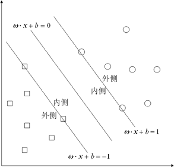
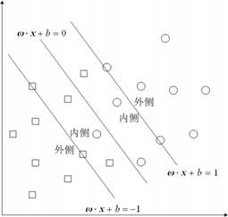
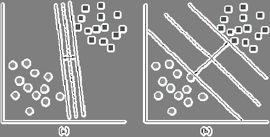

# 31、支持向量机(数学建模)

<!-- page: 1 -->

第三十一章  支持向量机
支持向量机是数据挖掘中的一项新技术，是借助于最优化方法来解决机器学习问
题的新工具，最初由V.Vapnik 等人提出，近几年来在其理论研究和算法实现等方面都
取得了很大的进展，开始成为克服“维数灾难”和过学习等困难的强有力的手段，它的
理论基础和实现途径的基本框架都已形成。
§1  支持向量分类机的基本原理

根据给定的训练集

l
l
l
Y
X
,y
x
,y
x
,y
x
T
)
(
)}
(,
),
(
),
{(
2
2
1
1
×
∈
=
L
，

其中
n
i
R
X
x
=
∈
，X 称为输入空间，输入空间中的每一个点
ix 由n 个属性特征组成，

l
i
Y
yi
,
,1
},
1,1
{
L
=
−
=
∈
。寻找
n
R 上的一个实值函数
)
(x
g
，以便用分类函数
)),
(
sgn(
)
(
x
g
x
f
=
推断任意一个模式x 相对应的y 值的问题为分类问题。

1.1  线性可分支持向量分类机

考虑训练集T ，若
n
R
∈
∃ω
，
R
b∈
和正数ε ，使得对所有使
1
=
iy
的下标i 有
ε
ω
≥
+
⋅
b
xi)
(
（这里
)
(
ix
⋅
ω
表示向量ω 和
ix 的内积），而对所有使
1
−
=
iy
的下标i 有

ε
ω
−
≤
+
⋅
b
xi)
(
，则称训练集T 线性可分，称相应的分类问题是线性可分的。

记两类样本集分别为
}
,1
|
{
T
x
y
x
M
i
i
i
∈
=
=
+
，
}
,1
|
{
T
x
y
x
M
i
i
i
∈
−
=
=
−
。定义

+
M
的凸包
)
(
conv
+
M
为

⎩
⎨
⎧
∈
=
≥
=
=
=
∑
∑

1
1
⎭
⎬
⎫

N

N

+
+

+
+
+

j
j
j
j
j
M
x
N
j
x
x
M
L
λ
λ
λ

,
;
,
,1
,0
,1
|
)
(
conv

=
=

j

j

−
M 的凸包
)
(
conv
−
M
为

⎩
⎨
⎧
∈
=
≥
=
=
=
∑
∑

1
1
⎭
⎬
⎫

N

N

−
−

−
−
−

j
j
j
j
j
M
x
N
j
x
x
M
L
λ
λ
λ

.
;
,
,1
,0
,1
|
)
(
conv

=
=

j

j

其中
+
N 表示
1
+
类样本集中样本点的个数，
−
N 表示1
−类样本集中样本点的个数，定

理1 给出了训练集T 线性可分与两类样本集凸包之间的关系。

定理1  训练集T 线性可分的充要条件是，T 的两类样本集
+
M
和
−
M 的凸包相
离。如下图所示

图1  训练集T 线性可分时两类样本点集的凸包

证明：①必要性

-761-

<!-- page: 2 -->

若T 是线性可分的，
}
,1
|
{
T
x
y
x
M
i
i
i
∈
=
=
+
，
}
,1
|
{
T
x
y
x
M
i
i
i
∈
−
=
=
−
，由线

性可分的定义可知，存在超平面
}
0
)
(:
{
=
+
⋅
∈
=
b
x
R
x
H
n
ω
 和
0
>
ε
，使得
ε
ω
≥
+
⋅
b
xi)
(
，
+
∈
∀
M
xi
且
ε
ω
−
≤
+
⋅
b
xi)
(
，
.
−
∈
∀
M
xi

而正类点集的凸包中的任意一点x 和负类点集的凸包中的任意一点'x 可分别表示为

N

N

+

−

∑

1
α
和
∑

=
=

1
'
'
β

=
=

i
ix
x

j
jx
x

i

j

N

N

+

−

其中
0
,0
≥
≥
j
i
β
α
且∑

i
1
1
α
，∑

j
1
1
β
。

=

=

=

=

i

j

于是可以得到

⎛
⋅
=
+
⋅
∑
∑
∑

⎞
⎜⎜
⎝

N

N

N

+
+
+

1
1
1
>
=
≥
+
⋅
=
+
⎟⎟
⎠

ε
α
ε
ω
α
α
ω
ω

0
)
)
((
)
(

i
i
b
x
b
x
b
x

i
i

i

=
=
=

i

i

i

⎛
⋅
=
+
⋅
∑
∑
∑

⎞
⎜⎜
⎝

N

N

N

−
−
−

1
1
1
<
−
=
−
≤
+
⋅
=
+
⎟⎟
⎠

ε
β
ε
ω
β
β
ω
ω

0
)
)
'
((
'
)'
(

j
j
b
x
b
x
b
x

j
j

j

=
=
=

j

j

j

由此可见，正负两类点集的凸包位于超平面
0
)
(
=
+
⋅
b
x
ω
的两侧，故两个凸包相离。
    ②充分性

设两类点集
+
M
，
−
M 的凸包相离。因为两个凸包都是闭凸集，且有界，根据凸集

强分离定理，可知存在一个超平面
}
0
)
(:
{
=
+
⋅
∈
=
b
x
R
x
H
n
ω
强分离这两个凸包，

即存在正数
0
>
ε
，使得对
+
M
，
−
M 的凸包中的任意点x 和'x 分别有
ε
ω
≥
+
⋅
b
x)
(

ε
ω
−
≤
+
⋅
b
x )'
(

显然特别的，对于任意的
+
∈M
xi
，有
ε
ω
≥
+
⋅
b
xi)
(
，对于任意的
−
∈M
xi
，有
ε
ω
−
≤
+
⋅
b
xi)
(
，由训练集线性可分的定义可知T 是线性可分的。

由于空间
n
R 中超平面都可以写为
0
)
(
=
+
⋅
b
x
ω
的形式，参数
)
,
(
b
ω
乘以任意一个
非零常数后得到的是同一个超平面，定义满足条件

ω

=
≥
+
⋅

⎪⎨
⎧

l
i
b
x
y

,
,1
,0
)
)
((

L

i
i

ω

=
+
⋅

=
1
)
(
min

,
,1
b
x

⎪⎩

i
l
i

L

的超平面为规范超平面。

定理2  当训练集样本为线性可分时，存在唯一的规范超平面
0
)
(
=
+
⋅
b
x
ω
，使
得

ω

=
≥
+
⋅

⎩
⎨
⎧

1;
1
)
(

y
b
x

i
i

（1）

ω

−
=
−
≤
+
⋅

1.
1
)
(

y
b
x

i
i

证明：规范超平面的存在性是显然的，下证其唯一性。
    假设其规范超平面有两个：
0
)
'
(
=
′
+
⋅
b
x
ω
和
0
)
"
(
=
′′
+
⋅
b
x
ω
。由于规范超平面满
足条件

-762-

<!-- page: 3 -->

ω

=
≥
+
⋅

⎪⎨
⎧

l
i
b
x
y

,
,
,1
,0
)
)
((

L

i
i

ω

=
+
⋅

=
.1
)
(
min

,
,1
b
x

⎪⎩

i
l
i

L

由第二个条件可知

"
'
ω
ω =
，
b
b
′′
=
′
，
或者

"
'
ω
ω
−
=
，
b
b
′′
−
=
′
.
第一个条件说明
"
'
ω
ω
−
=
，
b
b
′′
−
=
′
不可能成立，故唯一性得证。
式（1）中满足
1
)
(
±
=
+
⋅
b
xi
ω
成立的
ix 称为普通支持向量，对于线性可分的情况

来说，只有它们在建立分类超平面的时候起到了作用，普通支持向量通常只占样本集很
小的一部分，故而也说明SVM 具有稀疏性。对于
1
=
iy
类的样本点，其与规范超平面

的间隔为

ω
ω
ω
1
)
(
min

1
=
+
⋅

b
xi

，

=

yi

对于
1
−
=
iy
类的样本点，其与规范超平面的间隔为

ω
ω
ω
1
)
(
min

1
=
+
⋅

b
xi

，

−
=

yi

2 。最优超平面即意味着最大化ω
2 。如图2 所示

则普通支持向量间的间隔为ω

图2  线性可分支持向量分类机

1
)
(
±
=
+
⋅
b
x
ω
称为分类边界，于是寻找最优超平面的问题可以转化为如下的二次规
划问题

2
1
min

2

ω
               （2）

L
=
≥
+
⋅
ω

l
i
b
x
y
i
i
,
,1
1
)
)
((
.t.s

2
2
1 ω
是ω 的凸函数，并且约束条件都是线性的。

该问题的特点是目标函数

引入Lagrange 函数

-763-

<!-- page: 4 -->

l

2
))
)
((
1(
2
1
)
,
,
(
ω
α
ω
α
ω

∑

+
⋅
−
+
=

i
i
i
b
x
y
b
L

=

i

1

其中
+
∈
=
l
l
R
T
1
)
,
(
α
α
α
L
为Lagrange 乘子。根据wolfe 对偶的定义，通过对原问题

中各变量的偏导置零可得

∂
l

i
i
i
x
y
L

∑

=
=
⇒
=
∂

1
0
α
ω
ω

i

1
=
⇒
=
∂
∂
∑

l

i y
b
L
α

0
0

i

=

i

带入Lagrange 函数化为原问题的Lagrange 对偶问题

l

l

l

)
(
2
1
max

∑
∑∑

+
⋅
−

α
x
x
α
α
y
y

j
i
j
i
j
i

i

α

=
=
=

i

1
1
1

j

i

l

∑

=

0
.t.s

α
y

       （3）

i
i

=

i

1

α

=
≥

L
1
,0

,l
,
i

i

求解上述最优化问题，得到最优解
T
*
*
1
*
)
,
(
l
α
α
α
L
=
，计算

l

∑

*
α
ω

=
=

i
i
*
i
x
y

i

1

由KKT 互补条件知

0
))
)
((
1(
*
*
*
=
+
⋅
−
b
x
y
i
i
i
ω
α

可得，只有当
ix 为支持向量的时候，对应的
*
i
α 才为正，否则皆为零。选择
*
α 的一个

正分量
*
j
α ，并以此计算

l

1∑
=

⋅
−
=

j
i
*
i
i
j
*
x
x
α
y
y
b

,)
(

i

于是构造分类超平面
0
)
(
*
*
=
+
⋅
b
x
ω
，并由此求得决策函数

l

i
i
*
i
+
⋅
= ∑

α

,
)
(
)
(
*

1
b
x
x
y
x
g

=

i

得到分类函数

l

i
i
*
i
+
⋅
=
∑

α
               （4）

)
)
(
(
sgn
)
(
*

1
b
x
x
y
x
f

=

i

从而对未知样本进行分类。

1.2  线性支持向量分类机
当训练集T 的两类样本线性可分时，除了普通支持向量分布在两个分类边界

1
)
(
±
=
+
⋅
b
xi
ω
上外，其余的所有样本点都分布在分类边界以外。此时构造的超平面

是硬间隔超平面。当训练集T 的两类样本近似线性可分时，即允许存在不满足约束条
件

1
)
)
((
≥
+
⋅
b
x
y
i
i ω

-764-

<!-- page: 5 -->

的样本点后，仍然能继续使用超平面进行划分。只是这时要对间隔进行“软化”，构造
软间隔超平面。简言之就是在两个分类边界
1
)
(
±
=
+
⋅
b
xi
ω
之间允许出现样本点，这

类样本点被称为边界支持向量。显然两类样本点集的凸包是相交的，只是相交的部分较
小。线性支持向量分类机如图3 所示。

图3  线性支持向量分类机

软化的方法是通过引入松弛变量

l
i
i
,
,1
,0
L
=
≥
ξ

来得到“软化”的约束条件

,
,
,1
1
)
)
((
l
i
b
x
y
i
i
i
L
=
−
≥
+
⋅
ξ
ω

当
iξ 充分大时，样本点总是满足上述的约束条件，但是也要设法避免
iξ 取太大的

值，为此要在目标函数中对它进行惩罚，得到如下的二次规划问题

l

,
2
1
min

+ ∑

2

ξ
ω

C

i

=

i

1

ξ
ω

−
≥
+
⋅

,
1
)
)
((
s.t.

b
x
y

                             （5）

i
i
i

ξ

L
=
≥

.
,
,1
,0

l
i

i

其中
0
>
C
是一个惩罚参数。其Lagrange 函数如下

l

l

l

,
)
1
)
)
((
(
2
1
)
,
,
(

2
∑
∑
∑

i
b
x
y
C
b
L
ξ
γ
ξ
ω
α
ξ
ω
γ
α
ω
,
ξ,

−
+
−
+
⋅
−
+
=

i
i
i
i

i
i

=
=
=

i

1
1
1

i

i

其中
0
≥
iγ
，
0
>
iξ
。原问题的对偶问题如下

l

l

l

)
(
2
1
max

∑
∑∑

α
α

+
⋅
−

x
x
α
α
y
y

j
i
j
i
j
i

i

=
=
=

i

1
1
1

j

i

l

∑

α

=

0
.t.s

y

                     （6）

i
i

=

i

1

=
≤
≤

α

L
1
,
0

,l
,
i
C

i

求解上述最优化问题，得到最优解
T
*
*
1
*
)
,
(
l
α
α
α
L
=
，计算

* ∑
=
=

l

i
i
*
i
x
y
α
ω

,

i

1

选择
*
α 的一个正分量
C
*
j <
< α
0
，并以此计算

-765-

<!-- page: 6 -->

l

∑

⋅
−
=

j
i
*
i
i
j
*
x
x
α
y
y
b

1
)
(

=

i

于是构造分类超平面
0
)
(
*
*
=
+
⋅
b
x
ω
，并由此求得分类函数

l

i
i
*
i
+
⋅
=
∑

α

)
)
(
(
sgn
)
(
*

1
b
x
x
y
x
f

=

i

从而对未知样本进行分类，可见当
∞
=
C
时，就等价于线性可分的情形。
1.3  可分支持向量分类机
当训练集T 的两类样本点集重合的区域很大时，上述用来处理线性不可分问题的
线性支持向量分类机就不可用了，可分支持向量分类机给出了解决这种问题的一种有效
途径。通过引进从输入空间X 到另一个高维的Hilbert 空间H 的变换
)
(x
x
ϕ
a
将原输

入空间X 的训练集

l
l
l
Y
X
,y
x
,y
x
,y
x
T
)
(
)}
(,
),
(
),
{(
2
2
1
1
×
∈
=
L

转化为Hilbert 空间H 中的新的训练集：

)}
),
(
(
),
),
(
(
),
),
(
{(
)}
(
)
(
),
{(
2
2
1
1
2
2
1
1
l
l
l
l
y
x
y
x
y
x
,y
x
,y
x
,y
x
T
ϕ
ϕ
ϕ
=
=
L

使其在Hilbert 空间H 中线性可分，Hilbert 空间H 也称为特征空间。然后在空间H 中

求得超平面
0
))
(
(
=
+
⋅
b
x
ϕ
ω
，这个超平面可以硬性划分训练集T ，于是原问题转化为
如下的二次规划问题

2
1
min

2

ω

L
=
≥
+
⋅ϕ
ω

l
i
b
x
y
i
i
,
,1
1
)
))
(
((
.t.s

采用核函数K 满足

))
(
)
(
(
)
,
(
j
i
j
i
x
x
x
x
K
ϕ
ϕ
⋅
=

将避免在高维特征空间进行复杂的运算，不同的核函数形成不同的算法，主要的核函数
有如下几类：

⋅
=

x
x
x
x
K

)
(
)
,
(

线性内核函数

j
i
j
i

+
⋅
=

q
j
i
j
i

x
x
x
x
K

]1
)
[(
)
,
(

多项式核函数

2

−
−
=

x
x
x
x
K

j
i
j
i

}
{
exp
)
,
(

径向基核函数

σ

2

+
⋅
=

c
x
x
v
x
x
K

)
)
(
(
tanh
)
,
(

S

形内核函数

j
i
j
i

−
=

2

n

q
x
x
K

)
)
(
cos
2
1(
2
1
)
,
(

∑

傅立叶核函数

k
jk
ik
j
i

=
+
−
−

1
2

q
x
x
q

同样可以得到其Lagrange 对偶问题如下

l

l

l

)
(
2
1
max

∑
∑∑

α
α
α
α

+
⋅
−

x
x
K
y
y

j
i
j
i
j
i

i

=
=
=

i

1
1
1

j

i

l

∑

α

=

0
.t.s

y

i
i

=

i

1

α

=
≥

L
1
,0

,l
,
i

i

-766-

<!-- page: 7 -->

若K 是正定核，则对偶问题是一个凸二次规划问题，必定有解。求解上述最优化

问题，得到最优解
T
*
*
1
*
)
,
,
(
l
α
α
α
L
=
，选择
*
α 的一个正分量
*
j
α ，并以此计算

l

∑

⋅
−
=

j
i
*
i
i
j
*
x
x
K
α
y
y
b

1
)
(

=

i

构造分类函数

l

j
*
i
i
+
⋅
=
∑

)
)
(
(
sgn
)
(
*

1
b
x
x
K
α
y
x
f

=

i

从而对未知样本进行分类。

1.4  C-支持向量分类机
当映射到高维H 空间的训练集不能被硬性分划时，需要对约束条件进行软化。结
合1.2 和1.3 中所述，得到如下的模型

l

l

l

)
(
2
1
max

∑
∑∑

α
α

+
⋅
−

x
x
K
α
α
y
y

j
i
j
i
j
i

i

=
=
=

i

1
1
1

j

i

l

∑

α

=

0
.t.s

y

            (7)

i
i

=

i

1

=
≤
≤

α

L
1
,
0

,l
,
i
C

i

得到最优解
T
*
*
1
*
)
,
(
l
α
α
α
L
=
，选择
*
α 的一个正分量
C
*
j <
< α
0
，并以此计算

l

∑

⋅
−
=

j
i
*
i
i
j
*
x
x
K
α
y
y
b

1
)
(

=

i

构造决策函数

l

j
*
i
i
+
⋅
= ∑

*

1
)
(
)
(
b
x
x
K
α
y
x
g

=

i

构造分类函数

l

j
*
i
i
+
⋅
=
∑

)
)
(
(
sgn
)
(
*

1
b
x
x
K
α
y
x
f

=

i

从而对未知样本进行分类。

当输入空间中两类样本点的分布区域严重重合时，选择合适的核函数及其参数，可
以使映射到特征空间的每一类样本点的分布区域更为集中，降低两类样本点分布区域的
混合程度，从而加强特征空间中两类样本集“线性可分”的程度，来达到提高分类的精
度和泛化性能的目的。但是就核函数及其参数的选取问题，目前尚无理论依据，同样的
实验数据，采用不同的核函数，其精度往往相差很大，即便是对于相同的核函数，选取
的参数不同，分类的精度也会有较大的差别。在实际应用过程中，往往针对具体的问题
多次仿真试验，找到适合该问题的核函数，并决定其最佳参数。

下述定理给出了支持向量与Lagrange 乘子之间的关系。

定理3  对偶问题(7)的最优解为
T
*
*
1
*
)
,
,
(
l
α
α
α
L
=
，使得每个样本点
ix 满足优化

问题的KKT 条件为

1
)
(
0
*
>
⇒
=
i
i
i
x
g
y
α

1
)
(
0
*
=
⇒
<
<
i
i
i
x
g
y
C
α

-767-

<!-- page: 8 -->

1
)
(
*
<
⇒
=
i
i
i
x
g
y
C
α

其中
C
i <
<
*
0
α
，所对应的
ix 就是普通支持向量(NSV)，位于分类间隔的边界

1
)
(
±
=
x
g
上，有
1
)
(
=
ix
g
；
C
i =
*
α
所对应的
ix 就是边界支持向量(BSV)，代表了所

有的错分样本点，位于分类间隔内部，有
1
)
(
<
ix
g
。
NSV
BSV U
就是支持向量集，是

位于分类间隔两个边界上及其内部的所有训练样本集的子集。
§2  支持向量回归机

支持向量回归机在回归和函数逼近问题上有广泛的应用。考虑l 个独立同分布的样
本数据点

l
l
l
Y
X
,y
x
,y
x
,y
x
T
)
(
)}
(,
),
(
),
{(
2
2
1
1
×
∈
=
L

其中
l
i
R
Y
y
R
X
x
i
n
i
,
,1
,
,
L
=
=
∈
=
∈
。寻找x 与y 的函数
)
(x
f
y =
以便推断任意x

所对应的y 值，并且使得经验风险最小。

2.1  线性
−
ε
支持向量回归机
给定一个
0
>
ε
，线性超平面
b
x
x
f
y
+
⋅
=
=
)
(
)
(
ω
沿y 方向依次上下平移ε 所扫
过的区域构成硬
−
ε
带超平面，并且超平面满足

l
i
y
b
x
i
i
,
,1
,
)
(
L
=
≤
−
+
⋅
≤
−
ε
ω
ε

当ε 足够大时，硬
−
ε
带超平面总是存在的，而最小能使硬
−
ε
带超平面存在的ε 为

min
ε
，是下列优化问题的最优值

ε
ω
            （8）

min

,

b

L
=
≤
−
+
⋅
≤
−
ε
ω
ε

,
,1
,
)
(
s.t.

l
i
y
b
x
i
i

可见，只要选定的
min
ε
ε >
，硬
−
ε
带超平面就有无限多个，从给定的训练集T 出发，
可以构造正负两类点，

Τ
Τ
+

=
+
=

ε

l
i
y
x
D

}
,
,1
,
)
,
{(

L

i
i

                      （9）

Τ
Τ
−

=
−
=

ε

l
i
y
x
D

}
,
,1
,
)
,
{(

L

i
i

则回归问题转化为线性二分类问题。由定理4 可知硬
−
ε
带超平面与线性划分之间的关
系。

-768-

<!-- page: 9 -->

图4  三种情况下
+
D 和
−
D 的凸包分布

定理4  设上述给定的训练集T 和
0
>
ε
，考虑由（9）定义的集合
+
D 和
−
D 。则

一个超平面
b
x
x
f
y
+
⋅
=
=
)
(
)
(
ω
是硬
−
ε
带超平面的充要条件是
+
D 和
−
D 的凸包分
别位于该超平面的两侧。

证明：①必要性
对给定的
0
>
ε
，若
b
x
x
f
y
+
⋅
=
=
)
(
)
(
ω
是硬
−
ε
带超平面，据其定义可知

l
i
y
b
x
i
i
,
,1
,
)
(
L
=
≤
−
+
⋅
≤
−
ε
ω
ε

上式可以简单表示为

0
)
~
(

≥
−
−
+

ω
ε

be
A
e
y

                          （10）

0
)
~
(

≤
−
−
−

ω
ε

be
A
e
y

其中
Τ
=
)
,
,
(
~

1
ly
y
y
L
，
Τ
=
)1,
,1( L
e
，
Τ
=
)
,
,
( 1
lx
x
A
L
，
+
D 的凸包中的任意一点都可

以表示为

l

∑

Τ
Τ
Τ
Τ
+
=
=

1
)
,
(
)
,
(
ε

i
i
i
y
x
y
x
u
t
t
t

=

i

l

其中
Τ
=
)
,
,
( 1
lu
u
u
L
，且满足∑

1
1，
0
≥
iu
，
l
i
,
,1L
=
，由（10）的第一式可知

=

iu

=

i

.0
)
(
)
ˆ
(
)
(
≥
−
⋅
−
+
=
−
⋅
−
Τ
Τ
Τ
b
u
A
u
e
y
b
t
t
x
y
ω
ε
ω
            （11）

类似的，
−
D 的凸包的任意一点都可以表示为

l

∑

Τ
Τ
Τ
Τ
−
=
=

1
)
,
(
)
,
(
ε

i
i
i
y
x
y
x
v
s
s
s

=

i

l

其中
Τ
=
)
,
,
( 1
lv
v
v
L
，且满足∑

1
1，
0
≥
iv
，
l
i
,
,1 L
=
，由（10）的第二式可知

=

iv

=

i

0
)
(
)
ˆ
(
)
(
≥
−
⋅
−
−
=
−
⋅
−
Τ
Τ
Τ
b
u
A
u
e
y
b
s
s
x
y
ω
ε
ω
          （12）

由（11）和（12）可知
+
D 和
−
D 的凸包分别位于该超平面的两侧。
    ②充分性：
    任取满足

1
=
Τu
e
，
0
≥
u

的凸组合系数向量u ，则可以得到
+
D 中的一点
Τ
Τ
Τ
Τ
+
)
)
~
(,
)
((
u
e
y
u
A
ε
，与此对应，选
择满足

1
=
Τv
e
，
v
A
u
A
Τ
Τ =

-769-

<!-- page: 10 -->

的凸组合系数向量v ，则可以得到
−
D 中的一点

Τ
Τ
Τ
Τ
Τ
Τ
Τ
Τ
−
=
−
)
)
~
(,
)
((
)
)
~
(,
)
((
v
e
y
u
A
v
e
y
v
A
ε
ε

将该点与上述
+
D 中的点比较，他们的前n 个分量相同，同时超平面

b
x
x
f
y
+
⋅
=
=
)
(
)
(
ω

分离两个集合
+
D 和
−
D 的凸包，则可知他们的第
1
+
n
个分量满足

0
)
~
(
)
~
(
≥
−
−
+
Τ
Τ
v
e
y
u
e
y
ε
ε
由此可见，关于变量
v
u,
的不等式组

⎧

Τ
Τ

=

v
A
u
A

⎪
⎪

Τ
Τ

=
=

v
e
u
e

1

⎨

0
0
0
)
~
(
)
~
(

Τ
Τ

<
−
−
+

ε
ε

v
e
y
u
e
y

⎪
⎪

≥
≥

v
u

,

⎩

无解，不难证明

⎧

Τ
Τ

=

v
A
u
A

⎪
⎪

Τ
Τ

=
=

v
e
u
e

1

⎨

0
0
1
)
~
(
)
~
(

Τ
Τ

−
=
−
−
+

ε
ε

v
e
y
u
e
y

⎪
⎪

≥
≥

v
u

,

⎩

无解，由择一定理知不等式组

0
)
~
(

≥
−
−
+

ω
ε

be
A
e
y

0
)
~
(

≤
−
−
−

ω
ε

be
A
e
y

有解，即超平面
b
x
x
f
y
+
⋅
=
=
)
(
)
(
ω
是硬
−
ε
带超平面。

    定理4 说明寻找训练集T 的最优硬
−
ε
带超平面等价于集合
+
D 和
−
D 的最优分类
超平面。于是可以得到如下的最优化问题

2
1
min

2

ω

=
≤
+
⋅
−

ε
ω

,
,1
,
)
)
((
.t.s

l
i
b
x
y

L

               （13）

i
i

ε
ω

=
≥
−
+
⋅

,
,1
,
)
)
((

l
i
y
b
x

L

i
i

其中
n
R
∈
ω
，
R
b∈
。（13）的解存在的前提是
min
ε
ε >
，而
min
ε
就为最优解。定理5
给出了两者之间的联系。
    定理5  若
min
ε
ε >
，且
min
ε
是优化问题（8）的最优值，则（13）的解存在，并

且对于ω 的解唯一，即若
)
,
(
*
1
*
1 b
ω
，
)
,
(
*
2
*
2 b
ω
都是解，则
*
2
*
1
ω
ω =
。

    证明：若
min
ε
ε >
，则问题（13）的可行域非空，又因为该问题是凸的，所以一定
有解，解的存在性即证。

下证解的唯一性。设
)
,
(
*
1
*
1 b
ω
，
)
,
(
*
2
*
2 b
ω
是问题（13）的两个最优解，显然

r
=
=
*
2
*
1
ω
ω

-770-

<!-- page: 11 -->

*
2
*
1
ω
ω
ω
+
=
，
2

*
1
*
1
b
b
b
+
=
，则
)
,
(
b
ω

其中r 是一个常数，则有
*
2
*
1
λω
ω =
，
1
=
λ
。令
2

是问题（13）的可行解，从而有

r
r
=
+
≤
≤
*
2
*
1
2
1
2
1
ω
ω
ω

上式说明
r
=
ω
，当
1
−
=
λ
时，
0
=
ω
，即
0
=
= ω
r
，则有
0
=
=
*
2
*
1
ω
ω
；若
1
=
λ
，

则有
*
2
*
1
ω
ω =
，故解的唯一性得证。
    引入Lagrange 函数

l

l

2
)
(
)
)
(
(
)
)
(
(
2
1
)
,
(
ω
ε
α
ω
ε
α
ω
α
ω,

∑
∑

∗
+
⋅
+
−
−
−
⋅
−
+
−
=

*

i
i
i
b
x
y
b
x
y
b
L

i
i

i
1

=
=

i

1

i

其中
0
)
,
,
,
,
(
*
*
1
1
)
(
≥
=
Τ
∗

l
l α
α
α
α
α
L
为Lagrange 乘子，根据Wolfe 对偶的定义，分别对
ω ，b 求偏导置零得到

∂

l

x
L

∑

=
−
−
=
∂

α
α
ω
ω

*

0
)
(

i
i
i

=

i

1

=
−
=
∂
∂

l

b
L

∑

α
α

*

0
)
(

i
i

=

i

1

带入Lagrange 函数，得到（13）的对偶问题如下

l

l

l

l

)
(
)
(
)
)(
)(
(
2
1
min

∑
∑
∑∑

α
α
α
α
ε
α
α
α
α
α

−
−
−
+
⋅
−
−

*
*

*

*

j
i
j
j
i
i
R
y
x
x
l

i
i

i
i
i

2
(*)

=
=
=
=
∈

i

1
1

j

i

1

i

1

l

∑

α
α

=
−

*

0
)
(
s.t.

 （14）

i
i

=

i

1

Τ

α
α
α
α
α

≥
=

*
*
1
1
(*)

0
)
,
,
,
,
(

L

l
l

    对于给定的训练样本集T ，首先选择适当的精度
0
>
ε
，构造并求解优化问题（14），

得到最优解
Τ
∗=
)
,
,
,
,
(
*
*
1
1
)
(

l
l α
α
α
α
α
L
，其中只有支持向量对应的
i
α 或
*
i
α 非零，计算

l

∑

*
)
(
α
α
ω

−
=

i
i
i
x

=

i

1

选择
(*)
α
的正分量
0
>
j
α
，计算

ε
ω
+
⋅
−
=
)
(
j
j
x
y
b

或选择
(*)
α
的正分量
0
* >
j
α
，计算

ε
ω
−
⋅
−
=
)
(
j
j
x
y
b

l

i
i
i
+
⋅
−
=
+
⋅
=
∑

*
)
)(
(
)
(
α
α
ω
，即可对未知样本进行预测。

构造决策函数
b
x
x
b
x
y

=1

i

2.2
−
ε
支持向量回归机

当构造的两类样本
+
D ，
−
D 线性不可分时，通过对硬间隔的软化和引入罚参数，
同样可以考虑在高维空间构造超曲面来达到回归的目的。
    对于给定的训练样本集T ，选择合适的精度参数
0
>
ε
，罚参数
0
>
C
以及合适的

-771-

<!-- page: 12 -->

核函数
)'
,
(
x
x
K
。
构造并求解优化问题

l

l

l

)
(
)
(
)
,
(
)
)(
(
2
1
min

∑
∑
∑

α
α
α
α
ε
α
α
α
α
α

−
−
−
+
−
−

*
*

*

*

y
x
x
K

j
i
j
j
i
i
R l

i
i

i
i
i

2
(*)

=
=
=
∈

j
i

1
,

i

1

i

1

l

∑

α
α

=
−

*

0
)
(
s.t.

 （15）

i
i

=

i

1

l
i
l
C

L
=
≤
≤

α
α

*

,
,1
,
,
0

i
i

得到最优解
Τ
∗=
)
,
,
,
,
(
*
*
1
1
)
(

l
l α
α
α
α
α
L
，选择
(*)
α
的正分量
0
>
j
α
，计算

l

ε
α
α
∑

+
−
−
=

*
)
(
)
(
,

j
i
i
i
j
x
x
K
y
b

=

i

1

或选择
(*)
α
的正分量
0
* >
j
α
，计算

l

ε
α
α
∑

−
−
−
=

*
)
(
)
(
,

j
i
i
i
j
x
x
K
y
b

=

i

1

l

i
i
i
+
−
=∑

*
)
,
(
)
(
α
α
，即可对未知样本进行预测。

构造决策函数
b
x
x
K
y

=1

i

如下定理给出了样本点与Lagrange 乘子之间的关系。

定理6  若样本
)
,
(
i
i y
x
在
−
ε
带内部，则
0
*
=
=
i
i
α
α
。

若样本
)
,
(
i
i y
x
在
−
ε
带的边界上，则
]
,0
[
*
l
C
i ∈
α
，
0
=
i
α
；或
0
* =
i
α
，
]
,0
[
l
C
i ∈
α
。

若样本
)
,
(
i
i y
x
在
−
ε
带的外部，则
l
C
i =
*
α
，
0
=
i
α
；或
0
* =
i
α
，
l
C
i =
α
。

可见，在
−
ε
带内部的样本点都不是支持向量，它们对决策函数没有贡献，并且它
们在样本集中的比例较大。
§3  乳腺癌的诊断
    3.1  问题的提出

乳腺肿瘤通过穿刺采样进行分析可以确定其为良性的或为恶性的。医学研究发现
乳腺肿瘤病灶组织的细胞核显微图像的10 个量化特征：细胞核直径、质地、周长、面
积、光滑度、紧密度、凹陷度、凹陷点数、对称度、断裂度与该肿瘤的性质有密切的关
系。现试图根据已获得的实验数据建立起一种诊断乳腺肿瘤是良性还是恶性的方法。数
据来自已确诊的500 个病例，每个病例的一组数据包括采样组织中各细胞核的这10 个
特征量的平均值、标准差和最坏值共30 个数据，并将这种方法用于另外69 名已做穿刺
采样分析的患者。

这个问题实际上属于模式识别问题。什么是模式呢？广义地说，在自然界中可以
观察的事物，如果我们能够区别它们是否相同或是否相似，都可以称之为模式。人们为
了掌握客观事物，按事物相似的程度组成类别。模式识别的作用和目的就在于面对某一
具体事物时将其正确地归入某一类别。

模式识别的方法很多，如数理统计方法、聚类分析方法等。
3.2  支持向量机的分类模型

-772-

<!-- page: 13 -->

支持向量机（Sport Vector Machine ,以下简称SVM）是一种基于统计学习理论的
模式识别方法。在模式识别等领域获得了广泛的应用。其主要思想是这样：找到一个超
平面，使得它能够尽可能多的将两类数据点正确地分开，同时使分开的两类数据点距离
分类面最远，如图5（b）。

      图5  最佳超平面示意图

记n（这里
500
=
n
）个已知观测样本为
)
,
(,
),
,
(
),
,
(
2
2
1
1
n
n g
t
g
t
g
t
L
。其中
30
R
ti ∈
，
1
=
ig
为良性肿瘤，
1
−
=
ig
为恶性肿瘤。

（1）样本线性或非线性可分

    我们要找一个最优分类面
0
=
+ b
x
wT
，其中
30
,
R
x
w
∈
，
R
b∈
，
b
w,
待定，满
足如下条件：

⎩
⎨
⎧

=
≥
+

i
i
T

g
b
t
w

1
,1

时

−
=
−
≤
+

g
b
wt

1
,1

时

i
i

即有
1
)
(
≥
−b
wt
g
i
i
，其中，满足方程
1
±
=
+ b
t
w
i
T
的样本称为支持向量。

要使两类总体到分类面的距离最大，则有

2
2
1
min
2
max
w
w ⇒

于是建立SVM 的数学模型如下：

模型1

2
2
1
min
w

s.t.
1
)
(
≥
+ b
t
w
g
i
T
i
，
n
i
,
,2,1
L
=

求得最优值对应的
*
*,b
w
，可得分类函数：

)
sgn(
)
(
*
*
b
x
w
x
g
T
+
=
模型1 是一个二次规划模型。下面把模型1 化为其对偶问题。
    定义广义拉格朗日函数

n

2
)]
(
1[
2
1
)
,
(
α
α

∑

+
−
+
=

i
T
i
i
b
t
w
g
w
w
L

=

i

1

其中
T
n)
,
,
(
1
α
α
α
L
=
，
0
≥
i
α
。

由Karush-Kuhn-Tucker 互补条件，通过对w 和b 求偏导可得

1
=
−
=
∂
∂
∑

n

i
i
i
t
g
w
w
L
α

0

=

i

-773-

<!-- page: 14 -->

1
=
=
∂
∂
∑

n

i
ig
b
L
α

0

=

i

n

n

得
∑

1
=
∑

=
=

1
α
，
0

i
ig
α
，代入原始拉格朗日函数得

i
i
i
t
g
w

=

i

i

n

n

n

1
1
1
)
(
2
1
α
α
α

∑∑
∑

⋅
−
=

i
t
t
g
g
L

j
i
j
i
j
i

=
=
=

i

i

j

其中
)
(
j
i x
x ⋅
表示向量的内积

于是模型1 可以化为
模型2

n

n

n

1
1
1
)
(
2
1
max
α
α
α

∑∑
∑

⋅
−

i
t
t
g
g

j
i
j
i
j
i

=
=
=

i

i

j

⎧

n

=
∑

α

0
.
s.t
1
L
α

g

⎪⎨

i
i

=

i

⎪⎩

=
≤

,
,2,1
,
0

n
i

i

n

解此二次规划得到最优解
*
α ，从而得权重向量
∑

*
*
α
。

=
=

i
i
i
t
g
w

i

1

    由KKT 互补条件知

0
)]
)
((
1[
*
*
*
=
+
⋅
−
b
t
w
g
i
i
i
α

这意味着仅仅是支持向量（距离分类超平面为1）的输入点it ，使得
*
i
α 为正，所有其

它样本对应的
*
i
α 均为零。选择
*
α 的一个正分量
*
j
α ，并以此计算

n

i
j
t
t
g
g
b
⋅
−
=
∑

α

)
(
*

*
j
i
i

=

i

1

最终的分类函数表达式如下：

)
sgn(
)
(
*
*
b
x
w
x
g
T
+
=

实际上，模型2 中的
)
(
j
i t
t ⋅
是核函数的线性形式。核函数可以将原样本空间线性

不可分的向量转化到高维特征空间中线性可分的向量。以下是核函数的一些常用形式：

„ 线性内核
y
x
y
x
K
⋅
=
)
,
(

„ 径向基函数内核
q
y
x
y
x
K
]1
)
[(
)
,
(
+
⋅
=

y
x
y
x
K
−
−
=

2

„ 多项式内核
}
|
|
exp{
)
,
(
2

σ

„ S 形内核
)
)
(
tanh(
)
,
(
c
y
x
v
y
x
K
+
⋅
=

将模型2 换成一般的核函数
)
,
(
y
x
K
，可得一般的模型：
模型3

n

n

n

1
1
1
)
,
(
2
1
max
α
α
α

∑∑
∑

−

i
t
t
K
g
g

j
i
j
i
j
i

=
=
=

i

i

j

-774-

<!-- page: 15 -->

⎧

n

=
∑

α

0
s.t.
1
L
α

g

⎪⎨

i
i

=

i

⎪⎩

=
≤

,
,2,1
,
0

n
i

i

分类函数表达式：

n

i
i
i
+
=
∑

α

*
b
x
t
K
g
x
g

)
)
,
(
sgn(
)
(
*

=

i

1

（2）样本不可分时的软间隔处理。
引入松弛变量ξ ，其作用在于允许较少数量的样本被错误划分。这种处理方法称为
软间隔。控制这个错误程度的参数为c ，于是模型1 修改为

模型4

n

2
2
1
min
ξ

∑

=
+

i
c
w

i

1

⎩
⎨
⎧

−
≥
+

ξ

i
i
T
i

b
t
w
g

1
)
(

s.t.

L
ξ

=
≥

,
1,2,
,0

n
i

i

求得最优值对应的
*
*,b
w
，可得分类函数：

)
sgn(
)
(
*
*
b
x
w
x
g
T
+
=
对应地，模型3 改造得到
模型5

n

n

n

1
1
1
)
,
(
2
1
max
α
α
α

∑∑
∑

−

i
t
t
K
g
g

j
i
j
i
j
i

=
=
=

i

i

j

⎧

n

=
∑

α

g

0

⎪⎨

i
i

s.t.

=

i

1
L
α

⎪⎩

=
≤
≤

,
,2,1
,
0

n
i
c

i

注意到其只是在模型3 的基础上约束
c
i ≤
≤α
0
。分类函数表达式：

n

i
i
i
+
=
∑

α

*
b
x
x
K
g
x
g

)
)
,
(
sgn(
)
(
*

=

i

1

应用支持向量机时，可以按照线性可分、线性不可分、非线性可分、非线性不可分
的顺序求解。

3.3  分类模型的求解
对于给定的500 个训练样本，利用Matlab 的优化工具箱，求解模型1，得到最优

解
*
*,b
w
。说明两类样本点是线性可分的，且对已知样本点，支持向量机的分类方法错
判率为0。

把69 个测试样本
69
,
,2,1
,
~
L
=
j
tj
，代入分类函数
)
sgn(
)
(
*
*
b
x
w
x
g
T
+
=
，按如

下规则分类：

1
)
~
(
=
jt
g
，第j 个样本点为良性肿瘤

1
)
~
(
−
=
jt
g
，第j 个样本点为恶性肿瘤

求解结果见表1。

-775-

<!-- page: 16 -->

                     表1  分类结果

良  性
恶  性

1
3
5
6
7
8
9
11
12

2
4
10
13
15
17
18
22
29

14
16
19
20
21
23
24
25
26

34  36
37
42
63
64
65
66
67

27
28
30
31
32
33
35
38
39

68

40
41
43
44
45
46
47
48
49

50
51
52
53
54
55
56
57
58

59
60
61
62
69

注：这里的数字代表病例序号。
    计算的Matlab 程序如下：
%原始数据中的B 替换成1，M 替换成-1，X 替换成2，删除了分割符*
clc,clear
load cancerdata.txt;
can=cancerdata;
can(:,1)=[];  %删除第一列病例号
gdb=find(can(:,1)==1);  %读出良性肿瘤的序号
n1=length(gdb);   %计算良性肿瘤样本点的个数
bdb=find(can(:,1)==-1); %读出恶性肿瘤的序号
n2=length(bdb);   %计算恶性肿瘤样本点的个数
gd=can(gdb,2:end);  %提出良性肿瘤的数据
bd=can(bdb,2:end);  %提出恶性肿瘤的数据
xd=can([501:569],[2:end]); %提出待分类数据
H=eye(31);H(31,31)=0;  %w,b 总共31 个待定参数，b 对应最后一个参数
ga=[gd,ones(n1,1)];  %良性样本点对应的系数矩阵
ba=[bd,ones(n2,1)];  %恶性样本点对应的系数矩阵
a=[-ga;ba];  %线性不等号约束的系数矩阵
b=-ones(500,1); %线性不等号约束的右端项
[wb,fval,flag]=quadprog(H,[],a,b)  %调用二次规划命令
xdf=[xd,ones(69,1)];
g=xdf*wb;   %计算ｗ'*x+b 的值
g1=find(g>0)'   %良性样本序号
g2=find(g<0)'   %恶性样本序号

模型2 的Matlab 计算程序如下：
function svm1
clc,clear
global N
load cancerdata.txt;
can=cancerdata;
can(:,1)=[];  %删除第一列病例号
gdb=find(can(:,1)==1);  %读出良性肿瘤的序号
n1=length(gdb);   %计算良性肿瘤样本点的个数
bdb=find(can(:,1)==-1); %读出恶性肿瘤的序号
n2=length(bdb);   %计算恶性肿瘤样本点的个数
gd=can(gdb,2:end);  %提出良性肿瘤的数据

-776-

<!-- page: 17 -->

bd=can(bdb,2:end);  %提出恶性肿瘤的数据
xd=can([501:569],[2:end]); %提出待分类数据
X=[gd;bd];     %重新排序后的训练样本
N=size(X,1);
gb=[ones(n1,1);-ones(n2,1)]; %g_i 的取值向量
a0=eps*ones(N,1); %eps 为Matlab 中最小的正数
C=1;  %人为地设定参数的取值范围
[a,fval,flag]=fmincon(@qfun,a0,[],[],gb',0,zeros(N,1),C*ones(N,1),[],[],X,gb)
w=X'*(a.*gb)   %计算w'*x+b=0 中的w
b=sum(diag(a)*(X*w0-gb))/sum([a>10*eps])  %计算w'*x+b=0 中的b
save dwb w b
function y=qfun(a,X,gb);  %定义非线性规划的目标函数
global N
y=-ones(1,N)*a+0.5*a'*diag(gb)*X*X'*diag(gb)*a;

模型3 的Matlab 计算程序如下：
%原始数据中的B 替换成1，M 替换成-1，X 替换成2，删除了分割符*
clc,clear
load cancerdata.txt;
can=cancerdata;
can(:,1)=[];  %删除第一列病例号
gdb=find(can(:,1)==1);  %读出良性肿瘤的序号
n1=length(gdb);   %计算良性肿瘤样本点的个数
bdb=find(can(:,1)==-1); %读出恶性肿瘤的序号
n2=length(bdb);   %计算恶性肿瘤样本点的个数
gd=can(gdb,2:end);  %提出良性肿瘤的数据
bd=can(bdb,2:end);  %提出恶性肿瘤的数据
xd=can([501:569],[2:end]); %提出待分类数据
hd=[gd;bd];     %重新排序后的训练样本
N=size(hd,1);
basefun=@(x,y) (x*y'+1).^2;  %定义多项式核函数的匿名函数
gb=[ones(n1,1);-ones(n2,1)]; %g_i 的取值向量
H=gb*gb'.*basefun(hd,hd); %定义二次规划目标函数的二次项系数矩阵
f=-ones(N,1);  %定义二次规划目标函数的一次项系数列向量
aeq=gb';   %定义二次规划的线性等号约束矩阵
[alpha,fval,flag]=quadprog(H,f,[],[],aeq,0,zeros(N,1),ones(N,1))
模型2 和模型3 的Matlab 程序计算时间很长，必须寻找一些更好的算法。

习题三十一
1．蠓虫分类问题：生物学家试图对两种蠓虫（Af 与Apf）进行鉴别，依据的资料
是触角和翅膀的长度，已经测得了9 支Af 和6 支Apf 的数据如下：

Af：(1.24,1.27)，(1.36,1.74)，(1.38,1.64)，(1.38,1.82)，(1.38,1.90)，(1.40,1.70)，

(1.48,1.82)，(1.54,1.82)，(1.56,2.08)
Apf：(1.14,1.82)，(1.18,1.96)，(1.20,1.86)，(1.26,2.00)，(1.28,2.00)，(1.30,1.96)

-777-

<!-- page: 18 -->

现在的问题是：
（i）根据如上资料，如何制定一种方法，正确地区分两类蠓虫。
（ii）对触角和翼长分别为(1.24,1.80)，(1.28,1.84)与(1.40,2.04)的3 个标本，用所得
到的方法加以识别。

2．考虑下面的优化问题

n

n

∑
∑

2
2
1
1
2
min
ξ
ξ

+
+

i
c
c
w

i

=
=

i

i

1

s.t.
i
i
i
b
x
w
g
ξ
−
≥
+
⋅
1
)
)
((
，
n
i
,
,2,1
L
=

0
≥
iξ
，
n
i
,
,2,1
L
=

讨论参数
1c 和
2c 变化产生的影响。导出对偶表示形式。

-778-
