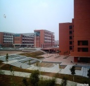
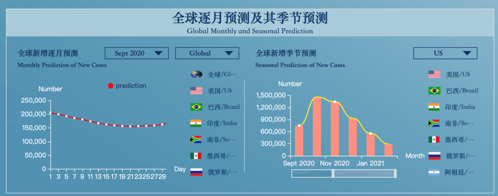
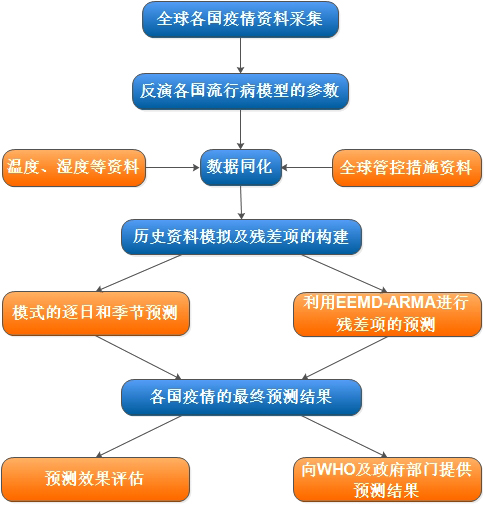
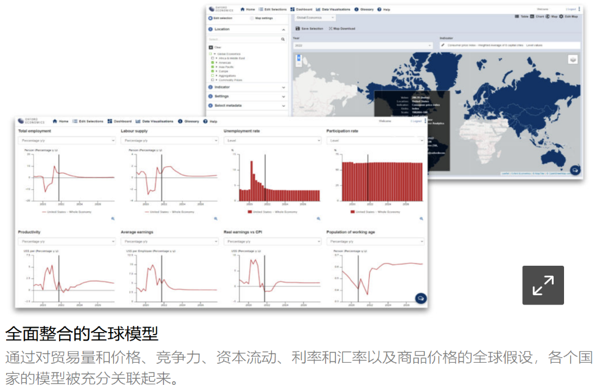
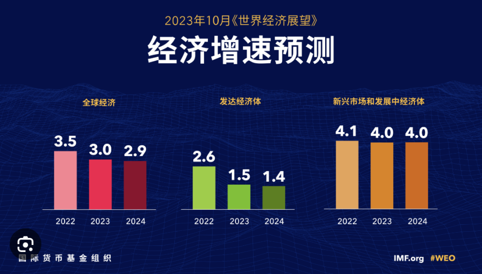
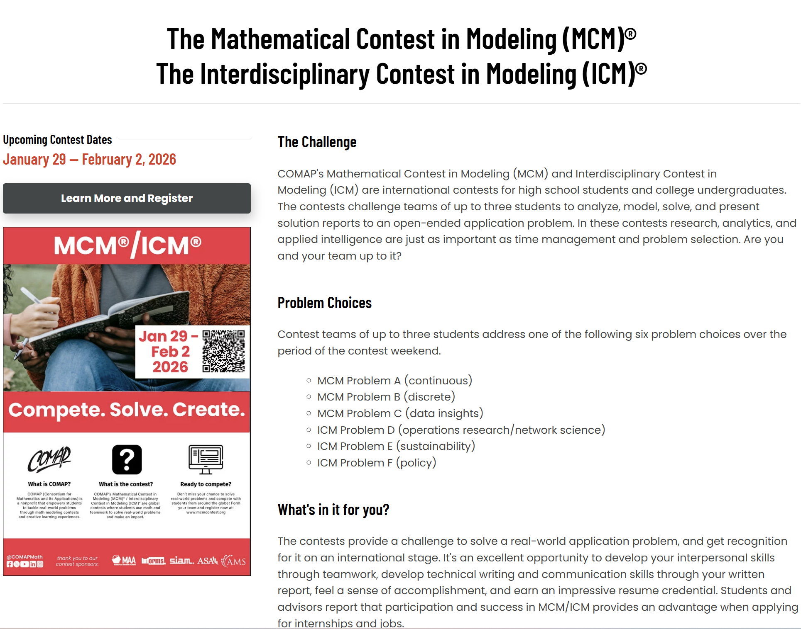

# 1-数学建模绪论

<!-- slide: 1 -->

- 数学建模与实验
- 汪秀敏
- 计算机科学与工程学院
- xmwang@scut.edu.cn

<!-- slide: 2 -->

- 课程简介

- 数学建模在民生、经济等各个领域起到了重要作用！

<!-- slide: 3 -->

- 课程简介

- 卡脖子问题亟需突破
- 中美竞争使我国计算机专业发展需从“拿来主义”向“自我创新”转变
- 目标：以立德树人为根本任务，为国家培养创新型人才，有为国家攻克卡脖子瓶颈难题的志向和担当

<!-- slide: 4 -->

- 课程简介
- 课程介绍：24理论课时+16实验课时

- 专业选修课，本科生参加数学建模竞赛的辅导课程。
- 学习如何将实际问题转化为数学问题。又如何把数学问题的解转化为实际问题的解。
- 通过对数学模型和数学建模有关问题的论述和模型实例的介绍，使学生应用数学解决实际问题的能力有所提高。
- 课程用途
- 参加数学建模竞赛, 科学研究, 工程应用…
- 课程要求
- 基础知识: 微积分、微分方程、线性代数、概率统计等
- 软件: 熟练掌握一门及以上运算软件,如Matlab, Lingo, C++, python等
- 学会撰写科学论文

<!-- slide: 5 -->

- 课程简介

- [1] 《数学建模》（A First Course in Mathematical Modeling)，叶其孝，姜启源等译，机械工业出版社
- [2] 《数学模型》，姜启源主编，  高等教育出版社
- [3]   A First Course in Mathematical Modeling
- 推荐参考书
- 课程考核
- 1）平时成绩 (50%)：出勤+作业+实验
- 2）课程报告 (50%)：完成一道数模(模拟)比赛题

<!-- slide: 6 -->

- 数模竞赛

- CUMCM网站: http://www.mcm.edu.cn/
- 国际数学模型网：http://www.mathmodels.org/
- MCM和ICM网站: http://www.comap.com/, https://www.comap.com/contests/mcm-icm
- 数学建模竞赛(MCM)

<!-- slide: 7 -->

- 数模竞赛

<!-- slide: 8 -->

- 数模竞赛

- O奖(特等奖)约0.1~0.2%
- F奖(O提名奖)约1-2%
- M奖(一等奖)约6-7%
- H奖(二等奖)约15~23%
- S奖(优秀奖)约65%

<!-- slide: 9 -->

- 数模竞赛

<!-- slide: 10 -->

- 数学建模历年国赛赛题模型

| 年份 | 赛题 | 真题 | 问题类型 | 对应模型或算法 |
|---|---|---|---|---|
|    2020年 | A题 | 炉温曲线 | 机理分析类 | 热传导方程、差分法、多目标优化、模拟退火 |
|  | B题 | 穿越沙漠 | 优化类 | 蒙特卡洛、动态规划、博弈论、马尔可夫链 |
|  | C题 | 中小微企业的信贷策略 | 优化类 | 主成分分析、遗传算法、多目标优化 |
|  | D题 | 接触式耳郭仪的自动标注 | 机理分析类 | 线性回归、拟合分析 |
|  | E题 | 校园供水系统智能管理 | 评价优化类 | 0-1规划、BP神经网络 |
|    2021年  | A题 | “FAST”主动反射面的形状调节 | 机理分析类 | 反射原理、优化算法 |
|  | B题 | 乙醇耦合制备C4烯 | 评价优化类 | 回归分析、层次分析、模糊综合评价法 |
|  | C题 | 生产企业原材料的订购与运输 | 评价优化类 | 量化分析、目标规划或遗群等优化算法 |
|  | D题 | 连铸切割的在线优化 | 优化类 | 特征工程，机器学习预测、分类、多目标优化 |
|  | E题 | 中药材的鉴别 | 分类 | 主成分分析、聚类分析 |
|    2022年  | A题 | 波浪能最大输出功率设计 | 机理分析类 | 微分方程、单目标规划、遗传算法 |
|  | B题 | 无人机遂行编队飞行中的纯方位无源定位 | 机理分析类 | 遍历算法、迭代算法、贪心等策略 |
|  | C题 | 古代玻璃制品的成分分析与鉴别 | 聚类分析 | 决策树、灰色关联分析、卡方检验、SVM算法 |
|  | D题 | 气象报文信息卫星通信传输 | 机理分析类 | 对称性原则、信息传输率最大化原则 |
|  | E题 | 小批量物料的生产安排 | 预测与优化 | 时间序列分析、三次指数平滑、优化模型 |
|    2023年  | A题 | 定日镜场的优化设计 | 机理分析类 | 热功率理论、优化模型、蒙特卡洛、遗传算法 |
|  | B题 | 多波束测线问题 | 机理分析类 | 空间几何、多目标优化、贪心、模拟退火等 |
|  | C题 | 蔬菜类商品的自动定价与补货决策 | 数理统计类 | LSTM模型，VAR模型、模拟退火、聚类 |
|  | D题 | 圈养湖羊的空间利用率 | 优化类 | 遍历算法、蒙特卡洛、遗传算法 |
|  | E题 | 黄河水沙检测数据分析 | 控制预测类 | 数学规划、灰色预测、SARIMA模型等 |

<!-- slide: 11 -->

- 数学建模历年国赛赛题模型

| 年份 | 赛题 | 真题 | 问题类型 | 对应模型或算法 |
|---|---|---|---|---|
|    2024年 | A题 | “板凳龙”闹元宵 | 机理分析类 | 几何模型、动力学模拟、数学规划等 |
|  | B题 | 生产过程中的决策问题 | 决策优化类 | 概率统计、决策树、数学规划、蒙特卡洛等 |
|  | C题 | 农作物的种植策略 | 优化类 | 多目标优化、动态规划、不确定性分析、蒙特卡洛 |
|  | D题 | 反潜航空深弹命中概率问题 | 概率与优化 | 概率、立体几何、智能优化算法 |
|  | E题 | 交通流量管控 | 控制预测类 | 预测类、数学规划 |

<!-- slide: 12 -->

- 优化问题：数学规划、动态规划、经典算法与智能优化算法（模拟退火、遗传算法等）、图论等
- 预测问题：回归分析、马尔可夫预测、灰色预测、时间序列预测、神经网络预测、微分方程预测等
- 评价问题：灰色关联分析、层次分析法、主成分分析法等
- 统计分析：聚类算法、回归分析、关联分析、方差分析，决策树
- 常用数学模型

<!-- slide: 13 -->

- 写作软件：Latex，Word
- 数学规划： Python，Matlab等
- 数据分析： SPSS，Excel
- 其他编程软件：Java，Python，C++等
- 画图软件：Visio， Powerpoint，Matlab， Python等
- 常用软件

- Latex共享编辑：https://www.overleaf.com/login?

<!-- slide: 14 -->

- 第一章 建立数学模型

- 1.1   从现实对象到数学模型
- 1.2   数学建模的重要意义
- 1.3   数学建模示例
- 1.4   数学建模的方法和步骤

<!-- slide: 15 -->

- 什么是数学模型
- 1.1 从现实对象到数学模型
- (航行问题)甲乙两地相距750千米，船从甲到乙顺水航行需30小时，从乙到甲逆水航行需50小时，问船的速度是多少?
- 假设速度恒定，用 x 表示船速，y 表示水速，列方程：
- 答：船速每小时20千米/小时.
- x =20
- y =5
- 求解

<!-- slide: 16 -->

- 1.1 从现实对象到数学模型
- 数学模型(Mathematical Model)
- 数学建模(Mathematical Modeling)
- 对于一个现实对象，为了一个特定目的，
- 根据其内在规律，作出必要的简化假设，
- 运用适当的数学工具，得到的一个数学结构。
- 建立数学模型的全过程
- （包括表述、求解、解释、检验等）

<!-- slide: 17 -->

- 1.2 数学建模的重要意义
- 在一般工程技术领域，数学建模仍然大有用武之处
- 在高新技术领域，数学建模几乎是必不可少的工具
- 数学进入一些新领域，开拓了新的处女地
- 数学建模
- 计算机技术
- +
- 分析与设计
- 预报与决策
- 控制与优化
- 规划与管理

<!-- slide: 18 -->

- 1.3 数学建模示例
- 例1、四脚呈正方形椅子能在不平的地面上放稳吗？
- 问题分析
- 模型假设
- 通常 ~ 三只脚着地
- 放稳 ~ 四只脚着地
- 四条腿一样长，椅脚与地面点接触，四脚连线呈正方形;
- 地面高度连续变化，可视为数学上的连续曲面;
- 地面相对平坦，使椅子在任意位置至少三只脚同时着地。

<!-- slide: 19 -->

- 1.3 数学建模示例
- 模型构成
- 用数学语言把椅子位置和四只脚着地的关系表示出来
- 椅子位置
- x
- B
- A
- D
- C
- O
- D´
- C ´
- B ´
- A ´
- 用(对角线与x轴的夹角)表示椅子位置
- 四只脚着地
- 距离是的函数
- 四个距离(四只脚)
- A,C 两脚与地面距离之和 ~ f()
- B,D 两脚与地面距离之和 ~ g()
- 两个距离
- 
- 椅脚与地面距离为零
- 正方形ABCD
- 绕O点旋转
- 正方形对称性

<!-- slide: 20 -->

- 1.3 数学建模示例
- 模型构成
- 用数学语言把椅子位置和四只脚着地的关系表示出来
- f() , g()是连续函数
- 对任意, f(), g()至少一个为0
- 数学问题
- 已知： f() , g()是连续函数 ;
- 对任意，  f() • g()=0 ;
- 假设g(0)=0， f(0) > 0(或f(0)=0， g(0) > 0 )。
- 证明：存在0，使f(0) = g(0) = 0.
- 地面为连续曲面
- 椅子在任意位置至少三只脚着地

<!-- slide: 21 -->

- 1.3 数学建模示例
- 模型求解
- 给出一种简单、粗糙的证明方法
- 将椅子旋转900，对角线AC和BD互换。
- 由g(0)=0， f(0) > 0 ，知f(/2)=0 , g(/2)>0.
- 令h()= f()–g(), 则h(0)>0和h(/2)<0.
- 由 f, g的连续性知 h为连续函数,  据连续函数的基本性质, 必存在0 , 使h(0)=0,  即f(0) = g(0) .
- 因为f() • g()=0, 所以f(0) = g(0) = 0.
- 评注和思考
- 建模的关键 ~
- 考察四脚呈长方形的椅子？
- 和 f(), g()的确定
- x
- B
- A
- D
- C
- O
- D´
- C ´
- B ´
- A ´
- 

<!-- slide: 22 -->

- 1.4 数学建模的方法和步骤
- 数学建模的基本方法
- 机理分析
- 测试分析
- 根据对客观事物特性的认识，
- 找出反映内部机理的数量规律
- 将对象看作“黑箱”,通过对数据的统计
- 分析，找出与数据拟合最好的模型
- 机理分析没有统一的方法，主要通过实例研究
- (Case Studies)来学习。
- 二者结合
- 用机理分析建立模型结构,
- 用测试分析确定模型参数

<!-- slide: 23 -->

- 1.4 数学建模的方法和步骤
- 数学建模的一般步骤
- 模型准备
- 模型假设
- 模型构成
- 模型求解
- 模型分析
- 模型检验
- 模型应用
- 模
- 型
- 准
- 备
- 了解实际背景
- 明确建模目的
- 搜集有关信息
- 掌握对象特征
- 形成一个
- 比较清晰
- 的问题

<!-- slide: 24 -->

- 1.4 数学建模的方法和步骤
- 数学建模的一般步骤
- 模型准备
- 模型假设
- 模型构成
- 模型求解
- 模型分析
- 模型检验
- 模型应用
- 模
- 型
- 假
- 设
- 针对问题特点和建模目的
- 作出合理的、简化的假设
- 在合理与简化之间作出折中

<!-- slide: 25 -->

- 1.4 数学建模的方法和步骤
- 数学建模的一般步骤
- 模型准备
- 模型假设
- 模型构成
- 模型求解
- 模型分析
- 模型检验
- 模型应用
- 模
- 型
- 构
- 成
- 用数学的语言、符号描述问题
- 发挥想像力
- 使用类比法
- 尽量采用简单的数学工具

<!-- slide: 26 -->

- 1.4 数学建模的方法和步骤
- 数学建模的一般步骤
- 模型准备
- 模型假设
- 模型构成
- 模型求解
- 模型分析
- 模型检验
- 模型应用
- 模型
- 求解
- 各种数学方法、软件和计算机技术

<!-- slide: 27 -->

- 1.4 数学建模的方法和步骤
- 数学建模的一般步骤
- 模型准备
- 模型假设
- 模型构成
- 模型求解
- 模型分析
- 模型检验
- 模型应用
- 如结果的误差分析、统计分析、
- 模型对数据的稳定性分析
- 模型
- 分析

<!-- slide: 28 -->

- 1.4 数学建模的方法和步骤
- 数学建模的一般步骤
- 模型准备
- 模型假设
- 模型构成
- 模型求解
- 模型分析
- 模型检验
- 模型应用
- 模型
- 检验
- 与实际现象、数据比较，
- 检验模型的合理性、适用性
- 模型应用

<!-- slide: 29 -->

- 1.4 数学建模的方法和步骤
- 数学建模的全过程
- 现实对象的信息
- 数学模型
- 现实对象的解答
- 数学模型的解答
- 表述
- 求解
- 解释
- 验证
- (归纳)
- (演绎)
- 表述
- 求解
- 解释
- 验证
- 根据建模目的和信息将实际问题“翻译”成数学问题
- 选择适当的数学方法求得数学模型的解答
- 将数学语言表述的解答“翻译”回实际对象
- 用现实对象的信息检验得到的解答
- 现实世界
- 数学世界
