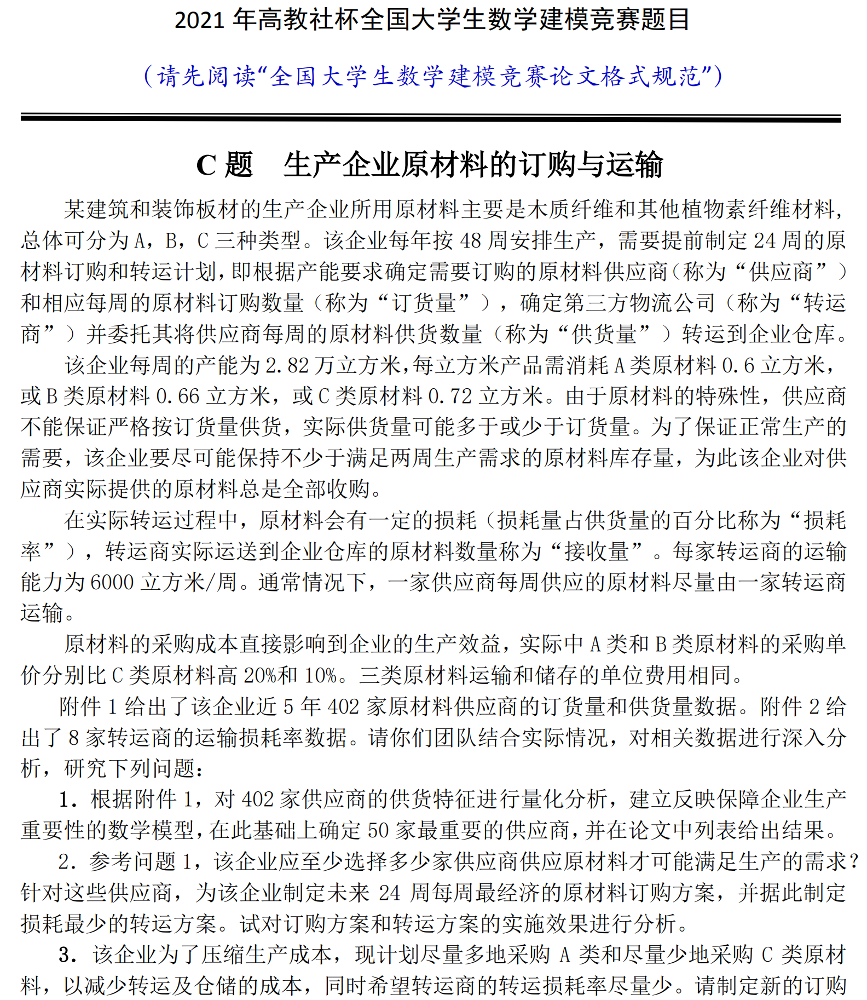
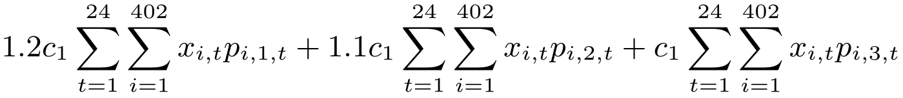
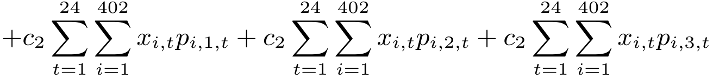

# 3- 数学规划

<!-- slide: 1 -->

- 1
- 数学建模与实验

- 最优化与数学规划模型

<!-- slide: 2 -->

- 2
- 最优化方法概述

- 1、最优化理论和方法是多年来发展十分迅速的一个数学分支。
- 2、最优化已经广泛的渗透到工程、经济、电子技术等领域。
- 3、在数学上，最优化是一种求极值的方法。

<!-- slide: 3 -->

- 3

- 数学家对最优化问题的研究已经有很多年的历史。
- 以前解决最优化问题的数学方法限于古典求导方法和变分法（求无约束极值问题），拉格朗日（Lagrange）乘数法解决等式约束下的条件极值问题。
- 计算机技术的出现，使得数学家研究出了许多最优化方法和算法用以解决以前难以解决的问题。
- 最优化方法概述

<!-- slide: 4 -->

- 4

- 最优化是从所有可能方案中选择最合理的一种以达到最优目标的学科。
- 最优方案是达到最优目标的方案。
- 最优化方法是搜寻最优方案的方法。
- 最优化理论就是最优化方法的理论。
- 最优化方法概述

<!-- slide: 5 -->

- 最优化方法：经典极值问题
- 包括：
- ①无约束极值问题
- ②约束条件下的极值问题
- 5

<!-- slide: 6 -->

- 最优化方法：经典极值问题
- 1、无约束极值问题的数学模型
- 2、约束条件下极值问题的数学模型
- 其中，极大值问题可以转化为极小值问题来进行求解。如求：
- 可以转化为：
- 6

<!-- slide: 7 -->

- 最优化方法：经典极值问题
- 7
- 1、无约束极值问题的求解
- 例1：求函数y=2x3+3x2-12x+14在区间[-3,4]上的最大值与最小值。
- 解：令f(x)=y=2x3+3x2-12x+14
- f’(x)=6x2+6x-12=6(x+2)(x-1)
- 解方程f’(x)=0，得到x1= -2，x2=1，又
- 由于f(-3)=23，f(-2)=34，f(1)=7，f(4)=142，
- 综上得，函数f(x)在x=4取得在[-3,4]上得最大值f(4)=142，在x=1处取得在[-3,4]上取得最小值f(1)=7

<!-- slide: 8 -->

- 最优化方法：经典极值问题
- 8
- 用MATLAB解无约束优化问题
- 常用格式如下：
- （1）x= fminbnd (fun,x1,x2)
- （2）x= fminbnd (fun,x1,x2 ，options)
- （3）[x，fval]= fminbnd（…）
- （4）[x，fval，exitflag]= fminbnd（…）
- （5）[x，fval，exitflag，output]= fminbnd（…）

<!-- slide: 9 -->

- 最优化方法：经典极值问题
- 9
- 2、有约束极值问题的求解
- 有约束最优化模型一般具有以下形式：
- 或
- 其中f(x)为目标函数，省略号表示约束式子，可以是等式约束，也可以是不等式约束。

<!-- slide: 10 -->

- 最优化方法：经典极值问题
- 10
- ①前期分析：分析问题，找出要解决的目标，约束条件，并确立最优化的目标。
- ②定义变量，建立最优化问题的数学模型，列出目标函数和约束条件。
- ③针对建立的模型，选择合适的求解方法或数学软件。
- ④编写程序，利用计算机求解。
- ⑤对结果进行分析，讨论诸如：结果的合理性、正确性，算法的收敛性，模型的适用性和通用性，算法效率与误差等。
- 运用数学规划方法解决最优化问题的一般方法步骤如下：

<!-- slide: 11 -->

- 最优化方法：经典极值问题
- 11
- 2、有约束极值问题的求解
- 根据目标函数、约束条件的特点将最优化方法包含的主要内容大致如下划分：
- 线性规划：目标函数和约束条件都是线性的
- 整数规划：所有变量为整数
- 非线性规划：目标函数或约束条件包含非线性函数
- 多目标规划：有多个目标函数

<!-- slide: 12 -->

- 线性规划
- 12
- 例1：某豆腐店用黄豆制作两种不同口感的豆腐出售。制作口感较鲜嫩的豆腐每千克需要0.3千克一级黄豆及0.5千克二级黄豆，售价10元；制作口感较厚实的豆腐每千克需要0.4千克一级黄豆及0.2千克二级黄豆，售价5元。现小店购入9千克一级黄豆和8千克二级黄豆。
- 问：应如何安排制作计划才能获得最大收益。

| 资源消耗 | 新鲜豆腐 | 厚实豆腐 | 总资源数 |
|---|---|---|---|
| 一级黄豆 | 0.3kg | 0.4kg | 9kg |
| 二级黄豆 | 0.5kg | 0.2kg | 8kg |

<!-- slide: 13 -->

- 线性规划
- 13

| 资源消耗 | 新鲜豆腐 | 厚实豆腐 | 总资源数 |
|---|---|---|---|
| 一级黄豆 | 0.3kg | 0.4kg | 9kg |
| 二级黄豆 | 0.5kg | 0.2kg | 8kg |

- 变量假设：
- 1）受一级黄豆数量限制：
- 2）受二级黄豆数量限制：
- 设计划制作口感鲜嫩和厚实的豆腐各x1千克和 x2千克，可获得收益R元。
- 目标函数（总收益最大）：

<!-- slide: 14 -->

- 线性规划
- 14
- s.t.
- 综上分析，得到该问题的线性规划模型
- 线性规划：就是一个线性函数在线性等式或不等式约束条件下的极值问题。

<!-- slide: 15 -->

- 线性规划
- 15
- 用Matlab编程求解程序如下：
- [X,FVAL,EXITFLAG,OUTPUT] = LINPROG(f,A,b)
- f = -[10  5];
- A = [0.3  0.4;0.5  0.2];
- B = [9;8];
- [X,FVAL,EXITFLAG,OUTPUT] = LINPROG(f,A,b)
- X =
- 10.0000
- 15.0000
- FVAL =
- -175.0000

<!-- slide: 16 -->

- 线性规划
- 16
- 例2：设某工厂有甲、乙、丙、丁四个车间，生产A、B、C、D、E、F六种产品。根据机床性能和以前的生产情况，得知每单位产品所需车间的工作小时数、每个车间在一个季度工作小时的上限以及单位产品的利润，如下表所示(例如，生产一个单位的A产品，需要甲、乙、丙三个车间分别工作1小时、2小时和4小时)
- 问：每种产品各应该每季度生产多少，才能使这个工厂每季度生产利润达到最大。

<!-- slide: 17 -->

- 线性规划
- 17

| 单位产品所需工作小时数 | A | B | C | D | E | F | 每车间一个季度工作小时的上限 |
|---|---|---|---|---|---|---|---|
| 甲 | 1 | 1 | 1 | 3 | 2 | 3 | 500 |
| 乙 | 2 |  | 5 | 5 |  |  | 500 |
| 丙 | 4 | 2 |  |  | 5 |  | 500 |
| 丁 |  | 1 | 3 |  |  | 8 | 500 |
| 利润(百元) | 4.0 | 2.4 | 5.5 | 5.0 | 4.5 | 8.5 |  |

<!-- slide: 18 -->

- 线性规划
- 18
- 这是一个典型的最优化问题，属线性规划。
- 假设：产品合格且能及时销售出去；工作无等待情况等
- 变量说明：
- xj：第j种产品的生产量（j=1,2,……,6）
- 符号说明：
  - aij：第i车间生产单位第j种产品所需工作小时数
  - （i=1,2,3,4;j=1,2,……,6）
  - bi：第i车间的最大工作上限
  - cj：第j种产品的单位利润
- 则：      cjxj为第j种产品的利润总额；
- aijxj表示第i车间生产第j种产品所花时间总数；

<!-- slide: 19 -->

- 线性规划
- 19
- 数学模型：
- s.t.
- 计算结果：

| Z(百元) | x1 | x2 | x3 | x4 | x5 | x6 |
|---|---|---|---|---|---|---|
| 1320 | 0 | 0 | 60 | 40 | 100 | 40 |

<!-- slide: 20 -->

- 整数规划
- 20
- 最优化问题中的所有变量均为整数时，这类问题称为整数规划问题。
- 如果线性规划中的所有变量均为整数时，称这类问题为线性整数规划问题。
- 整数规划可分为线性整数规划和非线性整数规划，以及混合整数规划等。
- 如果决策变量的取值要么为0，要么为1，则这样的规划问题称为0－1规划。

<!-- slide: 21 -->

- 整数规划
- 21
- 例    某钢厂两个炼钢炉同时各用一种方法炼钢。第一种炼法每炉用a小时，第二种用b小时（包括清炉时间）。假定这两种炼法，每炉出钢都是k公斤，而炼1公斤钢的平均燃料费第一法为m元，第二法为n元。若要求在c小时内炼钢公斤数不少于d，试列出燃料费最省的两种方法的分配方案的数学模型。

<!-- slide: 22 -->

- 整数规划
- 22
- 设用第一种炼法炼钢x1炉，第二种炼钢x2炉
- s.t.

<!-- slide: 23 -->

- 非线性规划
- 23
- 非线性规划问题的一般数学模型：
- 其中，            ，f(x)为目标函数；gi(x)，hj(x)为约束函数,这些函数中至少有一个是非线性函数。

<!-- slide: 24 -->

- 非线性规划
- 24
- 例：某公司有6个建筑工地要开工，每个工地的位置（用平面坐标系a，b表示，距离单位：km）及水泥日用量d(t)由下表给出．目前有两个临时料场位于A(5,1)，B(2,7)，日储量各有20t．假设从料场到工地之间均有直线道路相连．
- （1）试制定每天的供应计划，即从A，B两料场分别向各工地运送多少水泥，可使总的吨千米数最小．
- （2）为了进一步减少吨千米数，打算舍弃两个临时料场，改建两个新的，日储量各为20t，问应建在何处，节省的吨千米数有多大？

<!-- slide: 25 -->

- 非线性规划
- 25
- 建立模型
- 记工地的位置为(ai，bi)，水泥日用量为di，i=1,…,6;料场位置为(xj，yj)，日储量为ej，j=1,2；料场j向工地i的运送量为Xij。
- 当用临时料场时决策变量为：Xij，
- 当不用临时料场时决策变量为：Xij，xj，yj．

<!-- slide: 26 -->

- 非线性规划
- 26
- 建立模型
- 记工地的位置为(ai，bi)，水泥日用量为di，i=1,…,6;料场位置为(xj，yj)，日储量为ej，j=1,2；料场j向工地i的运送量为Xij。
- 当用临时料场时决策变量为：Xij，
- 当不用临时料场时决策变量为：Xij，xj，yj．

<!-- slide: 27 -->

- 多目标优化
- 27
- 引例1.投资问题
- 某公司在一段时间内有a(亿元)的资金可用于建厂投资。若可供选择的项目记为1,2,…,m。而且一旦对第i个项目投资就用去ai亿元；而这段时间内可得收益ci亿元。问如何确定最佳的投资方案？
- 最佳投资方案：投资最少，收益最大！

<!-- slide: 28 -->

- 多目标优化
- 28
- 引例1.投资问题
- 某公司在一段时间内有a(亿元)的资金可用于建厂投资。若可供选择的项目记为1,2,…,m。而且一旦对第i个项目投资就用去ai亿元；而这段时间内可得收益ci亿元。问如何确定最佳的投资方案？
- 最佳投资方案：投资最少，收益最大！

<!-- slide: 29 -->

- 多目标优化
- 29
- 投资最少：
- 约束条件为：
- 收益最大：

<!-- slide: 30 -->

- 赛题讲解
- 30
- 2021年C题为例

<!-- slide: 31 -->

- 31

<!-- slide: 32 -->

- 数学规划
- 32
- 目标函数
- 最小化成本
- 决策变量
- 供应商选择：每家供货商每周供货多少
- 转运商选择：每家供货商选择哪家运转商进行运转
- 原材料的采购成本直接影响到企业的生产效益，实际中A类和B类原材料的采购单价分别比C类原材料高20%和10%。三类原材料运输和储存的单位费用相同。

<!-- slide: 33 -->

- 数学规划
- 33
- 约束条件
- 该企业每周的产能为2.82万立方米，每立方米产品需消耗A类原材料0.6立方米，或B类原材料0.66立方米，或C类原材料0.72立方米。
- 为了保证正常生产的需要，该企业要尽可能保持不少于满足两周生产需求的原材料库存量。
- 该企业对供应商实际提供的原材料总是全部收购。
- 在实际转运过程中，原材料会有一定的损耗（损耗量占供货量的百分比称为“损耗率”），转运商实际运送到企业仓库的原材料数量称为“接收量”。
- 每家转运商的运输能力为6000立方米/周。
- 通常情况下，一家供应商每周供应的原材料尽量由一家转运商运输。

<!-- slide: 34 -->

- 数学规划
- 34
- 模型参数
- pi,j,t:供货商i对于原材料j(j为A、B、C)在第t周的供货量
- Φk,t:转运商k第t周转运过程中的损耗率
- c1:原材料C的单位成本
- c2:原材料的运输和储存成本
- 变量定义
- xi,t:供货商i在第t周是否被选中（0-1决策）
- zij,t: 针对供货商i对原材料j在第t周的订货量；
- yi,k,t:第t周供应商i是否分配给转运商k(0-1决策）

<!-- slide: 35 -->

- 数学规划
- 35
- 目标函数
- 原材料的采购成本直接影响到企业的生产效益，实际中A类和B类原材料的采购单价分别比C类原材料高20%和10%。三类原材料运输和储存的单位费用相同。
- Min
- A类采购成本
- B类采购成本
- C类采购成本

- B类运输储存成本
- A类运输储存成本
- C类运输储存成本

<!-- slide: 36 -->

- 数学规划
- 36
- 约束条件
- 该企业每周的产能为2.82万立方米，每立方米产品需消耗A类原材料0.6立方米，或B类原材料0.66立方米，或C类原材料0.72立方米。
- 为了保证正常生产的需要，该企业要尽可能保持不少于满足两周生产需求的原材料库存量。
- 该企业对供应商实际提供的原材料总是全部收购。
- 在实际转运过程中，原材料会有一定的损耗（损耗量占供货量的百分比称为“损耗率”），转运商实际运送到企业仓库的原材料数量称为“接收量”。
- 每家转运商的运输能力为6000立方米/周。
- 通常情况下，一家供应商每周供应的原材料尽量由一家转运商运输。
