# 4- 图论模型

<!-- slide: 1 -->

- 1
- 数学建模与实验

- 图论模型
- 汪秀敏
- xmwang@scut.edu.cn

<!-- slide: 2 -->

- 2
- 图的概念

- 问题的提出
- 现实生活中，我们经常碰到一些现象，如：在一群人中有些人互相认识，有些人互相不认识。又如：某航空公司在100个城市之间建立若干航线，某些城市间有直达航班，而另一些城市间没有直达航班等等。以上现象都有共同内容：一是有研究的“对象”，如人，城市等；二是这些对象之间存在着某种关系：如互相认识，有直达航班等。为了表示这些对象以及对象之间的关系，我们将“点”代表“对象”，“边”表示“对象之间的关系”，引出了“图”这个概念。

<!-- slide: 3 -->

- 3
- 图的概念

- 定义 一个图G是指一个二元组(V(G),E(G))，其中:
- 其中元素称为图G的顶点
- 组成的集合，即称为边集,其中元素称为边
- 定义   图G的阶是指图的顶点数|V(G)|，图的边的数     目|E(G)|
- 是非空有限集，称为顶点集，
- 1)
- 2) E(G)是顶点集V(G)中的无序或有序的元素偶对
- 可简记
- 图
- 边可表示为vivj或

<!-- slide: 4 -->

- 4
- 图的概念

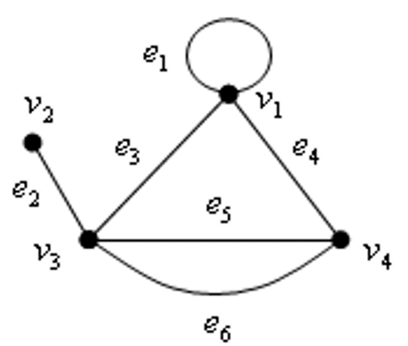

<!-- slide: 5 -->

- 5
- 图的概念

- 定义 对图中的每条边指定一个方向，就称为有向弧或有向边，对应的图称为有向图。边没有方向的图称为无向图。
- 如上图的有向弧，可记为a=(u,v)，其中v称为a的头，u称为a的尾。
- u
- v

<!-- slide: 6 -->

- 6
- 图的概念

- 定义 若图G=(V(G),E(G))的每一条边e都赋以一个实数w(e) ，称w(e)为边e的权，G连同边上的权称为赋权图
- 定义 设G=(V,E)和G’=(V‘,E’)是两个图
- 1) 若            ,称  是  的一个子图,记
- 2) 若     ，    ，则称  是  的生成子图

<!-- slide: 7 -->

- 7
- 图的概念

- 图的矩阵表示---
- 邻接矩阵
- 1) 对无向图  ，其邻接矩阵          ，其中：
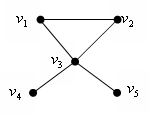

<!-- slide: 8 -->

- 8
- 图的概念

- 2) 对有向图         ,其邻接矩阵          ,其中：
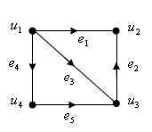
- 图的矩阵表示---
- 邻接矩阵

<!-- slide: 9 -->

- 9
- 图的概念

- 其中：
- 3) 对有向赋权图         ,其邻接矩阵          ,
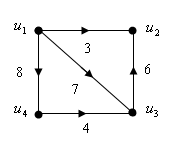
- 对于无向赋权图的邻接矩阵可类似定义
- 图的矩阵表示---
- 邻接矩阵

<!-- slide: 10 -->

- 10
- 图的概念

- 图的矩阵表示---
- 关联矩阵
- 1)对无向图         ，其关联矩阵           ,
- 其中：
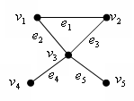

<!-- slide: 11 -->

- 11
- 图的概念

- 图的矩阵表示---
- 关联矩阵
- 2)对有向图         ，其关联矩阵           ,
- 其中：
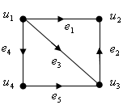

<!-- slide: 12 -->

- 12
- 最短路问题

- 最短路问题是图论应用的基本问题，很多实际问题，如线路的布设、运输安排、运输网络最小费用流等问题,都可通过建立最短路问题模型来求解
- 最短路的定义:
  - 在赋权图G中，从顶点u到顶点v的具有最小权/长度的路径，称为u到v的最短路。

<!-- slide: 13 -->

- 13
- 最短路问题

- 1) 赋权图中从给定源点到其余顶点的最短路
- 如何求解上图中的最短路径问题，Dijkstra提出了一种解决方案
- 0
- 1
- 2
- 3
- 4
- 5
- 6
- 7
- 8
- 3
- 6
- 4
- 4
- 4
- 4
- 3
- 2
- 5
- 5
- 3
- 1
- 2
- 2

| 源点 | 终点 | 路径 | 长度 |
|---|---|---|---|
| 0 | 1 | 0 1 | 3 |
|  | 2 | 0 2 | 4 |
|  | 3 | 0 1 3 | 6 |
|  | 4 | 0 1 4 | 5 |
|  | 5 | 0 2 5 | 7 |
|  | 6 | 0 1 3 6 | 8 |
|  | 7 | 0 1 4 7 | 9 |
|  | 8 | 0 1 3 6 8 | 12 |

<!-- slide: 14 -->

- 14
- 最短路问题

- 2) 赋权图中任意两顶点之间的最短路
- Floyd算法：求任意两顶点间的最短路.

<!-- slide: 15 -->

- 最短路问题的应用
- 15

<!-- slide: 16 -->

- 最短路问题的应用
- 问题分析
- 问题：判断每年年初是否需要购进新设备
- 目标：最小化从第一年初到第五年底的总费用
- （1）使用Vi表示第i年初购进设备(i=1…5), V6表示第五年年底
- 如W(V1,V4)=11+5+6+8=30
- （4）问题转化成求V1到V6的最短路问题
- 模型构建
- （2）使用弧(Vi, Vj)表示第i年初购进一台设备一直使用到第j年初的决策
- （3）其权值W(Vi, Vj)表示第i年初到第j-1年底的总费用(购置费+维修费）
- V1
- V2
- V3
- V4
- V5
- V6
- 16

<!-- slide: 17 -->

- 最短路问题的应用
- 例(选址问题) 某矿区有7个矿点，如图所示．已知各矿点每天的
- 产矿量为q(vj)(标在图的各顶点上)．现要从这7个矿点选一个来建
- 造矿厂．问应选在哪个矿点，才能使各矿点所产的矿运到选矿厂所
- 在地的总运力（千吨公里）最小。
- 转化成图的最短路问题：
- 求图中任意两点的最短长度di,j
- (2) 计算各点vi作为矿厂的总运力：
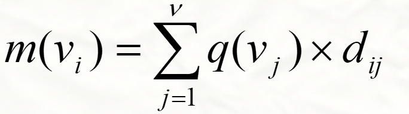
- (3) 求vk，使得
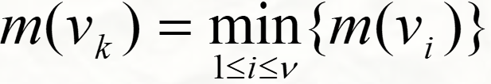
- 17

<!-- slide: 18 -->

- 1. 最短路问题的变种：最可靠路
- 在通信网络中，已知各段线路的可靠性，求指定两点间（0到8）可靠性最大的线路，其中一条线路的可靠性是其上各段线路的可靠性之积。

- 最短路问题的应用
- 0
- 1
- 2
- 3
- 4
- 5
- 6
- 7
- 8
- 0.6
- 0.9
- 0.9
- 0.5
- 0.6
- 0.5
- 0.85
- 0.8
- 0.7
- 0.75
- 0.85
- 0.8
- 0.7
- 0.7
- 例如：路(0->2->5)的可靠性为0.9*0.75。
- 18

<!-- slide: 19 -->

- 1. 最短路问题的变种：最可靠路
- 假设线路 e (G 的一条边)的可靠性为 p(e)，给e 定义权w(e)=-ln p(e) ，则G 的一条路 P 的权
- 求最可靠路等价于在赋权图                       中求最短路

- 最短路问题的应用
- 在通信网络中，已知各段线路的可靠性，求指定两点间（0到8）可靠性最大的线路，其中一条线路的可靠性是其上各段线路的可靠性之积。
- 19

<!-- slide: 20 -->

- 2. 最短路问题的变种：最大容量路

- 最短路问题的应用
- 设在图 G = (V , E , w) 中，权 w(e) 表示边 e 的通过能力(或容量)，求 G 中指定两点间(如0到8)的一条通过能力最大的路。
- 一条路的通过能力等于路上各边通过能力的最小值。
- 0
- 1
- 2
- 3
- 4
- 5
- 6
- 7
- 8
- 3
- 6
- 4
- 4
- 4
- 4
- 3
- 2
- 5
- 5
- 3
- 1
- 2
- 2
- 例如：路(0->2->5)的通过能力为3。
- 20

<!-- slide: 21 -->

- 2. 最短路问题的变种：最大容量路

- 最短路问题的应用
- 设在图 G = (V , E , w) 中，权 w(e) 表示边 e 的通过能力(或容量)，求 G 中指定两点间的一条通过能力最大的路。
- 一条路的通过能力等于路上各边通过能力的最小值。
- 21

<!-- slide: 22 -->

- 22
- 最小生成树及算法

- 树的定义与树的特征
- 树中的边称为树枝. 树中度为1的顶点称为树叶
- 孤立顶点称为平凡树
- 平凡树
- 定义 连通且不含圈的无向图称为树．常用T表示.

<!-- slide: 23 -->

- 23
- 最小生成树及算法

- 设G是具有n个顶点的图，则下述命题等价：
- 1) G是树（   G无圈且连通）；
- 2) G无圈，且有n-1条边；
- 3) G连通，且有n-1条边；
- 4) G无圈，但添加任一条新边恰好产生一个圈;
- 5) G连通，且删去一条边就不连通了（即G为最小连通图）；
- 6) G中任意两顶点间有唯一一条路.

<!-- slide: 24 -->

- 24
- 最小生成树及算法

- 2）图的生成树
- 若T是包含图G的全部顶点的子图,它又是树,则称T是G的生      成树. 图G中不在生成树的边叫做弦.
- 定理3 图G=(V,E)有生成树的充要条件是图G是连通的.
- 定义

<!-- slide: 25 -->

- 25
- 最小生成树及算法

- 2）图的最小生成树
- 设T是图G的一棵生成树,用F(T)表示树T中所有边的权值之和,则F(T)称为树T的权。
- 定义
- 定义
- 一个连通图G的生成树一般不止一棵, 图G的所有生成树中权值最小的生成树称为图G的最小生成树。

<!-- slide: 26 -->

- 26
- 最小生成树及算法

- 构造图中最小生成树的方法
- A Prim算法(细节略)
- B Kruskal算法(细节略)

<!-- slide: 27 -->

- 27
- 最小生成树的简单应用

- 例：现要在n个城市之间铺设光缆，使得这n个城市的任意两者之间都可以通信，但铺设光缆的费用很高，且各个城市之间铺设光缆的费用不同，如何铺设光缆使得总费用最低。
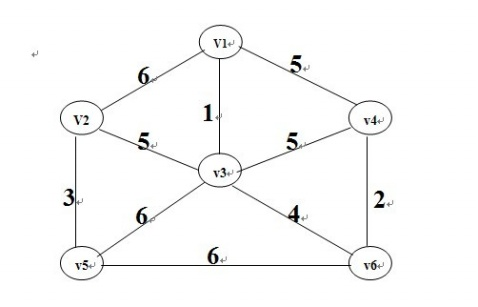

<!-- slide: 28 -->

- 28

- Euler 图
- 称经过图G =(V,E)的每条边恰好一次的路为Euler路，经过G的每条边恰好一次的回路为Euler回路。称有Euler回路的图为Euler图。
- G是Euler图当且仅当G连通且没有度数为奇数的点；
- A
- B
- C
- D
- 4个点的度数皆为奇数，不存在 Euler 路
- 命题：
- 在Euler图中找出Euler回路的算法(略)

<!-- slide: 29 -->

- 29

- Euler 图
- 问题(哥尼斯堡七桥问题):
- 能否从任一陆地出发通过每座桥恰好一次而回到出发点？
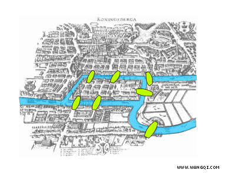
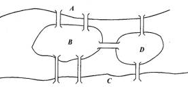

<!-- slide: 30 -->

- 30

- Euler 图
- 中国邮递员问题
- 一名邮递员负责投递某个街区的邮件。如何为他（她）设计一条最短的投递路线(从邮局出发，经过投递区内每条街道至少一次，最后返回邮局)？
- 解法：把街区看成图G(V,E,W)
  - 1) 若本身就是欧拉图，则直接可以找到一条欧拉回路就是本问题的解。
  - 2) 若不是欧拉图，必定有偶数个奇度数结点，在这些奇度数点之间添加一些重边，使之变成欧拉图，再找出一个欧拉回路。
- 具体解法：
- Fleury算法+Edmonds最小对集算法

<!-- slide: 31 -->

- 31

- Hamilton 图
- 称经过图G =(V,E)的每个点恰好一次的路为Hamilton路，经过G的每个点恰好一次的回路为Hamilton回路。称有Hamilton回路的图为Hamilton图。
- Hamilton图与Euler图在定义上很相似，但判断一个图是否Hamilton图较判断它是否Euler图要困难得多，目前还没有易验证的充要条件。

<!-- slide: 32 -->

- 32

- Hamilton图
- 旅行商问题(TSP)
- 解法：
- 以城市为点，以两个城市之间的旅行距离为权，构造一个赋权完全图 G = (V, E, W)。求最小哈密尔顿回路。
- TSP问题的解法属于NP完全问题，一般只研究其近似解(解法略)。
- 一名推销员准备前往若干城市推销产品。如何为他（她）设计一条最短的旅行路线？ 即：从驻地出发，经过每个城市恰好一次，最后返回驻地。

<!-- slide: 33 -->

- 33

- Hamilton 图
- 例：某次会议有2n人参加，其中每个人都有一定数量的朋友参加，这2n人围一桌入座，想使相邻的两位都是朋友，是否有可能？
- 解法：
- 以人为顶点，两人为朋友时相应顶点间连一边，构造一个无向图 G (V, E)。判断G中是否存在哈密尔顿回路即可。

<!-- slide: 34 -->

- 34

- 二分图与匹配
- 定义 若图             ，         ，且X中任意两顶点不相邻，Y中任意两顶点不相邻，则称G(X,Y,E)为二部图或偶图。
- 二部图
- 定义 设G =(X, Y, E)为二部图,且M  E.若M中任意两条边在G中均不邻接,则称M是二部图G的一个匹配。
- 定义 如果G中没有另外的匹配M0,使|M0|＞|M|,则称M是二部图G的最大匹配。
- 定义 设M是二部图G的一个匹配,如果G的每一个点都是M中边的顶点,则称M是二部图G的完美匹配。

<!-- slide: 35 -->

- 35

- 二分图与匹配
- 工作分派问题
- 有 n 项工作要分派给 n 个人去做，问如何分派可以使得每个人做自己胜任的工作？
- x1
- x2
- x3
- x4
- x5
- y1
- y2
- y3
- y4
- y5
- 5 人：x1 , … , x5
- 5 项工作：y1 , … , y5
- x1 胜任 y2
- x2 胜任 y2 , y3
- x3 胜任 y1 , y3 , y4 , y5
- x4 胜任 y5
- x5 胜任 y2 , y3 , y5
- 是否存在完美匹配?

<!-- slide: 36 -->

- 数学建模应用实例
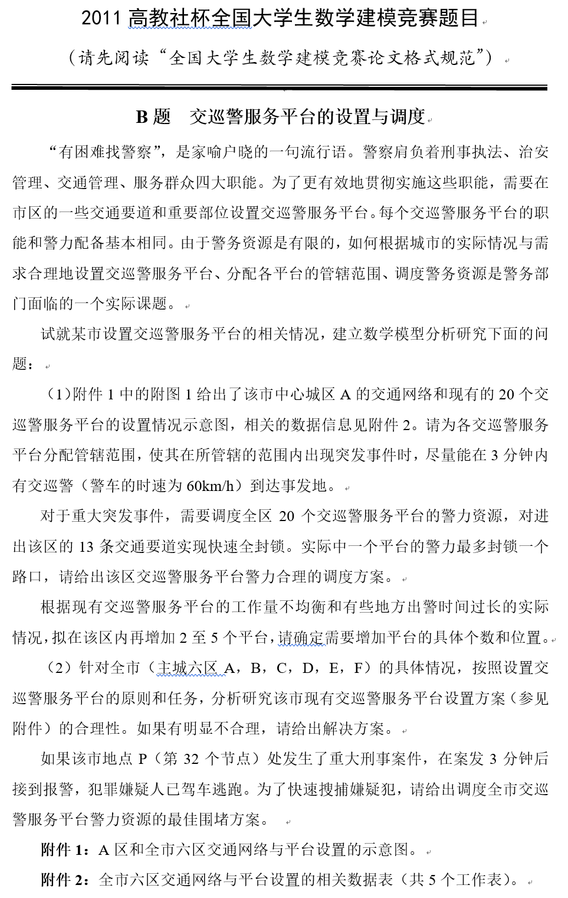

<!-- slide: 37 -->

- 数学建模应用实例
- （1）附件1中的附图1给出了该市中心城区A的交通网络和现有的20个交巡警服务平台的设置情况示意图，相关的数据信息见附件2。请为各交巡警服务平台分配管辖范围，使其在所管辖的范围内出现突发事件时，尽量能在3分钟内有交巡警（警车的时速为60km/h）到达事发地。
- 对于重大突发事件，需要调度全区20个交巡警服务平台的警力资源，对进出该区的13条交通要道实现快速全封锁。实际中一个平台的警力最多封锁一个路口，请给出该区交巡警服务平台警力合理的调度方案。
- 根据现有交巡警服务平台的工作量不均衡和有些地方出警时间过长的实际情况，拟在该区内再增加2至5个平台，请确定需要增加平台的具体个数和位置。
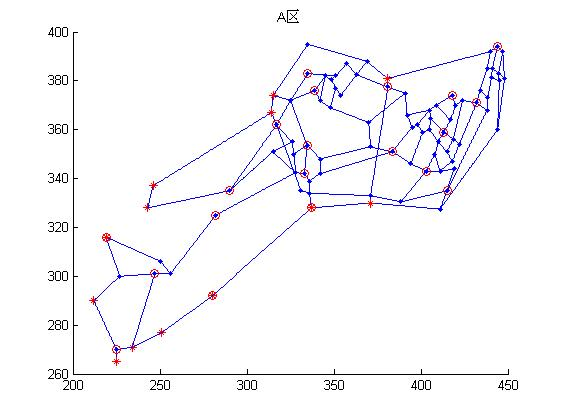

<!-- slide: 38 -->

- 数学建模应用实例
- 附件1中的附图1给出了该市中心城区A的交通网络和现有的20个交巡警服务平台的设置情况示意图，相关的数据信息见附件2。请为各交巡警服务平台分配管辖范围，使其在所管辖的范围内出现突发事件时，尽量能在3分钟内有交巡警（警车的时速为60km/h）到达事发地。
- 模型假设：
  - 案件只发生在路口
  - 相邻交通路口之间的道路均为直线
  - 警车在路口之间沿最短路径无障碍形式
  - 车子匀速行驶

<!-- slide: 39 -->

- 数学建模应用实例
- 3）按照距离分配服务中心：
- 若|S(i)|=1，则分配给集合中的唯一服务中心
- 若|s(i)|>0，则将i分配给其中距离最近的服务中心
- 若|S(i)|=0，则将i分配给距离其他最近的服务中心
- 模型构建：
- 1）建立赋权图G(V, E, W), 其中V包含m个节点和n个服务中心，E包含他们之间的连通情况，w(e)表示边e的两个端点之间的距离。
  - 2）求各节点到各服务中心的最短距离dij，并给出距离节点i小于等3km的服务中心集合S(i)。

<!-- slide: 40 -->

- 数学建模应用实例
- 求解：可事先设定调度目标，如最小化总的距离
- 1）设变量xi,j=0, 1: 1表示巡警服务平台j服务于突发地i，否则为0
- 2）数学规划：
- 对于重大突发事件，需要调度全区20个交巡警服务平台的警力资源，对进出该区的13条交通要道实现快速全封锁。实际中一个平台的警力最多封锁一个路口，请给出该区交巡警服务平台警力合理的调度方案。

<!-- slide: 41 -->

- 数学建模应用实例
- 1）平台配置方案均衡性和出警时间过长的指标：
- a）服务地点个数，出警距离，案发率等；
- b）对于平台3min无法到达的路段，应该通过在附近增加新平台
- 根据现有交巡警服务平台的工作量不均衡和有些地方出警时间过长的实际情况，拟在该区内再增加2至5个平台，请确定需要增加平台的具体个数和位置。
- 2）构建优化目标(均衡)
- 第j个服务平台需要服务的距离之和
- 最忙的服务平台的行驶距离
- 3）思路：a）若存在平台无法到达的路段，增加新平台，设其坐标为(yj, zj)；b）再根据上述均衡目标分配平台；d）按照上述思路依次增加2至5个平台，选取最优情况。
