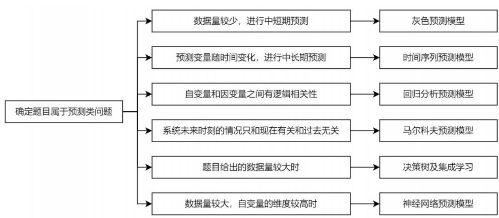
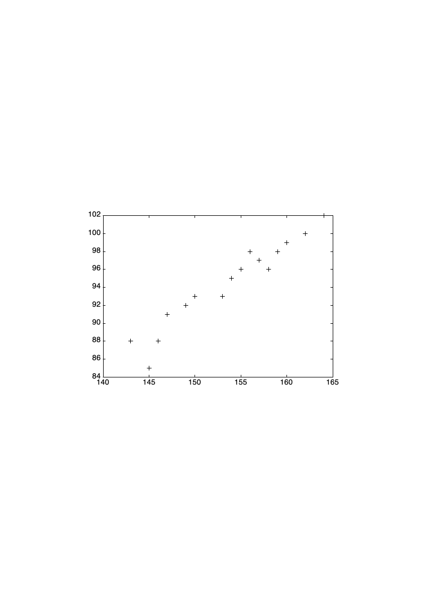
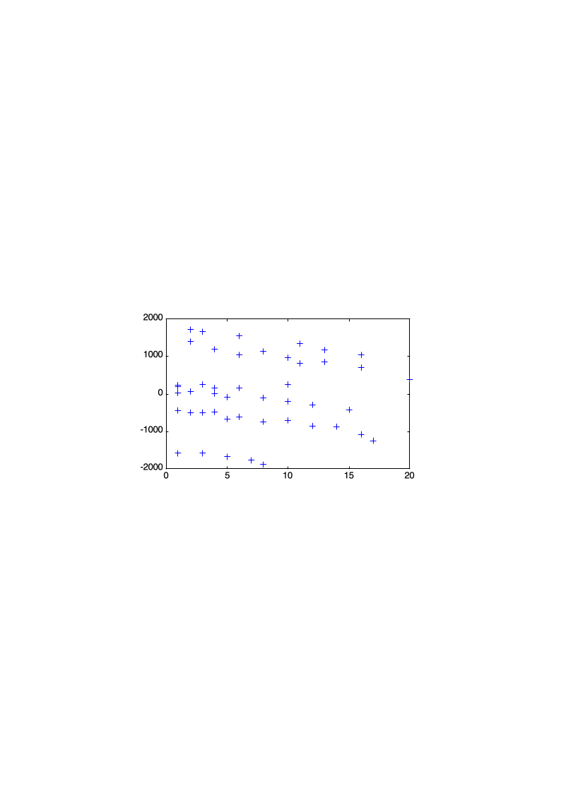
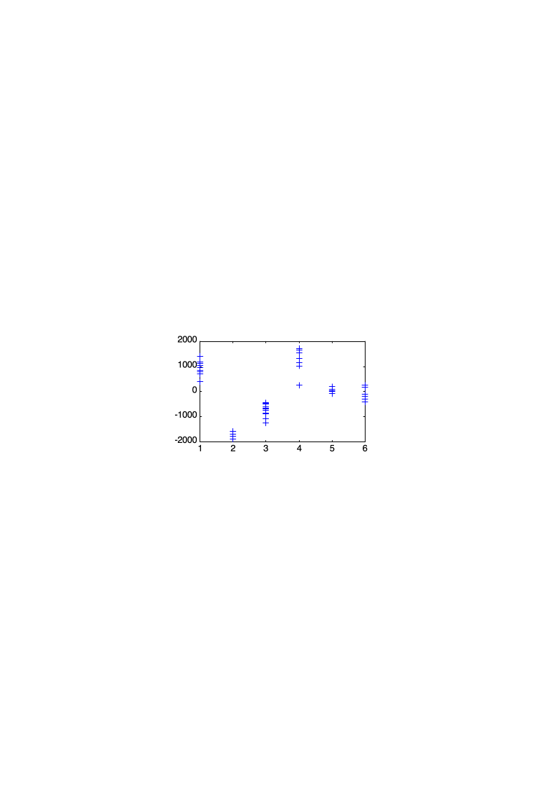
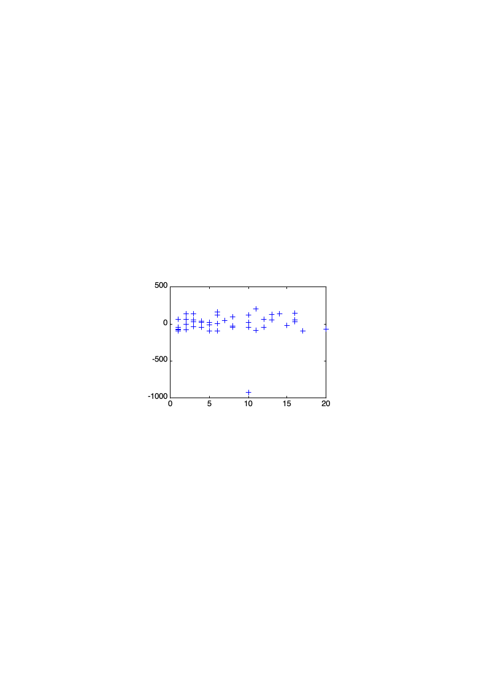
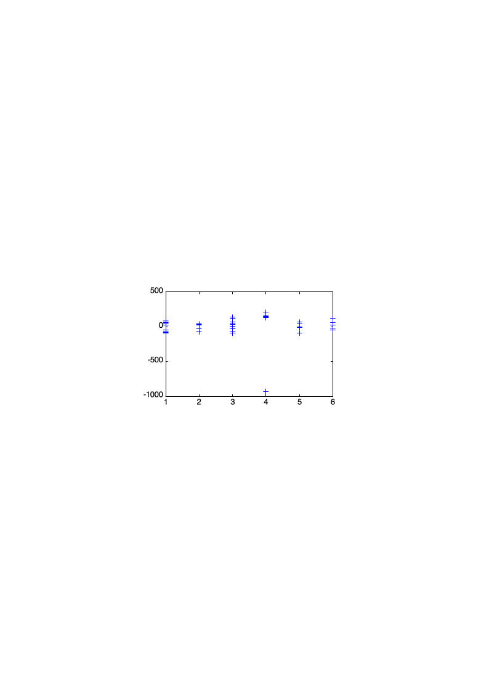
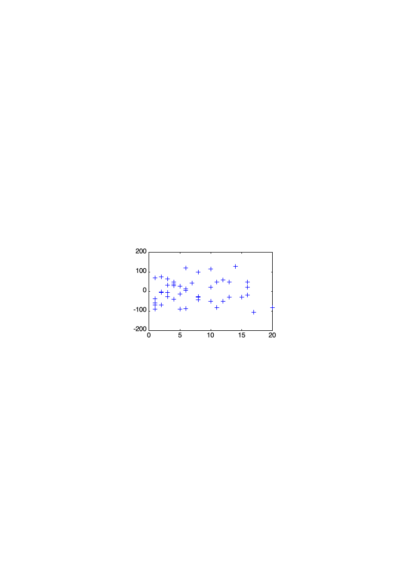
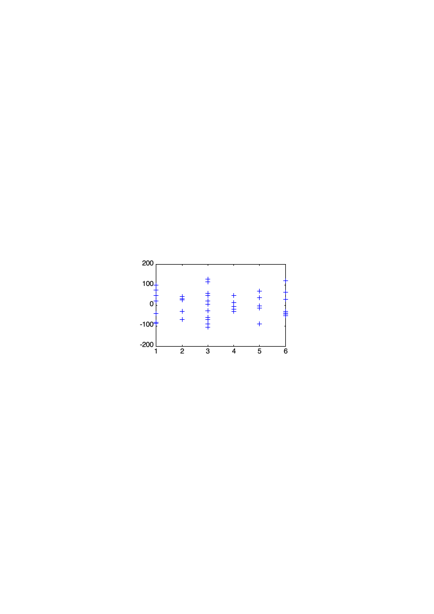

# 6-1 统计回归

<!-- slide: 1 -->

- 1
- 数学建模与实验

- 统计回归模型

<!-- slide: 2 -->

- 预测就是根据过去和现在去估计未来，预测未来。
- 预测类问题分为两类：
- 一类是无法用数学语言刻画其内部演化机理的问题;
- 另一类是可以通过微分方程刻画其内部规律，这类问题我们称为机理建模问题，通过微分方程建模求解。
- 预测类赛题

<!-- slide: 3 -->

- 预测就是根据过去和现在去估计未来，预测未来。
- 预测类赛题

<!-- slide: 4 -->

- 统计回归模型是基于统计理论建立的最基本最常用的一类数据驱动模型。
- 直接从数据出发，找到隐含在数据背后的模型，是数学模型建立的另一大思路。
- 由于客观事物内部规律的复杂及人们认识程度的限制,无法分析实际对象内在的因果关系，建立合乎机理规律的数学模型。
- 统计回归模型

<!-- slide: 5 -->

- 统计回归模型

- 回归模型是用统计分析方法建立的最常用的一类模型
- 通过对数据的统计分析，找出与数据拟合最好的模型
- 不涉及回归分析的数学原理和方法
- 通过实例讨论如何选择不同类型的模型
- 对软件得到的结果进行分析，对模型进行改进

<!-- slide: 6 -->

- 一元线性回归
- 多元线性回归
- 统计回归方法
- 基本模型
- 模型参数估计
- 检验与预测、matlab实现
- 基本模型
- 模型参数估计
- 检验与预测、matlab实现
- *逐步回归分析、matlab实现
- 线性回归
- 非线性回归
- 多项式回归、matlab实现
- 可线性化非线性回归
- 非线性回归、matlab实现
- 统计回归模型

<!-- slide: 7 -->

- 一元线性回归模型

- 例1 测16名成年女子的身高与腿长所得数据如下：
- 以身高x为横坐标，以腿长y为纵坐标将这些数据点（xI，yi）在平面直角坐标系上标出.

- 散点图

<!-- slide: 8 -->

- 例子：软件开发人员的薪金
- 多元线性回归模型

- 一家高技术公司人事部门为研究软件开发人员的薪金与他们的资历、管理责任、教育程度等因素之间的关系，要建立一个数学模型，以便分析公司人事策略的合理性，并作为新聘用人员薪金的参考。他们认为目前公司人员的薪金总体上是合理的，可以作为建模的依据。于是调查了46名软件开发人员的档案资料，包括薪金、资历、管理责任（1表示管理人员，0表示非管理人员）、教育程度，全部数据如下表所示。

<!-- slide: 9 -->

- 资历~ 从事专业工作的年数；管理~ 1=管理人员，0=非管理人员；教育~ 1=中学，2=大学，3=更高程度
- 编号
- 薪金
- 资历
- 管理
- 教育
- 01
- 13876
- 1
- 1
- 1
- 02
- 11608
- 1
- 0
- 3
- 03
- 18701
- 1
- 1
- 3
- 04
- 11283
- 1
- 0
- 2
- 
- 
- 
- 
- 编号
- 薪金
- 资历
- 管理
- 教育
- 42
- 27837
- 16
- 1
- 2
- 43
- 18838
- 16
- 0
- 2
- 44
- 17483
- 16
- 0
- 1
- 45
- 19207
- 17
- 0
- 2
- 46
- 19346
- 20
- 0
- 1
- 46名软件开发人员的档案资料
- 

- 多元线性回归模型

<!-- slide: 10 -->

- 分析与假设
- y~ 薪金，x1 ~资历（年）
- x2 = 1~ 管理人员，x2 = 0~ 非管理人员
- 1=中学2=大学3=更高
- 资历每加一年薪金的增长是常数；
- 管理、教育、资历之间无交互作用
- 教育
- 线性回归模型
- a0, a1, …, a4是待估计的回归系数，是随机误差
- 中学：x3=1, x4=0 ；大学：x3=0, x4=1； 更高：x3=0, x4=0

- 多元线性回归模型

<!-- slide: 11 -->

- 模型求解

- [b,bint,r,rint,stats]=regress(y,x,alpha)
- 输入
- x=           ~n4数据矩阵, 第1列为全1向量
- alpha(置信水平,0.05)
- b~ai的估计值
- bint~b的置信区间
- r ~残差向量y-xb
- rint~r的置信区间
- y~n维数据向量
- 输出
- 多元线性回归模型

> 备注：置信区间包含0点，表示什么呢，表示该因素不显著。也即，没有显著的证据表明a4不为0

<!-- slide: 12 -->

- 模型求解
- 参数
- 参数估计值
- 置信区间
- a0
- 11032
- [ 10258  11807 ]
- a1
- 546
- [  484    608 ]
- a2
- 6883
- [ 6248    7517 ]
- a3
- -2994
- [ -3826   -2162 ]
- a4
- 148
- [ -636     931 ]
- R2=0.957      F=226      p=0.000

- [b,bint,r,rint,stats]=regress(y,x,alpha)
- 多元线性回归模型

> 备注：置信区间包含0点，表示什么呢，表示该因素不显著。也即，没有显著的证据表明a4不为0

<!-- slide: 13 -->

- R2：可决系数，衡量估计的模型对观测值的拟合程度，越接近1，则模型越好。
- F检验：若                             ，则说明拒绝      ，回归有显著意义，即所有变量联合起来确实有意义。因此，F值越大越好。
- 显著性水平p：统计量发生的概率，若P>α，结论为按α所取水准不显著，不拒绝H0；若P≤α，结论为按所取α水准显著，拒绝H0。因此，p值越小越好。
- 多元线性回归模型

> 备注：置信区间包含0点，表示什么呢，表示该因素不显著。也即，没有显著的证据表明a4不为0

<!-- slide: 14 -->

- 模型求解
- 参数
- 参数估计值
- 置信区间
- a0
- 11032
- [ 10258  11807 ]
- a1
- 546
- [  484    608 ]
- a2
- 6883
- [ 6248    7517 ]
- a3
- -2994
- [ -3826   -2162 ]
- a4
- 148
- [ -636     931 ]
- R2=0.957      F=226      p=0.000
- R2,F, p 模型整体上可用

- [b,bint,r,rint,stats]=regress(y,x,0.05);
- 1、R2接近1
- 2、
- 3、p<0.05
- 多元线性回归模型

> 备注：置信区间包含0点，表示什么呢，表示该因素不显著。也即，没有显著的证据表明a4不为0

<!-- slide: 15 -->

- 模型求解
- 参数
- 参数估计值
- 置信区间
- a0
- 11032
- [ 10258  11807 ]
- a1
- 546
- [484    608]
- a2
- 6883
- [ 6248    7517 ]
- a3
- -2994
- [ -3826   -2162 ]
- a4
- 148
- [ -636     931 ]
- R2=0.957      F=226      p=0.000
- 资历增加1年薪金增长546
- 管理人员薪金多6883
- 中学程度薪金比更高的低2994
- 大学程度薪金比更高的多148
- a4置信区间包含零点，解释不可靠!
- 中学：x3=1, x4=0;
- 大学：x3=0, x4=1;
- 其他：x3=0, x4=0.
- x2 = 1：管理
- x2 = 0：非管理
- x1：资历(年)

- 多元线性回归模型

> 备注：置信区间包含0点，表示该因素不显著。也即，没有显著的证据表明a4不为0

<!-- slide: 16 -->

- 残差分析方法
- 结果分析
- 残差
- e 与资历x1的关系

- e与管理—教育组合的关系

- 残差全为正，或全为负，管理—教育组合处理不当
- 残差大概分成3个水平
- 应在模型中增加管理x2与教育x3, x4的交互项
- 组合
- 1
- 2
- 3
- 4
- 5
- 6
- 管理
- 0
- 1
- 0
- 1
- 0
- 1
- 教育
- 1
- 1
- 2
- 2
- 3
- 3
- 管理与教育的组合

- 多元线性回归模型

<!-- slide: 17 -->

- 进一步的模型
- 增加管理x2与教育x3, x4的交互项
- 参数
- 参数估计值
- 置信区间
- a0
- 11204
- [11044  11363]
- a1
- 497
- [486  508]
- a2
- 7048
- [6841  7255]
- a3
- -1727
- [-1939  -1514]
- a4
- -348
- [-545  –152]
- a5
- -3071
- [-3372 -2769]
- a6
- 1836
- [1571  2101]
- R2=0.999     F=554      p=0.000
- R2,F有改进，所有回归系数置信区间都不含零点，模型完全可用
- 消除了不正常现象
- 异常数据(33号)应去掉

- e ~ x1

- e ~组合

- 多元线性回归模型

<!-- slide: 18 -->

- 去掉异常数据后的结果
- 参数
- 参数估计值
- 置信区间
- a0
- 11200
- [11139  11261]
- a1
- 498
- [494  503]
- a2
- 7041
- [6962  7120]
- a3
- -1737
- [-1818  -1656]
- a4
- -356
- [-431  –281]
- a5
- -3056
- [-3171 –2942]
- a6
- 1997
- [1894  2100]
- R2= 0.9998    F=36701     p=0.0000

- e ~ x1

- e ~组合
- R2： 0.957   0.999   0.9998
- F： 226  554  36701
- 置信区间长度更短
- 残差图十分正常
- 最终模型的结果可以应用

- 多元线性回归模型

<!-- slide: 19 -->

- 模型应用
- 制订6种管理—教育组合人员的“基础”薪金(资历为0）
- 组合
- 管理
- 教育
- 系数
- “基础”薪金
- 1
- 0
- 1
- a0+a3
- 9463
- 2
- 1
- 1
- a0+a2+a3+a5
- 13448
- 3
- 0
- 2
- a0+a4
- 10844
- 4
- 1
- 2
- a0+a2+a4+a6
- 19882
- 5
- 0
- 3
- a0
- 11200
- 6
- 1
- 3
- a0+a2
- 18241
- 中学：x3=1, x4=0 ；大学：x3=0, x4=1； 更高：x3=0, x4=0
- x1= 0； x2 = 1~ 管理，x2 = 0~ 非管理
- 大学程度管理人员比更高程度管理人员的薪金高
- 大学程度非管理人员比更高程度非管理人员的薪金略低

- 多元线性回归模型
