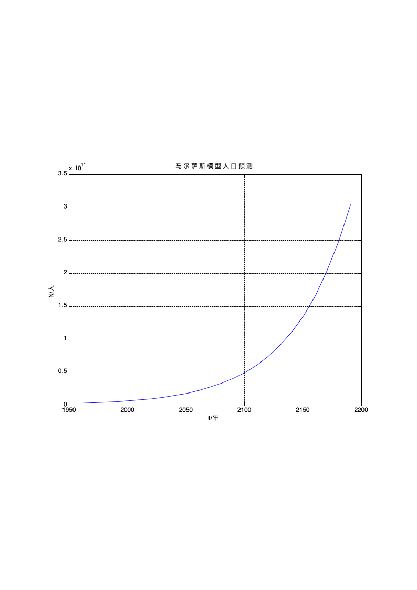
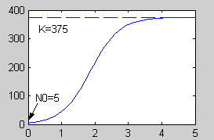
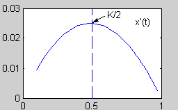
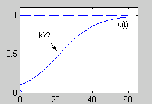

# 7-1 方程模型

<!-- slide: 1 -->

- 1
- 数学建模与实验

- 方程模型

<!-- slide: 2 -->

- 微分方程模型
- 在许多实际问题中，当直接导出变量之间的函数关系较为困难，但导出包含未知函数的导数或微分的关系式较为容易时，可用建立微分方程模型的方法来研究该问题.
- 本节将通过一些最简单的实例来说明微分方程建模的一般方法。在连续变量问题的研究中，微分方程是十分常用的数学工具之一。
- 2

<!-- slide: 3 -->

- 求出方程的解
- ——求出未知函数的解析表达式
- ——利用各种数值解法、数值软件（如Matlab）求近似解
- 不必求出方程的解
- ——根据微分方程的理论研究某些性质，或它的变化趋势
- 把未知变量表示为已知量的函数——跟已知量的导数有关
- 3

<!-- slide: 4 -->

## § Malthus模型与Logistic模型

- 为了保持自然资料的合理开发与利用，人类必须保持并控制生态平衡，甚至必须控制人类自身的增长。
- 本节将建立几个简单的单种群增长模型，以简略分析一下这方面的问题。一般生态系统的分析可以通过一些简单模型的复合来研究，大家若有兴趣可以根据生态系统的特征自行建立相应的模型。
- 种群的数量本应取离散值，但由于种群数量一般较大，为建立微分方程模型，可将种群数量看作连续变量，甚至允许它为可微变量，由此引起的误差将是十分微小的。
- 4

<!-- slide: 5 -->

## § 4.1  Malthus模型与Logistic模型

- 世界人口
- 年            1625     1830     1930    1960    1974    1987    1999
- 人口（亿）     5          10          20        30        40        50       60
- 中国人口
- 年            1908     1933     1953    1964    1982    1990    2000
- 人口（亿）     3         4.7         6        7.2       10.3        11.3     12.95
- 5

<!-- slide: 6 -->

- 模型1 马尔萨斯（Malthus）模型
- 假设：人口净增长率r是一常数
- （2）
- 解为：
- 符号：
- 则
- （1）
- 于是x（t）满足如下微分方程：
- 6

<!-- slide: 7 -->

- 马尔萨斯模型的一个显著特点：种群数量翻一番所需的时间是固定的。
- 令种群数量翻一番所需的时间为T，则有：
- 故
- （2）
- 当r>0时，表明人口将按指数规律无限增长，因此又称为人口指数模型。
- 7

<!-- slide: 8 -->

- 模型检验

- 用近两个世纪的美国人口统计数据（以百万作单位），对模型作检验。
- 参数估计：
- r，x0可用已知数据估计
- （2）
- 对（2）式两边取对数，得：
- （3）
- 以1790－1900年的数据拟合（3）式，用Matlab软件计算得：r＝0.2743/10年，
- 8

<!-- slide: 9 -->

- Matlab计算示范

- 以1790-1900年共计12个数据为例进行拟合：
- t=[0：11]；       %输入数据
- x=[3.9 5.3 7.2 9.6 12.9 17.1 23.2 31.4 38.6 50.2 62.9 76];
- plot (t, x, ’o’);   %画散点图
- y=log(x);
- p=polyfit(t,y,1)
- （3）
- 输出结果：
- 表示：
- 9

<!-- slide: 10 -->

- 模型预测
- 假如人口数真能保持以每（ln2/r）年增加一倍，那么人口数将以几何级数的方式增长。例如，到2510年，人口达2×1014个，即使海洋全部变成陆地，每人也只有9.3平方英尺的活动范围，而到2670年，人口达36×1015，只好一个人站在另一人的肩上排成二层了。 故马尔萨斯模型是不完善的。
- 几何级数的增长
- Malthus模型实际上只有在群体总数不太大时才合理，到总数增大时，生物群体的各成员之间由于有限的生存空间，有限的自然资源及食物等原因，就可能发生生存竞争等现象。
- 10

<!-- slide: 11 -->

- 模型2  Logistic模型
- 人口净增长率应当与人口数量有关，即： r=r(x)
- 从而有：
- （4）
- r(x)是未知函数，但根据实际背景，它无法用拟合方法来求 。
- 为了得出一个有实际意义的模型，我们不妨采用一下工程师原则。工程师们在建立实际问题的数学模型时，总是采用尽可能简单的方法。
- r(x)最简单的形式是常数，此时得到的就是马尔萨斯模型。对马尔萨斯模型的最简单的改进就是引进一次项（竞争项）
- 对马尔萨斯模型引入一次项（竞争项），令  r(x)=r-ax
- 此时得到微分方程：
- 或
- （5）
- （5）被称为Logistic模型或生物总数增长的统计筹算律，是由荷兰数学生物学家弗赫斯特（Verhulst）首先提出的。一次项系数是负的，因为当种群数量很大时，会对自身增大产生抑制性，故一次项又被称为竞争项。
- （5）可改写成：
- （6）
- 11

<!-- slide: 12 -->

- 对（6）分离变量：
- 两边积分并整理得：
- 令x(0)=x0，求得：
- 故（6）的满足初始条件x(0)=x0的解为：
- （7）
- 易见：
- 12

<!-- slide: 13 -->

- 练习：
- （1）参照中国近20年期间人口数量，求出Logistic模型人口随时间变化的函数关系式，并估计出未来20年人口数量；
- （2）对计算出来的结果和原始数据进行比较（可通过画图等方式），并予以解释。

- 模型检验
- 13

<!-- slide: 14 -->

- 模型检验
- 用Logistic模型来描述种群增长的规律效果如何呢？1945年克朗皮克（Crombic）做了一个人工饲养小谷虫的实验，数学生物学家高斯（E·F·Gauss）也做了一个原生物草履虫实验，实验结果都和Logistic曲线十分吻合。
- 大量实验资料表明用Logistic模型来描述种群的增长，效果还是相当不错的。例如，高斯把5只草履虫放进一个盛有0.5cm3营养液的小试管，他发现，开始时草履虫以每天230.9%的速率增长，此后增长速度不断减慢，到第五天达到最大量375个，实验数据与r=2.309，a=0.006157，x(0)=5的Logistic曲线：
- 几乎完全吻合，见图。

- 14

<!-- slide: 15 -->

- Malthus模型和Logistic模型的总结
- Malthus模型和Logistic模型均为对微分方程所作的模拟近似方程。前一模型假设了种群增长率r为一常数，（r被称为该种群的内禀增长率）。后一模型则假设环境只能供养一定数量的种群，从而引入了一个竞争项。

- 用模拟近似法建立微分方程来研究实际问题时必须对求得的解进行检验，看其是否与实际情况相符或基本相符。相符性越好则模拟得越好，否则就得找出不相符的主要原因，对模型进行修改。

- Malthus模型与Logistic模型虽然都是为了研究种群数量的增长情况而建立的，但它们也可用来研究其他实际问题，只要这些实际问题的数学模型有相同的微分方程即可。
- 15

<!-- slide: 16 -->

## 新产品的推广

- 经济学家和社会学家一直很关心新产品的推销速度问题。怎样建立一个数学模型来描述它，并由此分析出一些有用的结果以指导生产呢？以下是第二次世界大战后日本家电业界建立的电饭煲销售模型。

- 设需求量有一个上界，并记此上界为K，记t时刻已销售出的电饭煲数量为x(t)，则尚未使用的人数大致为K－x(t)，于是由统计筹算律：
- 记比例系数为k，则x(t)满足：
- 此方程即Logistic模型，解为：
- 还有两个奇解:   x=0和x=K
- 对x(t)求一阶、两阶导数：
- 16

<!-- slide: 17 -->

- 容易看出，x’(t)>0，即x(t)单调增加。

- 由x’’(t0)=0，可以得出             =1，此时，              。
- 当t<t0时，x’’(t)>0，x’(t)单调增加，而当t>t0时，x’’(t)<0，x’(t)单调减小。实际调查表明，销售曲线与Logistic曲线十分接近，尤其是在销售后期，两者几乎完全吻合。

- 在销出量小于最大需求量的一半时，销售速度是不断增大的，销出量达到最大需求量的一半时，该产品最为畅销，接着销售速度将开始下降。
- 所以初期应采取小批量生产并加以广告宣传；从有20%用户到有80%用户这段时期，应该大批量生产；后期则应适时转产，这样做可以取得较高的经济效果。
- 17

<!-- slide: 18 -->

- 差分方程建模

- •处理动态的离散型的问题
- •处理对象虽然涉及的变量(如时间)是连续的，但是从建模的目的考虑，把连续变量离散化更为合适，将连续变量作离散化处理，从而将连续模型(微分方程)化为离散型(差分方程)问题
- 18

<!-- slide: 19 -->

- 银行复利问题
- 抵押贷款买房问题

- 19

<!-- slide: 20 -->

- 银行复利问题
- 背景
- 所付利息一年内复合n次，即把一年分n个相等的时间段，而所付利息为每一时间段的末尾 .
- 给出一个可以预测在任意给定时间的帐目余额
- 分析
- 帐目余额与时间直接相关，而时间是离散的
- 本期结束时的总存款等于前一时期余下的本利，及本利得到的利息与本期内新存入的存款之和
- 任何时候都可以存款
- 20

<!-- slide: 21 -->

- 模型假设
- 1. 储蓄的年利率为 r
- 2. 任何时候都可以存款，但存款利息只从下一时期开始计算，如时间段开始第一天的存款即开始计算利息
- t期结束时的总存款
- 记号
- 第t期内的新存款
- 21

<!-- slide: 22 -->

- 模 型
- 注：上式中n=2时，相应于半年的复利，而n=365则是相应于逐日计算的复利
- 22

<!-- slide: 23 -->

- 抵押贷款买房问题
- 背景
- 每户人家都希望有一套属于自己的住房，但又没有足够的资金一次买下。这就产生了贷款买房问题。某新婚夫妇急需一套属于自己的住房。他们看到一则理想的房产广告：“***住宅公寓，供工薪阶层选择。一次性付款优惠价40.2万元。若不能一次性付款也没关系，只付首期款为15万元，其余每月1977.04元等额偿还，15年还清。(公积金贷款月利息为3.675‰）。
- 问题
- 公寓原来价多少？每月等额付款如何算出来？
- 23

<!-- slide: 24 -->

- 假设
- 贷款期限内利率不变
- 银行利息按复利计算
- 记号
- A（元）：贷款额（本金）
- n（月）：货款期限
- r ：月利率
- B(元) :月均还款额
- Ck：第k个月还款后的欠款
- 24

<!-- slide: 25 -->

- 模型
- 求解
- 代入n=180、 r=0.003675、 B=1977.04
- 结果： A=260000（元）
- 一次性优惠价9.8折
- 25
