# 7-2 差分方程-续

<!-- slide: 1 -->

- 1
- 数学建模与实验

- 差分方程模型

<!-- slide: 2 -->

## 对变化进行建模

- 定义

<!-- slide: 3 -->

## 对变化进行建模

- 例 1 (储蓄存单)
- 考虑一开始价值为1000美元的储蓄存单在月利率为1%的条件下的累积价值，下面的数列表示该储蓄存单逐月的价值
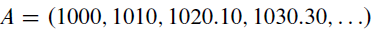
- 分析存单价值的变化

<!-- slide: 4 -->

## 对变化进行建模

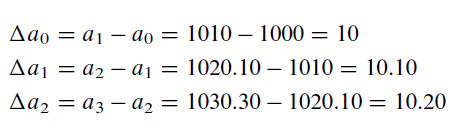
- 一阶差分结果如下：
- 若n是月数，而an是n个月后储蓄存单的价值，那么每个月价值的变化（或利息增长）由第n个差分来表示：
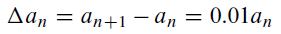
- 该表达式也可以改写如下：
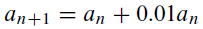

<!-- slide: 5 -->

## 对变化进行建模

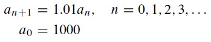
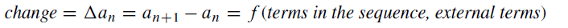
- Dynamical systems（动力系统）能够描述从一个周期到下一个周期的变化。知道了该序列中的某一项就可以通过差分方程算出紧跟着它的下一项，但是不能直接算出任意特定项的值（如100个周期后的储蓄值），我们可以迭代这个序列到a100来得到该项的值。
- 在大部分例子中，用数学方式描述变化不会像这里所说的那么精确，常常需要画出变化，观察模式，然后用数学描述变化，即，试图寻求函数

<!-- slide: 6 -->

## 对变化进行建模

- 例2 (酵母培养物的增长)
- 图中数据是从测量酵母培养物增长的实验收集来的，可以假设种群的变化和当前种群量的大小成比例
- 请分析酵母增长的规律
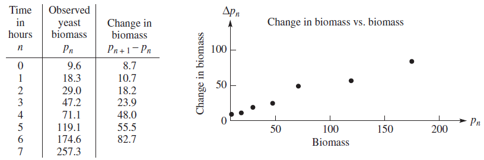
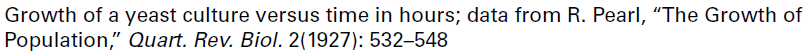

<!-- slide: 7 -->

## 对变化进行建模

- 上图假设酵母菌的增长是与当前值呈正比：
- 估算该直线的斜率为k=0.5:
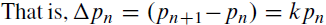
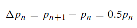
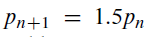

- 种群量总是增长！！！

<!-- slide: 8 -->

## 对变化进行建模

- 受限区域内（如某些资源只能支持最大限度的种群量而无法支持无限增长的种群量）酵母培养增长情况

<!-- slide: 9 -->

## 对变化进行建模

- 从种群量对时间的图形看，种群量趋于一个极限值或容纳量.
- 估计容纳量为665.
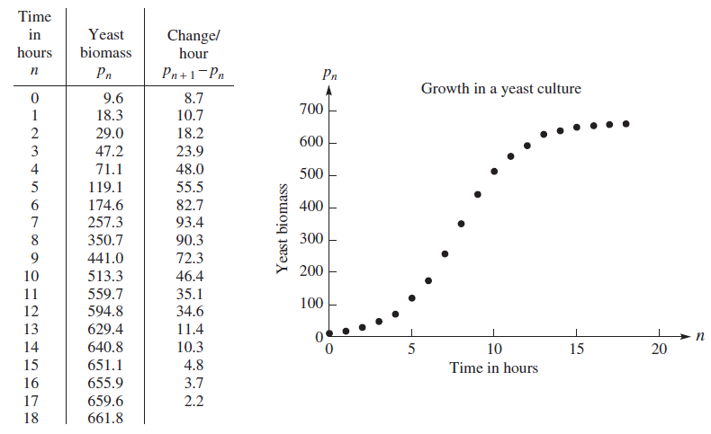
- 基于容纳量，改进模型如下：

- 注：当pn趋近665时，变化变得越来越小

<!-- slide: 10 -->

## 对变化进行建模

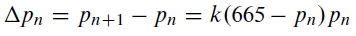
- 画出pn+1-pn对                  的图形.
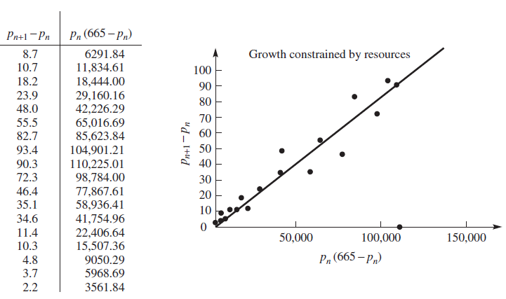
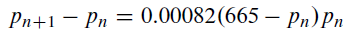

<!-- slide: 11 -->

## 对变化进行建模

- 上述方程是非线性，通常无法求，得用n来表示pn的公式解。
- 但是可以通过迭代的方式给出p1, p2, …, pn。

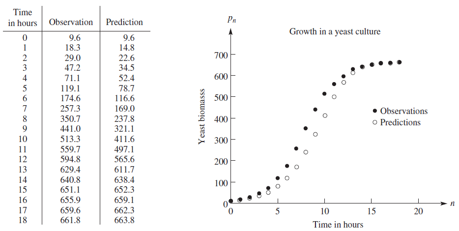

<!-- slide: 12 -->

## 线性动力系统

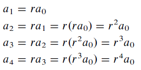
- 线性动力系统：an+1=ran，其中r为任意非零常数
- ak=rka0
- 其中a0为给定的初值

<!-- slide: 13 -->

## 线性动力系统

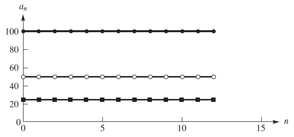
- r = 1
- an+1=ran（r为常数）时的长期行为
- an+1=an

<!-- slide: 14 -->

## 线性动力系统

- an+1=ran（r为常数）时的长期行为
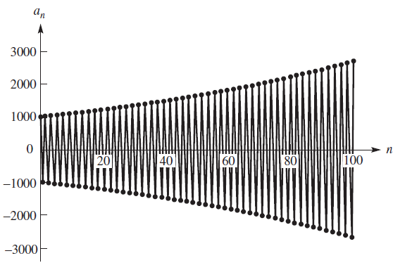
- r为负数时

<!-- slide: 15 -->

## 线性动力系统

- an+1=ran（r为常数）时的长期行为
- 0 < r < 1
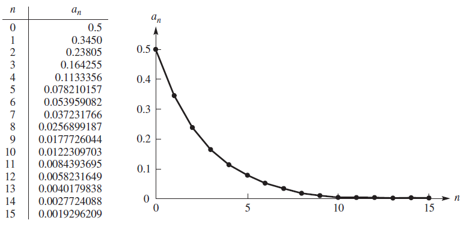
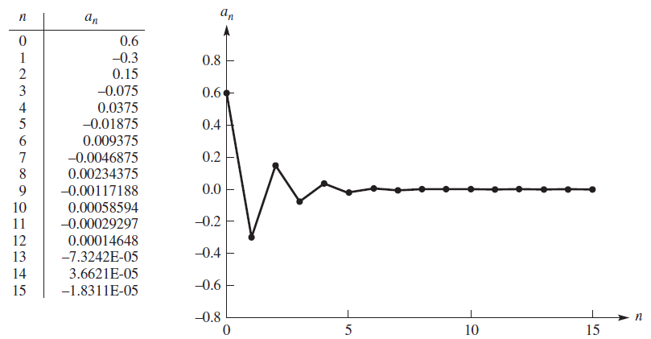
- -1 < r < 0
- 0附近振荡
- 衰减至0

<!-- slide: 16 -->

## 线性动力系统

- 线性动力系统：an+1=ran+b，其中r和b均为常数
- 定义 当a0=a时，如果对所有的k=1, 2, …，均有ak=a，则将数a称为动力系统an+1=f(an)的平衡点或不动点，即ak=a是该动力系统的常数解。
- 在了解诸如an+1=ran+b动力系统的长期行为时，上述平衡点是有作用的。

<!-- slide: 17 -->

## 线性动力系统

- 例 3 (地高辛处方)
- 地高辛用于治疗心脏病患者，存在问题：如何考虑地高辛在血液中的衰减问题以开出能使地高辛浓度保持在可接受水平上的剂量处方？
- 假定开了每日0.1毫克的地高辛剂量处方，且知道在每个剂量周期末还剩留一半地高辛。则可以得出：
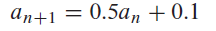

<!-- slide: 18 -->

## 线性动力系统

- 考虑三个不同的初始值或初始剂量
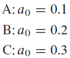
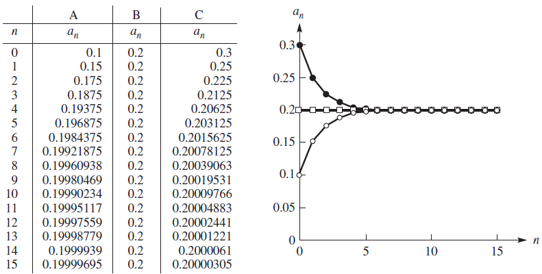
- 平衡点

<!-- slide: 19 -->

## 线性动力系统

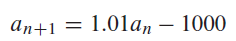
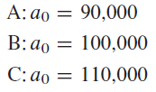
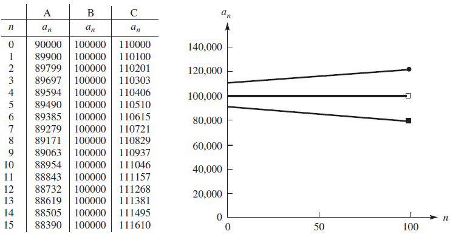
- 平衡点

<!-- slide: 20 -->

## 线性动力系统

<!-- slide: 21 -->

## 线性动力系统

- 对于动力系统
- an+1=ran+b,  b0
- 1）若|r|<1，稳定平衡点
- 2）若|r|>1，不稳定平衡点
- 2）若r=1，无平衡点，图形是一条直线

<!-- slide: 22 -->

## 线性动力系统

<!-- slide: 23 -->

## 非线性动力系统

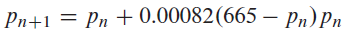
- 上述公式可重写为：
- 其中
- 测试：a0=0.1 以及不同的r取值:
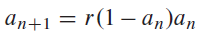
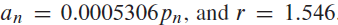
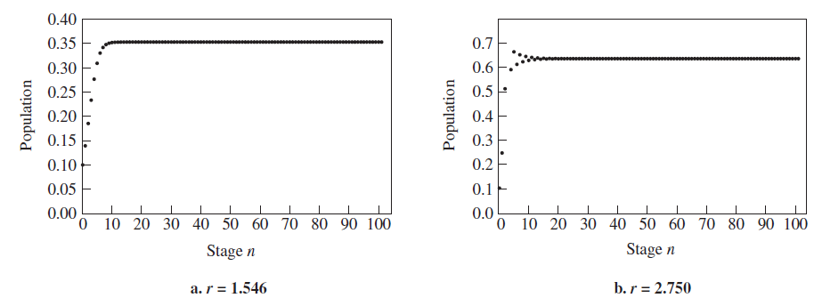
- 趋近0.35
- 0.65附近震荡

<!-- slide: 24 -->

## 非线性动力系统

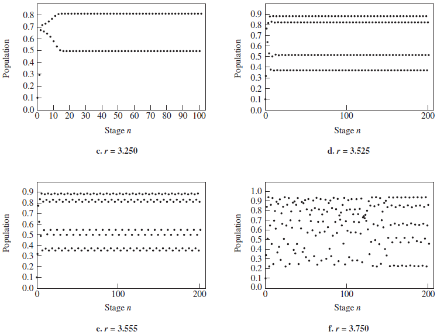
- 振荡趋于0.5、0.8
- 四循环
- 八循环
- 无序

<!-- slide: 25 -->

## 差分方程组

- 例: 斑点猫头鹰和隼
- 一种斑点猫头鹰在其栖息地（该栖息地也支持隼的生存），假定在没有其他种群存在的情形下，每个单独的种群都可无限地增长，即，在一个时间区间里其种群量的变化与该时间区间开始时的种群量成正比。
- On: 斑点猫头鹰在第n天结束时的种群量；Hn:与之竞争的隼的种群量。则：
- 其中k1与k2 是增长率，都是正常数。
- 第二个种群的存在是为了降低另一个种群的增长率，反之亦然。
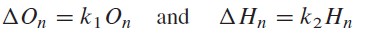

<!-- slide: 26 -->

## 差分方程组

- 假设增长率的减少与On与Hn的乘积成比例：
- 对第n+1项表示的上述方程组为：
- 假设k1 =0.2, k2 =0.3, k3 =0.001，k4 =0.002, 则
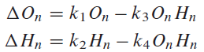
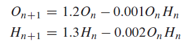
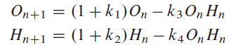

<!-- slide: 27 -->

## 差分方程组

- 根据平衡点定义：
- 代入方程：
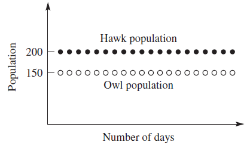
- (O = 0, H = 0)
- (O = 150, H = 200)
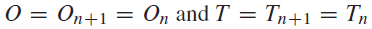
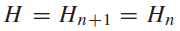
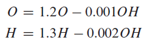
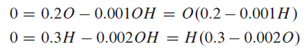

<!-- slide: 28 -->

## 差分方程组

- 敏感性分析：假设栖息地放置了350头猫头鹰和隼
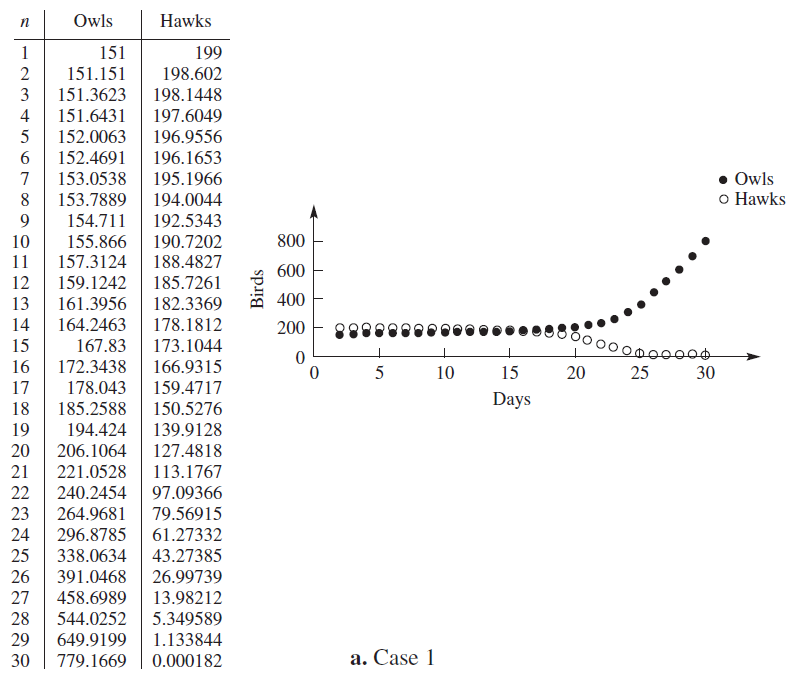
- 1）如果151头为猫头鹰，猫头鹰将无限增长，而隼会消失

<!-- slide: 29 -->

## 差分方程组

- 敏感性分析：假设栖息地放置了350头猫头鹰和隼
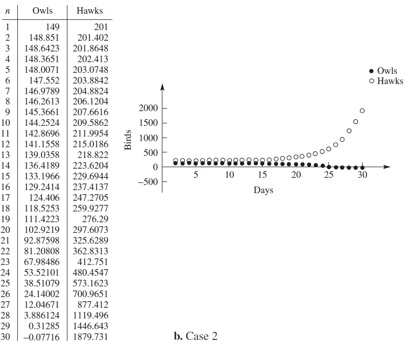
- 2）如果149头为猫头鹰，隼将无限增长，而猫头鹰将会消失

<!-- slide: 30 -->

## 差分方程组

- 敏感性分析：假设栖息地放置了350头猫头鹰和隼

- 2）如果149头为猫头鹰，隼将无限增长，而猫头鹰将会消失
