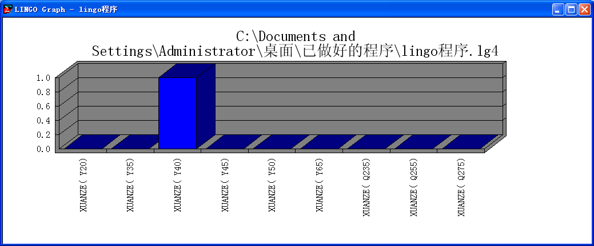
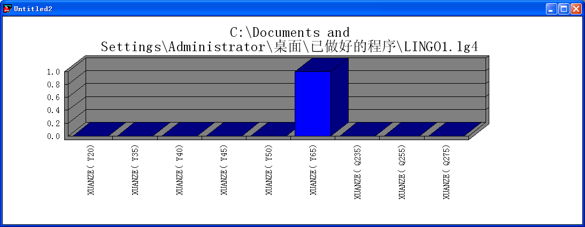
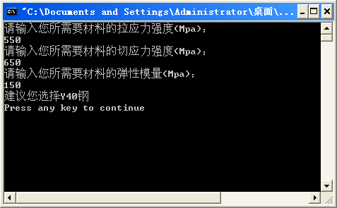
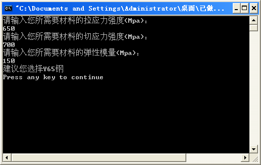
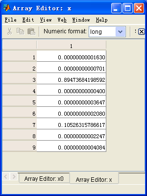
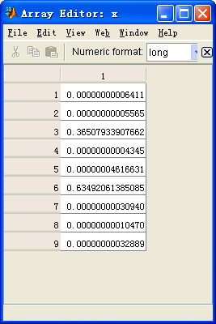

# 材料选择模型

**材料学院   程昊**   **4163班**

**问题分析：**

**在工程中经常困扰工程人员的问题就是工程材料的选择，工程材料既要达到材料力学性能要求又要达到经济便宜节约成本。其中材料的力学性能要求属于基础要求是必须达到的，而节约经济成本只是尽量而为，建模的关键是在满足力学性能的要求下如何使经济成本最低。**

**材料的力学性能由工程人员通过《材料力学》知识计算提出（包括材料的拉应力强度 切应力强度 弹性模量），经济性包括购买价格及使用寿命（其他过多的条件忽略）。**

**此类多目标优化问题最常用的方法是利用saaty建立的层次分析法（AHP）将问题化为目标层、准则层及方案层，通过建立比较矩阵求权向量。**

**但为了使问题的解决更合理且易求解，本人创新建立了一种模型。即使力学性能成为必须达到的约束条件，经济性成为我们需要求最值的目标函数。而经济性的模型建立为购买价格与使用寿命的商值。**

**另外本人未采用老师给提供的材料库，因为老师提供的材料性质差异过大，建模不是十分必要（工程人员通过经验就可以解决选择）。工程中最常出现的材料是普通碳素钢（牌号Q235 Q255 Q275）和优质碳素钢（牌号：Y20 Y35 Y40 Y45 Y50 Y65）.这类材料性能差别不大，而经济性存在差异，它们的选择困绕着工程人员。本着通过数学建模解决专业实际问题的角度出发，本人利用自己的专业知识建立了材料库（详见excel表格）。**

模型假设：
1. **在选择材料时只考虑材料的力学性能（拉应力强度 切应力强度 弹性模量），与经济性（购买价格及使用寿命），其他条件（比如说自重，工程材料受力主要来源于机械运动，自重影响很小，且不同的工程材料密度相似）忽略不考虑。**
1. **工程人员需要的材料必出现在材料库中。**
1. **工程人员提出要求只选择一种材料。**

**符号声明：**

**A**                               **经济性**

**B**                               **购买价格（元）**

**C**                               **使用寿命（天）**

**D**                             **材料的拉应力强度（Mpa）**

**E**                             **材料的切应力强度（Mpa）**

**F**                             **材料的弹性模量**

**G**                   **需求的材料的最小拉应力强度（Mpa）** **H**                   **需求的材料的最小切应力强度（Mpa）**

**L**                         **需求的材料的最小弹性模量**

**模型建立：**

**目标函数：P=B/C**

**约束条件：1.D>=G**

**2.E>=H**

**3.F>=L**

**4.只选择一种材料**

**问题转化为在约束条件下求目标函数最小值问题**

**程序设计：**

**1.Lingo：**

a.流程：

**1.建立材料集（成员为各种材料，属性为价格 强度等）**

**2.确立经济性为目标函数**

**3**.**进行约束(只选用一种材料)**

**4.进行力学性能约束(强度刚度)**

**5.将各材料的性质送入程序**

**6.运行**

b.代码：

Model：

!建立材料集(成员为各种材料，属性为价格 强度等);

sets:

materials/Y20,Y35,Y40,Y45,Y50,Y65,Q235,Q255,Q275/:jiage,laqiangdu,qieqiangdu,shouming,tanxing,xuanze;

endsets

!确立目标函数(经济性);

min=@sum(materials(I):xuanze(I)*jiage(I)/shouming(I));

!进行约束(只选用一种材料);

@for(materials(I):@bin(xuanze(I)));

1=@sum(materials(I):xuanze(I));

!进行力学性能约束(强度刚度);

550<=@sum(materials(I):xuanze(I)*laqiangdu(I));

600<=@sum(materials(I):xuanze(I)*qieqiangdu(I));

150<=@sum(materials(I):xuanze(I)*tanxing(I));

!将各材料的性质送入程序;

data:

jiage=2000,2500,4100,3000,3446,5080,1500,3000,2790;

laqiangdu=412,529,570,598,630,696,380,470,490;

qieqiangdu=522,639,689,698,740,799,450,570,590;

shouming=365,365,730,365,547,730,365,547,547;

tanxing=100,150,200,200,100,150,200,150,200;

enddata

end

**2.C语言：**

**a.流程：**

**1各种材料性能数据的录入（由程序员进行）**

**2.用户需求的性能输入（由查询用户进行）**

**3.通过循环计算所有材料的经济性**

**4.通过循环选出性能合适的材料**

**5.** **通过循环比较性能合适材料的经济性,求出最好的(算法类似冒泡法排序).**

**6.输出查询结果.**

**b.代码：**

#include<stdio.h>

void main()

{

/*各种材料性能数据的录入（由程序员进行）*/

int a,b,c,i=0,j,k=0,l,m,n;

int d[9]={412,529,570,598,630,696,380,470,490};

int e[9]={522,639,689,698,740,799,450,570,590};

int f[9]={365,365,730,365,547,730,365,547,547};

int g[9]={100,150,200,200,100,150,200,150,200};

int h[9]={2000,2500,4100,3000,3446,5080,1500,3000,2790};

int y[9];

int z[9];

/*用户需求的性能输入（由查询用户进行）*/

printf("请输入您所需要材料的拉应力强度(Mpa)：\n");

scanf("%d",&a);

printf("请输入您所需要材料的切应力强度(Mpa)：\n");

scanf("%d",&b);

printf("请输入您所需要材料的弹性模量(Mpa)：\n");

scanf("%d",&c);

/*模型计算循环*/

for(j=0;j<=8;j++) z[j]=(h[j])/(f[j]);

/*筛选材料性能（选出性能可用的材料）循环*/

for(n=0;n<=8;n++)

{

if(d[n]>=a&&e[n]>=b&&g[n]>=c)

{

y[k]=n;

k++;

}

}

/*比较可用材料经济性循环*/

for(l=0,m=z[(y[0])];l<=k-1;l++)

{

if(m<=z[(y[l])])

{

i=y[l];

m=z[(y[l])];

}

}

/*将性能满足，经济性最好的材料牌号交给查询用户*/

switch(i)

{

case 0: printf("建议您选择Y20钢\n"); break;

case 1: printf("建议您选择Y35钢\n"); break;

case 2: printf("建议您选择Y40钢\n"); break;

case 3: printf("建议您选择Y45钢\n"); break;

case 4: printf("建议您选择Y50钢\n"); break;

case 5: printf("建议您选择Y65钢\n"); break;

case 6: printf("建议您选择Q235钢\n"); break;

case 7: printf("建议您选择Q255钢\n"); break;

case 8: printf("建议您选择Q275钢\n"); break;

default:printf("没有合适材料\n");

}

}

**3.Matlab:**

a.流程：

**1.建立目标函数的矩阵**

**2.建立性能的约束矩阵（不等式约束）**

**3.建立只选择一种材料的约束矩阵（等式约束）**

**4.为解向量设立约束条件**

**5.调用matlab优化工具箱中**linprog**函数求解**

**b.代码：**

f=[5.48,6.85,5.62,8.22,6.30,6.96,4.11,5.49,5.10];%目标函数

A=[1,1,1,1,1,1,1,1,1;-412,-529,-570,-598,-630,-696,-380,-470,-490;-522,-639,-689,-698,-740,-799,-450,-570,-590;-100,-150,-200,-200,-100,-150,-200,-150,-200];

b=[1,-550,-600,-150];%不等式约束（性能）

C=[1,1,1,1,1,1,1,1,1];

d=[1];%等式约束（只等选择一种材料）

xm=[0;0;0;0;0;0;0;0;0];%向量每个元素有下界

xM=[1;1;1;1;1;1;1;1;1];%向量每个元素有上界

x0=[0,0,0,0,0,0,0,0,0];%初始顶点

[x,fval]=linprog(f,A,b,C,d,xm,xM,x0);%调用求解

**运行结果测试：**

**假设工程人员需要1.拉应力强度** **550Mpa**  **切应力强度600Mpa**    **弹性模量150**

**2.拉应力强度** **650Mpa**  **切应力强度700Mpa**   **弹性模量150**

**Lingo结果**

**1.**

****

**选用优质碳素钢40号钢**

**2.**

****

**选用优质碳素钢65号钢**

**C程序结果**

**1.**

****

**选用优质碳素钢40号钢**

**2.**

****

**选用优质碳素钢65号钢**

**matlab结果**

**1．**

****

**选择3号对应的优质碳素钢40号钢(3所占最大最接近1)**

**2.**

****

**选择6号所对应的优质碳素钢65号钢（同理）**

**各种建模软件解决此问题的比较：**

**Lingo：能直接给出选择结果，代码较短，但需编程人员水平较高，**

**且不能实施动态处理，需要工程人员有一定软件水平。**

**C：编程较复杂，代码长，但可实施动态处理，对工程人员选择材料**

**来说较方便使用**

**Matlab：编程简单，但需对结果进行分析，结果有不准确的可能性。**
