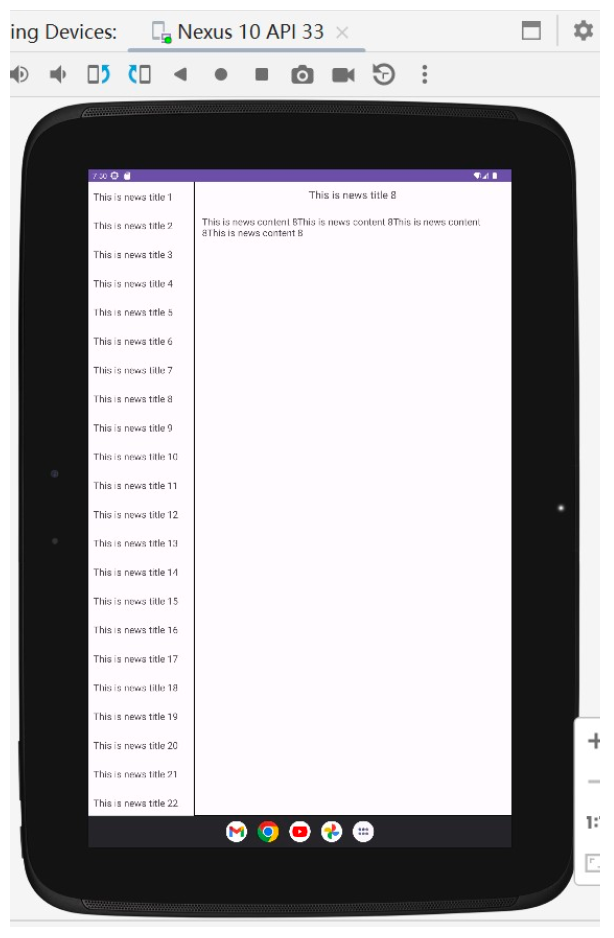
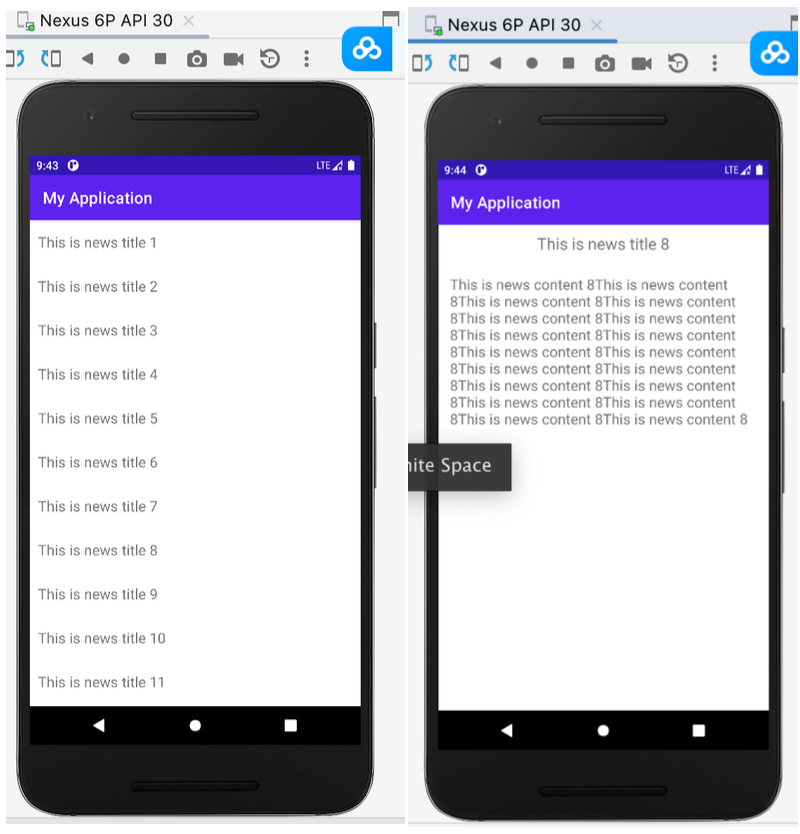
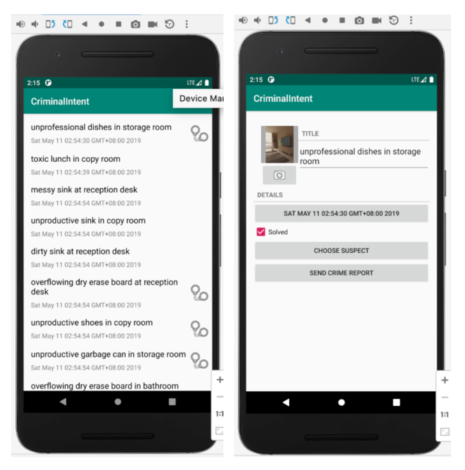
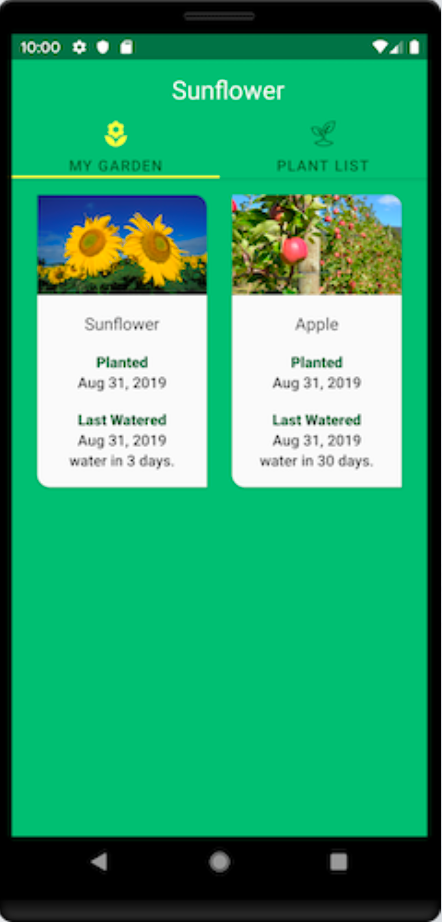

# 实验3案例

<!-- page: 1 -->

华南理工大学
《移动应用开发 - Android》课程实验3案例

1. NewsAPP 新闻列表应用
一个简易版的新闻应用，要求兼容手机和平板用于展示新闻。在平板和手机上展示
的效果分别如下图所示。
本案例的示例代码简单，只涉及列表显示、详情显示。数据库操作部分需自行设计
并实现。

<!-- page: 2 -->

2. CriminalIntent APP

功能：用于“办公室吐槽”的随手记，记录队友们一些令人厌烦的行为，比如：把脏
盘子放在休息室里、打印完文件后不加纸就离开公用打印机等等。
CriminalIntent APP 中记录的内容包括行为名称（标题）、日期、详情和照片等。
用户还可以从其联系方法中识别出这人是谁，并通过电子邮件或其他方式通知。
CriminalIntent APP 的用户界面是如下图所示的列表：主屏幕显示所有记录，用户
可以添加新的行为，也可以选中某现有的行为，以便查看和编辑其详细信息。
本案例的示例代码涉及数据库、⽹络数据获取、第三⽅API等内容，易错。有兴趣
的同学可参考，本实验中只需要实现列表显示、详情显示、数据库操作部分。

<!-- page: 3 -->

3. Sunflower APP
功能：展示花园的植物
用户界面的主屏幕显示所有植物，用户可以选中某植物，查看其详细信息。也可以
选中植物，放入自己的花园。
本案例的示例代码涉及数据库、⽹络数据获取、第三⽅API等内容，易错。有兴趣
的同学可参考，本实验中只需要实现列表显示、详情显示、数据库操作部分。

