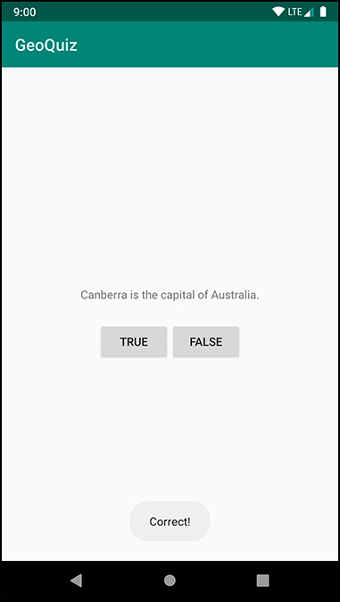

# GeoQuiz V

<!-- page: 1 -->

GeoQuiz

GeoQuiz consists of one Activity (MainActivity) and a layout(activity_main.xml):

MainActivity will manage the user interface, or UI, shown in Figure 1.1.

A layout defines a set of UI objects and the objects’ positions on the screen. A
layout is made up of definitions written in XML. Each definition is used to create
an object that appears onscreen, like a button or some text.

GeoQuiz will include a layout file named activity_main.xml. The XML in this file
will define the UI shown in the above figure.

Step 1. Create an Android project

1.
Open Android Studio and create an Android project. Choose Empty
View Activity -> Enter GeoQuiz as the application name ->  For package
name, enter com.example.geoquiz -> For the project location, use any
location on your filesystem that you want.  -> Select Kotlin from the
Language drop-down menu.  -> Select a Minimum API level of API 21: Android
5.0 (Lollipop). -> Make sure the checkbox next to Use AndroidX artifacts is
checked. -> Finish

<!-- page: 2 -->

2.
Click Finish. Android Studio will create and open your new project.

3.
Click the tab for the layout file, activity_main.xml -> Open the file. ->
Use the Design or Code tab.

By convention, a layout file is named based on the activity it is associated
with. Its name begins with activity_, and the rest of the activity name
follows in all lowercase, using underscores to separate words.

eg. The layout file for an activity called SplashScreenActivity would be
named activity_splash_screen.

Views are the building blocks you use to compose a UI. Everything you see
on the screen is a view. Views that the user can see or interact with are
called widgets. Some widgets show text, like textviews. Some widgets show
graphics. Others, like buttons, do things when touched.

Something has to tell the widgets where they belong onscreen. A
ViewGroup is a kind of View that contains and arranges other views. A
ViewGroup does not display content itself. ViewGroups are often referred
to as layouts. ConstraintLayout is the default activity layout responsible
for laying out its sole child, a TextView widget.

Edit the text contents of activity_main.xml to define these widgets in your
layout XML. Each element has a set of XML attributes. Each attribute is an
instruction about how the widget should be configured.

WIDGET ATTRIBUTES

android:layout_width and android:layout_height: required for almost every type
of widget. typically set to either match_parent( view will be as big as its parent )
or wrap_content( view will be as big as its contents wrap_content require )

android:text: It tells the widget what text to display. You can give a widget a
hardcoded string, like android:text="True", but it is usually not a good idea.
Placing strings into a separate file and then referencing them is better.

Here, they are references to string resources, as denoted by the @string/
syntax.  A string resource is a string that lives in a separate XML file called
a strings file.

The string resources you are referencing in activity_main.xml do not exist
yet. Let’s fix that.

Step 2. CREATING RESOURCES

<!-- page: 3 -->

Every project includes a default strings file named res/values/strings.xml.

Open res/values/strings.xml. The template has already added one string
resource for you. Add the three new strings that your layout requires.

<resources>
    <string name=“app_name">GeoQuiz</string>
    <string name="question_text">Canberra is the capital of Australia.</string>
    <string name="true_button">True</string>
    <string name="false_button">False</string>
</resources>

Now, whenever you refer to @string/false_button in any XML file in the
GeoQuiz project, you will get the literal string “False” at runtime.

The default strings file is named strings.xml, but you can name a strings file
anything you want. You can also have multiple strings files in a project.

Step 3. PREVIEWING THE LAYOUT

Your layout is now complete. Switch back to activity_main.xml and preview
the layout in the Design pane by clicking the tab of the editor tool window.
This shows how the layout would look on a device, including theming.

In addition to previewing, you can also build your layouts using the palette
that contains all of the built-in widgets in the layout editor. You can drag
these widgets from the palette and drop them into your view. The
graphical editor especially valuable when working with ConstraintLayout.

When you created the GeoQuiz project, a subclass of Activity named
MainActivity was created for you. The onCreate(Bundle?) function is called
when an instance of the activity subclass is created. When an activity is
created, it needs a UI to manage. To give the activity its UI, you call
Activity.setContentView(layoutResID: Int). The function inflates a layout and
puts it onscreen. When a layout is inflated, each widget in the layout file is
instantiated as defined by its attributes. You specify which layout to inflate
by passing in the layout’s resource ID.

Step 4. RESOURCES AND RESOURCE IDS

A layout is a resource. A resource is a piece of your application that is not
code – things like image files, audio files, and XML files.

Resources for your project live in a subdirectory of the app/res directory. In
the project tool window, you can see that activity_main.xml lives in res/

<!-- page: 4 -->

layout/. Your strings file, which contains string resources, lives in res/
values/.

Not every widget needs a resource ID. In GeoQuiz, you will only interact
with the two buttons in code, so only they need resource IDs.

Notice that there is a + sign in the values for android:id but not in the
values for android:text. This is because you are creating the resource IDs and
only referencing the strings.

In an activity, you can get a reference to an inflated widget by calling
Activity.findViewById(Int). This function returns the corresponding view.
Rather than return it as a View, it is cast to the expected subtype of View.
Here, that type is Button.

Step 5. SETTING LISTENERS

Your listener will implement the View.OnClickListener interface. Start with the
TRUE button. In MainActivity.kt, add the following code to
onCreate(Bundle?) just after the variable assignments.

Type to enter textoverride fun onCreate(savedInstanceState: Bundle?) { ...
trueButton.setOnClickListener { view: View ->
// Do something in response to the click here
}
falseButton.setOnClickListener { view: View ->
// Do something in response to the click here
}
}

Step 6. Making Toasts

You are going to have a press of each button trigger a pop-up message
called a toast. A toast is a short message that informs the user of something
but does not require any input or action. You are going to make toasts that
announce whether the user answered correctly or incorrectly (Figure 1.17).

First, return to strings.xml and add the string resources that your toasts
will display.

<resources>
    <string name="app_name">GeoQuiz</string>
    <string name="true_button">True</string>
    <string name="false_button">False</string>
    <string name="correct_toast">Correct!</string>
    <string name="incorrect_toast">Incorrect!</string>
</resources>

<!-- page: 5 -->

Next, update your click listeners to create and show a toast.

override fun onCreate(savedInstanceState: Bundle?) { ...
trueButton.setOnClickListener { view: View ->
// Do something in response to the click here
Toast.makeText( this, R.string.correct_toast, Toast.LENGTH_SHORT) .show()
}
false.setOnClickListener { view: View ->
// Do something in response to the click here
Toast.makeText( this, R.string.incorrect_toast, Toast.LENGTH_SHORT) .show()
}
}

Step 7. Running on the Emulator

First, create an Android virtual device (or AVD), choose Tools → AVD

Manager. Then, click the +Create Virtual Device... button. Eg. Choose to emulate a
Pixel 2

On the next screen, choose a system image for your emulator. For this
emulator, select an x86 Pie emulator and select Next (Figure 1.19). (You
may need to follow the steps to download the emulator’s components
before you can click Next.)

You can also edit the properties of an existing emulator later. For now,
name your emulator something that will help you to identify it later and
click Finish.

Once you have an AVD, you can run GeoQuiz on it. From the Android
Studio toolbar, click the run button. Android Studio will start your virtual
device, install the application package on it, and run the app.
