# Exp_1_1_2026

<!-- page: 1 -->

移动应⽤开发(Android)

实验1-1

zhjing@scut.edu.cn
教案及提交作业：lms.scutnc.cn

<!-- page: 2 -->

⽬标

• 1. 创建 Android 开发环境

• 2. 了解并熟悉启动 Activity

• 3. 了解基本的 UI 元素使⽤

<!-- page: 3 -->

任务

• 1.  创建 Android 开发环境

• 运⾏第1个 HelloWorld App (不⽤写⼊实验报告)

• 在模拟器或者真机上运⾏，确定开发环境安装正常

• 2.  三选一实验：

• 实现案例 GeoQuiz App，增加⾳乐播放功能，运⾏

• 实现本教案中的 “WriteNumberGame” ，运⾏

• 运⾏ Android 某官⽅案例，并分析其结构

<!-- page: 4 -->

1. Android 开发环境

<!-- page: 5 -->

Android 开发环境

developer.android.com

• 1.  JDK,  Android SDK

• java —version

• 2. IDE:  Android Studio

• developer.android.google.cn

• 3. 创建并运⾏ HelloWorld App

<!-- page: 6 -->

Project WriteNumberGame

<!-- page: 7 -->

Project WriteNumberGame

•
步骤 1: 使⽤ Empty Activity 模板创

建 WriteNumberGame 项⽬

•
步骤 2：设计启动界⾯

•
5秒后，跳转到主界⾯

来⾃<<Android项⽬开发实战⼊⻔>>

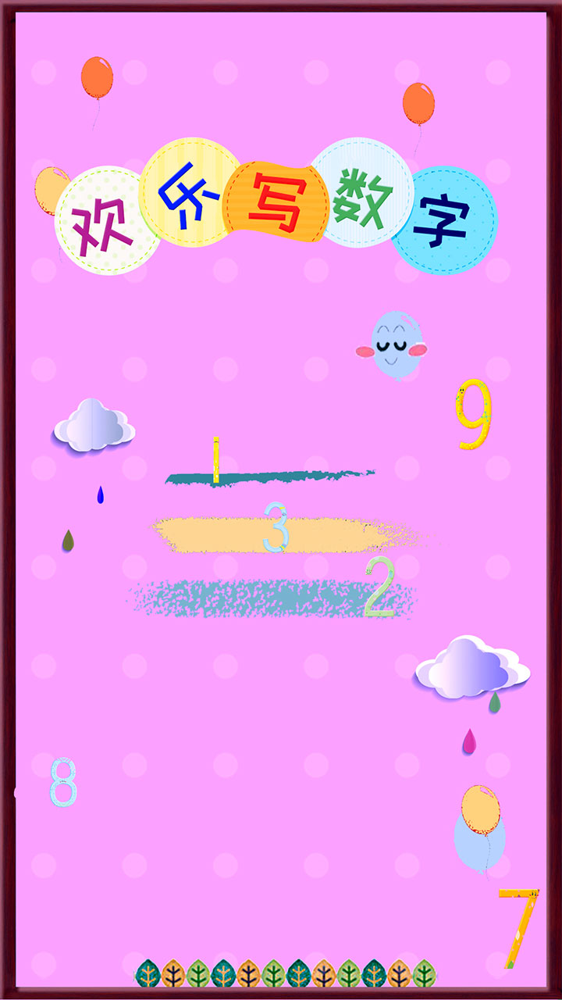

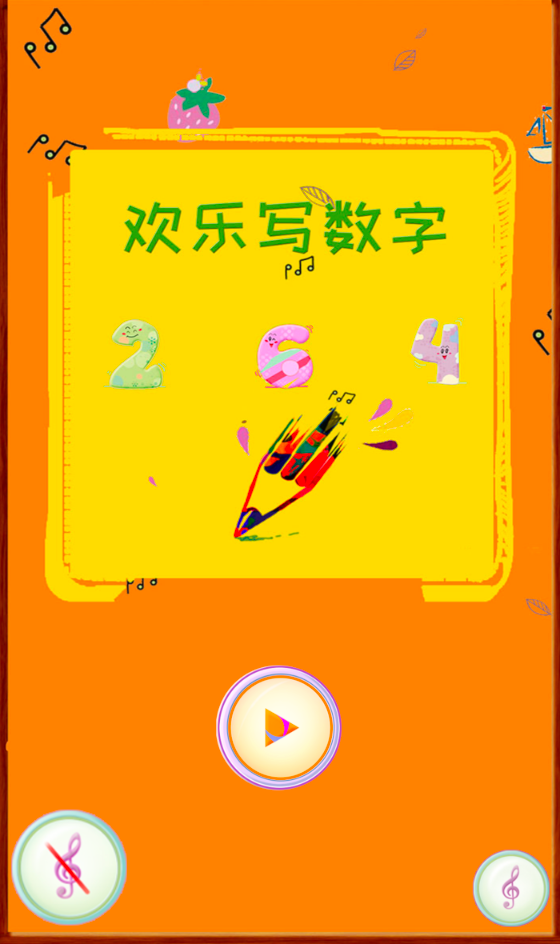

<!-- page: 8 -->

步骤 2: Launch to the Start Activity

• 1. 导⼊必需资源(resources).

• 2. 修改 layout.

• 3. 使 activity 全屏.

<!-- page: 9 -->

1. 导⼊资源(resources)

• 如果有较多图⽚，则创建新⽬录：
(resource directory)

• copy+paste

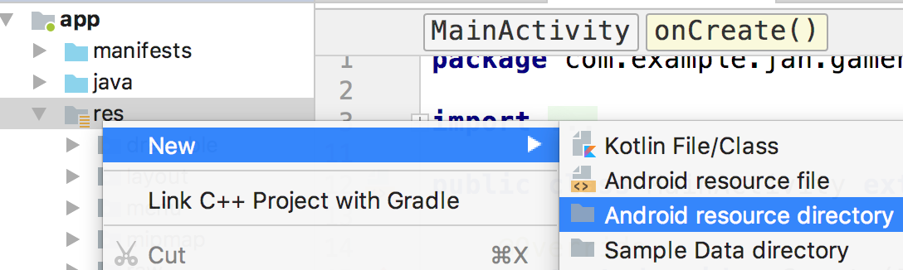

<!-- page: 10 -->

1. 导⼊资源(resources)

• drawable ⽬录⾥的⽂件：

• xml

• png

• jpg…

play_btn.xml，⽂件中的btn_play*.png 在⽬录res/mipmap下

<?xml version="1.0" encoding="utf-8"?>
<selector xmlns:android="http://schemas.android.com/apk/res/android">
    <item android:drawable="@mipmap/btn_play1" android:state_focused="false" android:state_pressed="false" />
    <item android:drawable="@mipmap/btn_play2" android:state_focused="false" android:state_pressed="true" />
    <item android:drawable="@mipmap/btn_play2" android:state_focused="false" android:state_pressed="true" />
</selector>

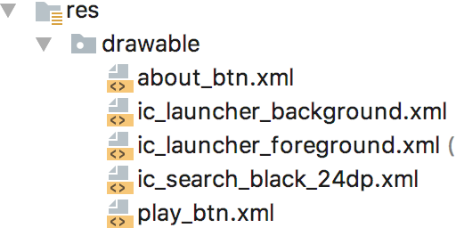

<!-- page: 11 -->

2. 修改 layout

• activity_main.xml

• background etc.

• 在模拟器上运⾏项⽬

• LinearLayout

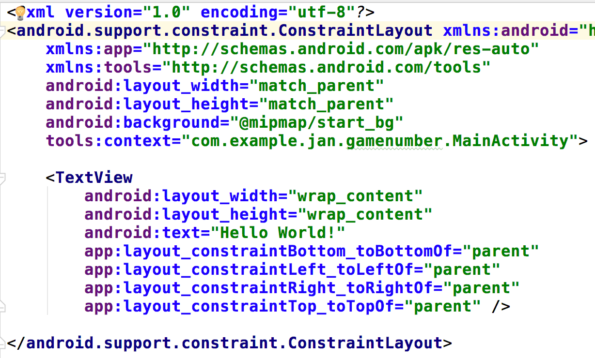

<!-- page: 12 -->

3. 检查 Manifest ⽂件

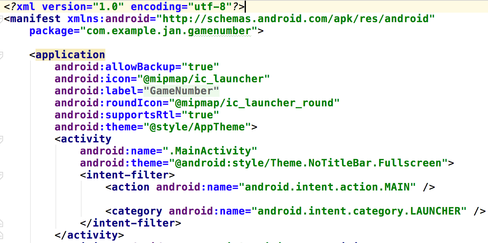

<!-- page: 13 -->

步骤 4. The Main Game Activity

• 4. 从启动 Activity 跳转到 主 Activity.

• 5. 设计对应的 layout.

<!-- page: 14 -->

4. 从启动 Activity 跳转到 主 Activity

• 刚才是启动界⾯，再创建新的空 Activity 作

为游戏的主界⾯，提供游戏功能.

• 启动界⾯ 5秒后跳转，转变为游戏主界⾯

• 确保模拟器上运⾏⽆误

<!-- page: 15 -->

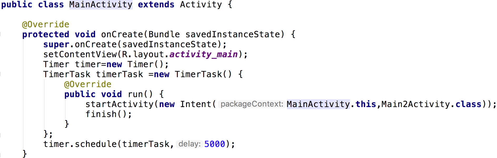

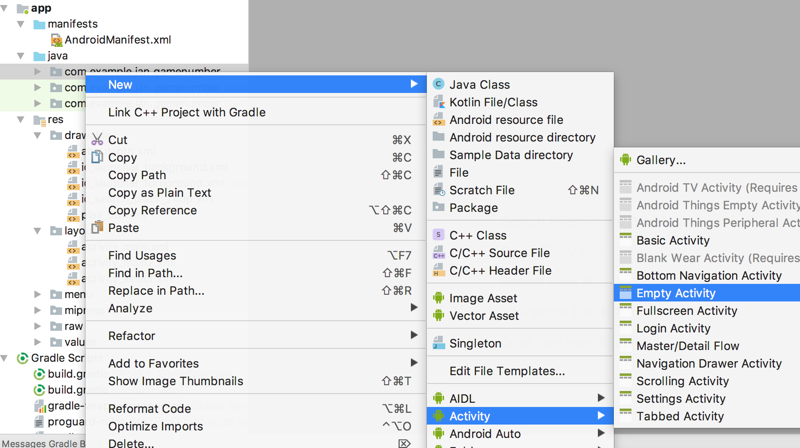

<!-- page: 16 -->

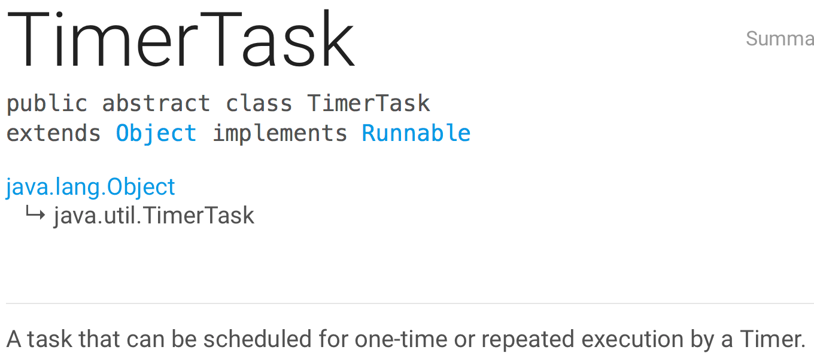

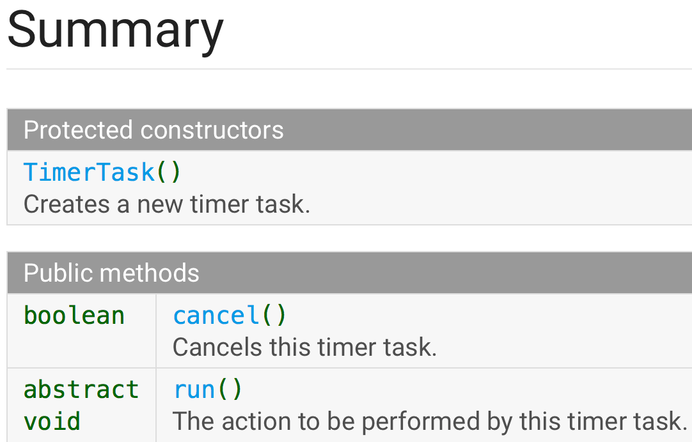

<!-- page: 17 -->

5. 设计对应的 layout

• 图⽚放⼊ drawable or mipmap.

• R.drawable.pic1; R.mipmap.pic2

• 创建新的 raw 资源⽬录，⽤于保存⾳乐⽂件

• 创建⽤于游戏主界⾯ MainActivity2 类对应的 layout

• button-1: (onPlay) 跳转到 Digit-Selection 界⾯.

• button-2: (onAbout) 跳转到 About 界⾯.

• button-3: (onMusic) ⽤于 Play or Stop ⾳乐.

<!-- page: 18 -->

<?xml version="1.0" encoding="utf-8"?>
<RelativeLayout xmlns:android="http://schemas.android.com/apk/res/android"
    xmlns:app="http://schemas.android.com/apk/res-auto"
    xmlns:tools="http://schemas.android.com/tools"
    android:layout_width="match_parent"
    android:layout_height="match_parent"
    android:background="@mipmap/main_bg"
    tools:context="com.example.jan.gamenumber.Main2Activity">

    <Button
        android:layout_width="90dp"
        android:layout_height="90dp"
        android:layout_above="@+id/btn_music"
        android:layout_centerHorizontal="true"
        android:background="@drawable/play_btn"
        android:onClick="onPlay"/>
    <Button
        android:layout_width="90dp"
        android:layout_height="90dp"
        android:id="@+id/btn_music"
        android:layout_alignParentBottom="true"
        android:layout_margin="10dp"
        android:background="@mipmap/btn_music1"
        android:onClick="onMusic" />
    <Button
        android:layout_width="60dp"
        android:layout_height="60dp"
        android:id="@+id/btn_music2"
        android:layout_alignParentBottom="true"
        android:layout_alignParentRight="true"
        android:layout_margin="10dp"
        android:background="@mipmap/btn_music1"
        android:onClick="onAbout" />
</RelativeLayout>

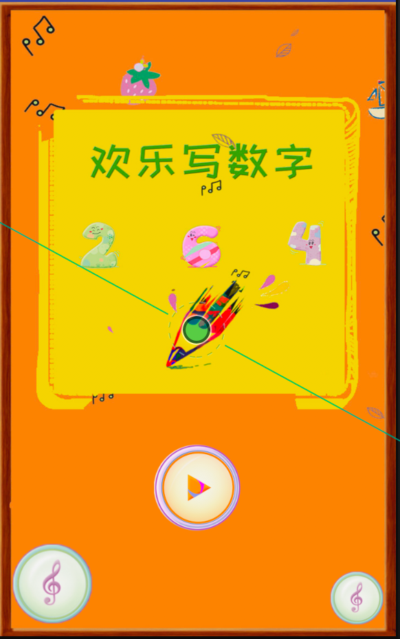

<!-- page: 19 -->

步骤 5. 要启动的其它 Activities

• 7. 创建 Digit-Selection Activity 和 About Activity.

• 8. 设计 Digit-Selection Activity 对应的界⾯.

• 9. 设计 About Activity 对应的界⾯.

• 10. 从游戏主界⾯ Activity 跳转到这2个 Activity.

• 11. 在项⽬⾥播放⾳乐.

<!-- page: 20 -->

7. 创建 Digit-Selection 和 About Activity

• ⽤ Empty Activity 模板创建 SelectActivity

• ⽤ Empty Activity 模板创建  AboutActivity

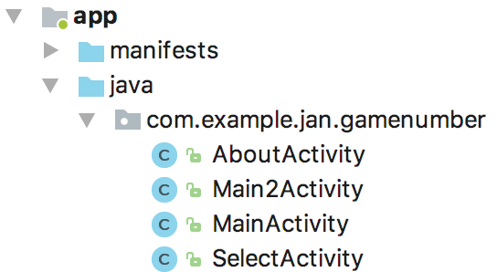

<!-- page: 21 -->

8/9. 设计对应的界⾯

• 将图⽚放⼊ drawable 或 mipmap ⽬录

• 将⾳乐⽂件 (mp3) 放⼊ raw 资源⽬录写
layout:

• activity_about.xml

• activity_select.xml

• 加⼊各种需要的控件

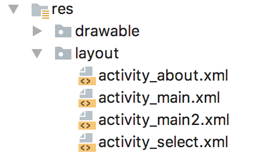

<!-- page: 22 -->

10. 从主界⾯跳转到2个界⾯

• SelectActivity: onPlay()

• AboutActivity: onAbout()

public class Main2Activity extends AppCompatActivity {

… …
public void onAbout(View view) {
    startActivity(new Intent(Main2Activity.this,AboutActivity.class));

}

public void onPlay(View view) {
    startActivity(new Intent(Main2Activity.this,SelectActivity.class));

}
… …
}

<!-- page: 23 -->

11. 在项⽬⾥播放⾳乐

• 功能描述：

• 1. ⽤户点击按钮时，播放或者停⽌⾳乐

• onMusic

• 2. 当⽤户启动项⽬，⾃动播放⾳乐。

<!-- page: 24 -->

public class Main2Activity extends AppCompatActivity {

… …
  static boolean isPlay=true;  //Music playing status
  MediaPlayer mediaPlayer;  //Music player object
  Button music_btn;  //Music playing button

@Override
protected void onCreate(Bundle savedInstanceState) {
    super.onCreate(savedInstanceState);
    setContentView(R.layout.activity_main2);
    music_btn=(Button)findViewById(R.id.btn_music);
    PlayMusic();

}

public void onMusic(View view) {
    if(isPlay){
        if(mediaPlayer!=null){
            mediaPlayer.stop();
            music_btn.setBackgroundResource(R.mipmap.btn_music2);
            isPlay=false;
        }
    }else {
        PlayMusic();
        music_btn.setBackgroundResource(R.mipmap.btn_music1);
        isPlay=true;
    }

}
… …
}

<!-- page: 25 -->

11. 在项⽬⾥播放⾳乐

• 3. 当其它 Activity 启动，⾃动停⽌播放

• 4. 当主界⾯出现，重新播放⾳乐

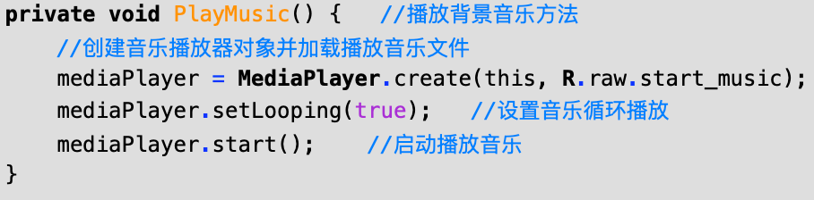

<!-- page: 26 -->

public class Main2Activity extends AppCompatActivity {

… …
@Override
protected void onStop() {
    super.onStop();
    if(mediaPlayer!=null){
        mediaPlayer.stop();
    }

}

@Override
protected void onDestroy() {
    super.onDestroy();
    if(mediaPlayer!=null){
        mediaPlayer.stop();
        mediaPlayer.release();
        mediaPlayer=null;
    }

}

@Override
protected void onRestart() {
    super.onRestart();
    if(isPlay==true){
        PlayMusic();
    }

Activity LifeCycle

}
… …
}

<!-- page: 27 -->

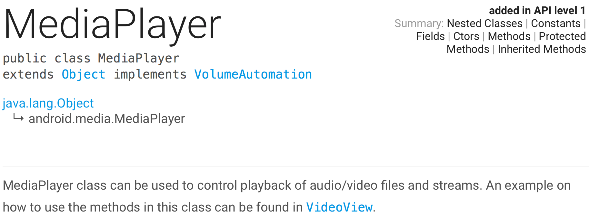

<!-- page: 28 -->

通过本实验，学习

• 1. 界⾯跳转功能

• 2. 定时功能

• 3. ⾳乐播放功能

• 4. 界⾯之间的数据传递

