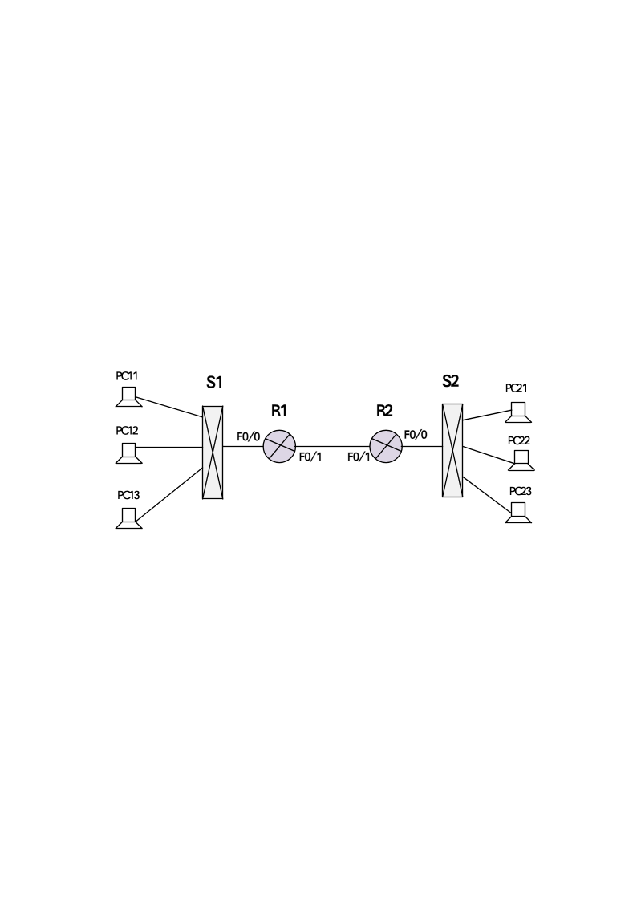
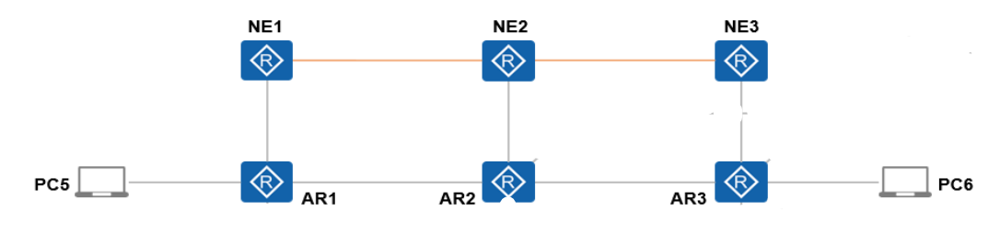

# 实验大纲-2026

**实验一**  **IPv6网络、MIB信息库和SNMP报文信息解析**

【实验目的及要求】

实验目的：
1. 学习构建IPv6网络管理环境
1. 学习使用MIB Browser工具进行查看设备信息
    1. MIB Browser的使用
    1. MIB II  信息库
    1. 通过SNMP  获得的信息分析设备状态
1. 学习通过编程的方法和使用SNMP协议，获取MIB信息库信息

（3）学习使用抓包程序查看和了解SNMP的交互过程
    1. 了解SNMPv1的Get命令。
    1. 了解SNMPv1的GetNext命令。
    1. 了解SNMPv2的GetBulk命令。

实验要求：
1. **构建**IPv6**网络管理实验环境**

构建如下图1或类似的IPv6网络环境，配置好IPv6地址、路由（可以是静态路由或动态路由），使网络互通，构建网络管理实验环境。可使用实验室的交换机或路由器，或使用华为eNSP网络模拟器构建实验环境。

图1  路由器互联

请描述构建或使用的网络管理实验环境。如通过计算节点上安装和配置SNMP代理软件来构建网络管理实验环境，请记录安装和配置过程。
1. 请给IPv6网络环境分配IPv6地址，并给出R1和R2的接口IPv6地址。
1. 请确认PC11能与PC21能ping通，并给出R1和R2的IPv6路由配置信息。
1. 请给出R1和R2的IPv6路由表。
1. **MIB工具的安装**

在管理主机上安装MIB Browser软件或其他MIB读取软件。
1. **使用MIB Browser读取设备** **MIB** **信息**

使用MIB Browser读取设备  MIB  信息，注意以下的具体步骤与构建的网络环境相关。

（注意：下面以图1为例，不同的网络环境可以参考本例自行设计具体实验步骤。）

连接运行环境下的网络设备，设置团体名，在路由器R1和R2  上开启snmp服务，设置团体名

“R1(config)#snmp-server community  r1pwd”

“R2(config)#snmp-server community  r2pwd”

然后：

（1）请给出R2系统名称（sysName）的  MIB  项和值。

（2）请给出R2可用的以太网口数目，以及第1个和第2个接口、R1第1个接口的使用情况，并计算相应的接口利用率。（注意，需要使用ping或其他产生流量，否则接口流量为0）

<table>
<tr><td>IfDescr</td><td>IfSpeed (Mbps)</td><td>ifAdminStatu</td><td>ifOper tatus</td><td>ifInOctets</td><td>ifOutO tets</td><td>接口状态</td><td>利用率</td></tr>
<tr><td></td><td></td><td></td><td></td><td></td><td></td><td></td><td></td></tr>
<tr><td></td><td></td><td></td><td></td><td></td><td></td><td></td><td></td></tr>
</table>

（3）请给出R2转发的IP包数量的MIB项和值。

（4）请给出R2接收到的ICMP消息数目和错误的ICMP消息数目的MIB项和值。
1. **使用MIB Browser** **分析网络中的设备情况**

使用MIB Browser  分析网络中的设备情况，具体步骤与构建的网络环境相关，下面以图1为例，

（1）R1中与R2相连的端口的物理接口和地址？

（2）已知连接网络设备上的PC的IP地址，通过哪个MIB变量获取PC的MAC地址？OID和值分别是什么？
1. **使用Wiresharp了解SNMP的交互过程**

**请回答：**

（1）  SNMPv1里面有哪几种操作？

（2）用抓包程序抓包，MIB Browser使用Get操作读取sysName，问request的object ID是什么，response的object ID是什么，值为什么？

（3）用抓包程序抓包，MIB Browser使用GetNext操作读取sysName (MIB Browser里面的Object ID以.0结尾)，问request的object ID是什么，response的object ID是什么，值为什么？

（4）用抓包程序抓包，MIB Browser使用GetNext操作读取sysName (MIB Browser里面的Object ID结尾去掉.0)，问request的object ID是什么，response的object ID是什么，值为什么？

（5）用抓包程序抓包，MIB Browser使用Get操作读取sysName.5  实例，  response的值为什么？如果使用GetNext操作值为什么？

（6）用抓包程序抓包，MIB Browser使用GetNext操作从ifTable里面的ifIndex开始读取，请问GetNext读取表格的方式是先列后行还是先行后列？

（7）用抓包程序抓包，MIB Browser使用表格方式浏览ifTable，请问表格方式主要使用了什么SNMP操作来完成数据的读取?  表格方式与GetNext的读取方式相同吗？

（8）用抓包程序抓包，MIB Browser  使用Get操作读取sysName,其PDU的字段有哪些?

（9）用抓包程序抓包，MIB Browser  切换成SNMPv2c,使用GetBulk操作读取sysName,其PDU的字段有哪些?

（10）  GET、GETNEX和SET报文分别由哪些部分组成?
1. **通过编程和使用SNMP协议，获取MIB信息库信息**

使用SNMP第三方API或工具，编写简单程序，获取MIB信息库信息（RFC 1213）。

**实验二  网络管理系统实例、使用及开发**

实验目的：
1. 学习使用网管系统软件，使学生基本掌握网络管理软件的安装、配置和使用方法。
1. 学习编写一个简单的网络管理系统；或学习基于P4的简单自定义网络转发功能开发。
1. 通过实验加深学生对于网络管理软件的认识。
1. 学习使用Linux网络管理命令对网络检测
    1. 网络配置相关命令。
    1. 网络测试相关命令。
    1. 网络监控相关命令。

实验要求：

**1.选择一款成熟的网络管理软件，如openNMS，了解网管系统安装、配置和使用方法**

1.1  安装网络管理软件。

1.2  使用网络管理软件，对网络进行管理

查看并记录本组路由器、服务器的各种信息（如设备信息、端口信息、告警信息等）；对组内网段进行拓扑发现。

1.3  查看并回答如下问题：
- 一般网管系统有什么主要功能？该网管系统有什么主要功能？
- 拓扑自动发现的途径有哪些？分析该系统可能采用哪种方法进行拓扑发现？（可选）

**2.使用Linux网络管理命令对网络检测**

利用Virtualbox或其他虚拟化软件，安装Linux虚拟机，并进行配置，使其能够连接互联网。

2.1使用ifconfig、arp、netstat命令获取系统的相关配置信息

2.1.1  请问你所在主机的主机名、MAC地址、IP地址、网关、DNS server分别是什么?  通过什么命令获得?

2.1.2  通过什么命令有可能获得你所在主机的网关MAC地址?  如果有，请问网关对应的MAC地址是什么？

2.1.3  察看你所在主机的路由表。写出你使用的命令。

2.2.  使用ping、traceroute、nslookup命令检测网络

2.2.1  监测你所在主机是否与其网关连通。

2.2.2  请问用你所在的主机访问www.baidu.com要经过哪些路由器，共多少跳？并写出你使用的命令。

2.2.3  请问www.scut.edu.cn的IP地址和主机名分别是什么？并写出你使用的命令。

2.3.  使用netstat命令监控主机网络使用情况

2.3.1  监测你所在主机所有已建立的有效连接。写出你使用的命令。

2.3.2  监测你所在主机使用TCP协议所开放的端口。写出你使用的命令。

2.3.3  察看你所在主机的网络统计信息，列出TCP Statistics for IPv4和总体统计信息。并写出你使用的命令。

**3.简单网络管理系统开发**

请选择3.1或3.2进行实验。描述设计的系统或算法，并进行系统或算法的测试。

**3.1** **学习并编写一个简单的网络管理系统**

3.1.1构建IPv6网络管理实验环境

构建如下图2或类似的其他网络，配置好IP地址、路由（可以是静态路由或动态路由），使网络互通，构建网络管理实验环境。

图2  路由器互联

可使用任意方法构建网络管理实验环境，例如，使用实验室的路由器，或使用华为eNSP网络模拟器构建实验环境。实现SRv6功能或其他IPv6+功能。请描述构建或使用的网络管理实验环境。

3.1.2使用SNMP第三方API或工具，设计并编写一个简单的网络管理系统，要求：（1）至少实现对3台网络设备（如路由器、交换机或Linux虚拟机）的管理；（2）实现基于NETCONF的配置管理功能；（3）实现性能管理的网络管理功能；（4）至少实现对IPv6+的一种网络管理功能。

**3.2 P4编程实验**

利用P4语言，学会使用P4编译器（p4c）和运行时控制平面（bmv2），实现一个简单的自定义网络转发逻辑，如基于MAC地址表的学习型二层交换机，支持最长前缀匹配的IPv4路由器，访问控制列表，智能网络流量分析或其他功能。可在实验室的硬件P4交换机上，或软件交换机  (BMv2)上测试。

实验报告模块如下页所示（请注意要有实验过程及结果的截图；系统或算法实现的代码需要另外打包）。

华南理工大学

《网络工程与网络管理》课程实验报告

实验题目：

姓名：                  学号：

班级：                   组别：

合作者：

指导教师：

| **实验概述** |
|---|
| 【实验目的及要求】 1  实验目的： 2  实验要求： 【实验环境】 PC机，WINDOWS操作系统，Linux操作系统，路由器，交换机 |
| **实验内容** |
| 【实验过程】 实验步骤： 二、实验数据： 三、实验主要过程： |
| **小结** |
|  |
| **指导教师评语及成绩** |
| 评语： 成绩：           指导教师签名： 批阅日期： |
