# 天地一体化网络最终版2

<!-- slide: 1 -->

## 天地一体化网络研究报告

- 组长：于博宇
- 组员：张晨，徐健睿，于智远，金嘉敏
- Groups‘ Study of New Tech

<!-- slide: 2 -->

- 1
- 天地一体化网络产生背景（于博宇）
- 4
- 该架构主要应用场景（于智远）
- 2
- 天地一体化网络目前发展（徐健睿）
- 3
- 架构基本概念与核心技术（于博宇）
- 5
- 该架构面临的问题挑战及发展方向（张晨）
- 目录：

<!-- slide: 3 -->

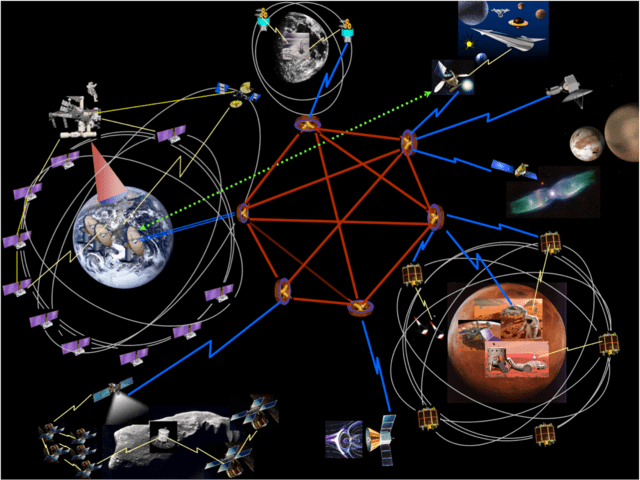
- Part 1:（于博宇）
- 天地一体化网络背景
- 天地一体化网络主要是在全球进入全新信息时代，数据传输、处理和应用需求日益增长的背景下，为了解决传统的地面网络逐渐暴露出全球覆盖不足、灾难应对能力有限、信息传输延迟和容量限制等弊端而产生的一种全新架构。

<!-- slide: 4 -->

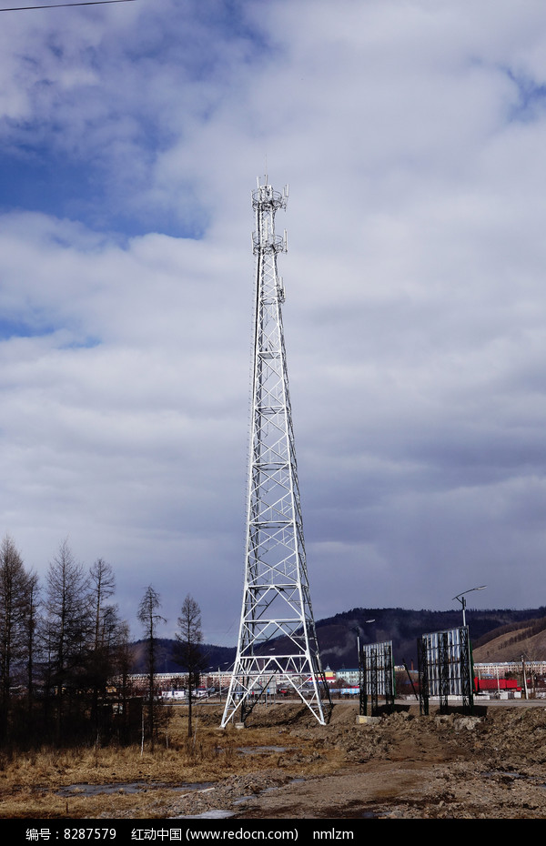
- 全球覆盖不足
- 传统的通信网络主要基于地面基站，很难覆盖偏远地区、海洋以及低人口密度区域。

<!-- slide: 5 -->

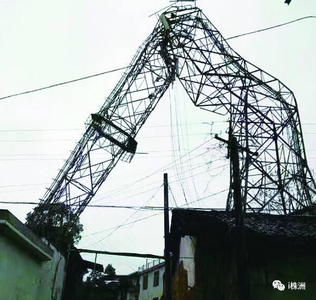
- 灾难应对能力有限
- 地面网络设施易受自然灾害（如地震、洪水）或人为破坏（如战争）影响，一旦发生重大灾害，影响救灾和信息传递。

<!-- slide: 6 -->

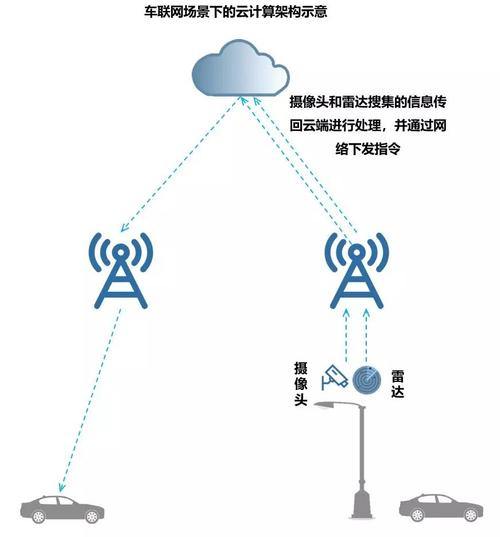
- 3.信息传输延迟、容量限制
- 随着物联网的发展，对数据的需求越来越高。传统网络在延迟和容量方面存在局限，难以满足未来的发展需求。
- 由左图我们也能看出这个架构在未来信息时代的重要支撑作用

<!-- slide: 7 -->

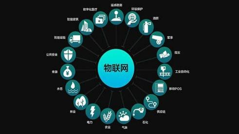
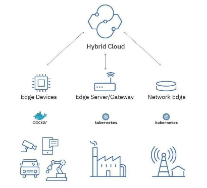
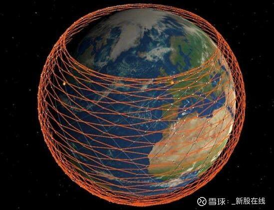
- Part 2：（徐健睿）
- 发展现状
- 当前，天地一体化网络的发展正处于快速变革的阶段，引领着数字化、智能化和全球化的发展趋势。
- 天地一体化网络在边缘计算、物联网和区块链技术等方面都有热门发展趋势和具体应用。

<!-- slide: 8 -->

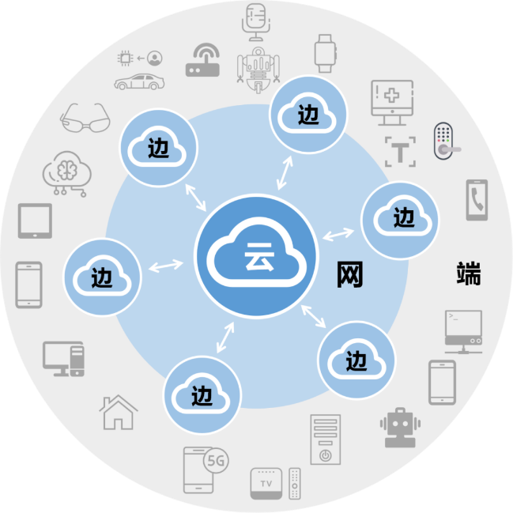
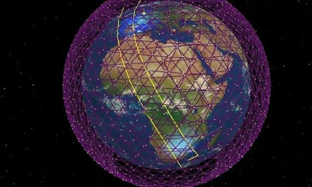
- 天地一体化网络目前发展及实际案例
- 边缘计算：天地一体化网络在边缘计算领域的作用主要体现在提供更广泛的网络覆盖、低延迟的数据传输、强大的计算和存储能力，以及更加安全和可靠的通信支持。这些特点使得天地一体化网络能够更好地满足边缘计算的需求，推动边缘计算技术的发展和应用。主要体现在传感器数据处理、边缘智能化、网络安全这几个方面。相关案例包括：5G边缘计算、卫星边缘计算、航空边缘计算。
- 总的来说，天地一体化网络在边缘计算领域的应用与发展将为各种行业带来更多可能性，加速数字化转型进程，提升生产效率和服务质量。

<!-- slide: 9 -->

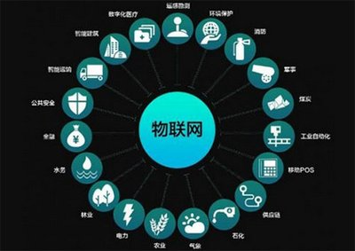
- 天地一体化网络目前发展及实际案例
- 物联网大规模应用：天地一体化网络在物联网大规模应用中发挥着关键作用，通过整合多种网络资源，实现更广泛的覆盖、大规模连接、低延迟通信和强大的安全保障，推动物联网技术的发展和应用。
- 主要体现在：提供更广泛的覆盖范围、支持大规模连接、实现低延迟的通信、有强大的安全保障。发展案例有智慧城市、农业物联网、工业物联网等。

<!-- slide: 10 -->

- 天地一体化网络目前发展及实际案例
- 区块链技术应用：天地一体化网络提高数据的安全性、建立信任、实现智能合约和促进数据共享，从而推动区块链技术在物联网领域的应用和发展。通过不断的技术创新和实践，可以探索更多基于天地一体化网络和区块链技术的物联网解决方案，拓展物联网在各个领域的应用范围和深度。
- 主要体现在安全性加强、身份识别与权限管理、数据共享和可追溯性这几个方面。发展案例有智能物流与智能能源管理。

<!-- slide: 11 -->

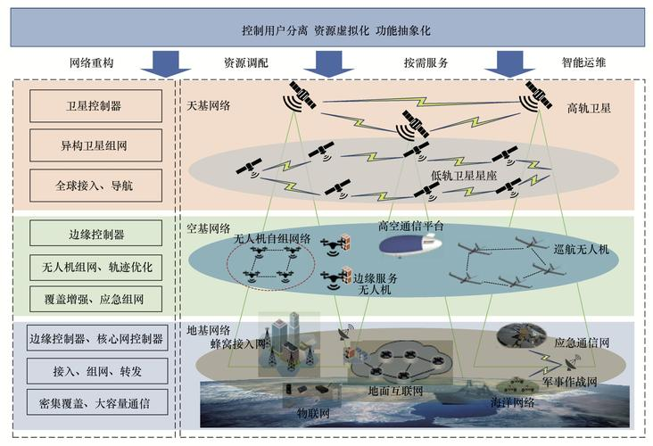
- Part 3:（于博宇）
- 基本概念与核心技术
- 基本概念：天地一体化网络是综合利用天基（卫星）地基（信号塔）及海基（信号船及信号浮标平台）等多种通信手段，实现全球范围内高效、可靠和无缝通信覆盖的先进网络概念。

<!-- slide: 12 -->

- 动态网络管理技术：以高效的网络管理和优化技术来实现资源动态分配、实时优化及快捷排障。
- 核心技术

<!-- slide: 13 -->

- 空间信息网络技术：卫星网及连系（互相&其他基站）通信的设计，能够确保信息的高速、稳定传输。
- 核心技术
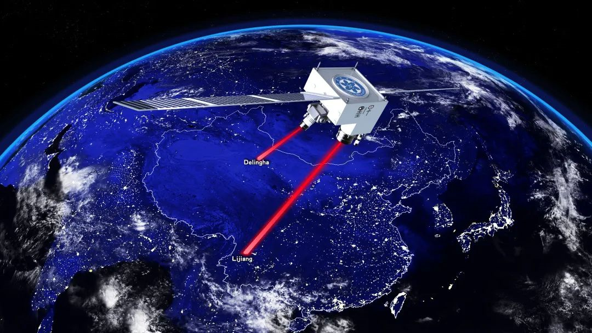

<!-- slide: 14 -->

- 卫星技术：天地一体化网络的重要组成部分，包括低轨（LEO）、中轨（MEO）、高轨（GEO）能够实现全球范围内的信息传递。
- 核心技术
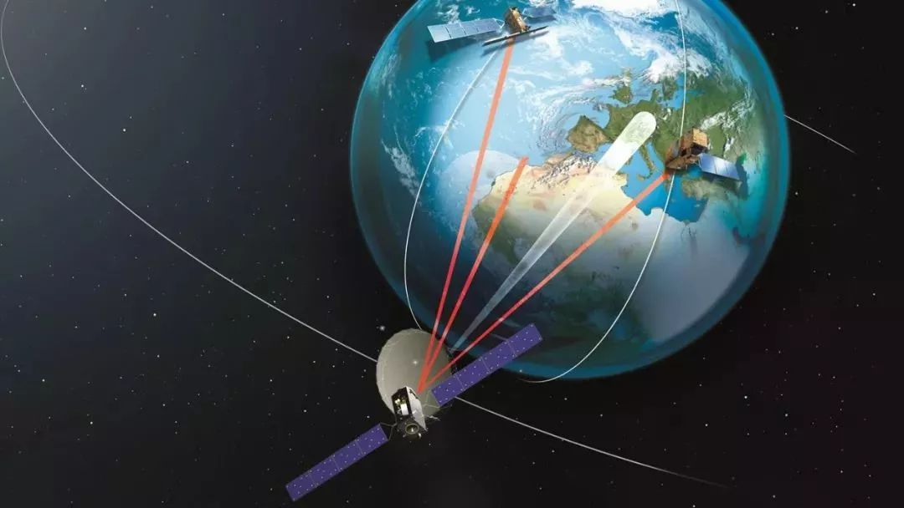

<!-- slide: 15 -->

- 核心技术
- 异构网络融合技术：天地一体化网络需要整合不同类型的网络（如卫星网络、地面移动网络、互联网等），这就要求有强大的网络融合技术，包括网络接入技术、协议转换技术等，以实现网络间的无缝连接和互操作性。 深入理解
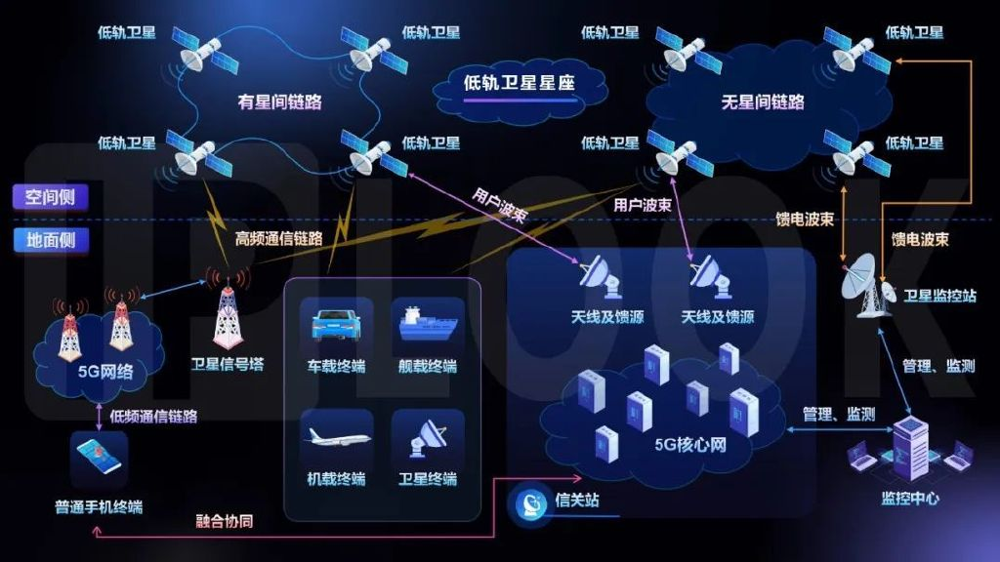

<!-- slide: 16 -->

## Part 4:（于智远）架构主要应用场景

- 天地一体化网络的应用场景主要集中在需要覆盖范围广泛、稳定性要求高的场合，通过整合地面网络与卫星网络资源，实现更加全面和可靠的通信服务。
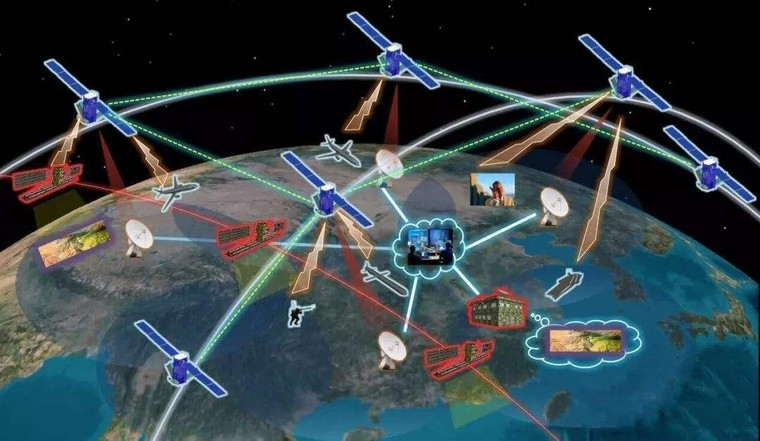

<!-- slide: 17 -->

## 天地一体化架构主要应用场景

- 1、空天地一体化网络中的边缘计算
- 目前, 在空天地一体化网络中MEC服务器可以部署在地面基站、低轨卫星(LEO)以及信关站；最终实现最小化用户感知时延、最小化能量消耗、最大化能量效率等目标；从而实现连接基站侧MEC服务器、连接LEO星上MEC服务器（包括选星策略）、连接网关站MEC服务器。
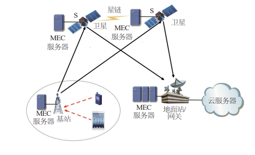

<!-- slide: 18 -->

## 天地一体化架构主要应用场景

- 2、空天地一体化内容分发网络
- 相比于传统以连接为中心的网络，以信息为中心的网络(ICN)采用发布和订阅的模式，可以实现更有效的内容感知路由策略。ICN两个重要的特点是网内缓存以及命名路由。在无线侧，基于无线边缘缓存的内容共享技术被提出，其通过用户对流行内容的偏好程度进行分析，将流行程度高的内容提前缓存在距离请求用户更近的边缘无线节点。当终端用户发起请求时，若请求的内容已经提前存在于边缘缓存节点，可以直接从边缘缓存的无线节点获取而无须通过核心网获取内容。因此，系统可以减少流行程度高的内容通过回程链路的重复性传输，进一步降低传输时延，提高用户服务质量，降低网络负载的压力。深入了解

<!-- slide: 19 -->

## Part 5:(张晨）面临的挑战及发展方向

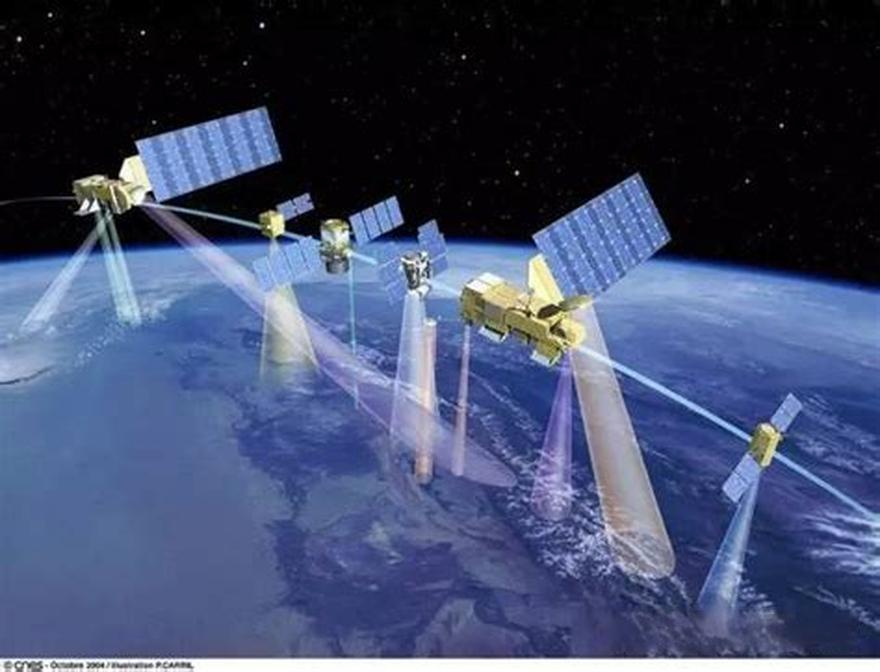

<!-- slide: 20 -->

- 不同于传统的网络系统，天地一体化网络强调空天地协同运作，这对系统的安全性和稳定性造成更大挑战，也对国际深度交流与合作提出更高要求。

- 1、网络集成与通信稳定性问题
- 2、网络安全问题
- 3、国际合作与空间环境问题

<!-- slide: 21 -->

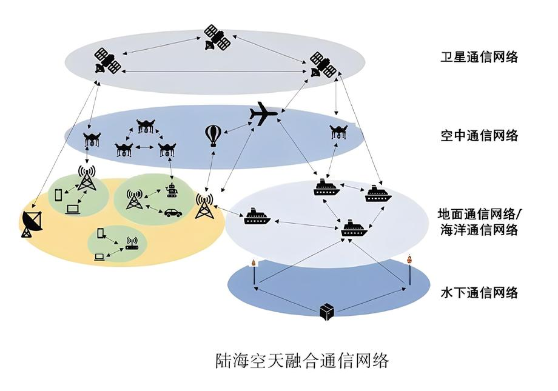
- 1. 异构网络融合：在物理层面上实现连接的同时还需要在网络层、传输层等多个层次上实现协议和标准的统一，以保证数据的无缝传输和处理。
- 2. 动态网络拓扑管理：卫星等空间网络元素的高速运动导致网络拓扑结构频繁变化，需要开发动态适应的网络管理和路由算法，以保持网络的稳定性和高效性。
- 网络集成与通信稳定性问题

<!-- slide: 22 -->

- 3. 信号延迟：由于空间网络节点与地面之间的巨大距离，信号传输会有明显的延迟，对实时通信和控制造成困难，甚至会造成数分钟延迟。
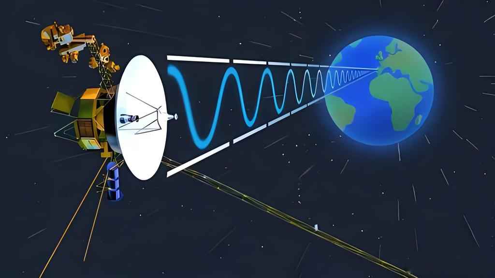

<!-- slide: 23 -->

- 4. 信号衰减与干扰：空间通信信号在传输过程中会受到衰减和各种干扰，需要开发高效的信号处理和增强技术，以提高通信的可靠性和质量。
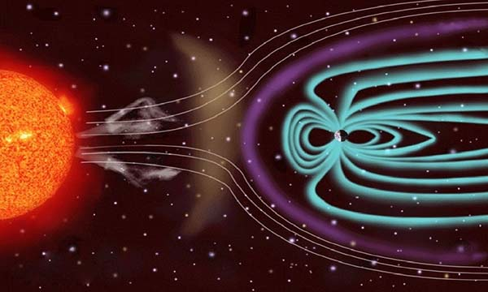
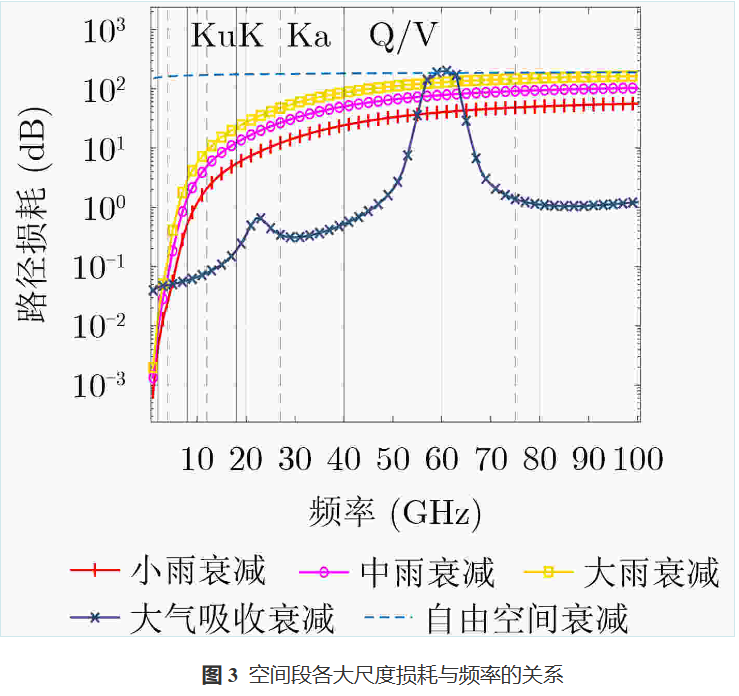
- 参考文献：
- 苏昭阳等.面向低轨卫星的星地通信模型综述[J].电子与信息学报.

<!-- slide: 24 -->

## 网络安全问题

- 1. 复杂的安全威胁：天地一体化网络面临通信信号的拦截、网络设施的物理攻击、以及针对网络协议和软件的网络攻击等多重威胁,需要构建多层次的网络安全防护体系以保障数据传输的安全和稳定。
- 2. 数据保护：为防止敏感信息泄露，需要强大的加密技术和访问控制机制，但同时需保证加密措施不会对网络性能产生过大影响。

- 参考文献：
- 蒋长林,李清等.天地一体化网络关键技术研究综述[J].软件学报 ISSN 1000-9825,2024,35(1):266−287

<!-- slide: 25 -->

## 国际合作与空间环境问题

- 1. 频谱资源紧张：各类无线通信服务的快速发展消耗了大量频谱资源，导致频谱资源越发紧张。
- 2. 空间碎片管理：空间碎片的增多需要国际合作来监控和管理，以确保空间环境的长期可持续性。

<!-- slide: 26 -->

- 3. 国际合作机制缺乏：天地一体化网络涉及多国利益，需要国家间的密切合作。但目前缺乏有效的国际合作机制来协调不同国家的利益和活动，导致资源分配不均、重复建设和技术标准不一致等问题。现有的国际空间法律框架和协议未能充分涵盖天地一体化网络的所有方面，特别是针对新兴技术和应用的规范尚不完善。
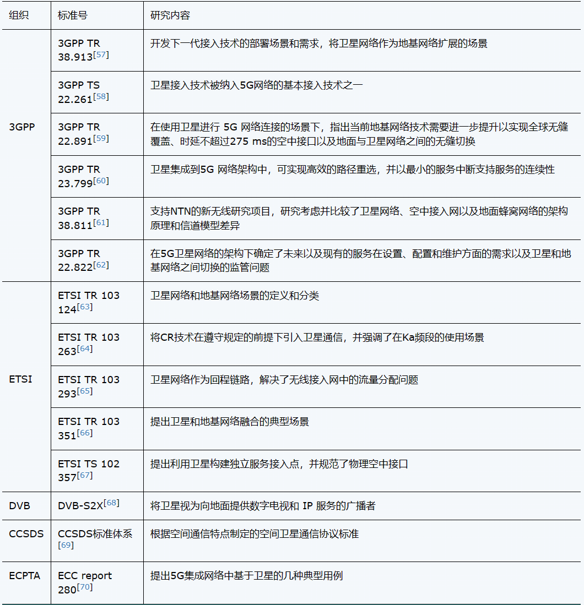
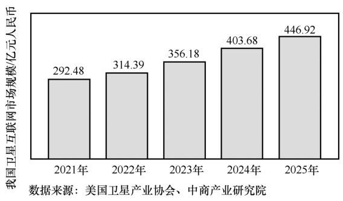
- 参考文献：
- 曾文龙, 赵双, 陈少鹏, 金涛, 江昶. 面向国际化的卫星互联网商业运营平台. 天地一体化信息网络[J], 2023, 4(4): 86-93

<!-- slide: 27 -->

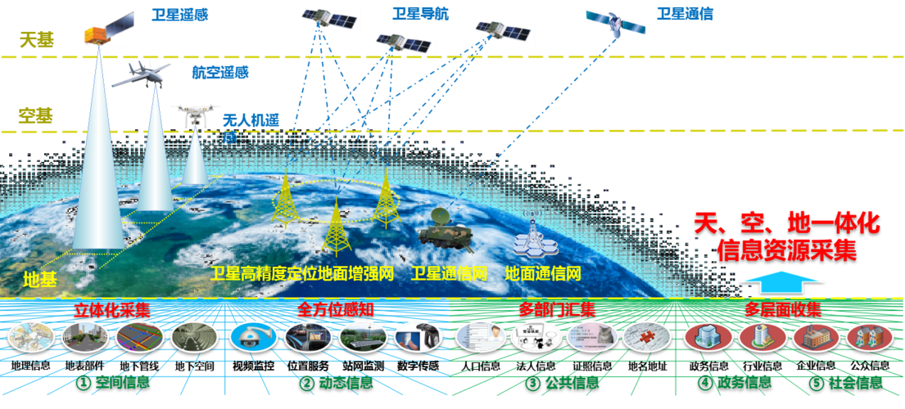
- 未来发展方向
- 1. 技术创新与集成：通过技术创新解决网络集成难题，提高网络的可操作性和兼容性。如向天地一体化网络引入6G等新技术将推动自动驾驶、远程医疗、智能电网等领域的发展，并改善全球互联互通、提升遥感监测能力、发展精准农业等，驱动网络技术的进步和应用扩展。

<!-- slide: 28 -->

- 2. 天地一体融合通信网络：未来将向网络、业务、终端、资源、管理等方面全面深度融合，实现地海空天全域覆盖的融合通信网络。通过推进各类异构网络智能接入集成，建设数字基础设施，为数字经济发展打下坚实基础。
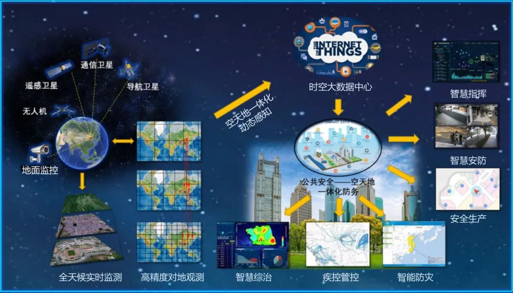
- 3. 可持续发展和环境保护：加强国际间的沟通和合作，建立统一的天地一体化网络建设和运营标准，共同应对各类挑战。推进低轨道卫星技术，减少空间碎片，减轻空间活动对环境的影响。

<!-- slide: 29 -->

## 谢谢观看！

- Thanks for watching !

<!-- slide: 30 -->

- 个人理解该技术即寻找最佳算法减少信号传递过程中的能耗
- 右侧图片--高颖.硕士学位论文;《面向太赫兹通信的空地异构融合网络》.河北工程大学23.6-P4
- 返回
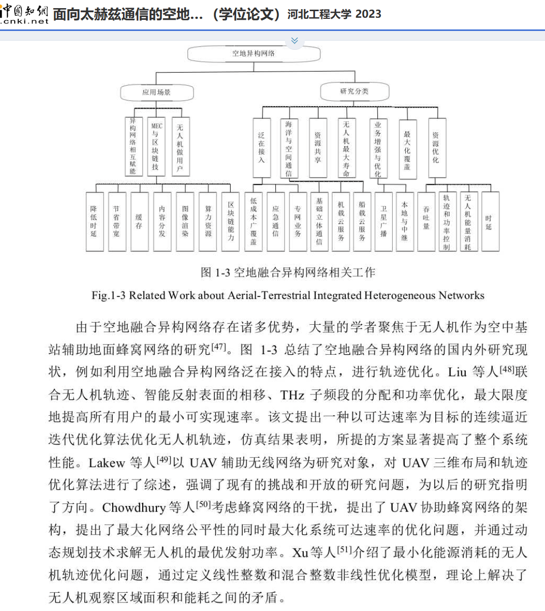

<!-- slide: 31 -->

## 摘自张晓凯，郭道省，张邦宁（中国人民解放军陆军工程大学，江苏 南京 210007）《空天地一体化网络研究现状与新技术的应用展望》

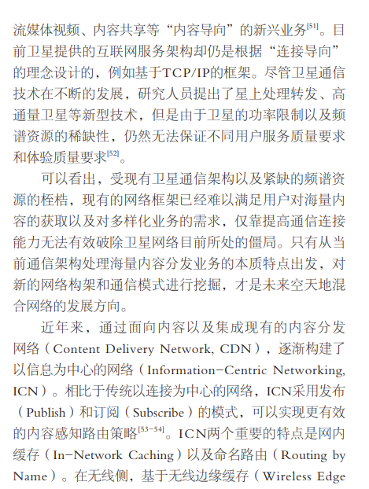
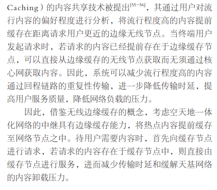
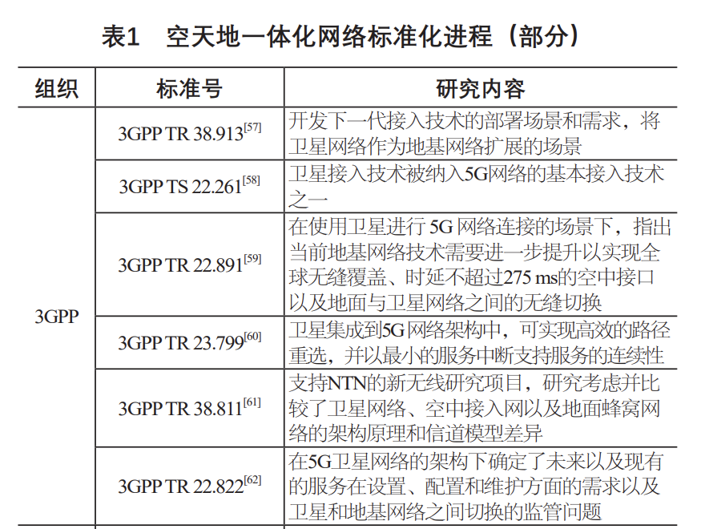
- 返回

<!-- slide: 32 -->

- 季新生, 黄开枝等. 6G天地一体化信息网络内生安全技术[J]. 天地一体化信息网络, 2023, 4(2): 2-12.
- 返回
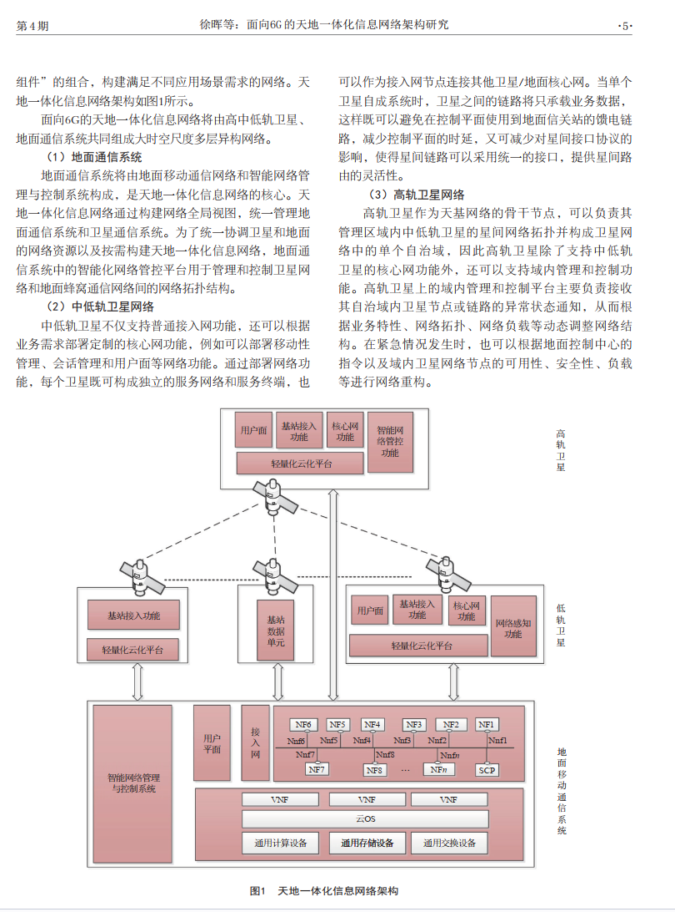
- 徐晖, 孙韶辉. 面向6G的天地一体化信息网络架构研究[J]. 天地一体化信息网络, 2021, 2(4): 2-9.
