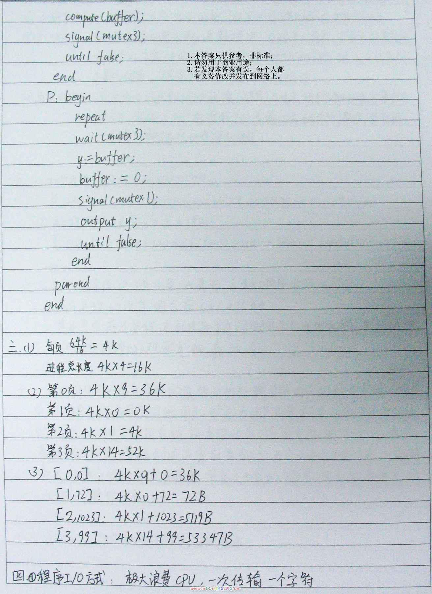
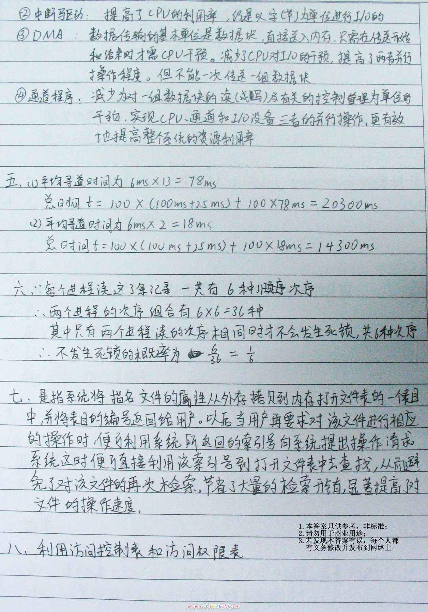
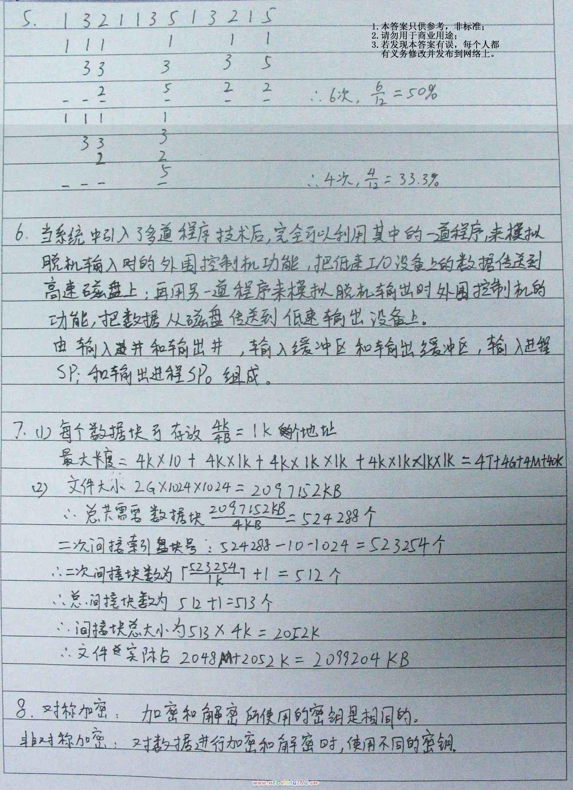
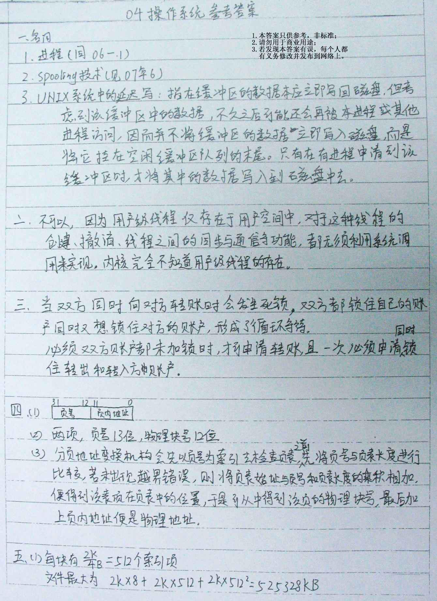

# OS2004CN真题Ans

<!-- page: 1 -->

<!-- page: 2 -->

<!-- page: 3 -->

<!-- page: 4 -->

<!-- page: 5 -->

<!-- page: 6 -->

<!-- page: 7 -->

<!-- page: 8 -->

<!-- page: 9 -->

<!-- page: 10 -->

<!-- page: 11 -->

操作系统试题2004

一、解释概念
1、进程
2、Spooling 技术
3、UNIX 系统中的延迟写
（15 分）

二、同一进程内的用户级线程能否利用内核提供的信号量机制实现同步和互斥？为什
么？

（7 分）

三、某银行计算机系统要实现一个电子转账系统，基本的业务流程是首先对转出方和转
入方的账户进行加锁，然后进行转账业务，最后对转出方和转入方的账户进行解锁。如果不
采取任何措施，系统会不会发生死锁？为什么？如会发生死锁，请设计一种能够避免死锁的
解决方案。

（8 分）

四、某操作系统的存储管理采用页式管理系统，系统的物理地址空间大小为32M，页的
大小是4K。假定某进程的大小为32 页，请回答如下问题：

1）
写出逻辑地址的格式。
2）
如果不考虑权限位，该进程的页表由多少项？每项至少多少位？
3）
试说明逻辑地址映射为物理地址的过程。
（10 分）

五、某操作系统的文件管理采用直接索引和多级索引混合方式，文件索引表共有10 项，
其中前8 项是直接索引项，第9 项是一次间接索引项，第10 项是二次间接索引项，假定物
理块的大小是2K，每个索引项占用4 个字节，试问：

1）
该文件系统中最大的文件可以达到多大？
2)假定一个文件的实际大小是128M 字节，该文件实际占用磁盘空间多大（包括间接索引
块）？

（10 分）
