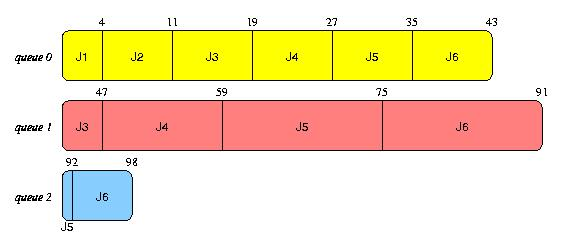

# OS2011EGA真题Ans

<!-- page: 1 -->

… … … … … … … … … … … … … … … 密… … … … … … … … … … … … … … … … … … 封… … … … … … … … … … … … … … … 线… … … … … … … … … … … … … …

诚信应考,考试作弊将带来严重后果！

华南理工大学期末考试

《操作系统》试卷A

姓名
学号
学院
专业
座位号

注意事项：1. 考前请将密封线内填写清楚；

2. 所有答案请答在答题纸上；
3．考试形式：闭卷；

4. 本试卷共四大题，满分100 分，考试时间120 分钟。
题号
一
二
三
总分
得分
评卷人

一、单项选择题(20pts, 2pts each)

NO.
1
2
3
4
5
6
7
8
9
10
answer
D
A
B
B
C
A
C
B
A
B

二、简答题(20pts total, 5pts each)

1.
Solution:

_____________ ________

No. A TLB miss implies that the full page table must be accessed (which is most
likely stored in memory). We must have a miss of the page table (more specifically, a
page fault) in order to require a disk operation.

( 密封线内不答题)

2. Solution:
(1) Program: the collection of instruction, static concept;

Process: describe concurrency, dynamic concept
(2) Process include program, data, and PCB
(3) Process: temporary; Program: permanent
4)
A program can be the execution program of multiple processes; also, a process
can call multiple programs.
(5) Process can create other process in it.

3.
Solution:

（1）The purpose of the open system call is to allow the system to fetch the attributes
and list of disk addresses into main memory for rapid access on later calls.

（2）If there were no open, on every read it would be necessary to specify the name of the
file to be opened. The system would then have to fetch the i-node for it, although that could
be cached. One issue that quickly arises is when to flush the i-node back to disk. It could
time out, however. It would be a bit clumsy, but it might work.

《操作系统》试卷答案
第1 页共5 页

<!-- page: 2 -->

4.
Solution: If a process has m resources it can finish and cannot be involved in a deadlock.
Therefore, the worst case is where every process has m 1 resources and needs another one.
If there is one resource left over, one process can finish and release all its resources, letting
the rest finish too. Therefore the condition for avoiding deadlock is r≥p(m 1) 1.

三、综合题(60pts total)

1. Solution:
semaphor b; // protect global variables
condition smoke_waiting;
semaphor c;
int smokers=0;
int non_smokers=0;
void enter_bar(Boolean smoker){

if(smoker==FALSE)

b.p();
non_smokers++;
//增加一个非吸烟者
b.v();
}

void leave_bar(Boolean smoker){

if(smoker==FALSE){

b.p();
non_smokers--;
//减少一个吸烟者
if(non_smokers==0) smoker_waiting.signal();
b.v();
}
}

void want_smoke(){

b.p();
if(non_smokers!=0) somker_waiting.wait(b);

//在Linux的条件等待中，是要将b解锁后再睡眠，因此这里不会导致死锁
c.p();
smokers++;
c.v();
b.v();
}

void doing_smoking(){

//after smoking

《操作系统》试卷答案
第2 页共5 页

<!-- page: 3 -->

c.p();
smokers--;
c.v();
}

2.
Solution:

(1) The need matrix is

P0 2 0 1 1

P1 0 6 5 0

P2 1 1 0 2

P3 1 0 2 0

P4 1 4 4 4

(2) It’s a safe state.

P0’s need vector (2 0 1 1)<(3 2 1 1), so P0 can run and release its resource (4 0 0 1), then
the available is (7 2 1 2);

And P2 can run and release its resource, the available resource is (8 4 6 6), then P3, P4
and P1 can run and release their resources.

(3) If P4 requests (1 2 0 0), then the need matrix becomes

P0 2 0 1 1

P1 0 6 5 0

P2 1 1 0 2

P3 1 0 2 0

P4 0 2 4 4
And the available will be (2 0 1 1). P0 can run and release its resource, and the
available will become (6 0 1 2). Then none of the processes can run. So the system is not a
safe state, and the request of P4 will not be granted.

《操作系统》试卷答案
第3 页共5 页

<!-- page: 4 -->

3.
Solution:

Since all jobs enter the system at time 0, the turnaround time is the time of completion:
(4 + 11 + 47 + 59 + 92 + 98)/6 = 311/6 = 51.83.
The waiting time is simply the turnaround time minus the execution time. The average
execution time is (4 + 7 + 12 + 20 + 25 + 30) / 6 = 98/6 = 16.33. Thus, the average
waiting time is 35.5.

4.
Solution:

Elevator Algorithm:

磁盘臂移动轨迹：45, 67, 87, 240, 40, 11

磁盘臂移动距离：22+20+153+200+29 = 424

SSF:

磁盘臂移动轨迹：45, 40, 67, 87, 11, 240

磁盘臂移动距离：5+27+20+76+229 = 357

5.
Solution:

(1) 7K+256*2K+256*256K

(2)
There are 100MB/1KB=102400 blocks

The size of FAT: 102400*4B = 400KB

The maximum file is 100MB-400KB

《操作系统》试卷答案
第4 页共5 页

<!-- page: 5 -->

6.
Solution:

(a) How many bytes are contained within the physical memory?

212=4KB
(b) How large is the virtual address?

Page size is 4KB/128=25B, then offset within a page is 5.
4 segments: 2 bits
8 pages per segment: 3 bits
So, 2 + 3 + 5 = 10bits
(c) What is the physical address that corresponds to virtual address 0x312?

0x312: 11 0001 0010
0x17: 0001 0111
Physical address: 001 0111 10010 (0x2F2)
(d) What is the physical address that corresponds to virtual address 0x1E9?

0x1E9: 01 1110 1001
0x6C: 0110 1100
Physical address: 110 1100 01001 (0xD89)

《操作系统》试卷答案
第5 页共5 页
