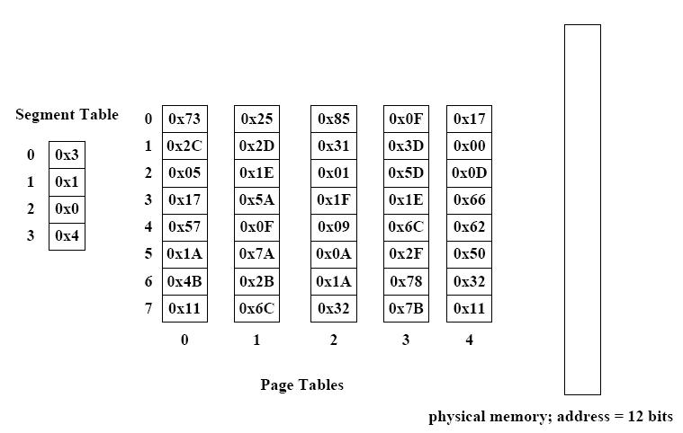

# OS2011EGA真题Que

<!-- page: 1 -->

… … … … … … … … … … … … … … … 密… … … … … … … … … … … … … … … … … … 封… … … … … … … … … … … … … … … 线… … … … … … … … … … … … … …

诚信应考,考试作弊将带来严重后果！

华南理工大学期末考试

《操作系统》试卷A

姓名
学号
学院
专业
座位号

注意事项：1. 考前请将密封线内填写清楚；

2. 所有答案请答在答题纸上；
3．考试形式：闭卷；

4. 本试卷共三大题，满分100 分，考试时间120 分钟。
题号
一
二
三
总分
得分
评卷人

一、单项选择题(20pts, 2pts each)

1.
(
) The ________ solution to the critical section problem will cause the situation
that a process running outside its critical region may block another process.
A. Peterson’s Algorithm
B. Banker’s Algorithm
C. Test and Set Lock
D. Strict Alternation

2.
(
) If the time slice is too large, round robin scheduling algorithm may
degenerate (退化) to _______scheduling algorithm.
A. First Come First Served (FCFS)
B. Shortest Job First (SJF)

_____________ ________

( 密封线内不答题)

C. priority
D. multiple queues

3.
(
) We define a semaphore, whose initial value is 3 (this means that the number
of a certain resource is 3). Now, its value becomes to 1. Assume that M represents
the number of available resource and N shows the number of processes waiting for
this resource, then the value of M and N is _______ respectively.
A. 0, 1
B. 1, 0
C. 1, 2
D. 2, 0

4.
(
) The purpose of the page table is to map virtual pages into page frames. The
________ method is to avoid keeping all the page tables in memory all the time.
A. TLB
B. multi-level page table
C. inverted page table
D. hash algorithm

5.
(
) With the LRU page replacement policy, and enough space for storing 3 page
frames,
the
memory
page
reference
string
“ABCABDDCABCD”
would
produce
.
A. 6 page faults
B. 7 page faults
C. 8 page faults
D. 9 page faults

6.
(
) Assume the reference count of file F1 is 1 initially. Firstly, we create a
symbolic link file F2 linking to F1, and then create a hard link file F3 linking to F1.
Afterwards, F1 is deleted. Now, the reference count of F2 and F3 is ______
respectively.

《操作系统》试卷
第1 页共9 页

<!-- page: 2 -->

A. 0, 1
B. 1, 1
C. 1, 2
D. 2, 1

7.
(
) How many disk operations are needed to fetch the i-node for the file
/home/John/test.txt? Assume nothing along the path is in memory. Also assume that
all directories fit in one disk block.
A. 5
B. 6
C. 7
D. 8

8.
(
) I/O software is typically organized in four layers. Computing the track, sector,
and head for a disk read is done in the ________ layer.
A. interrupt handlers
B. device drivers
C. device-independent operating system software
D. user-level I/O software

9. (
) Windows takes _____ approach to handle deadlock.

A. the Ostrich
B. detection and recovery
C. avoidance
D. prevention

10. (
) Requesting all resources initially is often used to prevent deadlock to attack
the ______ condition.
A. mutual exclusion
C. no preemption
B.
hold and wait
D. circular wait

二、简答题(20pts total, 5pts each)

1.
(5pts) In a virtual memory system, does a TLB miss imply a disk operation will
follow? Why or why not?

2.
(5pts) Please describe the relationship between a process and a program.

《操作系统》试卷
第2 页共9 页

<!-- page: 3 -->

3.
(5pts) What is purpose of the open system call in UNIX? What would the
consequences be of not having it?

4.
(5pts) A system has p processes each needing a maximum of m resources and a total
of r resources available. What condition must hold to make the system deadlock
free?

三、综合题(60pts total)

1. (10pts) In the Sim-City community Woobish most people smoke, but the laws of Sim
City require that non-smokers be protected from passive smoke. So Woobish has a law
under which people can only smoke in a bar if everyone in the bar is ok with it. If a
designated non-smoker is in the bar, nobody can light up. Assume that customers are
modeled as threads:

smoking threads call enter_bar(true) before entering the bar (the flag is true to
indicate that the thread is a smoker), then repeatedly call want_smoke() before lighting
up, and done_smoking() after they finish, and finally call leave_bar(true) when leaving
the bar.

non-smoking threads call enter_bar(false) to enter (the flag is false to indicate a
non-smoker), and leave_bar(false) on its way out.

《操作系统》试卷
第3 页共9 页

<!-- page: 4 -->

Write the pseudo code for a semaphore implementing these rules. You can assume that
periodically, there won’t be any non-smokers. This would make sense, at least in the first
few years after Woobish passes the law, since non-smokers tend to leave the bar quickly
(you would too, with all those angry nicotine-crazed smokers glaring at you!)

《操作系统》试卷
第4 页共9 页

<!-- page: 5 -->

2.
(10pts) Consider the following system snapshot using the data structures in the
Banker's algorithm, with resources A, B, C, and D, and processes P0 to P4:

Process
Max
Allocation
Available
A
B
C
D
A
B
C
D
A
B
C
D
P0
P1
P2
P3
P4

6
0
1
2
1
7
5
0
2
3
5
6
1
6
5
3
1
6
5
6

4
0
0
1
1
1
0
0
1
2
5
4
0
6
3
3
0
2
1
2

3
2
1
1

Using Banker's algorithm answer the following questions.
(1) What are the contents of the Need matrix?
(2) Is the system in a safe state? Why?
(3) If a request from process P4 arrives for additional resources of (1,2,0,0), can the

Banker's algorithm grant the request immediately? Show the new system state
and other criteria.

《操作系统》试卷
第5 页共9 页

<!-- page: 6 -->

3.
(10pts) Consider a multi-level feedback queue in a single-CPU system. The first level
(queue 0) is given a quantum of 8 ms, the second one a quantum of 16 ms, the third
is scheduled FCFS. Assume jobs arrive all at time zero with the following job times
(in ms): 4, 7, 12, 20, 25 and 30. Show the Gantt chart for this system and compute
the average waiting and turnaround time.

《操作系统》试卷
第6 页共9 页

<!-- page: 7 -->

4.
(10pts)
Consider the situation in which the disk read/write head is currently
located at track 45 (of tracks 0-255) and moving in the positive direction. Assume
that the following track requests have been made in this order: 40, 67, 11, 240, 87.
What is the order in which Elevator Algorithm would service these requests and what
is the total seek distance? And what about Shortest Seek First (SSF) algorithm?

《操作系统》试卷
第7 页共9 页

<!-- page: 8 -->

5.
(10pts) Suppose that you have file system consisting only of inodes and data blocks.
Each inode contains 10 entries, each of which is 4 bytes in size.

(1) Suppose that inodes now contain 10 entries, of which 7 point to direct blocks, 2

point to single indirect blocks, and 1 points to a double indirect block. Data
blocks and indirect blocks are both 1024 bytes in size, and indirect block entries
are each 4 bytes in size. What is the maximum file size allowed by this file
system?
(2) Suppose that instead of inodes, a file allocation table is used, and each entry in

the file allocation table is 4 bytes in size. Given a 100 MB disk on which the file
system is stored and data blocks of size 1024 bytes, what is the maximum sized
file that can be stored on this disk?

《操作系统》试卷
第8 页共9 页

<!-- page: 9 -->

6.
(10pts)
Consider the following segmented paging memory system. There are 4
segments for the given process, and a total of 5 page tables in the entire system. Each
page table has a total of 8 entries. The physical memory requires 12 bits to address it;
there are a total of 128 frames.

(1) How many bytes are contained within the physical memory?
(2) How large is the virtual address?
(3) What is the physical address that corresponds to virtual address 0x312?
(4) What is the physical address that corresponds to virtual address 0x1E9?

《操作系统》试卷
第9 页共9 页

