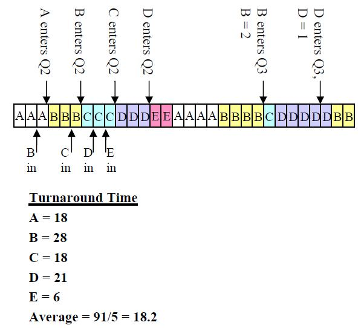
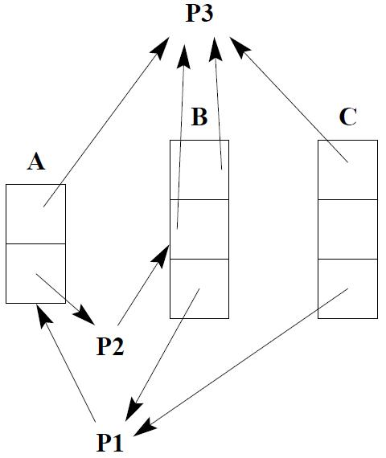

# OS2012EGA真题Ans

<!-- page: 1 -->

… … … … … … … … … … … … … … … 密… … … … … … … … … … … … … … … … … … 封… … … … … … … … … … … … … … … 线… … … … … … … … … … … … … …

诚信应考,考试作弊将带来严重后果！

华南理工大学期末考试

《操作系统》试卷A

姓名
学号
学院
专业
座位号

注意事项：1. 考前请将密封线内填写清楚；

2. 所有答案请答在答题纸上；
3．考试形式：闭卷；

4. 本试卷共三大题，满分100 分，考试时间120 分钟。
题号
一
二
三
总分
得分
评卷人

一、单项选择题(20pts, 2pts each)

1.B
2.B
3.D
4.A
5.A
6.A
7.A
8.C
9.C(D) 10.A
11.D
12.A
13.A
14.C
15.C

二、简答题(20pts total, 5pts each)

1.
(5pts) List the advantages and disadvantages of using a small page in a virtual
memory.
Solution:
(1)
Advantages

_____________ ________

( 密封线内不答题)


less internal fragmentation


less unused program in memory
(2)
Disadvantages


programs need many pages, larger page tables

2. (5pts) What is a process? What is a thread? How are they similar/different?

Solution:
Process: a program in execution
Thread: a flow of control within a process
Similar: active entities, with many attributes, that consume system resources
Different: process is heavyweight, thread is lightweight (part of a process)

《操作系统》试卷
第1 页共7 页

<!-- page: 2 -->

3.
(5pts) What are the advantages and disadvantages of using FAT (File Allocation
Table) in implementing files? And how can we deal with these shortcomings?
Solution:
(1)
Advantages

The entire block is available for data

Random access...

Directory Entry needs only one number
(2)
Disadvantages

Entire table must be in memory all at once

We can deal with the shortcoming using Indexed Allocation method. Bring all the pointers together
into one location (index block or index-node), and load the i-node need only into memory when
the corresponding file is opened.

4.
(5pts) Disk requests come in to the disk driver for cylinders 86, 147, 18, 95, 151, 12,
175, and 30, in that order. The arm is initially at cylinder 143. What is the total
distance (in cylinders) that the disk arm moves to satisfy all the pending requests, for
Shortest Seek First (SSF) and Elevator Algorithm (Assume that initially the arm is
moving towards cylinder 0)?

Solution:
(1) 143, 147, 151, 175, 95, 86, 30, 18, 12

4+4+24+80+9+56+12+6=195
(2) 143, 95, 86, 30, 18, 12, 147, 151, 175

48+9+56+12+6+135+4+24=294

三、综合题(60pts total)

1. (10pts) A tunnel, which is very narrow, allows only one passenger to pass once. Please
using semaphores to implement the following situations:
(1) (4pts) Passengers go through the tunnel one by one alternately(交替地) from two

directions.

(2) (6pts) The passengers at one direction must pass the tunnel continuously.
Another
direction’s visitors can start to go through tunnel when no passengers want to pass
the tunnel from the opposite direction.

《操作系统》试卷
第2 页共7 页

<!-- page: 3 -->

Solution:

将隧道的两个方向标记为A 和B；
(1)
设置信号量AB 和BA，分别表示允许两个方向的行人通过隧道，初值都为
1。
A 方向的行人：

P(AB);
P(mutex);

通过隧道；
V(mutex);
V(BA);

B 方向的行人：

P(BA);
P(mutex);

通过隧道；
V(mutex);
V(AB);

(2)
用变量countA 和conutB 表示A 和B 方向上已经在隧道中的行人数目，初值为0；
再设置三个互斥信号量，初值都为1：


SA 实现对countA 互斥修改

SB 实现对countB 变量的互斥修改

mutex 用来实现两个方向的行人对隧道的互斥使用

A 方向的行人：

P(SA);
If(countA=0) then P(mutex);
countA=countA+1;
V(SA);

通过隧道；
P(SA);
countA=countA-1;
If(countA=0) then V(mutex);
V(SA);

《操作系统》试卷
第3 页共7 页

<!-- page: 4 -->

B 方向的行人：

P(SB);
If(countB=0) then P(mutex);
countB=countB+1;
V(SB);

通过隧道；
P(SB);
countB=countB-1;
If(countB=0) then V(mutex);
V(SB);

2.
(10pts) Show your schedule with timeline and Calculate the average “turnaround” time
when use the multi-level feedback queue as below. (Please take arrival time into account.)
Note that the priority of the top 2 queues is based on arrival times.

Process ID
Arrival Time
Burst Time

A
0
7

B
2
9

C
5
4

D
7
8

E
8
2

《操作系统》试卷
第4 页共7 页

<!-- page: 5 -->

Solution:

3.
(10pts) Suppose there are 2 instances of resource A, 3 instances of resource B, and 3
instances of resource C. Suppose further that process 1 holds one instance of
resources B and C and is waiting for an instance of A; that process 2 is holding an
instance of A and waiting on an instance of B; and that process 3 is holding one
instance of A, two instances of B, and one instance of C.

(1) (4pts) Draw the resource allocation graph.

(2) (3pts) What is the state (runnable, waiting) of each process? For each process

that is waiting, indicate what it is waiting for.

(3) (3pts) Is the system in a deadlocked state? Why or why not?

Solution:
(1)

《操作系统》试卷
第5 页共7 页

<!-- page: 6 -->

(2) P1 is waiting for A, P2 is waiting for B, and P3 is runnable.

(3) No, the system is not in a deadlocked state. Once P3 completes its processing, it will
release its resources. At that stage, both P1 and P2 may obtain the resources that they need.

4.
(10pts) Consider a virtual memory system with the following properties:

• 44 bit virtual address (byte addressable)
• 4 KB pages
• 40 bit physical addresses (byte addressable)

(1) (6pts) What is the total size of the page table for each process on this machine,

assuming that the valid, protection, dirty, and use bits take a total of 4 bits, and
that all of the virtual pages are in use? (Assume that disk addresses are not stored
in the page table).

(2) (4pts) Why might it be infeasible to represent a page table as in (a)? Do

hierarchical page tables resolve the issue? Why?

Solution:
(1) Size of a page = 4 KB, which can be represented in 12 bits

Size of each PTE = 40 – 12 + 4 = 32 bits
Number of pages in virtual address space = 44 – 12 = 32
Size of page table = 232 * 32 bits = 234 bytes

《操作系统》试卷
第6 页共7 页

<!-- page: 7 -->

(2) Size of page table for each process is huge (16 GB!), which is infeasible.

Yes, hierarchical page tables resolve this issue. Since the number of virtual
pages not used by a program is typically high, the mappings for these unused virtual
pages need not be stored in the page table. By using a hierarchical page table, one
can save space by not storing these unused virtual pages.

5.
(10pts) A certain file system uses 2-KB disk blocks. And the i-nodes contain 8
direct entries, one single and one double indirect entry each. The size of each entry is
4 B. Answer the following questions:
(1) What is the maximum file size of this file system?
(2) How much disk space a 128-MB file actually occupied? (including all the direct

and indirect index blocks)

Solution:
(1) The i-node holds 8 pointers.

The single indirect block holds 2KB/4B=512 pointers.
The double indirect block is good for 5122 pointers.
Adding these up, we get a maximum file size of 262,664 blocks, which is about 0.5GB.
(2)
8*2KB=16KB
512*2KB=1024KB
128*1024KB – 1024KB -16KB =130032KB
130032KB/2KB=65016 pointers

10*4B + 2KB +（2KB + [65016/512]*2KB）= 264232B
128MB + 264232B

《操作系统》试卷
第7 页共7 页

<!-- page: 8 -->

<!-- page: 9 -->

