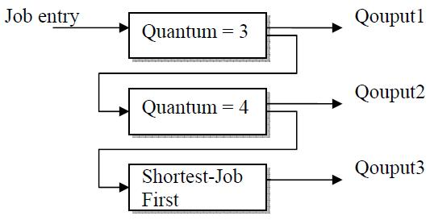

# OS2012EGB真题Ans

<!-- page: 1 -->

… … … … … … … … … … … … … … … 密… … … … … … … … … … … … … … … … … … 封… … … … … … … … … … … … … … … 线… … … … … … … … … … … … … …

诚信应考,考试作弊将带来严重后果！

华南理工大学期末考试

《操作系统》试卷A

姓名
学号
学院
专业
座位号

注意事项：1. 考前请将密封线内填写清楚；

2. 所有答案请答在答题纸上；
3．考试形式：闭卷；

4. 本试卷共三大题，满分100 分，考试时间120 分钟。
题号
一
二
三
总分
得分
评卷人

一、单项选择题(30pts, 2pts each)

1.
(
) Device controller informs CPU that it has finished its operation by causing
a/an _____.
A. DMA request
C. trap
B. interrupt
D. message

2.
(
) When a process is created using the classical fork( ) system call, which of the
following is not inherited by the child process? _______ .
A. process address space
B. process ID
C. user ID
D. open files

_____________ ________

( 密封线内不答题)

3.
(
) A 128-MB memory is allocated in units of n bytes. We use a linked list to
keep track of free memory. Assume that memory consists of an alternating sequence
of segments and holes, each 64KB. Also assume that each node in the linked list
needs a 32-bit memory address, a 16-bit length, and a 16-bit next-node field. How
many bytes of storage are required in linked list method? _______ .
A.227/n
B. 224/n
C. 211
D. 214

4.
(
) Which of the following process scheduling algorithm has convoy effect?
A．FCFS
B. Round Robin
C. SJF
D. Guaranteed Scheduling

5.
(
) If in a resource-allocation graph, each resource type has exactly one instance,
which of the following indicate a deadlock situation? ________.
A. The graph has at least one cycle
C. The graph is connected
B. The graph has no cycle
D. The graph is not connected

6.
(
) The spooling technique is often used to prevent deadlock to attack the ______
condition.
A. mutual exclusion
C. no preemption
B. hold and wait
D. circular wait

7.
(
) Which of the following is not the advantage of segmentation with paging?
_____ .

《操作系统》试卷
第1 页共9 页

<!-- page: 2 -->

A. User can have a clear logical view of memory
B. Different access protections can be associated with different segment of memory
C. No external fragmentation
D. More efficient in time than pure fragmentation and pure paging
8.
(
) “Device independence” means ________.
A. that devices are accessed dependent of their model and types of physical device.
B.
systems that have one set of calls for writing on a file and the console (terminal)
exhibit device independence.
C.
that files and devices are accessed the same way, independent of their physical
nature.
D. none of the above

9.
(
) The purpose of current directory is______.
A. saving auxiliary storage space
C. speeding up the file retrieval speed
B. saving main memory space
D. speeding up the file access speed

10.
(
) Assume the reference count of file F1 is 1 initially. Firstly, we create a
symbolic link file F2 linking to F1, and then create a hard link file F3 linking to F1.
Afterwards, F1 is deleted. Now, the reference count of F2 and F3 is ______
respectively.
A. 0, 1
B. 1, 1
C. 1, 2
D. 2, 1

11. (
) A device driver is
.
A. a type of system call
B. the part of a device that allows to physically function (e.g., spin a disk)
C. a feature of a hardware device that helps it interact with the OS
D. a software routine that interfaces with a hardware device

12. (
) If the page entry says that the page is not in RAM, it raises a
, an
exception telling the operating system that it needs to bring a page into memory.
A. page fault
C. array index out of bound

B. trap
D. none of the above

13. (
) Batching of jobs improved early system performance by
.
A. reducing human setup time
C. multiprogramming

B. background processing
D. overlapping CPU and I/O operations

14. (
) A counting semaphore was initialized to 4. Then 28 P(wait) operations and 18
V(signal) operations were completed on this semaphore. Assume the resulting value
of the semaphore is 0. What is the value of number of waiting processes?
.
A. 2
B. 3
C. 6
D. 0

15.(
) As for Unix system, the attributes of file are stored in
.

A. file
B. directory
C. i-node
D. direct

《操作系统》试卷
第2 页共9 页

<!-- page: 3 -->

二、简答题(20pts total, 5pts each)

1.
(5pts) List the advantages and disadvantages of using small pages in paging systems.

2.
(5pts) What is a process? What is a thread? How are they similar/different?

3.
(5pts) What are the advantages and disadvantages of using FAT (File Allocation
Table) in implementing files? And how can we deal with these shortcomings?

《操作系统》试卷
第3 页共9 页

<!-- page: 4 -->

4.
(5pts) Disk requests come in to the disk driver for cylinders 86, 147, 18, 95, 151, 12,
175, and 30, in that order. The arm is initially at cylinder 143. What is the total
distance (in cylinders) that the disk arm moves to satisfy all the pending requests, for
Shortest Seek First (SSF) and Elevator Algorithm (Assume that initially the arm is
moving towards cylinder 0)?

三、综合题(50pts total)

1. (10pts) A tunnel, which is very narrow, allows only one passenger to pass once. Please
using semaphores to implement the following situations:
(1) (4pts) Passengers go through the tunnel one by one alternately(交替地) from two

directions.

(2) (6pts) The passengers at one direction must pass the tunnel continuously.
Another
direction’s visitors can start to go through tunnel when no passengers want to pass
the tunnel from the opposite direction.

《操作系统》试卷
第4 页共9 页

<!-- page: 5 -->

《操作系统》试卷
第5 页共9 页

<!-- page: 6 -->

2.
(10pts) Show your schedule with timeline and Calculate the average “turnaround” time
when use the multi-level feedback queue as below. (Please take arrival time into account.)
Note that the priority of the top 2 queues is based on arrival times.

Process ID
Arrival Time
Burst Time

A
0
7

B
2
9

C
5
4

D
7
8

E
8
2

《操作系统》试卷
第6 页共9 页

<!-- page: 7 -->

3.
(10pts) Suppose there are 2 instances of resource A, 3 instances of resource B, and 3
instances of resource C. Suppose further that process 1 holds one instance of
resources B and C and is waiting for an instance of A; that process 2 is holding an
instance of A and waiting on an instance of B; and that process 3 is holding one
instance of A, two instances of B, and one instance of C.

(1) (4pts) Draw the resource allocation graph.

(2) (3pts) What is the state (runnable, waiting) of each process? For each process

that is waiting, indicate what it is waiting for.

(3) (3pts) Is the system in a deadlocked state? Why or why not?

《操作系统》试卷
第7 页共9 页

<!-- page: 8 -->

4.
(10pts) Consider a virtual memory system with the following properties:

• 44 bit virtual address (byte addressable)
• 4 KB pages
• 40 bit physical addresses (byte addressable)

(1) (6pts) What is the total size of the page table for each process on this machine,

assuming that the valid, protection, dirty, and use bits take a total of 4 bits, and
that all of the virtual pages are in use? (Assume that disk addresses are not stored
in the page table).

(2) (4pts) Why might it be infeasible to represent a page table as in (a)? Do

hierarchical page tables resolve the issue? Why?

《操作系统》试卷
第8 页共9 页

<!-- page: 9 -->

5.
(10pts) A certain file system uses 2-KB disk blocks. And the i-nodes contain 8 direct
entries, one single and one double indirect entry each. The size of each entry is 4 B.
Answer the following questions:
(1) What is the maximum file size of this file system?
(2) How much disk space a 128-MB file actually occupied? (including all the direct

and indirect index blocks)

《操作系统》试卷
第9 页共9 页
