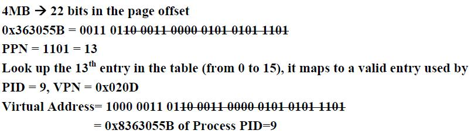
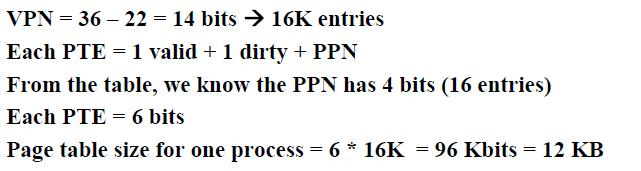

# OSEG1Ans

<!-- page: 1 -->

操作系统期末考试样卷
一、单项选择题(30pts total, 2pts each)

DCBBD BADBA
CDBBB
二、简答题(15pts total, 5pts each)

1.
(5pts) List at least three key differences between user-level threads and
kernel-level threads.

Solution:
User-level thread


Managed by application

Kernel not aware of thread

Context switching cheap

Create as many as needed

Must be used with care
Kernel-level thread


Managed by kernel

Consumes kernel resources

Context switching expensive

Number limited by kernel resources

Simpler to use

2.
(5pts) In a virtual memory system, does a TLB miss imply a disk operation
will follow? Why or why not?

Solution:

No. A TLB miss implies that the full page table must be accessed (which is

most likely stored in memory). We must have a miss of the page table (more

specifically, a page fault) in order to require a disk operation.

3.
(5pts)
How
many
disk
operations
are
needed
to
open
the
file
/usr/student/lab/test.doc? Why? (Assume that nothing else along the path is in
memory. Also assume that all directories fit in one disk block. )

Solution:

(1) i-node for /
(2) directory for /
(3) i-node for /usr
(4) directory for /usr
(5) i-node for /usr/student
(6) directory for /usr/student
(7) i-node for /usr/student/lab
(8) directory for /usr/student/lab
(9) i-node for /usr/student/lab/test.doc

<!-- page: 2 -->

In total, 9 disk reads are required.
三、综合题(55pts total)

1. (10pts) A tunnel, which is very narrow, allows only one passenger to pass once.

Please using semaphores to implement the following situations:

(1) (4pts) Passengers go through the tunnel one by one alternately( 交替地)

from two directions.

(2) (6pts) The passengers at one direction must pass the tunnel continuously.

Another direction’s visitors can start to go through tunnel when no
passengers want to pass the tunnel from the opposite direction.

Solution:

将隧道的两个方向标记为A 和B；
(1)
设置信号量AB 和BA，分别表示允许两个方向的行人通过隧道，初
值都为1。
A 方向的行人：

P(AB);
P(mutex);

通过隧道；
V(mutex);
V(BA);

B 方向的行人：

P(BA);
P(mutex);

通过隧道；
V(mutex);
V(AB);

(2)
用变量countA 和conutB 表示A 和B 方向上已经在隧道中的行人数
目，初值为0；
再设置三个互斥信号量，初值都为1：

SA 实现对countA 互斥修改

SB 实现对countB 变量的互斥修改

mutex 用来实现两个方向的行人对隧道的互斥使用

A 方向的行人：

P(SA);
If(countA=0) then P(mutex);
countA=countA+1;
V(SA);

通过隧道；

<!-- page: 3 -->

P(SA);
countA=countA-1;
If(countA=0) then V(mutex);
V(SA);

B 方向的行人：

P(SB);
If(countB=0) then P(mutex);
countB=countB+1;
V(SB);
通过隧道；
P(SB);
countB=countB-1;
If(countB=0) then V(mutex);
V(SB);

2.
(8pts) Five batch jobs A through E, arrive at a computer center at almost the

same time. They have estimated running times of 10, 6, 2, 4, and 8 minutes.

Their (externally determined) priorities are 3, 5, 2, 1, and 4, respectively,

with 5 being the highest priority. For each of the following scheduling

algorithms, determine the mean process turnaround time. Ignore process

switching overhead.

Job
Arrival time
Execution time
Priority
A
0
10
3
B
0
6
5
C
0
2
2
D
0
4
1
E
0
8
4

(1) Round robin

(2) Priority scheduling

(3) First-come, first-served (run order 10, 6, 2, 4, 8).

(4) Shortest job first

Solution:

(1) For round robin, during the first 10 minutes each job gets 1/5 of the
CPU. At the end of 10 minutes, C finishes. During the next 8 minutes,
each job gets 1/4 of the CPU, after which time D finishes. Then each of
the three remaining jobs gets 1/3 of the CPU for 6 minutes, until B

<!-- page: 4 -->

finishes, and so on. The finishing times for the five jobs are 10, 18, 24,
28, and 30, for an average of 22 minutes.
(2) For priority scheduling, B is run first. After 6 minutes it is finished.
The other jobs finish at 14, 24, 26, and 30, for an average of 20 minutes.
(3) If the jobs run in the order A through E, they finish at 10, 16, 18,
22,and 30, for an average of 19.2 minutes.
(4) Finally, shortest job first yields finishing times of 2, 6, 12, 20, and 30,
for an average of 14 minutes.

3.
(10pts) A system has five processes and four allocatable resources. The

current allocation and additional needs are as follows:

Allocation
Need
Available

Process

A
B
C
D
A
B
C
D
A
B
C
D

P1

0

0

3

2

0

0

1

2

1
6
2
2

P2

1

0

0

0

1

7

5

0

P3

1

3

5

4

2

3

5

6

P4

0

3

3

2

0

6

5

2

P5

0

0

1

4

0

6

5

6

Please answer the following questions:
(1) Is this state safe? Why?

(2) The request (1,2,2,2) of P3 can be granted or not? Why?

Solution:

(1) 该状态是安全的。


(1,6,2,2)>(0,0,1,2)，先满足P1 的请求，执行完毕后回收P1 资源

(0,0,3,2)，则可用资源变为(1,6,5,4)；


(1,6,5,4)>(0,6,5,2)，可满足P4 的请求，执行完毕后回收P4 资源

(0,3,3,2)，则可用资源变为(1,9,8,6)；


(1,9,8,6)>(0,6,5,6)，可满足P5 的请求，执行完毕后回收P5 资源

(0,0,1,4)，则可用资源变为(1,9,9,10)；


(1,9,9,10)>(1,7,5,0)，可满足P2 的请求，执行完毕后回收其资源

(1,0,0,0)，则可用资源变为(2,9,9,10)；


(2,9,9,10)>(2,3,5,6)，可满足P3 的请求，执行完毕后回收其资源

(1,3,5,4)，则可用资源变为(3,12,14,14)，即为资源总量。

存在一安全序列：{P1,P4,P5,P2,P3}，故该状态是安全的。

(2) 当前可用资源(1,6,2,2)大于进程P3 提出的请求(1,2,2,2)，若满足P3 的

资源请求，则可用资源变为(0,4,0,0)，资源分配情况变为：

<!-- page: 5 -->

Allocation
Need
Available

Process

A
B
C
D
A
B
C
D
A
B
C
D

P1

0
4
0
0

0

0

3

2

0

0

1

2

P2

1

0

0

0

1

7

5

0

P3

2

5

7

6

1

1

3

4

P4

0

3

3

2

0

6

5

2

P5

0

0

1

4

0

6

5

6

检查此刻是否为安全状态：可用资源(0,4,0,0)不能满足任何一个进程的
Need 请求，故此状态为不安全状态，故不能将P3 请求的资源分配给它。

4.
(10 pts) Given a 36-bit processor with 4 active processes being executed

concurrently. Please answer the following questions. Show all the addresses

of your answer in hex number. If a translation cannot be found, enter page

fault.

V
PID
VPN
1
9
0x0DF0
1
A
0x3630
1
C
0x1B70
1
C
0x37C1
0
F
0x1F04
1
A
0x3640
1
9
0x1FFF
1
A
0x23A4
1
9
0x3004
1
A
0x0D7C
1
C
0x0DF0
0
B
0x1F04
1
A
0x0DF0
1
9
0x020D
1
A
0x31A2
1
C
0x07C1

(1) Assume an inverted page table (IPT) is

used by the OS. The IPT is shown below
(Only Valid, PID and VPN are shown).
Each page size is 4MB. What “virtual
address” of which “process” maps to the
physical address “0x363055B”?

(2) Now we switch to use an index-based

linear page table, how much memory
(in KB) is required for just process A?
Assume each page table entry (PTE)
contains a valid and dirty bit.

Solution：

<!-- page: 6 -->

5.
(8 pts) A UNIX file system has 1-KB blocks and 32bit disk addresses. What

is the maximum file size if i-nodes contain 10 direct entries, and one single,

double, and triple indirect entry each?

Solution:


The i-node holds 10 pointers.


The single indirect block holds 256 pointers.


The double indirect block is good for 2562 pointers.


The triple indirect block is good for 2563 pointers.

Adding these up, we get a maximum file size of 16,843,018 blocks, which is
about 16.06 GB.

6.
(9pts) Suppose that a disk drive has 300 cylinders, numbered 0 to 299. The

drive is currently serving a request at cylinder 143. The queue of pending

requests, in FIFO order, is

<!-- page: 7 -->

86, 147, 291, 18, 95, 151, 12, 175, 30

Starting from the current head position, what is the total distance (in

cylinders) that the disk arm moves to satisfy all the pending requests, for

each of the following disk-scheduling algorithms?

(1)
First-Come First-Served (FCFS)

(2)
Shortest Seek First (SSF)

(3)
Elevator Algorithm (Assume that initially the arm is moving towards

cylinder 0)

Solution:

(1) 57+61+144+273+77+56+139+163+145=1114

(2) 143, 147, 151, 175, 95, 86, 30, 18, 12, 291

4+4+24+80+9+56+12+6+279=474

(3) 143, 95, 86, 30, 18, 12, 147, 151, 175, 291

48+9+56+12+6+135+4+24+116=410
