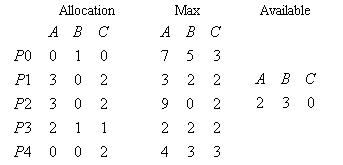

# OS模拟

<!-- page: 1 -->

操作系统期未考试题

一、选择题(每题1 分，共20 分)
1．1.关于操作系统的叙述(
)是不正确的。(d)
A.“管理资源的程序”
B.“管理用户程序执行的程序”
C.“能使系统资源提高效率的程序”
D.“能方便用户编程的程序”
2．为了描述进程的动态变化过程, 采用了一个与进程相联系的(
), 根据它而感知进程
的存在.
(c)
A.进程状态字
B.进程优先数
C.进程控制块
D.进程起始地址
3．（
）的操作应该只在核心态下执行？
(b) ?
A.求三角函数的值
B.屏蔽所有中断
C.读时钟日期
D.改变文件内容

4．把资源按类型排序编号，并要求进程严格按序申请资源，这种方法摒弃下述哪一个条件？
（？）d
A.互斥条件
B.不剥夺条件
C.部分分配条件
D.环路等待条件
5．临界资源是指(
)。B ??
A.通过SPOOLING 技术提供的虚拟设备资源
B.只能被特定用户使用，不能共享的资源
C.可同时被多个进程访问的可共享资源
D.一次仅允许一个进程访问的可共享资源
6．在多进程的并发系统中，肯定不会因竞争( d )而产生死锁。
?
A.打印机
B.磁带机
C.磁盘
D.CPU
7．进程从运行状态进入就绪状态的原因可能是(
) d
A.被选中占有处理机
B.等待某一事件
C.等待的事件已发生
D.时间片用完

8．在可变分区存储管理中，最优适应分配算法要求对空闲区表项按(
)进行排列。？
A.地址从大到小
B.地址从小到大
C.尺寸从大到小
D.尺寸从小到大

9．若系统中有五个并发进程涉及某个相同的变量A，则与变量A 的相关临界区有( c?
)。
A.2 个
B.3 个
C.4 个
D.5 个
10．进程所请求的一次打印输出结束后，将使进程状态从（）a?
A.运行态变为就绪态
B.运行态变为等待态
C.就绪态变为运行态
D.等待态变为就绪态
11．如果允许不同用户的文件可以具有相同的文件名，通常采用（b ）保证按名存取的安全。
A.重名翻译机构
B.建立索引表
C.建立指针
D.多级目录结构
12．一作业进入内存后，则所属该作业的进程初始时处于（b ）状态。
A.运行
B.等待
C.就绪
D.收容
13．虚拟存储管理策略可以(
c?
).
A.扩大物理内存容量
B)扩大物理外存容量
C.扩大逻辑内存容量
D.扩大逻辑外存容量
14．下列作业调度算法中, 具有最短的作业平均周转时间的是( b
)

<!-- page: 2 -->

A.先来先服务法
B.短作业优先法
C.优先数法
D.时间片轮转法
15．多道程序设计是指(
d?
)
a 还是d 不清楚。
A.在实时系统中并发运行多个程序
B.在分布系统中同一时刻运行多个程序
C.在一台处理机上同一时刻运行多个程序
D.在一台处理机上并发运行多个程序
16．用磁带作为文件存贮介质时，文件只能组织成(
a
)
A.顺序文件
B.链接文件
C.索引文件
D.目录文件
17．两个进程争夺同一个资源(
b )
A. 一定死锁
B.不一定死锁
C.不会死锁
D. 以上说法都不对
18．下列哪一条是在操作系统设计中引入多道程序技术的好处？(
a)。
A.使并发执行成为可能
B.简化操作系统的实现
C.减少对内存容量的需求
D.便于实施存储保护
19．以下哪个不是程序顺序执行的特性？(
)。C?
A.封闭性
B.顺序性
C.无关性
D.不可再现性
20．在分时系统中，当用户数一定时，影响响应时间的主要因素是(
b？)。
A.时间片
B.调度算法
C.存储分配方式
D.作业的大小

二、填空题(每空1 分，共20 分)
1．操作系统的主要设计目标是__________和__________。
2．死锁的四个必要条件是__________、__________、不可抢夺资源和循环等待资源。
3．操作系统为用户提供两种类型的使用接口，它们是系统命令
接口和编程
接口。
4．在存储器管理中，页面大小由
确定，分段由
确定。
5．计算机系统产生死锁的根本原因是_____________和_____________。
6．进程的静态实体由
、
和进程控制块PCB 三部分组成。

7．进程的三种基本状态是就绪态、
运行态
、阻塞态
。
8．在响应比最高者优先的作业调度算法中，当各个作业等待时间相同，
将得
到优先调度；当各个作业运行的时间相同时，
得到优先调度。
9．并发进程中涉及到
的程序段称为临界区，两个进程同时进入相关的临界区
会造成
的错误。
10. 存储管理中的页式存储采用的是
分区，段式存储采用的是
分区。
三、判断题(每题2 分，共10 分)
1. 若无用户进程处于运行状态，则就绪队列和等待队列均为空。
2. 当进程提出资源请求得不到满足时，系统必定发生死锁。
3. 作业处于运行状态时，其程序一定占有处理机。
4. 在请求分页系统中，LRu 算法是指最早进入内存的页先淘汰。
5. 地址重定位指的是把外存地址转换成内存地址。
四、简答题(每题4 分，共16 分)
1．进程调度中“可抢占”和“非抢占”两种方式，哪一种系统的开销更大？为什么？
2．缺页中断的处理步骤。
3．说明段页式存储方法
4．文件和文件系统

<!-- page: 3 -->

五、应用题(每题6 分，共18 分)

1. 设系统中有三种类型的资源（A、B、C）和五个进程（P0，P1，P2，P3，P4），某时刻

的状态如下：

根据银行家算法计算该时刻是否存在的一个安全序列。若p4 请求为(1
1
0)是否可以满
足？简要写出步骤。

2. 在一个多道程序系统，采用先来先服务和短作业优先两种算法管理作业。今有如下所示
的作业序列，请列出各个作业的开始时间、完成时间和周转时间。注意：忽略系统开销。

作业名进入输入井时间需计算时间
JOB1
8.0 时
1 小时
JOB2
8.2 时
0.8 小时
JOB3
8.4 时
0.4 小时
JOB4
8.6 时
0.6 小时

3. 在一个采用页式虚拟存储管理的系统中，有一用户作业，它依次要访问的逻辑地址序列
是：115，228，120，88，446，102，321，432，260，167，若该作业的第0 页已经装入主
存，现分配给该作业的主存共300 字节，页的大小为100 字节，请回答下列问题：

（1）按FIFO 调度算法将产生次缺页中断，依次淘汰的页号为，缺页中断率为。
（2）按LRU 调度算法将产生次缺页中断，依次淘汰的页号为，缺页中断率为。

六、综合题(每题8 分，共16 分)
1. 假定系统有三个并发进程read, move 和print 共享缓冲器B1 和B2。进程read 负责从
输入设备上读信息，每读出一个记录后把它存放到缓冲器B1 中。进程move 从缓冲器B1 中
取出一记录，加工后存入缓冲器B2。进程print 将B2 中的记录取出打印输出。B1 可存15
个记录，B2 能存放20 个记录。要求三个进程协调完成任务，使打印出来的与读入的记录的
个数，次序完全一样。(B1 和B2 开始为空)

请用PV 操作，写出它们的并发程序。
2. 某银行营业厅有两个营业窗口，任何时刻最多可容纳20 名顾客进入，当营业厅中少于
20 名顾客时，则厅外的顾客可立即进入，否则需在外面等待。若没有顾客，则营业员可以
处理其他业务。门口一次只能进出一位顾客。

请用管程实现顾客的行为。(不用实现营业员的行为)
操作系统答案
一、
1B
2A
3B
4D
5B
6D
7B
8B
9D
10D
11A
12A
13C
14D
15D
16A
17D
18D 19A
20B

<!-- page: 4 -->

二、
1 越界保护
越权保护2 资源独占保持占有3 普通文件目录文件4 系统用户5 资源不足
并发执行6 程序数据集合7 执行等待8 运行时间短等待时间长9 与共享变量有关
与时
间有关的错误10 文件名
文件号
三、
1 错2 错3 错4 错5 对
四、
1 解决死锁的方法一般可分为预防，避免，检测和恢复等三种）。进程等待时，定时检测，
资源利用率降低时检测。4 分
2 因为页式存储管理方法一个进程的存储空间可以不连续，当一个进程空间长度过长时，则
用来管理的用户页表长度可能会超过一个物理页的长度，需要用多页来存储，如果不采用
多级页表，页表中的有些表项可能无法找到。4 分
3 国为系统栈栈顶指针只有一个，弹出信息是为了将栈顶指针初始化归零，保证其他进程可
以正常使用系统栈；其次，一个进程被调度算法选中后操作系统从PCB 中恢复现场，如
果不将现场信息放入PCB 则无法正确恢复现场。4 分
4 利用存储区缓解数据到达速度与离去速度不一致而采取的技术称为缓冲，此时同一数据
只包含一个拷贝。缓存是为提高数据访问速度而将部分数据由慢速设备预取到快速设备上
的技术，此时同一数据存在多个拷贝。4 分
五、算法正确，数据错误得2 分
1 安全序列P4 P2 P1 P3 P0
2 分
P3 的请求不能满足，因为P4 还需资源(4 3 1)大于系统还剩余的资源(2 3 0)按银行家算法不
能分配资源给P3
2 分
2 先来先服务
开始时间
完成时间
周转时间
答对4 个得1 分
JOB1
8.0 时
9 小时
1 小时
JOB2
9 时
9.8 小时
1.6 小时
JOB3
9.8 时
10.2 小时
1.8 小时
JOB4
10.2 时
10.8 小时
2.2 小时
短作业优先
开始时间
完成时间
周转时间
JOB1
8.0 时
9 小时
1 小时
JOB2
10 时
10.8 小时
2.6 小时
JOB3
9 时
9.4 小时
1 小时
JOB4
9.4 时
10 小时
1.4 小时
3
180，240，160，5，410，100，351，492，240，167
1
2
1
0
4
1
3
4
2
1
FIFO
0
0
0
0
0
4
4
4
4
4
4
1
1
1
1
1
1
3
3
3
3
2
2
2
2
2
2
2
2
1
╳
╳
╳
╳
╳
按FIFO 产生5 次中断，依次淘汰0、1、2，段页中断率0.5
2 分
LRU
0
0
0
0
0
0
0
3
3
3
1
1
1
1
1
1
1
1
1
2
2
2
2
2
4
4
4
4
4
4
╳
╳
╳
╳
╳
按LRU 产生5 次中断，依次淘汰2、0、3，段页中断率0.5
2 分

<!-- page: 5 -->

六、
1
S=1 用于生产线互斥信号量
S1=N 用于P1、P2、P3 放入物品的信号量
S2=N-2 用于P2 的同步信号量
S3=N-2 用于P3 的同步信号量
S4=0 用于P4 的同步信号量
SP=0 用于P2、P3 取原料的控制信号量
Int I=0 用来表示A 的数量j=0
用来表示B 的数量
定义变量得3 分，每答对1 个过程
得2 分
P1
P2
P3
P4
P(S1)
P(S2)
P(S3)
P(S4)
P(S)
P(SP)
P(SP)
P(S)
P1 放入原料
P(S)
P(S)从B1
取A、B 半成品
V(SP)
取原料
取原料
V(S)
V(S)
V(S)
V(S)
V(S2)
生产A
生产B
V(S2)
P(S1)
P(S1)
V(S3)
P(S)
P(S)
V(S3)
放入A
放入B
V(S1)
I++
J++
V(S1)
IF((I=I-2)>=0)&&((J=J-2)>=0)
IF((I=I-2)>=0)&&((J=J-2)>=0)
V(S1)
V(S4)；
V(S4)；
V(S1)
ELSE {I=I+2；J=J+2；}
ELSE {I=I+2；J=J+2；}
生产产品装箱送走
V(S)
V(S)

2．顾客每个过程4 分，营业员过程3 分
VAR
S:condition；营业窗口
S1:condition；顾客等待队列
Count:0….49
DEFINE
enter
leave
sleep
PROCEDURE
enter(full:BOOKEAN)
IF (count==50)
full=true;入口外等待
ELSE

{Count=count+1;

if(count<4)

signal(S);
else wait(S1);
}
PROCEDURE
leave
Count=count-1;
IF(count!=0)

Signal(S1);

<!-- page: 6 -->

顾客的活动
enter(full);
进入银行存取款
leave;
PROCEDURE
sleep;

IF(count==0)

wait(S); 营业员处理其他业务
