# ch-22复习一

<!-- slide: 1 -->

- 操 作 系 统
- 钟竞辉
- 办公室：B3-515
- 电子邮箱：jinghuizhong@scut.edu.cn

<!-- slide: 2 -->

- 期末考试
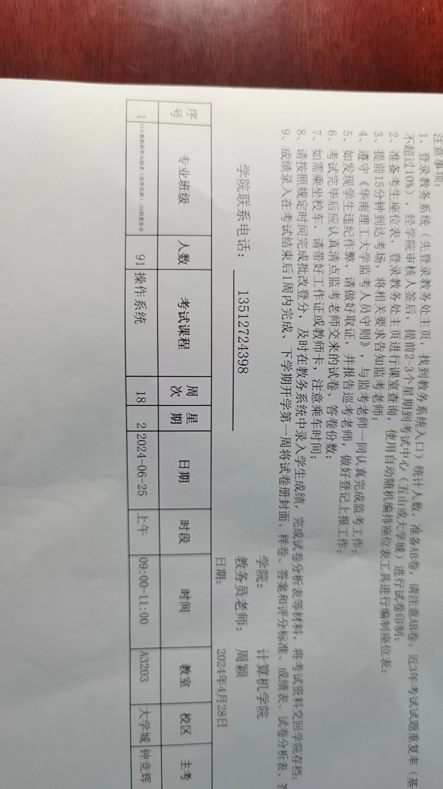

<!-- slide: 3 -->

- 期末考试
- 1 选择题
- 2 简单题
- 3 计算题
- 4 IPC题（UP，DOWN操作）

<!-- slide: 4 -->

- 重点章节
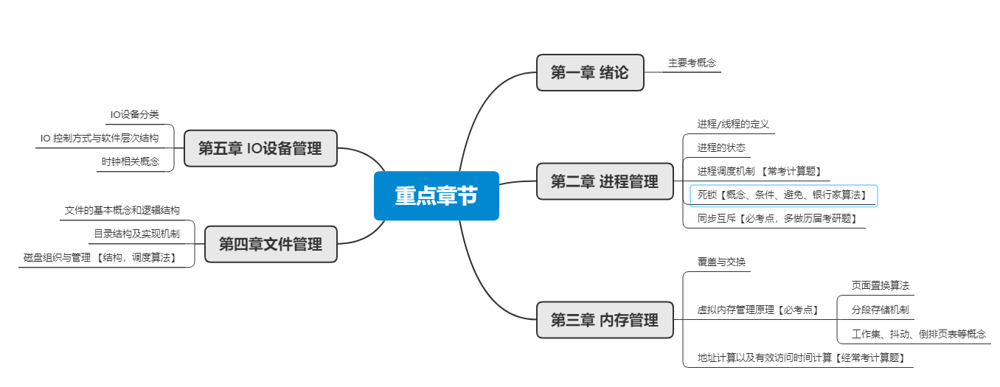

<!-- slide: 5 -->

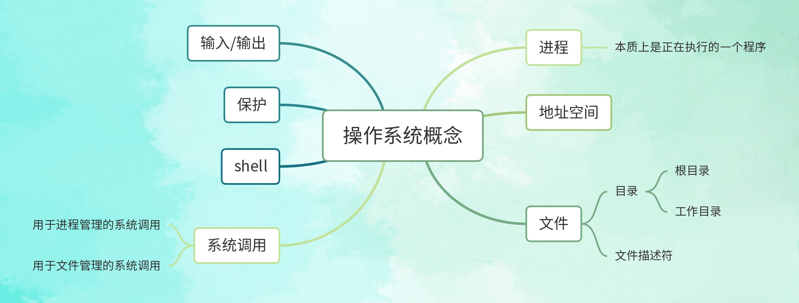

<!-- slide: 6 -->

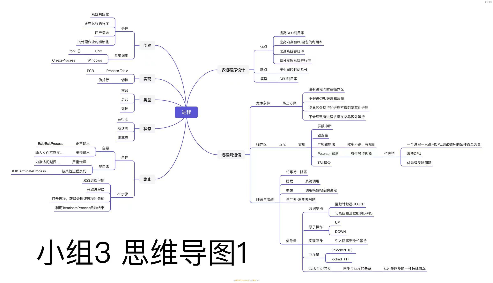

<!-- slide: 7 -->

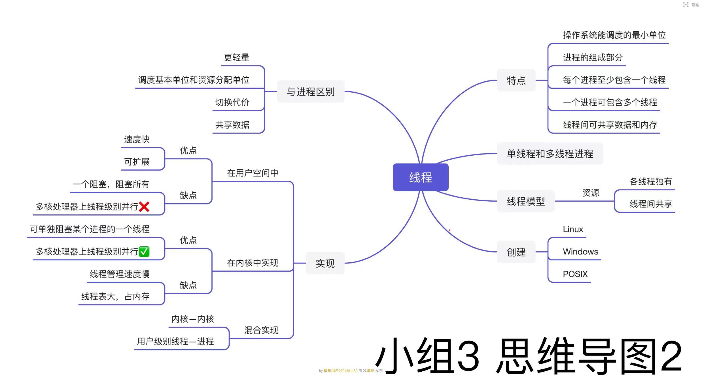

<!-- slide: 8 -->

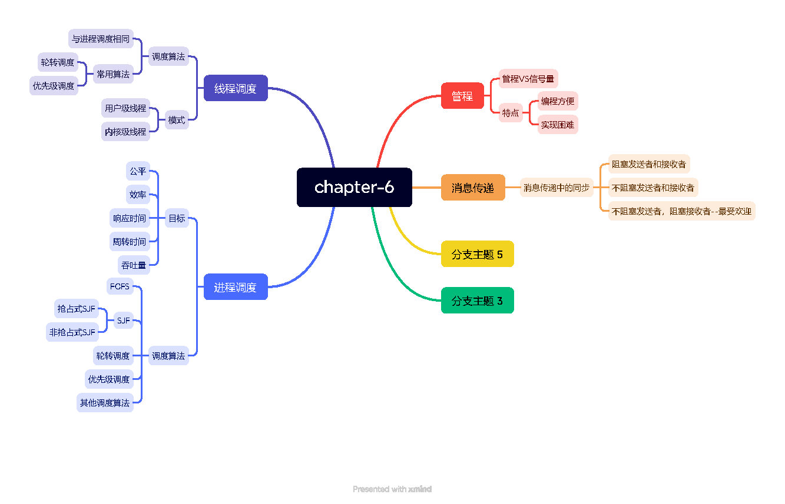

<!-- slide: 9 -->

<!-- slide: 10 -->

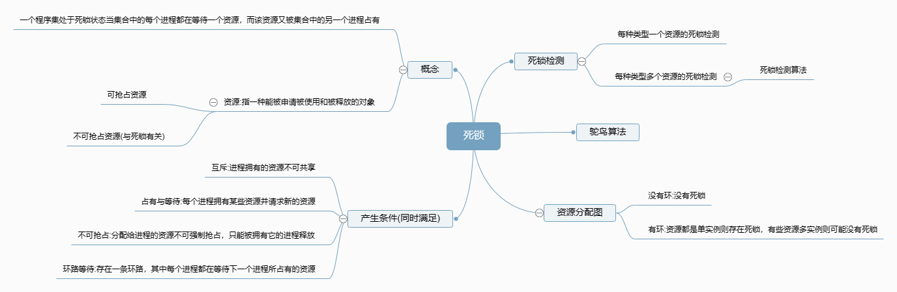

<!-- slide: 11 -->

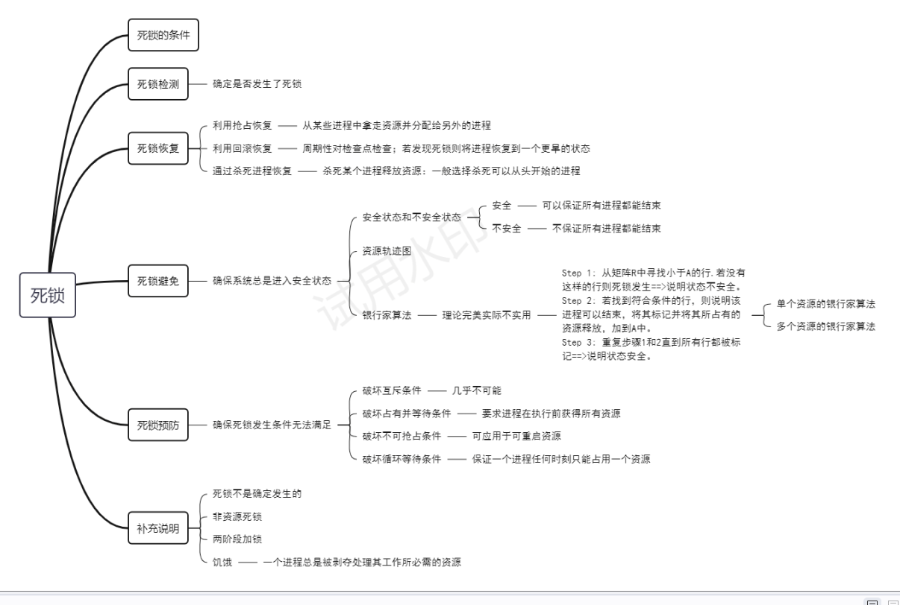

<!-- slide: 12 -->

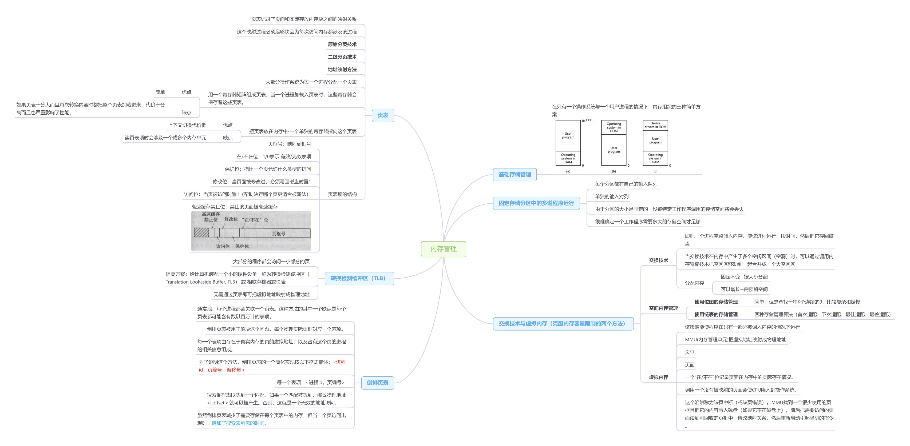

<!-- slide: 13 -->

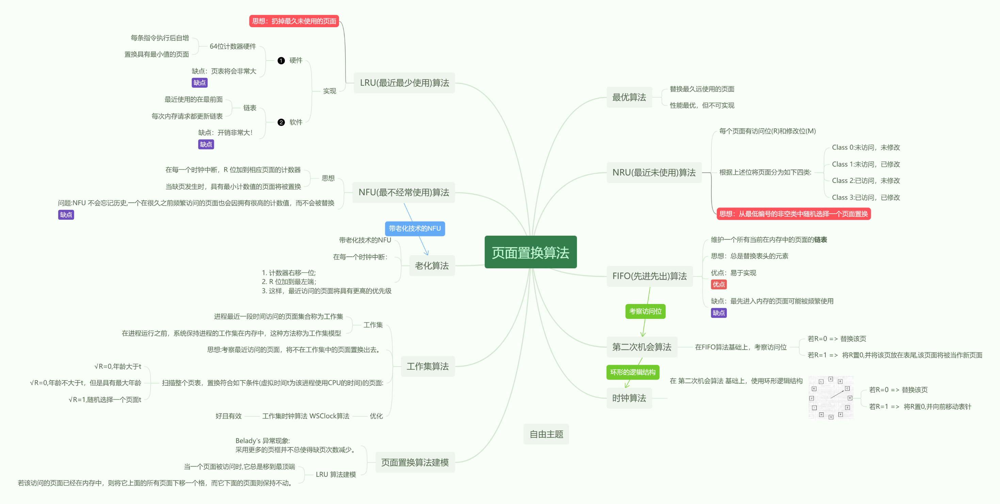

<!-- slide: 14 -->

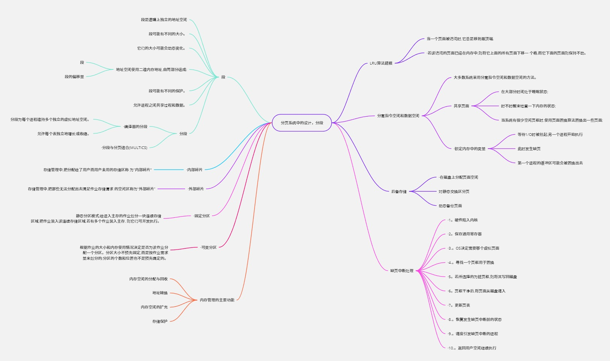

<!-- slide: 15 -->

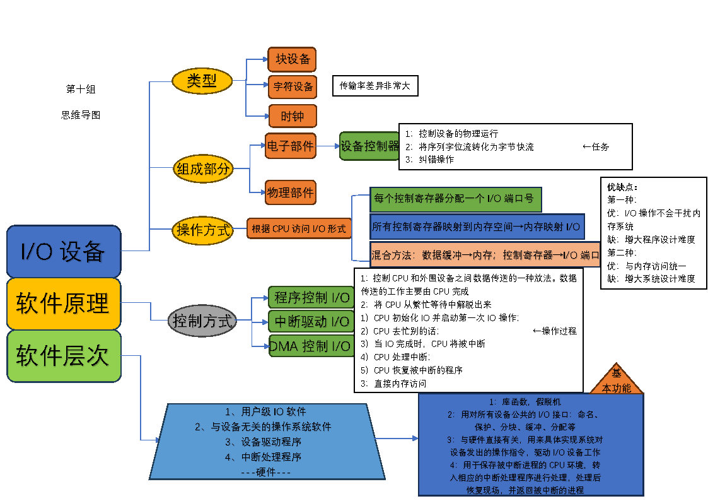

<!-- slide: 16 -->

<!-- slide: 17 -->

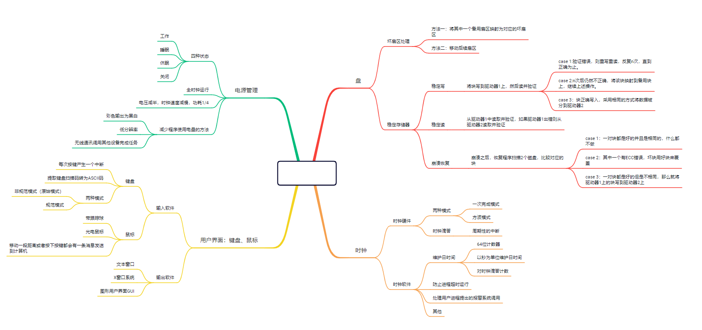

<!-- slide: 18 -->

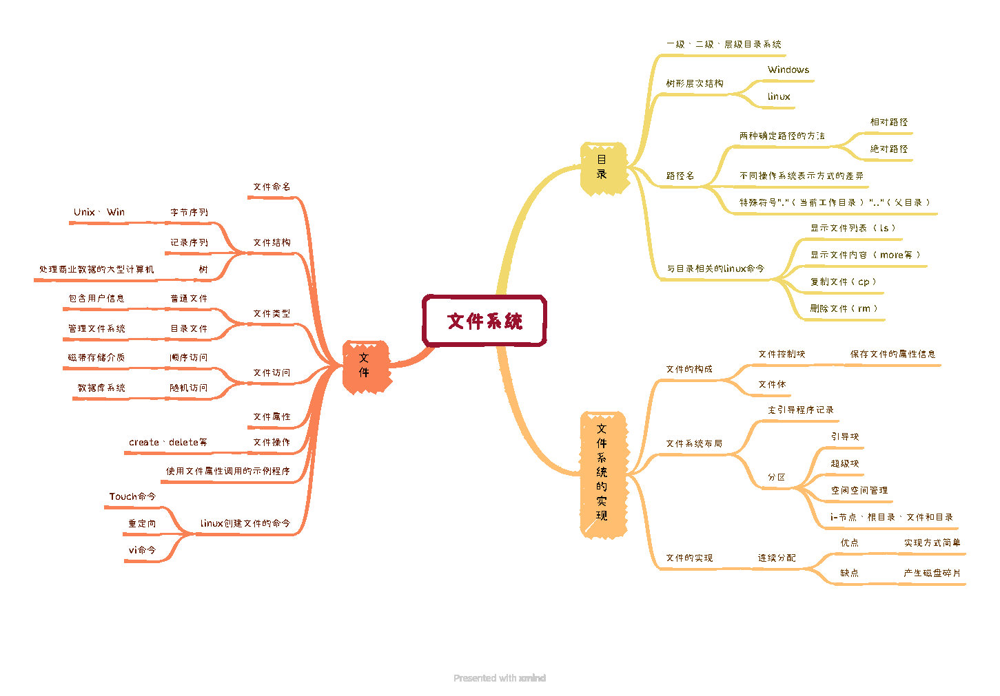

<!-- slide: 19 -->

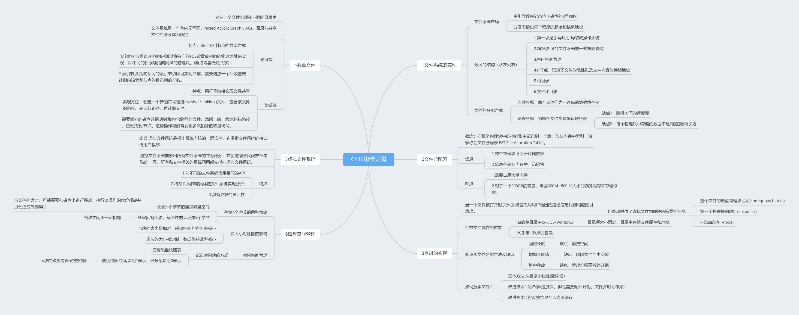

<!-- slide: 20 -->

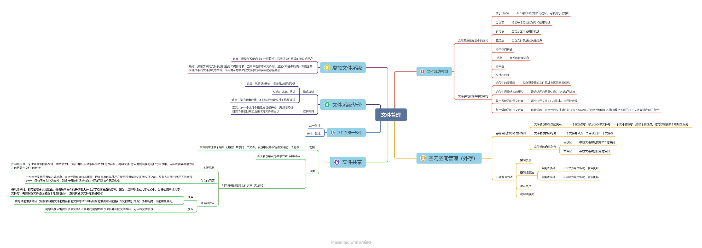

<!-- slide: 21 -->

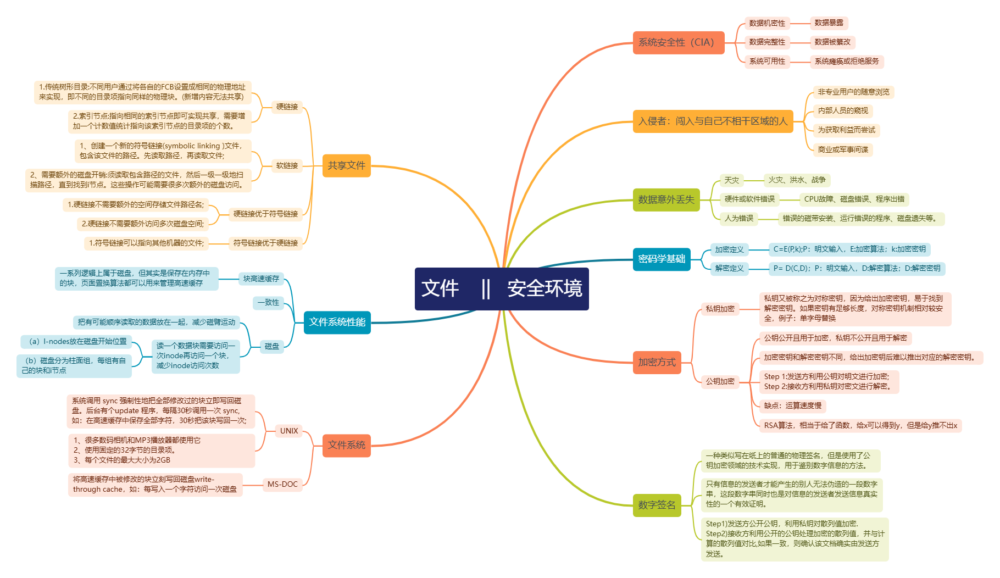

<!-- slide: 22 -->

- 提供功能强大的网络管理功能
- 提供用户界面方便用户使用
- 提供方便的可视化编辑程序
- 控制和管理系统内的各种资源
- A
- B
- C
- D
- 提交
- 操作系统的基本功能是（ ）
- 单选题
- 1分

<!-- slide: 23 -->

- 进程与程序的根本区别是
- 静态和动态特性
- 是不是被调入内存
- 是不是具有就绪、运行和等待三种状态
- 是不是占用处理器
- A
- B
- C
- D
- 提交
- 单选题
- 1分

<!-- slide: 24 -->

- 在用信号量机制实现互斥时，互斥信号量的初值为
- 0
- 1
- 2
- 3
- A
- B
- C
- D
- 提交
- 单选题
- 1分

<!-- slide: 25 -->

- 段页式存储管理中，地址映射表是
- 每个进程一张段表，两张页表
- 每个进程的每个段一张段表，一张页表
- 每个进程一张段表，每个段一张页表
- 每个进程一张页表，每个段一张段表
- A
- B
- C
- D
- 提交
- 单选题
- 1分

<!-- slide: 26 -->

- 文件系统中，文件访问控制信息存储的合理位置是
- 文件分配表
- 文件控制块
- 用户口令表
- 系统注册表
- A
- B
- C
- D
- 提交
- 单选题
- 1分

<!-- slide: 27 -->

- 计算机= 硬件 + OS +用户程序
- OS的特性
- 什么是操作系统（OS）
- 运行在内核态;
- 能够访问所有硬件;
- 能够执行机器能运行的所有指令，包括特权指令;
- 庞大,复杂,存活周期长;
- OS的两大任务
- 提供抽象和资源管理
- 内核态
- 操作系统
- 硬件
- 用户程序
- 用户态
- 软件

<!-- slide: 28 -->

- 任务一：作为扩展机器的操作系统
- 机器语言难以理解，使用起来很不方便.
- 例子: 从软盘中读取数据需要掌握16个命令，13个输入参数和23个返回值.…
- OS 隐藏了实现的细节，为用户程序提供简洁易用的接口，提高编程效率。
- 使得用户程序能够在不同机器上直接运行。

<!-- slide: 29 -->

- 计算机包含许多资源.
- – e.g. CPU, 内存, 硬盘, 键盘, 鼠标, 打印机,麦克风, 等
- OS 有效地管理各种资源，实现多用户和多道程序设计.
- 任务二：作为资源管理者的操作系统
- 进程管理
- 文件管理
- 内存管理
- 设备管理
- 操作系统的四大资源管理功能
- OS

<!-- slide: 30 -->

- 操作系统结构
- 单体系统（Monolithic System）：整个操作系统以过程集合的方式编写，链接成一个可执行二进制程序。过程之间可以互相调用。
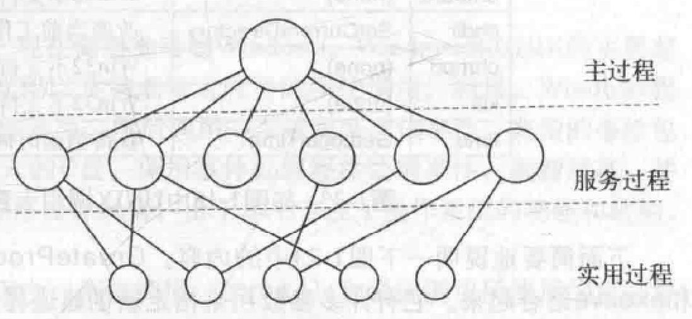
- 2

<!-- slide: 31 -->

- 操作系统结构
- 微内核（Microkernels）：将操作系统分割为多个模块，其中只有一个模块运行在内核态，其他模块运行在用户态。 (例子:  MINIX 3)
- 优点：通过减小内核态的模块提高系统可靠性。
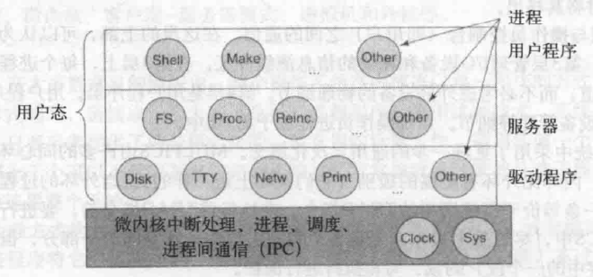
- 4

<!-- slide: 32 -->

## 进程管理

<!-- slide: 33 -->

- 33
- 进程的状态
- 三个可能的状态
  - 运行态：正在使用CPU；
  - 就绪态：在等待队列，随时可运行；
  - 阻塞态：无法运行，直到某些条件满足，比如等待一个外部的输入。
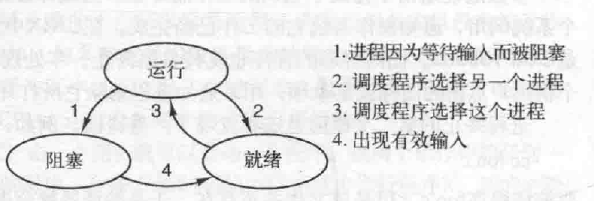

<!-- slide: 34 -->

- 34
- 进程的实现
- 操作系统维护一个进程表（Process Table），其中的每一个表项（进程控制块，PCB）对应一个进程
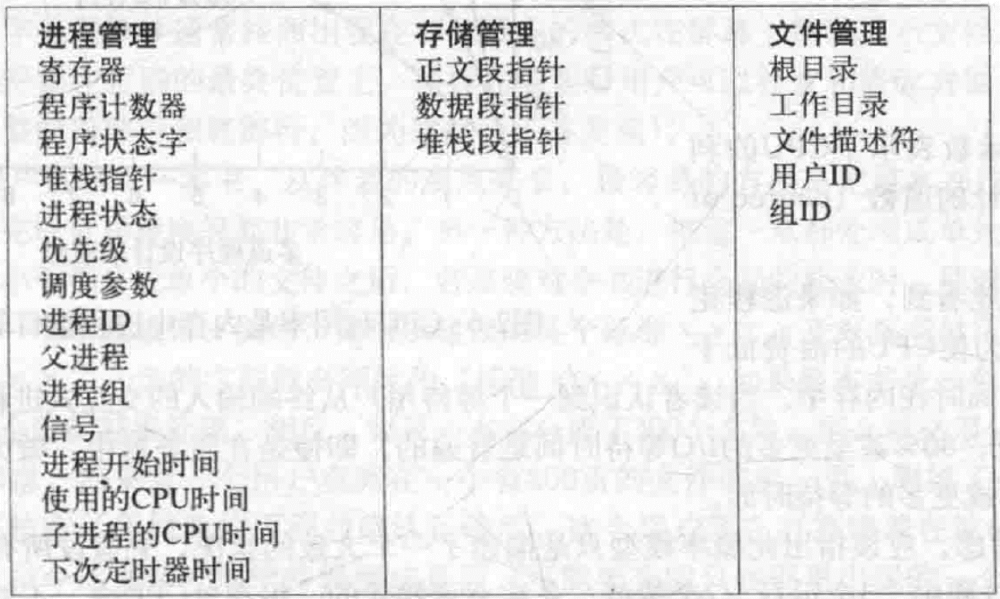

<!-- slide: 35 -->

- Unix: 进程创建
- 系统调用：fork()
- 父进程和子进程拥有相同的环境设置、文件等信息；
- 父进程和子进程具有不同的进程空间；
- #include <sys/types.h>
- #include <stdio.h>
- #include <unistd.h>
- int main()
- {
- pid_t pid = fork();
- if (pid == 0) { /* child process */
- execlp("/bin/ls"，"ls"，NULL);
- }else {
- /* parent will wait for the child to complete */
- wait(NULL);
- printf("Child Complete");
- }
- return 0;
- }
- 15
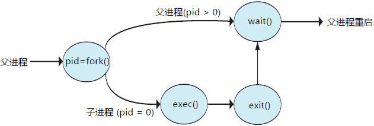

<!-- slide: 36 -->

- 36
- 进程从P1切换到P2时, P1的运行状态将保存到P1的PCB，而P2的状态则从相应的PCB中读出，使得P2能够接着之前的状态继续运行。
- 伪并行（Pseudo- parallelism） : 进程间的快速切换给人以并行运行的假象。
- 进程的实现

<!-- slide: 37 -->

- 37
- 多道程序设计模型
- 假设一个进程花费p比例的时间用于等待 I/O,而内存中有 n 个进程，则 CPU 的利用率为：
- CPU 利用率 = 1 – pn
- 分时系统：利用多道程序与多任务处理使多个用戶可以同时使用一台计算机。

<!-- slide: 38 -->

- 38
- 线程
- 什么是线程?
- 线程是操作系统能够调度的最小单位；
- 线程是进程的组成部分；
- 每个进程至少包含一个线程；
- 一个进程可以包含多个线程；
- 线程间可以共享数据和内存。

<!-- slide: 39 -->

- 39
- 进程间通信(IPC)
- 如何在进程间传递信息?
- 如何防止两个进程冲突？
- 如何实现进程执行的先后顺序？
- 竞争条件（Race conditions）: 多个进程访问一个共享数据，而数据最后的值由进程访问的先后顺序决定。
- B
- C
- A
- D

<!-- slide: 40 -->

- 40
- 临界区
- 临界资源：互斥共享变量所代表的资源，即一次只能被一个进程使用的资源；
- 临界区指并发程序中与互斥共享变量相关的程序段；
- 防止竞争条件的思想：禁止多个进程同时读和写共享数据，即同时进入临界区。

<!-- slide: 41 -->

- 41
- 信号量 [E.W. Dijkstra, 1965]
- 一个信号量是一个包含两部分内容的数据结构：
- (a) 一个整数计数器, COUNT
- (b) 一个记录阻塞进程ID的队列, Q
- struct sem_struct {
- int count;
- queue Q;
- } semaphore;
- semaphore S;

<!-- slide: 42 -->

- 42
- 信号量 [E.W. Dijkstra, 1965]
- 信号量有两个原子操作：
- UP(V操作） 和DOWN (P操作)
- DOWN(S):
- if (S.count > 0)
- S.count = S.count - 1;
- else
- block(P); 即,
- (a) 将 P进程的pid 插入 S.Q
- (b) 阻塞进程 P
- (c) 将控制权交给调度进程

<!-- slide: 43 -->

- 43
- 信号量 [E.W. Dijkstra, 1965]
- UP(S):
- if (S.Q is nonempty)
- wakeup(P) 唤醒 S.Q中的某个P; 即：
- (a) 将进程P的pid从队列S.Q中移除
- (b) 将进程P的pid插入就绪队列
- (c) 将控制权交给调度进程
- else
- S.count = S.count + 1;

<!-- slide: 44 -->

- 44
- 利用信号量实现同步/异步
- 假设我们有四个进程: A, B, C, 和 D.  B只能在A完成时开始。D只能在B和C完成时开始。如何实现上述要求？
- 需要多少信号量？
- B
- C
- A
- D

<!-- slide: 45 -->

- 45
- 利用信号量实现同步/异步
- Process A:
- - do work of A
- UP(S1);         /* Let B or C start */
- Process B:
- DOWN(S1);     /* Block until A is finished */
- - do work of B
- UP(S2);
- Process C:    	      - do work of C
- UP(S3);
- Process D:
- DOWN(S2);
- DOWN(S3);
- - do work of D
- B
- C
- A
- D

<!-- slide: 46 -->

- 46
- 进程调度
- 调度程序（Scheduler）: 用于决定哪个进程使用CPU的操作系统模块。
- 调度算法:调度模块使用的算法。
- 为了防止一个进程运行太长时间，计算机有周期性的时钟中断激活调度程序 (比如20毫秒）。
- 抢占式的调度（剥夺调度方式）: 运行的进程被临时中断，使得其他进程有机会使用CPU。

<!-- slide: 47 -->

- 47
- 调度算法的目标
- 公平性：每个进程获得相同的CPU使用时间。
- 效率性：使CPU处于忙碌状态，做有用功。
- 响应时间：最小化从发出命令到得到响应的时间。
- 周转时间：最小化从提交任务到任务完成的时间。
- 带权周转时间：周转时间/服务时间
- 吞吐量：最大化每小时完成的任务数量。

<!-- slide: 48 -->

- 48
- 先来先服务(FCFS)
- 进程	花费时间
- P1	24
- P2 	3
- P3	 3
- 进程到达的顺序: P1 , P2 , P3
- P1, P2, P3  的等待时间： 0，24，27
- 平均等待时间= (0+24+27)/3 = 17

<!-- slide: 49 -->

- 49
- 最短作业优先 (SJF)
- 一个SFJ的例子
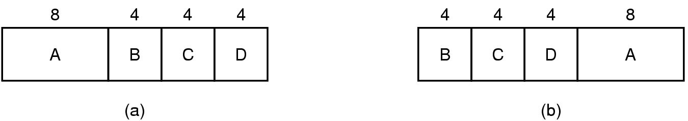
- 每个进程关联一个CPU用时，根据CPU用时选择具有最小用时的进程使用CPU。
- 难点：难以预先知道进程的CPU用时。

<!-- slide: 50 -->

- 50
- 最短作业优先 (SJF)
- 两种模式:
  - 非抢占式：一旦进程占有CPU，它将一直运行直到CPU用时到达。
  - 抢占式：如果一个新来的进程具有更小的CPU用时，则中断当前进程，使新来的进程使用CPU。
- 给定一个进程集合，SJF能够获得最优的平均最小等待时间。

<!-- slide: 51 -->

- 51
- 轮转调度
- 每个进程获得一小段CPU时间片(time quantum)q, 通常为 10~100 毫秒。当分配的时间片用完后，该进程将进入等待队列，而下一进程将使用CPU。
- 如果等待队列中有 n个进程，那么每个进程将获得 1/n 的CPU用时，且每个进程的等待时间不会超过 (n-1)q单位时间。
- 特性:
  - 当q 增大时，算法将转化为 FIFO
  - 当q 减小时，算法将产生较大比例的开销（频繁的上下文切换），因此，q 应当设的合适。

<!-- slide: 52 -->

- 52
- 优先级调度
- 每个进程关联一个优先级 (整数)
- CPU分配给具有最高优先级的进程 (通常，最小的整数值代表着最高的优先级，这个看具体定义)。
- SJF 是优先级调度的特例，如将CPU用时作为优先级。
- 问题: 饥饿 – 低优先级的进程可能会一直等待运行。
- 解决方案: 引入老化技术 – 等待的进程的优先级会随着时间推移而增大。

<!-- slide: 53 -->

- 53
- 优先级调度
- 有四个优先级类的调度算法
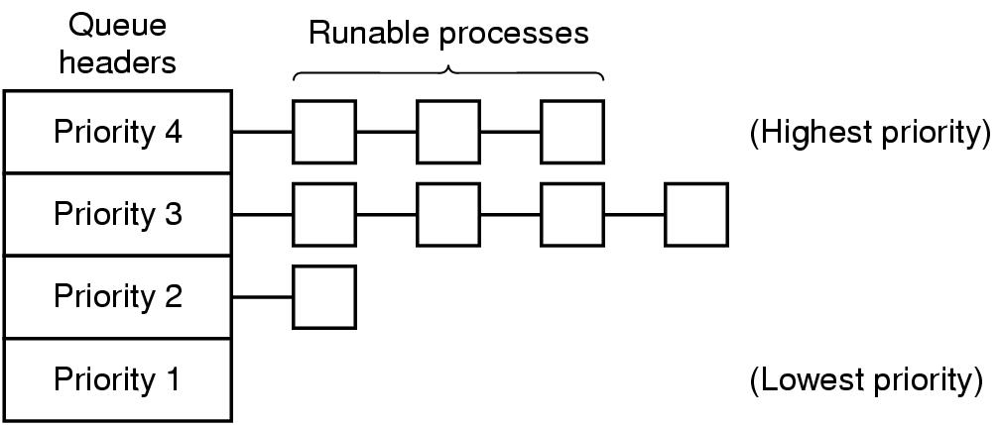

<!-- slide: 54 -->

- 54
- Example of a monitor
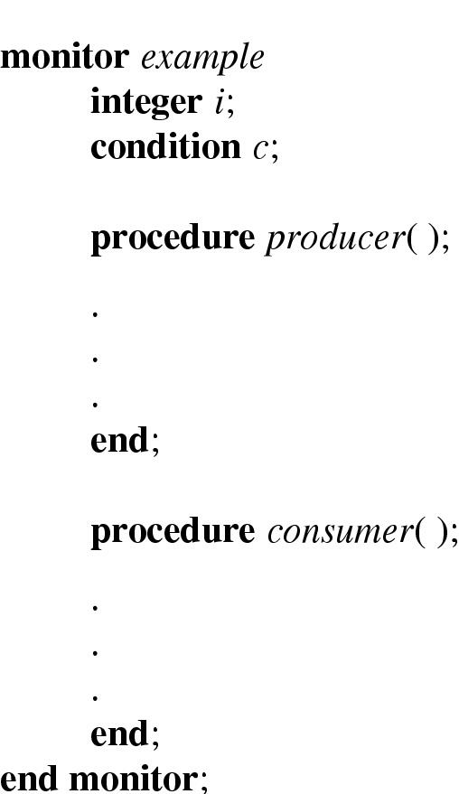
- 管程

<!-- slide: 55 -->

- 55
- 管程
- 管程是一个由过程、变量及数据结构组成的集合。
- 进程可以随意调用管程中的过程，但是不能在管程之外声明的过程中访问管程内的数据结构。
- 任一时刻管程内只能有一个活跃的进程（确保互斥，编译器负责）。
- 条件变量：允许一个进程在某个变量上等待。condition x, y;
- 条件变量只有两个操作： wait 和 signal.
- x.wait()：调用该操作的进程将被挂起；
- x.signal()：唤醒在该变量上挂起的一个进程并执行它。

<!-- slide: 56 -->

- 56
- 用管程实现生产者消费者问题。一次只能有一个管程过程活跃。其中的缓冲区有N个。

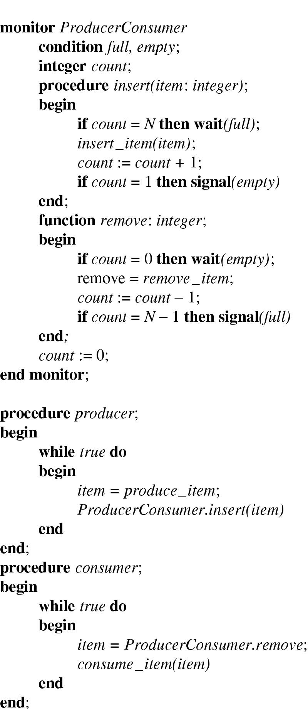
- 管程

<!-- slide: 57 -->

- 57
- Java 中的管程
  - 支持用户级别线程；
  - 在一个方法上加入synchronized 关键字，可以保证只有一个线程在使用该方法。
- 优点: 编程方便。
- 缺点:
- 实现起来比较困难，很难在现有编程语言中引入该机制。
- 管程

<!-- slide: 58 -->

- 管程与信号量的对比
- 管程中的 wait 和 signal 与信号量中的 P V 操作相似；
- 一个进程执行 P 操作后，该进程未必会被阻塞，但是一个进程执行 wait 操作后，它一定被阻塞；
- 一个进程执行 V 操作后，要么一个被阻塞的进程被唤醒，要么信号量的值加1；但是，一个进程执行 signal 操作后，若没有进程在该变量被阻塞则没有任何动作。
- http://courses.cs.vt.edu/~cs5204/fall00/monitor.html

<!-- slide: 59 -->

- 59
- 什么是死锁?
- 举个例子
- 你没有工作经验就找不到工作;  你没有工作就无法获得工作经验。
- 一个程序集处于死锁状态当集合中的每个进程都在等待一个资源，而该资源又被集合中的另一个进程占有。

<!-- slide: 60 -->

- 60
- 资源
- 一个资源指的是一种能够被申请、被使用和被释放的对象。
- 一个资源可以是一个硬件设备或者是一些信息。
- 比如: 打印机，内存，文件，等等。

<!-- slide: 61 -->

- 61
- 两类资源
- 可抢占资源
  - 可以从拥有它的进程中抢占而不会产生任何副作用 (e.g.内存)。
- 不可抢占资源
  - 若从拥有它的进程中抢占将导致致命错误或相关的计算失败 (e.g. 光盘刻录机)
  - 死锁与不可抢占资源有关，有关可抢占资源的潜在死锁可以在进程之间重新分配资源而化解。

<!-- slide: 62 -->

- 62
- 死锁的条件
- 互斥：进程拥有的资源不可共享；
- 占有和等待：一个进程拥有某个资源并请求新的资源；
- 不可抢占：分配给进程的资源不可强制抢占，只能被拥有它的进程显示释放。
- 环路等待：存在一条环路，环路中每个进程都在等待下一个进程所占有的资源。
- 所有上述四个条件必须同时满足才会发生死锁。

<!-- slide: 63 -->

- 63
- 死锁检测算法
- 考察一个未标记的进程 Pi ，其对应的R 的第i行小于 A. (说明Pi 的请求可以被满足)；
- 若找到一个这样的进程, 则将 C 的第i行加到 A, 将该进程标记并返回1。(即认为进程 Pi 完成，并将其所占有的资源释放)；
- 若没有这样的进程，则算法结束。若存在未标记的进程，则说明死锁存在。

<!-- slide: 64 -->

- 64
- 死锁检测算法
- Add all nodes to Unfinished;
- Do{
- done = true
- foreach node in Unfinished{
- if([Rnode] <= [A]){
- remove node from Unifished;
- [A] = [A] + [Cnode]
- done = false;
- }
- }
- }until(done)
- 请求资源
- 可用资源
- 占有资源

<!-- slide: 65 -->

- 65
- 死锁恢复
- 利用抢占恢复
  - 从某些进程中拿走资源并分配给另外的进程；
- 利用回滚恢复
  - 周期性地对检查点进行检查；
  - 若发现死锁则将进程恢复到一个更早的状态；

<!-- slide: 66 -->

- 66
- 死锁恢复
- 通过杀死进程恢复
  - 简单暴力的方式；
  - 将环中的某个进程杀死并释放其资源；
  - 其他进程获得资源得以运行；
  - 一般选择杀死那些可以从头开始的进程；

<!-- slide: 67 -->

- 67
- 安全状态
- 一个状态是安全的，如果存在某种调度顺序使得每个进程都可以结束即使所有进程都请求其所需的全部资源；（即，可以应付最坏情况）
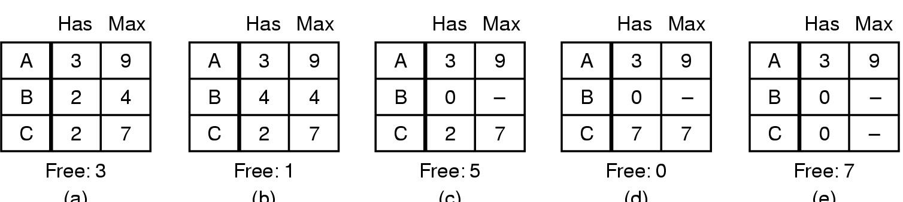
- (a)                          (b)                         (c)                          (d)                          (e)
- 状态 (a) 是安全的

<!-- slide: 68 -->

- 68
- 安全状态和不安全状态
- 两者的区别是:
  - 在一个安全状态，系统可以保证所有进程都能结束。
  - 在一个不安全状态，系统不保证所有进程都能结束。

<!-- slide: 69 -->

- 69
- 银行家算法
- Step 1: 从矩阵R中寻找小于 A的行.若没有这样的行则死锁发生 ==> 说明状态不安全。
- Step 2: 若找到符合条件的行，则说明该进程可以结束，将其标记并将其所占有的资源释放，加到A中。
- Step 3: 重复步骤1和2直到所有行都被标记 == > 说明状态安全。

<!-- slide: 70 -->

- 70
- 银行家算法小结
- 理论上: 完美.
- 实际上: 不实用，因为进程很难预知所需的资源。
- 因此，在实际中，只有少量特殊系统才会使用银行家算法来避免死锁。

<!-- slide: 71 -->

## 存储管理

<!-- slide: 72 -->

- 72
- 交换技术与虚拟内存
- 克服内存容量限制的两个方法:
  - 交换技术 即把一个进程完整调入内存，使该进程运行一段时间， 然后把它存回磁盘。
  - 虚拟内存 该策略甚至能使程序在只有一部分被调入内存的情况下运行。

<!-- slide: 73 -->

- 73
- 交换技术
- 内存分配情况随着进程进出而变化
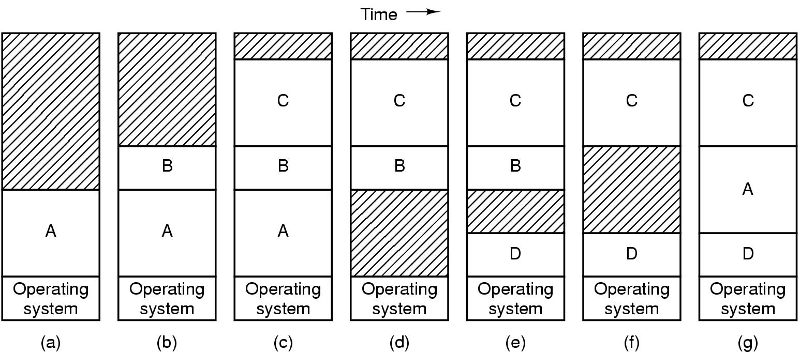
- 当交换技术在内存中产生了多个空闲区（空洞）时，可以通过调用内存紧缩技术把空闲区移动到一起并合成一个大空闲区。

<!-- slide: 74 -->

- 74
- 使用位图的存储管理
- 位图的不足: 查找位图中指定长度的连续0串是十分耗时的操作.
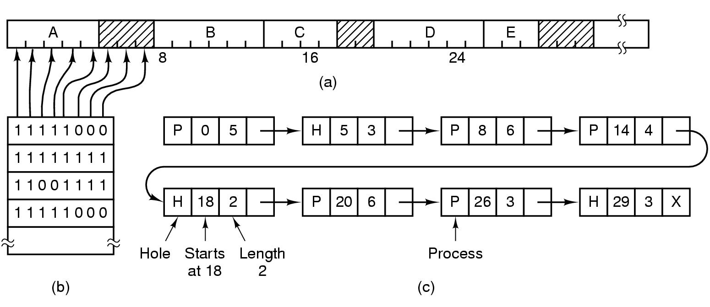
- (a) 一段有5个进程和3个空闲区的内存
  - 刻度表示内存分配单元
  - 阴影区域表示空闲（在位图中用0表示）
- (b) 对应的位图
- (c) 用空闲区链表表示的同样的信息

<!-- slide: 75 -->

- 75
- 虚拟内存
- 问题：整个程序所需的内存远大于内存空间
- 解决方案:
  - 程序员把程序划分成多个片段，称为 覆盖 – 但覆盖系统非常复杂,人工操作。
  - 虚拟内存 – 操作系统仅保留当前正使用内存的程序的一部分程序，全部工作交给计算机去做。
- 分页 实现虚拟内存的一种技术。
- 虚拟地址 是一个由程序生成的地址
- MMU  (内存管理单元) 把虚拟地址映射成物理地址

<!-- slide: 76 -->

- 76
- 原始的分页技术

<!-- slide: 77 -->

- 77
- 二级页表
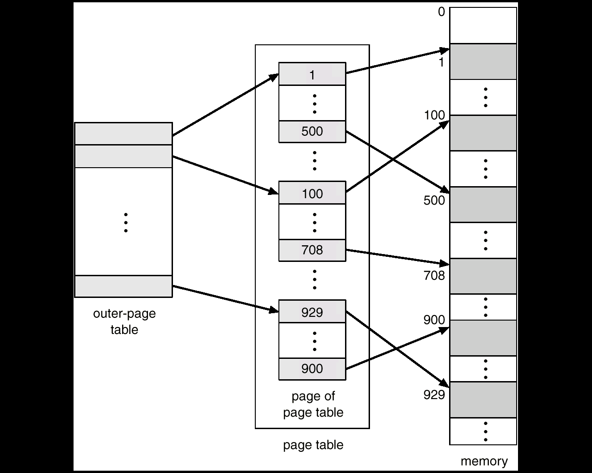

<!-- slide: 78 -->

- 78
- 转换检测缓冲区（ TLB ）
- 大部分的程序都会访问一小部分的页
- 提高方案:  给计算机装配一个小的硬件设备, 称为 转换检测缓冲区 (Translation Lookaside Buffer，TLB) 或 相联存储器或快表
- 无需通过页表即可把虚拟地址映射成物理地址。

<!-- slide: 79 -->

- 79
- 具有TLB的分页硬件
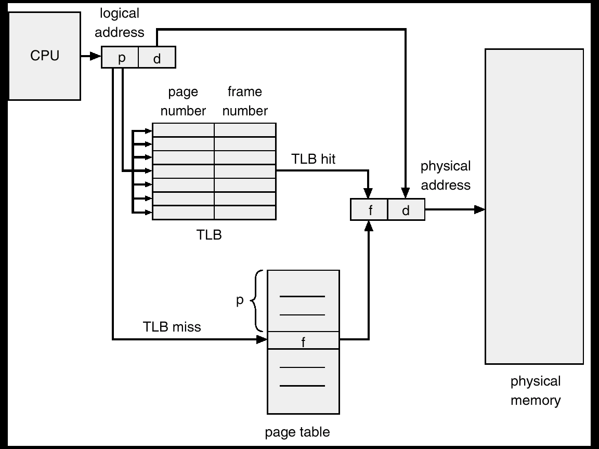

<!-- slide: 80 -->

- 80
- 页面置换算法
- 发生缺页时，OS需要选择
  - 那个页需要替换？
  - 腾出空间放置新页。
- 修改后的页面需要保存
  - 未修改的页面则可直接覆盖
- 最好不要选择经常被使用的页面
- 因该该页面很可能很快又被使用
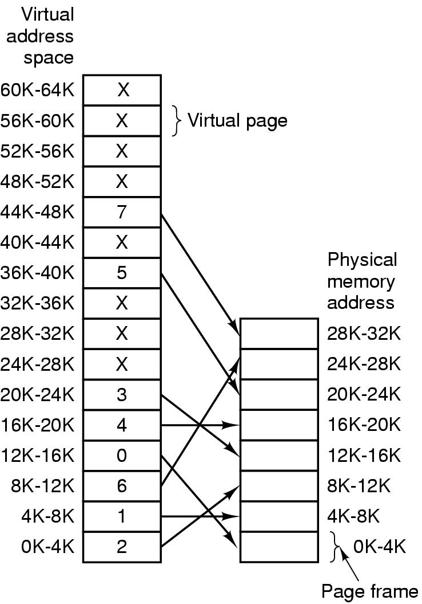

<!-- slide: 81 -->

- 81
- 最优页面置换算法
- 替换最久远才使用的页面
- 性能最优，但是无法实现

<!-- slide: 82 -->

- 82
- 最近未使用页面置换算法（NRU）
- 每个页面有访问位 (R)和修改位 (M).
  - 当页面被访问和修改时，相应位被设置；
  - 当一个进程开始时，所有页面的访问位和修改位都置零；
  - 每隔一定时间 (比如大约30毫秒），访问位将置零。
- 根据上述位将页面分为如下四类：
  - Class 0: 未访问，未修改
  - Class 1: 未访问，已修改
  - Class 2: 已访问，未修改
  - Class 3: 已访问，已修改
- NRU思想：
- 从最低编号的非空类中随机选择一个页面

<!-- slide: 83 -->

- 83
- 先进先出页面置换算法
- 维护一个所有当前在内存中的页面的链表
  - 最先进入内存的页面放在表头
- 思想：总是置换掉表头的页面
- 优点: 易于实现
- 缺点：
- 最先进入内存的页面可能是被频繁使用的页面

<!-- slide: 84 -->

- 84
- 第二次机会页面置换算法
- 考察访问位:
- 如果 R = 0  替换该页
- 如果 R = 1  设置 R = 0 并将该页放在表尾，该页面将被当成一个新页面。
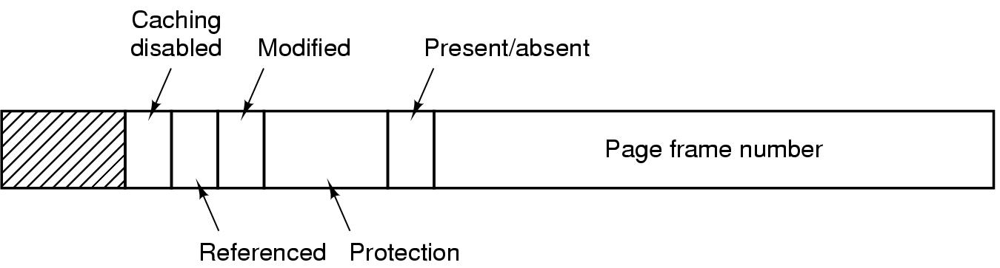

<!-- slide: 85 -->

- 85
- 最近最少使用页面置换算法(LRU)
- 假设最近使用的页面很快也会被使用
  - 扔掉最久未使用的页面
- 软件方案: 用一个链表将页面链接起来
  - 最近使用的在前面
  - 每一次内存请求时都更新一下这个链表 开销非常大!!
- 硬件方案: 采用一个64位的计数器硬件.

<!-- slide: 86 -->

- 86
- 工作集模型
- 页面在请求的时候才调入—请求调页。   （vs 预调页策略）
- 在进程运行的任何阶段，它都只访问较少的一部分页面，这种现象称为局部性访问。
- 进程最近一段时间访问的页面集合称为工作集。
- 若进程每执行几条指令就发生一次缺页中断，这种现象称为颠簸或者抖动。
- 在进程运行之前，系统保持进程的工作集在内存中，这种方法称为工作集模型。

<!-- slide: 87 -->

- 87
- 思想：考察最近访问的页面，将不在工作集中的页面置换出去。
- 一个进程的工作集是该进程在过去的 τ 虚拟时间内访问的页面集 (虚拟时间为该进程使用CPU的时间).
- 扫描整个页表，置换符合如下条件的页面:
  - R= 0, 年龄大于 τ.
  - R = 0, 年龄不大于 τ 但是具有最大年龄.
  - R = 1, 随机选择一个页面.
- 原始的工作集模型开销较大。因此，采用简化的WSCLock 算法。
- 工作集模型

<!-- slide: 88 -->

- 88
- 纯分段
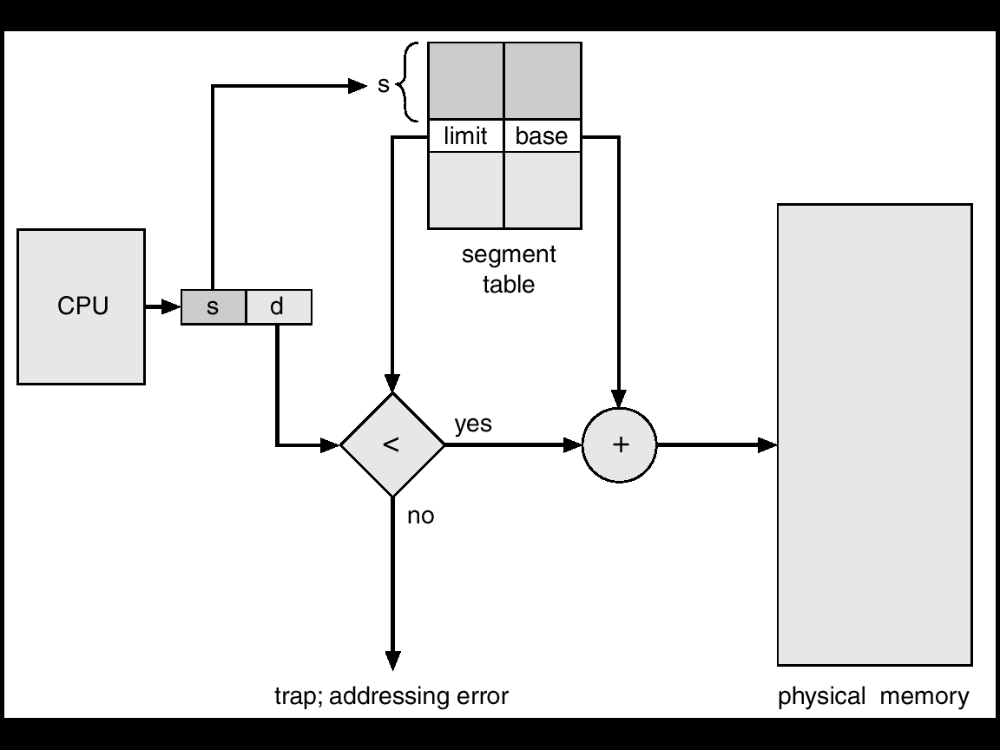

<!-- slide: 89 -->

- 89
- 分段
- 段是逻辑上独立的地址空间。
  - 段可能有不同的大小
  - 它们的大小可能会动态变化
  - 地址空间使用二维内存地址，由两部分组成:
  - (段 #, 段的偏移量)
  - 段可能有不同的保护
  - 允许进程之间共享过程和数据

<!-- slide: 90 -->

- 90
- 分段与分页结合 (MULTICS)
- CPU
- S
- D
- 段表
- limit
- PT base
- D
- p
- d’
- 页表
- f
- +
- f
- d’
- error
- Y
- N
- D < limit?
- 物理地址
- 物理内存

<!-- slide: 91 -->

- 后备存储
- 在磁盘上分配页面空间的两种方法:
  - （a）对静态交换区分页
  - （b）动态备份页面
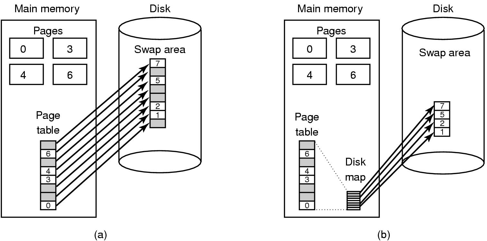

<!-- slide: 92 -->

## 设备管理

<!-- slide: 93 -->

## I/O 设备

- 93
- I/O的重要性
- 两类I/O 设备:
  - 块设备：所有传输以一个或多个完整的块为单位。比如，磁盘；
  - 字符设备：以字符为单位发送或接收一个字符流。比如，键盘、鼠标、打印机等；
- 其他设备：时钟 等。

<!-- slide: 94 -->

## 设备控制器

- 94
- 每个I/O设备有两个组成部分:
- (1) 物理部件; (2) 电子部件
- 电子部件指设备控制器 （device controller）
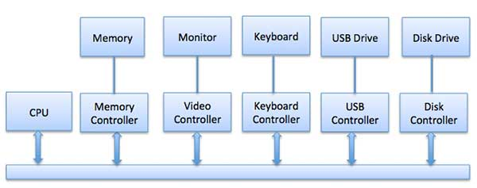

<!-- slide: 95 -->

## 设备控制器

- 95
- 任务：
- 控制设备的物理运行；
- 将序列字位流转化为字节块流；
- 纠错操作；
- 控制器与CPU的数据交互通过设备寄存器进行；为提高效率，设备通常还有数据缓冲区；如，视频控制器有视频RAM；

<!-- slide: 96 -->

## 程序控制 I/O

- 96
- 控制CPU和外围设备之间数据传送的一种方法。数据传送的工作主要由CPU完成。
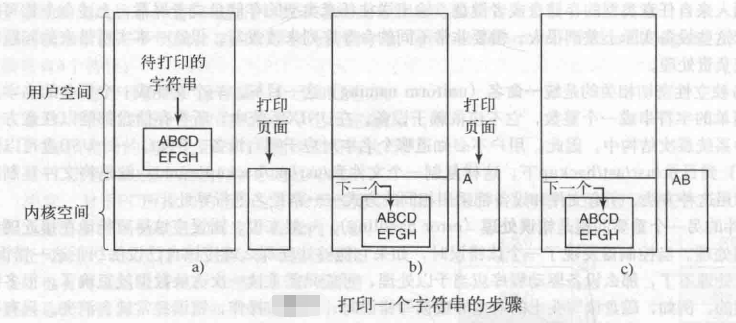
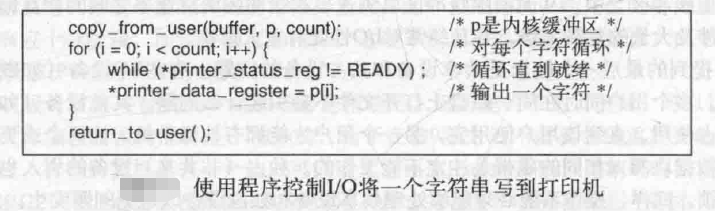

<!-- slide: 97 -->

## 中断驱动I/O

- 97
- 将CPU从繁忙等待中解脱出来
- （1）CPU初始化IO并启动第一次IO操作；
- （2）CPU去忙别的活；
- （3）当IO完成时，CPU将被中断；
- （4）CPU处理中断；
- （5）CPU恢复被中断的程序；
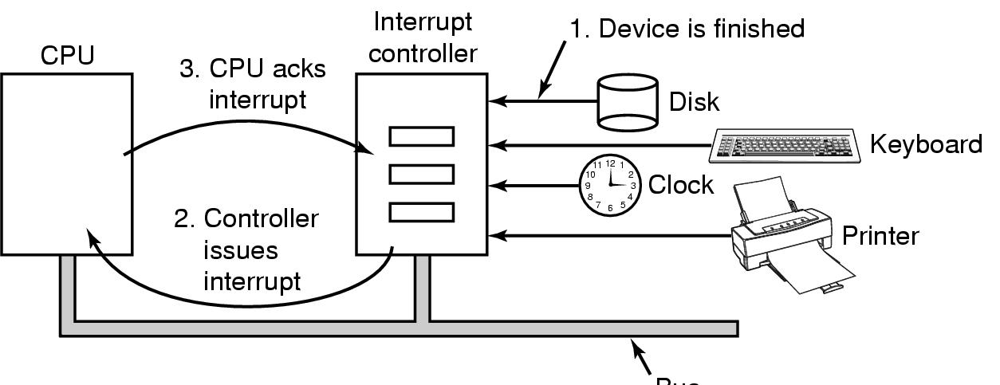
- Bus

<!-- slide: 98 -->

## DMA 控制 I/O

- 98
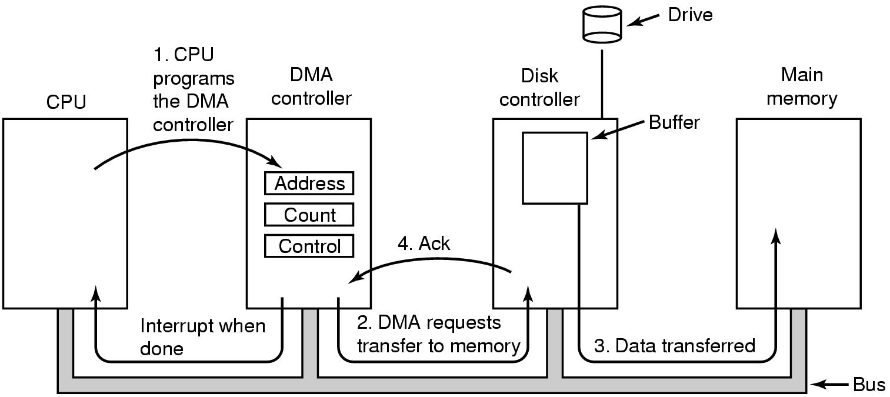
  - 直接内存访问 （Direct Memory Access, DMA）

<!-- slide: 99 -->

## I/O 软件层次

- 99
- I/O软件系统的层次
- I/O软件通常包含四个层次，每一层具有一个要执行的定义明确的功能和一个定义明确的与邻近层次的接口。（功能与接口随系统不同而不同）
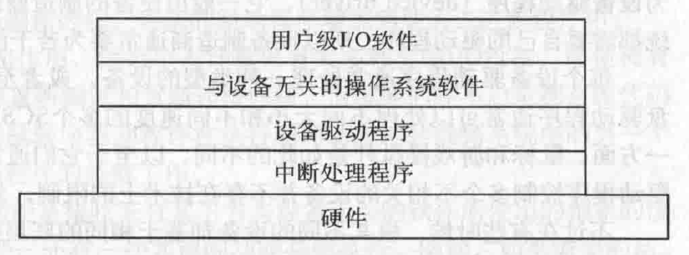

<!-- slide: 100 -->

## 磁盘

- 硬盘和软盘
- 磁盘被组织成柱面、磁道和扇区的层次；

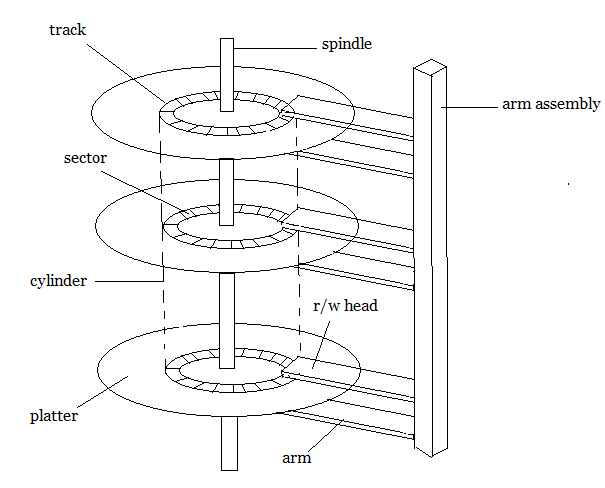

<!-- slide: 101 -->

## 磁盘读写时间

- 101
- 磁盘读写时间由三部分构成：
- （1）寻道时间；
- （2）旋转延迟；
- （3）实际数据传输时间；
- 其中，通常寻道时间占主要部分；
- 错误验证操作由磁盘控制器完成；

<!-- slide: 102 -->

## 柱面斜进（Cylinder Skew）

- 102
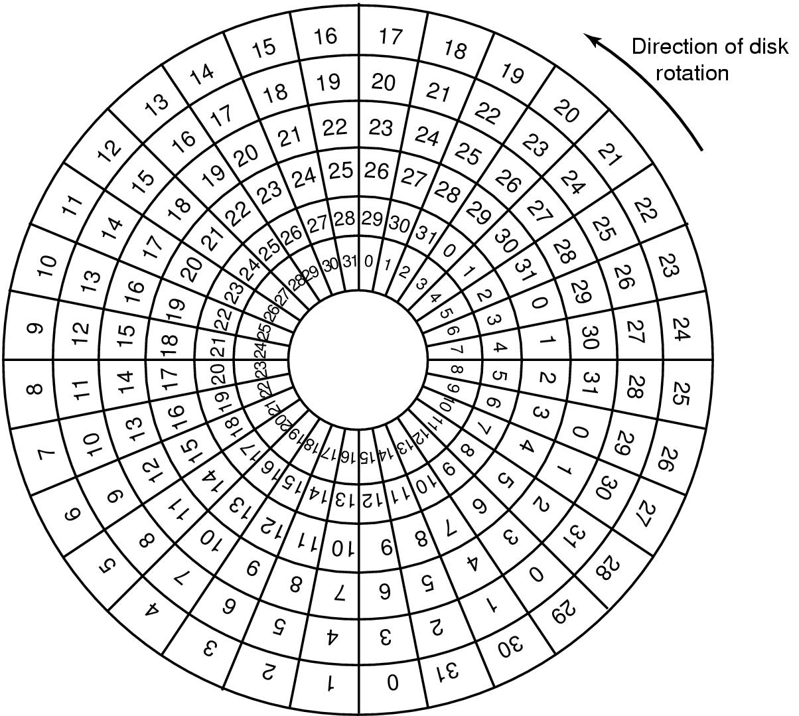
- 目的：让磁盘在一次连续的操作中读取多个磁道而不丢失数据；
- 磁头由内往外移动

<!-- slide: 103 -->

## 磁盘交错编号

- 103
- (a) 正常编号                                (b) 单交错                              (c) 双交错
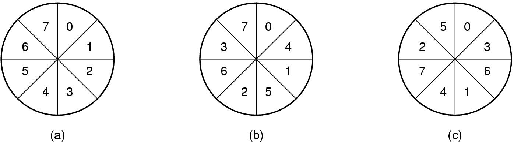
- 读出扇区做出ECC计算后传送数据；无法连着读取多个扇区，需额外等待时间；
- 格式化磁盘时，以交错方式对扇区进行编号；

<!-- slide: 104 -->

## 磁盘臂调度算法

- 104
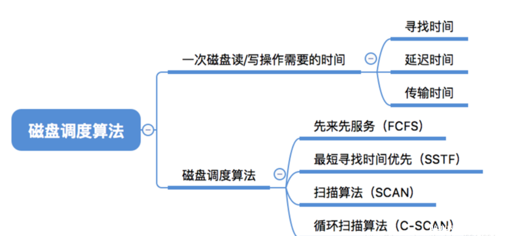

<!-- slide: 105 -->

## 磁盘臂调度算法 (电梯算法 = SCAN)

- 105
- 电梯算法调度示意图
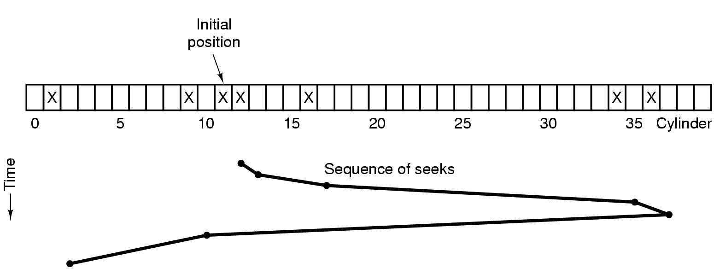
- 假设请求到达的顺序为：11, 1, 36, 16, 34, 9, and 12

<!-- slide: 106 -->

## 时钟硬件

- 106
- 可编程的时钟
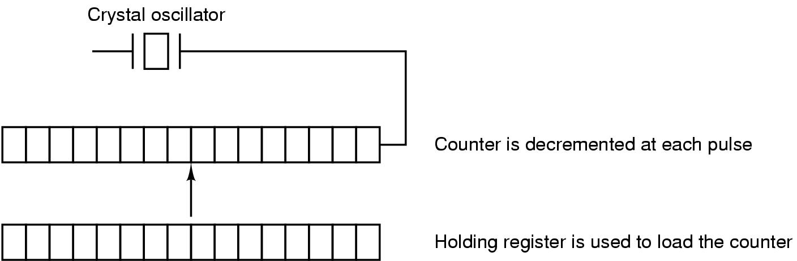
- 石英晶体产生周期性的信号（几百兆赫兹）
- 两种模式:一次完成模式，方波模式。
- 时钟滴答: 由可编程时钟产生的周期性中断。

<!-- slide: 107 -->

## 电源管理 (1)

- 107
- 不同类型的计算机部件的电源消耗
- 省电的最常用办法是将设备设计成具有多种状态： 工作、睡眠、休眠和关闭。

| 设备 | Li  等(1994) | Lorch和Smith(1998) |
|---|---|---|
| 显示 | 68% | 39% |
| CPU | 12% | 18% |
| 硬盘 | 20% | 12% |
| 调制解调器 |  | 6% |
| 声音 |  | 2% |
| 内存 | 0.5% | 1% |
| 其他 |  | 22% |

<!-- slide: 108 -->

## 文件管理

<!-- slide: 109 -->

- 109
- 文件访问
- 顺序访问
  - 从头按顺序读取文件
  - 不能跳过某些内容
  - 适合磁带存储介质
- 随机访问
  - 可以按任意顺序读取字节/记录
  - 对实现数据库系统很重要

<!-- slide: 110 -->

- 110
- 文件控制块
- 文件由文件控制块（File Control Block，FCB)和文件体两部份构成。
- 文件控制块保存文件的属性信息
- 文件名、文件的结构、文件的物理位置、存取控制信息、文件的物理位置、管理信息等。
- Unix中 的FCB 称为 i-node

<!-- slide: 111 -->

- 111
- 文件系统的实现
- 文件系统布局:
  - 主引导程序记录：磁盘的0号扇区；
  - 分区表给出每个分区的起始和结束地址。
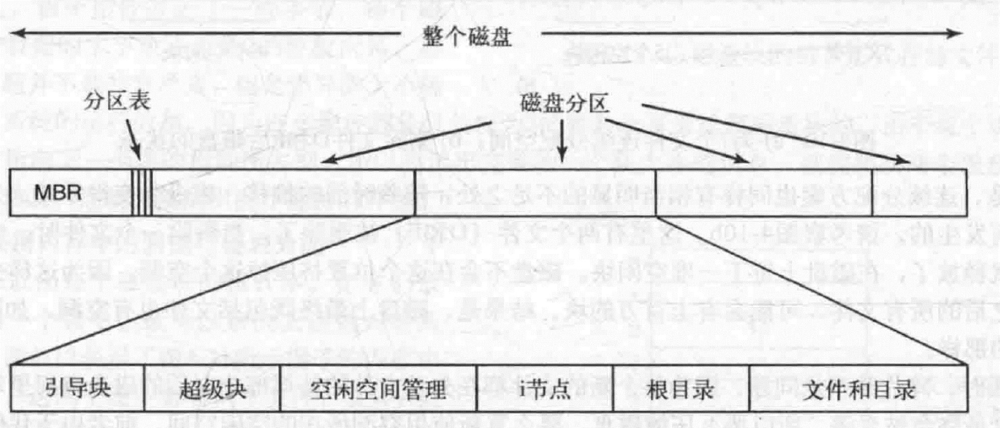

<!-- slide: 112 -->

- 112
- 文件系统的实现
  - 分区:
    - 第一块是引导块：引导装载操作系统.
    - 超级块：包含文件系统的一些重要参数
    - 空闲空间管理
    - i-节点.
    - 跟目录
    - 文件和目录

<!-- slide: 113 -->

- 113
- 文件系统的实现（物理结构）
- 连续分配
- 链接分配 （隐式链接 & 显式链接FAT）
- 索引分配 （I-node）

<!-- slide: 114 -->

- 114
- 文件系统的实现
- 连续分配- 每个文件作为一连串连续的数据块存储。
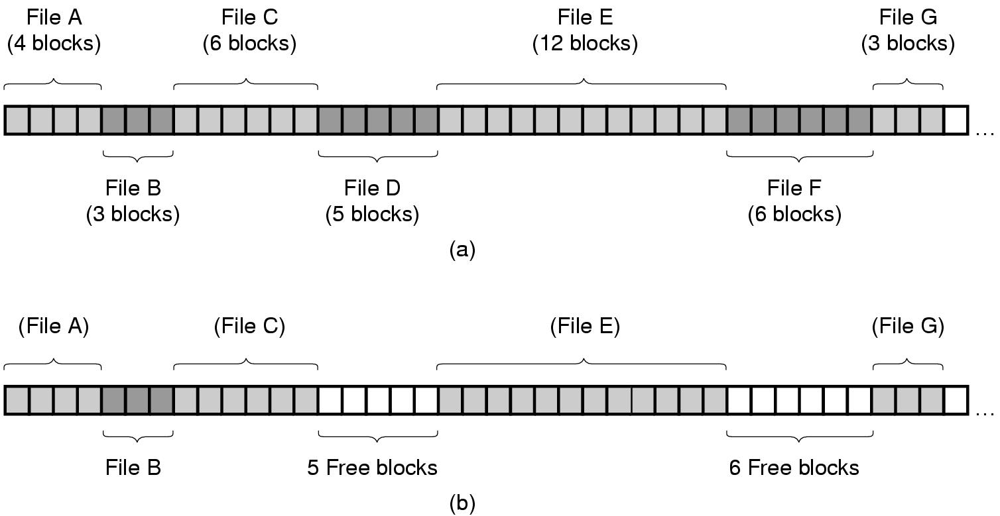

<!-- slide: 115 -->

- 115
- 文件系统的实现
- 连续分配- 每个文件作为一连串连续的数据块存储。
  - 优点:
  - 实现方式简单;
  - 读数据的性能好；
  - 缺点：
    - 产生磁盘碎片；
    - 需要预先知道文件的大小；
  - 例子: CD-ROMs, DVDs

<!-- slide: 116 -->

- 116
- 文件系统的实现
- 链表分配- 为每个文件构造磁盘块链表；
- 缺点：
  - 随机访问的速度慢；
  - 每个物理块中存储的数据不是2的整数幂次方。
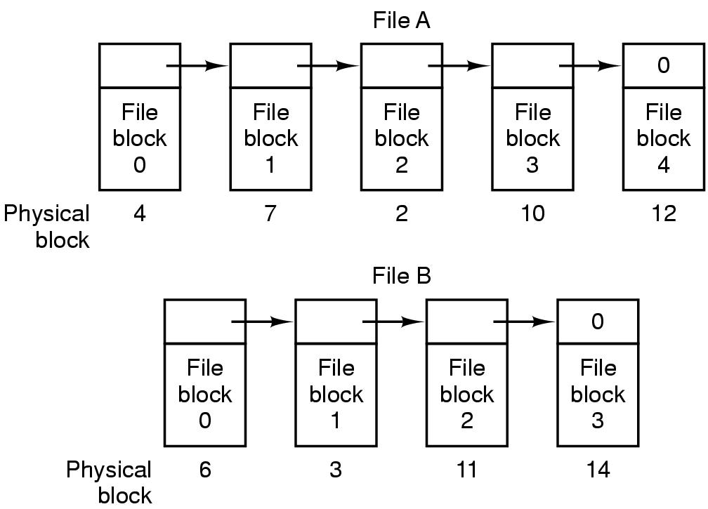

<!-- slide: 117 -->

- 117
- 文件分配表
- 把每个物理块中的指针集中记录到一个表，放在内存中索引，该表称为文件分配表 FAT (File Allocation Table) 。
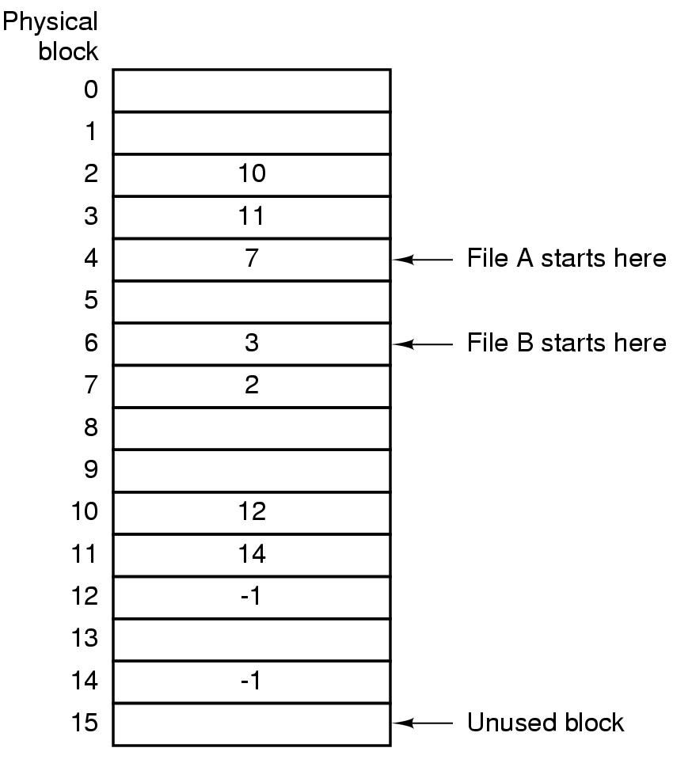
- 整个物理块可用于存储数据
- 信息存储在内存中，访问快
- 需要占用大量内存.
- 对于一个200GB的磁盘， 需要600M ~ 800 M大小的额外内存 来存储该表.

<!-- slide: 118 -->

- 118
- I-节点
- 索引分配，基于I-结点
- I-node (index-node) 记录了文件的属性以及文件内容的存储地址。
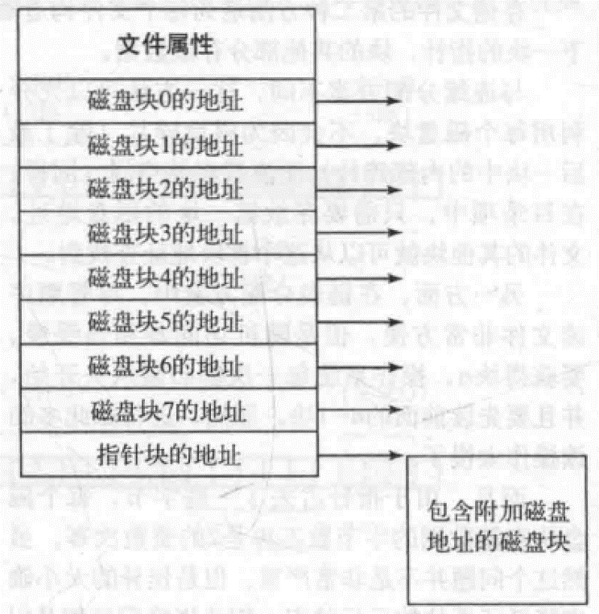
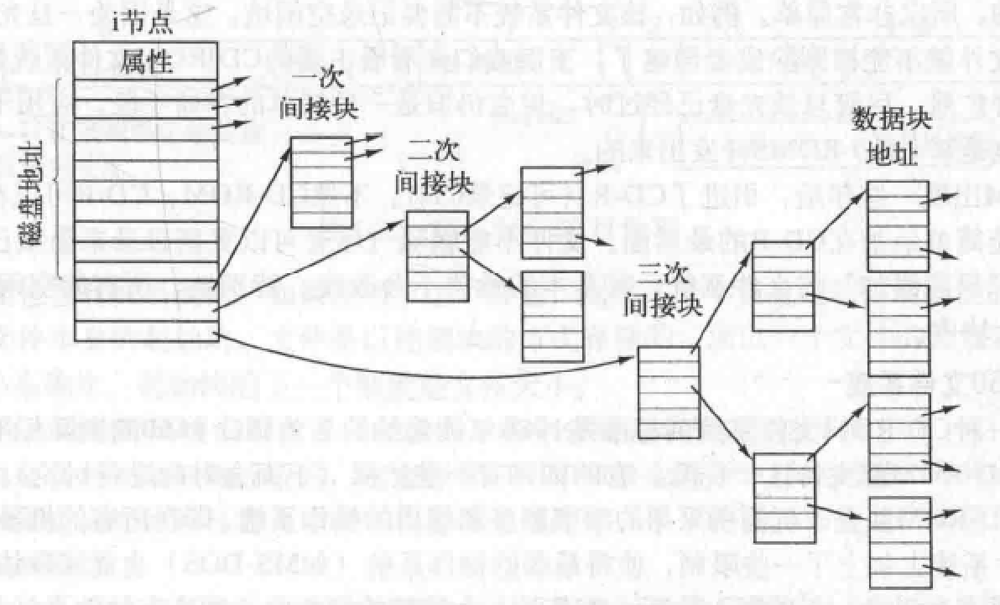

<!-- slide: 119 -->

- 119
- 记录空闲块
- 使用磁盘块链表:
- 图（a）展示了1 KB的磁盘块和32位的磁盘块号
- 使用位图:  空闲块用1表示，已分配块用0表示

<!-- slide: 120 -->

- 120
- 文件系统备份
- 丢失文件系统是灾难性的。
- 备份: 从灾难中恢复、挽救错误的操作；
- 备份的一些考虑
  - 备份整个文件系统；
  - 增量转储: 每次只存储修改过的文件；
  - 先压缩再存储；
  - 对活动文件系统做备份；
  - 安全问题；

<!-- slide: 121 -->

- 121
- 文件系统备份
- 两种备份策略:
  - 物理转储: 从第0块开始，将全部块复制存储；
    - 优点：简单、快速；
    - 缺点：无法增量存储，不能满足特定文件的恢复请求；
  - 逻辑转储: 从一个或几个指定的目录开始，递归地转储自某个基准日期之后更改的文件和目录；

<!-- slide: 122 -->

- 122
- 检查文件系统一致性的工具 (UNIX：fsck， Windows: scandisk).
- 两类一致性检测:
- (a) 块一致性
- (b) 文件一致性
- 文件系统一致性

<!-- slide: 123 -->

- 什么是虚拟存储器，虚拟内存的三种实现方式是什么？
- 作答
- 正常使用主观题需2.0以上版本雨课堂
- 主观题
- 1分

<!-- slide: 124 -->

- 什么是虚拟存储器，虚拟内存的三种实现方式是什么？
- 答：基于局部性原理，在程序装入时，将程序的一部分装入内存，而将其余部分留在外存，在程序执行时，当所访问的信息不在内存时，由操作系统将所需要的部分调入内存，继续执行程序，并将内存中暂时不使用的内容换出到外存，使得系统能为用户提供一个比实际内存大得多的存储器，上述技术实现的存储器称为虚拟存储器。（3分）
- 虚拟内存的实现主要有以下三种方式
- 请求分页存储管理（1分）
- 请求分段存储管理（1分）
- 请求段页式存储管理（1分）

<!-- slide: 125 -->

- 作答
- 正常使用主观题需2.0以上版本雨课堂
- （本题10分）。某文件系统空间的最大容量为4TB，以磁盘块为基本分配单位，磁盘块大小为1KB。文件控制块包含一个512B的索引表区。
- 请回答以下问题：
- （1）假设索引表区仅采用直接索引结构，索引表区存放文件占用的磁盘块号。索引表项中块号最少占多少字节？可支持的单个文件最大长度是多少字节？
- （2）假设索引表区采用如下结构：第0~7B采用<起始块号，块数>格式表示文件创建时预分配的连续存储空间，其中起始块号占6B，块数占2B；剩余504B采用直接索引结构，一个索引项占6B，则可支持的单个文件最大长度是多少字节？
- 主观题
- 10分

<!-- slide: 126 -->

- 答：（1）总大小为4TB，每块大小为1KB，总的块数为2^42/2^10 = 2^32块。要表达这么多块，需要32个位，即4B,因此索引表项中块号最少占4个字节。总的索引项为512B/4B = 128个，故可支持的单个文件最大长度为 128 * 1KB = 128K. （5分）
- (2)剩余504B可存放的索引项为：504/6 = 84个; 磁盘块为1KB， 故直接索引区的大小为 84KB。 预分配的2B块数总数最大为 2^16 = 64K; 故总的大小是：64K*1K=64M。因此，可支持的单个文件的最大长度为：64M+84K。 （5分）
- （本题10分）。某文件系统空间的最大容量为4TB，以磁盘块为基本分配单位，磁盘块大小为1KB。文件控制块包含一个512B的索引表区。
- 请回答以下问题：
- （1）假设索引表区仅采用直接索引结构，索引表区存放文件占用的磁盘块号。索引表项中块号最少占多少字节？可支持的单个文件最大长度是多少字节？
- （2）假设索引表区采用如下结构：第0~7B采用<起始块号，块数>格式表示文件创建时预分配的连续存储空间，其中起始块号占6B，块数占2B；剩余504B采用直接索引结构，一个索引项占6B，则可支持的单个文件最大长度是多少字节？
