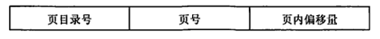
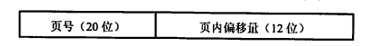
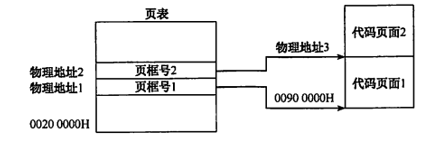
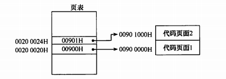
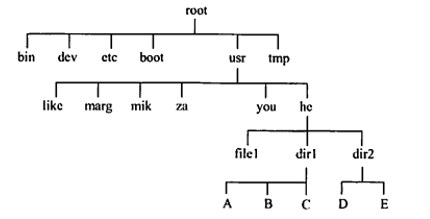
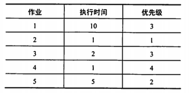
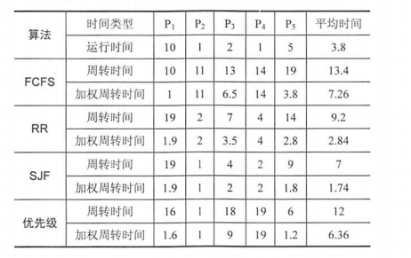

# ch-23复习二

<!-- slide: 1 -->

- 操 作 系 统
- 钟竞辉
- 办公室：B3-515
- 电子邮箱：jinghuizhong@scut.edu.cn

<!-- slide: 2 -->

- A
- B
- C
- D
- 提交
- 单选题
- 50分

<!-- slide: 3 -->

- 若每个作业只能建立一个进程，为了照顾短作业用户，应采用(___);为了照顾紧急作业用户，应采用( ___);为了能实现人机交互，应采用(___);而能使短作业.
- 作答
- FCFS调度算法
- 短作业优先调度算法
- C.时间片轮转调度算法
- D. 剥夺式优先级调度算法
- 主观题
- 50分

<!-- slide: 4 -->

- 若每个作业只能建立一个进程，为了照顾短作业用户，应采用(_B_);为了照顾紧急作业用户，应采用( _D_);为了能实现人机交互，应采用(_C_);而能使短作业.
- FCFS调度算法
- 短作业优先调度算法
- C.时间片轮转调度算法
- D. 剥夺式优先级调度算法
- 作答
- 主观题
- 50分

<!-- slide: 5 -->

- 解决/处理死锁问题有几个方法？哪种方法资源利用率最低？
- 作答
- 主观题
- 100分

<!-- slide: 6 -->

- 答：解决/处理死锁的方法有预防死锁、避免死锁、检测和解除死锁，其中预防死锁方法由于所施加的限制条件过于严格，会导致系统资源利用率和系统吞吐量降低，资源利用率最低。
- 解决/处理死锁问题有几个方法？哪种方法资源利用率最低？

<!-- slide: 7 -->

- 不会产生内部碎片的存储管理是（）
- 分页式存储管理
- 分段式存储管理
- 固定分区式存储管理
- 段页式存储管理
- A
- B
- C
- D
- 提交
- 单选题
- 50分

<!-- slide: 8 -->

- 64
- 128
- 256
- 512
- A
- B
- C
- D
- 提交

- 单选题
- 1分

<!-- slide: 9 -->

- 64
- 128
- 256
- 512
- A
- B
- C
- D

- 提交
- 单选题
- 1分

<!-- slide: 10 -->

- 以下不适合随机存取的外存分配方式是（)
- 连续分配
- 链接分配
- 索引分配
- 以上答案都适合
- A
- B
- C
- D
- 提交
- 单选题
- 50分

<!-- slide: 11 -->

- 以下不适合随机存取的外存分配方式是（)
- 连续分配
- 链接分配
- 索引分配
- 以上答案都适合
- A
- B
- C
- D
- 采用连续分配和索引分配的文件都适合于随机存取方式，只有采用链接分配的文件不具有随机存取特性。
- 提交
- 单选题
- 1分

<!-- slide: 12 -->

- 有哪几种I/0控制方式？各适用于何种场合？
- 作答
- 主观题
- 100分

<!-- slide: 13 -->

- 有哪几种I/0控制方式？各适用于何种场合？
- I/0控制方式：程序I/0方式、中断驱动I/0控制方式、DMA I/0控制方式。
- (1)程序I/0方式适用于早期的计算机系统中，并且是无中断的计算机系统；
- (2)中断驱动I/0控制方式是普遍用于现代的计算机系统中；
- (3)DMA I/0控制方式适用于I/0设备为块设备时在和主机进行数据交换的一种I/0控制方式；

<!-- slide: 14 -->

- 一个典型的文本打印页面有50行，每行80个字符，假定一台标准的打印机每分钟能打印6页，向打印机的输出寄存器中写一个字符的时间很短，可忽略不计。若每打印一个字符都需要花费50us 的中断处理时间（包括所有服务)，使用中断驱动IO方式运行这台打印机，中断的系统开销占CPU的百分比为( ).
- 2%
- 5%
- 20%
- 50%
- A
- B
- C
- D
- 提交
- 单选题
- 50分

<!-- slide: 15 -->

- 一个典型的文本打印页面有50行，每行80个字符，假定一台标准的打印机每分钟能打印6页，向打印机的输出寄存器中写一个字符的时间很短，可忽略不计。若每打印一个字符都需要花费50us 的中断处理时间（包括所有服务)，使用中断驱动IO方式运行这台打印机，中断的系统开销占CPU的百分比为( ).
- 2%
- 5%
- 20%
- 50%
- A
- B
- C
- D
- 提交
- 这台打印机每分钟打印50×80×6=24000个字符，即每秒打印400个字符。每个字符打印中断需要占用CPU时间50us，所以每秒用于中断的系统开销为400×50us =20ms。若使用中断驱动I/O，则CPU剩余的980ms 可用于其他处理，中断的开销占CPU的2%。因此，使用中断驱动IO方式运行这台打印机是有意义的。
- 单选题
- 1分

- 此题未设置答案，请点击右侧设置按钮

<!-- slide: 16 -->

- 为什么要引入交换技术？处理内存不足的技术可分为哪几种类型?
- 作答
- 主观题
- 100分

<!-- slide: 17 -->

- 为什么要引入交换技术？处理内存不足的技术可分为哪几种类型?
- 在多道环境下，一方面，在内存中的某些进程由于某事件尚未发生而被阻塞，但它却占用了大量的内存空间，甚至有时可能出现在内存中所有进程都被阻塞而迫使CPU停止下来等待的情况；另一方面，却又有着许多作业在外存上等待，因无内存而不能进入内存运行的情况。显然这对系统资源是一种严重的浪费，且使系统吞吐量下降。为了解决这一问题，在操作系统中引入了对换（也称交换）技术。
- 可以将整个进程换入、换出，也可以将进程的一部分（页、段）换入、换出。前者主要用于缓解目前系统中内存的不足，后者主要用于实现虚拟存储。

<!-- slide: 18 -->

- 系统将数据从磁盘读到内存的过程包括以下操作:
- ①DMA控制器发出中断请求
- ②初始化DMA控制器并启动磁盘
- ③从磁盘传输一块数据到内存缓冲区
- ④执行“DMA结束”中断服务程序
- 正确的执行顺序是( ).
- ③一①一②一④
- ②一③一①一④
- ②一①一③-④
- ①一②一④一③
- A
- B
- C
- D
- 提交
- 单选题
- 50分

<!-- slide: 19 -->

- 在中断发生后，进入中断处理的程序属于(  ).
- 用户程序
- 可能是用户程序，也可能是OS程序
- 操作系统程序
- 单独的程序，即不是用户程序也不是OS程序
- A
- B
- C
- D
- 提交
- 单选题
- 1分

<!-- slide: 20 -->

- 分区存储管理中常采用哪些分配策略?比较它们的优缺点。
- 作答
- 主观题
- 100分

<!-- slide: 21 -->

- 分区存储管理中常采用哪些分配策略?比较它们的优缺点。
- 作答
- 分区存储管理中常采用的分配策略有：首次适应算法、循环首次适应算法、最佳适应算法、最坏适应算法。　　a.首次适应算法的优缺点：保留了高址部分的大空闲区，有利于后到来的大型作业的分配；低址部分不断被划分，留下许多难以利用的、小的空闲区，且每次分区分配查找时都是从低址部分开始，会增加查找时的系统开销。　　b.循环首次适应算法的优缺点：使内存中的空闲分区分布得更为均匀，减少了查找时的系统开销；缺乏大的空闲分区，从而导致不能装入大型作业。　　c.最佳适应算法的优缺点：每次分配给文件的都是最适合该文件大小的分区；内存中留下许多难以利用的小的空闲区。　　d.最坏适应算法的优缺点：给文件分配分区后剩下的的空闲区不至于太小，产生碎片的几率最小，对中小型文件分配分区操作有利；使存储器中缺乏大的空闲区，对大型文件的分区分配不利
- 主观题
- 100分

<!-- slide: 22 -->

- 作答

- 某计算机主存按字节编址，逻辑地址和物理地址都是32位，页表项大小为4B。请回答下列问题:
- 若使用一级页表的分页存储管理方式，逻辑地址结构为
- 则页的大小是多少字节?页表最大占用多少字节?
- 2）若使用二级页表的分页存储管理方式，逻辑地址结构为
- 设逻辑地址为LA，请分别给出其对应的页目录号和页表索引的表达式。
- 3）采用1)中的分页存储管理方式，一个代码段的起始逻辑地址为0000 8000H，其长度为8 KB，
- 被装载到从物理地址0090 0000H开始的连续主存空间中。
- 页表从主存0020 0000H开始的物理地址处连续存放，如下图所示(地址大小自下向上递增)请计算出
- 该代码段对应的两个页表项的物理地址、这两个页表项中的页框号，以及代码页面2的起始物理地址。
- 主观题
- 100分

<!-- slide: 23 -->

- 答：
- 因为主存按字节编址，页内偏移量是12位，所以页大小为212B=4KB。
- 页表项数为2^20，因此该一级页表最大为2^20x4B= 4MB。
- 页目录号可表示为(((unsigned int)(LA))>>22) & 0x3FF。
- 页表索引可表示为((unsigned int)(LA))>>12) & 0x3FF。
- 代码页面1的逻辑地址为0000 8000H，表明其位于第8个页处，对应页表中的第8个页表项，
- 所以第8个页表项的物理地址=页表始址＋8×页表项的字节数=0020 0000H +8×4 = 0020 0020H。
- 由此可得如下图所示的答案。

<!-- slide: 24 -->

- 作答
- 某个文件系统中，外存为硬盘。物理块大小为512B，有文件A包含598条记录，每条记录占255B，
- 每个物理块放⒉条记录。文件A所在的目录如下图所示。文件目录采用多级树形目录结构，
- 由根目录结点、作为目录文件的中间结点和作为信息文件的树叶组成，每个目录项占127B，
- 每个物理块放4个目录项，根目录的第一块常驻内存。试问:

- 1）若文件的物理结构采用链式存储方式，链指针地址占2B，则要将文件A读入内存，
- 至少需要存取几次硬盘?
- 2）若文件为连续文件，则要读文件A的第487条记录至少要存取几次硬盘?
- 主观题
- 10分

<!-- slide: 25 -->

- 答：
- 由于根目录的第一块常驻内存（即root 所指的/bin, /dev, letc, /boot等可直接获得)，根目录找到文件A需要5次读盘。由255×2+2=512可知，一个物理块在链式存储结构下可放2条记录及下一个物理块地址，而文件A共有598条记录，因此读取A的所有记录所需的读盘次数为598/2=299，所以将文件A读到内存至少需读盘299+ 5=304 次。
- 当文件为连续文件时，找到文件A同样需要5次读盘，且知道文件A的地址后通过计算只需一次读盘即可读出第487条记录，所以至少需要5+1=6次读盘。

<!-- slide: 26 -->

- 作答
- 假定一个盘组共有100个柱面，每个柱面上有16个磁道，每个磁道分成4个扇区。
- 1) 整个磁盘空间共有多少个存储块?
- 2）若用字长32位的单元来构造位示图，共需要多少个字?
- 3）位示图中第18个字的第16位对应的块号是多少?
- 主观题
- 100分

<!-- slide: 27 -->

- 答：
- 1) 整个磁盘空间的存储块数目为4×16x100=6400个。
- 2) 位示图应为6400个位，如果用字长为32位（即n=32）的单元来构造位示图，那么需要6400/32= 200个字。
- 3) 位示图中第18个字的第16位(即 i=18,j=16）对应的块号为32×(18-1)+ 16=560。

<!-- slide: 28 -->

- 作答
- 假定要在一台处理器上执行下表所示的作业，且假定这些作业在时刻0以1,2,3,4,5的顺序到达。
- 说明分别使用FCFS、RR（时间片=1)、SJF及非剥夺式优先级调度算法时，
- 这些作业的执行情况（优先级的高低顺序依次为1到5 ).
- 针对上述每种调度算法，给出平均周转时间和平均带权周转时间。

- 主观题
- 10分

<!-- slide: 29 -->

- 所以，FCFS的平均周转时间为13.4，平均加权周转时间为7.26.
- RR的平均周转时间为9.2，平均加权周转时间为2.84。
- SJF的平均周转时间为7，平均加权周转时间为1.74。
- 非剥夺式优先级调度算法的平均周转时间为12，平均加权周转时间为6.36。
