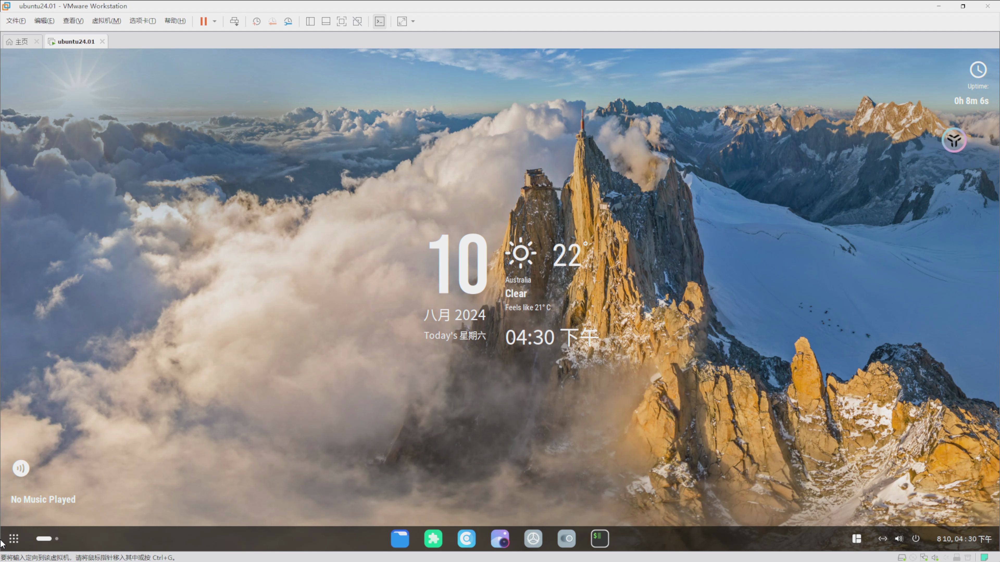
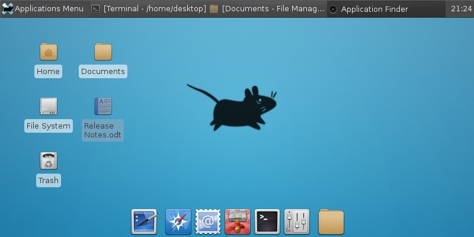
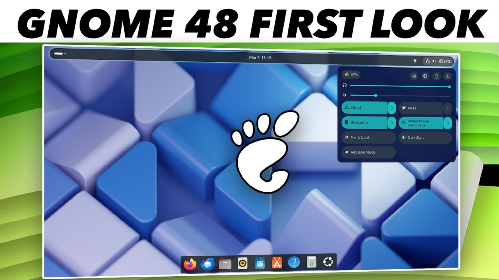
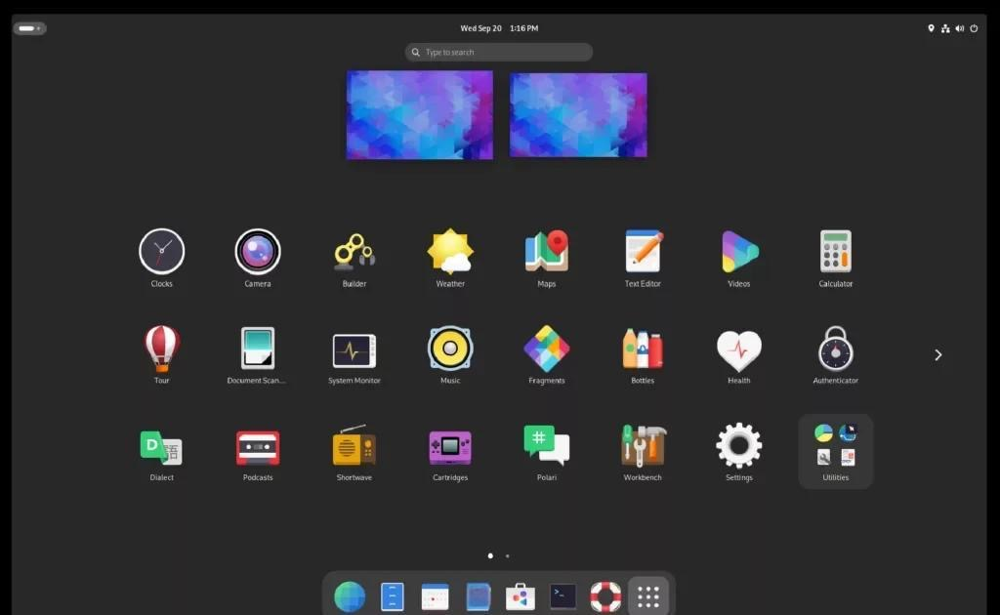
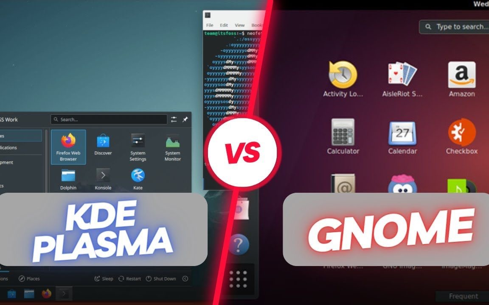
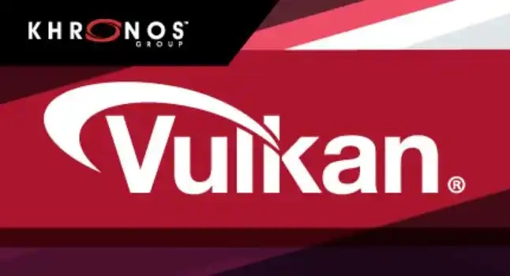

# Linux_GUI_Technology_Review

<!-- slide: 1 -->

- 操 作 系 统
- Operation System
- 杨 灿     华南理工大学
- 计算机科学与工程学院
- Email: cscyang@scut.edu.cn
- http://www.scholat.com/yangcan
- Part 7 GUI 图形用户界面
- GUI系统的若干技术问题

> 备注：Ubuntu 24.01 Gnome 图形用户界面

<!-- slide: 2 -->

## Linux的GUI技术综述

- 主题：现代操作系统中的图形用户界面（GUI, Graphical User Interface）

<!-- slide: 3 -->

## 一、GUI总体结构

- Linux的GUI是一个多层体系：应用程序 → GUI工具包 →
- 显示服务器 → 显示驱动层 → 内核 → 硬件
- 每一层负责不同的功能，从绘图接口到屏幕显示。
- +------------------------------------------------------------------+
- | 应用程序（如 Firefox、VS Code）        		   |
- +------------------------------------------------------------------+
- | GUI工具包（GTK、Qt、wxWidgets）       		   |
- +------------------------------------------------------------------+
- | 显示服务器（X.Org / Wayland）         		   |
- +------------------------------------------------------------------+
- | 显示驱动层（DRM、KMS、Mesa、OpenGL）   |
- +------------------------------------------------------------------+
- | Linux内核（Framebuffer、GPU驱动）                  |
- +------------------------------------------------------------------+
- | 硬件（显示器、显卡、输入设备）                      |
- +------------------------------------------------------------------+

<!-- slide: 4 -->

## 二、底层机制

| 名称 | 全称 | 主要功能 | 主要用途 | 时代背景 |
|---|---|---|---|---|
| Framebuffer （帧缓冲区） | Frame Buffer Device | 直接把像素写入显示缓冲区；直接写像素到显示设备（纯CPU绘制） | 嵌入式系统 | 1990s |
| DRM | Direct Rendering Manager | 管理 GPU 资源、显存、命令队列（GPU绘制）；GPU加速，但Xorg控制输出 | 桌面Linux早期 | 2000s |
| KMS | Kernel Mode Setting | 由内核控制显示模式：设置分辨率、刷新率、输出端口；内核统一管理显示，Wayland标准接口 | 现代桌面与嵌入式系统 | 2010s |

- Framebuffer、DRM、KMS —— Linux 图形栈中最底层、最接近硬件的核心组件。
- 它们直接与显卡（GPU）交互，决定上层（Xorg、Wayland、OpenGL 等）如何最终把图像“推”到屏幕上。

<!-- slide: 5 -->

## 二、底层机制

- Framebuffer（fbdev）
- 📜 Framebuffer 是最早的 Linux 图形接口，它把显存（video RAM）映射为一个普通的内存缓冲区。
- ⚙️ 工作原理  应用程序（或驱动）通过 /dev/fb0 这样的设备文件直接写像素：
  - int fb = open("/dev/fb0", O_RDWR);
write(fb, framebuffer_data, size);
- 系统会自动把这些像素传递到显示控制器，显示在屏幕上。

| 优点 | 缺点 |
|---|---|
| 简单、易实现 | 仅支持单缓冲（画面闪烁） |
| 不依赖 GPU | 无法利用硬件加速 |
| 适合嵌入式系统 | 不支持多屏/多显存/复合窗口 |

- 常见文件：
- /dev/fb0
- /sys/class/graphics/fb0/
- /proc/fb

<!-- slide: 6 -->

## 二、底层机制

- DRM（Direct Rendering Manager）
- 📜 定义
- DRM 是 Linux 内核子系统，用来：
- 管理 GPU；
- 分配显存；
- 调度渲染任务；
- 管理渲染缓冲区。
- ⚙️ 关键机制
- DRM 驱动由厂商提供
- （如 i915, amdgpu, nouveau, virtio_gpu 等），主要提供：
- /dev/dri/card0（主GPU接口）
- /dev/dri/renderD128（渲染接口，无显示权限）
- 应用通过 Mesa + libdrm 与内核交

| 模式 | 说明 |
|---|---|
| User Mode Setting (UMS) | 用户空间（如 Xorg）控制分辨率与输出模式 |
| Kernel Mode Setting (KMS) | 由内核统一管理显示模式（现代系统默认） |

- 🔧 DRM 的两种模式：
- DRM 负责 GPU 与显存的资源管理，
- KMS 则是 DRM 的一个子模块，专管显示输出。

<!-- slide: 7 -->

## 二、底层机制

- KMS（Kernel Mode Setting）
- 📜 定义   KMS 是 DRM 子系统的一部分，
- 主要负责显示输出的配置：
- 分辨率（Resolution）
- 刷新率（Refresh Rate）
- 输出接口（HDMI, eDP, DP, VGA）
- 帧缓冲绑定（Framebuffer binding）
- ⚙️ 原理 : 应用或显示服务器通过 ioctl() 调用 DRM 接口：
- drmModeSetCrtc(drm_fd, crtc_id, fb_id, x, y, connectors, 1, mode);

| 项目 | Framebuffer | KMS |
|---|---|---|
| 控制者 | 用户态 | 内核态 |
| 分辨率设置 | 通过 IOCTL 修改寄存器 | 由内核统一调度 |
| 多显示器支持 | 无 | 有（多个 CRTC + Connector） |
| 性能 | 慢 | 快（与GPU协作） |

- 用户空间：
- +------------------------------------+
- | Xorg / Wayland / OpenGL  |
- +------------------------------------+
- ↓
- 内核空间：
- +--------------------------------------+
- | DRM — GPU资源管理          |
- |   ├── GEM/TTM内存分配    |
- |   └── KMS显示配置               |
- +--------------------------------------+
- ↓
- 硬件层：
- +-----------------------------------------+
- | GPU + 显示控制器 + 显示器   |
- +-----------------------------------------+

<!-- slide: 8 -->

## 三、显示服务器层

- 1. X Window System（X11协议）
- - Client-Server架构，网络透明性高
- - 缺点：延迟高，渲染效率低
- 2. Wayland（现代替代方案）
- - 简化架构，减少中间通信
- - 合成器（Compositor）直接负责绘制
- 🪟 X11 是“1980年代的网络终端图形系统”，
- 🌀 Wayland 是“现代GPU驱动的显示协议”，更快、更安全、更简洁。

<!-- slide: 9 -->

## X11 vs Wayland 对比

- 对比项 			| X11 			| Wayland
- -------------------|------------------|---------
- 架构复杂度 	| 高 				| 低
- 延迟 				| 高 				| 低
- 安全性 			| 弱 				| 强
- 硬件加速 		| 间接 			| 原生支持
- 网络显示 		| 原生支持 	| 外部扩展													（Waypipe）
- X11 和 Wayland 是 Linux 图形系统的最底层显示协议 ——
- 它们不属于桌面环境（Desktop Environment），也不属于GUI框架（如GTK、Qt），而是应用程序与显卡驱动之间的通信协议层。

<!-- slide: 10 -->

## X11 vs Wayland 对比

- X11（X Window System）
- 📜 1. 简介
- 全称：X Window System, Version 11 (X11)
- 出生：1984年（MIT）
- 核心组件：X Server + X Client + X Protocol
- 目标：提供一个“网络透明的图形显示系统”。
- ⚙️ 2. 工作原理
- X11 的基本通信模型如下：
- +---------------------------+        X Protocol (TCP/Unix Socket)       +-----------------------------------+
|  应用程序 (Client) |  <---------------------------------------------->  |  X Server (显示服务器)  |
+---------------------------+                                                                       +-----------------------------------+
- X Client：用户程序（如 Firefox、Gedit），通过 Xlib 或 GTK/Qt 调用 X 协议。
- X Server：负责直接与显卡、鼠标、键盘通信，并将窗口绘制到屏幕。
- X Server 还可以运行在远程主机上（网络透明性）。
- 🧩 3. 优点
- ✅ 强大的网络透明机制（可以远程显示 GUI）。
- ✅ 成熟、稳定，支持丰富的扩展（OpenGL、XInput、XRandR等）。
- ❌ 4. 缺点
- 架构老旧（上世纪80年代设计）；
- 大量中间层（Client → Server → Compositor → GPU）；
- 延迟高；
- 安全性差（任意X Client可监听键盘事件）；
- 对现代硬件（多显示器、GPU合成）支持效率低。

<!-- slide: 11 -->

## X11 vs Wayland 对比

- Wayland（X11继任者）
- ⚙️ 工作原理
- Wayland 移除了“X Server”，直接让**合成器（Compositor）**负责显示：
- +---------------------------+
| 应用程序 (Client)    |
|   ↳ 绘制窗口内容   |
+---------------------------+
          ↓
   Wayland Protocol
          ↓
+--------------------------------------------------------------------+
|  Compositor（例如：Weston、Mutter、KWin）  |
|  ↳ 合成所有窗口图像并输出到屏幕                        |
+--------------------------------------------------------------------+
          ↓
     GPU / Framebuffer
- 每个应用程序将窗口内容直接绘制成共享内存缓冲区（例如OpenGL/EGL），
- Compositor 负责最终合成这些缓冲区，送入 GPU 输出。
- 出生：2008年；目标：取代X11，使图形栈更简单、高效、安全。
- 核心组件：Wayland Protocol + Compositor
- 🧩 优点
- ✅ 延迟低（少了中间层）。
- ✅ 安全性高（不同程序的缓冲区隔离）。
- ✅ 对GPU/多显示器/HiDPI支持原生。
- ✅ 架构简洁（协议小而干净）。
- ❌ 缺点
- ⚠️ 不支持远程显示（X11的网络透明性丢失）。
- ⚠️ 一些旧程序和工具尚未完全兼容。
- ⚠️ 每个桌面环境需自己实现 compositor（如 GNOME 的 Mutter，KDE 的 KWin）。

<!-- slide: 12 -->

## 三、显示协议层：现实状况（2025）

- 🪟 X11 是“1980年代的网络终端图形系统”，
- 🌀 Wayland 是“现代GPU驱动的显示协议”，更快、更安全、更简洁。

| 状态 | 说明 |
|---|---|
| ✅ Wayland 已成为主流 | Ubuntu 22.04+、Fedora、KDE 6 默认启用Wayland |
| ⚙️ X11 仍保留兼容层 | 通过 XWayland 运行旧应用 |
| 🧩 服务器与远程桌面仍使用X11 | 因Wayland远程方案尚不统一（PipeWire/RDP在替代） |

| 桌面环境 | 使用的显示服务器 | 协议类型 |
|---|---|---|
| GNOME 40+ | Mutter | Wayland |
| KDE Plasma 6 | KWin | Wayland |
| XFCE / MATE | Xfwm4 / Marco | X11（过渡中） |
| Weston | Weston | Wayland 参考实现 |
| Xfce（旧版） | Xorg | X11 |

- 主要显示服务器与环境对应关系

<!-- slide: 13 -->

## 三、显示服务器层的实现 Xorg

- Xorg —— X11 协议的主要实现
- 全称：X.Org Server
- 作用：X11 协议的标准实现
- 所属项目：X.Org Foundation
- 适用桌面环境：GNOME（旧版）、XFCE、MATE、LXDE 等
- ⚙️ 工作机制
- Xorg 是一个 X Server（显示服务器），它
- 与硬件驱动（GPU）通信；
- 接收各应用程序（X Client）的绘图请求；
- 把这些请求合成到屏幕上。
- 🧩 示例流程：
- [Firefox] → [Xlib] → [X Protocol] → [Xorg Server] → [GPU Framebuffer]
- ✅ 优点
- 历史悠久，兼容所有旧程序；
- 支持远程显示（X Forwarding）；
- 模块化驱动架构。
- ❌ 缺点
- 延迟高；
- 安全性弱；
- 体系过老；
- 依赖外部合成器（如 Compton/Picom）才能实现透明、动画。

<!-- slide: 14 -->

## 三、显示服务器层的实现

- Wayland 世界中的三大合成器：Weston、Mutter、KWin
- Wayland 不再有 “X Server”，而是由 Compositor（合成器） 直接与应用程序通信。每个 Compositor 都是一个 Wayland 显示服务器的实现。
- 应用 → Wayland Protocol → Weston Compositor → GPU输出
- GNOME Shell (JS层)
- ↓
- Mutter (C层, 图形合成)
- ↓
- Wayland / OpenGL / KMS
- KDE Plasma Shell
- ↓
- KWin (Compositor + WM)
- ↓
- Wayland / OpenGL / Vulkan / KMS
- 软件结构

<!-- slide: 15 -->

## 三、显示服务器层的实现

| 状态 | 说明 |
|---|---|
| ✅ GNOME（Mutter）默认使用Wayland | 从 GNOME 40 起，Wayland 模式默认启用 |
| ✅ KDE Plasma 6 (KWin) 默认Wayland | KDE 官方已宣布转向 Wayland |
| ⚙️ Xorg 仍被XFCE/MATE广泛使用 | 因兼容性好，资源占用低 |
| 🧩 Weston 仅用于开发与嵌入式验证 | 不用于日常桌面 |

- 现实状况（截至 2025）

| 项目 | KWin |
|---|---|
| 归属 | KDE 项目 |
| 作用 | KDE Plasma 桌面的窗口管理器 + 合成器 |
| 协议 | 支持 X11 与 Wayland 双模式 |

- 🔹 特点：
- 高度可定制（特效、阴影、模糊、虚拟桌面）；
- 对 GPU 合成优化极佳；
- KDE 6 已完全转向 Wayland；
- 同时保留 X11 支持模式（--platform xcb）。
- 🔹 技术亮点：
- 使用 OpenGL ES / Vulkan 渲染；
- 完善的插件系统；
- 提供脚本接口（KWin Scripts, QML）。
- KWin

<!-- slide: 16 -->

## 三、显示服务器层的实现技术比较表

| 属性 | Xorg | Weston | Mutter | KWin |
|---|---|---|---|---|
| 协议 | X11 | Wayland | Wayland/X11 | Wayland/X11 |
| 类型 | 显示服务器 | Wayland合成器 | GNOME合成器 | KDE合成器 |
| 使用环境 | XFCE/MATE 等 | 测试环境 | GNOME | KDE Plasma |
| GPU加速 | 有限 | 有 | 有 | 有 |
| 特效/动画 | 外部Compton | 简单 | GNOME内置 | 高度可定制 |
| 远程显示 | 支持 | 无 | 无 | 无 |
| 当前状态 | 维护中（老架构） | 活跃 | 活跃 | 活跃 |
| 默认桌面 | 无 | Weston Demo | GNOME | KDE |

<!-- slide: 17 -->

## 四、GUI开发工具包

- 1. GTK（GIMP Toolkit）：C语言实现，GNOME核心
- 2. Qt：C++实现，KDE核心
- 3. wxWidgets / FLTK / EFL：其他跨平台或轻量工具包

| 名称 | 全称 | 编程语言 | 主要用途 | 典型桌面环境 |
|---|---|---|---|---|
| GTK | GIMP Toolkit | C （支持Python/JavaScript等绑定） | Linux 原生桌面程序 | GNOME |
| Qt | Qt Framework | C++ （可绑定Python等） | 跨平台桌面与嵌入式 | KDE Plasma |
| wxWidgets | wxWidgets Library | C++ | 轻量级跨平台原生GUI | 无绑定环境，跨系统 |

- 三者的核心目标相似： : 提供统一的API（Application Programming Interface，应用程序接口），让开发者无需直接操作X11/Wayland，就能构建窗口、按钮、菜单等UI元素。
- GTK 代表“纯Linux派”，Qt 是“跨平台王者”， wxWidgets 是“原生外观轻量派”

<!-- slide: 18 -->

- GTK 架构
- 应用程序
   ↓
GTK(控件库)
   ↓
GDK(GraphicsDrawingKit)
   ↓
X11/Wayland(显示服务器)
- GTK 负责窗口、按钮、布局、信号槽等UI逻辑；
- GDK 负责绘图、事件分发；
- Cairo 用于矢量图形渲染；
- Pango 用于国际化文字排版。
- 🔹 特点：纯C语言，轻量但定制困难。
- 🔹 桌面环境：GNOME、XFCE、Cinnamon 等。
- 四、GUI开发工具包
- Qt 架构
- 应用程序
   ↓
Qt Widgets / Qt Quick(QML)
   ↓
QtCore + QtGUI + QtNetwork + QtDBus
   ↓
平台适配层（X11 / Wayland / Win32 / macOS）
- QtCore：对象模型、信号槽机制；
- QtGUI / QtWidgets：窗口控件；
- QtQuick (QML)：现代声明式UI；
- QtNetwork / QtMultimedia：网络与多媒体；
- QtDBus：Linux系统通信；
- QtWebEngine：嵌入浏览器。
- 🔹 特点：完整框架 + 跨平台 + 面向对象；
- 🔹 桌面环境：KDE Plasma、LXQt、Deepin。
- wxWidgets 架构
- 应用程序
   ↓
wxWidgets 抽象API层
   ↓
平台原生控件接口（WinAPI / GTK / Cocoa）
- 它并不绘制UI，而是调用底层系统的原生控件；
- 在Linux上会调用GTK，在Windows上调用Win32，在macOS上调用Cocoa。
- 🔹 特点：轻量、高兼容、原生外观；
- 🔹 桌面环境：无绑定（主要用于工具软件和跨平台应用）。

<!-- slide: 19 -->

- 四、GUI开发工具包
- 主要技术差异表

| 特性 | GTK | Qt | wxWidgets |
|---|---|---|---|
| 主语言 | C | C++ | C++ |
| 跨平台性 | 中等（Linux主导） | 强（Windows/macOS/Linux/嵌入式） | 强（依赖原生控件） |
| 渲染方式 | 软件绘图 (Cairo) | 硬件加速 (OpenGL, Vulkan) | 原生控件绘制 |
| UI定义方式 | C代码 / Glade XML | QML / QtDesigner UI | C++ API |
| 性能 | 中：较轻 | 高：较高（图形硬件加速） | 中：取决于系统原生实现 |
| 绑定语言 | Python、JS、Vala | Python、Rust、Go等 | Python、Perl等 |
| 桌面环境绑定 | GNOME | KDE Plasma | 无（独立） |
| 典型应用 | GNOME Terminal、Gedit、File Roller | KDE Plasma、VirtualBox、Telegram、OBS Studio | Code::Blocks、Audacity（早期） |
| 许可协议 | LGPL | LGPL / 商业许可 | wxWindows License（宽松） |
| 学习曲线 | 较陡 | 平滑 | 简单 |
| 适用场景 | Linux原生应用 | 全平台现代应用 | 小型跨平台工具 |

<!-- slide: 20 -->

## 五、桌面环境

- 桌面环境     | 核心组件         | 特点
- -----------------|--------------------|----------------------
- GNOME        | Mutter + GTK  | 简洁现代
- KDE Plasma  | KWin + Qt        | 高度可定制
- XFCE              | Xfwm4 + GTK  | 轻量节能
- LXQt/LXDE    | Openbox + Qt | 极低资源占用

<!-- slide: 21 -->

## 图形API： OpenGL, Vulkan, DirectX

- OpenGL、Vulkan、DirectX 是现代图形系统的三大核心 图形API（Application Programming Interface，应用编程接口）。它们决定了软件如何与 GPU（Graphics Processing Unit，图形处理单元） 通信，从而实现图形渲染（2D/3D 绘制、光照、纹理、动画等）。

| 项目 | OpenGL | Vulkan | DirectX (Direct3D) |
|---|---|---|---|
| 开发方 | Khronos Group（开放标准） | Khronos Group（开放标准） | Microsoft（微软私有） |
| 平台支持 | 跨平台（Windows、Linux、macOS、Android） | 跨平台（Windows、Linux、Android） | 仅限 Windows / Xbox |
| 抽象层级 | 高（封装多） | 低（接近硬件） | 高（微软控制驱动模型） |
| 渲染管线 | 传统状态机 / 固定或半固定 | 全可编程管线 | 全可编程管线 |
| 性能 | 较高，但驱动负担重 | 极高，低驱动开销，多线程优化 | 高，系统集成优化好 |
| 学习曲线 | 中等（API成熟） | 陡峭（开发复杂） | 中等偏低（工具链完善） |
| 适用场景 | 科研、跨平台图形、GUI | 游戏引擎、高性能实时渲染 | Windows游戏、虚拟现实 |
| 底层接口 | Mesa3D / GPU驱动（DRM） | Vulkan Loader / GPU驱动 | DirectX Runtime / DXGI |

> 备注：Qt 从 Qt 5.10 开始正式支持 Vulkan 渲染。
主要机制是通过 QVulkanInstance、QVulkanWindow 和 QVulkanDeviceFunctions 等类。

<!-- slide: 22 -->

## 图形API： OpenGL, Vulkan, DirectX

- 1990s ───────────▶ OpenGL (SGI → Khronos)
- └── Direct3D (Microsoft, Windows专属)
- 2010s ───────────▶ Vulkan (OpenGL的继任者，低开销设计)
- 三者的历史演进关系

| 平台 | OpenGL | Vulkan | DirectX |
|---|---|---|---|
| Windows | ✅ | ✅ | ✅（原生） |
| Linux | ✅ | ✅ | ❌（不支持） |
| macOS | ✅（仅到4.1） | ⚠️（需 MoltenVK 转译到 Metal） | ❌ |
| Android | ✅（OpenGL ES） | ✅ | ❌ |
| iOS | ⚠️（OpenGL ES废弃） | ⚠️（通过MoltenVK） | ❌ |
| Xbox | ❌ | ❌ | ✅（DirectX独占） |

- 三者的平台支持：

> 备注：Qt 从 Qt 5.10 开始正式支持 Vulkan 渲染。
主要机制是通过 QVulkanInstance、QVulkanWindow 和 QVulkanDeviceFunctions 等类。

<!-- slide: 23 -->

## 图形API： OpenGL, Vulkan, DirectX

| 应用场景 | 推荐API | 说明 |
|---|---|---|
| 跨平台科学可视化（CAD, OpenSCAD） | OpenGL | API成熟，兼容性强 |
| 高性能游戏 / 引擎开发 | Vulkan | 性能优、控制力强 |
| Windows 游戏 / XR / AR | DirectX | 工具链完备 |
| Android 应用 | OpenGL ES / Vulkan | GPU支持广泛 |
| 嵌入式 / 低功耗设备 | OpenGL ES | 精简实现 |
| 图形仿真 / 学术研究 | OpenGL | 教学与科研标准 |

- 其它典型使用场景
- Linux 环境下的三者关系
- 在 Linux 上，OpenGL 和 Vulkan 通过 Mesa3D + DRM/KMS 与 GPU 交互：
- 应用 (Blender, Firefox, Steam游戏)
- ↓
- OpenGL / Vulkan API
- ↓
- Mesa3D (libGL / libvulkan)
- ↓
- DRI / DRM / KMS
- ↓
- GPU驱动 (amdgpu, i915, nouveau)
- ↓
- 显卡硬件
- DirectX 无法原生运行在 Linux 上（但可通过 Proton / DXVK 翻译为 Vulkan）。

> 备注：Qt 从 Qt 5.10 开始正式支持 Vulkan 渲染。
主要机制是通过 QVulkanInstance、QVulkanWindow 和 QVulkanDeviceFunctions 等类。

<!-- slide: 24 -->

## QT 与 Vulkan的关系

- [App Code]
- │
- ▼
- [Qt Widgets / Qt Quick / QML]
- │
- ▼
- [Qt RHI (Rendering Hardware Interface)]
- ├── OpenGL backend
- ├── Vulkan backend
- ├── Metal backend (macOS)
- └── Direct3D backend (Windows)
- │
- ▼
- [GPU Driver → GPU Hardware]
- Qt Vulkan 支持架构：
- +-------------------------------------------------------------------------------+
- |                    Qt GUI 层                          			                |
- |  QWidget / QWindow / QQuickWindow / QML SceneGraph |
- +--------------------------------------------------------------------------------+
- |                QVulkanWindow / QVulkanInstance                            |
- +--------------------------------------------------------------------------------+
- |                    Vulkan API                                                                     |
- |  vkCreateInstance, vkQueueSubmit, vkCmdDraw...                 |
- +--------------------------------------------------------------------------------+
- |                GPU 驱动 & 硬件                                                            |
- +--------------------------------------------------------------------------------+
- Vulkan 是底层渲染标准；
- Qt 是上层 GUI 框架；
- Qt 可以调用 Vulkan 渲染；
- Qt 6 的 RHI (Rendering Hardware Interface)体系让 Qt 程序可跨平台地使用 Vulkan、OpenGL、Metal 等不同后端。
- Qt 是应用层的 GUI 框架；
- Vulkan 是底层图形渲染 API；
- 它们可以结合使用：Qt 调用 Vulkan 来完成高性能绘图。

> 备注：Qt 从 Qt 5.10 开始正式支持 Vulkan 渲染。
主要机制是通过 QVulkanInstance、QVulkanWindow 和 QVulkanDeviceFunctions 等类。

<!-- slide: 25 -->

## 六、输入与事件系统

- 输入事件路径：
- Keyboard / Mouse → evdev → libinput → Wayland compositor / X server → 应用程序
- libinput统一管理输入设备事件。

<!-- slide: 26 -->

## 七、未来趋势

- 1. Wayland主流化
- 2. PipeWire统一音视频流
- 3. Vulkan + OpenGL互操作
- 4. Flatpak/Snap 实现应用沙盒化

<!-- slide: 27 -->

## 七、未来趋势

- 1. Wayland主流化
- 2. PipeWire统一音视频流
- 3. Vulkan + OpenGL互操作
- 4. Flatpak/Snap 实现应用沙盒化

