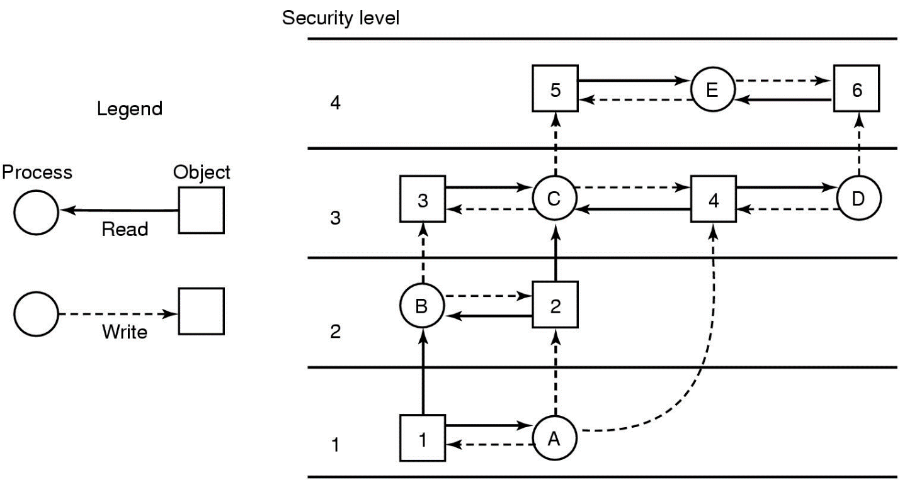
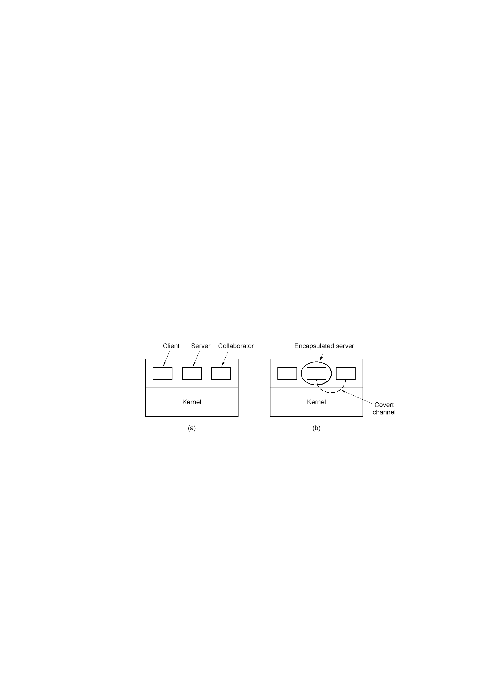
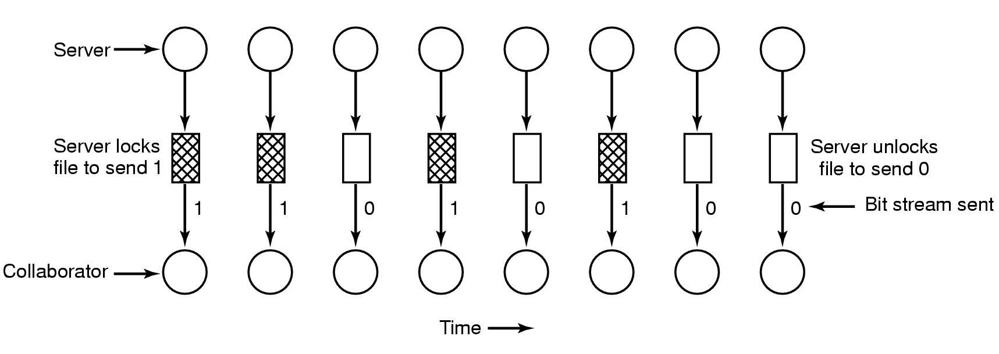
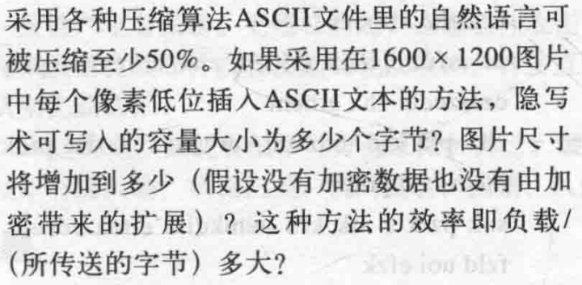
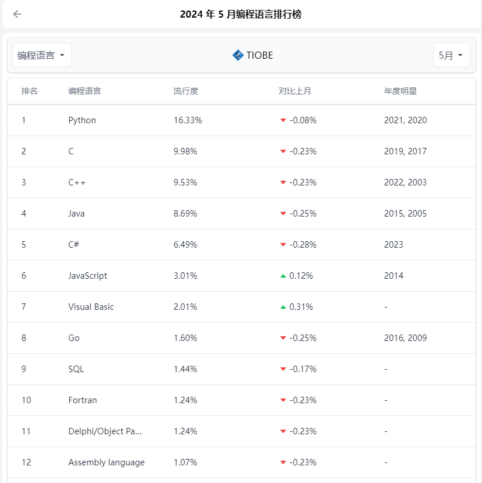
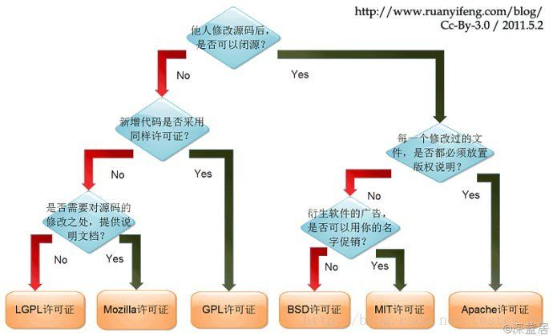
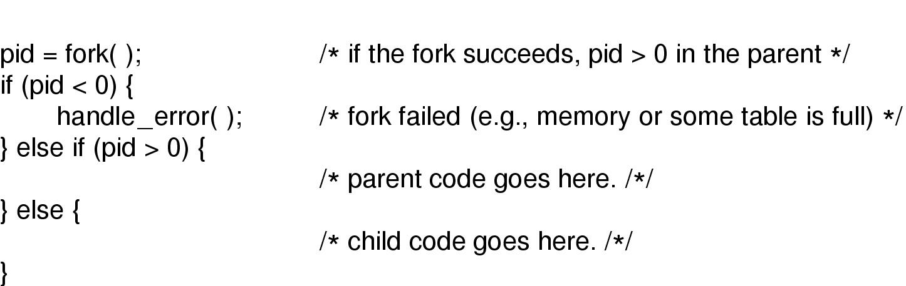
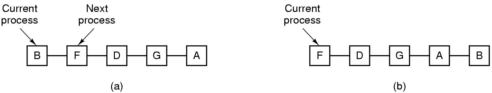
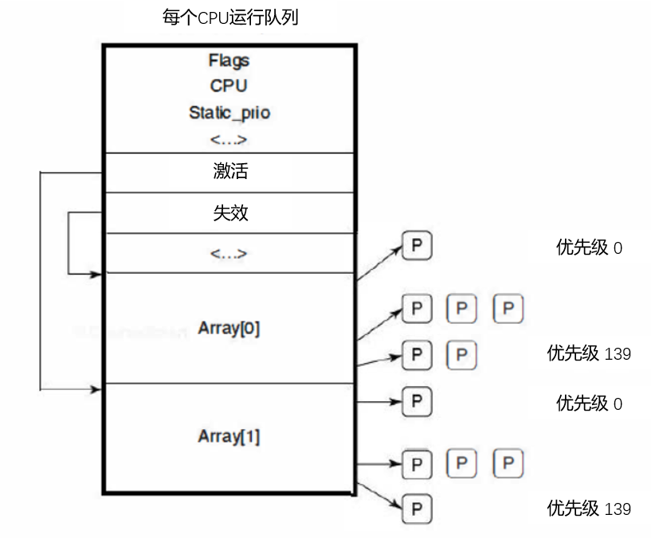

# ch

<!-- slide: 1 -->

- 操 作 系 统
- 钟竞辉
- 办公室：B3-515
- 电子邮箱：jinghuizhong@scut.edu.cn

<!-- slide: 2 -->

## 多级安全

- 2
- 可自由支配的访问控制：个人用户决定谁可以读写文件；
- 强制性的访问控制：由机构定义谁可以看什么文件的规则，确保安全策略被系统强制执行。
- Bell-La Padula 模型
- Biba 模型

<!-- slide: 3 -->

## 多级安全： Bell-La Padula 模型

- 3
- Bell-La Padula多级安全模型

- 为管理军方安全系统而设计，亦被用于其他机构。
- 进程可以下读上写，但不可颠倒
- （收集情报）

<!-- slide: 4 -->

## 多级安全： Biba 模型

- 4
- 简单完整性原则
  - 进程只能写低于其安全等级的对象
- 完整性*规则
  - 进程只能读高于其安全等级的对象
  - （下达指令）

<!-- slide: 5 -->

## 隐蔽信道

- 5
- 隐蔽信道（Covert Channel） 是一种在计算机系统或网络通信中，用于在不安全的通信路径上传递信息的机制，而这些信息的传递通常是不被系统安全策略所允许的。隐蔽信道利用系统或网络中的正常功能或特性，以非传统或不易被检测到的方式来传递信息。

<!-- slide: 6 -->

## 隐蔽信道

- 6
- 对于系统管理员和安全专家来说，识别和防范隐蔽信道是非常重要的。
- 恶意使用：绕过安全策略、隐藏通信、传递敏感数据或进行其他非法活动。
- 防范措施：监控系统的异常行为、限制不必要的权限、使用加密技术保护敏感数据等。

<!-- slide: 7 -->

## 隐蔽信道

- 7
- 主要分类：
- （1）存储隐蔽信道：发送者直接或间接写目标值，接收者直接或间接读取目标值。
- （2）时间隐蔽信道：发送者通过时域上调制使用资源（如CPU）发送信息，接收者能够观测到并对信息进行解码。与存储隐蔽信道相比，时间隐蔽信道又称为无记忆通道，不能长久存储信息。

<!-- slide: 8 -->

## 隐蔽信道

- 8

- 客户机, 服务器和协作进程
- 封装后的服务器可以通过隐通道向协作程序泄漏信息

<!-- slide: 9 -->

- 9
- 使用文件锁的隐通道

- 隐蔽信道

<!-- slide: 10 -->

- 10
- 图片看起来一样，右边的图片有5部莎士比亚戏剧已加密,插入在颜色字的最低位

- 斑马
- 哈姆雷特，麦克白，罗密欧与朱
- 利叶，威尼斯商人，李尔王
- 隐蔽信道

<!-- slide: 11 -->

- 隐蔽信道是什么？
- 允许进程以违背系统安全策略的形式传送信息的通信通道
- 加密信息并将其暴露给攻击者的通道
- 专为传输大量数据而设计的通信通道
- 于连接两个不同网络的网关
- A
- B
- C
- D
- 提交
- 单选题
- 1分

<!-- slide: 12 -->

- 隐蔽信道对系统安全有何影响？
- 提高系统的安全性
- . 降低系统的复杂性
- 构成对强制访问控制策略的威胁
- 增加数据传输速率
- A
- B
- C
- D
- 提交
- 单选题
- 1分

<!-- slide: 13 -->

- 以下哪项是隐蔽信道的分类方法之一？
- 加密信道和非加密信道
- 传输信道和接收信道
- 存储隐蔽信道和时间隐蔽信道
- 高速信道和低速信道
- A
- B
- C
- D
- 提交
- 单选题
- 1分

<!-- slide: 14 -->

- 作答
- 正常使用主观题需2.0以上版本雨课堂

- 主观题
- 1分

<!-- slide: 15 -->

- 大概思路：
- 1600*1200 = 1920000 个像素；
- 每个像素有3个位用来插入数据；
- 共有 1920000 * 3 /8 = 720000Byte
- 若存放压缩后的数据，则原来数据可为： 720000 *2 = 1440000B
- 图片尺寸不变；
- 效率= （1*2）/8 = 25%

<!-- slide: 16 -->

- Unix/Linux: Case Study

<!-- slide: 17 -->

## Unix/Linux 历史

- 17
- UNICS (Uniplexed Information and Computing Service,单路信息与计算服务)，1969，汇编语言

- Keb Thompson（左）与 Dennis M.Ritchie（右）

<!-- slide: 18 -->

- Tiobe发布的2024最新一期（5月份）编程语言欢迎度榜单

<!-- slide: 19 -->

## Unix/Linux 历史

- 19
- PDP-11UNIX (基于C语言)，1973， K. Thompson & D. M. Ritchie
- Portable UNIX (可移植的C编译器)，
- Bell Lab, Steve Johnson, 1979
- Berkeley UNIX (1~4BSD),
- 加州伯克利分校（K. Thompson 母校），1979-1983

<!-- slide: 20 -->

## Unix/Linux 历史

- 20
- 标准UNIX :
- Portable Operating System Interface of UNIX , POSIX,
- IEEE,  1003.1版本，1990 通过 (1995修订）
- Minix : 基于微内核设计的类UNIX系统
- 1600行C，800行汇编，荷兰科学家A. Tanenbaum ，以教学为目的， 1987
- Linux：完备的系统产品，芬兰学生Linus Torvalds， 1991

<!-- slide: 21 -->

- 关于开源许可证

<!-- slide: 22 -->

## 开源许可证（Open Source License）

- 定义与目的：开源许可证是一种法律文件，用于明确开源软件的版权、使用、修改、分发等权限和限制。
- 目的是确保软件开发者能够自由地使用和分享软件，同时保护他们的权益和贡献。

<!-- slide: 23 -->

## 开源许可证（Open Source License）

- 主要类型：
  - 宽松许可证（Permissive Licenses）：如 BSD、MIT 和 Apache 2.0，它们允许用户自由地修改、分发和使用软件。
  - 互惠许可证（Reciprocal Licenses）：如 LGPL（Lesser General Public License）和 Mozilla Public License。
  - 严格/复制左许可证（Copyleft Licenses）：如 GPL（General Public License），要求任何衍生作品也必须以相同的许可证发布，以确保软件的持续自由和开放。

<!-- slide: 24 -->

## 开源许可证

<!-- slide: 25 -->

- 关于Linux 发展历史

<!-- slide: 26 -->

- Linux的发展历史
- 1990年，芬兰赫尔辛基大学学生Linux Torvalds首次接触Minix系统。
- 1991年，Linux Torvalds开始在Minix上编写各种驱动程序等操作系统内核组件。
- 1991年年底，Linux Torvalds公开了Linux内核源码0.02版
- 1993年，Linux 1.0版本发行，Linux转向GPL版本协议。
- 1994年，Linux的第一个商业发行版Slackware问世。
- 1996年，美国国家标准技术局的计算机系统实验室确认Linux版本1.2.13符合POSIX标准。
- 1999年，Linux的简体中文发行版问世。
- 2000年以后，Linux系统日趋成熟，涌现出大量基于Linux服务器平台的应用，并且广泛应用于基于ARM技术的嵌入式系统中。

<!-- slide: 27 -->

<!-- slide: 28 -->

- linux特点
- 1、是一个完善的支持多用户、多任务、多进程、多CPU的系统。
- 2、具有很高的系统稳定性和可靠性。
- 3、具有很高的系统安全性。
- 4、有完善的网络服务，支持HTTP、FTP、SMTP、POP、SAMBA、SNMP、DNS、DHCP、SSH、TELENT等。
- 5、是基于GNU许可，自由开放的系统。
- 6、有大量的第三方免费的应用程序。
- 7、得到众多业界厂商的支持，如IBM、Oracle、Intel、HP、MOTO、Google等。
- 8、有完善的大型数据库平台，包括Oracle、DB/2、Sybase、MySQL、PostgreSQL等。
- 9、有完善的图形用户界面，包括GNOME、KDE等。
- 10、有完善的开发平台，包括、C/C++、Java、Perl、Php、Python等，支持各类图形界面API,如GTK+、QT等。

<!-- slide: 29 -->

- UNIX系统最初是由哪两位科学家开发的？
- Bill Gates 和 Paul Allen
- Ken Thompson 和 Dennis Ritchie
- Linus Torvalds 和 Alan Cox
- Dennis M. Ritchie 和 Stephen G. Kochan
- A
- B
- C
- D
- 提交
- 单选题
- 1分

<!-- slide: 30 -->

- Linux系统的创始人是谁？
- Ken Thompson
- Dennis Ritchie
- Linus Torvalds
- Alan Cox
- A
- B
- C
- D
- 提交
- 单选题
- 1分

<!-- slide: 31 -->

- 以下哪个选项不是UNIX系统的主要特点？
- 多用户
- 多任务
- 实时性
- 支持多种CPU架构
- A
- B
- C
- D
- 提交
- 单选题
- 1分

<!-- slide: 32 -->

- 下列关于UNIX和Linux的描述中，哪项是不正确的？
- UNIX是商业软件，而Linux是开源软
- UNIX和Linux都支持POSIX标准
- Linux系统可以完全替代UNIX系统
- UNIX和Linux都广泛应用于服务器领域
- A
- B
- C
- D
- 提交
- 可为此题添加文本、图片、公式等解析，且需将内容全部放在本区域内。
- UNIX系统，特别是商业化版本，通常拥有庞大的软件生态系统，包括各种专业工具、库和应用程序。这些软件可能与UNIX系统紧密集成，并且可能无法直接在Linux上运行或需要额外的配置和修改。
- 单选题
- 1分
- 答案解析

<!-- slide: 33 -->

## Linux 系统中的层次结构

- 33
- Linux 系统的层次结构
- 操作系统控制硬件并为系统调用提供调用接口。
- Linux提供了大量由POSIX指定的标准程序。

<!-- slide: 34 -->

## Linux 应用程序

- 34
- POSIX规定的一些常用的应用程序

| 程序 | 典型应用 |
|---|---|
| cat | 将多个文件连接到标准输出 |
| chmod | 修改文件保护模式 |
| cp | 复制一个或多个文件 |
| cut | 从一个文件中剪切一段文字 |
| grep | 在文件中检索给定模式 |
| head | 提取文件的前几行 |
| ls | 列出目录 |
| make | 编译文件生成二进制文件 |
| mkdir | 创建目录 |
| od | 以八进制显示一个文件 |
| paste | 将一段文字粘贴到一个文件中 |
| pr | 为打印格式化文件 |
| ps | 列出正在运行的进程 |
| rm | 删除一个或多个文件 |
| rmdir | 删除一个目录 |
| sort | 对文件中的所有行按照字母序进行排序 |
| tail | 提取文件的最后几行 |
| tr | 在字符集之间转换 |

<!-- slide: 35 -->

## Linux内核

- 35
- Linux 的内核结构
- 内核坐落在硬件之上，包含三个主要部件：
- I/O部件、内存管理部件和进程管理部件

<!-- slide: 36 -->

## Linux 进程的相关概念

- 36
- 守护进程（Daemon）:一类在后台运行的特殊进程
- 计划任务（Cron ）：周期性检查是否有待完成工作
- 父进程（调用fork函数的原始进程）
- 子进程（被fork函数创建的新进程）
- PID（进程标识符，非零值）
- 进程组（包括指定进程的父进程、远祖进程、兄弟进程、子进程、后裔进程）
- 信号：一个进程利用系统调用可以给所在进程组的所有成员发送信号

<!-- slide: 37 -->

- 请解释进程表和PCB的意义。
- 作答
- 正常使用主观题需2.0以上版本雨课堂
- 主观题
- 1分

<!-- slide: 38 -->

## 进程的实现

- 进程表 （Process Table）
- 为了实现进程模型，操作系统维护着包含进程重要信息的一张表，每个进程占用一个表项（称为进程控制块）

| 进程管理 寄存器 程序计数器 程序状态字 堆栈指针 优先级 调度参数 进程ID 父进程 进程组 信号 进程开始时间 使用的CPU时间 子进程的CPU时间 下次报警时间 | 储存管理 正文段指针 数据段指针 堆栈段指针 | 文件管理 根目录 工作目录 文件描述符 用户ID 组ID |
|---|---|---|

- 典型的进程控制块的一些字段

<!-- slide: 39 -->

## 有关进程管理的系统调用

- 39

| 系统调用 | 描述 |
|---|---|
| pid = fork( ) | 创建一个与父进程一样的子进程 |
| pid = waitpid(pid, &statloc, opts) | 等待子进程终止 |
| s = execve(name, argv, envp) | 替换进程的核心映像 |
| exit(status) | 终止进程运行并返回状态值 |
| s = sigaction(sig, &act, &oldact) | 定义信号处理的动作 |
| s = sigreturn(&context) | 从信号返回 |
| s = sigprocmask(how, &set, &old) | 检查或更换信号掩码 |
| s = sigpending(set) | 获得阻塞信号集合 |
| s = sigsuspend(sigmask) | 替换信号掩码或挂起进程 |
| s = kill(pid, sig) | 发送信号到进程 |
| residual = alarm(seconds) | 设置报警时钟 |
| s = pause( ) | 挂起调用程序直到下一个信号出现 |

<!-- slide: 40 -->

## Linux进程的创建：Fork系统调用

- 40
- Linux 中进程的创建

- 系统调用fork创建一个与原始进程（父进程）完全相同的副本（子进程）；进程以其PID来命名与区分。

<!-- slide: 41 -->

## Linux进程的创建：Fork系统调用

- 调用fork函数的进程陷入内核并创建一个任务数据结构和其它相关的数据结构
- 寻找一个可用的PID，更新进程描述标识符散列表的表项使之指向新的任务数据结构
- 为子进程分配数据段、堆栈段，复制父进程的段
- 子进程开始运行。

<!-- slide: 42 -->

- 42
- 线程
- 问题：什么是线程？线程与进程的区别是什么？
- 线程是进程的组成部分；
- 线程是CPU能够调度的最小运行单元；
- 一个进程至少有一个线程，可以有多个线程；
- 同一个进程所包含的线程可以共享资源和数据；
- 线程创建开销小；
- 线程切换的代价小；

<!-- slide: 43 -->

## POSIX线程

| 线程调用 | 描述 |
|---|---|
| pthread_create | 在调用者的地址空间中创建一个新进程 |
| pthread_exit | 终止被调用进程 |
| pthread_join | 等待线程终止 |
| pthread_mutex_init | 创建新信号量 |
| pthread_mutex_destroy | 破坏信号量 |
| pthread_mutex_lock | 锁信号量 |
| pthread_mutex_unlock | 解锁信号量 |
| pthread_cond_init | 创建一个条件变量 |
| pthread_cond_destroy | 破坏一个条件变量 |
| pthread_cond_wait | 等待一个条件变量 |
| pthread_cond_signal | 释放一个正在等待条件变量的线程 |

- 43
- POSIX 线程调用接口

<!-- slide: 44 -->

## Linux线程创建

- 44
- #include<stdio.h>
- #include<pthread.h>
- #include<stdlib.h>
- void *thfun(void *arg)
- {
- printf("new  thread! %s\n", (char*)arg);
- return ((void *)0);
- }
- int main(int argc ,char *argv[])
- {    pthread_t pthid;
- int ret=pthread_create(&pthid,NULL,thfun, (void *)"hello");
- if(ret!=0){
- perror("create thread failed");
- exit(EXIT_FAILURE);
- }
- printf("main thread!\n");
- sleep(1);
- return 0;
- }

<!-- slide: 45 -->

## Linux 线程调度

- 45
- Linux 系统的线程是内核线程，Linux系统的调度是基于线程的。
- 常用的进程/线程调度机制有：
  - 先来先服务调度
  - 最短作业优先调度
  - 轮转法调度
  - 优先级调度
  - 。。。

<!-- slide: 46 -->

- 46
- Round Robin (RR) 调度策略
- 每个进程获得一个小的CPU时间片 (time quantum)，当时间片用完后，进程被抢占并加入到等待队列尾部。
- 如果等待队列有 n个进程，时间片为 q, 那么每个进程获得 1/n 的 CPU 计算时间，任何进程等待不会超过 (n-1)q 时间片.
- 特性
  - 当q区域无穷大时  FIFO
  - 当q较小时  会导致浪费大量的资源用于进程切换

- 当前进程
- 当前进程
- 下一进程

<!-- slide: 47 -->

- 47
- RR 调度例子：时间片= 20
- 进程	CPU耗时
- P1	53
- P2	 17
- P3	68
- P4	 24
- 请尝试画出CPU的运行甘特图:

<!-- slide: 48 -->

- 48
- RR 调度例子：时间片= 20
- 进程	CPU耗时
- P1	53
- P2	 17
- P3	68
- P4	 24
- CPU运行甘特图:
- RR通常比SJF具有更大的周转时间,但是有更好的实时性。
- P1
- P2
- P3
- P4
- P1
- P3
- P4
- P1
- P3
- P3
- 0
- 20
- 37
- 57
- 77
- 97
- 117
- 121
- 134
- 154
- 162

<!-- slide: 49 -->

## Linux 线程调度

- 49
- 先进先出的实时进程
- 该种线程具有最高优先级，不被抢占
- 基于优先级的循环轮转实时进程
- 定义一个时间量，时间到了之后就被抢占
- 普通的分时进程
- Linux根据非实时线程的优先级分配时间量

<!-- slide: 50 -->

## Linux线程调度

- 50
- Linux线程调度基于多级队列
- 基于优先级的调度策略，考虑线程的类别（即实时 FIFO、实时 RR、普通分时）；
- 高优先级的进程拥有较长的时间片；

