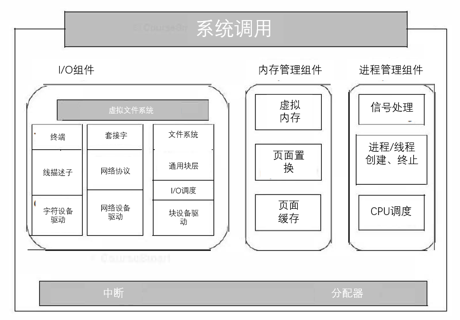
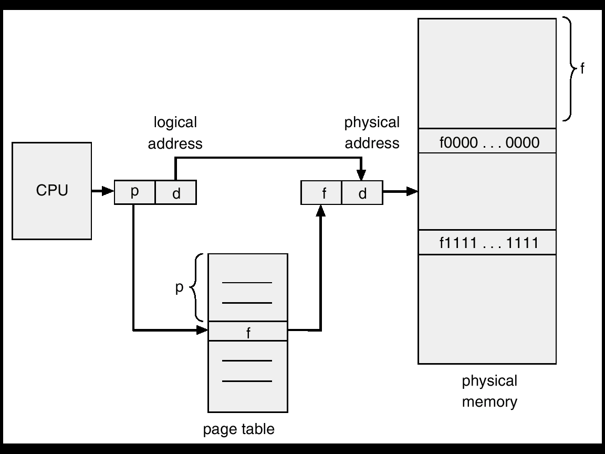
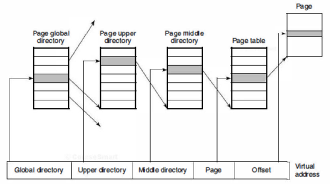
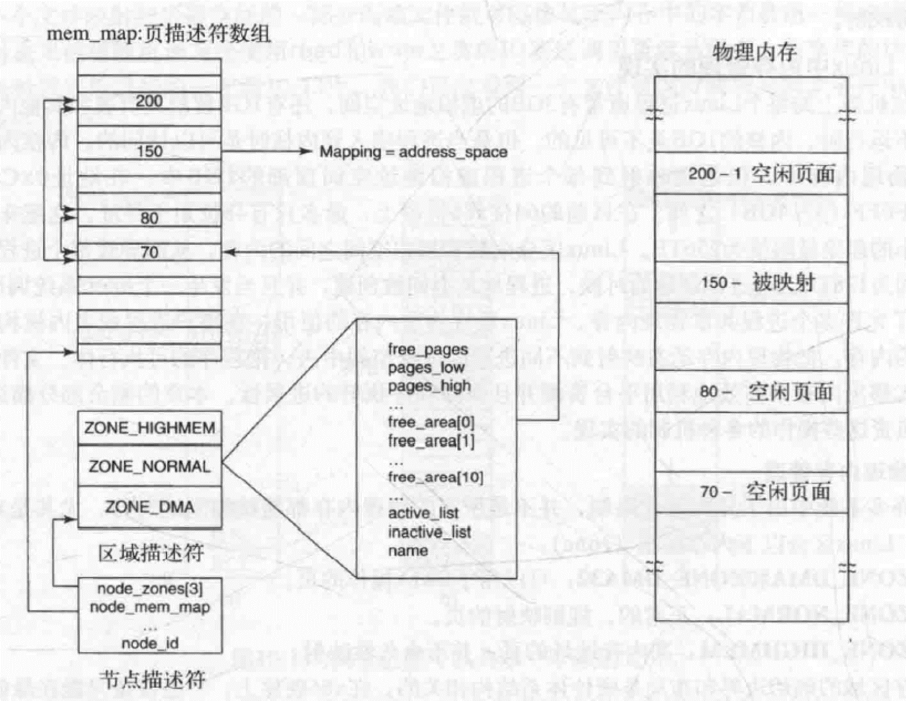
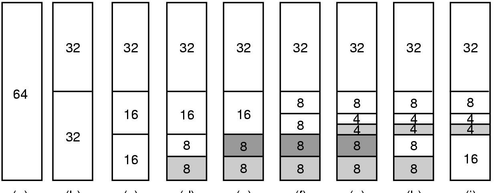
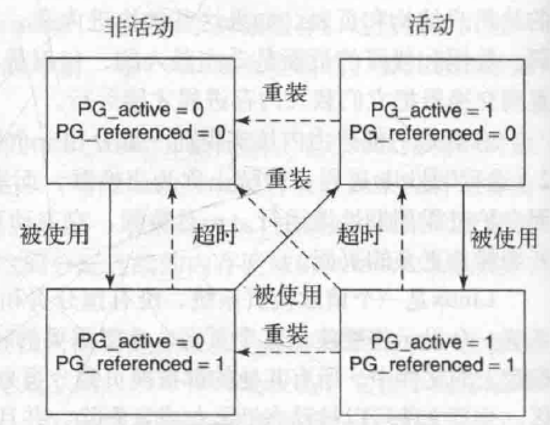
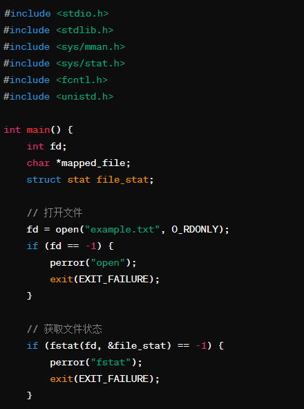
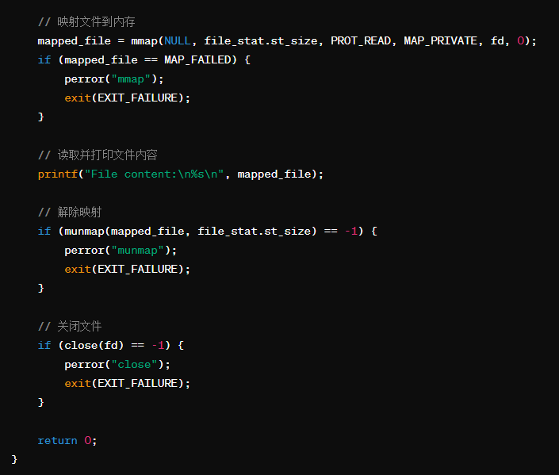
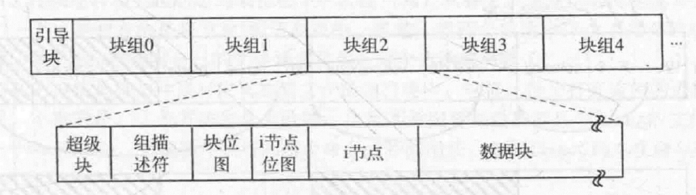
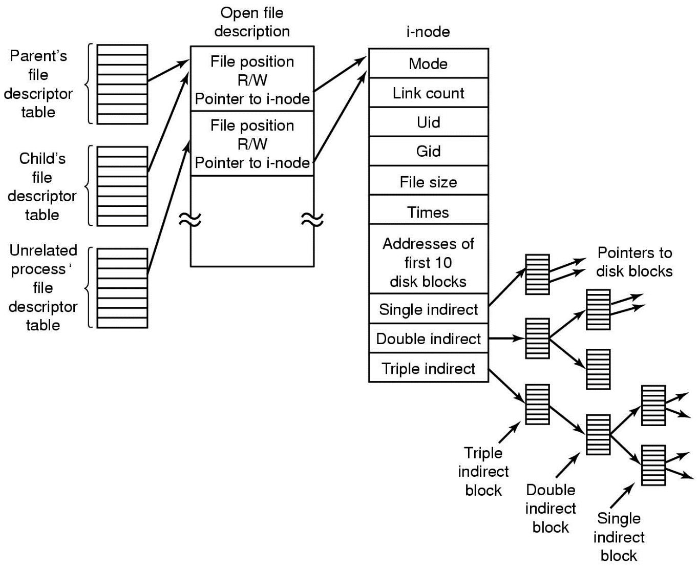

# ch

<!-- slide: 1 -->

- 操 作 系 统
- 钟竞辉
- 办公室：B3-515
- 电子邮箱：jinghuizhong@scut.edu.cn

<!-- slide: 2 -->

- 哪个命令用于查看Linux中线程的详细信息？
- ps -eLf
- top -H
- lsof
- threads
- A
- B
- C
- D
- 提交
- 单选题
- 1分

- 此题未设置答案，请点击右侧设置按钮

<!-- slide: 3 -->

- 哪个系统调用用于在Linux中发送信号到指定进程？
- signal()
- kill()
- raise()
- time()
- A
- B
- C
- D
- 提交
- 单选题
- 1分

- 此题未设置答案，请点击右侧设置按钮

<!-- slide: 4 -->

- 通常情况下，你认为守护进程比交互进程具有更高的优先级还是更低的优先级。
- 守护进程具有更高优先级
- 交互进程具有更高优先级
- A
- B
- 提交
- 投票
- 最多可选1项

<!-- slide: 5 -->

- Linux内核
- 内核坐落在硬件之上，包含三个主要部件：
- I/O部件、内存管理部件和进程管理部件
- 2

- Linux 的内核结构

<!-- slide: 6 -->

- Linux 内存管理
- 虚拟内存的基本原理
- 虚拟内存技术允许多个进程灵活共享物理内存空间，显著提高内存的利用率，而且可以支持容量大于物理内存的进程运行。
- 3

- 提高虚拟内存效率的技术： TLB,多级页表等

<!-- slide: 7 -->

- Linux内存管理：多级页表
- 每个虚拟地址划分成四个域，目录域是页目录的索引，每个进程都有一个私有的页目录，找到的值是指向其中一个下一级目录的一个指针，页表的表项指向所需要的页面。
- 4
- Linux使用四级页表

<!-- slide: 8 -->

- Linux内存管理
- Linux 将4G的虚拟地址空间划分为两部分：用户空间和内核空间。用户空间从0到0xbfffffff,内核空间从3G到4G。用户进程通常情况下只能访问用户空间的虚拟地址，不能访问内核空间。可以通过系统调用访问内核空间。
- 5
- Linux的内存有三部分组成，前两部分是内核和内存映射，被固定在内存中，其余部分被划分成页框。
- 系统维护的映射如下图所示。

<!-- slide: 9 -->

- 物理内存管理
- 6

<!-- slide: 10 -->

- Linux的换页:伙伴算法
- Linux分配物理内存页框的主要机制是页面分配器，它使用了著名的伙伴算法。
- 7

- 伙伴算法

<!-- slide: 11 -->

- 页面置换算法
- 系统启动时，init开启页面守护进程（kswaped）;
- Kswapd 周期性检查页面空闲状态 (100ms) ; 若空闲页面不够则选择页面回收并插入空闲队列；
- 四种页面：
  - 1）不可回收：如内核态栈和锁定页面等；
  - 2）可交换：回收前写回交换区；
  - 3）可同步：若标记为脏，则必须要写回磁盘；
  - 4）可丢弃：可立即回收。
- 9

<!-- slide: 12 -->

- 页面置换算法
- Linux使用一种改进地LRU算法，维护两组标记：活动/非活动和是否被引用。
- 第一轮扫描清除引用位，如果第二轮运行确定被引用，就提升到一个不太可能回收的状态，否则将该页面移动到一个更可能被回收的状态。
- 处于非活动列表的页面，自从上次检查未被引用过，因而是移除的最佳选择。被引用但不活跃的页面同样会被考虑回收。
- 10

<!-- slide: 13 -->

- 页面置换算法
- 11

<!-- slide: 14 -->

- 伙伴系统在内存分配中的主要作用是？
- 减少内存碎片
- 加快内存访问速度
- 提高内存利用率
- 增加内存容量
- A
- B
- C
- D
- 提交
- 单选题
- 1分

<!-- slide: 15 -->

- Linux中常用的页面置换算法不包括：
- 最佳置换算法
- 先进先出（FIFO）算法
- 最近最少使用（LRU）算法
- 随机置换算法
- A
- B
- C
- D
- 提交
- 单选题
- 1分

<!-- slide: 16 -->

- 内存映射文件
- 13
- 概念： 内存映射文件是一种通过将文件内容直接映射到进程的地址空间来实现文件访问的机制。这样做可以使得文件操作像内存访问一样高效。
- 优点： 内存映射文件允许进程将文件内容视为内存中的一部分，从而避免了频繁的系统调用，提高了IO操作的效率。
- 原理： 内存映射文件通过操作系统内核提供的相关系统调用（如mmap()）将文件内容映射到进程的虚拟地址空间中。这样，对这些内存区域的读写操作实际上是对文件的读写操作。
- 应用： 内存映射文件常用于需要频繁访问大文件内容的场景，如数据库系统、文本编辑器、图像处理等。

<!-- slide: 17 -->

- 内存映射文件
- void * mmap(
- void *start, size_t length,
- int prot , int flags,
- int fd, off_t offset   );
- 12
- 参数start指定文件应被映射到进程空间的起始地址，一般被指定一个空指针，此时选择起始地址的任务留给内核来完成。
- length是映射到调用进程地址空间的字节数，它从被映射文件开头offset个字节开始算起。
- prot 参数指定共享内存的访问权限。可取如下几个值的或：PROT_READ（可读） , PROT_WRITE （可写）, PROT_EXEC （可执行）, PROT_NONE（不可访问）。
- flags由以下几个常值指定：MAP_SHARED , MAP_PRIVATE , MAP_FIXED，其中，MAP_SHARED , MAP_PRIVATE必选其一，而MAP_FIXED则不推荐使用。
- offset参数一般设为0，表示从文件头开始映射。
- 参数fd为即将映射到进程空间的文件描述字，一般由open()返回。
- 函数的返回值为最后文件映射到进程空间的地址，进程可直接操作起始地址为该值的有效地址。

<!-- slide: 18 -->

- 内存映射文件
- 13

<!-- slide: 19 -->

- Linux 输入/输出
- 14
- Linux将设备文件整合到文件系统中，为用户和应用程序提供了一种统一的接口来访问和操作硬件设备，这种设计使得Linux系统更加灵活和易于使用。
- 将设备视为一种特殊文件，并通过文件系统进行管理和访问。
- 优点：简化了对设备的访问和操作，与操作普通文件一样。
- 设备文件通常存储在/dev目录下，每个设备文件都有一个唯一的路径名。例如硬盘设备通常命名为/dev/sda、/dev/sdb等，
- 设备操作的方式与普通文件操作类似，可以使用标准的文件I/O函数（如open()、read()、write()、close()等）来进行设备的读写操作。此外，Linux还提供了一些特殊的设备文件操作接口，如ioctl()用于设备的控制操作。

<!-- slide: 20 -->

- 设备特殊文件
- 15
- 25针打印机
- SATA硬盘
- U盘
- IDE硬盘
- 当前鼠标
- 当前CD-ROM

<!-- slide: 21 -->

- 输入/输出系统调用
- 每个I/O设备都有一个特殊文件与其关联，大部分的I/O只使用合适的文件调用即可完成。
- 16

| 函数调用 | 描述 |
|---|---|
| s=cfsetospeed(&termios, speed) | 设置输出速率 |
| s=cfsetispeed(&termios, speed) | 设置输入速率 |
| s=cfgetospeed(&termios, speed) | 获取输出速率 |
| s=cfgetispeed(&termios, speed) | 获取输入速率 |
| s=tcsettattr(fd, opt, &termios) | 设置属性 |
| s=tcgetattr(fd, &termios) | 获取属性 |

- 管理终端的主要POSIX调用

<!-- slide: 22 -->

- 输入/输出在Linux中的实现
- 系统通过检索字符设备的散列表来选择合适的数据结构，然后调用相应的功能来执行此操作。
- 17
- 典型字符设备支持的部分文件操作

| 设备 | Open | Close | Read | Write | Ioctl | Other |
|---|---|---|---|---|---|---|
| NULL | NULL | NULL | NULL | NULL | NULL | … |
| 内存 | NULL | NULL | mem_read | mem_write | NULL | … |
| 键盘 | k_open | k_close | k_read | error | k_ioctl | … |
| Tty | tty_open | tty_close | tty_read | tty_write | tty_ioctl | … |
| 打印机 | lp_open | lp_close | error | lp_write | lp_ioctl | … |

<!-- slide: 23 -->

- 在Linux中，设备文件通常存储在哪个目录下？
- /bin
- /dev
- /usr
- /etc
- A
- B
- C
- D
- 提交
- 单选题
- 1分

<!-- slide: 24 -->

- 在Linux中，对设备文件的操作与对普通文件的操作有什么区别？
- 没有区别
- 设备文件只能读取，不能写入
- 设备文件不能用标准文件I/O函数进行操作
- 设备文件的操作需要特殊权限
- A
- B
- C
- D
- 提交
- 单选题
- 1分

<!-- slide: 25 -->

- Linux文件系统
- 文件被组织在一个目录里。
- 目录储存成文件的形式。
- 目录可以包含子目录。
- 根目录表示为“/”，字符“/”还用于分离目录名。
- 18
- 大部分Linux 系统中一些重要的目录

| 目录 | 内容 |
|---|---|
| bin | 可执行程序 |
| dev | IO设备的特殊文件 |
| etc | 系统文件 |
| lib | 库文件 |
| usr | 用户目录 |

<!-- slide: 26 -->

- Linux的文件系统调用
- 20

| 系统调用 | 描述 |
|---|---|
| fd = creat(name, mode) | 创建文件的一种方法 |
| fd = open(file, how, ...) | 打开文件读，写或者读写 |
| s = close(fd) | 关闭一个已经打开的文件 |
| n = read(fd, buffer, nbytes) | 从文件中读取数据到一个缓冲区 |
| n = write(fd, buffer, nbytes) | 把数据从缓冲区写到文件 |
| position = lseek(fd, offset, whence) | 移动文件指针 |
| s = stat(name, &but) | 获取一个文件的状态信息 |
| s = fstat(fd, &but) | 获取一个文件的状态信息 |
| s = pipe(&fd[O]) | 创建一个管道 |
| s = fcntl(fd, cmd, ...) | 文件加锁和其它操作 |

- s : 错误码；fd : 文件描述符； position : 文件偏移

<!-- slide: 27 -->

- Stat系统调用
- 对于每个文件，Linux记录了它的文件类型、大小、最后一次修改时间等信息，程序可以使用stat系统调用来查看这些信息
- 21
- stat 系统调用返回的字段

| 文件所在的设备 |
|---|
| I_node号 |
| 权限 |
| 连接数 |
| 所有者 |
| 所有者所在的组 |
| 文件大小 |
| 创建时间 |
| 上次访问时间 |
| 上次修改时间 |

- #include <sys/stat.h>#include <unistd.h>#include <stdio.h>int main() {    struct stat buf;    stat("/etc/hosts", &buf);    printf("/etc/hosts file size = %d\n",    buf.st_size);
- return 1；}

<!-- slide: 28 -->

- 与目录相关的一些系统调用
- mkdir, rmdir：创建和删除目录（只有目录为空时才可删除）
- link：创建链接；unlink：删除目录项
- chdir：改变工作目录
- opendir，closedir，readdir，rewinddir：用于读取目录
- 22
- s ：错误码；Dir：目录；dirent ：目录项

| 系统调用 | 描述 |
|---|---|
| s = mkdir(path, mode) | 建立新目录 |
| s = rmdir(path) | 删除目录 |
| s = link(oldpath, newpath) | 创建指向已有文件的链接 |
| s = unlink(path) | 取消文件的链接 |
| s = chdir(pat) | 改变工作目录 |
| dir = opendir(path) | 打开目录 |
| s closedir(dir) | 关闭目录 |
| dirent = readdir(dir) | 读取一个目录项 |
| rewinddir(dir) | 回转目录使其再次被读取 |

<!-- slide: 29 -->

- 23
- #include <sys/types.h>
- #include <dirent.h>
- #include <unistd.h>
- Int main()
- {    DIR * dir;
- struct dirent * ptr;
- int i;
- dir = opendir("/etc/rc.d");
- while((ptr = readdir(dir)) != NULL)    {
- printf("d_name : %s\n", ptr->d_name);
- }
- closedir(dir);
- return 1；
- }

<!-- slide: 30 -->

- Linux ext2 文件系统
- 27

- Linux Ext2 文件的磁盘布局
- 块0：存放启动计算机的代码
- 超级块：包含了该文件系统的信息（i节点个数，磁盘块数等）
- 组描述符：存放了位图的位置、空闲块数、组中的i节点数等
- 两个位图：分别记录空闲块和空闲i节点
- i节点存储区域：包含所有存放文件数据的磁盘块的位置
- 数据块区：所有文件和目录都存放在这个区域

<!-- slide: 31 -->

- 目录文件结构
- 目录文件允许不超过255个字符的文件名
- 每一个目录都由整数个磁盘块组成，这样目录就可以整体写入磁盘
- 目录中的文件和子目录的目录项是未排序的，并且一个紧挨一个
- 目录项不能跨越磁盘块
- 28
- (a). 一个含有三个文件的linux目录
- (b). 文件 voluminous 被删除后的目录表

<!-- slide: 32 -->

- i节点结构
- i节点被存放在i节点表中，其中i节点表是一个内核数据结构，用于保存所有当前打开的文件和目录的i节点。
- 29

| 域 | 字节数 | 描述 |
|---|---|---|
| Mode | 2 | 文件类型，保护位，setuid和setgid位 |
| Nlinks | 2 | 指向该i节点的目录项的数目 |
| Uid | 2 | 文件属主的UID |
| Gid | 2 | 文件属主的GID |
| Size | 4 | 文件大小（以字节为单位） |
| Addr | 60 | 12个磁盘块及其后面3个间接块的地址 |
| Gen | 1 | generation数（每次i节点被重用时增加） |
| Atime | 4 | 最近访问文件的时间 |
| Mtime | 4 | 最近修改文件的时间 |
| Ctime | 4 | 最近改变i节点的时间（除去其他时间） |

- Linux的i节点结构中的一些域

<!-- slide: 33 -->

- 文件描述符表
- 30
- 概念： 文件描述符表是操作系统内核用于跟踪进程打开的文件和其他I/O资源的数据结构。每个进程都有自己的文件描述符表，用于管理其打开的文件、套接字、管道等资源。文件描述符是一个非负整数，用于唯一标识进程打开的每个文件或I/O资源。
- 当进程打开一个文件时，操作系统会分配一个文件描述符并在文件描述符表中记录文件的相关信息，如文件状态、文件位置等。
- 当进程关闭一个文件时，对应的文件描述符会被释放，并且相关的资源会被释放或者计数减少。关闭文件可以释放系统资源并避免资源泄漏。

<!-- slide: 34 -->

- 打开文件描述符
- 30
- 打开文件描述符： 每个打开的文件都有一个对应的"打开文件描述符"，它是一个数据结构，用于跟踪和管理该文件的各种信息，如文件状态、文件偏移量等。
- 关联关系： 当进程通过系统调用（如open()）打开一个文件时，操作系统会在内核中分配一个文件描述符，并创建一个与之相关联的"打开文件描述符"。然后，操作系统将这个文件描述符添加到进程的文件描述符表中，并将其与打开的文件关联起来。
- 访问和操作： 进程可以通过文件描述符来访问和操作打开的文件，而文件描述符表中的每一项都指向一个"打开文件描述符"，从而实现了对打开文件的管理和操作。
- 总之，文件描述符表中的每一项都指向一个"打开文件描述符"，而"打开文件描述符"则包含了与打开文件相关的所有信息。通过这种关联关系，操作系统实现了对进程打开的文件的管理和操作。

<!-- slide: 35 -->

- 定位读写位置
- 技巧：在文件描述符表和i节点表之间引入打开文件描述表
- 30
- 文件描述符表、打开文件表与i节点表之间的关系

<!-- slide: 36 -->

- 答案：
- 16843020KB
- ≈ 16448.3MB
- ≈ 16.1GB
- Linux ext2 文件系统
- 想一想：如果一个磁盘块大小为1KB，磁盘块地址长度为4byte，那么如图所示i节点最大能适用于多大长度的文件？
- 31
- 文件描述符表、打开文件表与i节点表之间的关系

<!-- slide: 37 -->

- Linux的安全性
- 一个Linux系统的用户群体由一定数量的注册用户组成，其中每个用户拥有一个唯一的UID（用户ID），是一个介于0~65535之间的整数。
- 用户可以被分组，其中每组同样由一个16位的整数标记，叫做GID（组ID）。
- Linux中的基本安全机制很简单。每个进程记录它的所有者的UID和GID。
- 32

| 二进制 | 标记 | 允许的文件访问权限 |
|---|---|---|
| 111000000 | rwx------ | 所有者可以读、写和执行 |
| 111111000 | rwxrwx--- | 所有者和组可以读，写和执行 |
| 110100000 | rw-r----- | 所有者可以读和写；组可以读 |
| 110100100 | rw-r--r-- | 所有者可以读和写，其他人可以读 |
| 111101101 | rwxr-xr-x | 所有者拥有所有权限，其他人也可以读和执行 |
| 000000000 | --------- | 所有人都不拥有任何权限 |
| 000000111 | ------rwx | 只有组意外的其他用户拥有所有权限（奇怪但合法） |

- 文件保护模式示例
- 所有者
- 组
- 其他人
- 读
- 写
- 执行
- 试着补充完整

<!-- slide: 38 -->

- 有关文件保护的系统调用
- chmod：最常用，用来改变保护模式
- access：检验实际的UID和GID对某文件是否拥有特定权限
- getuid,geteuid,getgid,getegid：返回实际的和有效的UID和GID
- Chown,setuid,setgid：只能被超级用户使用，改变文件的所有者以及进程的UID和GID
- 33

| 系统调用 | 描述 |
|---|---|
| s=chmod(path,mode) | 改变文件的权限 |
| s=access(path,mode) | 检查文件的可访问性 |
| uid=getuid() | 取实际的UID |
| uid=geteuid() | 取有效的UID |
| gid=getgid() | 取实际的GID |
| gid=getegid() | 取有效的GID |
| s=chown(path,owner,group) | 改变文件的所有者 |
| s=setuid(uid) | 设置UID |
| s=setgid(gid) | 设置GID |

<!-- slide: 39 -->

- Linux 在实行虚拟地址转换时，采用的是( ）级页表。
- 一
- 二
- 三
- 四
- A
- B
- C
- D
- 提交
- 单选题
- 1分

<!-- slide: 40 -->

- 按照文件的内容，Linux把文件分成（）三类
- 系统文件、用户文件、设备文件
- 普通文件、目录文件、特殊文件
- 目录文件、流式文件、设备文件
- 一般文件、流式文件、记录文件
- A
- B
- C
- D
- 提交
- 单选题
- 1分

<!-- slide: 41 -->

- 假设页面的尺寸为4KB，一个页表项用4B。若要求用页表来管理地址结构为36位的虚拟地址空间，并且每个页表只占用一页。那么，采用多级页表结构时，需要几级才能达到管理的要求？
- 作答
- 正常使用主观题需2.0以上版本雨课堂
- 主观题
- 1分

<!-- slide: 42 -->

- 假设页面的尺寸为4KB，一个页表项用4B。若要求用页表来管理地址结构为36位的虚拟地址空间，并且每个页表只占用一页。那么，采用多级页表结构时，需要几级才能达到管理的要求？
- 解答： 4KB/4B = 1K, 每个页面存放1K个项；
- 36位地址 – 12位页内地址 = 24位；
- 每个页表占一页，故能放1K个项 即地址中的10个位；
- 每一级最多占10个位，故至少需要三级才能满足管理要求。

<!-- slide: 43 -->

- 某计算机系统按字节编址，采用二级页表的分页存储
- 管理方式，虚拟地址格式如下所示：
- 作答
- 正常使用主观题需2.0以上版本雨课堂

| 10位 | 10位 | 12位 |
|---|---|---|
| 页目录号 | 页表索引 | 页内偏移量 |

- 请回答下列问题：
- 页和页框的大小各为多少字节？进程的虚拟地址空间大小为多少页？
- 假定页目录项和页表项均占4B，则进程的页目录和页表各占多少页？
- 若某指令周期内访问的虚拟地址为01000000H和01112948H，则进行地址转换时共访问多少个二级页表？要求说明理由
- 主观题
- 10分

<!-- slide: 44 -->

- 答：
- 页和页框大小都为：2^12B = 4KB，虚拟地址空间为：2^20页；
- 页目录：  2^10 * 4B = 4KB = 1页； 页表=2^10 * 4B = 4KB =1页；
- 共需要访问一个二级页表，因为虚拟地址01000000H和01112948H的最高10位的值都是4，访问的是同一个二级页表。
- 某计算机系统按字节编址，采用二级页表的分页存储
- 管理方式，虚拟地址格式如下所示：

| 10位 | 10位 | 12位 |
|---|---|---|
| 页目录号 | 页表索引 | 页内偏移量 |

- 请回答下列问题：
- 页和页框的大小各为多少字节？进程的虚拟地址空间大小为多少页？
- 假定页目录项和页表均占4B，则进程的页目录和页表各占多少页？
- 若某指令周期内访问的虚拟地址为01000000H和01112948H，则进行地址转换时共访问多少个二级页表？要求说明理由

<!-- slide: 45 -->

- 关于期末总分计算方式
- （1）期末：40%
- （2）平时：60%
    - 2.1）三次测试：20%
    - 2.2）实验：20%
    - 2.3）平时+作业：20%
- 思维导图PPT 上传链接：https://send2me.cn/K9J1x44Z/R1m1_y92CMyM_A
- 实验报告上传链接：
- https://send2me.cn/9IaDWlj8/QWWspAr9jEiHTQ

<!-- slide: 46 -->

- 实验二 线程同步与互斥
- 实验目的：
- 线程的同步互斥
- 利用Linux的库函数实现睡觉理发师问题和写者优先的读写问题。
- 实验要求：
- 1．用线程实现睡觉的理发师问题。（同步互斥采用信号量）理发 师问题的描述：一个理发店接待室有n张椅子，工作室有1张椅子；没有顾客时，理发师睡觉；第一个顾客来到时，必须将理发师唤醒；顾客来时如果还有空座的话，他就坐在一个座位上等待；如果顾客来时没有空座位了，他就离开，不理发了；当理发师处理完所有顾客而又没有新顾客来时，他又开始睡觉。
- 2. 用线程实现读者写者问题。编写一个写者优先解决读者写者问题的程序，其中读者和写者均是多个线程，用信号量作为同步互斥机制。

<!-- slide: 47 -->

- While (True) do {
- Down(cust_ready);
- Down(mutex);
- seat_num++;
- Up(barber_ready);
- Up(mutex);
- # cut hair here
- }
- Down(mutex);
- If(seat_num > 0){
- seat_num--;
- Up(cust_ready);
- Up(mutex);
- Down(barber_ready)
- }else Up(mutex);
- }
- Barber
- Customer
- Tips

<!-- slide: 48 -->

- 原始版本：读者优先
- Writer
- Down(wmutex)
- Write data
- Up(wmutex)
- Reader
- Down(mutex);
- reader ++;
- If(reader == 1) Down(wmutex);
- Up(mutex);
- Read data
- Down(mutex);
- reader--;
- If(reader == 0) Up(wmutex);
- Up(mutex);

<!-- slide: 49 -->

- 写者优先
- Writer
- Down(y)
- wc++;
- If( wc == 1) Down(rsem);
- Up(y);
- Down(wsem);
- Write data
- wc--; if(wc == 0) Up(rsem);
- Up(wsem);
- Reader
- Down(z);  Down(rsem);
- Down(x);
- rc ++;
- If(rc == 1) Down(wsem);
- Up(x); Up(rsem); Up(z);
- Read data
- Down(x);
- rc--;
- If(rc == 0) Up(wsem);
- Up(x);

<!-- slide: 50 -->
