# yc-ch

<!-- slide: 1 -->

- 操 作 系 统
- Operation System
- 杨 灿
- 华南理工大学
- 计算机科学与工程学院
- Email: cscyang@scut.edu.cn
- http://www.scholat.com/yangcan
- Part 5 文件系统
- 文件系统的若干技术问题

<!-- slide: 2 -->

- 操 作 系 统
- 钟竞辉
- 办公室：B3-515
- 电子邮箱：jinghuizhong@scut.edu.cn

<!-- slide: 3 -->

- 假设某磁盘驱动器中有4个双面盘片，每个盘面有20000个磁道，每个磁道有500个扇区，每个扇区可记录512字节的数据，盘片转速为7200 RPM （转／分）,平均寻道时间为5 ms 。请回答下列问题。（50分）
- （1）每个扇区包含数据及其地址信息，地址信息分为3个字段。这3个字段的名称各是什么？对于该磁盘，各字段至少占多少位？ （30分）
- （2）一个扇区的平均访问时间约为多少？ （20分）
- 作答
- 正常使用主观题需2.0以上版本雨课堂
- 主观题
- 10分

<!-- slide: 4 -->

- 假设某磁盘驱动器中有4个双面盘片，每个盘面有20000个磁道，每个磁道有500个扇区，每个扇区可记录512字节的数据，盘片转速为7200 RPM （转／分）,平均寻道时间为5 ms 。请回答下列问题。（50分）
- （1）每个扇区包含数据及其地址信息，地址信息分为3个字段。这3个字段的名称各是什么？（10分）对于该磁盘，各字段至少占多少位？ （20分）
- 柱面号（磁道号），[log220000]=15,磁头号（盘面号），[log2(4*2)]=3,扇区号,[log2500]=9
- （2）一个扇区的平均访问时间约为多少？ （20分）
- 该磁盘转一周的时间为60*1000/7200=8.33ms，因此一个扇区的平均访问时间约为：
- 5+8.33/2+8.33/500=9.18ms

<!-- slide: 5 -->

- 作答
- 正常使用主观题需2.0以上版本雨课堂

| 页框号 | 有效位 |
|---|---|
| 12 | 1 |
| 3 | 1 |
| 0 | 1 |
| 0 | 0 |
| 2 | 1 |
| 15 | 1 |
| 0 | 0 |
| 8 | 1 |

- 一个程序P的用户空间为16K,存储管理采用请求式分页系统，每个页面大小为2K，存在以下的页表，其中，有效位＝1表示页面在内存；0表示页面不在内存。请将虚地址0x060C，0x1502，0x1d71，0x2c27，0x4000转换为物理地址。 （每个10分）
- 主观题
- 10分

<!-- slide: 6 -->

- 答：用户地址空间共用14bit，范围为:0x0000~0x3FFF，超过这个范围即为”越界”。
- 0x060C：1548+12*2048=0x660C      110 0110 0000 1100
- 0x1502：0X0502             1010100000010  0000 0101 0000 0010
- 0x1d71：缺页    1110101110001
- 0x2c27：0X7C27    10 1100 0010 0111  11 1100 0010 0111
- 0x4000：越界          100 0000 0000 0000
- 一个程序P的用户空间为16K,存储管理采用请求式分页系统，每个页面大小为2K，存在以下的页表，其中，有效位＝1表示页面在内存；0表示页面不在内存。请将虚地址0x060C，0x1502，0x1d71，0x2c27，0x4000转换为物理地址。

| 页框号 | 有效位 |
|---|---|
| 12 | 1 |
| 3 | 1 |
| 0 | 1 |
| 0 | 0 |
| 2 | 1 |
| 15 | 1 |
| 0 | 0 |
| 8 | 1 |

<!-- slide: 7 -->

- 长期存储信息
- 需要存储大量的信息
- Gigabytes -> terabytes -> petabytes
- 进程终止时，信息仍存在。
  - 时间可达数年
  - 能够查询数据
- 多个进程可以同时访问信息
- 解决方案: 将信息以文件的形式存储在磁盘。
- 12

<!-- slide: 8 -->

- 文件命名
- 用于创建文件之后查找该文件。
- 每个文件至少有一个名字
- 比如 “foo.c”, “my photo”,  “4502”,
- 大小写在有些系统是敏感的
- 文件名通常与文件包含的内容相关
  - 易于确定文件的内容；
  - 计算机可能会利用文件名的一部分代表文件的类型。
- 13

<!-- slide: 9 -->

- 文件扩展名的例子
- 14
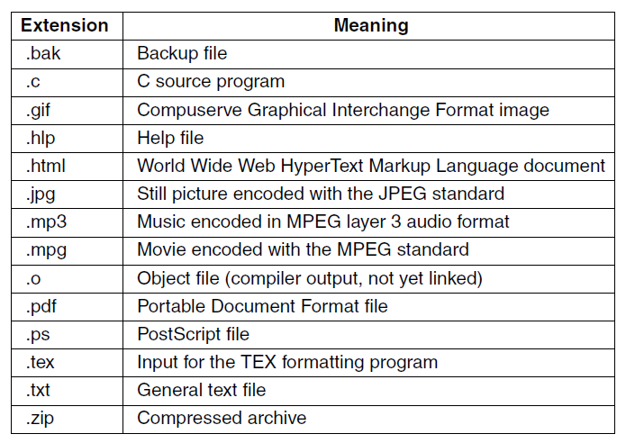

<!-- slide: 10 -->

- 文件结构
- （a) 字节序列
- Win & Linux 采用
- 15
- 1 record
- 1 byte
- 12A
- 101
- 111
- sab
- wm
- cm
- avg
- ejw
- sab
- elm
- br
- S02
- F01
- W02
- （(b) 记录序列
- 已过时，很少使用
- （c) 树
- 处理商业数据的大型机使用

<!-- slide: 11 -->

- 文件结构
- 16
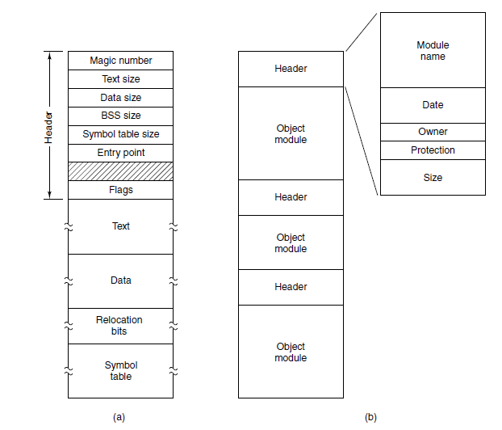
- Figure 4-3. (a) An executable file. (b) An archive
- 可执行文件中的几个主要段

| 段名 | 含义 | 示例变量 | 是否在文件中占空间 |
|---|---|---|---|
| .text | 代码段 | 函数代码 | ✅ |
| .data | 已初始化的全局或静态变量 | int a = 10; | ✅ |
| .bss | 未初始化的全局或静态变量 | int b; | ❌（只记录大小） |
| .rodata | 只读数据 | const char *s = "abc"; | ✅ |
| .heap、 .stack | 动态分配或调用栈空间 | malloc、 局部变量 | ❌ |

- BSS 是 Block Started by Symbol 的缩写。

> 备注：BSS的全称与含义
BSS 是 Block Started by Symbol 的缩写。
它是可执行文件（例如 ELF 文件）中的一个段（Section），用于存放：
未初始化的全局变量 和 未初始化的静态变量。

<!-- slide: 12 -->

- 文件结构
- 文件类型：普通文件、目录文件
- [字符设备文件、块设备文件、管道、套接字，文件链接]
- 普通文件一般分为：纯文本文件、二进制文件、和其他特定数据格式的文件。
- 16
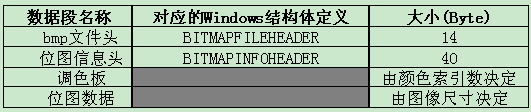
- BMP文件格式

<!-- slide: 13 -->

- 25针打印机
- SATA硬盘
- U盘
- IDE硬盘
- 当前鼠标
- 当前CD-ROM
- Linux ： 一切皆文件： 设备特殊文件

<!-- slide: 14 -->

| 字符 | 含义 | 示例 | 说明 |
|---|---|---|---|
| - | 普通文件（regular file） | -rw-r--r-- | 文本文件、二进制、程序、图片等 |
| d | 目录（directory） | drwxr-xr-x | 包含文件的目录 |
| l | 符号链接（symbolic link） | lrwxrwxrwx | 指向其他路径的软链接 |
| b | 块设备文件（block device file） | brw-rw---- | 磁盘、U盘等块设备（如 /dev/sda） |
| c | 字符设备文件（character device file） | crw-rw-rw- | 串口、终端、声卡等（如 /dev/tty） |
| p | 命名管道（named pipe / FIFO） | prw-r--r-- | 进程间通信（IPC）的一种机制 |
| s | 套接字（socket） | srwxr-xr-x | 用于网络通信或本地IPC（如 /run/docker.sock） |

- Linux ： 一切皆文件：  文件类型   ls -l 的 第一个字符的含义
- Unix文件系统的抽象思想：“一切皆文件”（Everything is a file）—— 无论是普通数据、目录、设备、通信管道，都以文件的形式呈现，统一通过文件描述符（File Descriptor）访问。

<!-- slide: 15 -->

- 文件访问
- 顺序访问
  - 从头按顺序读取文件
  - 不能跳过某些内容
  - 适合磁带存储介质
- 17
- 随机访问
  - 可以按任意顺序读取字节/记录
  - 对实现数据库系统很重要

<!-- slide: 16 -->

- 文件属性
- 操作系统会保存与文件相关的信息
- 18
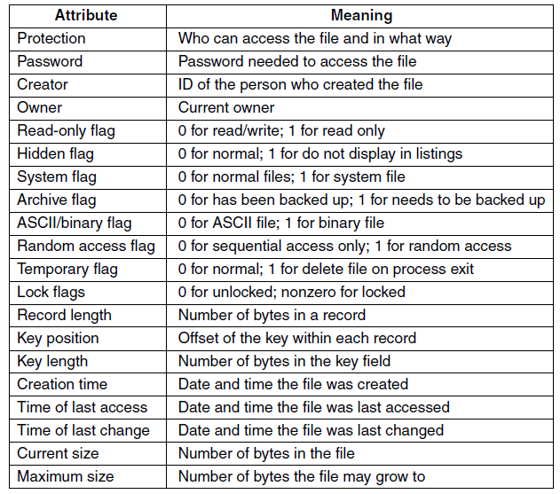

<!-- slide: 17 -->

- 针对文件的主要操作
  - Create
  - Delete
  - Open
  - Close
  - Read
  - Write
- 19
  - Append
  - Seek
  - Get attributes
  - Set Attributes
  - Rename

<!-- slide: 18 -->

- 下列关于打开文件open操作和关闭文件close操作的叙述，只有（）是错误的。
- Close操作告诉系统，不再需要指定的文件了，可以丢弃它；
- Open操作告诉系统，开始使用指定的文件
- 文件必须先打开，后使用
- 目录必须先打开，后使用
- A
- B
- C
- D
- 提交
- 单选题
- 1分

<!-- slide: 19 -->

- 使用文件系统调用的示例程序
- 21

<!-- slide: 20 -->

- 使用文件系统调用的示例程序
- 22
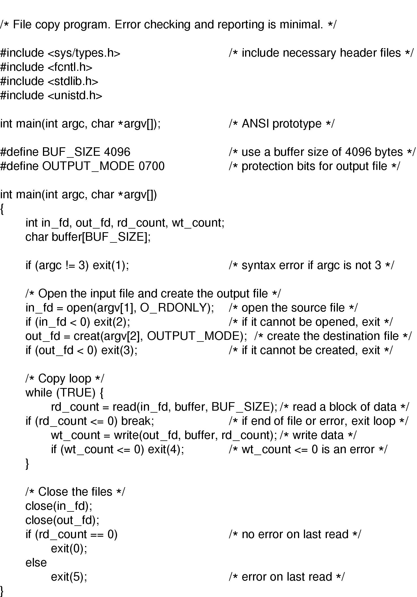

<!-- slide: 21 -->

- Linux 创建 文本文件 的命令
- 使用Touch命令创建文件
- touch file1.txt
- 使用重定向创建文件
- >file2.txt
- >>file3.txt
- find . -name “*.txt” > txtfiles
- 使用vi命令创建文件，
- vi demo.txt
- nano demo.txt
- cat > demo.txt << “EOF”
- *******
- EOF
- 23
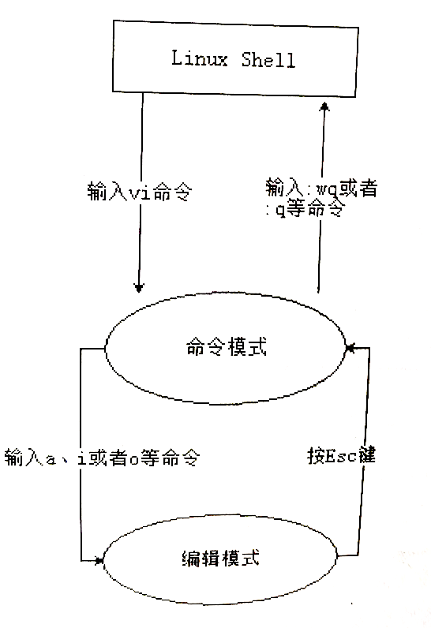

<!-- slide: 22 -->

- 目录
- 文件系统用目录（或文件夹）记录文件的位置.
  - 一级目录只有一个目录 (root)，包含所有的文件;
  - 二级目录包含root目录和用户目录.
  - 层次目录：root目录、和任意多的子目录.
- 24

<!-- slide: 23 -->

- 一级目录系统
- 该一级目录包含4个文件，文件属于3个不同的用户 A, B, and C
- 25
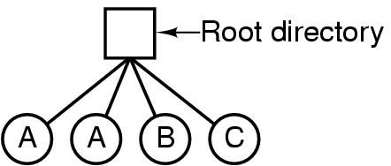

<!-- slide: 24 -->

- 二级目录系统
- 26
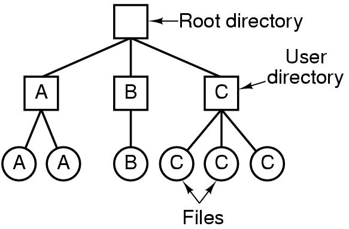

<!-- slide: 25 -->

- 多级目录系统
- 27
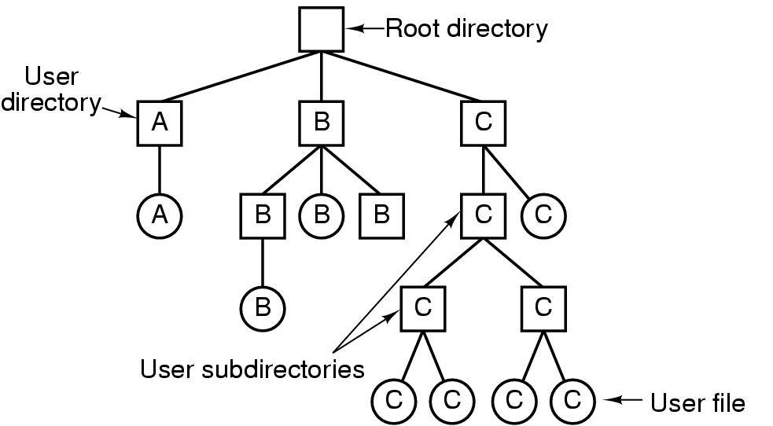
- Figure 4-7. A hierarchical directory system.

<!-- slide: 26 -->

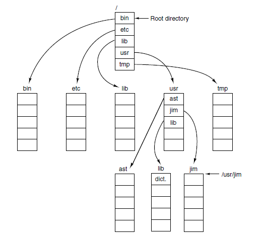
- 树形层次结构
- 28
- Linux  文件系统的顶层结构
- Figure 4-8. A UNIX directory tree.
- Linux 文件系统遵循 FHS（Filesystem Hierarchy Standard，文件系统层次标准）。
- 根目录 / 是整个文件系统的起点，所有文件与设备最终都可追溯到 /。
- 顶级结构大致如图（不同发行版可能略有不同）：
- /
- ├── bin/        # 基本命令
- ├── boot/       # 启动文件
- ├── dev/        # 设备文件
- ├── etc/        # 系统配置
- ├── home/       # 普通用户目录
- ├── lib/        # 基础库
- ├── media/      # 自动挂载
- ├── mnt/        # 临时挂载
- ├── opt/        # 第三方软件
- ├── proc/       # 进程与内核信息
- ├── root/       # root用户目录
- ├── run/        # 运行时信息
- ├── sbin/       # 系统管理命令
- ├── srv/        # 服务数据
- ├── sys/        # 内核接口
- ├── tmp/        # 临时文件
- ├── usr/        # 用户级程序、库
- └── var/        # 日志、缓存等可变数据

<!-- slide: 27 -->

- Linux 顶级目录详解
- 27

| 目录 | 全称/含义 | 主要作用 | 常见内容/说明 |
|---|---|---|---|
| / | Root directory（根目录） | 系统的起点，一切文件和目录的最上层。 | 含所有其他目录，通常在独立的根分区。 |
| /bin | Binaries （基本用户二进制文件） | 存放最基本的可执行命令，系统启动后必须可用。 | 常见命令：ls, cp, mv, cat, bash 等。普通用户和 root 都会用到。 |
| /sbin | System binaries （系统二进制文件） | 存放系统管理必需的二进制程序，主要给 root 用。 | 例如：ifconfig, fsck, reboot, mount。 |
| /boot | Boot loader files （引导加载文件） | 存放系统启动相关文件：内核、GRUB 引导程序等。 | 常见文件：vmlinuz, initrd.img, /boot/grub/。可能是独立分区。 |
| /dev | Devices （设备文件） | 包含所有设备节点，Linux 一切皆文件。 | 例如：/dev/sda1, /dev/null, /dev/ttyS0。由 udev 自动管理。 |
| /etc | Editable text configuration（系统配置文件） | 存放系统范围配置文件。 | 例如：/etc/fstab, /etc/passwd, /etc/network/interfaces。 |
| /home | Home directories （用户主目录） | 存放普通用户的个人目录。 | 例如：/home/alice/, /home/bob/。每个用户有自己的配置和数据。 |
| /lib | Libraries（基础共享库） | 存放系统启动和 /bin、/sbin 程序所需共享库。 | 例如：libc.so, ld-linux.so。对应 /lib64 |
| /lib64 | 64-bit libraries（64位库） | 专为 64 位系统提供的库文件。 | 通常与 /lib 内容类似，但针对架构差异。 |
| /media | Removable media （可移动介质挂载点） | 系统自动挂载的设备位置（如U盘、光盘）。 | 例如：/media/cdrom, /media/usb。 |
| /mnt | Mount（临时挂载点） | 手动挂载文件系统时的临时目录。 | 常用于测试：mount /dev/sdb1 /mnt。 |
| /opt | Optional packages （可选附加软件包） | 第三方应用或大型软件套件安装位置。 | 例如：/opt/google/chrome/, /opt/Qt/。 |
| /proc | Process information（ 进程信息虚拟文件系统） | 虚拟文件系统，动态反映内核和进程状态。 | 例如：/proc/cpuinfo, /proc/meminfo, /proc/1/。 |
| /root | Root user home directory （超级用户主目录） | root 用户的家目录。 | 类似 /home/root，但放在根分区以防依赖 /home 挂载。 |
| /run | Runtime data（运行时数据） | 存放系统启动后生成的临时信息。 | 例如：/run/lock, /run/user/1000/。通常为 tmpfs（内存文件系统）。 |
| /srv | Service data（服务数据） | 存放网络服务的数据文件。 | 例如：/srv/www/ (Web服务)，/srv/ftp/。 |
| /sys | System information（系统内核对象） | 提供内核与设备、驱动交互接口。 | 类似 /proc，但用于内核设备模型。 |
| /tmp | Temporary files（临时文件） | 存放临时数据，可在重启后清空。 | 所有用户可写，但系统可能定期清理。 |
| /usr | Unix System Resources（用户系统资源） | 存放大多数用户程序、库、文档。 | 包括 /usr/bin, /usr/lib, /usr/share 等。可单独分区。 |
| /var | Variable data（可变数据） | 存放经常变化的数据，如日志、缓存。 | 例如：/var/log/, /var/tmp/, /var/spool/。 |

<!-- slide: 28 -->

- Linux 顶级目录详解
- 27

| 目录 | 全称/含义 | 主要作用 | 常见内容/说明 |
|---|---|---|---|
| /opt | Optional packages （可选附加软件包） | 第三方应用或大型软件套件安装位置。 | 例如：/opt/google/chrome/, /opt/Qt/。 |
| /proc | Process information （进程信息虚拟文件系统） | 虚拟文件系统，动态反映内核和进程状态。 | 例如：/proc/cpuinfo, /proc/meminfo, /proc/1/。 |
| /root | Root user home directory （超级用户主目录） | root 用户的家目录。 | 类似 /home/root，但放在根分区以防依赖 /home 挂载。 |
| /run | Runtime data （运行时数据） | 存放系统启动后生成的临时信息。 | 例如：/run/lock, /run/user/1000/。通常为 tmpfs（内存文件系统）。 |
| /srv | Service data（服务数据） | 存放网络服务的数据文件。 | 例如：/srv/www/ (Web服务)，/srv/ftp/。 |
| /sys | System information （系统内核对象） | 提供内核与设备、驱动交互接口。 | 类似 /proc，但用于内核设备模型。 |
| /tmp | Temporary files（临时文件） | 存放临时数据，可在重启后清空。 | 所有用户可写，但系统可能定期清理。 |
| /usr | Unix System Resources （Unix系统资源） | 存放大多数用户程序、库、文档。 | 包括 /usr/bin, /usr/lib, /usr/share 等。可单独分区。 |
| /var | Variable data（可变数据） | 存放经常变化的数据，如日志、缓存。 | 例如：/var/log/, /var/tmp/, /var/spool/。 |

- 扩展补充说明   :   /proc 和 /sys 都是 虚拟文件系统（Virtual Filesystem），不存在磁盘上，而是由内核动态生成。/usr/local 是管理员手动安装软件的推荐位置。/run 取代了旧系统的 /var/run，用于保存启动生成的临时信息（PID文件）。
      - 根目录 / 是所有路径的起点，所有设备、分区、网络文件系统最终都要挂载到 / 下的某个子目录中。

<!-- slide: 29 -->

- 文件路径
- 两种确定文件路径的方法:
- 绝对路径：包含从root目录到该文件的路径.
- 相对路径：包含从当前工作目录到该文件的路径
- 29
- 不同操作系统的路径名表示方式有些差异:
  - Winodws: \usr\ast\mailbox
  - UNIX: /usr/ast/mailbox
- “.” 和 “..” 是操作系统中有关文件路径的特殊符号
  - (.) 指当前工作目录.             $PWD : 当前目录的引用
  - (..) 指父目录，上级目录.    ～ ： 当前user的目录： /Users/zhangshan
- 文件路径（File Path）
- 📘 定义： 文件路径 是文件在目录树中的“完整地址”或“访问路线”。它描述了从某个起始目录（通常是根目录 /）到目标文件的层次关系。
- 例如访问路径： /home/user/docs/report.txt

<!-- slide: 30 -->

- 文件路径访问实例
- 29
- 例如访问路径： /home/user/docs/report.txt
- 系统执行的过程：
  - 从根目录 / 开始；
  - 查找目录项 home；
  - 进入 /home，查找 user；
  - 进入 /home/user，查找 docs；
  - 进入 /home/user/docs，查找 report.txt；
  - 找到文件对应的 i-node号；
  - 通过 i-node 定位文件数据块。
- 👉 这称为 路径解析（Path Resolution）
- 或 目录遍历（Directory Traversal）。

| 概念 | 本质 | 关系 |
|---|---|---|
| 文件目录 | 文件名 → i-node号 的映射表 | 存储结构 |
| 文件路径 | 一系列目录的层次连接 | 访问方式 |
| 目录项 | 文件名 + i-node号 | 路径解析的基本单位 |

- 文件路径与目录的关系

| 项目 | 文件目录（Directory） | 文件路径（Path） |
|---|---|---|
| 含义 | 文件名与 i-node 的映射表 | 文件在目录树中的完整位置 |
| 本质 | 一种数据结构 | 一种命名与访问方式 |
| 用途 | 存储、组织文件信息 | 标识并访问文件 |
| 层次关系 | 形成目录树 | 描述目录树的路径 |
| 关键作用 | 管理 | 定位 |

<!-- slide: 31 -->

- 文件系统采用多级目录的目的是（）
- 解决命名冲突
- 节约存储空间
- 减少系统开销
- 缩短传送时间
- A
- B
- C
- D
- 提交
- 单选题
- 1分

<!-- slide: 32 -->

- 文件目录操作
- Create
- Delete
- Opendir
- Closedir
- 32
- Readdir
- Rename
- Link
- Unlink

<!-- slide: 33 -->

- 与目录和文件相关的Linux 命令
- 显示文件列表:
  - ls;   ls -l  (输出结果更详细)
- 显示文件内容:
  - cat /etc/mysql/mysql.cnf
  - 分屏显示：  more [option] files
  - 只显示前几行：head [option] file
- 复制文件:
- cp [option] source dest
- 删除文件:
  - rm [option]  files
- 33
- 从控制台写一个文本文件：
- cat > your_text_filename << "EOF"
- heredoc> Hello 1;
- heredoc> Hello 2;
- heredoc> Hello 3;
- heredoc> EOF
- 这儿： heredoc> 是 提示符， 不同系统略有不同！
- mkdir  -p path
- mkdir current_directory
- rmdir directory

<!-- slide: 34 -->

- 文件控制块
- 文件由文件控制块（File Control Block，FCB)和文件体两部份构成。
- 文件控制块保存文件的属性信息：文件名、文件的结构、文件的物理位置、存取控制信息、文件的物理位置、管理信息等。
- Unix中 的FCB 称为 i-node
  - (详见后文)
- 34
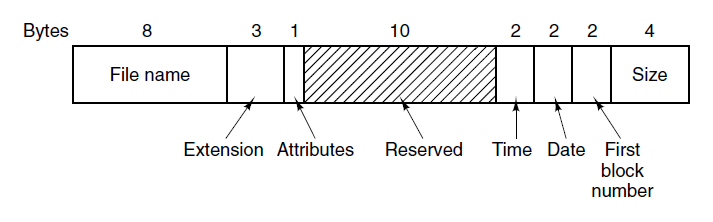
- FCB结构类似 The MS-DOS directory entry.

| 项目 | FCB | Directory Entry |
|---|---|---|
| 所在位置 | 内存（RAM） | 磁盘（FAT目录区） |
| 作用 | 运行时文件控制 | 文件系统元数据 |
| 长度 | 32字节 | 32字节 |
| 出现时间 | MS-DOS 1.x | FAT文件系统 |
| 结构关系 | 与DirEntry类似 | FCB加载自DirEntry |
| 是否仍在使用 | ❌（已淘汰） | ✅（FAT仍使用） |

- FCB 被 “文件句柄 + 内核文件对象(File Object / inode)” 所完全取代。现代系统的文件访问模型是：
  - 用户只拿到一个抽象的句柄（handle / fd） →
  - 内核管理真正的文件控制块（内核版FCB） →
  - 文件系统管理元数据（目录项、inode）。

<!-- slide: 35 -->

- 文件系统的实现
- 磁盘分区布局: 基于MBR
  - 主引导程序记录：磁盘的0号扇区；
  - 分区表给出每个分区的起始和结束地址，共64个字节
  - 每个分区需要16个字节描述，其中4个字节为总扇区数，
  - 因此磁盘容量最大为2TB。
- 36
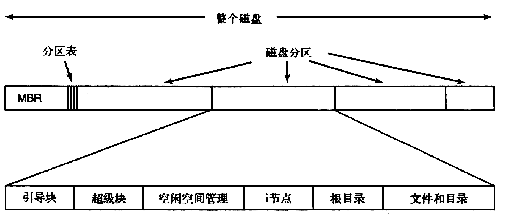
- “磁盘最大 2 TB” 这个说法并不是硬盘本身的物理极限，而是由 旧的寻址方式（Addressing Scheme） 决定的。
- MBR（Master Boot Record，主引导记录）分区表的寻址限制：在传统的 MBR 分区表 中：
- 每个分区起始地址和长度字段各占 32 位（bit）
- 地址单位是 扇区（Sector）；
- 每个扇区大小是 512 字节（Byte）
- 由于分区表项仅支持 32 位 LBA 寻址，最大可寻址扇区数为 2^32 个。假设每扇区 512 B，则可寻址的最大容量约为 2 TB。因此，MBR 磁盘的总容量上限为 2 TB，超过部分无法被识别，需要使用 GPT 分区表来突破该限制。
- 计算最大寻址容量：
- 232×512 Byte = 2,199,023,255,552 Byte ≈ 2 TB

> 备注：MBR的结构决定了限制来源
MBR 分区表采用 32 位 LBA（Logical Block Addressing，逻辑块寻址） 方式来描述磁盘上的扇区位置：
每个扇区大小固定为 512 B（字节）。
可寻址的最大扇区数为：
2^32 = 4,294,967,296
因此总容量上限：
4,294,967,296 × 512 B = 2,199,023,255,552 B ≈ 2 TB
👉 这2 TB上限是MBR分区表本身的寻址极限。

限制的范围：整个硬盘设备
这 2 TB 限制是作用于整个磁盘的物理寻址空间，而不是单个逻辑分区。
也就是说：
整个硬盘（一个 /dev/sda）使用 MBR 时，最大只能描述 前 2 TB 的扇区范围。
你可以在这 2 TB 之内划分多个分区（主分区 + 扩展分区），但总和不能超过 2 TB。
超出 2 TB 的部分，MBR无法寻址，即使物理硬盘更大（例如4 TB、8 TB）。

对比 GPT 的改进
GPT（GUID Partition Table，全局唯一标识分区表）使用 64 位 LBA 地址：
2^64 × 512 B = 9.4 ZB（Zettabyte，泽字节）
即理论上支持数 亿 TB，从而彻底消除了2 TB上限。

<!-- slide: 36 -->

- GPT 文件系统的实现 - 现代主流文件系统
- 解决方案：GPT（GUID Partition Table，全局唯一标识分区表）
- 为了突破 2 TB 限制，引入了 GPT，它属于 UEFI（Unified Extensible Firmware Interface，统一可扩展固件接口） 规范的一部分。GPT 使用：
- 64 位 LBA（Logical Block Addressing，逻辑块寻址），每个块同样是 512 B 或 4 KiB。
- 最大支持容量理论上为：
- 37
- 264×512 Byte = 8 ZiB（Zettabyte）～= 9.4ZB
- 注意：  十进制 1KB  =  1000B；
  - 二进制  1KiB =  1024B
- （1 ZB  =  1021 Byte； 1ZiB = 270 Byte）
- 几乎可以认为“无限制”

| 单位 | 十进制（SI  国际单位制） 硬盘厂商、网络速率、商业计算 | 二进制（IEC 国际电工委员会） 操作系统、文件系统、内存 |
|---|---|---|
| 1 KB | 10³ = 1,000 B | 2¹⁰ = 1,024 B = 1 KiB |
| 1 MB | 10⁶ = 1,000,000 B | 2²⁰ = 1,048,576 B = 1 MiB |
| 1 GB | 10⁹ B | 2³⁰ B = 1 GiB |
| 1 TB | 10¹² B | 2⁴⁰ B = 1 TiB |
| 1 PB | 10¹⁵ B | 2⁵⁰ B = 1 PiB |
| 1 EB | 10¹⁸ B | 2⁶⁰ B = 1 EiB |
| 1 ZB | 10²¹ B | 2⁷⁰ B = 1 ZiB |
| 1 YB | 10²⁴ B | 2⁸⁰ B = 1 YiB |

- 两套单位体系

> 备注：两个单位体系的起源
体系	名称	定义	采用者
SI（国际单位制）	十进制前缀（k、M、G、T、P、E、Z、Y）	1 KB = 10³ B	硬盘厂商、网络速率、商业计算
IEC（国际电工委员会）	二进制前缀（Ki、Mi、Gi、Ti、Pi、Ei、Zi、Yi）	1 KiB = 2¹⁰ B	操作系统、文件系统、计算机内存

<!-- slide: 37 -->

- 文件系统的实现 - 磁盘分区表格式比较
- 37
- Figure 4-30. The MS-DOS directory entry.

| 项目 | MBR | GPT |
|---|---|---|
| 支持的最大磁盘容量 | 2 TB | 理论上可达 9.4 ZB（Zettabyte，十的21次方字节） |
| 支持的分区数 | 最多 4 个主分区（或3主+1扩展） | 默认 128 个分区，可扩展 |
| 启动方式 | 传统 BIOS | UEFI（或兼容 BIOS-CSM 模式） |
| 分区标识 | 使用 1 字节类型码（如 0x07 表示NTFS） | 使用全局唯一标识符（GUID） |
| 冗余保护 | 无备份，损坏即失效 | 有主 GPT + 备份 GPT |
| 校验机制 | 无 | CRC32 校验，防止表项损坏 |
| 兼容性 | 老系统通用（DOS/XP） | 新系统（Win 8+、Linux、macOS）原生支持 |
| 安全性与健壮性 | 易损 | 冗余强、可恢复 |

- MBR（Master Boot Record，主引导记录）与 GPT（GUID Partition Table，全局唯一标识分区表）
- 是两种磁盘分区表格式，它们直接决定了磁盘的结构、启动方式和容量上限。

<!-- slide: 38 -->

- 文件系统的实现
- 分区: 每个分区相当于一个相对独立的磁盘，可以分别安装不同的文件系统和操作系统。
  - 引导块：引导装载操作系统.
  - 超级块：包含文件系统的一些重要参数
  - 空闲空间管理
  - i-节点、根目录、文件和目录
- 37
- i-node（index node，文件索引节点）
- 是文件系统中用来 描述文件元数据（metadata，文件的描述信息） 的数据结构。
- 每个文件（包括目录）在磁盘上都有一个唯一的 i-node。
- i-node存放在  i-node数据表区，
- 存放文件属性、指向数据块的指针（即“文件索引”）；
- 文件的实际内容存放在i-node指针指向的数据区。
- 每个 i-node 保存了文件的控制信息，典型字段/属性包括：

| 字段 | 含义 |
|---|---|
| 文件类型 （普通文件、目录、链接等） | 标识文件类别 |
| 文件权限（rwx） | 访问控制信息 |
| 文件所有者（UID、GID） | 用户和组标识 |
| 文件大小 | 单位为字节 |
| 时间戳（创建、修改、访问时间） | 文件操作历史 |
| 数据块指针（block pointers） | 指向文件实际数据存放位置的地址 |
| 链接计数（link count） | 有多少文件名指向此 i-node |
| 注意：i-node 不包含文件名！文件名保存在目录项（directory entry）中， 目录项中有 <文件名 → i-node 号> 的映射关系。 |  |

> 备注：在虚拟机或 WSL 中执行
直接在 UTM、VirtualBox 或 VMware 中装 Ubuntu；
然后在里面运行 dumpe2fs 或 debugfs；
用 lsblk 查到目标分区后：

sudo dumpe2fs /dev/sda1 | grep -A5 "Group 0"

这种方式能得到完整、准确的 inode table 物理布局。

<!-- slide: 39 -->

- 文件系统的文件存放方式
- 连续分配- 每个文件作为一连串连续的数据块存储。
- 38
- 理想情况：连续分配（Contiguous Allocation）
- 📘 概念：在最理想的情况下，文件的数据块在磁盘上是连续的物理块。
- 例如：文件 F： 数据块 =#100 ~ #109
- 即整个文件存放在磁盘上一个连续的区域。
- ✅ 优点
  - 顺序读写性能极高（磁头几乎不移动）；
  - 简单：只需记录起始块号和长度。
- ❌ 缺点
  - 外部碎片（external fragmentation）：磁盘空闲空间被分散；
  - 文件增长困难：如果后面没有连续空间，就得搬迁整个文件；
  - 空间利用率低。
- ➡ 因此，这种方式 几乎只用于早期系统或特殊用途（如光盘映像 ISO、视频录制缓冲区）。
- 现代文件系统的主流方式：非连续存放（非连续分配）
- 现代文件系统（如 ext2/ext3/ext4、NTFS、XFS 等）都采用 非连续分配。
- 即：文件的数据块可以分散在磁盘的不同位置，只要文件系统知道每个块的地址即可。
- 📦 举例： 假设文件 F 被分配了以下块：
- F → [块 #101][块 #225][块 #14][块 #305] ...
- 这些块可以分布在磁盘任何地方，文件系统通过 i-node 或 FAT 表 维护这种映射关系。
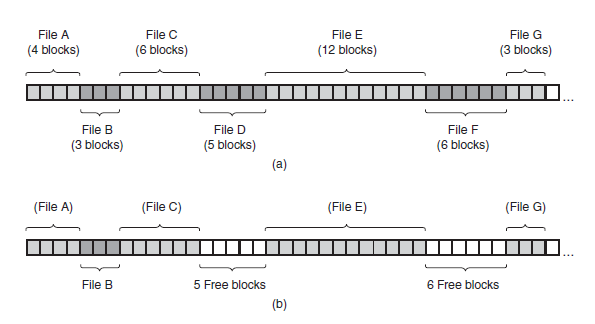

> 备注：Figure 4-10. (a) Contiguous allocation of disk space for seven files. 
(b) The state of the disk after files D and F have been removed.

<!-- slide: 40 -->

- 文件系统的文件存放方式
- 38
- 现代文件系统中的文件在磁盘上通常是逻辑连续、物理离散存放的，这种通过 i-node（或 FAT/extent）维护的非连续分配方式，大幅提高了灵活性和空间利用率。

| 分配方式 | 代表文件系统 | 主要思想 | 优缺点 |
|---|---|---|---|
| 链式分配（Linked Allocation） | FAT（File Allocation Table） | 每个数据块含有“下一个块号”的指针 | 简单但随机访问性能差 |
| 索引分配（Indexed Allocation） | ext2/ext3/ext4、NTFS | 通过 i-node 或索引表保存所有块号 | 访问高效、支持大文件 |
| 区段分配（Extent-based Allocation） | ext4、NTFS、XFS | 一组连续块组成一个“区段” | 减少碎片、提高顺序访问性能 |

- 非连续分配的几种典型实现方式
- Extent 示例（现代高性能方式）
- 一个文件的数据可能由多个 extent（区段） 组成：
- Extent1: 块 #1000 ~ #1999
Extent2: 块 #7500 ~ #7520
Extent3: 块 #20000 ~ #20128
- → 既保留局部连续性，又允许灵活扩展。

<!-- slide: 41 -->

- 文件系统的实现：磁盘碎片
- 连续分配- 每个文件作为一连串连续的数据块存储。
  - 优点:
  - 实现方式简单;
  - 读数据的性能好；
  - 缺点：
    - 产生磁盘碎片；
    - 需要预先知道文件的大小；
  - 例子: CD-ROMs, DVDs
- 39
- 一、什么是磁盘碎片（Disk Fragmentation）
- 磁盘碎片 是指：文件在磁盘上所占用的空间不是连续存放，而是被分割成若干不相邻的块（block 或 cluster），导致磁盘空间“碎片化”。  它表现为：
  - 文件内容在磁盘上分布零散；
  - 空闲空间也被分割成许多小片段；
  - 导致读写性能下降。

| 类型 | 说明 | 位置 | 典型原因 | 影响 |
|---|---|---|---|---|
| 外部碎片（External Fragmentation） | 空闲空间被分割成许多不连续的小块，虽有足够总空间，却无法找到连续区间放入新文件 | 文件之间 | 文件频繁创建、删除 | 新文件无法顺利扩展，需要额外寻址 |
| 内部碎片（Internal Fragmentation） | 分配单位（如 4 KB）大于实际文件大小，导致块内部浪费 | 文件内部，文件的最后一个块 | 固定块大小不匹配文件实际长度 | 空间利用率下降 |

- ■■■□□■■□■□□■■
- 磁盘分布示意（■表示已占用，□表示空闲）：
- 虽然总共有 5 个空闲块，但它们不连续；
- 若文件需要 4 个连续块，就无法分配。
- 碎片的根源是：非连续分配和文件动态增长。

<!-- slide: 42 -->

- 文件系统的实现：磁盘碎片整理与优化
- 39

| 影响方面 | 表现 |
|---|---|
| 性能下降 | 读写文件时，磁头需频繁移动到不同位置，寻道时间增加 |
| 访问延迟增大 | 尤其是顺序访问文件时性能大幅下降 |
| 磁盘寿命影响 | 对机械硬盘（HDD）磁头频繁寻道增加磨损 |
| 空间利用率降低 | 内部碎片浪费空间 |
| 系统响应慢 | 文件系统元数据访问增多，I/O 操作效率下降 |

- 磁盘碎片的影响
- 对机械硬盘（HDD）影响显著，对固态硬盘（SSD）影响较小（因为SSD无机械寻道）。
- 磁盘碎片整理（Defragmentation）
- 通过系统工具（如 Windows 的“磁盘碎片整理程序”）：
  - 将分散的文件块重新排列为连续区域；
  - 合并分散的空闲空间；
  - 提高顺序访问速度。
- 碎片前：  A1□□A2□B1□B2□□C
- 碎片后：  A1A2B1B2C□□□□□
- 现代文件系统的优化设计    -------------------->->->
- 现代文件系统（如 ext4、NTFS、APFS、XFS）
- 在设计上就考虑了减少碎片：----------------------------->>>>>>

| 技术 | 原理 |
|---|---|
| 延迟分配 （Delayed Allocation） | 写入缓存后统一分配连续块 |
| Extent（区段分配） | 以多个连续块为单位分配，减少碎片概率 |
| 后台整理 （Online Defrag） | 后台自动合并碎片，不影响运行 |
| 预分配空间（Preallocation） | 文件创建时预留连续空间，避免后期碎片 |

<!-- slide: 43 -->

- 文件系统的实现
- 连续分配- 每个文件作为一连串连续的数据块存储。
- 4
- 缺点： 外碎片

- Figure 4-10. (a) Contiguous allocation of disk space for seven files.
- (b) The state of the disk after files D and F have been removed.

<!-- slide: 44 -->

- 文件系统的实现
- 链表分配- 为每个文件构造磁盘块链表；
- 缺点？
- 随机访问的速度慢；
- 每个物理块中存储的数据不是2的整数幂次方。
- 5

- 缺点： 随机访问 慢

<!-- slide: 45 -->

- 文件分配表
- 把每个物理块中的指针集中记录到一个表，放在内存中索引，该表称为：文件分配表 FAT (File Allocation Table) 。
- 6
- 优点
- 整个物理块可用于存储数据
- 信息存储在内存中，访问快
- 缺点
- 需要占用大量内存.
- 对于一个200GB的磁盘， 需要600M ~ 800 M大小的额外内存 来存储该表.

- 缺点： 额外的内存开销

<!-- slide: 46 -->

- 实现文件的  I-nodes
- 10
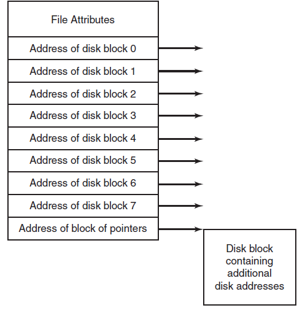
- Figure 4-13. An example i-node.
- Implementing Files  I-nodes
- 问题： 如果每个i-node只能存储固定数量的磁盘块地址，那么当一个文件所含的磁盘块的数量超过了i-node描述的磁盘块的数量，怎么办？
- 基本解决方案： 最后一个“磁盘块地址”不指向具体磁盘数据块，而是指向一个包含额外磁盘块地址的块的地址。
- 高级解决方案： 最后两个或多个“磁盘块地址”分别指向其它包含额外磁盘块地址的块的地址。（不同于多级页面的方式 ？ ）
- i-node： 包括文件属性和所用到的磁盘块的地址。
- 如果每个i-node占用 n 个字节，系统最多同时打开 k 个文件，那么内存开销最大 为 kn 字节，这远小余 FAT 全盘分区表所占空间。

<!-- slide: 47 -->

- i-node 结构
- I-node (index-node) 记录了文件的属性以及文件内容的存储地址。
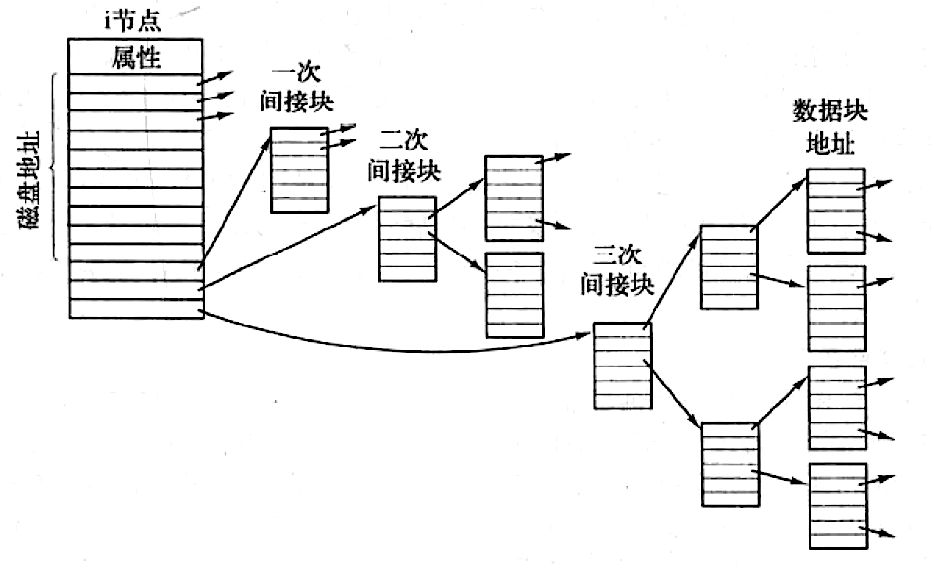
- inode 是文件系统中用于**描述文件元数据（metadata）**的结构体，每个文件（包括目录、设备文件、管道等）都有一个唯一的 i-node。
- 其他目录和文件的 inode 号（比如 /home、/etc）由文件系统在创建时动态分配，取决于磁盘上的空闲 inode 表或分配策略。
- inode 号分配遵循 文件系统标准：
  - inode 0：保留，不使用（历史遗留，表示“无效 inode”）
  - inode 1：通常是 超级块备份 / 保留用途
  - inode 2：根目录 /

<!-- slide: 48 -->

- FAT  vs  i-node
- FAT 与 i-node 是两种不同的文件系统结构

| 项目 | FAT 文件系统 | i-node 文件系统（如 ext2/ext3/ext4） |
|---|---|---|
| 元数据结构 | 文件分配表（FAT） | i-node 表（i-node table） |
| 记录内容 | 每个磁盘块（cluster）的“下一个块号” | 每个文件的元数据（类型、权限、大小、数据块指针） |
| 查找路径 | 从文件目录 → 找到第一个块号 → FAT链表 | 从目录项 → 找到 i-node号 → 直接访问数据块 |
| 是否有 i-node | ❌ 没有 | ✅ 有 |
| 文件数据组织 | 链式分配 | 索引分配（多级间接） |
| 目录项内容 | 文件名 + 起始簇号 + 属性 | 文件名 + i-node号 |
| 文件块记录方式 | FAT 表链式链接 | i-node + 多级索引块 |
| 查找方式 | 顺着 FAT 链表遍历 | 直接根据 i-node 定位 |
| 优缺点 | 简单但访问慢 | 复杂但访问快、扩展灵活 |
| 主要应用 | MS-DOS、Windows FAT12/16/32 | UNIX/Linux 系列：ext2/ext3/ext4、UFS、XFS 等 |

<!-- slide: 49 -->

- 目录的实现
- 当一个文件被打开时, 文件系统首先用用户给出的路径信息找到相应的目录项。
- 目录项提供了查找文件物理块所需要的信息
  - 整个文件的磁盘物理块地址 (contiguous blocks)
  - 第一个物理块的地址 (linked list)
  - i-节点的值 (i-node)
- 10
- ✔️ 目录在 Linux 中就是一种特殊文件，也有自己的 inode。
- 它的内容不是普通数据，而是 “文件名 → inode号” 的映射表。

<!-- slide: 50 -->

- 目录的实现
- 问题：哪里来存放文件的属性？目录 or i节点？
- 11
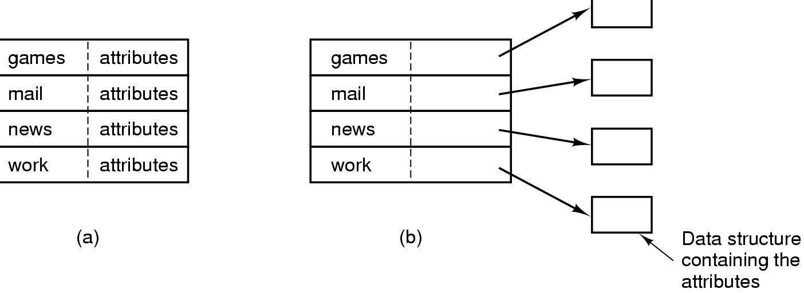
- (a) 简单目录 – MS-DOS/Windows
- 目录项大小固定，目录中存储文件属性和地址；
- (b) Linux/Unix 引用i-节点的目录
- Figure 4-14. (a) A simple directory containing fixed-size entries with the disk addresses and attributes in the directory entry.
- (b) A directory in which each entry just refers to an i-node.

<!-- slide: 51 -->

- 文件系统的实现 - Directory Entry 目录项
- 37
- Figure 4-30. The MS-DOS directory entry.

- Figure 4-32. A UNIX V7 directory entry.
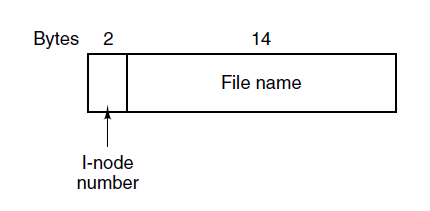
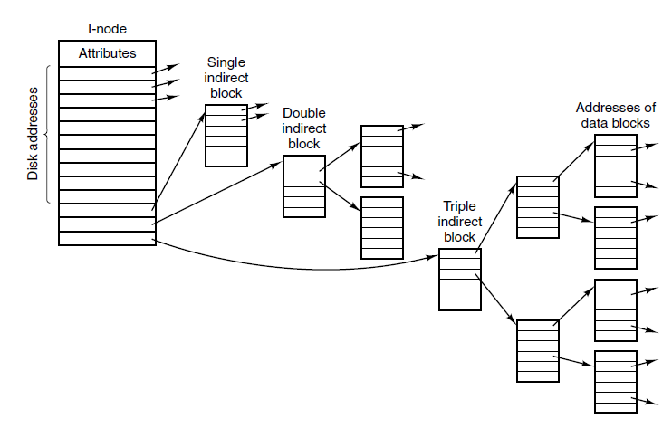
- Figure 4-33. A UNIX i-node

<!-- slide: 52 -->

- 文件系统的实现 - Unix 文件查找步骤示意图
- 37
- Figure 4-34. The steps in looking up /usr/ast/mbox.
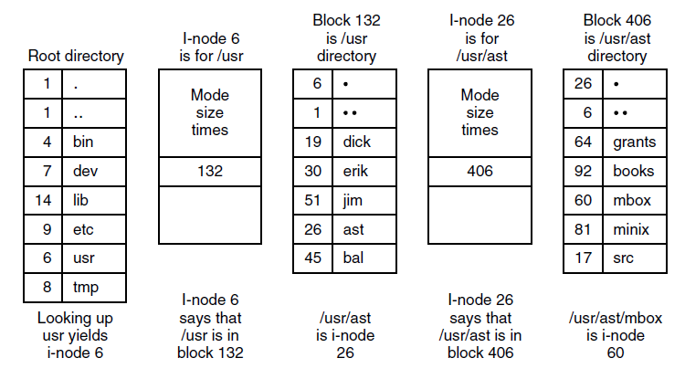
- Unix 文件路径分级查找： /usr/ast/mbox

<!-- slide: 53 -->

- 目录的实现：处理长文件名
- 12
- 背景：为什么需要“长文件名”处理机制
- 早期文件系统（如 FAT12/FAT16、早期UNIX）规定：
  - 文件名长度固定（例如 8 个字符 + 3 个扩展名，称为“8.3格式”）。
  - 每个目录项（directory entry）长度固定。
- 但后来用户需要更长名字（如 "My Summer Vacation Photo 2025.jpeg"），于是出现了“长文件名”支持问题。
- 解决它的关键在于：如何在目录项中保存超过固定长度的文件名，同时仍保持与旧系统兼容。

<!-- slide: 54 -->

- 目录的实现：处理长文件名
- 12
- 两种处理方式

| 方式 | 核心思想 | 典型文件系统 | 特点 |
|---|---|---|---|
| 1️ 多目录项拼接法 （Multiple Directory Entries） | 把长文件名分成多个“短片段” ，用多个目录项拼接表示 | FAT32（VFAT） | ✅ 兼容旧版； ❌ 实现复杂 |
| 2️  可变长度目录项 （Variable-Length Directory Entry） | 每个目录项长度不固定，根据文件名长度动态分配 | ext2/ext3/ext4, NTFS 等 | ✅ 灵活节省空间； ❌ 目录遍历需额外解析 |

- 可变长度目录项法（以 ext4 为代表）
- 在 UNIX/Linux 的 Ext 系列文件系统中：
- 每个目录项（struct ext4_dir_entry）由：
    - inode 号；
    - 文件名长度；
    - 记录长度（rec_len）；
    - 文件类型；
    - 文件名（变长字符串）组成。
- FAT（File Allocation Table）原本只支持“8.3”文件名格式。
- 后来微软推出了 VFAT（Virtual File Allocation Table） 扩展支持长文件名（LFN：Long File Name）。实现原理：
  - 一个长文件名被拆分为多个“伪目录项”（LFN entries）；
  - 每个 LFN 目录项存放最多 13 个字符；
  - 它们按顺序排列在真正的“短文件名（SFN：Short File Name）目录项”前面；
  - 短文件名项依旧保持兼容（8.3格式）。
  - 校验码（与对应短名匹配）。

> 备注：例子：
假设文件名：
MyLongFileName.txt
VFAT 的目录项排列如下（按存储顺序）：
目录项类型	内容
LFN entry #3	字符 27–39
LFN entry #2	字符 14–26
LFN entry #1	字符 1–13
SFN entry	短名如 MYLONG~1.TXT
每个 LFN entry 含：
Unicode 文件名片段（13 个字符）；
顺序号；
校验码（与对应短名匹配）。
这样旧版 DOS 仍可看到 MYLONG~1.TXT，而新版系统可重组出完整 "MyLongFileName.txt"。

<!-- slide: 55 -->

- 目录的实现
- 处理长文件名
  - 固定长度，缺点？
  - 增加长度值，如（a）所示，缺点？
  - 堆中存放，如（b）所示，缺点？
- 12
- 浪费空间
- 删除文件产生空隙
- 管理堆需要额外开销
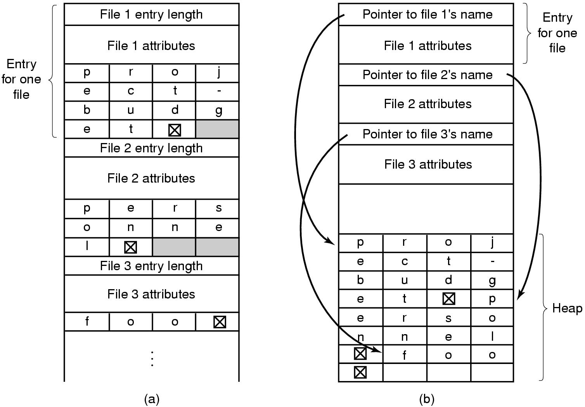

| 文件系统 | 文件名最大长度 | 特性 |
|---|---|---|
| FAT12/16 (8.3) | 11 字符 | 固定长度 |
| VFAT / FAT32 | 255 Unicode 字符 | 多条伪目录项 |
| ext2 / ext4 | 255 字节 | 变长目录项 |
| NTFS | 255 Unicode 字符 | 支持区分大小写 |
| APFS / exFAT | 255 Unicode 字符 | 支持国际化 |

- 现代文件系统通用做法

<!-- slide: 56 -->

- 目录的实现：如何搜索文件
- 目录如何搜索文件?
  - 基本方法：从目录中线性搜索  (慢)
  - 改进技术1：哈希表  (速度快，但是需要额外开销，文件多时才考虑)
  - 改进技术2：将查找结果存入高速缓存
- 13
- 😄 ： find / -name your_wanted_filename
- sudo find / -name your_wanted_filename
- open("/home/yyq/hello.txt")
- │
- ▼
- [根目录 inode #2]──查目录块 → "home" → inode #7
- │
- ▼
- [/home inode #7]──查目录块 → "yyq" → inode #14
- │
- ▼
- [/home/yyq inode #14]──
- 计算 hash("hello.txt") % 4 → bucket 0
- │
- ▼
- 读取 bucket 0 指向的目录块 30 → 逐个比较名字 → inode #23
- │
- ▼
- [文件 inode #23]──读取 direct blocks 50,51 → 得到文件内容
- 举例对比
- 假设 /home/yyq/docs/ 有 1000 个文件：
- 直接打开文件 /home/yyq/docs/report.txt：
  - 内核用 HTree → 直接找到 inode → 读文件块 → 返回内容
  - 查找时间几乎不随目录大小增长（哈希平均 O(1)）
- find /home/yyq/docs -name report.txt：
  - 遍历目录块 1、块 2、…、块 N
  - 对每个目录项逐个比较名字
  - 查找时间随目录大小线性增长（O(n)）

> 备注：改进技术 ②：目录项缓存（Directory Cache / Name Cache）
💡 思想：
如果某个文件或路径经常被访问，就将其查找结果缓存在内存中（高速缓存）。
⚙️ 原理：
操作系统在内核中维护一个 目录项缓存（dcache 或 namei cache）：

<!-- slide: 57 -->

- unsigned int simple_hash(const char *name, unsigned int bucket_count)
- {
- unsigned int h = 0;
- while (*name)
- h = h * 31 + (unsigned char)(*name++);
- return h % bucket_count;
- }
- 目录的实现: 带哈希函数的目录查找
- 假设路径：/home/yyq/hello.txt
- 磁盘结构仍然简化为： inode 表 + 数据块
- 每个目录的数据块存放 目录项（name + inode 号）
- 每个目录还维护一个 哈希表（bucket），通过文件名哈希快速定位候选目录块
- 13
- 1️ 目录结构示意（带 hash）
- 假设 /home/yyq 目录有以下文件：
  - hello.txt → inode 23
notes → inode 24
log.txt → inode 25
data.csv → inode 26
- 我们给 /home/yyq 增加
- 一个哈希桶索引：

| Bucket号 | 目录块号 |
|---|---|
| 0 | 30 |
| 1 | 31 |
| 2 | 32 |
| 3 | 33 |

- 哈希函数（简单版本）：
- 在大多数 类 Unix / Linux 文件系统（如 ext2 / ext3 / ext4）中，根目录的 inode 号几乎总是固定为 2。

<!-- slide: 58 -->

- 目录的实现
- 13
- 2️ 文件查找流程（含 hash 环节）
- 假设我们要查 "hello.txt"：
- Step 1: 分解路径
- /home/yyq/hello.txt → ["home","yyq","hello.txt"]
- Step 2: 查根目录 / （inode 2）
- 在根目录中找到 "home" → inode 7
- Step 3: 查 /home （inode 7）
- 找 "yyq" → inode 14
- Step 4: 查 /home/yyq （inode 14） — 使用哈希函数
- 计算 "hello.txt" 的 hash：
  - h = 'h'*31^0 + 'e' ... → h % 4 = 0
- 得到 bucket 0 → 指向数据块 30
- 在数据块 30 中逐个比较目录项：
  - 目录块 30:
  - hello.txt → inode 23
  - notes → inode 24
- 找到 "hello.txt" → inode 23
- 哈希的作用：直接定位到候选目录块，避免遍历整个目录（尤其是大目录）。
- Step 5: 读取文件 inode 23
- inode 23 包含 direct blocks = [50,51]
- 文件大小 6KB → 两个块
- Step 6: 读取数据块
- 块 50 → 前 4KB
- 块 51 → 剩余 2KB
- 返回用户进程
- unsigned int simple_hash(const char *name, unsigned int bucket_count)
- {
- unsigned int h = 0;
- while (*name)
- h = h * 31 + (unsigned char)(*name++);
- return h % bucket_count;
- }

| Bucket号 | 目录块号 |
|---|---|
| 0 | 30 |
| 1 | 31 |
| 2 | 32 |
| 3 | 33 |

<!-- slide: 59 -->

- 共享文件
- 允许一个文件出现在不同的目录中；
- 文件系统是一个有向无环图Directed Acyclic Graph (DAG)。
- 目录与共享文件的联系称为链接。
- 16
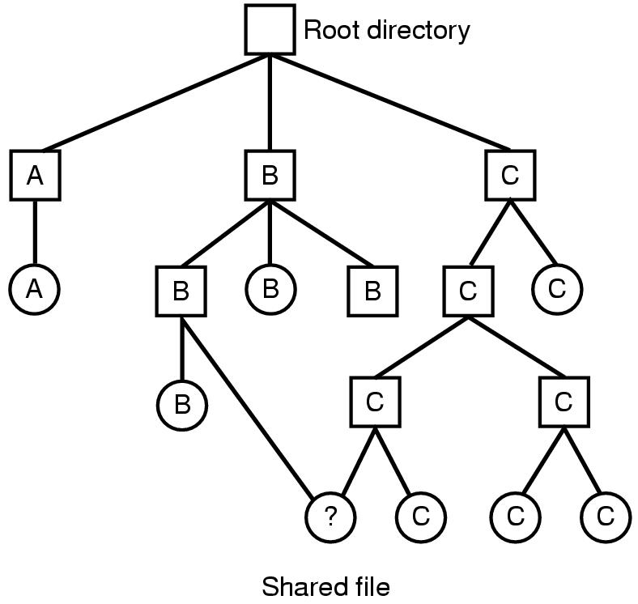
- 共享文件的本质就是 通过多个目录项（硬链接或符号链接）指向同一份数据或目标路径，让文件在不同目录中出现而不复制数据。
- 共享文件的核心意义
- ——让同一份文件数据通过 多个名字 出现在不同目录下，而不复制数据本身。
- 1️. 硬链接实现共享
- 硬链接（Hard Link）直接 复用同一个 inode
- 文件数据不重复存储，只是多个目录项指向同一个 inode
- 任何硬链接修改文件内容，都会影响所有链接
- 文件真正被删除的条件：引用计数归零（所有硬链接都删除）

<!-- slide: 60 -->

- 共享文件
- 基于索引节点的共享方式（硬链接）
- 传统树形目录：不同用户通过将各自的FCB设置成相同的物理地址来实现，即不同的目录项指向同样的物理块。（新增内容无法共享）
- 索引节点：指向相同的索引节点即可实现共享，需要增加一个计数值统计指向该索引节点的目录项的个数。
- 17
- 1️. 硬链接行为
- 多个硬链接共享同一个 inode → 所指向的数据块也是同一份
- inode 中包含文件元信息（权限、大小、引用计数）和数据块指针
- 修改文件内容时：
  - 操作的是 inode 指向的数据块
  - 所有指向同一 inode 的硬链接看到的内容都变
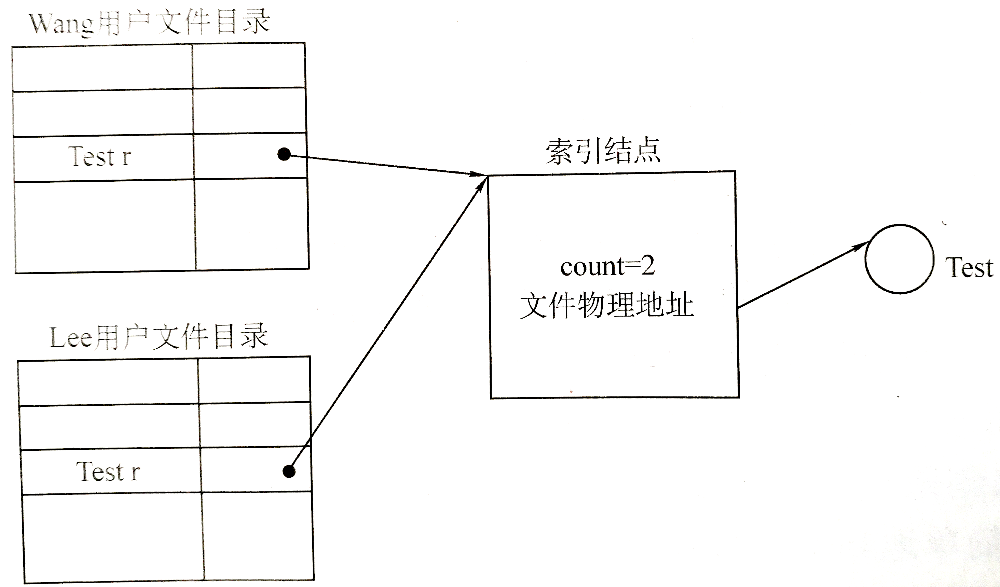
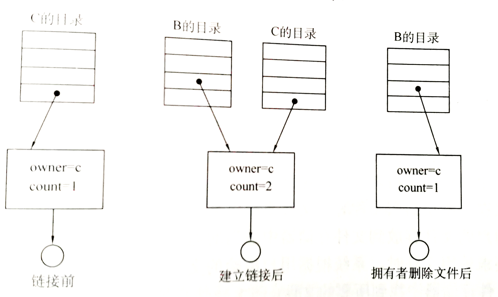

<!-- slide: 61 -->

- 共享文件
- 用符号链接实现文件共享（软链接）
- 创建一个新的符号链接（ symbolic linking ）文件，包含该文件的路径。先读取路径，再读取文件；
- 需要额外的磁盘开销：须读取包含路径的文件，然后一级一级地扫描路径，直到找到i节点。这些操作可能需要很多次额外的磁盘访问。
- 18
- 符号链接实现共享（路径映射）
- 符号链接（Soft Link）是 单独的文件，里面存储目标路径
- 可以跨目录甚至跨文件系统引用原文件
- 删除目标文件，符号链接会失效（悬挂链接）
- ln -s /home/yyq/original.txt /tmp/shared_symlink.txt

<!-- slide: 62 -->

- 共享文件
- 18
- ln -s /home/yyq/original.txt /tmp/shared_symlink.txt
- stat
- 显示 inode 信息和文件元数据
- stat -x filename
- File: filename
- Size: 4096       Blocks: 8       IO Block: 4096 regular file
- Device: 802h/2050d  Inode: 12345  Links: 2
- Access: (0644/-rw-r--r--)  Uid: 1000  Gid: 1000
- Access: 2025-10-28 23:30:00
- Modify: 2025-10-28 23:25:00
- Change: 2025-10-28 23:26:00
- 查看 inode 号和基本信息
- ls -i filename
- 显示文件的 inode 号
- ls -i filename
- 输出示例：
- 12345 filename
- ln /home/yyq/original.txt /tmp/shared_symlink.txt
- ln 的基本语法
- ln [OPTION] SOURCE [TARGET]
- 不带选项：创建 硬链接（hard link）
- 带 -s：创建 符号链接（symbolic link / soft link）

<!-- slide: 63 -->

- 共享文件
- 18
- 硬链接（hard link）
- 1️ . 基本命令     ln file1 file2
创建一个名为 file2 的硬链接，它和 file1 指向 同一个 inode。
- 2️. 验证      ls -li
- 输出示例：
- 12345 -rw-r--r-- 2 yyq yyq 12 Oct 29 23:45 file1
12345 -rw-r--r-- 2 yyq yyq 12 Oct 29 23:45 file2
- 🔹 关键点：
- 两个文件 inode 号相同（12345）
- “链接计数（Links）” 为 2
- 修改任意一个文件的内容，另一个同步变化
- 因为它们 共享同一份数据块
- 🔹 删除行为：
- 删除其中一个，只是从目录中移除一个“名字”
- 当链接计数为 0 时（即所有名字都被删除），inode 才被回收
- 3️. 限制: 硬链接不能：
- 跨不同文件系统（不同设备号）
- 链接目录（为防止循环）
- 符号链接（soft link / symbolic link）
- 1️. 命令:		ln -s file1 link1
- 2. 验证:		ls -li
- 输出示例：
- 12345 -rw-r--r--1 yyq yyq 12 Oct 2923:45 file1
12346 lrwxrwxrwx 1 yyq yyq  5 Oct 2923:45 link1 -> file1
- 🔹 关键点：
- link1 是一个 独立的文件（不同 inode）
- 它的内容是一个 路径字符串（即 “file1”）
- 访问时由内核解析该路径，再跳转到真正的文件
- 🔹 行为：
- 修改 file1 的内容：link1 访问到同样内容
- 删除 file1 后，link1 变为 “悬空链接（dangling link）”

<!-- slide: 64 -->

- 共享文件
- 18
- # 硬链接：同一个i-node所指的数据文件的不同的名字。
- /home/yyq/file1 ─┐
- ├──> inode #12345 ─> data blocks
- /home/yyq/file2 ─┘
- # 符号链接：符号链接本身是一个i-node，指向source_file
- /home/yyq/link1 ─> inode #12346 ─> "file1" (路径字符串)
- ↓
- inode #12345 ─> data blocks

| 项目 | 硬链接 | 软链接 |
|---|---|---|
| inode 是否相同 | ✅ 相同 | ❌ 不同 |
| 是否跨文件系统 | ❌ 不可 | ✅ 可以 |
| 是否可链接目录 | ❌ 不可 | ✅ 可 |
| 删除原文件后能否访问 | ✅ 仍可 | ❌ 悬空 |
| 数据是否共享 | ✅ 同一数据块 | ⚠️ 仅通过路径引用 |
| inode 链接计数 | 多个名字共享同一 inode | 链接自身独立 inode |

- 核心理解：文件名 ≠ 文件内容
- 在 Linux 文件系统中：
  - 文件名是目录项（directory entry）
  - --> 目录项存放了 inode 号
  - --> inode 才是文件真正的“身份”
- 所以：
- 创建硬链接    =   给同一个 inode 增加一个“名字”。
- 创建符号链接 = 创建一个新的文件，
      - 其中保存“另一个文件的路径”。

<!-- slide: 65 -->

- 现代操作系统中，文件系统都有效地解决了重名问题（即允许不同用户的文件可以具有相同的文件名）。系统是通过（）来实现这一功能的。（10分）
- 重名翻译结构
- 建立索引表
- 树形目录结构
- 建立指针
- A
- B
- C
- D
- 提交
- 单选题
- 1分

- 如果当前工作目录是/usr/jim,则相对路径名为
- ../ast/x的文件的绝对路径是 [填空1] 。 （10 分）

<!-- slide: 66 -->

- 在一个文件被用户进程首次打开的过程中，操作系统需做的是（） （10分）
- 将文件内容读到内存中
- 将文件控制块读到内存中
- 修改文件控制块的读写权限
- 将文件的数据缓冲区首指针返回给用户进程
- A
- B
- C
- D
- 提交
- 单选题
- 1分

<!-- slide: 67 -->

- 下列说法错误的是（） （20分）
- 文件系统负责文件存储空间的管理，但不能实现文件名到物理地址的转换
- 在多级目录结构中，对文件的访问通过路径名和用户目录名进行的
- 文件系统中open 系统调用的主要目的是把文件的控制信息从辅存读到内存
- 文件路径分为绝对路径和相对路径两种
- A
- B
- C
- D
- 提交
- 可为此题添加文本、图片、公式等解析，且需将内容全部放在本区域内。正常使用需3.0以上版本
- 在多级目录结构中，对文件的访问只需要路径名就可以了
- 答案解析
- 答案解析
- 多选题
- 1分

<!-- slide: 68 -->

- 作答

- KDE / GNOME/Windows/MacOS GUI  中的“共享”功能与 ln 命令没有直接关系。
  - ln 是文件系统级别的本地链接机制（基于 i-node）。
  - GUI的“共享”是网络级别远程访问机制（基于 Samba/NFS 协议）。
- 它们都可以被视为“资源共享”的两种不同层次——
- 一个在文件系统内部（同机），一个在主机之间（跨网络）。

<!-- slide: 69 -->

| 命令 | 含义 | PowerShell 内部实现 | 是否完全一致 |
|---|---|---|---|
| ls | 列出目录内容 | 别名 → Get-ChildItem | ✅ 输出类似（略有差异） |
| pwd | 打印当前目录 | 别名 → Get-Location | ✅ 完全一致 |
| cd | 切换目录 | 内建命令（Set-Location） | ✅ 完全一致 |
| cat | 输出文件内容 | 别名 → Get-Content | ✅ 基本一致 |
| echo | 打印文本 | 别名 → Write-Output | ✅ 基本一致 |
| cp | 复制文件 | 别名 → Copy-Item | ✅ 功能一致 |
| mv | 移动文件 | 别名 → Move-Item | ✅ 功能一致 |
| rm | 删除文件 | 别名 → Remove-Item | ✅ 功能一致 |
| mkdir | 创建目录 | 别名 → New-Item -Type Directory | ✅ 功能一致 |
| rmdir | 删除目录 | 别名 → Remove-Item | ✅ 功能一致 |
| clear | 清屏 | 别名 → Clear-Host | ✅ 一致 |
| history | 查看命令历史 | 别名 → Get-History | ✅ 一致 |
| man | 查看帮助 | 别名 → Get-Help | ✅ 类似功能 |
| ps | 查看进程 | 别名 → Get-Process | ✅ 类似功能 |
| kill | 终止进程 | 别名 → Stop-Process | ✅ 一致（语法略不同） |
| sort | 排序 | 别名 → Sort-Object | ✅ 基本一致 |
| grep | 文本过滤 | 别名 → Select-String | ✅ 功能相同（语法略不同） |
| sleep | 暂停执行 | 别名 → Start-Sleep | ✅ 一致 |
| date | 查看日期时间 | 别名 → Get-Date | ✅ 一致 |

- PowerShell 与 Linux
- 完全一致或行为等价的命令
- ✅ 这些命令在 PowerShell 与 Linux（bash/zsh）中都能使用，且行为基本一致。但没有想象的那么好，学习Linux指令还是基于Linux系统为好！！！
- PowerShell 通过别名和对象管道，实现了与 Linux Bash 高度相似的基本命令集（
- ls, cp, mv, rm, cat, grep, ps, echo, pwd等）。
- 它们在用户体验上几乎完全一致，但 PowerShell 的输出是结构化对象，不是文本流，因此功能更强大。
