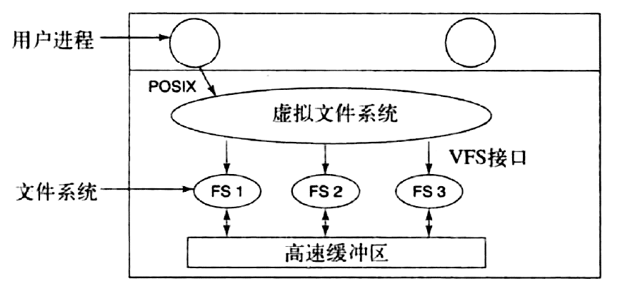
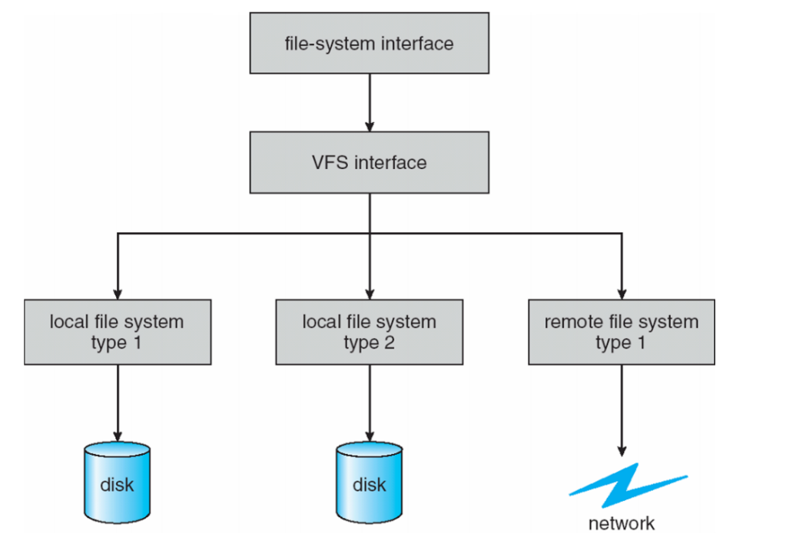
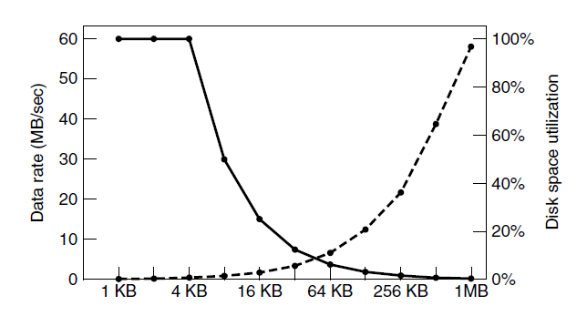
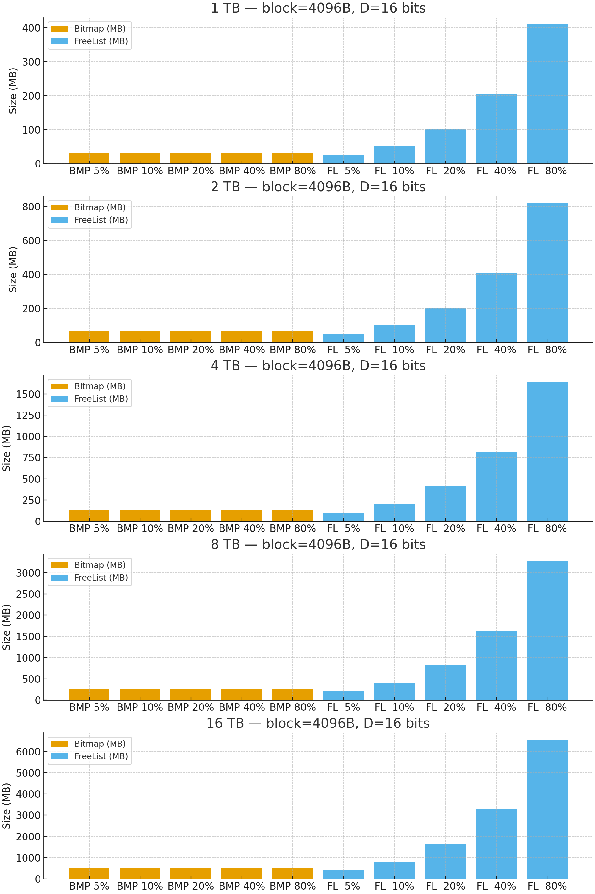
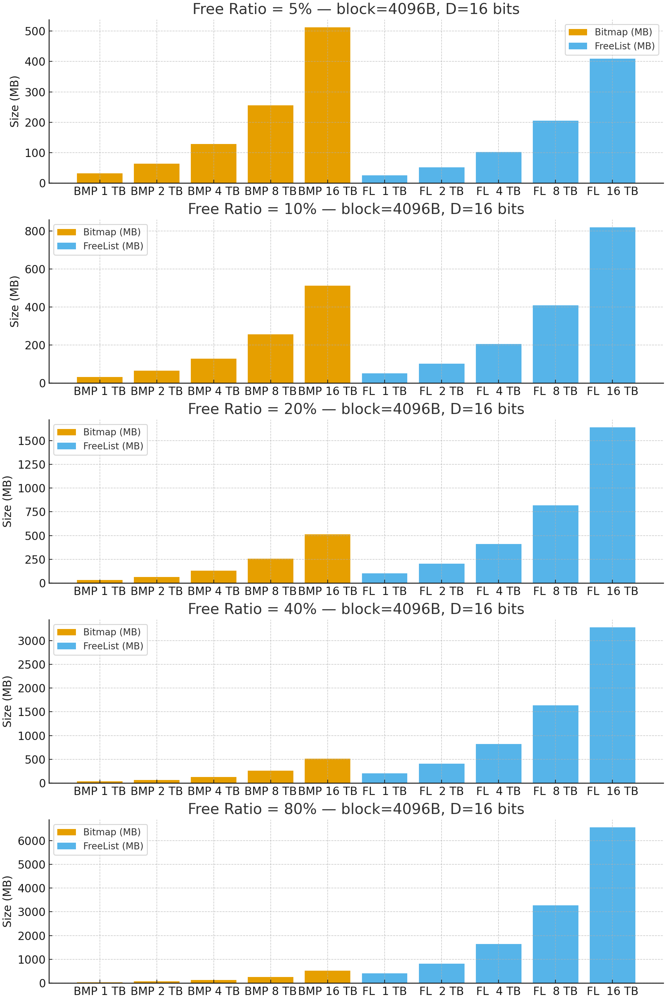
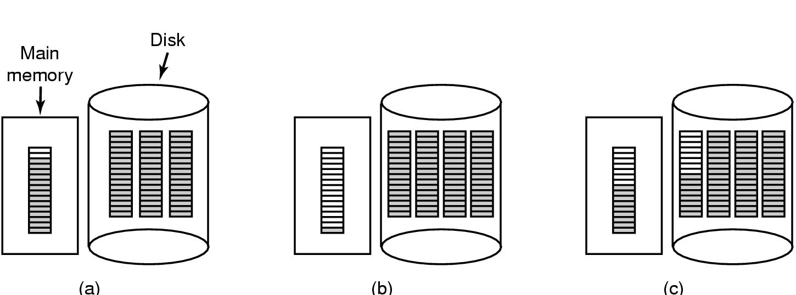
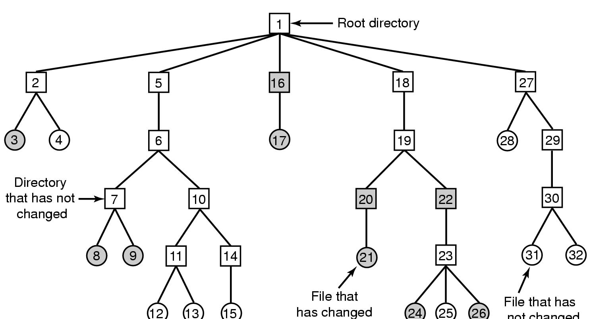
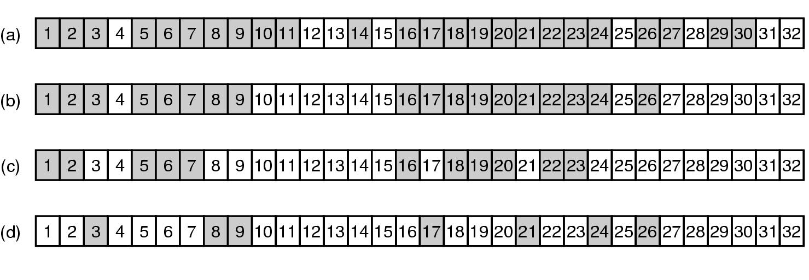
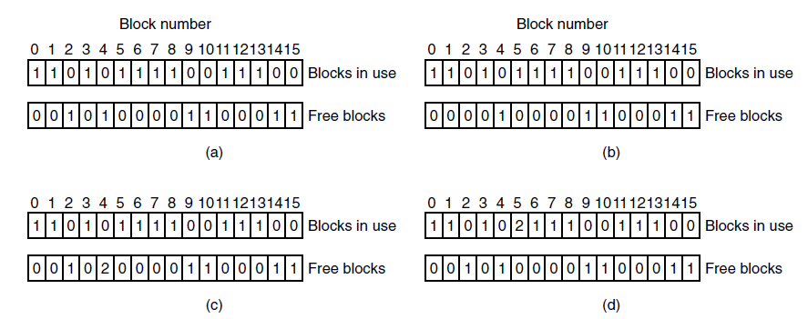
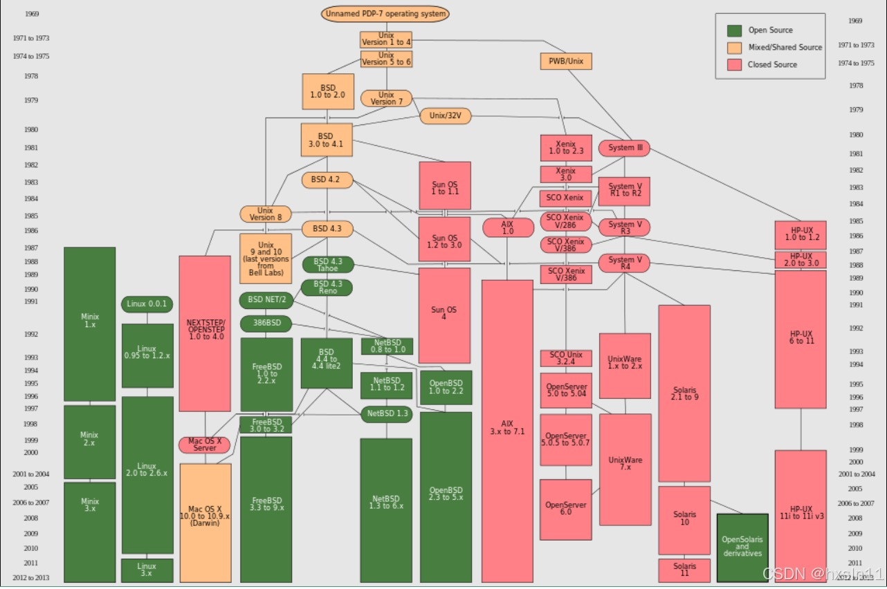

# yc-ch

<!-- slide: 1 -->

- 操 作 系 统
- Operation System
- 杨 灿
- 华南理工大学
- 计算机科学与工程学院
- Email: cscyang@scut.edu.cn
- http://www.scholat.com/yangcan
- Part 5 文件系统 （1）
- 文件系统的若干技术问题

<!-- slide: 2 -->

- 操 作 系 统
- 钟竞辉
- 办公室：B3-515
- 电子邮箱：jinghuizhong@scut.edu.cn

<!-- slide: 3 -->

- 关于文件系统的索引节点（inode），以下哪个描述是错误的？
- inode包含了文件的属性信息
- 每个文件在文件系统中都有唯一的inode
- inode不占用磁盘空间
- inode中包含了指向文件数据块的指针
- A
- B
- C
- D
- 提交
- 单选题
- 1分

<!-- slide: 4 -->

- 在基于索引的文件系统中，目录项（directory entry）通常包含哪些信息？
- 文件名
- 文件的全部数据
- 文件数据的开头部分
- 文件的inode号
- A
- B
- C
- D
- 提交
- 多选题
- 1分

<!-- slide: 5 -->

- 在文件系统设计时，以下哪个因素不是需要考虑的？
- 磁盘空间利用率
- 文件访问速度
- 操作系统版本
- 文件的并发访问
- A
- B
- C
- D
- 提交
- 单选题
- 1分

<!-- slide: 6 -->

- 在文件系统中，文件的逻辑结构通常包括哪些类型？
- 连续文件
- 块设备文件
- 索引文件
- 散列文件
- A
- B
- C
- D
- 提交
- 多选题
- 1分

<!-- slide: 7 -->

- 在文件系统中，关于文件的硬链接和软链接（符号链接），以下哪个描述是错误的？
- 硬链接指向文件的inode
- 硬链接不能跨文件系统
- 软链接指向文件的inode
- 软链接可以跨文件系统
- A
- B
- C
- D
- 提交
- 单选题
- 1分

<!-- slide: 8 -->

- 一个文件系统有1TB的磁盘空间，每个inode占用128字节，每个数据块占用4KB。请问这个文件系统最多可以有多少个inode？
- 作答
- 主观题
- 10分

<!-- slide: 9 -->

- 题目：一个文件系统有1TB的磁盘空间，每个inode占用128字节，每个数据块占用4KB。请问这个文件系统最多可以有多少个inode？
- 答案：这个文件系统最多可以有 1TB / (128B + 4KB) = 2,097,150 个inode（取整数部分）。

<!-- slide: 10 -->

- 某混合索引文件系统，直接地址项为10项，一、二和三级间接地址项各一项，如果一个盘块大小为1KB，每个盘块号占4B，问若进程要访问偏移量263168B处的数据，要经过几次间接寻址？
- 作答
- 主观题
- 10分

<!-- slide: 11 -->

- 题目：某混合索引文件系统，直接地址项为10项，一、二和三级间接地址项各一项，如果一个盘块大小为1KB，每个盘块号占4B，问若进程要访问偏移量263168B处的数据，要经过几次间接寻址？
- 答案：
- 索引地址的结构为10+1+1+1。一个盘块1KB，一个盘块号4B，故一个盘块可以放下1KB/4B=256个盘块号。偏移为263168B的数据地址为263168，
- 263168/1024（向下取整）= 257，
- 263168%1024=0。即263168B处的数据在第257个盘块上的最后一个字节。10个直接地址项对应的盘块最多指向10个盘块，257-10=247。一个一级间接地址最多指向256个盘块号，而247<256，故不需要二级间接地址。只需要一次一级间接寻址即可访问到263168B处的数据

<!-- slide: 12 -->

- 虚拟文件系统
- 定义: 虚拟文件系统是操作系统内核的一层软件，它提供文件系统的接口给用户程序；
- 21
- 目前存在很多文件系统：Ext2, UFS(Solaris), NFS, Ext3, Ext4, Veritas, ReiserFS, XFS, ISO9660 (CD), UDF (DVD) etc.
- 虚拟文件系统抽象出所有文件系统的共有部分，并将这部分代码放在单独的一层。所有和文件相关的系统调用都先指向虚拟文件系统。
- “虚拟文件系统（VFS：Virtual File System）” 是 操作系统文件管理子系统的核心抽象层，它让 不同文件系统（如 ext4、NTFS、FAT32、NFS 等）能够共存并以统一接口访问。

<!-- slide: 13 -->

- 虚拟文件系统
- 对不同的文件系统使用相同的API
- 将文件操作与具体的文件系统实现分开；
- 具有更好的灵活性
- 22
- 一、VFS 的动机（为什么需要它）
- 早期的操作系统中：每种文件系统格式（如 FAT、EXT、NTFS）都需要专门的访问代码；程序要访问不同类型的文件系统时，必须使用不同的系统调用或驱动逻辑；
- 这样严重破坏了系统的可扩展性。
- → VFS 的目标：提供统一接口，让所有文件系统看起来都一样。
- 二、VFS 的定义
- VFS（Virtual File System）是操作系统内核中的抽象层，用来屏蔽不同物理文件系统的差异，为用户提供统一的文件操作接口。换句话说：
- 用户程序看到的是 抽象的文件、目录、inode、superblock；
- 实际存储介质（ext4、XFS、NFS）隐藏在下面；
- VFS 负责调用相应文件系统驱动的函数来完成具体操作。

<!-- slide: 14 -->

- 虚拟文件系统
- 22
- ┌──────────────────────────────┐
- │ 用户层 (User Space)         		   │
- │ ────────────────────────────--│
- │  应用程序 (ls, cat, cp...)    		   │
- │  系统调用接口 (open, read...) 	   │
- └──────────────────────────────┘
- ↓
- ┌──────────────────────────────┐
- │ 内核层 (Kernel Space)                         │
- │ ────────────────────────────--│
- │   VFS 抽象层                		  │
- │   ├─ super_block (文件系统)	  │
- │   ├─ inode (文件节点)       		  │
- │   ├─ dentry (目录项缓存)    	  │
- │   ├─ file (打开文件对象)    		  │
- │   └─ vfs_operations         		  │
- └─────────────────────────────-┘
- ↓
- ┌──────────────────────────────┐
- │ 具体文件系统驱动层           	   │
- │ ext4 / XFS / FAT / NFS / ...  		   │
- └──────────────────────────────┘
- ↓
- ┌──────────────────────────────┐
- │ 硬件设备层                   		   │
- │ 磁盘 / SSD / 网络 / 内存盘     	   │
- └──────────────────────────────┘
- 三、VFS 的分层结构
- 1️.  用户空间调用
- fd = open("/home/your/file.txt", O_RDONLY);
- 2️.  进入内核空间的系统调用接口
  - → sys_open()
  - → 调用 VFS 的统一接口：vfs_open()
- 3️.  VFS 解析路径
  - 拆分路径 /home/your/file.txt
  - 使用 dentry cache（目录项缓存） 查找是否命中
  - 若未命中，则访问下层文件系统（如 ext4）读取 inode
- 4️.  定位文件系统并调用具体驱动
  - VFS 确认该路径属于哪个文件系统（ext4）
  - 调用该文件系统注册的操作函数，如
  - ext4_file_operations.open()
- 5️.  返回 file 对象
  - VFS 分配一个通用的 file 结构
  - 填入操作函数指针（如 read/write/close）
  - 返回文件描述符 fd 给用户程序
- 四、VFS 操作的执行过程（以 open("/home/your/file.txt") 为例）

<!-- slide: 15 -->

- 虚拟文件系统 : VFS 管理相关的常用指令总览
- 28

| 类别 | 指令 | 作用 |
|---|---|---|
| 文件系统查看 | mount、cat /proc/mounts、df、lsblk、 cat /proc/filesystems | 查看当前系统中挂载的文件系统与支持类型 |
| 文件系统挂载/卸载 | mount、umount | 让 VFS 管理或解除对某个具体文件系统的访问 |
| 文件系统检测与修复 | fsck | 检查并修复文件系统一致性（ext 系列、xfs 等） |
| 文件系统创建 | mkfs | 格式化设备、建立新的文件系统 |
| 文件系统缓存与同步 | sync、mount -o remount、cat /proc/sys/vm/drop_caches | 控制或刷新 VFS 缓存 |
| 查看 inode/文件属性 | stat、ls -i、df -i | 查看文件在 VFS/inode 层的信息 |
| 打开文件监控 | lsof、fuser | 查看哪些进程打开了哪些文件（VFS 的 file 对象） |
| 内核支持查询 | cat /proc/filesystems | 查看内核中注册的文件系统驱动 |
| 临时虚拟文件系统 | mount -t tmpfs、mount -t proc | 挂载伪文件系统（tmpfs、proc、sysfs） |
| inode 对应路径查找 | find / -inum <inode号> | 根据 inode 查找所有对应目录项（hard link 情况） |

<!-- slide: 16 -->

- 虚拟文件系统
- 22
- VFS 的关键数据结构

| 结构体 | 作用 | 示例 |
|---|---|---|
| super_block | 表示一个已挂载的文件系统整体 | ext4 的超级块信息 |
| inode | 表示文件的元数据 | 权限、大小、时间戳、块地址等 |
| dentry | 表示目录项缓存（文件名到 inode 的映射） | “/home/yyq/file.txt” 各级目录 |
| file | 表示打开的文件实例 | 用户执行 open() 后对应结构 |

| 功能 | 说明 |
|---|---|
| 统一接口 | 所有文件系统共用 open/read/write/close 等系统调用 |
| 可扩展性 | 可挂载新文件系统而不改动上层应用 |
| 缓存机制 | 提供 dentry、inode 缓存，加速文件查找 |
| 挂载机制 | 允许同时挂载多个文件系统（根、U盘、NFS等） |
| 抽象与分层 | 分离“文件逻辑”与“文件物理结构” |

- VFS 的意义

| 层次 | 代表对象 | 功能 |
|---|---|---|
| 用户层 | 文件名、路径、描述符 | 统一系统调用接口 |
| VFS 抽象层 | super_block、inode、dentry、file | 统一文件模型与操作接口 |
| 具体文件系统 | ext4、xfs、nfs | 实现具体的读写逻辑 |
| 硬件层 | 磁盘、SSD、网络 | 物理I/O |

- VFS 总结

<!-- slide: 17 -->

- 磁盘空间文件分块
- 存储n个字节的文件有两种策略:
  - 分配n个字节的连续磁盘空间
    - 当文件扩大时，可能需要在磁盘上进行移动，执行该操作的代价很高并且会造成外部碎片
  - 分配[n/k]个块，每个块的大小是k个字节
    - 各块之间不一定相邻
- 28

<!-- slide: 18 -->

- 如何决定块的大小？
- 当块的大小增加时, 磁盘空间的利用率减小
  - 内部碎片, 空间效率降低
- 当块的大小减少时, 数据传输速率减小
  - 时间效率降低；      假设所有文件都是4k
- 29
- 虚线（左边标度）给出磁盘数据率：
  - 随着块size的增大而增大 ？
    - 每次 I/O 的内容增大
- 实线（右边标度）给出磁盘空间利用率
  - 随着块size的增大而减小 ？
    - 碎片占比增大

- block size

<!-- slide: 19 -->

- 记录空闲块
- 使用磁盘块链表:
  - 图（a）展示了1 KB的磁盘块和32位的磁盘块号
- 使用位图:  图(b) 空闲块用1表示，已分配块用0表示
- 31
- 一、两者的基本作用
- 它们都用于：记录哪些磁盘块是空闲的，
- 哪些已被占用。
- 这是文件系统的核心元数据之一，决定了文件的分配效率、恢复可靠性、以及碎片率。
- 位图（Bitmap）
- 位图是一张“按位标记的表”。
- 每个磁盘块对应 1 位：
    - 1/0 → 空闲
    - 0/1 → 已占用
- 空闲表（Free List）
- 空闲表就是一个 “空闲块号的列表”。
- 文件系统直接保存所有空闲块号。
- 每个条目存储块号（D 位，如 16 位表示一个块号）

<!-- slide: 20 -->

- 记录空闲块 的 空间开销
- 使用磁盘块链表:   有多少个空闲磁盘块，就有多少个空闲块号
- 32
- 使用位图:  n 个块的磁盘需要n 位位图
- 空间对比条件
- 设：
  - D = 每个块号位数（通常 16 位）
  - B = 磁盘总块数
  - F = 空闲块数
- 则：
  - 空闲表空间：F × D bits
  - 位图空间：B bits
- 位图更小的条件：
- B<F×D ⇒  F/B> 1/D
- 即：
  - 当空闲比例 F/B≥1/DF/B≥1/D（如 D=16 → 6.25%）时，位图更省空间。
  - 当空闲比例 F/B < 6.25% 时，空闲表更省。

| 对比项 | 位图 (Bitmap) | 空闲表 (Free List) |
|---|---|---|
| 结构 | 每块 1 位标记 | 列表存放空闲块号 |
| 空间开销 | 固定，与 F 无关 | 与 F 成正比 |
| 搜索速度 | 快（位操作） | 慢（遍历） |
| 并行与局部性 | 支持良好 | 难实现 |
| 适用场景 | 大容量磁盘、空闲较多 | 空闲极少或嵌入式 |
| 文件系统实例 | EXT4、XFS、NTFS 现代主流 | 早期UNIX、DOS |

<!-- slide: 21 -->

- 32
- 具体的例子：磁盘容量分别为： 1T，2T，4TB，8TB，16TB， 每个磁盘块号的位数D = 16， 块大小为 4kB；分别计算空闲块占比 5%，10%，20%，40%， 80% 的情况下，空闲表和位图分别所占空间比较图。

- 应用
- 早期文件系统（如 UNIX V6、MS-DOS FAT12）使用空闲表。
- 现代系统由于磁盘大、空闲比例高，已几乎全面转向
- 位图结构。

<!-- slide: 22 -->

- 记录空闲块
- 使用磁盘块链表:   每个块中包含尽可能多的空闲磁盘号块
  - 对于1 KB的磁盘块和32位的磁盘块号 1024 * 8/32 = 256 磁盘块  255个空闲块 和 1个位置存放指向下一个块的指针.
- 32
- 使用位图:  n个块的磁盘需要n位位图
  - 空闲块用1表示
  - 已分配块用0表示
  - 16GB的磁盘包含224 个1-KB，需要224 bits  2048个块
  - 使用磁盘块链表：224/255 = 65793个块.

<!-- slide: 23 -->

- 假设磁盘地址需要D位，一个磁盘共有B个块，其中有F个空闲。在什么条件下，空闲块表采用的空间少于位图？设D为16位，请计算空闲磁盘空间百分比。
- 作答
- 正常使用主观题需2.0以上版本雨课堂
- 主观题
- 1分

<!-- slide: 24 -->

- 假设磁盘地址需要D位，一个磁盘共有B个块，其中有F个空闲。在什么条件下，空闲块表采用的空间少于位图？设D为16位，请计算空闲磁盘空间百分比。
- 34
- 答：位图需要B位，空闲块表法需要DF位；
- DF < B时， 即F/B < 1/D时成立。
- 当D=16时，F/B < 6%

<!-- slide: 25 -->

- 记录空闲块
- 内存中一个被指向空闲磁盘块的指针几乎充满的块；
- 释放三个磁盘块后的结果；
- (c)   改进策略
- 35

<!-- slide: 26 -->

- 文件系统备份
- 丢失文件系统是灾难性的。
- 36
- 备份: 从灾难中恢复、挽救错误的操作；
- 备份的一些考虑
  - 备份整个文件系统；
  - 增量转储: 每次只存储修改过的文件；
  - 先压缩再存储；
  - 对活动文件系统做备份；
  - 安全问题；

<!-- slide: 27 -->

- 文件系统备份
- 两种备份策略:
  - 物理转储: 从第0块开始，将全部块复制存储；
    - 优点：简单、快速；
    - 缺点：无法增量存储，不能满足特定文件的恢复请求；
  - 逻辑转储: 从一个或几个指定的目录开始，递归地转储自某个基准日期之后更改的文件和目录；
- 37

<!-- slide: 28 -->

- File that has
- not changed
- 逻辑转储
- 待转储的文件系统
- (方框代表目录, 圆圈代表文件, 带阴影的值自上次转储以来修改过的项）
- 38
- 什么是逻辑转储（Logical Dump）
- 逻辑转储是指：按照文件系统的逻辑结构（即目录树、文件、i-node 等），把需要备份的文件及其相关元信息复制到备份介质上（如磁带、磁盘或远程服务器）。
- 换句话说，它理解文件系统的内容与结构，而不是直接复制原始磁盘块。
- 逻辑转储的主要目标
- 逻辑转储希望实现：
- 备份文件系统中有用的部分（排除空闲块）；
- 可进行增量备份（仅转储自上次备份后修改的文件）；
- 保证一致性（捕获目录结构、权限、属性信息）。

<!-- slide: 29 -->

- 逻辑转储
- 逻辑转储算法所使用的位图
- (完成逻辑转储需要经过 4 个步骤操作)
- 39

<!-- slide: 30 -->

- 逻辑转储
- 逻辑转储操作步骤
- 39

| 步骤 | 名称 | 主要操作 | 位图作用 |
|---|---|---|---|
| ① | 标记 inode | 标识哪些文件需要转储 | 生成 inode 位图 |
| ② | 标记数据块 | 标识文件所占用的块 | 生成 block 位图 |
| ③ | 执行转储 | 根据位图复制目录和文件 | 控制转储内容 |
| ④ | 更新状态 | 写回转储时间和清理位图 | 支持增量转储 |

- ┌────────────────────────┐
- │ ① 扫描 inode 表         		  │
- │ 标记需备份的 inode 位   	  │
- └────────────┬───────────┘
- ┌────────────▼──────────┐
- │ ② 标记数据块位图     		 │
- │ inode→block 依赖关系     	 │
- └────────────┬──────────-┘
- ┌────────────▼───────────┐
- │ ③ 执行转储   		            │
- │ 目录→文件 顺序复制             │
- └────────────┬───────────┘
- ┌────────────▼───────────┐
- │ ④ 更新转储信息          	   │
- │ 支持增量与差异转储       	   │
- └────────────────────────-┘

| 项目 | 内容 |
|---|---|
| 定义 | 按文件系统逻辑结构备份文件的过程 |
| 与物理转储区别 | 不复制空闲块，可增量备份 |
| 关键结构 | inode 位图、block 位图 |
| 四个步骤 | 标记 inode → 标记 block → 执行转储 → 更新信息 |
| 优点 | 节省空间、可增量、可恢复目录树结构 |
| 常用命令 | dump, restore, tar, cpio |

- dump -u -0 /dev/sda1
- 表示对分区 /dev/sda1 进行 0 级（完全）逻辑转储。
- dump -u -1 /dev/sda1
- 进行一级（增量）转储：只备份最近修改的文件。

<!-- slide: 31 -->

- 文件系统一致性
- 检查文件系统一致性的工具 (UNIX：fsck， Windows: Chkdisk, scandisk).
- 两类一致性检测:  (a) 块一致性      (b) 文件一致性
- 40
- “文件系统一致性（File System Consistency）” 是操作系统文件系统管理中的关键概念之一，它保证系统崩溃或异常断电后，磁盘上的文件系统结构依然保持逻辑正确、可恢复。
- 文件系统一致性是指：文件系统中各个元数据结构（如超级块、i-node 表、空闲块表/位图、目录项等）之间的逻辑关系保持正确且相互匹配。确保 i-node 表、目录项、数据块分配信息三者之间互相吻合。
- 为什么会破坏一致性
- 文件系统一致性主要会因 系统崩溃、断电 或 缓存写回中断 而遭破坏。
- 现代系统中，许多写操作会延迟（缓存写），因此如果中途崩溃，可能导致：

| 类型 | 举例说明 |
|---|---|
| ❌ 块分配错误 | 某文件写入了一半，block 位图没来得及更新 |
| ❌ i-node 不一致 | i-node 已分配但目录项尚未写入 |
| ❌ 空闲表错误 | 某块既被文件使用又被标为空闲 |
| ❌ 目录项错误 | 目录项指向不存在的 inode |
| ❌ 链接计数错误 | 文件被多个目录链接但计数未更新 |

<!-- slide: 32 -->

- 块一致性检查
  - 构建两张表：每个块关联一个值，初始为0；
  - 第一张表记录块在文件中出现的次数；第二张表记录块在空闲列表中的使用情况；
  - 然后，通过扫描i-node/FAT，更新第一张表的值；
  - 扫描空闲列表/位图，更新第二张表的值；
- 41
- fsck /dev/sda1
- 即 File System Check 工具。
- 它通过扫描并修复不一致部分，维持逻辑完整性。
- 通过比较这两张表：
- 如果一个块既在使用表又在空闲表中 → 错误（重复使用）；
- 如果一个块既不在使用表也不在空闲表 → 错误（“丢失块”）；
- 如果空闲块表统计与超级块中记录的空闲块总数不符 → 修复。

<!-- slide: 33 -->

- 块一致性检查
- 文件系统状态
- （a）一致
- （b）块丢失 – 添加到空闲列表
- （c）空闲块重复 – 重新建立空闲列表
- （d）数据块重复 – 分配一个空闲块，复制重复的内容至该块，插入到其中一个文件中。
- 42

- 第一张表记录块在文件中出现的次数；
- 第二张表记录块在空闲列表中的出现状态。

<!-- slide: 34 -->

- 文件一致性检查
- 检查目录：维护一张表，在该表中，一个文件对应一个计数器；
  - 扫描文件系统，对目录中的每个文件，计数器加1；
- 比较获得的计数值和i-node中的值.
  - i-node link count > computed value.
  - 当所有文件删除时，该i-node的链接数仍大于0，该i-node将无法被删除；
  - 解决方案: set i-node link count = value computed
  - i-node link count < computed	value
    - 该i-node可能被释放，即使仍然有其他目录指向它；
    - 解决方案 : set inode link count = computed value
- 43
- “两张表”是文件系统一致性检查的核心：
- 一张来自磁盘记录（位图），一张来自实际扫描结果（inode链）。
- 通过交叉比较，系统修复异常关闭造成的不一致。

<!-- slide: 35 -->

- 如果因为系统崩溃而使得存放空闲磁盘块信息的空闲块表或位图完全丢失，会发生什么情况？是否该磁盘彻底无法使用了？
- 作答
- 正常使用主观题需2.0以上版本雨课堂
- 主观题
- 1分

<!-- slide: 36 -->

- 如果因为系统崩溃而使得存放空闲磁盘块信息的空闲块表或位图完全丢失，会发生什么情况？是否该磁盘彻底无法使用了？
- 45
- 解答：会使得系统无法找到空闲块存放新数据。解决的办法是通过扫描文件系统相关信息（比如所有文件的inode节点）重新构建空闲块表或位图。

<!-- slide: 37 -->

- 在Unix/Linux系统中，哪个命令通常用于检查文件系统的一致性并修复问题（如果可能）？
- df
- fsck
- chkdisk
- mount
- A
- B
- C
- D
- 提交
- 单选题
- 1分

<!-- slide: 38 -->

- 在操作系统的文件管理中，逻辑转储通常指的是什么？
- 将整个磁盘的内容复制到另一个磁盘
- 从磁盘的第0块开始，将全部磁盘块按顺序输出到存储设备上
- 从一个或几个指定的目录开始，递归地转储其自给定基准日期后有所更改的全部文件和目录
- 将物理内存中不常用的数据块转移到磁盘的交换空间中
- A
- B
- C
- D
- 提交
- 单选题
- 1分

<!-- slide: 39 -->

