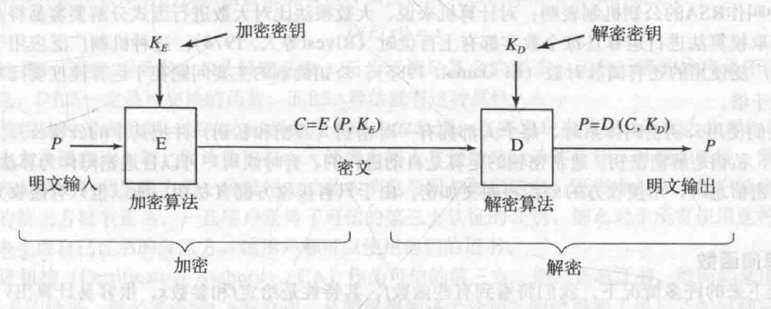
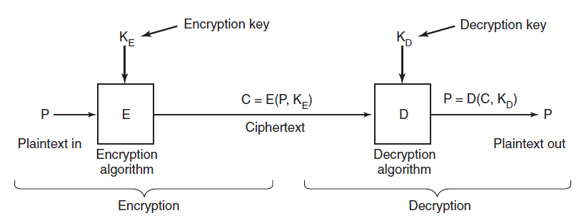
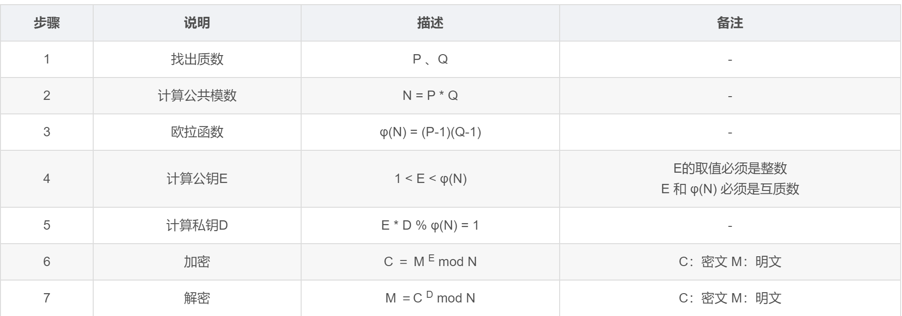
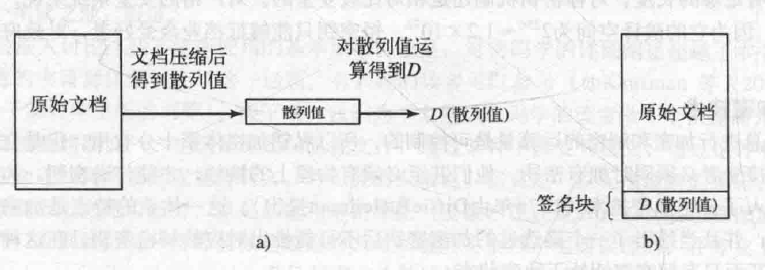
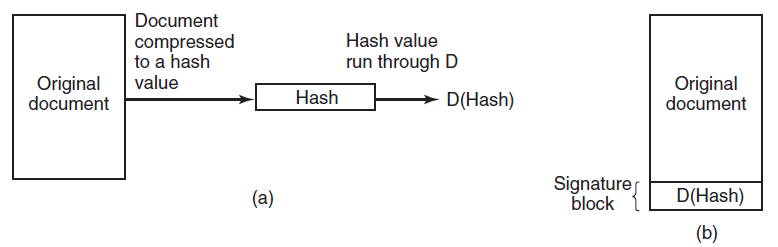
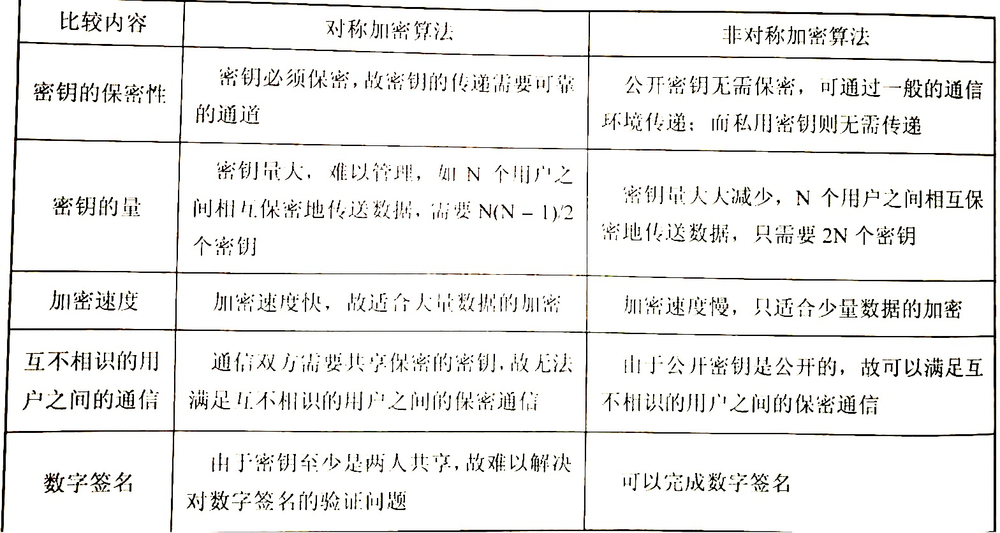
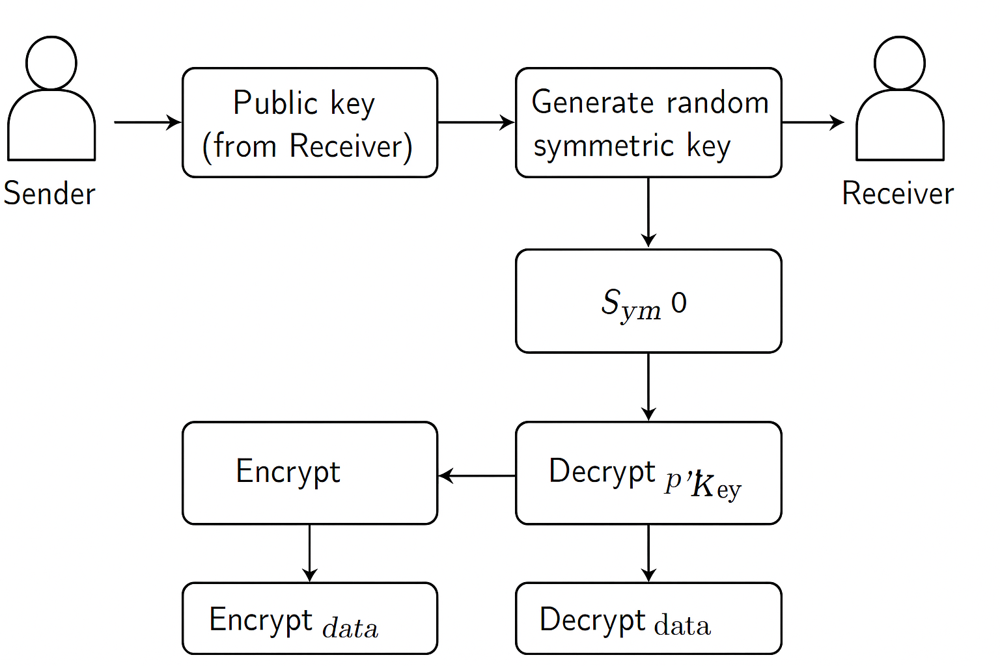

# yc-ch-18安全

<!-- slide: 1 -->

- 操 作 系 统
- Operation System
- 杨 灿
- 华南理工大学
- 计算机科学与工程学院
- Email: cscyang@scut.edu.cn
- http://www.scholat.com/yangcan
- Part 6 计算机安全
- 信息安全若干问题

<!-- slide: 2 -->

- 安全环境：威胁
- 系统的安全性包括三个主要方面的内容 （CIA）：
- 数据机密性：数据暴露
- 数据完整性：数据被纂改
- 系统可用性：系统瘫痪或拒绝服务
- 其他：   真实性等
- 17
- 现代信息安全＝用可证明的密码原语（primitives）构建协议（protocols）和体系（architecture），并用工程性措施（密钥管理、硬件根、审计、轮换、零信任）降低单点失效的风险。

<!-- slide: 3 -->

- 安全环境：入侵者
- 入侵者（Intruder）：闯入与自己不相干区域的人
- 非专业用户的随意浏览
- 内部人员的窥视
- 为获取利益而尝试
- 商业或军事间谍
- 18

<!-- slide: 4 -->

- 安全环境：数据意外丢失
- 通常的情况
- 天灾：
- 火灾、洪水、战争
- 硬件或软件错误：
- CPU 故障、磁盘错误、程序出错等
- 人为错误：
- 错误的磁带安装、运行错误的程序、磁盘遗失等。
- 19

<!-- slide: 5 -->

- 计算机安全
- 有多种方式威胁到计算机的安全性，其中：
- 数据截取会威胁到（机密性）；
- 修改和假冒会威胁到（完整性），
- 通过病毒耗尽计算机的资源则会威胁到（可用性）。
- 对计算机硬件的主要威胁在（可用性）方面，而对软件可以在（机密性）比如生成一份未授权的软件副本。
- 21

<!-- slide: 6 -->

- 密码学基础
- 22
- 加密的定义：C=E(P,KE)
- 解密的定义：P = D(C, KD)
- 柯克霍夫( Kerckhoffs)原则：
  - 加密算法应该公开，加密的安全性由独立于加密算法之外的密钥决定。

- 明文和密文间的关系

<!-- slide: 7 -->

- 对称密钥
- 单字母替换
  - 利用密码本将每一个字母被替换为另一个
  - 比如：ATTACK  QZZQEA
  - 存在基于统计的攻击
- 23
- 如果密钥有足够长度，对称密钥机制相对较安全。

| 类型 | 定义 |
|---|---|
| 🔒 对称加密 (Symmetric Encryption) | 加密（Encryption）和解密（Decryption）使用同一个密钥（Key）。知道密钥的人就能加密也能解密。 |
| 🔑 非对称加密 (Asymmetric Encryption) | 加密和解密使用不同的密钥：一对公钥（Public Key）和私钥（Private Key）。公钥加密的数据只能由私钥解密，反之亦然。 |

<!-- slide: 8 -->

- 公钥加密
- 所有用户使用公钥/私钥对：
  - 公开公钥
  - 私钥不公开
- 公钥用于加密，私钥用于解密
- 加密密钥和解密密钥不同，给出加密钥后难以推出对应的解密密钥。
- Step 1：发送方利用公钥对明文进行加密；
- Step 2：接收方利用私钥对密文进行解密。
- 缺点：运算速度慢。
- 24

<!-- slide: 9 -->

- 公钥加密(RSA)
- 25
- f, x,
- 容易
- 计算上不可行

<!-- slide: 10 -->

- 公钥加密(RSA)
- 一个事实：对计算机来说，大数相乘远比大数分解容易得多。
- 1600000000000000229500000000000003170601由哪两个质数相乘得来？
- 26
- 80000000000000001239 和
- 20000000000000002559!!!
- RSA的安全性来源
- 大整数分解难题（Integer Factorization Problem）
- 给出 n=pq，在计算上几乎不可能恢复 p, q。
    - 若能分解 n，则可计算 φ(n)，再推出 d。
- 模幂不可逆： 即使知道 Me  mod n，若不知道 d，反推 M 的计算极难。

<!-- slide: 11 -->

- 公钥加密(RSA)
- 27

- RSA = 通过“大整数分解困难性”实现的模幂双向变换：C=Me mod n,M=Cd mod n, 安全性来源于数学不可逆，实用性来源于混合加密。

<!-- slide: 12 -->

- 数字签名
- 一种类似写在纸上的普通的物理签名，但是使用了公钥加密领域的技术实现，用于鉴别数字信息的方法。
- 只有信息的发送者才能产生的别人无法伪造的一段数字串，这段数字串同时也是对信息的发送者发送信息真实性的一个有效证明。
- 30

- Step 1）发送方公开公钥，利用私钥对散列值加密；
- Step 2）接收方利用公开的公钥处理加密的散列值，并与计算的散列值对比，如果一致，则确认该文档确实由发送方发送。

<!-- slide: 13 -->

- 椭圆曲线 Elliptic Curve Cryptography, ECC 加密原理
- 一、数学基础：椭圆曲线（Elliptic Curve）
- ECC 基于一种定义在有限域（finite field）上的曲线，称为 椭圆曲线（elliptic curve），它的标准方程是： y2=x3+ax+by，其中 aa 和 bb 必须满足：4a3+27b2≠0，以保证曲线没有尖点或自交点。
- ✅ 定义域
- 椭圆曲线可以定义在实数域（R）上，方便理解；
- 实际用于密码学时，定义在有限域（finite field）上：
    - 常见是 素域 Fp​，即模 p 的整数；
    - 或 二进制域 F2m​，用于硬件实现。
- ✅ “点加法”（Point Addition）
- 椭圆曲线上的点具有加法群结构（Abelian group），这就是 ECC 安全性的来源。
- 对于曲线上的两个点 PP 和 QQ，定义加法：
  - 过 P 和 Q 画一条直线；
  - 直线再次与曲线相交于第三点 R′；
  - 取关于 x 轴的对称点 R，即 P+Q=R。
- 如果 P=Q，则用切线定义“点倍加”：
  - 2P=P+P ：过 P 作切线，得到同样的几何定义。
- 这样，椭圆曲线上的点可以无限次地做加法（模有限域）。
- 椭圆曲线 ≠ 椭圆
- 椭圆曲线上的点加法是一种几何操作的结果，不是代数加法运算

<!-- slide: 14 -->

- ECC 核心思想
- ECC 的核心思想：离散对数难题
- （Discrete Logarithm Problem）
- ECC 的安全性来自于 椭圆曲线离散对数问题（Elliptic Curve Discrete Logarithm Problem, ECDLP）：
- 在几何空间给定： Q=kP   ， 其中：
  - P：曲线上的基点（公开）
  - k：私钥（private key）
  - Q：公钥（public key）
- 👉 问题：已知 P 和 Q，能否求出 k？
- 答案：几乎不可能。
- 因为在有限域上，点乘相当于点加上自己 k 次；
- 但无法通过逆运算快速求出 k；
- 即使最强的算法（如 Pollard’s rho）在 256 位 ECC 上也需要天文级运算量。
- ECC 的加密与密钥交换应用
- 1️ 公私钥生成
  - 随机选择私钥 k
  - 计算公钥 Q=kP
- 2️ 密钥交换（ECDH）
- Elliptic Curve Diffie–Hellman：
- 双方 A、B 各自生成：
- QA=kAP,QB=kBP
- 然后交换公钥，计算共享密钥：S=kAQB=kAkBP=kBQA
- 👉 结果完全一致（交换律），但外部人无法推算 kAkA​ 或 kBkB​。
- 3️ 数字签名（ECDSA）
- Elliptic Curve Digital Signature Algorithm：
  - 使用私钥生成签名；
  - 使用公钥验证签名；
  - 具有不可伪造性与完整性保证。

<!-- slide: 15 -->

- ECC 小结

| 特性 | ECC | RSA |
|---|---|---|
| 基础问题 | 椭圆曲线离散对数 | 大数分解 |
| 密钥长度 | 256-bit ECC ≈ 3072-bit RSA | 长得多 |
| 计算速度 | 快 | 慢 |
| 内存与带宽 | 小 | 大 |
| 安全性 | 更强 | 较弱 |

- 因此，ECC 是现代移动设备、TLS（Transport Layer Security）、比特币（Bitcoin）与 WebAuthn 等场景的首选。
- “椭圆曲线”是一族曲线，每个曲线通过参数 a,b,p 唯一定义；
- 加密过程基于椭圆曲线点加法与模运算；
- 私钥不是直接“反推”明文，而是通过椭圆曲线群运算，重建共享密钥或验证签名；
- 安全性完全依赖于 椭圆曲线离散对数问题 的计算不可行性。
- ECC 与 RSA 的比较

| 项目 | 椭圆曲线家族 | 加密原理 | 解密原理 |
|---|---|---|---|
| 定义 | (y^2 = x^3 + ax + b)， 参数 a,b 不同 → 不同曲线 | 基于点加、点倍运算的群结构 | 使用私钥参与同样的群运算恢复共享秘密 |
| 安全性来源 | 椭圆曲线离散对数问题 (ECDLP) | 计算 (kG) 容易 | 从 (Q=kG) 求 (k) 极难 |
| 典型算法 | ECDH, ECIES, ECDSA | 公钥参与加密 | 私钥参与解密或签名 |

<!-- slide: 16 -->

- 对称加密 vs 非对称加密
- 请从多个角度比较对称加密算法和非对称加密算法的区别
- 37

| 特性 | 对称加密 | 非对称加密 |
|---|---|---|
| 🔑 密钥数量 | 一个密钥（加密与解密相同）；n个用户间的保密通信需要的密钥数量：n*(n-1)/2， 理论上，每个用户需要 保留n-1个用户的密钥 | 一对密钥（公钥 + 私钥），n个用户间的保密通信所需密钥量：2n |
| 📤 密钥分发 | 需要安全地传递密钥 | 公钥可公开，私钥保密 |
| ⚡ 加密速度 | 快（10⁴~10⁶倍更快） | 慢（运算复杂，基于大数分解或椭圆曲线） |
| 🔐 安全性 | 取决于密钥是否泄露 | 即使公钥公开也安全（数学困难问题） |
| 📦 常见算法 | AES（Advanced Encryption Standard 高级加密标准）、DES（Data Encryption Standard 数据加密标准）、ChaCha20 | RSA（Rivest–Shamir–Adleman）、ECC（Elliptic Curve Cryptography 椭圆曲线密码学）、DSA（Digital Signature Algorithm 数字签名算法） |
| 💬 应用场景 | 本地数据加密、大文件加密、磁盘/数据库保护 | 数字签名、密钥交换、身份认证、SSL/TLS 握手 |
| 🔁 加解密对称性 | 完全对称 | 完全不对称 |
| 🧩 数学基础 | 代换/置换等数据混淆 | 大数分解（RSA）、离散对数（Diffie–Hellman）、椭圆曲线问题（ECC） |
| 🛡️ 抗攻击性 | 一旦密钥泄露则完全失效 | 私钥泄露才失效，公钥公开无影响 |
| 实际（混合方案） | 现实系统通常采用混合：用非对称（PKI）来安全分发会话密钥，实际数据用对称算法（AES）加密。这样：总长期密钥为 n对（公/私），数据加密用短期会话对称密钥（按会话生成，寿命短）。 这样既保持了对称加密的高性能，又享受非对称的简便分发与认证。 |  |

<!-- slide: 17 -->

- 现代系统中 RSA 和 ECC 角色
- 37

| 场景 | 是否使用 RSA | 替代算法 |
|---|---|---|
| TLS 1.2/1.3 握手 | ✅（部分） | ✅ ECDHE + AES-GCM |
| 数字证书 | ✅ 常见 | ⬆️ Ed25519 / ECDSA 正在替代 |
| PGP 加密 | ✅（仍广泛使用） | ECC 替代中 |
| SSH 密钥 | ✅ 可选 | Ed25519 推荐 |
| JWT 签名 | ✅ RS256 / RS512 | ✅ EdDSA 推荐 |

<!-- slide: 18 -->

- 现代加密通信系统的核心逻辑： 混合加密
- 37
- 整体思路：混合加密（Hybrid Encryption）
- 现代通信系统采用一种混合加密模型（Hybrid Encryption Model），即：
- 🔐 “用非对称加密保护对称密钥，           💨 用对称加密保护大数据内容。”
- A（发送方）拥有 B 的公钥 Kpub,B
- A 生成一个随机会话密钥  Ksym
- A 用 Kpub,B加密这个对称密钥 E = Encrypt(Kysm, Kpub,B)
- A 将密文 E 发送给 B
- 1.建立阶段
- Key Exchange
- B收到对称密钥的密文E,用自己的私钥Kpriv,B解密：Ksym=  Decrypt(E,Kpriv,B)
- 这样B直到对称密钥的明文
- 2.解密阶段
- Receiver
- 密钥交换之后，A用对称密钥加密所要传输的数据：C=Encrypt_sym(M,Ksym);
- 接收方B解密：M=Decrypt_sym(C,Ksym)
- 3.数据传输阶段
- Transportation

<!-- slide: 19 -->

- 现代保密通信系统的核心机制
- 37
- 在实际系统中：
- **非对称密钥对（公钥/私钥）**只负责安全地传递“会话密钥”；
- 对称密钥才是真正用于加密通信内容的“工作密钥”；
- 这种结构既安全又高效，是现代密码通信的标准模型。

| 协议 / 系统 | 对称算法 | 非对称算法 | 实现位置 |
|---|---|---|---|
| HTTPS (TLS) | AES / ChaCha20 | RSA / ECDHE | 浏览器与服务器 |
| SSH | AES / Blowfish | RSA / Ed25519 | 登录加密 |
| PGP / Email | AES / CAST5 | RSA / ECC | 邮件加密 |
| Signal / WhatsApp | AES / Curve25519 | ECC (Elliptic Curve Cryptography) | 即时通信端到端 |

- 在实际协议中的体现:

<!-- slide: 20 -->

- 密码学基础概念
- 37
- 对称加密（Symmetric）：同一密钥加解密（例：AES、ChaCha20）。适合大量数据，要求密钥保密。
- 非对称（公钥）加密（Asymmetric）：公钥加密、私钥解密（例：RSA、ECC），用于密钥分发、签名、认证。
- 签名（Signature）：证明消息由私钥持有者生成（例：RSA-PSS、ECDSA、Ed25519）。安全目标：不可伪造（EUF-CMA）。
- 密钥交换（KEX）：双方通过 DH / ECDH 获得共享密钥；改进：Ephemeral（临时）KEX 提供前向安全。
- 密钥封装（KEM）：用于公钥将会话密钥封装（PQKEM 如 Kyber）。
- 认证加密（AEAD）：加密并认证（完整性+防篡改），比如 AES-GCM、ChaCha20-Poly1305。优先使用 AEAD。
- KDF / HKDF：从共享秘密派生对称密钥（不要直接用原始共享值）。
- 安全定义：IND-CPA/IND-CCA（保密性），EUF-CMA（签名抗伪造）——选择算法要满足适当的定义。
- 攻击面：中间人（MITM）、重放、侧信道、密钥泄露、权限滥用、量子攻击。
- 常用与推荐的原语（工程清单）
- 密钥交换：ECDHE（Curve25519 / P-256）；TLS1.3 默认 ECDHE。
- 对称加密/AEAD：AES-GCM（硬件AES-NI），ChaCha20-Poly1305（移动设备优选）。
- 签名：Ed25519（高性能、固定时长）、ECDSA（兼容旧体系）；证书请用 RSA-PSS 或 ECDSA。
- 密码哈希 / KDF：HKDF (RFC5869)；密码存储用 Argon2id / bcrypt / scrypt。
- 随机性（RNG）：系统CSPRNG（Linux: getrandom / /dev/urandom），硬件RNG做熵源。
- 后量子（PQC）：关注 NIST 标准化结果（Kyber 用于 KEM，Dilithium/SPHINCS+ 用于签名等）。

> 备注：一、重放攻击（Replay Attack）
1. 概念
重放攻击指的是：攻击者截获一段已经合法通过网络传输的通信消息，然后**在之后的某个时间点重新发送（重放）**这段消息，从而冒充原始发送方完成非法操作。
✅ 关键词：截获、重发、冒充、重现过去的会话。
2. 举例
假设Alice要登录银行账户，银行服务器Bob需要验证Alice的身份。
Alice发送登录请求（包含用户名、密码或签名）。
攻击者Mallory在网络上窃听并保存这段请求。
Mallory之后再把这段请求原封不动地重发给服务器。
如果服务器没有检测出这是旧请求，它就会以为这是Alice本人登录。
于是，Mallory 无需知道密码 也能“冒充”Alice。
3. 防御机制
防御方法	说明
时间戳（Timestamp）	消息中带上当前时间戳，服务器只接受“最新”的请求（例如±5秒内）。
随机数 / 一次性令牌（Nonce / Token）	每次通信都必须附带一个随机数，由服务器验证“是否已使用过”。
会话标识符（Session ID）	建立会话后，所有命令必须带会话ID；断开后立即失效。
数字签名或MAC（Message Authentication Code）	确保消息完整性与时效性，防止被篡改重放。
4. 小结
重放攻击的本质不是破解算法，而是“重用旧消息”造成系统逻辑欺骗。
防御重点在于 “消息唯一性” 和 “时间有效性”。
二、侧信道攻击（Side-Channel Attack）
1. 概念
侧信道攻击指攻击者不是直接破解算法（例如RSA或AES），而是通过观察计算过程中的物理特征来间接推测出密钥信息。
✅ 关键词：泄露信息来自“执行过程”，而不是“数学模型”。
2. 常见类型
类型	攻击手段	说明
功耗分析（Power Analysis）	监测加密芯片在运算时的电流变化	功耗随不同比特运算而变化，可反推出私钥。
时间分析（Timing Attack）	测量运算时间	不同密钥可能导致不同的计算时间。
电磁辐射分析（EM Analysis）	侦测芯片发出的电磁波	类似功耗分析，但更远距离。
缓存攻击（Cache Attack）	分析CPU缓存命中情况	在共享CPU环境下（如云服务），可窃取邻进程密钥信息。
声学攻击（Acoustic Attack）	分析设备发出的声音（例如按键音、风扇噪声）	曾在实验室成功复现键盘输入推断。
3. 举例
例如RSA算法在执行指数模运算时：
如果某一位是1，执行“乘+平方”；
如果是0，只执行“平方”。
攻击者通过记录运算时间或功耗差异，就能逐位推算出私钥 d。
4. 防御机制
方法	原理
算法随机化（Blinding）	在每次运算前对输入随机化，使功耗/时间不再与密钥直接相关。
恒定时间算法（Constant-Time Implementation）	无论密钥取值如何，运算时间都一样。
硬件防护（Shielding）	对芯片加电磁屏蔽，减少可被测的信号泄露。
噪声注入（Noise Injection）	在电源或信号中注入随机噪声，干扰测量结果。
三、对比总结
对比项	重放攻击	侧信道攻击
攻击层面	网络协议层	物理硬件层
目的	冒充或重用旧消息	推断私钥或敏感数据
是否需要破解算法	❌ 否	✅ 部分需要算法理解
防御重点	唯一性验证、时间检测	硬件防护、算法随机化
示例	重放登录请求	通过功耗分析提取RSA私钥

一、什么是“量子攻击”？
量子攻击指利用量子计算机运行的量子算法去攻破现有密码学（或加速某些密码分析），从而得到传统计算机无法在合理时间内完成的破解能力。
主要分两类：
对公钥密码（如 RSA、ECC）构成致命威胁 —— 通过 Shor 算法 在多项式时间内做整数分解和离散对数，能直接恢复私钥。
对对称密码/哈希产生加速攻击 —— 通过 Grover 算法 把暴力搜索复杂度从 
O
(
2
n
)
O(2 
n
 ) 降到 
O
(
2
n
/
2
)
O(2 
n/2
 )，意味着密钥安全度大约被“减半”。
二、核心量子算法（简明）
Shor（1994）：能在多项式时间解决整数分解与离散对数问题 ⇒ 能破解 RSA、DH、ECDH、ECDSA、Ed25519 等。
数学上：运行时间关于位数是多项式级别，不再指数级。
Grover（1996）：对未结构化搜索（如暴力穷举）能实现平方加速 ⇒ 对称密钥长度需要翻倍以维持相同安全强度（例如 AES-128 在量子攻击下相当于经典的 64-bit 安全强度；建议用 AES-256）。
三、现实局限（为什么今天不是“马上被破解”？）
量子攻击的威胁取决于可用的量子硬件（量子比特数与容错能力）：
要运行可用于破解 RSA-2048 的 Shor，需要大量逻辑量子比特且需纠错（估计成千上万甚至更多物理 qubit）。
目前的大多数量子电脑还处于“噪声中间规模量子（NISQ）”阶段，尚不可用来大规模破解实用密钥。
时间表高度不确定：可能几年、十几年，也可能更久。不能靠电视新闻的“预测”决定策略——要以风险管理来做准备。
四、最重要的工程风险：Store-Now, Decrypt-Later
攻击者今天截获并保存被加密的机密通信或备份，等到未来有足够强的量子机时再解密。
因此对长期保密的数据（法律、医疗、财务、国防）风险尤甚。
五、如何防御（可执行、分阶段建议）
立即（现在就能做）
资产盘点：列出所有长期保密数据、长期密钥与加密通信的存档（“最有价值的长期秘密”优先）。
启用前向安全（Forward Secrecy）：确保 TLS/SSH 使用 ECDHE 等临时密钥交换，减少被截获后可解密的历史数据面。
使用强对称密钥：优先 AES-256 / ChaCha20（Grover 对称密钥风险可通过增加密钥长度缓解）。
短期证书与自动轮换：缩短证书/密钥有效期，降低泄露窗口。
保护密钥存储：HSM/TPM/KMS 保护长期私钥，最小化导出风险。
中期（可规划的迁移）
采用混合（Hybrid）方案：在关键协议（如 TLS）同时使用经典算法与量子安全 KEM（或在握手中并行封装），实现“经典 + PQ”双保险。
例如：ECDHE + Kyber 混合 KEM（若Kyber为已被接受的PQ KEM）。
关注并测试 NIST 标准化结果：NIST 已完成 PQC 挑选（部分算法已被标准化/推荐），应计划基于被采纳算法做兼容性与性能测试。
升级库与协议栈：使用支持 PQ KEM 的 TLS 实现测试环境（并在生产前做审计）。
长期（架构级）
门限签名 / 分布式密钥：关键资产（资金、主证书）采用门限签名或 MPC，避免单点私钥泄露的灾难性后果。
制定“量子迁移计划”：包括检测、演练、依赖梳理、合规对齐与替换时间表。
保持可替换性（Crypto Agility）：系统设计时保留替换加密算法的能力（配置化、模块化）。
六、当前主流与标准动态（简述）
NIST 后量子密码（PQC）标准化：NIST 已挑选并推进若干候选（如 Kyber 用于 KEM、Dilithium/SPHINCS+ 用于签名等）。（注：具体名单请从 NIST 官方获取最新版本）
实践建议：短期内采用“hybrid (经典+PQC)” 是稳妥路径；长期过渡到纯 PQC 当生态成熟并经审计后再做切换。
七、举例说明（工程落地场景）
Web服务（HTTPS）：使用 TLS1.3 + ECDHE（前向安全）并在未来升级为 ECDHE + PQ KEM 混合握手；服务端证书尽量短期并存放在 HSM。
邮件与存档：对长期保密邮件/档案，考虑先做 PQ 混合加密或采用 PQ KEM 封装对称密钥并替换存档。
区块链/钱包：私钥一旦被破解资产即失，尽量采用多签/门限方案并对密钥管理严格审计。
八、一句话总结
量子攻击不是科幻：它是利用量子算法对传统密码构成数学性威胁。虽然大规模实用量子电脑还未普及，但“现在不做准备，未来可能付出沉重代价”。工程上最务实的路线是：保护长期秘密、启用前向安全、实现加密敏捷，并逐步采用被标准化的后量子方案（优先以混合方式）。

<!-- slide: 21 -->

- 计算机安全现代协议模式
- 37
- （混合/复合模式）
- 混合加密（Hybrid）
    - 公钥用于安全分发对称会话密钥（或 KEM）；对称密钥用于实际数据。
    - TLS / HTTPS、SSH、PGP 都采用混合模式。
- 前向安全（Forward Secrecy）
    - 永远使用临时密钥（ephemeral ECDHE）做会话协商；长期私钥只用于签名验证而不是直接加密会话密钥。
    - 若长期私钥泄漏，历史会话仍保密（前向安全）。
- 认证加密与绑定上下文
    - AEAD + 包序号 + associated data（协议上下文、version、peer id）防止重放/重用。
- 多因素 / 硬件绑定
    - 用 TPM / Secure Enclave / HSM 存私钥或做签名；结合 FIDO/WebAuthn 做用户认证。
