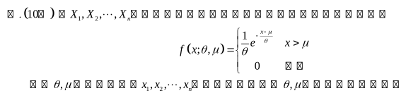
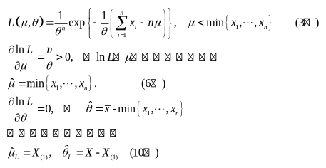

# 2018—2019学年第二学期《概率论与数理统计》A卷答案

诚信应考，考试作弊将带来严重后果！

华南理工大学本科生期末考试
2018-2019-2学期《概率论与数理统计》A卷
注意事项：1. 开考前请将密封线内各项信息填写清楚；
2. 所有答案请直接答在试卷上；
3．考试形式：闭卷；
4. 本试卷共八大题，满分100分， 考试时间120分钟。

| 题 号 | 一 | 二 | 三 | 四 | 五 | 六 | 七 | 八 | 总分 |
|---|---|---|---|---|---|---|---|---|---|
| 得 分 | | | | | | | | | |

<!-- question: 1 -->

## 一、选择题（共6题，每题3分，共18分）

1、设$X_{ 1 }  ,X_{ 2 }  \cdots X_{ n }  (n\ge 2)$为来自总体$N(\mu ,1)$的简单随机样本，记$\bar X=\frac { 1 } { n }\sum  \limits_{ i=1 } ^ n { X_{ i }   }$，则下列结论中不正确的是( )。
（A）$\sum  \limits_{ i=1 } ^ n { (X_{ i }  -\mu ) ^ { 2 }  }$服从$\chi  ^ { 2 }$分布 （B）$2(X_{ n }  -X_{ 1 }  ) ^ { 2 }$服从$\chi  ^ { 2 }$分布
（C）$\sum  \limits_{ i=1 } ^ n { (X_{ i }  - \bar X) ^ { 2 }  }$服从$\chi  ^ { 2 }$分布 （D）$n( \bar X-\mu ) ^ { 2 }$服从$\chi  ^ { 2 }$分布

2、设随机变量$X\sim \operatorname{Pois}(3)$,$Y\simB\left ( { 8,\ \frac { 1 } { 3 } } \right )$，且$X,Y$相互独立，则$\operatorname{Var}(X-3Y-4)$=( )。
$-13$B. 15 C. 19 D. 23
3、设一个盒子中有5件产品，其中有3件是正品，2件次品。从盒子中任取两件，则取出的两件产品中至少有一件次品的概率为( )。
$\frac{3}{10}$B.$\frac{5}{10}$C.$\frac{7}{10}$D.$\frac{1}{5}$
4、随机变量$X\simN(0\ ,\ 1)$，对于给定的$\alpha \left ( { 0 < \alpha  < 1 } \right )$，数$u_{ \alpha  }$满足$P(u>u_{ \alpha  }  )=\alpha$，
若$P(\left | { X } \right  | < c)=\alpha$，则$c$等于（ ）。
$u_{\alpha/2}$B.$u_{(1-\alpha)/2}$C.$u_{1-\alpha}$D.$u_{1-\alpha/2}$
5．设随机变量$X$与$Y$均服从正态分布$X\simN(\mu \ ,\ 4 ^ { 2 } )$，$Y\simN(\mu \ ,\ 5 ^ { 2 } )$，而$p_{ 1 }  =P\{X\le \mu -4\},\quad p_{ 2 }  =P\{Y\ge \mu +5\}$，则（ ）
对任何实数$\mu$，都有$p_{ 1 }  =p_{ 2 }$． B. 对任何实数$\mu$，都有$p_{ 1 }   < p_{ 2 }$．
只对$\mu$的个别值，才有$p_{ 1 }  =p_{ 2 }$． D. 对任何实数$\mu$，都有$p_{ 1 }  >p_{ 2 }$．
设*X*~Pios(*λ*)，且$E[(X-1)(X-2)]=1$，则$\lambda$=（ ）。
1 B. 2 C. 3 D. 0

答案：1. B 2. C 3. C 4. B 5. A 6.A

<!-- question: 2 -->

## 二、填空题（共6题，每题3分，共18分）。

1、设$X_{ 1 }  ,X_{ 2 }$是来自于总体$X$的样本，$\hat{\mu}_1=\frac13X_1+\frac23X_2$，$\hat{\mu}_2=\frac12X_1+\frac12X_2$为总体均值$\mu$的无偏估计，则$\hat{\mu}_1,\hat{\mu}_2$中较有效的是 。
2、设随机变量*X*与*Y*独立且都服从[0, 3]上的均匀分布，则$P\left[ \min\left ( { X\,,Y } \right )\ge 2 \right]=$。
设随机变量$X$的分布函数为$F(x)=0.5\Phi(x)+0.5\Phi\left(\frac{x-4}{2}\right)$，其中$\Phi (x)$为标准正态分布函数，则$EX=$_______。
设随机变量$X$和$Y$的数学期望分别为$-2$和2,方差分别为1和4,而相关系数为$-0.5$,则根据契比雪夫不等式$P\{|X+Y|\ge 6\}\le$。
设随机变量$\xi \simB(n,p),{ \rm{   } }E(\xi )=3,{ \rm{   } }Var(\xi )=1.2$，则*n*=________。
设总体$X$服从正态分布$N\left ( { 0,4 } \right )$,而$X_{ 1 }  ,X_{ 2 }  ,\cdots X_{ 15 }$是来自总体$X$的简单随机样本，则
$$
Y=\frac { X_{ 1 }  ^{ 2 }+X_{ 2 }  ^{ 2 }+\cdots +X_{ 10 }  ^{ 2 } } { 2\left ( { X_{ 11 }  ^{ 2 }+X_{ 12 }  ^{ 2 }+\cdots +X_{ 15 }  ^{ 2 } } \right ) }
$$

服从的分布是$\underline{\qquad}$(包括分布参数)。

答案： 1.$\hat{\mu}_2$2.$\frac19$3. 2 4. 1/12 5. 5 6. F(10,5)

<!-- question: 3 -->

## 三、（10分）

某保险公司把被保险人分为三类：谨慎的、一般的、冒失的，统计资料表明，上述三种人在一年内发生事故的概率依次为0.05，0.15和0.30。如果谨慎的占总的被保人数的20%，一般的占50%，冒失的占30%。
(1)求某被保人在一年内发生事故的概率；
(2)若此人在一年内发生事故，则他是谨慎的客户的概率是多少。
解. 设事件*B*为 “被保险人在一年内出了事故” 这一事件；事件$A_{ 1 }  ,A_{ 2 }  ,A_{ 3 }$分别为“谨慎的、一般的、冒失的被保险人”，则根据全概率公式可得：
$P(B)=p(B|A_{ 1 }  )p(A_{ 1 }  )+p(B|A_{ 2 }  )p(A_{ 2 }  )+p(B|A_{ 3 }  )p(A_{ 3 }  )$3分
=0.2×0.05+0.5×0.15+0.3×0.3=0.175 5分

$P(A_{ 1 }  |B)=\frac { p(B|A_{ 1 }  )p(A_{ 1 }  ) } { p(B|A_{ 1 }  )p(A_{ 1 }  )+p(B|A_{ 2 }  )p(A_{ 2 }  )+p(B|A_{ 3 }  )p(A_{ 3 }  ) }$8分

=$\frac { 0.05\times 0.2 } { 0.175 }=0.0571$10分

<!-- question: 4 -->

## 四、（10分）

设某次概率统计考试考生的成绩$X\sim N(\mu,\sigma^2)$，从中随机地抽取 36 位考生的成绩，算得平均成绩为$\bar{x}=$66.5分，修正标准差为$S ^ { * } =$15分。
(1) 在置信度为0.95时，求考生成绩数学期望$\mu$的置信区间。
(2) 在显著性水平$\alpha$=0.05下，检验是否可以认为这次考试的平均成绩为70分。
$$
t_{ 0.975 }  \left ( { 35 } \right )=2.0301,\quad t_{ 0.975 }  \left ( { 36 } \right )=2.0281,\quad t_{ 0.95 }  \left ( { 35 } \right )=1.6896,\quad t_{ 0.95 }  \left ( { 36 } \right )=1.6883
$$

解：（1）$\frac{\bar X-\mu}{S^*/\sqrt n}\sim t(n-1)$，$\delta(\bar x)=\frac{S^*}{\sqrt n}t_{0.975}(35)=\frac{15}{6}\times2.0301=5.07525$(4分)

学生成绩数学期望$\mu$的置信区间：（61.42,71.58）(5分)

（2）$H_0:\mu=70,\qquad H_1:\mu\ne70$

拒绝域：$A=\left\{\left|\frac{\bar X-70}{S^*/\sqrt n}\right|>t_{0.975}(35)\right\}$，$\left|\frac{66.5-70}{\sqrt{15^2/36}}\right|=1.4<t_{0.975}(35)=2.0301$（9分）

不拒绝原假设。可以认为这次考试的平均成绩为70分。（10分）

<!-- question: 5 -->

## 五、（10分）

某单位有400部内线电话，每时刻每部电话打外线的概率为10%，设各电话使用外线与否是相互独立的，估计在任一时刻有30～50部电话同时使用外线的概率。
$$
\Phi (1.67)=0.9525,\quad \Phi (1.60)=0.9452,\quad \Phi (1.52)=0.9357,\quad \Phi (1.36)=0.9131
$$

解： 设X为任一时刻使用的终端数，则X~B(400, 0.1)

$$
\begin{aligned}
P\{30\le X\le50\}
&=P\left\{\frac{30-np}{\sqrt{np(1-p)}}\le\frac{X-np}{\sqrt{np(1-p)}}\le\frac{50-np}{\sqrt{np(1-p)}}\right\}\\
&=P\left\{-\frac{10}{6}\le\frac{X-np}{\sqrt{np(1-p)}}\le\frac{10}{6}\right\}\\
&=\Phi(1.67)-\Phi(-1.67)\\
&=0.9525\times2-1=0.905
\end{aligned}
$$

> 转换说明：原件在第五题与第七题之间未标注题号，以下内容按原顺序保留。

<!-- question: unnumbered_between_5_and_7 -->

## 原件未标注题号（位于第五题与第七题之间）

解：

<!-- question: 7 -->

## 七、(12分)

设随机变量$X$和$Y$的联合分布在以点$(0,1),(1,0),(1,1)$为顶点的三角形区域上服从均匀分布，求随机变量*U*=*X*+*Y*的方差.
解：三角形区域为$G=\{(x,y):0\le x\le1,\ 0\le y\le1,\ x+y\ge1\}$;随机变量$X$和$Y$的联合密度为
（3分）
以$f_1(x)$表示$X$的概率密度,则当$x\le0$或$x\ge1$时,$f_1(x)=0$;当$0<x<1$时,有
$$
f_1(x)=\int_{-\infty}^{\infty}f(x,y)\,dy=\int_{1-x}^{1}2\,dy=2x
$$

因此$EX=\int_0^1 2x^2\,dx=\frac23,\qquad E(X^2)=\int_0^1 2x^3\,dx=\frac12$（5分）

$$
DX=E(X^2)-(EX)^2=\frac12-\frac49=\frac1{18}
$$

（6分）

同理可得,$EY=\frac23,\qquad DY=\frac1{18}$. （8分）

现在求$X$和$Y$的协方差

$$
E(XY)=\iint_G2xy\,dx\,dy=2\int_0^1x\,dx\int_{1-x}^1y\,dy=\frac5{12}
$$

（9分）

$$
\operatorname{cov}(X,Y)=E(XY)-EX\cdot EY=\frac5{12}-\frac49=-\frac1{36}
$$

（10分）

于是$DU=D(X+Y)=DX+DY+2\operatorname{cov}(X,Y)=\frac1{18}+\frac1{18}-\frac2{36}=\frac1{18}$（12分）

<!-- question: 8 -->

## 八、（12分）

设随机变量$X,Y$相互独立，且$X$的概率分布为$P\{X=0\}=P\{X=1\}=\frac { 1 } { 2 }$，$Y$的概率密度为$f(y)=\begin{cases}2y,&0<y<1,\\0,&\text{其他},\end{cases}$
（1）求$P\{Y\le EY\}$；
（2）求$Z=X+Y$的概率密度。
解（1）由数字特征的计算公式可知：$EY=\int_{-\infty}^{\infty}y f(y)\,dy=\int_0^1 2y^2\,dy=\frac23$。
则$P\{Y\le EY\}=P\left\{Y\le\frac23\right\}=\int_{-\infty}^{2/3}f(y)\,dy=\int_0^{2/3}2y\,dy=\frac49$。（5分）
（2）先求$Z$的分布函数，由分布函数的定义可知：$F_{ Z }  (z)=P\{Z\le z\}=P\{X+Y\le z\}$。
由于$X$为离散型随机变量，则由全概率公式可知
$$
\begin{aligned}
F_Z(z)&=P\{X+Y\le z\}\\
&=P\{X=0\}P\{X+Y\le z\mid X=0\}+P\{X=1\}P\{X+Y\le z\mid X=1\}\\
&=\frac12P\{Y\le z\}+\frac12P\{Y\le z-1\}\\
&=\frac12F_Y(z)+\frac12F_Y(z-1)
\end{aligned}
$$

其中 $F_Y(z)$ 为 $Y$ 的分布函数，$F_Y(z)=P\{Y\le z\}$。

$$
f_Z(z)=\frac12f_Y(z)+\frac12f_Y(z-1)=
\begin{cases}
2(z-1),&1\le z\le2,\\
2z,&0\le z\le1,\\
0,&\text{其他}.
\end{cases}
$$

（12分）
