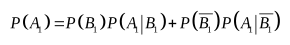
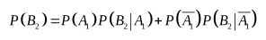
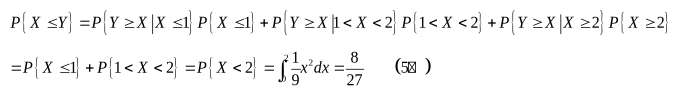
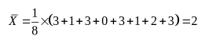

# 2020—2021学年第二学期《概率论与数理统计》A卷答案

诚信应考，考试作弊将带来严重后果！

华南理工大学本科生期末考试
2020-2021-2学期《概率论与数理统计》试卷A
注意事项：1. 所有答案请答在答题卡上，答在试卷上无效；
2. 选择题请用2B铅笔涂黑；
3．考试形式：闭卷；
4. 本试卷共七道大题，满分100分，考试时间120分钟。

| 题 号 | 一 | 二 | 三 | 四 | 五 | 六 | 七 | 总分 |
|---|---|---|---|---|---|---|---|---|
| 得 分 | | | | | | | | |

<!-- question: 1 -->

## 一、选择题（共12题，每题3分，共36分）

设随机变量$X$与$Y$相互独立，且均服从区间$\left[ 0,3 \right]$上的均匀分布，则$P\{max\{X,Y\}$ $\le 1\}=$( ).
(A)$\frac { 1 } { 3 }$(B)$\frac { 1 } { 9 }$(C)$\frac { 2 } { 9 }$(D)$\frac { 2 } { 3 }$
B
设*T*服从自由度为*n*的*t*分布，若$P\{|T|>\lambda \}=\alpha$，则$P\{T<-\lambda \}=$（ ）.
(A)$\alpha$(B)$\frac { \alpha  } { 3 }$(C)$\frac { \alpha  } { 2 }$(D)$\frac { \alpha  } { 4 }$
C
从总体中抽取简单随机样本$X_{ 1 }  ,X_{ 2 }  ,\cdots ,X_{ n }$，易证估计量
$$
\widehat   { \mu  }_{ 1 }  =\frac { 1 } { 2 }X_{ 1 }  +\frac { 1 } { 3 }X_{ 2 }  +\frac { 1 } { 6 }X_{ 3 }  ,{ \rm{   } }{ \rm{   } }{ \rm{   } }{ \rm{   } } \widehat   { \mu  }_{ 2 }  =\frac { 1 } { 2 }X_{ 1 }  +\frac { 1 } { 4 }X_{ 2 }  +\frac { 1 } { 4 }X_{ 3 }
$$

$$
\widehat   { \mu  }_{ 3 }  =\frac { 1 } { 3 }X_{ 1 }  +\frac { 1 } { 3 }X_{ 2 }  +\frac { 1 } { 3 }X_{ 3 }  ,{ \rm{   } }{ \rm{   } }{ \rm{   } }{ \rm{   } } \widehat   { \mu  }_{ 4 }  =\frac { 1 } { 5 }X_{ 1 }  +\frac { 2 } { 5 }X_{ 2 }  +\frac { 2 } { 5 }X_{ 3 }
$$

均是总体均值$\mu$的无偏估计量，则其中最有效的估计量是( ).

(A)$\widehat   { \mu  }_{ 3 }$(B)$\widehat   { \mu  }_{ 1 }$(C)$\widehat   { \mu  }_{ 2 }$(D)$\widehat   { \mu  }_{ 4 }$
A 有$D \widehat   { \mu  }_{ 3 }   < D \widehat   { \mu  }_{ 4 }   < D \widehat   { \mu  }_{ 2 }   < D \widehat   { \mu  }_{ 1 }$.故$\widehat   { \mu  }_{ 3 }$最有效,所以A项正确.
设随机变量$X$和$Y$的数学期望分别为-2和2，方差分别为1和4，而相关系数为-0.5，则根据切比雪夫不等式$P\left \{ \begin{array}{l} \left | { X+Y } \right  |\ge 6 \end{array} \right \}\le \left ( {  \begin{array}{cc}  &  \end{array}  } \right )$.
(A)$\frac { 1 } { 4 }$(B)$\frac { 1 } { 10 }$(C)$\frac { 1 } { 12 }$(D)$\frac { 1 } { 8 }$
C
解因为$E(X+Y)=EX+EY=0$
$$
D(X+Y)=DX+DY+2cov(X,Y)
$$

$$
=DX+DY+2\rho _{ XY }  \sqrt[] { DX\cdot DY }
$$

$$
=1+4-2\times 0.5\times 2=3
$$

根据切比雪夫不等式

$$
P\left \{ \begin{array}{l} \left | { X-EX } \right  |\ge \varepsilon  \end{array} \right \}\le \frac { DX } { \varepsilon  ^ { 2 }  }
$$

所以$P\left \{ \begin{array}{l} \left | { X+Y } \right  |\ge 6 \end{array} \right \}\le \frac { 3 } { 36 }=\frac { 1 } { 12 }$
设 是随机事件， 互不相容,$P\left ( { AB } \right )=\frac { 1 } { 2 },P\left ( { C } \right )=\frac { 1 } { 3 },$则 .
(A)$\frac { 1 } { 2 }$(B)$\frac { 2 } { 5 }$(C)$\frac { 1 } { 3 }$(D)$\frac { 3 } { 4 }$
D
由于 互不相容，即
6. 设 为来自总体 的简单随机样本，则统计量$\frac { X_{ 1 }  -X_{ 2 }   } { \left | { X_{ 3 }  +X_{ 4 }  -2 } \right  | }$的分布 ( ).
(A) (B) (C) (D)
B 解 从形式上，该统计量只能服从 分布。故选 。
证明如下:
由正态分布的性质可知， 与 均服从标准正态分布且相互独立, 可知

设随机变量 服从参数为 1 的泊松分布，则 ( ).
(A)$\frac { 1 } { 2e }$(B)$\frac { 1 } { 3e }$(C)$\frac { e } { 3 }$(D)$\frac { e } { 4 }$
A
因为 服从参数为 1 的泊松分布，所以其概率布为
从而 于是，

设 为来自二项分布总体 的简单随机样本， 和 分别为样本均值和样本修正方差，记统计量, 则
(A)$np ^ { 2 }$(B)$n\left ( { 1-p } \right ) ^ { 2 }$(C)$np$(D)$n\left ( { 1-p } \right )$
A
因为 , 故
因为 , 所以
设二维离散型随机变量X、Y的联合分布律如下，则联合分布函数值$F\left ( { 0,3 } \right )=$( ).

| *Y* - *X* | 0 | 2 | 4 |
|---|---|---|---|
| 0 | $\frac { 1 } { 6 }$ | $\frac { 1 } { 9 }$ | $\frac { 1 } { 18 }$ |
| 1 | $\frac { 1 } { 3 }$ | 0 | $\frac { 1 } { 3 }$ |

(A)$\frac { 1 } { 3 }$(B)$\frac { 5 } { 18 }$(C)$\frac { 2 } { 3 }$(D)$\frac { 4 } { 9 }$
B
设 为两个分布函数, 其相应的概率密度 , 是连续函数, 则必为概率密度的是(
(A) (B) (C) (D)
D
由分布函数和概率密度的性质可得
,
.
从而有

所以 是概率密度,即正确选项为D
设二维随机变量 服从正态分布 , 则 ( ).
(A)$\mu \left ( { \mu  ^ { 2 } +\sigma  ^ { 2 }  } \right )$(B)$\sigma \left ( { \mu  ^ { 2 } +\sigma  ^ { 2 }  } \right )$(C)$\mu  ^ { 2 } +\sigma  ^ { 2 }$(D)$\mu \sigma \left ( { \mu  ^ { 2 } +\sigma  ^ { 2 }  } \right )$
A
因为 服从二维正态分布，所以
对二维正态随机变量, 所以 相互独立，从而 也相互独立，所以

设随机变量 , 且相关系数, 则( ).
(A) (B)
(C) (D)
D
因为 与 的相关系数 , 所以 与 正相关, 即存在常数 , 使得 , 且 , 排除(A)、(C) 因为

所以 从而

<!-- question: 2 -->

## 二、（10分）

甲、乙两人轮流投篮，甲先投。一般来说，甲、乙两人独立投篮的命中率分别为0.7和0.6。但由于心理因素的影响，如果对方在前一次投篮中投中，紧跟在后面投篮的这一方的命中率就会有所下降，甲、乙的命中率分别变为0.4和0.5。求：
(1) 乙在第一次投篮时投中的概率； (2) 甲在第二次投篮时投中的概率。
解：令$A_{ 1 }$表示事件“乙在第一次投篮时投中”，
令$B_{ i }$表示事件“甲在第*i*次投篮时投中”，$i=1,2$
（1）
$$
=0.7\times 0.5+0.3\times 0.6=0.53
$$

(5分）
（2）

$$
=0.53\times 0.4+0.47\times 0.7=0.541
$$

(5分)

<!-- question: 3 -->

## 三、(10分)

有一批建筑房屋用的木柱,其中80%的长度不超过3m，现从这批木柱中随机地取出100根，问其中至少有30根超过3m的概率是多少？
附：
解(2分)
则$X_{ i }  \simB\left ( { 1,0.2 } \right )$,记$X=\sum  \limits_{ i=1 } ^ 100 { X_{ i }   }$,则$X\simB\left ( { 100,0.2 } \right )$. (2分)
由棣莫佛-拉普拉斯定理得
$$
P\left \{ \begin{array}{l} X\ge 30 \end{array} \right \}=1-P\left \{ \begin{array}{l} X < 30 \end{array} \right \}
$$

(2分)
$$
=1-P\left \{ \begin{array}{l} \frac { X-100\times 0.2 } { \sqrt[] { 100\times 0.2\times 0.8 } }\le \frac { 30-100\times 0.2 } { \sqrt[] { 100\times 0.2\times 0.8 } } \end{array} \right \}
$$

$$
\approx 1-\Phi \left ( { \frac { 30-20 } { 10\times 0.4 } } \right )=1-\Phi \left ( { 2.5 } \right )=0.0062
$$

(4分)

<!-- question: 4 -->

## 四、(10分)

设某机器生产的零件长度（单位：cm），今抽取容量为16的样本，测得样本均值，样本修正方差.
(1) 求的置信度为0.95的置信区间；(保留四位小数)
(2) 检验假设（显著性水平为0.05）。
附:$t_{ 0.975 }  \left ( { 16 } \right )=2.1199,\quad t_{ 0.975 }  \left ( { 15 } \right )=2.1315,\quad t_{ 0.95 }  \left ( { 16 } \right )=1.7459,\quad t_{ 0.95 }  \left ( { 15 } \right )=1.7531$
$$
\chi _{ 0.975 }  ^{ 2 }\left ( { 15 } \right )=27.488,\quad \chi _{ 0.975 }  ^{ 2 }\left ( { 16 } \right )=28.845,\quad \chi _{ 0.025 }  ^{ 2 }\left ( { 15 } \right )=6.262,\quad \chi _{ 0.025 }  ^{ 2 }\left ( { 16 } \right )=6.908
$$

解：（1）的置信度为的置信区间:

$$
\left ( {  \bar X-t_{ 1-\frac { \alpha  } { 2 } }  \left ( { n-1 } \right )\frac { S ^ { * }  } { \sqrt[] { n } },\ \quad  \bar X+t_{ 1-\frac { \alpha  } { 2 } }  \left ( { n-1 } \right )\frac { S ^ { * }  } { \sqrt[] { n } } } \right )
$$

$$
\bar X=10,\quad S ^ { * } =0.4,\quad n=16,\quad \alpha =0.05,\quad t_{ 0.975 }  \left ( { 15 } \right )=2.1315
$$

所以$\mu$的置信度为0.95的置信区间为（9.7869，10.2132） (5分)

(2)

$$
\chi  ^ { 2 } =\frac { \left ( { n-1 } \right )S ^ { *2 }  } { \sigma _{ 0 }  ^{ 2 } }\sim\chi  ^ { 2 } \left ( { n-1 } \right )
$$

$$
\chi _{ 0.975 }  ^{ 2 }\left ( { 15 } \right )=27.488,\quad \chi _{ 0.025 }  ^{ 2 }\left ( { 15 } \right )=6.262
$$

$$
\chi  ^ { 2 } =\frac { 15\times 0.16 } { 0.1 }=24
$$

因为$\chi _{ 0.025 }  ^{ 2 }\left ( { 15 } \right ) < \chi  ^ { 2 } =24 < \chi _{ 0.975 }  ^{ 2 }\left ( { 15 } \right )$，所以接受$H_{ 0 }$. (5分)

<!-- question: 5 -->

## 五、（10分）

设随机变量*X*的概率密度为令随机变量
(1) 求*Y*的分布函数； (2) 求概率 .
解 (1)
由 的概率分布知，当 时， ; (1分)
当 时, ; (1分)
当 时，
(2分)
综上$F_{ Y }  \left ( { y } \right )=\begin{cases} 0, \\ y < 1, \\ \frac { 1 } { 27 }\left ( { y ^ { 3 } +18 } \right ), \\ 1\le y < 2, \\ 1, \\ y\ge 2. \end{cases}$(1分)
(2)

<!-- question: 6 -->

## 六、(10分)

设总体*X*的概率分布为

| *X* | 0 | 1 | 2 | 3 |
|---|---|---|---|---|
| *P* | $\theta  ^ { 2 }$ | $2\theta \left ( { 1-\theta  } \right )$ | $\theta  ^ { 2 }$ | $1-2\theta$ |

其中$\theta \left ( { 0 < \theta  < \frac { 1 } { 2 } } \right )$是未知参数，利用总体*X*的样本值：

3, 1, 3, 0, 3, 1, 2, 3.

求的矩估计和最大似然估计.

解

令$3-4 \hat \theta =2$，解得的矩估计$\hat \theta _{ M }  =\frac { 1 } { 4 }$. (5分)

对于给定的样本值,似然函数为

令,解得.因不合题意,所以的最大似然估计为$\hat \theta _{ L }  =\frac { 7-\sqrt[] { 13 } } { 12 }$. (5分)

<!-- question: 7 -->

## 七、(14分)

设随机变量 与 的概率分布分别为

| | 0 | 1 | | | | 0 | 1 |
|---|---|---|---|---|---|---|---|
| | | | | | | | |

且

求二维随机向量 的概率分布.
(2) 求 的数学期望E(*Z*).
(3) 求 与*Y*的相关系数$\rho _{ XY }$.

解: (1) 由 可得
(2分)

所以

所以 的概率分布为 (4分)

| X Y Y Y | -1 | 0 | 1 |
|---|---|---|---|
| 0 | 0 | | 0 |
| 1 | | 0 | |

(2) 因为 的可能取值为 .

所以 , 从而可得 与 的相关系数为 (4分)
