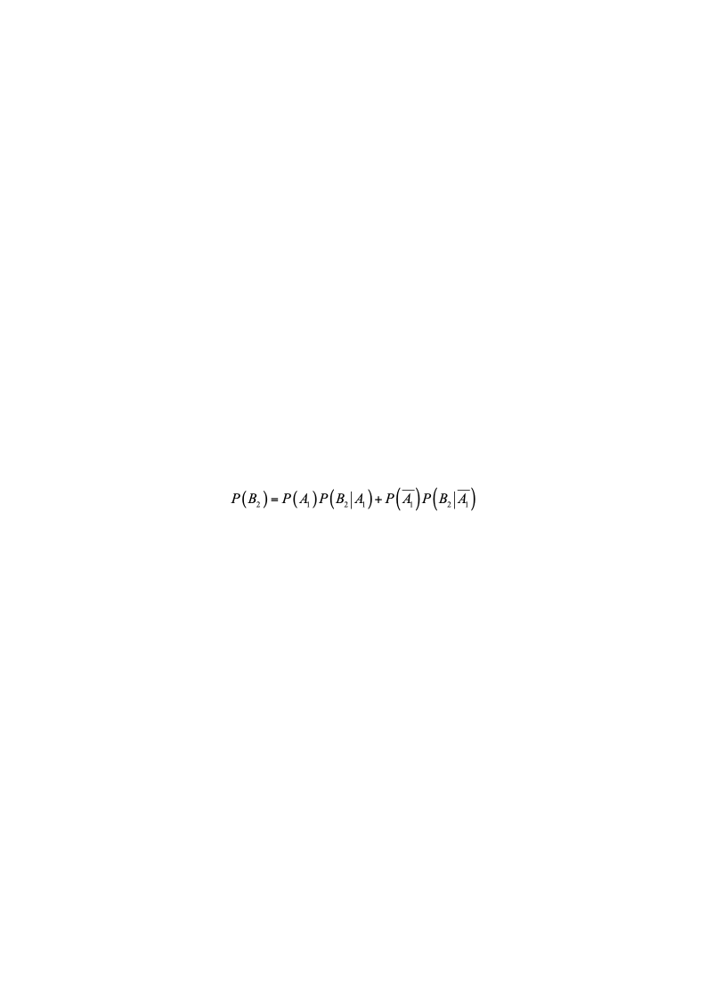
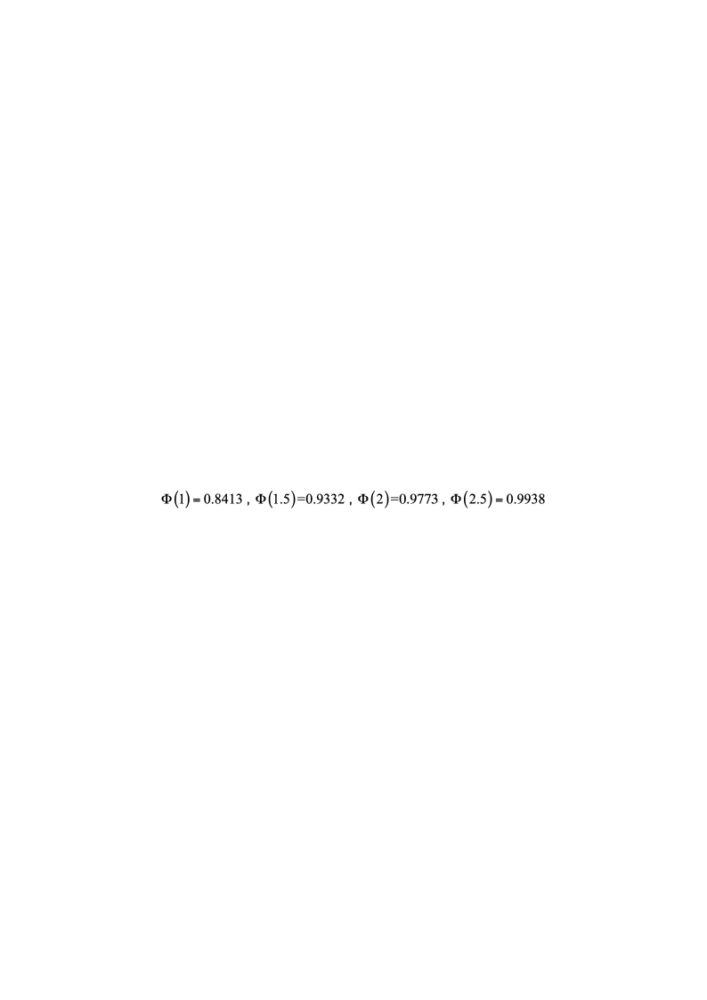
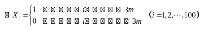
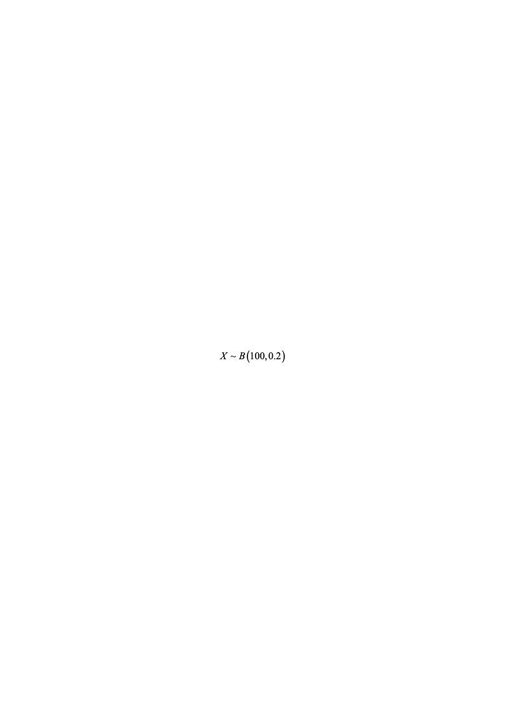
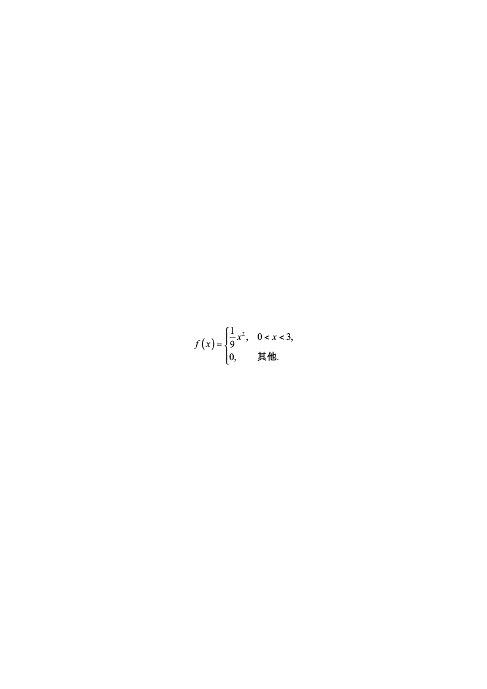
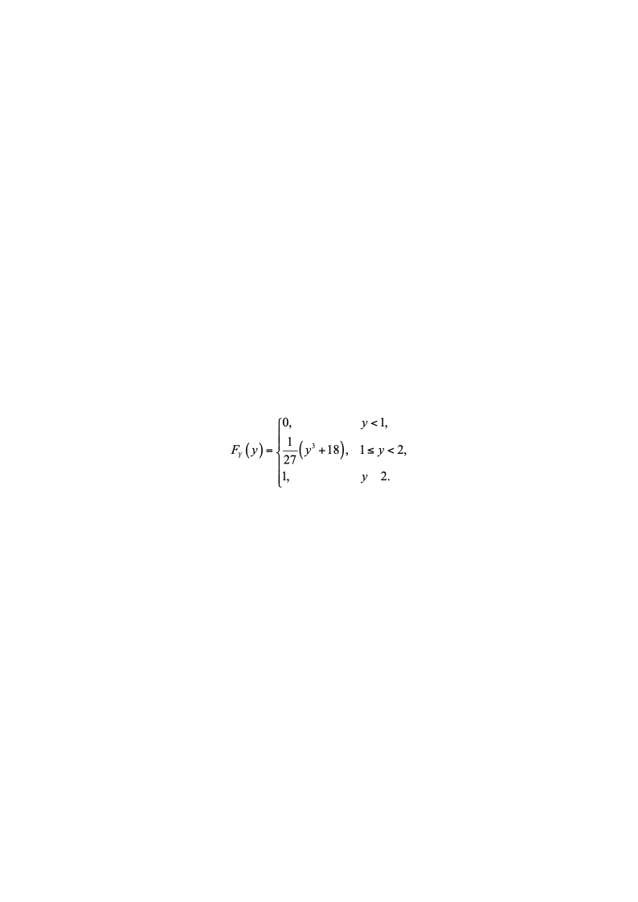
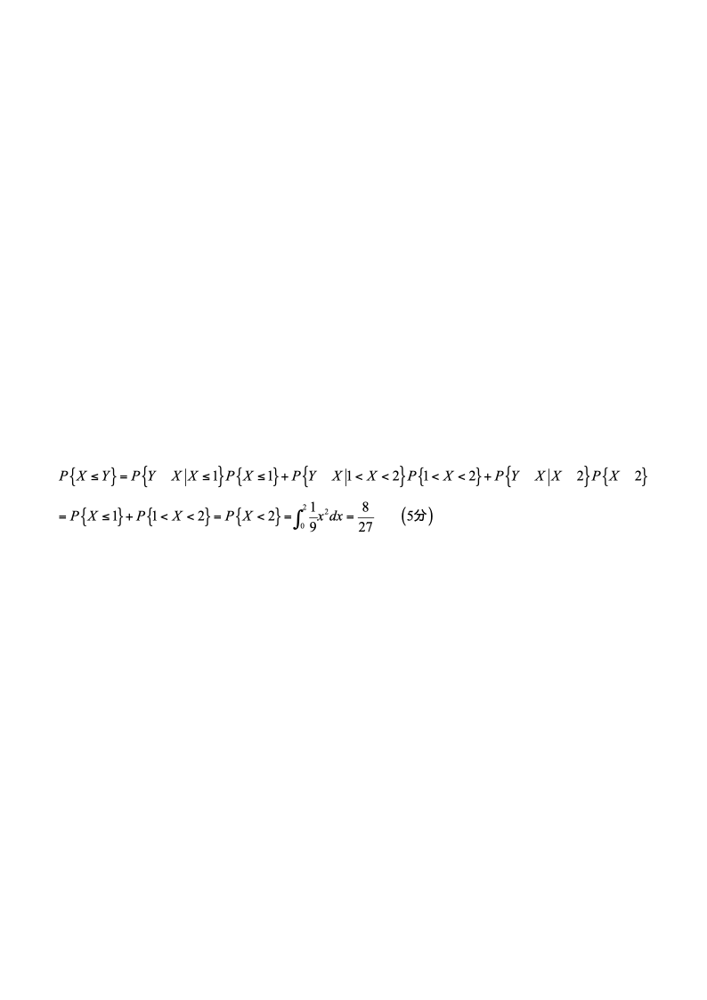
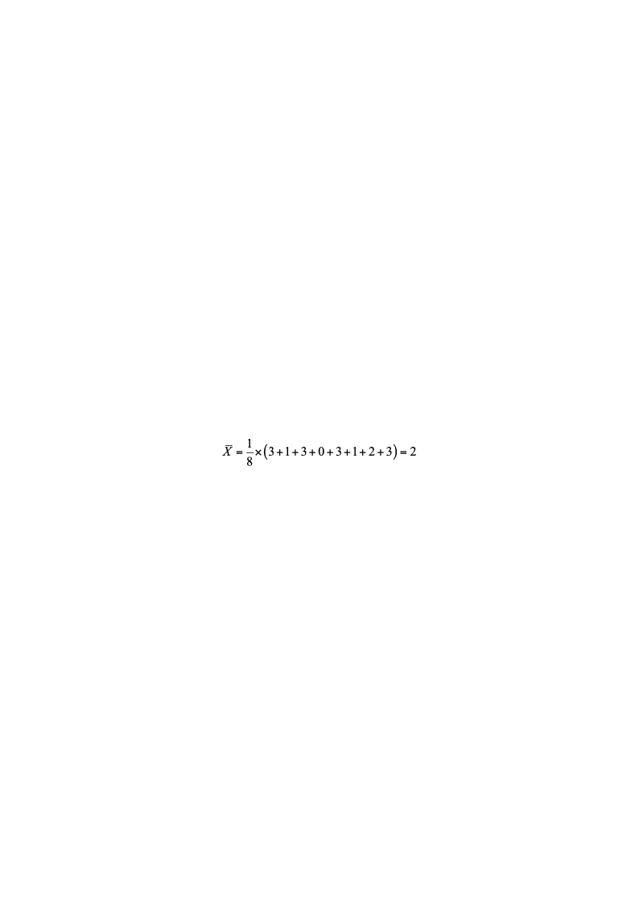
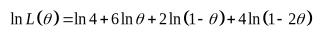
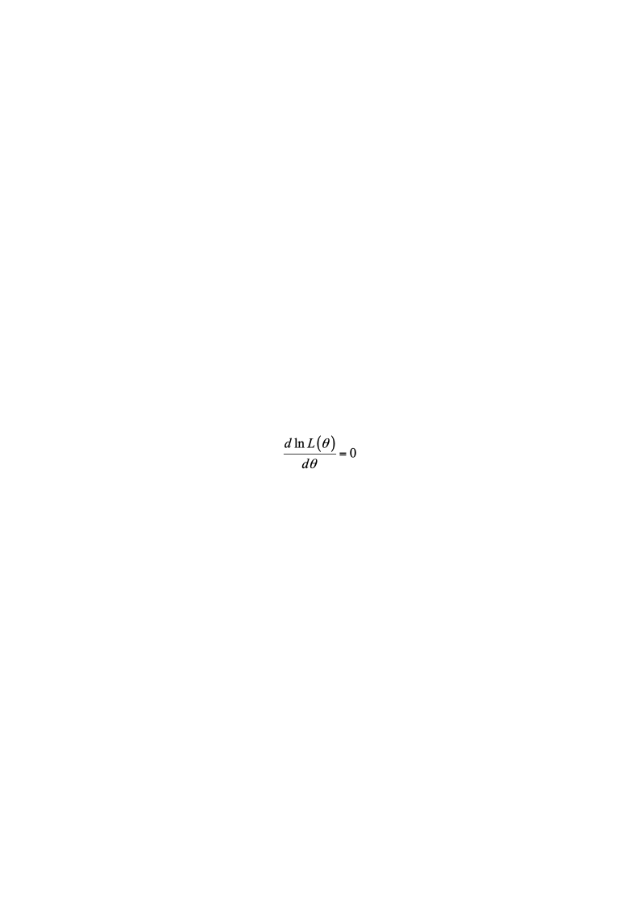

# 2020—2021学年第二学期《概率论与数理统计》A卷答案

**诚信应考，考试作弊将带来严重后果！**

**华南理工大学本科生期末考试**

**2020-2021-2学期《概率论与数理统计》试卷A**

**注意事项：1.** **所有答案请答在答题卡上，答在试卷上无效；**

**2.** **选择题请用2B铅笔涂黑；**

**3．考试形式：闭卷；**

**4. 本试卷共七道大题，满分100分，考试时间120分钟**。

| **题 号** | **一** | **二** | **三** | **四** | **五** | **六** | **七** | **总分** |
|---|---|---|---|---|---|---|---|---|
| **得 分** |  |  |  |  |  |  |  |  |

**一、选择题（共12题，每题3分，共36分）**

1. 设随机变量$X$与$Y$相互独立，且均服从区间$[0,3]$上的均匀分布，则(  ).

(A) $\frac{1}{3}$      (B)$\frac{1}{9}$      (C)  $\frac{2}{9}$      (D)  $\frac{2}{3}$

1.  B

2. 设*T*服从自由度为*n*的*t*分布，若$P\{T>\lambda\}=\alpha$，则$P\{T<-\lambda\}=$（  ）.

(A) $alpha$      (B)$\frac{\alpha}{3}$      (C)  $\frac{\alpha}{2}$      (D)  $\frac{\alpha}{4}$

2.  C

3. 从总体中抽取简单随机样本$X_1,X_2,...,X_n$，易证估计量

$$
\mu_1=\frac{1}{2}X_1+\frac{1}{3}X_2+\frac{1}{6}X_3,\quad\mu_2=\frac{1}{2}X_1+\frac{1}{4}X_2+\frac{1}{4}X_3
$$

$$
\mu_3=\frac{1}{3}X_1+\frac{1}{3}X_2+\frac{1}{3}X_3,\quad\mu_4=\frac{1}{5}X_1+\frac{2}{5}X_2+\frac{2}{5}X_3
$$

均是总体均值$mu$的无偏估计量，则其中最有效的估计量是(    ).

(A)$mu_3$      (B) $mu_1$                (C)$mu_2$                (D)$mu_4$

3.  A      有$D_{\mu_3}<D_{\mu_4}<D_{\mu_z}<D_{\mu_1}$.故$mu_3$最有效,所以A项正确.

4.  设随机变量$X$和$Y$的数学期望分别为-2和2，方差分别为1和4，而相关系数为-0.5，则根据切比雪夫不等式$P\{X+Y\leq6\}$.

(A)  $\frac{1}{4}$      (B)  $\frac{1}{10}$      (C)  $\frac{1}{12}$      (D)  $\frac{1}{8}$

4. C

**解**  因为                  $E(X+Y)=EX+EY=0$

$$
D(X+Y)=DX+DY+2cov(X,Y)
$$

$$
=1+4-2\times0.5\times2=3
$$

根据切比雪夫不等式

$$
P\{X-EX\leq\varepsilon\}\leq\frac{DX}{\varepsilon^{2}}
$$

所以                         $P\{X+Y|\leq6\}\leq\frac{3}{36}=\frac{1}{12}$

5. 设 $A\mathrm {,}B\mathrm {,}C$ 是随机事件，$A\mathrm {,}C$ 互不相容, $P(AB)=\frac{1}{2},P(C)=\frac{1}{3}$则 $P\left ( {AB\middle ∣ \hat {C}}\right )\mathrm {=( )}$.

(A) $\frac{1}{2}$      (B)$\frac{2}{5}$      (C)  $\frac{1}{3}$      (D)  $\frac{3}{4}$

$$
\mathrm {由条件概率的定义}\mathrm {,}\mathrm {}P\left ( {AB\middle ∣ \hat {C}}\right )\mathrm {=}\frac {P\left ( {AB\hat {C}}\right )} {P\left ( {\hat {C}}\right )}\mathrm {}
$$

$$
\mathrm {其中}\mathrm {}P\left ( {\hat {C}}\right )\mathrm {=1-}P\left ( {C}\right )\mathrm {=1-}\frac {\mathrm {1}} {\mathrm {3}}\mathrm {=}\frac {\mathrm {2}} {\mathrm {3}}\mathrm {}
$$

$$
P\mathrm {(}AB\hat {C}\mathrm {)=}P\mathrm {(}AB\mathrm {)-}P\mathrm {(}ABC\mathrm {)=}\frac {\mathrm {1}} {\mathrm {2}}\mathrm {-}P\mathrm {(}ABC\mathrm {)}\mathrm {}
$$

$$
\mathrm {又} ABC\mathrm {\subset }AC\mathrm {，得}\mathrm {}P\mathrm {(}ABC\mathrm {)=0}\mathrm {，}\mathrm {代入得}\mathrm {}P\left ( {AB\hat {C}}\right )\mathrm {=}\frac {\mathrm {1}} {\mathrm {2}}\mathrm {，故}P\left ( {AB\middle ∣ \hat {C}}\right )\mathrm {=}\frac {\mathrm {3}} {\mathrm {4}}.\mathrm {}
$$

5.  D    由于 $A\mathrm {,}C$ 互不相容，即 $AC\mathrm {=}\phi \mathrm {,}\mathrm {}P\mathrm {(}AC\mathrm {)=0}$ 6. 设 ${X}_{\mathrm {1}}\mathrm {,}{X}_{\mathrm {2}}\mathrm {,}{X}_{\mathrm {3}}\mathrm {,}{X}_{\mathrm {4}}$ 为来自总体 $N\left ( {\mathrm {1,}{\sigma }^{\mathrm {2}}}\right )\mathrm {(}\sigma \mathrm {>0)}$ 的简单随机样本，则统计量$\frac{X_1-X_2}{|X_3+X_4-2|}$的分布  (  $\mathrm {}$  ).  (A)  $N\mathrm {(0,1)}$      (B)  $t\mathrm {(1)}$   (C)  ${\chi }^{\mathrm {2}}\mathrm {(1)}$     (D)  $F\mathrm {(1,1)}$

$$
\frac {{X}_{\mathrm {1}}\mathrm {-}{X}_{\mathrm {2}}} {\left | {{X}_{\mathrm {3}}\mathrm {+}{X}_{\mathrm {4}}\mathrm {-2}}\right |}\mathrm {=}\frac {\frac {{X}_{\mathrm {1}}\mathrm {-}{X}_{\mathrm {2}}} {\sqrt {\mathrm {2}}\sigma }} {\sqrt {{\left ( {\frac {{X}_{\mathrm {3}}\mathrm {+}{X}_{\mathrm {4}}\mathrm {-2}} {\sqrt {\mathrm {2}}\sigma }}\right )}^{\mathrm {2}}}}\mathrm {}
$$

6.  B    解$\mathrm {:}$ 从形式上，该统计量只能服从 $t$ 分布。故选 $B$ 。 证明如下: 由正态分布的性质可知， $\frac {{X}_{\mathrm {1}}\mathrm {-}{X}_{\mathrm {2}}} {\sqrt {\mathrm {2}}\sigma }$ 与$\frac {{X}_{\mathrm {3}}\mathrm {+}{X}_{\mathrm {4}}\mathrm {-2}} {\sqrt {\mathrm {2}}\sigma }$ 均服从标准正态分布且相互独立, 可知

$$
\frac {\frac {{X}_{\mathrm {1}}\mathrm {-}{X}_{\mathrm {2}}} {\sqrt {\mathrm {2}}\sigma }} {\sqrt {{\left ( {\frac {{X}_{\mathrm {3}}\mathrm {+}{X}_{\mathrm {4}}\mathrm {-2}} {\sqrt {\mathrm {2}}\sigma }}\right )}^{\mathrm {2}}}}\sim t\left ( {\mathrm {1}}\right )
$$

7. 设随机变量 $X$ 服从参数为  1  的泊松分布，则 $P\left \{ {X\mathrm {=}E({X}^{\mathrm {2}})}\right \}\mathrm {=}$(      ).

(A) $\frac{1}{2e}$      (B)$\frac{1}{3e}$      (C)  $\frac{e}{3}$      (D)  $\frac{e}{4}$

7. A

因为 $X$ 服从参数为  1  的泊松分布，所以其概率布为

$$
E\mathrm {(}X\mathrm {)=}D\mathrm {(}X\mathrm {)=1}\mathrm {}
$$

$P\mathrm {\{}X\mathrm {=}k\mathrm {\} =}\frac {\mathrm {1}} {k\mathrm {!}}{e}^{\mathrm {-1}}\mathrm {(}k\mathrm {=0,1,2,\cdots )}$  从而 $E\left ( {{X}^{\mathrm {2}}}\right )\mathrm {=[}E\mathrm {(}X\mathrm {)}{\mathrm {]}}^{\mathrm {2}}\mathrm {+}D\mathrm {(}X\mathrm {)=2.}$ 于是，

$$
P\left \{ {X\mathrm {=}E{X}^{\mathrm {2}}}\right \}\mathrm {=}P\mathrm {\{}X\mathrm {=2\} =}\frac {{\mathrm {1}}^{\mathrm {2}}} {\mathrm {2!}}{e}^{\mathrm {-1}}\mathrm {=}\frac {\mathrm {1}} {\mathrm {2}e}
$$

8. 设 ${X}_{\mathrm {1}}\mathrm {,}{X}_{\mathrm {2}}\mathrm {,\ldots ,}{X}_{m}$ 为来自二项分布总体 $B\mathrm {(}n\mathrm {,}p\mathrm {)}$ 的简单随机样本， $\hat {X}$ 和 ${S}^{\mathrm {2}}$ 分别为样本均值和样本修正方差，记统计量$T\mathrm {=}\hat {X}\mathrm {-}{S}^{\mathrm {2}}$,  则 $E\left ( {T}\right )\mathrm {=}\left ( {\mathrm {}}\right )\mathrm {.}$

(A) $np^2$      (B)$n(1-p)^2$      (C)  $np$      (D)  $n(1-p)$

8. A

$$
\begin {matrix} E\left ( {T}\right )\mathrm {=}E\left ( {\hat {X}\mathrm {-}{S}^{\mathrm {2}}}\right )\mathrm {=}E\left ( {\hat {X}}\right )\mathrm {-}E\left ( {{S}^{\mathrm {2}}}\right )\mathrm {=}np\mathrm {-}np\left ( {\mathrm {1-}p}\right )\mathrm {=}n{p}^{\mathrm {2}} \\ \end {matrix}
$$

因为 $X\mathrm {\sim }B\left ( {n\mathrm {,}p}\right )$,  故 $E\left ( {X}\right )\mathrm {=}np\mathrm {,}D\left ( {X}\right )\mathrm {=}np\left ( {\mathrm {1-}p}\right )$ 因为 $E\left ( {\hat {X}}\right )\mathrm {=}E\left ( {X}\right )\mathrm {,}E\left ( {{S}^{\mathrm {2}}}\right )\mathrm {=}D\left ( {X}\right )$,  所以

9. 设二维离散型随机变量X、Y的联合分布律如下，则联合分布函数值$F(0,3)=$**(  ).**

| *Y* *X* | 0 | 2 | 4 |
|---|---|---|---|
| 0 | $\frac{1}{6}$ | $\frac{1}{9}$ | $\frac{1}{18}$ |
| 1 | $\frac{1}{3}$ | 0 | $\frac{1}{3}$ |

(A) $\frac{1}{3}$      (B)$\frac{5}{18}$     (C)  $\frac{2}{3}$     (D)  $\frac{4}{9}$

9.  B

10.设 ${F}_{\mathrm {1}}\mathrm {(}x\mathrm {),}{F}_{\mathrm {2}}\mathrm {(}x\mathrm {)}$ 为两个分布函数,  其相应的概率密度 ${f}_{\mathrm {1}}\mathrm {(}x\mathrm {)}$,  ${f}_{\mathrm {2}}\mathrm {(}x\mathrm {)}$ 是连续函数,  则必为概率密度的是(  $\left {\mathrm {}}\right )$

(A)  ${f}_{\mathrm {1}}\mathrm {(}x\mathrm {)}{f}_{\mathrm {2}}\mathrm {(}x\mathrm {)}$      (B)  $\mathrm {2}{f}_{\mathrm {2}}\left ( {x}\right ){F}_{\mathrm {1}}\left ( {x}\right )$     (C)  ${f}_{\mathrm {1}}\mathrm {(}x\mathrm {)}{F}_{\mathrm {2}}\mathrm {(}x\mathrm {)}$     (D)  ${f}_{\mathrm {1}}\mathrm {(}x\mathrm {)}{F}_{\mathrm {2}}\mathrm {(}x\mathrm {)+}{f}_{\mathrm {2}}\mathrm {(}x\mathrm {)}{F}_{\mathrm {1}}\mathrm {(}x\mathrm {)}$

10. D

由分布函数和概率密度的性质可得

${F}_{\mathrm {1}}^{\mathrm {'}}\mathrm {(}x\mathrm {)=}{f}_{\mathrm {1}}\mathrm {(}x\mathrm {),}{ F}_{\mathrm {2}}^{\mathrm {'}}\mathrm {(}x\mathrm {)=}{f}_{\mathrm {2}}\mathrm {(}x\mathrm {)}$,

${f}_{\mathrm {1}}\mathrm {(}x\mathrm {)}{F}_{\mathrm {2}}\mathrm {(}x\mathrm {)+}{f}_{\mathrm {2}}\mathrm {(}x\mathrm {)}{F}_{\mathrm {1}}\mathrm {(}x\mathrm {)\ge 0(-\infty <}x\mathrm {<+\infty )}$.

从而有

$$
\int _{\mathrm {-\infty }} ^{\mathrm {+\infty }} \mathrm {}\left [ {{f}_{\mathrm {1}}\mathrm {(}x\mathrm {)}{F}_{\mathrm {2}}\mathrm {(}x\mathrm {)+}{f}_{\mathrm {2}}\mathrm {(}x\mathrm {)}{F}_{\mathrm {1}}\mathrm {(}x\mathrm {)}}\right ]\mathrm {d}x\mathrm {=}\int _{\mathrm {-\infty }} ^{\mathrm {+\infty }} \mathrm {}\mathrm { d}\left [ {{F}_{\mathrm {1}}\mathrm {(}x\mathrm {)}{F}_{\mathrm {2}}\mathrm {(}x\mathrm {)}}\right ]
$$

$$
\mathrm {=}{\left [ {{F}_{\mathrm {1}}\mathrm {(}x\mathrm {)}{F}_{\mathrm {2}}\mathrm {(}x\mathrm {)}}\right ]}_{\mathrm {-\infty }}^{\mathrm {+\infty }}\mathrm {=}{F}_{\mathrm {1}}\mathrm {(+\infty )}{F}_{\mathrm {2}}\mathrm {(+\infty )-}{F}_{\mathrm {1}}\mathrm {(-\infty )}{F}_{\mathrm {2}}\mathrm {(-\infty )=1}\mathrm {}
$$

所以 ${f}_{\mathrm {1}}\mathrm {(}x\mathrm {)}{F}_{2}\mathrm {(}x\mathrm {)+}{f}_{\mathrm {2}}\mathrm {(}x\mathrm {)}{F}_{\mathrm {1}}\mathrm {(}x\mathrm {)}$ 是概率密度,即正确选项为D$\mathrm {.}$

11.  设二维随机变量 $\mathrm {(}X\mathrm {,}Y\mathrm {)}$ 服从正态分布 $N\left ( {\mu \mathrm {,}\mu \mathrm {,}{\sigma }^{\mathrm {2}}\mathrm {,}{\sigma }^{\mathrm {2}}\mathrm {,0}}\right )$,  则 $E\left ( {X{Y}^{\mathrm {2}}}\right )\mathrm {=}$(    ). (A) $mu(mu^2+sigma^2)$      (B) $\sigma(\mu^2+\sigma^2)$      (C)  $mu^2+sigma^2$      (D)  $musigma(mu^2+sigma^2)$

$$
E\mathrm {(}X\mathrm {)=}E\mathrm {(}Y\mathrm {)=}\mu \mathrm {,}\mathrm {}D\mathrm {(}X\mathrm {)=}D\mathrm {(}Y\mathrm {)=}{\sigma }^{\mathrm {2}}\mathrm {,}\mathrm {}{\rho }_{XY}\mathrm {=0}\mathrm {}
$$

11.  A 因为 $\mathrm {(}X\mathrm {,}Y\mathrm {)}$ 服从二维正态分布，所以 对二维正态随机变量$\left ( {X\mathrm {,}Y}\right )\mathrm {: }{\rho }_{XY}\mathrm {=0}$,  所以 $X\mathrm {,}Y$ 相互独立，从而 $X\mathrm {,}{Y}^{\mathrm {2}}$ 也相互独立，所以

$$
E\left ( {X{Y}^{\mathrm {2}}}\right )\mathrm {=}E\left ( {X}\right )E\left ( {{Y}^{\mathrm {2}}}\right )=E\mathrm {(}X\mathrm {)}\left \{ {D\mathrm {(}Y\mathrm {)+[}E\mathrm {(}Y\mathrm {)}{\mathrm {]}}^{\mathrm {2}}}\right \}\mathrm {=}\mu \left ( {{\sigma }^{\mathrm {2}}\mathrm {+}{\mu }^{\mathrm {2}}}\right )
$$

12.  设随机变量 $X\mathrm {\sim }N\left ( {\mathrm {0,1}}\right )\mathrm {, }Y\mathrm {\sim }N\mathrm {(1,4)}$,  且相关系数${\rho }_{XY}\mathrm {=1}$,  则(   ).  (A)  $P\mathrm {\{}Y\mathrm {=-2}X\mathrm {-1\} =1}$          (B)  $P\mathrm {\{}Y\mathrm {=2}X\mathrm {-1\} =1}$  (C)  $P\mathrm {\{}Y\mathrm {=-2}X\mathrm {+1\} =1}$        (D)  $P\mathrm {\{}Y\mathrm {=2}X\mathrm {+1\} =1}$

12.  D

因为 $X$ 与 $Y$ 的相关系数 ${\rho }_{XY}\mathrm {=1}$,  所以 $Y$与 $X$ 正相关,  即存在常数 $a\mathrm {,}b$,  使得 $Y\mathrm {=}aX\mathrm {+}b\mathrm {(}a\mathrm {>0)}$,  且 $P\mathrm {\{}Y\mathrm {=}aX\mathrm {+}b\mathrm {\} =1}$,  排除(A)、(C)  $\mathrm {.}$ 因为

$$
X\mathrm {\sim }N\mathrm {(0,1),}Y\mathrm {\sim }N\mathrm {(1,4)}
$$

所以 $E\mathrm {(}X\mathrm {)=0,}E\mathrm {(}Y\mathrm {)=1.}$ 从而

$$
\mathrm {1=}E\mathrm {(}Y\mathrm {)=}E\mathrm {(}aX\mathrm {+}b\mathrm {)=}aE\mathrm {(}X\mathrm {)+}b\mathrm {=}b
$$

**二、（10分）**甲、乙两人轮流投篮，甲先投。一般来说，甲、乙两人独立投篮的命中率分别为0.7和0.6。但由于心理因素的影响，如果对方在前一次投篮中投中，紧跟在后面投篮的这一方的命中率就会有所下降，甲、乙的命中率分别变为0.4和0.5。求：

(1) 乙在第一次投篮时投中的概率；  (2) 甲在第二次投篮时投中的概率。

解：令$A_1$表示事件“乙在第一次投篮时投中”，

令$B_i$表示事件“甲在第*i*次投篮时投中”，$i=1,2$

（1）$P(A)=P(B)P(A|B)+P(\overline{B})P(A|\overline{B})$

$=0.7\times0.5+0.3\times0.6=0.53$      (5分）

（2）$P(A)=0.53,=>P(A^c)=0.47$

$=0.53\times0.4+0.47\times0.7=0.541$      (5分)

**三、(10分)** 有一批建筑房屋用的木柱,其中80%的长度不超过3m，现从这批木柱中随机地取出100根，问其中至少有30根超过3m的概率是多少？

附：

**解**      (2分)

则,记$X=\sum_{i=1}^{100}X_i$,则.   (2分)

由棣莫佛-拉普拉斯定理得

$P\{X>30\}=1-P\{X<30\}$          (2分)

$$
=1-P\left\{\frac{X-100\times0.2}{\sqrt{100\times0.2\times0.8}}\leq\frac{30-100\times0.2}{\sqrt{100\times0.2\times0.8}}\right\}
$$

$\sim1-\Phi\left(\frac{30-20}{10\times0.4}\right)=1-\Phi(2.5)=0.0062$     (4分)

**四、(10分)** 设某机器生产的零件长度（单位：cm）$X\sim N\left ( {\mu ,{\sigma }^{2}}\right )$，今抽取容量为16的样本，测得样本均值$\hat {x}=10$，样本修正方差${s}^{*2}=0.16$.

(1) 求$\mu$ 的置信度为0.95的置信区间；(保留四位小数)

(2) 检验假设${H}_{0}: {\sigma }^{2}=0.1$（显著性水平为0.05）。

附:  $t_{0.975}(16)=2.1199,t_{0.975}(15)=2.1315,t_{0.95}(16)=1.7459,t_{0.95}(15)=1.7531$

$$
\chi_{0.975}^{2}(15)=27.488,\quad\chi_{0.975}^{2}(16)=28.845,\quad\chi_{0.025}^{2}(15)=6.262,\quad\chi_{0.025}^{2}(16)=6.908
$$

解：（1）$\mu$ 的置信度为$1-\alpha$的置信区间:

$$
\left(\overline{X}-t_{1-\frac{\alpha}{2}}(n-1)\frac{S^*}{\sqrt{n}},\quad\overline{X}+t_{1-\frac{\alpha}{2}}(n-1)\frac{S^*}{\sqrt{n}}\right)
$$

$$
X=10,S=0.4,n=16,a=0.05,t_{0.975}(15)=2.1315
$$

所以$mu$的置信度为0.95的置信区间为（9.7869，10.2132）    (5分)

(2)  ${H}_{0}: {\sigma }^{2}=0.1$

$$
\chi^2=\frac{(n-1)S^2}{\sigma_0^2}\sim\chi^2(n-1)
$$

$$
X_{0.975}^2(15)=27.488,X_{0.025}^2(15)=6.262
$$

$$
\chi^2=\frac{15\times0.16}{0.1}=24
$$

因为$X_{0.025}^2(15)<X^2=24<X_{0.975}^2(15)$，所以接受$H_0$.    (5分)

**五、（10分）**

设随机变量*X*的概率密度为 令随机变量 $Y\mathrm {=}\left \{ {\begin {matrix} \mathrm {2,} & X\mathrm {\le 1,} \\ X, & \mathrm {1<}X\mathrm {<2,} \\ \mathrm {1,} & X\mathrm {\ge 2.} \end {matrix}}\right$ (1)  求*Y*的分布函数；      (2)  求概率 $P\mathrm {\{}X\mathrm {\le }Y\mathrm {\} }$.

$$
\mathrm {=}P\mathrm {\{}X\mathrm {\ge 2\} +}P\mathrm {\{ 1<}X\mathrm {\le }y\mathrm {\} =}{\mathrm {\int }}_{\mathrm {2}}^{\mathrm {3}}\mathrm {}\frac {\mathrm {1}} {\mathrm {9}}{x}^{\mathrm {2}}dx\mathrm {+}{\mathrm {\int }}_{\mathrm {1}}^{y}\mathrm {}\frac {\mathrm {1}} {\mathrm {9}}{x}^{\mathrm {2}}dx\mathrm {}
$$

解  (1)  ${F}_{Y}\mathrm {(}y\mathrm {)=}P\mathrm {\{}Y\mathrm {\le }y\mathrm {\} }$ 由 $Y$ 的概率分布知，当 $y\mathrm {<1}$ 时， ${F}_{Y}\mathrm {(}y\mathrm {)=0}$;        (1分) 当 $y\mathrm {\ge 2}$ 时,  ${F}_{Y}\mathrm {(}y\mathrm {)=1}$;            (1分) 当 $\mathrm {1\le }y\mathrm {<2}$ 时， ${F}_{Y}\mathrm {(}y\mathrm {)=}P\mathrm {\{}Y\mathrm {\le }y\mathrm {\} =}P\mathrm {\{}Y\mathrm {=1\} +}P\mathrm {\{ 1<}Y\mathrm {\le }y\mathrm {\} =}P\mathrm {\{}Y\mathrm {=1\} +}P\mathrm {\{ 1<}X\mathrm {\le }y\mathrm {\} }$ $\mathrm {=}\frac {\mathrm {1}} {\mathrm {27}}\left ( {{y}^{\mathrm {3}}\mathrm {+18}}\right )$   (2分)

综上               (1分)

(2)

**六、(10分)** 设总体*X*的概率分布为

| *X* | 0 | 1 | 2 | 3 |
|---|---|---|---|---|
| *P* | $\theta^2$ | $2\theta(1-\theta)$ | $\theta^2$ | $1-2\theta$ |

其中$thetaleft(0<theta<frac{1}{2}right)$是未知参数，利用总体*X*的样本值：

3,  1,  3,  0,  3,  1,  2,  3.

求的矩估计和最大似然估计.

**解**        

令$3-4\hat{\theta}=2$，解得的矩估计$\hat{\theta}_M=\frac{1}{4}$.      (5分)

对于给定的样本值,似然函数为

令,解得.因不合题意,所以的最大似然估计为$\hat{\theta}_L=\frac{7-\sqrt{13}}{12}$.   (5分)

**七、(14分)**  设随机变量  $X$  与  $Y$  的概率分布分别为

<table>
<tr><td>X</td><td>0</td><td>1</td><td></td><td>Y</td><td>\mathrm {-1}</td><td>0</td><td>1</td></tr>
<tr><td>\mathbf {} P</td><td>\mathrm {1/3}</td><td>\mathrm {2/3}</td><td></td><td>P</td><td>\mathrm {1/3}</td><td>\mathrm {1/3}</td><td>\mathrm {1/3}</td></tr>
</table>

且  $P\left \{ {{X}^{\mathrm {2}}\mathrm {=}{Y}^{\mathrm {2}}}\right \}\mathrm {=1.}$
1. 求二维随机向量$\mathrm {(}X\mathrm {,}Y\mathrm {)}$  的概率分布.  (2) 求  $Z\mathrm {=}XY$  的数学期望E(*Z*).  (3) 求  $X$ 与*Y* 的相关系数$\rho_{XY}$.

解: (1) 由  $P\left \{ {{X}^{\mathrm {2}}\mathrm {=}{Y}^{\mathrm {2}}}\right \}\mathrm {=1}$  可得 $P\left \{ {{X}^{\mathrm {2}}\mathrm {\neq }{Y}^{\mathrm {2}}}\right \}\mathrm {=}P\mathrm {\{}X\mathrm {=0,}Y\mathrm {=-1\} +}P\mathrm {\{}X\mathrm {=0,}Y\mathrm {=1\} +}P\mathrm {\{}X\mathrm {=1,}Y\mathrm {=0\} =0}$   (2分)

所以

$$
P\left \{ {X\mathrm {=0,}Y\mathrm {=1}}\right \}\mathrm {=}P\left \{ {X\mathrm {=0,}Y\mathrm {=-1}}\right \}\mathrm {=}P\left \{ {X\mathrm {=1,}Y\mathrm {=0}}\right \}\mathrm {=0}\mathrm {}
$$

$$
P\left \{ {X\mathrm {=0}}\right \}\mathrm {=}P\left \{ {X\mathrm {=0,}Y\mathrm {=-1}}\right \}\mathrm {+}P\left \{ {X\mathrm {=0,}Y\mathrm {=1}}\right \}\mathrm {+}P\left \{ {X\mathrm {=0, Y=0}}\right \}\mathrm {}
$$

$$
\mathrm {\therefore }P\mathrm {\{}X\mathrm {=0,}Y\mathrm {=0\} =}\frac {\mathrm {1}} {\mathrm {3}}\mathrm {}
$$

$$
P\mathrm {\{}Y\mathrm {=-1\} =}P\mathrm {\{}X\mathrm {=0,}Y\mathrm {=-1\} +}P\mathrm {\{}X\mathrm {=1,}Y\mathrm {=-1\} }\mathrm {}
$$

$$
\mathrm {\therefore }P\mathrm {\{}X\mathrm {=1,}Y\mathrm {=-1\} =}\frac {\mathrm {1}} {\mathrm {3}}\mathrm {}
$$

$$
P\mathrm {\{}Y\mathrm {=1\} =}P\mathrm {\{}X\mathrm {=0,}Y\mathrm {=1\} +}P\mathrm {\{}X\mathrm {=1,}Y\mathrm {=1\} }\mathrm {}
$$

$$
\therefore P\mathrm {\{}X\mathrm {=1,}Y\mathrm {=1\} =}\frac {\mathrm {1}} {\mathrm {3}}\mathrm {}
$$

所以  $\mathrm {(}X\mathrm {,}Y\mathrm {)}$  的概率分布为   (4分)

<table>
<tr><td>X    Y  Y Y</td><td>-1</td><td>0</td><td>1</td></tr>
<tr><td>0</td><td>0</td><td>\mathrm {1/3}</td><td>0</td></tr>
<tr><td>1</td><td>\mathrm {1/3}</td><td>0</td><td>\mathrm {1/3}</td></tr>
</table>

(2) 因为  $Z\mathrm {=}XY$  的可能取值为  $\mathrm {-1, 0, 1}$.

$$
\begin {matrix} P\left \{ {Z\mathrm {=-1}}\right \}\mathrm {=}P\left \{ {XY\mathrm {=-1}}\right \}\mathrm {=}P\left \{ {X\mathrm {=1,}Y\mathrm {=-1}}\right \}\mathrm {=}\frac {\mathrm {1}} {\mathrm {3}} \\ P\mathrm {\{}Z\mathrm {=1\} =}P\mathrm {\{}XY\mathrm {=1\} =}P\mathrm {\{}X\mathrm {=1,}Y\mathrm {=1\} =}\frac {\mathrm {1}} {\mathrm {3}} \\ P\left \{ {Z\mathrm {=0}}\right \}\mathrm {=}P\left \{ {XY\mathrm {=0}}\right \}\mathrm {=1}\mathrm {-}\frac {\mathrm {1}} {\mathrm {3}}-\frac {\mathrm {1}} {\mathrm {3}}=\frac {\mathrm {1}} {\mathrm {3}} \end {matrix}
$$

$$
E\left ( {XY}\right )\mathrm {=}E\left ( {Z}\right )\mathrm {=}\left ( {\mathrm {-1}}\right )\mathrm {\cdot }\frac {\mathrm {1}} {\mathrm {3}}\mathrm {+0\cdot }\frac {\mathrm {1}} {\mathrm {3}}\mathrm {+1\cdot }\frac {\mathrm {1}} {\mathrm {3}}\mathrm {=0 (4}\mathrm {分}\mathrm {)} \mathrm {}
$$

$$
\begin {matrix} \left ( {3}\right ) E\mathrm {(}X\mathrm {)=0\cdot }\frac {\mathrm {1}} {\mathrm {3}}\mathrm {+1\cdot }\frac {\mathrm {2}} {\mathrm {3}}\mathrm {=}\frac {\mathrm {2}} {\mathrm {3}} \\ E\mathrm {(}Y\mathrm {)=(-1)\cdot }\frac {\mathrm {1}} {\mathrm {3}}\mathrm {+0\cdot }\frac {\mathrm {1}} {\mathrm {3}}\mathrm {+1\cdot }\frac {\mathrm {1}} {\mathrm {3}}\mathrm {=0} \end {matrix}
$$

所以  $\mathrm {Cov⁡(}X\mathrm {,}Y\mathrm {)=}E\mathrm {(}XY\mathrm {)-}E\mathrm {(}X\mathrm {)}E\mathrm {(}Y\mathrm {)=0}$, 从而可得$X$  与  $Y$  的相关系数为  ${\rho }_{XV}\mathrm {=0.}$  (4分)
