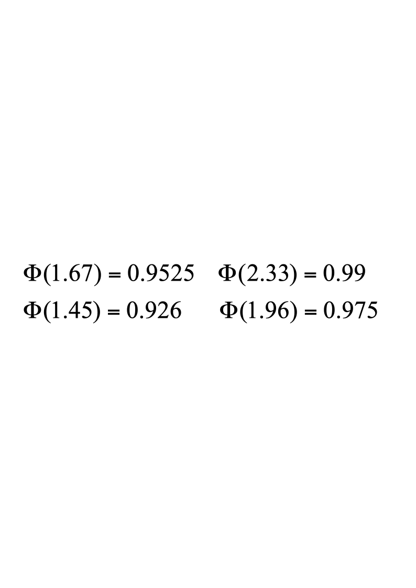
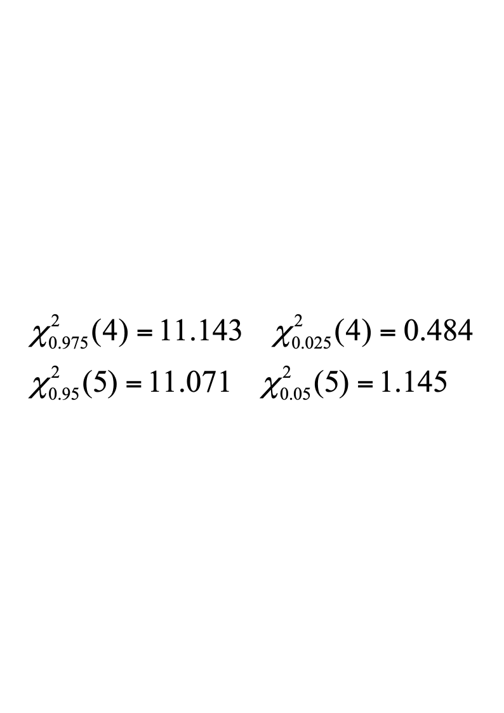
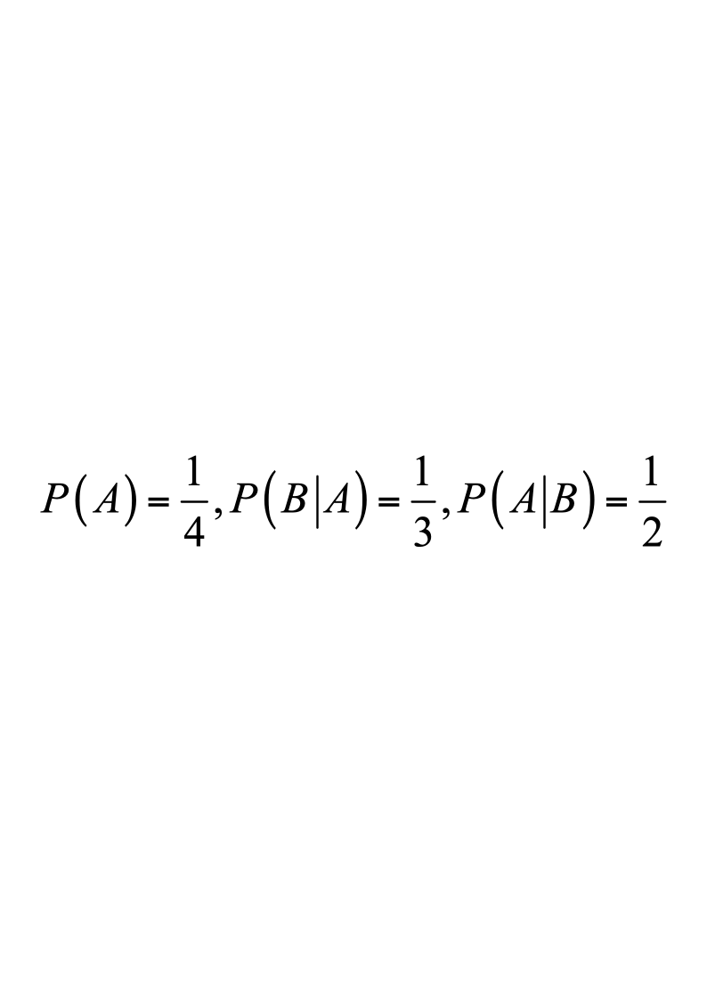
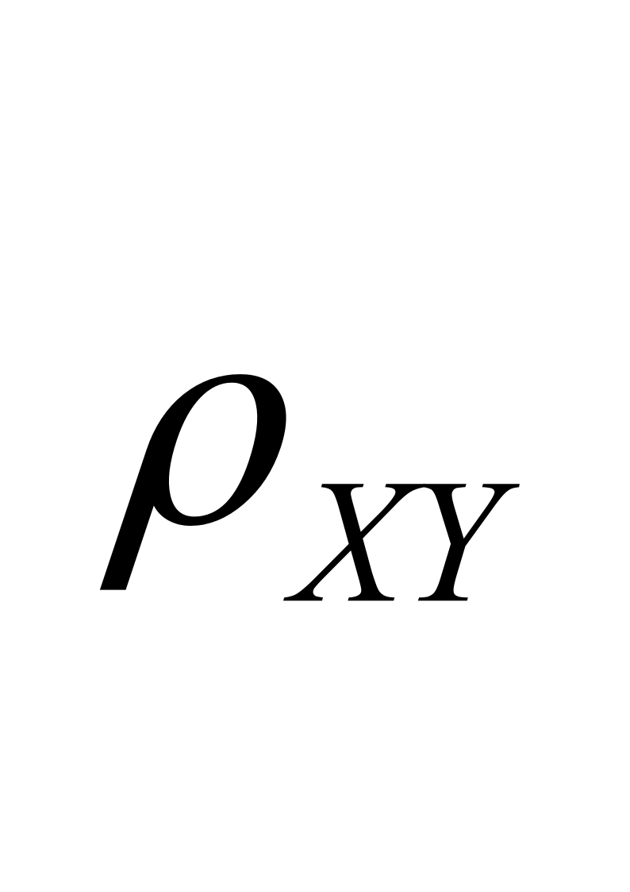
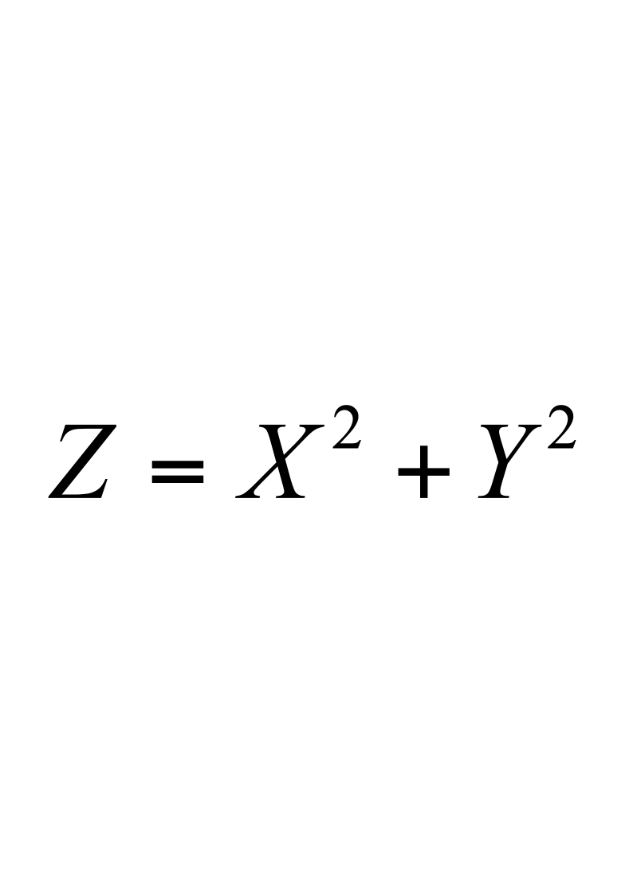
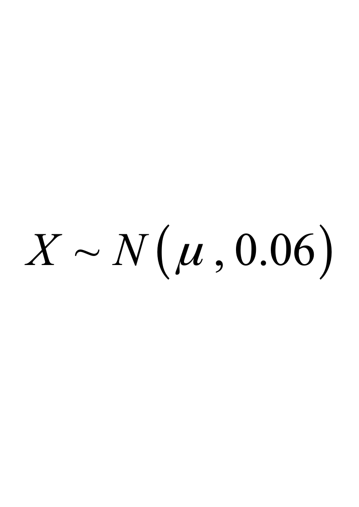
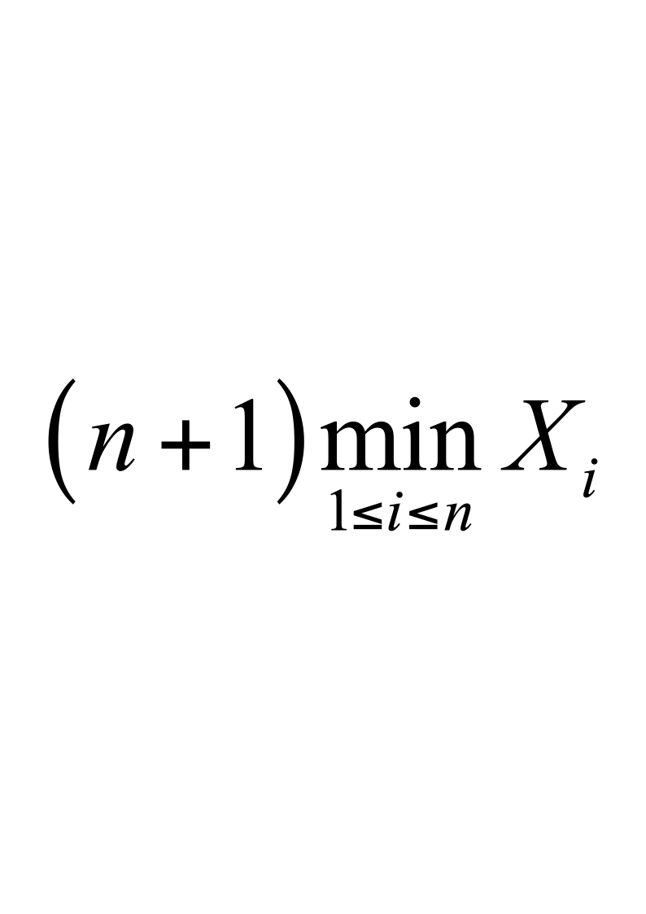

# 2014春B卷无答案

**诚信应考，考试作弊将带来严重后果！**

**华南理工大学本科生期末考试**

**《概率论与数理统计》B卷**

**注意事项：1.** **开考前请将密封线内各项信息填写清楚；**

**2.** **所有答案请直接答在试卷上；**

**3．考试形式：闭卷；**

**4.** **本试卷共八大题，满分100分，**	**考试时间120分钟**。

| **题 号** | **一** | **二** | **三** | **四** | **五** | **六** | **七** | **八** | **总分** |
|---|---|---|---|---|---|---|---|---|---|
| **得 分** |  |  |  |  |  |  |  |  |  |

**注意：** ****

$$
t_{0.975}(7)=2.3646t_{0.95}(7)=1.8946t_{0.975}(8)=2.3060t_{0.95}(8)=1.8595
$$

**一、（12分）**某城市的电话号码是8位数，首位可以是0~9,  如果从电话号码本中任指一个电话号码，求：

<!-- question: probability-theory-011-Q1 -->

(1)头两位数码都是8的概率；

<!-- question: probability-theory-011-Q2 -->

(2)头两位数码至少有一个不超过8的概率；

<!-- question: probability-theory-011-Q3 -->

(3)头两位数码不相同的概率．

**二、(10分)**某工厂由甲、乙、丙三个车间生产同一种产品,每个车间的产量分别占全厂的25%,35%,40%,  各车间产品的次品率分别为5%,4%,2%,

求：(1)全厂产品的次品率

<!-- question: probability-theory-011-Q4 -->

(2)  若任取一件产品发现是次品,此次品是甲车间生产的概率是多少？

**三、（15分）**

设、为两个随机事件,  且,令

求:(1)二维随机变量的概率分布;

(2)和的相关系数;

(3) 的概率分布.

**四、**(10分)设$P\left \{ {Y>X}\right \}$，且相互独立$P\left \{ {Y>X}\right \}$，

求:（1）分别求U,V的概率密度函数；
<!-- question: probability-theory-011-Q5 -->

1. U,V的相关系数$P\left \{ {Y>X}\right \}$；

**五、（13）**从学校乘汽车到火车站的途中有3个交通岗，假设在各个交通岗遇到红灯的事件是相互独立的，并且概率都是2/5.  设为途中遇到红灯的次数，求的分布列、分布函数、数学期望和方差.

**六、（10分）**某校有1000名学生,每人以80%的概率去图书馆自习,问图书馆至少应设多少个座位,才能以99%的概率保证去上自习的同学都有座位坐?

**七、（10分）**

(1)  已知某厂生产的滚珠直径，从某天生产的滚珠中随机抽取6个，测得滚珠直径的平均值为$x=14.95$（单位：mm），求$mu$的置信度为0.95的置信区间。

（2）某涤纶厂的生产的维尼纶的纤度（纤维的粗细程度）在正常生产的条件下，服从正态分布$N(\mu,0.048^{2})$，某日随机地抽取5根纤维，测得纤度为

1.32  ，1.55  ，1.36  ，1.40  ，1.44

问一天涤纶纤度总体X的均方差是否正常（α=0.05）**?**

**八、（20分）**  设总体$X$服从上的均匀分布, $X_1,X_2,\cdots,X_n$是来自$X$的样本.(1)求$\theta$的矩估计量$\hat{\theta}_1$;(2)求$\theta$的极大似然估计$\hat{\theta}_2$;(3)证明$\hat{\theta}_1$,$T_{1}=\frac{n+1}{n}\hat{\theta}_{2}$和$T_2=$均是$\theta$的无偏估计量;(4)证明$T_1$较$\hat{\theta}_1$和$T_2$有效.
