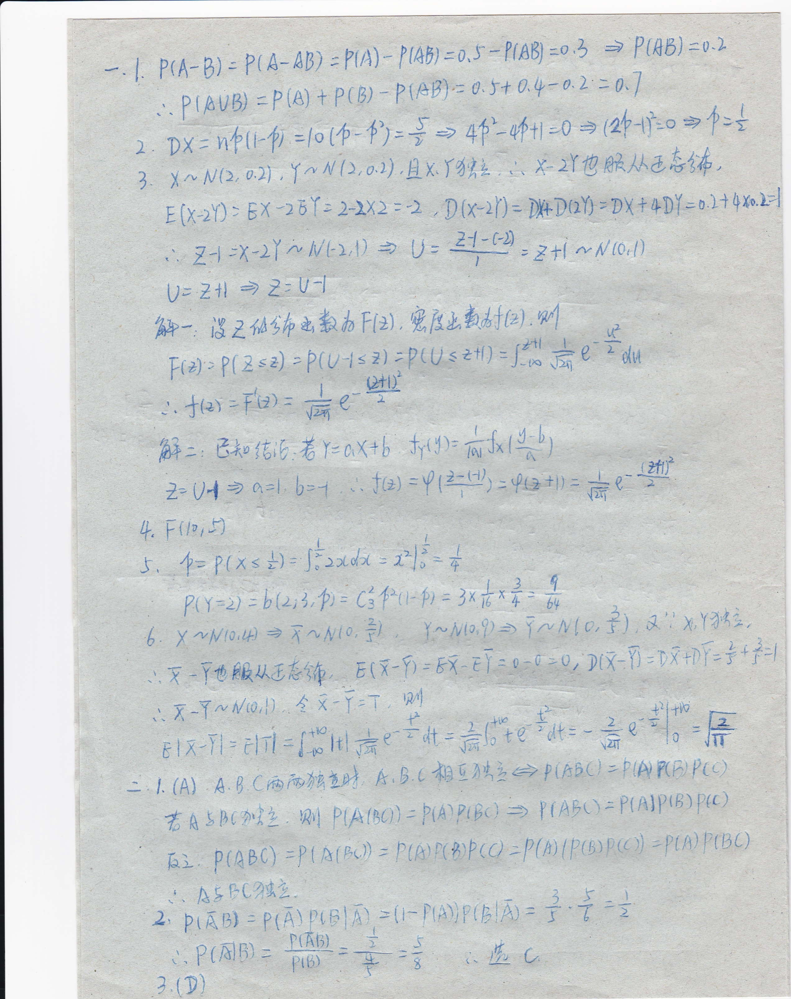
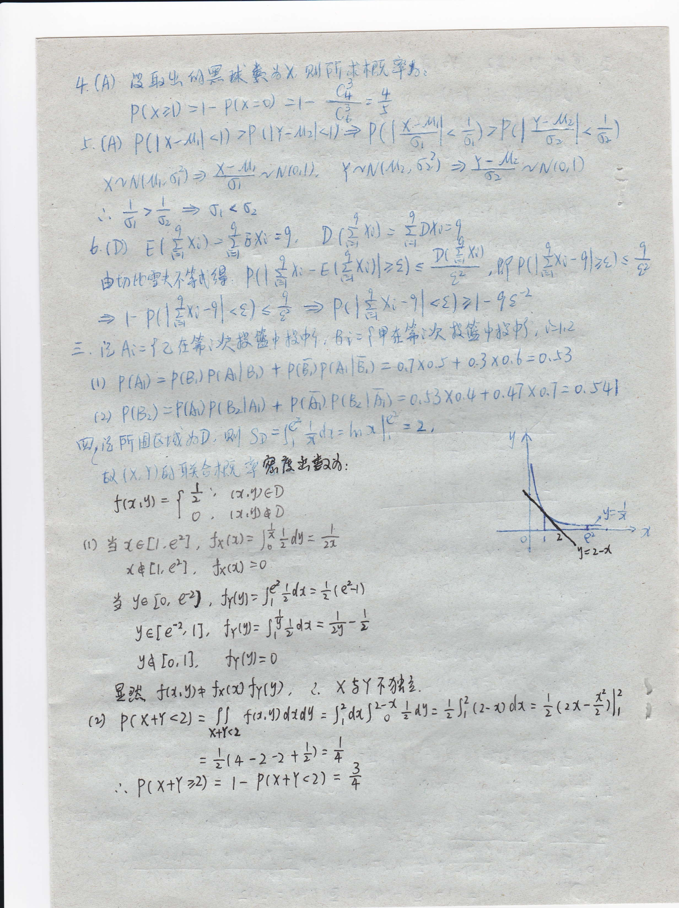
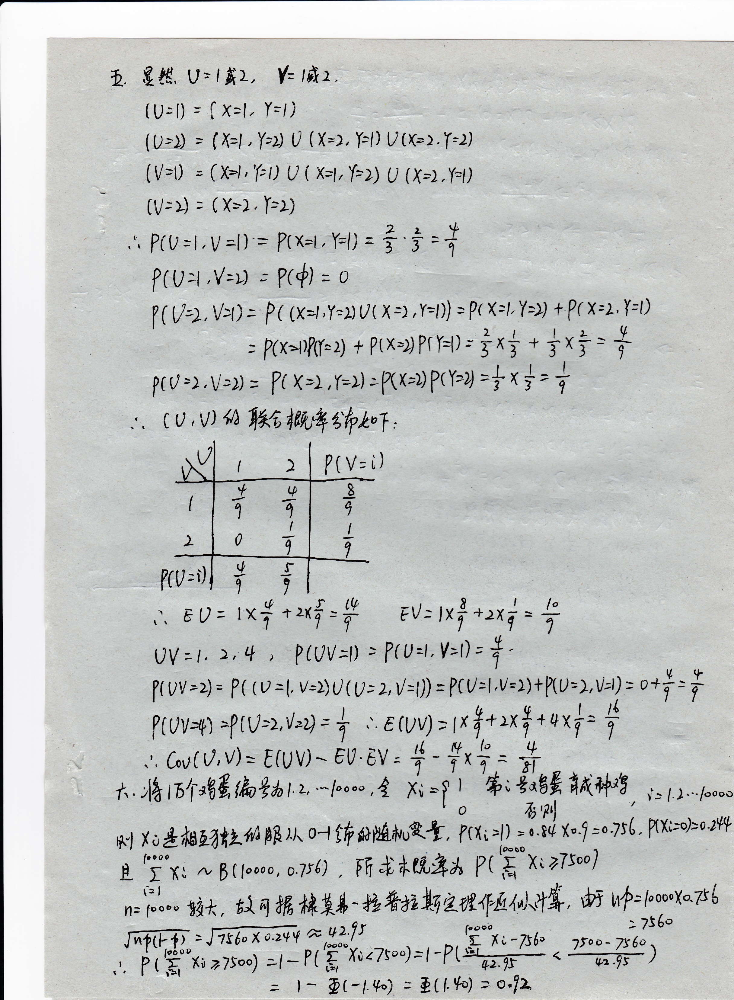
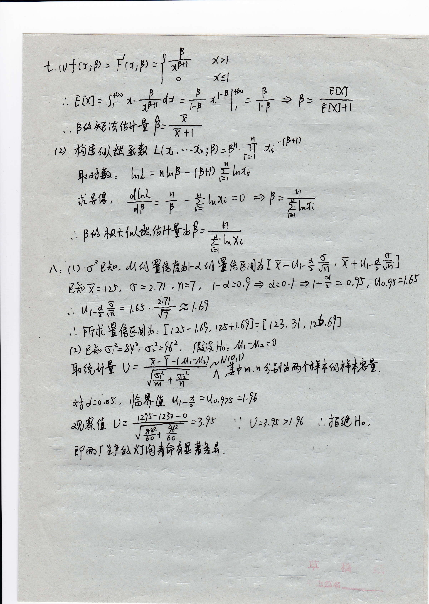

# 2015答案

<!-- page: 1 -->

'P( A-/JB),?ttl).r4lfi):0.y -l\$B)=o,b ; PUtb) =o-}
*.I P(A-A)

* P11t0)'= 0't'f 0'*-0') = 0'l.
I DX = nf tr-(t :lo (4 -'f')= + * 4f'*qf +l =o s t\$'f -ct e I ={

.'. F lhut))=Pta) t ?

,(B)

7 X* lr.lt>',, o'li ,Y * N'()'
't'L) 'E-x'Yy'AL ' "'

x'- 2I O nAl*AEt'&'

.}X) : 2 . D[X-rl) = IhDrrY) = DX++]Y=o ]-] \$xo'l'l

,'. Z-l'\-lY ^ lvl>,|):a g = Z:l:9

= Er{ ,-li{t,l}

l), Ztt + Z' U -l

x,,\tr'|,i,

?t2
rli=f.if=l

<!-- page: 2 -->

*r,* -{li
'.
g#, trr,u,t+ Jrcrl finl , t. X 5Y Ttt^L
O f r x+r .z) =j,t, 6,',,o dtdl , )id*)*l +tl= +Jl Q-o olr' =

= +, + -z-, + ll = / 2
.'. Pf xtl 272) = l- P(x+Y'D = i

<!-- page: 3 -->

h- &.#, u= l*'1, Y= tilt -

IU=t) = [X=|, y=l)

(0,D = (\=l ,'hL) 0 (X4,Y,l) V(v>,T))

( V=l) " ( X=l , '(,1) U ( X=1, Y=>) U (X4 ,Y=l)

tVrD : (X=) .Y=>)

.''. Pf l) =l ,V =l) = ?tx=l , Y'l) = ; i = +

?rurt ,V=D ' lC{) = o

I U,l, Vrt) . P ( (x=l ,Y=L)U( x --) ,Y --D) = lt x=LY) + lr x=t' Y'l)

: l(x;tl(bt) + ?tx,2Prl=ll ' ixi -t +'i = +

l(u ),14) =7( y"=) ,y=L) >llx=>)l{Y=D =* x + = +

tt) ,V 1/) WtiRq€f*,T,

Ptv= l)

J

I
q
!

Ll
1
I

(

1

)

0

?
9J
17

= r*# * rxf = f
EV: tri *rr; = +
>, +, Pil)V=D' P(U=:'V=O = +'

= P( tu=1. v=>)t)(tJ=),/=l) =l,1)=l,v=))lllr)=1,U)= o*f =f

.,.&u(t),v)=E[UV)-6U.6V= i f*f,= # -,
r, )* ff>/s*\$\$rlo\$trt t,'^loooo ,1 xr =f | *, ni?r&ln++':s , i-- / ). /oooo

Fl X a&iAbtrlZtttp\$)./. oetfrfiifit&t, ftX;=l) = ''i'l x''7 =o'7r['fiX;,.o)>o't'(9

; Ti, l" urroooo, oti() , ffr t+tf"4A P('E;" xtz.soo)

t.l

rrr-- roooo ta+, A q ff6 *thh ^ *L **Lfu AflL4?fr'iil'lh,'fr uf' l'oi'x"'7s I
W"=
,ti.,X,:
r:"
:716"

.', F( E l;,v7soo) =l-?({-Xt'7s")-- '-"'EU!;''i-"t' '4#l

= l- Qt-t.V") =\$(l.h)=o.Xz

<!-- page: 4 -->

dll
=l#
l"
*..t,)i Q;Pt = frrr,Yl

>{.zl

.,Eixl'JI ^#dt=#-'uf =k + P= #ffi

.'.p4tWtt,$+l$ P=#
(L) qre.#,tAh,tA L&,---1, )p),?' !,7'-t'P+tt

w+D tl"*

\,*lh,
l.*{*,

t^L = nl^F
d6f-L
dP- P

tlrXt =o a

p=./l,,-i

t'=l

lE{

,' p 1h tet<iil..*{6n+-b\,

* hx.
tll

,\, ( r) 6' e+,,.;^t,[S6ktlA +4\$f"gAil, LX - Ur *fi ' f I ilr+fr]

g*r[r lf, O --:.7/ , [=7 ,
l- d--0.! + d.o./ + l-* = ,,F , blo.J\=l'6Y

s'_
-.-
Uh

tlp

t r-*

!',

l.6J

t 6?l= [ r*'

rt

)l , n0,blJ

&t

rfrt

tlrS

EA

t.

tai

Tft

.

tlh il, =0

fi,,

,lu

li ,
tp
,4

tr)

S,t=
\$r

=)

Yt, ,

Ho,
,,M

+

i:l " ^ 4rtt

re/rtrf;|fi*4*nb,

u

w

{fr,4

t?v

,*

A

*| J.o.,r , ,lhPrr lL ar* > (o.fzs

=l,l\$
',' U'?'7r >l'ru

aw\$ u=)H#4?s

: , tstt, H, .

elht t?txffi0 hqh&h?,4

