# 2018春季A卷答案

**诚信应考，考试作弊将带来严重后果！**

**华南理工大学本科生期末考试**

**2017-2018学年第二学期《概率论与数理统计》A卷**

**注意事项：1.** **开考前请将密封线内各项信息填写清楚；**

**2.** **所有答案请直接答在试卷上；**

**3．考试形式：闭卷；**

**4.** **本试卷共八大题，满分100分，考试时间120分钟**。

| **题 号** | **一** | **二** | **三** | **四** | **五** | **六** | **七** | **八** | **总分** |
|---|---|---|---|---|---|---|---|---|---|
| **得 分** |  |  |  |  |  |  |  |  |  |

可能用到的表值：

$$
\Phi (1.285)=0.9, \Phi (1.645)=0.95 , \Phi (1.96)=0.975, \Phi (2.33)=0.99
$$

$$
{t}_{0.025}(35)=2.0301, {t}_{0.025}(36)=2.0281 , {t}_{0.05}(35)=1.6896, {t}_{0.05}(36)=1.6883
$$

**一、 填空题（每小题3分，共18分）**

1.  设袋中有红、白、黑球个1个，从中有放回地取球，每次取1个，直到三种颜色的求都取到时停止，则取球次数恰好为4的概率为_______________.

2.  设随机变量*X*的概率密度为$f(x)=\left \{ {\begin {matrix} {Ax}^{2} & 0\le x\le 1 \\ 0 & 其它 \end {matrix}}\right$,  则$A$=       .

3. 设${X}_{1},{X}_{2},...,{X}_{n}$独立同分布，${X}_{1}\sim B(1,p)$，则$P(\overline {X}=k/n)=$________.

4. 设连续随机变量$X$的密度函数满足$f(x)=f(-x)$，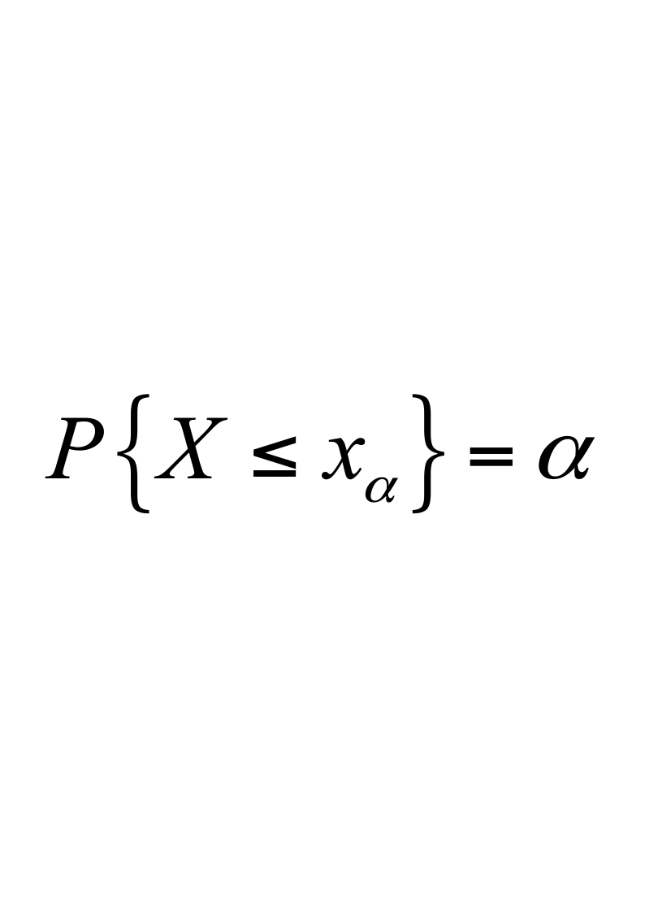，则$P( \left | { X }\right |>{x}_{\alpha } )=$________。

5.  设总体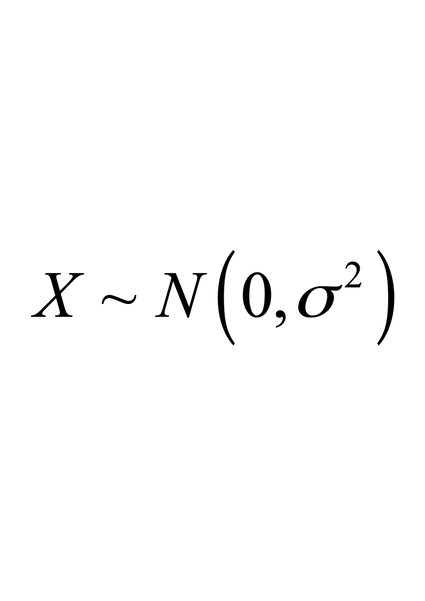,$X_1,X_2,\cdots,X_6$是来自$X$的简单随机样本，设

$$
Y=\left(X_1+X_2+X_3\right)^2+\left(X_4+X_5+X_6\right)^2
$$

则当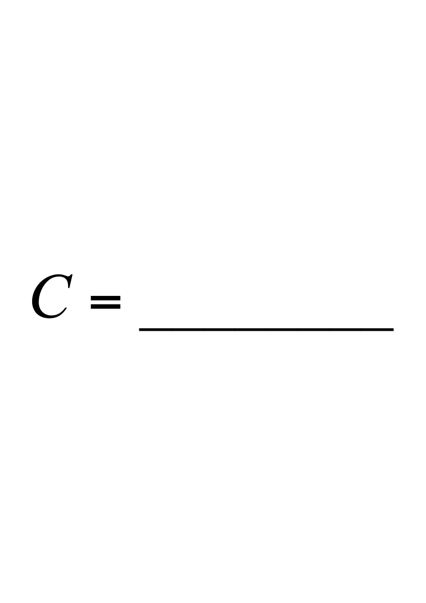时, $CY\sim\chi^2(2)$..

..

<!-- question: probability-theory-015-Q1 -->

6.  设二维离散型随机变量$(X,Y)$的分布列为

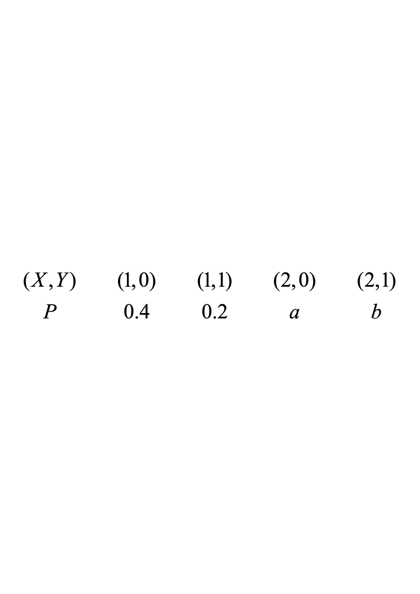

若$E(XY)=0.8$，$a$=        。

**1.** **$\frac{2}{9}$**  **2.** 3  3**.** ${C}_{n}^{k}{p}^{k}(1-p{)}^{n-k}$  4.  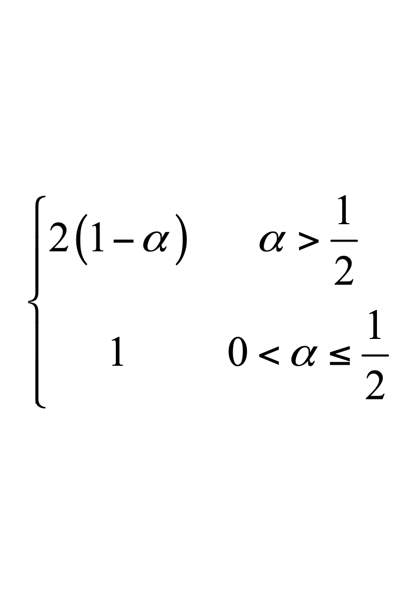  5. $\frac{1}{3\sigma^2}$    6. 0.1

**二、单项选择题（每小题3分，共18分）**

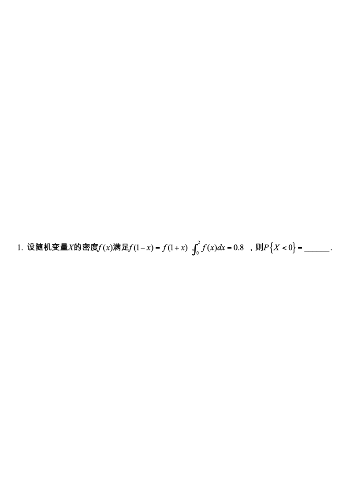(A)  0.5         (B)  0.2         (C)  0.1        (D)  0.4

2.  设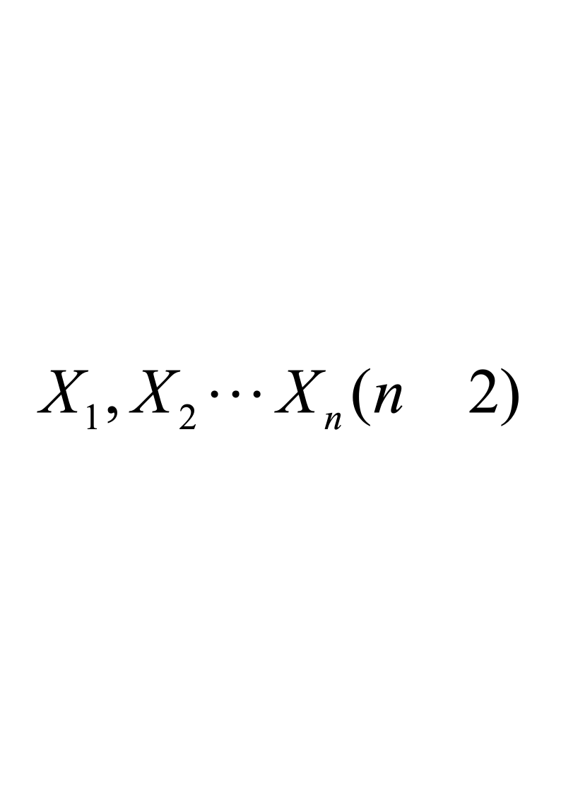为来自总体$N(\mu,1)$的简单随即样本，记$\overline{X}=\frac{1}{n}\sum_{i=1}^{n}X_i$，则下列结论中不正确的是

（A）$\sum_{i=1}^{n}(X_i-\mu)^2$服从$x^2$分布                  （B）$2(X_n-X_1)^2$服从$x^2$分布

（C）$n\sum_{i=1}^{n}(X_i-\overline{X})^2$服从$x^2$分布                  （D）$n(\overline{X}-\mu)^2$服从$x^2$分布

**3.** 设随机变量$X$服从$N(\mu,\sigma^{2})(\sigma>0),$记$p=P\{X\leq\mu+\sigma^2\}.$则（   ）

$(A)p$随着$mu$增加而增加                      $(B)p$随着$\sigma$增加而增加

$(C)p$随着$mu$增加而减少                      $(D)p$随着$\sigma$增加而减少

**4.**  随机试验$E$有三种两两不相容的结果$A_1,A_2,A_3,$且三种结果发生的概率均为$\frac{1}{3}$，将试验$E$独立重复做两次，$X$表示2次试验中结果$A_1$发生的次数，表示两次试验中结果$A_2$发生的次数，则$X$与的相关系数为（    ）

$\left(A\right)^{\frac{1}{3}}$     $(B)-\frac{1}{3}$     $(C)-\frac{1}{2}$      $D\frac{1}{2}$

**5.** 设为两个随机事件，且$0<P(A)<1,0<P(B)<1$,如果$P(A|B)=1$,则

（A）$P\left(\overline{B}|\overline{A}\right)=1$        （B）$P(A|B)=0$    （C）  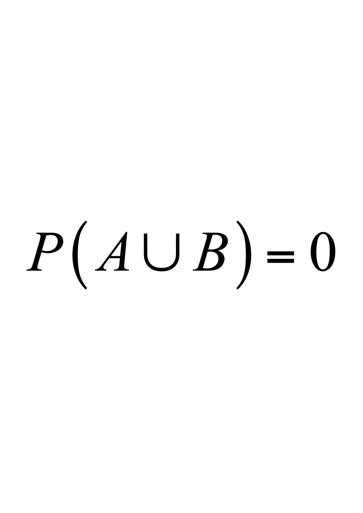      （D）  $P(B|A)=1$

<!-- question: probability-theory-015-Q2 -->

6．设随机变量$\xi$的数学期望$E\xi=\mu$，方差$D\xi=\sigma^{2}$，则由车贝雪夫不等式

$P\left(\left|\xi-\mu\right|3\sigma\right)\leq$ ____ 。

（A）$\frac{1}{3}$        （B）$\frac{1}{\sqrt{3}}$    （C）  $\frac{1}{6}$      （D）  $\frac{1}{9}$

<!-- question: probability-theory-015-Q3 -->

1.C  2.B   3.B   4.C        5. A   6. D

**三、（10分）**一个盒子中装有4个白球、6个红球，现投掷一枚均匀的骰子，骰子投掷出几点就从盒中无放回地取几个球。试求：

<!-- question: probability-theory-015-Q4 -->

（1）所取的全是白球的概率。

<!-- question: probability-theory-015-Q5 -->

（2）如果已知取出的都是白球，那么骰子所掷的点数恰为3的概率是多少？

解（1）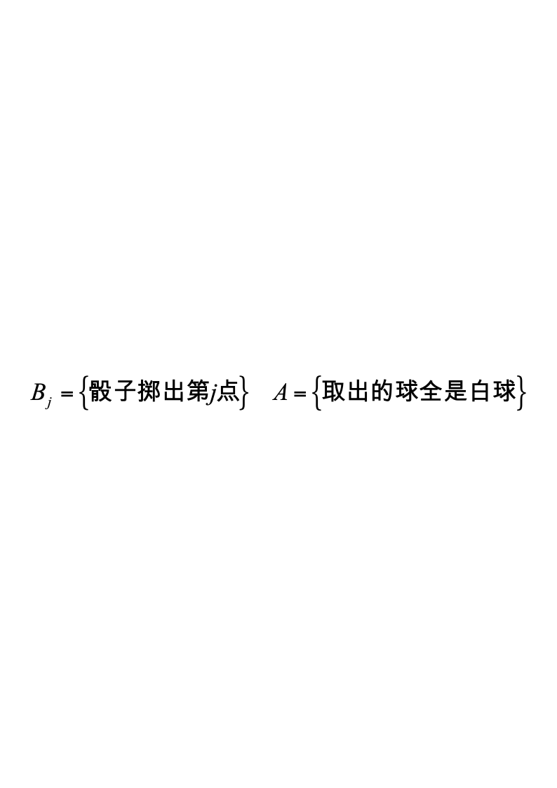 （1分）

$P({B}_{j})=1/6$，$P(A|{B}_{j})=\left \{ {\begin {matrix} \frac {{C}_{4}^{j}} {{C}_{10}^{j}}, & j\le 4 \\ 0, & j>4 \end {matrix}}\right$     （3分）

$P(A)=\sum _{j} P({B}_{j})P(A|{B}_{j})$=2/21=0.095   （3分）

（2）$P({B}_{3}|A)=\frac {P({B}_{3})P(A|{B}_{3})} {P(A)}$=7/120=0.058   （3分）

**四、（10分）**某工程师为了解一台天平的精度，用该天平对一物体的质量做*n*次测量，该物体的质量$mu$是已知的，设*n*次测量结果$X_1,X_2,\ldots,X_n$  相互独立且均服从正态分布$n(\mu,\sigma^2)$。该工程师记录的是*n*次测量的绝对误差$Z_i=|X_i-\mu|(i=1,2,\cdots,n)$，利用$\zeta_1$ , $z_2$,…$z_n$估计$\sigma$。

<!-- question: probability-theory-015-Q6 -->

（1）求$z_i$的概率密度；

<!-- question: probability-theory-015-Q7 -->

（2）利用一阶矩求$\sigma$的矩估计量。

解（1）因为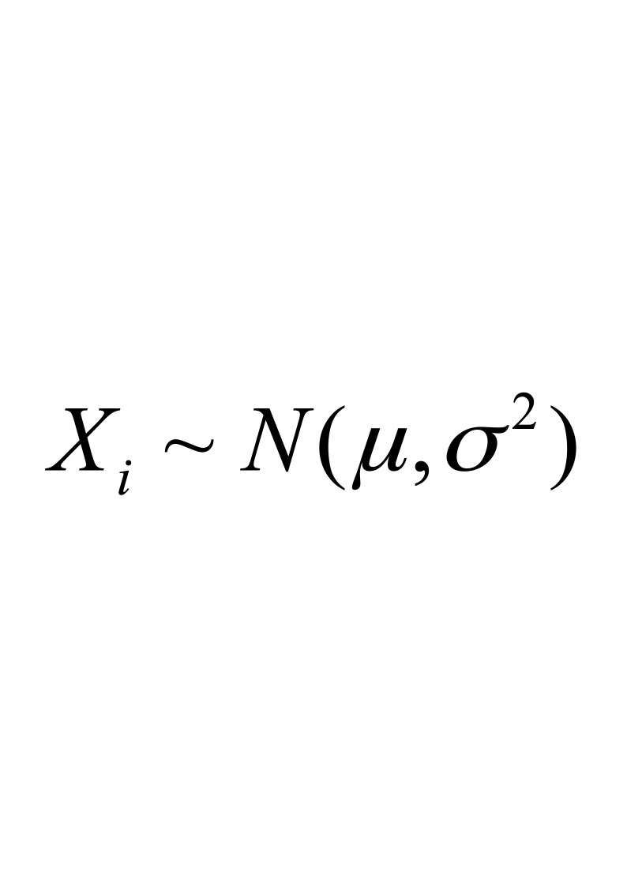，所以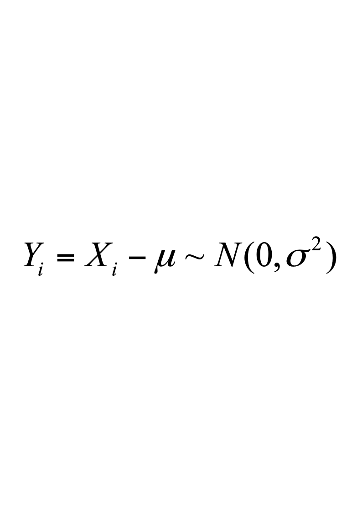，对应的概率密度为$f_{Y}(y)=\frac{1}{\sqrt{2\pi}\sigma}e^{-\frac{y^{2}}{2\sigma^{2}}}$，设$Z_i$的分布函数为$F(z)$，对应的概率密度为$f(z)$。

当$z<0$时，$F(z)=0$；（1分）

当$zO$时，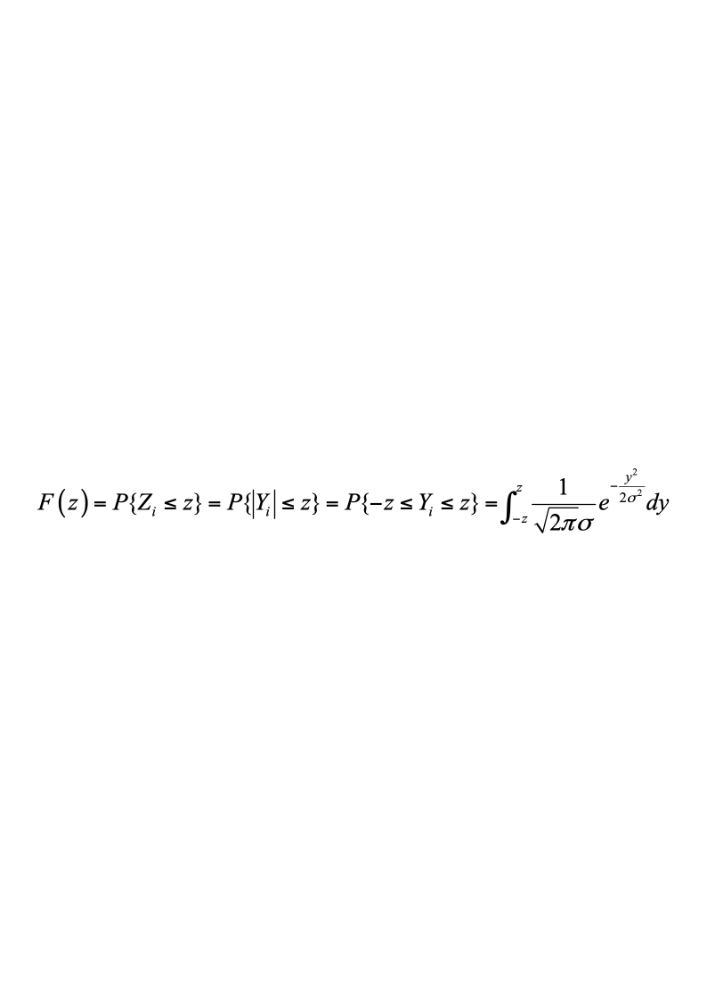；（3分）

则$Z_i$的概率密度为$f(z)=F'(z)=\begin{cases}\frac{2}{\sqrt{2\pi}\sigma}e^{-\frac{z^2}{2\sigma^2}},&z>0\\0,&z\leq0\end{cases}$；（1分）

（2）因为$EZ_{i}=\int_{0}^{+\infty}z\frac{2}{\sqrt{2\pi}\sigma}e^{-\frac{z^{2}}{2\sigma^{2}}}dz=\frac{2\sigma}{\sqrt{2\pi}}$，（3分）

所以$\sigma=\sqrt{\frac{\pi}{2}}EZ_i$，（1分）

从而$\sigma$的矩估计量为$\sigma=\sqrt{\frac{\pi}{2}}\frac{1}{n}\sum_{i=1}^{n}Z_i$   （1分）

**五、(12分)**设随机变量*X*的概率分布为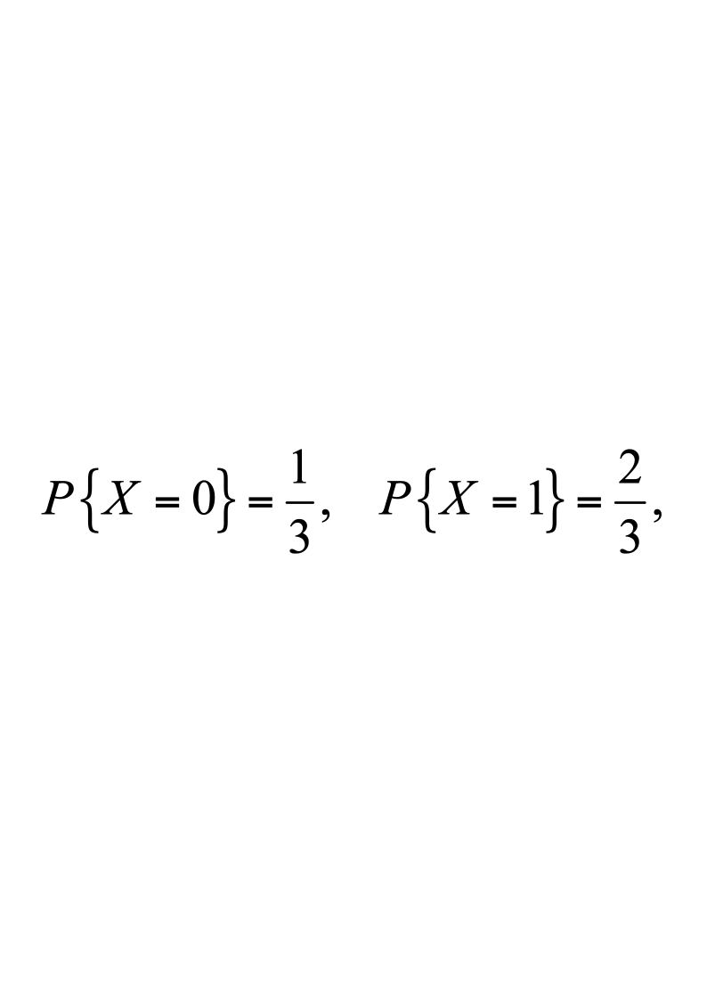*Y*的概率分布为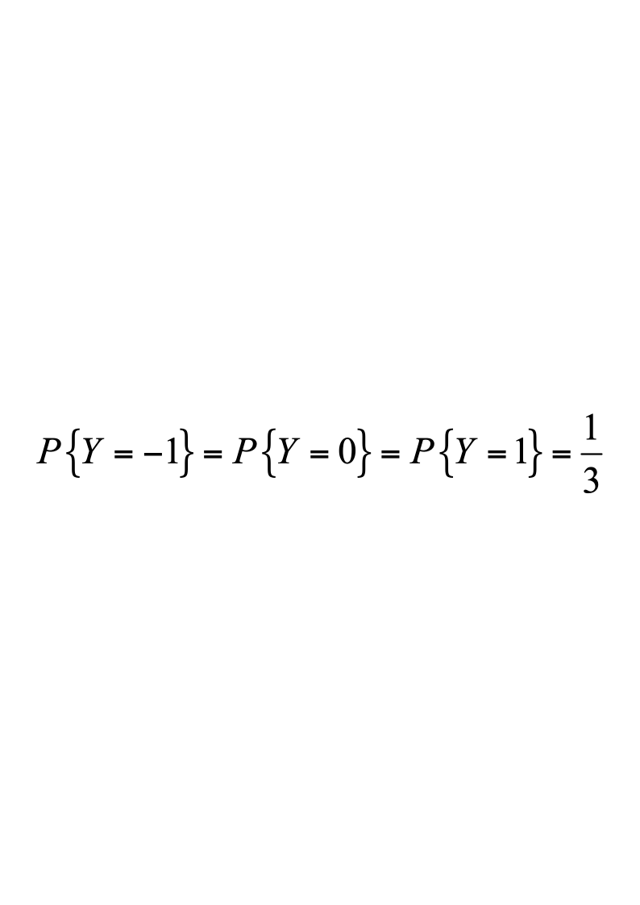，且$P\left\{X^{2}=Y^{2}\right\}=1$。

<!-- question: probability-theory-015-Q8 -->

（1）求二维随机变量（*X*,*Y*）的概率分布。

<!-- question: probability-theory-015-Q9 -->

（2）求*Z*=*XY*的概率分布。

<!-- question: probability-theory-015-Q10 -->

（3）求*X*与*Y*的相关系数。

**解：**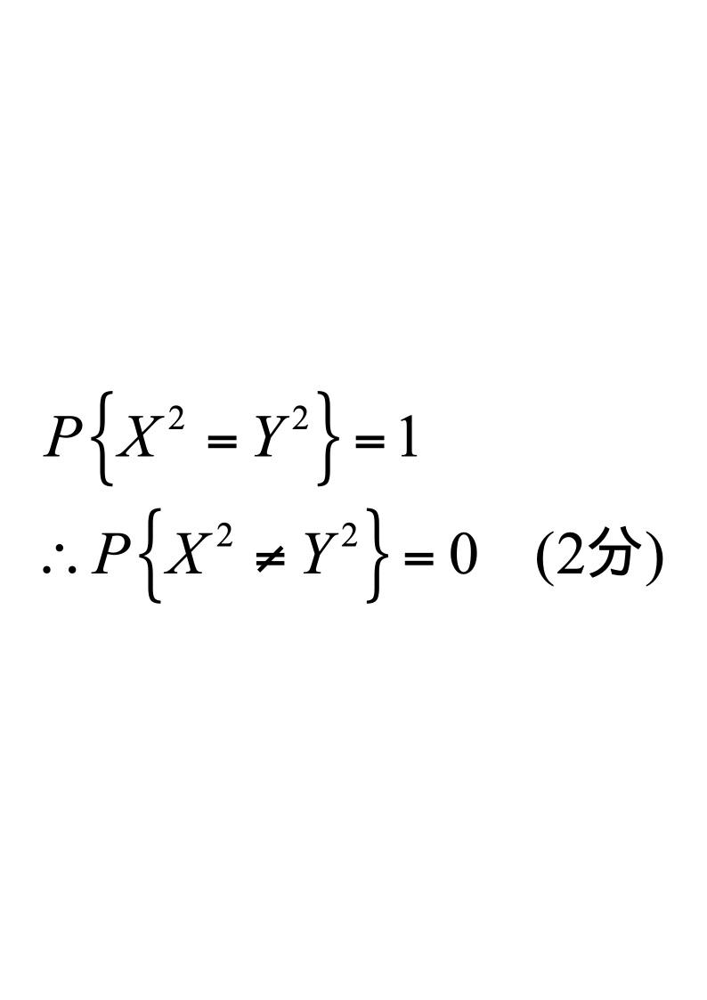

| X                    Y | -1 | 0 | 1 |  |
|---|---|---|---|---|
| 0 | 0 | 1/3 | 0 | 1/3 |
| 1 | 1/3 | 0 | 1/3 | 2/3 |
|  | 1/3 | 1/3 | 1/3 |  |

（2分）

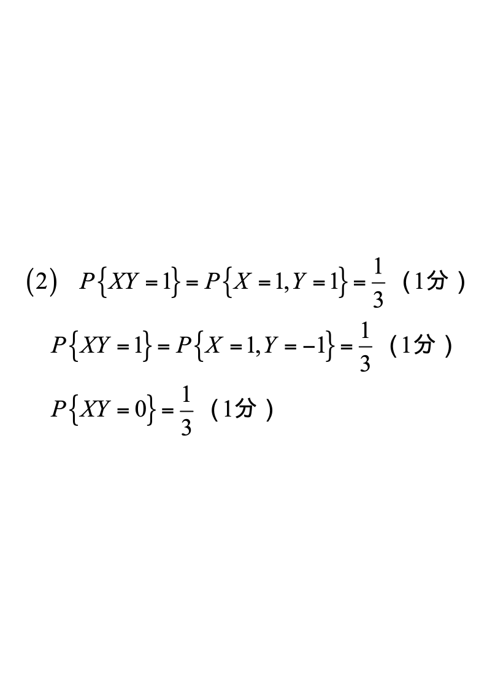

| Z | -1 | 0 | 1 |
|---|---|---|---|
| P | 1/3 | 1/3 | 1/3 |

（1分）

$$
(3)E(X)=\frac{2}{3},E(Y)=0,D(X)=\frac{2}{9},D(Y)=\frac{2}{3},E(XY)=0,\rho_{XY}=0
$$

**六、（10）**假设一条生产线生产的产品合格率是0.8.要使一批产品的合格率达到在76%与84%之间的概率不小于90%，使用中心极限定理推断这批产品至少要生产多少件？

$$
\Phi(3)=0.9987\quad\Phi(1.25)=0.894\quad\Phi(1.645)=0.95\quad\Phi(1.33)=0.908
$$

**解：**  设这批产品至少要生产n件。令

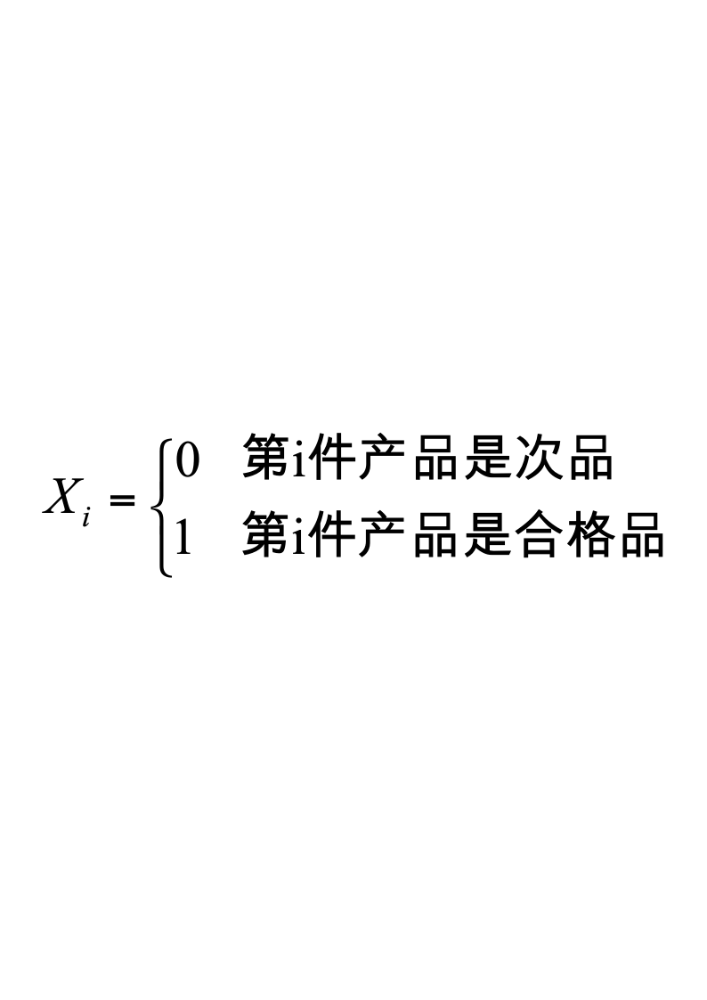  （2分）

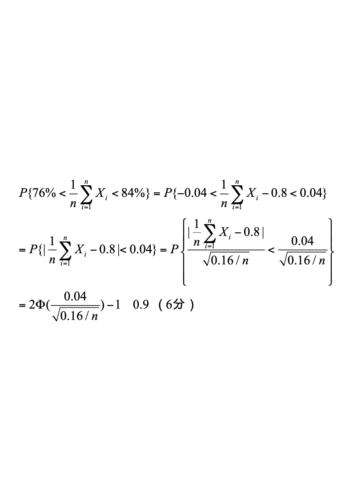

$\frac {0.04} {\sqrt {0.16/n}}\ge 1.645$，$n\ge 270.6025$   （2分）

这批产品至少要生产271件

**七、(10分)** 设某次概率统计考试考生的成绩$X\sim N(\mu ,{\sigma }^{2})$，从中随机地抽取  36  位考生的成绩，算得平均成绩为$\overline {x}=$66.5分，修正方差为$S^{*2}=225$分.

<!-- question: probability-theory-015-Q11 -->

(1)在置信度为0.95时，求出学生成绩数学期望$\mu$的置信区间。

<!-- question: probability-theory-015-Q12 -->

(2)在显著性水平$\alpha$=0.05下，检验是否可以认为这次考试的平均成绩为70分。

$$
t_{0.975}(35)=2.0301,t_{0.975}(36)=2.0281,t_{0.95}(35)=1.6896,t_{0.95}(36)=1.6883
$$

**解：**（1）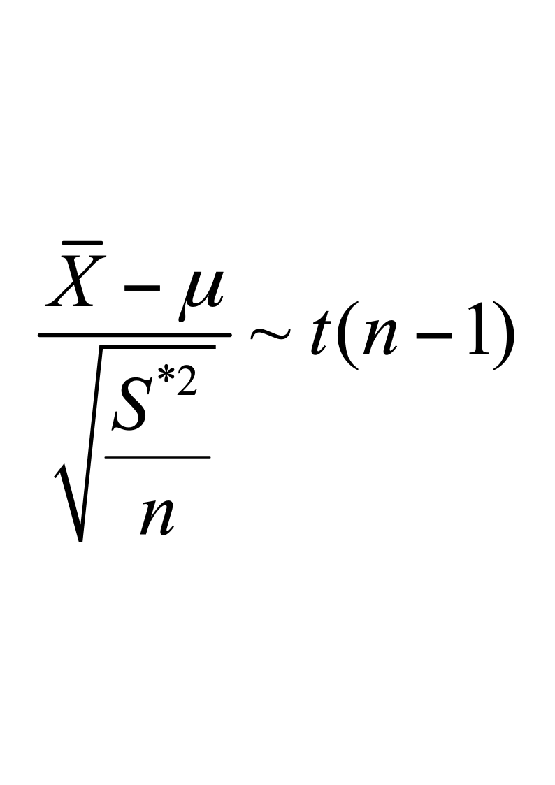，（2分）

$\delta(\bar{x})=\frac{S^{*}}{\sqrt{n}}t_{0.975}(35)=\frac{15}{6}\times2.0301=5.07525$ （2分）

学生成绩数学期望$\mu$的置信区间：（61.42,71.58）  （1分）

<!-- question: probability-theory-015-Q13 -->

（2）${H}_{0}:\mu =70, {H}_{1}:\mu \neq 70,$  （1分）

拒绝域：$A=\left\{\left|\frac{\bar{X}-70}{\sqrt{\frac{S^{*2}}{n}}}\right|t_{0.975}(35)\right\}$，$\left | {\frac {66.5-70} {\sqrt {\frac {{15}^{2}} {36}}}}\right |=1.4<{t}_{0.975}\left ( {35}\right )=2.0301$   （3分）

不拒绝原假设。可以认为这次考试的平均成绩为70分。 （1分）

**八、(12分)** 设总体$X$的密度函数是$f(x;\theta )=\frac {1} {2\theta }{e}^{-\frac {|x|} {\theta }}$，其中$\theta$>0是参数。样本${X}_{1},{X}_{2},...,{X}_{n}$来自总体$X$。

<!-- question: probability-theory-015-Q14 -->

（1）求$\theta$的最大似然估计$\hat{\Theta}_L$；

（2）证明$\hat{\Theta}_L$是$\theta$的无偏估计，且$\hat{\Theta}_L$是$\theta$的相合估计（一致估计）。

**解：**（1）似然函数：$L=\prod _{i=1} ^{n} \frac {1} {2\theta }{e}^{-\frac {|{x}_{i}|} {\theta }}$，$L=\frac {1} {{\left ( {2\theta }\right )}^{n}}{e}^{-\sum _{i=1} ^{n} \frac {|{x}_{i}|} {\theta }}$，（3分）$lnL=-nln(2\theta )-\frac {1} {\theta }\sum _{i=1} ^{n} \left | {{x}_{i}}\right |$  （1分）

$\frac {d} {d\theta }\left ( {lnL}\right )=-\frac {n} {\theta }+\frac {1} {{\theta }^{2}}\sum _{i=1} ^{n} \left | {{x}_{i}}\right |$，令$-\frac {n} {\hat {\theta }}+\frac {1} {{\hat {\theta }}^{2}}\sum _{i=1} ^{n} \left | {{x}_{i}}\right |=0$，（1分）

得

$\hat{\theta}_L=\frac{1}{n}\sum_{i=1}^{n}|X_i|$  （1分）

（2）$E\left | {X}\right |=\int \frac {1} {\theta }{xe}^{-\frac {x} {\theta }}dx=-\left ( {{xe}^{-\frac {x} {\theta }}}\right ){|}_{0}^{+\infty }+\int {e}^{-\frac {x} {\theta }}dx=-\left ( {{\theta e}^{-\frac {x} {\theta }}}\right ){|}_{0}^{+\infty }=\theta$ （2分）

$EX=\int \frac {1} {2\theta }{xe}^{-\frac {|x|} {\theta }}dx=0$，

$$
\begin {gathered} {EX}^{2}=\int \frac {1} {2\theta }{x}^{2}{e}^{-\frac {|x|} {\theta }}dx=\int \frac {1} {\theta }{x}^{2}{e}^{-\frac {x} {\theta }}dx \\ -\left ( {{x}^{2}{e}^{-\frac {x} {\theta }}}\right ){|}_{0}^{+\infty }+2\int {xe}^{-\frac {x} {\theta }}dx \\ -2\left ( {{x\theta e}^{-\frac {x} {\theta }}}\right ){|}_{0}^{+\infty }+2\theta \int {e}^{-\frac {x} {\theta }}dx=-2\left ( {{\theta }^{2}{e}^{-\frac {x} {\theta }}}\right ){|}_{0}^{+\infty }=2{\theta }^{2} \end {gathered}
$$

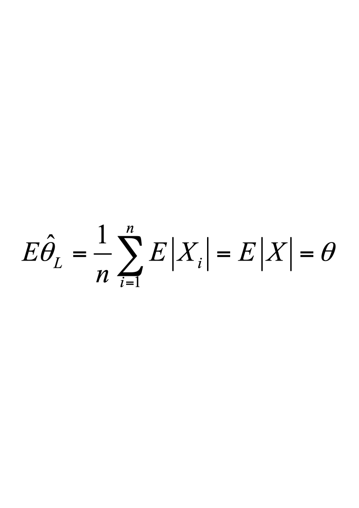，$\hat{\Theta}_L$是$\theta$的无偏估计，（1分）

$E{\left | {X}\right |}^{2}={EX}^{2}=2{\theta }^{2}$，

$D\left | {X}\right |={EX}^{2}-{\left ( {E\left | {X}\right |}\right )}^{2}=2{\theta }^{2}-{\theta }^{2}={\theta }^{2}$，$D\left ( {\frac {1} {n}\sum _{i=1} ^{n} \left | {{X}_{i}}\right |}\right )=\frac {D\left ( {\left | {X}\right |}\right )} {n}=\frac {{\theta }^{2}} {n}$

$P\left\{\left|\hat{\theta}_{L}-E\hat{\theta}_{L}\right|>\varepsilon\right\}\leq\frac{\theta^{2}}{n\varepsilon^{2}}\rightarrow0$，$\hat{\Theta}_L$是$\theta$的相合估计   （3分）
