# 2019试卷A

<!-- slide: 1 -->

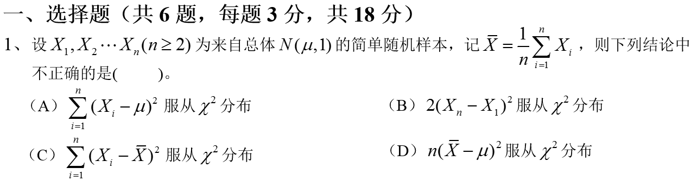
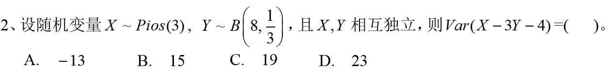
- 解：

<!-- slide: 2 -->

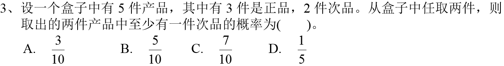
- 解：
- 解：
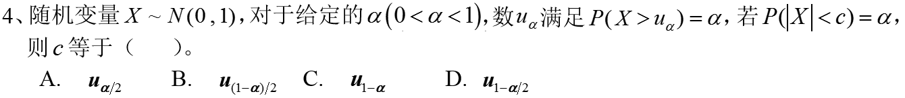

<!-- slide: 3 -->

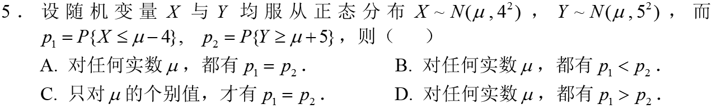
- 解：
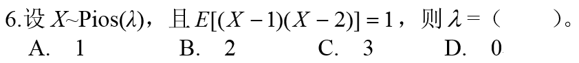
- 解：

<!-- slide: 4 -->

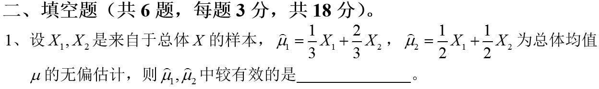
- 解：
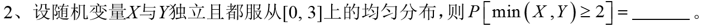
- 解：

<!-- slide: 5 -->

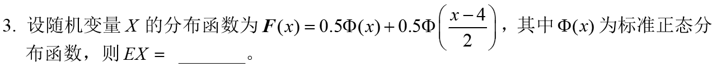
- 解：
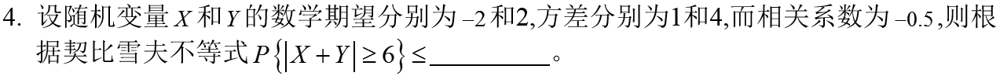
- 解：

<!-- slide: 6 -->

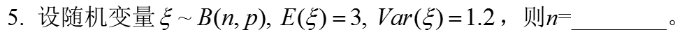
- 解：
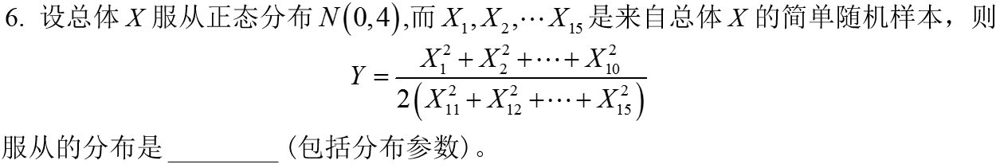
- 解：

<!-- slide: 7 -->

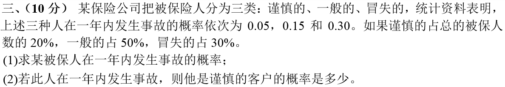
- 解：
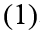
- 则由全概率公式知：
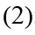

<!-- slide: 8 -->

- 解：
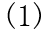
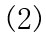
- 故可以认为这次考试的平均成绩为70分。
- 接受原假设，
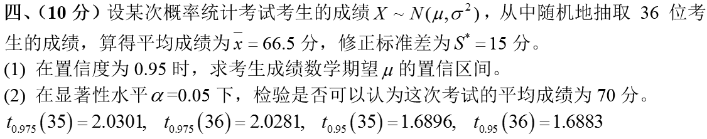

<!-- slide: 9 -->

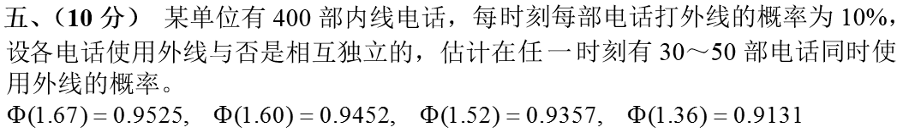
- 解：
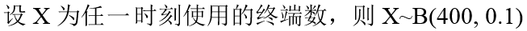
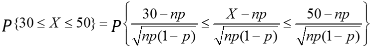
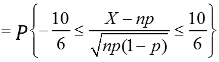
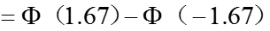
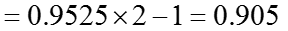
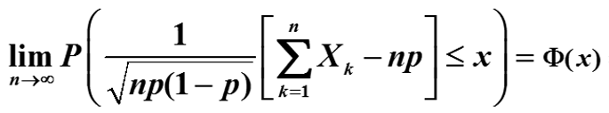
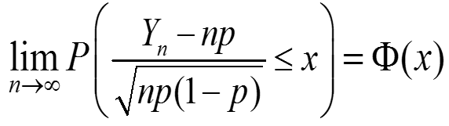

<!-- slide: 10 -->

- 解：
- 似然函数：
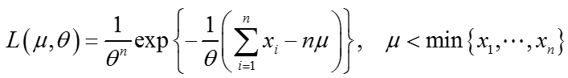
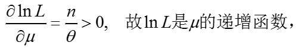
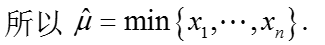
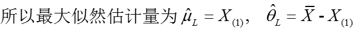
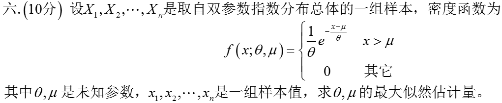

<!-- slide: 11 -->

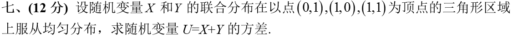
- 解：
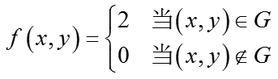
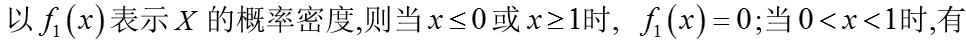
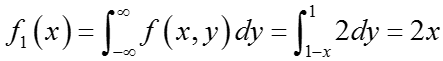
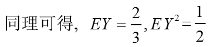
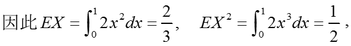
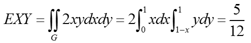

<!-- slide: 12 -->

- 解：

<!-- slide: 13 -->

- 解：

<!-- slide: 14 -->

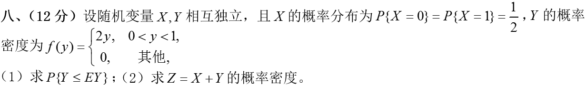
- 解：
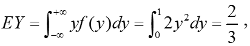
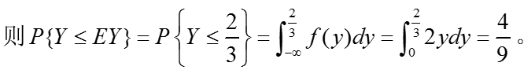
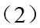
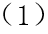
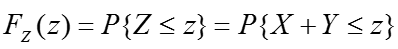
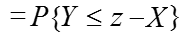
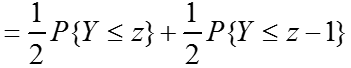
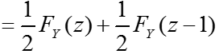
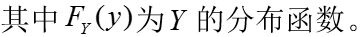
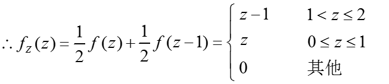
